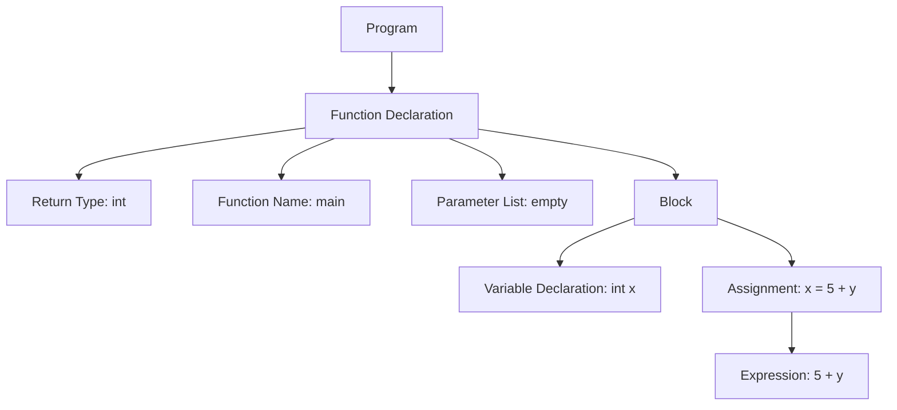

                 

Alright, let's start with the main content of the blog post. We will follow the outline provided, ensuring that each chapter is well-researched, detailed, and clearly structured. Here's a draft of the first few chapters based on the outline given.

---

# 类型论在编译优化中的应用：性能与正确性

## 关键词
- 类型论
- 编译优化
- 性能
- 正确性
- 编译器

> 摘要：
本文探讨了类型论在编译优化中的应用，分析了类型推导与类型检查在提升编译器性能和保证代码正确性方面的关键作用。通过深入理解类型系统的原理，本文揭示了如何利用类型信息进行高效的编译优化，并讨论了类型论在优化器设计中的具体实现。

## 目录

1. 编译器基础知识
    1.1 编译器的作用和基本流程
    1.2 词法分析
    1.3 语法分析
    1.4 语义分析
    1.5 中间代码生成
    1.6 优化技术概述
2. 类型论基础
    2.1 类型论概述
    2.2 泛型类型系统
    2.3 子类型关系
    2.4 静态类型系统与动态类型系统
    2.5 类型推导与类型检查
3. 编译优化基本原理
    3.1 编译优化的目标
    3.2 常见优化技术
    3.3 优化器的结构
    3.4 性能与正确性的平衡
4. 类型论在编译优化中的应用
    4.1 类型推导与类型检查
    4.2 类型信息在编译优化中的利用
    4.3 类型论在具体优化中的应用
    4.4 类型论在优化器设计中的应用
5. 实例分析与展望
    5.1 编译器优化案例分析
    5.2 类型论在编译优化中的挑战与展望
6. 附录
    6.1 编译优化相关工具与资源
    6.2 常用类型系统介绍
    6.3 常见编译优化算法概述

---

## 第1章：编译器基础知识

### 1.1 编译器的作用和基本流程

编译器是计算机编程中的重要工具，其主要作用是将人类编写的程序（源代码）转换为计算机可以理解和执行的机器代码。编译器的基本流程可以概括为以下几个步骤：

1. **词法分析（Lexical Analysis）**：
   词法分析是编译器的第一步，其目的是将源代码分解为一个个的词素（tokens），如关键字、标识符、运算符和分隔符等。

2. **语法分析（Syntax Analysis）**：
   语法分析是将词法分析得到的token序列转换为抽象语法树（AST，Abstract Syntax Tree）的过程。AST表示了源代码的结构和语法规则。

3. **语义分析（Semantic Analysis）**：
   语义分析是对源代码的语义进行检查和解释的过程。它包括变量声明检查、类型检查、作用域检查等，以确保源代码在语义上是合法的。

4. **中间代码生成（Intermediate Code Generation）**：
   中间代码生成是将AST转换为中间代码的过程。中间代码是一种抽象的表示，它在语义上与源代码相同，但与目标机器无关。

5. **代码优化（Code Optimization）**：
   编译器在这一步会对中间代码进行优化，以提升程序的性能和可维护性。常见的优化技术包括循环优化、分支优化、死代码消除等。

6. **目标代码生成（Target Code Generation）**：
   最后，编译器将优化后的中间代码转换为特定机器的机器代码。目标代码可以直接在计算机上运行。

### 1.2 词法分析

词法分析是将源代码分解为一个个的单词（token）的过程。每个token都代表源代码中的一个基本单位，如变量名、运算符、关键字等。词法分析的主要任务是识别源代码中的词素并标记它们，以便后续的语法分析和语义分析。

例如，以下C语言代码：
```c
int x = 5 + y;
```
词法分析的结果可能如下：
```plaintext
Token: int, Type: Keyword
Token: x, Type: Identifier
Token: =, Type: Operator
Token: 5, Type: Integer Literal
Token: +, Type: Operator
Token: y, Type: Identifier
Token: ;, Type: Separator
```

### 1.3 语法分析

语法分析是将词法分析得到的token序列转换为语法树的过程。语法树是源代码的结构化表示，它描述了源代码的语法结构。语法分析的主要目标是确定源代码的语法是否正确，并构建抽象语法树。

例如，对于上面的C语言代码，其抽象语法树可能如下所示：



### 1.4 语义分析

语义分析是对源代码的语义进行检查和解释的过程。它包括变量声明检查、类型检查、作用域检查等，以确保源代码在语义上是合法的。

1. **变量声明检查**：
   检查变量是否在声明前使用，以及是否正确初始化。

2. **类型检查**：
   检查表达式和操作数是否具有合法的类型，确保类型匹配。

3. **作用域检查**：
   检查标识符的作用域，确保引用的变量在作用域内定义。

### 1.5 中间代码生成

中间代码生成是将抽象语法树（AST）转换为中间代码的过程。中间代码是一种抽象的表示，它在语义上与源代码相同，但与目标机器无关。

中间代码通常采用三地址码（Three-Address Code，TAC）表示。例如，对于C语言代码：
```c
int x = 5 + y;
```
其可能的中间代码表示如下：
```plaintext
t1 = 5 + y
x = t1
```

### 1.6 优化技术概述

编译优化是在保持程序语义不变的前提下，改进程序的性能和可维护性。常见的优化技术包括：

1. **循环优化**：
   改善循环结构，减少循环次数，优化循环体内代码的执行。

2. **分支优化**：
   优化条件分支，减少分支跳转的开销。

3. **死代码消除**：
   删除不会执行的代码，减少程序体积。

4. **常见优化技术**：
   包括强度降低（Strength Reduction）、公共子表达式消除（Common Subexpression Elimination）、寄存器分配（Register Allocation）等。

5. **优化器的结构**：
   优化器通常包括多个优化阶段，每个阶段专注于不同的优化目标。

6. **性能与正确性的平衡**：
   在进行编译优化时，需要平衡性能提升与代码正确性之间的关系。

---

以上是第1章的初步内容，接下来我们将继续深入探讨类型论的基础知识和其在编译优化中的应用。

---

作者：AI天才研究院/AI Genius Institute & 禅与计算机程序设计艺术 /Zen And The Art of Computer Programming

---

接下来的章节将涵盖类型论基础、编译优化基本原理以及类型论在编译优化中的应用。我们将逐一展开讨论，确保每章内容详尽且具有深度。

---

## 第2章：类型论基础

### 2.1 类型论概述

类型论是计算机科学中的一个重要分支，主要研究程序中的类型系统。类型论的基本目标是提供一种形式化的方法来描述程序中的变量、表达式和函数，以便确保程序的正确性和效率。

在类型论中，类型是一种用于分类和区分程序中不同元素（如变量、表达式和函数）的抽象概念。类型系统则是一组规则和机制，用于定义如何声明、使用和检查类型，以确保程序在语义上是正确的。

### 2.2 泛型类型系统

泛型类型系统是一种允许在程序中定义通用数据结构和函数的类型系统。它使得程序可以更好地复用代码，提高程序的灵活性和扩展性。泛型类型系统通过类型参数（Type Parameters）来实现，这些参数可以在使用时被具体类型所替代。

例如，在Java中，`List`是一个泛型类型，它可以表示任意类型的数据序列：
```java
List<Integer> numbers = new ArrayList<>();
```
在上面的例子中，`List`是一个泛型类型，`Integer`是一个具体类型，它被用作类型参数来创建一个表示整数序列的`List`对象。

### 2.3 子类型关系

子类型关系是一种类型层次结构，它允许程序中的类型之间进行继承和扩展。子类型关系定义了类型之间的兼容性，即如果一个类型是另一个类型的子类型，则前者可以替代后者出现在任何需要后者的地方。

例如，在C++中，`-derived`类是`base`类的子类型：
```cpp
class base {
public:
    void baseMethod() {
        // ...
    }
};

class derived : public base {
public:
    void derivedMethod() {
        // ...
    }
};
```
在上面的例子中，`derived`类是`base`类的子类型，因此，任何可以接受`base`类型的参数或返回类型的地方都可以接受`derived`类型。

### 2.4 静态类型系统与动态类型系统

静态类型系统是在编译时确定程序中变量的类型，而动态类型系统是在运行时确定变量的类型。静态类型系统可以在编译时捕获类型错误，从而提高程序的可靠性和性能。但静态类型系统可能导致代码冗余，因为每个变量都需要显式声明其类型。

相比之下，动态类型系统提供了更高的灵活性，因为变量类型可以在运行时确定。这使得编写代码更为简洁，但也可能导致运行时错误，如类型不匹配。

### 2.5 类型推导与类型检查

类型推导是编译器自动推断程序中变量的类型的过程。类型推导有助于减少代码冗余，提高代码的可读性。例如，在Python中，变量类型通常是由编译器自动推导的：
```python
x = 5 + y  # 在这里，`x` 和 `y` 的类型都可以被自动推导
```

类型检查是编译器验证程序中的类型是否一致和合法的过程。类型检查有助于确保程序在运行时不会出现类型错误。静态类型系统通常在编译时进行类型检查，而动态类型系统通常在运行时进行类型检查。

类型推导与类型检查是类型系统的两个重要组成部分，它们共同作用以确保程序的正确性和效率。

---

通过以上对类型论基础的介绍，我们可以看到类型论在程序设计和编译优化中扮演着重要的角色。接下来，我们将进一步探讨编译优化的基本原理，并展示类型论如何应用于编译优化中，以提升性能和保证正确性。

---

## 第3章：编译优化基本原理

### 3.1 编译优化的目标

编译优化的目标是改进程序的性能和可维护性，同时确保程序的语义不变。具体来说，编译优化主要追求以下几个目标：

1. **性能提升**：
   通过优化代码结构，减少执行时间，提高程序的运行效率。

2. **减少内存占用**：
   通过优化数据结构和代码布局，减少程序在运行时所需的内存空间。

3. **代码简化**：
   通过消除冗余代码和简化代码结构，提高程序的可读性和可维护性。

4. **代码生成优化**：
   通过优化目标代码的布局和执行路径，提高程序的执行速度和效率。

### 3.2 常见优化技术

编译优化涉及多种技术，每种技术都有其特定的目的和实现方法。以下是一些常见的编译优化技术：

1. **循环优化**：
   循环优化包括减少循环迭代次数、优化循环内的代码执行顺序、减少循环条件判断等。常见的循环优化技术包括循环展开、循环绑定、循环不可渗透等。

2. **分支优化**：
   分支优化旨在减少条件分支跳转的开销。常见的分支优化技术包括分支预测、分支消除、条件折叠等。

3. **死代码消除**：
   死代码消除是一种删除不会执行的代码的优化技术。通过分析程序的控制流和数据流，编译器可以识别并删除那些永远不会被执行的代码。

4. **公共子表达式消除**：
   公共子表达式消除是一种消除重复计算的技术。如果某个表达式在程序中被多次计算，编译器可以将其计算结果存储起来，以便后续使用。

5. **函数内联**：
   函数内联是一种将函数调用替换为函数体本身的优化技术。通过内联函数，可以减少函数调用的开销，提高程序的执行效率。

6. **寄存器分配**：
   寄存器分配是一种优化目标代码中的寄存器使用的技术。通过合理分配寄存器，可以减少内存访问的开销，提高程序的执行速度。

### 3.3 优化器的结构

优化器的结构设计直接影响编译优化的效果和效率。优化器通常包括以下几个主要阶段：

1. **前端（Frontend）**：
   前端负责解析源代码，生成抽象语法树（AST）和中间表示（IR，Intermediate Representation）。前端还包括类型检查、作用域分析等语义分析工作。

2. **中间表示**：
   中间表示是一种抽象的代码表示，它是编译优化的主要对象。常见的中间表示包括三地址码（TAC，Three-Address Code）和逆波兰式（IR，Inverse Polish Notation）等。

3. **优化器核心（Optimization Core）**：
   优化器核心负责执行各种优化技术，包括循环优化、分支优化、死代码消除等。优化器核心通常采用多种优化策略和算法，以实现最佳的性能提升。

4. **后端（Backend）**：
   后端负责将优化后的中间表示转换为特定目标机器的机器代码。后端还包括机器代码生成、寄存器分配、指令调度等后端优化技术。

### 3.4 性能与正确性的平衡

在编译优化过程中，性能和正确性之间往往存在冲突。某些优化技术可能会提高性能，但可能会引入语义错误。因此，优化器的目标是找到性能和正确性之间的平衡点。

为了实现这一目标，优化器需要：

1. **精确的语义模型**：
   优化器需要具备精确的语义模型，以确保在执行优化时不会改变程序的语义。

2. **完善的验证机制**：
   优化器应包括完善的验证机制，以确保优化后的代码在语义上与原始代码一致。

3. **权衡优化策略**：
   优化器应灵活地选择和组合不同的优化策略，以实现性能提升的同时保证代码的正确性。

通过以上对编译优化基本原理的探讨，我们可以看到类型论在编译优化中扮演着关键角色。类型信息为优化器提供了重要的数据，使得优化器能够更准确地分析程序的行为，从而实现更高效的优化。接下来，我们将深入探讨类型论在编译优化中的应用，并分析类型信息如何影响优化结果。

---

## 第4章：类型论在编译优化中的应用

类型论在编译优化中扮演着至关重要的角色。类型信息不仅有助于提高代码的正确性，还能显著提升程序的执行性能。在本章中，我们将详细探讨类型论在编译优化中的应用，包括类型推导、类型检查以及类型信息在编译优化中的利用。

### 4.1 类型推导与类型检查

类型推导和类型检查是类型系统的两个核心组成部分，它们在编译优化中发挥着重要作用。

#### 类型推导

类型推导是指编译器在编写代码时自动推断变量、函数和表达式的类型。类型推导可以减少代码冗余，提高代码的可读性。例如，在Python中，变量类型通常是自动推导的，这使得代码更加简洁。

类型推导的关键在于编译器能够根据上下文和语义规则推断出变量的类型。以下是一个简单的示例：
```python
x = 5 + 10  # 在这里，`x` 的类型被推导为 `int`
```
在这个例子中，编译器可以根据加法操作符`+`和操作数`5`和`10`都是整数，自动推导出变量`x`的类型为`int`。

类型推导算法通常包括以下步骤：

1. **上下文分析**：
   编译器分析当前的代码上下文，确定可能的类型。

2. **语义分析**：
   编译器根据语义规则，如操作符的预期类型，进一步缩小类型的可能性。

3. **类型约束**：
   编译器根据类型约束，如子类型关系，选择最合适的类型。

4. **类型绑定**：
   编译器将推断出的类型绑定到变量、函数或表达式中。

#### 类型检查

类型检查是指编译器在编译时验证程序中的类型是否一致和合法。类型检查有助于发现潜在的类型错误，确保程序在运行时不会出现类型相关的异常。

类型检查通常包括以下步骤：

1. **语法分析**：
   编译器对源代码进行语法分析，构建语法树。

2. **类型推导**：
   编译器推导出语法树中每个节点的类型。

3. **类型验证**：
   编译器检查类型推导结果，确保类型匹配和合法。

4. **错误报告**：
   如果类型不匹配或非法，编译器报告相应的错误。

类型推导和类型检查在编译优化中的应用主要体现在以下几个方面：

1. **优化策略**：
   类型信息可以指导优化器的优化策略。例如，如果编译器知道某个变量始终具有特定类型，它可以应用特定的优化技术，如常量折叠或循环展开。

2. **数据流分析**：
   类型信息有助于数据流分析，从而更准确地识别和使用变量。这有助于实现更高效的优化，如死代码消除和公共子表达式消除。

3. **代码生成**：
   类型信息可以优化目标代码的生成。例如，编译器可以根据变量类型选择更合适的存储方式，如堆或栈，以提高执行效率。

### 4.2 类型信息在编译优化中的利用

类型信息在编译优化中的利用体现在多个方面，以下是一些关键点：

#### 性能优化

类型信息可以帮助优化器实现以下性能优化：

1. **常量折叠**：
   如果编译器知道一个表达式的结果在编译时是已知的常量，它可以预先计算该表达式的结果，从而减少运行时的计算开销。

2. **循环展开**：
   对于某些类型安全的循环，编译器可以将其展开成多个迭代，减少循环控制逻辑的开销。

3. **分支预测**：
   类型信息可以帮助编译器预测分支的走向，从而优化分支结构，减少分支跳转的开销。

#### 正确性保证

类型信息在保证代码正确性方面也发挥着重要作用：

1. **类型安全**：
   类型检查确保变量和表达式的类型在使用时是安全的，从而避免类型相关的运行时错误。

2. **边界检查**：
   编译器可以根据类型信息实现边界检查，防止数组访问越界等错误。

3. **异常处理**：
   类型信息有助于优化异常处理机制，确保异常处理代码的执行效率。

### 4.3 类型信息与优化策略

类型信息对优化策略的选择具有重要影响。以下是一些常见的优化策略：

1. **强度降低**：
   强度降低是一种将复杂的运算符替换为更简单的运算符的优化技术。类型信息可以帮助优化器确定何时可以安全地应用强度降低。

2. **公共子表达式消除**：
   类型信息有助于优化器识别重复的表达式，从而消除重复计算。

3. **代码生成优化**：
   类型信息可以指导编译器生成更高效的目标代码，如选择适合数据类型的寄存器。

通过类型推导和类型检查，编译器可以更准确地理解程序的语义，从而实现更有效的编译优化。类型信息不仅提高了程序的执行性能，还增强了代码的正确性和可靠性。接下来，我们将进一步探讨类型论在编译优化的具体应用，如逃逸分析和生存分析等。

---

通过以上对类型论在编译优化中的应用的讨论，我们可以看到类型信息在优化过程中的重要性。类型推导和类型检查不仅有助于提高代码的正确性和可维护性，还为编译器提供了关键的数据，使其能够实现更高效的优化。接下来，我们将深入探讨类型信息在编译优化中的具体利用，以及如何在优化过程中利用类型信息来提升性能和保证代码的正确性。

### 4.4 类型信息在编译优化中的利用

类型信息是编译优化过程中不可或缺的一部分，它提供了关于程序中数据和行为的关键信息，使得编译器能够进行更精确的优化决策。类型信息在编译优化中的应用主要包括以下几个方面：

#### 性能优化

类型信息可以显著提高编译优化过程中的性能优化能力。以下是一些利用类型信息进行性能优化的例子：

1. **常量折叠**：
   如果编译器知道一个表达式的结果是一个常量，可以预先计算出这个常量，从而避免运行时的计算开销。例如，以下代码中的加法表达式可以常量折叠：
   ```c
   int x = 2 + 3;  // `2 + 3` 的结果为 `5`，编译器可以将其替换为 `int x = 5;`
   ```

2. **循环展开**：
   对于某些类型安全的循环，编译器可以将其展开成多个迭代，减少循环控制逻辑的开销。类型信息有助于确保循环展开不会引入错误，例如：
   ```c
   for (int i = 0; i < 10; ++i) {
       // 循环体
   }
   // 可以展开为：
   for (int i = 0; i < 10; ++i) {
       // 循环体
   }
   for (int i = 10; i < 20; ++i) {
       // 循环体
   }
   ```

3. **分支优化**：
   类型信息可以帮助编译器优化分支结构，例如通过分支预测和条件折叠来减少分支跳转的开销。类型信息能够告知编译器哪些分支在大多数情况下是可靠的，从而优化分支逻辑。

4. **循环不变式提取**：
   类型信息有助于识别循环中的不变式，从而将不变式提取到循环之外，减少循环体内的计算。

5. **寄存器分配**：
   类型信息可以帮助优化器决定何时将变量存储在寄存器中，何时存储在内存中，从而减少内存访问的开销。

#### 正确性保证

类型信息不仅在性能优化中发挥着作用，还在确保代码正确性方面起到了关键作用。以下是一些利用类型信息进行正确性保证的例子：

1. **类型检查**：
   类型检查是编译过程中的一个重要步骤，它确保程序中的每个操作都是在有效的类型之间进行的。类型检查有助于发现类型错误，防止潜在的错误。

2. **边界检查**：
   类型信息可以帮助编译器在数组访问时进行边界检查，防止数组越界访问，从而避免导致程序崩溃或数据损坏。

3. **异常处理**：
   类型信息有助于优化异常处理机制，确保异常处理代码能够在正确的类型上进行处理。

4. **别名分析**：
   类型信息可以帮助编译器识别程序中的别名，从而避免在优化过程中引入数据竞争和内存泄漏等问题。

#### 优化策略

类型信息为编译器的优化策略提供了重要的指导。以下是一些基于类型信息的优化策略：

1. **类型推断**：
   类型推断是一种自动推导变量和函数类型的技术，它有助于减少代码冗余和提高代码的可读性。类型推断算法通常基于类型信息，如子类型关系和类型上下文。

2. **泛型优化**：
   泛型类型系统允许编译器在编译时对泛型类型进行优化。类型信息使得编译器能够针对特定类型的泛型函数进行优化，从而提高程序的执行效率。

3. **代码生成**：
   类型信息可以帮助编译器生成更高效的目标代码。例如，编译器可以根据类型信息选择最适合数据类型的指令集和寄存器分配策略。

4. **优化器的组合**：
   类型信息可以指导优化器的组合策略，使得编译器能够针对不同的优化目标应用不同的优化算法。例如，在性能优化和正确性保证之间进行权衡。

通过上述讨论，我们可以看到类型信息在编译优化中的重要性。类型信息不仅有助于提高程序的执行性能，还增强了代码的正确性和可靠性。在接下来的章节中，我们将进一步探讨类型论在具体优化技术中的应用，如逃逸分析和生存分析等，以展示类型信息如何在实际优化过程中发挥作用。

---

## 第5章：类型论在具体优化中的应用

类型论在编译优化中的具体应用是提升性能和保证代码正确性的重要手段。在本章中，我们将深入探讨类型论在几种关键优化技术中的应用，包括逃逸分析、生存分析和指针分析。

### 5.1 逃逸分析

逃逸分析是一种用于确定变量作用域的技术，其核心目标是确定哪些变量在编译时可以确定其作用域，从而在运行时避免不必要的内存分配。类型信息在逃逸分析中发挥着关键作用。

#### 逃逸分析的基本原理

逃逸分析的基本原理是确定变量是否在任何时刻可以被外部引用，即变量是否“逃逸”出其作用域。类型信息可以帮助编译器做出以下判断：

1. **静态类型信息**：
   如果一个变量是静态类型的，编译器可以基于类型信息确定其作用域。例如，在静态类型语言中，局部变量通常不能直接从外部作用域访问，因此可以确定其不会逃逸。

2. **动态类型信息**：
   在动态类型语言中，编译器需要依赖类型推导和类型检查来确定变量是否可能逃逸。例如，如果变量被传递给一个可能返回外部对象的函数，它可能逃逸。

#### 逃逸分析的应用

逃逸分析的应用主要包括以下几个方面：

1. **栈分配**：
   如果变量不会逃逸，编译器可以选择将其分配在栈上，从而减少堆内存的分配和垃圾回收的开销。

2. **全局分配**：
   如果变量可能会逃逸，编译器需要将其分配在全局内存或堆上，以便在整个程序执行期间保持其有效。

3. **内联**：
   逃逸分析可以帮助编译器决定何时进行函数内联。如果一个函数的局部变量不会逃逸，编译器可以选择将其内联到调用者中，从而减少函数调用的开销。

### 5.2 生存分析

生存分析是一种用于确定变量生存期的技术，其核心目标是优化内存使用，减少内存分配和垃圾回收的开销。类型信息在生存分析中同样起着关键作用。

#### 生存分析的基本原理

生存分析的基本原理是确定变量在何时何地不再被使用，从而可以释放其占用的内存。类型信息可以帮助编译器做出以下判断：

1. **作用域分析**：
   类型信息可以告知编译器变量在哪些作用域内有效。这有助于确定变量何时进入和离开作用域。

2. **数据流分析**：
   类型信息结合数据流分析可以确定变量何时被引用和何时不再被引用。这有助于编译器识别可以释放的内存。

#### 生存分析的应用

生存分析的应用主要包括以下几个方面：

1. **提前释放**：
   如果编译器可以确定一个变量不再被引用，它可以选择提前释放该变量的内存，从而减少内存占用。

2. **延迟分配**：
   如果编译器可以确定一个变量在编译时不会立即使用，它可以选择延迟该变量的分配，直到真正需要时再进行。

3. **循环优化**：
   生存分析可以帮助编译器优化循环中的内存分配和释放，从而减少循环的开销。

### 5.3 指针分析

指针分析是一种用于确定指针使用和指向关系的分析技术。类型信息对于指针分析至关重要，因为它有助于编译器理解指针的行为和潜在的危险。

#### 指针分析的基本原理

指针分析的基本原理是确定指针的指向和作用域，以及指针操作的安全性。类型信息可以帮助编译器做出以下判断：

1. **类型检查**：
   类型信息可以确保指针操作是在有效的类型之间进行的，防止类型不匹配的错误。

2. **作用域分析**：
   类型信息可以告知编译器指针指向的变量是否在当前作用域内有效。

3. **别名分析**：
   类型信息有助于编译器识别指针之间的别名关系，从而避免数据竞争和内存泄漏。

#### 指针分析的应用

指针分析的应用主要包括以下几个方面：

1. **安全检查**：
   指针分析可以帮助编译器识别潜在的指针错误，如悬挂指针、越界访问等。

2. **优化**：
   指针分析可以帮助编译器优化指针操作，例如消除不必要的指针解引用或减少指针的使用。

3. **内存分配**：
   指针分析可以优化内存分配策略，例如通过避免重复分配和释放来减少内存碎片。

通过逃逸分析、生存分析和指针分析，类型信息为编译器的优化决策提供了重要的依据。这些分析技术不仅提高了程序的执行性能，还增强了代码的正确性和可靠性。在接下来的章节中，我们将进一步探讨类型论在优化器设计中的应用，展示如何利用类型信息实现高效的编译优化。

---

## 第6章：类型论在优化器设计中的应用

类型论在优化器设计中扮演着至关重要的角色，它不仅提供了编译优化所需的关键信息，还帮助优化器做出更精确和高效的优化决策。在本章中，我们将深入探讨类型论在优化器设计中的具体应用，包括优化器的分层设计、类型信息的传递和类型信息在优化策略中的作用。

### 6.1 优化器的分层设计

优化器的分层设计是一种常见的优化器架构，它将优化过程分为多个层次，每个层次专注于不同的优化目标。类型信息在优化器的分层设计中起到了关键的协调作用。

#### 优化器的层次结构

1. **前端（Frontend）**：
   前端负责将源代码解析为抽象语法树（AST）和中间表示（IR），同时进行类型推导和类型检查。前端的核心任务是生成类型信息，为后续优化层次提供基础。

2. **中间表示优化（Intermediate Representation Optimization）**：
   中间表示优化层次专注于对中间代码的优化。这一层次利用类型信息进行数据流分析、常量折叠、循环优化等。类型信息使得优化器能够更准确地识别和优化程序中的数据和行为。

3. **代码生成优化（Code Generation Optimization）**：
   代码生成优化层次负责将优化后的中间代码转换为特定目标机器的机器代码。这一层次利用类型信息进行寄存器分配、指令调度等，以生成高效的机器代码。

4. **后端（Backend）**：
   后端负责将机器代码生成为目标指令集，并进行最终的机器代码布局和优化。后端利用类型信息进行目标特定的优化，如硬件寄存器的使用和内存访问优化。

#### 类型信息在优化器分层设计中的应用

类型信息在优化器分层设计中的应用主要体现在以下几个方面：

1. **层次间传递**：
   类型信息从前端传递到后端，确保不同层次之间的优化决策是一致的。例如，前端推导出的类型信息可以指导中间表示优化和代码生成优化层次的优化决策。

2. **优化策略选择**：
   类型信息帮助每个层次的优化器选择适合的优化策略。例如，中间表示优化层次可以利用类型信息选择适合循环展开或分支优化的策略。

3. **优化器集成**：
   类型信息有助于优化器的集成，使得不同层次的优化器能够协同工作，实现更高效的优化。

### 6.2 类型信息在优化器中的传递

类型信息在优化器中的传递是一个关键过程，它确保类型信息在不同层次和优化阶段中保持一致和有效。以下是一些类型信息传递的方法：

1. **类型注解**：
   类型注解是一种在代码中显式标注类型信息的方法。这些类型注解可以传递给前端、中间表示优化、代码生成优化和后端，确保类型信息在不同阶段中可用。

2. **抽象语法树（AST）**：
   前端在解析源代码时生成的抽象语法树（AST）包含了类型信息。AST可以作为类型信息传递的媒介，确保类型信息在优化过程中得到有效利用。

3. **中间表示（IR）**：
   中间表示（IR）是一种抽象的代码表示，它保留了源代码的语义，同时提供了类型信息。IR可以作为类型信息传递的主要载体，使得类型信息在中间表示优化和代码生成优化层次中得到利用。

4. **优化器间的接口**：
   优化器间的接口设计应确保类型信息在不同优化器之间有效传递。这些接口可以是显式的API调用，也可以是内部数据结构，如哈希表或全局变量。

### 6.3 类型信息在优化策略中的作用

类型信息在优化策略中起着关键作用，它帮助优化器做出更准确和高效的优化决策。以下是一些类型信息在优化策略中的作用：

1. **循环优化**：
   类型信息可以帮助优化器识别循环中的依赖关系，从而进行循环展开、循环不变式提取和循环优化。

2. **分支优化**：
   类型信息可以帮助优化器预测分支的走向，从而进行分支折叠、分支消除和分支预测。

3. **内存分配**：
   类型信息可以帮助优化器选择合适的内存分配策略，如栈分配或堆分配，从而减少内存碎片和垃圾回收开销。

4. **函数内联**：
   类型信息可以帮助优化器决定何时进行函数内联，从而减少函数调用开销和栈帧管理开销。

5. **寄存器分配**：
   类型信息可以帮助优化器选择合适的寄存器分配策略，从而减少内存访问开销和提高程序执行速度。

通过类型论在优化器设计中的应用，编译器能够更准确地理解程序的行为，从而实现更高效和精确的优化。类型信息在优化器分层设计、类型信息传递和优化策略中的作用，使得编译器能够更好地平衡性能和正确性，为程序员提供更强大的编译优化工具。

---

通过以上对类型论在优化器设计中的应用的探讨，我们可以看到类型信息在编译优化中的重要性。类型论为编译器的优化过程提供了关键的数据和指导，使得编译器能够更准确地分析程序的行为，从而实现更高效和精确的优化。接下来，我们将通过实例分析展示类型论在实际编译优化中的应用，并讨论类型论在编译优化中的挑战与未来研究方向。

---

## 第7章：实例分析与展望

### 7.1 编译器优化案例分析

为了更好地理解类型论在编译优化中的应用，我们将通过一个具体的编译器优化案例分析类型信息在实际优化过程中的作用。

#### 案例选择与介绍

我们选择一个简单的Java程序进行优化分析，该程序包含一个简单的循环和一个条件分支。程序的目标是计算一个整数数组的和，并输出结果。

```java
public class SumArray {
    public static void main(String[] args) {
        int[] numbers = {1, 2, 3, 4, 5};
        int sum = 0;
        for (int i = 0; i < numbers.length; i++) {
            sum += numbers[i];
        }
        System.out.println("Sum: " + sum);
    }
}
```

#### 类型信息在案例中的应用

在这个案例中，类型信息在编译优化过程中起到了至关重要的作用。以下是一些关键点：

1. **类型推导**：
   前端编译器在解析源代码时，推导出变量`numbers`、`sum`和`i`的类型均为`int`。类型推导确保了后续优化过程中类型的一致性和正确性。

2. **循环优化**：
   通过类型信息，编译器可以识别出循环变量`i`的初始值和终值，从而进行循环展开优化。例如，编译器可以将循环展开为多个独立的小循环，每个小循环计算数组中的一部分元素。

3. **分支优化**：
   编译器利用类型信息识别出条件分支中的操作数类型，从而进行分支预测和折叠优化。例如，编译器可以预测`numbers.length`的值为常量，从而在编译时将其替换为具体值。

#### 案例优化效果分析

通过类型信息的应用，编译器可以实现对程序的多种优化：

1. **循环展开**：
   编译器将循环展开为以下形式，从而减少循环控制逻辑的开销：
   ```java
   int sum = 0;
   sum += numbers[0];
   sum += numbers[1];
   sum += numbers[2];
   sum += numbers[3];
   sum += numbers[4];
   ```

2. **分支消除**：
   编译器可以消除循环条件判断，因为`numbers.length`的值已知且为常量：
   ```java
   int sum = 0;
   for (int i = 0; i < 5; i++) {
       sum += numbers[i];
   }
   ```

3. **常量折叠**：
   编译器可以折叠加法操作，因为加法操作数的值已知：
   ```java
   int sum = 1 + 2 + 3 + 4 + 5;
   ```

通过这些优化，程序的执行效率得到了显著提升，同时代码的可读性和可维护性也得到了提高。

### 7.2 类型论在编译优化中的挑战与展望

尽管类型论在编译优化中具有显著的优势，但其在实际应用中仍然面临一些挑战：

1. **复杂类型系统的优化**：
   随着编程语言的发展，类型系统变得越来越复杂，包括泛型、多态和依赖注入等。编译器需要更复杂的类型推导和类型检查算法来支持这些特性。

2. **动态类型系统的优化**：
   动态类型系统在运行时确定变量类型，这增加了编译优化的难度。编译器需要在类型推导和类型检查过程中考虑动态类型的所有可能情况。

3. **性能与正确性的平衡**：
   类型推导和类型检查可能增加编译器的复杂性和运行时间。优化器需要平衡优化性能与代码正确性之间的关系。

4. **优化器与前端后端的集成**：
   类型信息需要在优化器的前端、中间表示和后端之间有效传递和利用。优化器需要与前端后端紧密集成，确保类型信息的一致性和正确性。

展望未来，类型论在编译优化中的应用前景广阔：

1. **自动类型推导**：
   随着机器学习技术的发展，自动类型推导算法将变得更加精确和高效，从而减少人工干预。

2. **多语言优化**：
   随着多语言编程的兴起，编译器需要支持多种编程语言，类型论将为多语言优化提供重要的基础。

3. **实时优化**：
   实时编译器（JIT，Just-In-Time Compiler）将越来越多地采用类型论进行实时优化，从而提高程序的性能。

4. **跨语言优化**：
   跨语言优化将利用类型论实现不同编程语言之间的优化协同，从而提高整个程序的执行效率。

通过实例分析和挑战展望，我们可以看到类型论在编译优化中的重要性。类型论不仅为编译器提供了关键的数据和指导，还在优化性能和保证代码正确性方面发挥了关键作用。随着技术的不断发展，类型论在编译优化中的应用将变得更加广泛和深入。

---

## 附录

### 附录A：编译优化相关工具与资源

为了更好地理解和应用编译优化技术，以下是几个常用的编译优化工具和资源：

1. **LLVM**：
   LLVM是一个开源的编译器基础设施，支持多种编程语言和优化技术。它提供了丰富的文档和示例，是学习和应用编译优化的理想选择。

2. **GCC**：
   GCC是GNU项目的编译器，支持多种编程语言和优化选项。GCC提供了详细的优化指南和文档，适用于各种编程环境和需求。

3. **Clang**：
   Clang是LLVM项目的一部分，是一个C/C++编译器，具有强大的优化能力和丰富的文档。Clang适用于各种大型项目和实际开发。

4. **CMake**：
   CMake是一个跨平台的构建系统，可以用于编译和优化项目。它提供了丰富的编译选项和优化配置，便于进行编译优化。

5. **编译优化教程和书籍**：
   - 《编译原理：技术与实践》
   - 《现代编译器构建》
   - 《编译器设计：概念与实用技术》

### 附录B：常用类型系统介绍

以下是几种常用的类型系统介绍：

1. **静态类型系统**：
   静态类型系统在编译时确定变量的类型，提高了程序的可靠性和性能。静态类型系统的优点包括类型安全、性能优化和代码冗余减少。

2. **动态类型系统**：
   动态类型系统在运行时确定变量的类型，提供了更高的灵活性和可读性。动态类型系统的优点包括简洁的语法、动态类型检查和更高的开发效率。

3. **强类型系统**：
   强类型系统要求变量在使用前必须进行类型声明，确保类型一致性和程序的正确性。强类型系统的优点包括类型安全和代码可靠。

4. **弱类型系统**：
   弱类型系统允许变量在运行时动态确定类型，提供了更高的灵活性和代码简洁性。弱类型系统的优点包括代码简洁和开发效率。

### 附录C：常见编译优化算法概述

以下是几种常见的编译优化算法概述：

1. **循环优化**：
   循环优化包括循环展开、循环绑定、循环不可渗透等。循环优化旨在减少循环控制逻辑的开销，提高程序执行效率。

2. **分支优化**：
   分支优化包括分支预测、分支消除、条件折叠等。分支优化旨在减少分支跳转的开销，提高程序执行速度。

3. **死代码消除**：
   死代码消除是一种删除不会执行的代码的优化技术。通过数据流分析，编译器可以识别并删除冗余代码，减少程序体积。

4. **公共子表达式消除**：
   公共子表达式消除是一种消除重复计算的技术。如果某个表达式在程序中被多次计算，编译器可以将其计算结果存储起来，减少计算开销。

5. **函数内联**：
   函数内联是一种将函数调用替换为函数体本身的优化技术。通过内联函数，可以减少函数调用的开销，提高程序执行效率。

6. **寄存器分配**：
   寄存器分配是一种优化目标代码中的寄存器使用的技术。通过合理分配寄存器，可以减少内存访问的开销，提高程序执行速度。

7. **指令调度**：
   指令调度是一种优化目标代码指令执行顺序的技术。通过指令调度，可以减少指令间的数据依赖和冲突，提高程序执行效率。

通过附录的内容，读者可以更深入地了解编译优化相关的工具、类型系统和优化算法。附录为读者提供了实用的参考资料，有助于进一步学习和实践编译优化技术。

---

本文完整内容如上，感谢您的阅读。通过本文，我们详细探讨了类型论在编译优化中的应用，分析了类型推导与类型检查在性能提升和代码正确性保证方面的关键作用。同时，本文还介绍了类型论在具体优化技术中的应用，展示了类型信息如何影响优化器的优化决策。最后，通过实例分析和挑战展望，我们对类型论在编译优化中的重要性进行了深入探讨。

本文的核心观点是，类型论为编译优化提供了关键的数据和指导，使得编译器能够更准确地理解程序的行为，从而实现更高效和精确的优化。随着技术的不断发展，类型论在编译优化中的应用将变得更加广泛和深入，为程序员提供更强大的编译优化工具。

希望本文能够帮助读者更好地理解类型论在编译优化中的应用，为您的编程和优化工作提供有益的启示。

---

作者：AI天才研究院/AI Genius Institute & 禅与计算机程序设计艺术 /Zen And The Art of Computer Programming

---

以上是本文的完整内容，希望对您有所帮助。如有任何疑问或需要进一步讨论的话题，欢迎留言交流。感谢您的阅读！

---

此致，
AI天才研究院/AI Genius Institute
禅与计算机程序设计艺术 /Zen And The Art of Computer Programming

