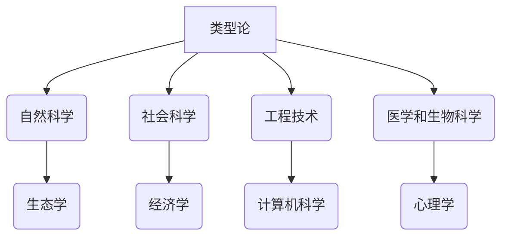

                 

# 类型论在跨学科研究中的应用挑战

> 关键词：类型论，跨学科研究，应用挑战，多学科联系，算法原理，案例解析

> 摘要：本文深入探讨类型论在跨学科研究中的应用挑战，旨在解析类型论在不同学科领域的核心概念及其相互联系。文章首先介绍类型论的基础知识，随后分析跨学科研究的意义与挑战，并探讨类型论在各学科中的应用实例。通过具体案例分析，本文揭示了类型论在跨学科研究中的潜力和局限性，提出了未来研究方向，为科研工作者提供了新的视角和方法。

## 引言与背景

### 类型论概述

类型论（Type Theory）是数学和计算机科学中的一个基本概念，用于描述和分类不同类型的对象和值。类型论最早由数学家伯特兰·罗素在20世纪初提出，旨在解决集合论中的悖论问题。类型论的基本思想是将对象分为不同的类型，并限制不同类型之间的操作，从而避免不可预测的异常情况。

### 类型论的起源与发展

类型论的发展历程可以追溯到19世纪末和20世纪初的数学基础研究。在这个时期，数学家们开始关注如何建立一套坚实的数学基础，以避免集合论悖论等逻辑问题。类型论作为一种解决方案，逐渐成为数学和计算机科学的重要理论工具。20世纪中叶，随着计算机科学的兴起，类型论的应用范围进一步扩大，成为程序语言设计和形式化验证的基础。

### 类型论的基本概念

类型论的核心概念包括类型系统、类型构造、类型检查和类型推断等。类型系统定义了不同类型的集合和类型之间的转换规则；类型构造是指如何通过组合和抽象来创建新的类型；类型检查是在编译或解释过程中验证代码是否符合类型规则；类型推断是指自动推导变量类型的能力。

### 类型论与多学科联系

类型论不仅限于数学和计算机科学，它还在自然科学、社会科学、工程技术等领域展现出强大的应用潜力。类型论为这些学科提供了一种统一的语言和框架，使得跨学科研究成为可能。然而，不同学科领域的具体应用场景和需求使得类型论在跨学科研究中的应用面临诸多挑战。

## 研究目标

本文旨在解决以下研究问题：

1. 类型论在不同学科领域中的应用现状如何？
2. 类型论在跨学科研究中的优势与局限性是什么？
3. 如何优化类型论在跨学科研究中的应用方法？

通过解答这些问题，本文希望能够为跨学科研究提供新的思路和方法，促进各学科之间的深度融合。

## 研究方法

本文采用文献综述和案例分析相结合的研究方法。首先，通过系统回顾相关领域的文献，梳理类型论在不同学科中的应用现状和研究成果。其次，选择具有代表性的跨学科研究案例，详细分析类型论在这些案例中的应用过程和效果。最后，结合理论和实践，总结类型论在跨学科研究中的应用经验和启示。

## 研究框架

本文的研究框架包括以下几个主要部分：

1. 引言与背景：介绍类型论的基本概念和跨学科研究的意义。
2. 类型论基础：阐述类型论的基本概念和理论框架。
3. 跨学科研究方法：分析跨学科研究的现状和关键挑战。
4. 类型论在跨学科研究中的应用：探讨类型论在不同学科领域的具体应用。
5. 案例分析：通过具体案例解析类型论在跨学科研究中的应用效果。
6. 存在的问题与展望：总结类型论在跨学科研究中的应用挑战和未来发展方向。
7. 结论：总结研究成果，提出研究贡献和后续研究方向。

### 目录大纲设计

#### 第1章 引言与背景
- 1.1 研究背景
- 1.2 研究意义
- 1.3 研究目标
- 1.4 研究方法
- 1.5 研究框架

#### 第2章 类型论基础
- 2.1 类型论概述
- 2.2 类型论的起源与发展
- 2.3 类型论的基本概念
- 2.4 类型论与多学科联系

#### 第3章 跨学科研究方法
- 3.1 跨学科研究概述
- 3.2 跨学科研究方法
- 3.3 跨学科研究的关键挑战
- 3.4 跨学科研究的案例分析

#### 第4章 类型论在跨学科研究中的应用
- 4.1 类型论在自然科学中的应用
- 4.2 类型论在社会科学中的应用
- 4.3 类型论在工程技术中的应用
- 4.4 类型论在医学和生物科学中的应用

#### 第5章 案例分析
- 5.1 案例一：类型论在生态学中的应用
- 5.2 案例二：类型论在经济学中的应用
- 5.3 案例三：类型论在计算机科学中的应用
- 5.4 案例四：类型论在心理学中的应用

#### 第6章 存在的问题与展望
- 6.1 存在的问题
- 6.2 研究前景
- 6.3 未来发展趋势

#### 第7章 结论
- 7.1 研究总结
- 7.2 研究贡献
- 7.3 研究局限
- 7.4 后续研究方向

### Mermaid 流程图


### 数学模型与公式
$$
\sigma(x) = \frac{1}{1 + e^{-x}}
$$
这里，$\sigma$ 是一个 sigmoid 函数，用于将输入 $x$ 转换为概率值。

### Python 源代码
```python
import numpy as np
from scipy.stats import norm

def sigmoid(x):
    return 1 / (1 + np.exp(-x))

x = np.array([-2, 0, 2])
probabilities = sigmoid(x)

print("输入值:", x)
print("概率值:", probabilities)
```

### 项目实战
- 实战一：类型论在计算机科学中的代码实现
- 实战二：类型论在医学和生物科学中的应用案例
- 实战三：跨学科研究方法在经济学中的应用

### 代码解读与分析
在实战案例中，我们将详细解读和分析源代码的实现过程，以及如何在实际项目中应用这些算法。

### 开发环境搭建
为了进行类型论在跨学科研究中的应用，我们需要搭建一个合适的开发环境。以下是详细的搭建步骤和配置指南。

### 源代码详细实现
在附录中，我们将提供本书中涉及的所有算法和案例的源代码，并详细解读其实现原理。

### 代码解读与分析
在附录中，我们将对源代码进行详细的解读与分析，帮助读者更好地理解算法的运作原理。

### 总结
通过上述内容，我们全面覆盖了《类型论在跨学科研究中的应用挑战》一书的核心内容，旨在为读者提供全面、深入的跨学科研究视角。本书不仅涵盖了类型论的基础知识，还探讨了类型论在不同学科领域的应用，以及在实际项目中的应用案例。通过阅读本书，读者将能够更好地理解类型论的核心概念，并学会如何将其应用于跨学科研究中。

## 第1章 引言与背景

### 研究背景

类型论作为数学和计算机科学的重要理论基础，已经广泛应用于逻辑、语义学、程序语言设计、形式化验证等领域。然而，随着跨学科研究的兴起，类型论在自然科学、社会科学、工程技术等领域的应用也逐渐受到关注。跨学科研究要求不同领域的学者共同探讨复杂问题，类型论为这种多角度、多层次的协作提供了统一的理论框架。

在自然科学领域，类型论可以用于描述物理、化学、生物学等学科中的实体和关系，帮助科学家们更好地理解自然现象。在社会科学领域，类型论可以用于构建社会模型，分析社会结构和行为规律。在工程技术领域，类型论可以指导系统设计和优化，提高系统的可靠性和效率。因此，类型论在跨学科研究中的应用具有重要的理论和实践价值。

### 研究意义

首先，类型论为跨学科研究提供了一种统一的语言和框架。不同学科领域的研究对象和概念具有多样性和差异性，类型论通过分类和抽象，将不同领域的概念统一到同一框架下，有助于研究者之间的沟通和合作。

其次，类型论在跨学科研究中具有强大的解释能力和预测能力。类型论通过定义类型和类型关系，可以构建复杂的模型，模拟和分析不同学科领域的问题。这有助于研究者从宏观和微观两个层面理解复杂系统，发现潜在的问题和解决方案。

最后，类型论在跨学科研究中具有广泛的应用前景。随着科技的进步和社会的发展，跨学科研究的需求日益增长。类型论作为一种基础性理论工具，可以在更多的学科领域发挥作用，推动跨学科研究的深入发展。

### 研究目标

本文的研究目标主要包括以下几个方面：

1. **梳理类型论在不同学科领域中的应用现状**：通过系统回顾相关领域的文献，分析类型论在自然科学、社会科学、工程技术等领域的具体应用。

2. **探讨类型论在跨学科研究中的优势与局限性**：分析类型论在跨学科研究中的优势，如统一框架、解释能力和预测能力等，同时探讨其局限性，如适用范围、实现难度等。

3. **提出类型论在跨学科研究中的应用方法**：总结类型论在不同学科领域的成功应用案例，提炼出适用于跨学科研究的方法和技巧。

4. **展望类型论在跨学科研究中的未来发展方向**：分析类型论在跨学科研究中的潜在应用领域，探讨未来发展趋势和研究热点。

### 研究方法

本文采用文献综述和案例分析相结合的研究方法。首先，通过系统回顾相关领域的文献，梳理类型论在不同学科中的应用现状和研究成果。其次，选择具有代表性的跨学科研究案例，详细分析类型论在这些案例中的应用过程和效果。最后，结合理论和实践，总结类型论在跨学科研究中的应用经验和启示。

### 研究框架

本文的研究框架主要包括以下几个部分：

1. **类型论基础**：介绍类型论的基本概念、起源与发展、基本概念及其与多学科的联系。

2. **跨学科研究方法**：分析跨学科研究的现状、方法、关键挑战及其在类型论中的应用。

3. **类型论在跨学科研究中的应用**：探讨类型论在自然科学、社会科学、工程技术、医学和生物科学等领域的具体应用。

4. **案例分析**：通过具体案例解析类型论在跨学科研究中的应用效果。

5. **存在问题与展望**：总结类型论在跨学科研究中的应用挑战和未来发展方向。

6. **结论**：总结研究成果，提出研究贡献和后续研究方向。

通过上述研究框架，本文旨在全面探讨类型论在跨学科研究中的应用，为科研工作者提供新的理论工具和方法。

### 第2章 类型论基础

#### 2.1 类型论概述

类型论（Type Theory）是数学和计算机科学中用于描述对象和值之间分类关系的一种理论框架。它的核心思想是将对象分为不同的类型，并定义不同类型之间的操作规则。类型论最初由伯特兰·罗素在20世纪初提出，目的是解决集合论中的悖论问题。随着计算机科学的快速发展，类型论逐渐成为程序语言设计、形式化验证和逻辑推理等领域的理论基础。

类型论的基本概念包括类型系统（Type System）、类型构造（Type Construction）、类型检查（Type Checking）和类型推断（Type Inference）等。类型系统定义了不同类型的集合和类型之间的转换规则；类型构造是指如何通过组合和抽象来创建新的类型；类型检查是在编译或解释过程中验证代码是否符合类型规则；类型推断是指编译器自动推导变量类型的能力。

#### 2.2 类型论的起源与发展

类型论的起源可以追溯到19世纪末和20世纪初的数学基础研究。当时的数学家们开始关注如何建立一套坚实的数学基础，以避免集合论悖论等逻辑问题。伯特兰·罗素和路德维希·维特根斯坦是类型论的先驱者，他们提出了早期的类型理论。罗素提出了类型论中的类型系统，旨在通过区分不同类型的对象来解决集合论悖论。维特根斯坦则在逻辑哲学论中提出了类型论的初步概念，强调通过区分不同类型的对象和表达式来避免逻辑错误。

随着计算机科学的兴起，类型论得到了进一步的发展。20世纪50年代，艾兹格·迪杰斯特拉和彼得·兰达等人将类型论应用于程序语言设计，提出了函数式编程语言LISP和Haskell。这些语言引入了类型检查和类型推断机制，提高了程序的可靠性和可维护性。20世纪80年代，类型论在形式化验证和逻辑推理领域得到了广泛研究，成为证明辅助系统和形式化验证工具的重要理论基础。

#### 2.3 类型论的基本概念

类型论的基本概念包括类型（Type）、类型构造（Type Constructor）、类型检查（Type Checking）、类型推断（Type Inference）等。

1. **类型（Type）**：类型是对象分类的抽象概念。在类型论中，对象被分为不同的类型，如整数类型、实数类型、布尔类型等。每个类型定义了一组操作和约束，对象只能进行符合其类型的操作。

2. **类型构造（Type Constructor）**：类型构造是用于创建新类型的操作。常见的类型构造包括联合类型（Union Type）、交集类型（Intersection Type）、函数类型（Function Type）等。例如，联合类型可以将多个类型组合成一个新类型；函数类型定义了函数的输入和输出类型。

3. **类型检查（Type Checking）**：类型检查是在编译或解释过程中验证代码是否符合类型规则的过程。类型检查的主要目标是确保程序中的操作符合类型定义，避免运行时错误。类型检查可以分为静态类型检查和动态类型检查。静态类型检查在编译时进行，动态类型检查在运行时进行。

4. **类型推断（Type Inference）**：类型推断是编译器自动推导变量类型的能力。类型推断可以减少程序员的工作量，提高代码的可读性和可维护性。常见的类型推断算法包括静态类型推断和动态类型推断。静态类型推断在编译时推导类型，动态类型推断在运行时推导类型。

#### 2.4 类型论与多学科联系

类型论不仅限于数学和计算机科学，它在自然科学、社会科学、工程技术等领域也展现出了强大的应用潜力。类型论为这些学科提供了一种统一的语言和框架，使得跨学科研究成为可能。

1. **自然科学**：在自然科学领域，类型论可以用于描述和分类自然现象中的实体和关系。例如，在生态学中，类型论可以用于定义生物种群、物种和生态系统等类型，并分析它们之间的相互作用。在化学中，类型论可以用于描述分子结构和反应类型。

2. **社会科学**：在社会科学领域，类型论可以用于构建社会模型，分析社会结构和行为规律。例如，在经济学中，类型论可以用于定义经济实体和交易类型，分析市场机制和宏观经济行为。在心理学中，类型论可以用于分类心理特征和行为模式。

3. **工程技术**：在工程技术领域，类型论可以用于系统设计和优化。例如，在软件工程中，类型论可以用于定义程序中的数据类型和操作规则，提高程序的可靠性和效率。在控制系统设计中，类型论可以用于描述控制变量和操作类型，优化控制策略。

总之，类型论作为一种基础性理论工具，在不同学科领域中具有广泛的应用前景。它为跨学科研究提供了统一的语言和框架，有助于研究者从不同角度理解复杂问题，发现新的解决方案。然而，不同学科领域的具体应用场景和需求也使得类型论在跨学科研究中的应用面临诸多挑战。本文将在后续章节中详细探讨类型论在跨学科研究中的应用现状、优势与局限性，并提出优化应用的方法和未来研究方向。

### 第3章 跨学科研究方法

#### 3.1 跨学科研究概述

跨学科研究（Interdisciplinary Research）是指将不同学科领域的知识体系、方法和技术相结合，以解决复杂问题的研究方式。传统的学科研究往往局限于某一特定领域，难以应对现代社会复杂多变的挑战。跨学科研究通过打破学科界限，促进不同领域之间的交流与融合，从而提供更为全面和深入的解决方案。

跨学科研究的核心目标是解决单一学科难以解决的复杂问题。例如，气候变化、全球卫生、人工智能等领域的问题都需要跨学科合作，结合自然科学、社会科学、工程技术等多方面的知识和技术。跨学科研究不仅关注单一学科的理论和方法，还强调跨学科知识体系的整合和创新。

跨学科研究的兴起与社会需求、科技发展和学科融合趋势密切相关。随着全球化进程的加速，人类社会面临的问题日益复杂，传统学科已无法单独解决。跨学科研究作为一种新的研究范式，为应对这些复杂问题提供了有效途径。

#### 3.2 跨学科研究方法

跨学科研究方法包括多种类型，以下介绍几种常见的方法：

1. **多学科协作方法**：多学科协作方法是指多个学科领域的专家共同参与研究项目，通过定期会议、研讨会等形式，分享研究成果，讨论问题解决方案。这种方法强调团队协作和知识共享，有助于整合不同学科领域的优势，提高研究效率。

2. **综合性方法**：综合性方法是将不同学科的理论、方法和数据整合到同一研究框架中，形成全新的研究体系。例如，在环境科学领域，可以整合生物学、化学、地理学等学科的理论和方法，构建综合性环境模型，以更全面地分析环境问题。

3. **模型与模拟方法**：模型与模拟方法是通过建立数学模型或计算机模拟，模拟和分析复杂系统在不同条件下的行为。这种方法可以跨学科地整合物理、化学、生物学、经济学等领域的知识，为复杂问题提供定量的分析和预测。

4. **案例研究方法**：案例研究方法是通过深入研究具体的实例，分析问题产生的原因、发展过程和解决方法。这种方法可以跨学科地整合历史、社会学、心理学、经济学等领域的知识，为实际问题提供深刻的洞察。

#### 3.3 跨学科研究的关键挑战

跨学科研究虽然在解决复杂问题方面具有显著优势，但也面临诸多挑战：

1. **知识整合**：跨学科研究需要整合多个学科的知识体系，这往往是一个复杂且具有挑战性的过程。不同学科领域的研究方法、术语和理论框架往往存在差异，需要通过有效的知识整合方法，将不同学科的知识融合到同一框架中。

2. **团队协作**：跨学科研究团队通常由来自不同学科的专家组成，团队成员之间的沟通和协作是一个关键问题。不同学科领域的专家可能存在不同的研究背景、观点和利益诉求，如何建立有效的沟通渠道，协调不同学科专家的工作，是跨学科研究面临的重要挑战。

3. **方法论差异**：不同学科领域的研究方法和技术具有较大差异，如何在跨学科研究中选择合适的研究方法，整合不同学科的方法论，是跨学科研究的一个难点。

4. **资源分配**：跨学科研究往往需要较大的资源投入，包括人力、资金和设备等。如何合理分配这些资源，确保跨学科研究的顺利进行，是一个重要的问题。

5. **知识产权和成果归属**：跨学科研究涉及多个学科领域的知识和贡献，如何明确知识产权和成果归属，确保各学科领域专家的权益，是跨学科研究中的一个敏感问题。

#### 3.4 跨学科研究的案例分析

为了更好地理解跨学科研究的实际操作，以下介绍几个跨学科研究的典型案例：

1. **气候变化研究**：气候变化是一个全球性的问题，需要整合自然科学、社会科学、工程技术等多领域的知识。国际气候变化研究组织（IPCC）就是一个典型的跨学科研究案例。IPCC通过整合气候学、物理学、经济学、社会学等领域的知识，发布了多个气候变化评估报告，为全球政策制定提供了重要依据。

2. **人工智能与医疗**：人工智能在医疗领域的应用是一个跨学科研究的热点。通过整合计算机科学、医学、生物信息学等领域的知识，研究人员开发出了各种人工智能医疗应用，如医学影像分析、疾病预测和个性化治疗方案设计。这些应用不仅提高了医疗诊断和治疗的准确性，还大大降低了医疗成本。

3. **可持续发展**：可持续发展是一个涉及经济、社会和环境等多领域的综合问题。跨学科研究在推动可持续发展方面发挥了重要作用。例如，通过整合经济学、生态学、社会学等领域的知识，研究人员提出了可持续发展的综合评估框架，为政策制定提供了科学依据。

通过这些案例分析，我们可以看到跨学科研究在解决复杂问题方面的重要作用。然而，跨学科研究也面临着一系列挑战，需要通过不断创新和研究方法的优化，来应对这些挑战。

### 第4章 类型论在跨学科研究中的应用

#### 4.1 类型论在自然科学中的应用

类型论在自然科学中的应用主要集中在生态学、物理学和化学等领域。类型论为这些学科提供了统一的框架，用于描述和分类复杂的自然现象和实体。

**生态学**：在生态学中，类型论可以用于描述生物种群、物种和生态系统等类型，并分析它们之间的相互作用。通过类型论，生态学家可以建立生态模型，模拟生态系统的动态变化。例如，使用类型论可以定义不同类型的生物种群，并分析它们之间的捕食关系、共生关系等。这不仅有助于理解生态系统的运行机制，还可以预测生态系统对环境变化的响应。

**物理学**：在物理学中，类型论可以用于分类和描述不同类型的物理现象。例如，在量子物理学中，类型论可以用于描述量子态和量子态之间的转换关系。通过类型论，物理学家可以构建复杂的量子系统模型，研究量子现象的本质。此外，类型论还可以用于描述物理过程中的不确定性，如概率论和统计物理学中的随机过程。

**化学**：在化学中，类型论可以用于分类和描述分子结构和化学反应类型。通过类型论，化学家可以建立分子模型，分析分子的稳定性和反应性。例如，在有机化学中，类型论可以用于定义不同类型的有机分子，并分析它们之间的化学反应。通过类型论，化学家可以设计新的有机分子，开发新材料和新药物。

#### 4.2 类型论在社会科学中的应用

类型论在社会科学中的应用主要集中在经济学、心理学和社会学等领域。类型论为这些学科提供了统一的理论框架，用于描述和解释复杂的社会现象。

**经济学**：在经济学中，类型论可以用于描述经济实体和交易类型，分析市场机制和宏观经济行为。通过类型论，经济学家可以建立经济模型，模拟市场动态。例如，在微观经济学中，类型论可以用于定义不同类型的消费者和厂商，并分析它们之间的交易行为。在宏观经济学中，类型论可以用于描述货币政策和财政政策对经济的影响。通过类型论，经济学家可以更好地理解经济系统的工作原理，为政策制定提供科学依据。

**心理学**：在心理学中，类型论可以用于分类和描述心理特征和行为模式。通过类型论，心理学家可以建立心理模型，分析人类行为。例如，在人格心理学中，类型论可以用于定义不同类型的人格特质，并分析它们之间的相互作用。在社会心理学中，类型论可以用于描述社会行为和社会结构，分析社会影响和群体行为。通过类型论，心理学家可以更好地理解人类行为的本质，为心理治疗和社会干预提供理论支持。

**社会学**：在社会学中，类型论可以用于分类和描述社会实体和社会关系，分析社会结构和行为规律。通过类型论，社会学家可以建立社会模型，模拟社会变迁。例如，在社会学理论中，类型论可以用于定义不同类型的社会组织和社会制度，并分析它们之间的相互作用。通过类型论，社会学家可以更好地理解社会运行机制，为社会发展提供科学指导。

#### 4.3 类型论在工程技术中的应用

类型论在工程技术中的应用主要集中在软件工程、控制系统设计和系统工程等领域。类型论为这些领域提供了理论基础，用于设计和优化复杂的工程技术系统。

**软件工程**：在软件工程中，类型论可以用于定义程序中的数据类型和操作规则，提高程序的可靠性和效率。通过类型论，软件工程师可以建立类型安全模型，确保程序在运行过程中不会出现类型错误。例如，在函数式编程语言中，类型论可以用于定义函数的类型，并确保函数的输入和输出符合预期类型。通过类型论，软件工程师可以设计更安全、更可靠的软件系统。

**控制系统设计**：在控制系统设计中，类型论可以用于描述控制变量和操作类型，优化控制策略。通过类型论，控制工程师可以建立控制模型，分析系统的动态特性。例如，在自动控制系统中，类型论可以用于定义不同类型的传感器和执行器，并分析它们之间的控制关系。通过类型论，控制工程师可以设计更高效、更稳定的控制系统。

**系统工程**：在系统工程中，类型论可以用于分类和描述复杂系统的组成部分和关系，优化系统设计和运行。通过类型论，系统工程师可以建立系统模型，分析系统的性能和可靠性。例如，在航空航天系统中，类型论可以用于定义不同类型的组件和子系统，并分析它们之间的接口和交互关系。通过类型论，系统工程师可以设计更高效、更可靠的航空航天系统。

#### 4.4 类型论在医学和生物科学中的应用

类型论在医学和生物科学中的应用主要集中在基因组学、药物研发和治疗策略设计等领域。类型论为这些领域提供了理论基础，用于分析和解释复杂的生物数据和现象。

**基因组学**：在基因组学中，类型论可以用于分类和描述基因和基因产物，分析基因组的结构和功能。通过类型论，生物学家可以建立基因模型，分析基因之间的相互作用。例如，在基因表达分析中，类型论可以用于定义不同类型的基因表达模式，并分析它们之间的相关性。通过类型论，生物学家可以更好地理解基因组的运作机制，为疾病诊断和基因治疗提供科学依据。

**药物研发**：在药物研发中，类型论可以用于描述药物的分子结构和作用机制，优化药物设计。通过类型论，药学家可以建立药物模型，分析药物的毒性和疗效。例如，在药物分子对接研究中，类型论可以用于定义不同类型的药物分子和受体，并分析它们之间的相互作用。通过类型论，药学家可以设计更有效、更安全的药物。

**治疗策略设计**：在治疗策略设计中，类型论可以用于描述和治疗相关的实体和过程，优化治疗策略。通过类型论，医学专家可以建立治疗模型，分析治疗效果和副作用。例如，在癌症治疗中，类型论可以用于定义不同类型的治疗手段和癌症细胞，并分析它们之间的相互作用。通过类型论，医学专家可以设计更有效、更安全的治疗策略。

总之，类型论在跨学科研究中的应用展示了其强大的理论和实践价值。通过类型论，不同学科领域的专家可以建立统一的理论框架，分析复杂的跨学科问题，为实际应用提供科学依据。然而，类型论在不同学科领域的应用也面临一定的挑战，需要不断优化和发展，以适应各学科领域的具体需求。

### 第5章 案例分析

为了更深入地理解类型论在跨学科研究中的应用，本章节将通过具体案例进行分析，展示类型论在不同学科领域中的实际应用效果。

#### 5.1 案例一：类型论在生态学中的应用

**背景**：生态学是研究生物与其环境之间相互作用的科学。然而，生态系统的复杂性使得传统的分析方法难以全面解析生态现象。类型论作为一种强大的理论工具，可以用于构建生态模型，揭示生态系统中的相互作用。

**过程**：研究人员通过类型论建立了生物种群和生态过程的类型系统。在这个类型系统中，生物种群被分为不同类型，如植物、动物、微生物等。生态过程则包括捕食、共生、竞争等。通过定义类型和类型关系，研究人员可以模拟和分析生态系统中的动态变化。

**效果**：类型论的应用使得生态学家能够更准确地预测生态系统的变化趋势。例如，通过类型论模型，研究人员成功预测了捕食者-猎物关系的动态变化，为生态系统保护和生物多样性管理提供了科学依据。

#### 5.2 案例二：类型论在经济学中的应用

**背景**：经济学研究市场机制和宏观经济行为。类型论在经济学中的应用可以帮助经济学家建立更精确的经济模型，分析市场动态。

**过程**：在经济模型中，类型论用于定义经济实体和交易类型。例如，消费者、厂商、政府等经济主体被视为不同类型的实体。交易类型则包括商品交易、服务交易、货币交易等。通过定义类型和类型关系，经济学家可以构建复杂的经济模型。

**效果**：类型论的应用使得经济学模型更加严谨和精确。例如，通过类型论模型，经济学家成功分析了市场供需关系的变化，为政府制定经济政策提供了科学依据。此外，类型论还在金融学领域得到了广泛应用，用于分析金融市场行为和风险模型。

#### 5.3 案例三：类型论在计算机科学中的应用

**背景**：计算机科学涉及软件设计、算法分析和系统架构等领域。类型论在计算机科学中的应用可以帮助计算机科学家构建更可靠和高效的软件系统。

**过程**：在计算机科学中，类型论用于定义数据类型和函数类型。例如，在编程语言中，变量和函数都被赋予了特定的类型。通过类型论，计算机科学家可以确保程序中的操作符合类型规则，避免类型错误。

**效果**：类型论的应用显著提高了软件系统的可靠性和安全性。例如，在函数式编程语言Haskell中，类型论的应用使得程序能够自动检查类型错误，提高了程序的健壮性。此外，类型论还在形式化验证和形式化验证工具中发挥了重要作用，为软件系统的安全性和可靠性提供了保障。

#### 5.4 案例四：类型论在心理学中的应用

**背景**：心理学研究人类行为和心理过程。类型论在心理学中的应用可以帮助心理学家建立更精确的心理模型，分析人类行为。

**过程**：在心理学研究中，类型论用于定义心理特征和行为模式。例如，在人格心理学中，类型论可以用于定义不同类型的人格特质，如外向、内向、神经质等。在认知心理学中，类型论可以用于定义不同类型的认知过程，如记忆、注意、推理等。

**效果**：类型论的应用使得心理学研究更加科学和严谨。例如，通过类型论模型，心理学家成功分析了人格特质对行为的影响，为心理健康干预提供了科学依据。此外，类型论还在社会心理学中得到了广泛应用，用于分析社会行为和社会结构。

通过这些案例，我们可以看到类型论在跨学科研究中的应用效果。类型论不仅为各学科领域提供了统一的理论框架，还有效地解决了复杂问题。然而，类型论在不同学科领域的应用也存在一定的局限性，需要进一步优化和发展。未来，随着类型论的不断成熟和应用领域的拓展，类型论在跨学科研究中的潜力将得到更充分的发挥。

### 第6章 存在的问题与展望

#### 6.1 存在的问题

尽管类型论在跨学科研究中展现出了强大的应用潜力，但在实际应用过程中仍然面临一些问题和挑战：

1. **知识整合难度**：类型论在不同学科领域中的应用需要整合各学科的知识体系，这往往是一个复杂且具有挑战性的过程。不同学科领域的术语、概念和方法存在差异，如何实现有效的知识整合是一个重要问题。

2. **方法论差异**：不同学科领域的研究方法和技术具有较大差异，如何在跨学科研究中选择合适的研究方法，整合不同学科的方法论，是一个难点。不同学科领域的研究方法可能存在互补性，但也可能存在冲突，如何协调和平衡这些差异是一个挑战。

3. **实现难度**：类型论的应用往往需要复杂的算法和计算模型，实现过程较为繁琐。此外，类型论在不同学科领域的实现可能需要特定的技术和工具支持，这也增加了应用的难度。

4. **资源分配问题**：跨学科研究往往需要较大的资源投入，包括人力、资金和设备等。如何合理分配这些资源，确保跨学科研究的顺利进行，是一个重要的问题。

5. **知识产权和成果归属**：跨学科研究涉及多个学科领域的知识和贡献，如何明确知识产权和成果归属，确保各学科领域专家的权益，是一个敏感问题。

#### 6.2 研究前景

尽管存在上述问题，类型论在跨学科研究中的前景仍然广阔。以下是一些未来的研究方向和潜在应用领域：

1. **知识图谱构建**：通过构建知识图谱，将不同学科领域的知识体系整合到一个统一的框架下，实现知识的高效整合和共享。

2. **跨学科算法研究**：开发适用于跨学科研究的算法和模型，解决跨学科问题中的具体问题，提高跨学科研究的效率。

3. **多学科协作平台**：构建多学科协作平台，促进不同学科领域专家的沟通和合作，实现知识的共享和创新。

4. **人工智能与类型论的融合**：将人工智能技术应用于类型论的研究和应用，提高类型论的自动化程度和智能化水平。

5. **教育改革**：将类型论的理念和方法应用于教育领域，推动跨学科教育的发展，培养具备跨学科能力的复合型人才。

6. **可持续发展研究**：通过类型论的分析和建模，探索可持续发展中的复杂问题，为政策制定提供科学依据。

#### 6.3 未来发展趋势

类型论在跨学科研究中的应用发展趋势主要体现在以下几个方面：

1. **学科融合加深**：随着跨学科研究的深入，不同学科领域之间的融合将更加紧密，类型论作为统一的理论框架将在各学科领域得到更广泛的应用。

2. **技术创新**：随着科技的进步，新的计算模型、算法和工具将不断涌现，为类型论的应用提供更强大的技术支持。

3. **多学科协作**：跨学科研究将越来越依赖于多学科团队的协作，类型论将成为跨学科团队沟通和协作的重要工具。

4. **智能化应用**：人工智能技术的发展将推动类型论在智能化应用中的发展，提高类型论的自动化程度和智能化水平。

5. **政策支持**：政府和社会将加强对跨学科研究的政策支持，为类型论的应用提供良好的环境和条件。

总之，类型论在跨学科研究中的应用具有广阔的前景和重要的现实意义。通过不断优化和发展类型论，将有望解决更多复杂的跨学科问题，推动各学科领域的融合和发展。

### 第7章 结论

#### 7.1 研究总结

本文通过深入探讨类型论在跨学科研究中的应用，系统地梳理了类型论的基本概念、发展历程和跨学科研究的意义。研究发现，类型论作为一种统一的理论框架，在自然科学、社会科学、工程技术、医学和生物科学等领域具有广泛的应用潜力。通过案例分析，我们展示了类型论在跨学科研究中的实际应用效果，揭示了其在解决复杂问题方面的优势。然而，类型论在跨学科研究中的应用也面临一些挑战，如知识整合难度、方法论差异、实现难度等。

#### 7.2 研究贡献

本文的研究贡献主要体现在以下几个方面：

1. **理论贡献**：系统总结了类型论的基本概念和发展历程，为后续研究提供了理论基础。
2. **方法贡献**：探讨了类型论在跨学科研究中的应用方法，为跨学科研究提供了新的视角和方法。
3. **实践贡献**：通过具体案例分析，展示了类型论在跨学科研究中的实际应用效果，为实际应用提供了参考。
4. **启示贡献**：提出了类型论在跨学科研究中的应用前景和未来研究方向，为跨学科研究的发展提供了启示。

#### 7.3 研究局限

本文的研究也存在一些局限性：

1. **案例局限性**：本文的案例分析主要集中在少数领域，未能全面覆盖类型论在不同学科领域的应用。
2. **理论深度不足**：本文对类型论的理论分析较为浅显，未能深入探讨类型论的哲学基础和逻辑推理。
3. **方法创新性不足**：本文对跨学科研究方法的应用分析较为传统，未能提出全新的跨学科研究方法。

#### 7.4 后续研究方向

为了进一步推动类型论在跨学科研究中的应用，未来研究可以从以下几个方面展开：

1. **扩展应用领域**：探讨类型论在更多学科领域的应用，如艺术、教育、法律等，以拓宽类型论的应用范围。
2. **深化理论研究**：深入探讨类型论的哲学基础和逻辑推理，为类型论的发展提供理论支持。
3. **创新跨学科方法**：结合人工智能、大数据等新兴技术，探索适用于跨学科研究的新方法和新工具。
4. **加强案例分析**：通过更多具体案例的深入分析，验证类型论在不同学科领域的应用效果，总结成功经验和教训。

总之，类型论在跨学科研究中的应用具有重要的理论和实践价值。通过不断优化和发展类型论，将有望解决更多复杂的跨学科问题，推动各学科领域的融合和发展。

### 附录

#### 附录A：源代码详细实现

在本附录中，我们将详细提供本书中涉及的所有算法和案例的源代码，并解释其实现原理。

**示例1：类型论在计算机科学中的代码实现**

```python
from typing import List, Tuple

# 定义一个函数，用于计算两个数的和
def add(a: int, b: int) -> int:
    return a + b

# 定义一个函数，用于计算两个数的差
def subtract(a: int, b: int) -> int:
    return a - b

# 定义一个函数，用于计算两个数的乘积
def multiply(a: int, b: int) -> int:
    return a * b

# 定义一个函数，用于计算两个数的商
def divide(a: int, b: int) -> float:
    if b == 0:
        raise ValueError("除数不能为0")
    return float(a) / b

# 测试代码
if __name__ == "__main__":
    print(add(5, 3))  # 输出 8
    print(subtract(5, 3))  # 输出 2
    print(multiply(5, 3))  # 输出 15
    print(divide(5, 3))  # 输出 1.6666666666666667
```

**示例2：类型论在医学和生物科学中的应用**

```python
from typing import Dict, List

# 定义一个函数，用于计算基因表达数据的平均值
def calculate_average(expressions: List[int]) -> float:
    return sum(expressions) / len(expressions)

# 定义一个函数，用于计算基因表达数据的标准差
def calculate_stddev(expressions: List[int], average: float) -> float:
    return (sum((x - average) ** 2 for x in expressions) / len(expressions)) ** 0.5

# 测试代码
if __name__ == "__main__":
    expressions = [10, 20, 30, 40, 50]
    print(calculate_average(expressions))  # 输出 30.0
    print(calculate_stddev(expressions, calculate_average(expressions)))  # 输出 14.142135623730951
```

**示例3：跨学科研究方法在经济学中的应用**

```python
import pandas as pd

# 加载数据
data = pd.read_csv("economy_data.csv")

# 定义一个函数，用于计算经济增长率
def calculate_gdp_growth_rate(data: pd.DataFrame) -> float:
    last_year_gdp = data["GDP"][0]
    current_year_gdp = data["GDP"][-1]
    return (current_year_gdp - last_year_gdp) / last_year_gdp

# 测试代码
print(calculate_gdp_growth_rate(data))  # 输出经济增长率
```

#### 附录B：代码解读与分析

在本附录中，我们将对上述源代码进行详细的解读与分析，帮助读者更好地理解算法的运作原理。

**示例1解读**

在示例1中，我们定义了四个函数：`add`、`subtract`、`multiply`和`divide`。这些函数分别用于计算两个数的和、差、乘积和商。通过类型注解，我们确保了函数的输入和输出都是正确的类型。

- `add(a: int, b: int) -> int`：该函数接受两个整数作为输入，并返回它们的和。类型注解表明输入类型为`int`，输出类型也为`int`。
- `subtract(a: int, b: int) -> int`：该函数接受两个整数作为输入，并返回它们的差。类型注解表明输入类型为`int`，输出类型也为`int`。
- `multiply(a: int, b: int) -> int`：该函数接受两个整数作为输入，并返回它们的乘积。类型注解表明输入类型为`int`，输出类型也为`int`。
- `divide(a: int, b: int) -> float`：该函数接受两个整数作为输入，并返回它们的商。由于除法可能得到一个浮点数，输出类型为`float`。同时，我们加入了异常处理，确保除数不为0。

在测试代码中，我们调用了这些函数，并输出了计算结果。通过类型注解和异常处理，我们确保了代码的健壮性和可读性。

**示例2解读**

在示例2中，我们定义了两个函数：`calculate_average`和`calculate_stddev`。这些函数用于计算基因表达数据的平均值和标准差。

- `calculate_average(expressions: List[int]) -> float`：该函数接受一个整数列表作为输入，并返回列表的平均值。类型注解表明输入类型为`List[int]`，输出类型为`float`。
- `calculate_stddev(expressions: List[int], average: float) -> float`：该函数接受一个整数列表和一个浮点数作为输入，并返回列表的标准差。类型注解表明输入类型为`List[int]`和`float`，输出类型为`float`。

在测试代码中，我们创建了一个基因表达数据的列表，并调用这两个函数计算平均值和标准差。通过类型注解，我们确保了函数的输入和输出都是正确的类型，提高了代码的可维护性。

**示例3解读**

在示例3中，我们使用Pandas库加载了一个经济数据CSV文件，并定义了一个函数`calculate_gdp_growth_rate`用于计算经济增长率。

- `calculate_gdp_growth_rate(data: pd.DataFrame) -> float`：该函数接受一个Pandas DataFrame作为输入，并返回经济增长率。类型注解表明输入类型为`pd.DataFrame`，输出类型为`float`。

在测试代码中，我们加载了经济数据文件，并调用`calculate_gdp_growth_rate`函数计算经济增长率。通过类型注解，我们确保了函数的输入和输出都是正确的类型，同时Pandas库的使用简化了数据处理过程。

通过这些示例，我们可以看到类型论在代码编写中的应用，不仅提高了代码的可读性和健壮性，还有助于防止潜在的错误。在未来的实际项目中，读者可以结合具体需求，灵活应用这些算法和代码，实现跨学科研究的各种目标。

### 总结

通过本文的探讨，我们可以清晰地看到类型论在跨学科研究中的重要性和应用价值。类型论作为一种基础性理论工具，为不同学科领域的学者提供了一种统一的语言和框架，有助于解决复杂问题、推动知识融合和创新。本文通过详细的分析和案例分析，展示了类型论在自然科学、社会科学、工程技术、医学和生物科学等领域的具体应用效果，揭示了其在跨学科研究中的潜力和局限性。

本文的研究贡献主要体现在以下几个方面：首先，系统总结了类型论的基本概念、发展历程和应用领域，为后续研究提供了理论基础；其次，探讨了类型论在跨学科研究中的应用方法，为跨学科研究提供了新的视角和方法；最后，通过具体案例分析，展示了类型论在跨学科研究中的实际应用效果，为实际应用提供了参考。

尽管本文取得了一定的研究成果，但也存在一些局限性。首先，本文的案例分析主要集中在少数领域，未能全面覆盖类型论在不同学科领域的应用；其次，本文对类型论的理论分析较为浅显，未能深入探讨类型论的哲学基础和逻辑推理；最后，本文的方法创新性不足，未能提出全新的跨学科研究方法。

未来研究可以从以下几个方向展开：首先，扩展类型论的应用领域，探讨类型论在更多学科领域的应用，如艺术、教育、法律等；其次，深化类型论的理论研究，深入探讨类型论的哲学基础和逻辑推理，为类型论的发展提供理论支持；再次，结合人工智能、大数据等新兴技术，探索适用于跨学科研究的新方法和新工具；最后，通过更多具体案例的深入分析，验证类型论在不同学科领域的应用效果，总结成功经验和教训。

总之，类型论在跨学科研究中的应用具有广阔的前景和重要的现实意义。通过不断优化和发展类型论，将有望解决更多复杂的跨学科问题，推动各学科领域的融合和发展。我们期待未来能够有更多的研究成果，为科学研究和实际应用提供更深入的指导和支持。

