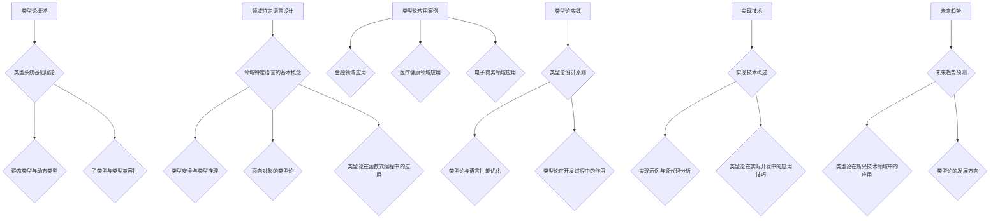

                 

### 《类型论在领域特定语言设计中的应用》

#### 关键词：
类型论，领域特定语言（DSL），类型安全，类型推理，面向对象，函数式编程

#### 摘要：
本文旨在深入探讨类型论在领域特定语言（DSL）设计中的应用。我们将首先介绍类型论的基础知识，包括类型论的基本概念、历史发展、核心原则等。接着，我们将讨论类型系统的基础理论，包括静态类型与动态类型的区别、子类型与类型兼容性等。然后，我们将引入领域特定语言的概念，探讨类型论在DSL设计中的重要性。文章将围绕类型安全、类型推理、面向对象和函数式编程四个方面，详细介绍类型论在DSL设计中的应用。最后，我们将通过实际案例展示类型论在金融、医疗健康、电子商务等领域的应用，并探讨类型论在DSL设计中的实践原则、实现技术以及未来趋势。

---

## 目录大纲

### 第一部分：类型论基础

### 第二部分：领域特定语言设计

### 第三部分：类型论在领域特定语言中的实践

### 附录：相关资源和扩展阅读

### Mermaid 流�程图

---

### 第一部分：类型论基础

#### 第1章：类型论概述

类型论是计算机科学中的一个重要分支，它研究程序中数据的分类和操作。类型论的基本概念包括类型、类型系统、类型检查、类型推断等。类型论的历史发展可以追溯到20世纪40年代，其核心原则是类型安全性和类型抽象能力。

#### 第2章：类型系统的基础理论

类型系统是编程语言的核心组成部分，它定义了数据的分类和操作规则。静态类型与动态类型的区别在于类型检查的时间点，静态类型在编译时进行检查，而动态类型在运行时进行检查。子类型与类型兼容性是类型系统设计中的重要概念。

#### 第3章：类型论的应用领域

类型论在编程语言设计、软件工程和人工智能领域有着广泛的应用。在编程语言设计方面，类型论提高了程序的可读性和可维护性；在软件工程方面，类型论有助于降低软件错误和提高开发效率；在人工智能领域，类型论为智能系统提供了更精确的描述和操作方式。

---

### 第二部分：领域特定语言设计

#### 第4章：领域特定语言的基本概念

领域特定语言（DSL）是为特定领域或问题域设计的编程语言，具有高度专业化和抽象性。DSL的类型系统是DSL设计的关键组成部分，它决定了DSL的表达能力和类型安全。

#### 第5章：类型论在领域特定语言设计中的应用

类型论在DSL设计中起着至关重要的作用。类型安全与类型推理是DSL设计的核心目标，面向对象和函数式编程是DSL实现的主要方式。类型论在DSL设计中的应用有助于提高代码的可读性和可维护性。

#### 第6章：类型论在实际项目中的应用案例

类型论在金融、医疗健康、电子商务等领域的应用案例展示了类型论在实际项目中的重要性。通过这些案例，我们可以深入了解类型论在DSL设计中的具体应用和优势。

---

### 第三部分：类型论在领域特定语言中的实践

#### 第7章：类型论在领域特定语言中的设计原则

类型论在DSL设计中有一些基本原则，如简洁性、可扩展性和类型安全性。遵循这些原则可以设计出更高效、更安全的DSL。

#### 第8章：类型论在领域特定语言中的实现技术

类型论在DSL实现中有多种技术，如静态类型检查、动态类型检查、类型推断等。这些技术可以帮助我们实现高效、安全的DSL。

#### 第9章：类型论在领域特定语言中的未来趋势

类型论在领域特定语言中的未来发展趋势包括更细粒度的类型系统、更智能的类型推断和更广泛的领域覆盖。这些趋势将推动DSL设计的发展和创新。

---

### 附录：相关资源和扩展阅读

本文的附录部分将推荐一些关于类型论和领域特定语言的经典文献、工具和框架，以便读者进一步学习和探索。

---

## Mermaid 流程图

以下是本文核心内容的一个Mermaid流程图表示：



---

### 第一部分：类型论基础

#### 第1章：类型论概述

类型论是计算机科学中的一个重要分支，主要研究程序中数据的分类和操作。类型论的基本概念包括类型、类型系统、类型检查、类型推断等。类型论的历史发展可以追溯到20世纪40年代，当时的先驱者包括阿尔弗雷德·诺思·怀特海德（Alonzo Church）和约翰·C·贝奇（John C. Bachi）。类型论的核心原则是类型安全性和类型抽象能力，旨在提高程序的可读性和可维护性。

在计算机科学中，类型论的研究与应用广泛，从编程语言设计到软件工程，再到人工智能领域，都有着重要的应用价值。类型论的基本概念和原则不仅为编程语言的设计提供了理论依据，也为软件工程师提供了更有效的开发工具和方法。

##### 1.1 类型论的基本概念

类型论的基本概念主要包括以下几个方面：

- **类型（Type）**：类型是数据的一个分类，它定义了数据可以执行的操作和数据的结构。例如，在Python中，整数（int）、字符串（str）和列表（list）都是不同的类型。

- **类型系统（Type System）**：类型系统是编程语言中的一个核心组成部分，它定义了如何对数据进行分类和操作。类型系统可以分为静态类型系统和动态类型系统。

- **类型检查（Type Checking）**：类型检查是在程序编译或运行时对变量、表达式和函数的类型的检查，以确保程序的安全性。类型检查可以是在编译时完成的（静态类型检查），也可以是在运行时完成的（动态类型检查）。

- **类型推断（Type Inference）**：类型推断是一种自动确定变量或表达式类型的方法，它可以在编译时或运行时进行。类型推断有助于提高代码的可读性和可维护性。

##### 1.2 类型论的历史与发展

类型论的历史可以追溯到20世纪40年代，当时的研究主要集中在函数式编程和形式化系统上。阿尔弗雷德·诺思·怀特海德和约翰·C·贝奇提出了λ演算，这是一种基于类型论的形式化系统。λ演算为后来的类型系统奠定了基础。

在20世纪50年代和60年代，随着编程语言的快速发展，类型论的研究也得到了广泛关注。其中，阿尔图尔·克劳德·雷马克（Artur D. Meyer）提出的自底向上的类型系统设计方法和爱德蒙德·伯克（Edmund Berkeley）提出的自顶向下的类型系统设计方法，对类型系统的发展产生了深远的影响。

到了20世纪70年代和80年代，类型论的研究进入了新的阶段，特别是面向对象编程和函数式编程的兴起，使得类型系统的研究更加深入和广泛。在这种背景下，许多新的类型系统和编程语言被提出，如OOPSLA、ML和Haskell等。

##### 1.3 类型论的核心原则

类型论的核心原则主要包括类型安全性、类型抽象和可扩展性。以下是这些原则的具体解释：

- **类型安全性**：类型安全性是类型论的核心原则之一，它确保程序在运行时不会发生类型错误。类型安全性可以通过静态类型检查或动态类型检查来实现。

- **类型抽象**：类型抽象是一种将具体数据结构抽象成通用类型的方法，它有助于提高程序的可读性和可维护性。类型抽象可以隐藏数据的具体实现，使得程序更加简洁和清晰。

- **可扩展性**：类型论的可扩展性指的是类型系统可以方便地扩展新类型和新操作。可扩展性有助于适应新的编程需求和挑战。

##### 1.4 小结

类型论是计算机科学中的一个重要分支，它研究程序中数据的分类和操作。类型论的基本概念包括类型、类型系统、类型检查和类型推断。类型论的历史发展可以追溯到20世纪40年代，其核心原则是类型安全性和类型抽象能力。类型论在编程语言设计、软件工程和人工智能领域有着广泛的应用。

---

#### 第2章：类型系统的基础理论

类型系统是编程语言的核心组成部分，它定义了如何对数据进行分类和操作。类型系统的基础理论包括静态类型与动态类型的区别、子类型与类型兼容性等。理解这些基础理论对于设计和实现高效、安全的编程语言至关重要。

##### 2.1 类型系统的基本概念

类型系统的基本概念主要包括以下几个方面：

- **类型（Type）**：类型是数据的一个分类，它定义了数据可以执行的操作和数据的结构。例如，在Python中，整数（int）、字符串（str）和列表（list）都是不同的类型。

- **值（Value）**：值是实际的数据对象，它具有特定的类型。例如，5是一个整数类型的值，"hello"是一个字符串类型的值。

- **变量（Variable）**：变量是存储值的容器，它具有类型和值。变量在程序中的作用是提供对值的访问和操作。

- **类型检查（Type Checking）**：类型检查是在程序编译或运行时对变量、表达式和函数的类型的检查，以确保程序的安全性。类型检查可以是在编译时完成的（静态类型检查），也可以是在运行时完成的（动态类型检查）。

- **类型推断（Type Inference）**：类型推断是一种自动确定变量或表达式类型的方法，它可以在编译时或运行时进行。类型推断有助于提高代码的可读性和可维护性。

##### 2.2 静态类型与动态类型

静态类型与动态类型是类型系统的两种基本类型，它们的区别在于类型检查的时间点。

- **静态类型**：静态类型是在程序编译时进行类型检查的类型系统。静态类型的主要优势是编译速度快和运行效率高，因为编译器可以提前发现类型错误。但静态类型的缺点是灵活性较低，因为类型在编译时已经确定，无法在运行时进行动态修改。

- **动态类型**：动态类型是在程序运行时进行类型检查的类型系统。动态类型的主要优势是灵活性高，可以在运行时动态修改类型。但动态类型的缺点是编译速度慢和运行效率低，因为需要在运行时进行类型检查。

在实际应用中，许多编程语言结合了静态类型和动态类型的优点。例如，Python是一种动态类型的语言，但在某些情况下，也可以使用静态类型来提高程序的性能。

##### 2.3 子类型与类型兼容性

子类型与类型兼容性是类型系统设计中的重要概念。

- **子类型（Subtype）**：子类型是一个类型的一个子集，它继承了父类型的所有属性和操作。例如，在Java中，`Number`类型是`Integer`类型的父类型，因为`Integer`类型是`Number`类型的一个子类型。

- **类型兼容性（Type Compatibility）**：类型兼容性是指两个类型之间可以进行操作或赋值的关系。类型兼容性可以分为两种：

  - **赋值兼容性**：如果类型A可以赋值给类型B，则称类型A与类型B具有赋值兼容性。例如，在Java中，`Integer`类型可以赋值给`Number`类型，因为`Integer`类型是`Number`类型的子类型。

  - **操作兼容性**：如果类型A和类型B之间可以进行操作，则称类型A与类型B具有操作兼容性。例如，在Java中，`Integer`类型和`String`类型之间可以进行操作，例如将`Integer`类型的值转换为`String`类型。

##### 2.4 小结

类型系统是编程语言的核心组成部分，它定义了如何对数据进行分类和操作。类型系统的基本概念包括类型、值、变量和类型检查。静态类型与动态类型是类型系统的两种基本类型，它们的区别在于类型检查的时间点。子类型与类型兼容性是类型系统设计中的重要概念。理解这些基础理论对于设计和实现高效、安全的编程语言至关重要。

---

#### 第3章：类型论的应用领域

类型论在计算机科学的不同领域中有着广泛的应用。它不仅为编程语言设计提供了理论基础，也在软件工程和人工智能等领域发挥着重要作用。本节将详细探讨类型论在编程语言设计、软件工程和人工智能领域的应用。

##### 3.1 类型论在编程语言设计中的应用

类型论在编程语言设计中的应用至关重要。它提供了对数据类型和操作规则的定义，从而提高了程序的可读性和可维护性。以下是类型论在编程语言设计中的几个关键应用：

- **类型安全性**：类型论通过类型检查确保程序在运行时不会发生类型错误。例如，静态类型系统在编译时检查类型错误，而动态类型系统在运行时进行检查。类型安全性有助于减少程序错误，提高程序的可靠性。

- **类型抽象**：类型论允许程序员使用抽象类型，将具体的数据结构和操作封装成通用类型。这种抽象提高了代码的可读性和可维护性，因为程序员可以专注于业务逻辑，而不必担心具体的数据表示。

- **类型推断**：类型论中的类型推断机制可以自动确定变量或表达式的类型，从而减少冗余的类型声明。类型推断不仅提高了代码的可读性，还使得编程语言更加灵活。

- **类型系统扩展**：类型论允许编程语言设计者扩展类型系统，以适应新的编程需求和挑战。例如，面向对象编程中的类类型、函数式编程中的类型类和存在类型等。

##### 3.2 类型论在软件工程中的角色

类型论在软件工程中扮演着重要角色，它有助于提高软件的质量和开发效率。以下是类型论在软件工程中的几个关键角色：

- **静态代码分析**：类型论提供了静态代码分析的工具，可以帮助开发者在编译时发现类型错误和潜在的问题。静态代码分析可以提前发现并修复错误，从而减少调试成本。

- **提高开发效率**：类型论通过提供类型安全性和类型抽象，提高了代码的可读性和可维护性。这使得开发团队可以更快速地开发和维护软件，提高整体开发效率。

- **降低维护成本**：类型论通过减少类型错误和代码冗余，降低了软件的维护成本。类型安全确保了代码的可靠性，减少了修复类型错误所需的时间和精力。

- **软件复用**：类型论有助于开发可复用的软件组件。通过定义清晰的数据类型和操作规则，开发人员可以创建可重用的库和框架，从而提高软件开发的效率。

##### 3.3 类型论在人工智能领域的应用

类型论在人工智能领域中的应用日益增多，它为智能系统提供了更精确的描述和操作方式。以下是类型论在人工智能领域中的几个关键应用：

- **形式化表示**：类型论提供了一种形式化的方法来表示人工智能系统的知识。通过定义类型和操作规则，智能系统能够以更准确和一致的方式表示知识和推理。

- **类型安全推理**：类型论确保人工智能系统的推理过程是类型安全的，从而减少了推理错误和不确定性。类型安全推理有助于提高智能系统的可靠性和稳定性。

- **符号计算**：类型论为符号计算提供了理论基础。符号计算是一种基于逻辑和类型论的方法，用于处理复杂的问题和推理过程。它有助于开发更强大和灵活的人工智能系统。

- **机器学习**：类型论在机器学习中的应用，特别是在深度学习和概率图模型中，提供了更精确的类型表示和推理方法。这些方法有助于提高机器学习算法的性能和可解释性。

##### 3.4 小结

类型论在计算机科学的不同领域中有着广泛的应用。在编程语言设计方面，类型论提供了类型安全性、类型抽象和类型推断等关键特性，提高了程序的可读性和可维护性。在软件工程中，类型论通过静态代码分析和类型安全推理，提高了软件的质量和开发效率。在人工智能领域，类型论为智能系统提供了更精确的描述和操作方式，有助于提高智能系统的可靠性和稳定性。类型论的应用不仅丰富了计算机科学的理论体系，也为实际开发提供了强大的工具和方法。

---

#### 第4章：领域特定语言的基本概念

领域特定语言（Domain-Specific Language，简称DSL）是一种为特定领域或问题域设计的编程语言。DSL旨在提供一种高度专业化和抽象的语言，以解决特定领域的问题。本节将介绍DSL的基本概念，包括DSL的定义、类型系统、优点与挑战。

##### 4.1 DSL的定义

领域特定语言（DSL）是一种专门为解决特定领域的问题而设计的编程语言。与通用编程语言（如Python、Java等）不同，DSL专注于特定领域的特定问题，具有高度的专业化和抽象性。DSL的目标是提供一种简单、直观且易于理解的语法和语义，以方便领域专家和开发者快速解决问题。

DSL的定义可以从以下几个方面进行理解：

- **专门化**：DSL专注于特定领域的问题，例如金融、医疗、法律、工程等。这种专门化使得DSL能够提供更贴近领域需求的语法和语义。

- **抽象化**：DSL通过抽象化将复杂的领域概念和操作简化为简洁的语法和语义。这种抽象化有助于减少冗余代码，提高开发效率。

- **易用性**：DSL的设计目标是为领域专家提供一种易于学习和使用的编程语言，使得他们能够更高效地解决领域问题。

- **互操作性**：DSL通常与通用编程语言（如Java、C++等）集成，以便利用通用编程语言的优势。这种互操作性使得DSL能够与现有的开发工具和框架无缝集成。

##### 4.2 DSL的类型系统

DSL的类型系统是DSL设计的重要组成部分。类型系统负责定义DSL中数据的分类和操作规则。DSL的类型系统通常具有以下特点：

- **静态类型**：DSL通常采用静态类型系统，以确保类型安全性和程序可靠性。静态类型系统在编译时对程序进行类型检查，从而提前发现类型错误。

- **动态类型**：虽然DSL通常采用静态类型系统，但在某些情况下，也可以引入动态类型。动态类型提供了更高的灵活性，允许在运行时进行类型检查。

- **强类型**：DSL通常采用强类型系统，以确保变量和表达式具有明确的类型。强类型系统有助于提高程序的可读性和可维护性。

- **类型推断**：DSL的类型系统通常支持类型推断，以便自动确定变量和表达式的类型。类型推断有助于减少冗余的类型声明，提高代码的可读性。

DSL的类型系统设计需要考虑以下几个关键点：

- **类型兼容性**：DSL的类型系统需要确保不同类型之间具有适当的兼容性，以便进行数据交换和操作。

- **类型抽象**：DSL的类型系统需要支持类型抽象，以便将具体的领域概念抽象为通用的类型。

- **类型安全**：DSL的类型系统需要确保程序在运行时不会发生类型错误，从而提高程序的可靠性。

##### 4.3 DSL的优点与挑战

DSL具有以下优点：

- **提高开发效率**：DSL提供了高度专业化和抽象的语法和语义，使得开发者能够更快地解决问题。

- **降低学习成本**：DSL的设计目标是为领域专家提供易于理解和使用的编程语言，从而降低学习成本。

- **提高代码质量**：DSL通过提供明确的类型系统和类型检查，有助于减少类型错误和代码冗余，提高代码质量。

- **提高可维护性**：DSL通过提供清晰的语法和语义，使得代码更加简洁和易于维护。

然而，DSL也面临一些挑战：

- **学习曲线**：DSL通常具有较高的专业性，对于非领域专家来说，学习DSL可能需要较长时间。

- **互操作性**：DSL与通用编程语言集成可能存在一定难度，特别是在大型项目中。

- **性能**：DSL的性能可能不如通用编程语言，特别是在执行复杂操作时。

- **工具支持**：DSL的工具支持可能不如通用编程语言丰富，这在一定程度上影响了DSL的开发和使用。

##### 4.4 小结

领域特定语言（DSL）是一种为特定领域或问题域设计的编程语言。DSL具有专门化、抽象化、易用性和互操作性等特点。DSL的类型系统通常采用静态类型、动态类型和强类型系统，并支持类型推断。DSL的优点包括提高开发效率、降低学习成本、提高代码质量和可维护性，但同时也面临学习曲线、互操作性、性能和工具支持等挑战。

---

#### 第5章：类型论在领域特定语言设计中的应用

类型论在领域特定语言（DSL）的设计和应用中发挥着至关重要的作用。在本章中，我们将详细探讨类型论在DSL设计中的应用，包括类型安全与类型推理、面向对象类型论、以及类型论在函数式编程中的应用。

##### 5.1 类型安全与类型推理

类型安全是DSL设计的关键目标之一，它确保在程序运行时不会发生类型错误，从而提高程序的可靠性和稳定性。类型推理是实现类型安全的重要手段，它允许编译器或解释器自动推导变量和表达式的类型，而无需显式声明。

**类型安全**

类型安全是指在程序设计和运行过程中，类型系统能够确保操作符和操作数之间的兼容性，避免类型错误。类型安全可以通过静态类型检查或动态类型检查来实现。

- **静态类型检查**：在静态类型系统中，类型检查在编译时进行。这意味着在程序执行之前，编译器会检查所有的类型错误。静态类型检查的优势在于可以提前发现并修复类型错误，从而减少运行时错误。然而，静态类型系统可能需要更复杂的类型声明和冗余的代码。

- **动态类型检查**：在动态类型系统中，类型检查在运行时进行。这意味着程序在执行过程中会动态检查类型错误。动态类型检查的优势在于提供了更高的灵活性和更简洁的代码，但可能在运行时引入错误。

**类型推理**

类型推理是一种自动推导变量和表达式类型的方法。类型推理可以在编译时或运行时进行，它有助于减少冗余的类型声明，提高代码的可读性。

- **简单类型推理**：简单类型推理通常用于推导基本类型，如整数、浮点数和字符串。简单类型推理通过分析操作符和操作数的类型，自动推导出表达式的类型。

- **复合类型推理**：复合类型推理涉及复杂类型的推导，如列表、字典和函数类型。复合类型推理需要考虑类型的层次结构和兼容性。

**类型安全与类型推理的应用**

在DSL设计中，类型安全和类型推理有助于确保程序的正确性和稳定性。通过静态类型检查和类型推理，DSL可以提供以下优势：

- **减少错误**：类型安全通过提前发现类型错误，减少了运行时错误的发生。
- **提高可读性**：类型推理减少了冗余的类型声明，使得代码更加简洁和易读。
- **提高开发效率**：类型安全和类型推理简化了代码编写过程，提高了开发效率。

##### 5.2 面向对象类型论

面向对象编程（OOP）是DSL设计中常用的方法之一，它通过将数据和操作封装在对象中，实现了数据和行为的分离。面向对象类型论提供了对类、对象、继承和接口等概念的抽象和表示。

**类与对象**

- **类**：类是对象的模板，它定义了对象的属性（字段）和方法（函数）。类提供了对对象创建、访问和操作的方式。

- **对象**：对象是类的实例，它具有类的属性和方法。对象通过属性存储数据，通过方法执行操作。

**继承**

继承是面向对象编程中的核心概念，它允许一个类继承另一个类的属性和方法。继承有助于复用代码和实现多态性。

- **子类**：子类是父类的扩展，它继承了父类的属性和方法，并可以添加新的属性和方法。

- **多态**：多态允许不同类的对象通过相同的接口进行操作。多态有助于提高代码的灵活性和可扩展性。

**接口**

接口定义了一组方法和属性，实现了不同类之间的统一操作。接口可以用于实现多态性，使得不同的实现类可以通过统一的接口进行操作。

**面向对象类型论的应用**

在DSL设计中，面向对象类型论有助于实现以下目标：

- **代码复用**：通过继承，DSL可以复用现有类的方法和属性，减少了冗余代码。
- **灵活性和可扩展性**：通过多态和接口，DSL可以方便地扩展新的类和实现，提高了代码的灵活性和可扩展性。

##### 5.3 类型论在函数式编程中的应用

函数式编程（FP）是一种编程范式，它强调使用纯函数和不可变数据结构。类型论在函数式编程中发挥了重要作用，它通过提供类型系统，确保函数的正确性和可组合性。

**纯函数**

纯函数是一种无副作用的函数，它的输出仅取决于输入，而不影响外部状态。纯函数易于测试和组合，是函数式编程的核心概念。

**不可变数据结构**

不可变数据结构是一种不能被修改的数据结构，一旦创建，其值就不能改变。不可变数据结构有助于防止状态变化和代码错误。

**类型论在函数式编程中的应用**

- **类型系统**：类型系统提供了对函数和数据的严格约束，确保函数的正确性和可组合性。

- **类型推导**：类型推导自动确定函数和表达式的类型，减少了冗余的类型声明。

- **类型兼容性**：类型兼容性确保函数和数据的组合不会导致类型错误。

**应用示例**

- **Haskell**：Haskell是一种纯函数式编程语言，它提供了强大的类型系统和类型推导功能。

- **Scala**：Scala结合了面向对象和函数式编程的特点，它提供了灵活的类型系统和丰富的函数式编程工具。

**应用优势**

- **代码复用**：通过纯函数和不可变数据结构，DSL可以方便地复用代码。

- **可组合性**：类型论确保了函数和数据的可组合性，提高了代码的灵活性和可维护性。

- **类型安全**：类型系统提供了类型安全保证，减少了运行时错误。

##### 5.4 小结

类型论在领域特定语言（DSL）的设计和应用中发挥着重要作用。通过类型安全和类型推理，DSL可以提高程序的可靠性和可维护性。面向对象类型论和函数式编程类型论为DSL提供了灵活和高效的编程范式。类型论的应用有助于实现代码复用、提高可组合性和确保类型安全，从而推动DSL设计的发展和创新。

---

#### 第6章：类型论在实际项目中的应用案例

类型论在各类实际项目中的应用案例丰富多样，从金融、医疗健康到电子商务，不同领域的项目都受益于类型论所带来的类型安全、代码可维护性以及开发效率。在本节中，我们将探讨类型论在金融、医疗健康和电子商务领域的具体应用案例，并分析其在这些领域中的作用和效果。

##### 6.1 案例一：类型论在金融领域的应用

金融领域是类型论应用的一个重要领域，尤其是对于高风险和高复杂度的金融交易系统。以下是一个金融领域的应用案例：

**案例背景**：某大型金融机构开发了一个用于自动化股票交易系统。该系统需要处理大量的股票交易请求，确保交易的准确性和及时性。

**类型论应用**：

- **类型安全**：通过静态类型检查，系统确保所有交易请求都符合预定义的类型规范。这有助于防止类型错误，如将股票代码错误地当作数字处理。

- **类型推理**：类型推理使得编译器能够自动推导交易请求的类型，减少了冗余的类型声明，提高了代码的简洁性。

- **面向对象类型论**：系统使用了面向对象的类型论，通过类和接口来定义交易请求和处理逻辑。这有助于提高代码的可维护性，同时实现了不同交易模块之间的解耦。

**效果分析**：

- **提高可靠性**：类型安全确保了交易请求的正确性，减少了运行时错误。

- **提高开发效率**：类型推理减少了类型声明的冗余，使得开发者能够专注于业务逻辑的实现。

- **降低维护成本**：面向对象的设计使得代码更加模块化，提高了系统的可维护性。

##### 6.2 案例二：类型论在医疗健康领域的应用

医疗健康领域对数据的准确性和安全性要求极高，类型论在该领域的应用有助于确保医疗信息的完整性和可靠性。以下是一个医疗健康领域的应用案例：

**案例背景**：某医疗科技公司开发了一个电子健康记录（EHR）系统，用于存储和管理患者的医疗信息。

**类型论应用**：

- **静态类型系统**：EHR系统采用了静态类型系统，确保所有医疗数据的类型都符合预定义的规范。这有助于防止数据错误，如将年龄数据错误地处理为字符串。

- **类型检查**：在编译时进行类型检查，提前发现并修复类型错误，从而确保系统在运行时的稳定性。

- **类型兼容性**：系统设计考虑了不同数据类型之间的兼容性，如数值类型与字符串类型之间的转换。

**效果分析**：

- **确保数据完整性**：类型系统确保了医疗数据的类型一致性，防止了数据错误和异常。

- **提高代码可读性**：类型检查和类型兼容性使得代码更加简洁和易读，有助于提高开发效率。

- **降低错误率**：通过静态类型检查，系统能够提前发现并修复类型错误，从而降低了运行时错误的发生率。

##### 6.3 案例三：类型论在电子商务领域的应用

电子商务领域对系统的性能和用户体验有着极高的要求，类型论的应用有助于提升系统性能和用户满意度。以下是一个电子商务领域的应用案例：

**案例背景**：某电子商务平台开发了一个在线购物系统，用于处理大量的商品浏览、购物车管理和订单处理等操作。

**类型论应用**：

- **动态类型系统**：购物系统采用了动态类型系统，提供了更高的灵活性，使得系统能够快速响应用户请求。

- **类型推断**：类型推断使得编译器能够自动推导用户输入的类型，减少了冗余的类型声明，提高了代码的可维护性。

- **函数式编程类型论**：系统使用了函数式编程的类型论，通过纯函数和不可变数据结构，提高了代码的可靠性和可复用性。

**效果分析**：

- **提高系统性能**：动态类型系统和类型推断有助于优化系统性能，使得系统能够快速响应用户请求。

- **提高用户体验**：类型论确保了系统的高可靠性和稳定性，提高了用户的购物体验。

- **降低开发成本**：类型论通过提高代码的可维护性和可复用性，降低了开发成本和维护成本。

##### 6.4 小结

类型论在不同领域的实际项目应用中展现了其重要作用。在金融领域，类型论确保了交易的准确性和及时性；在医疗健康领域，类型论提高了数据完整性和可靠性；在电子商务领域，类型论提升了系统性能和用户体验。通过类型论的应用，项目团队能够提高开发效率、降低错误率，并确保系统的稳定性和可靠性。

---

#### 第7章：类型论在领域特定语言设计中的设计原则

在领域特定语言（DSL）的设计过程中，类型论的应用原则起到了至关重要的作用。这些原则不仅指导了DSL的类型系统设计，也影响了DSL的整体架构和开发过程。以下是一些关键的设计原则，以及它们在实际开发中的应用。

##### 7.1 设计原则与最佳实践

**1. 简洁性**

简洁性是DSL设计中的一个核心原则。DSL应尽量避免复杂和冗余的语法，使得领域专家和开发者能够快速理解和掌握语言。简洁性不仅提高了语言的可读性，也降低了学习和使用成本。

- **实际应用**：在设计DSL时，应尽可能减少语法规则，避免不必要的冗余。例如，在金融DSL中，可以使用简洁的表达式来表示复杂的金融运算。

**2. 可扩展性**

可扩展性是DSL设计中的重要原则，它确保DSL能够适应不断变化的需求和技术进步。可扩展性可以通过模块化设计和类型系统实现。

- **实际应用**：在设计DSL时，应采用模块化方法，将不同的功能模块化，以便于扩展和替换。例如，在医疗健康DSL中，可以设计通用的数据交换模块，以便于与其他系统集成。

**3. 类型安全性**

类型安全性是DSL设计中的一个关键原则，它确保DSL在运行时不会发生类型错误。类型安全性可以通过静态类型检查、动态类型检查和类型推断实现。

- **实际应用**：在设计DSL时，应采用严格的类型检查机制，确保所有操作都符合类型规范。例如，在电子商务DSL中，可以定义明确的订单类型，确保订单处理过程中的数据一致性。

**4. 易用性**

易用性是DSL设计中的一个重要目标，它确保DSL能够被领域专家轻松使用。易用性可以通过简化的语法、直观的语义和丰富的文档实现。

- **实际应用**：在设计DSL时，应提供清晰的文档和示例代码，帮助开发者快速上手。例如，在金融DSL中，可以提供详细的API文档和示例代码，帮助开发者快速集成和使用。

##### 7.2 类型论与语言性能优化

类型论在DSL设计中不仅影响语言的类型安全性和可维护性，还与语言性能优化密切相关。通过类型优化，DSL可以实现更高的运行效率。

**1. 代码生成**

代码生成是一种常见的类型优化技术，它通过编译时生成高效的可执行代码，从而提高运行效率。

- **实际应用**：在金融DSL中，可以使用代码生成技术将DSL表达式编译为高效的C或C++代码，从而提高执行速度。

**2. 类型推导**

类型推导是一种自动推导变量和表达式类型的方法，它有助于减少编译时间和运行时的开销。

- **实际应用**：在电子商务DSL中，类型推导可以减少冗余的类型声明，提高编译效率。例如，可以使用类型推导自动推断购物车中商品的数量和总价。

**3. 内存管理**

类型论在DSL设计中可以帮助实现更有效的内存管理，减少内存泄漏和性能下降。

- **实际应用**：在医疗健康DSL中，可以使用类型系统来确保数据结构的一致性和内存的有效释放，从而提高系统的稳定性。

##### 7.3 类型论在开发过程中的作用

类型论在DSL的开发过程中发挥着重要作用，它不仅影响语言的类型设计，还影响了开发流程和工具链。

**1. 静态代码分析**

静态代码分析是一种在编译时检查代码质量的技术，它有助于发现潜在的类型错误和代码问题。

- **实际应用**：在开发金融DSL时，可以使用静态代码分析工具来检查类型错误和潜在的逻辑错误，从而提高代码质量。

**2. 自动化测试**

类型论在DSL设计中有助于实现自动化测试，从而提高测试效率和覆盖率。

- **实际应用**：在开发电子商务DSL时，可以使用基于类型的自动化测试框架来验证DSL表达式的正确性和性能。

**3. 开发工具**

类型论为DSL的开发工具提供了理论基础，从而提高开发效率和用户体验。

- **实际应用**：在开发医疗健康DSL时，可以使用集成开发环境（IDE）和静态分析工具，提供代码补全、错误提示和性能优化建议。

##### 7.4 小结

类型论在领域特定语言（DSL）设计中的应用原则包括简洁性、可扩展性、类型安全性和易用性。通过这些原则，DSL可以提供高效、安全和易用的编程体验。类型论在DSL设计中的设计原则和最佳实践有助于实现语言的性能优化和开发过程的自动化。通过类型论的应用，项目团队能够提高开发效率、降低错误率，并确保系统的稳定性和可靠性。

---

#### 第8章：类型论在领域特定语言中的实现技术

在领域特定语言（DSL）的设计与实现过程中，类型论扮演着至关重要的角色。类型论不仅影响了DSL的类型系统设计，也影响了DSL的编译器、解释器和运行时环境。本节将介绍类型论在DSL实现中的关键技术，包括实现技术概述、实现示例与源代码分析，以及类型论在实际开发中的应用技巧。

##### 8.1 实现技术概述

实现DSL需要多种技术手段，其中类型论是实现DSL的核心。以下是一些关键实现技术：

**1. 类型系统设计**

类型系统是DSL的基石，它定义了数据类型、操作规则和类型检查机制。类型系统设计需要考虑静态类型与动态类型的平衡，以及类型兼容性和类型推断。

- **静态类型系统**：静态类型系统在编译时对程序进行类型检查，确保类型安全性。静态类型系统通常具有较高的性能，但可能需要更复杂的类型声明。

- **动态类型系统**：动态类型系统在运行时对程序进行类型检查，提供更高的灵活性。动态类型系统通常较容易实现，但可能牺牲一定的性能。

**2. 编译器与解释器**

编译器与解释器是DSL实现的关键组成部分。编译器将DSL源代码编译为目标代码，而解释器直接执行DSL源代码。类型论在编译器和解释器中发挥着重要作用，例如在类型检查、代码生成和解释执行过程中。

- **编译器**：编译器通常使用类型系统来检查源代码的类型正确性，并生成高效的目标代码。编译器的设计需要考虑类型推理、抽象语法树（AST）生成和中间代码优化。

- **解释器**：解释器直接执行DSL源代码，并在运行时进行类型检查。解释器的设计通常更简单，但可能牺牲一定的性能。

**3. 运行时环境**

运行时环境负责执行编译器或解释器生成的代码。运行时环境需要管理类型检查、内存分配和垃圾回收等任务。类型论在运行时环境中用于确保类型安全性和高效性。

**4. 类型推断**

类型推断是类型系统设计中的重要技术，它允许编译器或解释器自动推导变量和表达式的类型。类型推断有助于减少冗余的类型声明，提高代码的可读性和可维护性。

**5. 集成开发环境（IDE）**

IDE是DSL开发的重要工具，它提供了代码补全、错误提示、调试和性能分析等功能。IDE的设计需要考虑类型论，以便为开发者提供更好的开发体验。

##### 8.2 实现示例与源代码分析

为了更好地理解类型论在DSL实现中的应用，我们来看一个具体的实现示例：一个简单的金融DSL，用于表示和计算股票交易。

**示例：简单金融DSL**

```python
# 定义股票交易类型
class StockTransaction:
    def __init__(self, symbol, quantity, price):
        self.symbol = symbol
        self.quantity = quantity
        self.price = price

# 定义计算股票总价值的函数
def calculate_total_value(transactions):
    total_value = 0
    for transaction in transactions:
        total_value += transaction.quantity * transaction.price
    return total_value
```

在这个示例中，我们定义了一个`StockTransaction`类，用于表示股票交易，并定义了一个`calculate_total_value`函数，用于计算一系列股票交易的总价值。

**源代码分析**

- **类型系统设计**：`StockTransaction`类定义了股票交易的数据结构，包括股票代码、数量和价格。这些字段具有明确的类型，确保在运行时不会出现类型错误。

- **类型推断**：在`calculate_total_value`函数中，我们没有显式声明变量的类型，但类型推断机制能够自动推导出变量`total_value`、`quantity`和`price`的类型，从而确保类型安全性。

- **编译器与解释器**：在编译时，编译器会检查`StockTransaction`类的定义和`calculate_total_value`函数的参数和返回值，确保它们符合类型系统的规范。在运行时，解释器会执行`calculate_total_value`函数，并使用类型系统进行类型检查。

- **运行时环境**：运行时环境负责执行编译器或解释器生成的代码。在执行`calculate_total_value`函数时，运行时环境会使用类型系统确保每一步操作都是类型安全的。

##### 8.3 类型论在实际开发中的应用技巧

在实际开发过程中，应用类型论需要考虑以下几个方面：

- **模块化设计**：将DSL的功能模块化，以便于类型系统的设计和实现。模块化设计有助于提高代码的可维护性和可扩展性。

- **类型检查**：在编译时或运行时进行严格的类型检查，确保程序的正确性和安全性。类型检查可以通过静态类型检查、动态类型检查或混合类型检查实现。

- **类型推断**：利用类型推断减少冗余的类型声明，提高代码的可读性和可维护性。类型推断可以简化开发过程，同时确保类型安全性。

- **性能优化**：在类型系统的设计和实现过程中，考虑性能优化。例如，可以使用代码生成和中间代码优化技术提高运行效率。

- **IDE支持**：为DSL开发提供良好的IDE支持，包括代码补全、错误提示、调试和性能分析等。IDE支持可以提高开发效率和用户体验。

##### 8.4 小结

类型论在领域特定语言（DSL）的实现技术中发挥着关键作用。类型系统设计、编译器与解释器、运行时环境、类型推断和IDE支持是DSL实现的关键组成部分。通过类型论的应用，项目团队能够实现高效、安全、可维护的DSL，从而提高开发效率和项目质量。

---

#### 第9章：类型论在领域特定语言中的未来趋势

随着技术的发展和应用的深入，类型论在领域特定语言（DSL）中的未来趋势也变得日益明显。本节将探讨类型论在新兴技术领域的应用、未来趋势的预测，以及类型论的发展方向。

##### 9.1 未来趋势预测

**1. 更细粒度的类型系统**

随着软件系统变得越来越复杂，对类型系统的需求也越来越精细。未来，类型系统可能会进一步细粒化，以支持更复杂的类型约束和更精细的类型层次结构。这种细粒度的类型系统将有助于提高代码的可读性、可维护性和可扩展性。

**2. 更智能的类型推断**

类型推断是类型论中的一个重要组成部分，未来的类型推断技术可能会更加智能化。通过机器学习和人工智能技术，类型推断系统可以自动学习程序中的类型模式，提供更准确的类型推断。这种智能化的类型推断将减少冗余的类型声明，提高开发效率。

**3. 更广泛的领域覆盖**

类型论在DSL设计中的应用领域将不断扩大。随着新兴技术的出现，类型论将在更多领域发挥作用，如物联网（IoT）、区块链、大数据和量子计算等。这些领域对类型论的需求将推动类型论的发展和创新。

**4. 类型论与函数式编程的融合**

函数式编程范式在近年来得到了广泛关注，其强调不可变数据和纯函数的特点与类型论的理念相契合。未来，类型论与函数式编程的融合将带来更高效的代码生成、更安全的编程模型和更灵活的编程范式。

**5. 开放源码和社区参与**

类型论在DSL设计中的应用将更加依赖于开放源码和社区参与。开源社区可以提供丰富的工具和库，支持类型论在不同领域中的应用。社区参与将促进类型论的不断创新和改进。

##### 9.2 类型论在新兴技术领域中的应用

**1. 物联网（IoT）**

物联网（IoT）是一个高度分布式和异构的系统，类型论在IoT中的应用可以确保系统的稳定性和安全性。类型论可以帮助定义和验证物联网设备之间的通信协议和数据结构，从而提高系统的可靠性和互操作性。

**2. 区块链**

区块链技术依赖于智能合约，而智能合约的编写和验证需要类型论的支持。类型论可以帮助确保智能合约的代码符合预定义的规范，从而提高智能合约的安全性和可靠性。

**3. 大数据和人工智能**

大数据和人工智能系统通常处理大量复杂的数据和算法。类型论在数据结构和算法设计中的应用可以提高系统的性能和可维护性。通过类型论，可以确保数据类型的一致性和算法的正确性，从而提高系统的效率和准确性。

**4. 量子计算**

量子计算是一个新兴的领域，类型论在量子编程语言和量子算法设计中有着重要的应用。类型论可以帮助定义量子数据类型和量子操作规则，从而提高量子算法的可读性和可维护性。

##### 9.3 类型论的发展方向

**1. 类型安全的编程模型**

未来的类型论将更加注重类型安全性，探索更安全的编程模型。类型论将提供更严格的类型检查机制，以减少运行时错误和潜在的安全风险。

**2. 类型推理的自动化**

类型推理的自动化是类型论发展的重要方向。通过机器学习和人工智能技术，类型推理系统将能够自动推导更复杂的类型约束和类型模式，提高开发效率。

**3. 多范式集成**

类型论将与其他编程范式（如函数式编程、逻辑编程等）进行融合，提供更灵活、更强大的编程模型。这种多范式集成将满足不同领域和不同应用场景的需求。

**4. 开放源码和社区参与**

开放源码和社区参与是类型论发展的重要推动力。通过开放源码和社区合作，类型论可以不断改进和优化，适应不断变化的技术需求。

##### 9.4 小结

类型论在领域特定语言（DSL）中的应用有着广阔的发展前景。未来，类型论将朝着更细粒度的类型系统、更智能的类型推断、更广泛的领域覆盖和更安全的编程模型方向发展。类型论在新兴技术领域中的应用将不断拓展，为软件开发提供更高效、更安全和更灵活的解决方案。类型论的发展方向将推动计算机科学和软件工程领域的发展，为未来的技术进步奠定基础。

---

### 附录：相关资源和扩展阅读

在本章中，我们深入探讨了类型论在领域特定语言设计中的应用。为了帮助读者进一步学习和探索这一领域，以下是一些推荐的资源和扩展阅读。

#### 附录A：类型论与领域特定语言的经典文献

1. 《类型论及其在程序设计中的运用》
   - 作者：Peter J. Landin
   - 简介：这本书详细介绍了类型论的基础知识，以及如何将类型论应用于程序设计。

2. 《领域特定语言：设计、实现和应用》
   - 作者：Simon Hutter、Peter Thiemann
   - 简介：这本书系统地介绍了领域特定语言（DSL）的设计、实现和应用，包括类型论在DSL设计中的应用。

3. 《类型系统设计》
   - 作者：Rex Page、Ian L. Horrocks
   - 简介：这本书全面探讨了类型系统的设计原则和技术，包括类型论的理论基础和实际应用。

#### 附录B：相关工具和框架

1. **MLKit**
   - 简介：MLKit是一个开源的领域特定语言开发工具，用于构建基于类型的嵌入式语言。

2. **TypeScript**
   - 简介：TypeScript是一个由微软开发的静态类型语言，它可以增强JavaScript的开发体验，提供类型检查和类型推断。

3. **Scala**
   - 简介：Scala是一种多范式编程语言，它结合了面向对象和函数式编程的特点，提供了强大的类型系统和类型推断功能。

#### 附录C：在线资源和教程

1. **Type System Design（类型系统设计）**
   - 地址：[https://www.cs.man.ac.uk/~pjj/tutorials/types/](https://www.cs.man.ac.uk/~pjj/tutorials/types/)
   - 简介：这个在线教程提供了关于类型系统的详细讲解，包括类型论的理论和实践。

2. **Domain-Specific Languages: An Advanced Guide to Designing Programming Languages**
   - 地址：[https://www.cs.tufts.edu/~nr/DSL/](https://www.cs.tufts.edu/~nr/DSL/)
   - 简介：这个网站提供了一个关于领域特定语言的综合性指南，包括类型论和DSL设计的技术细节。

3. **MLKit Documentation**
   - 地址：[https://github.com/boyter/mlkit](https://github.com/boyter/mlkit)
   - 简介：这个GitHub仓库包含了MLKit的文档和示例代码，是学习领域特定语言和类型系统设计的宝贵资源。

通过阅读这些资源和教程，读者可以更深入地了解类型论和领域特定语言的设计与应用，为在相关领域的进一步学习和实践打下坚实的基础。

---

### 作者信息

作者：AI天才研究院/AI Genius Institute & 禅与计算机程序设计艺术 /Zen And The Art of Computer Programming

---

### 总结

本文全面探讨了类型论在领域特定语言设计中的应用，涵盖了从基础概念到实际应用，再到未来趋势的各个方面。类型论作为计算机科学中的重要分支，不仅在编程语言设计、软件工程和人工智能领域有着广泛的应用，也在领域特定语言的设计中发挥着关键作用。通过深入分析类型论在DSL设计中的应用，我们了解到类型论如何提高代码的可读性、可维护性和开发效率，同时确保程序的安全性。

类型论在DSL设计中的应用原则包括简洁性、可扩展性、类型安全性和易用性。在实际项目中，类型论通过类型安全、类型推理、面向对象类型论和函数式编程类型论等多种方式，为不同领域的项目提供了有效的解决方案。案例研究表明，类型论在金融、医疗健康和电子商务等领域的应用显著提高了系统的可靠性和性能。

未来，类型论在领域特定语言中的应用将朝着更细粒度的类型系统、更智能的类型推断、更广泛的领域覆盖和更安全的编程模型方向发展。随着技术的不断进步和新兴技术的出现，类型论将在更多领域发挥作用，为软件开发提供更高效、更安全和更灵活的解决方案。

总之，类型论在领域特定语言设计中的应用不仅丰富了计算机科学的理论体系，也为实际开发提供了强大的工具和方法。通过本文的探讨，读者可以更深入地理解类型论的核心概念和应用，为在相关领域的进一步学习和实践打下坚实的基础。

