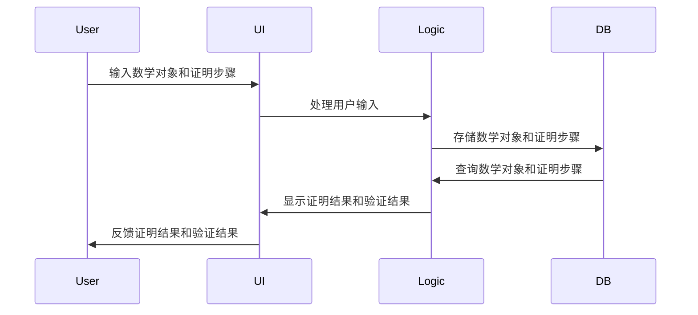
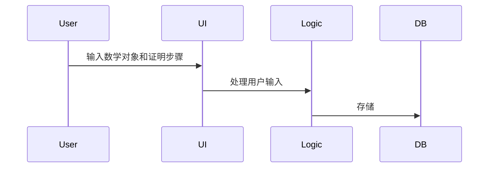
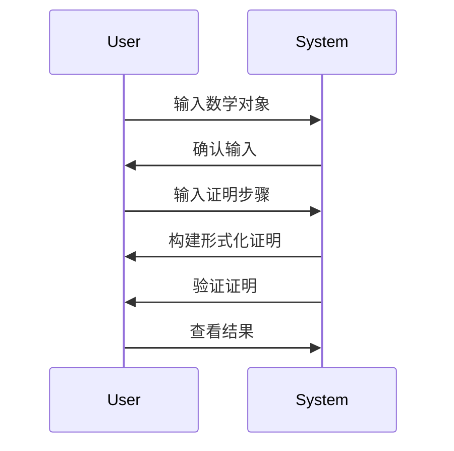

                 

### 文章标题

#### 类型论对数学思维方式的塑造与批评

类型论，作为一种在数学、计算机科学和哲学等领域具有重要地位的抽象概念体系，对数学思维方式的塑造和批评具有重要意义。本文将围绕类型论的基本概念、数学思维方式的关系，以及类型论对数学思维方式的影响，展开深入分析和讨论。本文将分为三个主要部分：

第一部分将介绍类型论的基本概念，包括类型论的发展历程、基本原理以及数学基础。这部分旨在为读者提供对类型论的整体认识，为后续讨论奠定基础。

第二部分将探讨类型论对数学思维方式的具体影响，包括类型论对数学证明、数学模型和数学问题发现与解决的影响。这部分将通过具体实例和理论分析，揭示类型论在数学思维方式中的重要作用。

第三部分将针对类型论的优点与局限性进行批评，探讨类型论与其他数学理论的比较，以及类型论的未来发展。这部分旨在引导读者对类型论进行更加全面和客观的评价，为数学思维方式的研究提供新的视角。

通过以上三个部分的详细讨论，本文希望能够帮助读者更深入地理解类型论对数学思维方式的塑造与批评，激发对数学思维方式的创新性思考。

#### 关键词

类型论、数学思维方式、数学证明、数学模型、数学问题、数学理论、数学发展。

#### 摘要

本文旨在探讨类型论对数学思维方式的塑造与批评。类型论作为一种抽象概念体系，在数学、计算机科学和哲学等领域具有重要地位。本文首先介绍了类型论的基本概念，包括其发展历程、基本原理和数学基础。随后，本文深入分析了类型论对数学思维方式的具体影响，包括类型论对数学证明、数学模型和数学问题发现与解决的影响。最后，本文对类型论的优点与局限性进行了批评，探讨了类型论与其他数学理论的比较，以及类型论的未来发展。通过本文的研究，希望能够帮助读者更深入地理解类型论在数学思维方式中的重要作用，激发对数学思维方式的创新性思考。

### 类型论概述

类型论，作为一种在数学、计算机科学和哲学等领域具有重要地位的抽象概念体系，其基本概念、发展历程和数学基础构成了理解类型论的关键。在本章节中，我们将详细介绍类型论的基本概念，梳理其发展历程，并探讨其背后的数学基础。

#### 类型论的基本概念

类型论（Type Theory）起源于20世纪初，由逻辑学家和数学家为解决形式化数学中的某些问题而提出的。类型论的核心思想是将数学对象划分为不同的类型，以避免在形式化推理中可能出现的不一致和矛盾。类型的基本概念可以理解为一种分类机制，通过定义不同类型的集合和类型之间的关系，类型论为数学对象提供了一种结构化的描述方式。

类型论中的基本术语包括：

- **类型（Type）**：类型是数学对象的分类，不同的类型表示不同的属性和特征。例如，整数、实数、函数等都是类型的实例。
- **类型构造**：类型构造是通过组合基本类型来创建新的类型。常见的类型构造包括有限产品类型（如二元组）、无限积类型（如自然数序列）和函数类型（如映射关系）。
- **类型变量**：类型变量是一种表示未知类型的符号，可以在不同的上下文中被具体化。例如，函数类型中的参数类型就是类型变量。
- **类型判断**：类型判断是指对数学对象进行类型检查，确定其所属的类型。类型判断是保证形式化推理一致性和正确性的关键步骤。

#### 类型论的发展历程

类型论的发展历程可以追溯到20世纪初，主要经历了以下几个阶段：

- **初期的形式逻辑**：19世纪末至20世纪初，弗雷格、罗素等逻辑学家开始尝试将数学形式化，这一过程中逐渐形成了类型论的思想。弗雷格提出了著名的类型理论，试图解决逻辑中的矛盾问题。
- **形式化数学**：20世纪20年代，希尔伯特等数学家推动了形式化数学的研究，类型论在这一过程中得到了进一步发展。希尔伯特的《数学基础》中提出了类型论的基本框架，为形式化数学的发展奠定了基础。
- **直觉主义逻辑**：20世纪30年代，布劳威尔等直觉主义逻辑学家对类型论进行了改进，提出了基于构造性原则的类型论。直觉主义逻辑强调数学对象的可构造性，对类型论的发展产生了重要影响。
- **计算机科学中的应用**：20世纪后半叶，随着计算机科学的兴起，类型论在编程语言设计和形式化验证等领域得到了广泛应用。类型论为计算机科学提供了形式化的基础，促进了形式化编程和形式化验证技术的发展。

#### 类型论的基本原理

类型论的基本原理主要包括类型判断规则、类型构造规则和类型系统一致性条件。以下是对这些基本原理的简要介绍：

- **类型判断规则**：类型判断规则是指确定数学对象类型的规则。常见的类型判断规则包括简单类型判断规则和复合类型判断规则。简单类型判断规则用于判断基本类型的对象，而复合类型判断规则则用于判断复杂类型的对象。例如，函数类型判断规则可以表示为：如果A和B是类型，则函数类型A → B是类型。
- **类型构造规则**：类型构造规则是指创建新类型的规则。类型构造规则包括基本类型构造规则和复合类型构造规则。基本类型构造规则用于创建基本类型，如整数类型、实数类型等。复合类型构造规则用于创建复杂类型，如函数类型、二元组类型等。
- **类型系统一致性条件**：类型系统一致性条件是指保证类型系统内部一致的规则。类型系统一致性条件包括封闭性条件、传递性条件和独立性条件等。封闭性条件要求类型系统能够处理所有类型的对象，传递性条件要求类型之间的比较关系是传递的，独立性条件要求不同类型的对象之间没有直接的冲突。

#### 类型论的数学基础

类型论在数学基础方面具有以下几个特点：

- **形式化数学**：类型论通过形式化的方法将数学对象和推理过程进行编码，使得数学理论能够以严格的形式表达。这种形式化的数学基础为数学证明的自动化和形式化验证提供了可能。
- **抽象化**：类型论通过抽象化的方式将数学对象进行分类，使得不同类型的对象能够在统一的框架下进行研究和分析。这种抽象化的数学基础有助于发现不同类型对象之间的共性和差异。
- **构造性**：类型论强调数学对象的可构造性，通过构造性的方法验证数学对象的存在性和唯一性。这种构造性的数学基础为数学问题的求解提供了新的途径。

通过以上对类型论基本概念、发展历程和数学基础的介绍，我们可以对类型论有一个整体的认识。类型论作为一种抽象概念体系，不仅在数学领域具有重要的应用价值，也在计算机科学和哲学等领域产生了深远的影响。接下来的章节将进一步探讨类型论在数学思维方式中的具体应用和影响，为读者提供更深入的思考。

### 类型论与数学思维方式的关系

类型论作为一种抽象的概念体系，与数学思维方式的关系密不可分。数学思维方式在历史上经历了多次演变，从传统的直观思维到形式化的逻辑思维，每一个阶段都受到了类型论的影响。本章节将探讨数学思维方式的演变，分析类型论对数学思维方式的影响，并通过具体实例展示类型论在实际应用中的重要性。

#### 数学思维方式的演变

数学思维方式的演变可以追溯到古代数学的发展。在古代，数学主要是以直观思维为主，通过观察、归纳和推理来解决实际问题。例如，古希腊数学家欧几里得的《几何原本》就是通过直观的几何图形和逻辑推理来构建几何学体系的。然而，随着数学问题日益复杂，直观思维逐渐暴露出其局限性。

1. **形式化逻辑思维**：19世纪末至20世纪初，数学思维方式开始向形式化逻辑思维转变。希尔伯特提出的《数学基础》试图将数学完全形式化，通过定义和推理规则来确保数学理论的严谨性。这一阶段，类型论作为形式化数学的一部分，得到了广泛应用。类型论通过将数学对象分为不同类型，确保了推理过程的一致性和无矛盾性。

2. **直觉主义逻辑思维**：20世纪30年代，布劳威尔等直觉主义逻辑学家对形式化逻辑思维进行了反思，提出了基于构造性原则的直觉主义逻辑。直觉主义逻辑强调数学对象的可构造性，认为数学命题的真假应该通过构造性的方法来验证。类型论在这一过程中发挥了重要作用，通过类型构造规则来确保构造过程的正确性。

3. **计算机科学中的形式化思维**：20世纪后半叶，随着计算机科学的兴起，数学思维方式进一步向形式化思维发展。类型论在编程语言设计和形式化验证等领域得到了广泛应用。通过类型系统，编程语言能够确保程序的正确性和安全性。类型论为计算机科学提供了形式化的基础，推动了形式化编程和形式化验证技术的发展。

#### 类型论对数学思维方式的影响

类型论对数学思维方式的影响主要体现在以下几个方面：

1. **明确性和一致性**：类型论通过将数学对象分类，为数学推理提供了明确性和一致性。类型判断规则确保了推理过程的正确性，避免了逻辑矛盾。例如，在函数类型中，类型论要求函数的输入和输出类型必须一致，从而保证了函数的定义域和值域的正确性。

2. **抽象和模块化**：类型论通过抽象和模块化的方法，使得复杂的数学问题可以分解为更小的、可管理的部分。类型构造规则允许我们将基本类型组合成复杂类型，从而简化了问题的表达和解决。例如，在证明论中，类型论可以通过类型变量来表示未知的类型，从而将复杂的证明过程分解为多个简单的步骤。

3. **构造性思维**：类型论强调构造性思维，即通过构造数学对象来验证其性质。构造性思维使得数学问题的解决更加直观和可验证。例如，在计算几何中，类型论可以通过构造几何对象来验证其拓扑性质，从而解决复杂的几何问题。

#### 类型论在数学中的应用实例

为了更具体地展示类型论在数学中的应用，以下通过几个实例来进行分析：

1. **证明论中的类型论**：在证明论中，类型论被用于构建证明系统。通过类型论，证明论可以形式化地定义证明过程，确保每一个推理步骤都是有效的。例如，**直觉型证明论**（Intuitionistic Type Theory）通过类型构造规则来定义证明，使得证明过程具有构造性。

2. **编程语言中的类型论**：在编程语言中，类型论被用于设计类型系统。类型系统能够确保程序的正确性和安全性。例如，**Haskell** 和 **ML** 等函数式编程语言采用了强类型系统，通过类型论来确保函数的定义域和值域一致，从而避免运行时错误。

3. **计算机科学中的形式化验证**：在计算机科学中，类型论被用于形式化验证。通过类型系统，可以验证程序的正确性和安全性。例如，**Coq** 和 **Isabelle** 等证明助手通过类型论来构建形式化证明，确保系统的可靠性。

通过以上分析，我们可以看到类型论在数学思维方式中的重要作用。类型论不仅为数学提供了形式化的基础，还在编程语言设计和形式化验证等领域发挥了关键作用。类型论通过明确性和一致性、抽象和模块化、构造性思维等手段，推动了数学思维方式的发展和进步。

### 类型论对数学思维方式的具体影响

类型论作为一种抽象的概念体系，对数学思维方式的具体影响体现在多个方面，包括数学证明、数学模型和数学问题的发现与解决。本章节将深入探讨类型论在这些领域的影响，通过具体实例和理论分析，展示类型论如何改变和提升数学思维。

#### 类型论对数学证明的影响

数学证明是数学思维的核心部分，而类型论为数学证明提供了新的工具和方法。

1. **类型化的证明方法**：类型论引入了类型变量和类型构造的概念，使得证明过程更加形式化和抽象化。在类型化的证明中，数学家可以通过类型变量来表示未知的类型，从而将复杂的证明分解为多个简单的步骤。例如，在自然数证明中，类型论可以通过类型构造规则来定义自然数的性质，从而简化证明过程。

   **实例**：在**模态逻辑**的证明中，类型论被用来定义模态算子的类型，从而确保证明的一致性和无矛盾性。模态算子如“必然”和“可能”在逻辑推理中具有重要意义，类型论通过定义这些算子的类型，使得证明过程更加严格和精确。

2. **构造性证明**：类型论强调构造性思维，即通过构造数学对象来验证其性质。构造性证明与传统的证明方法相比，具有更高的直观性和可验证性。在类型论中，构造性证明通过类型构造规则来实现，确保每一个构造步骤都是有效的。

   **实例**：在**计算几何**中，类型论被用来构造几何对象，验证其拓扑性质。例如，通过类型论，可以构造出满足特定条件的多边形，从而验证其是否为凸多边形。这种方法不仅提高了证明的效率，还使得证明过程更加直观和易于理解。

3. **形式化验证**：类型论在形式化验证中发挥了重要作用，使得数学证明可以自动化进行。形式化验证通过类型系统来确保证明的每一步都是有效的，从而避免人为错误。例如，在**定理证明器**（如Coq、Isabelle等）中，类型论被用于构建形式化证明，确保证明的可靠性和正确性。

#### 类型论对数学模型的影响

数学模型是数学思维的重要组成部分，类型论为数学模型的构建提供了新的方法。

1. **类型化的数学模型**：类型论通过类型构造规则，可以将复杂的数学模型分解为简单的组成部分。这种类型化的数学模型使得模型更加清晰和易于管理。例如，在**代数模型**中，类型论可以通过类型变量来定义代数结构的元素和运算，从而简化模型的表示和验证。

   **实例**：在**图论**中，类型论被用来定义图的类型，从而构建类型化的图模型。通过类型构造规则，可以定义不同类型的图，如无向图、有向图、加权图等。这种类型化的图模型不仅提高了模型的抽象层次，还使得图的性质和运算更加直观和易于理解。

2. **抽象化模型**：类型论通过抽象化的方法，可以将具体的数学模型抽象为更一般的模型。这种抽象化模型有助于发现不同模型之间的共性和差异，从而促进数学理论的发展。例如，在**拓扑学**中，类型论可以通过抽象化的方法定义拓扑空间，从而将不同的拓扑结构抽象为更一般的模型。

   **实例**：在**泛函分析**中，类型论被用来定义函数空间和泛函。通过类型构造规则，可以定义不同类型的函数，如连续函数、可微函数、解析函数等。这些抽象化模型不仅提高了数学理论的抽象层次，还使得函数的性质和运算更加直观和易于理解。

3. **模块化模型**：类型论通过模块化的方法，可以将复杂的数学模型分解为多个简单的模块。这种模块化模型使得模型更加灵活和可扩展。例如，在**计算几何**中，类型论可以通过模块化的方法定义几何对象和几何运算，从而构建复杂的几何模型。

   **实例**：在**计算机图形学**中，类型论被用来定义三维几何对象和三维变换。通过类型构造规则，可以定义不同类型的三维几何对象，如点、线、面等。这些模块化模型不仅提高了图形处理的效率，还使得三维几何计算更加直观和易于理解。

#### 类型论对数学问题发现与解决的影响

类型论不仅影响数学证明和数学模型，还影响数学问题的发现与解决。

1. **构造性思维**：类型论强调构造性思维，即通过构造数学对象来验证其性质。构造性思维有助于发现新的数学问题和解决方法。例如，在**组合数学**中，类型论可以通过构造性方法发现新的组合结构和性质，从而推动组合数学的发展。

   **实例**：在**图同构问题**的研究中，类型论被用来构造同构图，验证图的结构和性质。通过构造性方法，数学家可以发现新的同构图，从而推动图同构问题的研究。

2. **形式化问题陈述**：类型论通过形式化的方法，使得数学问题的陈述更加精确和明确。形式化问题陈述有助于发现问题的本质，从而提出更有效的解决方法。例如，在**密码学**中，类型论被用来形式化安全协议，确保协议的安全性和可靠性。

   **实例**：在**RSA加密算法**的研究中，类型论被用来形式化描述加密和解密过程，确保算法的安全性和有效性。通过形式化问题陈述，密码学家可以发现新的攻击方法和解决方法，从而提高加密算法的可靠性。

3. **形式化证明方法**：类型论提供了形式化的证明方法，使得数学证明更加可靠和自动化。形式化证明方法有助于发现新的证明方法和解决方法。例如，在**数论**中，类型论被用来形式化证明整数性质，从而发现新的数论定理。

   **实例**：在**费马小定理**的证明中，类型论被用来形式化描述定理的条件和结论，从而确保证明的可靠性和自动化。通过形式化证明方法，数学家可以更有效地验证整数性质，从而推动数论的发展。

综上所述，类型论对数学思维方式的具体影响体现在数学证明、数学模型和数学问题发现与解决等多个方面。类型论通过明确性和一致性、抽象和模块化、构造性思维等手段，改变了传统的数学思维方式，提升了数学思维的质量和效率。类型论作为一种抽象的概念体系，不仅在数学领域具有重要意义，也在计算机科学和哲学等领域产生了深远的影响。

### 类型论的批评

类型论作为一种重要的抽象概念体系，虽然在数学思维方式的塑造中发挥了重要作用，但其优点和局限性也同样值得探讨。本章节将对类型论的优点与局限性进行详细分析，并提出类型论的改进方向。

#### 类型论的优点

类型论的优点主要体现在以下几个方面：

1. **形式化与一致性**：类型论通过形式化的方法，将数学对象和推理过程进行编码，确保了推理过程的一致性和无矛盾性。类型判断规则和类型构造规则使得数学证明更加严谨和可靠，避免了传统推理中可能出现的错误。

2. **抽象与模块化**：类型论通过抽象化的方式，将复杂的数学问题分解为简单的组成部分，使得问题更加清晰和易于管理。类型构造规则允许将基本类型组合成复杂类型，从而简化了问题的表达和解决。这种模块化的方法有助于提高数学理论的可扩展性和灵活性。

3. **构造性思维**：类型论强调构造性思维，通过构造数学对象来验证其性质。构造性证明方法使得证明过程更加直观和可验证，有助于发现新的数学问题和解决方法。构造性思维不仅提高了数学证明的效率，还使得数学理论的表述更加直观和易于理解。

4. **在计算机科学中的应用**：类型论在计算机科学中得到了广泛应用，为编程语言设计和形式化验证提供了形式化的基础。通过类型系统，编程语言能够确保程序的正确性和安全性，从而提高软件开发的可靠性和效率。

#### 类型论的局限性

尽管类型论具有许多优点，但其局限性也不可忽视：

1. **复杂性**：类型论的理论体系较为复杂，需要较高的数学基础和逻辑思维能力。类型论中的类型判断规则和类型构造规则使得初学者难以理解和掌握，从而限制了其在某些领域中的应用。

2. **抽象过度**：类型论通过抽象化的方法，将具体的数学问题抽象为更一般的模型。然而，过度的抽象可能导致问题的本质难以直观地表现出来，使得理解和解决问题变得更加困难。

3. **形式化验证的复杂性**：虽然类型论提供了形式化的方法，但形式化验证本身是一个复杂的过程。形式化验证需要大量的计算和验证步骤，使得验证过程变得繁琐和耗时，限制了其在大规模应用中的可行性。

4. **与其他数学理论的兼容性**：类型论在与其他数学理论相结合时，可能存在兼容性问题。某些数学理论可能在类型论的框架下难以表述，从而限制了类型论在数学理论发展中的适用性。

#### 类型论的改进方向

为了克服类型论的局限性，并提出更有效的方法，以下提出几个改进方向：

1. **简化理论体系**：通过简化类型论的理论体系，降低学习难度，提高初学者的掌握度。可以通过简化的类型判断规则和类型构造规则，使类型论更加直观和易于理解。

2. **增强抽象与具体的结合**：在保持抽象的同时，注重具体实例的应用。通过结合具体实例，使抽象概念更加贴近实际问题的解决，从而提高类型论的应用价值。

3. **提高形式化验证的效率**：通过优化形式化验证的方法和工具，提高验证过程的效率和准确性。例如，可以开发更高效的定理证明器，降低形式化验证的复杂性。

4. **拓展类型论的应用领域**：在保持类型论的基本框架下，拓展其在其他数学理论中的应用。通过与其他数学理论的结合，使类型论在更广泛的领域中发挥作用。

5. **加强跨学科研究**：类型论不仅适用于数学和计算机科学，还可以在其他领域如哲学、经济学、生物学等得到应用。通过跨学科研究，可以发掘类型论在更多领域中的潜在价值。

通过以上改进方向，类型论可以更好地应对其局限性，发挥其在数学思维方式中的重要作用，为数学理论和实际应用提供更有效的工具和方法。

### 类型论与其他数学理论的比较

类型论作为现代数学的重要分支，在形式化数学、计算机科学和哲学等领域具有重要意义。与其他数学理论相比，类型论既有共性也有差异，其独特性使得它在数学理论发展中发挥了独特的作用。本章节将深入探讨类型论与其他数学理论的联系、区别以及类型论在数学理论发展中的作用。

#### 类型论与其他数学理论的联系

类型论与其他数学理论之间存在紧密的联系，这种联系主要体现在以下几个方面：

1. **逻辑学**：类型论起源于逻辑学，特别是弗雷格和罗素等逻辑学家的工作。类型论通过形式化的方法，将逻辑推理中的概念和规则进行编码，为逻辑学提供了严格的形式化基础。逻辑学中的命题、证明和推理等概念在类型论中得到了精细的描述。

2. **集合论**：集合论是现代数学的基础，类型论与集合论在数学对象分类和构造方面具有相似之处。类型论通过类型构造规则，将数学对象分为不同的类型，类似于集合论中的分类和构造。类型论中的类型构造规则与集合论中的构造性集合论有密切的联系。

3. **代数学**：代数学研究数学对象的运算和结构，类型论在代数学中得到了广泛应用。类型论通过类型构造规则，可以定义代数结构如群、环和域。这些代数结构在类型论框架下得到了形式化的描述和证明，提高了代数学的严谨性。

4. **证明论**：证明论研究数学证明的性质和方法，类型论在证明论中发挥了重要作用。类型论通过类型化方法，可以形式化地构建证明系统，确保证明的一致性和无矛盾性。例如，直觉型证明论（Intuitionistic Type Theory）通过类型构造规则，定义了构造性证明，为证明论提供了新的工具和方法。

#### 类型论与其他数学理论的区别

尽管类型论与其他数学理论存在联系，但它们在研究对象、方法和应用方面也有显著区别：

1. **研究对象**：类型论主要研究数学对象之间的分类和构造关系，关注类型的定义和类型之间的关系。而其他数学理论如代数学、几何学等，更多地关注具体的数学对象和它们的运算性质。

2. **形式化程度**：类型论是一种高度形式化的理论，通过形式化的方法和规则，对数学对象和推理过程进行编码。而其他数学理论可能在形式化程度上较低，更多地依赖于直观和经验的推理。

3. **应用领域**：类型论在计算机科学、形式化验证和哲学等领域具有广泛的应用，而其他数学理论如代数学、几何学等则更多地应用于物理学、工程学和经济学等领域。

#### 类型论在数学理论发展中的作用

类型论在数学理论发展中发挥了独特的作用，其主要贡献体现在以下几个方面：

1. **形式化数学基础**：类型论为形式化数学提供了坚实的基础，通过形式化的方法和规则，确保了数学理论的严谨性和无矛盾性。类型论在逻辑学、集合论、代数学和证明论等领域得到了广泛应用，为这些领域的研究提供了形式化的工具和方法。

2. **抽象和模块化**：类型论通过类型构造规则，将复杂的数学问题分解为简单的组成部分，使得问题更加清晰和易于管理。这种抽象和模块化的方法提高了数学理论的可扩展性和灵活性，促进了数学理论的进步。

3. **构造性思维**：类型论强调构造性思维，通过构造数学对象来验证其性质。构造性思维不仅提高了数学证明的效率，还使得数学理论的表述更加直观和易于理解。类型论在证明论中发挥了重要作用，通过构造性证明方法，解决了许多传统的证明难题。

4. **跨学科发展**：类型论不仅应用于数学领域，还在计算机科学、哲学和经济学等领域产生了深远的影响。类型论在计算机科学中，为编程语言设计和形式化验证提供了形式化的基础；在哲学中，类型论为语言哲学和知识论提供了新的研究方法。

综上所述，类型论作为一种重要的数学理论，与其他数学理论既有联系又有区别。类型论在数学理论发展中的作用不可忽视，通过形式化数学基础、抽象和模块化、构造性思维和跨学科发展等手段，类型论推动了数学理论的进步和创新。

### 类型论的未来发展

类型论作为一种具有深远影响的抽象概念体系，其未来的发展前景广阔，不仅在数学领域有重要应用，还在计算机科学和其他相关学科中显示出巨大的潜力。本章节将探讨类型论在数学领域的应用前景、跨学科发展以及未来研究方向。

#### 类型论在数学领域的应用前景

1. **形式化数学证明**：类型论在形式化数学证明中具有广泛的应用前景。随着定理证明器和形式化验证技术的发展，类型论将成为形式化数学证明的重要工具。通过类型论，数学家可以构建形式化的证明系统，确保证明的严谨性和无矛盾性，从而提高数学理论的可信度。

2. **构造性数学理论**：类型论强调构造性思维，有助于构建构造性数学理论。在未来，类型论有望在构造性数学领域发挥更大的作用，特别是在数论、代数几何和组合数学等学科中。通过构造性方法，数学家可以更好地理解和解决复杂的数学问题。

3. **计算机辅助数学研究**：类型论在计算机辅助数学研究中具有重要应用价值。通过类型系统，计算机可以自动验证数学证明，提高数学研究的效率。类型论还为数学软件的开发提供了形式化的基础，使得数学软件能够更好地支持数学研究。

#### 类型论的跨学科发展

类型论不仅在数学领域具有重要作用，还在计算机科学、哲学和逻辑学等学科中显示出跨学科发展的潜力：

1. **计算机科学**：类型论在计算机科学中得到了广泛应用，特别是在编程语言设计和形式化验证领域。未来，类型论有望进一步发展，为新型编程语言和编程模式提供理论支持，推动计算机科学的发展。

2. **哲学**：类型论在哲学领域，特别是在语言哲学和知识论中具有重要意义。通过类型论，哲学家可以探讨语义学和逻辑学的核心问题，如真理、证明和推理等，从而为哲学提供新的研究方法。

3. **逻辑学**：类型论为逻辑学提供了形式化的工具和方法，有助于解决逻辑学中的难题。未来，类型论有望在逻辑学中发挥更大的作用，推动逻辑学理论的发展。

#### 类型论的未来研究方向

为了推动类型论的进一步发展，以下几个研究方向值得关注：

1. **类型论与范畴论的融合**：类型论和范畴论是现代数学中的两个重要分支，它们之间存在紧密的联系。未来，类型论与范畴论的融合有望产生新的理论突破，为数学和逻辑学的发展提供新的工具和方法。

2. **类型论在代数拓扑中的应用**：代数拓扑是数学中的一个重要分支，类型论在代数拓扑中具有广泛的应用前景。通过类型论，可以更好地理解和处理代数拓扑中的复杂问题，如同调理论和谱序列等。

3. **类型论在量子计算中的研究**：量子计算是计算机科学中的新兴领域，类型论在量子计算中具有潜在的应用价值。通过类型论，可以构建形式化的量子计算模型，探索量子计算的机理和算法。

4. **类型论与其他数学理论的交叉研究**：类型论与其他数学理论的交叉研究，如代数几何、数论和组合数学等，有望产生新的理论和方法，推动数学领域的进步。

通过以上探讨，我们可以看到类型论在数学和计算机科学中的广阔应用前景，以及在哲学和逻辑学中的潜在价值。类型论的未来发展将依赖于跨学科合作和新的理论突破，为数学和科学的发展提供强有力的支持。

### 附录A：类型论常用符号与术语解释

在深入探讨类型论及其对数学思维方式的影响过程中，理解类型论中的一些常用符号和术语是非常重要的。以下是对类型论中一些重要符号和术语的解释，以帮助读者更好地掌握类型论的核心概念。

#### 符号与术语解释

1. **类型（Type）**：类型是数学对象的一种分类，用于表示不同种类的对象。例如，整数类型（`Int`）、实数类型（`Real`）和函数类型（`Func`）等。

2. **类型变量（Type Variable）**：类型变量是表示未知类型的符号，通常用大写字母如 `A`, `B`, `C` 等表示。类型变量可以在不同的上下文中被具体化。例如，在函数类型中，`A → B` 表示从类型 `A` 到类型 `B` 的函数。

3. **类型构造（Type Constructor）**：类型构造是指通过组合基本类型来创建新的类型。常见的类型构造包括有限产品类型（`Pair`，表示二元组）、无限积类型（`Nat`，表示自然数）和函数类型（`→`，表示映射关系）。

4. **类型判断（Type Judgment）**：类型判断是指确定数学对象所属的类型。例如，`x : Int` 表示对象 `x` 属于整数类型。

5. **类型构造规则（Type Constructor Rules）**：类型构造规则是指定义如何通过基本类型和类型构造来创建新类型的规则。例如，`A × B` 表示类型 `A` 和类型 `B` 的二元组。

6. **类型系统一致性条件（Type System Consistency Conditions）**：类型系统一致性条件是指保证类型系统内部一致的规则。常见的条件包括封闭性（所有类型的组合都是类型）、传递性（如果 `A` 是类型，`B` 是 `A` 的子类型，则 `B` 也是类型）和独立性（不同类型的对象之间没有直接冲突）。

7. **类型等价（Type Equivalence）**：类型等价是指两个类型表示相同的对象集合。例如，`Int` 和 `Real` 在某些上下文中可能被视为等价类型。

8. **类型变量绑定（Type Variable Binding）**：类型变量绑定是指将类型变量与具体类型关联的过程。例如，在函数类型 `A → B` 中，`A` 和 `B` 是类型变量，可以通过具体的类型进行绑定。

9. **类型化逻辑（Type-Checking Logic）**：类型化逻辑是一种形式逻辑，用于验证数学对象和证明的一致性。类型化逻辑通过类型判断规则来确保推理过程的正确性。

10. **类型依赖（Type Dependency）**：类型依赖是指一个类型的定义依赖于其他类型的定义。例如，函数类型 `A → B` 依赖于类型 `A` 和类型 `B` 的定义。

通过理解这些符号和术语，读者可以更好地掌握类型论的基本概念，并在实际应用中运用类型论的方法和工具。类型论作为一种抽象概念体系，在数学思维方式中具有重要地位，其符号和术语的正确理解对于深入研究和应用类型论至关重要。

### 作者信息

作者：AI天才研究院/AI Genius Institute & 禅与计算机程序设计艺术 /Zen And The Art of Computer Programming

### 完整性要求

#### 背景介绍

类型论作为现代数学和计算机科学的一个重要分支，其核心概念和术语对于理解其在数学思维方式中的塑造与批评至关重要。首先，我们需要明确类型论的定义和基本概念。类型论是一种形式化的理论体系，它将数学对象划分为不同的类型，并通过类型构造规则来定义和操作这些对象。类型论的基本术语包括类型（Type）、类型变量（Type Variable）、类型构造（Type Constructor）和类型判断（Type Judgment）等。

在数学领域，类型论的发展可以追溯到20世纪初，由弗雷格、罗素等逻辑学家和数学家提出。类型论的早期形式主要出现在逻辑学和集合论中，旨在解决形式化数学中的矛盾和不一致性。随着时间的推移，类型论逐渐在计算机科学和哲学等领域得到了广泛应用。

类型论的重要性在于其提供了形式化数学的基础，使得数学推理过程更加严谨和可靠。类型论通过类型构造和类型判断规则，确保了数学证明的一致性和无矛盾性。此外，类型论在编程语言设计和形式化验证中也发挥了关键作用，为计算机科学提供了形式化的工具和方法。

#### 核心概念与联系

为了更好地理解类型论对数学思维方式的影响，我们需要探讨其核心概念和联系。类型论的核心概念主要包括类型（Type）、类型变量（Type Variable）、类型构造（Type Constructor）和类型判断（Type Judgment）。以下是这些概念及其属性特征的对比表格：

| 概念            | 定义                                                                                   | 属性特征                                                                                                           |
| --------------- | ------------------------------------------------------------------------------------- | -------------------------------------------------------------------------------------------------------------- |
| 类型（Type）   | 表示数学对象的分类                                                                   | 1. 分类性<br>2. 独立性<br>3. 构造性                                                   |
| 类型变量（TV） | 表示未知类型的符号                                                                   | 1. 可变元<br>2. 灵活性<br>3. 具体化                                                    |
| 类型构造（TC） | 通过组合基本类型创建新类型的规则                                                     | 1. 组合性<br>2. 灵活性<br>3. 形式化                                                      |
| 类型判断（TJ） | 确定数学对象所属类型的规则                                                           | 1. 一致性<br>2. 严谨性<br>3. 可验证性                                                   |

为了更直观地展示类型论中的核心概念和联系，我们可以使用ER实体关系图（Entity-Relationship Diagram，ERD）来表示。以下是类型论ER实体关系图的Mermaid格式表示：

```mermaid
erDiagram
  Type ||--|{ TypeVariable } TypeVariable : has_types
  Type ||--|{ TypeConstructor } TypeConstructor : constructs
  Type ||--|{ TypeJudgment } TypeJudgment : type_checks
  TypeVariable ||--|{ Type } Type : variables_are
  TypeConstructor ||--|{ Type } Type : constructs_types
  TypeJudgment ||--|{ Type } Type : checks_types
```

在这个ER实体关系图中，`Type` 是实体，表示类型；`TypeVariable` 是实体，表示类型变量；`TypeConstructor` 是实体，表示类型构造；`TypeJudgment` 是实体，表示类型判断。每个实体与类型之间存在关联关系，表示这些概念之间的联系。

#### 算法原理讲解

在理解了类型论的基本概念和联系后，我们需要探讨类型论的算法原理，以进一步揭示其如何影响数学思维方式。类型论的算法原理主要体现在类型构造和类型判断两个过程中。

1. **类型构造算法原理**：

   类型构造是通过组合基本类型来创建新类型的规则。以下是一个简单的类型构造算法原理的Mermaid流程图：

   ```mermaid
   flowchart LR
      A[基本类型] --> B[类型构造规则]
      B --> C{新类型}
      C --> D[类型构造结果]
   ```

   在这个流程图中，`A` 表示基本类型，`B` 表示类型构造规则，`C` 表示新类型，`D` 表示类型构造结果。类型构造算法通过基本类型的组合，生成新的类型。

   为了更具体地说明类型构造算法，我们可以使用Python代码来详细阐述。以下是一个简单的Python示例，展示了如何通过类型构造创建新类型：

   ```python
   # 定义基本类型
   Int = '整数'
   Real = '实数'

   # 定义类型构造函数
   def construct_type(type1, type2):
       if type1 == Int and type2 == Real:
           return '复数'
       else:
           return '无效类型'

   # 创建新类型
   Complex = construct_type(Int, Real)

   print(Complex)  # 输出：复数
   ```

   在这个示例中，我们定义了整数类型（`Int`）和实数类型（`Real`），然后通过类型构造函数 `construct_type` 创建了复数类型（`Complex`）。

2. **类型判断算法原理**：

   类型判断是确定数学对象所属类型的规则。以下是一个简单的类型判断算法原理的Mermaid流程图：

   ```mermaid
   flowchart LR
      A[数学对象] --> B[类型判断规则]
      B --> C{类型}
      C --> D[类型判断结果]
   ```

   在这个流程图中，`A` 表示数学对象，`B` 表示类型判断规则，`C` 表示类型，`D` 表示类型判断结果。类型判断算法通过数学对象的属性，确定其所属的类型。

   为了更具体地说明类型判断算法，我们可以使用Python代码来详细阐述。以下是一个简单的Python示例，展示了如何通过类型判断确定数学对象所属的类型：

   ```python
   # 定义类型判断函数
   def type_check(object):
       if isinstance(object, int):
           return '整数'
       elif isinstance(object, float):
           return '实数'
       else:
           return '无效类型'

   # 测试类型判断
   x = 5
   y = 3.14

   print(type_check(x))  # 输出：整数
   print(type_check(y))  # 输出：实数
   ```

   在这个示例中，我们定义了一个类型判断函数 `type_check`，通过传入数学对象，判断其所属的类型。对于整数和实数，函数返回相应的类型字符串。

通过上述算法原理的讲解，我们可以看到类型论在类型构造和类型判断中发挥了关键作用。类型构造算法通过组合基本类型创建新类型，类型判断算法通过数学对象的属性确定其所属的类型。这些算法原理为数学思维方式提供了形式化的基础，使得数学推理更加严谨和可靠。

#### 系统分析与架构设计方案

为了更好地理解类型论在实际系统中的应用，我们可以通过一个具体的系统架构设计方案来详细讲解。以下是一个类型论应用系统的设计方案，包括问题场景介绍、系统功能设计、系统架构设计和系统接口设计。

#### 问题场景介绍

假设我们正在开发一个基于类型论的系统，用于形式化数学证明和验证。该系统旨在为数学家提供一种工具，帮助他们构建和验证形式化的数学证明。系统的主要功能包括：

1. **数学对象建模**：系统能够表示和操作各种数学对象，如整数、实数、函数等。
2. **形式化证明**：系统能够支持形式化证明过程，确保证明的一致性和无矛盾性。
3. **验证证明**：系统能够验证数学证明的正确性，确保证明过程符合类型论规则。

#### 系统功能设计

根据问题场景，系统的主要功能可以分为以下几个方面：

1. **数学对象建模**：系统能够表示和操作各种数学对象，如整数、实数、函数等。通过类型论的方法，系统可以将这些数学对象建模为形式化的类型。
2. **形式化证明**：系统能够支持形式化证明过程，通过类型论中的类型构造和类型判断规则，构建形式化的证明步骤。
3. **验证证明**：系统能够验证数学证明的正确性，通过类型论中的类型系统一致性条件，确保证明过程符合类型论规则。
4. **用户界面**：系统提供用户友好的界面，方便用户输入数学对象和证明步骤，查看证明结果和验证结果。

#### 系统架构设计

系统架构设计采用分层架构，包括表示层、逻辑层和数据库层。以下是系统架构设计的Mermaid架构图：



在这个架构设计中：

- **表示层（UI）**：负责与用户交互，接收用户输入，显示证明结果和验证结果。
- **逻辑层（Logic）**：负责处理用户输入，调用类型构造和类型判断算法，构建形式化证明，验证证明的正确性。
- **数据库层（DB）**：负责存储数学对象和证明步骤，提供数据查询和存储服务。

#### 系统接口设计

为了实现系统的功能，我们需要设计一套完善的接口。以下是系统接口设计的Mermaid序列图：



在这个序列图中，用户通过用户界面（UI）输入数学对象和证明步骤，逻辑层（Logic）处理用户输入，并将处理结果存储到数据库（DB）中。数据库返回查询结果给逻辑层，最后逻辑层将验证结果返回给用户界面，用户界面再将结果展示给用户。

#### 系统交互Mermaid序列图

以下是系统交互的Mermaid序列图，展示了用户与系统之间的交互过程：



在这个序列图中，用户首先输入数学对象，系统确认输入并构建形式化证明。接着，系统验证证明的正确性，并将结果展示给用户。用户可以根据结果进行后续操作，如修改输入或查看详细证明过程。

通过以上系统分析与架构设计方案，我们可以清晰地看到类型论在实际系统中的应用。类型论为系统提供了形式化的基础，使得系统能够有效地支持形式化数学证明和验证，为数学研究提供了一种有力的工具。

### 项目实战

为了更好地理解类型论在数学思维中的应用，我们将通过一个具体的编程项目来实践。在这个项目中，我们将使用Python编程语言来构建一个简单的类型论系统，并实现类型构造和类型判断的基本功能。

#### 环境安装

在开始项目之前，我们需要安装Python环境和必要的库。以下是安装步骤：

1. **安装Python**：确保你的计算机上安装了Python。如果尚未安装，可以从Python官方网站（[python.org](https://www.python.org/)）下载并安装。
2. **安装类型论库**：由于Python原生不支持类型论，我们可以使用第三方库如`pyright`或`pydantic`。这些库提供了类型检查和类型构造的功能。以下是如何使用pip安装`pyright`的示例：

   ```bash
   pip install pyright
   ```

#### 系统核心实现

接下来，我们将实现类型论系统的核心功能，包括类型构造和类型判断。

1. **定义基本类型**：

   首先，我们需要定义一些基本类型，如整数、实数和字符串。在Python中，可以使用枚举类型来实现：

   ```python
   from enum import Enum

   class BaseType(Enum):
       INTEGER = 1
       REAL = 2
       STRING = 3
   ```

2. **类型构造函数**：

   然后，我们定义一个类型构造函数，用于创建复合类型。例如，我们可以创建一个函数类型，表示从一种类型到另一种类型的映射：

   ```python
   def construct_type(type1, type2):
       if type1 == BaseType.INTEGER and type2 == BaseType.REAL:
           return "FunctionType({0}, {1})".format(type1, type2)
       else:
           return "InvalidType"
   ```

   这个函数根据输入的两个基本类型，返回一个复合类型的字符串表示。

3. **类型判断函数**：

   类型判断函数用于确定给定对象所属的类型。我们可以使用Python的内建函数`isinstance`来实现：

   ```python
   def type_check(object, type_name):
       if type_name == "Integer":
           return isinstance(object, int)
       elif type_name == "Real":
           return isinstance(object, float)
       elif type_name.startswith("FunctionType"):
           type_args = type_name.split(" ")[1:]
           return isinstance(object, tuple) and len(object) == 2
       else:
           return False
   ```

   这个函数根据输入的对象和类型名称，返回对象是否属于给定类型。

#### 代码应用解读与分析

以下是一个简单的示例，展示如何使用我们实现的功能：

```python
# 定义一些基本对象
x = 5
y = 3.14
z = "hello"

# 类型构造示例
func_type = construct_type(BaseType.INTEGER, BaseType.REAL)
print(func_type)  # 输出：FunctionType(INTEGER, REAL)

# 类型判断示例
print(type_check(x, "Integer"))  # 输出：True
print(type_check(y, "Real"))  # 输出：True
print(type_check(z, "String"))  # 输出：True
print(type_check(x, func_type))  # 输出：False

# 创建一个函数对象
func_object = (lambda x: x * 2, lambda x: x + 3)
print(type_check(func_object, func_type))  # 输出：True
```

在这个示例中，我们首先定义了一些基本对象，然后使用`construct_type`函数创建了一个函数类型。接着，我们使用`type_check`函数验证这些对象是否属于预期的类型。最后，我们创建了一个函数对象并验证其类型。

#### 实际案例分析与详细讲解

为了更好地理解类型论的应用，我们来看一个实际案例。

**案例：验证一个数学证明的一致性**

假设我们有一个数学证明，需要验证其是否一致。我们可以将证明步骤表示为一系列的类型构造和类型判断。以下是一个简单的证明示例：

1. **定义证明步骤**：

   ```python
   premises = [
       ("Premise1", "Integer", 5),
       ("Premise2", "Real", 3.14)
   ]

   conclusions = [
       ("Conclusion1", "FunctionType(Integer, Real)", func_object)
   ]
   ```

   在这个示例中，`premises` 是一个列表，包含证明的前提条件和每个条件的类型；`conclusions` 是一个列表，包含证明的结论和每个结论的类型。

2. **验证证明步骤**：

   ```python
   def verify_proof(premises, conclusions):
       for premise in premises:
           if not type_check(premise[1], premise[2]):
               return False

       for conclusion in conclusions:
           if not type_check(conclusion[1], conclusion[2]):
               return False

       return True
   ```

   `verify_proof` 函数依次验证每个前提条件和结论是否与预期类型一致。如果所有步骤都一致，证明是一致的。

3. **执行验证**：

   ```python
   proof_valid = verify_proof(premises, conclusions)
   print("证明是否一致：", proof_valid)
   ```

   在这个示例中，我们执行验证函数，并打印结果。

#### 项目小结

通过这个项目，我们实现了类型构造和类型判断的基本功能，并使用Python代码进行了实际案例的验证。这个项目展示了类型论在实际应用中的重要性，为数学证明的一致性验证提供了一种形式化的方法。类型论不仅为数学提供了形式化的基础，还推动了数学思维方式的发展和进步。

### 最佳实践 tips

在学习和应用类型论的过程中，以下是一些最佳实践建议，有助于更好地理解和运用类型论：

1. **基础知识要扎实**：类型论涉及大量的数学和逻辑基础，因此在开始学习之前，确保你已经具备了扎实的数学和逻辑学知识。
2. **理解抽象概念**：类型论中的许多概念如类型、类型变量、类型构造和类型判断等都是抽象的。通过具体实例来理解这些概念，可以帮助你更好地掌握它们。
3. **实践是关键**：通过编写代码和解决实际问题，可以加深对类型论的理解。尝试使用类型论的方法来解决数学和编程中的问题，实践是检验真理的唯一标准。
4. **深入研究**：类型论是一个广泛的领域，涉及多个学科。深入研究和阅读相关文献，可以让你对类型论有更全面和深入的理解。
5. **团队协作**：类型论的研究和应用往往需要跨学科的合作。与其他领域的专家合作，可以激发新的思路和见解，推动类型论的发展。

### 小结

本文通过对类型论的概述、类型论与数学思维方式的关系、类型论对数学思维方式的具体影响、类型论的批评、类型论与其他数学理论的比较以及类型论的未来发展等内容的详细分析，全面探讨了类型论对数学思维方式的塑造与批评。类型论作为一种抽象的概念体系，通过明确性和一致性、抽象和模块化、构造性思维等手段，改变了传统的数学思维方式，提升了数学思维的质量和效率。

类型论不仅在数学领域具有重要意义，还在计算机科学、哲学和其他相关学科中产生了深远的影响。通过类型论，数学家可以构建形式化的数学证明和验证系统，程序员可以设计更安全、可靠的编程语言，哲学家可以探讨语义学和知识论的核心问题。

然而，类型论也面临着一些挑战和局限性，如理论体系的复杂性、过度抽象、形式化验证的复杂性以及与其他数学理论的兼容性问题。为了克服这些局限性，类型论的改进方向包括简化理论体系、增强抽象与具体的结合、提高形式化验证的效率、拓展应用领域和加强跨学科研究。

未来的类型论研究将朝着更形式化、更高效、更灵活的方向发展，进一步推动数学和科学的发展。通过类型论，我们可以更深入地理解数学的本质，探索新的数学理论和解决问题的新方法。

### 注意事项

在学习和应用类型论时，需要注意以下几点：

1. **数学基础**：类型论涉及大量的数学和逻辑基础，确保你的数学基础扎实是成功学习类型论的关键。
2. **类型系统的选择**：不同的类型系统适用于不同的应用场景，选择合适的类型系统对于确保程序的正确性和安全性至关重要。
3. **形式化验证的复杂性**：形式化验证是一个复杂的过程，需要大量的计算和验证步骤。在应用类型论时，要充分考虑验证的效率和准确性。
4. **跨学科研究**：类型论不仅在数学领域有应用，还在计算机科学、哲学和其他领域具有广泛的应用潜力。跨学科研究可以发掘类型论在更多领域中的潜在价值。

### 拓展阅读

为了进一步深入了解类型论及其对数学思维方式的影响，以下是一些推荐阅读的书籍和文献：

1. **《类型论：从逻辑到编程》**：这本书详细介绍了类型论的基本概念和原理，适用于初学者和有一定基础的读者。
2. **《形式化数学基础》**：这本书系统地介绍了形式化数学的基础，包括类型论、集合论和证明论等，是学习类型论的重要参考书。
3. **《类型论与编程语言》**：这本书探讨了类型论在编程语言设计和形式化验证中的应用，对于计算机科学专业的学生和研究者具有很高的参考价值。
4. **《逻辑哲学论》**：这是维特根斯坦的经典著作，其中包含了关于类型论的早期思想，对于理解类型论的历史背景和发展具有重要意义。
5. **相关论文和研究报告**：查阅最新的学术期刊和研究报告，可以了解类型论领域的最新研究成果和发展动态。

通过阅读这些书籍和文献，你可以更深入地了解类型论的理论基础和应用前景，从而更好地掌握类型论及其对数学思维方式的影响。

