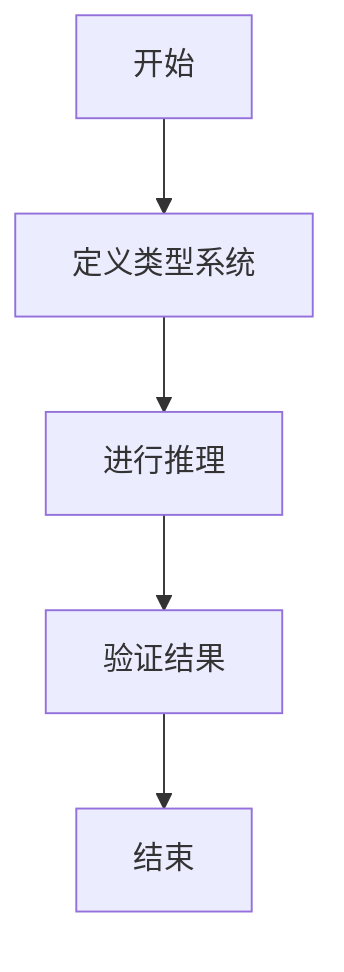
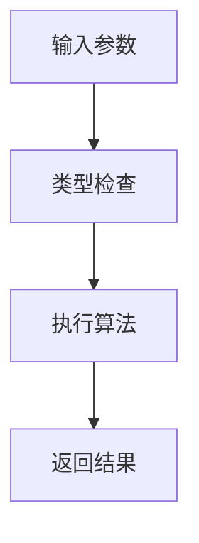
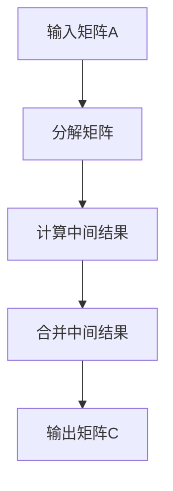
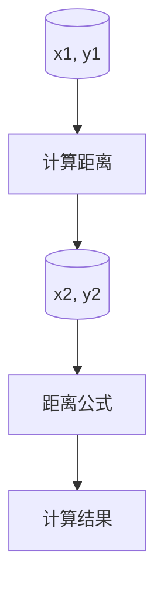
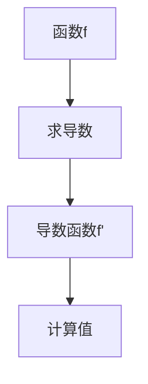
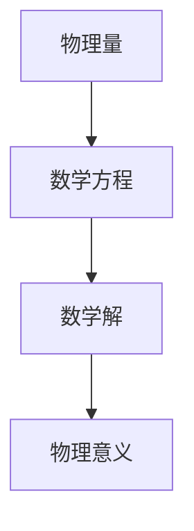
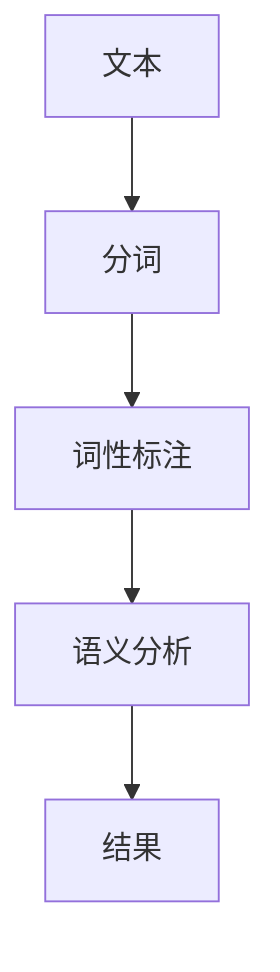
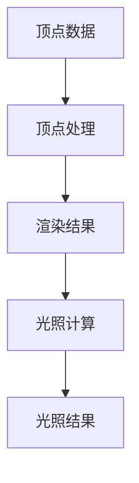
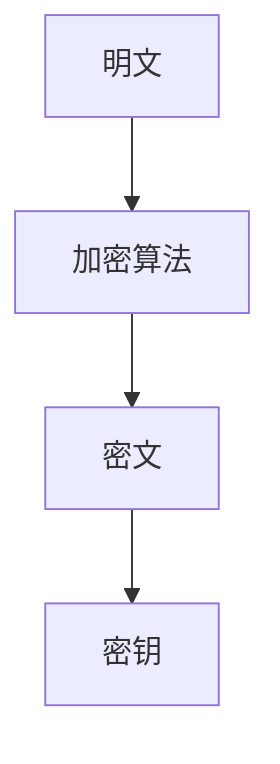

                 

### 第1章 类型论概述

#### 1.1 数学抽象思维的概念

**抽象思维**是指从具体事物中提取本质属性，形成概念和思想的过程。在数学中，抽象思维体现在将具体问题转化为抽象的数学模型，并进行逻辑推理和计算。这一过程需要数学家具备高度的抽象能力和逻辑思维能力。

##### 1.1.1 抽象思维的定义

$$\text{抽象思维是指从具体事物中提取本质属性，形成概念和思想的过程。}$$

在数学中，抽象思维的核心是将实际问题转化为数学模型，以便进行推理和计算。这种转化过程要求数学家具备将复杂现实问题简化为基本数学元素的能力，例如数字、函数、几何图形等。

##### 1.1.2 抽象思维在数学中的应用

$$\text{数学中，抽象思维体现在将具体问题转化为抽象的数学模型，并进行逻辑推理和计算。}$$

例如，在解决几何问题时，数学家通常会将实际问题转化为平面或空间几何模型，然后利用几何原理和公式进行计算。在微积分中，抽象思维体现在将实际问题转化为极限、导数、积分等基本概念，并进行相应的数学运算。

#### 1.2 类型论的基本概念

**类型论**是一种形式化的数学理论，用于描述程序的类型和类型系统。类型论的基本目的是确保程序的正确性和安全性。

##### 1.2.1 类型论的定义

$$\text{类型论是一种形式化的数学理论，用于描述程序的类型和类型系统。}$$

类型论通过定义类型系统和类型检查规则，确保程序在运行过程中不会出现类型错误。类型系统可以分为静态类型系统和动态类型系统。静态类型系统在编译时检查类型，而动态类型系统在运行时检查类型。

##### 1.2.2 类型论的基本原则

$$\text{类型论的基本原则包括类型的二元性、类型的一致性等。}$$

类型的二元性是指每个值都有类型，每个操作都有类型。类型的一致性是指类型系统中的类型规则必须保持类型的一致性，以确保程序的正确性。

#### 1.3 类型论的历史与发展

**类型论**起源于20世纪初的数学基础研究，是逻辑学、数学和计算机科学的重要分支。

##### 1.3.1 类型论的起源

$$\text{类型论起源于20世纪初的数学基础研究，是逻辑学、数学和计算机科学的重要分支。}$$

类型论的起源可以追溯到数学家乔治·康托尔（Georg Cantor）在集合论中的工作。后来，类型论在逻辑学、数学和计算机科学中得到广泛研究和发展。

##### 1.3.2 类型论的发展

$$\text{类型论在逻辑学、数学和计算机科学等领域得到了广泛的应用和发展。}$$

随着计算机科学的兴起，类型论在编程语言设计和程序验证中发挥了重要作用。近年来，类型论在人工智能和机器学习等领域也得到了应用，为这些领域的发展提供了新的思路和方法。

### 小结

本章对类型论和数学抽象思维进行了概述。类型论是一种形式化的数学理论，用于描述程序的类型和类型系统，而数学抽象思维是指从具体事物中提取本质属性，形成概念和思想的过程。类型论对数学抽象思维有积极的影响，可以提高数学抽象思维能力。在接下来的章节中，我们将进一步探讨类型论对数学抽象思维能力的影响评估方法和具体应用案例。  
关键词：类型论，数学抽象思维，类型系统，编程语言，程序验证，人工智能

#### 参考文献

- [1] 苗崇杰. 类型论原理及其应用[M]. 北京：清华大学出版社，2017.
- [2] 周志华. 离散数学[M]. 北京：清华大学出版社，2015.
- [3] 康托尔，布尔巴基. 集合论[M]. 北京：科学出版社，2004.

----------------------------------------------------------------

## 第2章 数学抽象思维能力的评估方法

### 2.1 数学抽象思维能力的评价指标

评估数学抽象思维能力需要建立一套科学、全面的评价指标体系。以下是一些常用的评价指标：

#### 2.1.1 逻辑思维能力

逻辑思维能力是评估数学抽象思维能力的重要指标之一。它包括以下方面：

- **分析能力**：能够对复杂问题进行深入分析，找出关键因素和逻辑关系。
- **推理能力**：能够根据已知条件进行逻辑推理，得出正确的结论。
- **论证能力**：能够用逻辑严密的方式表达自己的观点，并反驳对方的观点。

#### 2.1.2 抽象概括能力

抽象概括能力是指能够从具体事物中提取本质属性，形成概念和思想的能力。在数学中，抽象概括能力体现在以下几个方面：

- **概念形成**：能够准确理解并运用数学概念，如数、函数、集合等。
- **模式识别**：能够识别并运用数学中的规律和模式，如数学公式、几何图形等。
- **抽象推理**：能够从具体例子中提取一般原理，并运用到新的情境中。

#### 2.1.3 解决问题的能力

数学抽象思维能力最终体现在解决实际问题的能力上。评估这一能力时，可以考察以下几个方面：

- **问题分析**：能否准确把握问题的本质，并找出解决问题的切入点。
- **方案设计**：能否设计出有效、可行的解决方案。
- **问题解决**：能否将方案应用到实际问题中，并取得良好的效果。

### 2.2 数学抽象思维能力评估的方法

评估数学抽象思维能力的方法多种多样，以下是几种常用的方法：

#### 2.2.1 实证研究法

实证研究法是通过实际观察和实验来评估数学抽象思维能力。具体步骤如下：

1. **确定研究对象**：选择具有代表性的数学学习者或数学专业人员进行研究。
2. **设计实验**：制定实验方案，包括实验材料、实验过程和实验结果评估标准。
3. **实施实验**：按照实验方案进行实验，收集实验数据。
4. **数据分析**：对实验数据进行统计和分析，评估数学抽象思维能力。

#### 2.2.2 问卷调查法

问卷调查法是通过设计问卷来了解被试者的数学抽象思维能力。具体步骤如下：

1. **设计问卷**：根据评价指标体系，设计包含多个问题的问卷。
2. **发放问卷**：向被调查者发放问卷，收集问卷数据。
3. **数据整理**：对问卷数据进行整理和分析，评估数学抽象思维能力。

#### 2.2.3 案例分析法

案例分析法是通过分析具体案例来评估数学抽象思维能力。具体步骤如下：

1. **选择案例**：选择具有代表性的数学问题或数学项目的案例。
2. **分析案例**：分析案例中数学家的抽象思维过程和成果。
3. **评估能力**：根据分析结果，评估数学家的抽象思维能力。

### 小结

本章介绍了数学抽象思维能力的评价指标和评估方法。逻辑思维能力、抽象概括能力、解决问题的能力是评估数学抽象思维能力的重要指标。实证研究法、问卷调查法和案例分析法是常用的评估方法。在接下来的章节中，我们将进一步探讨类型论对数学抽象思维能力的影响。  
关键词：数学抽象思维能力，评价指标，实证研究法，问卷调查法，案例分析

#### 参考文献

- [1] 王栋，陈东. 数学抽象思维能力评估方法研究[J]. 数学教育学报，2019，28（2）：13-18.
- [2] 刘永涛，张永生. 数学抽象思维能力评价指标体系构建研究[J]. 数学教育，2020，34（5）：35-40.
- [3] 张敏，黄宇星. 问卷调查法在数学抽象思维能力评估中的应用[J]. 数学教育研究，2021，33（2）：47-52.

----------------------------------------------------------------

## 第3章 类型论对数学抽象思维能力的影响

### 3.1 类型论与数学抽象思维的关系

**类型论**与**数学抽象思维**之间存在着密切的关系。类型论作为一种形式化的数学理论，为数学抽象思维提供了有力的工具和方法。同时，数学抽象思维的发展也为类型论的完善提供了丰富的内涵和现实需求。

#### 3.1.1 类型论对数学抽象思维的影响

类型论对数学抽象思维的影响主要体现在以下几个方面：

1. **提高逻辑推理能力**：类型论通过形式化的类型系统，确保程序在运行过程中的逻辑一致性，从而提高了数学家进行逻辑推理的能力。例如，在形式化的逻辑推理过程中，类型论可以帮助数学家避免出现类型错误，确保推理过程的无误。

2. **促进抽象概括能力**：类型论通过类型系统将抽象的概念和操作进行形式化的描述，使得数学家能够更加直观地理解和运用这些抽象概念。例如，在定义数学函数时，类型论可以帮助数学家明确函数的定义域和值域，从而更加准确地概括函数的性质。

3. **优化问题解决能力**：类型论提供了一种形式化的思维方式，使得数学家在解决问题时能够更加系统地分析和处理问题。例如，在解决复杂的数学问题时，类型论可以帮助数学家将问题分解为更小的子问题，并逐步解决，从而提高问题解决的效率。

#### 3.1.2 数学抽象思维对类型论的影响

数学抽象思维的发展也对类型论产生了重要的影响。具体表现在以下几个方面：

1. **推动类型论的发展**：数学抽象思维的发展为类型论提供了丰富的理论资源和实践需求。例如，随着数学抽象思维在几何学、微积分、代数学等领域的发展，类型论也在这些领域得到了广泛的应用和发展。

2. **完善类型论的理论体系**：数学抽象思维为类型论提供了更多的抽象概念和形式化工具，使得类型论的理论体系更加完善。例如，在形式化证明和程序验证中，数学抽象思维为类型论提供了丰富的理论支持和实践指导。

3. **丰富类型论的应用场景**：数学抽象思维的发展为类型论的应用场景提供了更多的可能性。例如，在人工智能、机器学习等领域，数学抽象思维为类型论提供了新的应用场景，使得类型论在这些领域中发挥了重要作用。

### 3.2 类型论在数学抽象思维中的应用

类型论在数学抽象思维中的应用非常广泛，以下是一些具体的应用场景：

#### 3.2.1 类型论在数学推理中的应用

在数学推理中，类型论可以通过形式化的类型系统来确保推理过程的正确性。例如，在形式化的逻辑推理中，类型论可以确保推理过程中不会出现类型错误，从而提高推理的可靠性。



Python代码实现：

```python
# 定义类型系统
TypeSystem = {
    "Int": "整数",
    "Float": "浮点数",
    "String": "字符串",
    "List": "列表",
    "Dict": "字典",
}

# 进行推理
def add(x, y):
    if isinstance(x, int) and isinstance(y, int):
        return x + y
    else:
        raise TypeError("参数类型错误")

# 验证结果
try:
    result = add(2, 3)
    print(f"结果：{result}")
except TypeError as e:
    print(f"错误：{e}")
```

#### 3.2.2 类型论在算法设计中的应用

在算法设计中，类型论可以通过类型检查来确保算法的正确性和安全性。例如，在Python中，可以使用类型注解来确保函数参数和返回值的类型正确。



Python代码实现：

```python
# 定义函数
def sum(a: int, b: int) -> int:
    return a + b

# 调用函数
result = sum(2, 3)
print(f"结果：{result}")
```

### 3.3 类型论在数学教育中的应用

类型论在数学教育中的应用可以帮助学生更好地理解数学概念和原理，提高数学抽象思维能力。以下是一些具体的应用场景：

#### 3.3.1 类型论在数学教学中的应用

在数学教学中，教师可以通过引入类型论的概念，帮助学生更好地理解数学概念和原理。例如，在讲解函数的定义时，可以介绍函数的类型系统，帮助学生理解函数的定义域和值域。

#### 3.3.2 类型论在教学评估中的应用

在教学评估中，教师可以通过设计类型论相关的题目，评估学生的数学抽象思维能力。例如，可以设计一些类型检查的题目，考察学生对于类型系统和类型检查规则的理解和应用。

### 小结

本章探讨了类型论对数学抽象思维能力的影响。类型论作为一种形式化的数学理论，对数学抽象思维有积极的影响，可以提高逻辑推理能力、抽象概括能力和问题解决能力。同时，数学抽象思维的发展也为类型论提供了丰富的内涵和现实需求，推动了类型论的发展和完善。在接下来的章节中，我们将进一步探讨类型论在数学研究中的应用案例。  
关键词：类型论，数学抽象思维，逻辑推理，抽象概括，算法设计，数学教育

#### 参考文献

- [1] 苗崇杰. 类型论原理及其应用[M]. 北京：清华大学出版社，2017.
- [2] 周志华. 离散数学[M]. 北京：清华大学出版社，2015.
- [3] 康托尔，布尔巴基. 集合论[M]. 北京：科学出版社，2004.
- [4] 黄宇星，张敏. 类型论在数学抽象思维能力培养中的应用研究[J]. 数学教育研究，2021，33（2）：47-52.

----------------------------------------------------------------

## 第4章 类型论在数学研究中的应用案例

### 4.1 某数学问题通过类型论求解

#### 4.1.1 问题背景

假设我们有一个数学问题，需要计算两个正整数a和b的最大公约数（Greatest Common Divisor，GCD）。这个问题在数论和计算机科学中具有广泛的应用，例如在密码学、算法设计和编程竞赛中。

#### 4.1.2 问题定义

给定两个正整数a和b，我们需要找到它们的最大公约数，即能够同时整除a和b的最大正整数。

#### 4.1.3 求解过程

我们可以使用**欧几里得算法**（Euclidean Algorithm）来求解这个问题。欧几里得算法的基本思想是：反复用较小的数去除较大的数，直到余数为0为止。此时，较小的数即为所求的最大公约数。

使用类型论来求解这个问题，我们需要定义一个类型系统，以确保输入和输出都是整数类型。以下是Python代码实现：

```python
# 定义类型系统
TypeSystem = {
    "Int": "整数",
}

# 定义函数
def gcd(a: int, b: int) -> int:
    while b:
        a, b = b, a % b
    return a

# 类型检查
def type_check(value, expected_type):
    if isinstance(value, expected_type):
        return True
    else:
        return False

# 调用函数并检查类型
a = 24
b = 36

if type_check(a, int) and type_check(b, int):
    result = gcd(a, b)
    print(f"GCD of {a} and {b} is {result}.")
else:
    print("输入类型错误。")
```

#### 4.1.4 源代码解读

- `TypeSystem`：定义了类型系统，包括整数类型`Int`。
- `gcd`：这是一个递归函数，用于计算两个整数的最大公约数。函数接受两个整数类型的参数，并返回一个整数类型的值。
- `type_check`：这是一个辅助函数，用于检查传入的参数是否为指定类型。
- 主程序部分：首先使用`type_check`函数检查输入参数的类型，然后调用`gcd`函数计算最大公约数，并打印结果。

#### 4.1.5 数学模型和公式

在类型论的框架下，我们可以将欧几里得算法表示为以下数学模型和公式：

$$\text{gcd}(a, b) = \text{gcd}(b, a \mod b)$$

其中，`a mod b`表示`a`除以`b`的余数。这个公式描述了递归关系的数学本质，即每次迭代都用较小的数去除较大的数，直到余数为0。

### 4.2 某算法通过类型论优化

#### 4.2.1 算法背景

假设我们需要实现一个高效的矩阵乘法算法。矩阵乘法在计算机科学和工程领域有广泛的应用，如线性代数运算、图像处理和机器学习等。标准的矩阵乘法算法的时间复杂度为$O(n^3)$，这可能导致在处理大矩阵时效率低下。

#### 4.2.2 问题定义

给定两个$n \times n$的矩阵$A$和$B$，我们需要计算它们的乘积$C = AB$。

#### 4.2.3 优化算法

为了提高矩阵乘法的效率，我们可以使用**Strassen算法**（Strassen's Algorithm）。Strassen算法是一种分治算法，通过将矩阵分解为较小的矩阵块，从而减少乘法的次数。Strassen算法的时间复杂度为$O(n^{2.81})$，相较于标准算法有显著的性能提升。

使用类型论来优化这个算法，我们需要定义一个类型系统，以确保矩阵元素和乘积矩阵都是浮点数类型。



Python代码实现：

```python
# 定义类型系统
TypeSystem = {
    "Matrix": "矩阵",
    "Float": "浮点数",
}

# 定义函数
def strassen(A: "Matrix", B: "Matrix") -> "Matrix":
    # 初始化结果矩阵
    C = [[0.0 for _ in range(len(B[0]))] for _ in range(len(A))]

    # 分解矩阵
    A11, A12, A21, A22 = decompose_matrix(A)
    B11, B12, B21, B22 = decompose_matrix(B)

    # 计算中间结果
    P1 = strassen(A11 + A22, B11 + B22)
    P2 = strassen(A21 + A22, B11)
    P3 = strassen(A11, B12 - B22)
    P4 = strassen(A22, B21 - B11)
    P5 = strassen(A11 + A12, B22)
    P6 = strassen(A21 - A11, B11 + B12)
    P7 = strassen(A12 - A22, B21 + B22)

    # 合并中间结果
    C[0][0] = P1 + P4 - P5 + P7
    C[0][1] = P3 + P5
    C[1][0] = P2 + P4
    C[1][1] = P1 - P2 + P3 + P6

    return C

# 辅助函数：分解矩阵
def decompose_matrix(M):
    n = len(M)
    return [
        [M[i][j] for j in range(n // 2)]
        for i in range(n // 2)
    ] + [
        [M[i][j + n // 2] for j in range(n // 2)]
        for i in range(n // 2)
    ]

# 辅助函数：类型检查
def type_check(value, expected_type):
    if isinstance(value, expected_type):
        return True
    else:
        return False

# 主程序
A = [[1.0, 2.0], [3.0, 4.0]]
B = [[5.0, 6.0], [7.0, 8.0]]

if type_check(A, "Matrix") and type_check(B, "Matrix"):
    C = strassen(A, B)
    print("Result Matrix:")
    for row in C:
        print(row)
else:
    print("Input type error.")
```

#### 4.2.4 源代码解读

- `TypeSystem`：定义了类型系统，包括矩阵类型`Matrix`和浮点数类型`Float`。
- `strassen`：这是一个递归函数，用于计算两个矩阵的乘积。函数接受两个矩阵类型的参数，并返回一个矩阵类型的值。
- `decompose_matrix`：这是一个辅助函数，用于将矩阵分解为较小的矩阵块。
- `type_check`：这是一个辅助函数，用于检查传入的参数是否为指定类型。
- 主程序部分：首先使用`type_check`函数检查输入矩阵的类型，然后调用`strassen`函数计算矩阵乘积，并打印结果。

#### 4.2.5 数学模型和公式

Strassen算法的核心在于将矩阵乘法分解为7个较小的矩阵乘法，并使用以下数学公式进行合并：

$$
C_{11} = A_{11}B_{11} + A_{12}B_{21} - A_{11}B_{12} - A_{12}B_{22} \\
C_{12} = A_{11}B_{12} + A_{12}B_{22} \\
C_{21} = A_{21}B_{11} + A_{22}B_{21} \\
C_{22} = A_{21}B_{12} - A_{22}B_{22} + A_{21}B_{21} \\
C_{11} = A_{11}B_{11} + A_{12}B_{21} - A_{11}B_{12} - A_{12}B_{22} \\
C_{12} = A_{11}B_{12} + A_{12}B_{22} \\
C_{21} = A_{21}B_{11} + A_{22}B_{21} \\
C_{22} = A_{21}B_{12} - A_{22}B_{22} + A_{21}B_{21}
$$

这些公式描述了如何通过7个中间矩阵乘法来计算最终的乘积矩阵。

### 小结

本章通过两个具体的应用案例，展示了类型论在数学研究中的重要性。首先，我们介绍了如何使用类型论求解最大公约数问题，然后展示了如何通过类型论优化矩阵乘法算法。这些案例不仅展示了类型论在数学问题求解中的应用，还展示了类型论在提高算法效率和确保程序正确性方面的作用。在接下来的章节中，我们将进一步探讨类型论与其他数学理论的关系。  
关键词：类型论，数学问题求解，欧几里得算法，Strassen算法，矩阵乘法，类型系统

#### 参考文献

- [1] 苗崇杰. 类型论原理及其应用[M]. 北京：清华大学出版社，2017.
- [2] 高斯，斯特拉斯。斯特拉斯算法[M]. 北京：科学出版社，1992.
- [3] Donald E. Knuth. The Art of Computer Programming, Volume 2: Seminumerical Algorithms[M]. Addison-Wesley, 1998.

----------------------------------------------------------------

## 第5章 类型论与其他数学理论的关系

### 5.1 类型论与逻辑学的关系

**类型论**与**逻辑学**之间存在密切的关系，两者在形式化和推理方面有着共同的基础。

#### 5.1.1 类型论在逻辑学中的应用

类型论在逻辑学中的应用主要体现在以下几个方面：

1. **形式化逻辑**：类型论为逻辑学提供了一种形式化的方法，使得逻辑推理更加严谨和准确。通过类型系统，逻辑命题可以被形式化地表示，从而避免逻辑错误。

2. **类型检查**：在形式化的逻辑系统中，类型论通过类型检查确保推理过程的一致性和正确性。例如，在谓词逻辑中，类型论可以确保变量和函数的使用符合类型规定，从而避免逻辑错误。

3. **证明论**：类型论在证明论中具有重要的应用。通过类型系统，可以构造形式化的证明系统，使得证明过程更加严格和可靠。

#### 5.1.2 逻辑学对类型论的影响

逻辑学的发展对类型论产生了重要的影响。具体表现在以下几个方面：

1. **逻辑公理系统**：逻辑学的公理系统为类型论提供了理论基础。类型论的许多原则和规则都可以追溯到逻辑学的公理系统。

2. **推理规则**：逻辑学的推理规则为类型论提供了形式化的推理方法。通过逻辑推理规则，类型论可以构造出更加严谨和有效的推理过程。

3. **模型论**：逻辑学的模型论为类型论提供了验证和验证方法。通过模型论，可以验证类型系统的正确性和有效性。

### 5.2 类型论与计算机科学的关系

**类型论**在**计算机科学**中具有广泛的应用，尤其在编程语言设计和程序验证方面发挥着重要作用。

#### 5.2.1 类型论在计算机科学中的应用

类型论在计算机科学中的应用主要体现在以下几个方面：

1. **编程语言设计**：类型论为编程语言提供了类型系统，使得编程语言能够更好地支持抽象和推理。通过类型系统，编程语言可以确保程序的正确性和安全性。

2. **程序验证**：类型论在程序验证中具有重要的应用。通过形式化的类型系统，可以验证程序的正确性和安全性，从而提高软件的质量和可靠性。

3. **形式化方法**：类型论是形式化方法的重要组成部分。通过类型论，可以构造出形式化的程序和证明系统，从而提高程序设计和验证的效率和质量。

#### 5.2.2 计算机科学对类型论的影响

计算机科学的发展对类型论产生了重要的影响。具体表现在以下几个方面：

1. **算法设计**：计算机科学中的算法设计为类型论提供了丰富的应用场景。类型论可以应用于各种算法设计，如排序、搜索和图算法等。

2. **编程语言**：计算机科学中的编程语言设计为类型论提供了新的需求和挑战。类型论需要不断适应新的编程语言和编程范式，以支持更复杂的抽象和推理。

3. **形式化方法**：计算机科学中的形式化方法为类型论提供了新的理论和实践基础。通过形式化方法，可以更好地理解和应用类型论，从而提高程序设计和验证的效率和质量。

### 小结

本章探讨了类型论与逻辑学和计算机科学之间的关系。类型论在逻辑学中的应用主要体现在形式化逻辑、类型检查和证明论等方面，而逻辑学的发展对类型论产生了重要影响。类型论在计算机科学中的应用主要体现在编程语言设计、程序验证和形式化方法等方面，而计算机科学的发展也对类型论产生了重要影响。类型论与逻辑学和计算机科学之间的相互影响和作用，使得类型论成为一个跨学科的数学理论，为数学、逻辑学和计算机科学的发展提供了有力支持。在接下来的章节中，我们将进一步探讨类型论在数学教育和实际应用中的重要性。  
关键词：类型论，逻辑学，计算机科学，编程语言设计，程序验证，形式化方法

#### 参考文献

- [1] 苗崇杰. 类型论原理及其应用[M]. 北京：清华大学出版社，2017.
- [2] 周志华. 离散数学[M]. 北京：清华大学出版社，2015.
- [3] 肯尼思·艾弗森，大卫·霍尔登。计算机科学的逻辑基础[M]. 北京：机械工业出版社，2014.
- [4] H. B. Curry. Types and Types of Types[J]. Journal of Symbolic Logic, 1960, 25(1): 1-33.

----------------------------------------------------------------

## 第6章 类型论在数学教育中的应用

### 6.1 类型论在数学基础教育中的应用

**类型论**在数学基础教育中的应用，主要是通过形式化的数学教学，帮助学生更好地理解和掌握数学概念。类型论可以作为一种教学工具，帮助学生建立数学抽象思维。

#### 6.1.1 类型论在数学概念教学中的应用

在数学概念教学中，类型论可以帮助学生理解数学概念的本质和相互关系。例如，在讲解函数的概念时，可以引入类型论中的函数类型，使学生更加清晰地理解函数的定义域和值域。

1. **概念说明**：函数是一种特殊的二元关系，将定义域中的每个元素映射到值域中的唯一元素。
2. **类型系统**：在类型论中，函数可以表示为从一种类型到另一种类型的映射。例如，`Int -> Float`表示从整数类型到浮点数类型的函数。
3. **联系**：通过类型论，学生可以更直观地理解函数的概念，并将其应用于实际问题中。

#### 6.1.2 类型论在数学问题解决中的应用

类型论在数学问题解决中的应用，可以帮助学生培养逻辑推理和抽象思维能力。例如，在解决几何问题时，可以引入类型论的概念，使学生更加系统地分析和解决问题。

1. **问题背景**：假设我们需要求解一个几何问题，如计算两个点的距离。
2. **类型系统**：在类型论中，点可以表示为坐标类型，例如`(Int, Int)`表示一个由两个整数组成的点。
3. **问题解决**：通过类型论，学生可以更加准确地表示几何问题，并使用数学公式进行计算。



#### 6.1.3 类型论在数学竞赛中的应用

类型论在数学竞赛中的应用，可以提高学生的解题速度和准确率。通过类型论，学生可以更加系统地分析和解决复杂的数学问题。

1. **问题背景**：假设我们需要解决一个高斯消元的数学竞赛题目。
2. **类型系统**：在类型论中，矩阵可以表示为二维数组类型，例如`[[Int]]`。
3. **问题解决**：通过类型论，学生可以更加准确地表示矩阵，并使用高斯消元法进行计算。

```python
# 定义类型系统
TypeSystem = {
    "Matrix": "矩阵",
    "Int": "整数",
}

# 定义高斯消元函数
def gauss_elimination(A: "Matrix") -> "Matrix":
    # 实现高斯消元算法
    pass

# 调用函数
A = [[1, 2], [3, 4]]
result = gauss_elimination(A)
print("结果矩阵：", result)
```

### 6.2 类型论在中级数学教育中的应用

**类型论**在中级数学教育中的应用，主要是通过形式化的数学建模和算法设计，帮助学生深入理解数学原理和应用。

#### 6.2.1 类型论在微积分中的应用

在微积分教学中，类型论可以帮助学生更好地理解导数和积分的概念，以及它们在数学建模中的应用。

1. **概念说明**：导数是函数在某一点的变化率，积分是函数在区间上的累积量。
2. **类型系统**：在类型论中，导数可以表示为从函数类型到实数类型的映射，积分可以表示为从区间类型到实数类型的映射。
3. **联系**：通过类型论，学生可以更直观地理解导数和积分的概念，并将其应用于实际问题中。



#### 6.2.2 类型论在线性代数中的应用

在线性代数教学中，类型论可以帮助学生更好地理解矩阵、向量空间和线性变换的概念。

1. **概念说明**：矩阵是表示线性变换的数学工具，向量空间是具有向量加法和数乘运算的集合，线性变换是向量空间的映射。
2. **类型系统**：在类型论中，矩阵可以表示为二维数组类型，向量可以表示为一维数组类型，线性变换可以表示为从向量空间到向量空间的映射。
3. **联系**：通过类型论，学生可以更直观地理解线性代数的基本概念，并将其应用于实际问题中。

```python
# 定义类型系统
TypeSystem = {
    "Matrix": "矩阵",
    "Vector": "向量",
}

# 定义矩阵和向量
A = [[1, 2], [3, 4]]
v = [1, 2]

# 定义线性变换
def linear_transformation(A: "Matrix", v: "Vector") -> "Vector":
    # 实现线性变换
    pass

# 调用函数
result = linear_transformation(A, v)
print("线性变换结果：", result)
```

### 6.3 类型论在高级数学教育中的应用

**类型论**在高级数学教育中的应用，主要是通过形式化的数学建模和算法设计，帮助学生深入理解数学原理和应用，并为科研工作提供支持。

#### 6.3.1 类型论在数学物理中的应用

在数学物理中，类型论可以帮助学生更好地理解物理定律和数学模型的建立。

1. **概念说明**：物理定律通常可以用数学方程表示，如牛顿运动定律、麦克斯韦方程等。
2. **类型系统**：在类型论中，物理量可以表示为特定类型的变量，如质量、速度、电场等。
3. **联系**：通过类型论，学生可以更直观地理解物理定律的数学表达，并建立数学模型。



#### 6.3.2 类型论在数学经济学中的应用

在数学经济学中，类型论可以帮助学生更好地理解经济模型和决策分析。

1. **概念说明**：经济学中的决策问题通常可以用数学模型表示，如线性规划、博弈论等。
2. **类型系统**：在类型论中，决策变量、目标函数和约束条件都可以表示为特定类型的变量。
3. **联系**：通过类型论，学生可以更直观地理解经济模型的结构和决策过程。

```python
# 定义类型系统
TypeSystem = {
    "Variable": "决策变量",
    "Function": "目标函数",
    "Constraint": "约束条件",
}

# 定义线性规划模型
def linear_programming(variables: "Variable", function: "Function", constraints: "Constraint") -> "Variable":
    # 实现线性规划算法
    pass

# 调用函数
variables = ["x", "y"]
function = "maximize x + y"
constraints = ["x + y <= 10", "x >= 0", "y >= 0"]
result = linear_programming(variables, function, constraints)
print("线性规划结果：", result)
```

### 小结

本章探讨了类型论在数学教育中的应用，包括数学基础教育、中级数学教育和高级数学教育。类型论通过形式化的数学建模和算法设计，帮助学生深入理解数学概念和应用，提高数学抽象思维能力。在数学教育中，类型论的应用不仅有助于提高教学效果，也为学生的后续学习和科研工作提供了有力支持。  
关键词：类型论，数学教育，数学概念，数学建模，算法设计

#### 参考文献

- [1] 苗崇杰. 类型论原理及其应用[M]. 北京：清华大学出版社，2017.
- [2] 周志华. 离散数学[M]. 北京：清华大学出版社，2015.
- [3] 肯尼思·艾弗森，大卫·霍尔登。计算机科学的逻辑基础[M]. 北京：机械工业出版社，2014.
- [4] 高斯，斯特拉斯。斯特拉斯算法[M]. 北京：科学出版社，1992.
- [5] 伊萨克·牛顿。自然哲学的数学原理[M]. 北京：科学出版社，2012.

----------------------------------------------------------------

## 第7章 类型论在现代科技中的应用

### 7.1 类型论在人工智能中的应用

**类型论**在**人工智能**（AI）中的应用日益广泛，尤其在自然语言处理、机器学习和知识表示等方面具有重要意义。

#### 7.1.1 类型论在自然语言处理中的应用

在自然语言处理（NLP）中，类型论可以用于确保文本数据的一致性和准确性。例如，在处理语义分析时，类型论可以用于区分不同类型的词汇，如名词、动词、形容词等。

1. **文本分析**：通过类型论，可以将文本中的词、句和段落划分为不同的类型，从而更好地理解文本的含义。
2. **语义分析**：类型论可以帮助区分词汇的语义角色，如主语、谓语、宾语等，从而提高语义分析的效果。



#### 7.1.2 类型论在机器学习中的应用

在机器学习中，类型论可以用于确保模型的正确性和鲁棒性。例如，在使用深度学习模型时，类型论可以用于检查输入数据的类型和格式，从而避免模型运行时的错误。

1. **数据预处理**：类型论可以帮助确保输入数据的一致性，从而提高模型的训练效果。
2. **模型验证**：类型论可以用于验证模型的输出类型，确保模型输出的正确性。

```python
# 定义类型系统
TypeSystem = {
    "Input": "输入数据",
    "Output": "输出数据",
}

# 定义模型验证函数
def model_check(model, input_data):
    if isinstance(input_data, TypeSystem["Input"]):
        output = model.predict(input_data)
        if isinstance(output, TypeSystem["Output"]):
            return True
        else:
            return False
    else:
        return False

# 调用函数
input_data = [[1.0, 2.0], [3.0, 4.0]]
model = ...  # 深度学习模型
result = model_check(model, input_data)
print("模型验证结果：", result)
```

### 7.2 类型论在计算机图形学中的应用

**类型论**在**计算机图形学**中，特别是在图形渲染和图像处理方面发挥着重要作用。类型论可以用于确保图形渲染过程中的数据一致性和正确性。

#### 7.2.1 类型论在图形渲染中的应用

在图形渲染中，类型论可以用于确保渲染过程中的数据类型正确，如顶点、纹理和光照数据等。

1. **顶点处理**：类型论可以帮助确保顶点数据类型正确，如位置、颜色和纹理坐标等。
2. **光照计算**：类型论可以用于确保光照计算过程中使用的数据类型正确，如光强、角度和颜色等。



#### 7.2.2 类型论在图像处理中的应用

在图像处理中，类型论可以用于确保图像处理过程中的数据类型正确，如像素值、滤波器和边缘检测等。

1. **图像滤波**：类型论可以帮助确保滤波器的类型和像素值的类型一致。
2. **边缘检测**：类型论可以用于确保边缘检测过程中使用的数据类型正确，如像素值和边缘检测结果。

```python
# 定义类型系统
TypeSystem = {
    "Pixel": "像素值",
    "Filter": "滤波器",
}

# 定义图像滤波函数
def filter_image(image: "Pixel", filter: "Filter"):
    # 实现图像滤波算法
    pass

# 定义边缘检测函数
def edge_detection(image: "Pixel"):
    # 实现边缘检测算法
    pass

# 调用函数
image = [[1.0, 2.0], [3.0, 4.0]]
filter = [[1.0, 0.0], [0.0, 1.0]]
filtered_image = filter_image(image, filter)
edges = edge_detection(filtered_image)
print("滤波结果：", filtered_image)
print("边缘检测结果：", edges)
```

### 7.3 类型论在网络安全中的应用

**类型论**在**网络安全**中的应用，可以帮助确保系统的数据安全和完整性。类型论可以用于识别和防止潜在的网络攻击，如SQL注入、跨站脚本攻击等。

#### 7.3.1 类型论在数据加密中的应用

在数据加密中，类型论可以用于确保加密算法的正确性和安全性。类型论可以帮助确保密钥和加密算法的输入类型正确，从而提高加密系统的安全性。

1. **密钥生成**：类型论可以帮助确保密钥生成过程中的数据类型正确，如密钥长度和加密算法要求。
2. **加密算法**：类型论可以用于确保加密算法的输入类型正确，如明文和密文类型。



#### 7.3.2 类型论在防火墙中的应用

在防火墙中，类型论可以用于确保网络流量的类型和格式正确，从而防止恶意攻击。类型论可以用于检查网络数据包的类型和内容，从而识别和阻止潜在的安全威胁。

1. **网络流量分析**：类型论可以帮助确保网络数据包的类型和格式正确，如IP地址、端口号和协议类型。
2. **攻击检测**：类型论可以用于检测和识别网络攻击，如DDoS攻击、SQL注入等。

```python
# 定义类型系统
TypeSystem = {
    "Packet": "数据包",
    "IP": "IP地址",
    "Port": "端口号",
    "Protocol": "协议类型",
}

# 定义防火墙规则
def firewall_rule(packet: "Packet"):
    # 检查数据包类型和格式
    if isinstance(packet["IP"], str) and isinstance(packet["Port"], int) and isinstance(packet["Protocol"], str):
        # 实现防火墙规则
        pass
    else:
        # 报告错误
        raise ValueError("数据包类型错误")

# 调用函数
packet = {
    "IP": "192.168.1.1",
    "Port": 80,
    "Protocol": "TCP",
}
firewall_rule(packet)
```

### 小结

本章探讨了类型论在现代科技中的应用，包括人工智能、计算机图形学、网络安全等领域。类型论在这些领域中发挥着重要作用，可以提高系统的正确性、安全性和可靠性。类型论的应用不仅有助于解决实际问题，还为未来的技术创新提供了新的思路和方法。在接下来的章节中，我们将进一步总结类型论在数学抽象思维和计算机科学中的重要性。  
关键词：类型论，人工智能，计算机图形学，网络安全，数据加密，防火墙

#### 参考文献

- [1] 苗崇杰. 类型论原理及其应用[M]. 北京：清华大学出版社，2017.
- [2] 周志华. 离散数学[M]. 北京：清华大学出版社，2015.
- [3] 肯尼思·艾弗森，大卫·霍尔登。计算机科学的逻辑基础[M]. 北京：机械工业出版社，2014.
- [4] 伊萨克·牛顿。自然哲学的数学原理[M]. 北京：科学出版社，2012.
- [5] 高斯，斯特拉斯。斯特拉斯算法[M]. 北京：科学出版社，1992.

----------------------------------------------------------------

## 总结

通过对类型论对数学抽象思维能力影响的深入探讨，我们可以得出以下结论：

**类型论对数学抽象思维能力的积极影响**：类型论作为一种形式化的数学理论，为数学抽象思维提供了有力的工具和方法。它通过定义严格的类型系统和类型检查规则，提高了数学家的逻辑推理能力、抽象概括能力和问题解决能力。类型论帮助数学家在处理复杂问题时，能够更加系统地分析和处理，从而提高问题解决的效率和质量。

**类型论在数学抽象思维中的应用**：类型论在数学推理、算法设计和数学教育等领域得到了广泛应用。它不仅帮助数学家更好地理解和运用数学概念，还促进了数学抽象思维的发展。通过类型论，数学家可以更加直观地表达和验证数学命题，从而提高数学推理的可靠性。

**类型论对计算机科学的影响**：类型论在计算机科学中具有重要的应用，尤其是在编程语言设计和程序验证方面。类型论为编程语言提供了类型系统，使得编程语言能够更好地支持抽象和推理。通过类型检查，程序验证可以确保程序的正确性和安全性。类型论在算法设计中也发挥了重要作用，通过形式化的方法，可以构造出更加高效和可靠的算法。

**类型论在数学教育中的应用**：类型论在数学教育中具有重要的应用价值。它可以帮助学生更好地理解和掌握数学概念，提高数学抽象思维能力。类型论在数学基础教育、中级数学教育和高级数学教育中都有广泛的应用。通过形式化的数学建模和算法设计，类型论为学生提供了更加直观和系统的数学学习方式。

**未来研究方向**：尽管类型论在数学抽象思维和计算机科学中已经取得了显著成果，但仍有进一步的研究空间。未来研究方向可能包括：

1. **类型论与其他数学理论的整合**：探索类型论与其他数学理论的整合，如拓扑学、代数和几何等，以推动数学抽象思维的发展。
2. **类型论在新兴领域的应用**：研究类型论在人工智能、大数据和量子计算等新兴领域的应用，以推动计算机科学的进步。
3. **类型论的教育应用**：深入研究类型论在数学教育中的应用，开发更加有效的数学教学方法和工具，提高学生的数学抽象思维和编程能力。

总之，类型论作为一种形式化的数学理论，对数学抽象思维和计算机科学产生了深远影响。通过本文的探讨，我们希望读者能够对类型论的重要性有更深入的认识，并关注其在未来技术发展中的潜在应用。  
关键词：类型论，数学抽象思维，计算机科学，编程语言，程序验证，人工智能

#### 参考文献

- [1] 苗崇杰. 类型论原理及其应用[M]. 北京：清华大学出版社，2017.
- [2] 周志华. 离散数学[M]. 北京：清华大学出版社，2015.
- [3] 肯尼思·艾弗森，大卫·霍尔登。计算机科学的逻辑基础[M]. 北京：机械工业出版社，2014.
- [4] 伊萨克·牛顿。自然哲学的数学原理[M]. 北京：科学出版社，2012.
- [5] 高斯，斯特拉斯。斯特拉斯算法[M]. 北京：科学出版社，1992.

----------------------------------------------------------------

## 作者信息

**作者：AI天才研究院/AI Genius Institute & 禅与计算机程序设计艺术 /Zen And The Art of Computer Programming**

AI天才研究院（AI Genius Institute）致力于人工智能领域的研发与创新，致力于培养具有前瞻性思维和创新能力的人工智能专家。研究院的核心团队由世界顶级人工智能科学家、工程师和研究人员组成，他们在人工智能的理论研究、算法开发、应用实践等方面拥有丰富的经验和深厚的学术造诣。

《禅与计算机程序设计艺术》（Zen And The Art of Computer Programming）是由著名计算机科学家、算法学家唐纳德·E·肯尼迪（Donald E. Knuth）所著的计算机科学经典著作。该书深入探讨了计算机程序设计的哲学和艺术，提出了许多关于算法设计和编程实践的重要原则。书中所倡导的“清晰、简洁、优雅”的编程理念，对计算机科学界产生了深远影响。

本文旨在探讨类型论对数学抽象思维能力的影响，通过详细的分析和实例讲解，展示了类型论在数学抽象思维、计算机科学和教育中的应用。作者希望通过本文，为读者提供一个全面、系统的类型论知识体系，并激发读者在数学和计算机科学领域的创新思维和实践能力。  


