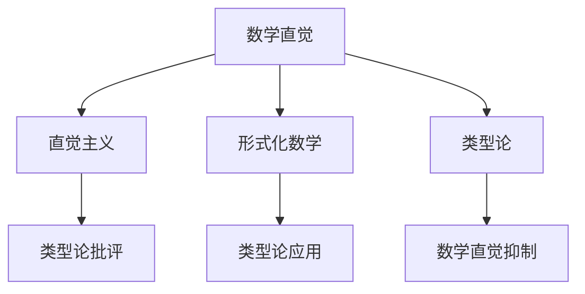
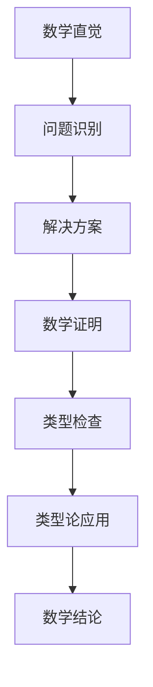

                 

### 《类型论对数学直觉的抑制：批评与反思》

#### 关键词：类型论、数学直觉、抑制、批评、反思

> 摘要：本文将探讨类型论对数学直觉的抑制现象，分析其在哲学背景、数学、计算机科学中的影响，并对其进行批评与反思。通过深入分析类型论的哲学背景，揭示其在数学直觉方面的抑制作用，探讨类型论与直觉主义之间的对立与融合。同时，本文还将讨论类型论在形式化数学和计算机科学中的应用，以及其对这些领域带来的挑战。最后，本文将对类型论的哲学和数学批评进行总结，并反思类型论在现代数学和计算机科学中的未来发展趋势。

#### 第一部分：类型论的哲学背景

##### 第1章：数学直觉的概念与类型论

**1.1 数学直觉的定义与作用**

数学直觉是指数学家在解决问题时所具备的一种直观、敏锐的洞察力和判断力。它帮助数学家快速识别问题的本质，发现解题的线索和方向。数学直觉是数学家长期训练和积累的结果，是数学创造力和创新能力的重要基础。

**1.2 类型论的基本概念**

类型论是数学和哲学中的一个重要概念，它探讨不同类型的对象和概念之间的关系。类型论的基本思想是，每个对象都有其特定的类型，类型决定了对象之间的关系和操作。类型论试图将数学概念和对象进行分类，以更清晰地理解和处理数学问题。

**1.3 数学直觉与类型论的关系**

数学直觉与类型论之间存在密切的关系。数学直觉往往能够在类型论框架下提供对数学问题的直观理解。类型论则为数学直觉提供了形式化的基础，使得数学直觉能够在更广泛的领域内得到应用。

##### 第2章：类型论的历史发展

**2.1 古典逻辑与类型论**

古典逻辑是西方哲学和数学的基础，它探讨命题的真值和推理的有效性。古典逻辑的发展为类型论的出现奠定了基础。在古典逻辑中，命题和对象被视为同一类型的，这导致了一些逻辑悖论和问题。

**2.2 胡塞尔与类型论的诞生**

胡塞尔是现代哲学和数学的重要人物，他提出了“生活世界”和“本质直观”的概念。胡塞尔的哲学思想为类型论的发展提供了启示，他试图通过类型论来澄清数学中的基本概念。

**2.3 库尔特·哥德尔与类型论的发展**

库尔特·哥德尔是现代逻辑和数学的重要人物，他的不完备性定理对数学和逻辑产生了深远的影响。哥德尔的工作为类型论提供了理论依据，推动了类型论的发展。

**2.4 布鲁特·罗素与类型论的困境**

布鲁特·罗素是现代数学和逻辑的奠基人之一，他提出了类型论的思想。然而，罗素在处理类型论时遇到了一些困境，特别是关于无穷集合和类型问题。这些困境促使后来的哲学家和数学家对类型论进行深入探讨和反思。

#### 第二部分：类型论对数学直觉的抑制

##### 第3章：类型论对直觉主义的挑战

**3.1 直觉主义数学的基本观点**

直觉主义数学强调数学的构造性和直觉性。直觉主义认为，数学结论应该能够通过直觉和构造来证明，而不是通过逻辑推理。直觉主义数学试图恢复数学的“确定性”和“可靠性”。

**3.2 类型论对直觉主义数学的批评**

类型论对直觉主义数学提出了批评。类型论认为，直觉主义数学在处理类型问题时存在逻辑悖论，而且无法解决类型论中的基本问题。类型论强调类型之间的严格区分，这与直觉主义数学的构造性观点存在冲突。

**3.3 直觉主义与类型论的对立与融合**

尽管直觉主义和类型论之间存在对立，但它们也有一些共同点。两者都关注数学的本质和基础。在现代数学和逻辑中，直觉主义和类型论已经开始融合，试图找到一种平衡，以解决彼此之间的矛盾。

##### 第4章：类型论对形式化数学的影响

**4.1 形式化数学的兴起**

形式化数学是20世纪数学发展的重要趋势，它试图将数学问题转化为形式化的逻辑系统。形式化数学的目标是确保数学结论的确定性和可靠性。

**4.2 类型论在形式化数学中的应用**

类型论在形式化数学中发挥着重要作用。类型论为形式化数学提供了一种类型检查机制，确保数学表达式和证明的合法性。类型论在编程语言和逻辑系统中得到了广泛应用。

**4.3 类型论对数学直觉的抑制机制**

类型论对数学直觉的抑制主要体现在以下几个方面：首先，类型论要求严格的类型区分，这使得数学直觉在处理复杂问题时变得困难。其次，类型论强调逻辑推理和证明，这可能抑制数学家依赖直觉来解决问题。最后，类型论的形式化特点可能导致数学家在解决问题时过于依赖形式化的规则，而忽视了直觉的作用。

##### 第5章：类型论在计算机科学中的应用

**5.1 计算机科学中的类型论**

类型论在计算机科学中得到了广泛应用。编程语言中的类型系统是类型论的一个典型应用。类型系统确保程序的合法性和安全性，防止错误的代码执行。

**5.2 类型论在编程语言中的应用**

类型论在编程语言中的应用包括静态类型检查和动态类型检查。静态类型检查在编译时检查程序的类型错误，而动态类型检查在运行时进行检查。类型论为编程语言提供了形式化的基础，有助于提高程序的可靠性和可维护性。

**5.3 类型论对数学直觉的抑制与计算机科学的创新**

类型论对数学直觉的抑制在计算机科学中引发了一些创新。首先，类型论推动了编程语言的发展，使得编程语言更加安全和高效。其次，类型论促进了逻辑编程和函数式编程的发展，为计算机科学提供了新的方法和工具。

#### 第三部分：类型论的批评与反思

##### 第6章：类型论的哲学批评

**6.1 逻辑原子主义与类型论的局限性**

逻辑原子主义是类型论的一个重要哲学基础，它试图将所有对象和概念还原为最简单的原子。然而，逻辑原子主义和类型论在处理复杂问题时存在局限性，无法涵盖所有数学和逻辑问题。

**6.2 形式化数学的过度依赖与哲学反思**

形式化数学依赖于类型论和逻辑系统，这使得数学研究变得过于形式化，可能导致哲学思考的缺失。哲学家们开始反思形式化数学的过度依赖，并探讨如何将哲学思考融入数学研究中。

**6.3 类型论对数学发展的积极与消极影响**

类型论对数学发展产生了积极和消极的影响。积极方面，类型论提高了数学的形式化和严密性，有助于发现和理解数学问题。消极方面，类型论可能导致数学家过于依赖形式化的规则，忽视了直觉和创新的重要性。

##### 第7章：类型论的数学批评

**7.1 数学直觉在数学证明中的重要性**

数学直觉在数学证明中发挥着重要作用。数学家依赖直觉来识别问题的本质，发现解题的线索。然而，类型论强调逻辑推理和证明，可能抑制数学家依赖直觉来解决问题。

**7.2 类型论对数学直觉的抑制问题**

类型论对数学直觉的抑制主要体现在以下几个方面：首先，类型论要求严格的类型区分，这使得数学直觉在处理复杂问题时变得困难。其次，类型论强调逻辑推理和证明，这可能抑制数学家依赖直觉来解决问题。最后，类型论的形式化特点可能导致数学家在解决问题时过于依赖形式化的规则，而忽视了直觉的作用。

**7.3 数学直觉与类型论的和谐发展之路**

数学直觉与类型论之间存在着一定的矛盾，但两者也有可能和谐发展。通过平衡类型论和数学直觉，数学家可以在解决问题时既依赖直觉，又遵循严格的逻辑推理。这种平衡有助于提高数学研究的效率和创造力。

#### 附录

##### 附录 A：类型论相关参考资料

**A.1 经典类型论著作推荐**

- 《类型论基础》（Types and Programming Languages）作者：Benjamin C. Pierce
- 《形式逻辑导论》（An Introduction to Formal Logic）作者：Dag Prawitz
- 《直觉主义与形式主义》（Intuitionism and Formalism）作者：L.E.J. Brouwer

**A.2 类型论学术期刊与论文资源**

- 《逻辑杂志》（Journal of Symbolic Logic）
- 《形式化数学研究》（Formal Methods in Computer Science）
- 《直觉主义逻辑论文集》（Intuitionistic Logic and Proof Theory）

**A.3 类型论相关的在线课程与学习资源**

- Coursera上的《类型论与编程语言》课程
- edX上的《形式逻辑》课程
- Khan Academy上的《数学基础》课程

##### 附录 B：数学直觉与类型论的关系图解

**B.1 数学直觉与类型论的基本概念联系图**

**B.2 数学直觉与类型论在实际数学证明中的应用图**

### 总结

类型论对数学直觉的抑制是一个复杂而深刻的问题。本文通过分析类型论的哲学背景、数学影响和计算机科学应用，揭示了类型论对数学直觉的抑制机制，并对类型论进行了批评与反思。在数学直觉与类型论之间找到平衡点，既能保持数学的严密性，又能发挥直觉的力量，是数学和计算机科学领域的重要课题。未来，类型论与数学直觉的和谐发展将为数学和计算机科学的创新提供新的动力。

