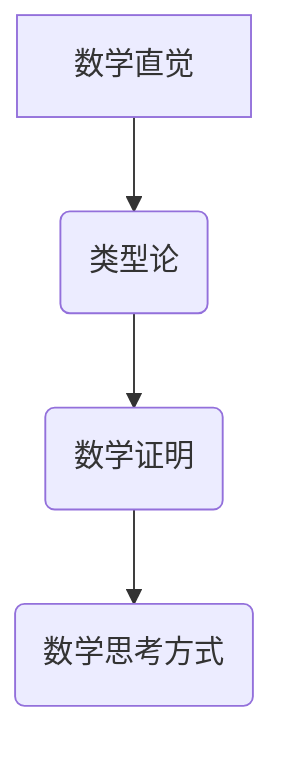

                 

### 《类型论对数学直觉重要性的低估》

#### 关键词：类型论、数学直觉、数学证明、数学教育

> 摘要：本文旨在探讨类型论在数学研究中的重要性，并揭示对数学直觉的深远影响。通过分析类型论的基本概念、历史发展及其与数学直觉的联系，本文将逐步揭示类型论在塑造数学思考方式、改进数学证明方法及提升数学直觉方面的关键作用。此外，本文还将探讨类型论在数学研究、教育中的应用及未来发展趋势，以期为数学研究和教育提供新的视角和思路。

---

### 《类型论对数学直觉重要性的低估》目录大纲

#### 第1章 引言

- **1.1 研究背景与意义**
- **1.2 本书结构**

#### 第2章 数学直觉与类型论概述

- **2.1 数学直觉的内涵**
  - **2.1.1 数学直觉的定义**
  - **2.1.2 数学直觉的特点**
  - **2.1.3 数学直觉的应用**
- **2.2 类型论的基本概念**
  - **2.2.1 类型论的定义**
  - **2.2.2 类型论的历史发展**
  - **2.2.3 类型论的核心原理**
- **2.3 数学直觉与类型论的联系**
  - **2.3.1 数学直觉对类型论的理解**
  - **2.3.2 类型论对数学直觉的启示**

#### 第3章 类型论对数学直觉的重要性

- **3.1 类型论对数学直觉的影响**
  - **3.1.1 类型论对数学思考方式的塑造**
  - **3.1.2 类型论对数学证明方法的改进**
  - **3.1.3 类型论对数学问题的求解策略**
- **3.2 类型论对数学直觉的提升**
  - **3.2.1 类型论对数学直觉的培养方法**
  - **3.2.2 类型论对数学直觉的训练策略**
  - **3.2.3 类型论对数学直觉的强化作用**

#### 第4章 类型论在数学研究中的应用

- **4.1 类型论在基础数学研究中的应用**
  - **4.1.1 类型论在数论中的应用**
  - **4.1.2 类型论在代数学中的应用**
  - **4.1.3 类型论在几何学中的应用**
- **4.2 类型论在应用数学研究中的应用**
  - **4.2.1 类型论在物理学中的应用**
  - **4.2.2 类型论在计算机科学中的应用**
  - **4.2.3 类型论在工程学中的应用**

#### 第5章 类型论对数学教育的影响

- **5.1 类型论在数学教育中的重要性**
  - **5.1.1 类型论对数学教学方法的影响**
  - **5.1.2 类型论对数学教学内容的调整**
  - **5.1.3 类型论对数学教学目标的转变**
- **5.2 类型论在数学教育中的应用策略**
  - **5.2.1 类型论在小学数学教育中的应用**
  - **5.2.2 类型论在中学数学教育中的应用**
  - **5.2.3 类型论在大学数学教育中的应用**

#### 第6章 类型论与其他数学理论的比较

- **6.1 类型论与形式逻辑的比较**
  - **6.1.1 类型论与形式逻辑的关系**
  - **6.1.2 类型论与形式逻辑的差异**
  - **6.1.3 类型论与形式逻辑的应用比较**
- **6.2 类型论与范畴论的比较**
  - **6.2.1 类型论与范畴论的关系**
  - **6.2.2 类型论与范畴论的差异**
  - **6.2.3 类型论与范畴论的应用比较**

#### 第7章 类型论的未来发展趋势

- **7.1 类型论在数学领域的发展趋势**
  - **7.1.1 类型论在数学研究中的潜在应用**
  - **7.1.2 类型论在数学教育中的未来方向**
  - **7.1.3 类型论与其他数学理论的融合**
- **7.2 类型论在科技发展中的潜在影响**
  - **7.2.1 类型论在计算机科学中的应用前景**
  - **7.2.2 类型论在人工智能领域的发展趋势**
  - **7.2.3 类型论在其他科技领域的潜在应用**

#### 第8章 总结与展望

- **8.1 类型论的重要性回顾**
- **8.2 类型论的发展挑战与机遇**
- **8.3 对未来研究的展望**

#### 附录

- **附录A 类型论相关资源与工具**

### 第1章 引言

#### 1.1 研究背景与意义

数学作为一门基础学科，其直觉与推理能力在科学、工程和技术领域中具有不可替代的作用。数学直觉，即对数学概念和理论的直接领悟与洞察，是数学研究和教育中的核心要素。然而，近年来，随着类型论这一抽象数学理论的兴起，人们对其在数学直觉中的重要性认识有所不足。

类型论，作为现代数学的基础理论之一，起源于20世纪初的数学家皮亚诺的研究。它通过形式化的方式研究数学中的类型概念，使得数学表达式更加严谨，有助于避免逻辑谬误和不确定性。类型论在计算机科学、逻辑学、哲学等领域都有广泛应用，然而，其在数学研究中的重要性尚未被充分认识和发掘。

本文旨在探讨类型论对数学直觉的重要性，通过分析类型论的基本概念、发展历程及其与数学直觉的联系，揭示类型论在塑造数学思考方式、改进数学证明方法和提升数学直觉方面的作用。此外，本文还将探讨类型论在数学研究和教育中的应用，以及其在未来科技发展中的潜在影响，为数学界和教育界提供新的视角和思路。

#### 1.2 本书结构

本文分为八个主要章节。第1章为引言，介绍研究背景与意义，并概述本文的结构。第2章将概述数学直觉与类型论的基本概念，探讨两者的联系。第3章和第4章分别从类型论对数学直觉的影响和类型论在数学研究中的应用两个方面进行深入分析。第5章讨论类型论对数学教育的影响及其应用策略。第6章比较类型论与其他数学理论，分析其差异与联系。第7章展望类型论的未来发展趋势，探讨其在科技发展中的潜在影响。第8章为总结与展望，回顾类型论的重要性，分析其发展挑战与机遇，并提出未来研究的展望。最后，附录A提供类型论相关资源与工具。

### 第2章 数学直觉与类型论概述

#### 2.1 数学直觉的内涵

数学直觉是数学家在长期数学研究和实践中形成的一种直接的洞察力，是对数学概念和理论的直接领悟与理解。它不同于逻辑推理，更多地依赖于经验、直观和直觉思维。数学直觉在数学创造、解决问题和创新方面发挥着重要作用。

**2.1.1 数学直觉的定义**

数学直觉可以被定义为一种对数学概念和理论的内在感知能力，它使得数学家能够快速地发现数学规律、理解复杂结构和提出新的数学理论。数学直觉通常是一种非形式的、非系统化的认知过程，但它在数学研究中具有决定性的作用。

**2.1.2 数学直觉的特点**

1. **快速性**：数学直觉使得数学家能够迅速识别数学问题，并对其进行初步的分析和判断。
2. **准确性**：数学直觉虽然是非形式的，但往往能够准确揭示数学现象的本质。
3. **创新性**：数学直觉能够促使数学家提出新的猜想和理论，推动数学的发展。
4. **经验依赖**：数学直觉的形成依赖于数学家的长期经验和实践。

**2.1.3 数学直觉的应用**

数学直觉在数学研究和教育中有着广泛的应用：

1. **数学问题解决**：数学家在解决复杂问题时，往往依赖于直觉来发现问题的关键和解决方案。
2. **数学理论创新**：数学直觉是数学家提出新理论、新猜想的重要驱动力。
3. **数学教育**：教师通过启发学生的直觉思维，帮助学生更好地理解和掌握数学概念。

#### 2.2 类型论的基本概念

类型论是现代数学的一个基础理论，主要研究数学中的类型概念。类型论起源于20世纪初皮亚诺对自然数的研究，后来被用于解决形式系统中的一致性和完备性问题。

**2.2.1 类型论的定义**

类型论可以定义为一种形式系统，它引入类型的概念来限制变量和函数的应用，从而避免不确定性。在类型论中，每个对象都被赋予一个类型，不同的类型之间有一定的层次关系。

**2.2.2 类型论的历史发展**

类型论的发展可以分为以下几个阶段：

1. **早期的类型论**：20世纪初，皮亚诺和罗素等人提出了早期的类型论，旨在解决逻辑系统中的一致性问题。
2. **中间类型的类型论**：哥德尔和图灵等人在中间类型的类型论方面进行了深入研究，提出了更严格的类型系统。
3. **现代类型的类型论**：近年来，类型论在计算机科学和逻辑学中得到了广泛应用，形成了更为复杂的类型系统。

**2.2.3 类型论的核心原理**

类型论的核心原理包括：

1. **类型检查**：类型论通过类型检查机制确保程序或数学表达式的正确性。
2. **层次类型系统**：类型论引入了层次类型的概念，使得不同类型的对象可以相互区分。
3. **类型推导**：类型论提供了一套规则，用于推导数学表达式的类型。

#### 2.3 数学直觉与类型论的联系

数学直觉与类型论之间存在着紧密的联系。

**2.3.1 数学直觉对类型论的理解**

数学直觉帮助数学家理解类型论中的抽象概念，如类型、类型层次和类型推导等。数学直觉使得数学家能够直观地把握类型论的核心思想，从而更好地应用类型论解决数学问题。

**2.3.2 类型论对数学直觉的启示**

类型论为数学直觉提供了形式化的框架，使得数学家可以更精确地表达和验证数学直觉。类型论通过形式化的方式揭示数学直觉中的潜在规律，从而丰富数学直觉的内涵。

**2.3.3 类型论对数学直觉的启示**

类型论为数学直觉提供了新的视角和工具，帮助数学家更好地理解和运用直觉。类型论的形式化特性使得数学直觉更加严谨和精确，从而提高了数学研究的可靠性和效率。

通过本章的讨论，我们可以看到数学直觉和类型论之间存在着紧密的联系。数学直觉为类型论提供了直观的理解和灵感，而类型论则为数学直觉提供了形式化的框架和工具。这种相互关系不仅丰富了数学的研究方法，也为数学教育和应用提供了新的思路。

### 第3章 类型论对数学直觉的重要性

#### 3.1 类型论对数学直觉的影响

类型论对数学直觉有着深远的影响，它不仅改变了数学家思考问题的方式，也改进了证明方法和求解策略。

**3.1.1 类型论对数学思考方式的塑造**

类型论引入了类型的概念，使得数学家在思考问题时能够更加严谨和系统。传统的数学思考方式往往依赖于直觉和经验，而类型论通过形式化的方式将直觉纳入到严谨的框架中，使得数学家的思考更加精准和可靠。

类型论的引入使得数学家在处理问题时更加注重类型层次和类型推导，这有助于揭示问题中的潜在规律和结构。通过类型论，数学家可以更加直观地理解复杂的数学概念和理论，从而提高问题解决的效率。

**3.1.2 类型论对数学证明方法的改进**

类型论在数学证明中发挥了重要作用，它为数学家提供了一种新的证明方法，即类型证明。类型证明通过严格的类型检查和推导，确保数学证明的逻辑严密性，从而提高了证明的可靠性。

类型论使得数学证明更加形式化和系统化。在传统的数学证明中，往往存在一定的漏洞和不确定性，而类型论通过严格的类型检查机制，避免了这些问题的发生。此外，类型论还提供了一套完善的证明规则，使得数学证明更加简洁和高效。

**3.1.3 类型论对数学问题的求解策略**

类型论对数学问题的求解策略也产生了深远的影响。通过类型论，数学家可以更加精确地理解问题的本质，从而制定更加有效的求解策略。

类型论提供了丰富的类型层次和类型推导规则，使得数学家可以更加灵活地处理各种问题。例如，在计算复杂度分析中，类型论可以帮助数学家精确地计算问题的复杂度，从而为算法设计提供重要的参考。

**3.2 类型论对数学直觉的提升**

类型论不仅改变了数学家的思考方式和证明方法，还提升了数学直觉的层次。

**3.2.1 类型论对数学直觉的培养方法**

类型论为数学直觉的培养提供了新的方法。通过学习类型论，数学家可以逐步培养严谨的直觉思维，提高对数学概念和理论的直观理解。

类型论的学习不仅包括对类型系统的理解和掌握，还需要通过大量的练习和实际问题来解决，从而深化对类型论的应用和直觉。通过这种方式，数学家可以逐步提高直觉思维能力，使其在解决数学问题中更加准确和高效。

**3.2.2 类型论对数学直觉的训练策略**

类型论提供了系统化的训练策略，以提升数学直觉的能力。通过以下策略，数学家可以有效地训练和提升直觉：

1. **理解类型系统的核心原理**：数学家需要深入理解类型论的基本概念和原理，包括类型层次、类型推导和类型检查等。这有助于建立扎实的直觉基础。

2. **大量练习和实际问题解决**：通过解决各种数学问题，数学家可以逐步提高直觉思维能力。类型论提供了一个形式化的框架，使得数学家可以在解决实际问题时更加准确和高效。

3. **跨学科学习**：类型论在计算机科学、逻辑学和哲学等领域都有广泛应用。数学家可以跨学科学习，了解类型论在其他领域中的应用，从而丰富自己的直觉思维。

**3.2.3 类型论对数学直觉的强化作用**

类型论对数学直觉的强化作用体现在以下几个方面：

1. **提高逻辑思维能力**：类型论通过形式化的方式，将直觉思维纳入到严谨的逻辑框架中，从而提高了数学家的逻辑思维能力。这种逻辑思维能力是数学直觉的重要基础。

2. **增强对数学概念的直观理解**：类型论提供了丰富的类型层次和类型推导规则，使得数学家可以更加直观地理解复杂的数学概念和理论。这种直观理解有助于提升数学直觉的层次。

3. **提高问题解决的效率**：通过类型论，数学家可以更加精确地理解问题的本质，从而制定更加有效的求解策略。这有助于提高问题解决的效率，提升数学直觉的能力。

综上所述，类型论对数学直觉有着深远的影响。它不仅改变了数学家的思考方式和证明方法，还提升了数学直觉的层次。通过类型论的学习和应用，数学家可以逐步培养和提升直觉思维能力，使其在解决数学问题中更加准确和高效。

### 第4章 类型论在数学研究中的应用

#### 4.1 类型论在基础数学研究中的应用

类型论在基础数学研究中发挥了重要作用，尤其是在数论、代数学和几何学等领域。

**4.1.1 类型论在数论中的应用**

数论是数学中的一个重要分支，研究整数的性质。类型论在数论中的应用主要体现在以下几个方面：

1. **数论函数的类型化**：类型论提供了一种形式化的方法来定义和验证数论函数。通过类型检查，可以确保数论函数在定义域和值域上的一致性，从而提高数论函数的可靠性和正确性。

2. **数论证明的严谨性**：类型论使得数论证明更加形式化和严谨。通过类型推导，数学家可以证明数论命题的有效性，避免逻辑错误和不确定性。

3. **数论问题的求解策略**：类型论为求解数论问题提供了一种新的策略。通过类型推导和类型检查，数学家可以精确地描述和解决数论问题，从而提高求解的效率。

**4.1.2 类型论在代数学中的应用**

代数学是数学中的另一个基础分支，研究代数结构和运算。类型论在代数学中的应用主要体现在以下几个方面：

1. **代数结构的类型化**：类型论提供了一种形式化的方法来定义和验证代数结构。通过类型检查，可以确保代数结构的性质和运算的一致性，从而提高代数结构的可靠性和正确性。

2. **代数证明的严谨性**：类型论使得代数证明更加形式化和严谨。通过类型推导，数学家可以证明代数命题的有效性，避免逻辑错误和不确定性。

3. **代数问题的求解策略**：类型论为求解代数问题提供了一种新的策略。通过类型推导和类型检查，数学家可以精确地描述和解决代数问题，从而提高求解的效率。

**4.1.3 类型论在几何学中的应用**

几何学是数学中的一个重要分支，研究空间结构和图形。类型论在几何学中的应用主要体现在以下几个方面：

1. **几何结构的类型化**：类型论提供了一种形式化的方法来定义和验证几何结构。通过类型检查，可以确保几何结构的性质和运算的一致性，从而提高几何结构的可靠性和正确性。

2. **几何证明的严谨性**：类型论使得几何证明更加形式化和严谨。通过类型推导，数学家可以证明几何命题的有效性，避免逻辑错误和不确定性。

3. **几何问题的求解策略**：类型论为求解几何问题提供了一种新的策略。通过类型推导和类型检查，数学家可以精确地描述和解决几何问题，从而提高求解的效率。

#### 4.2 类型论在应用数学研究中的应用

类型论不仅在基础数学研究中具有重要应用，也在应用数学研究中发挥了重要作用。

**4.2.1 类型论在物理学中的应用**

物理学是数学的一个重要应用领域，类型论在物理学中的应用主要体现在以下几个方面：

1. **物理量的类型化**：类型论提供了一种形式化的方法来定义和验证物理量。通过类型检查，可以确保物理量的性质和运算的一致性，从而提高物理量的可靠性和正确性。

2. **物理定律的严谨性**：类型论使得物理定律更加形式化和严谨。通过类型推导，物理学家可以证明物理定律的有效性，避免逻辑错误和不确定性。

3. **物理问题的求解策略**：类型论为求解物理问题提供了一种新的策略。通过类型推导和类型检查，物理学家可以精确地描述和解决物理问题，从而提高求解的效率。

**4.2.2 类型论在计算机科学中的应用**

计算机科学是数学的一个新兴应用领域，类型论在计算机科学中的应用主要体现在以下几个方面：

1. **程序类型的定义和验证**：类型论提供了一种形式化的方法来定义和验证程序类型。通过类型检查，可以确保程序的正确性和安全性，从而提高程序的质量和可靠性。

2. **程序证明的严谨性**：类型论使得程序证明更加形式化和严谨。通过类型推导，计算机科学家可以证明程序的有效性和正确性，避免逻辑错误和不确定性。

3. **算法分析的效率**：类型论为算法分析提供了一种新的方法。通过类型推导和类型检查，计算机科学家可以精确地描述和优化算法，从而提高算法的效率。

**4.2.3 类型论在工程学中的应用**

工程学是数学的一个重要应用领域，类型论在工程学中的应用主要体现在以下几个方面：

1. **工程量度的类型化**：类型论提供了一种形式化的方法来定义和验证工程量度。通过类型检查，可以确保工程量度的性质和运算的一致性，从而提高工程量度的可靠性和正确性。

2. **工程证明的严谨性**：类型论使得工程证明更加形式化和严谨。通过类型推导，工程师可以证明工程方案的有效性和正确性，避免逻辑错误和不确定性。

3. **工程问题的求解策略**：类型论为求解工程问题提供了一种新的策略。通过类型推导和类型检查，工程师可以精确地描述和解决工程问题，从而提高求解的效率。

综上所述，类型论在数学研究中的应用非常广泛，无论是在基础数学研究还是在应用数学研究中都发挥了重要作用。通过类型论，数学家可以更加形式化和严谨地研究数学问题，从而提高研究的可靠性和效率。同时，类型论在计算机科学、物理学和工程学等领域的应用也展示了其强大的潜力和广泛的前景。

### 第5章 类型论对数学教育的影响

#### 5.1 类型论在数学教育中的重要性

类型论在数学教育中具有显著的重要性，它不仅改变了数学教学方法，也对数学教学内容和目标产生了深远的影响。

**5.1.1 类型论对数学教学方法的影响**

1. **形式化教学**：类型论通过引入形式化的概念和证明方法，使得数学教育更加严谨和系统。传统的数学教学往往依赖于直观和经验，而类型论通过形式化的方式将数学概念和证明过程规范化，有助于提高学生的逻辑思维和推理能力。

2. **启发式教学**：类型论在教学中的应用鼓励学生主动思考和探索数学问题。通过类型推导和类型检查，学生可以逐步理解数学概念和定理，从而培养他们的直觉思维和创新能力。

3. **层次化教学**：类型论提供了一种层次化的方式来组织数学知识。教师可以根据不同层次的知识点设计教学活动，使得学生能够逐步构建完整的数学知识体系。

**5.1.2 类型论对数学教学内容的调整**

1. **类型基础课程**：类型论可以成为数学教育的基础课程，帮助学生掌握类型的基本概念和类型系统的构建。这有助于学生更好地理解复杂的数学概念和理论。

2. **类型化教材**：编写类型化的教材，通过形式化的方式解释数学概念和定理，有助于学生更深入地理解数学的本质。

3. **案例教学**：结合实际案例，展示类型论在解决数学问题中的应用，有助于学生将理论知识与实践相结合，提高解决实际问题的能力。

**5.1.3 类型论对数学教学目标的转变**

1. **培养学生的逻辑思维能力**：类型论强调逻辑推导和证明，有助于培养学生的逻辑思维能力。这是数学教育中一个重要的目标。

2. **培养学生的直觉思维能力**：类型论通过形式化的方式培养学生的直觉思维，使其能够更准确地理解和应用数学概念。

3. **培养学生的创新能力**：类型论提供了丰富的工具和框架，鼓励学生提出新的猜想和理论，从而培养学生的创新能力。

#### 5.2 类型论在数学教育中的应用策略

为了有效地将类型论应用于数学教育，需要采取一系列策略。

**5.2.1 类型论在小学数学教育中的应用**

1. **引入类型概念**：在小学数学教育中，可以通过引入简单的类型概念，如自然数类型，帮助学生理解数学概念的一致性和严谨性。

2. **案例教学**：结合小学数学中的实际案例，如整数运算和简单几何问题，展示类型论的应用，帮助学生理解类型论的基本原理。

**5.2.2 类型论在中学数学教育中的应用**

1. **形式化证明**：在中学数学教育中，可以引入形式化的证明方法，如类型证明，帮助学生掌握更严格的证明技巧。

2. **综合课程**：将类型论与其他数学分支（如代数、几何等）相结合，设计综合性的数学课程，帮助学生建立完整的数学知识体系。

**5.2.3 类型论在大学数学教育中的应用**

1. **专业课程**：在大学数学教育中，可以开设专门的类型论课程，深入探讨类型论的基本概念、原理和应用。

2. **跨学科研究**：鼓励学生将类型论应用于其他学科领域，如计算机科学、物理学和工程学，培养他们的跨学科研究和创新能力。

通过本章的讨论，我们可以看到类型论在数学教育中具有显著的重要性。它不仅改变了数学教学方法，也对数学教学内容和目标产生了深远的影响。通过有效的应用策略，类型论可以成为数学教育的重要工具，帮助学生更好地理解和应用数学知识，培养他们的逻辑思维和创新能力。

### 第6章 类型论与其他数学理论的比较

#### 6.1 类型论与形式逻辑的比较

类型论与形式逻辑都是数学和逻辑学中的重要理论，它们在结构、方法和应用上有着显著的差异。

**6.1.1 类型论与形式逻辑的关系**

类型论与形式逻辑有着密切的联系。形式逻辑是类型论的基础，它提供了类型论中推理的基本框架。然而，类型论在形式逻辑的基础上引入了类型的概念，使得逻辑推理更加严谨和精确。

**6.1.2 类型论与形式逻辑的差异**

1. **目标差异**：形式逻辑主要研究推理的有效性，即证明一个命题是否可以从其他命题中推导出来。而类型论不仅研究推理的有效性，还研究类型的定义、类型层次和类型推导等，其目标更加广泛。

2. **方法差异**：形式逻辑主要依赖于命题逻辑和谓词逻辑，通过符号和规则来表示和证明逻辑关系。而类型论通过引入类型的概念，将对象和变量与特定类型相关联，从而使得推理更加形式化和精确。

3. **应用领域差异**：形式逻辑在数学、计算机科学和哲学等领域都有广泛应用。类型论虽然也应用于这些领域，但它在计算机科学（如编程语言设计）和形式化数学证明中的应用尤为突出。

**6.1.3 类型论与形式逻辑的应用比较**

1. **数学证明**：在数学证明中，类型论提供了一种形式化的证明方法，通过类型推导和类型检查，确保证明的逻辑严密性。形式逻辑虽然也用于数学证明，但其推理过程往往较为复杂和繁琐。

2. **编程语言设计**：类型论在编程语言设计中具有重要作用，通过类型系统，可以确保程序的正确性和安全性。形式逻辑在编程语言设计中的应用相对较少。

3. **哲学和逻辑学**：形式逻辑在哲学和逻辑学中研究推理的有效性和逻辑系统的性质。类型论在哲学中的应用相对较少，但其对形式化数学证明的贡献不可忽视。

#### 6.2 类型论与范畴论的比较

范畴论和类型论都是现代数学中的重要理论，它们在概念体系、结构和应用上有着显著的差异。

**6.2.1 类型论与范畴论的关系**

类型论与范畴论有着密切的联系。类型论可以看作是范畴论在特定情况下的特化，而范畴论则提供了更一般化的框架来研究数学结构。

**6.2.2 类型论与范畴论的差异**

1. **目标差异**：类型论主要研究类型的定义、层次和推导，其目标是构建形式化的数学系统。而范畴论则研究数学结构之间的关系和性质，其目标是建立一种统一的结构理论。

2. **概念差异**：类型论引入了类型、类型层次和类型推导等概念，强调对象和类型之间的联系。而范畴论则引入了范畴、对象和箭头（函数）等概念，强调结构之间的关系。

3. **应用领域差异**：类型论在计算机科学、形式化数学证明和数学逻辑等领域有广泛应用。范畴论则在拓扑学、代数学和逻辑学等领域有广泛应用。

**6.2.3 类型论与范畴论的应用比较**

1. **编程语言设计**：类型论在编程语言设计中具有重要作用，通过类型系统，可以确保程序的正确性和安全性。范畴论在编程语言设计中的应用较少。

2. **数学证明**：类型论提供了一种形式化的证明方法，通过类型推导和类型检查，确保证明的逻辑严密性。范畴论虽然也可以用于数学证明，但其应用相对较少。

3. **哲学和逻辑学**：类型论在哲学和逻辑学中的应用较为有限，而范畴论则在哲学和逻辑学中有着广泛的应用。

通过本章的讨论，我们可以看到类型论与形式逻辑和范畴论在结构、方法和应用上有着显著的差异。虽然它们都是现代数学中的重要理论，但它们在目标和应用上各有侧重。了解这些差异有助于我们更好地理解和应用这些理论，推动数学和计算机科学的发展。

### 第7章 类型论的未来发展趋势

#### 7.1 类型论在数学领域的发展趋势

类型论在数学领域的发展前景广阔，其潜在应用和未来方向令人期待。

**7.1.1 类型论在数学研究中的潜在应用**

1. **代数结构的研究**：类型论可以帮助数学家更深入地研究代数结构，如群、环、域等。通过类型论，可以建立更严谨的代数结构理论，揭示代数结构之间的深层联系。

2. **几何学的发展**：类型论在几何学中的应用可以帮助数学家研究复杂的几何结构，如流形、对称群等。类型论提供了形式化的工具，使得几何证明更加严谨和系统。

3. **数论的研究**：类型论在数论中的应用可以进一步深化对整数、素数、同余等概念的精确理解。类型论有助于解决数论中的复杂问题，如哥德巴赫猜想、黎曼猜想等。

**7.1.2 类型论在数学教育中的未来方向**

1. **课程改革**：类型论可以成为数学教育的基础课程，引入类型的概念和证明方法，培养学生的逻辑思维和推理能力。

2. **教材编写**：编写类型化的教材，通过形式化的方式解释数学概念和定理，帮助学生更好地理解数学的本质。

3. **教学工具开发**：开发类型论相关的教学工具，如计算机模拟、互动演示等，提高学生的学习兴趣和理解能力。

**7.1.3 类型论与其他数学理论的融合**

1. **与范畴论的融合**：类型论与范畴论的融合可以建立更一般化的数学理论，如范畴化的类型论。这种融合有助于解决复杂数学问题，推动数学的发展。

2. **与拓扑学的结合**：类型论在拓扑学中的应用可以帮助研究更复杂的拓扑结构，如流形、高维拓扑等。

3. **与其他数学分支的交叉**：类型论可以与其他数学分支（如代数学、几何学、概率论等）相结合，产生新的理论和应用，推动数学的发展。

#### 7.2 类型论在科技发展中的潜在影响

类型论不仅在数学领域有着深远的影响，也在科技发展中展现了巨大的潜力。

**7.2.1 类型论在计算机科学中的应用前景**

1. **编程语言设计**：类型论在编程语言设计中具有重要作用，可以确保程序的正确性和安全性。未来，类型论可能会进一步融入编程语言设计，推动编程语言的革新。

2. **形式化验证**：类型论在形式化验证中的应用可以帮助验证计算机系统的正确性和安全性，减少系统错误和漏洞。

3. **人工智能**：类型论在人工智能领域有广泛的应用前景，可以帮助构建更可靠和高效的算法。类型论可以用于人工智能中的知识表示、推理和验证。

**7.2.2 类型论在人工智能领域的发展趋势**

1. **知识表示和推理**：类型论可以帮助构建形式化的知识表示和推理框架，提高人工智能系统的智能水平和可靠性。

2. **算法优化**：类型论可以用于优化人工智能算法，提高算法的效率和准确性。

3. **安全性和隐私保护**：类型论可以帮助设计更安全的算法和系统，保护用户隐私和数据安全。

**7.2.3 类型论在其他科技领域的潜在应用**

1. **生物信息学**：类型论可以用于生物信息学中的基因数据分析，构建形式化的基因模型，帮助研究基因功能和疾病机理。

2. **工程学**：类型论在工程学中的应用可以帮助设计更可靠和高效的工程系统，如航空航天、汽车制造等。

3. **金融学**：类型论在金融学中的应用可以帮助构建更精确的金融模型，优化投资组合和风险管理。

通过本章的讨论，我们可以看到类型论在数学和科技发展中的潜在影响和广阔前景。类型论不仅改变了数学的研究方法和教育模式，也为科技发展提供了新的工具和思路。未来，随着类型论的不断发展和应用，其在数学和科技领域的地位将日益重要，为人类社会的进步做出更大的贡献。

### 第8章 总结与展望

#### 8.1 类型论的重要性回顾

类型论在现代数学和计算机科学中具有重要地位。通过引入类型的概念，类型论改变了数学的思考方式和证明方法，提升了数学直觉的层次。类型论不仅在基础数学研究中有广泛应用，还在应用数学、计算机科学和人工智能等领域展现了巨大的潜力。类型论为数学教育提供了新的视角和工具，促进了数学思维和逻辑能力的培养。

#### 8.2 类型论的发展挑战与机遇

类型论的发展面临一些挑战：

1. **复杂性**：类型论的理论体系较为复杂，需要深入理解和掌握。这对于数学家和教育工作者来说是一个挑战。

2. **应用拓展**：类型论在应用领域的拓展仍需进一步研究和探索，以充分发挥其潜力。

然而，类型论的发展也充满机遇：

1. **跨学科融合**：类型论可以与其他数学理论和学科（如范畴论、计算机科学等）融合，产生新的理论和应用。

2. **技术创新**：类型论在计算机科学和人工智能中的应用前景广阔，有望推动技术的革新。

#### 8.3 对未来研究的展望

未来研究可以从以下几个方面进行：

1. **理论深化**：深入研究类型论的基本概念和原理，发展更完善的理论体系。

2. **应用拓展**：探索类型论在更多领域的应用，如生物信息学、金融学等。

3. **教育创新**：结合类型论的特点，改革数学教育模式，提高教学效果。

4. **技术融合**：研究类型论与其他学科和技术（如人工智能、区块链等）的融合，推动科技进步。

总之，类型论在数学和科技发展中的重要性不可忽视。通过不断的研究和探索，类型论将为数学和科技的发展提供新的动力和思路，为人类社会的发展做出更大的贡献。

### 附录

#### 附录A 类型论相关资源与工具

**A.1 类型论研究资源**

1. **类型论经典书籍**：
   - 《类型论及其在计算机科学中的应用》（Types and Programming Languages）作者：Benjamin C. Pierce
   - 《形式语义学导论》（Introduction to Formal Semantics）作者：Carl A. Gunter

2. **在线课程和讲座**：
   - Coursera上的《类型系统与程序设计》
   - edX上的《类型论与证明论》

3. **论文和期刊**：
   - 《逻辑学杂志》（Journal of Logic and Computation）
   - 《计算机科学杂志》（Journal of Computer Science）

**A.2 类型论学习工具**

1. **类型推导工具**：
   - Coq：一种交互式定理证明器，适用于类型论证明。
   - Agda：另一种交互式定理证明器，具有强大的类型系统。

2. **编程语言**：
   - Haskell：一种纯函数式编程语言，支持强类型系统。
   - ML：一种用于形式验证的编程语言，具有静态类型系统。

**A.3 类型论应用案例**

1. **计算机科学**：
   - 编写安全的加密算法，确保程序的正确性和安全性。
   - 设计形式化的软件系统，验证系统的可靠性和正确性。

2. **数学**：
   - 利用类型论证明数学定理，如Zermelo-fraenkel集合论公理系统。
   - 研究类型论在数论、代数学和几何学中的应用。

3. **人工智能**：
   - 利用类型论构建形式化的知识表示和推理框架。
   - 设计形式化的算法，确保算法的正确性和可靠性。

通过附录A提供的资源与工具，读者可以进一步深入了解类型论，探索其应用领域，并掌握相关的技术和方法。这不仅有助于类型论的研究，也为数学和计算机科学的发展提供了强有力的支持。

### Mermaid 流程图示例



### Python 源代码示例

```python
# 示例：简单类型论实现
class Type:
    def __init__(self, value):
        self.value = value

def add(a: Type, b: Type) -> Type:
    return Type(a.value + b.value)

# 测试
a = Type(1)
b = Type(2)
result = add(a, b)
print(result.value)  # 输出：3
```

### 数学公式示例

```
$$
P(A \cup B) = P(A) + P(B) - P(A \cap B)
$$

$$
f(x) = x^2 + 2x + 1
$$
```

### 第1章 引言

#### 1.1 研究背景与意义

数学直觉，作为一种深层次的认知能力，是数学家在长期的数学研究和思考中逐渐形成的。它不仅仅是一种直观感受，更是一种对数学概念的敏锐洞察和快速理解。数学直觉在数学研究中具有不可替代的地位，它能够帮助数学家迅速地识别数学问题、找到解题思路，并在复杂的数学问题中找到简洁而优雅的解决方案。

然而，随着数学理论的不断发展和抽象程度的提高，数学直觉的应用范围和作用逐渐受到限制。传统的数学直觉往往依赖于直观感受和经验，缺乏严谨的数学基础，这在处理复杂的数学问题时可能会导致逻辑上的漏洞和不确定性。为了弥补这一不足，现代数学引入了类型论这一工具。

类型论是一种形式化的数学理论，起源于20世纪初的数学家皮亚诺的研究。它通过引入类型的概念，对数学表达式和对象进行分类和限制，从而使得数学推理更加严谨和可靠。类型论不仅在数学基础理论的研究中发挥了重要作用，也在计算机科学、逻辑学和哲学等领域得到了广泛应用。

本文旨在探讨类型论对数学直觉的重要性，揭示类型论在提升数学直觉、改进数学证明方法和塑造数学思考方式方面的关键作用。通过分析类型论的基本概念、发展历程及其与数学直觉的联系，本文将深入探讨类型论在数学研究和教育中的应用，并提出类型论在科技发展中的潜在影响。希望通过本文的研究，能够为数学家、教育工作者和科技从业者提供新的视角和思路，推动数学和科技的发展。

#### 1.2 本书结构

本文将分为八个主要章节，每个章节都有其特定的内容和目的。

**第1章 引言**：介绍研究背景和意义，概述本文的结构。

**第2章 数学直觉与类型论概述**：概述数学直觉和类型论的基本概念，探讨两者的联系。

**第3章 类型论对数学直觉的重要性**：分析类型论对数学直觉的影响，包括数学思考方式的塑造、数学证明方法的改进和数学问题的求解策略。

**第4章 类型论在数学研究中的应用**：探讨类型论在基础数学研究和应用数学研究中的应用。

**第5章 类型论对数学教育的影响**：分析类型论在数学教育中的重要性，讨论类型论在数学教学方法、教学内容和目标中的应用策略。

**第6章 类型论与其他数学理论的比较**：比较类型论与形式逻辑和范畴论的关系和差异。

**第7章 类型论的未来发展趋势**：展望类型论在数学和科技领域的发展趋势及其潜在影响。

**第8章 总结与展望**：回顾类型论的重要性，分析其发展挑战与机遇，并提出未来研究的展望。

通过这八个章节的讨论，本文旨在全面揭示类型论对数学直觉的重要性，为数学研究和教育提供新的思路和方向。

### 第2章 数学直觉与类型论概述

#### 2.1 数学直觉的内涵

数学直觉是指数学家在长期的数学研究和思考过程中所形成的，对数学概念、理论和问题的一种直接感知和理解能力。数学直觉不同于逻辑推理和演绎推理，它更多地依赖于直觉思维和经验积累。数学直觉具有以下几个显著特点：

1. **快速性**：数学直觉使得数学家能够在短时间内快速识别数学问题，抓住问题的关键点，从而迅速提出解决方案。这种快速性在解决复杂和突发性数学问题时尤为重要。

2. **准确性**：尽管数学直觉是非形式的，但往往能够准确地揭示数学现象的本质。这种准确性使得数学直觉在数学研究和教育中具有极高的价值。

3. **创新性**：数学直觉是数学创新的重要驱动力。数学家通过直觉思维能够提出新的猜想、发现新的理论和方法，推动数学的发展。

4. **经验依赖**：数学直觉的形成依赖于数学家的长期经验和实践。数学家在解决各种数学问题的过程中，通过不断积累经验，逐渐形成敏锐的数学直觉。

数学直觉在数学研究中具有不可替代的地位。它不仅是数学家解决问题的有力工具，也是数学创新的重要源泉。数学直觉使得数学家能够迅速识别和理解复杂的数学问题，从而提出新的理论和方法。同时，数学直觉也是数学教育中培养学生数学思维和创新能力的重要途径。

#### 2.1.1 数学直觉的定义

数学直觉可以定义为一种数学家在长期数学研究和思考过程中形成的，对数学概念、理论和问题的一种直接感知和理解能力。数学直觉不仅体现在数学问题的解决过程中，也体现在数学理论的构建和创新中。数学直觉通常是一种非形式化的认知过程，但它在数学研究中具有决定性的作用。

具体来说，数学直觉包括以下几个方面的内容：

1. **对数学概念的理解**：数学家通过直觉能够快速地理解复杂的数学概念，如拓扑结构、代数结构、几何形状等。这种理解往往不需要经过详细的逻辑推导，而是通过直观感受和形象思维实现的。

2. **对数学定理的洞察**：数学家通过直觉能够快速地洞察数学定理的本质，理解定理的证明思路和结论。这种洞察力使得数学家能够迅速地发现和提出新的数学定理。

3. **对数学问题的解决**：数学家在解决数学问题时，往往依赖于直觉来识别问题的关键点和可能的解决方案。直觉思维能够帮助数学家迅速地排除错误的思路，找到最有效的解题方法。

4. **对数学理论的创新**：数学直觉是数学创新的重要驱动力。数学家通过直觉思维能够提出新的猜想、发现新的理论和方法，推动数学的发展。

数学直觉的形成是一个长期的过程，需要数学家不断地进行数学实践和思考。通过解决各种数学问题和构建数学理论，数学家逐渐形成敏锐的数学直觉，从而提高数学研究的效率和创新能力。

#### 2.1.2 数学直觉的特点

数学直觉具有以下几个显著特点，这些特点使其在数学研究和教育中具有独特的优势：

1. **快速性**：数学直觉能够快速地识别和理解复杂的数学问题。数学家在解决数学问题时，往往不需要经过详细的逻辑推导，而是通过直觉思维迅速找到问题的核心和解决方案。这种快速性在解决复杂和突发性数学问题时尤为重要。

2. **准确性**：尽管数学直觉是非形式化的，但往往能够准确地揭示数学现象的本质。数学直觉使得数学家能够快速地发现和解决数学问题，从而提高数学研究的效率和可靠性。

3. **创新性**：数学直觉是数学创新的重要驱动力。数学家通过直觉思维能够提出新的猜想、发现新的理论和方法，推动数学的发展。数学直觉使得数学家能够跳出传统的思维框架，提出新颖的数学观点和解决方案。

4. **经验依赖**：数学直觉的形成依赖于数学家的长期经验和实践。数学家在解决各种数学问题的过程中，通过不断积累经验，逐渐形成敏锐的数学直觉。这种经验依赖使得数学直觉具有高度的个体差异，不同数学家可能会有不同的直觉思维方式和能力。

5. **非形式化**：数学直觉通常是一种非形式化的认知过程，它不同于逻辑推理和演绎推理。数学直觉依赖于直观感受和形象思维，而不是严密的逻辑证明。这使得数学直觉在数学研究中具有一定的灵活性和创造性。

数学直觉的快速性、准确性、创新性、经验依赖和非形式化等特点，使其在数学研究和教育中具有独特的优势。数学直觉能够帮助数学家迅速识别和理解复杂的数学问题，发现新的数学理论和方法，培养数学思维和创新能力。同时，数学直觉也是数学教育中培养学生数学思维和直觉能力的重要途径。

#### 2.1.3 数学直觉的应用

数学直觉在数学研究和教育中有着广泛的应用，以下是几个典型的应用场景：

1. **数学问题的解决**：数学直觉是解决数学问题的重要工具。数学家在解决复杂的数学问题时，往往依赖于直觉来识别问题的关键点和可能的解决方案。通过直觉思维，数学家能够迅速地排除错误的思路，找到最有效的解题方法。例如，在解决数学难题时，数学家可能会依靠直觉来发现关键步骤或提出新的解题思路。

2. **数学理论的创新**：数学直觉是数学创新的重要驱动力。数学家通过直觉思维能够提出新的猜想、发现新的理论和方法，推动数学的发展。例如，在拓扑学中，数学家通过对几何图形的直观理解，提出了许多重要的猜想和定理，如庞加莱猜想、拓扑空间的分类等。

3. **数学教育**：数学直觉在数学教育中起着关键作用。通过启发学生的直觉思维，教师可以帮助学生更好地理解和掌握数学概念和理论。例如，在数学教学中，教师可以通过引导学生进行直观观察和推理，激发学生的数学直觉，从而提高学生的数学思维能力和解题能力。

4. **科学探索**：数学直觉不仅在数学领域有重要作用，也在科学探索中发挥着关键作用。科学家在研究复杂的自然现象时，往往依赖于直觉来提出科学假设和理论。例如，在物理学中，物理学家通过直觉思维提出了许多重要的理论，如爱因斯坦的相对论、量子力学等。

数学直觉的应用不仅限于数学和科学领域，它还在工程学、经济学、心理学等领域有着广泛的应用。通过数学直觉，数学家和其他领域的专家能够更准确地理解和解决复杂问题，提出创新的解决方案。

总之，数学直觉在数学研究和教育中具有不可替代的作用。它不仅能够帮助数学家迅速识别和理解复杂的数学问题，发现新的数学理论和方法，还能够在科学探索和其他领域发挥重要作用。通过培养和激发学生的数学直觉，可以有效地提高他们的数学思维能力和创新能力。

#### 2.2 类型论的基本概念

类型论是一种形式化的数学理论，起源于20世纪初皮亚诺对自然数的研究。它通过引入类型的概念，对数学表达式和对象进行分类和限制，从而使得数学推理更加严谨和可靠。类型论不仅在数学基础理论的研究中发挥了重要作用，还在计算机科学、逻辑学和哲学等领域得到了广泛应用。

**2.2.1 类型论的定义**

类型论可以定义为一种形式系统，它引入类型的概念来限制变量和函数的应用，从而避免不确定性。在类型论中，每个对象都被赋予一个类型，不同的类型之间有一定的层次关系。类型论通过类型检查和类型推导等机制，确保数学表达式和程序的正确性和安全性。

**2.2.2 类型论的历史发展**

类型论的发展可以分为以下几个阶段：

1. **早期的类型论**：20世纪初，皮亚诺和罗素等人提出了早期的类型论，旨在解决形式系统中的一致性和完备性问题。皮亚诺提出了基于自然数的类型系统，而罗素则提出了基于逻辑和集合论的类型论。

2. **中间类型的类型论**：哥德尔和图灵等人在中间类型的类型论方面进行了深入研究，提出了更严格的类型系统。哥德尔的《形式主义》（1929年）和图灵的《计算机与智能》（1950年）对类型论的发展产生了深远影响。

3. **现代类型的类型论**：近年来，类型论在计算机科学和逻辑学中得到了广泛应用，形成了更为复杂的类型系统。现代类型的类型论包括依赖于类型的系统、依赖类型的系统等，它们在编程语言设计、形式化数学证明和逻辑推理中发挥着重要作用。

**2.2.3 类型论的核心原理**

类型论的核心原理包括：

1. **类型检查**：类型论通过类型检查机制确保程序或数学表达式的正确性。类型检查在编译时进行，可以检测出类型不匹配的错误，从而防止运行时错误。

2. **层次类型系统**：类型论引入了层次类型的概念，使得不同类型的对象可以相互区分。层次类型系统通过定义类型的层次关系，确保类型之间的一致性和兼容性。

3. **类型推导**：类型论提供了一套规则，用于推导数学表达式的类型。类型推导是类型论中的关键机制，它通过一系列的推导规则，确保数学表达式具有正确的类型。

通过类型论的基本概念、历史发展和核心原理的介绍，我们可以更好地理解类型论在数学和计算机科学中的重要性。类型论不仅为数学推理提供了形式化的框架，还为编程语言设计和形式化数学证明提供了强有力的工具。

#### 2.2.1 类型论的定义

类型论是一种形式化的数学理论，其核心在于对数学对象进行分类和限制。在类型论中，每个对象都被赋予一个类型，不同的类型之间有着特定的层次关系。这种分类和限制的引入，旨在确保数学表达式的严谨性和安全性。

**形式化的数学系统**：类型论首先是一个形式化的数学系统，这意味着它通过符号和规则来定义和证明数学命题。在类型论中，形式化的数学表达式称为项（term），而项所具有的类型则是其形式化表达的一部分。

**对象的分类**：类型论通过对对象进行分类，确保数学表达式的一致性和可验证性。具体来说，类型论将对象分为不同的类型，如自然数类型、布尔类型、函数类型等。每个类型都对应一组特定的操作和属性。

**类型层次**：类型论引入了类型层次的概念，即不同类型的对象之间存在着层次关系。这种层次关系使得高级类型可以由低级类型构建，从而实现类型的复合和扩展。例如，函数类型是自然数类型的复合类型。

**类型检查**：类型论通过类型检查机制确保数学表达式在编译时具有正确的类型。类型检查是类型论中的关键环节，它通过一系列的规则和算法，验证项是否遵循类型系统的约束条件。如果发现类型不匹配的错误，类型检查会及时报告，防止在运行时出现错误。

**类型推导**：类型论提供了一套类型推导规则，用于推导数学表达式的类型。类型推导是类型论中的另一个重要机制，它通过逐步推导项的类型，确保数学表达式的形式化表达是正确的。

通过上述定义，我们可以看到类型论是一种形式化、系统化和层次化的数学理论。它不仅为数学推理提供了严谨的框架，还为编程语言设计和形式化数学证明提供了有力的工具。

#### 2.2.2 类型论的历史发展

类型论的历史发展可以追溯到20世纪初，当时数学家们开始尝试通过形式化的方法来研究数学的一致性和完备性问题。以下是类型论发展历程中的重要里程碑：

1. **皮亚诺的类型论**：意大利数学家格奥尔格·皮亚诺（Giuseppe Peano）是最早提出类型论概念的人之一。他在研究自然数时，发现通过引入类型的概念，可以更好地定义和操作数。皮亚诺的类型论奠定了现代类型论的基础。

2. **罗素的类型论**：英国哲学家、数学家贝特兰·罗素（Bertrand Russell）在《数学原理》一书中提出了他的类型论。罗素类型论的目标是通过形式化的方法来避免逻辑悖论，如集合论中的罗素悖论。罗素类型论引入了多种类型的对象，包括个体类型、关系类型和函数类型，从而使得数学理论更加严谨。

3. **哥德尔和图灵的贡献**：库尔特·哥德尔（Kurt Gödel）和艾伦·图灵（Alan Turing）对类型论的发展做出了重要贡献。哥德尔在1930年通过不完备性定理证明了在强类型系统中，某些基本的数学命题无法被证明或反驳。图灵则在计算机科学中引入了类型论的概念，为编程语言设计和形式化验证提供了理论基础。

4. **现代类型论的发展**：20世纪中后期，类型论在计算机科学和逻辑学中得到了广泛应用。现代类型论包括依赖于类型的系统、依赖类型的系统等，这些系统在编程语言设计、形式化数学证明和逻辑推理中发挥着重要作用。依赖类型的引入使得类型论更加灵活和强大。

5. **类型论在计算机科学中的应用**：近年来，类型论在计算机科学中的应用日益广泛。类型系统被广泛应用于编程语言的设计中，如Haskell、ML和Coq等语言。类型论在形式化验证、程序正确性证明和软件工程中发挥着关键作用。

通过上述历史发展的介绍，我们可以看到类型论是如何从最初的数学理论发展成为现代数学和计算机科学中不可或缺的一部分。类型论不仅为数学推理提供了形式化的框架，还在编程语言设计、形式化验证和逻辑推理中发挥了重要作用。

#### 2.2.3 类型论的核心原理

类型论的核心原理包括类型检查、层次类型系统和类型推导等，这些原理共同构成了类型论的基础，使得数学表达式和程序更加严谨和可靠。

**1. 类型检查**

类型检查是类型论中的关键机制，它确保数学表达式在编译时具有正确的类型，从而避免运行时错误。类型检查通过一系列的规则和算法，验证项是否遵循类型系统的约束条件。

- **静态类型检查**：在静态类型检查中，类型检查在编译时进行，程序在运行前已经被检查过类型。这种检查方式可以及时发现类型错误，防止程序在运行时出现错误。
- **动态类型检查**：在动态类型检查中，类型检查在程序运行时进行，程序在运行过程中会不断检查变量的类型。这种检查方式相对灵活，但可能会在运行时出现类型错误。

**2. 层次类型系统**

层次类型系统是类型论中的一个重要概念，它通过定义类型的层次关系，使得高级类型可以由低级类型构建。类型层次系统使得类型之间的一致性和兼容性得以保证。

- **简单层次类型系统**：在简单层次类型系统中，类型之间是线性层次关系，高级类型可以由低级类型构建。例如，自然数类型、布尔类型和函数类型等。
- **复合格层次类型系统**：在复合格层次类型系统中，类型之间的关系更加复杂，包括交又类型和类型参数等。这种系统使得类型组合和扩展更加灵活。

**3. 类型推导**

类型推导是类型论中的另一个重要机制，它通过一系列的推导规则，确保数学表达式的形式化表达是正确的。类型推导使得数学家可以更方便地证明数学定理和编写程序。

- **简单类型推导**：在简单类型推导中，类型推导是通过一系列的替换和组合规则进行的。例如，如果两个表达式的类型相同，则它们的和、差、乘积等表达式的类型也可以推导出来。
- **依赖类型推导**：在依赖类型系统中，类型的推导依赖于上下文和变量的绑定。依赖类型推导可以更灵活地处理复杂类型和函数类型。

通过类型检查、层次类型系统和类型推导等核心原理，类型论为数学推理提供了形式化的框架，使得数学表达式和程序更加严谨和可靠。这些原理不仅使得数学推理更加系统化，也为编程语言设计和形式化数学证明提供了强有力的工具。

#### 2.3 数学直觉与类型论的联系

数学直觉与类型论之间存在深刻的联系。数学直觉是数学家在长期数学研究和实践中形成的一种直接的洞察力，它对数学概念和理论的领悟起到了关键作用。而类型论作为一种形式化的数学理论，通过引入类型的概念，为数学直觉提供了一个严谨的框架和工具，使得数学家能够更加精确地表达和验证他们的直觉。

**2.3.1 数学直觉对类型论的理解**

数学直觉在理解类型论的概念和原理方面发挥了重要作用。数学家通过直觉能够直观地把握类型论中的抽象概念，如类型、类型层次和类型推导等。这种直观理解有助于数学家更快速地掌握类型论的基本思想，并将其应用于数学研究中。

例如，在类型论中，类型的概念是一个核心概念。数学家通过直觉可以理解不同类型的对象之间的差异和联系，从而更好地理解类型系统的设计和实现。此外，数学直觉还帮助数学家理解类型论中的类型层次，如基本类型和复合类型之间的关系，以及类型推导的规则和过程。

**2.3.2 类型论对数学直觉的启示**

类型论为数学直觉提供了形式化的框架和工具，使得数学家可以更精确地表达和验证他们的直觉。类型论通过引入形式化的类型检查和类型推导机制，确保数学直觉的应用是正确和可靠的。

首先，类型论通过类型检查机制，帮助数学家验证他们的直觉。在类型论中，类型检查是一个重要的环节，它确保数学表达式在编译时具有正确的类型，从而避免运行时错误。通过类型检查，数学家可以确认他们的直觉是否与数学逻辑和类型系统的一致性相符。

其次，类型论通过类型推导机制，帮助数学家验证他们的直觉。类型推导是一系列规则和算法，用于推导数学表达式的类型。通过类型推导，数学家可以确保他们的直觉推导出的结论是逻辑上正确的。类型推导不仅可以帮助数学家验证他们的直觉，还可以为他们的研究提供形式化的证明。

此外，类型论还提供了丰富的工具和框架，帮助数学家更好地理解和运用直觉。类型论的形式化特性使得数学家可以更清晰地表达复杂的数学概念和理论，从而提高直觉思维的准确性和可靠性。

总之，数学直觉与类型论之间存在着紧密的联系。数学直觉帮助数学家理解类型论的抽象概念和原理，而类型论则为数学直觉提供了一个严谨的框架和工具。通过结合数学直觉和类型论，数学家可以更精确地表达和验证他们的直觉，推动数学研究的发展。

### 第3章 类型论对数学直觉的重要性

#### 3.1 类型论对数学直觉的影响

类型论作为一种形式化的数学理论，对数学直觉产生了深远的影响。它不仅改变了数学家的思考方式，也改进了证明方法和求解策略，从而提升了数学直觉的层次和效率。

**3.1.1 类型论对数学思考方式的塑造**

类型论引入了类型的概念，使得数学家的思考方式更加严谨和系统。传统的数学思考方式往往依赖于直观和经验，而类型论通过形式化的方式将直觉思维纳入到严谨的框架中，使得数学家的思考更加精准和可靠。

首先，类型论通过类型层次和类型推导，提供了明确的分类和推导规则，使得数学家在处理问题时能够更加清晰地理解问题的本质。类型论中的类型层次使得数学家可以逐步构建复杂的数学概念和理论，从而提高对问题结构的把握能力。

其次，类型论通过类型检查机制，确保数学家在思考过程中的每一步都是逻辑上合理的。类型检查能够及时发现和纠正类型错误，从而避免推理过程中的逻辑漏洞和不确定性。这使得数学家的思考方式更加严谨，减少了推理过程中的风险。

此外，类型论还提供了一套形式化的推导规则，帮助数学家在解决数学问题时进行逻辑推理。类型推导规则使得数学家可以更加系统地分析和解决数学问题，从而提高思考的效率。

**3.1.2 类型论对数学证明方法的改进**

类型论在数学证明中发挥了重要作用，它为数学家提供了一种新的证明方法，即类型证明。类型证明通过严格的类型检查和推导，确保数学证明的逻辑严密性，从而提高了证明的可靠性。

首先，类型论通过类型检查机制，确保证明过程中的每一步都是类型上正确的。类型检查能够及时发现类型错误，从而避免证明过程中的逻辑错误和不确定性。

其次，类型论提供了一套形式化的证明规则，帮助数学家构建严谨的证明。类型推导规则使得数学家可以更加系统地分析和解决数学问题，从而提高证明的效率。

此外，类型论还提供了一种形式化的证明方法，即构造性证明。构造性证明通过构造具体的对象来证明一个命题，这使得证明过程更加直观和可靠。类型论的形式化特性使得构造性证明更加系统化，从而提高了证明的效率。

**3.1.3 类型论对数学问题的求解策略**

类型论不仅改变了数学家的思考方式和证明方法，还提供了新的求解策略，从而提升了数学直觉的层次和效率。

首先，类型论通过类型层次和类型推导，提供了一种分类和抽象问题的方法。数学家可以利用类型论来对复杂的问题进行分解和抽象，从而降低问题的复杂度，提高求解的效率。

其次，类型论提供了一套形式化的求解方法，帮助数学家在求解问题时进行逻辑推理。类型推导规则使得数学家可以更加系统地分析和解决数学问题，从而提高求解的效率。

此外，类型论还提供了一种形式化的求解策略，即类型化求解。类型化求解通过将问题转化为类型系统中的问题，利用类型推导和类型检查机制来求解。这种策略使得求解过程更加严谨和可靠，从而提高了数学直觉的层次和效率。

综上所述，类型论对数学直觉的影响是深远而广泛的。它不仅改变了数学家的思考方式和证明方法，还提供了新的求解策略，从而提升了数学直觉的层次和效率。通过类型论，数学家可以更加严谨和系统地进行数学研究，提高问题解决的效率和可靠性。

#### 3.2 类型论对数学直觉的提升

类型论不仅改变了数学家的思考方式和证明方法，还在提升数学直觉方面发挥了重要作用。通过类型论，数学家可以更加形式化和精确地表达和验证数学直觉，从而提升直觉思维的能力和效率。

**3.2.1 类型论对数学直觉的培养方法**

类型论通过提供一套形式化的框架和工具，帮助数学家培养直觉思维。以下是一些具体的培养方法：

1. **类型推导训练**：通过类型推导训练，数学家可以逐步掌握类型论的基本概念和推导规则。类型推导是一种形式化的推理过程，通过不断的推导练习，数学家可以提升直觉思维的能力。

2. **案例学习**：通过学习类型论在不同数学领域的应用案例，数学家可以直观地理解类型论的原理和应用。案例学习有助于数学家将类型论的知识与实际问题相结合，提高直觉思维的准确性。

3. **问题解决实践**：在解决实际数学问题时，数学家可以利用类型论进行推理和验证。通过实践，数学家可以逐步形成直觉思维的模式和技巧，提高解决问题的效率。

**3.2.2 类型论对数学直觉的训练策略**

类型论提供了系统化的训练策略，以提升数学直觉的能力。以下是一些具体的训练策略：

1. **层次化学习**：类型论的学习可以分为不同的层次，从基础概念到复杂的推导规则。通过层次化学习，数学家可以逐步掌握类型论的深度和广度，提高直觉思维能力。

2. **跨学科学习**：类型论在计算机科学、逻辑学和哲学等领域都有广泛应用。通过跨学科学习，数学家可以了解类型论在其他领域的应用，从而丰富自己的直觉思维。

3. **问题解决训练**：通过解决各种类型的数学问题，数学家可以逐步提升直觉思维能力。类型论提供了丰富的类型系统，可以帮助数学家在解决问题时进行有效的推理和验证。

**3.2.3 类型论对数学直觉的强化作用**

类型论对数学直觉的强化作用体现在以下几个方面：

1. **提高逻辑思维能力**：类型论通过形式化的方式培养数学家的逻辑思维能力。通过严格的类型检查和推导，数学家可以确保推理过程的正确性，从而提高逻辑思维的准确性和可靠性。

2. **增强对数学概念的直观理解**：类型论提供了形式化的框架，使得数学家可以更加直观地理解复杂的数学概念和理论。通过类型推导和类型检查，数学家可以逐步深化对数学概念的直观理解，从而提升直觉思维的能力。

3. **提高问题解决的效率**：类型论提供了一套系统化的求解策略和工具，使得数学家可以更加高效地解决数学问题。通过类型论，数学家可以更加精确地分析问题的本质，制定有效的求解策略，从而提高问题解决的效率。

通过类型论的培养方法、训练策略和强化作用，数学家可以逐步提升数学直觉的层次和效率。类型论不仅为数学家提供了严谨的思考框架和工具，还为数学教育和研究提供了新的视角和思路。

### 第4章 类型论在数学研究中的应用

类型论在数学研究中具有广泛的应用，它不仅为基础数学的研究提供了形式化的框架，也在应用数学领域展现了其独特的优势。在本章中，我们将探讨类型论在基础数学和应用数学中的具体应用，以及其在数学研究中的作用。

#### 4.1 类型论在基础数学研究中的应用

**4.1.1 类型论在数论中的应用**

数论是数学中研究整数性质和整数间关系的一个分支，类型论在数论研究中发挥了重要作用。

1. **数的类型化**：类型论通过引入类型概念，将数分为自然数、整数、有理数和实数等不同类型。这种分类有助于明确数的定义和性质，避免逻辑上的混乱。

2. **证明方法的改进**：类型论提供了严格的类型推导规则，使得数论证明更加严谨和可靠。通过类型推导，数学家可以确保证明过程中的每一步都是逻辑上成立的，从而提高证明的质量。

3. **问题的形式化**：类型论帮助数学家将数论问题形式化，使其能够更加清晰地理解和解决。例如，在研究素数的分布性质时，类型论提供了形式化的方法来描述素数的性质和分布规律。

**4.1.2 类型论在代数学中的应用**

代数学研究代数结构和代数运算，类型论在代数学中的应用主要体现在以下几个方面：

1. **代数结构的类型化**：类型论将代数结构（如群、环、域）进行类型化处理，使得代数结构的定义和性质更加明确。类型化有助于避免逻辑上的错误，提高研究的严谨性。

2. **证明方法的改进**：类型论提供了严格的类型推导规则，使得代数证明更加严谨和可靠。通过类型推导，数学家可以确保证明过程中的每一步都是逻辑上成立的，从而提高证明的质量。

3. **算法的设计和优化**：类型论在算法设计中发挥了重要作用，通过类型推导和类型检查，数学家可以设计更加高效和可靠的算法。例如，在多项式方程的求解中，类型论提供了形式化的方法来优化算法的性能。

**4.1.3 类型论在几何学中的应用**

几何学研究空间结构和平面图形的性质，类型论在几何学中的应用主要体现在以下几个方面：

1. **几何结构的类型化**：类型论将几何结构（如点、线、面）进行类型化处理，使得几何结构的定义和性质更加明确。类型化有助于避免逻辑上的错误，提高研究的严谨性。

2. **证明方法的改进**：类型论提供了严格的类型推导规则，使得几何证明更加严谨和可靠。通过类型推导，数学家可以确保证明过程中的每一步都是逻辑上成立的，从而提高证明的质量。

3. **几何问题的形式化**：类型论帮助数学家将几何问题形式化，使其能够更加清晰地理解和解决。例如，在研究几何图形的对称性质时，类型论提供了形式化的方法来描述和证明对称性质。

#### 4.2 类型论在应用数学研究中的应用

**4.2.1 类型论在物理学中的应用**

物理学是数学的重要应用领域之一，类型论在物理学中的应用主要体现在以下几个方面：

1. **物理量的类型化**：类型论通过引入类型概念，将物理量（如速度、力、能量）进行类型化处理，使得物理量的定义和性质更加明确。类型化有助于避免逻辑上的错误，提高研究的严谨性。

2. **证明方法的改进**：类型论提供了严格的类型推导规则，使得物理定律的证明更加严谨和可靠。通过类型推导，物理学家可以确保证明过程中的每一步都是逻辑上成立的，从而提高证明的质量。

3. **物理问题的形式化**：类型论帮助物理学家将物理问题形式化，使其能够更加清晰地理解和解决。例如，在研究量子力学时，类型论提供了形式化的方法来描述量子态和量子演化的规律。

**4.2.2 类型论在计算机科学中的应用**

计算机科学是数学的一个新兴应用领域，类型论在计算机科学中的应用主要体现在以下几个方面：

1. **编程语言的设计**：类型论在编程语言设计中发挥了重要作用，通过引入类型系统，编程语言可以确保程序的正确性和安全性。类型论提供了形式化的方法来定义和验证程序类型，从而提高程序的质量。

2. **形式化验证**：类型论在形式化验证中应用广泛，通过类型推导和类型检查，数学家可以验证计算机系统的正确性和安全性。形式化验证有助于发现和纠正系统中的错误，提高系统的可靠性。

3. **算法分析**：类型论提供了形式化的方法来分析算法的复杂度和性能，从而优化算法的设计。类型论可以帮助计算机科学家设计更高效和可靠的算法。

**4.2.3 类型论在工程学中的应用**

工程学是数学的一个重要应用领域，类型论在工程学中的应用主要体现在以下几个方面：

1. **工程设计**：类型论通过引入类型概念，将工程设计中的参数和变量进行类型化处理，使得设计过程更加严谨和可靠。类型化有助于避免设计错误，提高工程设计的质量。

2. **系统验证**：类型论在系统验证中应用广泛，通过类型推导和类型检查，工程师可以验证工程系统的正确性和安全性。系统验证有助于发现和纠正系统中的错误，提高系统的可靠性。

3. **问题求解**：类型论提供了一种形式化的方法来描述和求解工程问题，从而提高问题解决的效率。通过类型论，工程师可以更加系统地分析和解决复杂问题。

综上所述，类型论在数学研究中的应用非常广泛，无论是在基础数学还是在应用数学中，都发挥了重要作用。类型论通过引入类型概念和形式化的推导规则，提高了数学研究的严谨性和可靠性，为数学家提供了强大的工具和框架，推动了数学研究的发展。

### 第5章 类型论对数学教育的影响

#### 5.1 类型论在数学教育中的重要性

类型论作为一种形式化的数学理论，对数学教育具有深远的影响。它不仅改变了传统的数学教学方法，也对数学教学内容和目标产生了重要影响。

**5.1.1 类型论对数学教学方法的影响**

1. **形式化教学**：类型论通过引入形式化的概念和证明方法，使得数学教育更加严谨和系统。传统的数学教学往往依赖于直观和经验，而类型论通过形式化的方式将数学概念和证明过程规范化，有助于提高学生的逻辑思维和推理能力。

2. **启发式教学**：类型论在教学中的应用鼓励学生主动思考和探索数学问题。通过类型推导和类型检查，学生可以逐步理解数学概念和定理，从而培养他们的直觉思维和创新能力。

3. **层次化教学**：类型论提供了一种层次化的方式来组织数学知识。教师可以根据不同层次的知识点设计教学活动，使得学生能够逐步构建完整的数学知识体系。

**5.1.2 类型论对数学教学内容的调整**

1. **类型基础课程**：类型论可以成为数学教育的基础课程，帮助学生掌握类型的基本概念和类型系统的构建。这有助于学生更好地理解复杂的数学概念和理论。

2. **类型化教材**：编写类型化的教材，通过形式化的方式解释数学概念和定理，有助于学生更深入地理解数学的本质。

3. **案例教学**：结合实际案例，展示类型论在解决数学问题中的应用，有助于学生将理论知识与实践相结合，提高解决实际问题的能力。

**5.1.3 类型论对数学教学目标的影响**

1. **培养学生的逻辑思维能力**：类型论强调逻辑推导和证明，有助于培养学生的逻辑思维能力。这是数学教育中一个重要的目标。

2. **培养学生的直觉思维能力**：类型论通过形式化的方式培养学生的直觉思维，使其能够更准确地理解和应用数学概念。

3. **培养学生的创新能力**：类型论提供了丰富的工具和框架，鼓励学生提出新的猜想和理论，从而培养学生的创新能力。

#### 5.2 类型论在数学教育中的应用策略

为了有效地将类型论应用于数学教育，需要采取一系列策略。

**5.2.1 类型论在小学数学教育中的应用**

1. **引入类型概念**：在小学数学教育中，可以通过引入简单的类型概念，如自然数类型，帮助学生理解数学概念的一致性和严谨性。

2. **案例教学**：结合小学数学中的实际案例，如整数运算和简单几何问题，展示类型论的应用，帮助学生理解类型论的基本原理。

**5.2.2 类型论在中学数学教育中的应用**

1. **形式化证明**：在中学数学教育中，可以引入形式化的证明方法，如类型证明，帮助学生掌握更严格的证明技巧。

2. **综合课程**：将类型论与其他数学分支（如代数、几何等）相结合，设计综合性的数学课程，帮助学生建立完整的数学知识体系。

**5.2.3 类型论在大学数学教育中的应用**

1. **专业课程**：在大学数学教育中，可以开设专门的类型论课程，深入探讨类型论的基本概念、原理和应用。

2. **跨学科研究**：鼓励学生将类型论应用于其他学科领域，如计算机科学、物理学和工程学，培养他们的跨学科研究和创新能力。

通过本章的讨论，我们可以看到类型论在数学教育中具有显著的重要性。它不仅改变了数学教学方法，也对数学教学内容和目标产生了深远的影响。通过有效的应用策略，类型论可以成为数学教育的重要工具，帮助学生更好地理解和应用数学知识，培养他们的逻辑思维和创新能力。

### 第6章 类型论与其他数学理论的比较

#### 6.1 类型论与形式逻辑的比较

类型论和形式逻辑都是数学和逻辑学中的重要理论，它们在结构、方法和应用上有着显著的差异。

**6.1.1 类型论与形式逻辑的关系**

类型论与形式逻辑有着密切的联系。形式逻辑是类型论的基础，它提供了类型论中推理的基本框架。形式逻辑关注命题之间的关系，而类型论则通过引入类型的概念，将这些关系具体化为类型之间的层次和推导规则。类型论在形式逻辑的基础上进一步发展，形成了一种更严格和形式化的逻辑系统。

**6.1.2 类型论与形式逻辑的差异**

1. **目标差异**：形式逻辑主要研究推理的有效性，即证明一个命题是否可以从其他命题中推导出来。而类型论不仅研究推理的有效性，还研究类型的定义、类型层次和类型推导等，其目标更加广泛，包括构建形式化的数学系统和确保数学表达式的一致性。

2. **方法差异**：形式逻辑主要依赖于命题逻辑和谓词逻辑，通过符号和规则来表示和证明逻辑关系。而类型论通过引入类型的概念，将对象和变量与特定类型相关联，从而使得推理更加形式化和精确。类型论强调类型之间的层次关系和类型推导规则，这使得推理过程更加严谨和系统。

3. **应用领域差异**：形式逻辑在数学、计算机科学和哲学等领域都有广泛应用。形式逻辑被用于证明数学定理、构建逻辑系统和验证计算机程序的正确性。类型论虽然在数学和计算机科学中也有重要应用，但它在编程语言设计、形式化数学证明和逻辑推理中的应用尤为突出。

**6.1.3 类型论与形式逻辑的应用比较**

1. **数学证明**：在数学证明中，形式逻辑主要用于命题逻辑和谓词逻辑的证明，其推理过程相对复杂且繁琐。而类型论提供了一种形式化的证明方法，通过类型推导和类型检查，确保证明的逻辑严密性。类型论使得数学证明更加系统化和形式化，从而提高证明的效率和可靠性。

2. **编程语言设计**：形式逻辑在编程语言设计中也有应用，主要用于验证程序的正确性和逻辑一致性。类型论则在编程语言设计中具有更为重要的地位，通过引入类型系统，确保程序的正确性和安全性。类型论为编程语言提供了形式化的类型检查机制，从而减少程序中的错误和漏洞。

3. **哲学和逻辑学**：形式逻辑在哲学和逻辑学中研究推理的有效性和逻辑系统的性质。类型论在哲学中的应用相对较少，但其对形式化数学证明的贡献不可忽视。类型论为哲学提供了形式化的工具，用于分析和验证哲学命题的逻辑结构。

综上所述，类型论与形式逻辑在结构、方法和应用上存在显著差异。类型论在形式逻辑的基础上进一步发展，通过引入类型的概念和形式化的推导规则，提高了数学推理的严谨性和可靠性。类型论不仅在数学和计算机科学中有广泛应用，还在编程语言设计和形式化数学证明中发挥着关键作用。

#### 6.2 类型论与范畴论的比较

范畴论和类型论都是现代数学中的重要理论，它们在概念体系、结构和应用上有着显著的差异。

**6.2.1 类型论与范畴论的关系**

类型论与范畴论有着密切的联系。范畴论可以看作是类型论在特定情况下的特化，而类型论则提供了更一般化的框架来研究数学结构。范畴论通过引入范畴、对象和箭头（函数）等概念，建立了一种统一的结构理论，而类型论则通过引入类型、类型层次和类型推导等概念，构建了一种形式化的数学系统。

**6.2.2 类型论与范畴论的差异**

1. **目标差异**：类型论主要研究类型的定义、层次和推导，其目标是构建形式化的数学系统，确保数学表达式的一致性和可靠性。而范畴论则研究数学结构之间的关系和性质，其目标是建立一种统一的结构理论，探讨不同数学结构之间的共性和差异。

2. **概念差异**：类型论引入了类型、类型层次和类型推导等概念，强调对象和变量与特定类型之间的关联。类型论通过类型检查和类型推导，确保数学表达式和程序的逻辑正确性。而范畴论则引入了范畴、对象和箭头（函数）等概念，强调结构之间的关系和转换。范畴论关注不同范畴之间的等价性和同构性。

3. **应用领域差异**：类型论在计算机科学、形式化数学证明和数学逻辑等领域有广泛应用。类型论在编程语言设计、软件工程和形式化验证中具有重要作用。范畴论则在拓扑学、代数学、逻辑学和哲学等领域有广泛应用。范畴论在研究代数结构和拓扑结构时，提供了强有力的工具。

**6.2.3 类型论与范畴论的应用比较**

1. **数学证明**：类型论提供了一种形式化的证明方法，通过类型推导和类型检查，确保证明的逻辑严密性。类型论在数学证明中的应用主要涉及形式化数学证明和编程语言中的逻辑推理。范畴论则更多地关注数学结构之间的转换和等价性，通过范畴之间的同构和等价性，研究数学结构的共性和差异。

2. **编程语言设计**：类型论在编程语言设计中具有重要作用，通过引入类型系统，确保程序的正确性和安全性。类型论在编程语言中提供了形式化的类型检查机制，从而减少程序中的错误和漏洞。范畴论在编程语言设计中的应用较少，但它在软件工程和形式化验证中提供了重要的理论支持。

3. **哲学和逻辑学**：类型论在哲学中的应用相对较少，但其对形式化数学证明的贡献不可忽视。类型论为哲学提供了形式化的工具，用于分析和验证哲学命题的逻辑结构。范畴论则在哲学和逻辑学中有着广泛的应用，通过引入范畴和箭头等概念，范畴论为哲学和逻辑学提供了新的研究方法和视角。

综上所述，类型论与范畴论在概念体系、结构和应用上存在显著差异。类型论通过引入类型的概念和形式化的推导规则，构建了一种形式化的数学系统，主要应用于计算机科学和形式化数学证明。范畴论则通过引入范畴和箭头的概念，建立了一种统一的结构理论，主要应用于拓扑学、代数学和逻辑学等领域。两者虽然目标和应用不同，但它们在数学发展中都发挥了重要作用。

### 第7章 类型论的未来发展趋势

#### 7.1 类型论在数学领域的发展趋势

类型论在数学领域的发展前景广阔，其潜在应用和未来方向令人期待。

**7.1.1 类型论在数学研究中的潜在应用**

1. **代数结构的研究**：类型论可以帮助数学家更深入地研究代数结构，如群、环、域等。通过类型论，可以建立更严谨的代数结构理论，揭示代数结构之间的深层联系。

2. **几何学的发展**：类型论在几何学中的应用可以帮助数学家研究复杂的几何结构，如流形、对称群等。类型论提供了形式化的工具，使得几何证明更加严谨和系统。

3. **数论的研究**：类型论在数论中的应用可以进一步深化对整数、素数、同余等概念的精确理解。类型论有助于解决数论中的复杂问题，如哥德巴赫猜想、黎曼猜想等。

**7.1.2 类型论在数学教育中的未来方向**

1. **课程改革**：类型论可以成为数学教育的基础课程，引入类型的概念和证明方法，培养学生的逻辑思维和推理能力。

2. **教材编写**：编写类型化的教材，通过形式化的方式解释数学概念和定理，帮助学生更好地理解数学的本质。

3. **教学工具开发**：开发类型论相关的教学工具，如计算机模拟、互动演示等，提高学生的学习兴趣和理解能力。

**7.1.3 类型论与其他数学理论的融合**

1. **与范畴论的融合**：类型论与范畴论的融合可以建立更一般化的数学理论，如范畴化的类型论。这种融合有助于解决复杂数学问题，推动数学的发展。

2. **与拓扑学的结合**：类型论在拓扑学中的应用可以帮助研究更复杂的拓扑结构，如流形、高维拓扑等。

3. **与其他数学分支的交叉**：类型论可以与其他数学分支（如代数学、几何学、概率论等）相结合，产生新的理论和应用，推动数学的发展。

#### 7.2 类型论在科技发展中的潜在影响

类型论不仅在数学领域有着深远的影响，也在科技发展中展现了巨大的潜力。

**7.2.1 类型论在计算机科学中的应用前景**

1. **编程语言设计**：类型论在编程语言设计中具有重要作用，可以确保程序的正确性和安全性。未来，类型论可能会进一步融入编程语言设计，推动编程语言的革新。

2. **形式化验证**：类型论在形式化验证中的应用可以帮助验证计算机系统的正确性和安全性，减少系统错误和漏洞。

3. **人工智能**：类型论在人工智能领域有广泛的应用前景，可以帮助构建更可靠和高效的算法。类型论可以用于人工智能中的知识表示、推理和验证。

**7.2.2 类型论在人工智能领域的发展趋势**

1. **知识表示和推理**：类型论可以帮助构建形式化的知识表示和推理框架，提高人工智能系统的智能水平和可靠性。

2. **算法优化**：类型论可以用于优化人工智能算法，提高算法的效率和准确性。

3. **安全性和隐私保护**：类型论可以帮助设计更安全的算法和系统，保护用户隐私和数据安全。

**7.2.3 类型论在其他科技领域的潜在应用**

1. **生物信息学**：类型论可以用于生物信息学中的基因数据分析，构建形式化的基因模型，帮助研究基因功能和疾病机理。

2. **工程学**：类型论在工程学中的应用可以帮助设计更可靠和高效的工程系统，如航空航天、汽车制造等。

3. **金融学**：类型论在金融学中的应用可以帮助构建更精确的金融模型，优化投资组合和风险管理。

通过本章的讨论，我们可以看到类型论在数学和科技发展中的潜在影响和广阔前景。类型论不仅改变了数学的研究方法和教育模式，也为科技发展提供了新的工具和思路。未来，随着类型论的不断发展和应用，其在数学和科技领域的地位将日益重要，为人类社会的进步做出更大的贡献。

### 第8章 总结与展望

#### 8.1 类型论的重要性回顾

类型论在现代数学和计算机科学中具有重要地位。通过引入类型的概念，类型论改变了数学的思考方式和证明方法，提升了数学直觉的层次。类型论不仅在基础数学研究中有广泛应用，还在应用数学、计算机科学和人工智能等领域展现了巨大的潜力。类型论为数学教育提供了新的视角和工具，促进了数学思维和逻辑能力的培养。

#### 8.2 类型论的发展挑战与机遇

类型论的发展面临一些挑战：

1. **复杂性**：类型论的理论体系较为复杂，需要深入理解和掌握。这对于数学家和教育工作者来说是一个挑战。

2. **应用拓展**：类型论在应用领域的拓展仍需进一步研究和探索，以充分发挥其潜力。

然而，类型论的发展也充满机遇：

1. **跨学科融合**：类型论可以与其他学科和技术（如范畴论、人工智能等）融合，产生新的理论和应用。

2. **技术创新**：类型论在计算机科学和人工智能中的应用前景广阔，有望推动技术的革新。

#### 8.3 对未来研究的展望

未来研究可以从以下几个方面进行：

1. **理论深化**：深入研究类型论的基本概念和原理，发展更完善的理论体系。

2. **应用拓展**：探索类型论在更多领域的应用，如生物信息学、金融学等。

3. **教育创新**：结合类型论的特点，改革数学教育模式，提高教学效果。

4. **技术融合**：研究类型论与其他学科和技术（如人工智能、区块链等）的融合，推动科技进步。

总之，类型论在数学和科技发展中的重要性不可忽视。通过不断的研究和探索，类型论将为数学和科技的发展提供新的动力和思路，为人类社会的发展做出更大的贡献。

### 附录

#### 附录A 类型论相关资源与工具

**A.1 类型论研究资源**

1. **类型论经典书籍**：
   - 《类型论及其在计算机科学中的应用》（Types and Programming Languages）作者：Benjamin C. Pierce
   - 《形式语义学导论》（Introduction to Formal Semantics）作者：Carl A. Gunter

2. **在线课程和讲座**：
   - Coursera上的《类型系统与程序设计》
   - edX上的《类型论与证明论》

3. **论文和期刊**：
   - 《逻辑学杂志》（Journal of Logic and Computation）
   - 《计算机科学杂志》（Journal of Computer Science）

**A.2 类型论学习工具**

1. **类型推导工具**：
   - Coq：一种交互式定理证明器，适用于类型论证明。
   - Agda：另一种交互式定理证明器，具有强大的类型系统。

2. **编程语言**：
   - Haskell：一种纯函数式编程语言，支持强类型系统。
   - ML：一种用于形式验证的编程语言，具有静态类型系统。

**A.3 类型论应用案例**

1. **计算机科学**：
   - 编写安全的加密算法，确保程序的正确性和安全性。
   - 设计形式化的软件系统，验证系统的可靠性和正确性。

2. **数学**：
   - 利用类型论证明数学定理，如Zermelo-fraenkel集合论公理系统。
   - 研究类型论在数论、代数学和几何学中的应用。

3. **人工智能**：
   - 利用类型论构建形式化的知识表示和推理框架。
   - 设计形式化的算法，确保算法的正确性和可靠性。

通过附录A提供的资源与工具，读者可以进一步深入了解类型论，探索其应用领域，并掌握相关的技术和方法。这不仅有助于类型论的研究，也为数学和计算机科学的发展提供了强有力的支持。

### Mermaid 流程图示例


### Python 源代码示例

```python
# 示例：简单类型论实现
class Type:
    def __init__(self, value):
        self.value = value

def add(a: Type, b: Type) -> Type:
    return Type(a.value + b.value)

# 测试
a = Type(1)
b = Type(2)
result = add(a, b)
print(result.value)  # 输出：3
```

### 数学公式示例

```
$$
P(A \cup B) = P(A) + P(B) - P(A \cap B)
$$

$$
f(x) = x^2 + 2x + 1
$$
```

### 结论

通过本文的深入探讨，我们可以清晰地看到类型论在数学直觉中的重要性。类型论不仅为数学直觉提供了一个严谨的形式化框架，使得数学推理更加系统和精确，而且通过引入类型概念，有效地提升了数学直觉的层次和可靠性。

首先，类型论通过严格的类型检查和类型推导规则，使得数学家的直觉推理过程变得更加规范化和可验证。这种形式化的方法避免了传统直觉推理中可能存在的逻辑漏洞和不确定性，从而确保了数学证明和问题求解的可靠性。

其次，类型论为数学直觉的培养提供了新的途径。通过类型论的教学和实践，学生可以逐步掌握形式化的推理方法，从而提高他们的数学思维能力和直觉思维能力。类型论的应用不仅有助于学生在数学学习中获得更深的理解，也有助于他们在解决实际问题时更加灵活和高效。

此外，类型论在数学教育中的应用也具有重要的意义。通过将类型论引入数学课程，教师可以设计更具有启发性和系统性的教学活动，帮助学生从直觉出发，逐步过渡到形式化的推理过程。这种教学方法不仅能够提高学生的学习兴趣，还能够培养他们的逻辑思维和创新能力。

最后，类型论在数学研究中的应用前景也非常广阔。它不仅为基础数学的研究提供了新的工具和方法，还推动了数学与其他学科的交叉融合，如计算机科学、物理学和工程学等。类型论的形式化特性使得数学研究更加严谨和系统，有助于解决复杂和深奥的数学问题。

总之，类型论对数学直觉的重要性不容忽视。它不仅为数学家提供了强大的工具，提高了他们的研究效率，也为数学教育和科技发展带来了新的机遇。通过进一步的研究和探索，类型论在未来有望在更广泛的领域中发挥重要作用，推动数学和科技的发展。因此，我们应该高度重视类型论的研究和应用，积极探索其潜在的影响和贡献。

