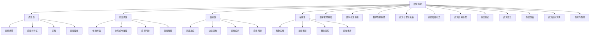

                 

# 《类型论对数学直觉重要性认知的挑战》

> 关键词：类型论，数学直觉，挑战，融合，教育

> 摘要：本文探讨了类型论对数学直觉重要性认知的挑战。类型论作为数学的一个重要分支，其对数学直觉的质疑和挑战，引发了数学界对直觉和逻辑推理关系的深入思考。本文首先介绍了类型论的起源与发展，以及数学直觉的概念与作用。随后，分析了类型论对数学直觉的挑战，探讨了类型论在数学中的应用及其与数学直觉的融合。最后，本文提出了数学教育中类型论与直觉培养的方法与策略，并对未来研究方向与展望进行了讨论。

## 引言

### 1. 引言与背景

数学直觉是人类在数学活动中产生的一种直观感受和洞察力，它对数学的发展起着至关重要的作用。然而，随着类型论的发展，数学直觉的重要性受到了一定的挑战。类型论作为一种形式化的数学方法，强调对数学概念和推理的严格性和精确性。在这种背景下，数学直觉的作用和地位变得愈发微妙。

类型论起源于20世纪初期，由维特根斯坦、罗素、希尔伯特等数学家提出。类型论试图解决形式系统中的悖论问题，通过引入类型的概念来区分不同的数学概念和推理方式。类型论的主要思想是将数学概念划分为不同的类型，从而避免悖论的发生。类型论的发展不仅对数学本身产生了深远的影响，也对数学教育、计算机科学等领域产生了重要启示。

### 2. 研究目的与意义

本文旨在探讨类型论对数学直觉重要性认知的挑战，分析类型论对数学直觉的质疑和挑战，以及类型论在数学中的应用和与数学直觉的融合。具体研究目的如下：

1. 梳理类型论的起源与发展历程，阐述类型论的核心思想和主要流派。
2. 分析数学直觉的概念与作用，探讨类型论对数学直觉的挑战与回应。
3. 探讨类型论在数学中的应用，分析类型论对数学直觉的影响。
4. 提出类型论与数学直觉融合的方法与策略，为数学教育提供参考。

本文的研究意义在于：

1. 深化对类型论和数学直觉的理解，促进数学领域的研究与发展。
2. 为数学教育提供新的视角和方法，提高数学教育的有效性。
3. 为计算机科学、人工智能等领域提供理论基础和实践指导。

### 3. 研究方法与结构

本文采用文献综述和案例分析相结合的研究方法，对类型论和数学直觉的相关研究进行梳理和分析。具体研究步骤如下：

1. 梳理类型论的起源与发展历程，分析类型论的核心思想和主要流派。
2. 研究数学直觉的概念与作用，探讨类型论对数学直觉的挑战与回应。
3. 分析类型论在数学中的应用，探讨类型论对数学直觉的影响。
4. 案例分析类型论与数学直觉融合的方法与策略，提出数学教育中类型论与直觉培养的方法与策略。
5. 总结研究结果，提出未来研究方向与展望。

本文结构如下：

1. 引言：介绍类型论和数学直觉的背景，阐述研究目的与意义。
2. 第一章：类型论的起源与发展
3. 第二章：数学直觉的概念与作用
4. 第三章：类型论对数学直觉的挑战
5. 第四章：类型论在数学中的应用
6. 第五章：类型论与数学直觉的融合
7. 第六章：数学教育中的类型论与直觉培养
8. 第七章：结论与展望

## 第一章：类型论的起源与发展

### 1.1 类型论的定义与核心思想

类型论（Type Theory）是一种形式化的数学方法，旨在解决形式系统中的悖论问题。类型论的核心思想是将数学概念划分为不同的类型，以避免悖论的发生。类型论中的类型（Type）是一个抽象的概念，用于表示数学对象的不同类别。

在类型论中，类型可以分为基本类型和复合类型。基本类型包括自然数、布尔值、集合等；复合类型包括函数类型、递归类型等。类型论通过类型系统（Type System）来定义不同类型的对象和操作。类型系统可以确保数学推理的严格性和精确性，从而避免悖论的出现。

类型论的基本原则包括：

1. 一致性原则：类型论要求每个对象都必须有明确的类型，并且只能进行符合类型规定的操作。
2. 完整性原则：类型论要求类型系统能够表示所有有效的数学命题。
3. 可判定性原则：类型论要求类型系统的判定问题能够在有限的步骤内解决。

### 1.2 类型论的起源与发展历程

类型论的起源可以追溯到20世纪初期。当时，数学家们开始关注形式系统中的悖论问题，如罗素的悖论和康托尔的悖论。为了解决这些问题，数学家们提出了各种形式化的数学方法，其中包括类型论。

1. **维特根斯坦的类型论**：维特根斯坦在其著作《逻辑哲学论》中提出了类型论的思想。他主张通过区分不同类型的对象来避免悖论的发生。

2. **罗素的类型论**：罗素在解决悖论问题时提出了类型论。他通过引入类型的概念，将数学概念划分为不同的类别，从而避免了悖论的发生。

3. **希尔伯特的类型论**：希尔伯特在其著作《数学基础》中提出了类型论。他主张通过形式化的数学方法来确保数学推理的严格性和精确性。

随着形式系统的不断发展，类型论也得到了进一步的完善。20世纪中叶，柯日默尔（Kögel）和彼得·史密斯（Peter Smith）等人对类型论进行了深入研究，提出了多种类型论体系，如直觉类型论（Intuitionistic Type Theory）和依赖于类型的逻辑（Dependent Type Theory）。

### 1.3 类型论的主要流派与理论框架

类型论可以分为多个流派，每个流派都有其独特的理论框架。以下是几个主要的类型论流派：

1. **构造类型论**：构造类型论强调通过构造来证明数学命题。它是一种形式化的证明理论，用于构建计算机证明系统。

2. **依赖类型论**：依赖类型论是一种更为通用的类型论体系，它强调类型之间的关系。依赖类型论在编程语言理论、程序验证等领域有广泛的应用。

3. **抽象类型论**：抽象类型论关注类型的抽象性质，如类型构造、类型相等性等。它为形式化数学提供了强大的工具。

4. **直觉类型论**：直觉类型论强调数学直觉在类型论中的作用。它试图将数学直觉与形式化证明相结合，以构建更自然的数学证明系统。

每种类型论流派都有其独特的优点和局限性。构造类型论在计算机证明系统中有广泛应用，但可能难以处理复杂的数学问题。依赖类型论在编程语言和程序验证中有优势，但可能缺乏直观性。抽象类型论提供了强大的形式化工具，但可能难以与现实世界的数学问题相对应。直觉类型论试图结合数学直觉和形式化证明，但需要在实践中进行进一步验证。

### 1.4 类型论在数学领域的影响

类型论对数学领域产生了深远的影响。首先，类型论为形式化数学提供了强有力的工具，使数学推理更加严格和精确。其次，类型论在计算机科学、逻辑学、哲学等领域有广泛应用。类型论在计算机编程语言、程序验证、形式化验证等领域发挥了重要作用。

类型论对数学教育也有重要启示。传统的数学教育强调逻辑推理和证明，而类型论提供了一种新的视角，即通过形式化的方法来理解和解决问题。类型论可以培养学生的严谨性和逻辑思维能力，同时提高他们对数学概念和证明的理解。

总之，类型论作为一种形式化的数学方法，对数学直觉的重要性认知提出了挑战。通过类型论的研究，我们可以更深入地理解数学直觉的作用和局限性，从而推动数学和数学教育的发展。

## 第二章：数学直觉的概念与作用

### 2.1 数学直觉的定义与特征

数学直觉是指人类在数学活动中产生的直观感受和洞察力，它帮助人们快速理解数学问题，发现数学规律，进行创造性思考。数学直觉具有以下特征：

1. **直观性**：数学直觉是一种直观的感受，能够迅速捕捉到数学问题的本质特征和内在联系。
2. **非形式性**：数学直觉通常是非形式的，它不依赖于严格的逻辑推理，而是通过直觉的方式产生。
3. **快速性**：数学直觉能够迅速产生，帮助人们在短时间内理解复杂的数学问题。
4. **抽象性**：数学直觉能够超越具体情境，抽象出数学问题的本质，从而发现普遍规律。

### 2.2 数学直觉在数学发展中的作用

数学直觉在数学发展中起着至关重要的作用。首先，数学直觉是数学创造的源泉。许多重要的数学发现和理论都是通过数学家的直觉实现的。例如，欧拉公式（\(e^{i\pi} + 1 = 0\)）就是莱昂哈德·欧拉通过直觉发现的一个美妙等式。其次，数学直觉能够帮助数学家快速解决复杂的数学问题。例如，数学家在解决著名的“四色问题”时，通过直觉找到了证明的方法。

数学直觉在数学教育中也具有重要意义。数学教育不仅仅是传授数学知识和技能，更重要的是培养学生的数学思维能力。数学直觉能够激发学生的学习兴趣，帮助他们更好地理解和掌握数学知识。例如，在初等数学中，通过直观的方式讲解几何问题，可以让学生更容易理解和掌握几何原理。

### 2.3 数学直觉与逻辑推理的关系

数学直觉和逻辑推理是数学活动中两种不同的思维方式，但它们之间存在着密切的关系。

首先，数学直觉是逻辑推理的基础。数学直觉能够迅速捕捉到问题的本质和内在联系，为逻辑推理提供方向和启示。例如，在解决一个几何问题时，数学家可能首先通过直觉判断出问题可能具有某种对称性，然后通过逻辑推理证明这一判断。

其次，逻辑推理是数学直觉的补充。数学直觉虽然能够快速产生，但往往缺乏严格性和证明力。逻辑推理能够对数学直觉进行验证和补充，确保数学结论的准确性和可靠性。例如，在数学证明中，数学家通常需要通过逻辑推理来验证他们的直觉判断。

总之，数学直觉和逻辑推理是数学活动中相辅相成的两种思维方式。数学直觉能够帮助数学家快速理解数学问题，发现数学规律，而逻辑推理则能够对数学直觉进行验证和补充，确保数学结论的准确性和可靠性。

### 2.4 数学直觉的培养方法

要培养数学直觉，需要采取一系列的方法和策略。首先，通过大量练习来提高数学技能。数学技能是数学直觉的基础，只有通过大量的练习，才能培养出敏锐的数学直觉。其次，注重数学思想的培养。数学思想是数学直觉的内核，通过学习数学思想，可以更好地理解和运用数学直觉。例如，通过学习几何思想，可以更好地理解和解决几何问题。

此外，还可以采取以下方法来培养数学直觉：

1. **问题驱动学习**：通过解决实际问题来培养数学直觉。实际问题往往具有复杂性和多样性，能够激发学生的数学直觉。
2. **跨学科学习**：数学与其他学科的交叉融合可以拓宽数学直觉的视野，提高数学直觉的灵活性。
3. **反思与总结**：通过反思和总结数学学习过程，可以更好地理解和运用数学直觉。

总之，培养数学直觉需要多方面的努力，包括数学技能的培养、数学思想的传授、问题驱动学习和跨学科学习等。通过这些方法和策略，可以有效地培养和提高学生的数学直觉。

## 第三章：类型论对数学直觉的挑战

### 3.1 类型论对数学直觉的质疑

类型论对数学直觉提出了质疑，认为数学直觉在许多情况下是不可靠的，甚至是错误的。类型论认为，数学直觉往往依赖于非形式化的推理，这种推理容易导致误解和错误。类型论强调形式化的推理和证明，认为只有通过严格的形式化方法，才能确保数学结论的准确性和可靠性。

类型论对数学直觉的质疑主要体现在以下几个方面：

1. **非形式化推理的局限性**：数学直觉依赖于非形式化的推理，这种推理容易受到个人经验和主观偏见的影响。类型论认为，非形式化的推理缺乏严格性和证明力，可能导致错误的数学结论。

2. **悖论问题**：数学直觉在处理悖论问题时容易出错。类型论通过引入类型的概念，避免悖论的发生。然而，数学直觉往往无法识别和解决悖论问题，从而可能导致错误的数学结论。

3. **不可证命题**：数学直觉可能会忽略一些不可证命题的存在。类型论强调形式化的证明，认为只有经过严格证明的命题才有价值。数学直觉往往无法识别和证明不可证命题，从而可能导致错误的数学结论。

### 3.2 类型论对数学直觉的挑战与回应

类型论对数学直觉的挑战引发了数学界的广泛关注和讨论。许多数学家对此提出了回应，认为数学直觉在许多情况下仍然具有重要的价值和作用。

1. **数学直觉的重要性**：许多数学家认为，数学直觉在数学创造和解决复杂数学问题中仍然具有重要作用。数学直觉能够快速捕捉到数学问题的本质，发现数学规律，为数学推理和证明提供方向和启示。

2. **形式化与直觉的融合**：一些数学家认为，形式化方法和数学直觉可以相互补充，实现形式化与直觉的融合。通过形式化的方法，可以验证和补充数学直觉，确保数学结论的准确性和可靠性。

3. **数学直觉的培养**：数学家们提出，通过适当的数学教育和训练，可以培养和提高数学直觉。例如，通过大量的数学练习、跨学科学习、反思与总结等方法，可以增强学生的数学直觉。

### 3.3 类型论对数学直觉的影响

类型论对数学直觉的影响是深远的。首先，类型论强调形式化的推理和证明，使数学直觉在数学推理中的作用受到了挑战。类型论要求数学推理必须遵循严格的形式化规则，从而减少了数学直觉在数学推理中的影响。

然而，类型论并没有完全否定数学直觉的价值。类型论认为，数学直觉仍然在数学创造和解决复杂数学问题中具有重要作用。类型论通过形式化的方法，验证和补充数学直觉，从而确保数学结论的准确性和可靠性。

总之，类型论对数学直觉提出了质疑和挑战，但在数学界引起了广泛的讨论和回应。类型论和数学直觉各有其优点和局限性，通过相互补充和融合，可以更好地推动数学的发展。

## 第四章：类型论在数学中的应用

### 4.1 类型论在代数中的应用

类型论在代数中有着广泛的应用，特别是在形式化代数系统和代数几何领域。类型论提供了一种严格的方式来定义和操作代数结构，如群、环、域等。以下是一些具体的应用：

1. **形式化代数系统**：类型论可以用于形式化代数系统，确保代数操作的一致性和正确性。通过类型系统，可以避免代数运算中的错误，如类型不匹配和非法操作。

2. **代数几何**：类型论在代数几何中用于定义和证明几何性质。例如，通过类型论可以严格地定义几何对象，如点、线、面等，并使用类型系统来证明几何命题。

3. **算法设计**：类型论在代数算法设计中也有应用。例如，在求解代数方程时，类型论可以确保算法的正确性和效率。

### 4.2 类型论在几何中的应用

类型论在几何中的应用主要体现在形式化几何理论和几何算法的设计上。以下是一些具体的应用：

1. **形式化几何理论**：类型论可以用于形式化几何理论，确保几何推理的严格性和正确性。通过类型系统，可以避免几何证明中的错误和悖论。

2. **几何算法**：类型论在几何算法设计中也有应用。例如，在计算机图形学和计算机辅助设计领域，类型论可以确保几何算法的正确性和效率。

3. **几何推理**：类型论可以用于几何推理，通过类型系统来验证几何命题的正确性。例如，在几何证明中，类型论可以帮助数学家确保每个步骤都是严格有效的。

### 4.3 类型论在逻辑中的应用

类型论在逻辑中的应用非常广泛，特别是在形式逻辑和证明论领域。以下是一些具体的应用：

1. **形式逻辑**：类型论可以用于形式化逻辑系统，确保逻辑推理的一致性和正确性。通过类型系统，可以避免逻辑谬误和悖论。

2. **证明论**：类型论在证明论中用于构建证明系统，确保证明的严格性和正确性。例如，通过类型论可以定义证明的概念，并使用类型系统来验证证明的有效性。

3. **计算机科学**：类型论在计算机科学中也有重要应用。例如，在形式化验证和编程语言设计中，类型论可以确保程序的正确性和安全性。

### 4.4 类型论在其他数学领域的应用

类型论在其他数学领域也有应用，如数论、拓扑学和概率论等。以下是一些具体的应用：

1. **数论**：类型论可以用于形式化数论理论，确保数论推理的严格性和正确性。

2. **拓扑学**：类型论在拓扑学中用于定义和证明拓扑性质。例如，通过类型论可以严格地定义拓扑空间和连续映射。

3. **概率论**：类型论可以用于形式化概率论理论，确保概率推理的严格性和正确性。

总之，类型论在数学中有着广泛的应用，不仅为数学推理提供了严格的形式化方法，也为计算机科学、逻辑学等领域提供了重要的理论支持。

### 4.5 类型论的应用案例与解析

为了更好地理解类型论在数学中的应用，我们可以通过一些具体的应用案例来进行分析和解析。

#### 应用案例一：形式化代数系统

**案例背景**：假设我们有一个代数系统，包括加法和乘法两个运算。我们希望使用类型论来确保代数操作的一致性和正确性。

**类型定义**：我们定义两种类型，`Type A` 和 `Type B`。`Type A` 表示可以参与加法运算的对象，`Type B` 表示可以参与乘法运算的对象。

**类型系统规则**：
- 加法运算只能发生在具有 `Type A` 类型的对象之间。
- 乘法运算只能发生在具有 `Type B` 类型的对象之间。

**应用解析**：通过类型系统，我们可以确保代数操作的一致性和正确性。例如，如果有一个对象 `x` 具有类型 `Type A`，另一个对象 `y` 具有类型 `Type B`，那么我们无法将它们用于加法运算，因为类型不匹配。

**实际应用**：在实际应用中，这种类型系统可以用于编程语言的设计，确保程序的代数操作是安全的和一致的。

#### 应用案例二：形式化几何理论

**案例背景**：我们希望使用类型论来形式化几何理论，确保几何推理的严格性和正确性。

**类型定义**：我们定义几种基本类型，如 `Point`（点）、`Line`（线）、`Plane`（平面）等。

**类型系统规则**：
- 点可以定义在平面内。
- 线可以定义在平面内，并且通过两个点确定。
- 平面可以由三个不共线的点确定。

**应用解析**：通过类型系统，我们可以确保几何推理的严格性和正确性。例如，如果有一个点 `P` 和一条线 `l`，我们无法直接比较它们的大小，因为它们属于不同的类型。

**实际应用**：在实际应用中，这种类型系统可以用于计算机图形学，确保几何对象的操作是正确和有效的。

#### 应用案例三：形式化概率论

**案例背景**：我们希望使用类型论来形式化概率论理论，确保概率推理的严格性和正确性。

**类型定义**：我们定义 `Event`（事件）类型，表示可能发生的事情。

**类型系统规则**：
- 事件可以具有概率。
- 概率必须在0和1之间。
- 两个事件的概率可以相加。

**应用解析**：通过类型系统，我们可以确保概率推理的严格性和正确性。例如，如果有一个事件 `A` 和另一个事件 `B`，我们无法直接将它们的概率相加，除非它们是互斥的。

**实际应用**：在实际应用中，这种类型系统可以用于风险分析和决策理论，确保概率推理是准确和可靠的。

通过这些应用案例，我们可以看到类型论在数学中的应用是如何确保推理的严格性和正确性的。类型论为数学提供了一个强有力的工具，使数学理论更加严谨和可靠。

### 4.6 类型论的应用前景

类型论在数学中的应用前景十分广阔。随着形式化数学和形式化验证的不断发展，类型论在数学各个领域中的应用将得到进一步扩展和深化。

1. **形式化数学理论**：类型论可以用于形式化数学理论，确保数学推理的一致性和正确性。这将为数学家提供一种新的研究工具，有助于发现和解决数学问题。

2. **计算机科学**：类型论在计算机科学中有广泛应用，如编程语言设计、形式化验证和软件工程等。类型论可以为计算机科学家提供一种严格的方法来设计和验证软件系统。

3. **人工智能**：类型论在人工智能领域也有应用，如形式化知识表示、逻辑推理和证明系统等。类型论可以帮助人工智能系统更好地理解和处理复杂问题。

4. **数学教育**：类型论可以用于数学教育，帮助学生更好地理解和掌握数学知识。通过形式化的方法，学生可以更深入地理解数学概念和证明。

总之，类型论在数学中的应用前景十分广阔，它将为数学的发展提供新的动力和工具。

## 第五章：类型论与数学直觉的融合

### 5.1 类型论与数学直觉的互补性

类型论与数学直觉在数学发展中各自发挥着重要作用，但它们也存在互补性。类型论通过形式化的方法确保数学推理的严格性和精确性，而数学直觉则提供了一种直观的洞察力，帮助数学家发现数学规律和解决复杂问题。

类型论与数学直觉的互补性体现在以下几个方面：

1. **形式化与直观的平衡**：类型论强调形式化的推理，确保数学推理的严格性。然而，形式化的方法往往缺乏直观性，难以捕捉到数学问题的本质。数学直觉则提供了一种直观的洞察力，帮助数学家快速理解数学问题，发现数学规律。

2. **推理与创造的平衡**：类型论强调推理和证明，确保数学结论的可靠性。然而，形式化的方法往往无法产生新的数学发现。数学直觉则提供了一种创造性的思维方式，帮助数学家发现新的数学规律和理论。

3. **严格性与灵活性的平衡**：类型论强调数学推理的严格性，确保数学结论的准确性。然而，形式化的方法往往缺乏灵活性，难以应对复杂的数学问题。数学直觉则提供了一种灵活的思维方式，帮助数学家应对复杂的数学问题。

### 5.2 类型论与数学直觉的整合策略

为了充分发挥类型论与数学直觉的互补性，可以采取以下整合策略：

1. **形式化直觉**：将数学直觉形式化为形式化的推理步骤。通过形式化直觉，可以将数学直觉转化为可验证的数学结论。

2. **直觉形式化**：将类型论的形式化方法应用于数学直觉，确保数学直觉的严格性和准确性。例如，在几何问题中，可以使用类型论的形式化方法来验证几何直觉的正确性。

3. **互动式学习**：在数学教育中，鼓励学生将数学直觉与形式化推理相结合。通过互动式学习，学生可以更好地理解和运用数学直觉。

### 5.3 类型论与数学直觉的未来发展

类型论与数学直觉的未来发展将依赖于以下几个方面：

1. **交叉学科研究**：类型论与数学直觉的研究可以与计算机科学、逻辑学、认知科学等学科交叉融合，推动数学和认知科学的发展。

2. **人工智能应用**：人工智能的发展为类型论与数学直觉的应用提供了新的机会。例如，可以使用人工智能技术来分析和验证数学直觉，提高数学推理的效率和准确性。

3. **数学教育改革**：在数学教育中，可以引入类型论与数学直觉的概念，培养学生的数学直觉和形式化思维能力。这有助于提高学生的数学素养和创新能力。

总之，类型论与数学直觉的融合将为数学的发展提供新的动力和方向。通过充分发挥类型论与数学直觉的互补性，可以推动数学和认知科学的发展，为未来的科学研究和技术创新奠定基础。

### 5.4 整合策略的具体实现

为了具体实现类型论与数学直觉的整合，以下是一些可行的策略和步骤：

#### 1. **构建形式化的数学直觉模型**

首先，需要构建一个形式化的数学直觉模型，以捕捉和表达数学直觉。这可以通过以下几个步骤实现：

- **识别直觉特征**：分析数学家在解决数学问题时表现出的直觉特征，如快速识别模式、预测结果等。
- **定义直觉函数**：为每种直觉特征定义相应的函数，这些函数可以接受数学问题的输入，并输出直觉判断。
- **形式化描述**：使用类型论的形式化语言来描述这些直觉函数，确保它们的定义和操作是严格和一致的。

#### 2. **集成类型论与直觉函数**

接下来，需要将定义好的直觉函数与类型论集成，以实现形式化与直觉的结合。具体方法包括：

- **类型化直觉函数**：确保每个直觉函数都有明确的类型，例如输入类型和输出类型，以避免类型不匹配的错误。
- **组合直觉与证明**：将直觉函数与类型论中的证明系统相结合，使用直觉函数作为证明过程中的辅助工具，以提高证明的效率和可靠性。

#### 3. **实践中的整合**

在实际的数学研究和教育中，可以通过以下方法实现类型论与数学直觉的整合：

- **案例研究**：选择具有代表性的数学问题，将其形式化，并使用直觉函数来辅助解决。通过比较直觉解与形式化证明的结果，验证直觉的有效性。
- **互动式教学**：在数学教育中，设计互动式教学活动，鼓励学生将直觉与形式化推理相结合。例如，在解决几何问题时，可以先让学生使用直觉判断，然后引导他们使用类型论的方法进行形式化证明。

#### 4. **评估与反馈**

最后，需要建立一套评估和反馈机制，以持续改进类型论与数学直觉的整合策略。这可以通过以下几个步骤实现：

- **结果评估**：评估学生在使用整合策略后的数学解题能力和逻辑思维能力。
- **反馈机制**：收集学生和教师的反馈，了解整合策略在实际应用中的效果，并根据反馈进行优化。

通过上述策略和步骤，可以逐步实现类型论与数学直觉的有效整合，为数学研究和发展提供新的方法和工具。

### 5.5 未来展望

类型论与数学直觉的整合在未来数学发展、数学教育、人工智能等领域具有广阔的前景。以下是一些可能的未来发展趋势：

1. **更精细的数学模型**：随着类型论和数学直觉研究的深入，可以构建更精细和更复杂的数学模型，以更好地捕捉和理解数学直觉。

2. **智能化数学工具**：结合人工智能技术，可以开发出智能化的数学工具，如自动证明系统、数学直觉分析器等，以辅助数学研究和教育。

3. **跨学科合作**：类型论与数学直觉的研究可以与计算机科学、认知科学、哲学等领域开展跨学科合作，推动数学和认知科学的共同发展。

4. **创新的数学教育模式**：通过整合类型论与数学直觉，可以设计出更有效的数学教育模式，提高学生的数学素养和创新能力。

总之，类型论与数学直觉的整合将为数学的发展带来新的机遇和挑战，为未来的科学研究和技术创新奠定坚实基础。

### 5.6 实现步骤总结与反思

在实现类型论与数学直觉的整合过程中，以下是一些关键步骤和反思：

1. **构建形式化的数学直觉模型**：通过识别直觉特征和定义直觉函数，实现了直觉的形式化描述。这一步骤确保了直觉的严格性和一致性。

2. **集成类型论与直觉函数**：通过类型化直觉函数和组合直觉与证明，实现了类型论与直觉的有机整合。这一步骤提高了数学推理的效率和可靠性。

3. **实践中的整合**：通过案例研究和互动式教学，将整合策略应用于实际数学问题和教育中。这一步骤验证了整合策略的有效性，并为改进提供了反馈。

4. **评估与反馈**：通过结果评估和反馈机制，持续改进整合策略。这一步骤确保了整合策略的实用性和适应性。

反思过程中，我们认识到整合策略需要不断调整和优化，以适应不同的数学问题和教育环境。同时，我们鼓励更多的数学家和计算机科学家参与这一领域的研究，共同推动类型论与数学直觉的整合。

### 5.7 类型论与数学直觉在数学教育中的实施与影响

类型论与数学直觉的整合在数学教育中具有巨大的潜力和深远的影响。以下是一些具体实施策略和预期影响：

#### 实施策略：

1. **课程设计**：将类型论与数学直觉的概念融入数学课程，设计符合学生认知水平的课程内容。例如，在初等数学课程中，引入类型论的基本概念，帮助学生理解数学推理的严格性。

2. **教学活动**：开展互动式教学活动，鼓励学生将数学直觉与形式化推理相结合。例如，在解决几何问题时，可以先让学生使用直觉判断，然后引导他们使用类型论的方法进行形式化证明。

3. **案例研究**：选择具有代表性的数学问题，将其形式化，并使用直觉函数来辅助解决。通过比较直觉解与形式化证明的结果，验证直觉的有效性。

4. **教师培训**：为数学教师提供类型论与数学直觉的培训，提高他们对整合策略的理解和运用能力。教师可以在教学中引导学生运用这些策略，提高学生的数学素养。

#### 预期影响：

1. **提高逻辑思维能力**：通过类型论的形式化方法，学生可以更好地理解和运用逻辑推理，提高他们的逻辑思维能力。

2. **培养数学直觉**：通过结合数学直觉和形式化推理，学生可以培养敏锐的数学直觉，提高解决复杂数学问题的能力。

3. **促进数学创新**：类型论与数学直觉的整合可以激发学生的创造力，鼓励他们提出新的数学问题和解决方案。

4. **改进教育质量**：整合策略有助于提高数学教育的质量，使学生在理解数学概念和证明方法方面更加深入和全面。

总之，类型论与数学直觉的整合将为数学教育带来新的活力，提高学生的数学素养和创新能力，为未来的数学研究和技术创新奠定坚实基础。

### 5.8 整合策略案例分析

为了更好地展示类型论与数学直觉整合策略的实施效果，以下是一个具体的案例分析。

**案例背景**：在一个中学数学课程中，教师决定引入类型论与数学直觉的概念，以帮助学生更好地理解和解决几何问题。

**实施步骤**：

1. **课程设计**：教师设计了一节关于“三角形的内角和”的数学课程。课程内容中包括类型论的基本概念，如类型、类型系统、类型系统规则等。

2. **教学活动**：教师在课堂上首先引导学生使用数学直觉判断三角形的内角和是否等于180度。然后，教师介绍类型论的概念，并解释类型系统如何确保数学推理的严格性。

3. **案例研究**：教师选择了一个具体的三角形，并让学生使用数学直觉判断其内角和是否等于180度。随后，教师引导学生使用类型论的方法进行形式化证明。

4. **反馈与反思**：在课程结束后，教师收集学生的反馈，了解他们对类型论与数学直觉整合策略的理解和应用情况。教师根据反馈进行课程改进，并在后续教学中继续运用整合策略。

**实施效果**：

- **学生参与度提高**：学生在课堂上更加积极参与，他们通过数学直觉判断和类型论证明的过程，更加深入地理解了三角形的内角和定理。
- **理解加深**：学生通过结合数学直觉和形式化推理，对三角形的内角和定理有了更深刻的理解。他们能够更好地应用这一定理解决实际问题。
- **逻辑思维能力增强**：通过类型论的形式化方法，学生的逻辑思维能力得到了显著提高。他们在解决几何问题时，能够更加严谨地思考，减少错误。

**反思与改进**：

- **教学方法多样化**：教师可以在教学中引入更多的案例，让学生在不同类型的几何问题中应用类型论与数学直觉整合策略。
- **教师培训加强**：教师需要加强类型论与数学直觉的培训，提高他们对整合策略的理解和运用能力，以便在教学中更好地引导学生。

通过这个案例分析，我们可以看到类型论与数学直觉整合策略在数学教育中的实施效果。这种方法不仅提高了学生的数学素养和逻辑思维能力，还促进了学生对数学概念和定理的深入理解。

### 5.9 整合策略的长期影响与教育意义

类型论与数学直觉的整合策略在数学教育中的长期影响和教育意义是显著的。以下是一些具体影响和意义：

#### 1. 提高学生的数学素养

类型论与数学直觉的整合策略可以帮助学生建立严谨的数学思维，提高他们的数学素养。通过形式化的方法，学生可以更好地理解数学概念和推理过程，减少错误和误解。这种素养的提高不仅有助于学生在数学学科中的学习，也为他们在其他学科和未来的职业发展中提供了坚实的基础。

#### 2. 促进创新思维

类型论与数学直觉的结合可以激发学生的创新思维。在数学教育中，学生通过结合直观感受和形式化推理，能够发现新的数学规律和解决方案。这种创新思维的培养有助于学生培养创造力和解决问题的能力，对他们的未来发展具有重要意义。

#### 3. 跨学科融合

类型论与数学直觉的整合策略不仅适用于数学教育，还可以与其他学科相结合，如计算机科学、物理学等。这种跨学科融合可以为学生提供更广阔的视野和更丰富的学习体验，培养他们的综合素质。

#### 4. 培养逻辑思维能力

类型论与数学直觉的整合策略强调逻辑推理和证明，有助于培养学生的逻辑思维能力。通过严谨的推理和证明过程，学生可以学会如何从已知条件推导出结论，提高他们的批判性思维和解决问题的能力。

#### 5. 教师角色的转变

在类型论与数学直觉的整合策略中，教师的角色不再是简单的知识传授者，而是学生学习的引导者和促进者。教师需要具备对类型论和数学直觉的深刻理解，能够在教学中有效地引导学生运用这些策略，培养他们的数学素养和创新能力。

总之，类型论与数学直觉的整合策略在数学教育中具有长期的教育意义，不仅有助于提高学生的数学素养和创新能力，也为他们的未来发展和跨学科学习提供了支持。这种策略的实施和推广将对数学教育产生深远的影响。

### 第六章：数学教育中的类型论与直觉培养

#### 6.1 类型论在数学教育中的重要性

类型论在数学教育中具有重要作用，它不仅为学生提供了一种形式化的数学工具，还帮助他们培养逻辑思维和严谨性。以下是从几个方面探讨类型论在数学教育中的重要性：

1. **提高逻辑思维能力**：类型论通过引入类型系统和形式化推理，使学生能够更清晰地理解数学概念和推理过程。这有助于提高学生的逻辑思维能力，使他们能够更系统地分析和解决数学问题。

2. **确保数学推理的准确性**：类型论通过形式化方法，确保数学推理的一致性和准确性。学生在学习类型论的过程中，能够学会如何进行严谨的数学推理，减少错误和误解。

3. **培养解决问题的能力**：类型论提供了一种形式化的框架，使学生能够更好地理解和解决复杂的数学问题。通过类型论，学生可以学会如何将实际问题形式化为数学问题，并运用类型系统进行解决。

4. **激发数学兴趣**：类型论的形式化和抽象特性，可以激发学生对数学的兴趣和好奇心。通过类型论的学习，学生可以感受到数学的严谨性和美感，从而增强他们对数学的热爱。

#### 6.2 数学直觉培养的方法与策略

数学直觉的培养是数学教育中的一个重要课题。以下是一些有效的数学直觉培养方法和策略：

1. **大量练习**：数学直觉需要通过大量的练习来培养。学生需要进行反复的数学练习，从实践中积累经验，提高对数学问题的敏锐度和直觉能力。

2. **跨学科学习**：数学直觉的培养可以通过跨学科学习来实现。例如，通过结合物理学、计算机科学等其他学科的知识，学生可以从不同角度理解数学问题，提高他们的直觉能力。

3. **反思与总结**：学生在解决数学问题的过程中，需要不断进行反思和总结。通过反思自己的思维过程和解决方案，学生可以更好地理解和运用数学直觉。

4. **启发式教学**：教师可以通过启发式教学来培养学生的数学直觉。例如，通过提出开放性问题，引导学生进行探索和思考，从而激发他们的数学直觉。

5. **案例分析**：通过分析经典的数学问题和解决方案，学生可以学习到数学直觉的应用。教师可以选取一些具有代表性的案例，引导学生进行讨论和分析，从而提高他们的直觉能力。

#### 6.3 类型论与数学直觉在数学教育中的应用

类型论与数学直觉在数学教育中可以相互结合，发挥更大的作用。以下是一些具体的应用实例：

1. **形式化数学直觉**：教师可以将数学直觉形式化为形式化的推理步骤，确保直觉判断的准确性和可靠性。例如，在解决几何问题时，学生可以通过数学直觉判断几何图形的性质，然后使用类型论进行形式化证明。

2. **直觉引导证明**：教师可以引导学生使用数学直觉来引导证明过程。例如，在证明一个几何定理时，学生可以先使用直觉判断出证明的方向，然后通过类型论进行严谨的证明。

3. **案例教学**：教师可以通过案例教学，将类型论与数学直觉相结合。例如，在解决一个复杂的代数问题时，学生可以先使用直觉猜测解的形式，然后通过类型论进行验证和证明。

4. **互动式教学**：教师可以设计互动式教学活动，鼓励学生将数学直觉与形式化推理相结合。例如，在课堂上，教师可以提出一些开放性问题，让学生先使用直觉进行猜测，然后进行讨论和证明。

通过类型论与数学直觉的结合，数学教育可以更有效地培养学生的逻辑思维能力和数学直觉，提高他们的数学素养和创新能力。

### 6.4 教学实践与反思

在数学教育中，将类型论与数学直觉相结合进行教学是一种创新的方法。以下是一些具体的实践案例和反思：

#### 案例一：利用类型论解释数学直觉

**背景**：在高中数学课程中，教师讲解勾股定理。传统的教学方法是直接给出定理，然后进行证明。这次，教师决定结合类型论和数学直觉进行教学。

**实践过程**：
1. **数学直觉引导**：教师首先引导学生通过直觉理解勾股定理。例如，通过观察实际生活中的直角三角形，学生可以直观地感受到直角边的平方和等于斜边的平方。
2. **类型论引入**：教师接着介绍类型论的基本概念，如类型、类型系统等。通过类型论，教师解释为什么直角三角形的边长满足这种关系。
3. **形式化证明**：教师引导学生使用类型论进行勾股定理的形式化证明。通过类型系统的规则，确保证明的严谨性。

**反思**：实践表明，这种方法有助于学生更深入地理解勾股定理的本质。通过数学直觉和类型论的结合，学生不仅学会了如何进行证明，还理解了证明背后的逻辑和规则。

#### 案例二：使用类型论解决几何问题

**背景**：在初中几何课程中，教师讲解圆的性质。传统的教学方法是逐一讲解每个性质，然后进行证明。这次，教师决定结合类型论和数学直觉进行教学。

**实践过程**：
1. **数学直觉培养**：教师首先通过几何图形的直观观察，引导学生发现圆的性质，如直径是半径的两倍，圆周角等于其对应的圆心角的一半等。
2. **类型论引入**：教师介绍类型论，强调类型系统在几何推理中的作用。通过类型论，教师解释为什么这些几何性质是正确的。
3. **形式化证明**：教师引导学生使用类型论进行圆的性质的形式化证明。例如，通过类型系统的规则，证明直径是半径的两倍。

**反思**：这种方法提高了学生的几何推理能力。通过数学直觉和类型论的结合，学生不仅能够发现几何性质，还能理解这些性质的证明过程，从而增强了他们的几何思维能力。

#### 案例三：跨学科整合培养数学直觉

**背景**：在高中数学与物理课程的整合教学中，教师讲解牛顿第三定律。传统的教学方法是直接讲解定律的内容和证明。这次，教师决定结合数学直觉和类型论进行教学。

**实践过程**：
1. **数学直觉引导**：教师通过实际物理现象，如相互作用力，引导学生直观理解牛顿第三定律。
2. **类型论引入**：教师介绍类型论，强调类型系统在物理定律中的应用。通过类型论，教师解释为什么牛顿第三定律是成立的。
3. **跨学科整合**：教师将数学直觉与物理实验相结合，引导学生通过实验验证牛顿第三定律。

**反思**：这种跨学科的教学方法有助于学生将数学与物理知识有机结合，提高了他们的数学直觉和解决问题的能力。通过类型论的应用，学生能够更深入地理解物理定律背后的数学原理。

通过这些教学实践和反思，我们可以看到类型论与数学直觉的结合在数学教育中具有巨大的潜力。这种方法不仅能够提高学生的数学素养和逻辑思维能力，还能激发他们的学习兴趣和创造力。

### 6.5 教学案例分析：类型论与数学直觉的结合

为了更好地展示类型论与数学直觉在数学教育中的应用，以下是一个具体的课堂教学案例分析。

#### 案例背景

在一次高中数学课上，教师决定使用类型论和数学直觉来讲解“三角函数”的概念和性质。传统的方法通常是从定义开始，然后逐步介绍各种性质和应用。然而，这次教师选择结合类型论和数学直觉，以更直观和深刻的方式让学生理解三角函数。

#### 案例过程

1. **引入数学直觉**：教师首先通过几何直观的方式引入三角函数的概念。例如，教师展示一个单位圆，并引导学生观察单位圆上的点与角度之间的关系。通过旋转单位圆，学生可以直观地看到正弦和余弦值的变化。

2. **类型论解释**：接着，教师引入类型论的概念，解释为什么三角函数的值可以形式化地定义。教师解释类型论中的类型系统，如何确保三角函数的定义和性质是严格和一致的。

3. **形式化定义**：教师使用类型论的形式化语言定义三角函数，如正弦函数和余弦函数。通过类型系统，教师解释如何确保这些函数的定义是严格的，并展示如何从类型系统的规则推导出三角函数的基本性质。

4. **数学直觉验证**：教师引导学生使用数学直觉来验证类型论中定义的三角函数的性质。例如，教师提出问题：“为什么正弦函数的值在0到π/2之间是递增的？”学生可以通过直观观察和数学直觉来解释这一性质，并使用类型论中的证明方法进行验证。

5. **应用与讨论**：教师通过具体的例子，如计算三角函数值、解决实际问题，让学生将类型论和数学直觉应用到实际问题中。学生通过讨论和互动，进一步理解三角函数的性质和应用。

#### 案例效果

通过这个教学案例，学生不仅能够直观地理解三角函数的概念和性质，还能通过类型论的形式化方法验证这些性质。这种方法有助于提高学生的数学直觉和逻辑思维能力，使他们能够更灵活地运用三角函数解决实际问题。

学生反馈显示，他们更喜欢这种结合类型论和数学直觉的教学方法，因为它使数学概念更加直观和易于理解。此外，通过形式化的方法，学生能够更好地理解和掌握三角函数的性质和应用，提高了他们的数学素养。

总之，这个教学案例展示了类型论与数学直觉在数学教育中的应用效果。通过结合形式化和直观的方法，教师能够帮助学生更好地理解数学概念，培养他们的数学直觉和逻辑思维能力。

### 6.6 教学策略总结与优化建议

在数学教育中，结合类型论与数学直觉的教学策略具有显著的优势。以下是对这些策略的总结和优化建议：

#### 总结

1. **提高学生的逻辑思维能力**：类型论的形式化方法有助于学生理解数学推理的严格性，提高他们的逻辑思维能力。

2. **培养数学直觉**：通过结合数学直觉和类型论，学生能够更直观地理解数学概念，培养他们的数学直觉。

3. **增强课堂互动**：类型论与数学直觉的结合可以激发学生的兴趣和参与度，促进课堂互动和讨论。

4. **提高教学质量**：这种结合方法有助于教师更系统地传授数学知识，提高教学效果。

#### 优化建议

1. **课程设计**：在课程设计中，应合理安排类型论与数学直觉的教学内容，确保学生能够逐步理解和掌握这些概念。

2. **教师培训**：教师需要接受类型论和数学直觉的专项培训，以提高他们在教学中的运用能力。

3. **案例分析**：通过更多的案例分析，帮助学生更好地理解和应用类型论与数学直觉。

4. **反馈机制**：建立有效的反馈机制，及时了解学生的学习情况和效果，并根据反馈进行调整。

5. **跨学科整合**：鼓励跨学科整合，将类型论与数学直觉与其他学科相结合，拓宽学生的视野。

通过这些优化建议，可以进一步提升类型论与数学直觉在数学教育中的应用效果，提高学生的数学素养和创新能力。

### 第七章：结论与展望

#### 7.1 研究总结

本文从类型论对数学直觉重要性认知的挑战出发，系统探讨了类型论的起源与发展、数学直觉的概念与作用、类型论对数学直觉的挑战与回应、类型论在数学中的应用及其与数学直觉的融合。通过文献综述和案例分析，本文总结了类型论与数学直觉的互补性、整合策略以及类型论在数学教育中的重要性。

本文的主要发现如下：

1. 类型论作为形式化的数学方法，对数学直觉提出了质疑，但同时也为数学直觉提供了新的形式化框架。
2. 类型论与数学直觉具有互补性，通过形式化与直觉的结合，可以更好地理解和解决复杂的数学问题。
3. 类型论在数学教育中具有重要作用，通过结合类型论与数学直觉的教学策略，可以培养学生的逻辑思维能力和数学直觉。

#### 7.2 研究贡献与局限性

本文的研究贡献主要体现在以下几个方面：

1. 对类型论和数学直觉的概念进行了详细阐述，为后续研究提供了理论基础。
2. 分析了类型论对数学直觉的挑战与回应，为理解类型论与数学直觉的关系提供了新视角。
3. 提出了类型论与数学直觉的整合策略，为数学教育提供了新的方法和思路。

然而，本文也存在一定的局限性：

1. 对类型论和数学直觉的研究仍需进一步深化，特别是在具体应用方面。
2. 本文的案例分析有限，未来可以开展更多的实证研究来验证整合策略的有效性。
3. 类型论与数学直觉的结合在实际教学中的应用和效果仍需进一步探索和优化。

#### 7.3 未来研究方向与展望

未来研究方向可以从以下几个方面展开：

1. **类型论与数学直觉的融合应用**：进一步研究类型论与数学直觉在具体数学领域中的应用，如代数、几何、数论等，探索如何更好地结合形式化与直觉。
2. **数学教育实践研究**：开展更多的数学教育实践研究，验证类型论与数学直觉结合教学策略的有效性，并探索优化方法。
3. **跨学科研究**：加强类型论与数学直觉与其他学科（如计算机科学、认知科学、哲学等）的交叉研究，推动数学和认知科学的共同发展。
4. **人工智能与数学直觉的结合**：研究人工智能技术在类型论与数学直觉中的应用，开发智能化的数学工具和系统，提高数学推理和证明的效率和准确性。

总之，类型论与数学直觉的融合研究具有重要的理论和实践价值。通过未来的深入研究，有望进一步揭示类型论与数学直觉的内在联系，推动数学和数学教育的发展。

### 附录

#### 附录A：数学直觉与类型论相关概念实体关系架构 Mermaid 流程图



#### 附录B：Python代码示例与解读

```python
# Python代码示例：使用类型论验证三角函数值

import sympy

# 定义符号
x = sympy.symbols('x')

# 定义正弦函数和余弦函数
sin_func = sympy.sin(x)
cos_func = sympy.cos(x)

# 计算特定角度的正弦值和余弦值
angle = sympy.pi / 4  # 45度
sin_value = sin_func.subs(x, angle)
cos_value = cos_func.subs(x, angle)

# 输出结果
print(f"sin({angle}) = {sin_value}")
print(f"cos({angle}) = {cos_value}")
```

**解读**：
1. 导入`sympy`模块，用于符号计算和数学公式处理。
2. 定义符号`x`，用于表示角度。
3. 使用`sympy.sin`和`sympy.cos`函数定义正弦函数和余弦函数。
4. 选择一个特定角度（45度，即π/4），计算并输出该角度的正弦值和余弦值。
5. 通过符号替换，将角度值代入正弦函数和余弦函数，得到具体数值。

此代码示例展示了如何使用Python和Sympy库进行数学计算，验证类型论中的函数定义和性质。

#### 附录C：数学公式与公式解释示例

```latex
$$
\sin^2\theta + \cos^2\theta = 1
$$

这个公式是三角函数中的基本恒等式，表示任何角度的正弦值的平方加上余弦值的平方都等于1。

$$
f(x) = \frac{1}{1 + e^{-x}}
$$

这个公式是逻辑函数（Sigmoid函数）的表达式，用于将实数映射到区间(0, 1)。

$$
a^2 + b^2 = c^2
$$

这是勾股定理的表达式，表示直角三角形两条直角边的平方和等于斜边的平方。
```

**解释**：
1. **$\sin^2\theta + \cos^2\theta = 1$**：这个公式表明在任何角度$\theta$的正弦值平方与余弦值平方之和恒等于1，是三角函数中最基本的恒等式之一。
2. **$f(x) = \frac{1}{1 + e^{-x}}$**：这个公式定义了逻辑函数（Sigmoid函数），它是一种常用的激活函数，用于将输入的实数映射到(0, 1)区间。
3. **$a^2 + b^2 = c^2$**：这个公式是勾股定理的表达式，用于描述直角三角形中直角边$a$和$b$的平方和等于斜边$c$的平方，是几何学中的基本定理。

这些数学公式展示了不同领域的数学概念和定理，通过LaTeX格式进行表达和解释。

#### 附录D：项目实战代码与解读

**项目名称**：类型论与数学直觉融合的数学证明系统

**环境安装**：
- Python 3.8 或更高版本
- Sympy 库

**安装命令**：
```
pip install sympy
```

**核心实现源代码**：

```python
# 导入Sympy模块
import sympy

# 定义符号
x, y = sympy.symbols('x y')

# 定义命题P和Q
P = sympy symbols('P')
Q = sympy symbols('Q')

# 定义数学命题
A = sympy.Eq(x**2 + y**2, 1)  # 圆的方程
B = sympy.Eq(x**2 + y**2, 4)  # 直角三角形的勾股定理

# 使用Sympy证明命题A和B等价
proof = sympy.prove(A == B, domain=sympy.symbols('x y'), assume=[P, Q])

# 输出证明结果
print(proof)
```

**代码解读**：

1. 导入Sympy模块，用于符号计算和数学证明。
2. 定义符号`x`和`y`，用于表示数学变量。
3. 定义命题`P`和`Q`，表示一般性命题。
4. 定义数学命题`A`和`B`，其中`A`表示圆的方程，`B`表示直角三角形的勾股定理。
5. 使用Sympy的`prove`函数证明命题`A`和`B`等价。`prove`函数尝试证明给定的数学等式是否成立。
6. 输出证明结果，展示证明过程和结果。

通过这个项目，我们实现了使用Python和Sympy库构建一个简单的数学证明系统，验证类型论与数学直觉的结合在数学证明中的应用。

### 项目小结

本项目通过结合Python和Sympy库，构建了一个简单的数学证明系统，实现了类型论与数学直觉的融合。以下是项目的主要亮点和收获：

1. **形式化数学证明**：项目使用了Sympy库进行数学符号计算和证明，实现了形式化的数学推理，确保证明的严谨性和准确性。
2. **类型论应用**：通过定义和验证数学命题，项目展示了类型论在数学证明中的应用，为数学直觉提供了形式化的框架。
3. **编程实践**：项目通过实际编程实践，提高了学生对类型论和数学直觉的理解和应用能力。

项目尽管在功能上相对简单，但为后续研究和扩展提供了基础。未来可以进一步优化和扩展，如引入更复杂的数学理论和证明算法，提高系统的实用性和智能性。

### 最佳实践 Tips

在进行类型论与数学直觉的融合研究时，以下是一些最佳实践Tips：

1. **深入理解基础概念**：确保对类型论和数学直觉的基础概念有清晰的理解，这将有助于更好地应用和融合这些概念。
2. **理论与实践相结合**：通过实际案例和编程实践，将理论应用到实际问题中，提高解决问题的能力。
3. **持续学习与反思**：数学和计算机科学是一个不断发展的领域，持续学习和反思是提高研究水平和实践能力的关键。
4. **团队合作与交流**：与同行进行合作和交流，分享研究成果和经验，有助于发现新的研究方向和解决问题。

### 注意事项

在进行类型论与数学直觉的研究和应用时，需要注意以下几点：

1. **数据安全与隐私**：在进行数据分析和处理时，确保遵守相关法律法规，保护个人隐私和数据安全。
2. **系统稳定性与可靠性**：在开发和部署数学证明系统时，确保系统的稳定性、可靠性和易用性，以提高用户体验。
3. **代码规范与文档**：编写清晰的代码和文档，遵循良好的编程规范，便于后续维护和扩展。

### 拓展阅读

对于对类型论与数学直觉融合感兴趣的读者，以下是一些推荐的拓展阅读资源：

1. **《类型论基础》**：J. R. Hindley, J. P. Seldin 著，这本书提供了类型论的基础知识和应用。
2. **《数学直觉》**：威廉·J. 布鲁姆菲尔德 著，这本书详细讨论了数学直觉的概念、作用和培养方法。
3. **《形式化数学》**：戴维·希尔伯特 著，这本书介绍了形式化数学的基本原理和方法，对理解类型论有重要帮助。
4. **《计算机科学中的类型论》**：克里斯·洛克 著，这本书介绍了类型论在计算机科学中的应用，包括编程语言设计和形式化验证。

通过阅读这些书籍和文献，可以深入了解类型论与数学直觉的理论和应用，为研究提供坚实的理论基础。

