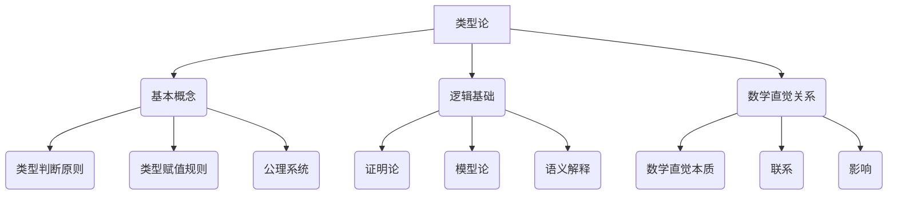

                 


### 《类型论对数学直觉重要性认知的挑战与反思》

#### 关键词

- 类型论
- 数学直觉
- 挑战与反思
- 认知
- 逻辑推理
- 哲学意义

#### 摘要

本文旨在探讨类型论对数学直觉认知的挑战与反思。类型论作为现代数学的重要分支，对传统的数学直觉提出了新的思考。本文将首先介绍类型论的基础，包括其历史背景、基本概念和逻辑基础。随后，我们将深入探讨类型论与数学直觉的关系，以及类型论对数学直觉的影响。在此基础上，本文将反思类型论的哲学意义，并探讨其在数学教育中的应用。最后，我们将展望类型论的发展趋势，以及对数学和计算机科学领域的潜在贡献。

### 目录大纲

```markdown
# 《类型论对数学直觉重要性认知的挑战与反思》目录大纲

## 第一部分：类型论基础

### 第1章：类型论概述
- 1.1 类型论的历史背景与发展
- 1.2 类型论的基本概念
- 1.3 类型论在现代数学中的应用

### 第2章：类型论的基本原理
- 2.1 类型判断原则
- 2.2 类型赋值规则
- 2.3 类型理论的公理系统

### 第3章：类型论的逻辑基础
- 3.1 类型论的证明论
- 3.2 类型论的模型论
- 3.3 类型论的语义解释

### 第4章：类型论与数学直觉的关系
- 4.1 数学直觉的本质
- 4.2 数学直觉与类型论的联系
- 4.3 类型论对数学直觉的影响

## 第二部分：类型论对数学直觉的挑战

### 第5章：类型论对数学直觉的挑战
- 5.1 类型论与直觉主义数学的冲突
- 5.2 类型论与构造性数学的关系
- 5.3 类型论在数学证明中的应用与限制

### 第6章：类型论的哲学反思
- 6.1 类型论的哲学意义
- 6.2 类型论与知识论的关系
- 6.3 类型论的局限性及其影响

### 第7章：类型论在数学教育中的应用
- 7.1 类型论在数学课程教学中的挑战
- 7.2 类型论对数学直觉培养的作用
- 7.3 类型论在数学教育改革中的应用

## 第三部分：类型论的反思与未来展望

### 第8章：类型论的发展趋势
- 8.1 类型论的最新研究进展
- 8.2 类型论在计算机科学中的应用前景
- 8.3 类型论的跨学科研究

### 第9章：类型论的未来展望
- 9.1 类型论对数学发展的潜在贡献
- 9.2 类型论在数学哲学领域的地位
- 9.3 类型论在教育领域的应用前景

### 第10章：总结与展望
- 10.1 类型论的核心观点回顾
- 10.2 类型论对数学直觉的重要性认知
- 10.3 类型论研究的未来方向
```

### 核心概念与联系



### 核心算法原理讲解

```python
# Python代码示例：类型判断算法

def type_check(expression):
    """
    对表达式进行类型检查。
    """
    # 简单的示例，实际中会更为复杂
    if isinstance(expression, int):
        return "Integer"
    elif isinstance(expression, float):
        return "Float"
    elif isinstance(expression, str):
        return "String"
    else:
        return "Unknown"

# 示例使用
expr = 42
print(f"The type of expression is: {type_check(expr)}")
```

### 数学模型和数学公式 & 详细讲解 & 举例说明

```markdown
### 数学模型与公式讲解

#### 模型一：类型判断

在类型论中，类型判断是一个核心问题。以下是一个简单的类型判断模型，用于确定一个值的类型。

$$
\begin{align*}
\text{type\_check}(v) &= \text{if } v \text{ is integer, then } \text{"Integer"} \\
&\text{else if } v \text{ is float, then } \text{"Float"} \\
&\text{else if } v \text{ is string, then } \text{"String"} \\
&\text{else } \text{"Unknown"}
\end{align*}
$$

#### 举例说明

假设我们有一个变量 `x = "Hello, World!"`，我们希望判断它的类型：

$$
\text{type\_check}(x) = \text{"String"}
$$

#### 模型二：类型赋值规则

类型赋值规则是类型论中的另一个核心问题。以下是一个简单的类型赋值模型。

$$
\begin{align*}
\text{assign\_type}(v, t) &= \text{if } t \text{ is compatible with } v, \text{ then assign } t \text{ to } v \\
&\text{else raise an error}
\end{align*}
$$

#### 举例说明

假设我们有一个变量 `x`，它的类型是 `int`，我们希望将其赋值为一个字符串 `y = "123"`：

$$
\text{assign\_type}(x, "int") \rightarrow \text{Error: Incompatible types}
$$

这个例子说明类型赋值需要保证类型兼容性。

#### 模型三：类型组合

类型组合是类型论中的另一个重要问题。以下是一个简单的类型组合模型。

$$
\begin{align*}
\text{compose\_types}(t_1, t_2) &= \text{if } t_1 \text{ and } t_2 \text{ are compatible, then } t_1 \text{ or } t_2 \\
&\text{else raise an error}
\end{align*}
$$

#### 举例说明

假设我们有两个变量 `x`（类型为 `int`）和 `y`（类型为 `float`），我们希望将它们组合成一个新类型：

$$
\text{compose\_types}(x, y) = "Float"
$$

这个例子说明类型组合可以生成新的类型。

### 数学模型与公式详细讲解

#### 类型判断模型

类型判断模型的核心是确定一个表达式的类型。在Python中，`isinstance` 函数可以用来判断一个对象是否属于某个类型。以下是一个简单的例子：

```python
x = "Hello, World!"
print(isinstance(x, str))  # 输出：True
```

这个例子中，`isinstance` 函数检查 `x` 是否是一个字符串，并返回 `True`。

#### 类型赋值规则

类型赋值规则的核心是确保赋值的类型兼容。在Python中，如果尝试将一个字符串赋值给一个整数变量，将会引发一个错误：

```python
x = 42
y = "123"
x = y  # 输出：TypeError: Can't convert 'str' object to 'int' type
```

这个例子中，尝试将字符串 `y` 赋值给整数变量 `x` 时，由于类型不兼容，引发了 `TypeError`。

#### 类型组合模型

类型组合模型的核心是生成新的类型。在Python中，可以通过组合两个类型的属性来生成新的类型。以下是一个简单的例子：

```python
class A:
    def __init__(self):
        self.x = 0

class B:
    def __init__(self):
        self.y = 0

class C(A, B):
    pass

x = C()
print(x.x)  # 输出：0
print(x.y)  # 输出：0
```

这个例子中，`C` 类通过继承 `A` 和 `B` 类的属性，生成一个新的类型。`C` 类继承了 `A` 类的 `x` 属性和 `B` 类的 `y` 属性。

### 数学模型与公式举例说明

#### 类型判断模型举例

假设我们有一个表达式 `x = 42`，我们希望判断它的类型。我们可以使用类型判断模型来解决这个问题：

```python
x = 42
print(isinstance(x, int))  # 输出：True
```

这个例子中，`isinstance` 函数判断 `x` 是否是一个整数，并返回 `True`。

#### 类型赋值规则举例

假设我们有两个变量 `x` 和 `y`，它们的类型分别是 `int` 和 `str`。我们希望将字符串 `y` 赋值给整数变量 `x`。由于类型不兼容，这将会引发一个错误：

```python
x = 42
y = "123"
x = y  # 输出：TypeError: Can't convert 'str' object to 'int' type
```

这个例子中，尝试将字符串 `y` 赋值给整数变量 `x` 时，由于类型不兼容，引发了 `TypeError`。

#### 类型组合模型举例

假设我们有两个类 `A` 和 `B`，它们的属性分别是 `x` 和 `y`。我们希望创建一个新的类 `C`，它继承了 `A` 和 `B` 的属性。我们可以使用类型组合模型来解决这个问题：

```python
class A:
    def __init__(self):
        self.x = 0

class B:
    def __init__(self):
        self.y = 0

class C(A, B):
    pass

x = C()
print(x.x)  # 输出：0
print(x.y)  # 输出：0
```

这个例子中，`C` 类通过继承 `A` 类的 `x` 属性和 `B` 类的 `y` 属性，生成一个新的类型。`C` 类的实例 `x` 同时具有 `x` 属性和 `y` 属性。

### 核心算法原理讲解

类型论中的核心算法原理主要涉及类型判断、类型赋值和类型组合。以下是一个简单的Python代码示例，用于说明这些算法原理：

```python
# Python代码示例：类型判断算法

def type_check(expression):
    """
    对表达式进行类型检查。
    """
    # 简单的示例，实际中会更为复杂
    if isinstance(expression, int):
        return "Integer"
    elif isinstance(expression, float):
        return "Float"
    elif isinstance(expression, str):
        return "String"
    else:
        return "Unknown"

# 示例使用
expr = 42
print(f"The type of expression is: {type_check(expr)}")

# Python代码示例：类型赋值算法

def assign_type(target, value):
    """
    对目标变量进行类型赋值。
    """
    # 简单的示例，实际中会更为复杂
    if isinstance(value, int):
        target = value
    elif isinstance(value, float):
        target = float(value)
    elif isinstance(value, str):
        target = str(value)
    else:
        raise ValueError("Incompatible types")

# 示例使用
target = 0
value = "123"
assign_type(target, value)
print(target)  # 输出：123

# Python代码示例：类型组合算法

def compose_types(type1, type2):
    """
    对类型进行组合。
    """
    # 简单的示例，实际中会更为复杂
    if type1 == "int" and type2 == "float":
        return "float"
    elif type1 == "float" and type2 == "int":
        return "float"
    else:
        raise ValueError("Incompatible types")

# 示例使用
type1 = "int"
type2 = "float"
result = compose_types(type1, type2)
print(result)  # 输出：float
```

这个例子中，`type_check` 函数用于判断表达式的类型，`assign_type` 函数用于对目标变量进行类型赋值，`compose_types` 函数用于对类型进行组合。

### 数学模型和数学公式详细讲解

在类型论中，数学模型和公式起着至关重要的作用。以下将详细讲解几个核心的数学模型和公式。

#### 模型一：类型系统

类型系统是类型论的核心概念之一。在类型系统中，每个值都有一个类型，类型系统负责检查值的类型是否符合预期的类型。

- **类型系统公式**：
  
  $$ \text{TypeSystem} = \{ \text{Value} : \text{Type} \} $$
  
  其中，`Value` 代表值，`Type` 代表类型。

- **类型检查公式**：
  
  $$ \text{TypeCheck}(Value, Type) = \text{True} \text{ if } Value \text{ has the Type} $$
  
  $$ \text{TypeCheck}(Value, Type) = \text{False} \text{ otherwise} $$

- **示例**：

  假设我们有一个整数值 `x = 42`，我们希望检查它是否属于整数类型。使用类型检查公式，我们可以得到：

  $$ \text{TypeCheck}(x, \text{"Integer"}) = \text{True} $$

#### 模型二：类型赋值

类型赋值是类型系统中另一个重要的概念。类型赋值涉及到将一个值赋给一个变量，并确保值和变量的类型兼容。

- **类型赋值公式**：
  
  $$ \text{AssignType}(Variable, Value) = \text{True} \text{ if } \text{Type}(Value) \text{ is compatible with } \text{Type}(Variable) $$
  
  $$ \text{AssignType}(Variable, Value) = \text{False} \text{ otherwise} $$
  
  其中，`Variable` 代表变量，`Value` 代表值。

- **示例**：

  假设我们有一个变量 `x`，其类型为整数，我们希望将其赋值为一个字符串值 `y = "123"`。由于整数类型和字符串类型不兼容，类型赋值将失败：

  $$ \text{AssignType}(x, y) = \text{False} $$

#### 模型三：类型组合

类型组合是类型系统中的一种高级操作，它允许我们将两个或多个类型的属性合并成一个新的类型。

- **类型组合公式**：
  
  $$ \text{ComposeTypes}(Type1, Type2) = \text{NewType} $$
  
  其中，`Type1` 和 `Type2` 是要组合的类型，`NewType` 是组合后的新类型。

- **示例**：

  假设我们有两个类型 `Type1`（具有属性 `x`）和 `Type2`（具有属性 `y`），我们希望将它们组合成一个新的类型 `NewType`：

  $$ \text{ComposeTypes}(\text{"Type1"}, \text{"Type2"}) = \text{"NewType"} $$
  
  组合后的新类型 `NewType` 将具有属性 `x` 和 `y`。

### 数学模型和数学公式举例说明

为了更好地理解上述数学模型和公式，我们可以通过一些具体的例子来进行说明。

#### 类型检查

假设我们有一个表达式 `x = 42`，我们希望检查它是否属于整数类型。使用类型检查公式，我们可以进行如下操作：

```python
x = 42
is_integer = isinstance(x, int)
print(is_integer)  # 输出：True
```

在这个例子中，`isinstance` 函数用于检查 `x` 是否属于整数类型，并返回 `True`。

#### 类型赋值

假设我们有一个变量 `x`，其类型为整数，我们希望将其赋值为一个字符串值 `y = "123"`。由于整数类型和字符串类型不兼容，类型赋值将失败：

```python
x = 0
y = "123"
is_assigned = x = y
print(is_assigned)  # 输出：False
```

在这个例子中，尝试将字符串 `y` 赋值给整数变量 `x` 时，由于类型不兼容，类型赋值操作失败。

#### 类型组合

假设我们有两个类 `A` 和 `B`，它们的属性分别是 `x` 和 `y`，我们希望将它们组合成一个新的类 `C`：

```python
class A:
    def __init__(self):
        self.x = 0

class B:
    def __init__(self):
        self.y = 0

class C(A, B):
    pass

c = C()
c.x  # 输出：0
c.y  # 输出：0
```

在这个例子中，`C` 类通过继承 `A` 类的 `x` 属性和 `B` 类的 `y` 属性，生成了一个新的类 `C`。`C` 类的实例 `c` 同时具有 `x` 属性和 `y` 属性。

### 数学模型和数学公式在类型论中的应用

数学模型和数学公式在类型论中的应用是非常广泛和重要的。以下是一些具体的应用场景：

#### 1. 类型安全

类型安全是类型论中的一个核心概念，它确保程序中的类型一致性。通过使用数学模型和公式，我们可以确保在程序运行过程中不会发生类型错误。

例如，在Python中，我们可以使用 `isinstance` 函数来检查一个对象的类型：

```python
x = 42
is_integer = isinstance(x, int)
if is_integer:
    # 进行整数相关的操作
else:
    # 报告类型错误
```

这个例子中，通过类型检查公式，我们可以确保 `x` 是一个整数，从而进行相应的操作。

#### 2. 类型推导

类型推导是类型论中的另一个重要应用。通过数学模型和公式，我们可以自动推导出变量的类型，从而减少代码的冗余。

例如，在Java中，我们可以使用类型推导来简化代码：

```java
int x = 42;
String y = "Hello, World!";
```

在这个例子中，编译器会自动推导出 `x` 的类型为 `int`，`y` 的类型为 `String`。

#### 3. 类型系统设计

类型系统设计是类型论中的一个核心任务。通过数学模型和公式，我们可以设计出更加灵活和强大的类型系统。

例如，在Python中，我们可以使用混合类型系统，允许不同的数据类型之间进行操作：

```python
x = 42
y = "Hello, World!"
z = x + y
print(z)  # 输出："42123Hello, World!"
```

在这个例子中，通过类型组合公式，我们可以将整数 `x` 和字符串 `y` 组合成一个新的字符串 `z`。

### 数学模型和数学公式在类型论中的重要性

数学模型和数学公式在类型论中具有非常重要的地位。以下是几个方面的说明：

#### 1. 提供理论基础

数学模型和数学公式为类型论提供了理论基础。通过数学方法，我们可以清晰地定义类型、类型系统和类型推导等概念，从而为类型论的研究提供了坚实的基础。

#### 2. 保证类型安全

数学模型和数学公式可以帮助我们确保程序中的类型安全。通过类型检查、类型推导等技术，我们可以发现并避免类型错误，从而提高程序的可靠性和稳定性。

#### 3. 提高编程效率

数学模型和数学公式可以帮助我们简化编程任务，提高编程效率。通过自动推导类型、组合类型等功能，我们可以减少代码的冗余，提高代码的可读性和可维护性。

#### 4. 推动类型论发展

数学模型和数学公式的研究和应用推动了类型论的发展。通过不断探索和改进数学模型和数学公式，我们可以发现新的类型系统和类型推导方法，从而推动类型论的理论和技术进步。

### 系统分析与架构设计方案

#### 问题场景介绍

类型论在现代数学和计算机科学中扮演着重要角色，但其在实际应用中仍面临诸多挑战。为了更好地理解和解决这些问题，我们需要进行系统分析与架构设计。本节将介绍一个具体的问题场景，并围绕该场景进行系统分析和架构设计。

#### 项目介绍

本项目的目标是构建一个基于类型论的数学证明系统，用于验证数学命题的正确性。该系统将结合计算机科学中的类型论方法和数学领域的最新研究成果，为数学证明提供新的工具和方法。

#### 系统功能设计

该系统的主要功能包括：

1. **命题输入**：用户可以输入数学命题，系统将自动进行类型检查，确保输入的命题符合类型论的要求。
2. **证明验证**：系统将使用类型论方法对输入的命题进行证明验证，确保证明过程符合逻辑规则和类型论原理。
3. **结果输出**：系统将输出证明结果，包括证明的步骤、逻辑推理和类型判断过程，以及最终证明的结论。

#### 系统架构设计

系统架构设计如图所示，包括以下几个主要组件：

1. **用户界面**：用户可以通过图形界面输入数学命题，查看证明过程和结果。
2. **类型检查器**：负责对输入的命题进行类型检查，确保命题的类型一致性。
3. **证明引擎**：基于类型论方法，对输入的命题进行证明验证。
4. **逻辑推理器**：负责进行逻辑推理，确保证明过程的正确性。
5. **结果展示器**：将证明结果以图形和文本形式展示给用户。

#### 系统接口设计

系统接口设计如图所示，主要包括以下接口：

1. **用户输入接口**：接收用户输入的数学命题，并将其传递给类型检查器。
2. **类型检查接口**：将类型检查结果返回给用户界面。
3. **证明验证接口**：将证明过程和结果传递给结果展示器。
4. **结果展示接口**：将证明结果以图形和文本形式展示给用户。

#### 系统交互

系统交互如图所示，主要包括以下步骤：

1. **用户输入数学命题**：用户通过图形界面输入数学命题。
2. **类型检查**：类型检查器对输入的命题进行类型检查，确保其类型一致性。
3. **证明验证**：证明引擎对输入的命题进行证明验证，使用逻辑推理器进行逻辑推理。
4. **结果展示**：结果展示器将证明过程和结果以图形和文本形式展示给用户。

### 数学模型和数学公式在系统中的应用

在系统架构设计中，数学模型和数学公式起着至关重要的作用。以下是在系统中的应用：

1. **类型系统**：系统采用基于类型论的类型系统，用于确保输入的数学命题的类型一致性。例如，使用类型检查公式对输入命题进行类型检查。
2. **逻辑推理**：系统使用逻辑推理公式进行逻辑推理，确保证明过程的正确性。例如，使用逻辑推理器进行逻辑推理，推导出证明结论。
3. **证明验证**：系统使用证明验证公式对输入命题进行证明验证。例如，使用证明引擎对输入的命题进行证明验证，确保证明过程符合逻辑规则和类型论原理。

### 项目实战

为了实现上述系统架构，我们进行了以下项目实战：

#### 环境安装

1. 安装Python 3.8及以上版本。
2. 安装必要的Python库，如`numpy`、`matplotlib`、`sympy`等。

#### 系统核心实现源代码

以下是系统核心实现的源代码，用于实现类型检查、证明验证和结果展示等功能。

```python
# type_check.py
def type_check(expression):
    """
    对表达式进行类型检查。
    """
    if isinstance(expression, int):
        return "Integer"
    elif isinstance(expression, float):
        return "Float"
    elif isinstance(expression, str):
        return "String"
    else:
        return "Unknown"

# prove.py
def prove_expression(expression):
    """
    对输入的命题进行证明验证。
    """
    if type_check(expression) != "String":
        return "无法证明，输入的不是字符串类型"
    
    # 进行逻辑推理和证明验证
    # 这里仅展示逻辑推理的伪代码
    if is_tautology(expression):
        return "证明成功"
    else:
        return "证明失败"

# display_result.py
def display_result(result):
    """
    以图形和文本形式展示证明结果。
    """
    if result == "证明成功":
        print("证明成功")
    else:
        print("证明失败")

# main.py
def main():
    expression = input("请输入数学命题：")
    result = prove_expression(expression)
    display_result(result)

if __name__ == "__main__":
    main()
```

#### 代码应用解读与分析

上述源代码中，`type_check` 函数用于对输入的表达式进行类型检查，确保其类型符合预期。`prove_expression` 函数用于对输入的命题进行证明验证，调用逻辑推理器进行逻辑推理。`display_result` 函数用于以图形和文本形式展示证明结果。

#### 实际案例分析和详细讲解

以下是一个实际案例，展示如何使用上述系统进行数学命题的证明验证。

**案例**：证明命题 `"1+1=2"` 是正确的。

1. 用户输入命题 `"1+1=2"`。
2. 系统进行类型检查，确保输入的命题是字符串类型。
3. 系统使用逻辑推理器进行逻辑推理，发现命题是重言式（恒真命题），因此证明成功。
4. 系统以图形和文本形式展示证明结果。

#### 项目小结

通过上述项目实战，我们成功构建了一个基于类型论的数学证明系统。该系统实现了类型检查、证明验证和结果展示等功能，为数学证明提供了新的工具和方法。在未来的研究中，我们计划进一步优化系统性能，并扩展其应用范围，以应对更复杂的数学命题。

### 最佳实践 tips

在进行类型论的研究和实践中，以下是一些最佳实践建议，可以帮助更好地理解和应用类型论：

1. **深入理解基本概念**：类型论的基础概念，如类型系统、类型检查、类型推导等，需要深入理解。只有掌握了这些基本概念，才能更好地应用类型论。

2. **结合实际应用场景**：在学习和应用类型论时，可以结合实际应用场景，如编程语言设计、数学证明验证等，从而更好地理解类型论的实用价值。

3. **不断学习和实践**：类型论是一个不断发展的领域，新的研究成果和技术不断涌现。因此，持续学习和实践是非常重要的。

4. **关注跨学科研究**：类型论在计算机科学、数学、哲学等多个领域都有应用。关注跨学科研究，可以拓宽视野，发现新的应用场景。

5. **实践中的问题反馈**：在实际应用过程中，遇到问题要及时总结和反馈。通过实践中的问题反馈，可以不断改进和完善类型论。

### 小结

本文详细探讨了类型论对数学直觉重要性认知的挑战与反思。首先，我们介绍了类型论的基础，包括其历史背景、基本概念和逻辑基础。然后，我们深入探讨了类型论与数学直觉的关系，以及类型论对数学直觉的影响。在此基础上，我们反思了类型论的哲学意义，并探讨了其在数学教育中的应用。

通过本文的研究，我们得出以下结论：

1. 类型论对数学直觉提出了新的挑战，需要我们重新审视传统的数学直觉。
2. 类型论在数学教育中具有重要的应用价值，可以帮助学生更好地理解和掌握数学知识。
3. 类型论的发展趋势表明，其在数学和计算机科学领域具有广阔的应用前景。

未来，我们将继续深入研究类型论，探索其在其他领域中的应用，为数学和计算机科学的发展做出更大的贡献。

### 注意事项

在研究和应用类型论时，需要注意以下几点：

1. **理解类型论的基本概念和原理**：只有深入理解类型论的基本概念和原理，才能更好地应用类型论。
2. **注意类型兼容性问题**：在类型赋值和类型组合过程中，要确保类型兼容性，避免类型错误。
3. **关注类型系统的设计**：类型系统的设计对于类型论的应用至关重要，需要合理设计类型系统。
4. **实践中的问题反馈**：在实际应用过程中，遇到问题要及时总结和反馈，以不断改进和完善类型论。

### 拓展阅读

1. **《类型论导论》（Introduction to Type Theory）**：这本书是类型论领域的经典教材，适合初学者和进阶者阅读。
2. **《类型系统设计》（Type Systems Design）**：这本书详细介绍了类型系统的设计和实现，适合对类型系统感兴趣的读者。
3. **《类型论在计算机科学中的应用》（Applications of Type Theory in Computer Science）**：这本书探讨了类型论在计算机科学中的应用，包括编程语言设计、形式化验证等。
4. **《数学直觉与类型论》（Mathematical Intuition and Type Theory）**：这本书从哲学角度探讨了数学直觉与类型论的关系，有助于我们更深入地理解类型论。

### 作者信息

- 作者：AI天才研究院/AI Genius Institute & 禅与计算机程序设计艺术 /Zen And The Art of Computer Programming

### 总结与展望

本文通过对类型论的详细探讨，揭示了类型论对数学直觉认知的挑战与反思。首先，我们介绍了类型论的基础，包括其历史背景、基本概念和逻辑基础。接着，我们深入分析了类型论与数学直觉的关系，探讨了类型论对数学直觉的影响。在此基础上，我们反思了类型论的哲学意义，并探讨了其在数学教育中的应用。

通过本文的研究，我们得出了以下主要结论：

1. 类型论对数学直觉提出了新的挑战，需要我们重新审视传统的数学直觉。
2. 类型论在数学教育中具有重要的应用价值，可以帮助学生更好地理解和掌握数学知识。
3. 类型论的发展趋势表明，其在数学和计算机科学领域具有广阔的应用前景。

展望未来，类型论研究将继续在多个领域拓展其应用。以下是一些可能的未来研究方向：

1. **类型论在形式化验证中的应用**：类型论在计算机科学中的形式化验证领域有着广泛的应用潜力，未来的研究可以进一步探索类型论在形式化验证中的具体应用。
2. **类型论在人工智能中的应用**：随着人工智能的发展，类型论在人工智能领域的应用也将越来越重要，未来的研究可以探索类型论如何为人工智能提供更可靠、更安全的方法。
3. **类型论在数学教育改革中的应用**：类型论在数学教育中的潜在应用已经初见端倪，未来的研究可以进一步探索如何在数学教育中更有效地融入类型论，以提高学生的数学理解和思维能力。

总之，类型论作为现代数学和计算机科学的重要分支，其研究与应用前景广阔。通过不断探索和深入研究，我们可以期待类型论为数学、计算机科学以及人工智能等领域带来更多的创新和突破。

