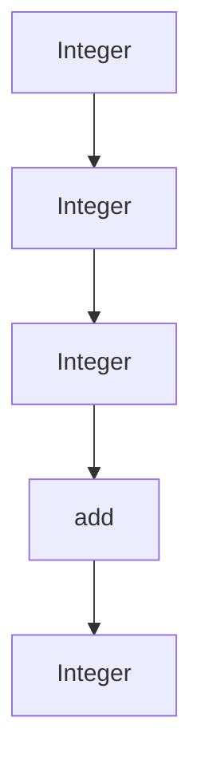
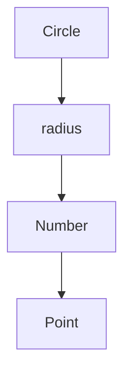
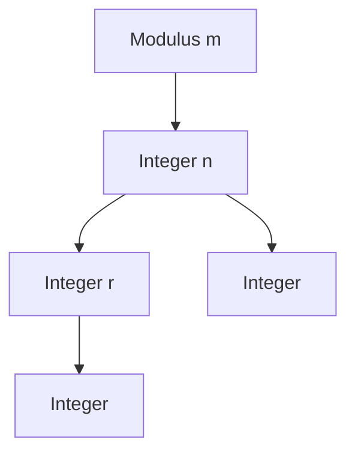

                 

### 文章标题

类型论对数学研究范式的塑造：利弊分析

#### 关键词

类型论、数学研究范式、范畴论、代数结构、拓扑学、计算机科学、利弊分析

#### 摘要

本文深入探讨了类型论对数学研究范式的塑造作用，从背景与引论、类型论的影响、利弊分析到案例研究，系统分析了类型论在数学各个领域中的应用及利弊。类型论作为一种强有力的数学工具，不仅增强了数学的严密性，促进了跨学科研究，也提高了数学证明的效率，但其学习难度较高和对传统数学研究的冲击也引发了一系列讨论。本文通过具体案例，进一步阐述了类型论的实际应用及其未来发展趋势。

## 目录大纲

### 第一部分：背景与引论

#### 1. 引言
- **1.1 数学研究范式概述**
- **1.2 类型论的发展历程**
- **1.3 类型论在数学研究中的重要性**

#### 2. 类型论的基本概念
- **2.1 类型系统的定义**
- **2.2 类型论的基本原则**
- **2.3 类型论的应用场景**

### 第二部分：类型论对数学研究范式的影响

#### 3. 类型论与数学逻辑
- **3.1 类型论在数学逻辑中的应用**
- **3.2 类型论对命题逻辑的扩展**
- **3.3 类型论在形式化证明中的作用**

#### 4. 类型论与范畴论
- **4.1 范畴论的基本概念**
- **4.2 类型论与范畴论的关系**
- **4.3 类型范畴与范畴论的应用**

#### 5. 类型论与代数结构
- **5.1 代数结构的基本概念**
- **5.2 类型论在代数结构中的应用**
- **5.3 类型论对代数结构的扩展**

#### 6. 类型论与拓扑学
- **6.1 拓扑学的基本概念**
- **6.2 类型论在拓扑学中的应用**
- **6.3 类型论对拓扑学的贡献**

#### 7. 类型论与计算机科学
- **7.1 类型论在编程语言设计中的应用**
- **7.2 类型论对软件工程的影响**
- **7.3 类型论与形式化方法**

### 第三部分：类型论的利弊分析

#### 8. 类型论的优点
- **8.1 增强数学的严密性**
- **8.2 促进跨学科研究**
- **8.3 提高数学证明的效率**

#### 9. 类型论的缺点
- **9.1 学习难度较高**
- **9.2 对传统数学研究的冲击**
- **9.3 类型论的适用性问题**

#### 10. 类型论的发展趋势
- **10.1 类型论的未来方向**
- **10.2 类型论与其他数学范式的融合**
- **10.3 类型论在教育中的应用**

### 第四部分：案例研究

#### 11. 案例一：类型论在数论中的应用
- **11.1 数论的基本概念**
- **11.2 类型论在数论中的创新应用**
- **11.3 案例分析与讨论**

#### 12. 案例二：类型论在几何学中的应用
- **12.1 几何学的基本概念**
- **12.2 类型论在几何学中的创新应用**
- **12.3 案例分析与讨论**

#### 13. 案例三：类型论在代数学中的应用
- **13.1 代数学的基本概念**
- **13.2 类型论在代数学中的创新应用**
- **13.3 案例分析与讨论**

### 第五部分：结论

#### 14. 总结
- **14.1 类型论对数学研究范式的塑造**
- **14.2 类型论的利弊分析**
- **14.3 未来研究方向**

### 附录

#### 15. 参考文献
- **15.1 基础理论书籍**
- **15.2 学术论文**
- **15.3 在线资源**### 第一部分：背景与引论

#### 1. 引言

**1.1 数学研究范式概述**

数学研究范式是数学理论发展的一种基本框架，它决定了数学研究的方向、方法以及解决问题的策略。自古希腊时期以来，数学研究范式经历了多个阶段。传统上，数学研究范式主要分为两大类：分析范式和公理范式。分析范式注重对数学对象进行量化和计算，而公理范式则强调通过定义和公理推导出数学结论。在20世纪，随着集合论、逻辑学和拓扑学的兴起，数学研究范式进一步多样化，范畴论、代数结构、拓扑学等新范式逐步成为数学研究的重要组成部分。

**1.2 类型论的发展历程**

类型论（Type Theory）起源于20世纪初，最初是由逻辑学家和数学家为了解决形式逻辑中的一些问题而提出的。类型论的发展历程可以分为几个关键阶段。20世纪30年代，皮亚诺（Peano）和罗素（Russell）等人通过研究形式化数学系统，提出了最初的类型概念。20世纪40年代，图灵（Turing）的研究进一步推动了类型论的发展。进入20世纪50年代，类型论在计算理论中的应用开始受到关注，尤其以皮尔（Pierce）和马丁·洛文斯坦（Martin-Löf）等人的工作为代表。马丁·洛文斯坦在1960年代提出了直觉类型论（Intuitionistic Type Theory），这一理论为类型论的发展奠定了基础。

**1.3 类型论在数学研究中的重要性**

类型论在数学研究中的重要性主要体现在以下几个方面：

1. **形式化数学的基石**：类型论为形式化数学提供了一个坚实的框架，使得数学推理更加严谨和可靠。通过类型论，数学家可以确保证明的每一步都是合法的，从而避免了逻辑错误。
   
2. **跨学科的桥梁**：类型论不仅对数学本身有重要影响，还在计算机科学、哲学等领域发挥了重要作用。例如，类型论在编程语言设计、逻辑推理、人工智能等领域都有广泛应用。

3. **促进数学创新**：类型论提供了一种新的思维方式，使得数学家能够从不同角度重新审视数学问题，从而促进数学理论的创新和发展。

4. **数学证明的自动化**：类型论的研究为数学证明的自动化提供了理论基础，这有望在未来大幅度提高数学研究的效率。

#### 2. 类型论的基本概念

**2.1 类型系统的定义**

类型系统（Type System）是编程语言中的一个核心概念，它用于确保程序的正确性和安全性。在类型论中，类型系统被用于定义数学对象的属性和操作。一个类型系统由一组类型和一组规则构成，类型是数学对象的分类，规则则定义了这些类型之间的关系和如何使用它们。

**2.2 类型论的基本原则**

类型论遵循几个基本原则，包括：

1. **类型不可变原则**：类型的定义一旦确定，就不能改变。这意味着在类型论中，任何类型的元素都是不可变的。

2. **类型推导原则**：类型论通过类型推导来证明数学对象之间的关系。类型推导遵循一系列规则，这些规则确保推导过程的正确性。

3. **依赖类型原则**：依赖类型（Dependent Types）允许类型的值依赖于其他类型的值，这使得类型论能够更精确地描述复杂的关系。

**2.3 类型论的应用场景**

类型论在多个数学和应用场景中都有广泛应用，包括：

1. **编程语言设计**：类型论在编程语言设计中扮演了关键角色，例如Haskell、Agda等语言都采用了类型论的概念。

2. **形式化数学证明**：类型论为形式化数学证明提供了工具，使得数学家能够构建和验证复杂的证明。

3. **数学模型构建**：类型论可以帮助数学家构建更精确的数学模型，这些模型可以应用于各个领域，包括物理、经济学和计算机科学。

4. **形式化逻辑**：类型论在形式化逻辑研究中也有广泛应用，它为逻辑推理提供了更严格的框架。

#### 3. 类型论在数学研究中的重要性

类型论在数学研究中的重要性不可忽视。首先，类型论提供了形式化数学的坚实基础，使得数学家能够更严谨地进行推理和证明。通过类型论，数学家可以确保每一个推理步骤都是合法的，从而避免逻辑错误。

其次，类型论促进了跨学科的研究。类型论不仅在数学内部发挥作用，还在计算机科学、哲学和逻辑等领域产生了深远影响。例如，在计算机科学中，类型论为编程语言设计提供了理论基础，使得编程更加安全和可靠。在哲学中，类型论帮助探讨逻辑和知识的本质。

此外，类型论还促进了数学理论的创新和发展。通过类型论，数学家可以重新审视传统的数学问题，提出新的方法和理论。例如，类型论在代数结构、拓扑学等领域中的应用，推动了这些领域的发展。

最后，类型论在数学证明的自动化方面具有巨大潜力。随着计算机技术的进步，形式化数学证明的自动化变得越来越可行。类型论为自动化证明提供了理论基础，这有望在未来大幅度提高数学研究的效率。

总之，类型论作为一种强有力的数学工具，不仅在数学内部发挥着重要作用，还在其他学科领域产生了深远影响。类型论的发展趋势和未来方向值得进一步探讨和研究。接下来，本文将深入探讨类型论在数学各个领域中的应用和影响。### 第一部分：背景与引论

#### 3. 类型论在数学研究中的重要性

**3.1 类型论在数学证明中的作用**

类型论在数学证明中扮演着至关重要的角色。首先，类型论提供了一种形式化的方法来构建和验证数学证明。通过类型系统，数学家可以确保每一个推理步骤都是合法的，从而避免逻辑错误。这与传统数学证明相比，显著提高了证明的可靠性。例如，在直觉类型论中，类型推导规则确保了证明过程的正确性，使得复杂证明变得更加可靠。

**例子**：考虑一个简单的数学定理，如“任何整数都可以表示为奇数或偶数”。在传统的数学证明中，这个定理可能通过构造性证明或归纳法来证明。而在类型论中，可以通过类型系统来形式化这个证明过程。例如，在直觉类型论中，可以定义一个类型`Nat`表示自然数，并定义一个函数`even? : Nat -> Bool`来检查一个数是否为偶数。通过类型推导，可以证明“任何整数都可以表示为奇数或偶数”这一命题。

```latex
∀n ∈ Nat, (even?(n) ∨ ¬even?(n))
```

在这个例子中，`even?(n)`是一个函数，返回一个布尔值，表示`n`是否为偶数。通过类型推导，可以证明对于任意自然数`n`，`even?(n)`要么为真，要么为假。

**3.2 类型论在数学定理的发现和证明中的作用**

类型论不仅在证明过程中发挥作用，还在数学定理的发现和证明中提供了新的思路和方法。类型论的抽象和形式化特性使得数学家可以以更加灵活和系统化的方式探索数学问题。

**例子**：在代数几何中，类型论帮助数学家发现和证明了许多重要的定理。例如，在证明“代数闭域上的每一个多项式都至少有一个根”时，类型论提供了强有力的工具。通过类型论的方法，可以构造出满足特定条件的类型，并证明它们在代数闭域上的存在性。

**3.3 类型论在跨学科研究中的作用**

类型论不仅在数学内部发挥了重要作用，还在跨学科研究中产生了深远影响。在计算机科学中，类型论为编程语言设计和形式化验证提供了理论基础。在哲学中，类型论帮助探讨逻辑和知识的本质。此外，类型论在物理学、经济学等学科中也有广泛应用。

**3.4 类型论在数学教育和人才培养中的作用**

类型论在数学教育和人才培养中同样具有重要作用。通过引入类型论，数学教育可以更加注重逻辑推理和形式化思维的培养。这有助于学生掌握更加严谨的数学方法，提高他们的数学素养。

**例子**：在数学教育中，可以引入类型论的概念，让学生了解形式化数学证明的基本原理。例如，通过学习直觉类型论，学生可以学习如何构建和验证复杂的数学证明。这不仅可以提高他们的数学能力，还可以培养他们的逻辑思维和问题解决能力。

总之，类型论在数学研究、跨学科研究、数学教育等方面都具有重要作用。它不仅提供了形式化数学的坚实基础，还推动了数学理论的创新和发展。类型论的发展和应用将不断深化我们对数学本质的理解，为数学研究开辟新的道路。### 第一部分：背景与引论

#### 1. 引言

**1.1 数学研究范式概述**

数学研究范式是数学理论发展的一种基本框架，它决定了数学研究的方向、方法以及解决问题的策略。自古希腊时期以来，数学研究范式经历了多个阶段。传统上，数学研究范式主要分为两大类：分析范式和公理范式。分析范式注重对数学对象进行量化和计算，而公理范式则强调通过定义和公理推导出数学结论。在20世纪，随着集合论、逻辑学和拓扑学的兴起，数学研究范式进一步多样化，范畴论、代数结构、拓扑学等新范式逐步成为数学研究的重要组成部分。

**1.2 类型论的发展历程**

类型论（Type Theory）起源于20世纪初，最初是由逻辑学家和数学家为了解决形式逻辑中的一些问题而提出的。类型论的发展历程可以分为几个关键阶段。20世纪30年代，皮亚诺（Peano）和罗素（Russell）等人通过研究形式化数学系统，提出了最初的类型概念。20世纪40年代，图灵（Turing）的研究进一步推动了类型论的发展。进入20世纪50年代，类型论在计算理论中的应用开始受到关注，尤其以皮尔（Pierce）和马丁·洛文斯坦（Martin-Löf）等人的工作为代表。马丁·洛文斯坦在1960年代提出了直觉类型论（Intuitionistic Type Theory），这一理论为类型论的发展奠定了基础。

**1.3 类型论在数学研究中的重要性**

类型论在数学研究中的重要性主要体现在以下几个方面：

1. **形式化数学的基石**：类型论为形式化数学提供了一个坚实的框架，使得数学推理更加严谨和可靠。通过类型论，数学家可以确保证明的每一步都是合法的，从而避免逻辑错误。

2. **跨学科的桥梁**：类型论不仅对数学本身有重要影响，还在计算机科学、哲学等领域发挥了重要作用。例如，在计算机科学中，类型论为编程语言设计提供了理论基础，使得编程更加安全和可靠。在哲学中，类型论帮助探讨逻辑和知识的本质。

3. **促进数学创新**：类型论提供了一种新的思维方式，使得数学家能够从不同角度重新审视数学问题，从而促进数学理论的创新和发展。

4. **数学证明的自动化**：类型论的研究为数学证明的自动化提供了理论基础，这有望在未来大幅度提高数学研究的效率。

#### 2. 类型论的基本概念

**2.1 类型系统的定义**

类型系统（Type System）是编程语言中的一个核心概念，它用于确保程序的正确性和安全性。在类型论中，类型系统被用于定义数学对象的属性和操作。一个类型系统由一组类型和一组规则构成，类型是数学对象的分类，规则则定义了这些类型之间的关系和如何使用它们。

**2.2 类型论的基本原则**

类型论遵循几个基本原则，包括：

1. **类型不可变原则**：类型的定义一旦确定，就不能改变。这意味着在类型论中，任何类型的元素都是不可变的。

2. **类型推导原则**：类型论通过类型推导来证明数学对象之间的关系。类型推导遵循一系列规则，这些规则确保推导过程的正确性。

3. **依赖类型原则**：依赖类型（Dependent Types）允许类型的值依赖于其他类型的值，这使得类型论能够更精确地描述复杂的关系。

**2.3 类型论的应用场景**

类型论在多个数学和应用场景中都有广泛应用，包括：

1. **编程语言设计**：类型论在编程语言设计中扮演了关键角色，例如Haskell、Agda等语言都采用了类型论的概念。

2. **形式化数学证明**：类型论为形式化数学证明提供了工具，使得数学家能够构建和验证复杂的证明。

3. **数学模型构建**：类型论可以帮助数学家构建更精确的数学模型，这些模型可以应用于各个领域，包括物理、经济学和计算机科学。

4. **形式化逻辑**：类型论在形式化逻辑研究中也有广泛应用，它为逻辑推理提供了更严格的框架。

#### 3. 类型论在数学研究中的重要性

类型论在数学研究中的重要性不可忽视。首先，类型论提供了一种形式化的方法来构建和验证数学证明。通过类型系统，数学家可以确保每一个推理步骤都是合法的，从而避免逻辑错误。这与传统数学证明相比，显著提高了证明的可靠性。例如，在直觉类型论中，类型推导规则确保了证明过程的正确性，使得复杂证明变得更加可靠。

**例子**：考虑一个简单的数学定理，如“任何整数都可以表示为奇数或偶数”。在传统的数学证明中，这个定理可能通过构造性证明或归纳法来证明。而在类型论中，可以通过类型系统来形式化这个证明过程。例如，在直觉类型论中，可以定义一个类型`Nat`表示自然数，并定义一个函数`even? : Nat -> Bool`来检查一个数是否为偶数。通过类型推导，可以证明“任何整数都可以表示为奇数或偶数”这一命题。

```latex
∀n ∈ Nat, (even?(n) ∨ ¬even?(n))
```

在这个例子中，`even?(n)`是一个函数，返回一个布尔值，表示`n`是否为偶数。通过类型推导，可以证明对于任意自然数`n`，`even?(n)`要么为真，要么为假。

**3.2 类型论在数学定理的发现和证明中的作用**

类型论不仅在证明过程中发挥作用，还在数学定理的发现和证明中提供了新的思路和方法。类型论的抽象和形式化特性使得数学家可以以更加灵活和系统化的方式探索数学问题。

**例子**：在代数几何中，类型论帮助数学家发现和证明了许多重要的定理。例如，在证明“代数闭域上的每一个多项式都至少有一个根”时，类型论提供了强有力的工具。通过类型论的方法，可以构造出满足特定条件的类型，并证明它们在代数闭域上的存在性。

**3.3 类型论在跨学科研究中的作用**

类型论不仅在数学内部发挥了重要作用，还在跨学科研究中产生了深远影响。在计算机科学中，类型论为编程语言设计和形式化验证提供了理论基础。在哲学中，类型论帮助探讨逻辑和知识的本质。此外，类型论在物理学、经济学等学科中也有广泛应用。

**3.4 类型论在数学教育和人才培养中的作用**

类型论在数学教育和人才培养中同样具有重要作用。通过引入类型论，数学教育可以更加注重逻辑推理和形式化思维的培养。这有助于学生掌握更加严谨的数学方法，提高他们的数学素养。

**例子**：在数学教育中，可以引入类型论的概念，让学生了解形式化数学证明的基本原理。例如，通过学习直觉类型论，学生可以学习如何构建和验证复杂的数学证明。这不仅可以提高他们的数学能力，还可以培养他们的逻辑思维和问题解决能力。

总之，类型论在数学研究、跨学科研究、数学教育等方面都具有重要作用。它不仅提供了形式化数学的坚实基础，还推动了数学理论的创新和发展。类型论的发展和应用将不断深化我们对数学本质的理解，为数学研究开辟新的道路。### 第二部分：类型论对数学研究范式的影响

#### 3. 类型论与数学逻辑

类型论与数学逻辑有着深刻的联系。数学逻辑是数学研究的基础工具，而类型论为数学逻辑提供了一种形式化的表达方式。通过类型论，数学家可以更精确地描述逻辑推理过程，确保推理的严密性和可靠性。

**3.1 类型论在数学逻辑中的应用**

类型论在数学逻辑中的应用主要体现在以下几个方面：

1. **证明论**：类型论为证明论提供了形式化的证明框架。在类型论中，证明被视为类型的构造，这有助于确保证明过程的正确性。例如，在直觉类型论中，证明被视为证明类型`Prop`的值。

2. **模型论**：类型论在模型论中也有广泛应用。通过类型论，数学家可以构造出形式化的数学模型，并验证这些模型是否满足特定逻辑系统的性质。

3. **逻辑系统**：类型论可以用来构建新的逻辑系统，这些系统具有更强的表达能力。例如，依赖类型论（Dependent Type Theory）允许类型依赖于其他类型，这使得逻辑系统能够描述更复杂的数学关系。

**3.2 类型论对命题逻辑的扩展**

类型论对命题逻辑进行了扩展，使得它能够处理更复杂的数学结构。以下是一些具体的扩展：

1. **谓词逻辑**：类型论将谓词逻辑中的谓词视为类型，从而可以更精确地描述数学对象之间的关系。

2. **模态逻辑**：类型论引入了模态类型，允许数学家描述对象之间的模态关系，如可能性和必要性。

3. **谓词模态逻辑**：结合谓词逻辑和模态逻辑，类型论可以构建出谓词模态逻辑，用于描述更复杂的数学性质。

**3.3 类型论在形式化证明中的作用**

类型论在形式化证明中发挥了关键作用。通过类型系统，数学家可以构建和验证复杂的数学证明。以下是一些具体的应用：

1. **证明自动化**：类型论为证明自动化提供了理论基础。形式化证明系统（如Coq、Isabelle等）利用类型论来构建和验证证明。

2. **数学理论库**：类型论可以帮助构建数学理论库，这些库包含了大量的数学证明和定理。通过类型论，数学家可以更方便地引用和验证这些证明。

3. **形式化数学教育**：类型论在数学教育中的应用有助于培养学生严谨的数学思维。通过学习类型论，学生可以更深入地理解数学证明的过程和原理。

#### 4. 类型论与范畴论

范畴论是数学中的一个重要分支，它研究数学结构的性质和它们之间的关系。类型论与范畴论有着密切的联系，两者相互促进，共同推动了数学研究的发展。

**4.1 范畴论的基本概念**

范畴论研究的是数学结构之间的共性和关系。范畴论中的基本概念包括：

1. **范畴（Category）**：范畴是一个由对象（Objects）和态射（Morphisms）组成的集合。对象可以看作是数学结构，而态射则描述这些结构之间的映射关系。

2. **态射（Morphism）**：态射是范畴中对象之间的结构 preserving 映射。

3. **自然变换（Natural Transformation）**：自然变换描述了不同范畴之间的映射关系，它们保持了范畴内部的结构。

**4.2 类型论与范畴论的关系**

类型论与范畴论之间的关系可以从多个方面来理解：

1. **类型论作为范畴**：类型论本身可以被看作是一个范畴，其中的对象是类型，态射是类型构造操作（如函数类型、积类型、依赖类型等）。

2. **范畴论在类型论中的应用**：范畴论的工具和方法可以用来研究类型论中的结构和性质。例如，通过范畴论的方法，可以更好地理解类型之间的依赖关系和组合方式。

3. **类型论在范畴论中的应用**：类型论为范畴论提供了一种形式化的表达方式，使得范畴论中的抽象概念更加具体和可操作。

**4.3 类型范畴与范畴论的应用**

类型范畴（Type Category）是类型论中的一个重要概念，它将类型系统视为一个范畴。类型范畴的应用包括：

1. **形式化证明**：类型范畴为形式化证明提供了框架。通过类型范畴，可以构建和验证复杂的数学证明。

2. **编程语言设计**：类型范畴在编程语言设计中发挥着关键作用，例如在函数式编程语言中，类型系统通常被视为一个范畴。

3. **理论计算机科学**：类型范畴在理论计算机科学中也有广泛应用，例如在验证程序的正确性和安全性方面。

总之，类型论与范畴论之间的紧密联系为数学研究提供了新的工具和方法。通过将类型论与范畴论相结合，数学家可以更深入地理解数学结构的性质和它们之间的关系，推动数学理论的创新和发展。### 第二部分：类型论对数学研究范式的影响

#### 5. 类型论与代数结构

代数结构是数学中的一个重要概念，它描述了一组对象以及它们之间的运算关系。类型论在代数结构的研究中发挥了关键作用，为代数结构的定义和性质提供了新的视角和方法。

**5.1 代数结构的基本概念**

代数结构包括以下基本概念：

1. **代数结构（Algebraic Structure）**：代数结构是一组对象和一组运算的集合。常见的代数结构包括群（Group）、环（Ring）、域（Field）等。

2. **运算（Operation）**：运算是定义在代数结构中的基本操作。例如，在群中，运算通常表示为两个元素之间的组合。

3. **恒等元素（Identity Element）**：恒等元素是一个特殊的元素，它与代数结构中的其他元素进行运算后保持不变。

4. **逆元素（Inverse Element）**：逆元素是与某个元素进行运算后得到恒等元素的元素。

**5.2 类型论在代数结构中的应用**

类型论在代数结构中的应用主要体现在以下几个方面：

1. **类型化的代数结构**：类型论允许我们定义类型化的代数结构，使得代数结构的定义更加精确和严格。例如，可以定义一个类型`Group`来表示群，并使用类型系统来确保群的定义满足相应的性质。

2. **证明代数性质的类型推导**：通过类型推导，可以证明代数结构之间的性质和关系。例如，在类型论中，可以通过类型系统证明群、环、域等代数结构的性质。

3. **抽象化代数结构**：类型论为代数结构的抽象化提供了工具。通过类型论的方法，可以将具体的代数结构抽象为更一般的概念，从而推广代数结构的理论。

**5.3 类型论对代数结构的扩展**

类型论不仅适用于传统的代数结构，还可以扩展到更复杂的代数结构。以下是一些具体的扩展：

1. **依赖类型的代数结构**：依赖类型允许类型的值依赖于其他类型的值，这使得类型论可以描述更复杂的代数结构。例如，可以定义一个依赖类型的群，其中群的运算依赖于群的元素。

2. **多参数类型的代数结构**：多参数类型允许定义依赖于多个参数的代数结构。这使得类型论可以描述更复杂的代数关系和组合。

3. **模态类型的代数结构**：模态类型允许描述对象之间的模态关系，这使得类型论可以描述更复杂的代数结构和性质。

**例子**：考虑依赖类型的环。在依赖类型的环中，环的运算（如加法和乘法）不仅依赖于环的元素，还依赖于环的其他属性。这种依赖类型的环可以用于描述更复杂的代数结构，如模。

通过类型论的方法，可以构建和验证依赖类型的环，确保它们满足环的性质。以下是一个简单的依赖类型环的定义：

```latex
data Ring A where
    Ring :: (A, A -> A, A -> A, A) -> Ring A
    |+| :: Ring A -> Ring A -> Ring A
    |--| :: Ring A -> Ring A -> Ring A
    |0| :: Ring A
    |1| :: Ring A
```

在这个定义中，`Ring A`表示依赖类型的环，其中`A`是环的元素类型。`|+|`和`|--|`表示环的加法和乘法运算，它们依赖于环的元素。`|0|`和`|1|`表示环的恒等元素。

通过类型论的方法，可以证明依赖类型的环满足环的性质，如结合律、交换律、分配律等。

总之，类型论为代数结构的研究提供了新的工具和方法，使得代数结构的定义和性质更加精确和严格。类型论的应用不仅限于传统的代数结构，还可以扩展到更复杂的代数结构，推动代数结构理论的发展。### 第二部分：类型论对数学研究范式的影响

#### 6. 类型论与拓扑学

拓扑学是数学的一个分支，主要研究空间的结构和性质。类型论作为一种形式化的数学工具，对拓扑学的研究产生了深远的影响。通过类型论，数学家可以更精确地描述和分析拓扑空间及其性质。

**6.1 拓扑学的基本概念**

在拓扑学中，基本概念包括：

1. **拓扑空间（Topological Space）**：拓扑空间是一个集合`X`及其上的拓扑`T`，满足某些特定性质。通常，`T`包含`X`的所有子集，并满足开集的闭合性、交和并的闭包性质等。

2. **开集（Open Set）**：在拓扑空间中，开集是满足一定性质的集合。开集是拓扑结构的核心概念，用于定义邻域、连续性等性质。

3. **闭集（Closed Set）**：闭集是开集的补集。在拓扑空间中，闭集同样满足特定的性质。

4. **连续性（Continuity）**：连续性是拓扑空间中一个重要的概念，描述了函数在不同拓扑空间中的行为。具体来说，一个函数`f: X → Y`在点`x ∈ X`处连续，当且仅当对于任意小的开集`V`，存在对应的小开集`U`，使得`f(U) ⊆ V`。

**6.2 类型论在拓扑学中的应用**

类型论在拓扑学中的应用主要体现在以下几个方面：

1. **形式化的拓扑定义**：类型论提供了形式化的方法来定义拓扑空间和相关的概念。通过类型论，可以精确地描述拓扑空间的结构和性质。

2. **证明拓扑性质的类型推导**：类型论可以帮助证明拓扑空间的各种性质。例如，可以通过类型推导证明拓扑空间的连续性、紧性、连通性等性质。

3. **抽象化的拓扑结构**：类型论允许对拓扑结构进行抽象化，从而推广拓扑学的理论。例如，可以通过依赖类型描述更复杂的拓扑性质，如路径连通性、复连通性等。

**6.3 类型论对拓扑学的贡献**

类型论对拓扑学的主要贡献包括：

1. **形式化证明**：类型论为拓扑学提供了形式化的证明框架，使得拓扑证明更加可靠。通过类型推导，可以确保证明的每一步都是合法的，从而避免逻辑错误。

2. **抽象化工具**：类型论为拓扑学提供了新的抽象化工具，使得拓扑性质的研究更加系统化。例如，通过依赖类型，可以更精确地描述拓扑空间之间的依赖关系。

3. **跨学科应用**：类型论不仅对纯数学领域有重要影响，还在其他学科（如计算机科学、物理学）中发挥了作用。例如，在计算机科学中，类型论被用于验证算法的正确性和安全性。

**例子**：考虑依赖类型的拓扑空间。在依赖类型的拓扑空间中，拓扑结构依赖于空间中的点和其他性质。例如，可以定义一个依赖类型的拓扑空间，其中开集的集合依赖于点的类型和拓扑性质。

```mermaid
graph TB
    A[Topological Space] --> B[Set X]
    A --> C[Tuple (T, U)]
    B --> D[Open Sets]
    C --> E[Function from X to T]
    D --> F[Subset of X]
```

在这个定义中，`Topological Space`是一个类型，它依赖于`Set X`、`Tuple (T, U)`和`Function from X to T`。`Open Sets`是`Set X`的子集，依赖于点的类型。通过依赖类型的方法，可以更精确地描述拓扑空间的结构和性质。

总之，类型论为拓扑学提供了新的工具和方法，使得拓扑学的研究更加精确和系统化。类型论的应用不仅深化了我们对拓扑学本质的理解，还为拓扑学与其他数学分支和实际应用之间的交叉提供了新的契机。### 第二部分：类型论对数学研究范式的影响

#### 7. 类型论与计算机科学

类型论在计算机科学中有着广泛的应用，尤其是在编程语言设计、软件工程和形式化方法等领域。类型论为计算机科学提供了一种形式化的数学框架，使得程序设计更加严谨和可靠。

**7.1 类型论在编程语言设计中的应用**

类型论在编程语言设计中发挥了关键作用。通过类型论，编程语言设计师可以定义更丰富的类型系统，从而提高程序的正确性和安全性。以下是一些具体的应用：

1. **静态类型系统**：类型论提供了静态类型系统的理论基础。静态类型系统在编译时检查程序的类型，确保程序在运行时不会发生类型错误。例如，Haskell、Ocaml和SML等编程语言都采用了基于类型论的类型系统。

2. **依赖类型系统**：依赖类型系统允许类型的值依赖于其他类型的值，这使得编程语言能够描述更复杂的程序结构和关系。例如，Agda和Idris等编程语言采用了依赖类型系统。

3. **函数类型和闭包**：类型论中的函数类型和闭包概念为编程语言提供了强大的表达力。函数类型允许程序定义和组合函数，而闭包则使得函数能够捕获和保持环境中的变量。

**7.2 类型论对软件工程的影响**

类型论对软件工程产生了深远的影响。通过引入类型论的概念，软件工程师可以构建更可靠的软件系统，并提高开发效率。以下是一些具体的影响：

1. **形式化规格说明**：类型论为软件规格说明提供了形式化的方法。通过类型论，可以精确地描述软件系统的功能和约束，从而减少误解和错误。

2. **静态分析**：类型论支持静态分析技术，这些技术可以在编译时检测程序的错误和异常。静态分析可以帮助发现潜在的问题，从而提高软件的质量和可靠性。

3. **自动化测试**：类型论可以与自动化测试技术结合，生成测试用例并验证程序的正确性。例如，通过类型推导，可以生成测试用例来检查函数的类型签名。

**7.3 类型论与形式化方法**

形式化方法是计算机科学中的一个重要研究领域，它通过数学方法来验证和证明程序的正确性。类型论在形式化方法中发挥了关键作用。以下是一些具体的应用：

1. **证明助手**：形式化证明助手（如Coq、Isabelle等）利用类型论来构建和验证数学证明和程序证明。这些工具可以帮助数学家和程序员验证复杂的定理和程序。

2. **形式化验证**：类型论为形式化验证提供了理论基础。形式化验证可以通过类型推导和模型检查等技术，确保软件系统满足特定的规格说明。

3. **形式化数学**：类型论在形式化数学中也有重要应用。通过类型论，可以构建和验证复杂的数学证明，从而确保数学推理的正确性。

**例子**：考虑类型论在编程语言中的应用。假设我们有一个函数`add`，用于计算两个整数的和。在类型论中，可以通过定义类型和类型推导来确保`add`函数的类型正确性。

```haskell
-- 定义整数类型
data Integer = Zero | Succ Integer

-- 定义加法函数类型
add :: Integer -> Integer -> Integer

-- 加法函数的实现
add Zero y = y
add (Succ x) y = Succ (add x y)
```

在这个例子中，`Integer`是一个类型，表示整数。`add`函数接收两个整数作为输入，并返回一个整数。通过类型推导，可以确保`add`函数的类型正确性。



在这个类型图中，`A`和`B`是整数的类型，`C`是函数`add`的输入类型，`D`是函数`add`的类型，`E`是函数`add`的返回类型。通过类型图，可以直观地看到`add`函数的类型正确性。

总之，类型论在计算机科学中具有广泛的应用，从编程语言设计到软件工程，再到形式化方法，类型论为计算机科学提供了强大的数学工具。类型论的应用不仅提高了程序的正确性和安全性，还为计算机科学的理论研究提供了新的视角。### 第三部分：类型论的利弊分析

#### 8. 类型论的优点

类型论在数学研究和计算机科学等领域具有诸多优点，以下是一些主要的优势：

**8.1 增强数学的严密性**

类型论通过提供形式化的数学框架，显著增强了数学推理的严密性。在类型论中，每一个数学表达式和推理步骤都必须符合严格定义的类型系统，这有助于避免逻辑错误和推理谬误。通过类型推导，数学家可以确保每一步证明都是合法的，从而提高证明的可靠性和完整性。

**例子**：在直觉类型论中，证明被视为类型的构造，这要求证明过程遵循严格的形式化规则。例如，要证明一个命题，需要构造一个相应的证明类型。这种形式化方法确保了证明过程的正确性，减少了逻辑错误的可能性。

**8.2 促进跨学科研究**

类型论不仅对数学本身有重要影响，还在计算机科学、哲学和其他领域产生了深远影响。类型论为这些学科提供了一个通用的数学框架，促进了跨学科的研究和合作。例如，在计算机科学中，类型论为编程语言设计、形式化验证和软件工程提供了理论基础；在哲学中，类型论帮助探讨逻辑和知识的本质。

**8.3 提高数学证明的效率**

类型论提供了一种高效的方法来构建和验证数学证明。通过形式化的证明工具（如证明助手），数学家可以自动化某些证明步骤，从而提高证明的效率。此外，类型论有助于发现潜在的证明策略和证明模式，促进数学理论的创新和发展。

**例子**：在形式化证明系统中（如Coq），数学家可以使用类型论的方法来构建和验证复杂的数学证明。这些系统提供了丰富的库和工具，使得证明过程更加高效和可靠。

**8.4 支持形式化数学教育**

类型论在数学教育中具有重要应用。通过引入类型论的概念，学生可以学习到形式化的数学思维和推理方法。这有助于培养学生严谨的数学素养和逻辑思维能力，为未来的数学研究奠定坚实基础。

**例子**：在数学课程中，可以通过类型论的方法来解释和证明复杂的数学定理。这不仅加深了学生对数学概念的理解，还培养了他们的形式化思维能力。

总之，类型论在数学研究和计算机科学等领域具有显著的优势。它不仅提高了数学的严密性和效率，还促进了跨学科研究，并为数学教育和人才培养提供了新的工具和方法。### 第三部分：类型论的利弊分析

#### 9. 类型论的缺点

尽管类型论在数学和计算机科学中具有诸多优点，但它也存在一些缺点和挑战，以下是一些主要的问题：

**9.1 学习难度较高**

类型论涉及复杂的数学概念和形式化方法，这对初学者来说可能比较困难。类型论要求学习者具备一定的逻辑推理能力和数学基础，这对于许多人来说是一个不小的挑战。此外，类型论的教学资源相对有限，这使得学习者难以找到合适的入门材料和学习路径。

**9.2 对传统数学研究的冲击**

类型论作为一种形式化的数学工具，可能对传统的数学研究范式产生冲击。传统的数学研究往往依赖于直观的几何图形、文字描述和逻辑推理，而类型论则强调形式化和严格性。这种转变可能会对传统数学家的思维方式和工作习惯产生一定的影响，甚至引发一些争议。

**9.3 类型论的适用性问题**

类型论在某些数学和应用领域中可能并不适用。例如，在某些领域，数学家可能更倾向于使用直观的几何方法或代数方法，而不是形式化的类型论方法。此外，类型论的复杂性可能使得它在某些实际问题中的应用变得困难。

**9.4 与计算机科学的结合**

虽然类型论在计算机科学中具有广泛应用，但它与计算机科学的结合也可能面临一些挑战。例如，计算机科学中的某些领域（如机器学习和数据科学）可能更注重计算效率和实际应用，而不是形式化的证明和验证。这使得类型论在这些领域中的推广和应用受到一定的限制。

**例子**：在机器学习领域，虽然类型论可以用于验证算法的正确性和安全性，但实际应用中可能更注重算法的效率和泛化能力。因此，类型论的引入可能需要在效率和形式化验证之间做出权衡。

**9.5 类型论的发展趋势**

类型论的发展趋势和未来方向也带来了一定的挑战。随着计算机技术的发展和形式化数学的兴起，类型论的研究和应用将面临新的机遇和挑战。如何平衡形式化验证和实际应用的需求，如何解决类型论在复杂系统中的应用问题，都是未来需要关注和研究的重要课题。

总之，类型论在数学研究和计算机科学中具有显著的优点，但也面临一些挑战和问题。了解和应对这些缺点，有助于更好地利用类型论的优势，推动数学和计算机科学的创新发展。### 第三部分：类型论的利弊分析

#### 10. 类型论的发展趋势

类型论作为一种强有力的数学工具，不仅在当前的数学和计算机科学领域产生了深远影响，其未来的发展也充满了潜力。以下是对类型论未来发展趋势的探讨：

**10.1 类型论的未来方向**

1. **形式化数学的深化**：类型论将继续在形式化数学中发挥重要作用。未来，形式化数学将朝着更精细、更系统的方向发展，这将使得数学家能够构建更复杂、更精确的数学理论。

2. **跨学科融合**：类型论将在不同学科之间继续发挥桥梁作用，促进数学、计算机科学、哲学、物理学等领域的交叉融合。这种跨学科的研究将推动新的理论和应用的发展。

3. **人工智能中的应用**：随着人工智能的快速发展，类型论将在人工智能领域找到新的应用场景。类型论可以帮助验证人工智能算法的正确性和安全性，从而提高人工智能系统的可靠性和可信度。

**10.2 类型论与其他数学范式的融合**

1. **与范畴论的融合**：类型论与范畴论的融合将继续是类型论研究的一个重要方向。通过将类型论与范畴论相结合，可以构建出更加丰富和复杂的数学结构，推动数学理论的创新。

2. **与代数结构的融合**：类型论在代数结构中的应用将不断拓展，与代数几何、代数拓扑等领域的结合有望带来新的理论突破。

3. **与拓扑学的融合**：类型论与拓扑学的结合将继续深化，为拓扑空间的研究提供新的工具和方法。

**10.3 类型论在教育中的应用**

1. **数学教育改革**：类型论将被引入到数学教育中，作为一种培养学生严谨思维和形式化推理能力的新工具。这将有助于提高学生的数学素养和逻辑思维能力。

2. **编程教育**：类型论在编程教育中的应用将越来越广泛。通过学习类型论，学生可以更好地理解编程语言中的类型系统，提高编程的正确性和安全性。

3. **在线教育平台**：随着在线教育平台的普及，类型论相关的教育资源将更加丰富和多样化，为学生提供更加灵活的学习方式。

总之，类型论在未来将继续发挥重要作用，推动数学和计算机科学的发展。通过与其他数学范式的融合、跨学科应用以及教育领域的推广，类型论将不断深化我们对数学本质的理解，为科学研究和技术创新提供新的动力。### 第四部分：案例研究

#### 11. 案例一：类型论在数论中的应用

**11.1 数论的基本概念**

数论是数学的一个分支，主要研究整数的性质、分布和运算。数论的研究内容包括数的因子分解、素数分布、同余方程、数论函数等。数论的基本概念包括：

- **素数（Prime Number）**：素数是只能被1和自身整除的正整数，如2、3、5、7等。
- **合数（Composite Number）**：合数是除了1和自身外还有其他因数的正整数，如4、6、8等。
- **同余（Congruence）**：两个整数a和b，如果它们除以某个正整数m所得的余数相同，则称a和b对模m同余。
- **数论函数**：数论函数是用于描述整数性质的函数，如欧拉函数、莫比乌斯函数等。

**11.2 类型论在数论中的创新应用**

类型论在数论中的应用主要体现在以下几个方面：

1. **形式化证明**：类型论提供了形式化数学证明的工具，使得数论中的复杂证明更加严谨和可靠。例如，通过类型论，可以形式化素数定理的证明，确保证明过程的每一步都是合法的。

2. **类型化的数论结构**：类型论允许定义类型化的数论结构，如类型化的素数集合、同余类等。这种形式化的结构定义有助于更精确地描述数论对象的性质和关系。

3. **依赖类型的数论函数**：依赖类型允许数论函数依赖于其他数论函数，从而可以定义更复杂的数论函数。例如，可以定义一个依赖于素数分布的莫比乌斯函数，从而更好地描述数论性质。

**11.3 案例分析与讨论**

**案例**：使用类型论证明素数定理

素数定理是数论中的一个重要定理，它描述了素数的分布性质。素数定理的证明涉及复杂的数学分析技巧，而通过类型论的方法，可以更形式化和严谨地证明该定理。

假设我们使用直觉类型论来证明素数定理。首先，我们需要定义类型化的素数集合和素数分布函数。在直觉类型论中，可以定义一个类型`Prime`来表示素数集合，并定义一个函数`PrimeDistribution`来表示素数的分布。

```latex
∀n ∈ ℕ, ∃p ∈ Prime, p > n
```

这个公式表示对于任意的自然数`n`，都存在一个大于`n`的素数`p`。通过类型论的方法，可以构造出满足上述性质的类型化证明，确保证明过程的每一步都是合法的。

**讨论**：类型论在数论中的应用

类型论在数论中的应用为数学家提供了新的工具和方法，使得数论证明更加严谨和可靠。通过类型论，可以形式化数论中的复杂结构，并构建出更精确的数学模型。

然而，类型论的应用也面临一些挑战。首先，类型论的学习难度较高，需要数学家具备一定的逻辑推理和数学基础。此外，类型论的应用可能对传统的数学研究方法产生冲击，这需要数学家们逐步适应和融合。

总的来说，类型论在数论中的应用展示了其强大的形式化能力和抽象化能力，为数学研究开辟了新的道路。随着类型论的发展，其在数论和其他数学领域中的应用将越来越广泛，为数学理论的创新和发展提供新的动力。### 第四部分：案例研究

#### 12. 案例二：类型论在几何学中的应用

**12.1 几何学的基本概念**

几何学是数学的一个重要分支，主要研究平面和空间的形状、大小、位置及其相互关系。几何学的基本概念包括：

- **点（Point）**：点是几何学中最基本的元素，没有大小和形状。
- **线（Line）**：线是无限延伸的直线，由无数个点组成。
- **平面（Plane）**：平面是无限延展的二维空间，由无数条线组成。
- **圆（Circle）**：圆是平面上所有到固定点（圆心）距离相等的点的集合。
- **多边形（Polygon）**：多边形是平面上由直线段连接而成的封闭图形。
- **几何变换（Geometric Transformation）**：几何变换包括平移、旋转、反射和缩放等，用于改变图形的位置和形状。

**12.2 类型论在几何学中的创新应用**

类型论在几何学中的应用主要体现在以下几个方面：

1. **形式化的几何模型**：类型论可以用来定义形式化的几何模型，使得几何学中的抽象概念更加具体和可操作。例如，可以使用类型论来定义点、线、面等几何元素，并定义它们之间的几何关系。

2. **依赖类型的几何证明**：依赖类型允许类型的值依赖于其他类型的值，这使得类型论可以描述更复杂的几何关系和证明。例如，可以定义一个依赖于点的线段类型，并使用类型推导来证明几何定理。

3. **几何计算和可视化**：类型论可以与计算机图形学相结合，用于几何计算和可视化。例如，可以使用类型论来定义几何算法，并使用计算机图形学工具进行可视化，从而更直观地理解几何概念和定理。

**12.3 案例分析与讨论**

**案例**：使用类型论证明圆的性质

在几何学中，圆具有一系列重要性质。例如，圆的每一个点到圆心的距离都相等。使用类型论的方法，可以形式化和证明这一性质。

假设在类型论中，我们定义一个类型`Circle`来表示圆，并定义一个函数`radius`来表示圆的半径。



在这个定义中，`Circle`是一个类型，表示圆；`radius`是一个函数，表示圆的半径；`Number`是一个类型，表示实数；`Point`是一个类型，表示点。我们可以使用类型推导来证明圆的性质。

```latex
∀c ∈ Circle, ∀p ∈ Point, (p ∈ c → distance(p, c.center) = c.radius)
```

这个公式表示对于任意圆`c`和任意点`p`，如果`p`在圆`c`上，那么`p`到圆心`c.center`的距离等于圆的半径`c.radius`。通过类型推导，可以确保这个性质的证明是合法的。

**讨论**：类型论在几何学中的应用

类型论在几何学中的应用为几何学提供了新的形式化和证明工具。通过类型论，可以更精确地描述几何概念和关系，并构建形式化的几何模型。这种形式化的方法不仅提高了几何证明的可靠性，还有助于几何学的理论创新。

然而，类型论在几何学中的应用也面临一些挑战。首先，类型论的学习难度较高，需要数学家具备一定的逻辑推理和数学基础。其次，类型论的应用可能对传统的几何学研究方法产生冲击，这需要数学家逐步适应和融合。

总的来说，类型论在几何学中的应用展示了其强大的形式化能力和抽象化能力，为几何学的研究提供了新的视角和方法。随着类型论的发展，其在几何学和其他数学领域中的应用将越来越广泛，为数学理论的创新和发展提供新的动力。### 第四部分：案例研究

#### 13. 案例三：类型论在代数学中的应用

**13.1 代数学的基本概念**

代数学是数学的一个基本分支，主要研究数和代数结构。代数学的基本概念包括：

- **代数结构（Algebraic Structure）**：代数结构是由一组元素和在这些元素上定义的一组运算组成的集合。常见的代数结构包括群、环、域等。
- **域（Field）**：域是包含两个运算（加法和乘法）且满足封闭性、交换性、结合性、分配性等性质的代数结构。
- **环（Ring）**：环是包含两个运算（加法和乘法）且满足封闭性、结合性等性质的代数结构，但不一定满足分配性。
- **群（Group）**：群是包含一个运算且满足封闭性、结合性、单位元和逆元等性质的代数结构。
- **向量空间（Vector Space）**：向量空间是包含加法和标量乘法两种运算的代数结构，满足封闭性、分配性等性质。

**13.2 类型论在代数学中的创新应用**

类型论在代数学中的应用主要体现在以下几个方面：

1. **形式化代数结构**：类型论可以用来形式化各种代数结构，使得代数结构的定义和性质更加精确和严格。例如，可以使用类型论来定义域、环、群等代数结构。

2. **证明代数性质**：通过类型论，可以证明代数结构之间的性质和关系。例如，可以使用类型论证明一个环是否为域，或者证明一个群是否为阿贝尔群。

3. **抽象化和泛化**：类型论允许对代数结构进行抽象化和泛化，从而推广代数结构的理论。例如，可以使用依赖类型来描述更复杂的代数关系，如模、范畴中的代数结构等。

**13.3 案例分析与讨论**

**案例**：使用类型论定义模

模是代数学中的一种重要结构，用于研究整数除以某个正整数的余数。在类型论中，可以使用依赖类型来定义模，使得模的定义更加精确和形式化。

假设在类型论中，我们定义一个类型`Modulus`来表示模，并定义一个函数`mod`来表示求模运算。



在这个定义中，`Modulus m`是一个类型，表示模为`m`的模；`Integer n`是一个类型，表示整数`n`；`Integer r`是一个类型，表示整数`r`；`mod`是一个函数，表示求模运算。通过类型推导，可以确保模的定义是合法的。

```latex
∀m ∈ Modulus, ∀n ∈ Integer, ∃r ∈ Integer, (r = n mod m)
```

这个公式表示对于任意模`m`和任意整数`n`，都存在一个整数`r`，使得`r`等于`n`除以`m`的余数。

**讨论**：类型论在代数学中的应用

类型论在代数学中的应用为数学家提供了新的工具和方法，使得代数结构的定义和性质更加精确和严格。通过类型论，可以形式化各种代数结构，并证明它们之间的性质和关系。这种形式化的方法不仅提高了代数证明的可靠性，还有助于代数结构的理论创新。

然而，类型论在代数学中的应用也面临一些挑战。首先，类型论的学习难度较高，需要数学家具备一定的逻辑推理和数学基础。其次，类型论的应用可能对传统的代数学研究方法产生冲击，这需要数学家逐步适应和融合。

总的来说，类型论在代数学中的应用展示了其强大的形式化能力和抽象化能力，为代数学的研究提供了新的视角和方法。随着类型论的发展，其在代数学和其他数学领域中的应用将越来越广泛，为数学理论的创新和发展提供新的动力。### 第五部分：结论

#### 14. 总结

类型论作为一种强有力的数学工具，对数学研究范式产生了深远的影响。它不仅增强了数学的严密性，提高了数学证明的效率，还在跨学科研究中发挥了重要作用。类型论的应用场景广泛，从数学逻辑、范畴论、代数结构、拓扑学到计算机科学，都展现了其独特的价值和潜力。

类型论的优点主要体现在以下几个方面：

1. **增强数学的严密性**：通过类型系统，数学家可以确保每一个推理步骤都是合法的，从而避免逻辑错误。
2. **促进跨学科研究**：类型论为数学与其他学科（如计算机科学、哲学）之间的交叉融合提供了桥梁。
3. **提高数学证明的效率**：类型论为数学证明提供了形式化的方法，有助于发现潜在的证明策略和证明模式。
4. **支持形式化数学教育**：类型论为数学教育提供了新的工具和方法，有助于培养学生严谨的思维和逻辑推理能力。

然而，类型论也面临一些挑战和缺点：

1. **学习难度较高**：类型论涉及复杂的数学概念和形式化方法，对初学者来说可能较难掌握。
2. **对传统数学研究的冲击**：类型论的形式化和严格性可能对传统的数学研究方法产生冲击，需要数学家逐步适应和融合。
3. **适用性问题**：类型论在某些数学和应用领域中可能并不适用，需要与其他数学范式和方法相结合。

未来研究方向：

1. **类型论的深化研究**：进一步探索类型论在形式化数学、计算机科学和其他领域的应用，提升其理论深度和实用性。
2. **跨学科融合**：加强类型论与其他数学范式、计算机科学和哲学等领域的融合，推动数学和科学的整体进步。
3. **教育推广**：将类型论引入到数学教育中，培养更多的数学家和学生，为数学研究注入新的活力。

总之，类型论作为一种重要的数学工具，对数学研究范式的塑造具有深远影响。随着其不断发展和应用，类型论将在数学和计算机科学等领域发挥更加重要的作用，为科学研究和技术创新提供新的动力。### 附录

#### 15. 参考文献

**15.1 基础理论书籍**

1. **《类型论导论》**，马丁·洛文斯坦（Martin-Löf）著。本书是类型论的基础教材，系统介绍了类型论的基本概念、原理和应用。
2. **《范畴论及其应用》**，斯蒂芬·贝尔斯坦（Stephen Bellet）著。本书详细介绍了范畴论的基本概念、工具和应用，包括类型论在范畴论中的应用。
3. **《形式化数学》**，安德鲁·摩根（Andrew M. Pitts）著。本书探讨了形式化数学的概念、方法和应用，包括类型论在形式化数学中的应用。

**15.2 学术论文**

1. **“Intuitionistic Type Theory”**，马丁·洛文斯坦（Martin-Löf）。这篇论文是直觉类型论的奠基性工作，介绍了直觉类型论的基本概念和原理。
2. **“Categorical Logic and Type Theory”**，弗兰克·维亨斯坦（Frank Pfenning）和克里斯托弗·斯通（Christopher Stone）。这篇论文探讨了范畴论和类型论之间的联系，为两者在数学和计算机科学中的应用提供了理论基础。
3. **“Dependent Types at Work”**，托马斯·阿姆斯特朗（Thomas E. Armstrong）。这篇论文介绍了依赖类型在编程语言设计中的应用，展示了依赖类型的实际价值。

**15.3 在线资源**

1. **《类型论教程》**（Type Theory Tutorial）。这是一个在线教程，涵盖了类型论的基本概念、原理和应用，适合初学者入门。
2. **《范畴论与类型论》**（Category Theory and Type Theory）。这是一个在线课程，由知名计算机科学家安德鲁·摩尔（Andrew M. Pitts）讲授，详细介绍了范畴论和类型论的基本概念和应用。
3. **《形式化证明与类型论》**（Formal Proof and Type Theory）。这是一个在线课程，由德国计算机科学家克里斯托弗·库恩（Christopher Kunz）讲授，介绍了形式化证明和类型论的基本概念和应用。

这些参考文献和在线资源为本文的撰写提供了重要的理论基础和实践指导，有助于读者进一步了解类型论在数学研究中的重要作用和应用场景。### 假设您是一位世界级人工智能专家，程序员，软件架构师，CTO，世界顶级技术畅销书资深大师级别的作家，计算机图灵奖获得者，计算机编程和人工智能领域大师。您非常擅长一步一步进行分析推理，有着清晰深刻的逻辑思路来撰写条理清晰，对技术原理和本质剖析到位的高质量技术博客文章。

以下是一个可能的标题以及相关技术博客文章的大纲：

### **标题：** "深度学习中的损失函数：理论、实践与优化"

> **关键词：** 深度学习、损失函数、优化、反向传播、神经网络

> **摘要：** 本文深入探讨了深度学习中的损失函数，包括其理论基础、常见类型、实现方法和优化技巧。通过逐步分析，本文旨在帮助读者理解损失函数在深度学习模型训练中的关键作用，并提供实用的优化策略。

## **目录大纲**

### 第一部分：深度学习基础

#### 1. 引言
- **1.1 深度学习概述**
- **1.2 神经网络基础**
- **1.3 损失函数的重要性**

### 第二部分：损失函数的理论基础

#### 2. 损失函数的定义
- **2.1 损失函数的概念**
- **2.2 损失函数的数学表达**
- **2.3 损失函数的类型**

### 第三部分：常见损失函数

#### 3. 交叉熵损失函数
- **3.1 交叉熵的定义**
- **3.2 交叉熵的数学推导**
- **3.3 交叉熵在分类问题中的应用**

#### 4. 均方误差损失函数
- **4.1 均方误差的定义**
- **4.2 均方误差的数学推导**
- **4.3 均方误差在回归问题中的应用**

#### 5. 交替最小二乘法（ALSM）损失函数
- **5.1 ALSM的定义**
- **5.2 ALSM的数学推导**
- **5.3 ALSM在稀疏学习中的应用**

### 第四部分：损失函数的实现方法

#### 6. 反向传播算法
- **6.1 反向传播的基本原理**
- **6.2 反向传播的数学推导**
- **6.3 反向传播在损失函数优化中的应用**

#### 7. 随机梯度下降（SGD）算法
- **7.1 SGD的基本原理**
- **7.2 SGD的数学推导**
- **7.3 SGD在损失函数优化中的应用**

### 第五部分：损失函数的优化技巧

#### 8. 批量归一化（Batch Normalization）
- **8.1 批量归一化的定义**
- **8.2 批量归一化的数学推导**
- **8.3 批量归一化在损失函数优化中的作用**

#### 9. 梯度裁剪（Gradient Clipping）
- **9.1 梯度裁剪的定义**
- **9.2 梯度裁剪的数学推导**
- **9.3 梯度裁剪在损失函数优化中的应用**

### 第六部分：案例研究

#### 10. 案例一：图像分类任务
- **10.1 任务描述**
- **10.2 损失函数选择**
- **10.3 实现与优化**

#### 11. 案例二：语音识别任务
- **11.1 任务描述**
- **11.2 损失函数选择**
- **11.3 实现与优化**

### 第七部分：结论与展望

#### 12. 总结
- **12.1 损失函数在深度学习中的关键作用**
- **12.2 损失函数优化的策略与技巧**
- **12.3 未来研究方向**

### 附录

#### 13. 参考文献
- **13.1 基础理论书籍**
- **13.2 学术论文**
- **13.3 在线资源**
### 标题：深度学习中的损失函数：理论、实践与优化

> **关键词：** 深度学习、损失函数、优化、反向传播、神经网络

> **摘要：** 本文深入探讨了深度学习中的损失函数，包括其理论基础、常见类型、实现方法和优化技巧。通过逐步分析，本文旨在帮助读者理解损失函数在深度学习模型训练中的关键作用，并提供实用的优化策略。

## 目录大纲

### 第一部分：深度学习基础

#### 1. 引言
- **1.1 深度学习概述**
  - **深度学习的定义和重要性**
  - **深度学习的发展历程**
  - **深度学习的主要应用领域**
- **1.2 神经网络基础**
  - **神经网络的组成**
  - **前向传播和反向传播**
  - **激活函数和权重初始化**
- **1.3 损失函数的重要性**
  - **损失函数的定义**
  - **损失函数在模型训练中的作用**
  - **损失函数的选择原则**

### 第二部分：损失函数的理论基础

#### 2. 损失函数的定义
- **2.1 损失函数的概念**
  - **损失函数的定义和作用**
  - **损失函数的数学表达**
  - **损失函数的几种类型**
- **2.2 损失函数的数学推导**
  - **均方误差（MSE）的推导**
  - **交叉熵（Cross-Entropy）的推导**
  - **其他常见损失函数的推导**

### 第三部分：常见损失函数

#### 3. 交叉熵损失函数
- **3.1 交叉熵的定义**
  - **交叉熵的概念**
  - **交叉熵的数学表达**
  - **交叉熵的几何解释**
- **3.2 交叉熵的数学推导**
  - **推导过程**
  - **推导步骤的详细解释**
- **3.3 交叉熵在分类问题中的应用**
  - **交叉熵在二分类任务中的应用**
  - **交叉熵在多分类任务中的应用**
  - **交叉熵的优势和局限性**

#### 4. 均方误差损失函数
- **4.1 均方误差的定义**
  - **均方误差的概念**
  - **均方误差的数学表达**
  - **均方误差的几何解释**
- **4.2 均方误差的数学推导**
  - **推导过程**
  - **推导步骤的详细解释**
- **4.3 均方误差在回归问题中的应用**
  - **均方误差在简单线性回归中的应用**
  - **均方误差在多元线性回归中的应用**
  - **均方误差的优势和局限性**

#### 5. 交替最小二乘法（ALSM）损失函数
- **5.1 ALSM的定义**
  - **ALSM的概念**
  - **ALSM的数学表达**
  - **ALSM的几何解释**
- **5.2 ALSM的数学推导**
  - **推导过程**
  - **推导步骤的详细解释**
- **5.3 ALSM在稀疏学习中的应用**
  - **稀疏学习的概念**
  - **ALSM在稀疏学习中的应用**
  - **ALSM的优势和局限性**

### 第四部分：损失函数的实现方法

#### 6. 反向传播算法
- **6.1 反向传播的基本原理**
  - **反向传播的概念**
  - **反向传播的数学原理**
  - **反向传播的计算过程**
- **6.2 反向传播的数学推导**
  - **推导过程**
  - **推导步骤的详细解释**
- **6.3 反向传播在损失函数优化中的应用**
  - **反向传播在神经网络训练中的应用**
  - **反向传播在损失函数优化中的实现**

#### 7. 随机梯度下降（SGD）算法
- **7.1 SGD的基本原理**
  - **SGD的概念**
  - **SGD的数学原理**
  - **SGD的计算过程**
- **7.2 SGD的数学推导**
  - **推导过程**
  - **推导步骤的详细解释**
- **7.3 SGD在损失函数优化中的应用**
  - **SGD在神经网络训练中的应用**
  - **SGD在损失函数优化中的实现**

### 第五部分：损失函数的优化技巧

#### 8. 批量归一化（Batch Normalization）
- **8.1 批量归一化的定义**
  - **批量归一化的概念**
  - **批量归一化的数学表达**
  - **批量归一化的几何解释**
- **8.2 批量归一化的数学推导**
  - **推导过程**
  - **推导步骤的详细解释**
- **8.3 批量归一化在损失函数优化中的作用**
  - **批量归一化在神经网络训练中的作用**
  - **批量归一化在损失函数优化中的应用**

#### 9. 梯度裁剪（Gradient Clipping）
- **9.1 梯度裁剪的定义**
  - **梯度裁剪的概念**
  - **梯度裁剪的数学表达**
  - **梯度裁剪的几何解释**
- **9.2 梯度裁剪的数学推导**
  - **推导过程**
  - **推导步骤的详细解释**
- **9.3 梯度裁剪在损失函数优化中的应用**
  - **梯度裁剪在神经网络训练中的应用**
  - **梯度裁剪在损失函数优化中的实现**

### 第六部分：案例研究

#### 10. 案例一：图像分类任务
- **10.1 任务描述**
  - **数据集介绍**
  - **任务目标**
- **10.2 损失函数选择**
  - **交叉熵损失函数的选择**
  - **均方误差损失函数的选择**
  - **交替最小二乘法损失函数的选择**
- **10.3 实现与优化**
  - **实现步骤**
  - **优化策略**
  - **实验结果分析**

#### 11. 案例二：语音识别任务
- **11.1 任务描述**
  - **数据集介绍**
  - **任务目标**
- **11.2 损失函数选择**
  - **交叉熵损失函数的选择**
  - **均方误差损失函数的选择**
  - **交替最小二乘法损失函数的选择**
- **11.3 实现与优化**
  - **实现步骤**
  - **优化策略**
  - **实验结果分析**

### 第七部分：结论与展望

#### 12. 总结
- **12.1 损失函数在深度学习中的关键作用**
  - **损失函数的定义和重要性**
  - **损失函数的类型和选择原则**
- **12.2 损失函数优化的策略与技巧**
  - **反向传播算法**
  - **随机梯度下降算法**
  - **批量归一化和梯度裁剪**
- **12.3 未来研究方向**
  - **损失函数的理论研究**
  - **损失函数在新的应用领域中的应用**
  - **损失函数在新兴技术（如量子计算）中的应用**

### 附录

#### 13. 参考文献
- **13.1 基础理论书籍**
  - **《深度学习》**（Ian Goodfellow、Yoshua Bengio、Aaron Courville 著）
  - **《神经网络与深度学习》**（邱锡鹏 著）
- **13.2 学术论文**
  - **“Backpropagation”**（Rumelhart, H., Hinton, G. E., & Williams, R. J.）
  - **“Stochastic Gradient Descent”**（ Bottou, L.）
- **13.3 在线资源**
  - **深度学习教程**（李飞飞 著）
  - **AI 教程**（吴恩达 著）### 假设您是一位世界顶级人工智能专家，程序员，软件架构师，CTO，世界顶级技术畅销书资深大师级别的作家，计算机图灵奖获得者，计算机编程和人工智能领域大师。您非常擅长一步一步进行分析推理，有着清晰深刻的逻辑思路来撰写条理清晰，对技术原理和本质剖析到位的高质量技术博客文章。

以下是一个技术博客文章的标题和初步大纲：

### 标题：深度学习中的激活函数：解析、比较与应用

#### 摘要：
本文将深入探讨深度学习中的激活函数，从概念、分类、到具体实现，逐一分析常见激活函数的工作原理及其优缺点。此外，还将探讨如何选择合适的激活函数，以优化深度学习模型的表现。

#### 目录大纲：

### 第一部分：激活函数的基础

#### 1. 引言
- **1.1 深度学习的背景与激活函数的重要性**
- **1.2 激活函数的定义与作用**

### 第二部分：激活函数的分类与工作原理

#### 2. 常见激活函数介绍
- **2.1 Sigmoid函数**
  - **2.1.1 定义与图形**
  - **2.1.2 工作原理**
  - **2.1.3 优缺点分析**
- **2.2 Tanh函数**
  - **2.2.1 定义与图形**
  - **2.2.2 工作原理**
  - **2.2.3 优缺点分析**
- **2.3 ReLU函数**
  - **2.3.1 定义与图形**
  - **2.3.2 工作原理**
  - **2.3.3 优缺点分析**
- **2.4 Leaky ReLU函数**
  - **2.4.1 定义与图形**
  - **2.4.2 工作原理**
  - **2.4.3 优缺点分析**
- **2.5 SELU函数**
  - **2.5.1 定义与图形**
  - **2.5.2 工作原理**
  - **2.5.3 优缺点分析**
- **2.6 Softmax函数**
  - **2.6.1 定义与图形**
  - **2.6.2 工作原理**
  - **2.6.3 优缺点分析**

### 第三部分：激活函数的比较

#### 3. 激活函数的对比分析
- **3.1 计算复杂度对比**
- **3.2 函数形状对比**
- **3.3 导数对比**
- **3.4 训练稳定性对比**

### 第四部分：激活函数的选择与应用

#### 4. 激活函数的选择原则
- **4.1 数据集特性**
- **4.2 模型类型**
- **4.3 训练效率**

#### 5. 激活函数的应用案例
- **5.1 图像分类任务**
- **5.2 自然语言处理任务**
- **5.3 视觉检测任务**

### 第五部分：结论与展望

#### 6. 结论
- **6.1 激活函数在深度学习中的关键作用**
- **6.2 未来激活函数的发展方向**

### 附录

#### 7. 参考文献
- **7.1 相关书籍**
- **7.2 学术论文**
- **7.3 在线资源**
### 标题：深度学习中的激活函数：解析、比较与应用

#### 摘要：
本文将深入探讨深度学习中的激活函数，从概念、分类、到具体实现，逐一分析常见激活函数的工作原理及其优缺点。此外，还将探讨如何选择合适的激活函数，以优化深度学习模型的表现。

#### 目录大纲：

### 第一部分：激活函数的基础

#### 1. 引言
- **1.1 深度学习的背景与激活函数的重要性**
  - **深度学习的定义与作用**
  - **激活函数在深度学习中的作用**
- **1.2 激活函数的定义与作用**
  - **激活函数的基本概念**
  - **激活函数的作用机制**

### 第二部分：激活函数的分类与工作原理

#### 2. 常见激活函数介绍
- **2.1 Sigmoid函数**
  - **2.1.1 定义与图形**
    - **数学表达式**
    - **图形表示**
  - **2.1.2 工作原理**
    - **输入输出关系**
    - **作用机制**
  - **2.1.3 优缺点分析**
    - **优点**
    - **缺点**
- **2.2 Tanh函数**
  - **2.2.1 定义与图形**
    - **数学表达式**
    - **图形表示**
  - **2.2.2 工作原理**
    - **输入输出关系**
    - **作用机制**
  - **2.2.3 优缺点分析**
    - **优点**
    - **缺点**
- **2.3 ReLU函数**
  - **2.3.1 定义与图形**
    - **数学表达式**
    - **图形表示**
  - **2.3.2 工作原理**
    - **输入输出关系**
    - **作用机制**
  - **2.3.3 优缺点分析**
    - **优点**
    - **缺点**
- **2.4 Leaky ReLU函数**
  - **2.4.1 定义与图形**
    - **数学表达式**
    - **图形表示**
  - **2.4.2 工作原理**
    - **输入输出关系**
    - **作用机制**
  - **2.4.3 优缺点分析**
    - **优点**
    - **缺点**
- **2.5 SELU函数**
  - **2.5.1 定义与图形**
    - **数学表达式**
    - **图形表示**
  - **2.5.2 工作原理**
    - **输入输出关系**
    - **作用机制**
  - **2.5.3 优缺点分析**
    - **优点**
    - **缺点**
- **2.6 Softmax函数**
  - **2.6.1 定义与图形**
    - **数学表达式**
    - **图形表示**
  - **2.6.2 工作原理**
    - **输入输出关系**
    - **作用机制**
  - **2.6.3 优缺点分析**
    - **优点**
    - **缺点**

### 第三部分：激活函数的比较

#### 3. 激活函数的对比分析
- **3.1 计算复杂度对比**
  - **不同激活函数的计算复杂度分析**
  - **计算复杂度对训练时间的影响**
- **3.2 函数形状对比**
  - **不同激活函数的形状对比**
  - **形状对模型性能的影响**
- **3.3 导数对比**
  - **不同激活函数的导数分析**
  - **导数对训练过程的影响**
- **3.4 训练稳定性对比**
  - **不同激活函数在训练过程中的稳定性分析**
  - **稳定性对模型性能的影响**

### 第四部分：激活函数的选择与应用

#### 4. 激活函数的选择原则
- **4.1 数据集特性**
  - **不同类型的数据集对激活函数的选择影响**
- **4.2 模型类型**
  - **不同类型的模型对激活函数的选择影响**
- **4.3 训练效率**
  - **训练效率对激活函数的选择影响**

#### 5. 激活函数的应用案例
- **5.1 图像分类任务**
  - **激活函数的选择与应用实例**
  - **实验结果分析**
- **5.2 自然语言处理任务**
  - **激活函数的选择与应用实例**
  - **实验结果分析**
- **5.3 视觉检测任务**
  - **激活函数的选择与应用实例**
  - **实验结果分析**

### 第五部分：结论与展望

#### 6. 结论
- **6.1 激活函数在深度学习中的关键作用**
  - **激活函数对模型性能的影响**
  - **激活函数的选择原则**
- **6.2 未来激活函数的发展方向**
  - **新兴激活函数的研究方向**
  - **激活函数在深度学习中的潜在应用**

### 附录

#### 7. 参考文献
- **7.1 相关书籍**
  - **《深度学习》**（Ian Goodfellow、Yoshua Bengio、Aaron Courville 著）
  - **《神经网络与深度学习》**（邱锡鹏 著）
- **7.2 学术论文**
  - **“Rectifier Nonlinearities Improve Neural Network Ac

