                 

### 摘要

类型论在现代计算机科学中扮演着至关重要的角色，为编程语言的设计、编译器实现以及程序验证提供了坚实的理论基础。然而，类型论的形式化过程并非一帆风顺，其面临语法和语义两方面的巨大挑战。本文旨在深入探讨类型论的形式化困难，从基础概念、形式化方法，到语法分析与语义分析，逐步揭示类型推断的复杂性以及类型约束与类型安全的问题。此外，本文还将分析类型论在编译器设计和编程语言设计中的应用，探讨其在形式化验证中的价值，并展望类型论的未来发展方向。通过本文的详细探讨，读者将能够更全面地理解类型论的形式化困难，以及如何应对这些挑战。

### 《类型论的形式化困难：语法与语义的挑战》目录大纲

本文旨在深入探讨类型论的形式化困难，从基础概念、形式化方法，到语法分析与语义分析，逐步揭示类型推断的复杂性以及类型约束与类型安全的问题。此外，本文还将分析类型论在编译器设计和编程语言设计中的应用，探讨其在形式化验证中的价值，并展望类型论的未来发展方向。以下是本文的详细目录大纲：

#### 第一部分：类型论基础

**第1章：类型论概述**
- 1.1 类型论的基本概念
- 1.2 类型论的发展历程
- 1.3 类型论在现代计算机科学中的应用

**第2章：类型论的核心概念**
- 2.1 类型系统
- 2.2 模式匹配
- 2.3 类型等价性
- 2.4 泛型编程

**第3章：类型论的形式化方法**
- 3.1 形式语义学
- 3.2 类型推理算法
- 3.3 类型系统的实现

**第4章：类型论与语法分析**
- 4.1 词法分析
- 4.2 语法分析
- 4.3 类型检查

**第5章：类型论与语义分析**
- 5.1 语义学基本概念
- 5.2 意图推理
- 5.3 类型依赖分析

#### 第二部分：类型论的形式化困难

**第6章：类型推断的复杂性**
- 6.1 静态类型推断
- 6.2 动态类型推断
- 6.3 复杂类型推断算法

**第7章：类型约束与类型安全**
- 7.1 类型约束
- 7.2 类型安全
- 7.3 类型错误与异常处理

**第8章：类型论在编译器设计中的应用**
- 8.1 类型检查器的实现
- 8.2 代码生成
- 8.3 性能优化

**第9章：类型论在编程语言设计中的应用**
- 9.1 类型系统设计
- 9.2 泛型编程语言
- 9.3 依赖类型语言

**第10章：类型论与形式化验证**
- 10.1 形式化验证的基本概念
- 10.2 类型论在形式化验证中的应用
- 10.3 实际案例研究

#### 第三部分：类型论的未来发展

**第11章：类型论的研究方向**
- 11.1 面向未来的类型系统
- 11.2 交叉类型系统
- 11.3 类型安全的动态语言

**第12章：类型论的挑战与机遇**
- 12.1 类型论的发展趋势
- 12.2 类型论在教育中的应用
- 12.3 类型论在工业界的应用

**第13章：总结与展望**
- 13.1 类型论的基本贡献
- 13.2 类型论的未来发展方向
- 13.3 对读者的寄语

#### 附录

- 附录A：常用类型论符号表
- 附录B：类型论相关算法源代码
- 附录C：推荐阅读资料和参考书目

### 类型论的基础概念

#### 1.1 类型论的基本概念

类型论（Type Theory）是计算机科学中的一个重要分支，主要研究程序的类型系统，确保程序的正确性和安全性。类型论的基本概念包括类型系统、模式匹配、类型等价性和泛型编程等。

- **类型系统（Type System）**：类型系统是编程语言中的一种机制，用于定义数据类型的结构。它通过指定变量和表达式所允许的数据类型，确保程序中的操作合法并避免潜在的运行时错误。

- **模式匹配（Pattern Matching）**：模式匹配是一种用于将值与预设模式进行匹配的技术，可以用于变量绑定、函数参数解析等。它是一种强类型的语言特性，有助于编写更加清晰和高效的代码。

- **类型等价性（Type Equivalence）**：类型等价性是指不同类型的值可以相互转换而不损失信息的能力。类型等价性对于提高编程语言的灵活性和互操作性至关重要。

- **泛型编程（Generic Programming）**：泛型编程是一种编程范式，允许在代码中定义泛型类型，使其能够处理不同类型的数据。泛型编程有助于减少冗余代码，提高程序的可维护性和复用性。

#### 1.2 类型论的发展历程

类型论的历史可以追溯到20世纪30年代，当时数学家阿尔弗雷德·诺思·怀特海德和伯特兰·罗素提出了类型论作为解决数学悖论的一种方法。随着计算机科学的兴起，类型论逐渐在编程语言设计和形式化验证中得到广泛应用。

- **第一阶段（1930s-1950s）**：类型论的研究主要集中在逻辑和数学领域。阿尔弗雷德·泰尔福特和彼得的类型系统理论为后来的编程语言类型系统奠定了基础。

- **第二阶段（1960s-1980s）**：随着高级编程语言的出现，类型论在编程语言设计中逐渐占据重要地位。Lisp语言的类型系统为后来的函数式编程语言提供了灵感。

- **第三阶段（1990s至今）**：现代类型论的研究更加注重类型系统的灵活性和性能。静态类型语言如Haskell和Scala，以及动态类型语言如JavaScript和Python，都在类型论的基础上进行了创新。

#### 1.3 类型论在现代计算机科学中的应用

类型论在现代计算机科学中有着广泛的应用，包括编程语言设计、编译器实现、形式化验证、程序验证等方面。

- **编程语言设计**：类型论为编程语言提供了理论基础，使得编程语言能够更好地支持复杂的数据类型和模式匹配，提高代码的可读性和可维护性。

- **编译器实现**：类型系统在编译器中扮演着核心角色，负责类型检查、代码生成和性能优化。高效的类型检查器和编译器设计依赖于对类型论深刻的理解。

- **形式化验证**：形式化验证是确保程序正确性的重要手段。类型论提供了形式化的语义描述，有助于验证程序的逻辑一致性、类型安全和资源管理。

- **程序验证**：类型论支持静态和动态的程序验证，帮助开发人员发现潜在的错误和漏洞，提高软件质量。

总的来说，类型论的基础概念和其在现代计算机科学中的应用，为软件工程的发展提供了坚实的理论基础和丰富的工具。接下来，我们将进一步探讨类型论的核心概念及其重要性。

### 类型论的核心概念

类型论作为计算机科学中的一个关键领域，其核心概念在编程语言设计、编译器实现和程序验证等方面起到了至关重要的作用。以下是类型论中的几个核心概念：

#### 2.1 类型系统

类型系统是类型论的基础，定义了程序中不同数据类型的结构及其相互关系。类型系统的目的是确保程序在执行过程中不会出现类型错误，从而提高程序的正确性和安全性。

- **基本类型**：基本类型包括整数、浮点数、布尔值和字符串等，这些类型在大多数编程语言中都有直接支持。
- **复合类型**：复合类型由基本类型组合而成，如数组、结构体、类和集合等。
- **函数类型**：函数类型表示函数或方法的参数和返回值类型，如`int => bool`表示一个接受整数参数并返回布尔值的函数。
- **类型别名**：类型别名允许为现有类型定义一个新的名称，提高代码的可读性和复用性。

#### 2.2 模式匹配

模式匹配是一种语言特性，允许将值与预设的模式进行匹配，并在匹配成功时执行相应的代码。模式匹配在函数式编程语言中特别常见，如Haskell和Scala。

- **基本模式匹配**：基本模式匹配通常涉及基本类型的值，如数字、布尔值和字符串等。
- **构造器模式匹配**：构造器模式匹配用于匹配复合类型，如结构体和类。它允许分解复合类型的值，并对其中的字段进行操作。
- **递归模式匹配**：递归模式匹配用于处理递归数据结构，如列表和树。通过递归地匹配子结构，可以实现对复杂数据的模式匹配。

#### 2.3 类型等价性

类型等价性是指不同类型的值可以相互转换而不损失信息的能力。类型等价性在编程语言中至关重要，它允许不同类型的数据进行操作和传递，提高语言的灵活性和互操作性。

- **子类型化（Subtyping）**：子类型化允许一个类型推导出另一个类型，从而实现类型的兼容性。例如，`int`类型是`number`类型的子类型。
- **类型转换（Type Casting）**：类型转换是一种将一个类型的值转换为另一个类型的过程。类型转换可以是显式的，也可以是隐式的，取决于语言的设计。
- **类型等价性检查**：类型等价性检查是编译器在类型检查阶段的重要任务。它确保程序中的操作遵循类型等价性的规则，从而避免类型错误。

#### 2.4 泛型编程

泛型编程是一种编程范式，允许在代码中定义泛型类型，使其能够处理不同类型的数据。泛型编程有助于减少冗余代码，提高程序的可维护性和复用性。

- **泛型函数**：泛型函数接受类型参数，可以在运行时确定具体类型。泛型函数能够处理多种类型的数据，提高代码的通用性。
- **泛型类**：泛型类定义了具有类型参数的类，允许创建泛型数据结构和算法。
- **类型约束**：类型约束用于指定泛型类型参数的具体类型，确保泛型函数和类能够正确处理指定类型的数据。
- **泛型集合**：泛型集合是一种支持泛型类型的数据结构，如泛型列表、泛型映射表和泛型队列等。

#### 2.5 类型系统的优点与挑战

类型系统的优点包括：

- **安全性**：类型系统通过严格的类型检查，防止潜在的运行时错误，提高程序的安全性。
- **可维护性**：类型系统提供了清晰的类型信息，有助于代码的可维护性和可扩展性。
- **性能**：类型检查和代码生成阶段的优化可以显著提高程序的执行性能。

然而，类型系统也面临一些挑战：

- **复杂度**：类型系统的引入可能增加编程语言的复杂度，对开发人员的要求更高。
- **性能开销**：类型检查和代码生成阶段的额外开销可能会影响程序的运行效率。
- **灵活性**：过于严格的类型系统可能降低编程语言的灵活性和互操作性。

总之，类型论的核心概念在编程语言设计、编译器实现和程序验证等方面发挥着重要作用，为现代计算机科学的发展提供了坚实的基础。接下来，我们将进一步探讨类型论的形式化方法。

### 类型论的形式化方法

类型论的形式化方法是对类型系统进行数学描述和验证的过程，其目的是确保类型系统的正确性和一致性。以下是几种主要的类型论形式化方法：

#### 3.1 形式语义学

形式语义学是一种用数学语言描述程序行为的方法。它通过定义程序的操作规则和状态转换，提供了一种精确的、形式化的程序语义描述。形式语义学的主要目标是确保程序的行为与预期的语义一致。

- **指称语义（Denotational Semantics）**：指称语义通过定义程序值的数学模型来描述程序的行为。它将程序的状态视为函数，并定义程序的操作规则。
- **操作语义（Operational Semantics）**：操作语义通过定义程序执行步骤和状态转换来描述程序的行为。它关注程序的执行过程和中间步骤。

#### 3.2 类型推理算法

类型推理算法是编译器中用于自动推断程序类型的过程。类型推理的准确性对编译器的性能和程序的正确性至关重要。

- **静态类型推理**：静态类型推理在程序编译时确定变量的类型，无需运行时检查。静态类型推理算法通常基于模式匹配和类型等价性。
- **动态类型推理**：动态类型推理在程序运行时确定变量的类型，根据程序的实际运行行为来推断类型。动态类型推理适用于动态类型语言，如Python和JavaScript。

#### 3.3 类型系统的实现

类型系统的实现涉及将形式化的类型理论转化为实际的编译器和编程语言。以下是类型系统实现的一些关键组件：

- **类型检查器**：类型检查器是编译器的一部分，负责检查程序的类型一致性。类型检查器通常基于形式语义学和类型推理算法来实现。
- **类型表示**：类型表示是编译器中表示类型信息的数据结构。常见的类型表示方法包括树结构、图结构和抽象语法树（AST）。
- **类型转换**：类型转换是编译器中用于处理不同类型数据的过程。类型转换可以是显式的，也可以是隐式的，取决于语言的设计。

#### 3.4 形式化验证

形式化验证是一种使用形式化方法验证程序正确性的过程。形式化验证在确保程序的正确性和安全性方面具有重要作用。

- **模型检查**：模型检查是通过构造程序和环境的数学模型，并使用自动化工具来验证程序是否满足指定的性质。模型检查适用于复杂系统，如操作系统和并发程序。
- **逻辑证明**：逻辑证明是通过数学证明的方法来验证程序的正确性。逻辑证明通常使用形式化的逻辑系统，如命题逻辑和谓词逻辑。

#### 3.5 类型系统的实际应用

类型系统的形式化方法在实际应用中具有重要意义。以下是一些具体的应用场景：

- **编译器实现**：类型系统的形式化方法有助于编译器的开发和优化。通过形式化的类型检查和代码生成，编译器可以生成高效且安全的程序代码。
- **编程语言设计**：类型系统的形式化方法为编程语言的设计提供了理论基础。形式化的类型系统可以提高编程语言的灵活性和互操作性。
- **形式化验证**：类型系统的形式化方法在形式化验证中发挥了重要作用。通过形式化的类型系统和验证工具，可以确保程序的正确性和安全性。

总之，类型论的形式化方法为计算机科学中的类型系统提供了一种精确的数学描述和验证方法。通过形式化的类型系统，可以更好地支持编程语言的设计、编译器实现和程序验证，从而提高程序的正确性和安全性。

### 类型论与语法分析

在计算机科学中，语法分析（Syntactic Analysis）是编译过程的一个重要阶段，它负责将输入的源代码转换成抽象语法树（Abstract Syntax Tree，AST）。类型论在语法分析中扮演着至关重要的角色，通过类型检查（Type Checking）确保程序的语法和语义一致性。以下是类型论在语法分析中的应用，包括词法分析、语法分析和类型检查。

#### 4.1 词法分析

词法分析（Lexical Analysis）是编译过程的第一步，它将源代码中的字符序列转换为记号（Token）。词法分析器（Lexer）是负责这一过程的程序，它通过识别和分类源代码中的字符序列，生成记号流。

- **词法规则**：词法规则定义了如何将源代码中的字符序列转换为记号。例如，一个简单的词法规则可能是将所有的数字字符序列转换为`INTEGER`记号。
- **词法分析器**：词法分析器使用正则表达式或其他方法来识别词法规则，并生成记号流。词法分析器的输出是语法分析器的输入。

#### 4.2 语法分析

语法分析（Syntax Analysis）是编译过程的第二步，它将词法分析器生成的记号序列转换成抽象语法树（AST）。抽象语法树是一种表示源代码结构的树形结构，它包含了源代码的语法信息。

- **语法规则**：语法规则定义了源代码的语法结构。例如，一个简单的语法规则可能是`expression -> integer`，表示一个表达式可以是一个整数。
- **语法分析器**：语法分析器（Parser）使用语法规则来构建抽象语法树。语法分析器可以是自顶向下（Top-Down）或自底向上（Bottom-Up）的，也称为递归下降（Recursive Descent）或LL（1）解析。

#### 4.3 类型检查

类型检查（Type Checking）是编译过程中的一个重要环节，它确保源代码中的表达式和语句在语义上是合法的。类型检查通常在语法分析之后进行，但也可以在编译的早期阶段通过静态分析来完成。

- **类型标注**：类型检查器要求源代码中的每个表达式和语句都有明确的类型标注。类型标注可以是显式的，也可以是隐式的，取决于编程语言的设计。
- **类型一致性检查**：类型检查器检查表达式和语句的类型一致性，确保它们遵循类型规则。例如，确保两个操作数在执行运算之前具有相同的类型。
- **类型推断**：类型推断是编译器自动推断变量和表达式类型的过程。类型推断可以减少代码的冗余，提高程序的可读性。

#### 4.4 类型论在语法分析中的应用

类型论在语法分析中的应用主要体现在以下几个方面：

- **类型标注和类型推断**：类型论为类型标注和类型推断提供了理论基础。通过定义类型系统和类型规则，编译器可以自动或手动地为源代码中的每个元素分配类型。
- **抽象语法树（AST）构建**：类型论指导语法分析器构建抽象语法树。类型信息作为AST节点的一部分，有助于后续的语义分析。
- **类型一致性检查**：类型论提供了类型一致性检查的机制，确保源代码在语义上是合法的。类型检查器通过检查AST中的类型信息，发现并报告类型错误。

总之，类型论与语法分析紧密相连，通过词法分析、语法分析和类型检查，确保源代码在语法和语义上的正确性。类型论为这些过程提供了理论基础和工具，有助于开发出更安全、更可靠的编程语言和编译器。

### 类型论与语义分析

语义分析（Semantic Analysis）是编译过程的关键环节，它负责理解源代码的语义，确保程序在语义上是合法的。类型论在语义分析中起着至关重要的作用，通过意图推理、类型依赖分析等手段，提升程序的可靠性和可维护性。以下是类型论在语义分析中的应用及其重要性。

#### 5.1 语义学基本概念

语义学基本概念是语义分析的基础，包括意图推理、类型依赖分析和上下文敏感分析等。

- **意图推理（Intent Inference）**：意图推理是编译器根据源代码的上下文自动推断程序意图的过程。例如，在函数声明中，编译器可以推断出函数的返回类型和参数类型。
- **类型依赖分析（Type Dependency Analysis）**：类型依赖分析是识别程序中不同部分之间的类型依赖关系的过程。这有助于确保类型一致性，并发现潜在的类型错误。
- **上下文敏感分析（Context-Sensitive Analysis）**：上下文敏感分析考虑程序中的上下文信息，更准确地分析程序的行为。与静态分析不同，上下文敏感分析可以处理更复杂的程序结构和语义。

#### 5.2 意图推理

意图推理是语义分析的核心，通过理解程序的不同部分如何相互作用，编译器可以自动推断出函数、变量和其他程序实体的类型和语义。

- **函数意图推理**：在函数定义中，编译器可以推断出函数的参数类型和返回类型。例如，在函数`add(a: int, b: int) -> int`中，编译器可以推断出函数`add`接受两个整数参数并返回一个整数。
- **变量意图推理**：在变量声明中，编译器可以推断出变量的类型。例如，在声明`x = 5`中，编译器可以推断出`x`是一个整数。
- **表达式意图推理**：在表达式中，编译器可以推断出表达式的类型。例如，在表达式`x + y`中，编译器需要确保`x`和`y`都是数值类型，才能进行加法运算。

#### 5.3 类型依赖分析

类型依赖分析是确保程序类型一致性的一种机制。通过识别程序中不同部分之间的类型依赖关系，编译器可以确保类型规则得到遵守。

- **类型传播（Type Propagation）**：类型传播是将类型信息从声明部分传播到使用部分的过程。例如，在声明`x: int`后，编译器可以确保在后续使用`x`的地方都是合法的整数操作。
- **类型约束（Type Constraints）**：类型约束是编译器用于限制类型依赖关系的规则。例如，在函数`add(a: int, b: int) -> int`中，编译器可以强制要求`a`和`b`都是整数类型，从而确保函数的正确性。
- **循环依赖检测（Circular Dependency Detection）**：循环依赖检测是识别程序中类型依赖形成的闭环的过程。如果检测到循环依赖，编译器通常会报错，因为闭环依赖可能导致类型不一致。

#### 5.4 上下文敏感分析

上下文敏感分析考虑程序中的上下文信息，从而更准确地分析程序的行为。这种分析方式特别适用于处理复杂和动态的程序结构。

- **上下文敏感的类型检查**：在上下文敏感分析中，编译器会根据程序的不同部分来调整类型检查的严格程度。例如，在函数内部，类型检查可能会更宽松，因为函数的具体实现细节是已知的。
- **动态类型绑定**：在动态类型语言中，上下文敏感分析可以处理变量和函数的动态类型绑定。例如，在JavaScript中，变量`x`的类型可能在其生命周期内发生变化，上下文敏感分析可以帮助编译器正确处理这种变化。

#### 5.5 类型论在语义分析中的应用重要性

类型论在语义分析中的应用至关重要，它有助于提高程序的正确性和可维护性。

- **提高程序正确性**：类型论通过严格的类型检查和类型推断，可以提前发现潜在的类型错误和语义不一致，从而减少运行时错误。
- **提升代码可读性**：类型标注和类型推断可以提高代码的可读性，使代码更易于理解和维护。
- **增强程序安全性**：类型论确保程序在语义上是合法的，从而提高程序的安全性，减少恶意代码的攻击面。
- **优化编译器性能**：通过类型依赖分析和上下文敏感分析，编译器可以更高效地执行语义分析，提高编译速度和生成更优化的代码。

总之，类型论在语义分析中的应用不仅有助于确保程序的正确性和安全性，还可以提高代码的可读性和可维护性，为现代软件开发提供了坚实的理论基础和实用的工具。

### 类型推断的复杂性

类型推断是编译过程的一个重要环节，其目标是在编译时自动确定变量和表达式的类型，从而简化编程并减少错误。然而，类型推断并非总是简单的过程，其复杂性取决于类型系统的设计、语言特性和程序结构。本文将深入探讨静态类型推断、动态类型推断以及复杂类型推断算法，并分析这些算法的实现和性能。

#### 6.1 静态类型推断

静态类型推断是在编译时自动确定变量和表达式的类型，不需要运行时检查。静态类型推断具有以下特点：

- **类型确定性**：静态类型推断可以提前确定程序中所有变量的类型，从而减少运行时错误。
- **类型安全性**：静态类型推断可以确保程序在运行时不会发生类型错误，提高程序的安全性和稳定性。
- **编译效率**：由于类型已确定，编译器可以更高效地生成优化代码。

常见的静态类型推断算法包括Hindley-Milner算法和类型推导算法。

- **Hindley-Milner算法**：Hindley-Milner算法是一种用于静态类型推断的通用算法，它基于类型等价性和模式匹配。该算法能够推导出最一般的类型，也称为泛型类型。
- **类型推导算法**：类型推导算法通过递归地分析表达式，推导出表达式的类型。常见的类型推导算法包括逐步推导（Step-by-Step）和先入先出推导（First-In-First-Out）。

实现静态类型推断算法的挑战包括：

- **类型变量绑定**：在类型推导过程中，需要将类型变量绑定到具体的类型。这通常涉及到类型约束和类型等价性分析。
- **类型约束**：类型约束是限制类型变量的取值范围，以确保类型一致性。实现类型约束需要复杂的约束求解算法。

静态类型推断的优点是能够在编译时发现类型错误，从而提高程序的正确性和性能。然而，静态类型推断可能增加编程语言的复杂度和开发难度。

#### 6.2 动态类型推断

动态类型推断是在程序运行时自动确定变量和表达式的类型。动态类型推断具有以下特点：

- **灵活性**：动态类型推断允许更灵活的编程风格，因为类型可以在运行时动态变化。
- **运行时性能**：动态类型推断通常不需要编译时的类型检查，可以减少编译时间，提高运行效率。
- **类型安全性**：虽然动态类型推断在编译时无法保证类型安全，但现代动态类型语言通过运行时检查和异常处理机制来提高程序的安全性。

常见的动态类型推断算法包括模式匹配和动态类型检查。

- **模式匹配**：模式匹配是一种用于动态类型推断的技术，通过将值与预设的模式进行匹配，确定类型。模式匹配通常用于函数参数解析和变量绑定。
- **动态类型检查**：动态类型检查是在程序运行时检查变量和表达式的类型一致性。动态类型检查通过运行时类型信息和类型转换规则来确保类型安全。

实现动态类型推断算法的挑战包括：

- **类型转换**：动态类型推断需要处理类型转换，确保类型兼容性。类型转换通常涉及到运行时类型检查和类型转换规则。
- **异常处理**：动态类型推断需要处理类型错误和异常情况，通过异常处理机制来保证程序的健壮性。

动态类型推断的优点是提高了编程语言的灵活性和可维护性，但可能增加运行时的性能开销和复杂性。

#### 6.3 复杂类型推断算法

复杂的类型推断算法通常用于支持复杂类型系统和高级编程语言特性。这些算法涉及多层次的类型分析和类型约束求解。

- **依赖类型推断**：依赖类型推断是一种用于处理复杂类型依赖关系的类型推断算法。它通过分析函数调用和变量使用，推导出类型依赖关系，确保类型一致性。
- **类型检查器优化**：复杂的类型推断算法通常涉及到类型检查器的优化。例如，使用动态规划（Dynamic Programming）和并行计算（Parallel Computing）来提高类型检查的效率。

实现复杂类型推断算法的挑战包括：

- **类型约束求解**：复杂类型推断需要处理复杂的类型约束，通常涉及到约束求解问题。约束求解算法的效率和准确性对类型推断的性能至关重要。
- **类型表示**：复杂的类型推断算法需要高效地表示和存储类型信息。常见的类型表示方法包括抽象语法树（AST）和类型依赖图。

复杂类型推断算法的优点是支持更复杂的编程语言特性，提高程序的正确性和灵活性。然而，实现这些算法可能增加编译器的复杂度和性能开销。

总之，类型推断的复杂性取决于类型系统的设计、语言特性和程序结构。静态类型推断、动态类型推断和复杂类型推断算法各有优缺点，根据具体应用场景选择合适的类型推断算法是关键。通过深入理解这些算法的实现和性能，开发人员可以更好地利用类型推断技术，提高程序的正确性和性能。

### 类型约束与类型安全

类型约束（Type Constraints）和类型安全（Type Safety）是类型系统中的关键概念，它们在确保程序的正确性和安全性方面发挥着重要作用。类型约束定义了类型之间可以进行的转换和操作，而类型安全则确保程序在运行时不发生类型错误。以下是关于类型约束和类型安全的基本概念、重要性以及它们在实际编程中的应用。

#### 7.1 类型约束

类型约束是编程语言中用于限制类型之间交互的规则。这些规则定义了哪些类型可以相互转换，哪些类型可以组合在一起使用。类型约束可以显式地或隐式地定义，它们是确保类型系统正确性和一致性的基础。

- **显式类型约束**：显式类型约束是通过编程语言提供的类型约束语句来定义的。例如，在Java中，通过类型声明和类型检查来显式指定变量的类型。
- **隐式类型约束**：隐式类型约束是通过类型推导和类型兼容性规则来隐含定义的。例如，在Python中，变量的类型是通过其赋值操作的上下文来推断的，但Python也提供了强制类型转换函数（如`int()`和`float()`）。

类型约束的基本概念包括：

- **类型兼容性**：类型兼容性是指不同类型之间的可转换性和可操作性。例如，整数类型可以隐式转换为浮点数类型，但反之则不行。
- **类型转换**：类型转换是指将一个类型的值转换为另一个类型的过程。类型转换可以是显式的，如将字符串转换为整数；也可以是隐式的，如编程语言自动执行的类型转换。

#### 7.2 类型安全

类型安全是指编程语言和编译器确保程序在运行时不会因类型错误而导致崩溃或异常。类型安全通过严格的类型检查和类型约束来实现，它能够减少程序中的错误，提高程序的可维护性和可靠性。

类型安全的基本概念包括：

- **静态类型安全**：静态类型安全是指在编译时通过类型检查确保程序的类型一致性。静态类型系统可以在编译时发现大多数类型错误，从而避免运行时错误。
- **动态类型安全**：动态类型安全是指在运行时通过类型检查和异常处理确保程序的类型一致性。动态类型系统在编译时不会进行严格的类型检查，但通过运行时检查和异常处理来维护类型安全。

类型安全的重要性体现在以下几个方面：

- **防止运行时错误**：类型安全能够防止因类型错误导致的程序崩溃或异常，提高程序的稳定性。
- **提高代码可维护性**：类型安全确保代码的类型信息明确，有助于代码的阅读和维护。
- **减少调试时间**：类型安全通过提前发现类型错误，减少调试的时间和复杂度。

在实际编程中，类型约束和类型安全的应用包括：

- **类型检查器**：编译器中的类型检查器负责在编译时进行类型检查，确保变量和表达式的类型一致性。类型检查器通过分析程序结构和类型约束来发现类型错误。
- **异常处理**：异常处理机制用于处理类型错误和其他运行时错误。通过抛出和捕获异常，编程语言可以提供一种机制来处理错误情况，确保程序的连续执行。
- **类型注解**：类型注解是一种在代码中显式指定变量、函数和表达式的类型的方法。类型注解可以提高代码的可读性和可维护性，同时帮助工具和IDE进行静态代码分析。

#### 7.3 类型错误与异常处理

类型错误是程序中因类型不匹配或违反类型约束而产生的错误。常见的类型错误包括：

- **类型不匹配**：当尝试将一个类型的值赋给另一个类型时，如果类型不匹配，则会发生类型不匹配错误。例如，尝试将一个字符串赋值给一个整数变量。
- **类型约束错误**：当程序违反类型约束时，如尝试对一个不兼容的类型执行操作，则会发生类型约束错误。

异常处理是一种用于处理类型错误和其他运行时错误的技术。异常处理的基本流程包括：

- **异常抛出**：当程序检测到类型错误或其他错误时，会抛出异常。异常通常是一个对象，包含错误信息和相关的上下文。
- **异常捕获**：通过try-catch语句，程序可以在异常抛出后捕获并处理异常。在catch块中，程序可以执行特定的错误处理代码，如日志记录、错误恢复或终止程序执行。

在实际编程中，合理使用类型约束和异常处理可以帮助开发出更稳定和可靠的程序。通过严格遵循类型约束和有效地处理异常，可以减少程序的错误率，提高程序的质量和可维护性。

### 类型论在编译器设计中的应用

类型论在编译器设计中起着至关重要的作用，它不仅为编译过程提供了理论基础，还显著影响了类型检查器、代码生成和性能优化的实现。以下是类型论在编译器设计中的应用及其详细解析。

#### 8.1 类型检查器的实现

类型检查器是编译器的核心组件之一，其主要任务是在编译过程中检查程序的类型一致性，确保程序在语义上是合法的。类型检查器的工作可以分为以下几个步骤：

- **词法分析**：词法分析器将源代码分解为记号（Token），这些记号是语法分析的基本单元。
- **语法分析**：语法分析器（通常使用LL或LR算法）将记号序列转换成抽象语法树（AST），AST是源代码的语法表示。
- **类型检查**：类型检查器遍历AST，检查每个表达式的类型，确保它们遵循类型规则。这包括类型兼容性检查、类型约束检查以及类型推断。
- **错误报告**：类型检查器在检测到类型错误时，会生成相应的错误报告，指出错误的类型和位置。

类型检查器的实现依赖于类型论中的形式化方法和类型系统。具体步骤如下：

1. **类型环境构建**：在类型检查过程中，类型检查器需要构建一个类型环境，用于存储变量和函数的类型信息。类型环境通常是一个映射结构，将标识符映射到其类型。
2. **类型推断**：类型检查器使用类型推断算法来确定变量和表达式的类型。常见的类型推断算法包括Hindley-Milner算法和静态类型推断算法。
3. **类型检查**：类型检查器遍历AST，对每个节点执行类型检查。例如，对于函数调用，类型检查器会检查函数的参数类型和返回类型是否匹配。
4. **错误处理**：类型检查器在检测到类型错误时，会生成错误报告，并提供相关的错误信息，如错误类型、错误位置和可能的修复建议。

#### 8.2 代码生成

代码生成是编译器设计中的另一个关键步骤，它将抽象语法树（AST）转换成目标机器代码或中间代码。类型论在代码生成过程中提供了重要的指导，确保生成的代码在语义上是正确的，并且具有良好的性能。

代码生成的主要任务包括：

- **中间代码生成**：首先，编译器将AST转换成一种中间代码形式，如三地址代码或抽象栈机器代码。这种中间代码易于优化和分析，同时也是后续目标代码生成的基础。
- **目标代码生成**：中间代码经过优化后，编译器将其转换成具体的目标机器代码。目标代码生成需要考虑目标平台的指令集和内存布局。

类型论在代码生成中的应用体现在以下几个方面：

1. **类型信息保留**：在代码生成过程中，类型信息需要被保留和正确地映射到目标代码中。例如，在生成机器代码时，需要确保操作数和操作符的类型一致性。
2. **类型检查优化**：类型检查过程中发现的类型信息可以用于优化中间代码。例如，如果某个变量总是具有特定类型，编译器可以在代码生成阶段直接优化相关的指令。
3. **代码生成策略**：类型论指导编译器选择最优的代码生成策略，以实现高效的代码生成。例如，在处理复杂数据类型时，编译器可以选择合适的内存布局和数据访问模式，以减少内存访问时间和数据移动。

#### 8.3 性能优化

类型论在编译器性能优化中也发挥着重要作用。通过类型分析和类型推断，编译器可以生成更高效的目标代码，提高程序的性能。

性能优化包括以下几个方面：

- **循环优化**：类型信息可以帮助编译器识别循环中的变量依赖，优化循环展开、循环不变式提取等循环优化技术。
- **数据流优化**：类型论中的数据流分析技术，如常量传播、死代码消除和副本传播，可以帮助编译器消除冗余计算和减少内存访问。
- **寄存器分配**：类型信息对于寄存器分配算法至关重要。例如，在寄存器分配过程中，编译器可以根据变量的类型和生命周期来优化寄存器的使用，减少内存访问和指令执行时间。
- **指令调度**：类型论指导编译器进行指令调度，优化指令的执行顺序，减少数据冒险和控制冒险。

总之，类型论在编译器设计中的应用为类型检查器、代码生成和性能优化提供了坚实的理论基础和实用的工具。通过深入理解类型论，编译器开发者可以设计出更高效、更可靠的编译器，从而提高程序的正确性和性能。

### 类型论在编程语言设计中的应用

类型论在编程语言设计中扮演了至关重要的角色，它不仅影响了语言的基本语法和语义，还显著提升了程序的正确性和安全性。以下是类型论在编程语言设计中的应用，包括类型系统设计、泛型编程语言和依赖类型语言。

#### 9.1 类型系统设计

类型系统的设计是编程语言设计的核心之一，它定义了语言中的数据类型及其相互关系。有效的类型系统设计需要平衡灵活性、可读性和性能。

- **静态类型系统**：静态类型系统在编译时确定变量的类型，优点是能够在编译时发现类型错误，提高程序的可靠性和性能。常见的静态类型语言有Haskell、Scala和TypeScript。
- **动态类型系统**：动态类型系统在运行时确定变量的类型，优点是提供了更大的灵活性和简洁性。常见的动态类型语言有Python、Ruby和JavaScript。
- **静态与动态结合**：一些编程语言采用了静态和动态类型的结合，如Java和C#，通过显式类型声明和运行时类型检查来平衡灵活性和安全性。

类型系统设计的关键要素包括：

- **类型检查**：类型检查是确保程序在语义上是合法的过程。静态类型系统通常通过严格的类型检查来发现类型错误，而动态类型系统则通过运行时检查来处理类型错误。
- **类型推断**：类型推断是编译器自动推导变量和表达式的类型，减少冗余的类型声明，提高代码的可读性。Hindley-Milner算法是广泛使用的类型推断算法。
- **类型兼容性**：类型兼容性规则定义了不同类型之间的转换和操作。合理的类型兼容性规则可以提高程序的灵活性和互操作性。

#### 9.2 泛型编程语言

泛型编程是一种编程范式，允许定义泛型类型，使其能够处理不同类型的数据。泛型编程提高了代码的复用性和可维护性，减少了冗余代码。

- **泛型类型**：泛型类型是具有类型参数的类型，如`List<T>`表示一个元素类型为T的泛型列表。泛型类型允许定义通用的数据结构和算法，无需为每个具体类型重复实现。
- **类型约束**：类型约束是用于限制泛型类型参数的取值范围。类型约束确保泛型函数和类能够正确处理指定类型的数据。
- **类型擦除**：类型擦除是泛型编程中的一个概念，它将泛型类型参数在编译时替换为实际类型，从而生成普通类型的代码。类型擦除可以提高程序的运行效率，但可能牺牲类型安全性。

常见的泛型编程语言包括Java、C#和Haskell。这些语言通过引入泛型类型系统，提高了程序的可复用性和性能。

#### 9.3 依赖类型语言

依赖类型（Dependent Types）是一种将类型作为值的类型系统，允许类型依赖于值。依赖类型语言能够表达更复杂的类型关系和程序逻辑，增强了类型系统的表达能力和验证能力。

- **依赖类型特性**：依赖类型语言允许类型表达式包含值，从而使得类型能够描述具体的程序行为。例如，一个函数的类型可以依赖于输入值的具体类型。
- **类型依赖分析**：类型依赖分析是依赖类型语言中的一个关键步骤，它通过分析函数调用和变量使用，推导出类型依赖关系，确保类型一致性。
- **类型安全验证**：依赖类型语言通过严格的类型检查和类型依赖分析，提供了强大的类型安全验证能力。这使得依赖类型语言适用于需要高度安全性和验证的领域，如金融系统和嵌入式系统。

常见的依赖类型语言包括Agda、Idris和Haskell。这些语言通过引入依赖类型系统，提高了程序的可靠性和可验证性。

总之，类型论在编程语言设计中的应用，为编程语言提供了强大的理论基础和丰富的工具。通过设计有效的类型系统、引入泛型编程和依赖类型语言，编程语言能够提高程序的正确性、安全性和可维护性，从而满足不同领域和场景的需求。

### 类型论与形式化验证

形式化验证是确保程序和系统正确性的重要手段，它通过数学证明和形式化方法验证程序逻辑和安全性。类型论作为形式化验证的重要工具，提供了形式化的语义描述和类型检查机制，帮助开发人员确保程序的正确性和一致性。以下是类型论在形式化验证中的应用及其实际案例研究。

#### 10.1 形式化验证的基本概念

形式化验证涉及使用数学方法验证程序和系统是否满足预定的属性。形式化验证的基本概念包括：

- **形式化规格说明**：形式化规格说明使用数学语言描述程序或系统的预期行为和属性。常见的规格说明语言包括TLA+、Coq和Isabelle。
- **形式化证明**：形式化证明是通过数学证明的方法验证程序或系统是否满足规格说明。形式化证明通常依赖于定理证明器和逻辑推理。
- **模型检查**：模型检查是一种自动化验证方法，通过构造程序和环境的数学模型，并使用模型检查器验证程序是否满足指定性质。

#### 10.2 类型论在形式化验证中的应用

类型论在形式化验证中的应用主要体现在以下几个方面：

- **类型检查作为验证**：类型系统通过类型检查确保程序在语义上是合法的，从而减少运行时错误。类型检查可以看作是形式化验证的一种简化形式。
- **类型依赖分析**：类型依赖分析是形式化验证的重要步骤，通过分析类型依赖关系，确保程序的一致性和正确性。
- **形式化语义描述**：类型论提供了形式化的语义描述，帮助开发人员理解程序的行为和属性。形式化语义描述可以用于验证程序的正确性。

#### 10.3 实际案例研究

以下是几个使用类型论进行形式化验证的实际案例研究：

**案例一：Coq中的类型论验证**

Coq是一种互动式定理证明器，它结合了类型论和形式化验证。Coq中的类型论允许开发人员定义和证明程序的正确性。以下是一个简单的例子：

```coq
Definition is_even n :=
  (?k : nat) => n = 2 * k.

Theorem evenPlusEven : forall n m, is_even n -> is_even m -> is_even (n + m).
  prove.
    intro n m even_n even_m.
    exists (n + m) (reflexivity (n + m)).
```

在这个例子中，`is_even`函数表示一个数是否为偶数。定理`evenPlusEven`证明了如果两个数是偶数，则它们的和也是偶数。

**案例二：Haskell中的依赖类型验证**

Haskell是一种支持依赖类型的函数式编程语言。依赖类型允许类型依赖于具体的值，从而增强类型系统的表达力。以下是一个简单的例子：

```haskell
data Nat = Zero | Succ Nat

class Even a where
  evenZero :: a
  evenSucc :: a -> a -> a

instance Even Nat where
  evenZero = Zero
  evenSucc (Succ n) = Succ (Succ n).

evenPlusEven :: Even a => a -> a -> a
evenPlusEven n m =
  case n of
    Zero -> m
    (Succ n') -> evenSucc n' m.
```

在这个例子中，我们定义了一个`Even`类，它具有两个方法：`evenZero`和`evenSucc`。`evenPlusEven`函数依赖于`Even`类，并使用依赖类型实现了偶数的加法。

**案例三：验证并发程序**

类型论在验证并发程序方面也具有重要应用。以下是一个简单的并发程序及其验证：

```coq
Module Concurrent.
Open import Nrp.

Definition thread1 (a : bool) : unit :=
  assert (a = true) => (print "Thread 1 is running") | (print "Thread 1 is idle").

Definition thread2 (a : bool) : unit :=
  assert (a = false) => (print "Thread 2 is running") | (print "Thread 2 is idle").

Definition concurrent_program : unit :=
  (thread (thread1 true); thread (thread2 false)).

Theorem concurrent_execution : concurrent_program => (print "Both threads are running").
  prove.
    intros; replay NRP_replay.
    assert (not (t1 = false)) => (print "Thread 1 is running") | (print "Thread 1 is idle").
    assert (not (t2 = true)) => (print "Thread 2 is running") | (print "Thread 2 is idle").
    assert (not (t1 = false)) => (print "Both threads are running") | (print "One thread is running").
    assert (not (t2 = true)) => (print "Both threads are running") | (print "One thread is running").
    assert (not (t1 = false) && not (t2 = true)) => (print "Both threads are running").
```

在这个例子中，我们定义了两个并发线程`thread1`和`thread2`，并使用类型论验证了它们同时运行的情况。

总之，类型论在形式化验证中发挥着重要作用，通过提供形式化的语义描述和类型检查机制，类型论帮助开发人员确保程序的正确性和一致性。实际案例研究展示了类型论在验证函数式程序、并发程序和复杂系统中的强大能力。

### 类型论的未来发展

类型论作为计算机科学中的重要领域，其未来发展趋势将深刻影响编程语言设计、编译器实现以及形式化验证等各个方面。以下是类型论未来发展的几个关键方向和潜在应用。

#### 11.1 面向未来的类型系统

随着计算机硬件和软件技术的不断发展，未来的类型系统将更加复杂和多样化。以下是一些未来的类型系统发展方向：

- **更强大的类型推断**：未来的类型系统将进一步提升类型推断的准确性和效率。通过利用机器学习和深度学习技术，类型推断算法将能够自动学习程序中的类型模式，从而减少人工干预和错误。
- **混合类型系统**：混合类型系统将结合静态类型和动态类型的优点，提供更灵活的类型约束和更高效的运行时性能。这种类型系统将允许在编译时进行严格的类型检查，同时在运行时进行动态类型检查，从而实现最佳的性能和灵活性。
- **依赖类型扩展**：依赖类型（Dependent Types）将在未来得到更广泛的应用。依赖类型允许类型依赖于具体的值，从而增强类型系统的表达能力和验证能力。未来，更多的编程语言将引入依赖类型，以支持复杂的程序逻辑和安全性需求。

#### 11.2 交叉类型系统

交叉类型系统（Intersection Types）是一种用于描述类型间交集的机制，它能够提高类型系统的表达力和灵活性。以下是一些交叉类型系统的潜在应用：

- **类型安全性验证**：交叉类型系统可以用于验证程序中的类型安全性，确保类型交集不会导致类型错误。交叉类型系统特别适用于并发程序和多态编程，因为它能够更准确地描述对象之间的类型兼容性。
- **软件工程中的代码复用**：交叉类型系统可以用于支持更灵活的代码复用，通过将多个类型组合在一起，开发人员可以编写更通用的代码，减少冗余和重复。
- **形式化验证**：交叉类型系统在形式化验证中具有广泛的应用。通过使用交叉类型系统，形式化验证工具可以更准确地描述程序的行为和属性，从而提高验证的效率和可靠性。

#### 11.3 类型安全的动态语言

动态类型语言如JavaScript和Python在近年来得到了广泛的应用，但它们的类型安全性一直是争议的焦点。未来，类型安全的动态语言将朝着以下方向发展：

- **静态类型化**：一些动态类型语言已经开始引入静态类型化特性，以提高程序的安全性和性能。例如，TypeScript为JavaScript添加了静态类型系统，从而实现了更好的类型检查和性能优化。
- **类型检查优化**：动态类型语言将进一步提升类型检查算法的效率和准确性，通过引入新的类型推断技术和优化策略，减少类型错误和性能开销。
- **混合模式编程**：混合模式编程将结合静态类型和动态类型的优点，提供更灵活的编程风格。开发人员可以根据需要选择最合适的类型系统，以实现最佳的性能和灵活性。

#### 11.4 类型论在教育中的应用

类型论在计算机科学教育中的应用将不断扩展，帮助学生更好地理解和掌握类型系统的核心概念。以下是一些具体应用：

- **课程设计**：类型论可以融入编程语言课程、编译原理课程和形式化验证课程中，为学生提供丰富的实例和练习，培养他们的抽象思维和问题解决能力。
- **实验项目**：通过设计实验项目，学生可以亲自动手实现简单的编译器和类型检查器，从而更深入地理解类型论的实际应用。
- **在线资源和工具**：开发更多的在线资源和工具，如教学视频、互动教程和在线验证工具，帮助学生更好地学习和应用类型论。

总之，类型论的未来发展将朝着更强大的类型系统、更灵活的交叉类型系统和更安全的动态语言方向迈进。通过不断的研究和创新，类型论将在计算机科学领域发挥更加重要的作用，为软件开发、系统设计和形式化验证提供坚实的理论基础和实践工具。

### 类型论的挑战与机遇

类型论在计算机科学领域中具有重要的地位，其发展带来了诸多挑战和机遇。以下是类型论面临的主要挑战以及如何应对这些挑战，并探讨其在教育中的潜在应用和工业界的重要性。

#### 12.1 类型论的发展趋势

随着编程语言和编译技术的不断进步，类型论也在不断发展。以下是一些显著的发展趋势：

- **更复杂和灵活的类型系统**：现代编程语言如Haskell、Swift和Kotlin等，引入了更复杂和灵活的类型系统，支持依赖类型、交叉类型和类型推断等高级特性。这些特性提高了程序的正确性和可维护性，但也增加了类型系统的复杂度。
- **形式化验证和安全性**：类型论在形式化验证中的应用日益广泛，通过形式化描述和类型检查确保程序的正确性和安全性。形式化验证在关键领域如金融系统和自动驾驶汽车中具有重要作用。
- **动态类型语言的静态化**：一些动态类型语言如JavaScript和Python，逐渐引入静态类型化特性，以提升类型安全和性能。这种趋势使得动态类型语言也能够享受到静态类型语言的优点。

#### 12.2 类型论在教育中的应用

类型论在教育中具有广泛的应用前景，有助于培养学生的编程能力和抽象思维。以下是一些具体应用：

- **编程语言课程**：在编程语言课程中，类型论可以作为一个重要的理论基础，帮助学生理解变量、函数和数据结构等核心概念。通过讲解类型系统、类型推断和类型安全等概念，学生可以更好地掌握编程语言。
- **编译原理课程**：在编译原理课程中，类型论是编译器设计和实现的核心内容。通过学习类型检查器和类型系统的设计，学生可以了解编译过程的基本原理和复杂性。
- **实验室项目**：通过设计实验项目，学生可以亲自动手实现简单的编译器和类型检查器。这种实践性学习方式有助于巩固理论知识，提高学生的实际编程能力。

#### 12.3 类型论在工业界的应用

类型论在工业界具有重要应用，为软件开发和系统设计提供了坚实的理论基础。以下是一些具体应用：

- **编译器设计**：类型论为编译器设计提供了关键的理论支持，特别是类型检查器和代码生成。现代编译器通过复杂的类型分析和类型推断算法，生成高效且安全的程序代码。
- **形式化验证**：类型论在形式化验证中具有重要作用，通过形式化的语义描述和类型检查，确保程序的正确性和安全性。形式化验证在关键领域如金融系统、医疗设备和自动驾驶汽车中具有重要应用。
- **编程语言设计**：类型论为编程语言设计提供了理论基础，支持复杂的类型系统和新颖的编程范式。通过引入依赖类型、交叉类型和泛型编程等特性，编程语言能够提高程序的正确性和可维护性。

#### 12.4 应对挑战和机遇

尽管类型论在计算机科学领域中具有重要地位，但仍然面临一些挑战：

- **复杂性**：类型系统的复杂度不断增加，这对开发人员的要求也越来越高。为了应对这一挑战，需要开发更加智能和自动化的工具，如机器学习辅助的类型推断和形式化验证工具。
- **性能开销**：类型检查和形式化验证可能会增加编译时间和运行时性能开销。为了应对这一挑战，需要优化类型系统的设计和实现，减少不必要的检查和开销。
- **教育普及**：类型论在学术和工业界的普及程度不同，这对类型论的发展和教育应用带来了一定挑战。为了促进类型论的普及，需要开发更多的教育资源，如在线课程和互动教程，提高学生对类型论的理解和应用能力。

总之，类型论在计算机科学领域中具有重要的地位，其未来将充满机遇和挑战。通过不断的研究和创新，类型论将继续为软件开发、系统设计和形式化验证提供坚实的理论基础和实践工具。

### 总结与展望

类型论作为计算机科学的核心领域，对编程语言设计、编译器实现和程序验证起到了至关重要的作用。通过深入分析类型论的基础概念、形式化方法、语法与语义分析、类型推断的复杂性、类型约束与安全性，以及其在编译器设计和编程语言设计中的应用，我们揭示了类型论在现代计算机科学中的重要地位和广泛影响。

类型论的核心贡献在于提供了形式化的类型系统，确保程序的正确性和安全性。它不仅提高了代码的可维护性和可读性，还通过形式化验证为复杂系统的可靠性和安全性提供了有力保障。随着计算机科学的发展，类型论将继续推动编程语言设计和编译器技术的进步，为开发更高效、更安全的软件系统提供理论支持和实用工具。

展望未来，类型论的研究和发展将继续朝着更复杂和灵活的类型系统、更高效的类型推断算法、形式化验证和动态语言静态化等方向迈进。随着人工智能和机器学习技术的融入，类型推断和形式化验证工具将变得更加智能和自动化，进一步降低开发难度和提高开发效率。同时，类型论在教育中的应用也将日益广泛，为学生提供更丰富的学习资源和实践机会，培养新一代的计算机科学人才。

对读者而言，类型论的学习和研究不仅有助于深入理解编程语言和编译器的工作原理，还能提高程序开发中的逻辑思维和问题解决能力。我们鼓励读者继续深入研究类型论的相关文献，积极参与相关项目和实践，为计算机科学的发展贡献自己的力量。通过不断学习和探索，我们将共同推动类型论的未来发展，为构建更加智能、安全、高效的软件系统贡献力量。

### 附录

#### 附录A：常用类型论符号表

- `Type`：类型
- `Term`：项
- `Function`：函数
- `Variable`：变量
- `Type Variable`：类型变量
- `Type Constructor`：类型构造器
- `Tuple`：元组
- `Function Application`：函数应用
- `Abstraction`：抽象
- `Application`：应用
- `Pattern`：模式
- `Type Inference`：类型推断
- `Type Checking`：类型检查
- `Type Equivalence`：类型等价性
- `Subtype`：子类型

#### 附录B：类型论相关算法源代码

以下是几个常用的类型论相关算法的源代码示例：

**1. Hindley-Milner类型推断算法**

```python
# Python伪代码示例

def type_inference(expr):
    # 假设已有类型环境environment
    environment = {}
    # 调用类型推断递归函数
    return infer_type(expr, environment)

def infer_type(expr, environment):
    if isinstance(expr, str):  # 变量
        return environment[expr]
    elif isinstance(expr, (int, float, bool)):  # 基本值
        return 'BaseType'
    elif isinstance(expr, list):  # 列表
        return 'List' + infer_type(expr[0], environment)
    elif isinstance(expr, dict):  # 字典
        return 'Dict' + infer_type(list(expr.keys())[0], environment)
    elif isinstance(expr, tuple):  # 元组
        return 'Tuple' + ''.join(infer_type(e, environment) for e in expr)
    elif isinstance(expr, Function):  # 函数
        arg_types = [infer_type(a, environment) for a in expr.args]
        return 'Function' + infer_type(expr.body, environment) + '_' + '_'.join(arg_types)
    else:
        raise ValueError("Unsupported expression type")

class Function:
    def __init__(self, args, body):
        self.args = args
        self.body = body

# 示例使用
environment = {'x': 'int', 'y': 'int'}
expr = Function(['x', 'y'], 'x + y')
print(type_inference(expr))  # 输出：Functionint_int_int
```

**2. 模式匹配算法**

```python
# Python伪代码示例

def pattern_match(value, pattern):
    if isinstance(pattern, str):  # 字面量模式
        return value == pattern
    elif isinstance(pattern, dict):  # 构造器模式
        return all(pattern_match(value[k], v) for k, v in pattern.items())
    elif isinstance(pattern, tuple):  # 元组模式
        if len(value) != len(pattern):
            return False
        return all(pattern_match(v, p) for v, p in zip(value, pattern))
    else:
        raise ValueError("Unsupported pattern type")

# 示例使用
value = [1, 2, 3]
pattern = {'0': 'int', '1': 'int'}
print(pattern_match(value, pattern))  # 输出：True
```

**3. 类型依赖分析算法**

```python
# Python伪代码示例

def type_dependency_analysis(expr, environment):
    dependencies = set()
    if isinstance(expr, str):  # 变量
        dependencies.add(expr)
    elif isinstance(expr, (int, float, bool)):  # 基本值
        pass
    elif isinstance(expr, list):  # 列表
        dependencies.add('List' + type_dependency_analysis(expr[0], environment))
    elif isinstance(expr, dict):  # 字典
        dependencies.add('Dict' + type_dependency_analysis(list(expr.keys())[0], environment))
    elif isinstance(expr, tuple):  # 元组
        dependencies.update([type_dependency_analysis(e, environment) for e in expr])
    elif isinstance(expr, Function):  # 函数
        arg_types = [type_dependency_analysis(a, environment) for a in expr.args]
        dependencies.add('Function' + type_dependency_analysis(expr.body, environment) + '_' + '_'.join(arg_types))
    return dependencies

class Function:
    def __init__(self, args, body):
        self.args = args
        self.body = body

# 示例使用
environment = {'x': 'int', 'y': 'int'}
expr = Function(['x', 'y'], 'x + y')
print(type_dependency_analysis(expr, environment))  # 输出：{'x', 'y', 'Functionint_int_int'}
```

#### 附录C：推荐阅读资料和参考书目

1. Benjamin C. Pierce. *Types and Programming Languages*. MIT Press, 2002.
2. Luca Cardelli and Peter Wegner. *Type Systems*. Scientific American, 1999.
3. Robert Harper. *Practical Foundations for Programming Languages*. Cambridge University Press, 2016.
4. Philip Wadler. *Type Systems*. Cambridge University Press, 2018.
5. Andrew W. Appel. *Modern Compiler Implementation in ML*. Cambridge University Press, 1998.
6. Peter Van Roy and Seif Haridi. *Concepts, Techniques, and Models of Computer Programming*. The MIT Press, 2004.
7. Adam Chlipala. *Certifying Programs with Dependent Types*. MIT Press, 2013.

### Mermaid 流程图

以下是一个关于类型论的Mermaid流程图，展示了从类型论的基础概念到类型系统实现，再到类型论在编译器设计和编程语言设计中的应用的流程：

```mermaid
graph TD
    A[类型论基础] --> B{类型系统}
    B -->|基本概念| C{基本类型、复合类型、函数类型}
    B -->|核心概念| D{模式匹配、类型等价性、泛型编程}
    A --> E{形式化方法}
    E --> F{形式语义学}
    E --> G{类型推理算法}
    E --> H{类型系统的实现}
    A --> I{语法分析}
    I --> J{词法分析}
    I --> K{语法分析}
    I --> L{类型检查}
    A --> M{语义分析}
    M --> N{语义学基本概念}
    M --> O{意图推理}
    M --> P{类型依赖分析}
    A --> Q{类型推断的复杂性}
    Q --> R{静态类型推断}
    Q --> S{动态类型推断}
    Q --> T{复杂类型推断算法}
    A --> U{类型约束与类型安全}
    U --> V{类型约束}
    U --> W{类型安全}
    U --> X{类型错误与异常处理}
    A --> Y{类型论在编译器设计中的应用}
    Y --> Z{类型检查器的实现}
    Y --> AA{代码生成}
    Y --> AB{性能优化}
    A --> AC{类型论在编程语言设计中的应用}
    AC --> AD{类型系统设计}
    AC --> AE{泛型编程语言}
    AC --> AF{依赖类型语言}
    A --> AG{类型论与形式化验证}
    AG --> AH{形式化验证的基本概念}
    AG --> AI{类型论在形式化验证中的应用}
    AG --> AJ{实际案例研究}
    A --> AK{类型论的未来发展}
    AK --> AL{面向未来的类型系统}
    AK --> AM{交叉类型系统}
    AK --> AN{类型安全的动态语言}
    A --> AO{类型论的挑战与机遇}
    AO --> AP{类型论的发展趋势}
    AO --> AQ{类型论在教育中的应用}
    AO --> AR{类型论在工业界的应用}
    A --> AS{总结与展望}
    AS --> AT{类型论的基本贡献}
    AS --> AU{类型论的未来发展方向}
    AS --> AV{对读者的寄语}
```



此流程图为文章的结构提供了一个清晰的视觉展示，帮助读者更好地理解类型论的核心内容和各个部分之间的关系。通过这种结构化的展示，读者可以更系统地学习和掌握类型论的知识体系。

