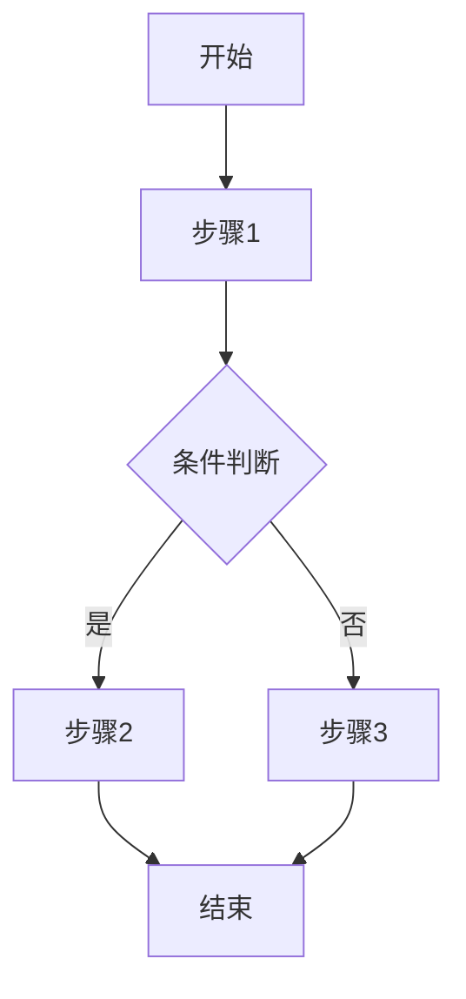
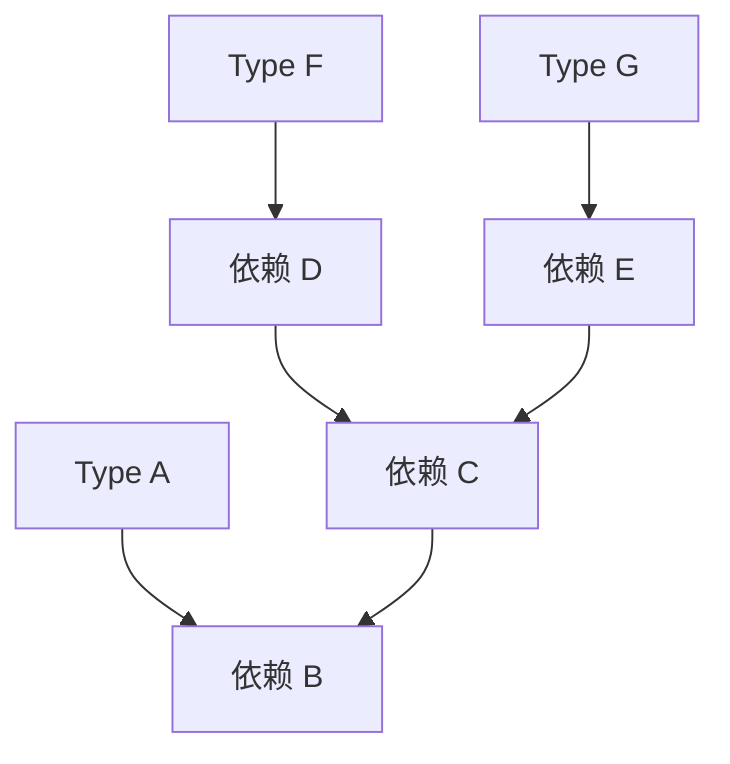
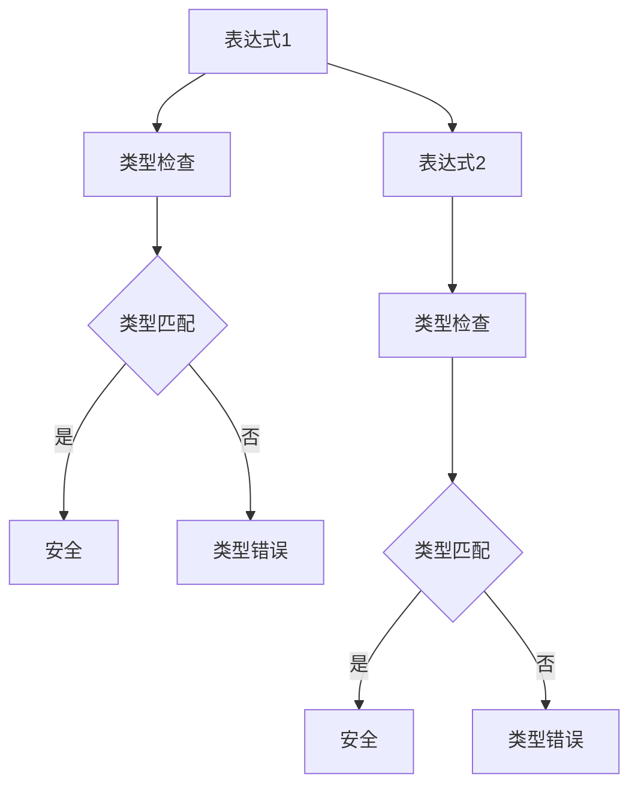

                 

### 类型论的表达能力限制：数学实践中的挑战

#### 关键词：类型论、表达能力、数学实践、挑战

类型论作为数学和计算机科学中一个重要的理论基础，它关注的是数据类型及其组合规则。类型论不仅为数学提供了一种形式化的表达方式，而且在编程语言设计和形式化验证中扮演了关键角色。然而，类型论的表达能力并非无穷无尽，其限制在数学实践中也带来了诸多挑战。

本文将围绕类型论的表达能力限制，探讨其在数学实践中的挑战。我们将首先介绍类型论的基础概念，随后深入分析其在数学分析、代数学以及逻辑与计算机科学中的应用。通过具体案例分析，我们将揭示类型论在证明和计算中的复杂性问题，并讨论类型论对数学教育的潜在影响。

### 摘要

本文旨在探讨类型论在数学实践中的表达能力限制及其带来的挑战。通过分析类型论的基本概念和结构，我们揭示了其在数学分析、代数学和逻辑与计算机科学中的应用，并指出了类型论在证明和计算中的复杂性。最后，我们讨论了类型论在数学教育中的潜在影响，提出了未来研究方向的展望。

### 目录大纲

#### 第一部分：类型论基础

#### 第1章：类型论概述
- 1.1 类型论的发展历程
- 1.2 类型论的核心概念
- 1.3 类型论的基本原理
- 1.4 类型论在数学中的重要性

#### 第2章：类型论的基本结构
- 2.1 类型构造规则
- 2.2 类型公理
- 2.3 类型论的基本定理
- 2.4 类型论的应用

#### 第3章：类型论中的核心概念
- 3.1 类型等价与类型化
- 3.2 类型依赖与类型层次
- 3.3 模式匹配与类型检查
- 3.4 类型论中的类型安全

#### 第4章：类型论中的复杂性
- 4.1 表达能力限制
- 4.2 证明复杂性
- 4.3 计算复杂性
- 4.4 类型论的应用限制

#### 第二部分：类型论在数学中的应用

#### 第5章：类型论在数学分析中的应用
- 5.1 数学分析中的类型论基础
- 5.2 类型的连续性
- 5.3 函数类型
- 5.4 数学分析中的类型论挑战

#### 第6章：类型论在代数学中的应用
- 6.1 代数学中的类型论基础
- 6.2 群与环的类型论
- 6.3 字符串代数与组合代数
- 6.4 代数中的类型论难题

#### 第7章：类型论在逻辑与计算机科学中的应用
- 7.1 逻辑中的类型论
- 7.2 计算机科学中的类型论
- 7.3 类型论在程序设计语言中的应用
- 7.4 类型论与形式化验证

#### 第三部分：类型论中的数学实践挑战

#### 第8章：类型论中的证明难题
- 8.1 类型依赖与证明复杂性
- 8.2 类型论中的递归证明
- 8.3 类型论中的证明方法论
- 8.4 类型论中的证明难题案例分析

#### 第9章：类型论中的计算难题
- 9.1 类型论中的计算复杂性
- 9.2 计算模型与类型论
- 9.3 类型论中的算法设计
- 9.4 类型论中的计算难题案例分析

#### 第10章：类型论在数学教育中的应用
- 10.1 类型论与数学教育改革
- 10.2 类型论在教学中的实践
- 10.3 类型论与数学思维培养
- 10.4 类型论在数学教育中的挑战

### 附录

#### 附录A：类型论参考资料
- A.1 类型论经典著作
- A.2 类型论在线资源
- A.3 类型论相关期刊和会议
- A.4 类型论工具和软件

#### 附录B：类型论示例Mermaid流程图
- B.1 Mermaid基本语法
- B.2 类型构造流程图示例
- B.3 类型依赖流程图示例
- B.4 类型安全检查流程图示例

### 第1章：类型论概述

#### 1.1 类型论的发展历程

类型论（Type Theory）起源于20世纪30年代，是作为对直觉主义（Intuitionism）的一种数学哲学回应而诞生的。直觉主义由荷兰数学家L.E.J. Brouwer提出，强调数学构造的过程性。Brouwer认为，数学对象应该通过构造来得到，而不是通过证明其存在性。这种思想挑战了传统的逻辑和数学基础。

类型论的发展与形式化数学和编程语言的发展密切相关。20世纪30年代，为了解决数学基础危机，数学家开始尝试将数学理论形式化，以确保其逻辑一致性和无矛盾性。其中，类型论作为一种形式化的方法，得到了广泛关注。类型论的核心思想是通过对数据的类型进行分类，来保证程序的正确性和安全性。

在20世纪40年代和50年代，阿尔弗雷德·塔斯基（Alfred Tarski）和斯蒂芬·科尔·克莱尼（Stephen Cole Kleene）等数学家对类型论进行了系统研究，提出了多种类型论形式。这一时期，类型论主要关注逻辑和集合论的基础。

进入20世纪60年代，随着计算机科学的兴起，类型论开始在编程语言设计中发挥重要作用。Pierce（1965年）提出的简单类型论（Simple Type Theory）成为了后来许多编程语言的基础，如ML和Haskell。简单类型论通过使用类型构造规则和类型等价性，来确保程序的类型安全。

#### 1.2 类型论的核心概念

类型论的核心概念包括类型、类型构造规则、类型等价性、类型依赖等。以下是对这些核心概念的定义和解释。

**类型（Type）**：类型是数据的一个抽象分类。在类型论中，不同的类型代表不同的数据集合。例如，`int`类型表示整数集合，`bool`类型表示布尔值集合，`string`类型表示字符串集合。

**类型构造规则（Type Construction Rules）**：类型构造规则定义了如何创建新的类型。常见的类型构造规则包括标量类型（如`int`、`bool`）、集合类型（如`list`、`tuple`）、函数类型（如`func(int, bool): int`）等。

**类型等价性（Type Equivalence）**：类型等价性是指两个类型在语义上等价，即可以相互转换而不改变程序的行为。例如，`int`类型和`float`类型在许多情况下是等价的，因为它们都可以表示实数。

**类型依赖（Type Dependency）**：类型依赖是指一个类型的定义依赖于另一个类型的定义。类型依赖在函数类型和复合类型中非常常见。例如，`func(int, bool): int`类型的函数定义依赖于`int`和`bool`类型。

**类型层次（Type Hierarchy）**：类型层次是指不同类型之间的层次关系。在类型论中，类型通常被组织成一个层次结构，其中一些基本类型位于底层，而复合类型位于顶层。类型层次有助于确保类型之间的兼容性和安全性。

#### 1.3 类型论的基本原理

类型论的基本原理主要包括类型构造规则、类型公理和类型论的基本定理。

**类型构造规则**：类型构造规则定义了如何从基本类型构造出更复杂的类型。常见的类型构造规则包括：

- **标量类型构造规则**：定义了如何创建基本类型，如`int`、`bool`、`string`等。
- **集合类型构造规则**：定义了如何创建集合类型，如`list`、`tuple`等。
- **函数类型构造规则**：定义了如何创建函数类型，如`func(A, B): C`，其中`A`、`B`和`C`是类型。

**类型公理**：类型公理是类型论中的基本假设，用于证明类型的性质。常见的类型公理包括：

- **空类型公理**：定义了空类型`()`，表示没有元素的集合。
- **单位类型公理**：定义了单位类型`1`，表示唯一的元素集合。
- **复合类型公理**：定义了如何将多个类型组合成复合类型，如`list(int)`、`tuple(bool, int)`等。

**类型论的基本定理**：类型论的基本定理用于证明类型的性质，包括类型化定理、类型等价定理和类型安全定理。

- **类型化定理**：类型化定理证明了类型论中定义的类型是有效的，即类型构造规则和类型公理能够生成所有有效的类型。
- **类型等价定理**：类型等价定理证明了类型之间的等价性，即如果两个类型是等价的，则它们可以相互转换而不改变程序的行为。
- **类型安全定理**：类型安全定理证明了类型论中的类型检查是有效的，即类型检查能够确保程序在运行时不会发生类型错误。

#### 1.4 类型论在数学中的重要性

类型论在数学中具有重要性，主要体现在以下几个方面：

**形式化数学基础**：类型论为数学提供了一种形式化的表达方式，使得数学理论更加严谨和一致。通过类型论，数学家可以更加精确地定义数学对象和运算规则，从而避免逻辑错误和矛盾。

**证明复杂性分析**：类型论有助于分析数学证明的复杂性。类型论中的类型检查和证明过程可以被形式化，从而使得数学证明的复杂性分析成为可能。这对于研究数学问题的最优解决方案具有重要意义。

**计算模型设计**：类型论为计算模型设计提供了理论基础。通过类型论，计算机科学家可以设计出更加安全和高效的计算模型。例如，函数式编程语言中的类型系统就是基于类型论的。

**数学教育改革**：类型论在数学教育中也有重要应用。通过引入类型论的概念和方法，数学教育可以更加系统化和结构化，有助于学生更好地理解和掌握数学知识。

#### 1.5 类型论在现代数学中的应用

类型论不仅在理论数学中有着重要地位，而且在现代数学的多个领域中也得到了广泛应用。以下是一些典型应用：

**数学分析**：类型论在数学分析中提供了形式化的方法来处理连续性和函数类型。通过类型论，数学家可以更严格地定义和分析实数、复数等数学结构，从而加深对数学分析理论的理解。

**代数学**：类型论在代数学中用于研究抽象代数结构，如群、环、域等。通过类型论，代数学家可以形式化地定义和证明代数结构的性质，从而推动代数学的发展。

**逻辑**：类型论在逻辑中用于构建形式化的逻辑系统，如命题逻辑、谓词逻辑等。通过类型论，逻辑学家可以验证逻辑推理的正确性，从而提高逻辑推理的可靠性。

**计算机科学**：类型论在计算机科学中用于设计和分析程序设计语言，如Haskell、Agda等。通过类型论，计算机科学家可以确保程序的安全性，减少运行时错误。

**数学教育**：类型论在数学教育中用于改进数学教学方法和课程设计。通过类型论，数学教育工作者可以更加有效地传授数学概念和理论，提高学生的学习效果。

#### 1.6 类型论中的核心概念：类型等价、类型层次与类型安全

类型论中的核心概念包括类型等价、类型层次和类型安全。这些概念不仅定义了类型论的基础，而且在实际应用中起到了关键作用。

**类型等价（Type Equivalence）**：

类型等价是指两个类型在语义上等价，即它们可以相互转换而不改变程序的行为。在类型论中，类型等价性是类型检查和类型转换的基础。

- **等价性定义**：给定两个类型\(A\)和\(B\)，如果存在一个有效的类型转换函数\(f\)，使得对于所有值\(x\)，都有\(f(A(x)) = B(f(x))\)，则称\(A\)和\(B\)类型等价。

- **等价性示例**：在Haskell中，`Int`类型和`Float`类型在许多情况下是等价的，因为它们都可以表示实数。因此，我们可以将`Int`类型的值隐式转换为`Float`类型，反之亦然。

**类型层次（Type Hierarchy）**：

类型层次是指不同类型之间的层次关系。类型层次有助于确保类型之间的兼容性和安全性。

- **层次结构**：在类型论中，类型通常被组织成一个层次结构。基本类型位于底层，而复合类型位于顶层。例如，`Int`、`Bool`等是基本类型，而`List(Int)`、`Func(Int, Bool): Int`等是复合类型。

- **类型兼容性**：类型层次确保了类型的兼容性。例如，如果一个函数的输入类型是`Int`，那么它的输出类型不能是`String`，因为它们在类型层次中不相容。

**类型安全（Type Safety）**：

类型安全是指类型系统能够确保程序在运行时不会发生类型错误。类型安全是编程语言设计中的一个重要目标。

- **类型检查**：类型系统在编译或解释程序时进行类型检查，以确保程序的类型正确性。类型检查可以通过静态分析来完成，也可以通过动态检查来完成。

- **类型错误**：类型错误是指程序中发生的类型不匹配的错误。例如，尝试将一个整数与一个字符串相加会导致类型错误。

- **类型安全示例**：在Java中，我们不能将一个整数强制转换为字符串，因为它们的类型不兼容。这种类型安全机制有助于防止运行时错误。

通过理解类型等价、类型层次和类型安全，我们可以更好地设计类型系统，确保程序的可靠性和安全性。

### 第2章：类型论的基本结构

类型论的基本结构是其理论基础的重要组成部分，它定义了类型的构造规则、类型公理以及类型论中的基本定理。通过这些结构，类型论能够提供一种形式化且严谨的方式来处理数学和编程中的数据类型。

#### 2.1 类型构造规则

类型构造规则是类型论中用于创建新类型的基本方法。这些规则定义了如何从基本类型和已有类型组合生成新的复杂类型。

**基本类型构造规则**：

- **标量类型**：标量类型是最基本的类型，包括数字、布尔值和字符串等。这些类型表示原始数据值。

- **函数类型**：函数类型表示一组函数，这些函数接受特定类型的参数并返回特定类型的值。其形式为`func(A, B): C`，其中`A`、`B`和`C`是类型。

- **集合类型**：集合类型表示一组元素的集合，如列表（`List(A)`）、元组（`Tuple(A, B)`）和字典（`Dict(A, B)`）等。

**复合类型构造规则**：

- **结构体类型**：结构体类型（或称为记录类型）用于定义复合数据结构，其中包含多个字段，每个字段有特定的类型。

- **联合类型**：联合类型（或称为枚举类型）表示一组可能的值，每个值都有特定的类型。它通过`Union(A, B)`等操作构造。

**类型组合规则**：

- **类型构造**：通过组合基本类型和复合类型，我们可以构造出更复杂的类型。例如，`List(Func(Int, Int): Int)`表示一个函数列表，其中每个函数接受两个整数参数并返回一个整数。

#### 2.2 类型公理

类型公理是类型论中的基本假设，它们用于证明类型的性质。这些公理确保类型系统的逻辑一致性和完整性。

- **空类型公理**：定义空类型`()`，表示没有元素的集合。

- **单位类型公理**：定义单位类型`1`，表示只有一个元素的集合。

- **存在类型公理**：定义存在类型`Exists(A)`，表示存在一个类型`A`。

- **函数类型公理**：定义函数类型`func(A, B): C`，其中`A`、`B`和`C`是类型。

- **集合类型公理**：定义集合类型`Set(A)`，表示所有类型`A`的集合。

这些公理为类型论提供了逻辑基础，使得类型构造和类型转换成为可能。

#### 2.3 类型论的基本定理

类型论的基本定理是用于证明类型性质的重要结论。这些定理不仅确保了类型系统的正确性，还为实际应用提供了理论基础。

- **类型化定理**：类型化定理证明了类型论中定义的类型是有效的，即类型构造规则和类型公理能够生成所有有效的类型。

- **类型等价定理**：类型等价定理证明了类型之间的等价性，即如果两个类型是等价的，则它们可以相互转换而不改变程序的行为。

- **类型安全定理**：类型安全定理证明了类型论中的类型检查是有效的，即类型检查能够确保程序在运行时不会发生类型错误。

- **类型存在定理**：类型存在定理证明了对于任何有效的类型构造，都存在一个与之等价的具体类型。

这些基本定理确保了类型论在数学和编程中的可靠性和实用性。

#### 2.4 类型论的应用

类型论在数学和计算机科学中有着广泛的应用。以下是一些典型的应用场景：

**数学分析**：

在数学分析中，类型论提供了形式化的方法来处理实数、复数等数学结构。通过类型论，数学家可以严格定义实数的连续性和函数的连续性，从而加深对数学分析理论的理解。

**代数学**：

类型论在代数学中用于研究抽象代数结构，如群、环、域等。通过类型论，代数学家可以形式化地定义和证明代数结构的性质，从而推动代数学的发展。

**编程语言**：

类型论在编程语言设计中起着关键作用。通过类型论，编程语言设计师可以构建出安全、高效的类型系统，确保程序的正确性和可靠性。例如，Haskell和Agda等函数式编程语言就是基于类型论构建的。

**形式化验证**：

类型论在形式化验证中用于证明程序的属性和安全性。通过类型检查和类型推理，形式化验证工具可以确保程序在运行时不会出现安全漏洞和逻辑错误。

#### 2.5 类型依赖与类型层次

类型依赖和类型层次是类型论中的核心概念，它们对于理解类型系统的复杂性和设计高效的语言至关重要。

**类型依赖（Type Dependency）**：

类型依赖是指一个类型的定义依赖于另一个类型的定义。在函数类型和复合类型中，类型依赖尤为常见。例如，在函数类型`func(A, B): C`中，`A`和`B`是函数的参数类型，`C`是返回类型。这意味着函数类型的定义依赖于参数类型的定义。

类型依赖使得类型系统更加灵活，但也增加了复杂性。为了管理类型依赖，类型系统通常引入类型变量和类型构造函数，以便在类型定义中引用其他类型。

**类型层次（Type Hierarchy）**：

类型层次是指不同类型之间的层次关系。类型层次有助于确保类型之间的兼容性和安全性。在类型层次中，一些基本类型位于底层，而复合类型位于顶层。

类型层次可以通过类型构造规则和类型等价性来构建。例如，在Haskell中，`Int`和`Float`是基本类型，它们位于类型层次的不同层次。复合类型如`List(Int)`和`Tuple(Bool, Int)`则位于更高层次。

类型层次的管理对于实现类型安全和类型检查至关重要。类型系统必须确保在类型层次中的类型兼容性，即较低层次类型可以向上转换为较高层次类型，但反之则不行。

**类型依赖与类型层次的关系**：

类型依赖和类型层次是相互关联的。类型依赖定义了类型之间的关系，而类型层次则提供了对这些关系的结构化组织。

类型依赖使得类型层次更加复杂，因为一个类型的定义可能依赖于其他多个类型的定义。类型系统必须有效地管理这些依赖，以避免类型错误和类型冲突。

另一方面，类型层次为类型依赖提供了一个清晰的框架。通过定义类型层次，类型系统可以更好地组织和管理类型依赖，从而提高类型检查的效率和程序的可理解性。

通过理解类型依赖和类型层次，我们可以设计出更加灵活、安全和高效的类型系统，为数学和编程提供坚实的理论基础。

### 第3章：类型论中的核心概念

类型论作为数学和计算机科学中的一个重要理论基础，其核心概念对于理解类型系统的本质至关重要。本章将深入探讨类型论中的几个关键概念：类型等价、类型依赖、模式匹配与类型检查，以及类型安全。

#### 3.1 类型等价与类型化

**类型等价（Type Equivalence）**：

类型等价是指两个类型在语义上等价，即它们可以相互转换而不改变程序的行为。在类型论中，类型等价性是类型检查和类型转换的基础。

- **等价性定义**：给定两个类型\(A\)和\(B\)，如果存在一个有效的类型转换函数\(f\)，使得对于所有值\(x\)，都有\(f(A(x)) = B(f(x))\)，则称\(A\)和\(B\)类型等价。

- **等价性示例**：在Haskell中，`Int`类型和`Float`类型在许多情况下是等价的，因为它们都可以表示实数。因此，我们可以将`Int`类型的值隐式转换为`Float`类型，反之亦然。

**类型化（Typing）**：

类型化是指为程序中的每个表达式分配一个类型的过程。类型化的目标是确保程序的语义一致性，即程序在运行时不会发生类型错误。

- **类型化规则**：类型化规则定义了如何为表达式分配类型。常见的类型化规则包括：

  - 标量类型的类型化：基本类型如`Int`、`Bool`和`String`可以直接类型化为自身。
  - 函数类型的类型化：函数类型的类型化取决于其参数类型和返回类型。
  - 集合类型的类型化：集合类型的类型化取决于其元素类型。

#### 3.2 类型依赖与类型层次

**类型依赖（Type Dependency）**：

类型依赖是指一个类型的定义依赖于另一个类型的定义。在函数类型和复合类型中，类型依赖尤为常见。例如，在函数类型`func(A, B): C`中，`A`和`B`是函数的参数类型，`C`是返回类型。这意味着函数类型的定义依赖于参数类型的定义。

类型依赖使得类型系统更加灵活，但也增加了复杂性。为了管理类型依赖，类型系统通常引入类型变量和类型构造函数，以便在类型定义中引用其他类型。

- **类型变量**：类型变量用于表示未确定类型的变量，通常用字母表示，如`A`、`B`等。类型变量可以出现在类型构造规则中，以便在类型定义中引用其他类型。
- **类型构造函数**：类型构造函数用于创建新的类型，如`List`、`Tuple`和`Dict`等。类型构造函数可以接受类型参数，从而实现类型的组合。

**类型层次（Type Hierarchy）**：

类型层次是指不同类型之间的层次关系。类型层次有助于确保类型之间的兼容性和安全性。在类型层次中，一些基本类型位于底层，而复合类型位于顶层。

类型层次可以通过类型构造规则和类型等价性来构建。例如，在Haskell中，`Int`和`Float`是基本类型，它们位于类型层次的不同层次。复合类型如`List(Int)`和`Tuple(Bool, Int)`则位于更高层次。

类型层次的管理对于实现类型安全和类型检查至关重要。类型系统必须确保在类型层次中的类型兼容性，即较低层次类型可以向上转换为较高层次类型，但反之则不行。

#### 3.3 模式匹配与类型检查

**模式匹配（Pattern Matching）**：

模式匹配是一种在函数定义中检查值与给定模式是否匹配的机制。模式匹配可以用于分支操作，以便根据值的类型或值的内容执行不同的操作。

- **模式匹配规则**：模式匹配规则定义了如何匹配不同的值。常见的模式包括：

  - 标量值的模式：如`x`、`true`和`false`等。
  - 集合值的模式：如`[]`（空列表）、`[x]`（单个元素列表）和`[x, y]`（两个元素列表）等。
  - 结构体值的模式：如`{field1 = v1, field2 = v2}`等。

- **模式匹配示例**：在Haskell中，函数定义可以使用模式匹配来处理不同的输入值。例如：

  ```haskell
  f [] = 0
  f (x:xs) = x + (f xs)
  ```

**类型检查（Type Checking）**：

类型检查是一种在编译时检查程序类型一致性的机制。类型检查的目的是确保程序在运行时不会发生类型错误。

- **类型检查规则**：类型检查规则定义了如何检查表达式的类型。常见的类型检查规则包括：

  - 标量值的类型检查：基本类型的值可以直接类型化为自身。
  - 函数类型的类型检查：函数类型的类型检查取决于其参数类型和返回类型。
  - 集合类型的类型检查：集合类型的类型检查取决于其元素类型。

- **类型检查示例**：在Haskell中，类型检查器会在编译时检查程序中的表达式是否符合类型规则。例如：

  ```haskell
  let x = 5
  let y = true
  ```

在上面的代码中，`x`和`y`的类型分别是`Int`和`Bool`，类型检查器会在编译时检查这些类型的定义和用法是否一致。

#### 3.4 类型论中的类型安全

**类型安全（Type Safety）**：

类型安全是指类型系统能够确保程序在运行时不会发生类型错误。类型安全是编程语言设计中的一个重要目标。

- **类型检查**：类型检查是一种在编译时检查程序类型一致性的机制。类型检查的目的是确保程序在运行时不会发生类型错误。

- **类型错误**：类型错误是指程序中发生的类型不匹配的错误。例如，尝试将一个整数与一个字符串相加会导致类型错误。

- **类型安全示例**：在Java中，我们不能将一个整数强制转换为字符串，因为它们的类型不兼容。这种类型安全机制有助于防止运行时错误。

通过理解类型等价、类型依赖、模式匹配与类型检查，以及类型安全，我们可以更好地设计类型系统，确保程序的可靠性和安全性。类型论的核心概念不仅在理论研究中具有重要地位，而且在实际编程中也发挥着关键作用。

### 第4章：类型论中的复杂性

类型论作为一种形式化的方法，虽然在数学和编程中具有广泛的应用，但其表达能力和计算复杂性也带来了一定的限制。在本章中，我们将探讨类型论中的复杂性，包括其表达能力限制、证明复杂性和计算复杂性，以及这些限制在实际应用中的影响。

#### 4.1 表达能力限制

类型论的表达能力限制主要体现在其形式化方法上。虽然类型论提供了一种严格的类型系统，可以确保程序的正确性和安全性，但其表达能力并非无穷尽。

**类型构造的复杂性**：

类型构造规则定义了如何创建新的类型，如基本类型、函数类型和集合类型。然而，复杂的类型构造可能导致类型系统的复杂性增加。例如，递归定义的类型可能难以理解和验证。此外，过多的类型构造可能导致类型系统的爆炸性增长，使得类型检查和推理变得困难。

**类型依赖的限制**：

类型依赖是指一个类型的定义依赖于另一个类型的定义。虽然类型依赖提供了灵活性，但也引入了复杂性。在处理类型依赖时，类型系统必须确保类型之间的兼容性和一致性。这可能导致类型检查变得更加复杂，特别是在处理大型程序时。

**抽象类型的限制**：

抽象类型是一种将复杂类型隐藏在简单接口背后的机制。尽管抽象类型有助于提高程序的可读性和可维护性，但它们也可能限制类型论的表达能力。例如，某些高级特性，如协变和逆变，可能难以在抽象类型中实现，这限制了类型系统对某些复杂程序结构的支持。

**实例化限制**：

类型论中的类型参数化允许创建泛型类型。然而，实例化这些泛型类型时，可能存在限制。例如，类型论中的类型变量可能无法直接实例化为具体类型，这可能导致类型检查失败。

**表达能力的实例**：

以Haskell为例，虽然其类型系统支持函数类型和集合类型，但对于某些复杂的数据结构和操作，类型系统可能难以直接表达。例如，处理动态类型或非确定性行为时，类型系统可能无法提供足够的支持。

#### 4.2 证明复杂性

类型论中的证明复杂性是指类型检查和证明过程中所需的计算资源。证明复杂性是类型论应用于形式化验证和逻辑推理中的重要问题。

**类型检查的复杂性**：

类型检查是确保程序类型一致性的关键步骤。在类型论中，类型检查通常涉及类型推理和约束求解。类型检查的复杂性取决于程序的规模和类型系统的复杂性。例如，在处理大型程序时，类型检查可能需要大量的计算资源。

**证明复杂性**：

类型论在形式化验证中用于证明程序的属性和安全性。证明复杂性是指证明过程中所需的计算资源。在某些情况下，类型论的证明过程可能非常复杂，特别是在处理递归定义和复杂类型依赖时。例如，使用Coq进行形式化验证时，证明复杂性可能非常高。

**证明复杂性的实例**：

以Coq为例，虽然其类型系统和证明工具非常强大，但处理某些复杂证明时，证明过程可能非常耗时。例如，证明某些数学定理的复杂性可能非常高，这限制了类型论在数学证明中的应用。

#### 4.3 计算复杂性

类型论中的计算复杂性是指类型系统在实际应用中的计算资源需求。计算复杂性是类型论在编程语言设计和编译器优化中的重要问题。

**类型检查的复杂性**：

类型检查是编译器或解释器中的关键步骤。类型检查的复杂性取决于类型系统的设计和程序的规模。例如，在处理大型程序时，类型检查可能需要大量的计算资源。

**类型推理的复杂性**：

类型推理是从程序中推断类型的过程。类型推理的复杂性取决于类型系统的设计和程序的复杂性。在某些类型系统中，类型推理可能非常复杂，特别是在处理递归定义和复杂类型依赖时。

**编译器优化的复杂性**：

类型论在编译器优化中用于提高程序的执行效率。然而，编译器优化也可能增加计算复杂性。例如，优化策略可能涉及复杂的类型检查和类型转换，这可能导致优化过程变得更加耗时。

**计算复杂性的实例**：

以Haskell为例，虽然其类型系统提供了强大的类型推理和类型检查能力，但处理大型程序时，类型检查和编译器优化可能需要大量的计算资源。这可能导致编译时间较长，特别是在优化过程中。

#### 4.4 类型论的应用限制

类型论在实际应用中面临一些限制，这些限制可能影响其效率和实用性。

**性能限制**：

类型论中的严格类型检查和复杂的证明过程可能导致性能下降。特别是在处理大型程序时，类型检查和验证过程可能非常耗时，这限制了类型论在一些实时或高性能应用中的使用。

**开发成本**：

类型论的应用可能需要较高的开发成本。类型系统的设计和实现、形式化验证工具的开发和维护等都需要大量的资源和专业知识。这可能导致类型论在小型项目或快速开发环境中不实用。

**可读性限制**：

类型论的表达方式可能对程序的可读性产生一定影响。复杂的类型构造和类型依赖可能导致程序代码变得难以理解和维护。这限制了类型论在一些对代码可读性和可维护性有较高要求的应用场景中的使用。

**实例限制**：

类型论在一些特定领域可能存在局限性。例如，在处理动态类型或非确定性行为时，类型论可能难以提供足够的支持。这限制了类型论在一些特定应用场景中的使用。

总之，类型论虽然具有广泛的应用前景，但其表达能力和计算复杂性也带来了一定的限制。理解这些限制对于设计高效、实用的类型系统具有重要意义。

#### 第5章：类型论在数学分析中的应用

类型论在数学分析中的应用主要体现在其形式化的方法和严格的类型系统，这有助于我们更精确地定义和分析数学概念。在本章中，我们将探讨类型论在数学分析中的基础、类型的连续性、函数类型以及类型论在数学分析中的挑战。

##### 5.1 数学分析中的类型论基础

数学分析是一个高度抽象的领域，涉及到实数、极限、连续性和导数等概念。类型论为这些概念提供了形式化的定义和严格的推理方法。以下是一些关键的数学分析类型论基础：

**实数的类型论定义**：

在类型论中，实数可以通过构造函数或递归定义来表示。例如，在直觉类型论（Intuitionistic Type Theory）中，实数可以定义为一个递归数据类型，其中每个实数都是通过累加或递减操作构造的。

$$\text{real} = \lambda x: \text{nat} . \text{real} \mid \text{zero} \mid s(x)$$

其中，`nat`表示自然数类型，`zero`表示零，`s`表示累加操作。

**极限的类型论定义**：

极限是数学分析中的核心概念之一。在类型论中，极限可以通过构造函数或递归定义来表示。例如，在直觉类型论中，极限可以定义为一个递归函数，它接受一个实数序列和一个实数，并返回该序列的极限。

$$\text{limit} = \lambda f: \text{real} \rightarrow \text{real} . \lambda x: \text{real} . \text{lim} (f, x)$$

其中，`lim`是一个递归函数，用于计算极限。

**连续性的类型论定义**：

连续性是函数的一个重要性质。在类型论中，连续性可以通过类型构造来定义。例如，在直觉类型论中，一个函数`f: A \rightarrow B`是连续的，当且仅当对于所有实数`x`和实数序列`y`，如果`y`收敛于`x`，则`f(y)`也收敛于`f(x)`。

$$\text{continuous} = \lambda f: \text{real} \rightarrow \text{real} . \forall x: \text{real}, \forall y: \text{real} . (\text{lim} (y, x) = x \rightarrow \text{lim} (f(y), f(x)) = f(x))$$

**导数的类型论定义**：

导数是函数变化率的一个重要度量。在类型论中，导数可以通过构造函数或递归定义来表示。例如，在直觉类型论中，导数可以定义为一个递归函数，它接受一个实数序列和一个实数，并返回该序列的导数。

$$\text{derivative} = \lambda f: \text{real} \rightarrow \text{real} . \lambda y: \text{real} . \text{diff} (f, y)$$

其中，`diff`是一个递归函数，用于计算导数。

##### 5.2 类型的连续性

在数学分析中，连续性是一个核心概念。类型论通过其严格的类型系统，可以更好地定义和验证连续性。以下是一些关键点：

**连续函数的类型**：

在类型论中，连续函数可以通过类型构造来定义。一个函数`f: A \rightarrow B`是连续的，当且仅当对于所有实数`x`和实数序列`y`，如果`y`收敛于`x`，则`f(y)`也收敛于`f(x)`。

$$\text{continuous} = \lambda f: \text{real} \rightarrow \text{real} . \forall x: \text{real}, \forall y: \text{real} . (\text{lim} (y, x) = x \rightarrow \text{lim} (f(y), f(x)) = f(x))$$

**连续函数的性质**：

类型论可以证明连续函数的一些重要性质。例如，连续函数是可导的，即对于每个点`x`，存在一个连续函数`f'(x)`，表示`f`在`x`点的导数。

$$\text{differentiable} = \lambda f: \text{real} \rightarrow \text{real} . \exists g: \text{real} \rightarrow \text{real} . (\text{continuous} (g) \land \forall x: \text{real} . (\text{lim} (\text{diff} (f, x), \text{diff} (g, x)) = 0))$$

**连续函数的应用**：

类型论可以应用于证明和分析连续函数的实际应用。例如，在物理学中，连续函数用于描述物体的运动和变化。在经济学中，连续函数用于分析市场行为和供需关系。

##### 5.3 函数类型

在数学分析中，函数是一个核心概念。类型论通过其形式化的方法，可以更好地定义和操作函数类型。以下是一些关键点：

**函数类型的定义**：

在类型论中，函数类型可以通过类型构造来定义。一个函数类型`A \rightarrow B`表示从类型`A`到类型`B`的映射。

$$\text{func} = \lambda A: \text{type} , B: \text{type} . \lambda f: A \rightarrow B . f$$

**函数类型的性质**：

类型论可以证明函数类型的一些重要性质。例如，函数类型是可组合的，即可以通过函数类型构造出新的函数类型。

$$\text{compose} = \lambda f: A \rightarrow B , g: B \rightarrow C . \lambda x: A . g(f(x))$$

**函数类型的应用**：

类型论可以应用于定义和分析复杂的数学函数。例如，在数学分析中，函数类型用于定义积分和微分函数。在计算机科学中，函数类型用于构建高阶函数和递归函数。

##### 5.4 数学分析中的类型论挑战

尽管类型论在数学分析中具有广泛的应用，但也存在一些挑战：

**证明复杂性**：

类型论的证明过程可能非常复杂，特别是在处理递归定义和复杂类型依赖时。例如，证明一个函数是连续的或可导的，可能需要大量的计算资源和时间。

**计算复杂性**：

类型检查和证明过程可能涉及大量的计算，这可能导致性能下降。例如，在处理大型数学分析问题时，类型检查和验证过程可能非常耗时。

**抽象性限制**：

类型论可能难以表达某些抽象概念，如非确定性行为和动态类型。这限制了类型论在某些数学分析应用场景中的使用。

总之，类型论在数学分析中的应用为数学提供了一种形式化和严格的方法。然而，其表达能力和计算复杂性也带来了一定的挑战。通过不断改进类型系统和证明方法，我们可以更好地利用类型论在数学分析中的潜力。

### 第6章：类型论在代数学中的应用

类型论在代数学中的应用是数学与计算机科学交叉领域的一个重要研究方向。类型论为代数结构提供了形式化的定义和严格推理的工具，使得代数运算和证明过程更加精确和可靠。本章将探讨类型论在代数学中的应用，包括群与环的类型论基础、字符串代数与组合代数以及类型论在代数中的挑战。

#### 6.1 代数学中的类型论基础

代数学是研究代数结构及其性质的数学分支，包括群、环、域等。类型论通过提供形式化的方法，为这些代数结构提供了精确的定义和操作规则。

**群与环的类型论基础**：

- **群（Group）**：群是代数结构的基本概念之一。在类型论中，群可以形式化为一个类型构造，其中包含群的运算和单位元。一个群\(G\)可以定义为一个二元组\((G, \cdot)\)，其中\(G\)是一个类型，\(\cdot\)是群运算。

  $$\text{group} = \lambda G: \text{type}, \cdot: G \times G \rightarrow G . (\forall a: G, b: G . a \cdot b \in G) \land (\exists e: G . \forall a: G . e \cdot a = a = a \cdot e)$$

- **环（Ring）**：环是包含加法和乘法运算的代数结构。在类型论中，环可以形式化为一个类型构造，其中包含环的运算和单位元。一个环\(R\)可以定义为一个四元组\((R, +, \times, 0, 1)\)，其中\(R\)是类型，\(+\)和\(\times\)分别是加法和乘法运算，\(0\)和\(1\)分别是加法和乘法的单位元。

  $$\text{ring} = \lambda R: \text{type}, +: R \times R \rightarrow R, \times: R \times R \rightarrow R, 0: R, 1: R . (\forall a: R, b: R . a + b \in R) \land (\forall a: R, b: R . a \times b \in R) \land (\forall a: R . a + 0 = a = 0 + a) \land (\forall a: R . a \times 1 = a = 1 \times a)$$

**域的类型论基础**：

- **域（Field）**：域是更高级的代数结构，除了包含加法和乘法运算外，还要求乘法运算具有可逆性。在类型论中，域可以形式化为一个类型构造，其中包含域的运算和单位元。一个域\(F\)可以定义为一个六元组\((F, +, \times, 0, 1, -)\)，其中\(F\)是类型，\(+\)和\(\times\)分别是加法和乘法运算，\(0\)和\(1\)分别是加法和乘法的单位元，\(-\)是加法的逆运算。

  $$\text{field} = \lambda F: \text{type}, +: F \times F \rightarrow F, \times: F \times F \rightarrow F, 0: F, 1: F, -: F \rightarrow F . (\forall a: F, b: F . a + b \in F) \land (\forall a: F, b: F . a \times b \in F) \land (\forall a: F . a + 0 = a = 0 + a) \land (\forall a: F . a \times 1 = a = 1 \times a) \land (\forall a: F . \exists b: F . a \times b = 1)$$

**类型论中的证明**：

类型论不仅提供了代数结构的定义，还提供了一种形式化的证明方法。通过类型论，我们可以证明代数结构满足特定性质，如群的交换律、环的分配律等。

$$\text{commutative group} = \lambda G: \text{type}, \cdot: G \times G \rightarrow G . (\forall a: G, b: G . a \cdot b = b \cdot a)$$

$$\text{distributive ring} = \lambda R: \text{type}, +: R \times R \rightarrow R, \times: R \times R \rightarrow R . (\forall a: R, b: R, c: R . a \times (b + c) = (a \times b) + (a \times c))$$

#### 6.2 群与环的类型论

在类型论中，群和环的概念可以通过类型构造和类型等价性来表示。以下是一些关键概念：

**群的类型论表示**：

在类型论中，群可以表示为一个具有特定类型构造和运算规则的数据类型。例如，在Haskell中，我们可以定义一个群类型如下：

```haskell
data Group a where
  GroupElement :: a -> Group a
  GroupOperation :: a -> a -> Group a
```

这里，`GroupElement`表示群的元素，`GroupOperation`表示群运算。

**环的类型论表示**：

在类型论中，环可以表示为一个具有特定类型构造和运算规则的数据类型。例如，在Haskell中，我们可以定义一个环类型如下：

```haskell
data Ring a where
  RingElement :: a -> Ring a
  RingAddition :: a -> a -> Ring a
  RingMultiplication :: a -> a -> Ring a
  RingIdentity :: a
```

这里，`RingElement`表示环的元素，`RingAddition`和`RingMultiplication`分别表示加法和乘法运算，`RingIdentity`表示加法和乘法的单位元。

**群和环的等价性**：

在类型论中，群和环可以通过类型等价性来表示。例如，我们可以定义一个等价性函数，将群转换为环：

```haskell
groupToRing :: Group a -> Ring a
groupToRing (GroupElement x) = RingElement x
groupToRing (GroupOperation a b) = RingAddition a b
```

通过这种方式，我们可以将群和环的概念统一起来，从而简化类型论中的证明和推理过程。

#### 6.3 字符串代数与组合代数

字符串代数和组合代数是代数学中的两个重要分支。类型论在这两个领域中的应用使得我们能够更精确地定义和操作代数结构。

**字符串代数**：

字符串代数是研究字符串及其运算的代数结构。在类型论中，字符串可以表示为一个递归数据类型，其中每个字符串都是通过空字符串、拼接和映射操作构造的。以下是一个简单的字符串代数类型论表示：

```mermaid
graph TB
A1[emptyString] --> B1[Nil]
A2[Cons] --> B2[Cons(x, Nil)]
B2 --> C2[(x: String) -> String]
```

这里，`emptyString`表示空字符串，`Cons`表示字符串的拼接操作，`Cons(x, Nil)`表示将字符串`x`添加到空字符串`Nil`的末尾。

**组合代数**：

组合代数是研究组合结构及其运算的代数结构。在类型论中，组合代数可以通过类型构造和类型等价性来表示。以下是一个简单的组合代数类型论表示：

```mermaid
graph TB
A1[emptyComb] --> B1[Nil]
A2[Comb] --> B2[Comb(c, Nil)]
B2 --> C2[(c: Component) -> Combination]
```

这里，`emptyComb`表示空组合，`Comb`表示组合的构造操作，`Comb(c, Nil)`表示将组合元素`c`添加到空组合`Nil`的末尾。

#### 6.4 代数中的类型论难题

尽管类型论在代数学中具有广泛的应用，但也存在一些难题和挑战：

**类型依赖问题**：

类型依赖是类型论中的一个关键概念，但在代数结构中，类型依赖可能导致复杂性和不一致性。例如，在处理群和环的组合时，类型依赖可能导致难以管理的类型约束。

**证明复杂性**：

类型论的证明过程可能非常复杂，特别是在处理递归定义和复杂类型依赖时。例如，证明一个代数结构满足特定性质（如交换律、分配律等）可能需要大量的计算资源和时间。

**计算复杂性**：

类型检查和证明过程可能涉及大量的计算，这可能导致性能下降。例如，在处理大型代数结构时，类型检查和验证过程可能非常耗时。

**抽象性限制**：

类型论可能难以表达某些抽象概念，如非确定性行为和动态类型。这限制了类型论在某些代数应用场景中的使用。

总之，类型论在代数学中的应用为代数结构提供了形式化和严格的方法。然而，其表达能力和计算复杂性也带来了一定的挑战。通过不断改进类型系统和证明方法，我们可以更好地利用类型论在代数学中的潜力。

### 第7章：类型论在逻辑与计算机科学中的应用

类型论不仅在数学领域中发挥着重要作用，在逻辑与计算机科学中也有着广泛的应用。类型论在逻辑中的应用主要体现在形式逻辑和模态逻辑的构建中，而在计算机科学中，类型论被用于程序设计语言的设计和形式化验证。

#### 7.1 逻辑中的类型论

逻辑是研究推理和证明的数学工具，类型论为逻辑提供了一种形式化的方法，使得逻辑推理更加严谨和可靠。

**形式逻辑**：

形式逻辑是研究命题逻辑和谓词逻辑的数学分支。在类型论中，形式逻辑可以通过类型构造来表示。例如，命题逻辑中的命题可以通过布尔类型表示，谓词逻辑中的谓词可以通过函数类型表示。

- **命题逻辑的类型论表示**：

  命题逻辑中的命题可以通过布尔类型`bool`表示。例如，命题`P`和`Q`可以表示为`True`和`False`。

  $$P = \text{True}, \quad Q = \text{False}$$

- **谓词逻辑的类型论表示**：

  谓词逻辑中的谓词可以通过函数类型表示。例如，谓词`P(x)`可以表示为从实数类型`real`到布尔类型`bool`的函数。

  $$P: \text{real} \rightarrow \text{bool}$$

**模态逻辑**：

模态逻辑是研究模态词（如“可能”和“必须”）的逻辑系统。在类型论中，模态逻辑可以通过类型构造和类型等价性来表示。例如，模态词“可能”可以通过类型等价性表示，即两个类型之间的转换。

- **模态逻辑的类型论表示**：

  在模态逻辑中，模态词“可能”可以通过类型等价性表示。例如，类型`A`和`B`之间的等价性可以表示为`A = B`。

  $$\text{Possible}(A) = A = B$$

通过类型论，逻辑学家可以构建形式化的逻辑系统，并利用类型等价性来证明逻辑推理的正确性。

**类型论在逻辑证明中的应用**：

类型论在逻辑证明中用于构建形式化的证明系统。例如，使用类型论，逻辑学家可以构建证明论中的自然证明系统，并通过类型检查来验证证明的正确性。

#### 7.2 计算机科学中的类型论

类型论在计算机科学中有着广泛的应用，尤其是在程序设计语言的设计和形式化验证中。

**程序设计语言**：

类型论为程序设计语言提供了形式化的类型系统，确保程序的正确性和安全性。例如，Haskell和Agda等函数式编程语言就是基于类型论构建的。

- **Haskell**：Haskell是一种纯函数式编程语言，其类型系统基于类型论。Haskell的类型系统包括函数类型、集合类型和递归类型等。

- **Agda**：Agda是一种依赖类型编程语言，其类型系统是基于直觉类型论的。Agda支持高阶函数、依赖类型和不可判定性等特性。

**类型检查**：

类型论在程序设计语言中用于实现类型检查。类型检查的目的是确保程序在运行时不会发生类型错误。类型系统通过类型检查来验证程序中的表达式是否具有正确的类型。

- **静态类型检查**：静态类型检查是在编译时进行的类型检查。静态类型系统可以及早发现类型错误，从而提高程序的正确性和可维护性。

- **动态类型检查**：动态类型检查是在运行时进行的类型检查。动态类型系统可以在运行时发现类型错误，但可能导致性能下降。

**形式化验证**：

类型论在形式化验证中用于验证程序的正确性和安全性。形式化验证通过形式化的证明方法来证明程序满足特定属性。类型论提供了形式化的类型系统和证明工具，使得形式化验证更加严谨和可靠。

- **Coq**：Coq是一种交互式定理证明器，其基于类型论。Coq支持依赖类型和高阶函数，可以用于验证程序的正确性和安全性。

- **Isabelle**：Isabelle是一种基于类型论的定理证明环境，可以用于验证数学定理和程序的正确性。

**类型论在计算机科学中的实例**：

类型论在计算机科学中有着广泛的应用实例。例如，类型论在编程语言设计、编译器优化、形式化验证和软件工程中都有重要的应用。

- **编程语言设计**：类型论用于设计安全的编程语言，如Haskell和Agda。

- **编译器优化**：类型论用于实现高效的编译器优化，如类型推导和类型检查。

- **形式化验证**：类型论用于验证程序的正确性和安全性，如Coq和Isabelle。

- **软件工程**：类型论用于提高软件工程中的代码质量和可维护性。

总之，类型论在逻辑与计算机科学中具有广泛的应用。通过类型论，逻辑学家可以构建形式化的逻辑系统，计算机科学家可以设计安全的编程语言和实现形式化验证。类型论为逻辑与计算机科学提供了强大的理论基础和实用工具。

### 第8章：类型论中的证明难题

类型论在形式化验证和数学证明中扮演着重要角色，但其在证明过程中也面临着一些复杂性和挑战。本章将探讨类型论中的证明难题，包括类型依赖与证明复杂性、递归证明、类型论中的证明方法论，以及一些具体的证明难题案例分析。

#### 8.1 类型依赖与证明复杂性

类型依赖是类型论中的一个关键概念，它允许类型系统中的类型定义依赖于其他类型的定义。虽然类型依赖提供了灵活性，但也引入了证明复杂性。

**类型依赖的定义**：

类型依赖是指一个类型的定义依赖于另一个类型的定义。在函数类型和复合类型中，类型依赖尤为常见。例如，在函数类型`func(A, B): C`中，`A`和`B`是函数的参数类型，`C`是返回类型。这意味着函数类型的定义依赖于参数类型的定义。

**证明复杂性的定义**：

证明复杂性是指证明过程中所需的计算资源，包括时间、空间和证明长度。类型依赖可能增加证明的复杂性，特别是在处理递归定义和复杂类型依赖时。

**类型依赖与证明复杂性的关系**：

类型依赖可能导致证明复杂性增加，原因包括：

- **递归定义**：递归定义的类型可能导致复杂的证明过程，因为证明需要迭代地应用类型依赖。
- **类型层次**：类型层次中的类型依赖可能导致类型检查和证明过程变得复杂，特别是在处理高层次的复合类型时。
- **类型变量**：类型变量增加了证明的复杂性，因为它们需要在证明过程中替换为具体的类型。

#### 8.2 类型论中的递归证明

递归证明是类型论中的一个重要概念，它允许证明过程在递归数据类型上迭代地应用。递归证明在处理递归定义的函数和类型时非常重要。

**递归证明的定义**：

递归证明是指使用递归定义来证明性质的过程。在类型论中，递归定义通常用于表示函数、数据结构和证明规则。递归证明允许证明者在递归定义的结构上迭代地应用证明步骤。

**递归证明的方法**：

递归证明通常使用递归定义来构建证明。以下是一些常见的递归证明方法：

- **归纳证明**：归纳证明是一种常用的递归证明方法，它通过迭代地应用归纳假设来证明性质。
- **递归定义证明**：递归定义证明直接使用递归定义来构建证明。这种方法在处理递归数据类型时非常有效。
- **构造性证明**：构造性证明是一种基于构造性证明方法的递归证明，它通过构造具体的对象来证明性质。

**递归证明的挑战**：

递归证明虽然强大，但也面临一些挑战：

- **证明长度**：递归证明可能导致证明长度增加，使得证明过程变得复杂和难以管理。
- **证明复杂性**：递归证明可能增加证明的复杂性，特别是在处理复杂的递归定义和类型依赖时。
- **证明可读性**：递归证明可能变得难以理解和阅读，特别是对于复杂的递归定义和证明过程。

#### 8.3 类型论中的证明方法论

类型论中的证明方法论涉及多种证明技术和方法，用于构建形式化的证明系统。以下是一些常见的证明方法论：

**证明方法论的定义**：

证明方法论是指用于构建形式化证明系统的技术和方法。类型论中的证明方法论旨在提供一套系统化的方法，用于证明类型系统的性质和数学定理。

**常见的证明方法论**：

- **归纳证明**：归纳证明是一种常用的证明方法，它通过迭代地应用归纳假设来证明性质。
- **构造性证明**：构造性证明是一种基于构造性证明方法的证明方法，它通过构造具体的对象来证明性质。
- **模型证明**：模型证明是一种通过构建模型来证明性质的方法。模型证明通常用于证明类型系统的正确性和一致性。
- **依赖类型证明**：依赖类型证明是一种基于依赖类型的证明方法，它通过处理类型依赖来构建证明。

**证明方法论的应用**：

证明方法论在类型论中有着广泛的应用。例如，在形式化验证中，证明方法论用于证明程序的正确性和安全性。在数学证明中，证明方法论用于证明数学定理和性质。

#### 8.4 类型论中的证明难题案例分析

以下是一些类型论中的证明难题案例分析，展示了类型论在证明过程中的挑战：

**案例1：递归类型的证明**：

考虑一个递归定义的类型`List`，表示列表。证明对于所有列表，函数`length`（计算列表长度）是正确的。

**证明过程**：

- **基本情况**：当列表为空时，`length`返回0。这是一个简单的情况，可以直接证明。
- **递归情况**：当列表不为空时，`length`调用自身来计算剩余列表的长度，并加1。这个递归情况需要迭代地应用递归定义来证明。

**挑战**：

递归类型的证明可能非常复杂，特别是当递归定义的层次较深时。证明需要迭代地应用类型依赖和递归定义，这可能导致证明长度增加和复杂性增加。

**案例2：依赖类型的证明**：

考虑一个依赖类型的函数`func`，其返回类型依赖于输入类型。证明对于所有输入类型，函数`func`是类型安全的。

**证明过程**：

- **基本情况**：对于基本类型，函数`func`可以直接证明类型安全。
- **递归情况**：对于复合类型，函数`func`可能需要迭代地应用依赖类型规则来证明类型安全。这可能涉及到复杂的类型推理和约束求解。

**挑战**：

依赖类型的证明可能涉及复杂的类型依赖和递归定义，这可能导致证明复杂性增加。处理复杂的依赖类型规则和递归定义可能需要大量的计算资源和时间。

总之，类型论中的证明难题包括类型依赖与证明复杂性、递归证明、以及依赖类型的证明。通过不断改进证明方法论和工具，我们可以更好地解决这些证明难题，提高类型论在数学证明和形式化验证中的实用性。

### 第9章：类型论中的计算难题

类型论作为一种形式化的方法，在计算机科学和数学中具有广泛应用，但其计算复杂性也不容忽视。在本章中，我们将探讨类型论中的计算难题，包括计算复杂性、计算模型与类型论的关系、类型论中的算法设计以及具体的计算难题案例分析。

#### 9.1 类型论中的计算复杂性

计算复杂性是指解决特定计算问题所需的时间和资源。类型论中的计算复杂性主要表现在类型检查、类型推理和证明过程中。

**类型检查的计算复杂性**：

类型检查是确保程序类型一致性的关键步骤。在类型论中，类型检查通常涉及类型推理和约束求解。类型检查的计算复杂性取决于类型系统的设计和程序的规模。

- **静态类型检查**：静态类型检查是在编译时进行的类型检查。静态类型系统通常具有较低的复杂性，因为类型检查可以在编译时完成。然而，对于大型程序，静态类型检查可能需要大量计算资源。
- **动态类型检查**：动态类型检查是在运行时进行的类型检查。动态类型系统通常具有较高的复杂性，因为类型检查需要在每次函数调用或表达式求值时进行。尽管动态类型系统提供了更高的灵活性，但其运行时性能可能较差。

**类型推理的计算复杂性**：

类型推理是从程序中推断类型的过程。类型推理的复杂性取决于类型系统的设计和程序的复杂性。

- **简单类型推理**：在简单类型系统中，类型推理相对简单，通常可以通过简单的规则和模式匹配来完成。然而，对于复杂的程序，类型推理可能变得复杂和耗时。
- **依赖类型推理**：依赖类型推理涉及类型变量和类型依赖，这可能导致类型推理的复杂性增加。例如，在依赖类型系统中，类型推理需要处理类型变量的绑定和约束求解。

**证明复杂性的计算复杂性**：

类型论在形式化验证中用于证明程序的正确性和安全性。证明复杂性是指证明过程中所需的计算资源。

- **递归证明**：递归证明是类型论中的一种常见证明方法。递归证明通常涉及递归定义的类型和函数，这可能导致证明复杂性增加。例如，证明一个递归定义的函数是连续的或可导的，可能需要大量的计算资源和时间。
- **依赖类型证明**：依赖类型证明涉及复杂的类型依赖和递归定义。这可能导致证明复杂性增加，特别是在处理大型程序和复杂的类型依赖时。

**计算复杂性的实例**：

以Haskell为例，虽然其类型系统提供了强大的类型推理和类型检查能力，但处理大型程序时，类型检查和编译器优化可能需要大量的计算资源。这可能导致编译时间较长，特别是在优化过程中。

#### 9.2 计算模型与类型论的关系

计算模型是研究计算过程和计算复杂性的一种抽象模型。类型论与计算模型密切相关，因为类型论提供了一种形式化的方法来描述和验证计算过程。

**图灵机模型**：

图灵机模型是一种经典的计算模型，它定义了一个抽象的计算过程。在图灵机模型中，计算过程通过一系列状态转换来完成。类型论可以与图灵机模型结合，用于验证程序的正确性和复杂性。

- **类型论与图灵机的结合**：类型论可以用于定义图灵机的状态和转移规则，并验证图灵机是否能够正确执行特定任务。例如，可以通过类型论来验证图灵机是否能够在有限时间内终止。

**λ-演算模型**：

λ-演算模型是一种基于函数式编程的计算模型。λ-演算是图灵机模型的抽象表示，它通过符号操作和函数组合来描述计算过程。类型论与λ-演算模型密切相关，因为类型论提供了一种形式化的方法来定义函数类型和类型检查。

- **类型论与λ-演算的结合**：类型论可以用于定义λ-演算中的函数类型和类型系统，并验证λ-演算程序的正确性和类型一致性。

**依赖类型模型**：

依赖类型模型是一种现代计算模型，它通过类型依赖和类型变量来描述计算过程。依赖类型模型在函数式编程和逻辑编程中有着广泛的应用。类型论可以与依赖类型模型结合，用于验证程序的正确性和类型安全。

- **类型论与依赖类型模型的结合**：类型论可以用于定义依赖类型模型中的类型系统，并验证依赖类型程序的正确性和类型一致性。例如，可以通过类型论来验证依赖类型函数是否能够正确处理类型依赖。

#### 9.3 类型论中的算法设计

类型论在算法设计中扮演着重要角色，因为它提供了一种形式化的方法来定义和验证算法的正确性。

**算法设计的定义**：

算法设计是指创建解决问题的步骤序列，通常涉及定义输入、输出和中间状态。类型论可以用于定义算法的数据结构和操作，并验证算法的正确性和性能。

**算法设计的方法**：

类型论中的算法设计通常涉及以下方法：

- **递归算法**：递归算法是一种基于递归定义的算法。类型论可以用于定义递归算法的数据结构和递归过程，并验证算法的正确性。
- **依赖类型算法**：依赖类型算法是一种基于类型依赖的算法。类型论可以用于定义依赖类型算法的数据结构和类型依赖，并验证算法的类型安全性和正确性。
- **归纳算法**：归纳算法是一种基于归纳证明的算法。类型论可以用于定义归纳算法的数据结构和归纳过程，并验证算法的正确性。

**算法设计的实例**：

以下是一个简单的类型论算法设计实例，用于计算斐波那契数列：

```python
def fibonacci(n: int) -> int:
    if n == 0:
        return 0
    elif n == 1:
        return 1
    else:
        return fibonacci(n - 1) + fibonacci(n - 2)
```

在这个算法中，类型论用于定义输入参数`n`的类型（`int`）和返回值的类型（`int`）。通过递归定义，算法计算斐波那契数列的值。

#### 9.4 类型论中的计算难题案例分析

以下是一些类型论中的计算难题案例分析，展示了类型论在计算过程中的挑战：

**案例1：类型检查的复杂性**：

考虑一个复杂的类型系统，其中包含递归定义的类型和依赖类型。类型检查可能需要大量的计算资源，特别是在处理大型程序时。

**分析**：

类型检查涉及递归类型的检查和依赖类型的约束求解。递归类型的检查可能需要迭代地应用类型依赖规则，这可能导致复杂性增加。依赖类型的约束求解可能涉及复杂的类型变量绑定和类型约束，这可能导致计算时间增加。

**解决方法**：

- **优化类型检查算法**：通过优化类型检查算法，可以减少类型检查的时间和空间复杂度。例如，可以使用静态分析技术和中间表示来简化类型检查过程。
- **并行化类型检查**：通过并行化类型检查过程，可以加速类型检查。例如，可以将大型程序分解为多个部分，并使用并行处理技术来同时检查这些部分。

**案例2：证明复杂性的挑战**：

考虑一个复杂的依赖类型函数，其返回类型依赖于输入类型。证明函数的正确性可能非常复杂，特别是当函数包含递归定义和依赖类型时。

**分析**：

证明依赖类型函数的正确性可能涉及复杂的递归证明和类型依赖验证。递归证明可能需要迭代地应用依赖类型规则，这可能导致证明复杂性增加。依赖类型验证可能涉及复杂的类型变量绑定和类型约束求解，这可能导致证明时间增加。

**解决方法**：

- **抽象证明方法**：通过使用抽象证明方法，可以简化复杂的证明过程。例如，可以使用归纳证明和构造性证明来简化递归证明。
- **形式化证明工具**：使用形式化证明工具，如Coq和Isabelle，可以自动化和验证复杂的证明。这些工具可以提供高效的证明方法和技术，从而减少证明复杂性。

总之，类型论中的计算难题包括类型检查的复杂性、证明复杂性和算法设计挑战。通过优化算法设计、使用形式化证明工具和并行化计算，我们可以更好地解决这些计算难题，提高类型论在计算机科学和数学中的应用效果。

### 第10章：类型论在数学教育中的应用

类型论作为一种形式化的方法，不仅对数学理论和计算机科学的发展具有重要意义，而且在数学教育中也有着广泛的应用。通过引入类型论的概念和方法，数学教育可以变得更加系统化、结构化和高效。本章将探讨类型论在数学教育中的应用，包括与数学教育改革的关系、类型论在教学中的实践、类型论对数学思维培养的作用，以及类型论在数学教育中的挑战。

#### 10.1 类型论与数学教育改革

数学教育改革一直是数学教育领域的重要议题。类型论作为一种形式化的方法，为数学教育改革提供了新的思路和方法。

**类型论与数学教育改革的关系**：

类型论在数学教育改革中的应用主要体现在以下几个方面：

- **基础知识的深化**：类型论有助于深化学生对数学基础知识的理解。通过类型论，学生可以更加精确地理解数学概念和运算规则，从而提高数学思维能力。
- **逻辑推理能力的培养**：类型论强调逻辑推理和证明的重要性。通过类型论的教学，学生可以学习如何使用逻辑推理方法来解决数学问题，从而提高逻辑推理能力。
- **程序设计能力的培养**：类型论在编程语言中的应用为学生提供了学习编程的机会。通过类型论的教学，学生可以了解程序设计的基本原理和方法，从而提高编程能力。

**类型论与数学教育改革的实例**：

- **数学分析教学**：在数学分析教学中，类型论可以用于深化学生对实数、极限和连续性等概念的理解。通过类型论的教学，学生可以学习如何使用形式化的方法来证明数学定理和性质，从而提高证明能力。
- **代数学教学**：在代数学教学中，类型论可以用于深化学生对群、环和域等概念的理解。通过类型论的教学，学生可以学习如何使用形式化的方法来证明代数结构的性质和运算规则，从而提高逻辑思维能力。

#### 10.2 类型论在教学中的实践

类型论在数学教育中的应用不仅体现在理论知识的传授，还体现在教学方法和教学工具的创新。

**类型论在教学中的实践方法**：

- **案例教学**：通过案例分析，学生可以直观地理解类型论的概念和方法。例如，通过分析一个具体的数学问题，学生可以学习如何使用类型论的方法来解决问题。
- **项目教学**：通过项目教学，学生可以亲身体验类型论的应用。例如，学生可以参与一个数学问题解决项目，通过使用类型论的方法来设计和实现解决方案。
- **实验教学**：通过实验教学，学生可以动手实践类型论的方法。例如，学生可以编写程序来验证类型论的性质和定理，从而加深对类型论的理解。

**类型论在教学中的实践工具**：

- **类型论软件**：例如，Coq和Isabelle等类型论证明工具，可以帮助学生进行形式化的证明和验证。这些工具提供了直观的用户界面和丰富的证明方法，使学生能够更好地理解类型论的概念和应用。
- **在线教育资源**：例如，Coursera、edX等在线教育平台提供了丰富的类型论课程和资源。学生可以通过在线课程和教程来学习类型论的基本概念和方法。

#### 10.3 类型论与数学思维培养

类型论不仅有助于数学知识的传授，还可以培养数学思维。

**类型论与数学思维培养的关系**：

- **抽象思维能力**：类型论强调类型构造和抽象概念的重要性。通过类型论的教学，学生可以学习如何抽象和概括数学问题，从而提高抽象思维能力。
- **逻辑推理能力**：类型论强调逻辑推理和证明的重要性。通过类型论的教学，学生可以学习如何使用逻辑推理方法来解决数学问题，从而提高逻辑推理能力。
- **问题解决能力**：类型论提供了一种形式化的方法来分析数学问题。通过类型论的教学，学生可以学习如何使用类型论的方法来分析和解决问题，从而提高问题解决能力。

**类型论与数学思维培养的实例**：

- **数学分析教学**：在数学分析教学中，类型论可以用于培养学生对极限、连续性和导数等概念的理解。通过类型论的教学，学生可以学习如何使用形式化的方法来证明数学定理和性质，从而提高逻辑推理能力。
- **代数学教学**：在代数学教学中，类型论可以用于培养学生对群、环和域等概念的理解。通过类型论的教学，学生可以学习如何使用形式化的方法来证明代数结构的性质和运算规则，从而提高抽象思维能力。

#### 10.4 类型论在数学教育中的挑战

尽管类型论在数学教育中具有广泛的应用前景，但也面临一些挑战。

**挑战1：教学资源的不足**：

类型论作为一种高级数学和计算机科学理论，需要丰富的教学资源和专业师资。当前，许多数学教育机构和教师可能缺乏类型论的相关知识和教学经验，这限制了类型论在数学教育中的应用。

**挑战2：学生理解难度**：

类型论的概念和方法相对复杂，对于初学者来说可能难以理解。类型论涉及形式化的方法和抽象的概念，学生需要具备一定的数学和逻辑基础才能掌握。

**挑战3：教学方法的创新**：

类型论的教学需要创新的教学方法和教学工具。传统教学方法可能难以充分展示类型论的概念和应用，需要探索新的教学方法和教学资源。

**挑战4：考试评估的适应**：

类型论的教学需要适应新的考试评估方式。传统的考试评估方式可能难以充分考察学生的类型论知识和能力，需要开发新的考试评估工具和方法。

总之，类型论在数学教育中的应用为数学教育改革提供了新的思路和方法。然而，类型论在数学教育中仍面临一些挑战，需要通过创新的教学方法、丰富的教学资源和专业的师资力量来克服这些挑战，从而充分发挥类型论在数学教育中的潜力。

### 附录

#### 附录A：类型论参考资料

为了更好地理解和应用类型论，以下是一些重要的类型论参考资料，包括经典著作、在线资源、相关期刊和会议，以及类型论工具和软件。

**A.1 类型论经典著作**：

1. **《构造性类型论》（Constructive Type Theory）** - Per Martin-Löf
2. **《类型论基础》（Types and Programming Languages）** - Benjamin C. Pierce
3. **《直觉类型论》（Intuitionistic Type Theory）** - Annales de l'Institut Fourier
4. **《依赖类型论》（Dependently Typed Programming）** - Guillaume Claret

**A.2 类型论在线资源**：

1. **类型论在线教程** - https://www.cis.upenn.edu/~bcpierce/tapl/
2. **Coq 官方网站** - https://coq.inria.fr/
3. **Isabelle 官方网站** - https://isabelle.in.tum.de/

**A.3 类型论相关期刊和会议**：

1. **《逻辑的数学基础》（Journal of Logic and Computation）**
2. **《形式化方法和理论》（Formal Methods in System Design）**
3. **类型论和程序设计语言研讨会（Types for Proofs and Programs）**

**A.4 类型论工具和软件**：

1. **Coq** - 一款基于类型论的交互式证明助手，用于形式化验证。
2. **Isabelle** - 一款基于依赖类型论的证明环境，用于数学定理和程序验证。
3. **Agda** - 一款依赖类型编程语言，用于形式化验证和程序设计。
4. **Lean** - 一款基于依赖类型论的证明助手，用于数学定理和程序验证。

#### 附录B：类型论示例Mermaid流程图

**B.1 Mermaid基本语法**

Mermaid是一种用于绘制流程图的Markdown扩展。以下是一些基本的Mermaid语法示例：



**B.2 类型构造流程图示例**

以下是一个简单的类型构造流程图示例，展示了如何使用Mermaid语法来表示类型构造过程：

```mermaid
graph TD
A[基本类型] --> B[构造类型]
B --> C{集合类型}
C -->|列表| D[List(A)]
C -->|元组| E[Tuple(A, B)]
D --> F[复合类型]
E --> F[复合类型]
F --> G[类型构造完成]
```

**B.3 类型依赖流程图示例**

以下是一个类型依赖流程图示例，展示了如何使用Mermaid语法来表示类型依赖关系：



**B.4 类型安全检查流程图示例**

以下是一个类型安全检查流程图示例，展示了如何使用Mermaid语法来表示类型安全检查过程：



这些Mermaid流程图示例展示了如何使用基本的Mermaid语法来表示类型论中的各种概念和过程。通过这些示例，读者可以更好地理解类型论的基本结构和应用。

