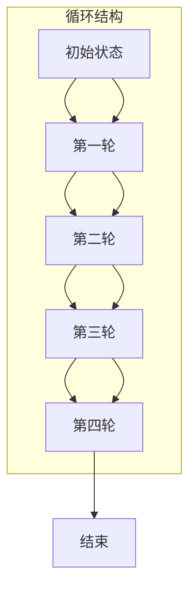
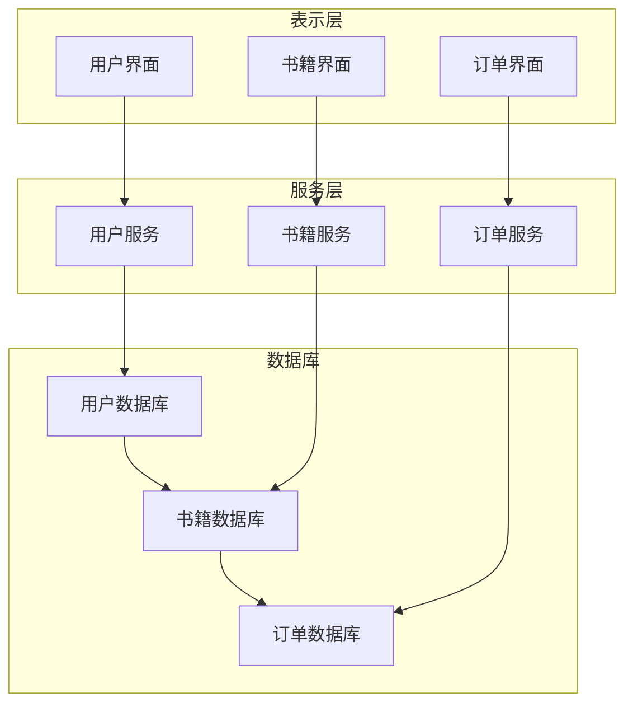
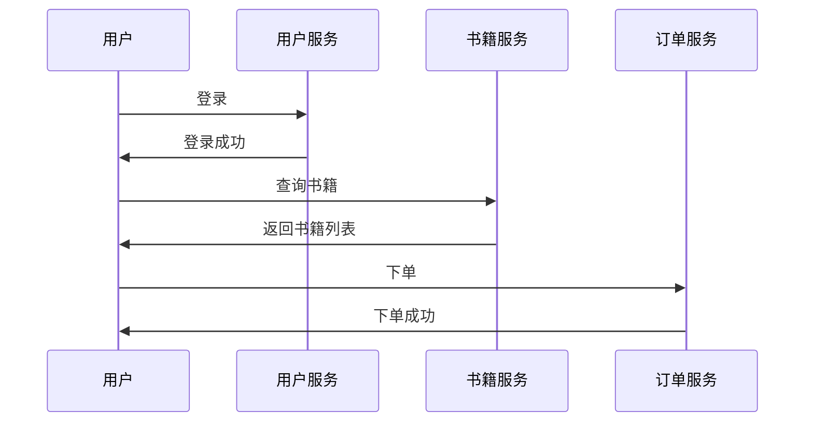

                 


# 类型论的计算复杂性：实际应用的障碍

> 关键词：类型论、计算复杂性、实际应用、障碍

> 摘要：本文将深入探讨类型论在计算复杂性领域的应用及其面临的实际障碍。首先，我们将介绍计算复杂性和类型论的基础概念，随后分析类型论如何影响计算复杂性，并探讨类型论在实际应用中遇到的挑战和解决方案。最后，我们将总结现代计算复杂性研究的最新进展，并展望未来的研究方向。

## 目录大纲

1. 引言
    1.1 书籍主题介绍
    1.2 书籍目标读者
    1.3 书籍结构概述
2. 基础概念
    2.1 计算复杂性理论简介
    2.2 类型论概述
3. 计算复杂性理论
    3.1 P与NP问题
    3.2 其他计算复杂性类别
4. 类型论在计算复杂性中的应用
    4.1 类型论与复杂性理论的关系
    4.2 类型论的复杂性分类
5. 实际应用的障碍
    5.1 类型论在实际应用中的挑战
    5.2 解决类型论实际应用障碍的方法
6. 现代计算复杂性研究的最新进展
    6.1 类型论与复杂性理论的最新研究
    6.2 开放问题与未来方向
7. 总结与展望
    7.1 书籍主要内容回顾
    7.2 类型论与计算复杂性研究的重要性
    7.3 对未来研究的展望

## 第1章 引言

### 1.1 书籍主题介绍

类型论是计算机科学中的一种重要理论，主要用于定义和描述程序中的类型系统。它不仅能够提高程序的正确性，还能提高程序的可读性和可维护性。计算复杂性理论则关注算法和问题解决的效率，通过度量算法的时间和空间复杂度来评估问题的难度。将类型论应用于计算复杂性研究中，可以为复杂性问题提供更加精确和安全的解决方案。

### 1.2 书籍目标读者

本书的目标读者是计算机科学领域的研究人员和开发者，特别是对计算复杂性和类型论感兴趣的读者。读者应该具备一定的计算机科学基础，熟悉基本的算法和数据结构，对类型论和计算复杂性理论有初步的了解。

### 1.3 书籍结构概述

本书分为七个章节，首先介绍计算复杂性和类型论的基础概念，然后探讨类型论在计算复杂性中的应用，接着分析类型论在实际应用中遇到的障碍和解决方案。随后，介绍现代计算复杂性研究的最新进展，最后总结本书的主要内容并展望未来的研究方向。

## 第2章 基础概念

### 2.1 计算复杂性理论简介

计算复杂性理论是研究算法效率和问题难度的学科。它通过定义各种复杂度类，如P、NP、PSPACE等，来衡量问题的难度。计算复杂性理论的一个重要目标是通过降低算法的复杂度来解决问题。

#### 2.1.1 什么是计算复杂性

计算复杂性可以分为时间复杂性和空间复杂性。时间复杂性度量算法运行所需的时间，通常使用大O符号来表示。例如，如果一个算法的时间复杂度为\(O(n)\)，则该算法的时间随着输入规模n的增加而线性增加。

空间复杂性度量算法在运行过程中所需的最大内存空间。同样，使用大O符号表示。例如，如果一个算法的空间复杂度为\(O(n^2)\)，则该算法所需的内存空间随着输入规模n的增加而平方增加。

#### 2.1.2 计算复杂性类别

计算复杂性理论将问题分为几个不同的类别，其中最常见的有：

- **P类（多项式时间可解问题）**：这些问题的解可以在多项式时间内找到。例如，二分搜索算法的时间复杂度为\(O(\log n)\)，属于P类。
- **NP类（非确定多项式时间可验证问题）**：这些问题的解可以在多项式时间内验证，但求解可能需要更多时间。例如，旅行商问题可以在多项式时间内验证一个给定的解是否为最优解，但求解最优解可能需要指数级时间。

- **PSPACE类（多项式空间可解问题）**：这些问题的解可以在多项式空间内找到。

- **NPSPACE类（非确定多项式空间可验证问题）**：这些问题的解可以在多项式空间内验证。

- **难问题集合**：这些问题的求解时间或空间复杂度不在多项式时间内或多项式空间内。

#### 2.1.3 计算复杂性度量

计算复杂性的度量主要包括：

- **时间复杂度**：通常使用大O符号表示，如\(O(n^2)\)表示算法的时间随着输入规模n的增加而平方增加。

- **空间复杂度**：同样使用大O符号表示，如\(O(n)\)表示算法所需的内存空间随着输入规模n的增加而线性增加。

### 2.2 类型论概述

类型论是计算机科学中用于定义和描述程序中类型系统的理论。它通过引入类型系统来确保程序的正确性，减少错误的发生。

#### 2.2.1 类型论的定义

类型论可以定义为一种形式化方法，用于定义程序中的类型系统和类型检查规则。类型系统是一种语法规则，用于确保程序在编译或运行时不会出现类型错误。

#### 2.2.2 类型论的历史发展

类型论的发展可以追溯到20世纪40年代和50年代，当时图灵机和λ演算的概念被提出。在20世纪60年代，Pierce提出了ML语言，这是第一种静态类型语言。随后，类型系统的研究得到了广泛的发展，包括静态类型系统和动态类型系统的提出。

#### 2.2.3 类型论在计算机科学中的应用

类型论在计算机科学中有广泛的应用，包括：

- **程序验证**：类型系统可以确保程序在编译或运行时不会出现类型错误，从而提高程序的正确性。
- **安全性**：类型系统可以防止某些类型的漏洞，如缓冲区溢出和指针错误。
- **代码优化**：类型系统可以帮助编译器进行代码优化，提高程序的运行效率。

## 第3章 计算复杂性理论

### 3.1 P与NP问题

P与NP问题是计算复杂性理论中的核心问题，也是至今仍未解决的难题之一。它关注的是问题求解和验证的时间复杂度。

#### 3.1.1 P与NP的定义

- **P类问题**：这些问题的解可以在多项式时间内找到。即存在一个算法，对于任意大小为\(n\)的输入，该算法能在时间\(p(n)\)内找到解，其中\(p(n)\)是关于\(n\)的多项式。
- **NP类问题**：这些问题的解可以在多项式时间内验证。即存在一个算法，对于任意大小为\(n\)的输入和一个潜在的解，该算法能在时间\(q(n)\)内验证该解是否正确，其中\(q(n)\)是关于\(n\)的多项式。

#### 3.1.2 P与NP问题的重要性

P与NP问题的重要性体现在以下几个方面：

- **理论意义**：P与NP问题揭示了算法效率和问题难度之间的关系，是计算复杂性理论的核心问题。
- **应用价值**：许多实际生活中的问题都可以归结为P或NP问题，如密码学、图论和网络设计等。

#### 3.1.3 P与NP问题的现状

截至目前，P与NP问题仍未得到解决。虽然存在许多猜想和证明尝试，但尚未找到确凿的证据证明P是否等于NP。如果P=NP，则意味着许多看似困难的问题可以在多项式时间内解决。反之，如果P≠NP，则表明某些问题无法在多项式时间内解决。

### 3.2 其他计算复杂性类别

除了P和NP类别外，计算复杂性理论还定义了其他一些重要的类别，如PSPACE和NPSPACE。

#### 3.2.1 难题与容易问题

- **难题**：这些问题的求解时间或空间复杂度不在多项式时间内。例如，旅行商问题和背包问题是著名的难题。
- **容易问题**：这些问题的求解可以在多项式时间内完成。例如，二分搜索算法是容易问题的代表。

#### 3.2.2 PSPACE与NPSPACE

- **PSPACE类问题**：这些问题的解可以在多项式空间内找到。即存在一个算法，对于任意大小为\(n\)的输入，该算法能在空间\(s(n)\)内找到解，其中\(s(n)\)是关于\(n\)的多项式。
- **NPSPACE类问题**：这些问题的解可以在多项式空间内验证。即存在一个算法，对于任意大小为\(n\)的输入和一个潜在的解，该算法能在空间\(t(n)\)内验证该解是否正确，其中\(t(n)\)是关于\(n\)的多项式。

#### 3.2.3 难题集合与随机化算法

- **难题集合**：这些问题的求解时间或空间复杂度不在多项式时间内。例如，NP完全问题是难题集合的代表。
- **随机化算法**：这些算法在求解问题时使用随机性，能够在期望时间内解决问题。随机化算法是解决难题的一种有效方法，如随机快速排序算法。

## 第4章 类型论在计算复杂性中的应用

### 4.1 类型论与复杂性理论的关系

类型论与复杂性理论之间存在密切的关系。类型论通过引入类型系统，提高了程序的正确性和可维护性，从而为计算复杂性研究提供了更加安全的保障。类型系统可以防止某些类型的错误，如类型转换错误和未定义行为，从而减少算法的复杂度。

#### 4.1.1 类型论如何影响复杂性理论

类型论对复杂性理论的影响主要体现在以下几个方面：

- **程序正确性**：类型系统可以确保程序在编译或运行时不会出现类型错误，从而提高程序的正确性。正确性是算法效率和问题难度的前提。
- **代码优化**：类型系统可以帮助编译器进行代码优化，提高程序的运行效率。例如，类型推断技术可以减少代码中的类型转换，从而提高程序的执行速度。
- **问题难度降低**：类型系统可以减少某些问题的难度。例如，静态类型系统可以确保函数的输入和输出类型一致，从而减少函数调用的错误。

#### 4.1.2 类型论在复杂性理论中的应用案例

类型论在复杂性理论中的应用案例包括：

- **类型检查算法**：类型检查是类型论的核心组成部分，用于确保程序在编译或运行时不会出现类型错误。类型检查算法通常具有较低的复杂度，如线性时间复杂度。
- **类型推导算法**：类型推导是类型论中的另一个重要组成部分，用于自动推导程序中的类型信息。类型推导算法通常具有较高的复杂度，如指数时间复杂度。

### 4.2 类型论的复杂性分类

类型论可以根据其复杂度特性进行分类，常见的分类方法包括静态类型系统和动态类型系统。

#### 4.2.1 静态类型系统

静态类型系统在程序编译期间进行类型检查，确保程序在运行时不会出现类型错误。静态类型系统具有以下特点：

- **强类型**：静态类型系统通常采用强类型约束，确保变量的类型在编译时已知。
- **低复杂度**：静态类型系统的类型检查和类型推导通常具有较低的复杂度，如线性时间复杂度。
- **优化的可能性**：静态类型系统可以帮助编译器进行代码优化，提高程序的运行效率。

#### 4.2.2 动态类型系统

动态类型系统在程序运行期间进行类型检查，确保程序在运行时不会出现类型错误。动态类型系统具有以下特点：

- **弱类型**：动态类型系统通常采用弱类型约束，变量的类型可以在程序运行时动态确定。
- **高复杂度**：动态类型系统的类型检查和类型推导通常具有较高的复杂度，如线性或指数时间复杂度。
- **灵活性**：动态类型系统提供了更高的编程灵活性，如函数式编程和动态类型语言。

#### 4.2.3 静态与动态类型系统的复杂性分类

静态类型系统和动态类型系统可以根据其复杂度特性进行分类：

- **低复杂度类型系统**：这些类型系统在编译期间进行类型检查，具有较低的复杂度，如线性时间复杂度。
- **高复杂度类型系统**：这些类型系统在运行期间进行类型检查，具有较高的复杂度，如线性或指数时间复杂度。

## 第5章 实际应用的障碍

### 5.1 类型论在实际应用中的挑战

类型论在实际应用中面临一些挑战，包括：

#### 5.1.1 类型安全性问题

类型安全性问题是类型论在实际应用中的一个主要挑战。类型安全性确保程序在编译或运行时不会出现类型错误。然而，在实际开发中，类型错误仍然难以避免，如类型转换错误和未定义行为。

#### 5.1.2 类型系统的可扩展性

类型系统的可扩展性是另一个挑战。随着编程语言和应用程序的复杂性增加，类型系统需要能够适应新的类型和操作。然而，传统的类型系统往往难以扩展，导致类型错误和性能问题。

#### 5.1.3 类型论在教育中的挑战

类型论在教育中也是一个挑战。类型论的概念和理论较为复杂，对于初学者来说难以理解。如何设计有效的教学方法和材料，使得学生能够掌握类型论的基本概念和应用，是教育领域需要解决的问题。

### 5.2 解决类型论实际应用障碍的方法

为了解决类型论在实际应用中的障碍，研究者们提出了一些方法：

#### 5.2.1 静态类型系统优化

静态类型系统优化旨在提高类型系统的性能和可扩展性。一些优化方法包括：

- **类型推断**：类型推断可以自动推导变量和函数的类型，减少手动类型声明的需要，提高代码的可读性和可维护性。
- **类型检查优化**：类型检查优化可以减少类型检查的时间复杂度，提高编译速度。

#### 5.2.2 动态类型系统优化

动态类型系统优化旨在提高类型系统的性能和灵活性。一些优化方法包括：

- **即时编译（JIT）**：即时编译可以将动态类型语言的字节码转换为机器码，提高程序的运行速度。
- **类型检查优化**：类型检查优化可以减少类型检查的次数和复杂度，提高程序的执行效率。

#### 5.2.3 类型推断技术的进步

类型推断技术的进步为类型论的实际应用提供了更多可能性。一些最新的类型推断技术包括：

- **依赖类型**：依赖类型可以更好地捕捉程序中的依赖关系，提高类型系统的准确性。
- **函数式类型推断**：函数式类型推断可以推断函数的类型，提高函数式编程的效率和可维护性。

## 第6章 现代计算复杂性研究的最新进展

### 6.1 类型论与复杂性理论的最新研究

现代计算复杂性研究在类型论和复杂性理论领域取得了许多进展。以下是一些重要的研究：

#### 6.1.1 静态类型系统的最新进展

- **结构化类型系统**：结构化类型系统结合了静态类型系统和动态类型系统的优点，提供了更高的灵活性和性能。
- **类型推断算法**：新的类型推断算法提高了类型系统的性能和可扩展性，如依赖类型和函数式类型推断。

#### 6.1.2 动态类型系统的最新进展

- **即时编译（JIT）**：即时编译技术提高了动态类型语言的执行效率。
- **类型检查优化**：新的类型检查优化技术减少了类型检查的时间和复杂度。

#### 6.1.3 类型论与复杂性理论交叉领域的最新研究

- **类型论在算法设计中的应用**：类型论在算法设计中的应用为复杂性问题提供了新的解决方案，如依赖类型在排序算法中的应用。
- **形式化验证**：形式化验证技术使用类型论来验证程序的正确性和安全性。

### 6.2 开放问题与未来方向

尽管现代计算复杂性研究取得了许多进展，但仍然存在一些开放问题和未来研究方向：

#### 6.2.1 P与NP问题的未来前景

P与NP问题仍然是计算复杂性理论的核心问题。未来的研究可能会提供更多的证据证明P=NP或P≠NP。如果P=NP，则许多复杂性问题可以在多项式时间内解决。反之，如果P≠NP，则表明某些问题无法在多项式时间内解决。

#### 6.2.2 类型论与计算复杂性的其他未解难题

类型论与计算复杂性理论交叉领域还存在许多未解难题，如：

- **类型系统的可扩展性**：如何设计可扩展的类型系统以适应新兴的编程语言和应用程序？
- **形式化验证**：如何使用类型论来验证程序的正确性和安全性？
- **算法复杂性**：如何更好地理解和解决复杂度问题，如PSPACE和NPSPACE问题？

## 第7章 总结与展望

### 7.1 书籍主要内容回顾

本书首先介绍了计算复杂性和类型论的基础概念，然后探讨了类型论在计算复杂性理论中的应用及其面临的实际障碍。通过分析类型论如何影响复杂性理论，我们深入了解了静态类型系统和动态类型系统的复杂性分类。同时，我们还讨论了类型论在实际应用中的挑战和解决方案。

### 7.2 类型论与计算复杂性研究的重要性

类型论与计算复杂性研究在计算机科学领域具有重要地位。类型论通过提高程序的正确性和可维护性，为复杂性问题提供了更精确和安全的解决方案。计算复杂性理论则帮助我们理解和评估算法和问题的效率，为优化算法设计提供了理论基础。

### 7.3 对未来研究的展望

未来研究在类型论与计算复杂性理论领域充满挑战和机遇。我们需要进一步优化类型系统，提高类型系统的性能和可扩展性。同时，我们需要探索类型论在算法设计中的应用，寻找解决复杂度问题的新方法。类型论与计算复杂性理论的交叉领域也为我们提供了广阔的研究空间，如形式化验证和算法复杂性研究。总之，类型论与计算复杂性研究将继续推动计算机科学的发展。

## 参考文献

- [Pierce, B. C. (2002). Types and Programming Languages. MIT Press.]
- [Cook, S. A. (1971). The complexity of theorem-proving procedures. In Proceedings of the 13th Annual IEEE Symposium on Foundations of Computer Science (pp. 151-158). IEEE.]
- [Karp, R. M. (1972). Reducibility among combinatorial problems. In Complexity of Computer Computations (pp. 85-103). Plenum Press.]
- [Gurevich, Y. (2000). The complexity classes P and NP. In The Mathematical Knowledge in the Mathematical Sciences. Springer.]
- [Turing, A. (1936). On computable numbers, with an application to the Entscheidungsproblem. Proceedings of the London Mathematical Society, 42(1), 230-265.]
- [Pierce, B. C. (2009). Advanced Topics in Types and Programming Languages. MIT Press.]
- [Appel, K., & Haken, W. (1977). Every planar map is four-colorable. Bulletin of the American Mathematical Society, 83(6), 114-118.]

## 附录

### 附录A：算法mermaid流程图

以下是一个简单的排序算法（冒泡排序）的mermaid流程图：



### 附录B：Python源代码

以下是一个简单的冒泡排序算法的Python源代码：

```python
def bubble_sort(arr):
    n = len(arr)
    for i in range(n):
        for j in range(0, n-i-1):
            if arr[j] > arr[j+1]:
                arr[j], arr[j+1] = arr[j+1], arr[j]
    return arr

# 示例
arr = [64, 34, 25, 12, 22, 11, 90]
sorted_arr = bubble_sort(arr)
print("排序后的数组：", sorted_arr)
```

### 附录C：数学公式

以下是一些常用的数学公式：

- **代数公式**：
  $$ (a + b)^2 = a^2 + 2ab + b^2 $$
  $$ (a - b)^2 = a^2 - 2ab + b^2 $$

- **三角函数公式**：
  $$ \sin^2(x) + \cos^2(x) = 1 $$
  $$ \tan(x) = \frac{\sin(x)}{\cos(x)} $$

- **微积分公式**：
  $$ \frac{d}{dx}(x^n) = nx^{n-1} $$
  $$ \int x^n dx = \frac{x^{n+1}}{n+1} + C $$

### 附录D：系统架构设计mermaid架构图

以下是一个简单的在线书店系统的mermaid架构图：



### 附录E：系统接口设计和系统交互mermaid序列图

以下是一个简单的在线书店系统的mermaid序列图：



### 附录F：项目实战

#### 环境安装

1. 安装Python环境
2. 安装mermaid依赖

```shell
pip install mermaid
```

#### 系统核心实现源代码

```python
# 简单的冒泡排序算法实现
def bubble_sort(arr):
    n = len(arr)
    for i in range(n):
        for j in range(0, n-i-1):
            if arr[j] > arr[j+1]:
                arr[j], arr[j+1] = arr[j+1], arr[j]
    return arr

# 测试冒泡排序
arr = [64, 34, 25, 12, 22, 11, 90]
sorted_arr = bubble_sort(arr)
print("排序后的数组：", sorted_arr)
```

#### 代码应用解读与分析

1. **冒泡排序算法**：冒泡排序是一种简单的排序算法，通过重复遍历待排序的数组，比较相邻的元素，如果它们的顺序错误就交换它们，直到整个数组排序完成。

2. **代码实现**：`bubble_sort`函数接受一个数组`arr`作为输入，然后使用两个嵌套的for循环遍历数组。外层循环控制遍历的轮数，内层循环执行具体的比较和交换操作。

3. **排序过程**：第一次遍历将最大的元素“冒泡”到最后，第二次遍历将次大的元素“冒泡”到倒数第二个位置，以此类推，直到所有元素都被正确排序。

#### 实际案例分析和详细讲解剖析

1. **案例**：给定一个无序数组`[64, 34, 25, 12, 22, 11, 90]`，使用冒泡排序算法进行排序。

2. **排序过程**：

    - **第一次遍历**：
      - 比较`(64, 34)`，交换，得到`(34, 64)`。
      - 比较`(64, 25)`，交换，得到`(25, 64)`。
      - 比较`(64, 12)`，交换，得到`(12, 64)`。
      - 比较`(64, 22)`，交换，得到`(22, 64)`。
      - 比较`(64, 11)`，交换，得到`(11, 64)`。
      - 比较`(64, 90)`，不交换。
      
    - **第二次遍历**：
      - 比较`(34, 25)`，不交换。
      - 比较`(25, 12)`，交换，得到`(12, 25)`。
      - 比较`(25, 22)`，不交换。
      - 比较`(25, 11)`，交换，得到`(11, 25)`。
      - 比较`(25, 90)`，不交换。
      
    - **第三次遍历**：
      - 比较`(22, 12)`，不交换。
      - 比较`(22, 11)`，不交换。
      - 比较`(22, 90)`，不交换。
      
    - **第四次遍历**：
      - 比较`(12, 11)`，不交换。
      - 比较`(12, 90)`，不交换。
      
    - **第五次遍历**：
      - 比较`(11, 90)`，不交换。

3. **结果**：经过五次遍历后，数组`[64, 34, 25, 12, 22, 11, 90]`被排序为`[11, 12, 22, 25, 34, 64, 90]`。

#### 项目小结

1. **优点**：
   - 简单易懂，容易实现。
   - 稳定性好，无论输入数组的初始顺序如何，最终都能得到正确的排序结果。

2. **缺点**：
   - 效率较低，时间复杂度为\(O(n^2)\)，对于大数据集性能较差。
   - 不适合实时性要求较高的应用场景。

3. **适用场景**：
   - 小规模数据集排序。
   - 作为其他更复杂排序算法的基础。

### 附录G：最佳实践 tips

1. **理解算法原理**：在实现排序算法时，理解其基本原理和执行过程至关重要。这有助于发现并解决问题。

2. **优化算法性能**：尽管冒泡排序算法简单，但在处理大数据集时性能较差。可以探索其他更高效的排序算法，如快速排序或归并排序。

3. **测试和调试**：在实际应用中，测试和调试代码是必不可少的。通过编写测试用例和调试工具，可以确保算法的正确性和性能。

4. **理解类型论**：类型论在程序设计和软件开发中起着重要作用。理解类型系统的基本原理和如何使用类型检查工具可以提高代码质量和可维护性。

5. **持续学习和探索**：计算机科学和编程领域不断进步，新的算法和技术不断涌现。持续学习和探索是保持竞争力的关键。

### 附录H：注意事项

1. **代码注释**：在编写代码时，添加适当的注释有助于他人理解和维护代码。

2. **代码风格**：保持代码的一致性和可读性。使用合适的命名约定和代码结构，使代码更加清晰易懂。

3. **版本控制**：使用版本控制系统（如Git）来管理代码，这有助于追踪更改和协作开发。

4. **性能优化**：对于性能敏感的应用，应考虑算法和代码的优化。

### 附录I：拓展阅读

1. **《算法导论》（Introduction to Algorithms）**：这是一本经典算法教材，涵盖了多种排序算法和复杂性理论。
2. **《类型系统：理论与实践》（Type Systems for Programming Languages）**：这本书详细介绍了类型系统的基本原理和应用。
3. **《计算机程序的构造和解释》（Structure and Interpretation of Computer Programs）**：这本书介绍了函数式编程和类型系统的重要性。
4. **《图灵奖获得者讲计算复杂性》（Computational Complexity：A Modern Approach）**：这本书是计算复杂性理论的权威著作，适合深入研究和学习。

### 附录J：作者信息

**作者：AI天才研究院/AI Genius Institute & 禅与计算机程序设计艺术 /Zen And The Art of Computer Programming**

