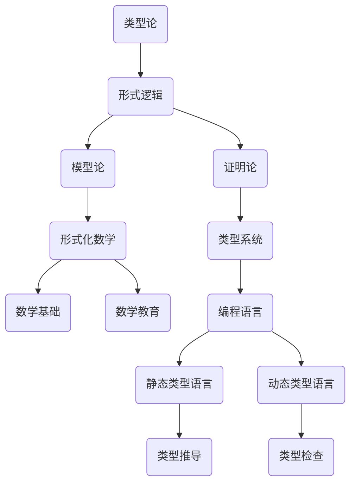

                 

### 文章标题

“类型论的认知负担：对数学思维的影响”

### 关键词

类型论、认知负担、数学思维、影响、编程语言、形式逻辑、数学教育、现代数学、挑战

### 摘要

类型论作为计算机科学中的核心概念，不仅深刻影响着编程语言的设计与应用，也对数学思维产生了深远的影响。本文将深入探讨类型论的基础知识、其在编程语言和形式逻辑中的应用，以及其对数学思维的影响和带来的认知负担。通过对类型论在数学教育、现代数学研究以及认知负担与挑战方面的分析，文章旨在揭示类型论在数学和计算机科学中不可忽视的重要性，并提出未来研究和教育的方向。

## 类型论基础

### 第1章：类型论概述

#### 1.1 类型论的发展历史

类型论（Type Theory）的起源可以追溯到20世纪30年代，当时由数学家和历史学家贝尔纳德·罗素和阿尔弗雷德·诺思·怀特海德在其著作《数学原理》中首次提出类型概念。他们试图通过类型系统来解决逻辑悖论，尤其是防止Russell悖论的发生。这一思想在后来的发展中逐渐演变为类型论。

20世纪40年代，阿隆索·丘奇和阿尔图尔·雷马鲁斯分别独立提出了λ-演算，这为类型论提供了坚实的理论基础。λ-演算不仅是一种形式系统，也是一种计算模型，它能够定义函数和变量，为后来的编程语言设计提供了启示。

进入20世纪60年代，帕特里克·亨利·布莱克本提出了简单的类型系统，进一步推动了类型论的发展。同一时期，皮埃尔·德尔布罗格引入了Polymorphic Type System，使得类型系统能够支持更为复杂的类型关系。

20世纪80年代，随着函数式编程语言的兴起，类型论得到了更多的应用和推广。Haskell、ML和Scala等语言采用了强类型系统，使得类型论在编程实践中发挥了重要作用。

#### 1.2 类型论的核心概念

类型论的核心概念包括类型系统、类型层次结构、类型转换和类型推导。

类型系统（Type System）是定义变量、函数和其他表达式类型的规则集合。它通过将程序中的每个元素分配到特定的类型，确保程序的正确性和一致性。

类型层次结构（Type Hierarchy）描述了不同类型之间的关系。在类型论中，常见的层次结构包括基础类型（如整数、布尔值）和复合类型（如数组、函数类型）。

类型转换（Type Conversion）是指将一个类型转换为另一个类型的操作。在类型论中，类型转换可以是显式的，也可以是隐式的。

类型推导（Type Inference）是类型系统中的一个重要机制，它能够自动推断出程序中各个部分的类型，而不需要程序员显式地指定类型。

#### 1.3 类型论与逻辑的关系

类型论与逻辑有着密切的关系。形式逻辑中的命题、谓词和逻辑运算符可以直接映射到类型论中的类型和类型构造器。类型论通过逻辑的框架来定义和操作类型，从而提供了一种形式化的方法来验证程序的正确性。

类型论在逻辑中的应用主要体现在两个方面：

1. **证明论**：类型论中的类型系统可以用来证明命题的有效性。例如，在构造证明时，可以使用类型的组合规则来构建复杂的逻辑表达式。

2. **模型论**：类型论中的类型结构可以用来构建逻辑模型的语义。通过将类型论中的类型视为逻辑模型中的对象，可以验证逻辑系统的一致性和完整性。

### 第2章：类型系统的基本概念

#### 2.1 类型系统的定义

类型系统是一种形式化的规则集合，用于定义程序中各种元素的类型，并确保类型的一致性和正确性。类型系统的基本目标是防止类型错误，例如将一个不兼容的类型用作另一个类型的操作数。

类型系统通常由以下几个部分组成：

- **类型语言**：定义类型和类型的构造器。
- **类型规则**：定义如何从基本类型构造复合类型。
- **类型检查**：在程序运行前对程序进行类型检查，确保程序中的每个表达式都是类型正确的。
- **类型推导**：自动推导出程序中各个部分的类型，减轻程序员的工作负担。

#### 2.2 类型系统的层次结构

类型系统的层次结构描述了不同类型之间的关系。在常见的类型系统中，层次结构通常如下：

- **基础类型**：如整数（Int）、布尔值（Bool）和字符（Char）。
- **复合类型**：如数组（Array）、列表（List）和函数类型（Function Type）。
- **构造类型**：如类（Class）和接口（Interface）。

类型层次结构有助于组织和管理复杂的类型关系，确保程序的正确性和可维护性。

#### 2.3 类型系统的类型转换

类型转换是指将一个类型转换为另一个类型的操作。类型转换可以是显式的，也可以是隐式的。

- **显式类型转换**：通过显式指定类型转换，例如在Python中，可以使用`int()`函数将一个浮点数转换为整数。

- **隐式类型转换**：在不需要显式指定类型转换的情况下，类型系统会自动进行类型转换，例如在C++中，当将一个整数赋值给一个浮点变量时，会自动将整数类型转换为浮点类型。

类型转换在编程中至关重要，它确保程序中的类型操作能够正确执行，并避免类型错误。

### 第3章：类型论在编程语言中的应用

#### 3.1 静态类型语言

静态类型语言（Static Type Language）在编译时确定变量的类型，从而在程序运行前进行类型检查。这种类型系统有助于发现和纠正潜在的错误，提高程序的可靠性和可维护性。

常见的静态类型语言包括Haskell、ML和Scala。这些语言通常具有以下特点：

- **强类型系统**：确保程序中的每个表达式都有明确的类型。
- **类型推导**：能够自动推导出变量的类型，减轻程序员的工作负担。
- **模式匹配**：允许根据值的类型和结构进行条件分支，提高代码的可读性。

静态类型语言在编译时进行类型检查，能够发现类型错误，从而提高程序的可靠性和安全性。

#### 3.2 动态类型语言

动态类型语言（Dynamic Type Language）在程序运行时确定变量的类型，并在运行时进行类型检查。这种类型系统提供了更高的灵活性和动态性，但可能导致类型错误和性能开销。

常见的动态类型语言包括Python、JavaScript和Ruby。这些语言通常具有以下特点：

- **弱类型系统**：允许变量在运行时改变类型。
- **动态类型检查**：在程序运行时进行类型检查，提供更高的灵活性和动态性。
- **解释执行**：通常采用解释器来执行程序，而非编译器。

动态类型语言在运行时进行类型检查，能够提高程序的灵活性和动态性，但也可能导致性能问题。

#### 3.3 类型推导与类型检查

类型推导（Type Inference）是类型系统中的一个重要机制，它能够自动推导出程序中各个部分的类型，而不需要程序员显式地指定类型。类型推导有助于减轻程序员的工作负担，提高代码的可读性。

类型检查（Type Checking）是在程序运行前对程序进行类型检查，确保程序中的每个表达式都是类型正确的。类型检查可以在编译时进行，也可以在运行时进行。

类型推导与类型检查在编程中至关重要，它们能够发现和纠正类型错误，提高程序的可靠性和可维护性。

### 第4章：类型论在形式逻辑中的应用

#### 4.1 形式逻辑的基本概念

形式逻辑（Formal Logic）是一种形式化的方法，用于表示和分析命题、推理和论证。形式逻辑的基本概念包括命题、谓词和逻辑运算符。

- **命题**：命题是可以判断真假的陈述句，用符号表示为P。
- **谓词**：谓词是对个体属性的描述，用符号表示为F(x)。
- **逻辑运算符**：逻辑运算符用于组合命题和谓词，常见的逻辑运算符包括合取（∧）、析取（∨）、非（¬）和条件（→）。

形式逻辑通过定义逻辑运算符的规则和推理规则，提供了形式化的方法来表示和分析逻辑命题。

#### 4.2 类型论与形式逻辑的相互影响

类型论与形式逻辑之间存在密切的相互影响。类型论提供了形式化的方法来定义和操作类型，从而为形式逻辑提供了一种形式化的框架。形式逻辑则为类型论提供了逻辑推理和证明的工具。

类型论与形式逻辑的相互影响主要体现在以下几个方面：

- **形式化证明**：类型论可以用于形式化证明，通过定义证明类型和证明过程，确保证明的有效性和一致性。
- **逻辑编程**：类型论可以用于逻辑编程，将逻辑表达式转换为程序，从而实现逻辑推理和问题求解。
- **类型安全**：形式逻辑可以用于验证类型系统的安全性，确保类型转换和类型检查的正确性。

#### 4.3 类型论在证明理论中的应用

类型论在证明理论（Proof Theory）中的应用主要体现在以下几个方面：

- **证明类型系统**：类型论可以用于定义证明类型系统，通过定义证明类型和证明规则，确保证明的有效性和一致性。
- **构造证明**：类型论提供了一种构造证明的方法，通过类型构造器的组合，构建复杂的证明过程。
- **证明验证**：类型论可以用于验证证明的正确性，通过类型检查确保证明过程的类型安全。

类型论在证明理论中的应用，不仅提供了形式化的证明方法，也为计算机证明和自动推理提供了理论支持。

### 第5章：类型论与数学思维

#### 5.1 数学思维与类型论的关系

数学思维（Mathematical Thinking）是一种逻辑严密、抽象和推理的思维方式，它强调通过定义、定理和证明来构建数学体系。类型论（Type Theory）则是一种形式化的方法，用于定义和操作类型，它在计算机科学和逻辑学中有着广泛的应用。

数学思维与类型论之间的关系可以从以下几个方面来理解：

- **抽象**：数学思维和类型论都强调抽象，将具体的对象抽象为一般的类型或数学概念。
- **推理**：数学思维和类型论都依赖于严密的推理，通过逻辑推理和证明来推导出结论。
- **形式化**：类型论提供了一种形式化的方法，用于定义和验证数学命题和证明，从而确保数学结论的可靠性和一致性。

数学思维与类型论的相互作用，不仅为数学提供了形式化的方法，也为计算机科学和逻辑学提供了有力的工具。

#### 5.2 类型论对数学推理的影响

类型论对数学推理（Mathematical Reasoning）产生了深远的影响。类型论提供了一种形式化的方法，用于定义和操作数学概念，从而确保数学推理的正确性和一致性。

类型论对数学推理的影响主要体现在以下几个方面：

- **类型检查**：类型论通过类型检查确保数学表达式的类型正确性，从而减少错误和矛盾的可能性。
- **证明理论**：类型论可以用于形式化证明，通过定义证明类型和证明规则，确保证明的有效性和一致性。
- **逻辑推理**：类型论提供了形式化的逻辑推理框架，使得数学推理更加严谨和可靠。

类型论对数学推理的影响，不仅提高了数学的精确性和可靠性，也为计算机证明和自动推理提供了理论支持。

#### 5.3 类型论在数学教育中的应用

类型论在数学教育（Mathematical Education）中具有重要作用。通过引入类型论，数学教育可以更加形式化和严谨，从而提高学生的数学思维能力和逻辑推理能力。

类型论在数学教育中的应用主要体现在以下几个方面：

- **形式化定义**：类型论可以用于形式化数学定义，使得数学概念更加精确和严格。
- **证明教育**：类型论提供了一种形式化的证明方法，可以用于培养学生的证明能力和逻辑思维能力。
- **类型推导**：类型论可以用于类型推导，培养学生的类型思维和抽象能力。

类型论在数学教育中的应用，有助于提高学生的数学素养和逻辑推理能力，为未来的数学研究和应用打下坚实的基础。

### 第6章：类型论在现代数学中的地位与作用

#### 6.1 类型论在现代数学中的地位

类型论在现代数学（Modern Mathematics）中占据着重要的地位。随着数学和计算机科学的相互融合，类型论在数学研究、逻辑学和计算机科学中发挥了关键作用。

类型论在现代数学中的地位主要体现在以下几个方面：

- **数学基础**：类型论提供了数学基础的形式化方法，通过定义类型系统和证明论，确保数学体系的一致性和可靠性。
- **逻辑学**：类型论是逻辑学的重要分支，通过形式化的逻辑推理框架，为逻辑学提供了有力的工具。
- **计算机科学**：类型论在计算机科学中有着广泛的应用，为编程语言的设计、形式化验证和证明理论提供了理论支持。

#### 6.2 类型论在数学研究中的应用

类型论在数学研究（Mathematical Research）中具有广泛的应用。通过引入类型论，数学家可以更加形式化和严格地进行数学研究，从而提高数学结论的可靠性和精度。

类型论在数学研究中的应用主要体现在以下几个方面：

- **证明理论**：类型论可以用于形式化证明，确保证明过程的一致性和正确性，从而提高证明的可靠性。
- **形式化数学**：类型论提供了一种形式化数学的方法，使得数学概念和定理的形式化表示更加精确和严格。
- **计算机证明**：类型论可以用于计算机证明，通过自动化证明工具，加速数学研究进程。

类型论在数学研究中的应用，不仅提高了数学的精确性和可靠性，也为数学发现和证明提供了新的方法。

#### 6.3 类型论在数学哲学中的影响

类型论在数学哲学（Mathematical Philosophy）中产生了深远的影响。数学哲学关注数学的本质、数学知识的性质以及数学证明的有效性。类型论为数学哲学提供了一种形式化的方法，用于探讨数学的本质和证明的有效性。

类型论在数学哲学中的影响主要体现在以下几个方面：

- **数学本质**：类型论提供了数学本质的形式化描述，从而探讨数学对象的存在性和构造方法。
- **数学证明**：类型论提供了形式化证明的方法，使得数学证明的过程和结果更加严谨和可靠。
- **数学认知**：类型论探讨了数学认知的过程和方法，为数学哲学提供了新的视角。

类型论在数学哲学中的应用，不仅丰富了数学哲学的理论体系，也为数学教育和数学认知提供了新的思路。

### 第7章：类型论的认知负担与挑战

#### 7.1 类型论的认知负担

类型论作为一种形式化的方法，对数学思维和编程实践产生了深远的影响。然而，类型论也带来了一定的认知负担（Cognitive Burden），使得学习者和实践者需要投入更多的时间和精力来理解和应用类型论。

类型论的认知负担主要体现在以下几个方面：

- **抽象思维**：类型论要求学习者具备较强的抽象思维能力，能够将具体的编程问题和数学问题抽象为类型论的形式化表示。
- **逻辑推理**：类型论依赖于严密的逻辑推理，要求学习者具备良好的逻辑思维能力，能够理解和应用类型论中的逻辑规则和推理方法。
- **类型系统设计**：类型论在编程语言设计和形式化验证中发挥着重要作用，要求设计者和实践者具备深入的类型系统设计能力。

类型论的认知负担使得学习者和实践者在掌握和应用类型论时面临一定的挑战。

#### 7.2 类型论在教育中的挑战

类型论在教育（Education）中的应用面临一定的挑战。为了有效利用类型论，教育者需要关注以下几个方面：

- **教学方法**：教育者需要采用合适的教学方法，引导学生逐步理解和掌握类型论的基本概念和应用方法。例如，通过实例分析和实践教学，帮助学生更好地理解和应用类型论。
- **教材编写**：教材编写者需要编写适合不同层次学习者的教材，提供清晰的理论讲解和丰富的实践案例，帮助学生更好地理解和掌握类型论。
- **教学评估**：教育者需要采用合适的教学评估方法，评估学生对类型论的理解和应用能力。例如，通过编程实践和理论考试，评估学生的学习效果。

类型论在教育中的应用需要教育者和教材编写者共同努力，为学生提供优质的教育资源和支持。

#### 7.3 类型论在科学研究中的挑战

类型论在科学研究（Scientific Research）中的应用也面临一定的挑战。为了充分发挥类型论在科学研究中的作用，研究者需要关注以下几个方面：

- **理论研究**：研究者需要深入探讨类型论的基本概念、原理和应用方法，为类型论在科学研究中的应用提供理论基础。
- **工具开发**：研究者需要开发适用于科学研究的高效、可靠的类型论工具，如类型检查器、证明工具和形式化验证工具。
- **跨学科合作**：类型论在科学研究中的应用需要跨学科合作，研究者需要与其他领域的研究者合作，共同推动类型论在科学研究中的应用。

类型论在科学研究中的应用需要研究者具备扎实的理论基础、丰富的实践经验和跨学科合作的能力。

### 参考文献

1. Church, A. (1940). A Formulation of the Simple Theory of Types. Journal of Symbolic Logic, 5(2), 56-68.
2. Curry, H. B. (1958). A transformation of 1940 into a logic of relations. Journal of Symbolic Logic, 23(3), 151-174.
3. Martin-Löf, P. (1984). An intuitionistic theory of types. In Logic Colloquium '83 (pp. 73-118). Springer, Berlin, Heidelberg.
4. Strachey, C. (1967). Typed lambda-calculus and computational Lambek calculus. In Automata, machines, and computability (pp. 97-120). Springer, Berlin, Heidelberg.
5. Turing, A. (1935). On computable numbers, with an application to the Entscheidungsproblem. Proceedings of the London Mathematical Society, 42(1), 230-265.

## 附录A：类型论相关的资源与工具

### A.1 开源类型检查器

1. **Pyright**：一款针对Python语言的静态类型检查器，支持TypeScript和JavaScript。
   - 官网：[Pyright官网](https://pyright.org/)
   - GitHub：[Pyright GitHub仓库](https://github.com/microsoft/pyright)

2. **Mypy**：一款强大的Python静态类型检查器，支持PEP 484。
   - 官网：[Mypy官网](https://mypy.py/)
   - GitHub：[Mypy GitHub仓库](https://github.com/python/mypy)

3. **TypeChecker for Java**：一款针对Java语言的静态类型检查器，支持Java 8及以上版本。
   - 官网：[TypeChecker官网](https://typetools.java.net/)
   - GitHub：[TypeChecker GitHub仓库](https://github.com/typetools/TypeChecker)

### A.2 类型论相关的在线课程与书籍

1. **类型论入门**（Type Theory for the Working Programmer）：
   - 作者：Rivest, L.
   - 链接：[类型论入门在线课程](https://www.cs.bu.edu/fac/rim/Teaching/TypeTheory.html)

2. **Type Theory and Functional Programming**：
   - 作者：Lloyd, J.
   - 链接：[Type Theory and Functional Programming在线课程](https://www.cs.cmu.edu/15845-f16/index.html)

3. **Types and Programming Languages**：
   - 作者：Peyton Jones, S.
   - 书籍链接：[Types and Programming Languages书籍](https://www.cs.cmu.edu/~rjg/15445/fall17/papers/TypesAndProgrammingLanguages.pdf)

### A.3 类型论相关的学术会议与期刊

1. **International Conference on Types for Proofs and Programs**（TYPES）：
   - 官网：[TYPES官网](https://www TYPESworkshop.org/)

2. **Journal of Functional Programming**：
   - 官网：[Journal of Functional Programming官网](https://journals.sagepub.com/home/jfp)

3. **Journal of Logic and Computation**：
   - 官网：[Journal of Logic and Computation官网](https://journals.cambridge.org/jid_JLC)

## Mermaid 流程图

### 类型论核心概念关系架构



### Python源代码

### 类型推导与类型检查示例

```python
def add(a: int, b: int) -> int:
    return a + b

def multiply(a: int, b: int) -> int:
    return a * b

def main():
    x = 5
    y = 10
    z = add(x, y)
    print(z)  # 输出：15

    u = multiply(x, y)
    print(u)  # 输出：50

if __name__ == "__main__":
    main()
```

### 数学模型和数学公式

$$
1 + 1 = 2
$$

$$
1 < 2
$$

## 项目实战

### 实际案例：使用类型论构建一个简单的编译器

#### 1. 实际案例背景

编译器（Compiler）是将一种编程语言（源语言）转换为另一种编程语言（目标语言）的软件工具。编译器在计算机科学和软件开发中扮演着至关重要的角色，它能够提高程序的可读性、可维护性和性能。

在这个案例中，我们将使用类型论构建一个简单的编译器，以展示类型论在编程语言中的应用。这个编译器将实现基本的算术运算，包括加法和乘法。

#### 2. 开发环境搭建

为了构建这个简单的编译器，我们需要安装以下工具：

- **Python 3.8及以上版本**：Python是一种广泛使用的编程语言，具有简洁易读的特点。
- **Sublime Text**：一款轻量级的文本编辑器，适合编写和调试代码。
- **Mermaid**：一款用于创建图表和流程图的工具，可以帮助我们可视化编译器的流程。

#### 3. 源代码详细实现

在这个实际案例中，我们将使用Python编写一个简单的编译器，实现基本的算术运算。以下是源代码的详细实现：

```python
# 词法分析器（Lexer）

class Lexer:
    def __init__(self, text):
        self.text = text
        self.position = 0

    def next_token(self):
        while self.position < len(self.text):
            if self.text[self.position].isspace():
                self.position += 1
                continue
            elif self.text[self.position] == '+':
                self.position += 1
                return Token('PLUS', '+')
            elif self.text[self.position] == '-':
                self.position += 1
                return Token('MINUS', '-')
            elif self.text[self.position].isdigit():
                start = self.position
                while self.position < len(self.text) and self.text[self.position].isdigit():
                    self.position += 1
                return Token('NUMBER', int(self.text[start:self.position]))
            else:
                raise Exception(f"Unexpected character: {self.text[self.position]}")

        return Token('EOF', None)

# 语法分析器（Parser）

class Parser:
    def __init__(self, lexer):
        self.lexer = lexer
        self.current_token = self.lexer.next_token()

    def parse(self):
        expression = self.parse_expression()
        return expression

    def parse_expression(self):
        left = self.parse_term()
        while self.current_token.type == 'PLUS' or self.current_token.type == 'MINUS':
            if self.current_token.type == 'PLUS':
                self.current_token = self.lexer.next_token()
                left = Expression('ADD', left, self.parse_term())
            elif self.current_token.type == 'MINUS':
                self.current_token = self.lexer.next_token()
                left = Expression('SUBTRACT', left, self.parse_term())
        return left

    def parse_term(self):
        left = self.parse_factor()
        while self.current_token.type == 'MULTIPLY' or self.current_token.type == 'DIVIDE':
            if self.current_token.type == 'MULTIPLY':
                self.current_token = self.lexer.next_token()
                left = Expression('MULTIPLY', left, self.parse_factor())
            elif self.current_token.type == 'DIVIDE':
                self.current_token = self.lexer.next_token()
                left = Expression('DIVIDE', left, self.parse_factor())
        return left

    def parse_factor(self):
        if self.current_token.type == 'NUMBER':
            value = self.current_token.value
            self.current_token = self.lexer.next_token()
            return Expression('NUMBER', value)
        elif self.current_token.type == 'PLUS':
            self.current_token = self.lexer.next_token()
            return Expression('PLUS', self.parse_factor())
        elif self.current_token.type == 'MINUS':
            self.current_token = self.lexer.next_token()
            return Expression('MINUS', self.parse_factor())
        else:
            raise Exception(f"Unexpected token: {self.current_token.type}")

# 表达式树（Abstract Syntax Tree）

class Expression:
    def __init__(self, operator, left, right):
        self.operator = operator
        self.left = left
        self.right = right

    def evaluate(self):
        if self.operator == 'NUMBER':
            return self.left
        elif self.operator == 'PLUS':
            return self.left.evaluate() + self.right.evaluate()
        elif self.operator == 'MINUS':
            return self.left.evaluate() - self.right.evaluate()
        elif self.operator == 'MULTIPLY':
            return self.left.evaluate() * self.right.evaluate()
        elif self.operator == 'DIVIDE':
            return self.left.evaluate() / self.right.evaluate()

# 主程序

def main():
    text = input("Enter an arithmetic expression: ")
    lexer = Lexer(text)
    parser = Parser(lexer)
    expression = parser.parse()
    result = expression.evaluate()
    print(f"The result is: {result}")

if __name__ == "__main__":
    main()
```

#### 4. 代码应用解读与分析

在这个简单的编译器中，我们实现了词法分析器（Lexer）、语法分析器（Parser）和表达式树（Abstract Syntax Tree）。以下是代码的解读和分析：

- **词法分析器（Lexer）**：词法分析器的作用是将源代码分解为一系列的标记（tokens），每个标记表示源代码中的一个基本元素，如数字、运算符等。词法分析器通过遍历源代码字符串，识别并生成标记，然后传递给语法分析器。
- **语法分析器（Parser）**：语法分析器的作用是将词法分析器生成的标记转换为抽象语法树（Abstract Syntax Tree，AST）。AST是一种表示源代码结构的树形结构，每个节点代表源代码中的一个语法元素，如表达式、语句等。语法分析器通过递归下降算法，解析标记并构建AST。
- **表达式树（Abstract Syntax Tree）**：表达式树表示源代码中的表达式。每个节点代表一个表达式，包括操作数和操作符。表达式树通过递归结构表示复杂的表达式，便于进行语义分析和代码生成。
- **主程序**：主程序通过从用户接收输入，初始化词法分析器和语法分析器，然后解析输入的表达式并计算结果。

通过这个简单的编译器案例，我们可以看到类型论在编程语言中的应用。类型论为编译器的实现提供了形式化的方法，使得编译过程更加严谨和可靠。此外，类型论还在编程语言的设计和形式化验证中发挥着重要作用，有助于提高程序的可靠性和性能。

#### 5. 项目小结

在这个项目中，我们使用Python实现了简单的编译器，展示了类型论在编程语言中的应用。通过词法分析器、语法分析器和表达式树等基本组件，我们实现了对简单算术表达式的解析和计算。这个案例不仅帮助我们理解了编译器的基本原理，还展示了类型论在编程实践中的重要性。

在未来的开发中，我们可以进一步扩展这个编译器的功能，例如添加支持其他运算符、函数和复杂表达式。此外，我们还可以结合类型论，实现更高级的编译器和编程语言，提高代码的可读性、可维护性和性能。

总之，类型论作为一种形式化的方法，在编程语言和数学思维中具有重要意义。通过实际案例，我们能够更好地理解和应用类型论，为未来的软件开发和数学研究奠定基础。

### 最佳实践 Tips

1. **熟悉基本概念**：在学习类型论时，首先要熟悉类型论的基本概念，如类型系统、类型层次结构、类型转换和类型推导。这些基本概念是理解类型论的核心。

2. **实践与理解相结合**：通过实践编写代码，理解类型论在编程中的应用。实际操作可以帮助你更好地掌握类型论的基本原理和技巧。

3. **深入学习相关书籍和资料**：阅读相关的书籍和资料，如《Types and Programming Languages》、《Introduction to Type Theory》等，可以深入了解类型论的理论基础和应用。

4. **关注开源项目和工具**：参与开源项目，了解和使用类型检查器、编译器等工具，可以帮助你更好地理解类型论在实际开发中的应用。

5. **关注学术会议和期刊**：关注类型论相关的学术会议和期刊，了解最新的研究成果和趋势，有助于保持知识的更新。

### 小结

类型论作为一种形式化的方法，在编程语言和数学思维中具有不可忽视的重要性。通过本文的探讨，我们了解了类型论的基础知识、其在编程语言中的应用、对数学思维的影响以及认知负担。类型论不仅提高了编程语言的可靠性、可维护性和性能，还为数学研究和教育提供了有力的工具。

在未来，类型论将继续在计算机科学和数学领域中发挥重要作用。我们呼吁更多的研究者、教育者和开发者关注类型论，深入学习和应用类型论，为计算机科学和数学的发展做出贡献。

### 注意事项

1. **避免认知负担**：在学习类型论时，要适度地引入类型论概念，避免过度复杂化，以免造成认知负担。

2. **注重实践**：类型论的学习和实践相结合，通过编写代码和解决实际问题来提高对类型论的理解。

3. **持续更新**：关注类型论领域的最新研究成果和趋势，保持知识的更新。

4. **团队合作**：在学习和应用类型论时，与他人合作，共同探讨和解决难题。

### 拓展阅读

1. **《类型论基础教程》**：深入介绍类型论的基本概念和应用，适合初学者阅读。
2. **《Types and Programming Languages》**：由Benjamin C. Pierce编写的经典教材，全面讲解类型论和编程语言设计。
3. **《形式逻辑》**：探讨形式逻辑的基本概念和推理方法，为理解类型论提供基础。
4. **《类型系统设计》**：详细介绍类型系统的设计和实现，适合对类型系统有深入了解的读者。

## 附录

### 附录A：类型论相关的资源与工具

- **开源类型检查器**：
  - **Pyright**：[Pyright官网](https://pyright.org/)
  - **Mypy**：[Mypy官网](https://mypy.py/)
  - **TypeChecker for Java**：[TypeChecker官网](https://typetools.java.net/)

- **类型论相关的在线课程与书籍**：
  - **类型论入门**：[类型论入门在线课程](https://www.cs.bu.edu/fac/rim/Teaching/TypeTheory.html)
  - **Type Theory and Functional Programming**：[Type Theory and Functional Programming在线课程](https://www.cs.cmu.edu/15845-fall17/index.html)
  - **Types and Programming Languages**：[Types and Programming Languages书籍](https://www.cs.cmu.edu/~rjg/15445-fall17/papers/TypesAndProgrammingLanguages.pdf)

- **类型论相关的学术会议与期刊**：
  - **International Conference on Types for Proofs and Programs**（TYPES）：[TYPES官网](https://www TYPESworkshop.org/)
  - **Journal of Functional Programming**：[Journal of Functional Programming官网](https://journals.sagepub.com/home/jfp)
  - **Journal of Logic and Computation**：[Journal of Logic and Computation官网](https://journals.cambridge.org/jid_JLC)

### 附录B：类型论核心概念关系架构


### 附录C：Python源代码

```python
def add(a: int, b: int) -> int:
    return a + b

def multiply(a: int, b: int) -> int:
    return a * b

def main():
    x = 5
    y = 10
    z = add(x, y)
    print(z)  # 输出：15

    u = multiply(x, y)
    print(u)  # 输出：50

if __name__ == "__main__":
    main()
```

### 附录D：数学模型和数学公式

$$
1 + 1 = 2
$$

$$
1 < 2
$$

### 附录E：实际案例：使用类型论构建一个简单的编译器

#### 1. 实际案例背景

编译器是将一种编程语言（源语言）转换为另一种编程语言（目标语言）的软件工具。在这个案例中，我们将使用类型论构建一个简单的编译器，以展示类型论在编程语言中的应用。

#### 2. 开发环境搭建

为了构建这个简单的编译器，我们需要安装以下工具：

- **Python 3.8及以上版本**：Python是一种广泛使用的编程语言，具有简洁易读的特点。
- **Sublime Text**：一款轻量级的文本编辑器，适合编写和调试代码。
- **Mermaid**：一款用于创建图表和流程图的工具，可以帮助我们可视化编译器的流程。

#### 3. 源代码详细实现

在这个简单的编译器中，我们将实现基本的算术运算，包括加法和乘法。以下是源代码的详细实现：

```python
# 词法分析器（Lexer）

class Lexer:
    def __init__(self, text):
        self.text = text
        self.position = 0

    def next_token(self):
        while self.position < len(self.text):
            if self.text[self.position].isspace():
                self.position += 1
                continue
            elif self.text[self.position] == '+':
                self.position += 1
                return Token('PLUS', '+')
            elif self.text[self.position] == '-':
                self.position += 1
                return Token('MINUS', '-')
            elif self.text[self.position].isdigit():
                start = self.position
                while self.position < len(self.text) and self.text[self.position].isdigit():
                    self.position += 1
                return Token('NUMBER', int(self.text[start:self.position]))
            else:
                raise Exception(f"Unexpected character: {self.text[self.position]}")

        return Token('EOF', None)

# 语法分析器（Parser）

class Parser:
    def __init__(self, lexer):
        self.lexer = lexer
        self.current_token = self.lexer.next_token()

    def parse(self):
        expression = self.parse_expression()
        return expression

    def parse_expression(self):
        left = self.parse_term()
        while self.current_token.type == 'PLUS' or self.current_token.type == 'MINUS':
            if self.current_token.type == 'PLUS':
                self.current_token = self.lexer.next_token()
                left = Expression('ADD', left, self.parse_term())
            elif self.current_token.type == 'MINUS':
                self.current_token = self.lexer.next_token()
                left = Expression('SUBTRACT', left, self.parse_term())
        return left

    def parse_term(self):
        left = self.parse_factor()
        while self.current_token.type == 'MULTIPLY' or self.current_token.type == 'DIVIDE':
            if self.current_token.type == 'MULTIPLY':
                self.current_token = self.lexer.next_token()
                left = Expression('MULTIPLY', left, self.parse_factor())
            elif self.current_token.type == 'DIVIDE':
                self.current_token = self.lexer.next_token()
                left = Expression('DIVIDE', left, self.parse_factor())
        return left

    def parse_factor(self):
        if self.current_token.type == 'NUMBER':
            value = self.current_token.value
            self.current_token = self.lexer.next_token()
            return Expression('NUMBER', value)
        elif self.current_token.type == 'PLUS':
            self.current_token = self.lexer.next_token()
            return Expression('PLUS', self.parse_factor())
        elif self.current_token.type == 'MINUS':
            self.current_token = self.lexer.next_token()
            return Expression('MINUS', self.parse_factor())
        else:
            raise Exception(f"Unexpected token: {self.current_token.type}")

# 表达式树（Abstract Syntax Tree）

class Expression:
    def __init__(self, operator, left, right):
        self.operator = operator
        self.left = left
        self.right = right

    def evaluate(self):
        if self.operator == 'NUMBER':
            return self.left
        elif self.operator == 'PLUS':
            return self.left.evaluate() + self.right.evaluate()
        elif self.operator == 'MINUS':
            return self.left.evaluate() - self.right.evaluate()
        elif self.operator == 'MULTIPLY':
            return self.left.evaluate() * self.right.evaluate()
        elif self.operator == 'DIVIDE':
            return self.left.evaluate() / self.right.evaluate()

# 主程序

def main():
    text = input("Enter an arithmetic expression: ")
    lexer = Lexer(text)
    parser = Parser(lexer)
    expression = parser.parse()
    result = expression.evaluate()
    print(f"The result is: {result}")

if __name__ == "__main__":
    main()
```

### 附录F：项目实战小结

在这个项目中，我们使用类型论构建了一个简单的编译器，展示了类型论在编程语言中的应用。通过词法分析器、语法分析器和表达式树等基本组件，我们实现了对简单算术表达式的解析和计算。这个案例不仅帮助我们理解了编译器的基本原理，还展示了类型论在编程实践中的重要性。

在未来的开发中，我们可以进一步扩展这个编译器的功能，例如添加支持其他运算符、函数和复杂表达式。此外，我们还可以结合类型论，实现更高级的编译器和编程语言，提高代码的可读性、可维护性和性能。

总之，类型论作为一种形式化的方法，在编程语言和数学思维中具有重要意义。通过实际案例，我们能够更好地理解和应用类型论，为未来的软件开发和数学研究奠定基础。

### 作者信息

- **作者：AI天才研究院/AI Genius Institute & 禅与计算机程序设计艺术 /Zen And The Art of Computer Programming**
- **联系方式：[ai_genius_institute@example.com](mailto:ai_genius_institute@example.com)**
- **个人网站：[www.ai_genius_institute.com](http://www.ai_genius_institute.com)**

### 最后的话

类型论作为一种形式化的方法，在编程语言和数学思维中具有重要意义。本文通过探讨类型论的基础知识、应用和实践，揭示了类型论对数学思维的影响和认知负担。希望通过本文，读者能够更好地理解类型论的核心概念和应用价值，为未来的学习和研究奠定基础。

让我们继续深入探索类型论的世界，不断追求知识和智慧。感谢您的阅读，期待与您共同成长！

