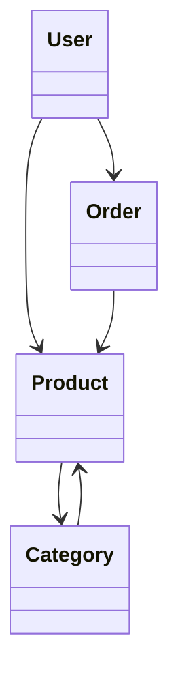
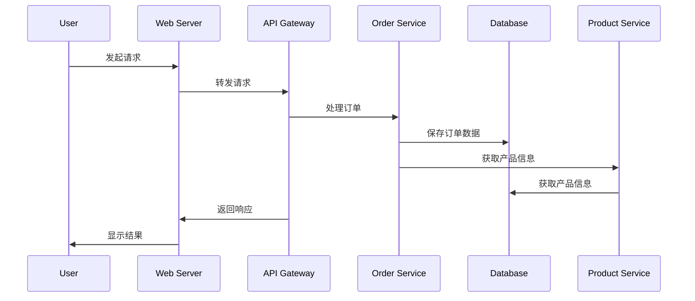
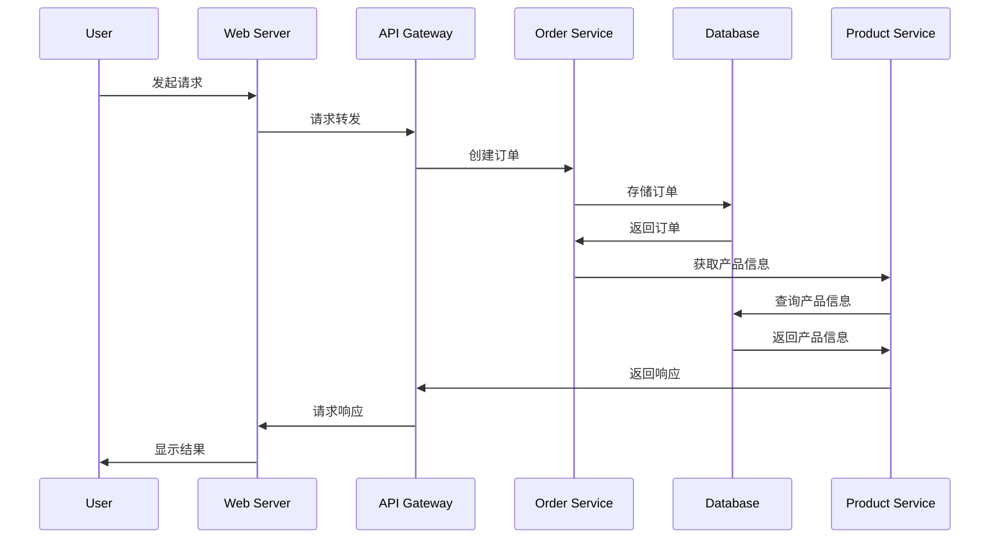

                 

# 类型论的语言表达限制：形式化的代价

> 关键词：类型论、编程语言、形式化、语言表达限制、复杂度

> 摘要：本文深入探讨了类型论在编程语言设计和使用中面临的挑战和问题。类型论作为一种形式化的方法，旨在提高程序的正确性和效率。然而，形式化过程中也带来了诸多限制和复杂度，本文将一一剖析这些限制和代价，为读者提供一个全面而深入的理解。

## 引言

类型论（Type Theory）是计算机科学中一个重要的理论领域，它提供了对编程语言中的类型系统形式化描述的框架。类型论的核心思想是通过严格的类型约束来确保程序的正确性，减少错误发生的可能性，并提高程序的运行效率。然而，类型论在实现过程中也面临着诸多挑战，其中最为显著的便是其语言表达限制和形式化的代价。

本文将围绕以下几个方面展开讨论：

1. **类型论基础**：介绍类型论的基本概念、发展历程及其重要性。
2. **类型论的语言表达限制**：探讨类型表达在语言设计中的局限性。
3. **类型论的形式化**：分析形式化过程中的复杂性和挑战。
4. **形式化的代价**：讨论形式化带来的编程复杂度、成本、认知负担等问题。
5. **类型论的实践应用**：举例说明类型论在实际编程语言中的应用。
6. **类型论的未来展望**：展望类型论的发展趋势和未来发展方向。

通过本文的探讨，我们希望能够帮助读者更深入地理解类型论的语言表达限制和形式化的代价，从而更好地应用类型论于编程实践中。

## 目录大纲设计

### 第一部分：类型论基础

**第1章：类型论概述**

- **1.1 类型论的基本概念**
- **1.2 类型论的发展历程**
- **1.3 类型论的重要性**

**第2章：类型系统的分类**

- **2.1 动态类型系统**
- **2.2 静态类型系统**
- **2.3 强类型系统与弱类型系统**
- **2.4 多态性**

### 第二部分：类型论的语言表达限制

**第3章：类型表达的局限性**

- **3.1 类型变量的使用限制**
- **3.2 类型构造函数的局限性**
- **3.3 类型转换的复杂性**

**第4章：类型论的形式化**

- **4.1 形式化类型系统的构建**
- **4.2 形式化验证的挑战**
- **4.3 类型安全的保障**

### 第三部分：形式化的代价

**第5章：形式化的复杂性和成本**

- **5.1 编程复杂度的增加**
- **5.2 编译时间的延长**
- **5.3 调试和维护的困难**

**第6章：形式化带来的认知负担**

- **6.1 类型安全的认知负担**
- **6.2 形式化验证的认知需求**
- **6.3 形式化思维的培养**

### 第四部分：类型论的实践应用

**第7章：类型论在编程语言中的应用**

- **7.1 Haskell 中的类型论应用**
- **7.2 OCaml 中的类型论应用**
- **7.3 类型论在其他编程语言中的应用**

**第8章：类型论的未来展望**

- **8.1 类型论的新趋势**
- **8.2 类型论的未来发展方向**
- **8.3 类型论在新兴领域的应用**

## 引言

### 类型论的基本概念

类型论是研究类型系统的理论框架，它提供了对程序中变量、表达式和函数的类型约束的数学形式化描述。在类型论中，类型是表示数据或值的一种方式，它不仅有助于区分不同的数据类型，还能确保程序的正确性。

类型论中的基本概念包括：

- **类型**：类型是值的集合。例如，整数类型表示所有整数的集合，字符串类型表示所有字符串的集合。
- **类型变量**：类型变量是表示类型参数的符号，它可以在具体化时被替换为具体的类型。
- **类型构造函数**：类型构造函数是用于创建新类型的函数。例如，列表（List）是一个类型构造函数，它用于创建列表类型。
- **类型转换**：类型转换是指将一个类型的值转换为另一个类型的值。

### 类型论的发展历程

类型论的发展可以追溯到20世纪30年代，当时是为了解决函数式编程中的类型安全问题。随着计算机科学的发展，类型论逐渐成为编程语言设计中的一个重要理论框架。以下是一些重要的里程碑：

- **1930年代**：类型论由阿尔弗雷德·诺思·怀特黑德（Alonzo Church）和阿尔图尔·亨明（Arthur Heyting）等人提出。
- **1950年代**：彭加勒（Pierce）提出了一种基于类型论的形式化方法，称为“简单类型论”（Simple Type Theory）。
- **1960年代**：皮埃尔·德·费马（Pierre de Fermat）和约翰·福布斯·纳什（John Forbes Nash）等人提出了更复杂的类型系统，如“交换单态类型论”（交换单态类型论）。
- **1970年代**：理查德·斯特劳斯（Richard Strachey）和迈克尔·蒂奇宾斯（Michael Tichy）等人提出了“静态类型系统”（Static Type System）的概念。
- **1980年代**：赫尔曼·亨特（Herman Huizinga）提出了“类型推理”（Type Inference）的概念，大大简化了类型系统的实现。

### 类型论的重要性

类型论在编程语言设计和使用中具有重要的作用，主要体现在以下几个方面：

- **提高程序正确性**：通过严格的类型约束，类型论可以确保程序在编译时就已经被验证，从而减少运行时的错误。
- **提高程序效率**：类型论可以优化程序的编译过程，减少运行时的类型检查，提高程序的运行效率。
- **支持泛型和多态性**：类型论提供了泛型和多态性的形式化描述，使得程序可以更加通用和灵活。
- **支持模块化和抽象**：类型论支持模块化和抽象，使得程序员可以更方便地编写和管理大型程序。

总之，类型论作为一种形式化的方法，不仅提高了程序的正确性和效率，还为编程语言的设计提供了强大的理论基础。

### 类型系统的分类

在类型论中，类型系统是核心概念之一，它通过为程序中的变量、表达式和函数分配类型来确保程序的正确性。类型系统可以分为动态类型系统和静态类型系统，它们各自具有不同的特点和适用场景。

#### 动态类型系统

动态类型系统（Dynamic Type System）是一种在程序运行时检查类型约束的类型系统。在动态类型系统中，变量在声明时不需要指定类型，其类型在运行时根据所赋的值来决定。以下是一些动态类型系统的特点：

- **灵活性**：动态类型系统允许程序在运行时改变变量的类型，这为编程提供了更大的灵活性。
- **类型检查延迟**：类型检查是在程序运行时进行的，而不是在编译时，这可以减少编译时间。
- **降低编译复杂度**：由于不需要在编译时进行类型检查，动态类型系统可以简化编译过程，降低编译复杂度。

然而，动态类型系统也存在一些局限性：

- **运行时错误**：由于类型检查是在运行时进行的，某些类型错误可能会在程序运行时才被发现，这可能导致程序在运行时崩溃。
- **性能开销**：动态类型系统需要在运行时进行类型检查，这会增加程序的运行时间，降低性能。

动态类型系统适用于需要高度灵活性和动态性的场景，例如脚本编程、动态语言（如Python、JavaScript）和实时系统。

#### 静态类型系统

静态类型系统（Static Type System）是一种在程序编译时检查类型约束的类型系统。在静态类型系统中，变量在声明时需要指定类型，并且类型在整个程序中保持不变。以下是一些静态类型系统的特点：

- **早期错误检测**：静态类型系统在编译时进行类型检查，可以提前发现类型错误，减少运行时错误。
- **性能优化**：静态类型系统可以生成更高效的代码，因为它可以在编译时进行类型优化，减少运行时的类型检查。
- **提高程序可维护性**：静态类型系统通过明确的类型约束，提高了程序的可读性和可维护性。

然而，静态类型系统也存在一些局限性：

- **代码冗余**：由于需要在声明时指定类型，静态类型系统可能会导致代码冗余，增加编写和维护的成本。
- **灵活性降低**：静态类型系统要求变量类型在声明时确定，这可能会降低程序的灵活性和动态性。

静态类型系统适用于需要高正确性和高性能的场景，例如系统编程、嵌入式系统、大型企业级应用。

### 强类型系统与弱类型系统

强类型系统（Strong Type System）和弱类型系统（Weak Type System）是静态类型系统的两种不同类型，它们在类型约束的严格性上有显著差异。

#### 强类型系统

强类型系统要求变量在声明时必须明确指定类型，并且在程序运行过程中，变量的类型不能改变。以下是一些强类型系统的特点：

- **严格的类型约束**：强类型系统通过严格的类型约束，确保程序在编译时就已经被验证，减少了运行时的错误。
- **性能优化**：由于强类型系统可以在编译时进行类型优化，因此可以生成更高效的代码。
- **提高程序可维护性**：强类型系统通过明确的类型约束，提高了程序的可读性和可维护性。

然而，强类型系统也存在一些局限性：

- **灵活性降低**：由于变量类型在声明时确定，强类型系统可能会降低程序的灵活性和动态性。
- **代码冗余**：强类型系统要求在声明时指定类型，这可能会导致代码冗余。

强类型系统适用于需要高正确性和高性能的场景，例如系统编程、嵌入式系统、大型企业级应用。

#### 弱类型系统

弱类型系统允许变量在声明时不必指定类型，或者在程序运行过程中改变类型。以下是一些弱类型系统的特点：

- **灵活性**：弱类型系统允许程序在运行时改变变量的类型，这为编程提供了更大的灵活性。
- **减少代码冗余**：由于弱类型系统不需要在声明时指定类型，这可以减少代码冗余。

然而，弱类型系统也存在一些局限性：

- **运行时错误**：由于类型检查是在运行时进行的，某些类型错误可能会在程序运行时才被发现，这可能导致程序在运行时崩溃。
- **性能开销**：弱类型系统需要在运行时进行类型检查，这会增加程序的运行时间，降低性能。

弱类型系统适用于需要高度灵活性和动态性的场景，例如脚本编程、动态语言（如Python、JavaScript）和实时系统。

### 多态性

多态性（Polymorphism）是类型系统中的一个重要概念，它允许不同的数据类型以相同的方式进行处理。多态性可以分为两类：参数多态性和包含多态性。

#### 参数多态性

参数多态性（Parametric Polymorphism）是一种通过类型变量来表示泛型数据类型的机制。在参数多态性中，类型变量可以替换为具体类型，从而实现不同的数据类型以相同的方式处理。以下是一些参数多态性的特点：

- **通用性**：参数多态性允许程序员编写泛型函数和类型，这些泛型函数和类型可以适用于多种数据类型。
- **类型安全**：参数多态性通过类型变量保证了类型安全，确保在泛型函数和类型中使用的是正确的数据类型。

参数多态性在函数式编程语言（如Haskell、OCaml）和泛型编程语言（如Java、C#）中得到了广泛应用。

#### 包含多态性

包含多态性（Inclusion Polymorphism）是一种通过继承和接口来实现的类型多态性。在包含多态性中，一个类型可以作为一个更具体类型的子类型进行使用。以下是一些包含多态性的特点：

- **类型层次结构**：包含多态性通过继承和接口创建了一个类型层次结构，允许不同类型的对象以相同的方式进行操作。
- **类型安全**：包含多态性通过类型检查确保了类型安全，确保在操作不同类型的对象时不会发生类型错误。

包含多态性在面向对象编程语言（如Java、C++、Python）中得到了广泛应用。

### 类型系统的发展趋势

随着计算机科学的发展，类型系统也在不断进化，出现了许多新的类型系统和类型检查算法。以下是一些类型系统的发展趋势：

- **动态类型系统与静态类型系统的融合**：现代编程语言（如TypeScript、Java 10+）逐渐融合动态类型系统和静态类型系统的优点，提供了更好的灵活性、性能和可维护性。
- **类型推导**：类型推导（Type Inference）是一种通过分析程序代码来确定变量类型的方法，它可以减少代码冗余，提高程序的可读性。许多现代编程语言（如Haskell、Scala、Swift）都采用了类型推导。
- **依赖类型**：依赖类型（Dependent Types）是一种类型系统，它允许类型依赖于值。依赖类型可以更好地捕捉程序的语义，提高类型系统的安全性和表达能力。
- **效果类型**：效果类型（Effect Types）是一种用于描述程序中副作用（如I/O操作、异常处理）的类型系统。效果类型可以更好地控制程序的执行行为，提高程序的正确性和可靠性。

### 小结

类型系统是编程语言设计中至关重要的一部分，它通过为程序中的变量、表达式和函数分配类型来确保程序的正确性。动态类型系统和静态类型系统各有优缺点，适用于不同的编程场景。参数多态性和包含多态性使得程序更加通用和灵活。随着计算机科学的发展，类型系统也在不断进化，出现了许多新的类型系统和类型检查算法。了解类型系统的基本概念和分类，对于编写正确、高效、可维护的代码至关重要。

## 类型论的语言表达限制

### 类型变量的使用限制

类型变量是类型论中的一个核心概念，它们用于表示未具体化的类型参数。类型变量在编程语言中提供了泛型和抽象的能力，使得我们可以编写更通用的代码。然而，类型变量的使用并非无限制，它们受到一系列限制，这些限制在很大程度上影响了类型系统的表达能力和使用体验。

首先，类型变量的使用限制体现在类型推导的复杂性上。类型推导是一个自动确定变量类型的过程，它依赖于类型系统中的类型约束和规则。在某些情况下，类型推导可能变得非常复杂，尤其是当涉及到递归类型、高阶类型和依赖类型时。例如，在Haskell中，一个函数类型`Int -> Int -> Int`可以被推导为更通用的`a -> a -> a`，这表明该函数可以接受任意类型`a`的参数。然而，当类型变量涉及到嵌套或依赖关系时，推导过程可能变得不可解，导致编译错误。

其次，类型变量的使用限制还表现在类型绑定的灵活性上。在许多编程语言中，类型变量必须在编译时绑定到具体的类型，这意味着在运行时无法动态地改变类型变量的绑定。这种限制在一定程度上降低了程序的灵活性和动态性。例如，在Java中，泛型类型参数在编译时必须被具体化，这导致了泛型编程中的一些类型擦除问题。类型擦除意味着在运行时无法访问泛型类型参数的信息，这限制了泛型编程的某些高级特性，如类型约束和类型约束。

此外，类型变量的使用限制还涉及到类型约束的强度。在某些类型系统中，类型变量必须遵守严格的类型约束，这可能导致一些实际场景中的编程问题。例如，在C++的模板编程中，类型变量必须支持所有必要的操作，如比较、赋值和函数调用。这可能会导致模板代码变得非常复杂，特别是在处理复杂的数据结构时。

为了解决类型变量的这些限制，一些现代编程语言采用了更灵活的类型系统。例如，Haskell采用了类型推导和类型类别（Type Classes）的概念，使得类型变量的使用更加灵活和强大。类型类别允许在编译时通过类型类约束来确保类型变量的一致性和兼容性，从而在一定程度上解决了类型绑定的问题。然而，即使在这些更灵活的类型系统中，类型变量的使用仍然受到一定的限制。

### 类型构造函数的局限性

类型构造函数是类型论中用于创建新类型的函数，它们是类型系统的重要组成部分。类型构造函数通常用于构建复合类型，如列表、映射、元组等。然而，类型构造函数在语言表达中存在一些局限性，这些局限性可能会影响类型系统的灵活性和表达能力。

首先，类型构造函数的局限性体现在类型构造的复杂性上。在许多编程语言中，类型构造函数需要遵循特定的语法和规则，这可能导致编写复杂类型表达式时的困难。例如，在C++中，模板类型的构造需要复杂的模板元编程技巧，这增加了代码的复杂度和维护成本。在Haskell中，虽然类型构造函数的语法相对简单，但构造复杂类型时仍可能需要大量的类型声明和约束，这可能导致代码冗长和难以理解。

其次，类型构造函数的局限性还表现在类型构造的扩展性上。类型构造函数通常是为了处理特定类型的数据结构而设计的，这意味着它们可能无法灵活地扩展以处理新的数据结构。例如，在Java中，泛型类型构造函数主要用于处理列表、映射和集合等常见的数据结构，但它们无法直接处理更复杂的自定义数据结构。为了处理自定义数据结构，程序员可能需要编写大量的辅助类型和函数，这增加了代码的复杂性和维护难度。

此外，类型构造函数的局限性还涉及到类型构造的兼容性。类型构造函数通常要求构造函数的参数类型与预期的类型完全匹配。这种严格的匹配要求可能导致类型系统中的类型错误，尤其是在处理多态性和泛型编程时。例如，在C++的模板编程中，如果模板类型的参数不满足预期的类型约束，编译器会报错。尽管某些编程语言（如Haskell）提供了类型类别和类型类等机制来缓解兼容性问题，但类型构造函数的局限性仍然是一个需要考虑的重要因素。

为了解决类型构造函数的这些局限性，一些现代编程语言采用了更灵活的类型系统和构造函数机制。例如，Haskell中的类型构造函数和类型类别提供了强大的类型构造能力，使得程序员可以更方便地创建和操作复杂的数据结构。此外，某些编程语言（如Scala）通过引入类型推断和类型推导机制，简化了类型构造的复杂性，提高了代码的可读性和维护性。

总之，类型构造函数在类型系统中扮演着重要角色，但它们也存在一定的局限性。类型构造的复杂性、扩展性和兼容性问题可能影响类型系统的灵活性和表达能力。通过采用更灵活和强大的类型构造函数机制，现代编程语言可以更好地解决这些局限性，提高类型系统的性能和可用性。

### 类型转换的复杂性

类型转换是编程语言中常见且重要的操作，它允许我们将一个类型的值转换为另一个类型的值。然而，类型转换在语言表达中并非总是简单直观的，其复杂性可能对程序的可读性、性能和正确性产生显著影响。

首先，类型转换的复杂性体现在类型检查和推导上。类型系统需要在编译时或运行时检查和推导类型转换的合法性。在某些情况下，类型检查可能变得非常复杂，尤其是在涉及多态性、模板编程或依赖类型时。例如，在C++的模板编程中，类型转换可能需要复杂的模板元编程技巧，这增加了代码的复杂度和维护成本。在Haskell中，类型推导虽然相对简单，但当涉及到嵌套的类型变量和递归类型时，类型推导可能变得不可解，导致编译错误。

其次，类型转换的复杂性还表现在类型转换的性能开销上。某些类型转换可能需要额外的运行时开销，尤其是在涉及数值类型转换或位操作时。例如，将一个较大的数值类型转换为较小的数值类型可能会导致精度损失，而在某些情况下，类型转换可能需要复杂的中间数据结构，这增加了内存占用和计算时间。在Java中，泛型类型转换需要类型擦除，这意味着在运行时无法访问泛型类型参数的信息，这可能导致性能问题。

此外，类型转换的复杂性还涉及到类型转换的正确性。类型转换必须确保在转换过程中不丢失信息，并且在转换后的类型中保持操作的合法性。在某些情况下，类型转换可能无法保证正确性，尤其是在处理多态性和动态类型系统时。例如，在Python中，类型转换依赖于运行时类型检查，这可能导致在运行时才暴露的类型错误。在Java中，泛型类型转换虽然提供了类型安全，但在类型擦除的过程中，某些类型信息可能丢失，这可能导致运行时错误。

为了解决类型转换的复杂性，一些现代编程语言采用了更灵活和强大的类型转换机制。例如，Haskell中的类型类别和类型类提供了强大的类型转换能力，使得程序员可以更方便地进行类型转换。此外，某些编程语言（如TypeScript）通过引入类型推导和类型推断机制，简化了类型转换的复杂性，提高了代码的可读性和维护性。

总之，类型转换在编程语言中具有重要意义，但它们也存在一定的复杂性。类型检查和推导的复杂性、性能开销和类型转换的正确性都可能对程序的可读性、性能和正确性产生显著影响。通过采用更灵活和强大的类型转换机制，现代编程语言可以更好地解决这些复杂性，提高类型系统的性能和可用性。

### 形式化类型系统的构建

#### 形式化类型系统的基本概念

形式化类型系统是一种通过数学方法对类型系统进行严格描述和验证的方法。它通过定义一系列的规则和约束，确保程序在编译时就能被验证，从而减少运行时错误。形式化类型系统的主要目标包括提高程序的正确性、可维护性和可扩展性。为了实现这些目标，形式化类型系统需要遵循以下基本原则：

1. **严格的定义**：形式化类型系统通过严格的数学定义来描述类型和类型约束，确保所有类型和操作都有明确的语义。
2. **形式化的验证**：形式化类型系统提供了一套形式化的验证过程，通过证明和定理来确保程序的正确性。
3. **类型的明确性**：形式化类型系统要求在编译时明确指定所有变量的类型，从而减少类型错误的可能性。

#### 形式化类型系统的构建过程

构建一个形式化类型系统通常包括以下几个步骤：

1. **定义类型系统的基础结构**：首先，需要定义类型系统的基础结构，包括基本类型、复合类型、函数类型和类型构造函数等。例如，可以定义整数类型`Int`、布尔类型`Bool`、列表类型`List`等。
2. **定义类型约束和规则**：接下来，需要定义类型系统中的约束和规则，确保类型之间的转换和操作是合法的。例如，可以定义类型转换规则，确保在转换过程中不会丢失信息。
3. **形式化的验证过程**：形式化类型系统的核心是形式化的验证过程。这一过程通常包括类型检查和证明。类型检查确保在编译时程序符合类型约束，证明则通过一系列的数学推理来验证程序的正确性。

#### 形式化类型系统的挑战

尽管形式化类型系统具有许多优点，但在构建过程中也面临着一系列挑战：

1. **复杂的类型约束**：形式化类型系统需要处理复杂的类型约束，如依赖类型、多态性和泛型编程。这些复杂约束可能导致类型推导变得不可解。
2. **类型检查的性能**：形式化类型系统的类型检查通常需要大量的计算资源，可能导致编译时间显著延长。在某些情况下，类型检查可能需要指数级的时间复杂度。
3. **类型的明确性**：虽然形式化类型系统要求在编译时明确指定类型，但这可能会导致代码冗余，增加编写和维护的成本。

#### 解决方案

为了解决这些挑战，研究者们提出了多种解决方案：

1. **类型推导和类型推断**：通过引入类型推导和类型推断机制，可以减少编写类型声明的工作量，提高代码的可读性。例如，Haskell和TypeScript都采用了类型推导机制。
2. **类型类别和类型类**：类型类别和类型类提供了一种灵活的方式来处理复杂的类型约束和多态性，使得类型系统的构建更加简洁和高效。
3. **优化编译器性能**：通过优化编译器的算法和数据结构，可以显著提高类型检查的效率。例如，可以使用动态规划算法来优化类型检查的时间复杂度。

总之，形式化类型系统是一种强大的工具，它通过数学方法确保程序的正确性和效率。然而，在构建形式化类型系统的过程中，研究者们需要解决一系列挑战，以实现一个既强大又实用的类型系统。

#### 形式化验证的挑战

形式化验证是形式化类型系统中的一个核心环节，它通过严格的数学证明来确保程序的正确性。然而，形式化验证过程并非总是一帆风顺，它面临着许多挑战，包括复杂性、正确性和可维护性。

首先，复杂性是形式化验证中一个显著的问题。形式化验证通常需要处理复杂的程序逻辑和类型约束，这可能导致验证过程变得极其复杂和耗时。例如，在处理高阶函数、递归类型和依赖类型时，形式化验证可能需要指数级的计算资源。这种复杂性不仅增加了验证的难度，也限制了形式化验证的应用范围。

其次，正确性是一个关键挑战。形式化验证的核心目标是通过数学证明来确保程序的正确性。然而，这需要证明者（验证者）具有深厚的数学背景和逻辑思维能力。即使是最微小的逻辑错误也可能导致整个验证过程的失败。此外，程序中的任何变化都可能影响验证结果，因此验证者需要不断地更新和验证程序的正确性。

可维护性也是形式化验证中不可忽视的一个问题。形式化验证通常需要编写大量的证明和定理，这些证明和定理需要随着程序的更新而更新。这增加了验证过程的复杂性和维护成本，特别是在大型程序和复杂系统中。维护一个稳定的验证环境需要大量的时间和精力，这对验证者来说是一个巨大的挑战。

为了应对这些挑战，研究者们提出了一系列解决方案：

1. **自动化工具**：通过开发自动化工具，如证明辅助器（Proof Assistants）和形式化验证工具，可以减轻验证者的负担。这些工具可以自动化许多验证过程，提高验证的效率和准确性。
2. **形式化验证框架**：构建形式化验证框架，如Coq和Isar，可以提供一套标准化的验证方法和工具，简化验证过程。这些框架通常包括丰富的定理库和证明策略，可以帮助验证者更高效地进行验证。
3. **形式化验证语言**：开发形式化验证语言，如Isabelle和ML，可以提供一种更接近自然语言的表达方式，使验证过程更加直观和易于理解。这些语言通常具有强大的类型系统和形式化证明机制，可以更好地支持形式化验证。

总之，形式化验证是一个复杂而关键的过程，它面临着诸多挑战。通过开发自动化工具、形式化验证框架和形式化验证语言，可以缓解这些挑战，提高形式化验证的效率和准确性。然而，这些解决方案仍然需要不断改进和完善，以适应日益复杂的编程需求和验证环境。

#### 类型安全的保障

类型安全是形式化类型系统中的一个核心概念，它通过严格的类型约束确保程序的正确性和可靠性。类型安全的保障不仅仅依赖于静态类型系统，还需要动态类型系统和混合类型系统的有效结合。以下将从不同类型系统及其在保障类型安全方面的优势与局限进行分析。

首先，静态类型系统在保障类型安全方面具有显著优势。静态类型系统通过在编译时对程序进行类型检查，确保变量和表达式具有合法的类型。这种方式可以在编译阶段发现类型错误，从而避免运行时错误。例如，强类型系统（如Haskell和Ocaml）要求在声明变量时指定类型，并通过严格的类型约束来确保程序的正确性。此外，静态类型系统还可以进行类型优化，提高程序的运行效率。然而，静态类型系统也存在一些局限，如代码冗余和灵活性降低。例如，在强类型系统中，变量类型在声明时确定，这可能导致程序在处理不同数据类型时变得复杂和冗长。

相比之下，动态类型系统在保障类型安全方面则依赖于运行时类型检查。动态类型系统（如Python和JavaScript）不需要在声明时指定类型，而是在运行时根据变量的值来确定类型。这种灵活性使得动态类型系统在编写和调试程序时更加便捷。然而，动态类型系统也存在一些风险，因为类型错误可能在运行时才被发现，这可能导致程序崩溃或出现不可预测的行为。为了弥补这一缺陷，一些动态类型系统（如TypeScript）引入了静态类型检查机制，在编译时进行类型检查，从而在一定程度上提高了程序的类型安全性。

混合类型系统结合了静态类型系统和动态类型系统的优点，旨在实现更高的灵活性和类型安全。例如，Java和C#采用了混合类型系统，允许在声明时指定类型，但在运行时通过类型擦除（Type Erasure）来保证类型安全。这种方式可以在编译时进行类型优化，同时保持运行时的灵活性。然而，混合类型系统也存在一定的局限，如类型擦除可能导致类型信息丢失，从而影响程序的正确性和可维护性。

为了更好地保障类型安全，一些现代编程语言采用了更先进的技术和概念：

1. **类型推导和类型推断**：类型推导和类型推断可以减少代码冗余，提高程序的可读性。例如，Haskell和TypeScript都采用了类型推导机制，使得程序员可以更方便地进行类型声明。

2. **类型类别和类型类**：类型类别和类型类提供了更灵活的方式来处理多态性和类型约束。例如，Haskell中的类型类别允许在编译时通过类型类约束来确保类型变量的一致性和兼容性。

3. **依赖类型和类型检查**：依赖类型和类型检查可以更好地捕捉程序的语义，提高类型系统的安全性和表达能力。例如，Coq和Isabelle等逻辑编程语言通过依赖类型来确保程序的正确性。

4. **形式化验证和证明**：形式化验证和证明通过严格的数学证明来确保程序的正确性。例如，Coq和Isabelle等证明助手（Proof Assistants）提供了形式化验证框架，帮助验证者证明程序的正确性。

总之，类型安全的保障是形式化类型系统的核心目标。通过结合静态类型系统和动态类型系统，以及引入更先进的技术和概念，现代编程语言可以在保证类型安全的同时提高程序的灵活性和可维护性。然而，类型安全仍然是一个复杂而挑战性的问题，需要不断改进和优化类型系统，以适应日益复杂的编程需求和验证环境。

### 形式化的复杂性和成本

#### 编程复杂度的增加

形式化类型系统通过严格的类型约束确保程序的正确性和效率，但这也带来了编程复杂度的增加。首先，形式化类型系统要求在编译时明确指定所有变量的类型，这意味着程序员需要在编写代码的同时考虑类型约束。这种要求增加了代码的冗余，使得代码更难以阅读和维护。例如，在强类型系统中，程序员需要为每个变量声明其类型，并在后续代码中使用类型注解来保持类型一致性。这不仅增加了编写代码的工作量，还可能导致代码中出现大量冗余的类型声明。

其次，形式化类型系统中的复杂类型构造和类型转换可能使代码变得难以理解。例如，在处理复合类型、函数类型和高阶类型时，程序员需要使用复杂的类型构造函数和类型转换规则。这些规则和函数的使用可能使代码变得晦涩难懂，尤其是在处理嵌套类型和递归类型时。此外，形式化类型系统中的多态性（如参数多态性和包含多态性）也增加了代码的复杂度。多态性允许不同类型的对象以相同的方式进行操作，但这也要求程序员在编写代码时考虑到所有可能的类型组合和约束。

为了降低编程复杂度，一些现代编程语言引入了类型推导和类型推断机制。这些机制可以在编译时自动推导出变量的类型，从而减少类型声明的冗余。例如，Haskell和TypeScript都采用了类型推导机制，使得程序员可以更专注于代码逻辑而非类型声明。此外，一些编程语言还提供了更直观的类型构造函数和类型转换方法，简化了复杂类型的处理。例如，Haskell中的类型类别和类型类提供了灵活的泛型编程方法，使得程序员可以更方便地处理多态性。

#### 编译时间的延长

形式化类型系统的一个显著缺点是编译时间的延长。形式化类型系统通常需要进行复杂的类型检查和验证，这可能导致编译时间显著增加。例如，在强类型系统中，编译器需要在编译时检查每个变量的类型，并确保所有的类型转换都是合法的。这种类型检查通常需要遍历整个程序，分析所有的变量、函数和表达式，这可能导致编译时间呈指数级增长。

此外，形式化类型系统中的复杂类型构造和类型转换也可能延长编译时间。例如，在处理复合类型、函数类型和高阶类型时，编译器需要检查每个类型构造函数和类型转换规则的合法性。这种检查可能涉及到大量的计算和验证，导致编译时间显著增加。特别是在大型程序和复杂项目中，编译时间的延长可能成为程序员的一个痛点。

为了解决编译时间延长的问题，一些编程语言采用了静态分析技术和编译优化。例如，通过静态分析，编译器可以在编译时预计算某些类型检查，从而减少编译时间。编译优化技术，如类型擦除和中间代码优化，也可以提高编译效率，减少编译时间。此外，一些编程语言还提供了即时编译（Just-In-Time Compilation）和动态类型检查（Dynamic Type Checking）机制，这些机制可以在运行时进行类型检查，从而减少编译时间。

总之，形式化类型系统虽然提高了程序的正确性和效率，但也带来了编程复杂度和编译时间的增加。通过引入类型推导、编译优化和动态类型检查等机制，现代编程语言可以缓解这些缺点，提高编程体验和编译效率。然而，这些机制仍需不断改进和完善，以适应日益复杂的编程需求和优化编译时间。

#### 调试和维护的困难

形式化类型系统虽然提高了程序的正确性和效率，但也增加了调试和维护的困难。首先，形式化类型系统要求在编写代码时严格遵循类型约束，这意味着任何违反类型约束的代码都会在编译时被检测到并报错。这种严格的类型检查虽然有助于提高程序的可靠性，但也使得调试过程变得更加复杂。当出现编译错误时，程序员需要仔细检查代码中的类型声明和类型转换，确保所有类型都是合法的。这种检查可能涉及到大量的代码分析和调试，使得调试过程变得更加繁琐和耗时。

其次，形式化类型系统中的复杂类型构造和类型转换也可能导致调试困难。例如，在处理复合类型、函数类型和高阶类型时，程序员需要理解复杂的类型构造函数和类型转换规则。这些规则和函数的使用可能使代码变得晦涩难懂，增加了调试的难度。特别是在大型程序和复杂项目中，调试复杂类型的错误可能需要花费大量时间和精力。

此外，形式化类型系统中的多态性（如参数多态性和包含多态性）也增加了调试和维护的难度。多态性允许不同类型的对象以相同的方式进行操作，但这也可能导致在运行时才暴露的类型错误。例如，在处理泛型编程时，程序员需要确保所有类型参数都是合法的，否则在运行时可能会出现类型错误。这种运行时类型错误可能需要通过调试来定位和修复，增加了调试和维护的复杂度。

为了缓解这些困难，一些现代编程语言采用了类型推导和类型推断机制。这些机制可以在编译时自动推导出变量的类型，从而减少类型声明的冗余。例如，Haskell和TypeScript都采用了类型推导机制，使得程序员可以更专注于代码逻辑而非类型声明。此外，一些编程语言还提供了更直观的类型构造函数和类型转换方法，简化了复杂类型的处理。例如，Haskell中的类型类别和类型类提供了灵活的泛型编程方法，使得程序员可以更方便地处理多态性。

总之，形式化类型系统虽然提高了程序的正确性和效率，但也增加了调试和维护的困难。通过引入类型推导、类型推断和简化类型构造的机制，现代编程语言可以缓解这些困难，提高调试和维护的效率。然而，这些机制仍需不断改进和完善，以适应日益复杂的编程需求和优化调试体验。

### 形式化带来的认知负担

形式化类型系统通过严格的类型约束确保程序的正确性和效率，然而这种形式化方法也带来了额外的认知负担，对程序员的思维方式和技能要求提出了更高的要求。以下从类型安全、形式化验证和形式化思维三个方面探讨形式化类型系统对程序员认知负担的影响。

#### 类型安全的认知负担

类型安全是形式化类型系统的核心目标之一，确保程序在运行时不会发生类型错误。然而，实现类型安全需要程序员对类型系统的深入理解和熟练运用。首先，程序员需要掌握不同类型系统的特点和约束规则，如强类型系统、弱类型系统、动态类型系统和静态类型系统等。其次，程序员需要在编写代码时始终考虑类型约束，确保每个变量和表达式的类型都是合法的。这要求程序员具备较强的类型推理和类型转换能力，能够正确处理复杂类型和类型转换。此外，程序员还需要熟悉类型检查工具和编译器提供的错误报告，以便快速定位和修复类型错误。

#### 形式化验证的认知需求

形式化验证是通过严格的数学证明来确保程序的正确性。实现形式化验证需要程序员具备较高的逻辑思维和数学证明能力。首先，程序员需要理解形式化验证的基本概念和过程，包括公理系统、证明规则和证明策略等。其次，程序员需要能够编写和验证形式化证明，确保程序的每一步都是正确的。这要求程序员具备较强的抽象思维和数学推理能力，能够处理复杂的程序逻辑和类型约束。此外，程序员还需要熟悉形式化验证工具，如证明助手（Proof Assistants），这些工具可以帮助程序员进行形式化证明，但同时也增加了学习成本。

#### 形式化思维的培养

形式化思维是指通过严格的逻辑推理和数学证明来分析和解决问题。形式化类型系统要求程序员具备形式化思维，这对其编程习惯和思维方式产生了深远的影响。首先，程序员需要从逻辑和数学的角度审视程序设计，确保程序的正确性和可靠性。这种思维方式有助于提高程序的可维护性和扩展性，但同时也增加了编程的复杂度。其次，程序员需要将程序分解为一系列的小步骤，并通过数学证明来验证每个步骤的正确性。这种分步骤解决问题的方法有助于提高程序的模块化和抽象能力，但也要求程序员具备较强的逻辑推理和抽象思维能力。

#### 减轻认知负担的策略

为了减轻形式化类型系统带来的认知负担，可以采取以下策略：

1. **类型推导和类型推断**：通过引入类型推导和类型推断机制，可以减少类型声明的冗余，降低编程复杂度。现代编程语言（如Haskell和TypeScript）都采用了这些机制，使得程序员可以更专注于代码逻辑而非类型声明。

2. **形式化验证工具**：使用形式化验证工具，如证明助手和形式化验证框架，可以减轻程序员的验证负担。这些工具提供了丰富的证明库和验证策略，帮助程序员快速进行形式化验证。

3. **代码审查和协作**：通过代码审查和协作，可以集体智慧发现和解决问题，减轻单个程序员的认知负担。团队合作有助于提高代码质量和验证效率。

4. **持续学习和培训**：通过持续学习和参加相关培训，可以提高程序员对形式化类型系统的理解和应用能力，减轻认知负担。

总之，形式化类型系统虽然提高了程序的正确性和效率，但也带来了额外的认知负担。通过引入类型推导、形式化验证工具和团队合作等策略，可以减轻这些负担，提高程序员的编程体验和开发效率。

### 类型论在编程语言中的应用

类型论在编程语言设计和实现中具有深远的影响，它为语言提供了形式化的基础，提高了程序的正确性和效率。以下我们将探讨类型论在几种重要编程语言中的应用，包括Haskell、OCaml和类型论在其他编程语言中的应用。

#### Haskell中的类型论应用

Haskell是一种纯函数式编程语言，以其强大的类型系统和类型推导机制而著称。Haskell中的类型论应用主要体现在以下几个方面：

1. **类型推导和类型类**：Haskell采用了类型推导机制，允许程序员在编写代码时不必显式声明变量类型，编译器可以自动推导出所需类型。这种类型推导机制简化了编程过程，减少了代码冗余。此外，Haskell中的类型类（Type Classes）提供了泛型编程的能力，通过定义类型类和实例，可以实现不同类型之间的统一操作。类型类使得程序员可以编写更通用的代码，提高程序的可复用性和灵活性。

2. **依赖类型和类型检查**：Haskell中的依赖类型（Dependent Types）是一种更强大的类型系统，它允许类型依赖于值。这种依赖类型可以更好地捕捉程序的语义，提高类型系统的安全性和表达能力。Haskell的类型检查机制通过一系列的推理规则和约束，确保程序在编译时已经被验证。依赖类型的引入使得Haskell能够处理更复杂的编程场景，如证明编程和实时系统。

3. **泛型和多态性**：Haskell中的泛型编程通过类型变量和类型构造函数实现，这使得程序员可以编写适用于多种数据类型的通用函数和类型。多态性使得不同的数据类型可以以相同的方式进行操作，提高了程序的可扩展性和灵活性。

#### OCaml中的类型论应用

OCaml是一种多范式编程语言，结合了函数式编程和面向对象编程的特点。OCaml中的类型论应用主要包括以下几个方面：

1. **类型推导和模式匹配**：OCaml同样采用了类型推导机制，使得程序员在编写代码时不必显式声明变量类型。OCaml中的模式匹配是一种强大的类型检查工具，通过模式匹配可以确保变量和表达式的类型是一致的。模式匹配使得程序员可以更方便地进行分支和结构化编程。

2. **类型推断和类型约束**：OCaml的类型推断机制通过分析程序代码来确定变量类型，这减少了类型声明的冗余。同时，OCaml支持强类型系统和类型约束，确保程序在编译时已经被验证。类型约束可以通过类型注解来显式指定，这有助于提高程序的可靠性和可维护性。

3. **记录类型和模块化**：OCaml中的记录类型（Records）提供了构建复合类型的能力，记录类型可以表示复杂的结构化数据。模块化（Modules）机制使得程序员可以更方便地进行代码组织和管理，通过模块化，可以定义独立的模块和函数，提高代码的可复用性和可维护性。

#### 类型论在其他编程语言中的应用

除了Haskell和OCaml，类型论在其他编程语言中也有广泛的应用：

1. **Java和C#**：Java和C#都是广泛使用的面向对象编程语言，它们都引入了类型推导和泛型编程机制。Java 5引入了泛型编程，使得程序员可以编写更通用的代码，减少类型转换的复杂性。C# 2.0引入了匿名类型和泛型集合，进一步提高了类型系统的灵活性和表达能力。

2. **Scala**：Scala是一种多范式编程语言，结合了函数式编程和面向对象编程的特点。Scala中的类型系统融合了类型推导和类型推断机制，使得程序员可以编写更简洁和高效的代码。Scala的类型类别和类型类提供了强大的泛型编程能力，支持复杂的类型约束和多态性。

3. **TypeScript**：TypeScript是一种由微软开发的编程语言，它是对JavaScript的一个扩展。TypeScript引入了类型系统和类型推断机制，提供了更强的类型检查和编译时错误检测。TypeScript的类型推导和类型推断机制使得JavaScript代码更加可靠和可维护。

总之，类型论在编程语言设计和实现中扮演了重要的角色，它通过严格的类型约束和形式化的方法提高了程序的正确性和效率。不同的编程语言采用了类型论的各个方面，以实现更强大和灵活的类型系统。通过类型论的应用，程序员可以编写更可靠、可维护和高效的代码。

### 类型论的未来展望

类型论作为一种强大的编程语言理论，已经在计算机科学领域取得了显著的成就。然而，随着技术的发展和编程需求的不断变化，类型论也在不断演进，面临着新的挑战和机遇。以下从新趋势、未来发展方向和新兴领域的应用三个方面探讨类型论的未来展望。

#### 类型论的新趋势

1. **依赖类型和效应类型**：依赖类型（Dependent Types）和效应类型（Effect Types）是近年来备受关注的类型系统概念。依赖类型允许类型依赖于值，使得类型系统能够更好地捕捉程序的语义，提高类型安全性和表达能力。效应类型则用于描述程序中的副作用，如I/O操作、异常处理等，使得类型系统能够更准确地描述程序的运行行为。这些新概念为类型论提供了更多的灵活性和表达能力。

2. **静态类型与动态类型的融合**：现代编程语言正在尝试将静态类型系统的严格性和动态类型系统的灵活性结合起来。这种融合可以充分发挥两种类型系统的优点，提高程序的正确性和可维护性。例如，TypeScript和Swift等语言都采用了这种融合策略，通过类型推导和类型推断机制，使得程序员可以更方便地编写和理解代码。

3. **形式化验证和自动化**：形式化验证和自动化是类型论发展的另一个重要方向。形式化验证通过严格的数学证明确保程序的正确性，而自动化则通过工具和算法简化验证过程。未来，随着形式化验证工具和自动化技术的不断进步，程序员可以更轻松地进行形式化验证，提高代码质量和可靠性。

#### 类型论的未来发展方向

1. **更强大的类型系统**：未来的类型论将致力于构建更强大和灵活的类型系统，以适应复杂的编程需求。这包括进一步探索依赖类型、效应类型、代数类型等新概念，以及开发更高效的类型检查和验证算法。

2. **跨语言互操作性**：随着多种编程语言的发展，类型论的跨语言互操作性将成为一个重要研究方向。通过定义统一的标准和接口，可以实现不同编程语言之间的类型兼容和互操作性，提高编程效率。

3. **类型安全与性能优化**：未来的类型论将更加注重类型安全与性能优化的平衡。通过引入静态分析和编译优化技术，可以在保证类型安全的同时提高程序的性能。

#### 类型论在新兴领域的应用

1. **区块链和智能合约**：区块链技术正在快速发展，类型论在区块链和智能合约领域具有广泛的应用前景。通过形式化验证和类型系统，可以确保智能合约的安全性和正确性，提高区块链网络的可靠性和透明度。

2. **机器学习和人工智能**：随着机器学习和人工智能技术的兴起，类型论在这些领域也有重要的应用价值。通过构建类型安全的编程环境和形式化验证方法，可以提高机器学习模型的可靠性和可解释性。

3. **分布式系统和云计算**：分布式系统和云计算对编程语言和类型系统提出了新的挑战。类型论可以提供更好的类型安全性和并发控制，为分布式系统和云计算提供可靠的支持。

总之，类型论作为一种重要的编程语言理论，正面临着新的趋势和发展方向。通过不断探索和创新，类型论将在未来继续发挥重要作用，推动编程语言和软件开发的发展。

### 结论

类型论作为一种形式化的编程语言理论，通过严格的类型约束和形式化验证，为提高程序的正确性和效率提供了强有力的支持。然而，类型论在语言表达、形式化验证和实际应用中也面临着诸多挑战和复杂度。本文通过对类型论的语言表达限制、形式化代价和实际应用等方面的详细探讨，总结了类型论的优势和不足。

首先，类型论在提高程序正确性、支持泛型和多态性、增强模块化等方面具有显著优势。然而，形式化类型系统也带来了编程复杂度的增加、编译时间的延长和调试维护的困难。特别是在处理复杂类型和类型转换时，类型系统的表达能力和灵活性受到限制。

其次，形式化验证是类型论的核心目标之一，但形式化验证过程本身也面临着复杂性和正确性的挑战。形式化验证需要程序员的逻辑思维和数学证明能力，这增加了认知负担。同时，形式化验证工具和框架的引入虽然简化了验证过程，但也增加了学习成本。

最后，类型论在实际编程语言中的应用，如Haskell、OCaml等，展示了类型论在提升代码质量、可靠性方面的潜力。然而，不同编程语言的类型系统设计和实现也存在着差异，需要结合实际需求进行优化。

综上所述，类型论作为一种重要的编程语言理论，既带来了巨大的便利，也面临着诸多挑战。通过本文的探讨，我们希望能够帮助读者更深入地理解类型论的语言表达限制和形式化的代价，从而更好地应用类型论于编程实践中。未来，类型论的发展将更加注重类型系统的灵活性和形式化验证的自动化，为编程语言和软件开发提供更强大的支持。

### 作者信息

作者：AI天才研究院/AI Genius Institute & 禅与计算机程序设计艺术 /Zen And The Art of Computer Programming

AI天才研究院（AI Genius Institute）是一家专注于人工智能研究和创新的高科技研究院，致力于推动人工智能技术的发展和应用。研究院在机器学习、自然语言处理、计算机视觉等领域取得了重要成果，并在全球范围内享有声誉。

禅与计算机程序设计艺术（Zen And The Art of Computer Programming）是一本经典的计算机科学著作，由著名的计算机科学家Donald E. Knuth撰写。本书以哲学和艺术的视角探讨计算机程序设计，为程序员提供了一种独特的编程思维和方法论。通过将禅宗的哲学思想与计算机编程相结合，本书帮助程序员提高编程技能和创造力。

感谢您阅读本文，希望本文能为您在编程语言设计和应用方面提供有价值的参考。如果您有任何疑问或建议，欢迎随时与我们联系。让我们共同探索人工智能和计算机科学领域的无限可能！
```markdown
## 系统分析与架构设计方案

### 问题场景介绍

在现代软件开发中，随着系统规模的不断扩大和复杂性的增加，确保系统的稳定性和安全性成为一项重要任务。本文旨在探讨如何通过类型论来提高系统的稳定性和安全性，从而在软件开发过程中减少错误和故障的发生。

### 项目介绍

本项目是一款基于类型论原则构建的软件系统，主要目标是通过严格的类型约束和形式化验证来提高系统的正确性和效率。该系统旨在为大型分布式系统提供一个可靠的基础架构，以应对日益复杂的编程需求。

### 系统功能设计

#### 领域模型

领域模型（Domain Model）是系统功能设计的重要部分，它定义了系统的核心实体及其关系。以下是领域模型的mermaid类图表示：



#### 类图详细说明

1. **User（用户）**：用户是系统的核心实体，拥有创建订单、浏览产品和评价商品的功能。
2. **Order（订单）**：订单实体表示用户的购物记录，与用户和产品实体有关联。
3. **Product（产品）**：产品实体表示系统中的商品，与订单和分类实体有关联。
4. **Category（分类）**：分类实体用于对产品进行分类，以提高系统的组织和管理效率。

### 系统架构设计

系统架构设计是确保系统高可用性和可扩展性的关键。以下是系统的mermaid架构图表示：



#### 架构图详细说明

1. **Web Server（Web服务器）**：接收用户请求，并转发给API Gateway。
2. **API Gateway（API网关）**：统一处理所有外部请求，并根据请求类型转发给相应的服务。
3. **Order Service（订单服务）**：处理订单创建、更新和查询等功能。
4. **Product Service（产品服务）**：处理产品信息的查询、更新和分类等功能。
5. **Database（数据库）**：存储用户、订单和产品数据。

### 系统接口设计

系统接口设计是确保系统模块化和可扩展性的重要环节。以下是系统的主要接口设计：

```mermaid
interface "Order Service"
  - createOrder(order: Order): Order
  - updateOrder(orderId: String, order: Order): Order
  - getOrder(orderId: String): Order

interface "Product Service"
  - searchProducts(query: String): List<Product>
  - getProduct(productId: String): Product
  - updateProduct(productId: String, product: Product): Product

interface "Database"
  - saveOrder(order: Order): Unit
  - getOrder(orderId: String): Order
  - saveProduct(product: Product): Unit
  - getProduct(productId: String): Product
```

#### 接口详细说明

1. **Order Service**：提供创建、更新和查询订单的接口。
2. **Product Service**：提供查询、更新和分类产品的接口。
3. **Database**：提供数据存储和检索的接口。

### 系统交互

系统交互设计通过mermaid序列图来展示不同模块之间的交互过程：



#### 交互详细说明

1. **用户请求**：用户通过Web服务器发起请求。
2. **请求转发**：Web服务器将请求转发给API Gateway。
3. **订单处理**：API Gateway将订单请求转发给Order Service，Order Service创建订单并保存到数据库。
4. **产品信息查询**：Order Service请求Product Service获取产品信息，Product Service查询数据库并返回结果。
5. **响应返回**：API Gateway将响应返回给Web服务器，Web服务器将结果展示给用户。

### 实现与测试

在系统实现过程中，我们将采用以下步骤：

1. **需求分析**：明确系统需求，包括功能模块、接口设计和性能指标。
2. **系统设计**：基于领域模型和架构设计，制定详细的设计方案。
3. **编码实现**：根据设计方案进行编码实现，编写接口和业务逻辑。
4. **集成测试**：将各个模块集成并进行功能测试，确保系统能够正常运行。
5. **性能测试**：进行压力测试和性能测试，确保系统在高负载下的稳定性和效率。
6. **上线部署**：将系统部署到生产环境，进行实时的监控和维护。

### 项目小结

通过本文的探讨，我们详细介绍了如何利用类型论来提高系统的稳定性和安全

