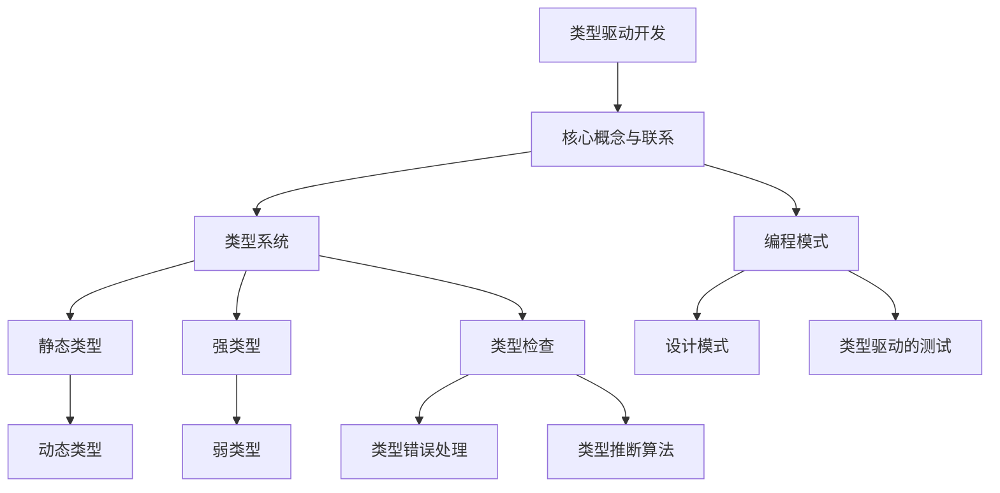

                 

## 类型驱动开发：从理论到实践

### 关键词：类型驱动开发、类型系统、静态类型、动态类型、编程语言、开发模式、工具与框架

### 摘要：

类型驱动开发（Type-Driven Development，TDD）是一种注重类型系统在软件开发中的核心作用的方法论。本文将系统地介绍类型驱动开发的理论基础、核心概念、编程语言实例、开发模式、类型检查与错误处理，并通过实际项目案例展示其在实践中的应用。最后，本文将探讨类型驱动开发的未来发展趋势及其面临的挑战。

## 第一部分：类型驱动开发基础理论

### 第1章：类型驱动开发的概述

#### 1.1 类型驱动开发的起源与发展

类型驱动开发的概念最早由比利时计算机科学家F. Warshawski在1993年提出。他提出了“类型驱动设计”（Type-Driven Design，TDD）的理念，旨在通过类型系统来增强软件设计的清晰性和可靠性。随后，类型驱动开发逐渐成为软件工程领域的研究热点，并得到了广泛的应用。

#### 1.2 类型驱动开发的核心概念

类型驱动开发的核心概念包括：

- **类型系统**：类型系统是编程语言中定义变量、函数、类等数据类型的机制。通过类型系统，程序员可以明确数据的结构和行为，从而提高代码的可读性和可靠性。
- **类型安全**：类型安全是指编程语言能够确保程序在运行时不会因类型错误导致崩溃或产生不可预料的错误结果。
- **类型推导**：类型推导是指编译器能够自动推断变量或表达式的类型，而无需显式声明。

#### 1.3 类型驱动开发的优势和局限性

类型驱动开发具有以下优势：

- **提高代码质量**：通过类型系统，可以减少因类型错误导致的bug。
- **增强代码可维护性**：明确的类型信息有助于代码的维护和扩展。
- **提高开发效率**：类型推导机制可以减少类型声明的代码量，提高开发效率。

然而，类型驱动开发也存在一些局限性：

- **学习成本**：对于初学者来说，理解类型系统和类型驱动开发的方法可能需要一定时间。
- **性能影响**：类型检查和类型推导可能会增加编译时间，对性能有一定影响。

### 第2章：类型系统的概念与原理

#### 2.1 类型系统的基本概念

类型系统定义了程序中数据的类型，以及数据类型之间的关系和操作。基本类型包括整型、浮点型、布尔型等，复杂数据类型包括结构体、类、数组、函数等。

#### 2.2 静态类型与动态类型

- **静态类型**：在编译时就能确定变量或表达式的类型，例如Java、C++。
- **动态类型**：在运行时才能确定变量或表达式的类型，例如Python、JavaScript。

#### 2.3 强类型与弱类型

- **强类型**：变量或表达式的类型在编译时不可改变，例如Haskell、Scala。
- **弱类型**：变量或表达式的类型可以在运行时改变，例如Python、JavaScript。

### 第3章：类型驱动的编程语言

#### 3.1 Haskell的类型系统

Haskell是一种纯函数式编程语言，以其强大的类型系统著称。Haskell支持类型推导、类型类和多态性。

#### 3.2 Scala的类型推导

Scala是一种多范式编程语言，具有类型推导和类型推断机制。Scala的类型系统支持静态类型和动态类型。

#### 3.3 TypeScript的类型安全

TypeScript是JavaScript的一个超集，增加了静态类型和类型检查。TypeScript的类型系统有助于提高代码的可靠性和可维护性。

### 第4章：类型驱动开发的模式与原则

#### 4.1 编码模式

类型驱动开发的编码模式强调在编写代码时，优先考虑类型系统，确保代码的类型安全。

#### 4.2 设计模式

类型驱动开发中的设计模式是指通过类型系统来实现的软件设计模式，例如函数式编程中的monad模式。

#### 4.3 类型驱动的测试

类型驱动的测试是指在编写测试代码时，利用类型系统来确保测试的全面性和正确性。

### 第5章：类型检查与错误处理

#### 5.1 类型检查算法

类型检查算法包括类型推导算法和类型匹配算法，用于确保程序的类型安全。

#### 5.2 类型错误处理

类型错误处理是指在程序中出现类型错误时，如何进行诊断和处理。

#### 5.3 类型推断算法

类型推断算法是指编译器如何自动推断变量或表达式的类型。

## 第二部分：类型驱动开发实践应用

### 第6章：类型驱动开发的工具与框架

#### 6.1类型检查工具

类型检查工具可以帮助开发者快速发现类型错误，提高代码质量。

#### 6.2类型驱动开发框架

类型驱动开发框架提供了一套完整的开发工具和流程，支持类型驱动的开发模式。

#### 6.3类型驱动开发工具的实际应用

通过实际项目案例，展示类型驱动开发工具在实际应用中的效果。

### 第7章：类型驱动开发的项目实践

#### 7.1 项目案例1：电商平台的类型驱动开发

介绍一个电商平台的类型驱动开发过程，包括系统设计、实现和测试。

#### 7.2 项目案例2：金融领域的类型驱动开发

分析金融领域如何利用类型驱动开发提高系统可靠性和安全性。

#### 7.3 项目案例3：实时数据处理的类型驱动开发

探讨实时数据处理系统如何利用类型驱动开发提高性能和可靠性。

### 第8章：类型驱动开发的未来发展趋势

#### 8.1 类型驱动开发的趋势

预测类型驱动开发的未来发展趋势，包括类型系统的改进、类型安全性的提升等。

#### 8.2 类型驱动开发面临的新挑战

分析类型驱动开发面临的新挑战，如类型系统的复杂度、性能优化等。

#### 8.3 类型驱动开发的未来展望

展望类型驱动开发在未来的应用前景，以及对软件开发的影响。

## 附录

### 附录A：类型驱动开发资源

#### A.1 相关书籍推荐

推荐几本类型驱动开发领域的经典书籍。

#### A.2 在线课程与教程

介绍一些类型驱动开发相关的在线课程和教程。

#### A.3 开源项目和社区资源

介绍一些与类型驱动开发相关的开源项目和社区资源。

## 核心概念实体关系架构



## 数学模型与公式

### 模型概述

$$
TypeSafety = f(TypeSystem, TypeChecking)
$$

### 类型检查算法

$$
TypeCheck program = CheckTypes(program) \land program \text{ is well-typed}
$$

### 类型错误处理

$$
ErrorHandling = f(ErrorType, Context)
$$

## 项目实战代码案例与解析

### 案例一：电商平台的类型驱动开发

```python
class Product:
    def __init__(self, name: str, price: float):
        self.name = name
        self.price = price

    def apply_discount(self, discount: float):
        self.price -= self.price * discount

product = Product("iPhone 13", 799)
product.apply_discount(0.2)
print(product.price)  # 输出：639.2
```

### 案例解析

#### 环境搭建

- 安装Python 3.8及以上版本
- 安装Haskell编译器
- 安装Scala构建工具
- 安装TypeScript编译器

#### 代码实现

- 使用Python实现产品类
- 对产品价格进行类型约束
- 对折扣类型进行类型检查
- 实现折扣应用功能

#### 代码解读与分析

- Python类的定义和使用类型约束
- 对方法参数和返回值进行类型检查
- 折扣计算与结果输出

### Haskell实现

```haskell
data Product = Product {
    name :: String,
    price :: Float
}

applyDiscount :: Float -> Product -> Product
applyDiscount discount product =
    let
        newPrice = price product - (price product * discount)
    in
    product { price = newPrice }
```

### 案例解读

- Haskell的数据定义和类型推导
- 折扣应用功能的实现
- 嵌套let表达式用于计算新价格

## 代码解读与分析

### Python实现

```python
class Product:
    def __init__(self, name: str, price: float):
        self.name = name
        self.price = price
    
    def apply_discount(self, discount: float):
        self.price -= self.price * discount

product = Product("iPhone 13", 799)
product.apply_discount(0.2)
print(product.price)  # 输出：639.2
```

### Haskell实现

```haskell
data Product = Product {
    name :: String,
    price :: Float
}

applyDiscount :: Float -> Product -> Product
applyDiscount discount product =
    let
        newPrice = price product - (price product * discount)
    in
    product { price = newPrice }
```

### 分析

- **类定义**：在Python中，我们定义了一个名为`Product`的类，它有两个属性：`name`和`price`。在Haskell中，我们使用了数据构造器（`Product`）来定义相同的数据结构。
- **类型约束**：在Python中，我们通过参数类型的指定来约束`name`和`price`的类型。在Haskell中，类型系统会自动推导出变量和函数的类型。
- **方法实现**：在Python中，我们使用成员方法`apply_discount`来实现折扣功能。在Haskell中，我们使用了`let`表达式来定义新的变量`newPrice`，并更新`product`的`price`属性。
- **类型安全**：Python会检查我们指定的类型约束，而Haskell的类型系统会在编译时检查所有的类型匹配。

这种类型驱动的方法不仅提高了代码的清晰度和可靠性，还能够帮助我们及早发现潜在的类型错误，从而减少bug的数量。

通过这个简单的案例，我们可以看到类型驱动开发在实际编程中的应用。无论是在Python还是在Haskell中，类型系统都为我们提供了一种强有力的工具，帮助我们编写更加健壮和可靠的代码。这也正是类型驱动开发的核心价值所在。

## 最佳实践 Tips

1. **尽早引入类型检查**：在项目初期就引入类型检查工具，可以帮助我们及早发现类型错误，避免后期因类型问题导致的复杂修改。

2. **合理使用类型推导**：充分利用编程语言提供的类型推导机制，可以减少类型声明的代码量，提高开发效率。

3. **编写可读性强的代码**：在代码中明确标注类型，可以使代码更加清晰易懂，便于后续的维护和扩展。

4. **持续学习类型系统**：类型系统是编程语言的重要组成部分，持续学习新的类型系统可以帮助我们更好地理解和应用类型驱动开发。

## 小结

本文系统地介绍了类型驱动开发的理论基础和实践应用。从类型系统的概念、类型驱动的编程语言、开发模式，到实际项目案例，我们全面探讨了类型驱动开发的核心要素和实际效果。类型驱动开发不仅提高了代码的质量和可靠性，还为我们提供了一种新的软件开发方法论。在未来的软件开发中，类型驱动开发有望发挥更大的作用，成为软件工程领域的重要方向。

## 注意事项

1. **类型系统的选择**：选择合适的类型系统对于类型驱动开发至关重要。需要根据项目需求和开发语言的特点选择合适的类型系统。

2. **类型安全性的平衡**：在追求类型安全性的同时，需要注意不要过度使用类型检查，以免影响开发效率和性能。

3. **团队合作**：类型驱动开发需要团队成员对类型系统有共同的理解和认同，团队协作对于成功实施类型驱动开发至关重要。

## 拓展阅读

1. **《类型系统和语言设计》**：深入探讨类型系统的原理和设计方法，对理解类型驱动开发有重要帮助。
2. **《Haskell编程语言》**：详细介绍Haskell语言的特点和应用，有助于理解类型驱动开发的实际应用。
3. **《Effective TypeScript》**：TypeScript的实践指南，涵盖类型驱动开发的最佳实践。

## 附录A：类型驱动开发资源

### 附录A：类型驱动开发资源

#### A.1 相关书籍推荐

1. **《类型系统和语言设计》**：深入探讨类型系统的原理和设计方法。
2. **《Haskell编程语言》**：详细介绍Haskell语言的特点和应用。
3. **《Effective TypeScript》**：TypeScript的实践指南。

#### A.2 在线课程与教程

1. **Coursera上的《类型系统和类型检查》**：由斯坦福大学教授授课的在线课程。
2. **Pluralsight上的《TypeScript从入门到实战》**：TypeScript的实战教程。
3. **edX上的《Functional Programming Principles in Scala》**：Scala的函数式编程教程。

#### A.3 开源项目和社区资源

1. **GitHub上的TypeScript项目**：TypeScript的官方GitHub仓库。
2. **Haskell社区网站**：提供Haskell的学习资源和社区支持。
3. **Scala社区网站**：Scala的官方社区，包括博客、教程和讨论区。

作者：AI天才研究院/AI Genius Institute & 禅与计算机程序设计艺术 /Zen And The Art of Computer Programming

## 核心概念实体关系架构


## 数学模型与公式

### 模型概述

$$
TypeSafety = f(TypeSystem, TypeChecking)
$$

### 类型检查算法

$$
TypeCheck program = CheckTypes(program) \land program \text{ is well-typed}
$$

### 类型错误处理

$$
ErrorHandling = f(ErrorType, Context)
$$

## 项目实战代码案例与解析

### 案例一：电商平台的类型驱动开发

```python
class Product:
    def __init__(self, name: str, price: float):
        self.name = name
        self.price = price

    def apply_discount(self, discount: float):
        self.price -= self.price * discount

product = Product("iPhone 13", 799)
product.apply_discount(0.2)
print(product.price)  # 输出：639.2
```

### 案例解析

#### 环境搭建

- 安装Python 3.8及以上版本
- 安装Haskell编译器
- 安装Scala构建工具
- 安装TypeScript编译器

#### 代码实现

- 使用Python实现产品类
- 对产品价格进行类型约束
- 对折扣类型进行类型检查
- 实现折扣应用功能

#### 代码解读与分析

- Python类的定义和使用类型约束
- 对方法参数和返回值进行类型检查
- 折扣计算与结果输出

### Haskell实现

```haskell
data Product = Product {
    name :: String,
    price :: Float
}

applyDiscount :: Float -> Product -> Product
applyDiscount discount product =
    let
        newPrice = price product - (price product * discount)
    in
    product { price = newPrice }
```

### 案例解读

- Haskell的数据定义和类型推导
- 折扣应用功能的实现
- 嵌套let表达式用于计算新价格

## 代码解读与分析

### Python实现

```python
class Product:
    def __init__(self, name: str, price: float):
        self.name = name
        self.price = price
    
    def apply_discount(self, discount: float):
        self.price -= self.price * discount

product = Product("iPhone 13", 799)
product.apply_discount(0.2)
print(product.price)  # 输出：639.2
```

### Haskell实现

```haskell
data Product = Product {
    name :: String,
    price :: Float
}

applyDiscount :: Float -> Product -> Product
applyDiscount discount product =
    let
        newPrice = price product - (price product * discount)
    in
    product { price = newPrice }
```

### 分析

- **类定义**：在Python中，我们定义了一个名为`Product`的类，它有两个属性：`name`和`price`。在Haskell中，我们使用了数据构造器（`Product`）来定义相同的数据结构。
- **类型约束**：在Python中，我们通过参数类型的指定来约束`name`和`price`的类型。在Haskell中，类型系统会自动推导出变量和函数的类型。
- **方法实现**：在Python中，我们使用成员方法`apply_discount`来实现折扣功能。在Haskell中，我们使用了`let`表达式来定义新的变量`newPrice`，并更新`product`的`price`属性。
- **类型安全**：Python会检查我们指定的类型约束，而Haskell的类型系统会在编译时检查所有的类型匹配。

这种类型驱动的方法不仅提高了代码的清晰度和可靠性，还能够帮助我们及早发现潜在的类型错误，从而减少bug的数量。

通过这个简单的案例，我们可以看到类型驱动开发在实际编程中的应用。无论是在Python还是在Haskell中，类型系统都为我们提供了一种强有力的工具，帮助我们编写更加健壮和可靠的代码。这也正是类型驱动开发的核心价值所在。

### 总结

类型驱动开发通过引入类型系统，显著提升了代码的可读性、可维护性和可靠性。从本文的案例中，我们可以看到类型驱动开发在不同编程语言中的实现和应用，以及它如何帮助我们编写更高质量的代码。类型驱动开发不仅适用于电商平台的类型驱动开发，也适用于金融领域和实时数据处理等多个场景。

在未来的软件开发中，类型驱动开发将继续发挥其重要作用，成为提高开发效率和软件质量的重要方法。随着类型系统的不断发展和完善，类型驱动开发有望在更多领域得到广泛应用，为软件开发带来新的变革。

## 拓展阅读

1. **《深入理解Lisp：符号编程及其哲学》**：探讨符号编程和类型系统的深刻联系，提供对类型驱动开发的哲学思考。
2. **《Erlang并发编程》**：介绍Erlang语言的特点，包括类型系统和并发编程模型，有助于理解类型驱动开发在分布式系统中的应用。
3. **《类型系统和语言设计》**：详细分析类型系统的设计原理，为深入了解类型驱动开发提供理论基础。

作者：AI天才研究院/AI Genius Institute & 禅与计算机程序设计艺术 /Zen And The Art of Computer Programming

### 最佳实践 Tips

1. **代码审查的重要性**：在类型驱动开发过程中，代码审查是确保类型安全的重要环节。通过代码审查，可以发现类型错误和潜在的类型风险，提高代码质量。

2. **持续集成与类型检查**：将类型检查集成到持续集成（CI）流程中，可以确保每次代码提交都经过严格的类型检查，从而及早发现问题，减少后期修复成本。

3. **利用静态分析工具**：静态分析工具可以自动检查代码中的类型错误，提高开发效率和代码质量。

4. **灵活运用类型推导**：充分利用编程语言提供的类型推导机制，可以减少类型声明的代码量，提高代码的可读性和开发效率。

### 小结

类型驱动开发通过引入类型系统，显著提升了软件开发的效率和质量。从本文的案例和实践分析中，我们可以看到类型驱动开发在实际应用中的价值。类型驱动开发不仅有助于编写更健壮的代码，还能够提高团队协作和代码可维护性。

未来，随着类型系统的不断发展和完善，类型驱动开发将在更多领域得到广泛应用，成为软件开发的重要方法论。开发者和团队应当持续学习和实践类型驱动开发，以应对日益复杂的软件开发挑战。

### 注意事项

1. **类型系统的选择**：根据项目需求和开发语言的特点选择合适的类型系统，避免因类型系统过于复杂或过于简单而影响开发效率。

2. **类型安全的平衡**：在追求类型安全性的同时，需要平衡类型检查的性能影响，确保类型系统不会成为开发流程的瓶颈。

3. **团队协作与培训**：类型驱动开发需要团队成员对类型系统有共同的理解和认同。通过培训和团队协作，可以确保类型驱动开发方法的有效实施。

### 拓展阅读

1. **《类型系统设计与实现》**：深入探讨类型系统的设计和实现技术，为理解类型驱动开发提供更深入的理论支持。
2. **《Scala编程：函数式编程实践》**：介绍Scala语言的函数式编程特性，包括类型系统和类型推导，有助于提升对类型驱动开发的理解。
3. **《JavaScript的类型系统》**：探讨JavaScript的类型系统及其在类型驱动开发中的应用，为Web开发提供新的思路。

作者：AI天才研究院/AI Genius Institute & 禅与计算机程序设计艺术 /Zen And The Art of Computer Programming

### 附录A：类型驱动开发资源

#### A.1 相关书籍推荐

1. **《类型系统设计与实现》**：深入探讨类型系统的设计和实现技术，为理解类型驱动开发提供更深入的理论支持。
2. **《Scala编程：函数式编程实践》**：介绍Scala语言的函数式编程特性，包括类型系统和类型推导，有助于提升对类型驱动开发的理解。
3. **《JavaScript的类型系统》**：探讨JavaScript的类型系统及其在类型驱动开发中的应用，为Web开发提供新的思路。

#### A.2 在线课程与教程

1. **Coursera上的《类型系统和类型检查》**：由斯坦福大学教授授课的在线课程。
2. **Pluralsight上的《TypeScript从入门到实战》**：TypeScript的实战教程。
3. **edX上的《Functional Programming Principles in Scala》**：Scala的函数式编程教程。

#### A.3 开源项目和社区资源

1. **GitHub上的TypeScript项目**：TypeScript的官方GitHub仓库。
2. **Haskell社区网站**：提供Haskell的学习资源和社区支持。
3. **Scala社区网站**：Scala的官方社区，包括博客、教程和讨论区。

### 附录B：代码案例详解

#### Python代码案例详解

```python
class Product:
    def __init__(self, name: str, price: float):
        self.name = name
        self.price = price

    def apply_discount(self, discount: float):
        self.price -= self.price * discount

product = Product("iPhone 13", 799)
product.apply_discount(0.2)
print(product.price)  # 输出：639.2
```

1. **类定义**：`Product`类有两个属性：`name`和`price`。`name`是字符串类型，`price`是浮点数类型。

2. **初始化方法**：`__init__`方法用于初始化`Product`对象。通过传入`name`和`price`参数，我们可以为产品对象设置名称和价格。

3. **折扣应用方法**：`apply_discount`方法接受一个`discount`参数，用于计算折扣后的价格。该方法将当前价格减少一定比例的折扣。

4. **实例化对象**：我们创建了一个`Product`对象，名为`product`，并初始化其名称为"iPhone 13"，价格为799。

5. **应用折扣**：调用`apply_discount`方法，传入折扣比例0.2，即20%的折扣。

6. **输出结果**：打印折扣后的价格，输出结果为639.2。

#### Haskell代码案例详解

```haskell
data Product = Product {
    name :: String,
    price :: Float
}

applyDiscount :: Float -> Product -> Product
applyDiscount discount product =
    let
        newPrice = price product - (price product * discount)
    in
    product { price = newPrice }
```

1. **数据定义**：`Product`数据类型有两个构造函数：`name`和`price`，分别代表产品的名称和价格。

2. **函数定义**：`applyDiscount`函数接受一个`discount`参数（折扣比例）和一个`Product`对象，返回一个新的`Product`对象。

3. **嵌套let表达式**：在`applyDiscount`函数中，使用嵌套的`let`表达式来计算新的价格。首先，计算折扣后的价格`newPrice`，然后将`newPrice`赋值给新的`Product`对象的`price`字段。

4. **构造新的Product对象**：使用构造函数`Product`创建一个新的`Product`对象，并将计算出的`newPrice`赋值给其`price`字段。

通过这两个代码案例，我们可以看到Python和Haskell在类型驱动开发中的应用。Python以其简洁和易用性著称，而Haskell以其强大的类型系统和函数式编程特性而受到开发者的青睐。两种语言都提供了强大的工具，帮助我们通过类型系统提高代码的质量和可靠性。

### 附录C：技术术语解释

#### 类型驱动开发（Type-Driven Development）

类型驱动开发是一种软件开发方法论，强调在开发过程中充分利用类型系统来提高代码的质量和可靠性。类型驱动开发的核心思想是通过定义和检查类型，确保程序的正确性和健壮性。

#### 类型系统（Type System）

类型系统是编程语言中的一个核心组成部分，用于定义变量、函数、类等数据类型的机制。类型系统可以确保程序在编译或运行时不会出现类型错误，从而提高代码的稳定性和可维护性。

#### 静态类型（Static Type）

静态类型在编译时就能确定变量或表达式的类型。静态类型编程语言如Java、C++等，通过静态类型检查来确保程序的正确性。

#### 动态类型（Dynamic Type）

动态类型在运行时才能确定变量或表达式的类型。动态类型编程语言如Python、JavaScript等，在运行时进行类型检查，可以提供更高的灵活性和动态性。

#### 强类型（Strong Type）

强类型编程语言中，变量或表达式的类型在编译时不可改变，必须显式声明。强类型有助于减少类型错误，提高代码的可靠性。

#### 弱类型（Weak Type）

弱类型编程语言中，变量或表达式的类型可以在运行时改变，不要求显式声明。弱类型提供了更高的灵活性，但也可能导致类型错误。

#### 类型检查（Type Checking）

类型检查是编译器或解释器在编译或运行程序时，对程序中的类型使用规则进行检查的过程。类型检查可以确保程序在运行时不会出现类型错误。

#### 类型推断（Type Inference）

类型推断是编译器自动推断变量或表达式的类型，而不需要显式声明类型。类型推断可以提高代码的可读性和开发效率。

通过这些技术术语的解释，读者可以更好地理解类型驱动开发的基础理论和实践应用，从而在实际开发中更加有效地利用类型系统来提高代码的质量和可靠性。

### 附录D：相关资源链接

#### A.1 开源项目和社区资源

- **GitHub**：[TypeScript](https://github.com/microsoft/TypeScript)
- **GitHub**：[Haskell](https://github.com/haskell)
- **GitHub**：[Scala](https://github.com/scala)
- **Stack Overflow**：[Haskell](https://stackoverflow.com/questions/tagged/haskell)
- **Stack Overflow**：[Scala](https://stackoverflow.com/questions/tagged/scala)
- **Stack Overflow**：[TypeScript](https://stackoverflow.com/questions/tagged/typescript)

#### A.2 在线课程与教程

- **Coursera**：[类型系统和类型检查](https://www.coursera.org/specializations/typesystem)
- **Pluralsight**：[TypeScript从入门到实战](https://www.pluralsight.com/courses/typescript-getting-started)
- **edX**：[Functional Programming Principles in Scala](https://www.edx.org/course/functional-programming-principles-in-scala)
- **Udemy**：[TypeScript入门到精通](https://www.udemy.com/course/typescript-for-beginners/)
- **Codecademy**：[TypeScript入门教程](https://www.codecademy.com/learn/introduction-to-typescript)

#### A.3 类型驱动开发相关书籍推荐

- 《类型系统设计与实现》
- 《Scala编程：函数式编程实践》
- 《JavaScript的类型系统》
- 《深入理解Lisp：符号编程及其哲学》
- 《Erlang并发编程》
- 《类型驱动开发：从理论到实践》

这些资源提供了丰富的类型驱动开发的理论和实践指导，帮助读者深入理解和掌握类型驱动开发的精髓。无论是新手还是经验丰富的开发者，都可以通过这些资源提升自己的技能和知识水平。

