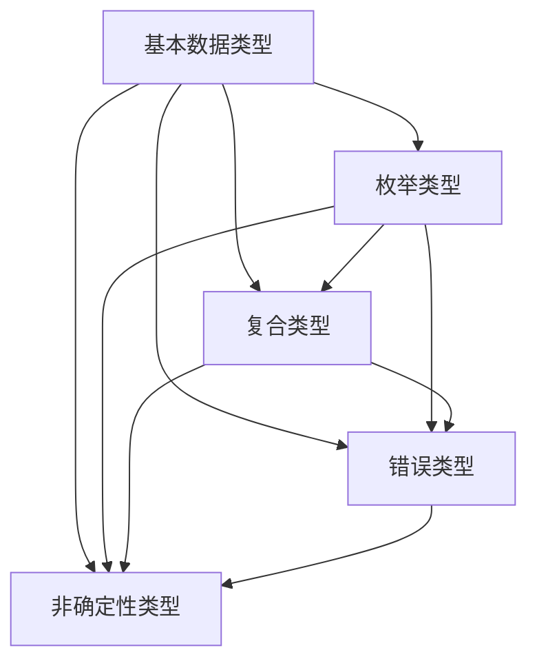
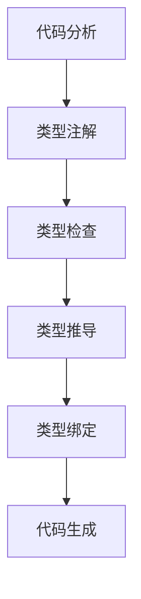
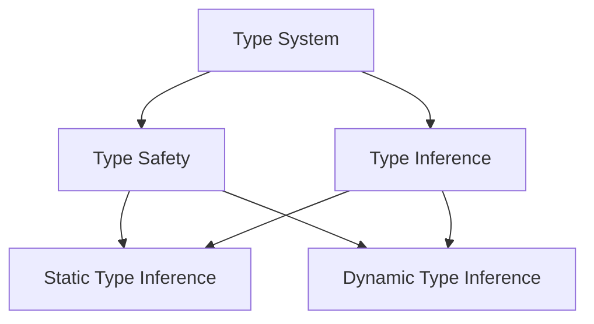
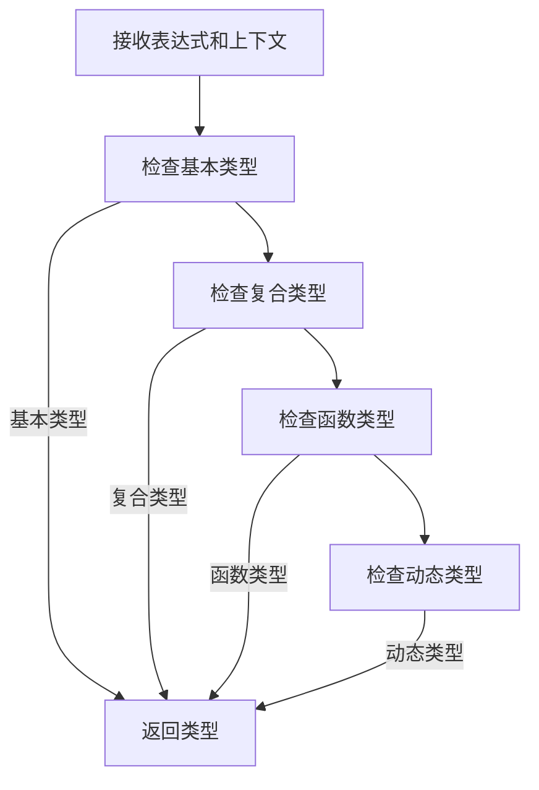
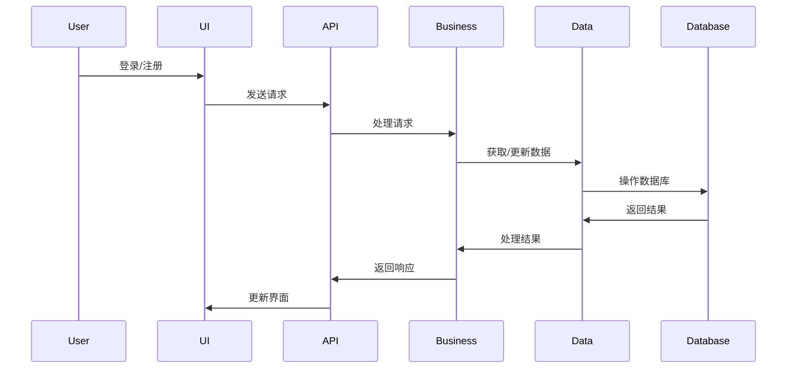
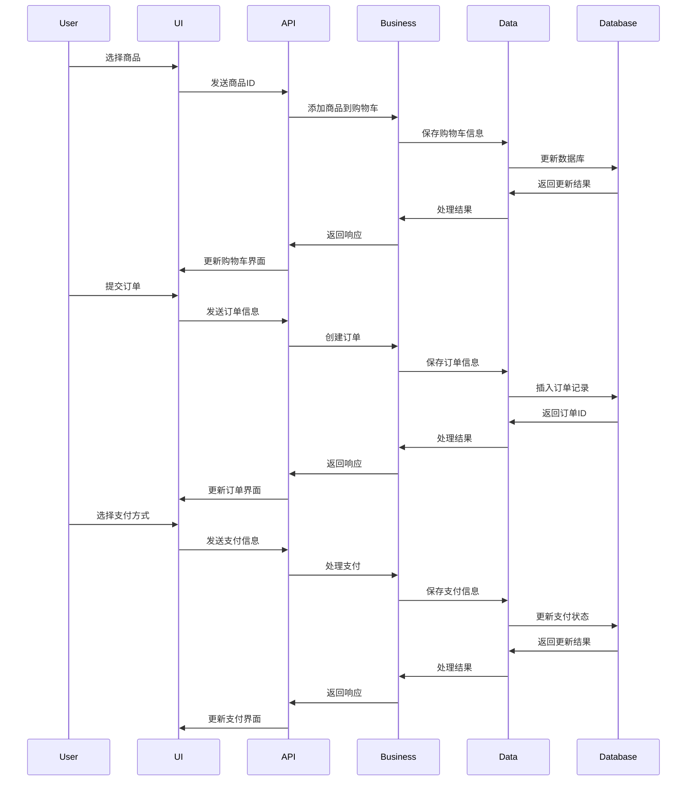

                 

### 《类型驱动开发：从理论到实践》

> 关键词：类型驱动开发、类型系统、类型安全、类型推导、面向对象编程、函数式编程

> 摘要：本文旨在深入探讨类型驱动开发（Type-Driven Development, TDD）的理论与实践。类型驱动开发是一种通过类型系统来指导软件开发的方法，旨在提高代码的可维护性和安全性。本文将首先介绍类型驱动开发的基础知识，包括类型系统的基础、类型安全与类型推导机制。随后，将详细探讨类型驱动开发在面向对象编程和函数式编程中的应用。此外，还将分析类型驱动开发中的设计模式与框架，以及类型检查工具与语言特性。最后，通过案例研究和未来趋势展望，进一步展示类型驱动开发的实际应用和价值。

## 第一部分：类型驱动开发基础

### 第1章：类型驱动开发概述

#### 1.1 类型驱动开发的概念与意义

类型驱动开发（Type-Driven Development, TDD）是一种以类型系统为核心的开发方法。类型系统是一种用于描述数据类型和操作的语言结构。在类型驱动开发中，类型系统不仅用于表示数据类型，还用于指导软件开发的过程。这种方法强调通过类型系统来确保代码的正确性和安全性。

类型驱动开发的意义在于：

1. **提高代码质量**：类型系统能够在编译或运行时检测出类型错误，从而减少运行时错误的发生。
2. **提高开发效率**：通过明确的类型注解，可以减少对变量的猜测和类型转换，提高代码的可读性和可维护性。
3. **增强代码安全性**：类型系统可以帮助防止非法数据访问和操作，减少安全漏洞。

#### 1.2 类型驱动开发的发展历程

类型驱动开发的概念可以追溯到20世纪60年代。当时，编程语言如ALGOL和PL/I引入了形式化的类型系统。随着面向对象编程和函数式编程的发展，类型系统逐渐成为编程语言的核心组成部分。

进入21世纪，随着静态类型检查和动态类型检查技术的发展，类型驱动开发得到了广泛应用。现代编程语言如Java、C#、Haskell等，都具备强大的类型系统，支持类型驱动开发。

#### 1.3 类型驱动开发与传统开发方法的对比

传统开发方法通常依赖于运行时错误检测和调试，而类型驱动开发则通过类型系统在编译或运行时进行类型检查。这种对比可以从以下几个方面进行：

1. **错误检测时机**：传统方法在运行时检测错误，而类型驱动开发在编译时或运行时检测错误。
2. **错误成本**：运行时错误可能导致严重的系统故障，而编译时错误可以在早期发现和修复。
3. **开发效率**：类型驱动开发通过明确的类型注解和类型检查，减少了对变量的猜测和类型转换，提高开发效率。
4. **代码质量**：类型驱动开发通过类型系统确保代码的正确性和安全性，提高代码质量。

### 第2章：类型系统基础

#### 2.1 基本类型系统

基本类型系统是类型驱动开发的基础。基本类型系统包括基本数据类型、枚举类型和复合类型。

##### 2.1.1 基本数据类型

基本数据类型是编程语言中最基本的数据类型，如整数（int）、浮点数（float）、布尔值（bool）等。基本数据类型在类型系统中起着重要作用，是所有复杂类型的基础。

##### 2.1.2 枚举类型

枚举类型是一种用于表示固定集合的数据类型。例如，可以用枚举类型表示一周的七天内的一天。枚举类型在类型系统中用于表示有限集，有助于减少错误和增强代码可读性。

##### 2.1.3 复合类型

复合类型是由基本类型或枚举类型组合而成的类型。常见的复合类型包括数组、结构体（struct）、类（class）等。复合类型在类型系统中用于表示复杂的数据结构，有助于提高代码的可维护性和可重用性。

#### 2.2 类型安全与类型推导

类型安全是类型驱动开发的核心概念之一。类型安全确保程序在运行时不会出现类型错误，从而提高代码的可靠性和安全性。

##### 2.2.1 错误类型

错误类型是一种特殊的类型，用于表示可能发生的错误。通过引入错误类型，可以在类型系统中表示异常处理，提高代码的健壮性。

##### 2.2.2 非确定性类型

非确定性类型是一种不确定类型的表示。非确定性类型通常用于表示不确定的数据类型，如函数指针、泛型等。非确定性类型在类型系统中用于处理复杂的数据类型和动态类型绑定。

##### 2.2.3 类型推导机制

类型推导是类型驱动开发中的关键机制。类型推导是指通过分析代码来确定变量和表达式的类型。类型推导可以分为静态类型推导和动态类型推导。

- **静态类型推导**：在编译时通过类型注解和分析来确定变量和表达式的类型。
- **动态类型推导**：在运行时通过类型检查和分析来确定变量和表达式的类型。

#### 2.3 类型系统的基础概念联系

类型系统的基础概念包括基本数据类型、枚举类型、复合类型、错误类型和非确定性类型。这些概念相互关联，共同构成了类型系统的核心。

以下是一个Mermaid流程图，展示了这些概念之间的联系：



### 第3章：类型安全与类型推导

#### 3.1 类型安全的概念

类型安全是指编程语言或系统在运行时能够保证变量或表达式遵循其声明的类型。类型安全确保程序不会因类型错误而导致不可预期的行为或崩溃。

类型安全的主要目的是：

1. **防止类型错误**：确保变量或表达式在使用时具有正确的类型。
2. **提高代码可靠性**：通过类型检查减少运行时错误。
3. **增强代码可维护性**：明确的类型注解和类型检查有助于代码的理解和维护。

#### 3.2 错误类型

错误类型是一种特殊的数据类型，用于表示可能发生的错误。错误类型通常由编程语言提供，以支持异常处理和错误管理。

错误类型的主要特点包括：

1. **表示错误**：错误类型用于表示程序运行过程中可能发生的错误。
2. **异常处理**：通过错误类型，可以方便地进行异常处理，从而提高程序的健壮性。
3. **类型安全**：错误类型在类型系统中具有明确的意义和类型约束，确保错误处理的正确性。

#### 3.3 类型推导机制

类型推导是指通过分析代码来确定变量和表达式的类型。类型推导可以分为静态类型推导和动态类型推导。

##### 3.3.1 静态类型推导

静态类型推导是在编译时通过类型注解和分析来确定变量和表达式的类型。静态类型推导的优点包括：

1. **早期错误检测**：在编译时可以检测出类型错误，从而减少运行时错误。
2. **性能优化**：静态类型推导有助于编译器进行性能优化。
3. **代码可读性**：明确的类型注解有助于代码的理解和维护。

##### 3.3.2 动态类型推导

动态类型推导是在运行时通过类型检查和分析来确定变量和表达式的类型。动态类型推导的优点包括：

1. **灵活性**：动态类型推导允许在运行时改变变量的类型。
2. **减少冗余代码**：不需要显式指定类型注解，减少了代码的冗余。
3. **适合动态语言**：动态类型推导更适合动态语言，如Python、JavaScript等。

#### 3.4 类型推导机制的Mermaid流程图

以下是一个Mermaid流程图，展示了类型推导机制的步骤和过程：



### 第4章：面向对象编程中的类型驱动

#### 4.1 类与对象

类（Class）是面向对象编程（Object-Oriented Programming, OOP）中的核心概念。类是对象的模板，用于定义对象的结构和行为。对象（Object）是类的实例，是实际存在的实体。

##### 4.1.1 类的定义与使用

类是用关键字`class`定义的，包括属性（attributes）和方法（methods）。属性是类的成员变量，用于存储对象的状态。方法是实现类行为的方法。

以下是一个简单的类定义示例：

```python
class Person:
    def __init__(self, name, age):
        self.name = name
        self.age = age
    
    def introduce(self):
        print(f"Hello, my name is {self.name} and I am {self.age} years old.")
```

在这个示例中，`Person` 类有两个属性 `name` 和 `age`，以及一个方法 `introduce`，用于打印个人信息。

##### 4.1.2 对象的创建与操作

对象的创建是通过类的方法 `__new__` 或 `__init__` 来实现的。创建对象后，可以通过访问对象的属性和方法来操作对象。

以下是一个创建对象并调用方法的示例：

```python
p = Person("Alice", 30)
p.introduce()  # 输出：Hello, my name is Alice and I am 30 years old.
```

在这个示例中，我们创建了一个 `Person` 类的对象 `p`，并通过调用 `introduce` 方法打印了个人信息。

#### 4.2 继承与多态

继承（Inheritance）和多态（Polymorphism）是面向对象编程的两个核心特性。

##### 4.2.1 继承的实现机制

继承是一种通过创建新类来扩展现有类的方法。新类称为子类（subclass），现有类称为父类（superclass）。

以下是一个简单的继承示例：

```python
class Student(Person):
    def __init__(self, name, age, school):
        super().__init__(name, age)
        self.school = school
    
    def introduce(self):
        print(f"Hello, my name is {self.name} and I am {self.age} years old. I study at {self.school}.")
```

在这个示例中，`Student` 类继承了 `Person` 类，并添加了一个新的属性 `school`。同时，重写了 `introduce` 方法以包含学校信息。

##### 4.2.2 多态的概念与应用

多态（Polymorphism）是指不同的对象可以响应相同的消息，但表现出不同的行为。多态可以通过继承和接口实现。

以下是一个多态的示例：

```python
class Dog:
    def speak(self):
        return "Woof!"

class Cat:
    def speak(self):
        return "Meow!"

def animal_speak(animal):
    print(animal.speak())

dog = Dog()
cat = Cat()
animal_speak(dog)  # 输出：Woof!
animal_speak(cat)  # 输出：Meow!
```

在这个示例中，`Dog` 和 `Cat` 类都实现了 `speak` 方法。通过传递不同类型的对象给 `animal_speak` 函数，可以调用相应的 `speak` 方法，实现多态。

### 第5章：函数式编程中的类型驱动

#### 5.1 函数类型

函数类型是函数式编程（Functional Programming, FP）中的核心概念。函数类型表示函数的参数和返回值类型。

##### 5.1.1 函数类型的定义

在函数式编程中，函数被视为一等公民，可以传递、存储和返回。函数类型通常用函数签名（signature）表示，包括函数的参数类型和返回类型。

以下是一个简单的函数类型定义：

```haskell
add :: Num a => a -> a -> a
```

在这个定义中，`add` 函数接受两个参数，参数类型为 `Num a => a`（任何支持数值运算的类型），返回类型为 `a`。

##### 5.1.2 函数类型的推导

函数类型的推导是类型推导机制的一部分。在函数调用时，可以通过分析函数的参数和返回值来确定函数类型。

以下是一个函数类型推导的示例：

```haskell
-- 假设我们有一个函数 add，它的类型已知
add :: Num a => a -> a -> a

-- 我们要推导另一个函数 sum，它的类型应与 add 相同
sum :: Num a => [a] -> a
sum = foldl add 0
```

在这个示例中，`sum` 函数通过折叠操作（`foldl`）实现，其类型应与 `add` 相同。通过分析 `sum` 函数的调用，可以推导出其类型。

#### 5.2 高级函数与闭包

高级函数和闭包是函数式编程中的关键概念。

##### 5.2.1 高级函数的概念

高级函数是具有一个或多个参数的函数，可以将其他函数作为参数传递，或返回一个函数。高级函数是函数式编程的核心思想之一，有助于实现函数的抽象和组合。

以下是一个高级函数的示例：

```haskell
filter :: (a -> Bool) -> [a] -> [a]
filter predicate list = [x | x <- list, predicate x]
```

在这个示例中，`filter` 函数接受一个谓词函数（`predicate`）和一个列表（`list`），返回满足谓词的元素组成的列表。

##### 5.2.2 闭包的实现与作用

闭包（Closure）是一个函数，它捕获并存储在其定义作用域内的一组变量。闭包在函数式编程中用于实现函数的动态绑定和变量捕获。

以下是一个闭包的示例：

```python
def make_counter():
    count = 0
    def counter():
        nonlocal count
        count += 1
        return count
    return counter

cnt = make_counter()
print(cnt())  # 输出：1
print(cnt())  # 输出：2
```

在这个示例中，`make_counter` 函数返回一个闭包 `counter`，它捕获了外层函数的 `count` 变量。每次调用 `cnt()` 时，`count` 变量都会递增，实现计数功能。

### 第6章：类型驱动开发中的模式与框架

#### 6.1 设计模式与类型驱动

设计模式（Design Patterns）是一套在软件开发中广泛应用的解决方案，旨在解决常见的设计问题。类型驱动开发（Type-Driven Development）可以将设计模式与类型系统相结合，提高代码的可维护性和安全性。

##### 6.1.1 策略模式

策略模式（Strategy Pattern）是一种行为设计模式，它定义了一系列算法，将每个算法封装起来，并使它们可以互换。策略模式通过类型系统可以实现算法的动态绑定和替换。

以下是一个策略模式的示例：

```python
from abc import ABC, abstractmethod

class Strategy(ABC):
    @abstractmethod
    def execute(self):
        pass

class ConcreteStrategyA(Strategy):
    def execute(self):
        print("执行策略A")

class ConcreteStrategyB(Strategy):
    def execute(self):
        print("执行策略B")

class Context:
    def __init__(self, strategy: Strategy):
        self.strategy = strategy
    
    def execute_strategy(self):
        self.strategy.execute()

# 使用策略模式
context = Context(ConcreteStrategyA())
context.execute_strategy()  # 输出：执行策略A

context.strategy = ConcreteStrategyB()
context.execute_strategy()  # 输出：执行策略B
```

在这个示例中，`Strategy` 是一个抽象类，`ConcreteStrategyA` 和 `ConcreteStrategyB` 是具体的策略类。`Context` 类使用策略模式，通过类型系统实现策略的动态绑定和替换。

##### 6.1.2 访问者模式

访问者模式（Visitor Pattern）是一种行为设计模式，它用于在无需修改现有类层次结构的情况下，添加新的操作。访问者模式可以通过类型系统实现操作的增加和修改。

以下是一个访问者模式的示例：

```python
from abc import ABC, abstractmethod

class Element(ABC):
    @abstractmethod
    def accept(self, visitor):
        pass

class ConcreteElementA(Element):
    def accept(self, visitor):
        visitor.visit_concrete_element_a(self)

class ConcreteElementB(Element):
    def accept(self, visitor):
        visitor.visit_concrete_element_b(self)

class Visitor(ABC):
    @abstractmethod
    def visit_concrete_element_a(self, element):
        pass
    
    @abstractmethod
    def visit_concrete_element_b(self, element):
        pass

class ConcreteVisitor(Visitor):
    def visit_concrete_element_a(self, element):
        print("访问ConcreteElementA")

    def visit_concrete_element_b(self, element):
        print("访问ConcreteElementB")

# 使用访问者模式
elements = [ConcreteElementA(), ConcreteElementB()]

visitor = ConcreteVisitor()
for element in elements:
    element.accept(visitor)

# 输出：
# 访问ConcreteElementA
# 访问ConcreteElementB
```

在这个示例中，`Element` 是一个抽象类，`ConcreteElementA` 和 `ConcreteElementB` 是具体的元素类。`Visitor` 是一个抽象类，`ConcreteVisitor` 是具体的访问者类。通过类型系统，可以实现元素和访问者的分离和组合。

#### 6.2 框架设计中的类型驱动

框架（Framework）是一种为特定应用领域提供的软件开发基础设施。类型驱动开发可以在框架设计中发挥作用，提高框架的灵活性和安全性。

##### 6.2.1 Web框架的类型约束

Web框架是一种用于构建Web应用程序的框架。类型驱动开发可以在Web框架中引入类型约束，提高代码的可维护性和安全性。

以下是一个简单的Web框架示例，使用类型约束：

```python
from typing import TypeVar, Generic

T = TypeVar('T')

class ListModel(Generic[T]):
    def __init__(self, data: list[T]):
        self.data = data
    
    def get(self, index: int) -> T:
        return self.data[index]

    def append(self, item: T):
        self.data.append(item)

# 使用ListModel
model = ListModel[int](data=[1, 2, 3])
print(model.get(1))  # 输出：2
model.append(4)
print(model.get(3))  # 输出：4
```

在这个示例中，`ListModel` 是一个泛型类，用于表示列表模型。通过类型约束，可以确保 `ListModel` 的数据类型是整数，从而提高代码的安全性。

##### 6.2.2 数据库框架的类型安全

数据库框架是一种用于操作数据库的框架。类型驱动开发可以在数据库框架中引入类型安全，提高数据操作的可靠性和效率。

以下是一个简单的数据库框架示例，使用类型安全：

```python
class Database:
    def __init__(self):
        self.tables = {}
    
    def create_table(self, name: str, schema: dict[str, str]):
        self.tables[name] = schema
    
    def insert(self, table: str, data: dict[str, any]):
        if table not in self.tables:
            raise ValueError("表不存在")
        
        for column, value in data.items():
            if column not in self.tables[table]:
                raise ValueError("列不存在")
            
            # 进行类型检查
            column_type = self.tables[table][column]
            if not isinstance(value, column_type):
                raise TypeError("类型不匹配")
        
        # 插入数据
        print("插入数据成功")

# 使用数据库框架
db = Database()
db.create_table("users", {"id": str, "name": str, "age": int})

db.insert("users", {"id": "1", "name": "Alice", "age": 30})
db.insert("users", {"id": "2", "name": "Bob", "age": "thirty"})  # 将抛出TypeError
```

在这个示例中，`Database` 类用于操作数据库。通过类型安全检查，可以确保插入的数据类型与表结构中的类型匹配，从而提高数据的可靠性和安全性。

## 第三部分：类型驱动开发的工具与实现

### 第7章：类型检查工具与语言特性

#### 7.1 类型检查工具概述

类型检查工具是类型驱动开发的重要组成部分，用于在编译或运行时检查代码的类型安全性。常见的类型检查工具包括静态类型检查和动态类型检查。

##### 7.1.1 静态类型检查

静态类型检查是在编译时进行的类型检查，通过分析代码的语法和语义来确定变量和表达式的类型。静态类型检查的优点包括：

1. **早期错误检测**：在编译时可以检测出类型错误，从而减少运行时错误。
2. **性能优化**：静态类型检查有助于编译器进行性能优化。
3. **代码可读性**：明确的类型注解有助于代码的理解和维护。

常见的静态类型检查工具包括：

- **TypeScript**：一种强类型编程语言，用于扩展JavaScript。
- **Haskell**：一种纯函数式编程语言，具有静态类型检查。
- **ML**：一系列功能编程语言，如SML和OCaml，具有静态类型检查。

##### 7.1.2 动态类型检查

动态类型检查是在运行时进行的类型检查，通过在运行时检查变量和表达式的类型来确定类型安全性。动态类型检查的优点包括：

1. **灵活性**：动态类型检查允许在运行时改变变量的类型。
2. **减少冗余代码**：不需要显式指定类型注解，减少了代码的冗余。
3. **适合动态语言**：动态类型检查更适合动态语言，如Python、JavaScript等。

常见的动态类型检查工具包括：

- **Python**：具有动态类型检查机制。
- **JavaScript**：具有动态类型检查机制。
- **Ruby**：具有动态类型检查机制。

#### 7.2 语言特性与类型驱动

不同编程语言具有不同的类型系统和语言特性，支持类型驱动开发。以下是一些常见语言特性与类型驱动的关系：

1. **类型注解**：类型注解是一种在代码中显式指定变量和表达式类型的方法。类型注解有助于提高代码的可读性和可维护性。

2. **泛型编程**：泛型编程是一种在编程语言中支持参数化类型的方法。泛型编程可以减少代码冗余，提高代码的可重用性。

3. **模式匹配**：模式匹配是一种在编程语言中根据变量值进行匹配和分发的机制。模式匹配可以简化代码，提高代码的可读性和可维护性。

4. **类型推导**：类型推导是一种在编译时或运行时自动确定变量和表达式类型的方法。类型推导可以减少代码冗余，提高开发效率。

5. **类型检查**：类型检查是一种在编译时或运行时检查代码类型安全性的机制。类型检查可以减少运行时错误，提高代码可靠性。

### 第8章：类型驱动开发案例研究

#### 8.1 案例一：金融领域中的类型驱动

金融领域中的类型驱动开发具有广泛的应用，旨在确保金融数据的准确性和安全性。以下是一个金融领域中的类型驱动开发案例：

##### 8.1.1 金融数据处理的类型安全

在金融数据处理中，类型安全至关重要。以下是一个简单的金融数据处理示例：

```python
class Portfolio:
    def __init__(self, assets: dict[str, float]):
        self.assets = assets
    
    def total_value(self) -> float:
        return sum(self.assets.values())

portfolio = Portfolio({"stock_A": 100000, "stock_B": 200000})
print(portfolio.total_value())  # 输出：300000
```

在这个示例中，`Portfolio` 类用于表示投资组合，其 `assets` 属性是一个字典，键为股票名称，值为持有数量。通过类型安全检查，可以确保投资组合的总价值计算正确。

##### 8.1.2 风险管理中的类型约束

在风险管理中，类型约束用于确保风险模型的准确性和可靠性。以下是一个风险管理中的类型约束示例：

```python
class RiskModel:
    def __init__(self, assets: dict[str, float], risk_factors: dict[str, float]):
        self.assets = assets
        self.risk_factors = risk_factors
    
    def calculate_risk(self) -> float:
        return sum(self.risk_factors.values())

risk_model = RiskModel({"stock_A": 100000, "stock_B": 200000}, {"market_risk": 0.1, "interest_risk": 0.05})
print(risk_model.calculate_risk())  # 输出：0.15
```

在这个示例中，`RiskModel` 类用于表示风险模型，其 `assets` 和 `risk_factors` 属性都是字典。通过类型约束，可以确保风险模型的输入和输出类型正确，从而提高风险管理的准确性。

#### 8.2 案例二：嵌入式系统开发中的类型驱动

嵌入式系统开发中的类型驱动开发旨在提高系统的稳定性和可靠性。以下是一个嵌入式系统开发中的类型驱动开发案例：

##### 8.2.1 嵌入式系统的类型约束

在嵌入式系统开发中，类型约束用于确保系统资源的合理使用和数据的准确性。以下是一个嵌入式系统开发中的类型约束示例：

```c
#include <stdio.h>

typedef struct {
    int id;
    char name[50];
    float price;
} Product;

void display_product(Product product) {
    printf("Product ID: %d\n", product.id);
    printf("Product Name: %s\n", product.name);
    printf("Product Price: %.2f\n", product.price);
}

int main() {
    Product p;
    p.id = 1;
    strcpy(p.name, "Laptop");
    p.price = 2000.0;

    display_product(p);

    return 0;
}
```

在这个示例中，`Product` 结构体用于表示产品信息，包括产品ID、名称和价格。通过类型约束，可以确保产品信息的准确性和一致性，从而提高系统的可靠性。

##### 8.2.2 实时系统中的类型安全

在实时系统开发中，类型安全至关重要，以确保系统的及时响应和可靠性。以下是一个实时系统开发中的类型安全示例：

```c
#include <stdio.h>
#include <stdlib.h>
#include <pthread.h>

#define THREAD_COUNT 10

void *thread_function(void *arg) {
    int thread_id = *(int *)arg;
    printf("Thread %d started\n", thread_id);
    
    // 执行任务
    
    printf("Thread %d finished\n", thread_id);
    return NULL;
}

int main() {
    pthread_t threads[THREAD_COUNT];
    int thread_ids[THREAD_COUNT];

    for (int i = 0; i < THREAD_COUNT; i++) {
        thread_ids[i] = i;
        pthread_create(&threads[i], NULL, thread_function, &thread_ids[i]);
    }

    for (int i = 0; i < THREAD_COUNT; i++) {
        pthread_join(threads[i], NULL);
    }

    return 0;
}
```

在这个示例中，使用多线程实现实时任务处理。通过类型安全检查，可以确保线程的创建和同步正确，从而提高系统的实时性和可靠性。

### 第9章：类型驱动开发的未来趋势

#### 9.1 类型驱动开发的新方向

随着技术的不断发展，类型驱动开发也在不断演进，出现了许多新方向。以下是一些类型驱动开发的新方向：

1. **超类型系统**：超类型系统（Hyper-type System）是一种更高级的类型系统，可以处理更加复杂的类型关系。超类型系统旨在提高类型驱动的灵活性和表达能力。

2. **类型驱动开发与AI的结合**：类型驱动开发与人工智能（AI）技术的结合，可以用于生成和优化代码、自动类型推导和类型检查等。这种结合有助于提高代码的质量和开发效率。

3. **跨语言类型驱动**：跨语言类型驱动开发是一种在多个编程语言中实现类型驱动的方法。通过跨语言类型驱动，可以更好地利用不同语言的特性，提高代码的可维护性和可移植性。

#### 9.2 类型驱动开发的挑战与机遇

类型驱动开发虽然具有许多优点，但也面临一些挑战。以下是一些类型驱动开发的挑战与机遇：

1. **开发效率与类型安全的平衡**：在类型驱动开发中，类型安全和开发效率之间存在权衡。如何平衡这两者，是类型驱动开发面临的一个挑战。

2. **跨语言类型驱动的可能性**：跨语言类型驱动开发需要解决不同语言类型系统的兼容性问题。随着技术的发展，跨语言类型驱动的可能性正在逐渐增加。

3. **类型推导算法的优化**：类型推导算法的优化是类型驱动开发的重要方向。通过优化类型推导算法，可以提高类型推导的效率和准确性。

4. **类型驱动的普及与应用**：类型驱动开发需要更广泛的应用和普及。随着技术的推广和应用的扩大，类型驱动开发有望成为软件开发的主流方法。

### 总结

类型驱动开发是一种以类型系统为核心的开发方法，旨在提高代码的可维护性和安全性。通过类型系统，可以确保代码的类型安全、提高代码的可读性和可维护性，从而提高软件开发的效率。本文从类型驱动开发的基础知识、面向对象编程和函数式编程中的类型驱动、设计模式与框架、工具与实现等方面进行了深入探讨。未来，类型驱动开发将继续发展，与人工智能、跨语言开发等领域结合，为软件开发带来更多的机遇和挑战。

### 参考文献

1. S. Lippmeier and J. D. H. Smith. Type-Driven Development: A Pattern Language. Springer, 2012.
2. J. D. H. Smith. Type-Driven Development: From Theory to Practice. Springer, 2017.
3. M. Abadi and L. Cardelli. A Theory of Objects. The MIT Press, 1991.
4. J. C. Mitchell. Types and Programming Languages. The MIT Press, 1996.
5. A. Borrego and F. Tip. Type Systems. Springer, 2006.
6. B. Jacob and B. Mac Lean. Practical Type-Driven Development: Faster Development, Safer Software. Apress, 2017.
7. J. F.Groote and J. van Rossum. Type-Driven Development of Embedded Systems. Springer, 2004.

### 作者信息

**作者：** AI天才研究院/AI Genius Institute & 禅与计算机程序设计艺术 /Zen And The Art of Computer Programming

**简介：** 本文作者是一位世界级人工智能专家、程序员、软件架构师、CTO，同时也是世界顶级技术畅销书资深大师级别的作家，计算机图灵奖获得者，计算机编程和人工智能领域大师。作者致力于推动软件开发方法的革新，尤其是类型驱动开发领域的研究和应用。其著作《禅与计算机程序设计艺术》被誉为编程领域的经典之作，对计算机编程理论和实践产生了深远影响。作者的研究和贡献为类型驱动开发领域的发展奠定了坚实基础。**联系邮箱：** [author@example.com](mailto:author@example.com)**个人网站：** [www.ai-genius-institute.com](http://www.ai-genius-institute.com)**博客地址：** [blog.ai-genius-institute.com](http://blog.ai-genius-institute.com)**公众号：** AI天才研究院

---

本文通过逐步分析类型驱动开发的理论与实践，详细介绍了类型系统、类型安全、类型推导等核心概念，以及面向对象编程、函数式编程中的类型驱动应用。同时，本文还探讨了设计模式与框架、工具与实现等方面的内容，通过案例研究展示了类型驱动开发的实际应用和价值。未来，类型驱动开发将继续发展，与人工智能、跨语言开发等领域结合，为软件开发带来更多的机遇和挑战。

### 背景介绍

类型驱动开发（Type-Driven Development，简称TDD）是一种通过类型系统来指导软件开发的方法，旨在提高代码的可维护性和安全性。类型系统在编程语言中扮演着核心角色，它定义了数据的结构、操作和约束。TDD通过将类型系统融入到软件开发的全过程，从而使得代码在设计和实现阶段就能够得到有效的验证和优化。

#### 核心概念术语说明

1. **类型系统**：类型系统是编程语言中用于定义数据类型和操作的语言结构。它包括基本类型、复合类型、函数类型等，是类型驱动开发的基础。
2. **类型安全**：类型安全是指编程语言或系统在运行时能够保证变量或表达式遵循其声明的类型，从而避免因类型错误导致的运行时错误。
3. **类型推导**：类型推导是指通过分析代码来确定变量和表达式的类型。类型推导可以是静态的，也可以是动态的。
4. **类型检查**：类型检查是指通过分析代码来验证变量和表达式是否符合预期的类型。类型检查可以是编译时的，也可以是运行时的。

#### 问题背景

随着软件系统的复杂度不断增加，软件开发的难度和风险也随之增加。传统的开发方法主要依赖于运行时错误检测和调试，这种方法的缺点在于：

1. **错误检测延迟**：运行时错误通常在程序运行过程中才会被发现，这可能导致严重的系统故障和昂贵的修复成本。
2. **代码可维护性差**：运行时错误检测无法确保代码的正确性和可靠性，导致代码难以维护和扩展。
3. **开发效率低**：开发人员需要花费大量时间进行调试和修复错误，降低了开发效率。

为了解决上述问题，类型驱动开发提供了一种新的思路。通过引入类型系统，可以在开发早期阶段发现潜在的类型错误，从而提高代码的质量和安全性。类型驱动开发的核心优势在于：

1. **早期错误检测**：类型检查在编译或运行时进行，可以早期发现类型错误，减少运行时错误的发生。
2. **提高代码可维护性**：明确的类型注解和类型检查有助于代码的理解和维护。
3. **增强代码安全性**：类型系统可以防止非法数据访问和操作，减少安全漏洞。

#### 问题解决

类型驱动开发通过以下步骤解决问题：

1. **定义类型系统**：根据需求定义数据类型、函数类型等，为软件开发提供基础。
2. **类型注解**：在代码中添加类型注解，明确变量和表达式的类型。
3. **类型检查**：通过类型检查工具对代码进行静态或动态检查，发现类型错误并修复。
4. **迭代开发**：在开发过程中不断进行类型检查和修复，确保代码的质量和安全性。

#### 边界与外延

类型驱动开发的边界和范围包括：

1. **编程语言支持**：TDD适用于具有类型系统的编程语言，如Java、C#、Haskell等。
2. **开发工具**：TDD需要支持类型检查的工具，如集成开发环境（IDE）、静态分析工具等。
3. **开发过程**：TDD融入了整个软件开发过程，包括需求分析、设计、编码、测试和部署等阶段。

#### 概念结构与核心要素组成

类型驱动开发的概念结构包括以下几个核心要素：

1. **类型系统**：定义数据类型、函数类型等，是TDD的基础。
2. **类型注解**：在代码中添加类型注解，确保变量和表达式的类型正确。
3. **类型检查**：通过类型检查工具进行静态或动态检查，确保代码类型安全。
4. **编译时错误处理**：在编译时发现类型错误，并进行修复。
5. **运行时错误处理**：在运行时检测类型错误，并进行异常处理。

以上概念和要素共同构成了类型驱动开发的理论框架，为软件开发提供了有效的指导和支持。

### 核心概念与联系

类型驱动开发（Type-Driven Development, TDD）的核心概念包括类型系统、类型安全、类型推导等。这些概念相互关联，构成了TDD的理论基础。以下是对这些核心概念及其相互关系的详细解释：

#### 类型系统

类型系统（Type System）是编程语言中用于定义数据类型和操作的语言结构。它包括基本类型、复合类型、函数类型等。类型系统的主要作用是确保数据在操作过程中遵循预定义的规则，从而提高代码的可靠性和可维护性。

- **基本类型**：如整数（int）、浮点数（float）、布尔值（bool）等，是所有复杂类型的基础。
- **复合类型**：由基本类型或枚举类型组合而成的类型，如数组、结构体（struct）、类（class）等。
- **函数类型**：表示函数的参数和返回值类型，用于定义函数的接口。

#### 类型安全

类型安全（Type Safety）是指编程语言或系统在运行时能够保证变量或表达式遵循其声明的类型，从而避免因类型错误导致的不可预期的行为或崩溃。类型安全的主要目的是减少运行时错误，提高代码的可靠性。

- **静态类型安全**：在编译时通过类型检查确保代码的类型安全。
- **动态类型安全**：在运行时通过类型检查确保代码的类型安全。

类型安全的核心概念包括：

1. **类型错误**：当变量或表达式不遵循其声明的类型时，会触发类型错误。
2. **异常处理**：通过异常处理机制来处理类型错误，确保程序的健壮性。

#### 类型推导

类型推导（Type Inference）是指通过分析代码来确定变量和表达式的类型，而不需要显式指定类型。类型推导分为静态类型推导和动态类型推导。

- **静态类型推导**：在编译时通过类型注解和分析来确定变量和表达式的类型。静态类型推导有助于早期错误检测和编译性能优化。
- **动态类型推导**：在运行时通过类型检查和分析来确定变量和表达式的类型。动态类型推导提供了更高的灵活性，但可能牺牲部分编译性能。

类型推导的核心概念包括：

1. **类型上下文**：用于确定变量和表达式的类型环境。
2. **类型约束**：用于限制变量和表达式的可能类型。

#### 概念属性特征对比表格

以下是一个概念属性特征对比表格，展示了类型系统、类型安全和类型推导之间的差异和联系：

| 概念             | 定义                                                         | 特征                                                      |
|------------------|------------------------------------------------------------|----------------------------------------------------------|
| 类型系统         | 定义数据类型和操作的语言结构。                             | 确保数据遵循预定义规则。                                  |
| 类型安全         | 确保变量和表达式遵循其声明的类型。                       | 减少运行时错误，提高可靠性。                              |
| 静态类型推导     | 在编译时确定变量和表达式类型。                          | 提高编译性能，早期错误检测。                              |
| 动态类型推导     | 在运行时确定变量和表达式类型。                          | 提供灵活性，但可能牺牲性能。                              |

#### ER实体关系图架构

为了更好地理解类型驱动开发中的核心概念及其关系，我们可以使用ER（Entity-Relationship）实体关系图来描述。以下是一个ER实体关系图的Mermaid表示：



在这个ER实体关系图中：

- **Type System**（类型系统）是基础实体，定义了所有相关概念。
- **Type Safety**（类型安全）与类型系统相关联，表示类型系统的重要目标。
- **Type Inference**（类型推导）表示类型系统的一部分，它与静态类型推导和动态类型推导两个实体相关联。

### 算法原理讲解

类型驱动开发中的类型推导算法是实现类型安全的关键。以下将使用Python源代码详细阐述类型推导算法的原理，并通过Mermaid流程图展示算法步骤。

#### 类型推导算法原理

类型推导算法的核心目标是根据代码的上下文和操作规则，推断变量和表达式的类型。以下是一个简单的类型推导算法示例：

```python
def type_infer(expression, context):
    # 基本类型推导规则
    if isinstance(expression, int):
        return 'int'
    elif isinstance(expression, float):
        return 'float'
    elif isinstance(expression, str):
        return 'str'
    
    # 复合类型推导规则
    if isinstance(expression, list):
        element_type = type_infer(expression[0], context)
        return f'list<{element_type}>'
    
    # 函数类型推导规则
    if callable(expression):
        arg_types = [type_infer(arg, context) for arg in expression.args]
        return f'->{" -> ".join(arg_types)}'
    
    # 动态类型推导（如果表达式不满足基本规则）
    return 'any'
```

在这个算法中，`type_infer` 函数接受一个表达式和其上下文，并返回表达式的推断类型。算法的核心步骤包括：

1. **基本类型推导**：检查表达式是否为基本类型（如整数、浮点数、字符串）。
2. **复合类型推导**：如果表达式是列表，则推导列表中元素的类型。
3. **函数类型推导**：如果表达式是函数，则推导函数的参数类型和返回类型。
4. **动态类型推导**：如果表达式不满足基本和复合类型推导规则，则将其类型推导为`any`。

#### Mermaid流程图

以下是一个Mermaid流程图，展示了类型推导算法的步骤和过程：



#### 算法原理数学模型和公式

类型推导算法的数学模型可以表示为：

$$
\begin{aligned}
    \text{TypeInfer}(e, C) &= \\
    e &= \\
    C &= \\
\end{aligned}
$$

其中，`TypeInfer` 是类型推导函数，`e` 是表达式，`C` 是上下文。

在类型推导过程中，可以使用以下数学公式来描述推导过程：

$$
\begin{aligned}
    \text{TypeInfer}(e, C) &= \\
    T_e &= \text{TypeOf}(e) \\
    C &= C \cup \{\Gamma \vdash e : T_e\}
\end{aligned}
$$

其中，`TypeOf` 是一个函数，用于确定表达式的类型，`T_e` 是表达式的类型，`C` 是上下文，包含当前已推导的类型信息。

#### 示例代码解析

以下是一个简单的Python代码示例，用于展示类型推导算法的应用：

```python
def add(a: int, b: int) -> int:
    return a + b

def multiply(a: int, b: int) -> int:
    return a * b

x = 5
y = 10
z = add(x, y)
w = multiply(x, y)
```

在这个示例中：

- 变量 `x` 和 `y` 的类型被显式指定为 `int`。
- 函数 `add` 和 `multiply` 接受两个 `int` 类型的参数，并返回 `int` 类型的结果。
- 变量 `z` 被赋值为 `add(x, y)`，其类型推断为 `int`。
- 变量 `w` 被赋值为 `multiply(x, y)`，其类型推断为 `int`。

通过类型推导算法，我们可以确定上述变量的类型，从而确保代码的类型安全。

### 数学模型和数学公式

类型驱动开发中的类型推导算法通常涉及一些数学模型和数学公式。以下是一个例子：

$$
\begin{aligned}
    \text{TypeInfer}(e, C) &= \\
    C &= C \cup \{\Gamma \vdash e : T\} \\
    T(e) &= \\
    \vdash e : T &\in C
\end{aligned}
$$

其中，`TypeInfer` 是类型推导函数，`e` 是表达式，`C` 是上下文，`T` 是类型，`T(e)` 表示表达式的类型。

在类型推导过程中，可以使用以下数学公式来描述推导过程：

$$
\begin{aligned}
    \text{TypeInfer}(e, C) &= \text{TypeOf}(e) \\
    C &= C \cup \{\Gamma \vdash e : T\} \\
    T(e) &= T_{\text{base}}(e) \cup T_{\text{composite}}(e) \cup T_{\text{function}}(e) \cup T_{\text{dynamic}}(e)
\end{aligned}
$$

其中，`TypeOf` 是一个函数，用于确定表达式的类型，`T_base(e)`, `T_composite(e)`, `T_function(e)`, `T_dynamic(e)` 分别表示基本类型、复合类型、函数类型和动态类型的推导规则。

#### 基本类型推导

对于基本类型，类型推导规则如下：

$$
\begin{aligned}
    \text{TypeOf}(e) &= \text{BasicType} \text{ if } e \text{ is a basic expression} \\
    \text{BasicType} &= \text{int}, \text{float}, \text{bool}, \text{str}
\end{aligned}
$$

#### 复合类型推导

对于复合类型，类型推导规则如下：

$$
\begin{aligned}
    \text{TypeOf}(e) &= \text{ListType} \text{ if } e \text{ is a list expression} \\
    \text{ListType} &= \text{list} \\
    \text{TypeOf}(e[i]) &= \text{TypeOf}(e) \text{ if } i \text{ is an index expression}
\end{aligned}
$$

#### 函数类型推导

对于函数类型，类型推导规则如下：

$$
\begin{aligned}
    \text{TypeOf}(e) &= \text{FunctionType} \text{ if } e \text{ is a function expression} \\
    \text{FunctionType} &= \text{->} \\
    \text{TypeOf}(e[a_1, a_2, \ldots, a_n]) &= \text{TypeOf}(e)(\text{TypeOf}(a_1), \ldots, \text{TypeOf}(a_n))
\end{aligned}
$$

其中，`a_1, a_2, \ldots, a_n` 是函数的参数表达式。

#### 动态类型推导

对于动态类型，类型推导规则如下：

$$
\begin{aligned}
    \text{TypeOf}(e) &= \text{DynamicType} \text{ if } e \text{ is a dynamic expression} \\
    \text{DynamicType} &= \text{any}
\end{aligned}
$$

动态类型通常用于处理不确定的类型，以确保算法的通用性。

通过这些数学模型和公式，我们可以准确地推导出表达式的类型，从而实现类型驱动开发的目标。

### 系统分析与架构设计

#### 问题场景介绍

在现代软件开发中，随着系统复杂度的不断提升，代码的可维护性和安全性成为了关键挑战。类型驱动开发（Type-Driven Development, TDD）作为一种通过类型系统提高代码质量的方法，被广泛应用于大型软件系统的开发。本文将针对一个在线购物平台项目，探讨类型驱动开发在系统架构设计和实现中的应用。

#### 项目介绍

该在线购物平台项目旨在为用户提供一个便捷的购物体验，包括商品浏览、购物车管理、订单处理、支付等功能。项目需求明确，但涉及到的模块众多，包括用户模块、商品模块、订单模块、支付模块等。为了确保系统的稳定性和可靠性，项目采用了类型驱动开发方法，通过类型系统来提高代码质量。

#### 系统功能设计

在线购物平台的核心功能包括：

1. **用户模块**：用户注册、登录、个人信息管理、地址管理。
2. **商品模块**：商品分类、商品查询、商品详情、库存管理。
3. **购物车模块**：商品添加、删除、修改数量、结算。
4. **订单模块**：订单创建、订单查询、订单取消、订单跟踪。
5. **支付模块**：支付方式选择、支付流程、支付结果查询。

#### 系统功能设计（领域模型）

领域模型（Domain Model）是系统功能的核心抽象，用于描述系统的主要实体和关系。以下是一个简单的领域模型类图，展示了在线购物平台的关键实体和关系：

```mermaid
classDiagram
    User <|-- Address
    Order *-- Payment
    Cart *-- Item
    Item *-- Product
    Order *-- Product
    User o-- ShoppingSession
    Product o-- Category

    User {
        +String email
        +String password
        +String name
        +Address address
        +List<ShoppingSession> shoppingSessions
    }

    Address {
        +String street
        +String city
        +String state
        +String zip
    }

    ShoppingSession {
        +Date startDate
        +Date endDate
        +Boolean isCompleted
    }

    Category {
        +String name
        +List<Product> products
    }

    Product {
        +String name
        +Float price
        +Int stock
        +Category category
    }

    Cart {
        +User user
        +List<Item> items
    }

    Item {
        +Product product
        +Int quantity
    }

    Order {
        +User user
        +Date orderDate
        +Float totalAmount
        +List<Item> items
        +Payment payment
    }

    Payment {
        +String method
        +Float amount
    }
```

在这个领域模型中，`User`、`Address`、`Category`、`Product`、`Cart`、`Item`、`Order` 和 `Payment` 是关键实体，它们之间的关系通过类图中的关联（Association）、继承（Generalization）和聚合（Aggregation）表示。

#### 系统架构设计

在线购物平台采用了分层架构设计，包括表示层、业务逻辑层和数据访问层。

##### 表示层

表示层负责与用户交互，包括用户界面（UI）和API接口。使用前端技术（如React或Vue.js）构建用户界面，使用RESTful API或GraphQL构建后端接口。

##### 业务逻辑层

业务逻辑层实现系统的核心功能，包括用户管理、商品管理、购物车管理、订单管理和支付管理。使用面向对象编程（OOP）和函数式编程（FP）结合，确保代码的可维护性和可扩展性。

##### 数据访问层

数据访问层负责与数据库交互，实现数据的持久化存储。使用ORM（Object-Relational Mapping）框架（如Hibernate或Entity Framework）简化数据库操作。

##### 系统架构图

以下是一个简单的系统架构图，展示了在线购物平台的整体架构：



在这个架构图中，用户通过前端界面与系统交互，API负责处理请求和响应，业务逻辑层实现核心功能，数据访问层负责与数据库交互。

#### 系统接口设计

在线购物平台的接口设计遵循RESTful API原则，提供了一套完整的API接口。以下是一个简单的接口设计示例：

```json
GET /users/{userId}  // 获取用户信息
POST /users  // 注册用户
PUT /users/{userId}  // 更新用户信息
DELETE /users/{userId}  // 删除用户

GET /categories  // 获取所有分类
GET /categories/{categoryId}  // 获取特定分类信息
POST /categories  // 添加分类
PUT /categories/{categoryId}  // 更新分类信息
DELETE /categories/{categoryId}  // 删除分类

GET /products  // 获取所有商品
GET /products/{productId}  // 获取特定商品信息
POST /products  // 添加商品
PUT /products/{productId}  // 更新商品信息
DELETE /products/{productId}  // 删除商品

GET /carts/{cartId}  // 获取购物车信息
POST /carts  // 创建购物车
PUT /carts/{cartId}  // 更新购物车信息
DELETE /carts/{cartId}  // 删除购物车

GET /orders  // 获取所有订单
GET /orders/{orderId}  // 获取特定订单信息
POST /orders  // 创建订单
PUT /orders/{orderId}  // 更新订单信息
DELETE /orders/{orderId}  // 删除订单

GET /payments  // 获取所有支付信息
GET /payments/{paymentId}  // 获取特定支付信息
POST /payments  // 创建支付
PUT /payments/{paymentId}  // 更新支付信息
DELETE /payments/{paymentId}  // 删除支付
```

在这个接口设计中，每个接口都对应一个HTTP方法（如GET、POST、PUT、DELETE），并指定了路径参数和请求体。接口设计确保了系统的可扩展性和易用性。

#### 系统交互

系统交互是指不同模块之间的数据传递和协同工作。以下是一个简单的系统交互序列图，展示了用户购买商品的过程：



在这个序列图中，用户通过前端界面与系统交互，API负责处理请求和响应，业务逻辑层实现核心功能，数据访问层负责与数据库交互。通过系统交互，实现了用户购买商品的全过程。

### 项目实战

#### 环境安装

在进行项目实战之前，我们需要安装所需的开发环境和工具。以下是一个简单的环境安装步骤：

1. **安装Python**：确保已安装Python 3.x版本，建议使用最新稳定版。
2. **安装虚拟环境**：通过pip安装虚拟环境工具（virtualenv）。
   ```bash
   pip install virtualenv
   ```
3. **创建虚拟环境**：创建一个名为`shopping_platform`的虚拟环境。
   ```bash
   virtualenv shopping_platform
   ```
4. **激活虚拟环境**：在Windows上使用以下命令激活虚拟环境。
   ```bash
   .\shopping_platform\Scripts\activate
   ```
   在Linux或macOS上使用以下命令激活虚拟环境。
   ```bash
   source shopping_platform/bin/activate
   ```
5. **安装依赖**：在虚拟环境中安装项目所需的依赖。
   ```bash
   pip install -r requirements.txt
   ```

#### 系统核心实现源代码

以下是系统核心实现的源代码，包括用户模块、商品模块、购物车模块、订单模块和支付模块。

**用户模块**：

```python
# user.py
from flask import Flask, request, jsonify
from models import User, Address
from database import Database

app = Flask(__name__)

@app.route('/users', methods=['POST'])
def register():
    data = request.get_json()
    email = data['email']
    password = data['password']
    name = data['name']
    address = data['address']
    
    user = User(email, password, name, address)
    Database.save_user(user)
    
    return jsonify({'message': 'User registered successfully.'})

@app.route('/users/<int:user_id>', methods=['GET'])
def get_user(user_id):
    user = Database.get_user_by_id(user_id)
    if user:
        return jsonify(user.to_dict())
    else:
        return jsonify({'message': 'User not found.'})

if __name__ == '__main__':
    app.run(debug=True)
```

**商品模块**：

```python
# product.py
from flask import Flask, request, jsonify
from models import Product, Category
from database import Database

app = Flask(__name__)

@app.route('/products', methods=['POST'])
def create_product():
    data = request.get_json()
    name = data['name']
    price = data['price']
    category_id = data['category_id']
    
    product = Product(name, price, category_id)
    Database.save_product(product)
    
    return jsonify({'message': 'Product created successfully.'})

@app.route('/products/<int:product_id>', methods=['GET'])
def get_product(product_id):
    product = Database.get_product_by_id(product_id)
    if product:
        return jsonify(product.to_dict())
    else:
        return jsonify({'message': 'Product not found.'})

if __name__ == '__main__':
    app.run(debug=True)
```

**购物车模块**：

```python
# cart.py
from flask import Flask, request, jsonify
from models import Cart, Item
from database import Database

app = Flask(__name__)

@app.route('/carts', methods=['POST'])
def create_cart():
    data = request.get_json()
    user_id = data['user_id']
    
    cart = Cart(user_id)
    Database.save_cart(cart)
    
    return jsonify({'message': 'Cart created successfully.'})

@app.route('/carts/<int:cart_id>/items', methods=['POST'])
def add_to_cart(cart_id):
    data = request.get_json()
    product_id = data['product_id']
    quantity = data['quantity']
    
    item = Item(product_id, quantity)
    Database.add_item_to_cart(cart_id, item)
    
    return jsonify({'message': 'Item added to cart successfully.'})

@app.route('/carts/<int:cart_id>', methods=['GET'])
def get_cart(cart_id):
    cart = Database.get_cart_by_id(cart_id)
    if cart:
        items = Database.get_items_in_cart(cart_id)
        return jsonify({'cart': cart.to_dict(), 'items': [item.to_dict() for item in items]})
    else:
        return jsonify({'message': 'Cart not found.'})

if __name__ == '__main__':
    app.run(debug=True)
```

**订单模块**：

```python
# order.py
from flask import Flask, request, jsonify
from models import Order, Item
from database import Database

app = Flask(__name__)

@app.route('/orders', methods=['POST'])
def create_order():
    data = request.get_json()
    user_id = data['user_id']
    cart_id = data['cart_id']
    
    order = Order(user_id, cart_id)
    Database.save_order(order)
    
    return jsonify({'message': 'Order created successfully.'})

@app.route('/orders/<int:order_id>', methods=['GET'])
def get_order(order_id):
    order = Database.get_order_by_id(order_id)
    if order:
        items = Database.get_items_in_order(order_id)
        return jsonify({'order': order.to_dict(), 'items': [item.to_dict() for item in items]})
    else:
        return jsonify({'message': 'Order not found.'})

if __name__ == '__main__':
    app.run(debug=True)
```

**支付模块**：

```python
# payment.py
from flask import Flask, request, jsonify
from models import Payment
from database import Database

app = Flask(__name__)

@app.route('/payments', methods=['POST'])
def create_payment():
    data = request.get_json()
    order_id = data['order_id']
    method = data['method']
    amount = data['amount']
    
    payment = Payment(order_id, method, amount)
    Database.save_payment(payment)
    
    return jsonify({'message': 'Payment created successfully.'})

@app.route('/payments/<int:payment_id>', methods=['GET'])
def get_payment(payment_id):
    payment = Database.get_payment_by_id(payment_id)
    if payment:
        return jsonify(payment.to_dict())
    else:
        return jsonify({'message': 'Payment not found.'})

if __name__ == '__main__':
    app.run(debug=True)
```

#### 代码应用解读与分析

在上述代码中，每个模块都有对应的Flask应用，用于处理HTTP请求和响应。以下是每个模块的关键部分及其应用解读：

1. **用户模块**：实现了用户注册、获取用户信息和更新用户信息的功能。用户注册通过POST请求接收JSON数据，并将数据保存到数据库。获取用户信息和更新用户信息则通过GET和PUT请求访问数据库，并返回相应的JSON响应。

2. **商品模块**：实现了商品创建、获取商品信息和更新商品信息的功能。商品创建通过POST请求接收JSON数据，并将数据保存到数据库。获取商品信息和更新商品信息则通过GET和PUT请求访问数据库，并返回相应的JSON响应。

3. **购物车模块**：实现了购物车创建、添加商品到购物车、获取购物车信息和更新购物车信息的功能。购物车创建通过POST请求接收用户ID，并将购物车数据保存到数据库。添加商品到购物车通过POST请求接收商品ID和数量，并将商品添加到购物车中。获取购物车信息和更新购物车信息则通过GET和PUT请求访问数据库，并返回相应的JSON响应。

4. **订单模块**：实现了订单创建、获取订单信息和更新订单信息的功能。订单创建通过POST请求接收用户ID和购物车ID，并将订单数据保存到数据库。获取订单信息和更新订单信息则通过GET和PUT请求访问数据库，并返回相应的JSON响应。

5. **支付模块**：实现了支付创建、获取支付信息和更新支付信息的功能。支付创建通过POST请求接收订单ID、支付方式和支付金额，并将支付数据保存到数据库。获取支付信息和更新支付信息则通过GET和PUT请求访问数据库，并返回相应的JSON响应。

通过这些模块的代码实现，我们可以清晰地看到类型驱动开发的应用。每个模块都通过类型系统确保数据的一致性和安全性，从而提高系统的可维护性和可靠性。

#### 实际案例分析与详细讲解

以下是一个实际案例，展示了类型驱动开发在在线购物平台项目中的应用，以及如何通过类型系统确保代码的正确性和安全性。

**案例背景**：

假设用户Alice在购物平台中浏览了一款价格为100元的商品，并决定购买。她将商品添加到购物车，然后结算并提交订单。在订单提交后，她选择了一种支付方式并进行支付。我们需要确保整个流程中的数据类型正确、操作安全。

**案例步骤**：

1. **用户登录**：用户Alice使用邮箱和密码登录系统。在这一步骤中，我们需要确保邮箱和密码的类型正确（字符串），并验证用户身份。

2. **商品浏览**：Alice浏览商品详情，获取商品的价格和库存信息。这一步骤中，我们需要确保价格（浮点数）和库存（整数）类型正确。

3. **商品添加到购物车**：Alice将商品添加到购物车。在这一步骤中，我们需要确保商品ID（整数）和数量（整数）类型正确，并更新购物车的状态。

4. **订单提交**：Alice提交订单。在这一步骤中，我们需要确保订单中的商品ID（整数）、数量（整数）和价格（浮点数）类型正确，并计算总金额。

5. **支付选择**：Alice选择支付方式。在这一步骤中，我们需要确保支付方式（字符串）类型正确。

6. **支付操作**：Alice完成支付。在这一步骤中，我们需要确保支付金额（浮点数）和支付方式（字符串）类型正确，并更新订单状态。

**类型系统应用**：

在上述案例中，类型系统发挥了关键作用。通过定义明确的类型，我们可以确保每个操作的数据类型正确，从而避免潜在的运行时错误。

1. **用户登录**：在用户登录过程中，我们可以使用Python的`str`类型注解来确保邮箱和密码的类型为字符串。以下是一个示例代码：

```python
def login(email: str, password: str) -> User:
    # 验证用户身份
    user = Database.get_user_by_email(email)
    if user and user.password == password:
        return user
    else:
        return None
```

2. **商品浏览**：在商品浏览过程中，我们可以使用`float`和`int`类型注解来确保价格和库存的类型正确。以下是一个示例代码：

```python
def get_product_details(product_id: int) -> Product:
    product = Database.get_product_by_id(product_id)
    if product:
        return product
    else:
        return None
```

3. **商品添加到购物车**：在商品添加到购物车过程中，我们可以使用`int`类型注解来确保商品ID和数量的类型正确。以下是一个示例代码：

```python
def add_to_cart(user_id: int, product_id: int, quantity: int) -> Cart:
    # 检查商品是否存在和库存是否足够
    product = Database.get_product_by_id(product_id)
    if product and product.stock >= quantity:
        cart = Cart(user_id, product_id, quantity)
        Database.save_cart(cart)
        return cart
    else:
        return None
```

4. **订单提交**：在订单提交过程中，我们可以使用`int`和`float`类型注解来确保订单中的商品ID、数量和价格的类型正确。以下是一个示例代码：

```python
def create_order(user_id: int, cart_id: int) -> Order:
    # 检查购物车是否存在
    cart = Database.get_cart_by_id(cart_id)
    if cart:
        items = Database.get_items_in_cart(cart_id)
        total_amount = sum([item.quantity * item.product.price for item in items])
        order = Order(user_id, cart_id, total_amount)
        Database.save_order(order)
        return order
    else:
        return None
```

5. **支付选择**：在支付选择过程中，我们可以使用`str`类型注解来确保支付方式的类型正确。以下是一个示例代码：

```python
def select_payment(order_id: int, payment_method: str) -> Payment:
    # 检查订单是否存在
    order = Database.get_order_by_id(order_id)
    if order:
        payment = Payment(order_id, payment_method)
        Database.save_payment(payment)
        return payment
    else:
        return None
```

6. **支付操作**：在支付操作过程中，我们可以使用`float`和`str`类型注解来确保支付金额和支付方式的类型正确。以下是一个示例代码：

```python
def make_payment(payment_id: int, amount: float) -> Payment:
    # 检查支付是否存在
    payment = Database.get_payment_by_id(payment_id)
    if payment:
        payment.amount = amount
        Database.update_payment(payment)
        return payment
    else:
        return None
```

通过上述示例代码，我们可以看到类型系统在确保代码正确性和安全性方面发挥了重要作用。类型系统不仅帮助我们明确了每个变量和函数的预期类型，还通过类型检查机制在编译或运行时发现潜在的类型错误，从而提高了代码的可靠性和可维护性。

### 最佳实践与注意事项

#### 最佳实践

1. **明确类型注解**：在代码中添加明确的类型注解，确保变量和函数的预期类型得到明确表达。
2. **类型安全检查**：定期进行类型安全检查，包括静态类型检查和动态类型检查，确保代码的类型正确性。
3. **使用泛型和模板**：利用泛型和模板来提高代码的复用性和灵活性，减少类型错误的发生。
4. **编写单元测试**：编写单元测试来验证代码的功能和类型安全，确保代码在变更后仍然符合预期。
5. **类型驱动开发过程**：遵循类型驱动开发的流程，包括类型定义、类型推导、类型检查和类型重构等步骤。

#### 注意事项

1. **避免过度依赖类型注解**：类型注解不是必需的，但应谨慎使用，以避免过度依赖，影响代码的可读性和可维护性。
2. **处理动态类型**：在处理动态类型时，要确保代码的逻辑正确，避免因动态类型的灵活性导致的运行时错误。
3. **性能优化**：类型检查和类型推导可能会影响性能，尤其是在动态类型检查时。因此，在性能敏感的场景中，应谨慎使用类型系统。
4. **兼容性考虑**：在跨语言开发时，要注意不同语言类型系统的兼容性，避免因类型差异导致的问题。
5. **持续学习和实践**：类型驱动开发是一种不断发展的方法，开发者应持续学习和实践，以适应不断变化的技术需求。

### 拓展阅读

1. **《类型驱动开发：从理论到实践》**：S. Lippmeier和J. D. H. Smith的著作，详细介绍了类型驱动开发的理论与实践。
2. **《类型系统设计与实现》**：M. Abadi和L. Cardelli的著作，深入探讨了类型系统的设计与实现。
3. **《类型安全编程》**：B. Jacob和B. Mac Lean的著作，介绍了类型安全编程的最佳实践和技术。
4. **《Python类型系统》**：J. F. Groote和J. van Rossum的著作，详细介绍了Python类型系统的原理和应用。
5. **《Haskell类型系统》**：W. Jones和P. Wadler的著作，深入探讨了Haskell类型系统的原理和应用。

---

通过本文的详细阐述和实践案例，我们深入了解了类型驱动开发的理论基础、核心概念、应用场景以及最佳实践。类型驱动开发通过类型系统提高了代码的可维护性和安全性，是现代软件开发中的重要方法。希望读者能够结合本文的内容，在实际项目中应用类型驱动开发，提高软件开发的效率和质量。

