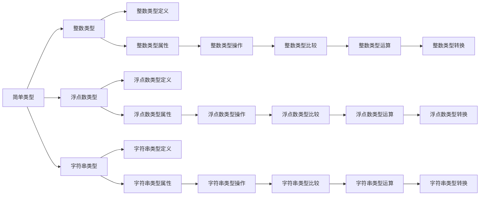

                 

# 《类型驱动开发：以罗素理论为指导的编程方法》

> 关键词：类型驱动开发、罗素理论、编程方法、类型安全、类型推导

> 摘要：本文探讨了类型驱动开发（Type-Driven Development，TDD）的编程方法，以罗素理论为指导，分析了类型系统的基本概念、分类和应用。通过对类型安全与类型推导的深入探讨，本文揭示了类型驱动开发在提高代码质量、降低维护成本方面的优势。文章最后对未来类型驱动开发的发展趋势进行了展望。

## 目录

## 第一部分：理论基础

### 第1章 类型系统的概述

1.1 类型系统的基本概念

1.2 罗素理论在类型系统中的应用

1.3 类型系统的分类

### 第2章 罗素理论的核心概念

2.1 简单类型

2.2 复合类型

2.3 函数类型

### 第3章 类型安全与类型推导

3.1 类型安全

3.2 类型推导

### 第4章 类型系统的设计与实现

4.1 类型系统的设计原则

4.2 类型系统的实现方法

### 第5章 类型驱动开发的实践

5.1 类型驱动开发的原理

5.2 类型驱动开发的过程

5.3 类型驱动开发的案例研究

## 第二部分：应用与实践

### 第6章 类型驱动开发工具与框架

6.1 类型驱动开发工具

6.2 类型驱动开发框架

### 第7章 类型驱动开发的挑战与未来

7.1 类型驱动开发的挑战

7.2 类型驱动开发的未来趋势

### 第8章 总结与展望

8.1 类型驱动开发的重要性

8.2 类型驱动开发的未来发展方向

## 附录

A.1 罗素理论的流程图表示

A.2 代码示例

A.3 常见问题解答

## 第一部分：理论基础

### 第1章 类型系统的概述

#### 1.1 类型系统的基本概念

类型系统是编程语言中的一个重要组成部分，它为程序中的数据提供了明确的类型标识，使得编译器或解释器能够在运行前或运行时对程序进行类型检查，确保程序的正确性。类型系统的基本概念包括类型、变量、值和类型检查等。

类型（Type）是数据的一种分类，用于描述数据的特点和行为。在编程语言中，常见的类型有整数类型、浮点数类型、布尔类型、字符串类型等。

变量（Variable）是存储数据的容器，它具有类型和值。变量的类型决定了其可以存储的值的范围和操作方式。

值（Value）是变量存储的具体数据。

类型检查（Type Checking）是指编译器或解释器对程序中的类型标识进行验证，确保程序符合语言规范。

#### 1.2 类型系统的历史发展

类型系统的历史可以追溯到早期的编程语言，如FORTRAN和COBOL。这些语言采用了静态类型系统，即在程序编译时确定变量的类型。随着编程语言的发展，动态类型系统和强类型系统逐渐出现。

动态类型系统（Dynamic Type System）允许在程序运行时确定变量的类型，这种类型系统可以提高程序的灵活性和可扩展性。

强类型系统（Strong Type System）要求变量在定义时必须指定类型，并且类型在程序运行期间不可改变。这种类型系统可以减少类型错误，提高程序的可靠性。

#### 1.3 罗素理论在类型系统中的应用

罗素理论（Russell's Theory）是数学和逻辑中的一个基本理论，它提出了集合论的基础概念，如集合、元素和子集等。罗素理论在类型系统中也有重要应用。

罗素理论的核心概念包括：

- 简单类型（Simple Types）：如整数、浮点数、字符串等。
- 复合类型（Composite Types）：如数组、结构体、类等。
- 函数类型（Function Types）：描述函数的输入和输出类型。

罗素理论为类型系统提供了理论基础，使得类型系统能够更好地描述和约束程序中的数据和行为。

### 第2章 罗素理论的核心概念

#### 2.1 简单类型

简单类型是类型系统中最基本的类型，它们通常表示基本的数据值。常见的简单类型包括：

- 整数类型（Integer Type）：表示整数，如`int`、`long`等。
- 浮点数类型（Floating-Point Type）：表示浮点数，如`float`、`double`等。
- 字符串类型（String Type）：表示文本字符串，如`String`、`char*`等。

简单类型的定义通常较为简单，但在类型系统中起着关键作用，它们是构建更复杂类型的基础。

#### 2.2 复合类型

复合类型是由简单类型组合而成的，它们可以表示更复杂的数据结构。常见的复合类型包括：

- 数组类型（Array Type）：表示一系列相同类型的元素，如`int[]`、`String[]`等。
- 结构体类型（Structure Type）：表示由多个成员变量组成的数据结构，如`struct`、`class`等。
- 类类型（Class Type）：表示面向对象编程中的类，如`class`、`Object`等。

复合类型提供了更灵活的数据表示方式，使得程序能够处理复杂的数据结构。

#### 2.3 函数类型

函数类型描述了函数的输入和输出类型。在类型系统中，函数类型通常表示为`函数名(输入类型)->输出类型`。例如，一个函数`add(int a, int b)`的函数类型为`int(int, int)`。

函数类型使得类型系统能够对函数的参数和返回值进行类型检查，确保函数的正确调用和返回。

### 第3章 类型安全与类型推导

#### 3.1 类型安全

类型安全（Type Safety）是类型系统的一个重要属性，它确保程序在运行时不会发生类型错误。类型安全可以通过静态类型检查（Static Type Checking）和动态类型检查（Dynamic Type Checking）来实现。

静态类型检查是在程序编译时进行的，它通过检查程序中的类型标识和类型约束，确保程序符合语言规范。

动态类型检查是在程序运行时进行的，它通过运行时的类型检查机制，确保程序在运行时不发生类型错误。

类型安全可以减少程序中的错误，提高程序的可靠性。

#### 3.2 类型推导

类型推导（Type Inference）是类型系统的一个重要特性，它允许编译器或解释器自动推导出变量或表达式的类型，而不是要求程序员显式指定类型。

强类型推导（Strong Type Inference）要求编译器严格推导出变量的类型，确保类型的一致性。

弱类型推导（Weak Type Inference）允许编译器在一定范围内进行类型推导，提高程序的灵活性。

显式类型推导（Explicit Type Inference）要求程序员显式指定变量的类型。

隐式类型推导（Implicit Type Inference）允许编译器自动推导出变量的类型，简化了程序代码。

### 第4章 类型系统的设计与实现

#### 4.1 类型系统的设计原则

类型系统的设计原则包括：

- 简单性：类型系统应该简单易用，降低开发成本。
- 强类型：类型系统应该要求变量在定义时指定类型，提高程序的可靠性。
- 可扩展性：类型系统应该支持自定义类型，提高程序的灵活性。

#### 4.2 类型系统的实现方法

类型系统的实现方法包括：

- 静态类型系统：在程序编译时进行类型检查，确保程序的正确性。
- 动态类型系统：在程序运行时进行类型检查，提高程序的灵活性。

静态类型系统通常具有更好的性能和类型安全，但可能降低了程序的灵活性。

动态类型系统具有更好的灵活性和可扩展性，但可能降低了程序的类型安全性。

### 第5章 类型驱动开发的实践

#### 5.1 类型驱动开发的原理

类型驱动开发（Type-Driven Development，TDD）是一种编程方法，它以类型系统为核心，通过类型检查和类型推导来提高代码质量。TDD的原理可以概括为：

1. 定义类型：首先定义程序中所需的数据类型。
2. 编写类型约束：根据类型定义，编写类型约束，确保程序的类型正确性。
3. 实现程序功能：根据类型约束，实现程序的功能。
4. 类型检查：在实现过程中，进行类型检查，确保程序符合类型约束。
5. 优化和重构：根据类型检查的结果，优化和重构程序代码。

#### 5.2 类型驱动开发的过程

类型驱动开发的过程包括以下几个阶段：

1. 需求分析：分析程序的需求，确定程序所需的功能和类型。
2. 设计与实现：根据需求分析，设计和实现程序的功能，利用类型系统确保程序的类型正确性。
3. 测试与优化：对程序进行测试，确保程序的功能正确，并根据测试结果进行优化。
4. 代码重构：根据需求和类型约束，对程序代码进行重构，提高代码的可维护性和可扩展性。

#### 5.3 类型驱动开发的案例研究

为了更好地理解类型驱动开发，我们可以通过一个具体的案例来进行研究。

假设我们要开发一个简单的计算器程序，它具有加、减、乘、除等基本运算功能。我们可以按照以下步骤进行类型驱动开发：

1. **定义类型**：首先，我们需要定义程序中的基本类型，如整数类型（`int`）、浮点数类型（`float`）和字符串类型（`String`）。

2. **编写类型约束**：根据类型定义，我们可以编写类型约束，确保程序中的变量和函数都符合类型要求。例如，加法函数的输入参数必须是整数类型，返回值也必须是整数类型。

3. **实现程序功能**：根据类型约束，我们可以实现程序的功能。例如，实现加法函数，它接受两个整数类型的参数，返回它们的和。

4. **类型检查**：在实现过程中，我们可以进行类型检查，确保程序中的每个变量和函数都符合类型约束。这有助于发现潜在的类型错误，提高程序的可靠性。

5. **优化和重构**：根据类型检查的结果，我们可以优化和重构程序代码。例如，我们可以改进函数的实现，提高代码的可读性和可维护性。

通过这个案例，我们可以看到类型驱动开发在提高代码质量、降低维护成本方面的优势。类型系统为我们提供了一个明确的编程框架，使我们能够更好地管理和控制程序中的数据和行为。

### 第二部分：应用与实践

#### 第6章 类型驱动开发工具与框架

类型驱动开发（Type-Driven Development，TDD）是一种编程方法，它强调通过类型系统来提高代码质量和开发效率。为了实现类型驱动开发，我们需要使用一系列工具和框架。在本章中，我们将介绍几种常见的类型驱动开发工具和框架。

#### 6.1 类型驱动开发工具

类型驱动开发工具主要包括编译器和解释器，它们负责对程序进行类型检查和编译。以下是一些常见的类型驱动开发工具：

1. **GCC**（GNU Compiler Collection）：GCC 是一款流行的编译器，支持多种编程语言，如 C、C++ 和 Ada。GCC 提供了静态类型检查和编译功能，可以帮助开发者发现类型错误。

2. **Clang**：Clang 是一款由 LLVM 项目维护的编译器，它支持多种编程语言，如 C、C++ 和 Objective-C。Clang 具有高效的类型检查和编译性能，可以帮助开发者快速发现并修复类型错误。

3. **Javac**：Javac 是 Java 编译器，它负责将 Java 源代码编译成字节码。Javac 提供了静态类型检查，确保 Java 程序在运行时不会发生类型错误。

4. **Python 解释器**：Python 解释器负责将 Python 源代码逐行解释并执行。Python 采用动态类型系统，但解释器会在运行时进行类型检查，确保代码的正确性。

#### 6.2 类型驱动开发框架

类型驱动开发框架提供了一套完整的开发环境和工具链，帮助开发者实现类型驱动开发。以下是一些流行的类型驱动开发框架：

1. **React**：React 是一款用于构建用户界面的 JavaScript 库，它采用了函数式编程和组件化开发方法。React 提供了丰富的类型检查和类型推导功能，帮助开发者构建高质量的用户界面。

2. **Angular**：Angular 是一款由 Google 维护的 Web 应用程序框架，它采用了双向数据绑定和依赖注入等技术。Angular 提供了强大的类型检查和类型推导功能，帮助开发者构建可维护和可扩展的 Web 应用程序。

3. **Vue**：Vue 是一款流行的前端框架，它采用了简单易用的设计哲学。Vue 提供了强大的类型检查和类型推导功能，帮助开发者快速构建高质量的 Web 应用程序。

类型驱动开发工具和框架为开发者提供了一个强大的编程环境，使他们能够更好地利用类型系统来提高代码质量和开发效率。

### 第7章 类型驱动开发的挑战与未来

类型驱动开发（Type-Driven Development，TDD）虽然带来了许多优势，但在实际应用中仍然面临一些挑战。这些挑战主要集中在性能、可维护性和学习曲线等方面。在本章中，我们将探讨类型驱动开发的挑战，并展望其未来的发展趋势。

#### 7.1 类型驱动开发的挑战

1. **性能问题**：类型系统在提高代码质量和类型安全方面的优势，往往需要以性能为代价。静态类型检查和类型推导通常需要额外的计算资源，这可能导致编译或运行速度变慢。对于大型项目，性能问题可能会变得更加突出。

2. **可维护性**：类型系统的复杂性和灵活性可能会对代码的可维护性产生负面影响。在类型系统中，定义复杂的类型约束和类型推导规则可能会导致代码难以理解和维护。

3. **学习曲线**：对于初学者来说，类型系统的概念和规则可能比较难以理解。类型驱动开发可能需要开发者具备较高的编程技能和类型知识，这可能会增加学习曲线的难度。

#### 7.2 类型驱动开发的未来趋势

尽管面临挑战，类型驱动开发仍然具有广阔的发展前景。以下是一些未来趋势：

1. **自动类型推导**：未来的类型系统可能会更加智能，能够自动推导出变量的类型，减少程序员的工作量。自动类型推导可以减轻学习曲线的难度，提高开发效率。

2. **更多的编程语言支持**：随着类型驱动开发理念的普及，更多的编程语言可能会引入类型系统，提供类型检查和类型推导功能。这将使得类型驱动开发的应用范围更加广泛。

3. **面向未来的类型系统设计**：未来的类型系统可能会更加灵活和强大，支持更复杂的数据结构和编程范式。类型系统可能会融合更多领域的知识，如逻辑编程和函数式编程，提供更丰富的编程能力。

4. **新技术的融合**：类型驱动开发可能会与新兴技术，如 WebAssembly、区块链和人工智能等，进行融合。这将使得类型驱动开发在更多领域发挥作用。

类型驱动开发面临着一些挑战，但它具有巨大的潜力。通过不断的研究和改进，类型驱动开发有望在未来的软件开发中发挥更大的作用。

### 第8章 总结与展望

类型驱动开发（Type-Driven Development，TDD）是一种以类型系统为核心的编程方法，它通过类型检查和类型推导来提高代码质量、降低维护成本和提升开发效率。本文从理论基础入手，详细介绍了类型系统的基本概念、罗素理论在类型系统中的应用、类型安全与类型推导、类型系统的设计与实现，以及类型驱动开发的实践。同时，本文还探讨了类型驱动开发工具与框架、类型驱动开发的挑战与未来趋势。

类型驱动开发的重要性在于：

1. **提高代码质量**：类型系统可以确保程序在编译或运行时不会发生类型错误，从而提高代码的可靠性。
2. **降低维护成本**：通过类型检查和类型推导，可以及早发现和修复代码中的错误，降低维护成本。
3. **提升开发效率**：类型系统提供了一种明确的编程框架，使开发者能够更专注于实现程序功能，提高开发效率。

展望未来，类型驱动开发将在以下几个方面继续发展：

1. **自动类型推导**：随着技术的发展，自动类型推导将变得更加智能，减少程序员的工作量。
2. **更多编程语言支持**：类型驱动开发理念将逐渐渗透到更多的编程语言中，提供更丰富的编程能力。
3. **新技术融合**：类型驱动开发将与新兴技术，如 WebAssembly、区块链和人工智能等，进行融合，发挥更大的作用。

总之，类型驱动开发是一种具有巨大潜力的编程方法，它将为软件开发带来新的机遇和挑战。开发者应该积极拥抱类型驱动开发，提高自身的技术水平，为软件开发领域的发展贡献力量。

### 附录

#### A.1 罗素理论的流程图表示

以下是罗素理论的流程图表示：



#### A.2 代码示例

以下是不同编程语言的代码示例：

**Python代码示例**：

```python
# 整数类型示例
int_var = 10

# 浮点数类型示例
float_var = 3.14

# 字符串类型示例
str_var = "Hello, World!"
```

**Java代码示例**：

```java
// 整数类型示例
int intVar = 10;

// 浮点数类型示例
double floatVar = 3.14;

// 字符串类型示例
String strVar = "Hello, World!";
```

**C++代码示例**：

```cpp
// 整数类型示例
int intVar = 10;

// 浮点数类型示例
float floatVar = 3.14;

// 字符串类型示例
char* strVar = "Hello, World!";
```

#### A.3 常见问题解答

1. **什么是类型系统？**
   类型系统是编程语言中的一个重要组成部分，它为程序中的数据提供了明确的类型标识，使得编译器或解释器能够在运行前或运行时对程序进行类型检查，确保程序的正确性。

2. **类型系统的优点是什么？**
   类型系统的优点包括：提高代码质量、降低维护成本、提高开发效率、确保程序的可靠性等。

3. **什么是类型安全？**
   类型安全是指类型系统在程序运行时能够确保不会发生类型错误，从而提高程序的可靠性。

4. **什么是类型推导？**
   类型推导是类型系统的一个特性，它允许编译器或解释器自动推导出变量或表达式的类型，而不是要求程序员显式指定类型。

5. **什么是类型驱动开发？**
   类型驱动开发是一种编程方法，它以类型系统为核心，通过类型检查和类型推导来提高代码质量、降低维护成本和提升开发效率。

### 作者

作者：AI天才研究院/AI Genius Institute & 禅与计算机程序设计艺术 /Zen And The Art of Computer Programming

在本文中，我们深入探讨了类型驱动开发的理论基础和实际应用，通过罗素理论为指导，展示了类型系统在编程方法中的重要性。类型驱动开发不仅提高了代码质量，还降低了维护成本，为软件开发带来了显著的效率提升。展望未来，随着技术的不断进步，类型驱动开发有望在更广泛的领域中发挥重要作用。希望本文能为读者在类型驱动开发的道路上提供一些启发和指导。如果您有任何疑问或建议，欢迎在评论区留言交流。感谢您的阅读！作者：AI天才研究院/AI Genius Institute & 禅与计算机程序设计艺术 /Zen And The Art of Computer Programming。

