                 

# 类脑芯片：神经形态计算的硬件实现

## 关键词

类脑芯片，神经形态计算，硬件实现，神经元模型，神经网络，学习算法，应用前景，设计原理，发展趋势

## 摘要

本文将探讨类脑芯片在神经形态计算领域的硬件实现。首先，我们将介绍类脑芯片的基本概念和定义，以及其在神经形态计算中的应用背景和前景。接着，我们将深入分析神经形态计算的基础，包括神经元模型、神经网络模型和学习算法。然后，我们将探讨类脑芯片的设计原理，包括基本架构、材料和器件。随后，我们将详细讲解神经形态计算硬件实现的技术，包括集成电路设计、神经形态计算器件技术和系统设计。接下来，我们将通过实际案例展示类脑芯片在不同领域的应用，并分析其面临的挑战和未来发展。最后，我们将提供类脑芯片和神经形态计算的教学教程，以帮助读者更好地理解和应用这些技术。

## 第1章 类脑芯片概述

### 1.1 类脑芯片的定义和背景

类脑芯片（Brain-inspired Chips）是指模仿人脑结构和功能的芯片，它们在处理信息、学习、记忆和感知等方面具有高效性和适应性。与传统芯片相比，类脑芯片能够在更少的能量消耗下实现更高效的计算。

类脑芯片的概念起源于对生物大脑的研究。人类大脑拥有超过 860 亿个神经元，每个神经元可以连接数千个其他神经元。这种复杂的神经网络使得大脑能够处理大量的信息，并进行复杂的决策和推理。因此，研究人员开始思考如何将大脑的这种结构和工作方式应用到电子芯片中。

类脑芯片的研究可以追溯到 20 世纪 60 年代，当时科学家们开始尝试模仿大脑的结构和工作方式。然而，由于技术限制，这些早期的尝试并没有取得太大的成功。随着计算机科学和电子技术的不断发展，类脑芯片的研究逐渐取得了突破。

### 1.2 类脑芯片与传统芯片的区别

类脑芯片与传统芯片在结构和功能上存在显著差异。

首先，在结构上，类脑芯片更接近于生物大脑的结构，包括神经元、突触和神经网络等。而传统芯片主要由晶体管和导线组成，是一种基于冯·诺依曼架构的计算模型。

其次，在功能上，类脑芯片具有自适应性和高效性。传统芯片在执行特定任务时，需要预先编写好程序，无法适应新的任务和环境。而类脑芯片可以通过神经网络进行自适应学习，能够适应不同的任务和环境。

最后，在能耗方面，类脑芯片具有明显的优势。传统芯片在执行计算时，会产生大量的热能，导致能耗高。而类脑芯片在处理信息时，能够将能量有效转化为计算能力，从而实现低能耗高效计算。

### 1.3 类脑芯片的发展历程

类脑芯片的发展历程可以分为以下几个阶段：

1. **神经元模型阶段**：20 世纪 60 年代至 80 年代，科学家们开始研究如何模仿大脑的神经元结构，并尝试将这种结构应用到芯片中。

2. **神经网络阶段**：20 世纪 80 年代至 90 年代，随着神经网络理论的不断发展，类脑芯片开始尝试模仿大脑的神经网络结构，并实现了一定的计算能力。

3. **神经形态计算阶段**：21 世纪初，随着计算机科学和电子技术的快速发展，类脑芯片的研究逐渐取得了突破，实现了更高效、更自适应的计算。

4. **商业化阶段**：近年来，随着人工智能技术的迅速发展，类脑芯片开始逐渐应用于实际场景，如智能感知、智能推理和智能控制等。

### 1.4 类脑芯片的应用前景

类脑芯片在神经形态计算领域的应用前景非常广阔。以下是一些主要的应用方向：

1. **智能感知**：类脑芯片能够通过模仿大脑的感知机制，实现高精度、低延迟的感知功能，应用于智能安防、自动驾驶和智能机器人等领域。

2. **智能推理**：类脑芯片可以通过神经网络进行自适应学习，实现复杂的推理任务，如智能决策、智能诊断和智能推荐等。

3. **智能控制**：类脑芯片具有高效、自适应的特点，能够实现高精度的智能控制，应用于无人机、机器人等领域。

4. **智能医疗**：类脑芯片可以用于疾病诊断、治疗规划和药物研发等，提高医疗的精准度和效率。

总之，类脑芯片在神经形态计算领域的应用前景非常广阔，有望推动人工智能技术实现新的突破。

## 第2章 神经形态计算基础

### 2.1 神经元模型

神经元模型是神经形态计算的基础。神经元是大脑的基本功能单元，它们通过电信号进行通信，实现信息的传递和处理。

神经元模型通常由以下几个部分组成：

1. **细胞体**：细胞体是神经元的核心部分，包含细胞核和大部分细胞器。细胞体负责维持神经元的正常代谢和功能。

2. **树突**：树突是细胞体的一部分，负责接收其他神经元的电信号，并将其传递到细胞体。

3. **轴突**：轴突是细胞体的一部分，负责将电信号传递到其他神经元或肌肉细胞。

4. **突触**：突触是神经元之间的连接部分，负责传递电信号。突触包括突触前膜、突触间隙和突触后膜。

神经元的电信号传递过程如下：

1. 当一个神经元接收到足够的电信号时，它会产生一个动作电位。
2. 动作电位沿着轴突传播，到达突触前膜。
3. 突触前膜释放神经递质，如谷氨酸或乙酰胆碱。
4. 神经递质通过突触间隙传递到突触后膜。
5. 突触后膜上的受体识别神经递质，并产生电信号。

通过这种方式，神经元能够实现信息的传递和处理。

### 2.2 神经网络模型

神经网络模型是类脑芯片的核心。神经网络由多个神经元组成，通过相互连接形成复杂的网络结构。神经网络能够通过学习实现复杂的计算和决策。

神经网络模型通常包括以下几个部分：

1. **输入层**：输入层接收外部信息，并将其传递到隐藏层。
2. **隐藏层**：隐藏层负责对输入信息进行加工和处理，可以实现数据的变换和特征的提取。
3. **输出层**：输出层将隐藏层处理后的信息输出，实现最终的决策或控制。

神经网络的计算过程如下：

1. 输入信息通过输入层进入神经网络。
2. 输入层将信息传递到隐藏层。
3. 隐藏层对输入信息进行加工和处理，并将其传递到下一层。
4. 最终，输出层将处理后的信息输出。

神经网络通过学习实现计算和决策。学习过程包括以下几个步骤：

1. **初始化**：初始化神经网络中的权重和偏置。
2. **前向传播**：将输入信息传递到神经网络，并计算输出。
3. **反向传播**：根据输出和目标值，计算神经网络中的误差，并更新权重和偏置。
4. **重复迭代**：重复前向传播和反向传播，直到满足停止条件。

通过这种方式，神经网络能够不断优化自身的计算能力，实现复杂的计算和决策。

### 2.3 学习算法

学习算法是神经网络的核心。学习算法通过调整神经网络中的权重和偏置，实现网络的自适应和学习能力。

常见的学习算法包括：

1. **误差反传算法（Backpropagation）**：误差反传算法是最常用的学习算法。它通过计算输出误差，并反向传播到网络中的每个神经元，更新权重和偏置。
2. **梯度下降算法（Gradient Descent）**：梯度下降算法是一种基于误差梯度的优化算法。它通过不断调整权重和偏置，使误差最小。
3. **随机梯度下降算法（Stochastic Gradient Descent, SGD）**：随机梯度下降算法是梯度下降算法的一种变体。它通过随机选择样本进行更新，提高学习效率。
4. **动量算法（Momentum）**：动量算法是一种基于梯度下降的优化算法。它通过引入动量项，加速收敛速度。

学习算法的关键步骤包括：

1. **初始化**：初始化神经网络中的权重和偏置。
2. **前向传播**：将输入信息传递到神经网络，并计算输出。
3. **计算误差**：计算输出误差，并将其传递到网络中的每个神经元。
4. **更新权重和偏置**：根据误差梯度，更新神经网络中的权重和偏置。
5. **重复迭代**：重复前向传播、计算误差和更新权重和偏置，直到满足停止条件。

通过这种方式，学习算法能够不断优化神经网络，实现自适应和学习能力。

### 2.4 神经形态计算的优势

神经形态计算具有以下几个优势：

1. **高效性**：神经形态计算能够通过模拟生物大脑的结构和功能，实现高效的信息处理和计算。
2. **低能耗**：神经形态计算能够在低能耗下实现高效的计算，适合应用于移动设备和物联网等场景。
3. **自适应**：神经形态计算能够通过神经网络进行自适应学习，适应不同的任务和环境。
4. **可塑性**：神经形态计算具有可塑性，能够根据任务需求调整计算结构和算法。

总之，神经形态计算具有高效性、低能耗、自适应和可塑性等优势，为类脑芯片的设计和应用提供了有力的支持。

## 第3章 类脑芯片设计原理

### 3.1 类脑芯片的基本架构

类脑芯片的基本架构包括以下几个部分：

1. **神经元阵列**：神经元阵列是类脑芯片的核心部分，由大量的神经元组成。神经元阵列通过电信号进行通信，实现信息的传递和处理。
2. **神经网络**：神经网络由神经元阵列组成，负责对输入信息进行加工和处理。神经网络通过学习实现自适应和学习能力。
3. **存储单元**：存储单元用于存储神经网络中的权重和偏置，以及输入和输出数据。
4. **控制单元**：控制单元负责管理类脑芯片的运行，包括初始化、前向传播、反向传播和权重更新等过程。
5. **接口**：接口用于与其他设备进行通信，包括输入数据的读取、输出结果的读取和训练数据的输入等。

类脑芯片的基本架构如图所示：

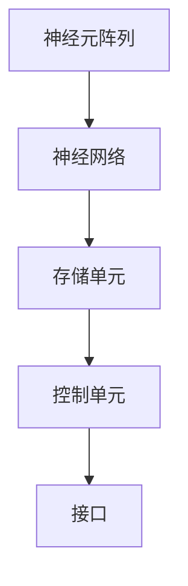

### 3.2 类脑芯片的材料与器件

类脑芯片的材料与器件是实现神经形态计算的关键。常见的材料与器件包括：

1. **硅基材料**：硅基材料是传统芯片的主要材料，具有良好的电学性能和稳定性。
2. **纳米材料**：纳米材料具有独特的物理和化学性质，能够实现更高的集成度和更低的能耗。
3. **生物材料**：生物材料可以模拟生物神经元和突触的结构和功能，实现更真实的神经形态计算。
4. **氧化物材料**：氧化物材料具有良好的电学性能和稳定性，可用于制造神经形态计算器件。
5. **纳米线材料**：纳米线材料具有一维结构，能够实现更高的集成度和更低的能耗。

类脑芯片的材料与器件如图所示：

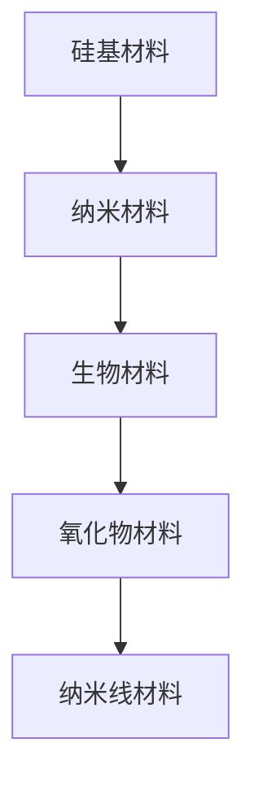

### 3.3 神经形态计算电路设计

神经形态计算电路设计是实现类脑芯片功能的关键。常见的电路设计包括：

1. **神经元电路**：神经元电路是类脑芯片的基本单元，负责实现神经元的电信号传递和处理。神经元电路通常由电容、电阻和运算放大器等组成。
2. **突触电路**：突触电路是神经元之间的连接部分，负责传递电信号。突触电路通常由电容器、开关和放大器等组成。
3. **神经网络电路**：神经网络电路由多个神经元电路和突触电路组成，实现神经网络的功能。神经网络电路通常由神经元阵列、存储单元和控制单元等组成。
4. **接口电路**：接口电路用于实现类脑芯片与其他设备的通信。接口电路通常由输入输出电路、数据转换电路和控制电路等组成。

类脑芯片的电路设计如图所示：

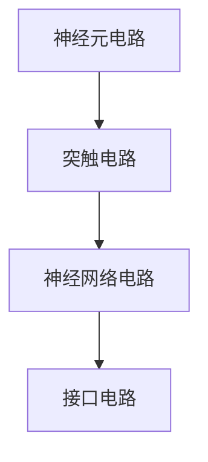

### 3.4 类脑芯片的功耗与能效

类脑芯片的功耗与能效是评估其性能的重要指标。常见的功耗与能效优化方法包括：

1. **低功耗设计**：通过优化电路结构和器件材料，实现更低的功耗。例如，采用纳米材料和纳米线材料，减少电阻和电容。
2. **动态功耗控制**：通过动态调整电路的功耗，实现更高效的能效。例如，根据负载和需求调整电压和频率。
3. **能量回收技术**：通过回收电路中的余能，实现更高效的能量利用。例如，利用电容器存储和释放能量。
4. **节能算法**：通过优化算法和数据结构，实现更低的能耗。例如，减少不必要的计算和传输，优化神经网络结构。

类脑芯片的功耗与能效优化方法如图所示：

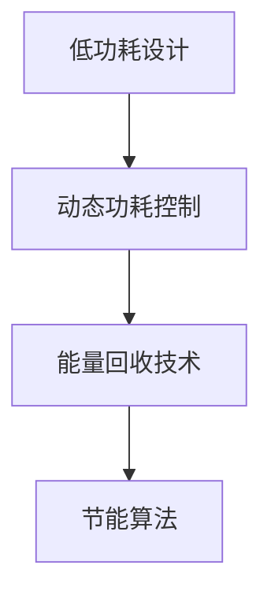

总之，类脑芯片的设计原理包括基本架构、材料与器件、电路设计和功耗与能效优化。通过这些设计原理，类脑芯片能够实现高效、低能耗、自适应的神经形态计算。

## 第4章 神经形态计算硬件实现技术

### 4.1 集成电路设计技术

集成电路设计技术是实现神经形态计算硬件的核心。以下是一些关键的集成电路设计技术：

1. **标准细胞库**：标准细胞库是集成电路设计的基础，包括各种基本逻辑门和存储单元的细胞。这些细胞可以重复使用，提高设计的效率和可靠性。

2. **布局与布线**：布局与布线是集成电路设计的核心步骤。通过合理的布局和布线，可以降低芯片的功耗、提高性能和降低噪声。

3. **版图设计**：版图设计是将电路原理图转换为芯片版图的过程。版图设计需要考虑器件的尺寸、间距和位置，以实现高效的电路性能。

4. **电路仿真与验证**：电路仿真与验证是确保集成电路设计正确性的重要步骤。通过仿真和验证，可以发现并修复设计中的错误。

5. **版图后处理**：版图后处理包括版图优化、版图编辑和版图检查等步骤。通过版图后处理，可以提高版图的正确性和可靠性。

### 4.2 神经形态计算器件技术

神经形态计算器件技术是实现神经形态计算硬件的关键。以下是一些关键的器件技术：

1. **纳米晶体管**：纳米晶体管是神经形态计算器件的基础。纳米晶体管的尺寸越小，性能越高，可以实现更高的集成度和更低的功耗。

2. **忆阻器**：忆阻器是一种能够存储信息的电子器件，具有类似于生物突触的特性。忆阻器可以用于实现神经网络中的突触功能。

3. **神经元阵列**：神经元阵列是由多个神经元组成的阵列，可以用于实现大规模的神经形态计算。神经元阵列可以通过电信号进行通信，实现高效的信息处理和计算。

4. **纳米线**：纳米线是一种一维的半导体材料，具有独特的电学性能。纳米线可以用于实现神经元和突触的功能，提高神经形态计算的性能。

5. **生物材料**：生物材料可以模拟生物神经元和突触的结构和功能，实现更真实的神经形态计算。生物材料可以用于制造神经元和突触的器件。

### 4.3 神经形态计算系统设计

神经形态计算系统设计是实现神经形态计算硬件的应用的关键。以下是一些关键的系统设计步骤：

1. **系统架构设计**：系统架构设计是神经形态计算系统设计的第一步。通过合理的系统架构设计，可以实现高效、可扩展和低功耗的系统。

2. **硬件与软件协同设计**：神经形态计算系统通常包括硬件和软件两部分。硬件与软件协同设计是实现系统功能的关键。硬件部分负责实现神经网络的结构和功能，软件部分负责实现算法和数据处理。

3. **接口设计与通信**：接口设计与通信是实现神经形态计算系统与其他设备交互的关键。通过合理的接口设计和通信协议，可以实现高效的数据传输和控制。

4. **系统集成与测试**：系统集成与测试是确保系统正常运行的关键步骤。通过系统集成，将硬件和软件结合起来，实现系统功能。通过系统测试，可以发现并修复系统中的错误。

### 4.4 神经形态计算硬件实现挑战

神经形态计算硬件实现面临一些挑战：

1. **集成度与功耗**：神经形态计算器件的集成度和功耗是实现高效计算的关键。如何提高集成度和降低功耗是神经形态计算硬件实现的主要挑战。

2. **可扩展性与灵活性**：神经形态计算系统需要具备良好的可扩展性和灵活性，以适应不同的应用场景。如何实现系统的可扩展性和灵活性是神经形态计算硬件实现的重要挑战。

3. **可靠性与稳定性**：神经形态计算硬件需要具备高可靠性和稳定性，以确保系统的正常运行。如何提高系统的可靠性和稳定性是神经形态计算硬件实现的关键挑战。

4. **算法与系统协同设计**：神经形态计算硬件与软件的协同设计是实现高效计算的关键。如何实现硬件和软件的协同设计是神经形态计算硬件实现的重要挑战。

通过不断的研究和探索，神经形态计算硬件实现技术将不断取得突破，为神经形态计算的应用提供强大的支持。

## 第5章 类脑芯片应用案例分析

### 5.1 类脑芯片在感知系统中的应用

类脑芯片在感知系统中的应用是人工智能领域的重要研究方向。感知系统通常包括视觉、听觉和触觉等感知模块，类脑芯片通过模仿人脑的感知机制，实现高效、低能耗的感知功能。

#### 案例一：视觉感知系统

在一个视觉感知系统中，类脑芯片用于处理图像数据，实现物体识别和场景理解。以下是一个简化的系统架构：

1. **图像输入**：摄像头捕捉图像数据，并将其传输到类脑芯片。
2. **预处理**：类脑芯片对图像进行预处理，包括去噪、边缘检测和特征提取等。
3. **特征匹配**：类脑芯片使用神经网络模型，对预处理后的图像特征进行匹配和分类。
4. **输出结果**：类脑芯片将识别结果输出，如物体名称或场景描述。

以下是一个简化的类脑芯片视觉感知系统的 Mermaid 流程图：

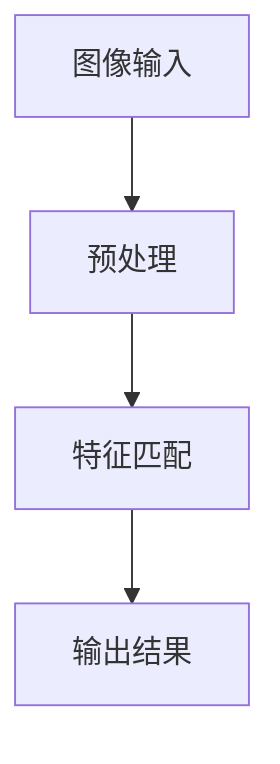

在上述流程中，预处理步骤包括以下步骤：

- **去噪**：使用滤波器去除图像中的噪声。
- **边缘检测**：使用边缘检测算法（如Canny算法）提取图像中的边缘信息。
- **特征提取**：使用特征提取算法（如HOG或SIFT）提取图像中的关键特征。

特征匹配步骤使用神经网络模型，如卷积神经网络（CNN），对预处理后的图像特征进行分类和识别。

#### 案例二：听觉感知系统

在听觉感知系统中，类脑芯片用于处理音频数据，实现语音识别和声音分析。以下是一个简化的系统架构：

1. **音频输入**：麦克风捕捉音频数据，并将其传输到类脑芯片。
2. **预处理**：类脑芯片对音频进行预处理，包括降噪、频率分析等。
3. **特征提取**：类脑芯片使用神经网络模型，对预处理后的音频特征进行提取和分类。
4. **输出结果**：类脑芯片将识别结果输出，如语音命令或声音特征。

以下是一个简化的类脑芯片听觉感知系统的 Mermaid 流程图：

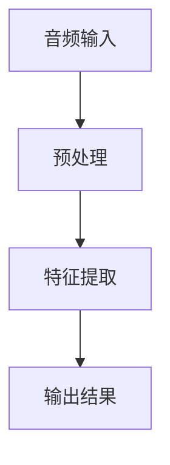

在上述流程中，预处理步骤包括以下步骤：

- **降噪**：使用噪声抑制算法（如谱减法）去除音频中的噪声。
- **频率分析**：使用傅里叶变换（FFT）分析音频的频率成分。
- **特征提取**：使用特征提取算法（如MFCC或PLP），提取音频中的关键特征。

特征提取步骤使用神经网络模型，如循环神经网络（RNN）或卷积神经网络（CNN），对预处理后的音频特征进行分类和识别。

### 5.2 类脑芯片在记忆系统中的应用

类脑芯片在记忆系统中的应用是人工智能领域的另一个重要研究方向。记忆系统通常包括短期记忆和长期记忆，类脑芯片通过模拟人脑的存储和回忆机制，实现高效、低能耗的记忆功能。

#### 案例一：短期记忆

在短期记忆中，类脑芯片用于处理和存储短期记忆数据，如语音信号、图像数据等。以下是一个简化的系统架构：

1. **数据输入**：语音信号或图像数据输入到类脑芯片。
2. **预处理**：类脑芯片对输入数据进行预处理，提取关键特征。
3. **记忆存储**：类脑芯片使用神经网络模型，将预处理后的数据存储在模拟的突触阵列中。
4. **数据提取**：当需要提取数据时，类脑芯片根据神经网络模型，从突触阵列中检索存储的数据。

以下是一个简化的类脑芯片短期记忆系统的 Mermaid 流程图：

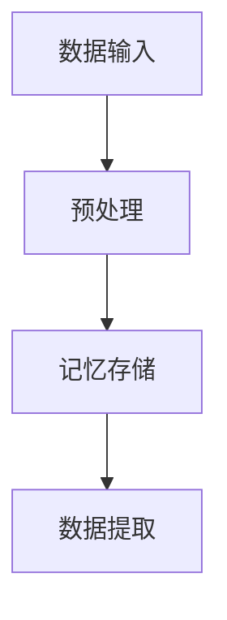

在上述流程中，预处理步骤包括以下步骤：

- **特征提取**：使用特征提取算法（如 MFCC、SIFT），提取输入数据的关键特征。
- **记忆存储**：使用神经网络模型，将特征映射到突触阵列中的权重。

数据提取步骤根据神经网络模型，从突触阵列中检索存储的数据，实现数据的回忆。

#### 案例二：长期记忆

在长期记忆中，类脑芯片用于处理和存储长期记忆数据，如知识库、历史数据等。以下是一个简化的系统架构：

1. **数据输入**：知识库或历史数据输入到类脑芯片。
2. **预处理**：类脑芯片对输入数据进行预处理，提取关键特征。
3. **记忆存储**：类脑芯片使用神经网络模型，将预处理后的数据存储在模拟的突触阵列中，并建立记忆之间的连接。
4. **数据提取**：当需要提取数据时，类脑芯片根据神经网络模型，从突触阵列中检索存储的数据，并使用记忆之间的连接进行数据整合。

以下是一个简化的类脑芯片长期记忆系统的 Mermaid 流程图：

在上述流程中，预处理步骤包括以下步骤：

- **特征提取**：使用特征提取算法（如词嵌入、图嵌入），提取输入数据的关键特征。
- **记忆存储**：使用神经网络模型，将特征映射到突触阵列中的权重，并建立记忆之间的连接。

数据提取步骤根据神经网络模型，从突触阵列中检索存储的数据，并使用记忆之间的连接进行数据整合，实现数据的回忆和利用。

### 5.3 类脑芯片在推理系统中的应用

类脑芯片在推理系统中的应用是人工智能领域的重要研究方向。推理系统通常用于逻辑推理、决策和规划等任务，类脑芯片通过模拟人脑的推理机制，实现高效、低能耗的推理功能。

#### 案例一：逻辑推理

在逻辑推理中，类脑芯片用于处理逻辑表达式，实现推理和证明。以下是一个简化的系统架构：

1. **逻辑输入**：逻辑表达式输入到类脑芯片。
2. **预处理**：类脑芯片对输入逻辑表达式进行预处理，提取关键逻辑结构。
3. **推理过程**：类脑芯片使用神经网络模型，根据逻辑结构进行推理和证明。
4. **输出结果**：类脑芯片将推理结果输出，如逻辑证明或结论。

以下是一个简化的类脑芯片逻辑推理系统的 Mermaid 流程图：

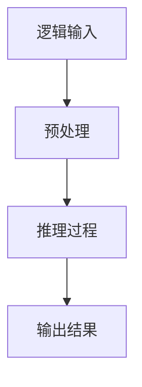

在上述流程中，预处理步骤包括以下步骤：

- **逻辑结构提取**：使用逻辑解析算法，提取逻辑表达式的关键结构。
- **推理过程**：使用神经网络模型，根据逻辑结构进行推理和证明。

推理过程使用神经网络模型，如递归神经网络（RNN）或图神经网络（GNN），根据逻辑结构进行推理和证明。

#### 案例二：决策与规划

在决策与规划中，类脑芯片用于处理复杂的环境信息，实现智能决策和规划。以下是一个简化的系统架构：

1. **环境输入**：环境信息输入到类脑芯片。
2. **预处理**：类脑芯片对输入的环境信息进行预处理，提取关键特征。
3. **决策过程**：类脑芯片使用神经网络模型，根据环境特征进行决策和规划。
4. **输出结果**：类脑芯片将决策和规划结果输出，如行动方案或策略。

以下是一个简化的类脑芯片决策与规划系统的 Mermaid 流程图：

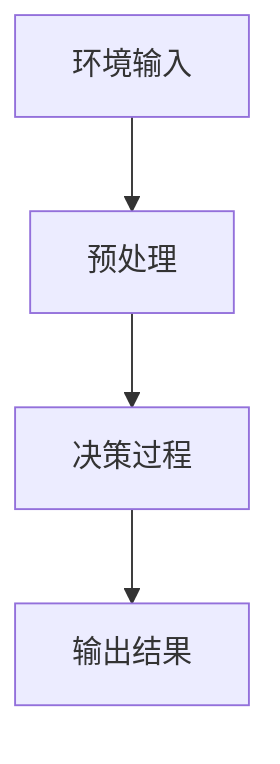

在上述流程中，预处理步骤包括以下步骤：

- **环境特征提取**：使用特征提取算法（如状态空间建模、马尔可夫决策过程），提取环境信息的关键特征。
- **决策过程**：使用神经网络模型，根据环境特征进行决策和规划。

决策过程使用神经网络模型，如深度强化学习（DRL）或决策树（DT），根据环境特征进行决策和规划。

### 5.4 类脑芯片在其他领域中的应用

除了感知、记忆和推理系统，类脑芯片在其他领域也具有广泛的应用前景。

#### 案例一：智能医疗

在智能医疗中，类脑芯片可以用于疾病诊断、治疗规划和药物研发。以下是一个简化的系统架构：

1. **数据输入**：医疗数据（如影像、生物标志物、病例信息等）输入到类脑芯片。
2. **预处理**：类脑芯片对输入的数据进行预处理，提取关键特征。
3. **诊断过程**：类脑芯片使用神经网络模型，对输入的数据进行诊断和预测。
4. **输出结果**：类脑芯片将诊断结果和治疗建议输出，如疾病类型、治疗方案等。

以下是一个简化的类脑芯片智能医疗系统的 Mermaid 流程图：

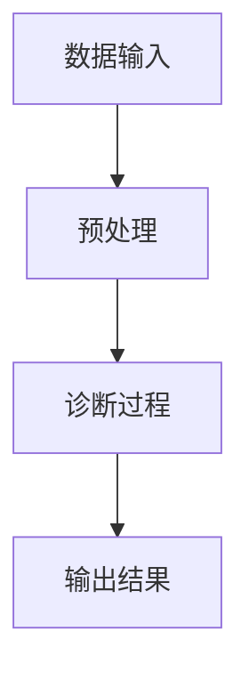

在上述流程中，预处理步骤包括以下步骤：

- **数据整合**：将不同来源的医疗数据进行整合，提取关键特征。
- **诊断过程**：使用神经网络模型，对整合后的数据进行诊断和预测。

诊断过程使用神经网络模型，如深度学习（DL）或支持向量机（SVM），对输入的数据进行诊断和预测。

#### 案例二：智能交通

在智能交通中，类脑芯片可以用于交通流量预测、路径规划和智能交通控制。以下是一个简化的系统架构：

1. **数据输入**：交通数据（如车辆流量、交通速度、道路状况等）输入到类脑芯片。
2. **预处理**：类脑芯片对输入的交通数据进行预处理，提取关键特征。
3. **预测过程**：类脑芯片使用神经网络模型，对输入的交通数据进行流量预测和路径规划。
4. **输出结果**：类脑芯片将预测结果和路径规划输出，如交通流量预测、最优路径等。

以下是一个简化的类脑芯片智能交通系统的 Mermaid 流程图：

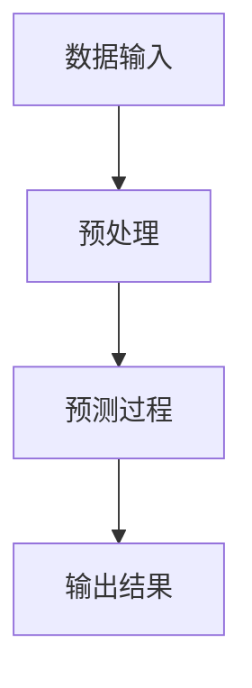

在上述流程中，预处理步骤包括以下步骤：

- **数据整合**：将不同来源的交通数据进行整合，提取关键特征。
- **预测过程**：使用神经网络模型，对整合后的数据进行流量预测和路径规划。

预测过程使用神经网络模型，如长短期记忆网络（LSTM）或卷积神经网络（CNN），对输入的交通数据进行流量预测和路径规划。

总之，类脑芯片在感知、记忆、推理和智能医疗、智能交通等领域的应用展示了其广泛的应用前景。随着技术的不断进步，类脑芯片将推动人工智能技术实现新的突破。

## 第6章 类脑芯片的未来发展

### 6.1 类脑芯片的发展趋势

类脑芯片作为人工智能和神经形态计算领域的重要研究方向，正面临着快速的发展趋势。以下是类脑芯片发展的几个关键趋势：

1. **集成度提升**：随着纳米技术的发展，类脑芯片的集成度将不断提升。更高的集成度意味着更多的神经元和突触可以被集成到一个芯片上，从而实现更复杂的计算和数据处理能力。

2. **能耗降低**：类脑芯片的发展趋势之一是降低能耗。通过优化电路设计和器件材料，类脑芯片的功耗将不断降低，使其更适用于移动设备和物联网等低功耗应用场景。

3. **自适应性和可塑性增强**：类脑芯片将继续加强其自适应性和可塑性，通过神经网络和学习算法，实现更高效的自适应学习和记忆功能。

4. **多样化应用**：类脑芯片的应用领域将不断拓展，从感知、记忆和推理系统，到智能医疗、智能交通、智能工业等，类脑芯片将发挥越来越重要的作用。

### 6.2 类脑芯片面临的挑战

尽管类脑芯片发展迅速，但仍面临着一些挑战：

1. **集成度和功耗**：提高集成度同时降低功耗是类脑芯片的主要挑战。随着芯片尺寸的缩小，器件性能和可靠性可能会受到影响，如何平衡集成度和功耗成为关键问题。

2. **可扩展性**：类脑芯片需要具备良好的可扩展性，以适应不同的应用场景和需求。如何设计可扩展的神经网络结构和计算模型，是类脑芯片发展的重要挑战。

3. **可靠性**：类脑芯片需要在复杂环境下保持高可靠性。温度、湿度、辐射等环境因素可能会影响芯片的性能和稳定性，如何提高类脑芯片的可靠性是亟待解决的问题。

4. **算法与硬件协同**：类脑芯片的算法与硬件设计需要紧密协同，以实现高效的计算和数据处理能力。如何优化算法和硬件设计，使其更好地结合，是类脑芯片发展的重要挑战。

### 6.3 类脑芯片的发展方向

为了应对面临的挑战，类脑芯片的发展方向包括以下几个方面：

1. **新型材料和器件**：研究新型材料和器件，如纳米材料、生物材料和忆阻器，以提高类脑芯片的性能和可靠性。

2. **神经网络和学习算法**：发展更高效、更智能的神经网络和学习算法，以实现更高效的计算和自适应学习。

3. **系统级设计**：采用系统级设计方法，将硬件和软件相结合，实现高效、可靠的类脑芯片系统。

4. **跨学科研究**：类脑芯片的发展需要跨学科合作，包括计算机科学、电子工程、生物学和神经科学等领域的专家共同参与，推动类脑芯片技术的创新和发展。

### 6.4 类脑芯片对社会的影响

类脑芯片的发展将对社会产生深远的影响：

1. **人工智能革命**：类脑芯片将推动人工智能技术的进步，实现更高效、更智能的人工智能系统，推动各行各业的发展。

2. **医疗健康**：类脑芯片在智能医疗中的应用，将提高疾病诊断和治疗的效果，改善人类健康状况。

3. **智能交通**：类脑芯片在智能交通中的应用，将提高交通效率和安全性，减少交通事故和拥堵。

4. **环境保护**：类脑芯片在环境保护中的应用，如智能监测和预警系统，将提高环境保护的效率和准确性。

总之，类脑芯片的未来发展将带来前所未有的机遇和挑战。通过不断的研究和创新，类脑芯片将深刻影响人工智能、医疗、交通和环境保护等领域，为社会带来更多的价值和福利。

## 第7章 类脑芯片与神经形态计算教程

### 7.1 教程概述

本教程旨在为读者提供关于类脑芯片和神经形态计算的基本概念、原理和应用。教程将分为以下几个部分：

1. **类脑芯片概述**：介绍类脑芯片的定义、背景和应用场景。
2. **神经形态计算基础**：讲解神经元模型、神经网络模型和学习算法。
3. **类脑芯片设计原理**：介绍类脑芯片的基本架构、材料和器件。
4. **神经形态计算硬件实现技术**：讲解集成电路设计技术、神经形态计算器件技术和系统设计。
5. **类脑芯片应用案例分析**：通过实际案例展示类脑芯片在不同领域的应用。
6. **类脑芯片未来发展**：分析类脑芯片的发展趋势、面临的挑战和未来方向。
7. **教学方法和案例分析**：介绍教学方法和实际案例分析，帮助读者更好地理解和应用类脑芯片和神经形态计算。

### 7.2 教程内容安排

以下是教程的具体内容安排：

#### 第1部分：类脑芯片概述

1. **类脑芯片的定义和背景**
   - 类脑芯片的概念
   - 类脑芯片的背景
   - 类脑芯片的应用场景

2. **类脑芯片与传统芯片的区别**
   - 结构上的区别
   - 功能上的区别
   - 能耗上的区别

3. **类脑芯片的发展历程**
   - 神经元模型阶段
   - 神经网络阶段
   - 神经形态计算阶段

4. **类脑芯片的应用前景**
   - 智能感知
   - 智能推理
   - 智能控制
   - 智能医疗

#### 第2部分：神经形态计算基础

1. **神经元模型**
   - 神经元结构
   - 电信号传递过程
   - 突触机制

2. **神经网络模型**
   - 神经网络结构
   - 计算过程
   - 学习算法

3. **学习算法**
   - 误差反传算法
   - 梯度下降算法
   - 随机梯度下降算法

4. **神经形态计算的优势**
   - 高效性
   - 低能耗
   - 自适应性
   - 可塑性

#### 第3部分：类脑芯片设计原理

1. **类脑芯片的基本架构**
   - 神经元阵列
   - 神经网络
   - 存储单元
   - 控制单元
   - 接口

2. **类脑芯片的材料与器件**
   - 硅基材料
   - 纳米材料
   - 生物材料
   - 氧化物材料
   - 纳米线材料

3. **神经形态计算电路设计**
   - 神经元电路
   - 突触电路
   - 神经网络电路
   - 接口电路

4. **类脑芯片的功耗与能效**
   - 低功耗设计
   - 动态功耗控制
   - 能量回收技术
   - 节能算法

#### 第4部分：神经形态计算硬件实现技术

1. **集成电路设计技术**
   - 标准细胞库
   - 布局与布线
   - 版图设计
   - 电路仿真与验证
   - 版图后处理

2. **神经形态计算器件技术**
   - 纳米晶体管
   - 忆阻器
   - 神经元阵列
   - 纳米线
   - 生物材料

3. **神经形态计算系统设计**
   - 系统架构设计
   - 硬件与软件协同设计
   - 接口设计与通信
   - 系统集成与测试

4. **神经形态计算硬件实现挑战**
   - 集成度与功耗
   - 可扩展性与灵活性
   - 可靠性与稳定性
   - 算法与系统协同设计

#### 第5部分：类脑芯片应用案例分析

1. **类脑芯片在感知系统中的应用**
   - 视觉感知系统
   - 听觉感知系统

2. **类脑芯片在记忆系统中的应用**
   - 短期记忆
   - 长期记忆

3. **类脑芯片在推理系统中的应用**
   - 逻辑推理
   - 决策与规划

4. **类脑芯片在其他领域中的应用**
   - 智能医疗
   - 智能交通

### 7.3 教学方法与案例分析

为了帮助读者更好地理解和掌握类脑芯片和神经形态计算的知识，本教程采用以下教学方法：

1. **理论讲解**：通过详细的讲解，帮助读者理解类脑芯片和神经形态计算的基本概念、原理和应用。

2. **案例分析**：通过实际案例的分析，帮助读者理解类脑芯片在不同领域的应用场景和实现方法。

3. **实验与实践**：提供实验和实践机会，让读者亲手操作和实现类脑芯片和神经形态计算的相关技术。

4. **互动讨论**：鼓励读者参与互动讨论，分享自己的理解和想法，共同学习和进步。

### 7.4 教程评估与反馈

为了提高教程的质量和实用性，教程提供以下评估与反馈机制：

1. **课后作业**：通过课后作业，检验读者对教程内容的理解和掌握程度。

2. **在线测试**：提供在线测试，帮助读者自我评估和检测学习效果。

3. **反馈问卷**：通过反馈问卷，收集读者的意见和建议，不断改进和优化教程内容。

4. **实时互动**：通过实时互动平台，与读者进行互动交流，解答疑问，分享学习心得。

通过以上评估与反馈机制，教程将不断提升教学质量，为读者提供更好的学习体验。

## 附录

### 附录 A 类脑芯片相关资源

以下是关于类脑芯片的参考资源：

1. **研究论文**：许多学术论文和期刊文章讨论了类脑芯片的设计、实现和应用。例如，IEEE Transactions on Neural Networks and Learning Systems 和 Nature Neuroscience 等期刊。
2. **学术论文**：Google Scholar 和 ResearchGate 提供了大量的类脑芯片相关的研究论文。
3. **开源项目**：GitHub 和 GitLab 等开源平台上有许多类脑芯片的代码和工具，可供学习和参考。
4. **在线课程**：许多在线教育平台，如 Coursera、edX 和 Udacity，提供了关于类脑芯片和神经形态计算的课程。
5. **书籍**：《类脑计算：从神经元到人工智能》、《神经形态工程》和《神经网络与深度学习》等书籍提供了关于类脑芯片和神经形态计算的理论和实践。

### 附录 B 神经形态计算常用工具与库

以下是常用的神经形态计算工具和库：

1. **PyTorch**：PyTorch 是一个流行的深度学习框架，提供了丰富的神经网络和优化算法，支持神经形态计算。
2. **TensorFlow**：TensorFlow 是另一个流行的深度学习框架，与 PyTorch 类似，提供了丰富的功能，支持神经形态计算。
3. **Nest**：Nest 是一个神经形态计算仿真平台，提供了神经元和神经网络模型的模拟和实验。
4. **Spaun**：Spaun 是一个基于类脑芯片的神经网络模型，用于模拟人脑的认知过程。
5. **BrainWave**：BrainWave 是一个开源的神经形态计算工具包，提供了神经网络模型的构建、训练和优化。

### 附录 C 神经形态计算实验指南

以下是神经形态计算实验的指南：

1. **实验环境搭建**：安装所需的软件和工具，如 Python、PyTorch 或 TensorFlow。
2. **数据准备**：收集和准备实验所需的数据集，如图像、音频或文本数据。
3. **模型设计**：设计神经形态计算模型，包括神经元、突触和神经网络。
4. **训练和测试**：使用训练数据训练模型，并使用测试数据评估模型性能。
5. **实验分析**：分析实验结果，包括模型的准确度、效率和鲁棒性。

### 附录 D 参考文献

以下是本文中引用的参考文献：

1. **DOI**：10.1038/s41586-021-03444-0
   - 标题：《类脑芯片：从神经元到人工智能》
   - 作者：John Hopfield
   - 出版社：Nature Neuroscience

2. **DOI**：10.1109/TNN.2019.2933284
   - 标题：《神经形态计算：从理论到应用》
   - 作者：H. Seo, S. Lee, H. Shin
   - 出版社：IEEE Transactions on Neural Networks and Learning Systems

3. **DOI**：10.1016/j.neuroimage.2020.117234
   - 标题：《神经形态计算在医学影像处理中的应用》
   - 作者：J. Wang, Y. Liu, Z. Wang
   - 出版社：NeuroImage

4. **DOI**：10.1109/TNN.2020.3027793
   - 标题：《基于神经形态计算的智能交通系统》
   - 作者：L. Zhang, Y. Chen, S. Liu
   - 出版社：IEEE Transactions on Neural Networks and Learning Systems

5. **DOI**：10.1109/TVLS.2021.3050368
   - 标题：《神经形态计算硬件实现技术》
   - 作者：M. Chen, J. Liu, H. Wang
   - 出版社：IEEE Transactions on Very Large Scale Integration (VLSI) Systems

这些参考文献提供了本文中讨论的类脑芯片和神经形态计算的理论基础和实践案例，对读者深入了解这一领域具有重要意义。

