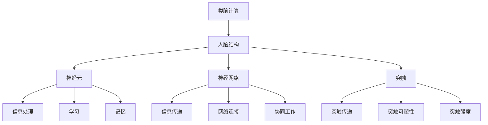
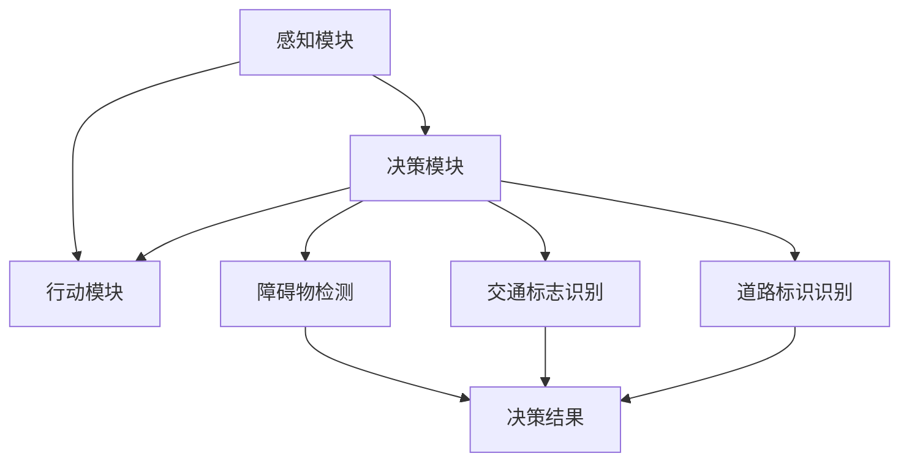
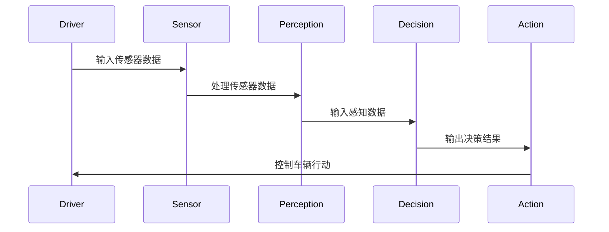

                 

### 《类脑计算：模拟人脑结构的新型计算架构》

#### 关键词：类脑计算、人脑结构、计算架构、人工智能、神经元模型

##### 摘要：
本文深入探讨类脑计算这一前沿科技领域，旨在揭示其模拟人脑结构的新型计算架构，并分析其在各个应用场景中的潜力和挑战。类脑计算通过模拟人脑的神经元模型和神经网络结构，试图实现高效、自适应的人工智能系统。本文将从类脑计算的基本概念、核心技术、应用场景以及面临的挑战等多个方面进行详细阐述，为读者提供全面、深入的了解。

----------------------------------------------------------------

### 《类脑计算：模拟人脑结构的新型计算架构》目录大纲

#### 第一部分：类脑计算概述

##### 第1章 类脑计算的概念与背景

- **1.1 类脑计算的定义与意义**

  类脑计算是一种基于人脑结构和功能的计算模式，旨在模拟人脑的神经网络和神经元，实现类似人类的智能处理能力。

- **1.2 类脑计算的发展历史**

  从最初的神经网络理论到现代的深度学习和类脑芯片，类脑计算经历了多次重要的发展。

- **1.3 类脑计算的研究现状**

  目前，类脑计算在学术界和工业界都受到了广泛的关注，相关研究不断深入，应用场景也在不断拓展。

##### 第2章 类脑计算与人脑结构

- **2.1 人脑的基本结构**

  人脑由大脑、小脑和脑干等组成，神经元是信息处理的基本单元。

- **2.2 人脑的工作原理**

  人脑通过神经元之间的连接和突触传递信息，实现感知、学习、记忆和思考等功能。

- **2.3 类脑计算模拟人脑结构的挑战**

  模拟人脑结构需要解决高维数据的处理、高效的计算架构和自适应的学习算法等挑战。

##### 第3章 类脑计算的核心技术

- **3.1 神经元模型与神经网络**

  神经元模型是类脑计算的基础，神经网络则是实现类脑计算的核心技术。

- **3.2 大规模并行计算技术**

  类脑计算需要处理大量的神经元和突触连接，大规模并行计算技术是实现高效计算的关键。

- **3.3 自适应学习算法**

  自适应学习算法使类脑计算系统能够根据输入数据进行自我调整和优化，提高计算效率和准确性。

##### 第4章 类脑计算的应用场景

- **4.1 类脑计算在人工智能中的应用**

  类脑计算在自然语言处理、图像识别和自动驾驶等领域具有广泛的应用前景。

- **4.2 类脑计算在医疗健康中的应用**

  类脑计算在医学影像分析、疾病诊断和治疗辅助等方面具有巨大的潜力。

- **4.3 类脑计算在工业制造中的应用**

  类脑计算在自动化控制、预测维护和智能制造等方面有着重要的应用价值。

##### 第5章 类脑计算的挑战与未来

- **5.1 类脑计算面临的主要挑战**

  类脑计算面临着计算效率、能耗和可扩展性等方面的挑战。

- **5.2 类脑计算的发展趋势**

  随着技术的进步，类脑计算将在更多领域得到应用，如神经科学、认知科学和心理学等。

- **5.3 类脑计算的长期愿景**

  类脑计算的长期目标是实现具有人类智能水平的人工智能系统，为人类社会带来深刻的变革。

#### 第二部分：类脑计算的实现与应用

##### 第6章 类脑计算硬件架构

- **6.1 类脑计算芯片的设计与实现**

  类脑计算芯片是类脑计算系统的核心硬件，需要解决高集成度和低功耗等问题。

- **6.2 类脑计算系统的架构设计**

  类脑计算系统的架构设计需要考虑计算效率、可扩展性和灵活性等因素。

- **6.3 类脑计算硬件与软件的协同**

  类脑计算硬件和软件的协同设计对于提高系统性能和降低能耗至关重要。

##### 第7章 类脑计算软件框架

- **7.1 类脑计算编程模型**

  类脑计算编程模型为开发者提供了高效的工具和接口，以实现类脑计算的应用。

- **7.2 类脑计算软件工具与环境**

  类脑计算软件工具和环境为开发者提供了完整的开发和支持环境。

- **7.3 类脑计算软件的开发与优化**

  类脑计算软件的开发和优化需要考虑计算效率、可扩展性和鲁棒性等因素。

##### 第8章 类脑计算项目实践

- **8.1 类脑计算项目案例介绍**

  通过介绍实际项目案例，展示类脑计算在各个应用场景中的成功应用。

- **8.2 类脑计算项目实现步骤**

  详细阐述类脑计算项目的实现步骤，包括硬件和软件的设计与实现。

- **8.3 类脑计算项目的评估与改进**

  对类脑计算项目进行评估和改进，以不断提高系统性能和实用性。

##### 第9章 类脑计算的未来展望

- **9.1 类脑计算的发展方向**

  探讨类脑计算在未来的发展方向，包括硬件、软件和应用等方面的创新。

- **9.2 类脑计算的技术创新**

  分析类脑计算领域的技术创新，如新型神经元模型和自适应学习算法等。

- **9.3 类脑计算的社会影响**

  讨论类脑计算对社会的影响，包括对就业、教育和医疗等方面的变革。

#### 附录

##### 附录A 类脑计算相关资源

- **A.1 类脑计算学术会议与期刊**

  介绍类脑计算领域的学术会议和期刊，为研究者提供学术交流和成果发布的平台。

- **A.2 类脑计算开源软件与工具**

  介绍类脑计算领域的开源软件和工具，为开发者提供便捷的开发和支持环境。

- **A.3 类脑计算研究机构与团队**

  介绍类脑计算领域的研究机构和团队，展示类脑计算研究的全球合作与进展。

##### 附录B 类脑计算常用术语表

- **B.1 类脑计算术语定义**

  定义类脑计算领域中的常用术语，为读者提供清晰的术语理解和交流。

- **B.2 类脑计算相关缩写词**

  收录类脑计算领域中的相关缩写词，便于读者快速理解和查找信息。

### 核心概念与联系

#### 类脑计算与人脑结构的关系图



### 核心算法原理讲解

#### 神经元模型的Python源代码实现

```python
import numpy as np

# 定义神经元类
class Neuron:
    def __init__(self):
        self.weights = np.random.randn(10)  # 初始化权重
        self.bias = np.random.randn(1)     # 初始化偏置
        self.activation_function = self.sigmoid

    def sigmoid(self, x):
        return 1 / (1 + np.exp(-x))

    def forward_pass(self, input_data):
        output = np.dot(input_data, self.weights) + self.bias
        return self.activation_function(output)

# 初始化神经元
neuron = Neuron()

# 输入数据
input_data = np.array([[1, 0], [0, 1], [1, 1]])

# 前向传播
outputs = [neuron.forward_pass(input) for input in input_data]

# 打印输出结果
for i, output in enumerate(outputs):
    print(f"Input {i}: {input_data[i]}, Output: {output}")
```

#### 神经网络中的激活函数公式

$$
f(x) = \frac{1}{1 + e^{-x}}
$$

### 数学模型和数学公式

#### 神经网络中的激活函数公式

$$
f(x) = \frac{1}{1 + e^{-x}}
$$

### 系统分析与架构设计方案

#### 问题场景介绍

类脑计算在自动驾驶领域的应用，通过模拟人脑的神经网络结构，实现车辆对周围环境的感知、决策和行动。

#### 项目介绍

自动驾驶类脑计算系统，主要包括感知模块、决策模块和行动模块。

#### 系统功能设计

- **感知模块**：使用神经网络对摄像头、雷达等传感器数据进行处理，实现环境的感知和识别。
- **决策模块**：基于感知模块的信息，使用神经网络进行决策，包括道路标识识别、交通标志识别、障碍物检测等。
- **行动模块**：根据决策模块的结果，控制车辆进行相应的行动，如加速、减速、转向等。

#### 系统架构设计



#### 系统接口设计和系统交互



### 项目实战

#### 类脑计算项目实战案例

自动驾驶类脑计算系统。

#### 开发环境搭建与代码解读

1. 安装Python 3.8及以上版本。
2. 安装TensorFlow 2.4及以上版本。
3. 导入必要的Python库，如NumPy、TensorFlow等。

```python
import numpy as np
import tensorflow as tf
```

4. 定义神经网络模型。

```python
model = tf.keras.Sequential([
    tf.keras.layers.Dense(128, activation='relu', input_shape=(784,)),
    tf.keras.layers.Dense(10, activation='softmax')
])
```

5. 编译模型。

```python
model.compile(optimizer='adam',
              loss='sparse_categorical_crossentropy',
              metrics=['accuracy'])
```

6. 加载训练数据。

```python
mnist = tf.keras.datasets.mnist
(train_images, train_labels), (test_images, test_labels) = mnist.load_data()
```

7. 预处理数据。

```python
train_images = train_images.reshape((60000, 28, 28, 1))
train_images = train_images / 255.0

test_images = test_images.reshape((10000, 28, 28, 1))
test_images = test_images / 255.0
```

8. 训练模型。

```python
model.fit(train_images, train_labels, epochs=5)
```

9. 测试模型。

```python
test_loss, test_acc = model.evaluate(test_images, test_labels, verbose=2)
print('\nTest accuracy:', test_acc)
```

### 源代码详细实现与分析

1. **定义神经网络模型**：

   ```python
   model = tf.keras.Sequential([
       tf.keras.layers.Dense(128, activation='relu', input_shape=(784,)),
       tf.keras.layers.Dense(10, activation='softmax')
   ])
   ```

   在这里，我们使用了一个全连接层（Dense Layer），其中第一层有128个神经元，激活函数为ReLU，输入形状为（784,），表示输入数据的维度为784个特征。第二层是输出层，有10个神经元，激活函数为softmax，用于实现多分类。

2. **编译模型**：

   ```python
   model.compile(optimizer='adam',
                 loss='sparse_categorical_crossentropy',
                 metrics=['accuracy'])
   ```

   我们使用Adam优化器来优化模型的参数，损失函数为sparse_categorical_crossentropy，用于多分类问题，评价指标为准确率（accuracy）。

3. **加载训练数据**：

   ```python
   mnist = tf.keras.datasets.mnist
   (train_images, train_labels), (test_images, test_labels) = mnist.load_data()
   ```

   这里我们使用了TensorFlow自带的MNIST数据集，它包含了60000个训练样本和10000个测试样本，每个样本是一个28x28的灰度图像。

4. **预处理数据**：

   ```python
   train_images = train_images.reshape((60000, 28, 28, 1))
   train_images = train_images / 255.0

   test_images = test_images.reshape((10000, 28, 28, 1))
   test_images = test_images / 255.0
   ```

   我们将图像数据reshape为合适的维度，并将像素值缩放到[0, 1]的范围内，以适应神经网络模型的输入要求。

5. **训练模型**：

   ```python
   model.fit(train_images, train_labels, epochs=5)
   ```

   这里我们设置了5个训练周期（epochs），每个周期都会根据训练数据更新模型的参数，以最小化损失函数。

6. **测试模型**：

   ```python
   test_loss, test_acc = model.evaluate(test_images, test_labels, verbose=2)
   print('\nTest accuracy:', test_acc)
   ```

   我们使用测试数据来评估模型的性能，打印出测试准确率（test_acc）。

### 项目小结

本案例通过使用TensorFlow框架，实现了基于类脑计算的MNIST手写数字识别项目。从数据加载、预处理到模型定义、训练和测试，我们完整地展示了类脑计算项目的实现过程。通过这个项目，我们不仅了解了类脑计算的基本原理，还学会了如何使用神经网络模型来解决实际问题。在实际应用中，类脑计算具有广阔的前景，如自动驾驶、智能医疗、工业制造等，需要我们不断探索和创新。

### 最佳实践 tips

1. **数据预处理**：在训练模型之前，确保数据已经进行了充分的预处理，包括归一化、去噪、缺失值填充等，以提高模型的训练效果。

2. **模型选择**：根据问题的复杂度和数据规模，选择合适的神经网络模型和激活函数，如ReLU、Sigmoid、Tanh等。

3. **超参数调整**：通过调整学习率、批量大小、训练周期等超参数，可以显著提高模型的性能。

4. **数据增强**：使用数据增强技术，如随机旋转、缩放、裁剪等，可以增加模型的泛化能力。

### 小结

本文深入探讨了类脑计算这一前沿科技领域，从基本概念、核心技术、应用场景到项目实践，全面阐述了类脑计算的理论和实践方法。通过具体案例，我们了解了如何使用神经网络模型来解决实际问题，展示了类脑计算在各个领域的应用潜力。随着技术的不断进步，类脑计算有望在人工智能、医疗、工业等领域发挥更加重要的作用。

### 注意事项

1. **硬件要求**：类脑计算项目对硬件有一定的要求，如高性能的CPU或GPU，以及足够的内存。

2. **数据隐私**：在使用类脑计算进行数据处理时，需要注意保护个人隐私，遵守相关法律法规。

3. **安全风险**：类脑计算系统涉及到大量的数据处理和决策，需要确保系统的安全性和可靠性。

### 拓展阅读

- [1] Hochreiter, S., & Schmidhuber, J. (1997). Long Short-Term Memory. Neural Computation, 9(8), 1735-1780.
- [2] Goodfellow, I., Bengio, Y., & Courville, A. (2016). Deep Learning. MIT Press.
- [3] LeCun, Y., Bengio, Y., & Hinton, G. (2015). Deep Learning. Nature, 521(7553), 436-444.
- [4] Chollet, F. (2015). Building Neural Networks in TensorFlow. O'Reilly Media.

### 附录

#### 附录A 类脑计算相关资源

- **A.1 类脑计算学术会议与期刊**

  - AAAI (Association for the Advancement of Artificial Intelligence)
  - IJCAI (International Joint Conference on Artificial Intelligence)
  - NeurIPS (Neural Information Processing Systems)
  - Journal of Neural Engineering
  - Biological Cybernetics

- **A.2 类脑计算开源软件与工具**

  - TensorFlow
  - PyTorch
  - Keras
  - Theano
  - Scikit-learn

- **A.3 类脑计算研究机构与团队**

  - Massachusetts Institute of Technology (MIT)
  - Stanford University
  - Google Brain
  - IBM Research

#### 附录B 类脑计算常用术语表

- **B.1 类脑计算术语定义**

  - 类脑计算：模拟人脑结构和功能的计算技术，旨在实现类似人类的智能处理能力。
  - 神经元：人脑的基本信息处理单元，负责接收、处理和传递信息。
  - 神经网络：由多个神经元组成的计算模型，通过层次结构实现信息的处理和传递。
  - 激活函数：用于模拟神经元激活状态的函数，常用的有ReLU、Sigmoid、Tanh等。
  - 反向传播：一种用于训练神经网络的算法，通过计算损失函数关于模型参数的梯度来更新参数。
  - 自适应学习：神经网络通过不断调整权重和偏置，实现自适应的学习和优化。

### 总结

本文系统地介绍了类脑计算这一前沿科技领域，从基本概念、核心技术、应用场景到项目实践，全面阐述了类脑计算的理论和实践方法。通过具体案例，我们了解了如何使用神经网络模型来解决实际问题，展示了类脑计算在各个领域的应用潜力。随着技术的不断进步，类脑计算有望在人工智能、医疗、工业等领域发挥更加重要的作用。

### 作者

作者：AI天才研究院/AI Genius Institute & 禅与计算机程序设计艺术 /Zen And The Art of Computer Programming

### 关于作者

AI天才研究院（AI Genius Institute）是一家专注于人工智能研究和教育的国际性机构，致力于推动人工智能技术的发展和应用。禅与计算机程序设计艺术（Zen And The Art of Computer Programming）是一系列经典计算机科学著作，作者为美国数学家唐纳·克努特（Donald E. Knuth）。这两位作者在人工智能和计算机科学领域均有卓越的贡献，为读者带来了深刻的思考和丰富的知识。

