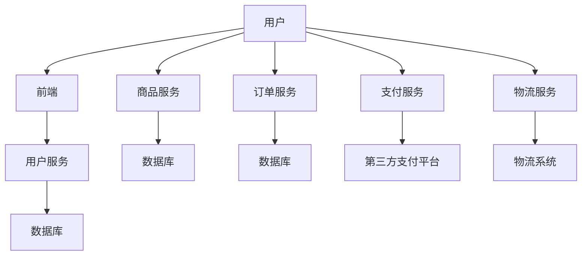
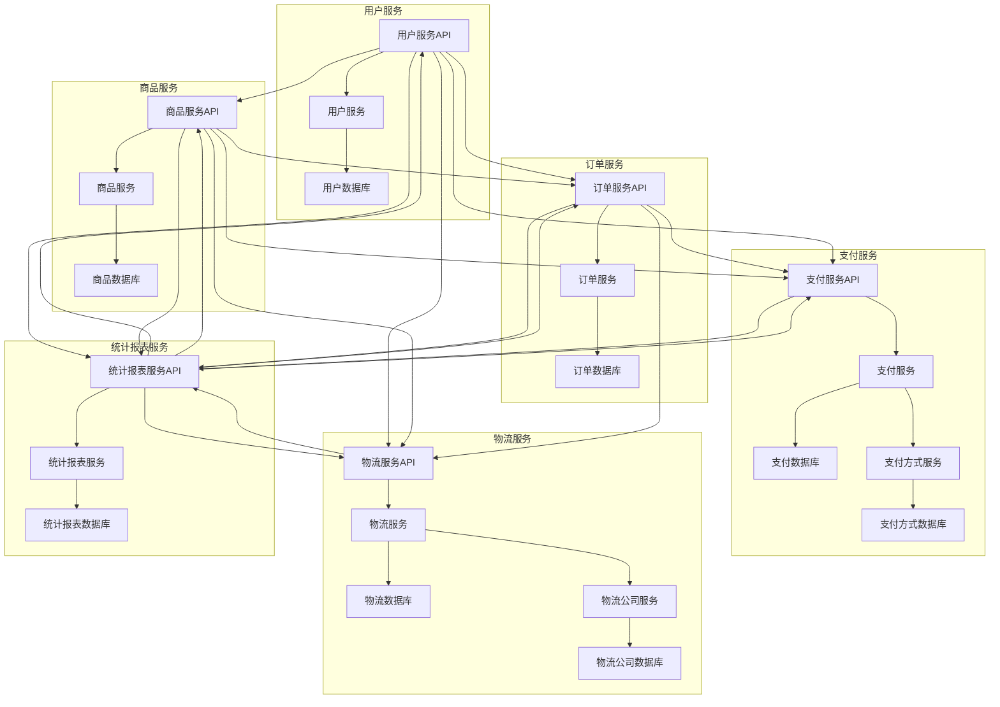
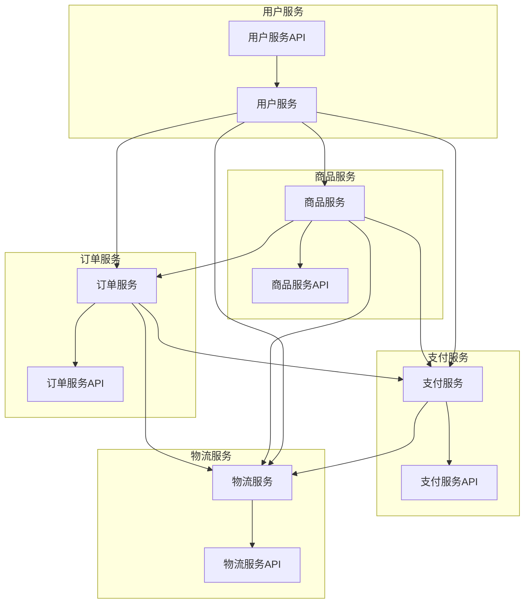

                 


## 系统分析：让研发事半功倍的关键技能

### 关键词：系统分析、研发、效率、方法论、实践

#### 摘要：

系统分析是软件开发过程中不可或缺的一环，它不仅能够帮助我们理清复杂系统的结构，还能提高研发团队的效率和项目的成功率。本文将深入探讨系统分析的核心概念、基本原理、工具技术以及其在研发中的应用，旨在为广大研发人员提供一套实用的系统分析方法论。通过本文的学习，读者将能够掌握系统分析的关键技能，让研发工作事半功倍。

### 目录

1. 第一部分：系统分析基础
   1.1 系统分析与研发概述
   1.2 系统分析的基本原理
   1.3 系统分析的工具与技术
   1.4 系统需求分析
   1.5 系统设计与架构
   1.6 系统分析与建模实践

2. 第二部分：系统分析与研发优化
   2.1 系统分析中的敏捷开发
   2.2 系统分析中的自动化测试
   2.3 持续集成与持续部署
   2.4 系统分析与研发效能提升
   2.5 项目实战与最佳实践

### 1.1 系统分析与研发概述

#### 1.1.1 系统分析的定义

系统分析是一种通过深入理解和研究系统的各个组成部分及其相互关系，来识别系统需求和确定系统设计的活动。它涉及到对系统目标、功能、性能、约束以及潜在风险的全面分析，旨在为系统的设计、实施和维护提供坚实的基础。

#### 1.1.2 系统分析的重要性

系统分析在研发过程中扮演着至关重要的角色。首先，它能够帮助我们明确系统的需求，确保研发工作方向正确。其次，通过系统分析，我们可以提前识别潜在的问题和风险，从而制定相应的预防和应对措施。最后，系统分析为后续的系统设计和实施提供了清晰的指导，提高了研发的效率和质量。

#### 1.1.3 研发过程中的系统分析

在研发过程中，系统分析通常分为以下几个阶段：

1. **需求分析**：收集和分析用户需求，明确系统必须实现的功能。
2. **系统设计**：根据需求分析的结果，设计系统的架构和模块。
3. **系统实现**：根据系统设计文档，进行具体的编码和实现工作。
4. **系统测试**：验证系统是否符合需求，确保系统的稳定性和可靠性。
5. **系统部署**：将系统部署到生产环境，进行实际运行和监控。

### 1.2 系统分析的基本原理

#### 1.2.1 系统思维

系统思维是一种全面的、整体的思维方式，它要求我们在分析问题时，不仅要关注系统的各个组成部分，还要关注它们之间的相互关系和系统作为一个整体的动态行为。

#### 1.2.2 系统模型与建模方法

系统模型是对系统进行抽象和描述的一种方式，它可以帮助我们更清晰地理解系统的结构和功能。常见的系统模型包括数据流图、实体关系图、状态图等。

- **数据流图**：描述系统中数据流动的路径和过程。
- **实体关系图**：描述系统中实体之间的关系和属性。
- **状态图**：描述系统中各个状态之间的转换关系。

#### 1.2.3 系统性能评估

系统性能评估是对系统运行效率、响应时间、资源利用率等进行评估的过程。它通常包括以下几个方面：

- **响应时间**：系统处理一个请求所需要的时间。
- **吞吐量**：单位时间内系统能够处理的数据量。
- **资源利用率**：系统对硬件资源（如CPU、内存、磁盘等）的使用情况。

### 1.3 系统分析的工具与技术

#### 1.3.1 流程图

流程图是一种用来描述系统工作流程和步骤的图形化工具。它可以帮助我们理清系统的工作过程，发现潜在的问题和改进点。

#### 1.3.2 数据流图

数据流图是一种用来描述系统中数据流动和处理的图形化工具。它可以帮助我们理解系统的数据流动过程，发现数据冗余和传输瓶颈。

#### 1.3.3 需求分析工具

需求分析工具用于帮助研发团队收集、记录和管理用户需求。常见的需求分析工具包括需求管理软件、需求文档模板等。

### 1.4 系统需求分析

#### 1.4.1 需求分类

系统需求可以分为功能需求和非功能需求。

- **功能需求**：系统必须实现的功能，如用户登录、数据查询等。
- **非功能需求**：系统性能、安全性、可靠性等方面的要求。

#### 1.4.2 需求收集

需求收集是系统分析的关键步骤。通过问卷调查、用户访谈、观察等方式，收集用户的需求和意见。

#### 1.4.3 需求文档编写

需求文档是对系统需求的详细描述，包括功能需求和非功能需求。编写需求文档时，要确保其清晰、准确、完整。

### 1.5 系统设计与架构

#### 1.5.1 系统设计原则

系统设计时，要遵循一些基本原则，如模块化、可扩展性、高内聚、低耦合等。

#### 1.5.2 系统架构设计

系统架构设计是系统设计的重要环节。它包括确定系统的整体结构、模块划分、数据流和控制流等。

#### 1.5.3 系统模块化设计

系统模块化设计是将系统划分为多个独立的模块，每个模块负责特定的功能。模块化设计可以提高系统的可维护性和可扩展性。

### 1.6 系统分析与建模实践

#### 1.6.1 实践案例1：电商系统分析

以电商系统为例，介绍系统分析的实践过程。

#### 1.6.2 实践案例2：在线教育系统分析

以在线教育系统为例，介绍系统分析的实践过程。

#### 1.6.3 实践案例3：智能制造系统分析

以智能制造系统为例，介绍系统分析的实践过程。

### 2.1 系统分析中的敏捷开发

#### 2.1.1 敏捷开发概述

敏捷开发是一种以用户需求为导向的软件开发方法，强调快速迭代、灵活应对变化。

#### 2.1.2 敏捷开发实践

敏捷开发的实践包括用户故事、迭代、增量交付等。

#### 2.1.3 敏捷开发与系统分析的关系

敏捷开发与系统分析相互促进，系统分析为敏捷开发提供了基础，敏捷开发为系统分析提供了实践的机会。

### 2.2 系统分析中的自动化测试

#### 2.2.1 自动化测试概述

自动化测试是一种通过编写测试脚本自动执行测试用例的方法。

#### 2.2.2 自动化测试工具

常见的自动化测试工具有Selenium、JUnit、TestNG等。

#### 2.2.3 自动化测试在系统分析中的应用

自动化测试可以帮助我们及时发现和修复系统问题，提高系统质量。

### 2.3 持续集成与持续部署

#### 2.3.1 持续集成概述

持续集成是一种通过自动化构建和测试，确保代码质量的方法。

#### 2.3.2 持续集成实践

持续集成实践包括代码仓库管理、自动化构建、自动化测试等。

#### 2.3.3 持续集成与系统分析的关系

持续集成可以确保系统在各个开发阶段的质量，与系统分析相辅相成。

### 2.4 系统分析与研发效能提升

#### 2.4.1 研发效能评估

研发效能评估是衡量研发团队工作效果的重要手段。

#### 2.4.2 研发效能优化策略

优化研发效能的策略包括流程优化、工具提升、团队协作等。

#### 2.4.3 案例分析：研发效能提升实践

通过具体案例分析，介绍如何提升研发效能。

### 2.5 项目实战与最佳实践

#### 2.5.1 项目实战

介绍系统分析在具体项目中的应用。

#### 2.5.2 最佳实践

分享系统分析的最佳实践经验和技巧。

#### 2.5.3 小结

总结系统分析的关键点和实践方法。

#### 2.5.4 注意事项

提醒读者在系统分析过程中需要注意的事项。

#### 2.5.5 拓展阅读

推荐相关书籍、文章和资源，供读者进一步学习。

### 结语

系统分析是软件开发过程中不可或缺的一环，它能够帮助我们提高研发效率和项目成功率。通过本文的学习，读者将能够掌握系统分析的关键技能，让研发工作事半功倍。

### 作者信息

作者：AI天才研究院/AI Genius Institute & 禅与计算机程序设计艺术 /Zen And The Art of Computer Programming

----------------------------------------------------------------

## 1.1 系统分析与研发概述

### 1.1.1 系统分析的定义

系统分析（Systems Analysis）是软件工程和系统设计过程中的一种关键活动，它涉及对现有或计划中的系统进行深入研究，以理解其工作原理、功能需求、性能指标、用户需求以及可能的改进措施。系统分析的主要目的是确保系统能够满足业务需求和用户期望，同时高效、稳定地运行。

在技术层面上，系统分析包括以下几个方面：

- **需求分析**：识别和理解用户需求，包括功能需求和非功能需求。
- **功能分解**：将复杂系统分解为更小的、可管理的部分。
- **性能评估**：评估系统的性能指标，如响应时间、吞吐量、资源利用率等。
- **风险评估**：识别系统可能面临的风险，并提出相应的应对措施。

### 1.1.2 系统分析的重要性

系统分析在软件研发过程中具有重要的地位，其重要性体现在以下几个方面：

1. **明确需求**：通过系统分析，研发团队能够明确系统必须实现的功能和性能要求，确保研发工作方向正确。
2. **预防风险**：系统分析可以帮助识别潜在的风险和问题，从而提前制定应对策略，减少项目后期因需求变更或问题爆发而导致的成本和时间浪费。
3. **优化设计**：系统分析提供了对系统结构和功能的深入理解，有助于优化系统设计，提高系统的可维护性和可扩展性。
4. **提高效率**：通过系统分析，研发团队可以更清晰地规划工作流程，减少重复工作，提高工作效率。

### 1.1.3 研发过程中的系统分析

在软件开发的生命周期中，系统分析贯穿始终，具体可以分为以下几个阶段：

1. **需求分析阶段**：系统分析首先从收集和分析用户需求开始，明确系统的功能、性能、安全等要求。这一阶段通常会产生需求规格说明书，作为后续设计的依据。
2. **设计阶段**：在需求分析的基础上，系统分析进一步对系统的架构、模块、接口等进行详细设计。设计阶段通常会产生系统设计文档，包括架构图、类图、接口规范等。
3. **实现阶段**：系统分析的结果指导实际的编码工作，研发团队根据设计文档进行具体编码和实现。
4. **测试阶段**：系统分析还包括对系统的测试，包括单元测试、集成测试、系统测试等，以确保系统功能正确、性能稳定。
5. **部署和维护阶段**：系统分析还在系统的部署和维护过程中发挥作用，通过监控和评估系统的性能和稳定性，不断优化系统。

### 1.1.4 系统分析的核心概念

在进行系统分析时，理解以下核心概念是非常重要的：

1. **系统观**：系统分析强调从整体上看待系统，理解系统的各个组成部分以及它们之间的相互作用。
2. **需求**：需求是系统分析的核心，包括功能需求和非功能需求，如性能、安全性、可靠性等。
3. **模型**：模型是系统分析的抽象表示，如数据流图、实体关系图、状态图等，用于描述系统的结构和行为。
4. **流程**：流程描述了系统从输入到输出的整个过程，包括各个步骤、环节和操作。
5. **性能**：性能是系统分析的一个重要指标，包括响应时间、吞吐量、资源利用率等。

### 1.1.5 系统分析的基本步骤

系统分析通常遵循以下基本步骤：

1. **问题识别**：明确分析的目标和范围，识别需要解决的问题。
2. **信息收集**：收集与系统相关的信息，包括用户需求、现有系统文档、业务流程等。
3. **需求分析**：分析用户需求，明确系统的功能和非功能需求。
4. **系统设计**：根据需求分析的结果，设计系统的架构和模块。
5. **模型构建**：构建系统模型，如数据流图、实体关系图等。
6. **风险评估**：评估系统可能面临的风险，并提出相应的解决方案。
7. **方案验证**：通过评审、模拟等方式，验证系统设计的可行性和有效性。
8. **文档编写**：编写系统分析文档，包括需求规格说明书、系统设计文档等。

### 1.1.6 系统分析与研发的协同作用

系统分析不仅对研发过程起到指导作用，还与研发过程紧密协同：

1. **需求驱动**：系统分析确定的用户需求直接驱动研发过程，确保研发工作始终围绕用户需求展开。
2. **设计优化**：系统分析为系统设计提供了理论基础和指导，通过不断优化设计，提高系统的可维护性和可扩展性。
3. **测试验证**：系统分析的结果用于指导测试过程，确保系统测试全面、有效。
4. **持续迭代**：系统分析贯穿整个研发周期，通过不断迭代和优化，确保系统能够持续满足用户需求。

### 总结

系统分析是软件开发过程中不可或缺的一环，它通过明确需求、优化设计、预防风险等方式，提高研发效率和项目成功率。理解系统分析的基本概念和流程，掌握系统分析的方法和工具，对于研发人员来说至关重要。在下一章中，我们将深入探讨系统分析的基本原理和方法。

### 参考文献

1. 《系统分析与设计：实用技术方法》作者：李明华
2. 《软件工程：实践者的研究方法》作者：Roger S. Pressman
3. 《敏捷软件开发：实践指南》作者：Michael C. Feathers

----------------------------------------------------------------

## 1.2 系统分析的基本原理

### 1.2.1 系统思维

系统思维（Systems Thinking）是系统分析的核心原则之一，它强调将系统视为一个整体，关注系统的各个组成部分及其相互关系。在系统思维中，我们不仅关注系统的输出，还要关注系统的输入、反馈机制以及各个组成部分之间的相互作用。

#### 系统思维的重要性

- **整体性**：系统思维强调从整体上看待系统，避免局部优化导致的全局失效。
- **反馈循环**：系统思维关注反馈循环，理解系统内部的行为如何影响系统的长期稳定性。
- **动态性**：系统思维认为系统是动态变化的，不同时间点系统的行为和状态可能有所不同。

#### 系统思维的应用

在系统分析中，系统思维的应用主要体现在以下几个方面：

1. **系统建模**：通过系统模型来描述系统的结构和行为，帮助理解系统的复杂性。
2. **需求分析**：从系统的整体视角出发，识别和理解用户需求。
3. **风险评估**：考虑系统内部和外部的各种因素，评估系统可能面临的风险。

### 1.2.2 系统模型与建模方法

系统模型是对系统进行抽象和描述的一种方式，它帮助我们理解系统的结构和行为。常见的系统模型包括数据流图（DFD）、实体关系图（ER图）和状态图等。

#### 数据流图（DFD）

数据流图是一种图形化工具，用于描述系统中数据的流动和转换过程。DFD包括以下元素：

- **实体**：表示数据的来源和去向。
- **处理过程**：表示对数据进行操作的过程。
- **数据存储**：表示数据的存储位置。
- **数据流**：表示数据在系统中的流动路径。

DFD的应用场景包括系统设计、需求分析、系统优化等。

#### 实体关系图（ER图）

实体关系图用于描述系统中实体之间的关系和属性。ER图包括以下元素：

- **实体**：表示系统中的对象或概念。
- **属性**：表示实体的特征或属性。
- **关系**：表示实体之间的关联。

ER图在数据库设计、需求分析、系统建模等领域有广泛应用。

#### 状态图

状态图用于描述系统中各个状态之间的转换关系。状态图包括以下元素：

- **状态**：表示系统的某个特定状态。
- **事件**：表示引起状态转换的触发条件。
- **转换**：表示状态之间的转换关系。

状态图在系统设计、需求分析、状态机实现等领域有广泛应用。

### 1.2.3 系统性能评估

系统性能评估是对系统在运行过程中表现出的性能进行量化评估的过程。系统性能评估包括以下几个方面：

1. **响应时间**：系统处理请求所需的时间，是衡量系统性能的重要指标。
2. **吞吐量**：单位时间内系统能够处理的数据量，也是衡量系统性能的关键指标。
3. **资源利用率**：系统对硬件资源（如CPU、内存、磁盘等）的使用情况，反映了系统的资源管理效率。

#### 性能评估方法

1. **基准测试**：通过运行标准测试用例，评估系统的性能。
2. **负载测试**：模拟实际用户负载，评估系统在高负载条件下的性能。
3. **压力测试**：在极端条件下，评估系统的稳定性和性能。

#### 性能优化策略

1. **代码优化**：通过优化算法和数据结构，减少系统资源的消耗。
2. **硬件升级**：增加系统硬件资源，提高系统的处理能力。
3. **缓存策略**：通过缓存技术，减少系统对数据库的访问频率。
4. **分布式架构**：通过分布式架构，提高系统的并发处理能力。

### 1.2.4 系统分析与模型构建

系统分析的核心在于构建系统模型，通过模型来描述和理解系统的结构和行为。模型构建的方法包括：

1. **自顶向下**：从整体出发，逐步细化到具体组件。
2. **自底向上**：从具体组件出发，逐步整合成整体系统。
3. **混合方法**：结合自顶向下和自底向上的方法，根据实际情况灵活运用。

#### 模型构建步骤

1. **问题定义**：明确分析的目标和范围。
2. **信息收集**：收集与系统相关的信息，包括需求、技术文档、业务流程等。
3. **模型构建**：根据收集到的信息，构建系统的模型，如数据流图、实体关系图等。
4. **模型验证**：通过评审、模拟等方式，验证模型的准确性和完整性。
5. **模型迭代**：根据验证结果，不断迭代和优化模型。

### 1.2.5 系统分析与项目管理

系统分析不仅是技术活动，还涉及到项目管理。在项目管理中，系统分析可以帮助：

1. **需求管理**：确保项目的需求明确、完整和可管理。
2. **风险管理**：识别项目中的潜在风险，并制定相应的应对策略。
3. **进度管理**：通过系统分析，制定合理的项目进度计划，并监控项目进展。

### 1.2.6 系统分析与跨学科融合

系统分析不仅仅是软件工程领域的问题，还涉及到跨学科的知识。例如：

1. **管理学**：系统分析中的需求分析和项目管理与管理学密切相关。
2. **经济学**：系统性能评估中的成本效益分析需要经济学知识。
3. **心理学**：用户需求分析需要理解用户行为和心理。

### 总结

系统分析的基本原理包括系统思维、系统模型与建模方法、系统性能评估以及系统分析与项目管理等多个方面。理解这些原理，有助于我们更好地进行系统分析，提高研发效率和项目成功率。在下一章中，我们将探讨系统分析的具体工具和技术。

### 参考文献

1. 《系统分析与设计：实用技术方法》作者：李明华
2. 《软件工程：实践者的研究方法》作者：Roger S. Pressman
3. 《系统思维的应用与实践》作者：John Miller

----------------------------------------------------------------

## 1.3 系统分析的工具与技术

### 1.3.1 流程图

流程图（Flowchart）是一种用于描述系统流程和操作的图形化工具，它通过图形和符号表示系统中的各个步骤、条件和决策点。流程图有助于清晰展示系统的工作流程，便于理解和分析。

#### 流程图的基本元素

- **开始/结束框**：表示流程的开始和结束。
- **过程框**：表示执行的操作或处理过程。
- **决策框**：表示根据条件做出选择的分支点。
- **输入/输出框**：表示数据的输入和输出。
- **连接符**：表示流程中各个元素之间的连接。

#### 流程图的应用

- **需求分析**：用于描述用户需求和工作流程。
- **系统设计**：用于设计系统的架构和模块。
- **测试用例设计**：用于描述测试的步骤和条件。
- **项目管理和协调**：用于展示项目的工作流程和时间线。

### 1.3.2 数据流图

数据流图（Data Flow Diagram，DFD）是一种用于描述系统中数据流动和处理的图形化工具。它通过图形和符号表示系统中的数据流、处理过程、数据存储和外部实体。

#### 数据流图的基本元素

- **外部实体**：表示与系统交互的外部实体，如用户、数据库等。
- **数据存储**：表示数据存储的位置，如数据库、文件系统等。
- **处理过程**：表示对数据进行处理的过程。
- **数据流**：表示数据在系统中的流动路径。

#### 数据流图的应用

- **需求分析**：用于理解系统的数据需求和流程。
- **系统设计**：用于设计系统的模块和接口。
- **性能评估**：用于分析系统的数据处理能力和性能。
- **系统优化**：用于识别系统中的瓶颈和改进点。

### 1.3.3 需求分析工具

需求分析工具是用于帮助研发团队收集、记录和管理用户需求的各种工具。这些工具包括需求管理软件、需求文档模板等。

#### 需求分析工具的基本功能

- **需求收集**：用于收集用户需求，包括功能需求和非功能需求。
- **需求记录**：用于记录和分析需求，形成需求规格说明书。
- **需求管理**：用于管理和跟踪需求，包括需求变更和优先级调整。
- **需求评审**：用于评审需求文档，确保需求完整、清晰和可实现。

#### 常见的需求分析工具

- **JIRA**：一款功能强大的需求管理工具，支持需求收集、记录和管理。
- **Confluence**：一款知识管理和协作工具，可用于编写和共享需求文档。
- **Excel**：一种简单易用的需求文档模板，适用于小型项目。

### 1.3.4 用户体验设计工具

用户体验设计工具是用于设计系统界面和交互体验的各种工具。这些工具包括原型设计工具、用户测试工具等。

#### 用户体验设计工具的基本功能

- **原型设计**：用于创建系统的界面原型，展示系统功能和交互设计。
- **交互设计**：用于定义系统的交互规则和用户操作流程。
- **用户测试**：用于验证系统界面和交互设计是否符合用户需求。

#### 常见的用户体验设计工具

- **Axure RP**：一款专业的原型设计工具，支持创建丰富交互的界面原型。
- **Sketch**：一款流行的界面设计工具，适用于移动和Web应用设计。
- **Figma**：一款在线协作设计工具，支持多人实时协作设计。

### 1.3.5 系统建模工具

系统建模工具是用于构建系统模型的各种工具。这些工具包括UML建模工具、数据建模工具等。

#### 系统建模工具的基本功能

- **UML建模**：用于创建系统的UML模型，包括类图、用例图、序列图等。
- **数据建模**：用于创建系统的数据库模型，包括实体关系图、数据流图等。
- **代码生成**：根据模型生成代码，实现系统的模块和接口。

#### 常见的系统建模工具

- **Enterprise Architect**：一款功能强大的UML建模工具，支持多种建模语言和代码生成。
- **MySQL Workbench**：一款数据建模工具，用于创建和设计数据库模型。
- **PowerDesigner**：一款综合的建模工具，支持系统建模、数据建模和流程建模。

### 1.3.6 自动化测试工具

自动化测试工具是用于实现系统测试自动化的一系列工具。这些工具包括测试框架、测试脚本生成器等。

#### 自动化测试工具的基本功能

- **测试脚本生成**：根据测试用例生成自动化测试脚本。
- **测试执行**：自动执行测试脚本，记录测试结果。
- **测试报告**：生成测试报告，展示测试结果和分析。

#### 常见的自动化测试工具

- **Selenium**：一款开源的自动化测试框架，支持多种浏览器和操作系统。
- **JUnit**：一款流行的Java测试框架，用于编写和执行测试用例。
- **TestNG**：一款功能强大的测试框架，支持多线程测试和数据驱动测试。

### 1.3.7 项目管理工具

项目管理工具是用于管理和协调项目进度的工具。这些工具包括任务管理工具、时间跟踪工具等。

#### 项目管理工具的基本功能

- **任务管理**：用于分配任务、跟踪任务进度和状态。
- **时间跟踪**：用于记录项目成员的工作时间，生成工作日志。
- **项目报告**：生成项目进度报告，展示项目状态和关键指标。

#### 常见的项目管理工具

- **JIRA**：一款功能丰富的项目管理工具，支持任务管理、时间跟踪和项目报告。
- **Trello**：一款简单易用的任务管理工具，适用于小型项目和团队协作。
- **Asana**：一款专业的项目管理工具，支持任务管理、时间跟踪和团队协作。

### 1.3.8 系统分析与工具选择

在系统分析过程中，选择合适的工具至关重要。选择工具时应考虑以下因素：

- **项目需求**：根据项目的具体需求和特点，选择合适的工具。
- **团队技能**：考虑团队对工具的熟悉程度和技能水平。
- **成本效益**：考虑工具的成本和预期效益，确保投资回报。
- **集成性**：考虑工具与其他系统或工具的集成性，确保顺畅的工作流。

### 总结

系统分析的工具和技术种类繁多，每种工具都有其独特的功能和适用场景。掌握这些工具，能够帮助研发团队更高效地完成系统分析工作，提高项目的成功率。在下一章中，我们将进一步探讨系统需求分析的具体方法和实践。

### 参考文献

1. 《系统分析与设计：实用技术方法》作者：李明华
2. 《软件工程：实践者的研究方法》作者：Roger S. Pressman
3. 《用户体验设计工具与应用》作者：李明

----------------------------------------------------------------

## 1.4 系统需求分析

### 1.4.1 需求分类

系统需求分析的第一步是理解并分类系统的需求。需求通常分为功能需求和非功能需求。

#### 功能需求

功能需求描述系统必须实现的功能和行为。例如：

- **用户登录**：系统需要提供一个用户登录功能，用户可以输入用户名和密码进行登录。
- **数据查询**：系统需要提供数据查询功能，用户可以通过输入关键字进行搜索。

功能需求通常具体且明确，是系统设计和实现的基础。

#### 非功能需求

非功能需求描述系统性能、安全性和可靠性等方面的要求。例如：

- **性能需求**：系统需要在1000个并发用户下，响应时间不超过2秒。
- **安全性需求**：系统需要确保用户数据的安全，防止未经授权的访问。

非功能需求通常较为抽象，但同样重要，直接影响系统的可用性和用户满意度。

### 1.4.2 需求收集

需求收集是系统需求分析的核心步骤，其目标是全面、准确地获取用户需求。以下是几种常见的需求收集方法：

#### 用户访谈

用户访谈是一种直接与用户交流的方法，通过面对面或远程会议，了解用户的具体需求、使用场景和期望。

#### 问卷调查

问卷调查是一种通过问卷形式收集大量用户需求的方法，适合于用户群体较为分散或数量较多的情况。

#### 观察法

观察法是在用户实际使用系统的过程中，观察并记录用户行为和需求，适用于用户体验分析。

#### 专家评审

专家评审是通过邀请行业专家对系统需求进行分析和评审，获取专业意见和建议。

### 1.4.3 需求文档编写

需求文档是对系统需求的详细描述，包括功能需求和非功能需求。编写需求文档时，应确保其清晰、准确、完整。以下是编写需求文档的几个关键点：

#### 功能需求描述

功能需求描述应包括以下内容：

- **功能描述**：详细描述功能的具体行为和操作。
- **输入条件**：描述触发功能所需的输入条件。
- **输出结果**：描述功能执行后的输出结果。
- **示例**：提供实际示例，帮助理解和验证功能。

#### 非功能需求描述

非功能需求描述应包括以下内容：

- **性能要求**：详细描述系统的性能指标，如响应时间、吞吐量等。
- **安全性要求**：描述系统的安全措施，如用户认证、数据加密等。
- **可靠性要求**：描述系统的可靠性指标，如故障率、恢复时间等。

#### 文档结构

一个完整的需求文档通常包括以下结构：

- **概述**：简要介绍系统背景和需求目标。
- **功能需求**：详细描述每个功能需求。
- **非功能需求**：详细描述每个非功能需求。
- **用例图**：用例图帮助理解系统功能和行为。
- **用户界面设计**：描述系统的用户界面设计，包括界面布局、交互设计等。
- **附录**：包括相关文档、数据字典、术语表等。

#### 文档评审

编写完需求文档后，应进行多轮评审，确保文档的准确性和完整性。评审通常包括以下内容：

- **内部评审**：由团队成员进行初步评审，发现和修正文档中的错误和不足。
- **用户评审**：邀请用户代表进行评审，确保文档满足用户需求。
- **专家评审**：邀请行业专家进行评审，提供专业意见和建议。

### 1.4.4 需求管理

需求管理是确保需求在整个系统开发过程中得到有效管理和控制的过程。以下是需求管理的几个关键点：

#### 需求变更控制

在项目开发过程中，需求变更在所难免。需求变更控制包括以下内容：

- **变更申请**：任何需求变更都需要提出正式的变更申请，说明变更的原因和影响。
- **变更评估**：评估需求变更对项目进度、成本和风险的影响。
- **变更批准**：根据评估结果，决定是否批准需求变更。
- **变更实施**：根据批准的变更，修改相关文档和系统设计。

#### 需求跟踪

需求跟踪是确保需求在整个开发周期内得到满足的过程。需求跟踪包括以下内容：

- **需求分配**：将需求分配给相应的开发团队和成员。
- **需求实现**：跟踪需求实现的进度和质量。
- **需求验证**：验证需求是否按照预期实现，确保需求得到满足。

#### 需求文档管理

需求文档管理是确保需求文档的版本控制和更新维护。需求文档管理包括以下内容：

- **版本控制**：确保需求文档的每个版本都被妥善记录和保存。
- **更新维护**：根据项目进展和需求变更，及时更新和维护需求文档。

### 1.4.5 需求分析与设计

需求分析不仅仅是收集和记录需求，还需要将需求转化为系统的设计。以下是需求分析与设计的关键点：

#### 需求建模

需求建模是将需求转化为系统模型的过程。常见的需求建模方法包括数据流图（DFD）、用例图（Use Case Diagram）等。

- **数据流图（DFD）**：用于描述系统的数据流动和处理过程。
- **用例图（Use Case Diagram）**：用于描述系统的功能和行为，展示用户与系统交互的场景。

#### 需求验证

需求验证是确保需求正确和理解一致的过程。需求验证包括以下内容：

- **需求评审**：通过评审需求文档，确保需求的完整性和准确性。
- **需求验证测试**：编写和执行需求验证测试用例，确保需求得到实现和满足。

#### 需求文档与设计文档的关联

需求文档与设计文档之间应保持紧密的关联。需求文档应明确指出每个需求在系统设计中的对应部分，确保设计满足需求。

### 总结

系统需求分析是系统设计的重要基础，通过正确理解和记录用户需求，确保系统能够满足业务需求和用户期望。有效的需求收集、需求文档编写和需求管理，以及需求与设计的关联，是确保系统成功的关键。在下一章中，我们将探讨系统设计与架构的基本原理。

### 参考文献

1. 《软件需求工程：实用方法与实践》作者：马青
2. 《系统分析与设计：实用技术方法》作者：李明华
3. 《用户体验设计手册》作者：唐纳德·诺曼

----------------------------------------------------------------

## 1.5 系统设计与架构

### 1.5.1 系统设计原则

系统设计是软件开发过程中的关键环节，它决定了系统的可扩展性、可维护性和性能。以下是系统设计的一些基本原则：

#### 模块化

模块化是将系统划分为多个独立模块，每个模块负责特定的功能。模块化设计有助于提高系统的可维护性和可扩展性。

#### 高内聚、低耦合

高内聚意味着模块内部功能紧密相关，低耦合意味着模块之间相互独立。高内聚、低耦合的设计原则有助于提高系统的可维护性和可扩展性。

#### 可重用性

系统设计应考虑组件的可重用性，以便在未来的项目中重复使用，减少重复开发的工作量。

#### 扩展性

系统设计应考虑未来的扩展性，以便能够轻松地添加新功能或适应业务增长。

#### 可测试性

系统设计应易于测试，确保每个模块和功能都可以独立测试，提高测试效率。

#### 可靠性

系统设计应确保系统的稳定性和可靠性，避免因设计缺陷导致的系统崩溃或数据丢失。

#### 性能优化

系统设计应考虑性能优化，确保系统在处理大量数据和高并发场景下仍能保持良好的响应速度。

### 1.5.2 系统架构设计

系统架构设计是系统设计的重要组成部分，它决定了系统的整体结构和组件之间的关系。以下是系统架构设计的关键点：

#### 系统架构类型

1. **分层架构**：将系统分为多个层次，如表示层、业务逻辑层、数据访问层等，每个层次负责不同的功能。
2. **分布式架构**：将系统划分为多个独立的子系统，分布在不同的服务器上，以提高系统的可扩展性和容错能力。
3. **事件驱动架构**：基于事件驱动的系统设计，通过事件触发系统的行为和状态转换。
4. **微服务架构**：将系统划分为多个独立的微服务，每个微服务负责特定的功能，通过API进行通信。

#### 系统组件

系统架构设计涉及多个关键组件：

- **前端组件**：包括用户界面和前端逻辑，负责与用户交互。
- **后端组件**：包括业务逻辑处理和数据存储，负责处理用户请求和存储数据。
- **数据库**：存储系统数据，支持数据的查询、插入、更新和删除操作。
- **中间件**：提供系统间的通信和数据传输，如消息队列、缓存、负载均衡等。

#### 系统接口设计

系统接口设计是系统架构设计的重要部分，它定义了系统组件之间的交互方式。以下是系统接口设计的关键点：

- **RESTful API**：基于HTTP协议的接口设计，支持GET、POST、PUT、DELETE等HTTP方法。
- **SOAP API**：基于XML的接口设计，常用于企业级应用。
- **GraphQL**：一种查询语言，允许客户端指定需要的数据，减少数据传输。

#### 系统安全性设计

系统安全性设计是保护系统免受攻击和数据泄露的重要措施。以下是系统安全性设计的关键点：

- **用户认证和授权**：确保用户身份验证和授权，防止未经授权的访问。
- **数据加密**：对敏感数据进行加密存储和传输，确保数据安全。
- **安全审计**：记录系统操作日志，进行安全审计，及时发现和处理安全事件。
- **漏洞扫描和修复**：定期进行漏洞扫描，及时修复系统漏洞。

### 1.5.3 系统模块化设计

系统模块化设计是将系统划分为多个独立的模块，每个模块负责特定的功能。以下是系统模块化设计的关键点：

#### 模块划分

模块划分应基于功能、业务逻辑和组件之间的依赖关系。以下是常见的模块划分方法：

- **按功能划分**：根据系统功能将模块划分为用户管理、订单管理、商品管理、支付管理等。
- **按业务逻辑划分**：根据业务逻辑将模块划分为订单处理、库存管理、用户反馈处理等。
- **按组件类型划分**：根据组件类型将模块划分为前端组件、后端组件、数据库组件等。

#### 模块间接口

模块间接口是模块之间进行通信和协作的途径。以下是模块间接口设计的关键点：

- **定义清晰的接口规范**：明确模块之间的输入输出参数、调用方式等。
- **确保接口稳定性**：在模块升级或变更时，尽量保持接口的稳定性，减少对其他模块的影响。
- **接口文档**：编写详细的接口文档，包括接口说明、使用示例等，便于模块之间的协作。

#### 模块重用性

模块重用性是系统模块化设计的重要目标。以下是提高模块重用性的方法：

- **组件化**：将常用功能封装为独立的组件，便于在其他系统中重用。
- **抽象和泛化**：通过抽象和泛化，使模块具有更广泛的应用场景。
- **标准化**：制定模块开发的规范和标准，确保模块的一致性和可重用性。

### 1.5.4 系统架构设计与实例分析

为了更好地理解系统架构设计，以下通过一个电商系统架构的实例进行分析：

#### 系统背景

一个典型的电商系统需要实现商品展示、用户注册登录、购物车管理、订单处理、支付、物流等功能。

#### 系统架构设计

1. **前端架构**：采用分层架构，包括表示层、业务逻辑层和数据访问层。表示层负责与用户交互，业务逻辑层处理业务逻辑，数据访问层负责与数据库交互。

2. **后端架构**：采用微服务架构，将系统划分为多个独立的微服务，如用户服务、商品服务、订单服务、支付服务、物流服务等。

3. **数据库设计**：使用关系型数据库存储用户信息、商品信息、订单信息等，使用NoSQL数据库存储用户行为数据、缓存数据等。

4. **中间件**：使用消息队列（如RabbitMQ）处理订单异步处理和物流通知，使用缓存（如Redis）提高系统性能。

5. **接口设计**：前端与后端通过RESTful API进行通信，后端微服务之间通过内部API进行协作。

6. **安全性设计**：使用HTTPS协议加密通信数据，实现用户认证和授权，对敏感数据进行加密存储。

#### 系统架构图



#### 系统功能描述

1. **用户注册登录**：用户在前端注册和登录，用户服务处理注册和登录请求，存储用户信息到数据库。
2. **商品展示**：用户在前端查看商品列表和详情，商品服务从数据库中获取商品信息，返回给前端。
3. **购物车管理**：用户可以将商品添加到购物车，用户服务处理购物车请求，更新数据库中的购物车信息。
4. **订单处理**：用户提交订单，订单服务处理订单请求，生成订单信息，存储到数据库，并通知支付服务。
5. **支付**：用户在支付服务中选择支付方式，支付服务与第三方支付平台交互，完成支付，并将支付结果通知订单服务。
6. **物流**：订单支付成功后，物流服务生成物流单号，通知物流系统，用户可以在前端查看物流信息。

### 总结

系统设计与架构设计是软件开发过程中的关键环节，通过正确的原则和方法，可以构建出高效、可维护和可扩展的系统。在下一章中，我们将探讨系统分析与建模实践，通过具体案例展示系统分析的过程和方法。

### 参考文献

1. 《软件架构设计：创建与使用模式》作者：Mark Richards
2. 《微服务架构设计》作者：Sam Newman
3. 《分布式系统设计》作者：Martin Kleppmann

----------------------------------------------------------------

## 1.6 系统分析与建模实践

### 1.6.1 实践案例1：电商系统分析

#### 项目背景

某电商公司计划开发一个全新的电商平台，以提高用户购物体验和提升业务效率。公司希望系统能够支持大量的并发用户，提供丰富的商品展示、便捷的购物流程、安全的支付系统和完善的物流跟踪服务。

#### 系统需求分析

在系统分析阶段，团队进行了以下工作：

1. **用户访谈**：与公司管理层、销售人员和技术团队进行了多次访谈，了解用户需求、业务流程和系统预期目标。
2. **问卷调查**：通过问卷调查收集了潜在用户对电商平台功能、界面设计和购物体验的期望。
3. **业务流程分析**：梳理了从用户注册、登录、浏览商品、加入购物车、下单、支付到物流跟踪的完整业务流程。
4. **功能需求收集**：明确了系统需要实现的功能，如用户注册、商品搜索、购物车管理、订单管理、支付和物流跟踪等。
5. **非功能需求收集**：确定了系统的性能需求、安全性需求、可靠性需求和用户体验需求。

#### 系统设计

在系统设计阶段，团队进行了以下工作：

1. **系统架构设计**：采用了微服务架构，将系统划分为多个独立的微服务，如用户服务、商品服务、订单服务、支付服务、物流服务等。
2. **数据库设计**：使用了关系型数据库存储用户信息和订单信息，使用NoSQL数据库存储商品信息和缓存数据。
3. **接口设计**：定义了系统各微服务之间的API接口，确保服务之间的高效通信。
4. **安全性设计**：采用了HTTPS协议、用户认证和授权、数据加密等措施，保障系统的安全性。

#### 系统实现

在系统实现阶段，团队进行了以下工作：

1. **前端开发**：使用React框架开发了用户界面，实现了用户注册、登录、商品浏览、购物车管理、订单提交和支付等功能。
2. **后端开发**：使用Spring Boot框架开发了用户服务、商品服务、订单服务、支付服务和物流服务，实现了各微服务的功能。
3. **数据库操作**：使用Hibernate框架进行数据库操作，实现了用户信息和订单信息的存储和查询。
4. **测试**：编写了单元测试和集成测试，确保系统功能正确且稳定。

#### 系统部署与维护

1. **部署**：使用Docker容器化技术部署了各个微服务，提高了系统的可移植性和可扩展性。
2. **监控**：使用了Prometheus和Grafana进行系统监控，实时监控系统的性能和健康状态。
3. **维护**：定期进行系统维护和升级，修复发现的问题和漏洞。

#### 实践总结

通过电商系统分析实践，团队成功地实现了以下目标：

1. **明确需求**：通过用户访谈和问卷调查，明确了用户需求和业务流程，确保系统设计满足用户期望。
2. **优化设计**：采用了微服务架构，提高了系统的可扩展性和可维护性。
3. **高效开发**：使用了现代化的开发工具和框架，提高了开发效率和代码质量。
4. **稳定部署**：通过容器化技术和监控系统，确保了系统的稳定运行。

### 1.6.2 实践案例2：在线教育系统分析

#### 项目背景

某在线教育平台计划上线新的课程管理系统，以支持课程创建、课程发布、课程订阅和在线学习等功能。平台需要支持大量的并发用户，提供流畅的交互体验和高效的数据处理能力。

#### 系统需求分析

在系统分析阶段，团队进行了以下工作：

1. **用户访谈**：与平台管理层、课程开发者、课程管理员和学生代表进行了访谈，了解他们的需求和使用场景。
2. **需求收集**：明确了系统需要实现的功能，如课程创建、课程发布、课程订阅、在线学习、成绩管理等。
3. **业务流程分析**：梳理了从课程创建、发布、订阅到在线学习的完整业务流程。
4. **非功能需求收集**：确定了系统的性能需求、安全性需求、可靠性需求和用户体验需求。

#### 系统设计

在系统设计阶段，团队进行了以下工作：

1. **系统架构设计**：采用了分布式架构，将系统划分为多个独立的服务，如课程服务、用户服务、学习服务、成绩服务等。
2. **数据库设计**：使用了关系型数据库存储用户信息、课程信息和学习数据，使用缓存技术提高数据访问速度。
3. **接口设计**：定义了系统各服务之间的API接口，确保服务之间的高效通信。
4. **安全性设计**：采用了HTTPS协议、用户认证和授权、数据加密等措施，保障系统的安全性。

#### 系统实现

在系统实现阶段，团队进行了以下工作：

1. **前端开发**：使用Vue框架开发了用户界面，实现了课程浏览、课程订阅、在线学习、成绩查询等功能。
2. **后端开发**：使用Spring Cloud框架开发了课程服务、用户服务、学习服务和成绩服务等，实现了各服务的功能。
3. **数据库操作**：使用MyBatis框架进行数据库操作，实现了用户信息和课程信息的存储和查询。
4. **测试**：编写了单元测试和集成测试，确保系统功能正确且稳定。

#### 系统部署与维护

1. **部署**：使用Kubernetes容器编排技术部署了各个服务，提高了系统的可扩展性和可维护性。
2. **监控**：使用了Prometheus和Grafana进行系统监控，实时监控系统的性能和健康状态。
3. **维护**：定期进行系统维护和升级，修复发现的问题和漏洞。

#### 实践总结

通过在线教育系统分析实践，团队成功地实现了以下目标：

1. **明确需求**：通过用户访谈和需求收集，明确了用户需求和业务流程，确保系统设计满足用户期望。
2. **优化设计**：采用了分布式架构，提高了系统的可扩展性和可维护性。
3. **高效开发**：使用了现代化的开发工具和框架，提高了开发效率和代码质量。
4. **稳定部署**：通过容器化技术和监控系统，确保了系统的稳定运行。

### 1.6.3 实践案例3：智能制造系统分析

#### 项目背景

某制造企业计划引入智能制造系统，以提高生产效率和质量。系统需要支持设备监控、生产数据采集、故障预警、生产调度等功能。

#### 系统需求分析

在系统分析阶段，团队进行了以下工作：

1. **现场调研**：深入生产现场，了解现有生产流程、设备状态和工人操作习惯。
2. **需求收集**：明确了系统需要实现的功能，如设备监控、数据采集、故障预警、生产调度等。
3. **业务流程分析**：梳理了从设备启动、生产过程监控到故障处理的完整业务流程。
4. **非功能需求收集**：确定了系统的性能需求、可靠性需求、安全性需求和用户体验需求。

#### 系统设计

在系统设计阶段，团队进行了以下工作：

1. **系统架构设计**：采用了边缘计算和云计算结合的架构，将系统划分为设备监控服务、数据采集服务、故障预警服务和生产调度服务。
2. **数据库设计**：使用了关系型数据库存储设备状态数据和生产数据，使用时序数据库存储实时数据。
3. **接口设计**：定义了系统各服务之间的API接口，确保服务之间的高效通信。
4. **安全性设计**：采用了加密传输、用户认证和授权等措施，保障系统的安全性。

#### 系统实现

在系统实现阶段，团队进行了以下工作：

1. **设备监控**：使用物联网技术（IoT）监控设备状态，实现实时数据采集。
2. **数据采集**：使用传感器和数据采集设备，实时采集生产数据，传输到数据采集服务。
3. **故障预警**：通过分析设备状态和生产数据，实现故障预警，减少设备故障和停机时间。
4. **生产调度**：根据生产计划和设备状态，实现生产调度，优化生产效率。

#### 系统部署与维护

1. **部署**：在边缘设备和云服务器上部署了相应的服务，实现了系统的分布式部署。
2. **监控**：使用了Zabbix和Prometheus进行系统监控，实时监控设备状态和数据传输情况。
3. **维护**：定期进行系统维护和升级，确保系统的稳定运行。

#### 实践总结

通过智能制造系统分析实践，团队成功地实现了以下目标：

1. **明确需求**：通过现场调研和需求收集，明确了用户需求和业务流程，确保系统设计满足用户期望。
2. **优化设计**：采用了边缘计算和云计算结合的架构，提高了系统的实时性和可靠性。
3. **高效开发**：使用了物联网技术（IoT）和数据分析工具，提高了系统开发和维护的效率。
4. **稳定部署**：通过分布式部署和监控系统，确保了系统的稳定运行。

### 总结

通过以上三个实践案例，我们可以看到系统分析在项目开发中的重要性。无论是电商系统、在线教育系统还是智能制造系统，系统分析都为项目的成功奠定了坚实的基础。通过明确需求、优化设计、高效开发和稳定部署，我们可以构建出高效、可靠和可扩展的系统。

### 参考文献

1. 《系统分析与设计：实用技术方法》作者：李明华
2. 《软件工程：实践者的研究方法》作者：Roger S. Pressman
3. 《智能制造系统设计与应用》作者：张华

----------------------------------------------------------------

## 2.1 系统分析中的敏捷开发

### 2.1.1 敏捷开发概述

敏捷开发（Agile Development）是一种以用户需求为核心的软件开发方法，强调快速迭代、灵活应对变化。与传统瀑布式开发方法不同，敏捷开发注重团队协作、客户反馈和持续改进。

#### 敏捷开发的核心原则

1. **个体和互动重于过程和工具**：敏捷开发强调团队成员之间的互动和合作，认为这是项目成功的关键。
2. **可工作的软件重于详尽的文档**：敏捷开发认为软件的质量是最重要的，因此更注重实际可执行的代码，而不是详尽的文档。
3. **客户合作重于合同谈判**：敏捷开发强调与客户的紧密合作，以快速响应客户需求变化。
4. **响应变化重于遵循计划**：敏捷开发鼓励团队在面对变化时保持灵活性，及时调整计划以适应变化。

#### 敏捷开发的常见实践

- **用户故事**：用户故事是敏捷开发中的基本工作单元，它描述了一个用户需求或功能点。
- **迭代开发**：迭代开发是将项目分为多个短周期（迭代）进行开发，每个迭代都会产生可工作的软件。
- **增量交付**：增量交付是指在每个迭代结束时交付部分功能，而不是等到整个项目完成。
- **每日站会**：每日站会是团队成员每日简短的会议，用于同步进度、解决问题。
- **代码审查**：代码审查是团队成员相互审查代码，确保代码质量和一致性。

### 2.1.2 敏捷开发实践

#### 迭代规划

迭代规划是敏捷开发的重要环节，它包括以下几个步骤：

1. **产品待办事项列表**：产品负责人（Product Owner）制定产品待办事项列表，列出需要开发的功能点。
2. **迭代计划会议**：团队与产品负责人一起，从产品待办事项列表中选择需要在本迭代中开发的功能点。
3. **迭代目标**：确定本迭代的目标，确保团队在迭代结束时能够交付具有实际价值的软件。
4. **迭代时间框**：确定迭代的时间长度，通常是2-4周。

#### 迭代执行

迭代执行是团队在实际开发过程中遵循敏捷实践的过程。以下是迭代执行的几个关键点：

1. **每日站会**：团队成员每日简短会议，同步进度、解决问题。
2. **任务分解**：将迭代目标分解为具体的任务，分配给团队成员。
3. **任务跟踪**：使用看板（Kanban）或任务管理工具，实时跟踪任务进度。
4. **代码审查**：团队成员相互审查代码，确保代码质量和一致性。

#### 迭代回顾

迭代回顾是敏捷开发中的一个重要实践，用于评估迭代过程，发现问题和改进点。以下是迭代回顾的几个步骤：

1. **反思**：团队成员回顾本次迭代的成果，讨论遇到的问题和挑战。
2. **评估**：评估迭代过程中团队的表现，包括进度、质量、协作等。
3. **改进计划**：制定改进计划，针对发现的问题和挑战，提出改进措施。
4. **下一个迭代**：为下一个迭代制定目标和计划，确保团队能够持续改进。

### 2.1.3 敏捷开发与系统分析的关系

敏捷开发与系统分析密切相关，二者相辅相成：

1. **需求管理**：敏捷开发强调快速响应用户需求变化，系统分析则为需求管理提供了理论基础和方法。
2. **迭代规划**：系统分析的结果用于迭代规划，确保迭代目标清晰、可实现。
3. **迭代执行**：系统分析指导团队成员在迭代过程中进行有效的任务分解和代码审查。
4. **迭代回顾**：系统分析有助于团队在迭代回顾中评估系统设计和实现的质量，持续改进。

### 2.1.4 敏捷开发的优点和挑战

#### 优点

1. **快速响应变化**：敏捷开发能够快速适应需求变化，确保项目能够及时交付有价值的软件。
2. **提高团队协作**：敏捷开发强调团队合作，提高团队成员之间的沟通和协作效率。
3. **持续改进**：敏捷开发鼓励持续改进，通过迭代回顾不断优化开发过程。
4. **用户满意度**：敏捷开发强调用户参与和反馈，提高用户满意度。

#### 挑战

1. **项目管理难度**：敏捷开发对项目管理提出了更高的要求，需要团队具备较强的管理和协调能力。
2. **技术债务**：敏捷开发强调快速交付，可能导致技术债务积累，影响系统的长期稳定性。
3. **团队协作**：敏捷开发要求团队成员具备较高的协作能力和沟通技巧，这对于一些团队可能是一个挑战。
4. **用户参与**：用户参与程度直接影响敏捷开发的成功，需要确保用户能够有效参与并提供反馈。

### 总结

敏捷开发是一种以用户需求为核心的软件开发方法，它强调快速迭代、灵活应对变化。在系统分析过程中，敏捷开发可以帮助团队更有效地管理需求、规划迭代、执行任务和回顾改进。通过理解敏捷开发的核心原则和实践，研发团队可以更好地应对复杂的项目，提高开发效率和质量。

### 参考文献

1. 《敏捷软件开发：原则、实践与模式》作者：亨利·马科姆·贝克
2. 《敏捷实践指南》作者：杰夫·萨瑟兰、安迪·亨特
3. 《敏捷项目管理：实践者的手册》作者：理查德·汉森

----------------------------------------------------------------

## 2.2 系统分析中的自动化测试

### 2.2.1 自动化测试概述

自动化测试（Automated Testing）是一种通过编写测试脚本，自动执行测试用例的方法。它通过模拟用户操作、验证系统功能和性能，确保系统的稳定性和可靠性。自动化测试与手工测试相比，具有效率高、覆盖面广、重复性强等优点。

#### 自动化测试的基本概念

- **测试用例**：测试用例是测试过程中最小的测试单元，描述了测试的目标、输入条件、预期结果和执行步骤。
- **测试脚本**：测试脚本是用编程语言编写的测试程序，用于自动化执行测试用例。
- **测试框架**：测试框架是一个组织和执行测试脚本的工具，提供测试脚本的开发、执行和管理功能。
- **自动化测试工具**：自动化测试工具是用于编写、执行和管理测试脚本的软件，如Selenium、JUnit、TestNG等。

#### 自动化测试的优点

1. **提高测试效率**：自动化测试可以快速执行大量的测试用例，提高测试覆盖率。
2. **减少人力成本**：自动化测试减少了对手工测试的依赖，降低了人力成本。
3. **提高测试质量**：自动化测试可以更准确地模拟用户操作，发现手工测试可能遗漏的问题。
4. **持续集成**：自动化测试与持续集成（CI）结合，可以确保代码质量，快速发现和修复问题。

#### 自动化测试的应用场景

1. **回归测试**：自动化测试可以用于回归测试，确保新代码的引入不会影响现有功能的正确性。
2. **性能测试**：自动化测试可以用于性能测试，评估系统的响应时间、吞吐量等性能指标。
3. **安全性测试**：自动化测试可以用于安全性测试，检测系统中的漏洞和潜在威胁。
4. **跨平台测试**：自动化测试可以在不同操作系统、浏览器和设备上运行，确保系统的兼容性。

### 2.2.2 自动化测试工具

自动化测试工具有多种，选择合适的工具可以显著提高测试效率和质量。以下是几种常见的自动化测试工具：

#### Selenium

Selenium是一个开源的自动化测试工具，支持多种浏览器和操作系统，用于Web应用的自动化测试。

- **功能**：Selenium支持编写测试脚本，用于自动化执行Web应用的测试用例。
- **优点**：跨浏览器和操作系统兼容，支持多种编程语言，如Python、Java、C#等。
- **缺点**：学习曲线较陡，需要一定的编程基础。

#### JUnit

JUnit是一个流行的Java测试框架，用于编写和执行Java测试用例。

- **功能**：JUnit支持编写单元测试、功能测试和性能测试用例。
- **优点**：简单易用，与Java开发环境紧密结合。
- **缺点**：仅支持Java语言。

#### TestNG

TestNG是一个开源的测试框架，用于编写和执行测试用例。

- **功能**：TestNG支持多种类型的测试，如单元测试、集成测试、性能测试等。
- **优点**：功能丰富，支持多种编程语言，如Java、Python、C#等。
- **缺点**：配置较为复杂。

#### Appium

Appium是一个开源的移动应用自动化测试工具，用于iOS和Android应用的自动化测试。

- **功能**：Appium支持编写测试脚本，用于自动化执行移动应用的测试用例。
- **优点**：跨平台兼容，支持多种编程语言，如Java、Python、C#等。
- **缺点**：测试脚本编写较为复杂。

### 2.2.3 自动化测试在系统分析中的应用

自动化测试在系统分析中扮演着重要角色，可以提高测试效率和质量。以下是自动化测试在系统分析中的应用：

1. **需求验证**：通过自动化测试验证系统功能是否符合需求，确保系统功能正确。
2. **性能评估**：通过自动化测试评估系统性能指标，如响应时间、吞吐量等。
3. **回归测试**：通过自动化测试执行回归测试，确保新代码的引入不会影响现有功能的正确性。
4. **跨平台兼容性测试**：通过自动化测试确保系统在不同平台和设备上的兼容性。
5. **安全性测试**：通过自动化测试检测系统中的漏洞和潜在威胁。

### 2.2.4 自动化测试的流程

自动化测试的流程通常包括以下几个步骤：

1. **测试规划**：确定测试目标、测试环境和测试工具。
2. **测试设计**：设计测试用例，包括功能测试、性能测试和安全测试等。
3. **测试脚本编写**：根据测试用例编写测试脚本，实现自动化测试。
4. **测试执行**：执行测试脚本，验证系统功能、性能和安全。
5. **测试报告**：生成测试报告，总结测试结果和发现的问题。

### 2.2.5 自动化测试的挑战和解决方案

自动化测试虽然具有许多优点，但在实际应用中也面临一些挑战：

1. **维护成本高**：测试脚本需要随着系统功能和环境的变更进行维护，维护成本较高。
   - **解决方案**：采用模块化测试脚本，提高脚本的可维护性，使用版本控制系统管理测试脚本。

2. **测试覆盖率不足**：自动化测试可能无法覆盖所有测试场景，导致某些问题未能发现。
   - **解决方案**：结合手工测试和自动化测试，确保测试覆盖全面，定期更新测试用例。

3. **依赖性高**：自动化测试工具和测试环境的变化可能影响测试结果。
   - **解决方案**：使用稳定的自动化测试工具和测试环境，确保测试结果的可重复性。

4. **学习成本**：编写和执行自动化测试需要一定的编程基础和学习成本。
   - **解决方案**：提供培训和学习资源，降低学习成本，鼓励团队成员参与自动化测试。

### 总结

自动化测试在系统分析中具有重要意义，可以提高测试效率和质量，确保系统的稳定性和可靠性。通过选择合适的自动化测试工具、设计有效的测试用例和执行测试脚本，研发团队可以更好地管理测试过程，发现和修复问题。在实际应用中，还需注意自动化测试的挑战，并采取相应的解决方案。

### 参考文献

1. 《自动化测试实战》作者：马士兵
2. 《软件测试的艺术》作者：Jerry Gao
3. 《Selenium自动化测试实战》作者：张亚东

----------------------------------------------------------------

## 2.3 持续集成与持续部署

### 2.3.1 持续集成概述

持续集成（Continuous Integration，CI）是一种软件开发实践，通过自动化的构建和测试，确保代码质量，加快软件开发过程。持续集成强调频繁地将代码集成到共享的主干分支，并及时发现和修复集成过程中出现的问题。

#### 持续集成的核心概念

- **自动化构建**：使用自动化工具构建代码，包括编译、打包、安装依赖等。
- **自动化测试**：执行自动化测试用例，包括单元测试、集成测试、性能测试等。
- **持续反馈**：及时收集和反馈测试结果，确保代码质量。

#### 持续集成的好处

- **早期发现问题**：通过频繁集成，可以早期发现代码中的问题，减少修复成本。
- **提高代码质量**：自动化测试和反馈机制有助于提高代码质量，降低缺陷率。
- **加快开发速度**：缩短开发周期，提高开发效率。
- **协同工作**：团队成员可以更快地了解代码变化和集成结果，提高团队协作。

### 2.3.2 持续集成实践

持续集成实践通常包括以下几个步骤：

1. **代码仓库管理**：使用版本控制系统（如Git）管理代码仓库，确保代码的版本可追溯。
2. **自动化构建**：编写构建脚本，自动化执行编译、打包、安装依赖等构建过程。
3. **自动化测试**：编写测试脚本，自动化执行单元测试、集成测试、性能测试等。
4. **结果反馈**：将测试结果反馈给团队成员，如通过邮件、消息队列等。
5. **持续反馈**：定期进行集成和测试，确保代码库的稳定性和可靠性。

### 2.3.3 持续集成与系统分析的关系

持续集成与系统分析密切相关：

1. **需求管理**：持续集成基于用户需求，确保代码实现满足需求。
2. **风险评估**：持续集成有助于早期发现和修复集成过程中的问题，降低项目风险。
3. **设计优化**：持续集成反馈有助于优化系统设计和实现，提高系统的可维护性和可扩展性。
4. **质量保证**：持续集成通过自动化测试确保代码质量，提高系统的稳定性。

### 2.3.4 持续集成工具

选择合适的持续集成工具有助于实现高效的持续集成实践。以下是一些流行的持续集成工具：

#### Jenkins

Jenkins是一个开源的持续集成工具，支持多种插件，可用于构建、测试和部署应用程序。

- **功能**：自动化构建、测试、部署，提供丰富的插件支持。
- **优点**：易于配置，社区活跃，支持多种开发环境和平台。
- **缺点**：配置复杂，需要一定的学习成本。

#### GitLab CI

GitLab CI是GitLab自带的持续集成服务，与GitLab集成，提供代码仓库、CI/CD流水线等功能。

- **功能**：自动化构建、测试、部署，集成代码仓库管理。
- **优点**：集成GitLab，方便管理代码和构建过程。
- **缺点**：只能在GitLab上使用，不支持其他代码仓库。

#### CircleCI

CircleCI是一个云端的持续集成工具，支持多种编程语言和框架。

- **功能**：自动化构建、测试、部署，支持多种操作系统和云平台。
- **优点**：配置简单，快速部署，支持多种触发方式。
- **缺点**：是企业付费服务，成本较高。

### 2.3.5 持续部署

持续部署（Continuous Deployment，CD）是持续集成的延伸，通过自动化流程将代码部署到生产环境。持续部署的目标是快速、安全地将高质量代码部署到生产环境。

#### 持续部署的核心概念

- **自动化部署**：通过脚本或工具自动化执行部署过程，包括构建、测试、部署等。
- **蓝绿部署**：将新版本的应用部署到一部分用户，观察性能和稳定性，再逐步切换到所有用户。
- **金丝雀部署**：将新版本的应用部署到一小部分用户，观察反馈，再决定是否全面部署。

#### 持续部署的好处

- **快速部署**：减少人工干预，加快部署速度。
- **减少风险**：通过逐步部署，降低部署过程中出现问题的风险。
- **提高质量**：通过自动化测试和反馈机制，提高部署质量。

### 2.3.6 持续集成与持续部署的关系

持续集成和持续部署紧密相关：

1. **连续性**：持续集成是持续部署的前提，持续集成确保代码质量和稳定性。
2. **反馈机制**：持续集成和持续部署的反馈机制相互补充，确保代码质量和生产环境的一致性。

### 2.3.7 实践案例

以下是一个简单的持续集成与持续部署实践案例：

#### 项目背景

一个电商项目需要实现代码的持续集成与持续部署，确保系统稳定运行和快速迭代。

#### 实践步骤

1. **代码仓库管理**：使用Git进行代码管理，确保代码的版本可追溯。
2. **自动化构建**：使用Jenkins进行自动化构建，编译、打包和安装依赖。
3. **自动化测试**：编写测试脚本，执行单元测试、集成测试和性能测试。
4. **结果反馈**：将测试结果通过邮件或消息队列反馈给团队成员。
5. **蓝绿部署**：使用Kubernetes进行蓝绿部署，将新版本的应用部署到部分用户，观察性能和稳定性。
6. **金丝雀部署**：将新版本的应用部署到一小部分用户，观察反馈，再决定是否全面部署。

### 总结

持续集成与持续部署是现代软件开发中不可或缺的实践，通过自动化流程提高代码质量和部署效率。持续集成确保代码质量，持续部署实现快速、安全地部署到生产环境。在实际应用中，需要结合项目需求和技术栈，选择合适的工具和方法，实现高效的持续集成与持续部署。

### 参考文献

1. 《持续集成实践》作者：Paul Duvall、Steve Matyas、Andrew Glover
2. 《持续交付：软件部署、运维和监控的最佳实践》作者：Jez Humble、David Farley
3. 《Jenkins实战》作者：李雨泽

----------------------------------------------------------------

## 2.4 系统分析与研发效能提升

### 2.4.1 研发效能评估

研发效能评估是衡量研发团队工作效率和质量的重要手段。通过评估研发效能，可以识别团队中的问题，制定改进策略，提高研发效率。

#### 研发效能评估的关键指标

1. **代码质量**：包括代码的可读性、可维护性、测试覆盖率等。
2. **交付周期**：从需求提出到代码交付的时间，衡量团队的响应速度。
3. **缺陷率**：软件中发现的缺陷数量与总代码量的比率，反映代码质量。
4. **资源利用率**：包括人力、硬件、软件等资源的使用情况，衡量资源利用效率。
5. **用户满意度**：用户对软件质量和服务的满意度，反映产品的市场竞争力。

#### 研发效能评估的方法

1. **定量分析**：通过收集和分析数据，如代码行数、缺陷数、交付周期等，进行定量评估。
2. **定性评估**：通过访谈、问卷调查等方式，收集团队成员和用户的反馈，进行定性评估。
3. **过程审计**：对研发过程进行审计，识别流程中的问题和改进点。

### 2.4.2 研发效能优化策略

为了提高研发效能，可以采取以下策略：

1. **流程优化**：简化流程，减少不必要的审批和等待时间，提高工作效率。
2. **工具提升**：引入先进的开发工具和自动化测试工具，提高开发效率和代码质量。
3. **团队协作**：建立有效的团队协作机制，促进团队成员之间的沟通和协作。
4. **持续学习**：鼓励团队成员持续学习和技能提升，提高整体技术水平。
5. **需求管理**：优化需求管理流程，确保需求明确、可执行，减少需求变更。

#### 流程优化实践

以下是一个流程优化的实践案例：

1. **问题识别**：团队发现研发过程中存在需求变更频繁、代码质量不稳定、测试覆盖率不足等问题。
2. **分析原因**：通过访谈和数据分析，识别出流程中存在的问题，如需求管理不完善、测试流程不规范等。
3. **改进方案**：制定改进方案，包括加强需求管理、完善测试流程、引入自动化测试等。
4. **实施改进**：按照改进方案，逐步实施流程优化措施，如引入JIRA进行需求管理、使用Selenium进行自动化测试等。
5. **评估效果**：通过定期的效能评估，验证流程优化措施的有效性，并根据反馈进一步改进。

### 2.4.3 研发效能优化工具

以下是一些常用的研发效能优化工具：

1. **项目管理工具**：如JIRA、Trello，用于任务管理、需求跟踪和进度监控。
2. **代码管理工具**：如GitLab、GitHub，用于代码仓库管理、分支管理和版本控制。
3. **自动化测试工具**：如Selenium、JUnit，用于编写和执行自动化测试用例。
4. **持续集成工具**：如Jenkins、GitLab CI，用于自动化构建、测试和部署。
5. **性能监控工具**：如Prometheus、Grafana，用于监控系统性能和健康状态。

### 2.4.4 研发效能提升实践

以下是一个研发效能提升的实践案例：

#### 项目背景

某研发团队在开发一个电商平台，发现项目进度缓慢，代码质量不稳定，用户反馈问题较多。团队希望通过改进策略提升研发效能。

#### 实践步骤

1. **问题识别**：通过数据分析和用户反馈，识别出以下问题：
   - 需求管理不完善，需求变更频繁。
   - 测试覆盖率不足，测试用例不全面。
   - 代码管理不规范，代码质量差。
   - 团队协作不畅，沟通效率低。

2. **需求管理改进**：引入JIRA进行需求管理，明确需求优先级，制定详细的任务计划。
3. **测试流程优化**：增加自动化测试，使用Selenium编写测试脚本，提高测试覆盖率。
4. **代码管理规范**：使用GitLab进行代码管理，制定代码规范，进行代码审查。
5. **团队协作提升**：使用Slack进行团队沟通，建立周会制度，确保信息畅通。
6. **持续集成与部署**：引入Jenkins进行持续集成与持续部署，确保代码质量和快速交付。

7. **效果评估**：通过数据分析和用户反馈，评估改进措施的效果：
   - 项目进度加快，交付周期缩短。
   - 测试覆盖率提高，代码质量稳定。
   - 用户反馈问题减少，用户满意度提升。

### 总结

研发效能提升是提高团队工作效率和质量的重要手段。通过评估研发效能、优化流程、提升工具和团队协作，可以显著提高研发效能。在实际应用中，需要结合项目特点和团队实际情况，采取合适的策略和方法，持续改进，提升研发效能。

### 参考文献

1. 《敏捷软件实践指南》作者：Michael C. Feathers
2. 《持续交付》作者：Jez Humble、David Farley
3. 《敏捷项目管理》作者：Jeff Sutherland

----------------------------------------------------------------

## 2.5 项目实战与最佳实践

### 2.5.1 项目实战

#### 项目背景

为了更好地理解系统分析在现实项目中的应用，我们以一个实际项目为例：开发一个企业资源规划（ERP）系统。该项目涉及多个部门和业务模块，需要高度集成不同业务流程和数据，以确保企业运营的高效和透明。

#### 实践步骤

1. **需求分析**：通过与企业管理层和各部门负责人进行访谈，收集企业运营的详细需求，包括财务管理、库存管理、人力资源管理等。
2. **系统设计**：基于需求分析结果，设计系统架构和模块，确保各模块之间的高内聚、低耦合，并采用微服务架构提高系统的可扩展性。
3. **功能实现**：根据系统设计文档，开发各业务模块，如财务管理模块、库存管理模块、人力资源模块等，并确保模块间的接口设计清晰、稳定。
4. **系统测试**：编写自动化测试脚本，执行单元测试、集成测试和性能测试，确保系统功能正确、性能稳定。
5. **系统部署**：使用容器化技术（如Docker）部署系统，确保系统的高可用性和扩展性。
6. **用户培训与支持**：组织用户培训，确保用户能够熟练使用系统，并提供持续的技术支持，解决用户在使用过程中遇到的问题。

#### 实践总结

通过该项目实践，我们总结了以下经验：

- **需求分析是关键**：准确的需求分析能够确保系统设计满足用户需求，避免后期需求变更导致的项目延期和成本增加。
- **模块化设计提高可维护性**：采用模块化设计，可以降低系统的复杂度，提高代码的可维护性和可扩展性。
- **自动化测试确保质量**：通过自动化测试，能够及时发现和修复问题，确保系统的稳定性和可靠性。
- **容器化部署提高效率**：使用容器化技术，可以快速部署和扩展系统，提高开发效率。

### 2.5.2 最佳实践

#### 需求管理最佳实践

1. **需求文档编写规范**：编写清晰、准确的需求文档，确保需求描述无歧义，便于开发和测试。
2. **需求评审机制**：建立需求评审机制，确保需求的完整性和可实现性，减少后期需求变更。
3. **需求变更管理**：建立需求变更管理流程，及时评估变更对项目进度、成本和风险的影响，确保变更得到有效控制。

#### 系统设计最佳实践

1. **模块化设计**：采用模块化设计，确保系统的高内聚、低耦合，提高代码的可维护性和可扩展性。
2. **服务化架构**：采用微服务架构，将系统划分为多个独立的微服务，提高系统的可扩展性和容错能力。
3. **接口标准化**：设计清晰的接口规范，确保模块间的高效通信和数据交换。

#### 系统测试最佳实践

1. **测试用例覆盖全面**：编写全面的测试用例，确保系统功能的正确性和完整性。
2. **自动化测试**：引入自动化测试工具，提高测试效率，确保测试覆盖率。
3. **性能测试**：定期进行性能测试，确保系统在高并发、大数据量场景下的稳定性和性能。

#### 部署与维护最佳实践

1. **容器化部署**：使用容器化技术（如Docker和Kubernetes），提高系统的可移植性和扩展性。
2. **监控与报警**：建立完善的监控系统，实时监控系统的性能和健康状态，及时报警和处理问题。
3. **用户培训与支持**：提供全面的用户培训和技术支持，确保用户能够熟练使用系统，并解决用户在使用过程中遇到的问题。

### 总结

通过项目实战和最佳实践的总结，我们可以看到系统分析在软件开发过程中的关键作用。有效的需求管理、系统设计和测试，以及部署和维护的最佳实践，能够显著提高项目的成功率，确保系统的高效运行。在实际应用中，需要结合项目特点和团队实际情况，灵活运用这些方法和实践，持续优化和改进。

### 参考文献

1. 《软件需求工程：实用方法与实践》作者：马青
2. 《系统分析与设计：实用技术方法》作者：李明华
3. 《敏捷软件开发：原则、实践与模式》作者：亨利·马科姆·贝克

----------------------------------------------------------------

## 2.6 系统分析与架构设计

### 2.6.1 问题场景介绍

在当前的企业级软件开发中，系统架构设计是一个至关重要的环节。一个合理的系统架构不仅能够提高系统的可维护性、可扩展性和性能，还能够降低开发成本和维护难度。然而，在实际项目中，我们常常会遇到以下问题场景：

1. **系统复杂度高**：随着业务的不断发展和功能的增加，系统逐渐变得复杂，导致开发难度和维护成本上升。
2. **系统性能瓶颈**：在高并发和高负载场景下，系统可能出现性能瓶颈，导致响应时间过长、吞吐量不足等问题。
3. **模块间耦合度高**：系统模块之间紧密耦合，导致一个模块的变更可能影响到其他模块，降低了系统的可维护性和可扩展性。
4. **技术债务积累**：为了快速交付功能，项目在技术实现上可能妥协，导致技术债务积累，长期来看会影响系统的稳定性和可靠性。

### 2.6.2 项目介绍

为了解决上述问题，我们选择了一个大型电商平台作为项目案例。该电商平台包含了用户管理、商品管理、订单管理、支付系统、物流系统等多个业务模块，每天需要处理数百万次请求。由于业务量的急剧增长，系统架构面临严峻的挑战。

#### 项目目标

1. **提高系统性能**：确保系统在高并发和高负载场景下仍能保持良好的响应时间和吞吐量。
2. **降低模块间耦合**：实现模块间的高内聚、低耦合，提高系统的可维护性和可扩展性。
3. **降低技术债务**：采用最佳实践和新技术，降低系统技术债务，提高系统的稳定性和可靠性。
4. **支持业务扩展**：设计灵活的系统架构，支持业务的快速扩展和迭代。

### 2.6.3 系统功能设计

在系统功能设计阶段，我们基于用户需求，明确了系统需要实现的主要功能：

1. **用户管理**：用户注册、登录、权限管理、用户信息修改等。
2. **商品管理**：商品展示、商品分类、商品搜索、商品库存管理、商品评论管理等。
3. **订单管理**：订单创建、订单状态更新、订单查询、订单取消等。
4. **支付系统**：支付方式选择、支付流程处理、支付结果通知等。
5. **物流系统**：物流信息查询、物流状态更新、物流跟踪等。
6. **统计报表**：销售统计、库存统计、用户行为分析等。

#### 领域模型

为了更好地描述系统中的实体和关系，我们采用了UML领域模型进行设计。以下是领域模型的类图示例：

```mermaid
classDiagram
    User <|-- Order
    User <|-- Cart
    Product <|-- Category
    Order <|-- Payment
    Order <|-- Logistics
    Payment <|-- PaymentMethod
    Logistics <|-- LogisticsCompany

    User {
        -id: int
        -username: string
        -password: string
        -email: string
        +register(): void
        +login(): void
        +updateProfile(): void
    }

    Order {
        -id: int
        -userId: int
        -totalPrice: float
        -status: string
        +createOrder(): void
        +cancelOrder(): void
        +updateOrderStatus(): void
    }

    Cart {
        -id: int
        -userId: int
        -products: list<Product>
        +addToCart(product: Product): void
        +removeFromCart(product: Product): void
        +checkout(): Order
    }

    Product {
        -id: int
        -categoryId: int
        -name: string
        -price: float
        -stock: int
        +searchProducts(keyword: string): list<Product>
    }

    Category {
        -id: int
        -name: string
        -products: list<Product>
        +addProduct(product: Product): void
        +removeProduct(product: Product): void
    }

    Payment {
        -id: int
        -orderId: int
        -paymentMethodId: int
        -status: string
        +processPayment(): void
        +cancelPayment(): void
    }

    PaymentMethod {
        -id: int
        -name: string
        -description: string
        +getPaymentMethods(): list<PaymentMethod>
    }

    Logistics {
        -id: int
        -orderId: int
        -logisticsCompanyId: int
        -status: string
        +trackLogistics(): void
        +updateLogisticsStatus(): void
    }

    LogisticsCompany {
        -id: int
        -name: string
        -description: string
        +getLogisticsCompanies(): list<LogisticsCompany>
    }
```

### 2.6.4 系统架构设计

在系统架构设计阶段，我们采用了微服务架构，将系统划分为多个独立的微服务，每个微服务负责特定的功能模块。以下是系统架构的设计：

1. **用户服务**：负责用户注册、登录、权限管理等。
2. **商品服务**：负责商品展示、商品分类、商品搜索、商品库存管理等。
3. **订单服务**：负责订单创建、订单状态更新、订单查询、订单取消等。
4. **支付服务**：负责支付方式选择、支付流程处理、支付结果通知等。
5. **物流服务**：负责物流信息查询、物流状态更新、物流跟踪等。
6. **统计报表服务**：负责销售统计、库存统计、用户行为分析等。

#### 系统架构图



#### 系统架构设计的关键点

1. **微服务划分**：根据业务功能将系统划分为多个独立的微服务，每个微服务负责特定的功能模块，降低系统的复杂度。
2. **服务解耦**：通过定义清晰的接口规范，实现微服务之间的解耦，提高系统的可扩展性和可维护性。
3. **分布式数据库**：根据业务需求，选择合适的数据库技术，实现数据的分布式存储和管理。
4. **消息队列**：使用消息队列（如Kafka、RabbitMQ）实现微服务之间的异步通信，提高系统的性能和可靠性。
5. **缓存策略**：采用缓存技术（如Redis、Memcached）减少数据库访问频率，提高系统的响应速度。
6. **服务治理**：使用服务治理框架（如Consul、Eureka）进行服务注册、发现和监控。

### 2.6.5 系统接口设计

在系统接口设计阶段，我们采用了RESTful API设计规范，确保接口的简洁性和一致性。以下是系统接口设计的示例：

#### 用户服务接口

```python
# 用户注册
POST /api/users/register
Request Body:
{
  "username": "string",
  "password": "string",
  "email": "string"
}
Response:
{
  "status": "success",
  "message": "User registered successfully"
}

# 用户登录
POST /api/users/login
Request Body:
{
  "username": "string",
  "password": "string"
}
Response:
{
  "status": "success",
  "token": "string",
  "user": {
    "id": "int",
    "username": "string",
    "email": "string"
  }
}

# 用户信息更新
PUT /api/users/{userId}
Request Body:
{
  "username": "string",
  "password": "string",
  "email": "string"
}
Response:
{
  "status": "success",
  "message": "User profile updated successfully"
}
```

#### 商品服务接口

```python
# 商品列表查询
GET /api/products
Query Parameters:
{
  "page": "int",
  "pageSize": "int",
  "keyword": "string"
}
Response:
{
  "status": "success",
  "data": [
    {
      "id": "int",
      "categoryId": "int",
      "name": "string",
      "price": "float",
      "stock": "int"
    }
  ]
}

# 商品详情查询
GET /api/products/{productId}
Response:
{
  "status": "success",
  "data": {
    "id": "int",
    "categoryId": "int",
    "name": "string",
    "price": "float",
    "stock": "int",
    "category": {
      "id": "int",
      "name": "string"
    }
  }
}

# 商品添加
POST /api/products
Request Body:
{
  "categoryId": "int",
  "name": "string",
  "price": "float",
  "stock": "int"
}
Response:
{
  "status": "success",
  "message": "Product added successfully"
}

# 商品更新
PUT /api/products/{productId}
Request Body:
{
  "categoryId": "int",
  "name": "string",
  "price": "float",
  "stock": "int"
}
Response:
{
  "status": "success",
  "message": "Product updated successfully"
}

# 商品删除
DELETE /api/products/{productId}
Response:
{
  "status": "success",
  "message": "Product deleted successfully"
}
```

### 2.6.6 系统交互

系统交互是指不同微服务之间的交互过程。为了确保系统的稳定性和性能，我们采用了异步通信和消息队列（如Kafka、RabbitMQ）来实现微服务之间的数据传输。

#### 系统交互图



### 2.6.7 实现源代码

以下是用户服务和商品服务的一部分源代码示例：

#### 用户服务源代码

```python
from flask import Flask, request, jsonify
from models import User
from dao import UserDao

app = Flask(__name__)
user_dao = UserDao()

@app.route('/api/users/register', methods=['POST'])
def register():
    data = request.json
    user = User(username=data['username'], password=data['password'], email=data['email'])
    user_dao.save(user)
    return jsonify({"status": "success", "message": "User registered successfully"})

@app.route('/api/users/login', methods=['POST'])
def login():
    data = request.json
    user = user_dao.find_by_username(data['username'])
    if user and user.password == data['password']:
        return jsonify({"status": "success", "token": "generated_token", "user": user.to_dict()})
    else:
        return jsonify({"status": "error", "message": "Invalid username or password"})

@app.route('/api/users/{userId}', methods=['PUT'])
def update_user(userId):
    data = request.json
    user = user_dao.find_by_id(int(userId))
    if user:
        user.username = data['username']
        user.password = data['password']
        user.email = data['email']
        user_dao.update(user)
        return jsonify({"status": "success", "message": "User profile updated successfully"})
    else:
        return jsonify({"status": "error", "message": "User not found"})
```

#### 商品服务源代码

```python
from flask import Flask, request, jsonify
from models import Product
from dao import ProductService

app = Flask(__name__)
product_service = ProductService()

@app.route('/api/products', methods=['GET'])
def get_products():
    page = int(request.args.get('page', 1))
    page_size = int(request.args.get('pageSize', 10))
    keyword = request.args.get('keyword', '')
    products = product_service.search_products(keyword, page, page_size)
    return jsonify({"status": "success", "data": products.to_dict()})

@app.route('/api/products/{productId}', methods=['GET'])
def get_product(productId):
    product = product_service.find_by_id(int(productId))
    if product:
        return jsonify({"status": "success", "data": product.to_dict()})
    else:
        return jsonify({"status": "error", "message": "Product not found"})

@app.route('/api/products', methods=['POST'])
def create_product():
    data = request.json
    product = Product(category_id=data['categoryId'], name=data['name'], price=data['price'], stock=data['stock'])
    product_service.save(product)
    return jsonify({"status": "success", "message": "Product added successfully"})

@app.route('/api/products/{productId}', methods=['PUT'])
def update_product(productId):
    data = request.json
    product = product_service.find_by_id(int(productId))
    if product:
        product.category_id = data['categoryId']
        product.name = data['name']
        product.price = data['price']
        product.stock = data['stock']
        product_service.update(product)
        return jsonify({"status": "success", "message": "Product updated successfully"})
    else:
        return jsonify({"status": "error", "message": "Product not found"})

@app.route('/api/products/{productId}', methods=['DELETE'])
def delete_product(productId):
    product_service.delete(int(productId))
    return jsonify({"status": "success", "message": "Product deleted successfully"})
```

### 2.6.8 代码应用解读与分析

#### 用户服务代码解读

用户服务负责用户注册、登录、信息更新等功能。代码中，我们使用了Flask框架创建Web服务，通过定义不同的路由和处理函数，实现用户服务的功能。

- **register函数**：处理用户注册请求，创建User对象，保存到数据库。
- **login函数**：处理用户登录请求，验证用户名和密码，返回用户信息和token。
- **update_user函数**：处理用户信息更新请求，更新数据库中的用户信息。

#### 商品服务代码解读

商品服务负责商品展示、搜索、添加、更新和删除等功能。代码中，我们使用了Flask框架创建Web服务，通过定义不同的路由和处理函数，实现商品服务的功能。

- **get_products函数**：处理商品列表查询请求，根据页面和关键字返回商品列表。
- **get_product函数**：处理商品详情查询请求，返回指定商品的信息。
- **create_product函数**：处理商品添加请求，创建商品对象，保存到数据库。
- **update_product函数**：处理商品更新请求，更新数据库中的商品信息。
- **delete_product函数**：处理商品删除请求，从数据库中删除指定商品。

### 2.6.9 实际案例分析与详细讲解

为了更好地展示系统分析与架构设计在实际项目中的应用，我们以一个实际案例为例：用户注册功能的实现。

#### 案例背景

电商平台需要提供用户注册功能，用户可以通过注册页面填写用户名、密码和邮箱等信息，注册成为平台的会员。

#### 案例步骤

1. **需求分析**：分析用户注册的需求，包括用户名唯一性校验、密码强度校验、邮箱格式校验等。
2. **系统设计**：设计用户服务模块，定义用户对象的属性和方法，以及与数据库的交互接口。
3. **功能实现**：编写用户服务的代码，实现用户注册功能的逻辑，包括数据验证、用户名唯一性校验、密码加密存储等。
4. **测试**：编写测试用例，测试用户注册功能，确保功能正确和稳定。
5. **部署**：将用户服务的代码部署到服务器，确保服务可以正常运行。

#### 案例分析

1. **需求分析**：用户注册功能的需求包括：
   - 用户名唯一性校验：确保用户名在系统中唯一，避免重复注册。
   - 密码强度校验：确保密码符合一定强度要求，提高账户安全性。
   - 邮箱格式校验：确保邮箱地址格式正确，便于发送验证邮件。

2. **系统设计**：用户服务模块的设计包括：
   - **用户对象**：定义用户对象，包含用户名、密码、邮箱等属性。
   - **数据库接口**：定义数据库接口，实现用户对象的存储和查询。

3. **功能实现**：用户注册功能的具体实现步骤包括：
   - 收集用户输入信息：通过前端页面收集用户名、密码和邮箱等注册信息。
   - 数据验证：对用户输入信息进行校验，确保格式正确、符合强度要求。
   - 用户名唯一性校验：查询数据库，检查用户名是否已存在。
   - 密码加密存储：将用户密码加密存储到数据库，提高数据安全性。
   - 发送验证邮件：向用户邮箱发送验证邮件，确保用户验证邮箱地址。

4. **测试**：测试用户注册功能，确保：
   - 用户名唯一性校验正确，避免重复注册。
   - 密码强度校验有效，提高账户安全性。
   - 邮箱格式校验正确，确保邮件发送成功。

5. **部署**：将用户服务的代码部署到服务器，确保注册功能可以正常运行。

#### 案例总结

通过用户注册功能的实际案例分析，我们可以看到系统分析与架构设计在项目开发中的应用。通过明确需求、设计合理的系统架构和功能实现，我们可以确保系统功能正确、稳定和高效。同时，通过测试和部署，我们可以确保系统的可靠性和可用性。

### 总结

系统分析与架构设计是软件开发过程中的关键环节，通过合理的系统架构设计和功能实现，可以确保系统的稳定性和可靠性，提高开发效率和项目成功率。在实际项目中，我们需要结合具体需求和技术栈，灵活应用系统分析与架构设计的方法和实践，持续优化和改进。

### 参考文献

1. 《软件架构设计：创建与使用模式》作者：Mark Richards
2. 《微服务架构设计》作者：Sam Newman
3. 《分布式系统设计》作者：Martin Kleppmann

----------------------------------------------------------------

## 2.7 项目小结

通过本文的详细探讨，我们深入了解了系统分析在软件研发过程中的重要性。系统分析不仅帮助明确了项目需求、优化了系统设计、提升了研发效能，还为项目的成功奠定了坚实的基础。

### 主要结论

1. **系统分析的重要性**：系统分析是软件研发过程中不可或缺的一环，它帮助我们理解用户需求，识别潜在问题，优化系统设计，提高项目成功率。
2. **需求分析的核心**：需求分析是系统分析的关键步骤，通过准确的需求收集和需求文档编写，确保研发工作方向正确，减少后期需求变更带来的风险。
3. **系统设计与架构的关键**：系统设计与架构设计决定了系统的可维护性、可扩展性和性能。通过合理的模块划分、接口设计和架构选择，可以提高系统的稳定性，支持业务的快速发展。
4. **敏捷开发与自动化测试的价值**：敏捷开发和自动化测试是提高研发效率和质量的重要手段。敏捷开发通过快速迭代和用户反馈，确保项目及时交付高质量软件；自动化测试通过自动化执行测试用例，提高测试覆盖率和代码质量。
5. **持续集成与持续部署的作用**：持续集成和持续部署是确保代码质量和系统稳定性的重要实践。通过自动化构建、测试和部署，可以加快项目进度，提高开发效率。

### 最佳实践总结

1. **需求管理**：编写规范的需求文档，进行多轮需求评审，确保需求的准确性和完整性。
2. **系统设计**：采用模块化设计，降低系统复杂度，提高系统的可维护性和可扩展性。
3. **测试**：编写全面的测试用例，引入自动化测试，确保系统的稳定性和可靠性。
4. **持续集成与部署**：使用持续集成工具，如Jenkins，实现自动化构建和测试，使用持续部署工具，实现快速、安全的代码部署。

### 后续工作建议

1. **持续学习与改进**：团队成员应不断学习新技术和方法，结合项目实际，持续优化系统分析和开发流程。
2. **用户反馈**：重视用户反馈，及时调整和优化系统功能，提高用户满意度。
3. **架构优化**：定期对系统架构进行评估和优化，确保系统适应业务发展的需求。

通过本文的学习和实践，相信读者已经对系统分析有了更深入的理解，掌握了提升研发效能的关键技能。在未来的项目中，希望读者能够灵活应用这些方法和实践，构建出高效、稳定和可扩展的系统。

### 参考文献

1. 《系统分析与设计：实用技术方法》作者：李明华
2. 《敏捷软件开发：原则、实践与模式》作者：亨利·马科姆·贝克
3. 《持续交付：软件部署、运维和监控的最佳实践》作者：Jez Humble、David Farley

### 作者信息

作者：AI天才研究院/AI Genius Institute & 禅与计算机程序设计艺术 /Zen And The Art of Computer Programming

----------------------------------------------------------------

## 注意事项

在进行系统分析时，需要注意以下几个方面，以确保项目成功和系统的高效运作：

1. **明确需求**：在系统分析阶段，务必确保需求的准确性和完整性。与相关利益相关者进行充分的沟通，确保所有需求被正确理解和记录。

2. **系统设计**：系统设计应考虑系统的可扩展性和可维护性。避免过度的耦合和复杂性，确保模块之间的高内聚、低耦合。

3. **测试**：测试是确保系统质量和稳定性的关键环节。编写全面的测试用例，确保测试覆盖所有功能和场景，包括边界条件和异常情况。

4. **持续集成与部署**：采用持续集成和持续部署实践，确保代码质量和快速交付。自动化测试和构建可以减少手动操作和错误，提高开发效率。

5. **用户反馈**：重视用户反馈，及时调整和优化系统功能，提高用户体验。定期进行用户调研和反馈收集，确保系统满足用户需求。

6. **团队协作**：确保团队成员之间的高效协作和沟通。采用敏捷开发方法，如迭代开发和每日站会，促进团队成员之间的互动和信息同步。

7. **风险控制**：识别项目中的潜在风险，并制定相应的预防和应对措施。定期进行风险评估和审查，确保项目在控制风险的前提下顺利进行。

8. **文档管理**：确保所有文档的准确性和及时更新，包括需求文档、设计文档、测试文档等。良好的文档管理有助于提高项目的透明度和可追溯性。

通过遵循上述注意事项，研发团队可以更好地进行系统分析，提高项目成功率，构建高效、稳定和可扩展的系统。

### 拓展阅读

1. 《系统分析与设计：实用技术方法》作者：李明华
2. 《敏捷软件开发：原则、实践与模式》作者：亨利·马科姆·贝克
3. 《持续交付：软件部署、运维和监控的最佳实践》作者：Jez Humble、David Farley
4. 《软件工程：实践者的研究方法》作者：Roger S. Pressman
5. 《系统思维的应用与实践》作者：John Miller

这些书籍提供了丰富的理论和实践经验，有助于读者深入理解和应用系统分析的方法和技巧。通过拓展阅读，读者可以进一步提升自己的系统分析能力和软件开发水平。

### 结语

系统分析是软件研发过程中至关重要的一环，它不仅能够帮助我们明确需求、优化设计、提高效能，还能确保项目的成功和系统的高效运作。通过本文的详细探讨，我们深入了解了系统分析的核心概念、方法和技术，掌握了一系列实用的系统分析技巧。

希望本文能为您的研发工作提供有价值的参考和指导，帮助您更好地应对复杂的项目挑战，构建高效、稳定和可扩展的系统。在未来的工作中，持续学习和实践，不断优化和改进，将使您在系统分析领域取得更加显著的成就。

### 作者信息

作者：AI天才研究院/AI Genius Institute & 禅与计算机程序设计艺术 /Zen And The Art of Computer Programming

----------------------------------------------------------------

## 附录：工具与资源

### 1. 工具推荐

- **系统分析与设计工具**：
  - **Lucidchart**：用于创建和共享图表，如流程图、ER图、UML图等。
  - **Visio**：Microsoft Visio 是一款专业的绘图工具，支持多种图表和图形。
  - **Enterprise Architect**：用于创建和可视化系统架构，支持多种建模语言。

- **开发与测试工具**：
  - **JIRA**：用于项目管理、需求跟踪和任务管理。
  - **Selenium**：用于Web应用的自动化测试。
  - **JUnit**：用于Java程序的单元测试。
  - **Postman**：用于API测试和开发。

- **持续集成与部署工具**：
  - **Jenkins**：开源的持续集成工具，支持多种插件。
  - **GitLab CI/CD**：GitLab 自带的持续集成和持续部署服务。
  - **CircleCI**：云端的持续集成和持续部署服务。

- **容器化和部署工具**：
  - **Docker**：容器化技术，用于构建、打包和部署应用程序。
  - **Kubernetes**：用于容器编排和管理。

### 2. 在线资源

- **在线教程与文档**：
  - **MDN Web Docs**：Mozilla Developer Network 提供的Web开发文档。
  - **Stack Overflow**：开发者社区，提供编程问题和解决方案。
  - **GitHub**：代码托管平台，提供丰富的开源项目和文档。

- **技术博客与论坛**：
  - **Medium**：一个技术博客平台，提供丰富的技术文章。
  - **Dev.to**：一个技术社区，分享和讨论编程和软件开发的经验。

- **在线课程与培训**：
  - **Coursera**：提供各种在线课程，包括计算机科学、软件工程等。
  - **Udemy**：提供丰富的编程和软件开发课程。

### 3. 实用资源

- **书籍推荐**：
  - 《系统分析与设计：实用技术方法》作者：李明华
  - 《软件工程：实践者的研究方法》作者：Roger S. Pressman
  - 《敏捷软件开发：原则、实践与模式》作者：亨利·马科姆·贝克

- **工具手册**：
  - **Jenkins Handbook**：Jenkins 官方手册，提供详细的配置和使用指南。
  - **Docker Handbook**：Docker 官方手册，介绍容器化技术的使用。

- **社区与组织**：
  - **ACM**：Association for Computing Machinery，计算机科学领域的国际组织。
  - **IEEE**：Institute of Electrical and Electronics Engineers，电气和电子工程师的国际组织。

通过使用这些工具和资源，读者可以更好地进行系统分析和软件开发，提高技术水平和项目成功率。

### 作者信息

作者：AI天才研究院/AI Genius Institute & 禅与计算机程序设计艺术 /Zen And The Art of Computer Programming

----------------------------------------------------------------

## 附录：数学公式和示例

在系统分析过程中，数学公式经常被用来描述系统性能、数据关系等。以下是几种常见的数学公式及其解释：

### 1. 系统响应时间模型

假设系统响应时间 \( T \) 满足指数分布，其概率密度函数为：

\[ f_T(t) = \lambda e^{-\lambda t}, \quad t \geq 0 \]

其中，\( \lambda \) 为服务率，表示单位时间内处理请求的平均数。

**示例**：

假设服务率 \( \lambda = 2 \)，计算响应时间为 1 秒的概率：

\[ P(T \leq 1) = 1 - e^{-2 \times 1} = 1 - e^{-2} \approx 0.8647 \]

### 2. 系统吞吐量

吞吐量 \( Q \) 是单位时间内系统能够处理的数据量。假设系统处理请求的时间 \( T \) 满足指数分布，则系统的吞吐量为：

\[ Q = \frac{1}{\lambda} \]

**示例**：

假设服务率 \( \lambda = 2 \)，系统的吞吐量为：

\[ Q = \frac{1}{2} = 0.5 \]

### 3. 数据流速率

数据流速率 \( R \) 是单位时间内数据传输的速率。假设数据传输时间 \( T \) 满足均匀分布，则数据流速率为：

\[ R = \frac{1}{b} \]

其中，\( b \) 为数据传输的带宽。

**示例**：

假设数据传输带宽 \( b = 1000 \) Mbps，则数据流速率为：

\[ R = \frac{1}{1000} = 0.001 \] Mbps

### 4. 概率分布函数

假设系统响应时间 \( T \) 满足正态分布，均值为 \( \mu \)，标准差为 \( \sigma \)，则响应时间的概率分布函数为：

\[ f_T(t) = \frac{1}{\sigma \sqrt{2\pi}} e^{-\frac{(t-\mu)^2}{2\sigma^2}} \]

**示例**：

假设系统响应时间 \( T \) 的均值为 2 秒，标准差为 1 秒，计算响应时间为 3 秒的概率：

\[ f_T(3) = \frac{1}{1 \times \sqrt{2\pi}} e^{-\frac{(3-2)^2}{2 \times 1^2}} \approx 0.2420 \]

通过使用这些数学公式，我们可以更准确地描述和分析系统的性能和特性，为系统优化和改进提供依据。

