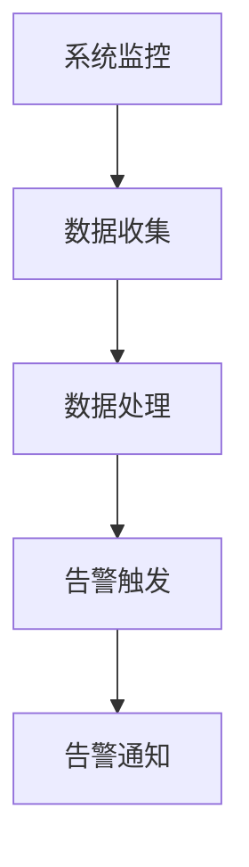
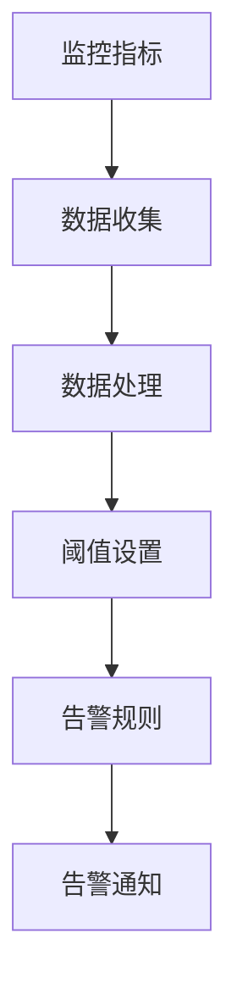

                 

### 系统监控与告警：P9工程师的运维思维

关键词：系统监控、告警机制、运维思维、性能指标、算法原理

摘要：本文从系统监控与告警的基本概念出发，深入探讨了其在现代IT运维中的重要性。通过详细阐述监控系统的组成、核心概念和算法原理，结合实际项目案例分析，探讨了运维工程师在监控与告警系统构建中的思维与实践技巧。文章旨在为P9工程师及其他IT从业者提供一份具有深度和实用性的技术指南。

---

#### 第1章：系统监控与告警概述

##### 1.1 系统监控的重要性

系统监控在现代IT运维中扮演着至关重要的角色。它不仅能够帮助运维人员及时发现和解决问题，还能预防潜在的系统故障，提高系统的稳定性和可靠性。以下是系统监控的重要性具体体现：

1. **提高系统可用性**：通过实时监控，可以快速发现系统性能下降或故障，从而及时采取修复措施，减少系统宕机时间，提高业务连续性。
2. **预防潜在问题**：监控系统可以帮助运维人员提前预判系统瓶颈，采取优化措施，避免问题进一步恶化。
3. **优化资源分配**：通过监控系统资源使用情况，可以合理分配计算资源，提高资源利用率。
4. **提升运维效率**：自动化监控工具可以减轻运维人员的工作负担，提高运维效率。

##### 1.2 告警机制的必要性

告警机制是系统监控的重要组成部分，它通过触发告警通知，使运维人员能够在第一时间得知系统异常情况。以下是告警机制的必要性：

1. **及时响应**：告警机制可以在系统出现异常时立即通知运维人员，确保问题得到及时处理。
2. **降低风险**：通过告警通知，可以迅速采取措施防止问题扩大，降低系统风险。
3. **提高团队协作效率**：告警机制有助于团队协作，确保每个成员都能及时了解系统状态，共同应对问题。
4. **记录和分析**：告警记录可以帮助运维人员分析系统故障原因，优化监控策略。

##### 1.3 监控与告警的关系架构

以下是一个简单的监控与告警关系架构图，使用Mermaid工具绘制：



该架构展示了系统监控的基本流程：首先，系统监控工具收集数据；然后，对数据进行处理；接着，根据设定的阈值和规则触发告警；最后，通过通知渠道（如邮件、短信、IM工具等）通知运维人员。

---

#### 第2章：系统监控的基础架构

##### 2.1 监控系统的组成

一个完整的监控系统通常包括以下几个核心组成部分：

1. **数据收集器**：负责从各种源（如服务器、网络设备、数据库等）收集监控数据。
2. **数据处理模块**：对收集到的数据进行处理、分析，提取有用的信息。
3. **存储系统**：用于存储大量的监控数据，支持历史数据查询和分析。
4. **告警模块**：根据预设的规则和阈值，判断是否触发告警，并通知相关人员。
5. **可视化界面**：提供一个友好的用户界面，展示系统的实时状态和历史数据。

##### 2.2 常见监控工具对比

目前，市场上存在多种监控工具，不同的工具适用于不同的场景。以下是几种常见的监控工具及其特点：

1. **Zabbix**：开源监控工具，支持多种监控方式和告警机制，适用于中小型企业。
2. **Prometheus**：基于拉模式的监控工具，与Grafana结合使用，适用于大规模分布式系统。
3. **Nagios**：开源监控工具，支持插件扩展，适用于企业级监控需求。
4. **Grafana**：数据可视化和监控工具，与各种数据源和监控工具集成，提供强大的可视化能力。

##### 2.3 监控数据的处理与存储

监控数据的处理与存储是监控系统的关键环节。以下是几个关键点：

1. **数据压缩**：为了减少存储空间和提高查询效率，可以对监控数据进行压缩处理。
2. **数据清洗**：确保数据的准确性和一致性，对异常值和噪声数据进行清洗。
3. **数据存储**：选择合适的数据存储方案，如时序数据库、关系数据库或NoSQL数据库，以满足不同的查询需求。
4. **数据查询与分析**：提供高效的数据查询和分析工具，支持实时和历史数据的查询和分析。

---

#### 第3章：核心概念与联系

##### 3.1 系统性能指标详解

系统性能指标是监控系统的重要参考依据。以下是几个常见的系统性能指标及其含义：

1. **CPU利用率**：CPU使用率超过阈值，可能表明系统资源不足或存在大量等待任务。
2. **内存利用率**：内存使用率过高可能导致系统响应变慢，甚至崩溃。
3. **磁盘IO**：磁盘IO过高可能表明系统存储性能瓶颈，需要优化磁盘IO策略。
4. **网络流量**：网络流量异常可能表明网络故障或攻击。
5. **响应时间**：系统响应时间过长可能表明系统性能瓶颈或资源不足。

##### 3.2 监控与告警的关系架构

为了更清晰地展示监控与告警的关系，我们可以使用Mermaid工具绘制一个关系架构图：



该架构展示了监控指标数据从收集、处理到告警触发的过程。通过设定合适的阈值和告警规则，确保在系统出现异常时能够及时触发告警，通知相关人员。

---

#### 第4章：核心算法原理讲解

##### 4.1 告警阈值设置算法

告警阈值的设置是监控与告警系统设计的关键步骤。以下是几种常见的告警阈值设置算法：

1. **固定阈值**：设置一个固定的阈值，当监控指标超过该阈值时触发告警。适用于监控指标波动较小的场景。
2. **统计阈值**：基于监控指标的历史统计数据，设定一个统计阈值，如平均值加减倍标准差。适用于监控指标波动较大的场景。
3. **动态阈值**：根据实时监控数据，动态调整阈值。适用于监控指标实时变化较大的场景。

##### 4.2 告警优先级排序算法

告警优先级排序算法用于确定在多个告警同时触发时，应该优先处理哪个告警。以下是几种常见的告警优先级排序算法：

1. **时间优先**：按照告警发生的时间顺序进行排序，先发生的告警优先处理。
2. **严重程度优先**：根据告警的严重程度（如警告、错误、严重等）进行排序，严重程度高的告警优先处理。
3. **自定义规则**：根据业务需求和运维策略，自定义告警优先级排序规则。

##### 4.3 滑动平均与指数平滑算法

滑动平均和指数平滑算法是时间序列分析中常用的算法，用于预测和去除噪声。以下是这两种算法的原理和Python实现：

**滑动平均算法：**

滑动平均算法通过对过去一段时间内的监控数据进行平均，来预测未来的监控指标值。其原理如下：

$$
\text{滑动平均} = \frac{\sum_{i=1}^{n} \text{数据点}_i}{n}
$$

Python实现：

```python
def moving_average(data, window_size):
    return [sum(data[i:i+window_size]) / window_size for i in range(len(data) - window_size + 1)]
```

**指数平滑算法：**

指数平滑算法通过给过去的数据赋予不同的权重，来预测未来的监控指标值。其原理如下：

$$
\text{指数平滑值} = \alpha \cdot \text{最新数据点} + (1 - \alpha) \cdot \text{前一个平滑值}
$$

Python实现：

```python
def exponential_smoothing(data, alpha):
    prev_smooth = data[0]
    smoothed_data = [prev_smooth]
    for i in range(1, len(data)):
        prev_smooth = smoothed_data[-1]
        smooth = alpha * data[i] + (1 - alpha) * prev_smooth
        smoothed_data.append(smooth)
    return smoothed_data
```

---

#### 第5章：数学模型与公式详解

##### 5.1 监控数据的数学模型

监控数据通常可以通过以下数学模型进行描述：

1. **均值模型**：描述监控数据的平均值，计算公式如下：

   $$
   \bar{x} = \frac{1}{n} \sum_{i=1}^{n} x_i
   $$

   其中，$\bar{x}$ 表示平均值，$x_i$ 表示第 $i$ 个数据点，$n$ 表示数据点的总数。

2. **方差模型**：描述监控数据的波动性，计算公式如下：

   $$
   \sigma^2 = \frac{1}{n-1} \sum_{i=1}^{n} (x_i - \bar{x})^2
   $$

   其中，$\sigma^2$ 表示方差，$\bar{x}$ 表示平均值，$x_i$ 表示第 $i$ 个数据点，$n$ 表示数据点的总数。

##### 5.2 告警机制的数学模型

告警机制的数学模型通常用于计算告警概率和判断阈值。以下是几个常用的告警机制数学模型：

1. **贝叶斯定理**：用于计算在已知某些条件下，某个事件发生的概率。其计算公式如下：

   $$
   P(A|B) = \frac{P(B|A) \cdot P(A)}{P(B)}
   $$

   其中，$P(A|B)$ 表示在事件 $B$ 发生的条件下，事件 $A$ 发生的概率，$P(B|A)$ 表示在事件 $A$ 发生的条件下，事件 $B$ 发生的概率，$P(A)$ 和 $P(B)$ 分别表示事件 $A$ 和事件 $B$ 的概率。

2. **阈值判断模型**：用于根据监控数据的统计特性，设定合适的告警阈值。其计算公式如下：

   $$
   \text{阈值} = k \cdot \sigma
   $$

   其中，$k$ 表示一个常数，$\sigma$ 表示监控数据的标准差。

---

#### 第6章：项目实战

##### 6.1 监控系统搭建与配置

在本节中，我们将以Prometheus为例，介绍监控系统的搭建与配置。

1. **环境准备**：确保安装了Prometheus所需的依赖，如Go语言环境等。
2. **安装Prometheus**：通过官方文档安装Prometheus，配置prometheus.yml文件，定义监控目标和告警规则。
3. **安装Exporter**：部署Prometheus的Exporter，如Node.js exporter、MySQL exporter等，以收集不同类型的服务器数据。
4. **配置告警管理**：配置告警规则，定义阈值和告警通知方式，如邮件、Slack等。

##### 6.2 告警系统设计与实现

在本节中，我们将以Alertmanager为例，介绍告警系统的设计与实现。

1. **设计告警规则**：根据业务需求和监控指标，设计告警规则，如CPU利用率高于90%时触发告警。
2. **配置告警通知**：配置Alertmanager，定义告警通知渠道，如邮件、Slack等，确保告警通知能够及时送达相关人员。
3. **测试告警系统**：模拟系统异常情况，测试告警系统是否能够正确触发告警，并通知相关人员。

##### 6.3 实际案例分析

在本节中，我们将分析一个实际的监控与告警项目案例，包括系统功能设计、系统架构设计、系统接口设计和系统交互。

1. **系统功能设计**：绘制领域模型类图，定义系统的主要功能模块。
2. **系统架构设计**：绘制系统架构图，展示系统的组成部分和它们之间的关系。
3. **系统接口设计**：定义系统接口，包括API接口和数据接口。
4. **系统交互**：绘制系统交互序列图，展示系统各部分之间的交互过程。

---

#### 第7章：运维思维与实战技巧

##### 7.1 运维工程师的角色定位

运维工程师在现代IT运维中扮演着重要角色。以下是运维工程师的角色定位：

1. **问题排查**：及时发现和解决系统故障，确保系统的稳定运行。
2. **性能优化**：通过监控和优化，提高系统的性能和可靠性。
3. **安全防护**：保障系统的安全，防范各种安全威胁。
4. **文档编写**：编写系统文档和操作手册，确保团队能够顺利开展工作。

##### 7.2 高效的运维流程

高效的运维流程对于确保系统稳定性和可靠性至关重要。以下是高效的运维流程：

1. **日常监控**：实时监控系统状态，发现潜在问题。
2. **故障处理**：快速响应故障，及时解决问题。
3. **性能优化**：定期进行性能测试和优化，提高系统性能。
4. **安全防护**：定期更新系统安全策略，防范安全威胁。
5. **文档更新**：及时更新系统文档和操作手册，确保团队能够顺利开展工作。

##### 7.3 常见问题的排查与解决

运维过程中会遇到各种常见问题，以下是几种常见问题的排查与解决方法：

1. **系统崩溃**：检查日志，查找崩溃原因，重启系统或修复问题。
2. **网络故障**：检查网络配置，排查网络故障，重启网络设备或更换网络设备。
3. **数据库异常**：检查数据库日志，排查数据库故障，重启数据库或修复数据库问题。
4. **服务中断**：检查服务状态，重启服务或修复服务问题。

---

#### 第8章：未来展望与趋势

##### 8.1 监控与告警技术的发展趋势

随着云计算、大数据、人工智能等技术的发展，监控与告警技术也在不断演进。以下是监控与告警技术的发展趋势：

1. **智能化**：通过引入人工智能技术，实现智能监控和智能告警。
2. **自动化**：通过自动化工具和脚本，实现监控和告警的自动化处理。
3. **可视化**：通过丰富的可视化手段，提供更直观的系统状态展示。
4. **云计算集成**：与云计算平台深度集成，实现监控和告警的云原生部署。

##### 8.2 运维领域的创新与实践

运维领域的创新与实践不断推动着技术的进步。以下是几个运维领域的创新与实践：

1. **DevOps文化**：倡导开发与运维团队的合作，提高系统交付效率。
2. **容器化与微服务**：采用容器化和微服务架构，提高系统的灵活性和可扩展性。
3. **自动化运维平台**：构建自动化运维平台，实现运维过程的自动化和智能化。
4. **运维安全**：加强运维安全，确保系统的安全性和稳定性。

---

### 附录

#### A.1 工具资源列表

- Prometheus：https://prometheus.io/
- Grafana：https://grafana.com/
- Zabbix：https://www.zabbix.com/
- Nagios：https://www.nagios.org/
- Alertmanager：https://github.com/prometheus/alertmanager

#### A.2 常用技术术语解释

- 监控指标（Metrics）：用于衡量系统性能和状态的量化指标。
- 告警（Alert）：在监控指标超过阈值时触发的通知。
- 数据收集器（Collector）：负责从不同源收集监控数据的工具。
- 数据处理模块（Processor）：对监控数据进行处理和分析的模块。
- 告警规则（Alert Rule）：定义告警触发条件的配置文件。

#### A.3 参考文献与推荐阅读

- 《系统监控与告警实战》
- 《Prometheus官方文档》
- 《Grafana官方文档》
- 《Zabbix官方文档》
- 《Nagios官方文档》

---

**作者：AI天才研究院/AI Genius Institute & 禅与计算机程序设计艺术 /Zen And The Art of Computer Programming**

