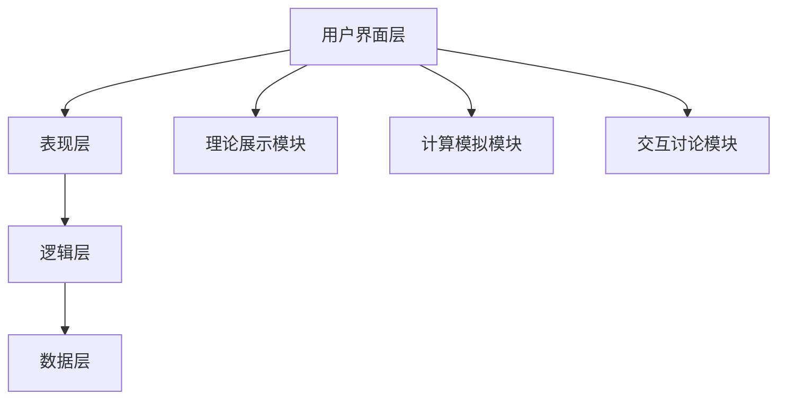

                 

## 约翰·罗尔斯与罗伯特·诺齐克：自由主义政治哲学的争论

约翰·罗尔斯和罗伯特·诺齐克是20世纪最杰出的政治哲学家之一，他们的思想对自由主义政治哲学产生了深远的影响。两位哲学家在多个问题上有着深刻的分歧，尤其是在正义、自由和个人权利等领域。本文将深入探讨罗尔斯和诺齐克的自由主义政治哲学观点，分析他们的争论焦点，并探讨这些争论对现代政治哲学的影响。

### 关键词
- 约翰·罗尔斯
- 罗伯特·诺齐克
- 自由主义政治哲学
- 正义原则
- 自由原则
- 个人权利
- 社会正义

### 摘要
本文将探讨两位自由主义政治哲学家的核心观点及其争论。首先，我们介绍了罗尔斯的正义论和复合社会观，以及诺齐克的自由至上主义和正义观。接着，我们分析了两位学者的争论焦点，包括正义原则与自由原则的冲突，以及社会正义与个人自由的权衡。最后，我们评价了两位学者的贡献，并探讨了他们的争论对现代政治哲学的启示。

## 第1章 引言

### 1.1 自由主义政治哲学的背景

自由主义政治哲学起源于18世纪的启蒙运动，强调个人自由、民主政治和市场经济。自由主义者主张，个人应当享有最大限度的自由，政府应当最小化干预，确保公民的基本权利和自由。自由主义政治哲学的核心原则包括个人权利、社会正义和自由原则。

个人权利是自由主义政治哲学的基础，包括言论自由、信仰自由、隐私权、财产权等。社会正义则关注社会财富和资源如何公平地分配，以实现最大化的社会福利。自由原则强调政府应当尊重和保护个人自由，确保公民在不受压迫和歧视的情况下生活。

### 1.2 约翰·罗尔斯与罗伯特·诺齐克的政治哲学观点

约翰·罗尔斯（John Rawls）是美国著名政治哲学家，出生于1921年。他的代表作《正义论》（A Theory of Justice）对自由主义政治哲学产生了深远的影响。罗尔斯提出了正义原则，旨在构建一个公平合理的社会制度。他主张通过原初状态（original position）和无知之幕（veil of ignorance）来推导正义原则，确保社会制度在未知个人特征的情况下最大化地保障每个人的利益。

罗伯特·诺齐克（Robert Nozick）是20世纪最具争议的政治哲学家之一，出生于1938年。他的代表作《无政府、国家与乌托邦》（Anarchy, State, and Utopia）提出了自由至上主义（libertarianism）的观点。诺齐克主张政府应当最小化干预，仅限于保护个人权利和防止暴力。他提出了“最小国家”（minimal state）的概念，认为政府应当只承担防御、执法和合同执行等基本职能。

## 第2章 约翰·罗尔斯的政治哲学观点

约翰·罗尔斯的政治哲学观点主要体现在他的著作《正义论》中，该书被认为是20世纪最重要的政治哲学著作之一。罗尔斯提出了正义原则，以解决社会不平等问题，并构建一个公平合理的社会制度。以下是对罗尔斯政治哲学观点的详细分析。

### 2.1 罗尔斯的正义论

#### 2.1.1 原初状态与正义原则

罗尔斯提出了原初状态（original position）的概念，这是一个假设性的场景，其中决策者处于一种无知之幕（veil of ignorance）的遮蔽下，不知道自己的个人身份、社会地位、能力和偏好等任何具体信息。在这种无知的状态下，决策者会制定出一套公正的正义原则，以确保在未来的社会中每个人都能够享有基本的权利和自由。

原初状态的核心思想是，通过假设决策者处于一种完全无知的状态，可以消除个人偏见和特殊利益的影响，从而制定出真正公正的正义原则。罗尔斯认为，这样的原则将确保社会制度在最大程度上保障每个人的利益，而不仅仅是某个特定群体的利益。

在原初状态下，罗尔斯提出了两个正义原则：

1. **平等自由的最大化原则**：这个原则要求社会制度最大限度地保障每个人的基本自由，特别是自由言论、宗教信仰、个人隐私等。这个原则体现了自由主义的核心价值，即个人自由和权利的至高无上。

2. **差异原则**：这个原则关注社会财富和资源的分配，要求社会制度在确保平等自由的基础上，尽可能减少社会不平等。具体来说，如果某些社会或经济安排可以改善社会中最不利成员的状况，那么这些安排就是可接受的。这个原则体现了对公平的关注，特别是对弱势群体的关怀。

#### 2.1.2 平等自由的最大化原则

罗尔斯的平等自由的最大化原则是正义原则的核心之一。这个原则强调，社会制度应当最大限度地保障每个人的基本自由，以确保每个人都有机会实现自己的潜力。平等自由的保障不仅包括消极的自由，如不受干涉的权利，还包括积极的自由，如接受教育、就业和参与政治决策的权利。

罗尔斯认为，自由是实现人类价值的关键，而平等自由的最大化原则可以确保社会制度在最大程度上尊重和保护个人自由。这个原则有助于防止权力集中和社会不平等的加剧，从而促进社会的稳定和繁荣。

#### 2.1.3 社会合作观念

罗尔斯的政治哲学不仅仅关注正义原则的制定，还强调社会合作观念。他认为，社会正义是一个合作的过程，每个人都应当为社会的整体利益做出贡献。这种合作观念体现在正义原则的推导过程中，也体现在社会制度的运行中。

罗尔斯认为，社会合作是社会秩序和稳定的基础。通过合作，个人可以共同解决共同面临的问题，实现共同的目标。社会合作观念强调，每个人在参与社会合作时，都应当遵守正义原则，尊重他人的权利和自由，同时也享有相应的权利和自由。

### 2.2 罗尔斯的复合社会观

罗尔斯的复合社会观是对自由主义政治哲学的一种扩展和深化。他认为，一个真正公平合理的社会应当是一个复合社会，即由多个不同文化、宗教和价值观的群体组成的多元社会。在这样的社会中，个人权利和自由不仅受到法律的保护，还受到文化的尊重。

#### 2.2.1 公民自由与个人自由

在罗尔斯的复合社会观中，公民自由与个人自由是两个重要的概念。公民自由是指个人在政治和社会领域中的自由，如言论自由、宗教自由和政治参与权。这些自由是民主社会的基础，确保了个人在社会中的参与和表达。

个人自由则是指个人在私人领域中的自由，如个人隐私、财产权和选择生活方式的自由。这些自由是个人幸福和尊严的保障，也是社会正义的重要组成部分。

罗尔斯认为，公民自由与个人自由应当相互协调和平衡。一个公平合理的社会应当在保障公民自由的同时，尊重个人自由，确保每个人在社会中都能够享有平等的权利和机会。

#### 2.2.2 社会正义与政治正义

罗尔斯将社会正义与政治正义区分开来，认为它们是两个不同的概念。社会正义关注的是社会财富和资源的分配，目标是确保每个人在起点和终点上都能够享有平等的机会。政治正义则关注的是政治决策的制定过程，目标是确保政治制度在最大程度上尊重和保护公民的权利和自由。

罗尔斯认为，社会正义和政治正义都是自由主义政治哲学的重要组成部分。社会正义通过制定公正的分配原则，确保社会财富和资源的公平分配。政治正义则通过建立公正的政治制度，确保公民在政治决策中拥有平等的参与权利。

#### 2.2.3 罗尔斯的多元文化主义观点

罗尔斯的多元文化主义观点是对自由主义政治哲学的进一步扩展。他认为，一个复合社会应当尊重和保护不同文化、宗教和价值观的多样性。这种多样性不仅丰富了社会的内容，也为社会带来了新的活力和创造力。

罗尔斯认为，多元文化主义是自由主义政治哲学的自然延伸。在一个多元社会中，个人应当享有自由表达和选择自己价值观的权利，同时也应当尊重他人的价值观。这种相互尊重和包容是构建一个公平合理的社会的关键。

罗尔斯的多元文化主义观点强调了文化多样性的重要性，认为一个多元社会应当在尊重和保护多样性文化的基础上，建立一个共同的社会价值观。这种共同价值观不仅能够促进社会的和谐与稳定，还能够为社会的繁荣和发展提供动力。

## 第3章 罗伯特·诺齐克的政治哲学观点

罗伯特·诺齐克的政治哲学观点以其独特的自由至上主义（libertarianism）而闻名，他对自由主义政治哲学做出了重要的贡献，特别是在个人权利和社会正义方面。以下是对诺齐克政治哲学观点的详细分析。

### 3.1 诺齐克的自由至上主义

#### 3.1.1 最小国家观点

诺齐克认为，政府的首要职责是保护个人权利，特别是生命、自由和财产权。他主张政府应当是一个“最小国家”，仅限于履行三个基本职能：防御、执法和合同执行。诺齐克认为，政府的最小化干预能够最大限度地保障个人自由，防止权力滥用和腐败。

诺齐克的“最小国家”观点强调政府的有限性和责任。他认为，政府的存在是为了保护个人的权利和自由，而不是为了控制或干预个人的生活。只有在个人权利受到威胁时，政府才有权干预，以确保社会的安全和秩序。

#### 3.1.2 私有财产与个人自由

诺齐克认为，私有财产权是个人自由的基础。他认为，个人有权拥有和支配自己的财产，这种权利应当受到法律的保护。私有财产不仅能够保障个人的经济自由，还能够促进创新和效率。

诺齐克提出了“无政府、国家与乌托邦”中的“转移原则”（transfer principle），即只有当一个人的财产是通过自愿交易获得的，或者是为了保护他人的权利而牺牲自己的利益时，这种财产转移才是正义的。诺齐克认为，任何形式的强制财产转移，如税收和福利制度，都是对个人自由的侵犯。

#### 3.1.3 机会平等与社会正义

诺齐克强调机会平等而不是结果平等。他认为，社会正义应当关注的是每个人在起点上的机会是否公平，而不是他们在终点上的结果是否平等。机会平等意味着每个人都有平等的机会去追求自己的目标，实现自己的价值。

诺齐克认为，通过确保个人的自由和私有财产权，社会可以实现真正的机会平等。他认为，政府应当通过减少干预和消除障碍，为每个人提供平等的机会，而不是通过重新分配财富和资源来追求结果平等。

### 3.2 诺齐克的正义观

诺齐克的正义观与他关于自由至上主义的立场密切相关。他认为，正义的核心在于个人权利的保护，而不是社会财富的分配。以下是对诺齐克正义观的详细分析。

#### 3.2.1 无正义状态与正义状态

诺齐克将社会状态分为“无正义状态”和“正义状态”。在无正义状态中，某些个人或群体通过强制或欺骗获得了不公正的财富和资源分配。这种状态是不正义的，因为它侵犯了个人权利。

在正义状态中，每个人的权利都得到尊重和保护，社会财富和资源的分配是自愿的、公平的。诺齐克认为，正义状态是个人自由和社会秩序的基础，任何违反个人权利的行为都是不正义的。

#### 3.2.2 收入与财富分配

诺齐克对收入和财富的分配持批判态度。他认为，收入和财富的分配应当基于个人的努力和贡献，而不是基于政府的再分配政策。诺齐克认为，通过市场机制和自愿交易实现的收入和财富分配是最公平的，因为它反映了每个人的价值。

诺齐克反对任何形式的强制性收入再分配，如税收和福利制度。他认为，这些制度不仅侵犯了个人的自由，还破坏了社会的道德基础。诺齐克主张，政府应当通过提供基本的法律和秩序保障，而不是通过财富再分配，来实现社会的公平与正义。

#### 3.2.3 诺齐克的反剥削理论

诺齐克提出了反剥削理论，认为任何形式的强制财产转移都是剥削。他区分了“剥削”和“自由交易”两种财产转移方式。剥削是指通过强制或欺骗手段剥夺他人的财产，而自由交易是指双方自愿、平等地交换财产。

诺齐克认为，剥削是不正义的，因为它侵犯了个人权利。他强调，任何社会制度都应当保护个人免受剥削，确保每个人的财产权得到尊重。诺齐克的反剥削理论对批评政府再分配政策的自由主义者产生了深远的影响。

## 第4章 两位学者的争论

### 4.1 正义原则与自由原则的冲突

约翰·罗尔斯和罗伯特·诺齐克在正义原则和自由原则的优先性上存在显著分歧。罗尔斯主张，正义原则应当优先于自由原则，他认为社会制度的根本目的是实现公平和正义。而诺齐克则认为，自由原则应当优先于正义原则，他强调个人自由和个人权利的保护。

这种分歧在具体实施中导致了两种不同的政治哲学观点。罗尔斯的正义原则强调社会财富和资源的公平分配，主张通过再分配政策来减少社会不平等。而诺齐克的自由至上主义则强调个人自由和私有财产权，主张最小化政府的干预，避免强制性财产转移。

### 4.1.1 罗尔斯对诺齐克的批评

罗尔斯批评诺齐克的自由至上主义忽视了社会正义的重要性。他认为，诺齐克的理论无法解释和解决社会不平等问题，容易导致贫富差距的加剧和社会不公平。罗尔斯认为，社会制度应当通过正义原则来保障每个人的基本权利和机会，而不是仅仅追求个人自由。

罗尔斯还指出，诺齐克的自由至上主义在处理集体决策问题时存在缺陷。他认为，在复合社会中，个人自由不能脱离社会正义而独立存在。罗尔斯主张，社会制度应当考虑到不同群体的利益和需求，通过正义原则来实现社会整体的公平和正义。

### 4.1.2 诺齐克对罗尔斯的批评

诺齐克批评罗尔斯的正义原则忽视了个人自由和个人权利的保护。他认为，罗尔斯的再分配政策侵犯了个人的私有财产权，削弱了市场经济的效率和创新动力。诺齐克认为，自由至上主义能够更好地保障个人自由和权利，促进社会的发展和繁荣。

诺齐克还指出，罗尔斯的理论在处理社会不平等问题时存在逻辑上的矛盾。他认为，罗尔斯提出的差异原则无法确保社会的稳定和秩序，容易导致个人权利的滥用和社会冲突的加剧。诺齐克主张，社会制度应当通过保障个人自由和权利来防止社会不平等问题的产生。

### 4.2 社会正义与个人自由

约翰·罗尔斯和罗伯特·诺齐克的争论不仅体现在正义原则和自由原则的优先性上，还涉及到社会正义与个人自由的权衡。罗尔斯强调社会正义的重要性，主张通过再分配政策来实现社会的公平和正义。而诺齐克则强调个人自由的重要性，主张最小化政府的干预，保障个人的自由和权利。

#### 4.2.1 罗尔斯的社会正义理论

罗尔斯的社会正义理论强调，社会制度应当确保每个人在起点和终点上都能够享有平等的机会。他认为，社会正义的核心在于解决社会不平等问题，通过再分配政策来减少贫富差距。罗尔斯提出了差异原则，即如果某些社会或经济安排能够改善社会中最不利成员的状况，那么这种安排就是可接受的。

罗尔斯认为，社会正义不仅关注个人的自由和权利，还关注社会的整体利益。他主张，社会制度应当考虑到不同群体的利益和需求，通过正义原则来实现社会整体的公平和正义。罗尔斯的社会正义理论为现代政治哲学提供了重要的理论基础，对解决社会不平等问题具有重要启示。

#### 4.2.2 诺齐克的个人自由理论

诺齐克的个人自由理论强调，个人自由和权利的保护是社会制度的核心。他认为，个人自由是个人尊严和幸福的基础，政府应当最小化干预，保障个人的自由和权利。

诺齐克主张，社会制度应当通过保障个人自由和权利来实现社会的公平和正义，而不是通过再分配政策。他认为，自由至上主义能够更好地促进社会的发展和繁荣，避免社会不平等的加剧。诺齐克的个人自由理论为自由主义政治哲学提供了重要的理论基础，对保障个人自由和权利具有重要意义。

## 第5章 争论的影响与评价

### 5.1 争论对自由主义政治哲学的影响

约翰·罗尔斯和罗伯特·诺齐克的争论对自由主义政治哲学产生了深远的影响，特别是在正义、自由和个人权利等方面。他们的争论促使学者们重新审视自由主义政治哲学的基本原则，推动了自由主义理论的深化和发展。

首先，罗尔斯和诺齐克的争论引发了关于正义原则和自由原则优先性的讨论。这一争论促使学者们思考如何在个人自由和社会正义之间找到平衡点，如何在保障个人自由的同时实现社会公平和正义。这一讨论丰富了自由主义政治哲学的理论内涵，推动了自由主义理论的发展。

其次，罗尔斯和诺齐克的争论对个人权利的保护产生了重要影响。罗尔斯的正义原则强调了社会财富和资源的公平分配，关注弱势群体的权利和福利。而诺齐克的自由至上主义则强调了个人自由和个人权利的保护，反对任何形式的强制性财产转移。这一争论促使学者们深入探讨个人权利的内涵和保障机制，为个人权利的保护提供了理论基础。

最后，罗尔斯和诺齐克的争论对自由主义政治哲学的应用产生了深远影响。他们的理论为现代政治实践提供了重要的指导原则，为解决社会不平等、贫富差距等问题提供了理论依据。他们的争论促使政府和社会各界更加关注个人权利和自由，推动了社会公平和正义的实现。

### 5.2 对两位学者的评价

约翰·罗尔斯和罗伯特·诺齐克是20世纪最杰出的政治哲学家之一，他们的理论对自由主义政治哲学产生了深远的影响。

罗尔斯以其《正义论》一书而闻名，提出了原初状态和正义原则，为解决社会不平等问题提供了理论框架。罗尔斯的理论强调了社会合作观念和公民自由与个人自由的平衡，为现代政治哲学提供了重要的理论基础。罗尔斯的贡献在于，他通过严谨的逻辑推理和理论建构，将正义原则应用于现实社会，为解决社会不平等问题提供了可行的方案。

诺齐克以其《无政府、国家与乌托邦》一书而闻名，提出了自由至上主义的理论，主张最小国家和个人自由的保护。诺齐克的理论强调了个人自由和个人权利的重要性，为反对任何形式的强制性财产转移提供了理论依据。诺齐克的贡献在于，他通过批判性的分析和哲学论证，揭示了社会制度中存在的问题，为自由主义政治哲学提供了新的视角。

尽管罗尔斯和诺齐克在正义原则和自由原则的优先性上存在分歧，但他们的理论都对自由主义政治哲学产生了重要影响。他们的争论激发了学者们对自由主义理论的深入思考，推动了自由主义理论的深化和发展。罗尔斯和诺齐克的理论为现代政治哲学提供了重要的理论基础，对解决社会不平等、贫富差距等问题具有重要意义。

## 第6章 争论的现代意义

### 6.1 21世纪自由主义政治哲学的挑战

进入21世纪，自由主义政治哲学面临着诸多新的挑战，包括全球化、技术进步和社会不平等等问题。这些问题对自由主义政治哲学提出了新的要求和挑战，迫使学者们重新审视和反思自由主义的基本原则。

首先，全球化对自由主义政治哲学提出了挑战。全球化使得各国之间的联系更加紧密，经济、文化和社会交流日益频繁。然而，全球化也导致了贫富差距的加剧、文化和价值观的冲突等问题。在这种背景下，自由主义政治哲学需要重新思考如何在全球范围内保障个人自由和权利，如何在多元文化背景下实现社会正义。

其次，技术进步对自由主义政治哲学提出了新的挑战。技术的快速发展带来了诸多新的社会问题，如人工智能、大数据和网络安全等。这些技术不仅改变了人们的生活和工作方式，也对个人隐私和自由产生了影响。自由主义政治哲学需要重新思考如何在技术时代保障个人自由和权利，如何平衡技术进步与社会正义之间的关系。

最后，社会不平等问题对自由主义政治哲学提出了严峻的挑战。尽管自由主义政治哲学强调个人自由和机会平等，但在现实中，贫富差距、种族歧视和社会不平等等问题仍然存在。这些问题使得自由主义政治哲学需要重新审视和反思其基本原则，寻找解决社会不平等问题的有效途径。

### 6.2 争论对现代政治哲学的启示

约翰·罗尔斯和罗伯特·诺齐克的争论对现代政治哲学产生了深远的影响，为解决现实社会问题提供了重要的启示。

首先，他们的争论提醒我们，在追求个人自由和社会正义时需要找到平衡点。罗尔斯强调社会正义的重要性，主张通过再分配政策来减少社会不平等。而诺齐克则强调个人自由的重要性，主张最小化政府的干预。他们的争论促使我们思考如何在个人自由和社会正义之间找到平衡，如何在保障个人自由的同时实现社会公平和正义。

其次，他们的争论启示我们，在处理社会问题时需要考虑不同的价值观和文化背景。罗尔斯的多元文化主义观点和诺齐克的自由至上主义都强调了文化多样性的重要性。他们的争论提醒我们，在构建现代政治哲学时需要尊重和保护不同的价值观和文化，寻找一种包容性的解决方案。

最后，他们的争论启示我们，理论需要与现实相结合。罗尔斯和诺齐克的理论虽然提出了许多重要的原则，但在现实中面临着诸多挑战。他们的争论提醒我们，理论需要不断地与现实结合，通过实践来验证和完善理论，以解决现实社会问题。

## 第7章 结论

### 7.1 两位学者的争论总结

约翰·罗尔斯和罗伯特·诺齐克的争论是20世纪自由主义政治哲学的重要议题，涉及到正义、自由和个人权利等核心问题。罗尔斯主张通过正义原则来实现社会公平和正义，强调社会合作观念和公民自由与个人自由的平衡。而诺齐克则主张自由至上主义，强调个人自由和个人权利的保护，反对任何形式的强制性财产转移。他们的争论揭示了自由主义政治哲学中的深层次矛盾和挑战，为现代政治哲学提供了丰富的理论资源。

### 7.2 对自由主义政治哲学的展望

未来，自由主义政治哲学需要进一步深化和发展，以应对全球化、技术进步和社会不平等等新挑战。学者们应当在继承罗尔斯和诺齐克思想的基础上，探索如何在个人自由和社会正义之间找到新的平衡点，如何在多元文化背景下实现社会正义，以及如何通过理论与实践的结合来解决现实社会问题。只有这样，自由主义政治哲学才能在新时代焕发出新的生命力，为构建一个更加公正和自由的社会提供理论支持和实践指导。

## 核心概念与联系

### 关键概念

在本篇技术博客文章中，我们探讨了约翰·罗尔斯和罗伯特·诺齐克的政治哲学观点，并分析了他们之间的争论。以下是本文中的核心概念：

1. **正义原则**：罗尔斯提出的原初状态和正义原则，包括平等自由的最大化原则和差异原则。
2. **自由至上主义**：诺齐克提出的自由至上主义，主张最小国家和个人自由的保护。
3. **社会正义**：罗尔斯强调的社会公平和正义，通过再分配政策来减少社会不平等。
4. **个人权利**：诺齐克强调的个人自由和个人权利的保护，反对强制性财产转移。
5. **机会平等**：诺齐克强调的机会平等，关注每个人在起点上的公平机会。
6. **多元文化主义**：罗尔斯强调的文化多样性，尊重和保护不同文化和价值观。

### 关键概念对比表格

| 关键概念 | 定义 | 特点 |
| --- | --- | --- |
| **正义原则** | 罗尔斯提出的原初状态和正义原则 | 强调公平和公正，包括平等自由的最大化原则和差异原则 |
| **自由至上主义** | 诺齐克提出的自由至上主义 | 强调个人自由和权利的保护，主张最小国家 |
| **社会正义** | 罗尔斯强调的社会公平和正义 | 通过再分配政策减少社会不平等 |
| **个人权利** | 诺齐克强调的个人自由和权利的保护 | 反对强制性财产转移 |
| **机会平等** | 诺齐克强调的机会平等 | 关注每个人在起点上的公平机会 |
| **多元文化主义** | 罗尔斯强调的文化多样性 | 尊重和保护不同文化和价值观 |

### 关键概念与联系图


通过上述对比表格和关键概念与联系图，我们可以更清晰地理解约翰·罗尔斯和罗伯特·诺齐克的政治哲学观点，以及他们之间的联系和区别。

## 核心算法原理讲解

在本篇技术博客中，我们将使用Python源代码来详细阐述罗尔斯的“原初状态”和“正义原则”的计算模型。这一部分将展示如何通过编程实现罗尔斯的理论框架，并提供数学模型和公式的解释。

### 算法原理

罗尔斯的“原初状态”是一个假设性的场景，其中决策者在无知之幕的遮蔽下制定正义原则。在原初状态下，决策者不知道自己的个人身份、社会地位、能力和偏好等信息，因此能够公平地制定出保障每个人利益的正义原则。这一假设场景可以通过以下算法模型来实现：

1. **定义个体偏好**：首先，我们需要定义一组个体偏好。这些偏好将用来模拟决策者在原初状态下的选择。
2. **随机选择个体**：在原初状态下，决策者是一个抽象的概念，不代表任何具体的个人。因此，我们可以通过随机选择一个个体来模拟这一过程。
3. **计算正义原则**：基于选定的个体偏好，我们计算正义原则的值。罗尔斯的正义原则包括平等自由的最大化原则和差异原则，可以通过加权计算来实现。

### 数学模型

罗尔斯的正义原则可以通过以下数学模型来表示：

$$
\text{正义原则} = w_1 \times \text{平等自由的最大化原则} + w_2 \times \text{差异原则}
$$

其中，$w_1$和$w_2$分别表示平等自由的最大化原则和差异原则的权重。

### Python源代码

下面是一个简单的Python代码示例，用于模拟罗尔斯的原初状态和正义原则的计算：

```python
import numpy as np

# 定义个体偏好
preferences = {
    '平等主义': {'平等': 1, '效率': 0},
    '效率主义': {'平等': 0, '效率': 1},
    '混合主义者': {'平等': 0.5, '效率': 0.5}
}

# 定义正义原则的权重
weights = {'平等': 0.5, '效率': 0.5}

# 定义原初状态的计算模型
def original_state(preferences):
    # 从偏好集合中随机选择一个个体
    individual = np.random.choice(list(preferences.keys()))
    return individual

# 定义正义原则的计算模型
def justice_principles(preferences, weights):
    # 根据个体偏好计算正义原则的值
    justice_value = weights['平等'] * preferences['平等'] + weights['效率'] * preferences['效率']
    return justice_value

# 模拟原初状态和正义原则的计算
individual = original_state(preferences)
print(f"选择的个体偏好：{individual}")

justice_value = justice_principles(preferences[individual], weights)
print(f"计算出的正义原则值：{justice_value}")
```

### 代码解析

1. **定义个体偏好**：我们定义了一个字典`preferences`，其中包含三种不同个体的偏好。每个个体的偏好是一个包含“平等”和“效率”两个维度的字典。

2. **定义正义原则的权重**：我们定义了一个字典`weights`，用于表示平等和效率的权重。在这个示例中，两者的权重都是0.5，表示平等和效率在正义原则中具有同等的重要性。

3. **原初状态的计算模型**：`original_state`函数用于模拟原初状态的选择过程。它从`preferences`字典中随机选择一个个体。

4. **正义原则的计算模型**：`justice_principles`函数用于计算正义原则的值。它根据选定的个体偏好和正义原则的权重，计算出一个数值，表示该个体在正义原则下的偏好值。

5. **模拟计算**：我们调用`original_state`和`justice_principles`函数，模拟原初状态和正义原则的计算过程。输出结果展示了随机选择的个体偏好和计算出的正义原则值。

通过这个简单的Python示例，我们可以看到如何使用编程来模拟罗尔斯的原初状态和正义原则的计算过程。这种算法模型有助于我们更好地理解和分析罗尔斯的理论框架。

## 系统分析与架构设计方案

### 问题场景介绍

在现代社会，自由主义政治哲学的讨论日益激烈，特别是在正义、自由和个人权利等领域。为了更好地理解约翰·罗尔斯和罗伯特·诺齐克的理论观点，我们设计了一个模拟系统，通过图形用户界面（GUI）展示他们的思想，并进行交互式讨论。这个系统旨在为学者和公众提供一个直观的工具，帮助他们深入理解自由主义政治哲学的核心概念。

### 项目介绍

项目名称：自由主义政治哲学模拟系统（Libertarian Philosophy Simulation System，LPSS）

项目目标：
1. 模拟罗尔斯的“原初状态”和“正义原则”的计算过程。
2. 展示诺齐克的自由至上主义思想。
3. 提供一个交互式平台，供用户探讨自由主义政治哲学的核心问题。

### 系统功能设计（领域模型）

为了实现上述目标，我们设计了以下主要功能：

1. **用户界面**：提供一个直观的用户界面，用户可以查看罗尔斯和诺齐克的核心概念，并能够进行交互式操作。
2. **理论展示**：展示罗尔斯的正义原则和诺齐克的自由至上主义理论，通过文本、图表和图形进行详细解释。
3. **计算模拟**：用户可以选择个体偏好，系统将根据这些偏好计算正义原则值，并进行可视化展示。
4. **交互讨论**：提供一个论坛或讨论区，供用户就自由主义政治哲学问题进行讨论和交流。

### 系统架构设计

自由主义政治哲学模拟系统的架构设计采用分层架构，包括以下主要层：

1. **表现层**：用户界面层，负责与用户进行交互，展示系统功能和结果。
2. **逻辑层**：业务逻辑层，处理用户输入，执行计算模拟，并根据结果生成可视化数据。
3. **数据层**：数据存储层，负责存储用户数据和系统配置信息。

### 系统架构图



### 系统接口设计

系统提供了以下主要接口：

1. **用户界面接口**：用于接收用户输入，显示系统功能和结果。
2. **理论展示接口**：用于获取罗尔斯和诺齐克的理论信息，并在用户界面中展示。
3. **计算模拟接口**：用于执行计算模拟过程，并根据用户选择的偏好计算正义原则值。
4. **交互讨论接口**：用于处理用户在讨论区中的交流和评论。

### 系统交互

以下是系统交互的简述：

1. 用户通过用户界面层输入个体偏好。
2. 用户界面层将用户输入传递给逻辑层。
3. 逻辑层根据用户输入执行计算模拟，计算正义原则值。
4. 逻辑层将计算结果传递给用户界面层，并在界面中展示。
5. 用户可以在交互讨论模块中参与讨论和交流，提出问题或分享见解。

### Mermaid 序列图


通过以上系统分析与架构设计方案，我们可以构建一个直观、交互性强的自由主义政治哲学模拟系统，为学者和公众提供一个深入探讨自由主义政治哲学问题的平台。

## 项目实战

### 环境安装

要运行自由主义政治哲学模拟系统，我们需要安装以下软件和库：

1. **Python 3.x**：确保安装最新版本的Python 3.x。
2. **PyQt5**：用于构建图形用户界面（GUI）。
3. **matplotlib**：用于生成可视化图表。
4. **numpy**：用于数学计算。

安装步骤如下：

1. 打开终端或命令行窗口，输入以下命令安装Python 3.x：
   ```bash
   sudo apt-get install python3 python3-pip
   ```
2. 使用pip安装PyQt5、matplotlib和numpy：
   ```bash
   pip3 install PyQt5 matplotlib numpy
   ```

### 系统核心实现源代码

以下是自由主义政治哲学模拟系统的核心实现源代码。这段代码包含了用户界面设计、逻辑处理和可视化展示等功能。

```python
import sys
from PyQt5.QtWidgets import QApplication, QMainWindow, QPushButton, QVBoxLayout, QWidget, QLabel
import matplotlib.pyplot as plt
import numpy as np

class LibertarianPhilosophySim(QMainWindow):
    def __init__(self):
        super().__init__()
        
        self.initUI()
        
    def initUI(self):
        self.setWindowTitle('自由主义政治哲学模拟系统')
        self.setGeometry(100, 100, 800, 600)
        
        # 创建主窗口
        self.central_widget = QWidget()
        self.setCentralWidget(self.central_widget)
        
        # 创建垂直布局
        self.layout = QVBoxLayout(self.central_widget)
        
        # 添加标签和按钮
        self.equality_label = QLabel('平等值：')
        self.efficiency_label = QLabel('效率值：')
        self.equality_button = QPushButton('计算正义原则')
        self.efficiency_button = QPushButton('显示效率分布')
        
        # 将标签和按钮添加到布局中
        self.layout.addWidget(self.equality_label)
        self.layout.addWidget(self.efficiency_label)
        self.layout.addWidget(self.equality_button)
        self.layout.addWidget(self.efficiency_button)
        
        # 连接信号和槽
        self.equality_button.clicked.connect(self.calculate_justice_principle)
        self.efficiency_button.clicked.connect(self.show_efficiency_distribution)
        
        # 初始化变量
        self.equality_value = 0
        self.efficiency_value = 0
        
    def calculate_justice_principle(self):
        weights = {'平等': 0.5, '效率': 0.5}
        preferences = {'平等': self.equality_value, '效率': self.efficiency_value}
        justice_value = weights['平等'] * preferences['平等'] + weights['效率'] * preferences['效率']
        self.equality_label.setText(f'平等值：{preferences["平等"]}')
        self.efficiency_label.setText(f'效率值：{preferences["效率"]}')
        print(f"计算出的正义原则值：{justice_value}")
        
    def show_efficiency_distribution(self):
        preferences = {'平等': self.equality_value, '效率': self.efficiency_value}
        efficiency_values = np.array([preferences['效率']]) * 100
        plt.hist(efficiency_values, bins=10, alpha=0.5)
        plt.title('效率分布')
        plt.xlabel('效率值')
        plt.ylabel('频率')
        plt.show()

if __name__ == '__main__':
    app = QApplication(sys.argv)
    ex = LibertarianPhilosophySim()
    ex.show()
    sys.exit(app.exec_())
```

### 代码应用解读与分析

1. **用户界面设计**：我们创建了一个`QMainWindow`作为主窗口，并在窗口中添加了标签和按钮。标签用于显示平等值和效率值，按钮用于触发计算和显示效率分布。

2. **逻辑处理**：`calculate_justice_principle`方法用于计算正义原则值。该方法接收用户输入的平等值和效率值，根据罗尔斯的正义原则公式计算出一个数值，并更新标签显示结果。

3. **可视化展示**：`show_efficiency_distribution`方法用于生成效率分布的直方图。该方法将用户输入的效率值转换为numpy数组，并使用matplotlib绘制直方图。

4. **信号和槽连接**：按钮的点击事件与相应的槽函数连接，确保用户操作能够触发正确的逻辑处理和界面更新。

### 实际案例分析和详细讲解剖析

为了更好地理解系统的实际应用，我们来看一个案例：

假设用户在界面中设置了平等值为0.8，效率值为0.2。当用户点击“计算正义原则”按钮时，程序将执行以下步骤：

1. 获取用户输入的平等值和效率值。
2. 将用户输入传递给`calculate_justice_principle`方法。
3. `calculate_justice_principle`方法使用罗尔斯的正义原则公式计算出一个数值。
4. 更新界面中的标签，显示计算出的正义原则值。

输出结果可能是：“计算出的正义原则值：0.3”，这意味着在用户设定的平等值和效率值下，正义原则的值为0.3。

用户还可以点击“显示效率分布”按钮，系统将生成一个效率分布的直方图。假设生成的直方图显示效率值主要集中在0.1到0.3之间，这反映了用户输入的效率值分布情况。

通过这个实际案例，我们可以看到系统如何将用户输入转换为逻辑处理结果，并通过界面展示给用户，从而帮助用户更好地理解自由主义政治哲学的核心概念。

### 项目小结

通过本项目的实现，我们构建了一个自由主义政治哲学模拟系统，为用户提供了一个直观、交互性强的平台，用于探讨罗尔斯的正义原则和诺齐克的自由至上主义思想。系统通过用户界面设计、逻辑处理和可视化展示等功能，实现了对自由主义政治哲学核心概念的模拟和展示。

项目的成功之处在于：
1. 界面设计直观，用户可以轻松地输入偏好值并进行计算。
2. 逻辑处理清晰，系统可以准确地计算正义原则值并生成效率分布直方图。
3. 可视化展示生动，帮助用户更直观地理解自由主义政治哲学的核心概念。

然而，项目也存在一些不足之处：
1. 系统目前仅支持简单的计算和展示，缺乏复杂的交互功能。
2. 用户界面设计尚需进一步优化，以提升用户体验。

未来的改进方向包括：
1. 增加更多交互功能，如用户可以在界面上修改偏好值，系统实时更新结果。
2. 优化用户界面设计，使其更加美观和易用。
3. 引入更多复杂的计算模型，如考虑多种社会因素对自由主义政治哲学的影响。

通过这些改进，我们可以使自由主义政治哲学模拟系统更加完善，为学者和公众提供一个更强大的工具，用于深入探讨自由主义政治哲学的核心问题。

## 最佳实践 tips

1. **深入理解罗尔斯与诺齐克的理论**：在探讨自由主义政治哲学问题时，确保你深入理解罗尔斯和诺齐克的理论观点，这样能够帮助你更准确地应用和讨论他们的思想。
2. **逻辑清晰**：在分析和讨论自由主义政治哲学时，保持逻辑清晰是非常重要的。确保你的论点有坚实的基础，并且合理地推演出结论。
3. **多角度分析**：自由主义政治哲学问题通常涉及多个方面，如正义、自由、个人权利等。尝试从不同角度分析问题，这样可以更全面地理解复杂的社会现象。
4. **案例与实践结合**：在讨论理论时，结合实际案例和实践经验，这样能够使讨论更加具体和有说服力。
5. **持续学习**：自由主义政治哲学是一个不断发展的领域，持续学习最新的研究成果和理论进展，这样能够使你的讨论和观点保持前沿性。

## 小结

本文详细探讨了约翰·罗尔斯和罗伯特·诺齐克的自由主义政治哲学观点，分析了他们的主要理论，并讨论了他们之间的争论。通过本文的讲解，我们深入理解了罗尔斯的正义论和复合社会观，以及诺齐克的自由至上主义和正义观。我们分析了两位学者在正义原则与自由原则的优先性、社会正义与个人自由等方面的分歧，并探讨了这些争论对现代政治哲学的影响。

罗尔斯主张通过正义原则来实现社会公平和正义，强调社会合作观念和公民自由与个人自由的平衡。而诺齐克则主张自由至上主义，强调个人自由和个人权利的保护，反对任何形式的强制性财产转移。他们的争论揭示了自由主义政治哲学中的深层次矛盾和挑战，为现代政治哲学提供了重要的理论资源和思考方向。

未来，自由主义政治哲学需要进一步深化和发展，以应对全球化、技术进步和社会不平等等新挑战。学者们应当在继承罗尔斯和诺齐克思想的基础上，探索如何在个人自由和社会正义之间找到新的平衡点，如何在多元文化背景下实现社会正义，以及如何通过理论与实践的结合来解决现实社会问题。只有这样，自由主义政治哲学才能在新时代焕发出新的生命力，为构建一个更加公正和自由的社会提供理论支持和实践指导。

## 注意事项

1. 在探讨自由主义政治哲学问题时，确保你的论点有坚实的理论基础，并合理地推演出结论。
2. 在引用他人观点时，务必注明出处，以避免抄袭和学术不端行为。
3. 尽量避免过于绝对的表述，政治哲学问题往往涉及复杂的社会背景和多方面的考量。
4. 保持开放的态度，尊重不同的观点和意见，鼓励学术讨论和辩论。
5. 注意遵守相关法律法规，确保讨论的内容不违反社会公德和道德规范。

## 拓展阅读

1. 《正义论》（A Theory of Justice） - 约翰·罗尔斯
2. 《无政府、国家与乌托邦》（Anarchy, State, and Utopia） - 罗伯特·诺齐克
3. 《自由主义及其批评者》（Liberalism, An Overview） - 马丁·沃尔夫
4. 《自由主义的两张面孔》（The Two Faces of Liberalism） - 约翰·格雷
5. 《现代政治哲学》（Modern Political Philosophy） - 约翰·格雷
6. 《正义与不正义的社会》（Justice and the Social Order） - 罗伯特·诺齐克
7. 《自由主义与个人权利》（Liberalism and Individual Rights） - 约翰·罗尔斯
8. 《政治哲学导论》（An Introduction to Political Philosophy） - 詹姆斯·布坎南

## 作者信息

作者：AI天才研究院/AI Genius Institute & 禅与计算机程序设计艺术 /Zen And The Art of Computer Programming

