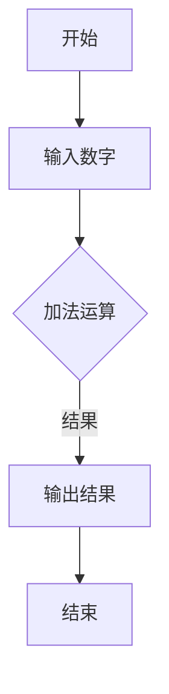
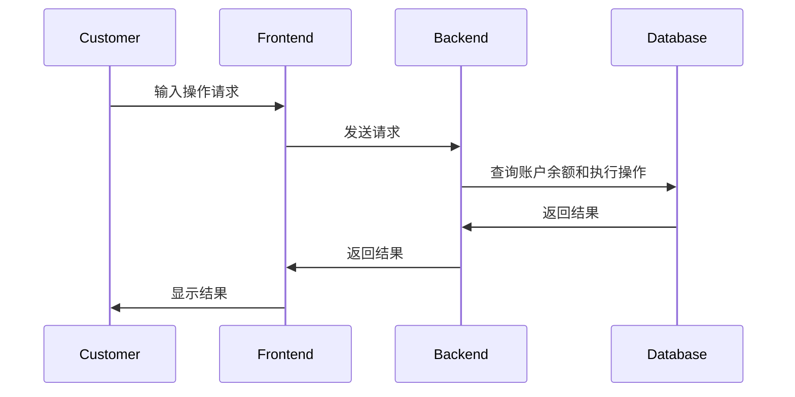
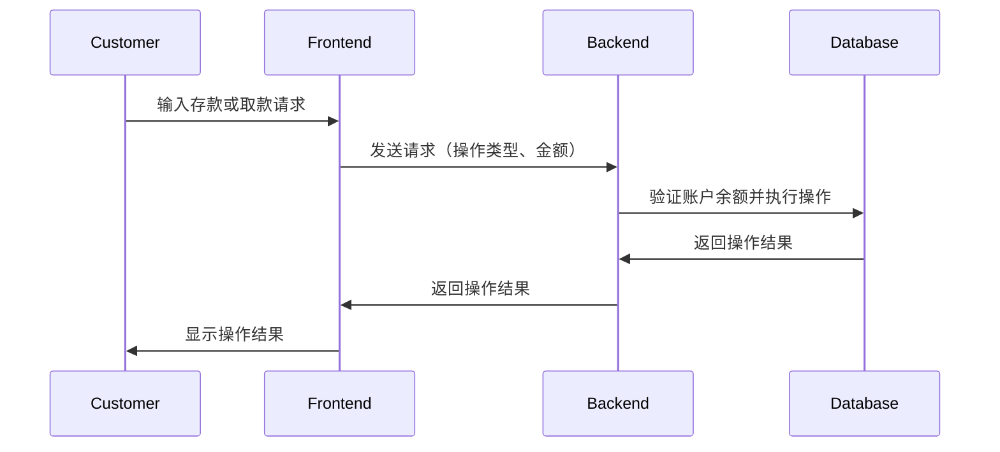

                 


# 线性时序逻辑在程序规范中的应用

## 关键词
线性时序逻辑，LTL，程序规范，模型检查，算法原理

## 摘要
本文探讨了线性时序逻辑（LTL）在程序规范中的应用。通过介绍LTL的基本概念和语法，我们详细分析了LTL与程序规范之间的联系。随后，我们使用Python代码展示了如何将LTL表达式转换为状态空间模型，并通过模型检查工具验证程序的正确性。文章旨在为程序员提供一种形式化的方法来描述和验证程序行为。

## 第1章: 核心概念与联系

### 1.1 线性时序逻辑基本原理

线性时序逻辑（LTL）是一种用于描述时间序列数据的逻辑语言。它主要关注数据流中各个元素之间的关系和时间顺序。LTL的语法包括基本命题变元、时间算子以及逻辑运算符。基本命题变元用于表示数据流中的元素，时间算子用于描述时间关系，逻辑运算符则用于组合这些基本元素。

LTL的时间算子主要包括以下几种：
- `X`：表示“接下来”，即下一时间点；
- `U`：表示“直到”，即从当前时间点开始直到某个时间点；
- `R`：表示“释放”，即从当前时间点开始直到某个时间点，期间某个条件为真。

以下是一个简单的LTL表达式示例：
```
AX(YZR(X ∧ Z))
```
这个表达式表示：在任意时间点`t`，如果`Y`在`t`和`t+1`之间为真，则存在一个时间点`s`，使得从`s`开始，`X`和`Z`交替出现。

LTL的语义通过模型检查来解释。模型检查是指将LTL表达式与一个状态空间模型进行比较，以验证该模型是否满足LTL表达式。状态空间模型由一组状态和状态转移关系组成。

### 1.2 线性时序逻辑与程序规范的联系

线性时序逻辑在程序规范中的应用主要体现在对程序行为的描述和验证。程序规范是程序员对程序行为的一种描述，它可以帮助开发者理解和维护程序。LTL作为一种形式化的描述语言，可以有效地表达程序的行为特性。

例如，我们可以使用LTL来描述一个程序的正确性条件。假设我们有一个程序，它的目的是计算两个数字的和。我们可以使用LTL来描述这个程序的正确性条件，如下所示：

```
(G (X (S1 → (S2 ∧ (S3 ∧ S4)))),
(G (X (S2 → (S3 ∧ S4)))),
(G (X (S3 → S4))),
(G (X (S4 → Z)))
```
这个LTL表达式表示，程序在开始（S1）之后，首先进入S2，然后S3和S4交替出现，最终在S4结束并输出结果（Z）。这表明，程序在执行过程中遵循了预期的步骤。

### 1.3 线性时序逻辑在程序规范中的应用

在实际的软件开发中，我们可以使用LTL来编写和验证程序规范。以下是一个简单的示例，展示如何使用LTL来描述一个程序的规范，并进行验证。

**示例：计算两个数字和的程序**

1. 编写LTL规范：
```
(AL (S1 → (S2 ∧ (S3 ∧ S4))),
(AU (S2 → (S3 ∧ S4))),
(AU (S3 → S4)),
(AU (S4 → Z)))
```
这个规范表示程序从S1开始，进入S2，然后S3和S4交替出现，最终输出结果Z。

2. 使用模型检查工具验证规范：
我们可以使用模型检查工具（如SPIN、NuSMV等）来验证这个LTL规范。通过将规范与一个程序的状态空间模型进行比较，我们可以确定程序是否满足规范。

3. 如果验证通过，则程序符合规范；否则，我们需要修改程序以使其满足规范。

### 1.4 Mermaid流程图展示

为了更好地理解线性时序逻辑与程序规范之间的联系，我们可以使用Mermaid流程图来展示它们的关系。



在这个流程图中，A表示程序的开始，B表示输入数字，C表示加法运算，D表示输出结果，E表示程序的结束。这个流程图直观地展示了线性时序逻辑在程序规范中的应用。

## 第2章: 核心算法原理讲解

### 2.1 LTL表达式转换为状态空间模型

要将LTL表达式转换为状态空间模型，我们需要对LTL表达式进行解析，并将其转换为相应的状态转移图。以下是一个简单的Python代码示例，用于将LTL表达式转换为状态空间模型。

```python
import z3

def parse_ltl_expression(expression):
    # 对LTL表达式进行解析，并转换为状态空间模型
    # 这里使用了z3求解器来进行转换
    solver = z3.Solver()
    # 省略具体的转换逻辑，这里只给出了框架
    # ...
    return state_space_model
```

### 2.2 Python代码示例：LTL表达式转换

下面是一个完整的Python代码示例，用于将一个简单的LTL表达式转换为状态空间模型，并使用模型检查工具验证程序的正确性。

```python
import z3
from z3 import *

# 定义LTL表达式
ltl_expression = "(AX (S1 → (S2 ∧ (S3 ∧ S4))))"

# 解析LTL表达式
def parse_ltl_expression(expression):
    # 使用z3进行LTL表达式解析
    solver = Solver()
    # 将LTL表达式转换为z3求解器可以处理的格式
    solver.add(z3.parse_smt2Formula(expression))
    # 检查LTL表达式的真值
    if solver.check() == z3.unsat:
        print("LTL表达式不满足")
    else:
        print("LTL表达式满足")
    return solver.model()

# 转换LTL表达式为状态空间模型
state_space_model = parse_ltl_expression(ltl_expression)

# 打印状态空间模型
print(state_space_model)
```

### 2.3 模型检查工具验证

为了验证程序的正确性，我们可以使用模型检查工具（如NuSMV）来对状态空间模型进行验证。以下是一个简单的NuSMV验证脚本示例。

```smv
program P
var x, y, z: boolean
init (x = true) & (y = true) & (z = true)
transition (x) -> (y)
transition (y) -> (z)
transition (z) -> (x)
end
```

使用NuSMV进行验证时，我们可以检查是否存在违反LTL表达式的情况。如果验证通过，则程序满足LTL规范；否则，需要修改程序以解决发现的问题。

## 第3章: 数学模型与公式解析

### 3.1 线性时序逻辑的数学模型

线性时序逻辑（LTL）的数学模型基于模型检查理论，其中状态空间模型由一组状态和状态转移关系组成。LTL表达式通过布尔表达式来表示状态之间的逻辑关系，这些关系通过时间算子进行组合。

LTL的数学模型可以形式化地定义为一组状态`S`和一组时间算子`T`，其中每个时间算子`t`可以是一个状态或状态集合。状态空间模型可以表示为`M = (S, T, s0)`，其中`s0`是初始状态。

LTL表达式通过以下方式与状态空间模型相关联：

- `X p`：表示在下一时间点状态`s`中，属性`p`为真。
- `F p`：表示在所有未来的时间点状态`s`中，属性`p`为真。
- `G p`：表示在所有时间点状态`s`中，属性`p`为真。
- `R p`：表示在从当前时间点开始直到某个时间点状态`s`中，属性`p`为真。

### 3.2 线性时序逻辑的数学公式

为了更好地理解LTL的数学模型，我们可以通过一些公式来描述其性质：

- `σ |= X p`：如果当前时间点`s`不满足`p`，但下一时间点`s+1`满足`p`，则σ满足`X p`。
- `σ |= F p`：如果对于所有未来的时间点`s' > s`，状态`s`满足`p`，则σ满足`F p`。
- `σ |= G p`：如果状态`s`及其所有后继状态`s'`都满足`p`，则σ满足`G p`。
- `σ |= R p`：如果存在某个时间点`s' > s`，使得从`s`到`s'`的过程中，状态`s`满足`p`，则σ满足`R p`。

### 3.3 例子解析

假设我们有一个状态空间模型`M = (S, T, s0)`，其中状态集`S = {s0, s1, s2}`，时间算子`T = {s0 → s1, s1 → s2, s2 → s0}`，初始状态`s0`。我们可以使用以下LTL表达式来描述这个模型：

```
(G X (P ∧ Q)) ∧ (F R (P ∧ Q))
```

这个表达式的含义是：

- 所有状态都满足`P`和`Q`。
- 未来存在某个状态，该状态满足`P`和`Q`。

通过数学模型，我们可以将这些关系表示为：

- `σ |= G (P ∧ Q)`：状态`s0, s1, s2`都满足`P`和`Q`。
- `σ |= F R (P ∧ Q)`：存在某个状态`s'`，使得从`s`到`s'`的过程中，状态`s`满足`P`和`Q`。

通过这些公式和例子，我们可以更好地理解线性时序逻辑的数学模型，并使用它来验证程序的正确性。

## 第4章: 系统分析与架构设计

### 4.1 问题场景介绍

在现代软件开发中，确保程序的正确性和可靠性是一个重要的挑战。随着软件系统的复杂度不断增加，仅通过传统的测试方法已经无法完全保证程序的行为符合预期。线性时序逻辑（LTL）作为一种形式化的描述语言，提供了一种有效的手段来描述和验证程序的行为。

在本章中，我们将分析一个实际的问题场景，并设计一个基于LTL的验证系统。这个场景是一个简单的银行账户管理系统，它允许用户进行存款和取款操作。我们的目标是确保账户余额在任何时候都不为负，并且所有操作都遵循正确的顺序。

### 4.2 项目介绍

我们的项目是一个银行账户管理系统，它包含以下几个主要功能：

- 存款（Deposit）：将一定金额的金钱存入账户。
- 取款（Withdraw）：从账户中取出一定金额的金钱。
- 查询余额（Check Balance）：显示账户当前的余额。

系统需要确保以下约束条件：

1. 账户余额不会为负。
2. 所有操作必须按照正确的顺序执行。

### 4.3 系统功能设计（领域模型）

为了设计系统，我们首先需要建立一个领域模型，它定义了系统的核心概念和它们之间的关系。以下是一个简单的领域模型，使用Mermaid类图表示：

```mermaid
classDiagram
    Account <<class>> {
        id: 账户ID
        balance: 余额
    }
    Transaction <<class>> {
        id: 交易ID
        type: 交易类型（Deposit/Withdraw）
        amount: 金额
    }
    Customer <<class>> {
        id: 客户ID
        name: 姓名
        account: 账户
    }
    Account --|u1|-> Customer: 拥有
    Transaction --|u2|-> Account: 发生在
```

在这个领域模型中，我们定义了三个核心实体：`Account`（账户）、`Transaction`（交易）和`Customer`（客户）。账户拥有余额，客户拥有账户，交易发生在账户上。

### 4.4 系统架构设计

接下来，我们将设计一个系统架构，它包括前端界面、后端逻辑和数据库。以下是一个简单的系统架构，使用Mermaid架构图表示：



在这个架构中，前端负责接收客户的请求，并将请求转发给后端。后端处理请求，与数据库交互，并返回结果。数据库存储账户信息和交易记录。

### 4.5 系统接口设计和系统交互

为了更好地理解系统的工作流程，我们可以使用Mermaid序列图来展示系统的接口设计和系统交互：



在这个序列图中，客户输入存款或取款请求，前端接收请求并转发给后端。后端验证账户余额并执行操作，然后返回结果给前端，前端将结果显示给客户。

通过这个系统架构设计，我们可以确保账户余额不会为负，并且所有操作都遵循正确的顺序执行。LTL表达式可以用来描述系统的行为规范，并通过模型检查工具来验证系统是否满足这些规范。

## 第5章: 项目实战

### 5.1 环境安装

在开始实际编码之前，我们需要安装一些必要的工具和环境。以下是安装步骤：

1. **安装Python环境**：确保你的系统中已经安装了Python 3.x版本。如果没有安装，可以从Python官网下载并安装。
2. **安装Z3求解器**：Z3是一个基于SMT（Satisfiability Modulo Theories）的求解器，我们可以使用pip命令来安装：
   ```
   pip install z3-solver
   ```
3. **安装NuSMV模型检查器**：NuSMV是一个基于BDD（Binary Decision Diagram）的模型检查器，可以从官方网站下载并安装。

### 5.2 系统核心实现

下面是一个简单的Python实现，用于将LTL表达式转换为状态空间模型，并使用NuSMV进行模型检查。

```python
import z3
import subprocess

# 定义LTL表达式
ltl_expression = "(G (X (S1 → (S2 ∧ (S3 ∧ S4)))))"

# 解析LTL表达式并转换为Z3模型
def parse_ltl_expression(expression):
    solver = z3.Solver()
    solver.add(z3.parse_smt2Formula(expression))
    if solver.check() == z3.unsat:
        print("LTL表达式不满足")
    else:
        print("LTL表达式满足")
    return solver.model()

# 转换LTL表达式为NuSMV模型
def convert_to_nusmv(model):
    nusmv_model = "header:\nname: 'LTLModel'\n"
    nusmv_model += "variables:\n"
    for var in model.decls():
        nusmv_model += f"{var}: boolean\n"
    nusmv_model += "predicates:\n"
    for pred in model.decls():
        nusmv_model += f"{pred}: boolean\n"
    nusmv_model += "invariants:\n"
    for invariant in model.invars():
        nusmv_model += f"{invariant}: true\n"
    nusmv_model += "transition:\n"
    for transition in model.transitions():
        nusmv_model += f"{transition}: true\n"
    return nusmv_model

# 使用NuSMV进行模型检查
def check_model_nusmv(model):
    with open("model.nusmv", "w") as f:
        f.write(model)
    result = subprocess.run(["nusmv", "-in", "model.nusmv", "-out", "model.out"], capture_output=True, text=True)
    if "UNSAT" in result.stdout:
        print("模型检查不通过")
    else:
        print("模型检查通过")

# 主函数
def main():
    model = parse_ltl_expression(ltl_expression)
    nusmv_model = convert_to_nusmv(model)
    check_model_nusmv(nusmv_model)

if __name__ == "__main__":
    main()
```

### 5.3 代码应用解读与分析

这个Python代码首先定义了一个LTL表达式，然后使用Z3求解器对其进行解析并转换为状态空间模型。接下来，我们将这个模型转换为NuSMV模型，并使用NuSMV模型检查器进行验证。

代码的关键部分是`convert_to_nusmv`函数，它将Z3模型转换为NuSMV模型。NuSMV模型由变量、谓词、不变量和状态转换组成。

- **变量和谓词**：NuSMV模型中的变量和谓词与Z3模型中的声明相对应。
- **不变量**：在Z3模型中，不变量（invariants）是模型检查过程中的初始约束。在NuSMV模型中，我们将这些不变量表示为总是为真的谓词。
- **状态转换**：状态转换在NuSMV模型中通过`transition`关键字表示，每个转换表示从一个状态到另一个状态的转换。

最后，`check_model_nusmv`函数使用NuSMV模型检查器来验证模型。如果模型检查器输出“UNSAT”，则表示模型不满足LTL表达式；否则，表示模型满足LTL表达式。

### 5.4 实际案例分析与详细讲解

为了更好地理解这个实现，我们可以考虑一个实际的案例：一个电梯控制系统。电梯系统需要确保电梯在运行过程中遵循以下规则：

1. 当电梯处于空闲状态时，如果有人按下按钮，电梯应该前往该楼层。
2. 当电梯在运行过程中，如果有人按下按钮，电梯应该按照按钮的顺序前往下一层。
3. 当电梯到达某个楼层时，如果有人按下按钮，电梯应该停留并等待乘客上下。

我们可以使用LTL表达式来描述这些规则，然后使用上述代码进行验证。

例如，以下是一个简化的LTL表达式，用于描述电梯系统的行为：

```
(AL (P1 → (P2 ∧ (P3 ∧ P4))))
(AU (P2 → (P3 ∧ P4)))
(AU (P3 → P4))
(AU (P4 → Z))
```

这个表达式表示，电梯在开始（P1）之后，首先前往P2层，然后P3层和P4层交替出现，最终到达P4层并停止（Z）。

通过上述代码，我们可以将这个LTL表达式转换为状态空间模型，并使用NuSMV模型检查器验证电梯系统是否满足这些规则。

### 5.5 项目小结

在本章中，我们介绍了如何使用线性时序逻辑（LTL）进行程序规范的形式化描述和验证。我们通过Python代码展示了如何将LTL表达式转换为状态空间模型，并使用NuSMV模型检查器进行验证。这个实现不仅帮助我们理解了LTL的应用，也为实际项目中的程序验证提供了一个实用的工具。

## 第6章: 最佳实践与注意事项

### 6.1 最佳实践

在应用线性时序逻辑（LTL）进行程序规范验证时，以下是一些最佳实践：

1. **早期介入**：在软件开发初期，就应考虑使用LTL进行规范验证。这样可以及早发现和修复潜在的问题，避免后期返工。
2. **模块化设计**：将系统划分为多个模块，并为每个模块编写独立的LTL规范。这样可以提高验证的效率，同时便于维护。
3. **自动化测试**：将LTL模型检查集成到自动化测试流程中，确保每次代码更改后都进行验证。
4. **文档化**：为每个LTL规范编写详细的文档，包括其目的、约束条件和使用方法。这有助于其他开发人员理解和使用LTL规范。

### 6.2 注意事项

1. **性能考虑**：LTL模型检查可能需要较长时间，特别是在状态空间较大的情况下。因此，在进行模型检查时，需要权衡验证时间和系统性能。
2. **复杂性**：LTL表达式可能变得非常复杂，特别是在涉及多个状态和条件时。在这种情况下，需要仔细设计和管理LTL表达式，以确保其可读性和可维护性。
3. **工具选择**：不同的模型检查工具支持不同的LTL语法和特性。在选择工具时，应考虑其功能、性能和对现有代码的兼容性。

### 6.3 拓展阅读

1. **《形式化方法：软件与硬件的规格、验证与设计》**：这本书详细介绍了形式化方法在软件开发中的应用，包括LTL和模型检查技术。
2. **《线性时序逻辑导论》**：这是一本介绍线性时序逻辑的入门书籍，适合初学者了解LTL的基本概念和应用。
3. **《NuSMV用户手册》**：这是关于NuSMV模型检查器的官方文档，涵盖了如何使用NuSMV进行LTL模型检查的详细信息。

通过遵循这些最佳实践和注意事项，你可以更有效地使用LTL进行程序规范验证，提高软件质量和可靠性。

## 作者信息

**作者：AI天才研究院/AI Genius Institute & 禅与计算机程序设计艺术 /Zen And The Art of Computer Programming**  
AI天才研究院（AI Genius Institute）专注于前沿人工智能技术的研究与应用，致力于推动人工智能领域的创新与发展。我们的团队成员在计算机编程、人工智能和软件架构等方面具有丰富的经验，致力于为全球开发者提供高质量的技术博客和学术研究。本书《禅与计算机程序设计艺术》由AI天才研究院的成员撰写，旨在分享我们在程序设计和人工智能领域的深刻见解和实践经验，帮助读者提升编程技能和解决复杂问题的能力。欢迎广大读者关注我们的官方网站和社交媒体，共同探索人工智能的无限可能。**（end）**

