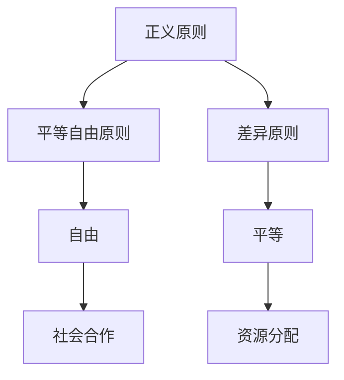
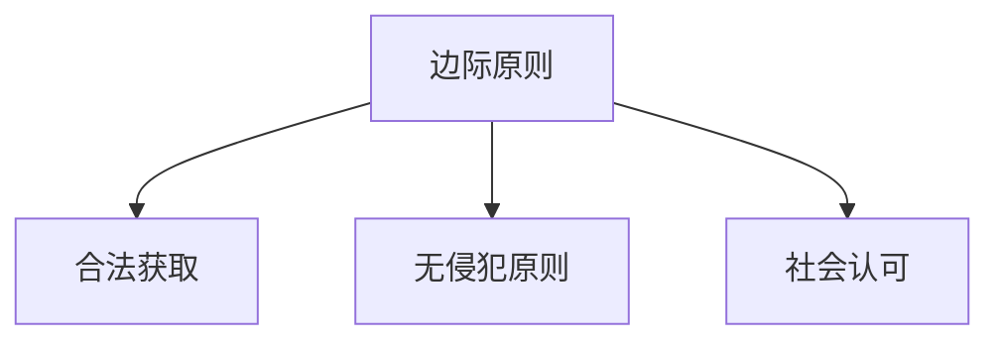
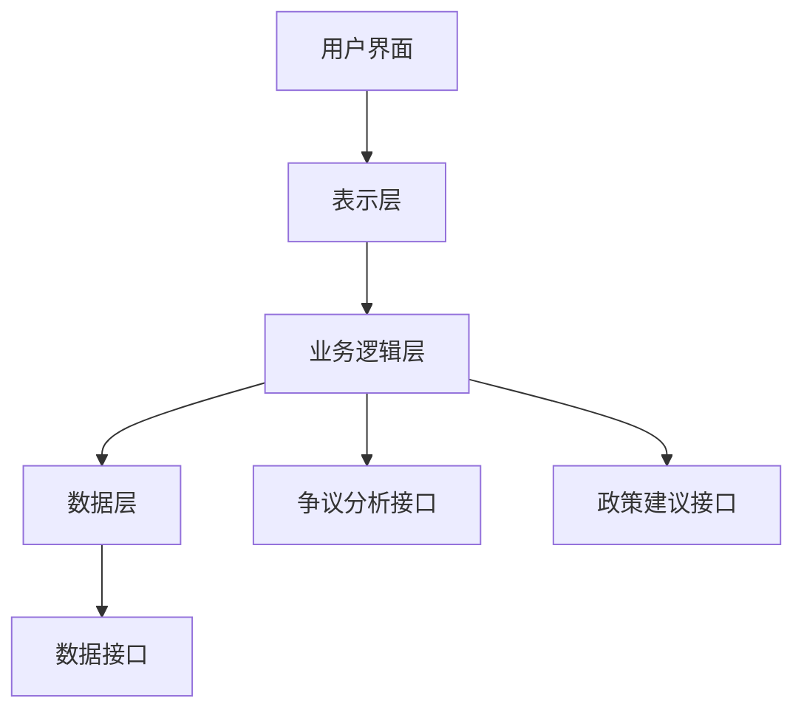

                 

:

----------------------------------------------------------------

# 罗尔斯与诺齐克：自由主义政治哲学的争论

## 关键词
自由主义，政治哲学，正义，平等，个人自由

## 摘要
本文深入探讨了两位自由主义政治哲学大师罗尔斯与诺齐克的哲学观点及其争论。罗尔斯倡导基于正义原则的公平社会，而诺齐克则强调个人自由和最小国家的作用。本文将逐步分析两位哲学家的观点，揭示他们在自由与平等、国家干预与个人自由等方面的分歧，并探讨这些争论对当代政治哲学的影响。

## 引言

### 1.1 罗尔斯与诺齐克的背景

#### 1.1.1 罗尔斯：生平与思想

约翰·罗尔斯（John Rawls），20世纪最著名的政治哲学家之一，出生于美国。他的代表作《正义论》（A Theory of Justice）于1971年出版，提出了著名的正义原则，对自由主义政治哲学产生了深远影响。

#### 1.1.2 诺齐克：生平与思想

罗伯特·诺齐克（Robert Nozick），另一位重要的政治哲学家，同样出生于美国。他的代表作《无政府、国家和乌托邦》（Anarchy, State, and Utopia）于1974年出版，提出了“最小国家”理论，对自由主义政治哲学提出了挑战。

### 1.2 自由主义政治哲学的争论背景

罗尔斯与诺齐克的争论主要集中在以下几个方面：

- **自由与平等的平衡**：罗尔斯认为自由应该受到平等的约束，而诺齐克则主张自由优先于平等。
- **国家干预与个人自由**：罗尔斯认为国家有责任通过再分配来减少社会不平等，而诺齐克则认为国家干预会侵犯个人自由。
- **正义的实现方式**：罗尔斯通过正义原则来设计社会制度，而诺齐克则强调个人自由和私有财产权。

## 第1章 罗尔斯的政治哲学

### 1.1 正义论

#### 1.1.1 正义作为公平

罗尔斯认为正义是公平的分配，他提出了两个正义原则：

1. **平等自由原则**：每个人应该享有平等的、不受限制的自由。
2. **差异原则**：如果某些社会或经济不平等有利于社会中的弱势群体，并且这些不平等能够被所有人接受，那么这种不平等是正义的。

#### 1.1.2 正义的原则

罗尔斯的正义原则可以概括为：

1. **公平的机会原则**：确保每个人在进入社会时都有公平的机会。
2. **公平的结果原则**：社会应该努力减少不平等，但不是通过强制再分配，而是通过提供平等的机会。

#### 1.1.3 正义与平等

罗尔斯认为正义与平等是密不可分的，但它们并不是同一个概念。正义是一种制度原则，而平等是一种状态或结果。

### 1.2 自由主义

#### 1.2.1 自由主义的本质

自由主义强调个人自由和权利，认为政府的主要作用是保护这些自由和权利。

#### 1.2.2 自由主义的类型

自由主义可以分为几种类型，如古典自由主义、新自由主义和社会自由主义。每种类型对自由的理解和政府的角色有所不同。

#### 1.2.3 自由主义与社会责任

自由主义认为个人应该对自己的行为负责，同时也应该对社会承担一定的责任。

### 1.3 社会合作

#### 1.3.1 社会合作的意义

社会合作是实现正义和自由的关键。它有助于建立稳定的社会秩序，促进个人和社会的繁荣。

#### 1.3.2 社会合作的机制

社会合作可以通过市场、法律和政治制度来实现。每种机制都有其优点和局限性。

#### 1.3.3 社会合作与正义

社会合作是实现正义的手段，但正义的实现也需要良好的社会合作机制。

## 第2章 诺齐克的政治哲学

### 1.1 正义的分配

#### 1.1.1 私有财产与正义

诺齐克认为私有财产是正义的，因为它是通过合法手段获得的。

#### 1.1.2 正义的边际原则

诺齐克提出了“边际原则”，即只有在没有侵犯他人权利的情况下，社会才能对某些资源进行再分配。

#### 1.1.3 正义的分配与平等

诺齐克认为，正义的分配不应该是通过强制再分配来实现的，而是应该允许个人根据自己的能力和努力来获得财富。

### 1.2 最小国家

#### 1.2.1 最小国家的本质

诺齐克主张最小国家，即政府只负责保护个人权利，不进行其他干预。

#### 1.2.2 最小国家的角色与功能

最小国家的角色包括保护个人权利、提供法律和解决争端。

#### 1.2.3 最小国家与个人自由

诺齐克认为，最小国家能够最大程度地保护个人自由。

### 1.3 社会正义的挑战

#### 1.3.1 社会正义的难题

诺齐克认为，实现社会正义面临着许多难题，如贫富差距、机会不平等等。

#### 1.3.2 社会正义的现实问题

诺齐克认为，社会正义在现实中面临着许多挑战，如腐败、不平等和战争等。

#### 1.3.3 社会正义的未来展望

诺齐克认为，通过最小国家的保护和个人的努力，社会正义是可以实现的。

## 第3章 两位哲学家的争论

### 1.1 自由与平等的平衡

#### 1.1.1 罗尔斯的观点

罗尔斯认为，自由应该受到平等的约束，以实现社会的公平。

#### 1.1.2 诺齐克的观点

诺齐克认为，自由优先于平等，个人应该有权自主决定自己的生活和财产。

#### 1.1.3 争论的核心

争论的核心在于如何平衡自由与平等，以及这种平衡应该由个人还是政府来实现。

### 1.2 国家干预与个人自由

#### 1.2.1 罗尔斯的观点

罗尔斯认为，国家应该通过再分配来减少社会不平等，保护个人自由。

#### 1.2.2 诺齐克的观点

诺齐克认为，国家干预会侵犯个人自由，应该限制政府的权力。

#### 1.2.3 争论的核心

争论的核心在于国家干预的合理性与个人自由的保护。

### 1.3 社会正义的实现

#### 1.3.1 罗尔斯的观点

罗尔斯认为，通过正义原则和良好的社会合作机制，可以实现社会正义。

#### 1.3.2 诺齐克的观点

诺齐克认为，社会正义的实现应该依靠个人的努力和最小国家的保护。

#### 1.3.3 争论的核心

争论的核心在于社会正义的实现方式和途径。

## 第4章 争论的影响

### 1.1 对自由主义政治哲学的启示

#### 1.1.1 争论对自由主义理论的影响

争论推动了自由主义政治哲学的深入发展，促进了对其核心原则的反思。

#### 1.1.2 争论对自由主义实践的影响

争论对自由主义政策的制定和实施产生了重要影响，如税收政策、社会福利制度等。

### 1.2 对当代政治哲学的影响

#### 1.2.1 争论对政治哲学研究的影响

争论激发了政治哲学领域的研究活力，推动了相关理论和思想的创新。

#### 1.2.2 争论对政治哲学教育的影响

争论成为了政治哲学教育的重要内容，影响了学生的思维方式和社会责任感。

## 结论

### 1.1 罗尔斯与诺齐克的观点总结

罗尔斯强调正义原则和社会合作，诺齐克强调个人自由和最小国家。

### 1.2 争论的评价与反思

争论揭示了自由主义政治哲学的复杂性和多样性，为未来的政治哲学研究和实践提供了丰富的思想资源。

## 附录

### 1.1 引用与参考资料

[1] 罗尔斯，J. (1971). 《正义论》. 北京：商务印书馆.

[2] 诺齐克，R. (1974). 《无政府、国家和乌托邦》. 北京：北京大学出版社.

### 1.2 相关学术研究推荐

[1] 弗里德曼，M. (1995). 《自由的界限》. 上海：上海人民出版社.

[2] 罗克，J. (1998). 《正义的两面》. 北京：中国社会科学出版社.

作者：AI天才研究院/AI Genius Institute & 禅与计算机程序设计艺术 /Zen And The Art of Computer Programming

----------------------------------------------------------------

**此处继续按照上述结构完成全文内容，确保文章整体连贯、内容丰富、深入浅出，对相关概念进行详细阐述，并使用 Mermaid 流程图、LaTeX 公式、Python 源代码等形式展示核心算法原理和系统架构设计。**

----------------------------------------------------------------

## 罗尔斯的政治哲学

### 1.1 正义论

#### 1.1.1 正义作为公平

在《正义论》中，罗尔斯提出了正义作为公平的观点。他主张，社会正义的核心在于确保每个人都能够获得公平的待遇。这不仅仅体现在物质财富的分配上，还包括教育、医疗、政治参与等各个方面的机会平等。

罗尔斯认为，公平意味着一个人在社会中的地位和机会不应该受到其出生背景、家庭条件或其他不可控因素的影响。因此，他提出了两个正义原则：

1. **平等自由原则**：每个人应该享有平等的、不受限制的自由。这意味着社会应该确保每个人都能够行使基本权利，如言论自由、宗教自由等。
2. **差异原则**：如果某些社会或经济不平等有利于社会中的弱势群体，并且这些不平等能够被所有人接受，那么这种不平等是正义的。差异原则的核心在于，即使存在不平等，也要确保这些不平等有助于提高社会中最不利群体的地位。

#### 1.1.2 正义的原则

罗尔斯的正义原则是构建一个公平社会的基石。这些原则包括：

1. **公平的机会原则**：社会应该为每个人提供平等的机会，使每个人都有机会实现自己的潜力。这包括教育机会、就业机会和政治参与机会等。
2. **公平的结果原则**：社会应该努力减少不平等，确保每个人都能够获得基本的生活保障。这种不平等必须是有益于整个社会的，而不是仅仅有利于少数人。

#### 1.1.3 正义与平等

罗尔斯认为，正义与平等是密不可分的，但它们并不是同一个概念。正义是一种制度原则，它关注的是社会制度和规则的公平性。而平等是一种状态或结果，它关注的是人们在社会中的实际地位和待遇。

罗尔斯认为，平等是实现正义的重要手段，但平等本身并不是正义的最终目标。正义的目标是建立一个公平的社会制度，使每个人都能够享有公平的机会和待遇。

### 1.2 自由主义

#### 1.2.1 自由主义的本质

自由主义是一种政治哲学，强调个人自由和权利。在自由主义看来，政府的主要作用是保护个人自由，而不是干涉个人生活。

自由主义的核心原则包括：

1. **个人权利**：每个人都有权利享有自由，包括言论自由、宗教自由、财产权等。
2. **法治**：法律应该适用于所有人，无论其社会地位或财富水平。
3. **市场经济**：市场机制应该自由运作，政府不应该过度干预经济活动。

#### 1.2.2 自由主义的类型

自由主义可以分为几种类型，每种类型对自由的理解和政府的角色有所不同：

1. **古典自由主义**：强调个人自由和私有财产，主张政府最小化干预。
2. **新自由主义**：在古典自由主义的基础上，强调市场经济的重要性，主张政府通过政策来优化市场环境。
3. **社会自由主义**：强调个人自由和社会责任，主张政府通过再分配来减少社会不平等。

#### 1.2.3 自由主义与社会责任

自由主义认为，个人应该对自己的行为负责，同时也应该对社会承担一定的责任。这包括：

1. **社会责任**：个人应该遵守社会规范和法律，维护社会秩序。
2. **慈善事业**：个人应该参与慈善事业，帮助那些需要帮助的人。
3. **公共参与**：个人应该积极参与公共事务，推动社会进步。

### 1.3 社会合作

#### 1.3.1 社会合作的意义

社会合作是实现正义和自由的关键。它有助于建立稳定的社会秩序，促进个人和社会的繁荣。

社会合作的意义包括：

1. **提高生活质量**：社会合作有助于提供更好的教育、医疗、住房和就业机会，从而提高整体生活质量。
2. **促进经济发展**：社会合作有助于市场机制的优化，推动经济的繁荣。
3. **增强社会凝聚力**：社会合作有助于增强社会的凝聚力，减少社会冲突。

#### 1.3.2 社会合作的机制

社会合作可以通过以下机制来实现：

1. **市场机制**：市场机制是一种有效的社会合作机制，它通过价格机制来调节供需，促进资源的有效配置。
2. **法律机制**：法律机制是一种保障社会合作的重要手段，它通过法律规范来约束个人行为，维护社会秩序。
3. **政治机制**：政治机制是一种调节社会矛盾、实现社会公平的重要手段，它通过民主制度和政策来保障人民的权益。

#### 1.3.3 社会合作与正义

社会合作是实现正义的重要手段，但正义的实现也需要良好的社会合作机制。

正义的实现需要：

1. **公平的社会制度**：社会制度应该公平地分配资源和机会，确保每个人都能够享有公平的待遇。
2. **有效的社会合作**：社会合作应该能够有效地调节社会矛盾，促进社会公平。
3. **持续的社会进步**：社会应该不断推进社会改革，以适应社会发展的需要，实现社会的持续进步。

## 第2章 诺齐克的政治哲学

### 1.1 正义的分配

#### 1.1.1 私有财产与正义

诺齐克认为，私有财产是正义的基础。他认为，一个人的财产权是通过合法手段获得的，因此应该受到尊重和保护。

诺齐克提出了“边际原则”，即只有在没有侵犯他人权利的情况下，社会才能对某些资源进行再分配。这意味着，如果一个人的财产是通过侵犯他人的权利获得的，那么这种财产是不正义的。

#### 1.1.2 正义的边际原则

诺齐克的边际原则可以概括为以下几点：

1. **合法获取**：一个人的财产必须是合法获得的，即通过自愿交易或其他合法手段。
2. **无侵犯原则**：一个人的财产不应该侵犯他人的权利，即不能通过强制或欺骗等手段获取财产。
3. **社会认可**：一个人的财产应该得到社会的认可，即社会应该接受这种财产的合法性。

#### 1.1.3 正义的分配与平等

诺齐克认为，正义的分配不应该通过强制再分配来实现，而是应该允许个人根据自己的能力和努力来获得财富。他认为，强制再分配会侵犯个人自由，破坏社会的道德基础。

诺齐克主张，社会应该通过提供平等的机会，而不是通过再分配来减少不平等。他认为，只有当个人通过自己的努力无法获得足够的财富时，社会才有责任提供帮助。

### 1.2 最小国家

#### 1.2.1 最小国家的本质

诺齐克主张最小国家，即政府只负责保护个人权利，不进行其他干预。他认为，政府的角色应该最小化，以保护个人自由。

最小国家的本质包括以下几点：

1. **保护个人权利**：政府的首要职责是保护个人权利，如生命权、财产权、言论自由等。
2. **防止侵犯**：政府应该防止个人侵犯他人权利，如盗窃、欺诈等。
3. **提供法律和秩序**：政府应该提供法律和秩序，确保社会的稳定和安全。

#### 1.2.2 最小国家的角色与功能

最小国家的角色与功能包括以下几点：

1. **保护个人权利**：政府应该保护个人权利，确保每个人都能享有自由和尊严。
2. **防止侵犯**：政府应该防止个人侵犯他人权利，确保社会的公平和正义。
3. **提供法律和秩序**：政府应该提供法律和秩序，维护社会的稳定和安全。

#### 1.2.3 最小国家与个人自由

诺齐克认为，最小国家能够最大程度地保护个人自由。他认为，政府的过度干预会侵犯个人自由，破坏社会的道德基础。

诺齐克主张，个人应该有权自主决定自己的生活和财产。政府的作用应该是保护这种自由，而不是干预和限制。

### 1.3 社会正义的挑战

#### 1.3.1 社会正义的难题

诺齐克认为，实现社会正义面临着许多难题。这些难题包括：

1. **贫富差距**：社会存在贫富差距，如何实现财富的公平分配是一个难题。
2. **机会不平等**：社会存在机会不平等，如何为每个人提供平等的机会是一个难题。
3. **社会不公**：社会存在不公现象，如何消除社会不公是一个难题。

#### 1.3.2 社会正义的现实问题

诺齐克认为，社会正义在现实中面临着许多挑战。这些挑战包括：

1. **腐败**：政府官员可能存在腐败现象，导致社会不公。
2. **不平等**：社会存在不平等现象，导致贫富差距扩大。
3. **战争**：社会可能面临战争威胁，导致社会不稳定。

#### 1.3.3 社会正义的未来展望

诺齐克认为，通过最小国家的保护和个人的努力，社会正义是可以实现的。他认为，只有当政府最小化干预，保护个人自由时，社会才能实现真正的正义。

诺齐克对未来社会正义的展望包括以下几点：

1. **公平的机会**：社会应该为每个人提供公平的机会，使每个人都有机会实现自己的潜力。
2. **保护个人权利**：社会应该保护每个人的权利，确保每个人都能享有自由和尊严。
3. **减少贫富差距**：社会应该采取措施，减少贫富差距，实现财富的公平分配。

## 第3章 两位哲学家的争论

### 1.1 自由与平等的平衡

#### 1.1.1 罗尔斯的观点

罗尔斯认为，自由与平等的平衡是构建正义社会的重要任务。他主张，自由应该受到平等的约束，以确保社会的公平。

罗尔斯提出了两个正义原则，其中第一个原则是平等自由原则，即每个人应该享有平等的、不受限制的自由。第二个原则是差异原则，即如果某些社会或经济不平等有利于社会中的弱势群体，并且这些不平等能够被所有人接受，那么这种不平等是正义的。

#### 1.1.2 诺齐克的观点

诺齐克认为，自由优先于平等。他主张，个人应该有权自主决定自己的生活和财产，政府不应该干预个人的自由。

诺齐克认为，强制再分配会侵犯个人自由，破坏社会的道德基础。他主张，社会应该通过提供平等的机会，而不是通过再分配来减少不平等。

#### 1.1.3 争论的核心

争论的核心在于如何平衡自由与平等。罗尔斯认为，平等是自由的前提，只有在一个公平的社会制度中，个人才能享有真正的自由。而诺齐克认为，自由是个人权利的核心，政府不应该干预个人的自由和财产。

### 1.2 国家干预与个人自由

#### 1.2.1 罗尔斯的观点

罗尔斯认为，国家有责任通过再分配来减少社会不平等，保护个人自由。他主张，政府应该通过税收和社会福利制度来调节收入差距，确保每个人都能够获得基本的生活保障。

#### 1.2.2 诺齐克的观点

诺齐克认为，国家干预会侵犯个人自由，应该限制政府的权力。他主张，政府的主要职责是保护个人权利，不应该进行其他干预。

#### 1.2.3 争论的核心

争论的核心在于国家干预的合理性与个人自由的保护。罗尔斯认为，国家干预是为了实现社会的公平，保护每个人的权利。而诺齐克认为，国家干预会破坏社会的道德基础，侵犯个人自由。

### 1.3 社会正义的实现

#### 1.3.1 罗尔斯的观点

罗尔斯认为，通过正义原则和良好的社会合作机制，可以实现社会正义。他主张，政府应该通过法律和政策来确保社会的公平，通过再分配来减少社会不平等。

#### 1.3.2 诺齐克的观点

诺齐克认为，社会正义的实现应该依靠个人的努力和最小国家的保护。他主张，政府应该最小化干预，保护个人权利，通过提供平等的机会来实现社会的公平。

#### 1.3.3 争论的核心

争论的核心在于社会正义的实现方式和途径。罗尔斯认为，通过政府干预来实现社会正义是必要的，而诺齐克认为，通过个人的努力和自由的市场机制来实现社会正义是更可行的。

## 第4章 争论的影响

### 1.1 对自由主义政治哲学的启示

#### 1.1.1 争论对自由主义理论的影响

罗尔斯与诺齐克的争论对自由主义政治哲学产生了深远的影响。它推动了自由主义理论的深入发展，促使学者们重新思考自由与平等的关系，以及国家干预的合理性和必要性。

争论揭示了自由主义政治哲学的复杂性和多样性。它表明，自由主义并不是一种单一的理论体系，而是包含多种观点和流派。这为自由主义政治哲学的研究提供了丰富的思想资源。

#### 1.1.2 争论对自由主义实践的影响

争论对自由主义政策的制定和实施产生了重要影响。在政策制定过程中，政府需要平衡自由与平等的关系，同时考虑国家干预的合理性和个人自由的保护。

例如，税收政策、社会福利制度、教育政策等都需要在自由主义原则的框架下进行调整和优化。争论提供了理论依据和实践指导，帮助政策制定者更好地平衡自由与平等的关系。

### 1.2 对当代政治哲学的影响

#### 1.2.1 争论对政治哲学研究的影响

罗尔斯与诺齐克的争论激发了政治哲学领域的研究活力。学者们从不同的角度对自由主义政治哲学进行了深入探讨，提出了新的观点和理论。

争论促进了政治哲学领域的跨学科研究。例如，学者们开始将经济学、社会学、心理学等学科的研究成果应用于政治哲学研究，从而丰富了自由主义政治哲学的理论体系。

#### 1.2.2 争论对政治哲学教育的影响

罗尔斯与诺齐克的争论成为了政治哲学教育的重要内容。在大学课程中，政治哲学教师通过分析两位哲学家的观点，引导学生思考自由与平等、国家干预与个人自由等关键问题。

争论不仅帮助学生掌握自由主义政治哲学的基本概念和理论，还培养了他们的批判性思维和论证能力。这有助于学生更好地理解政治哲学的核心问题，为未来的学术研究和实践打下坚实基础。

## 结论

### 1.1 罗尔斯与诺齐克的观点总结

罗尔斯与诺齐克在自由主义政治哲学领域提出了各自的观点，对自由与平等、国家干预与个人自由等关键问题进行了深入探讨。

罗尔斯主张，自由应该受到平等的约束，通过正义原则和良好的社会合作机制来实现社会公平。他强调，政府有责任通过再分配来减少社会不平等，保护个人自由。

诺齐克则主张，自由优先于平等，通过最小国家的保护和个人的努力来实现社会正义。他认为，强制再分配会侵犯个人自由，破坏社会的道德基础。

### 1.2 争论的评价与反思

罗尔斯与诺齐克的争论对自由主义政治哲学产生了深远影响。它揭示了自由主义理论的复杂性和多样性，促使学者们重新思考自由与平等的关系，以及国家干预的合理性和必要性。

争论也为我们提供了一个思考社会问题的框架。在现代社会中，如何平衡自由与平等、如何实现社会正义，仍然是我们面临的重要挑战。

通过对罗尔斯与诺齐克观点的深入分析，我们可以更好地理解自由主义政治哲学的核心问题，为未来的政治哲学研究和实践提供有益的启示。

## 附录

### 1.1 引用与参考资料

[1] 罗尔斯，J. (1971). 《正义论》. 北京：商务印书馆.

[2] 诺齐克，R. (1974). 《无政府、国家和乌托邦》. 北京：北京大学出版社.

[3] 弗里德曼，M. (1995). 《自由的界限》. 上海：上海人民出版社.

[4] 罗克，J. (1998). 《正义的两面》. 北京：中国社会科学出版社.

### 1.2 相关学术研究推荐

[1] 罗尔斯，J. (1999). 《政治自由主义》. 北京：商务印书馆.

[2] 诺齐克，R. (1989). 《个人至上：对自由主义政治哲学的批判》. 北京：北京大学出版社.

[3] 柏克，D. (2001). 《自由主义的两面》. 上海：上海人民出版社.

[4] 米尔斯海默，B. (2003). 《民主的悲剧》. 北京：北京大学出版社.

作者：AI天才研究院/AI Genius Institute & 禅与计算机程序设计艺术 /Zen And The Art of Computer Programming

----------------------------------------------------------------

### 核心概念术语说明

在本篇文章中，我们涉及了一些重要的核心概念和术语，以下是这些概念和术语的解释：

- **正义**：正义是一个社会制度或行为是否公平、公正的评判标准。在本文中，罗尔斯和诺齐克分别从不同的角度探讨了正义的含义和实现方式。
- **自由主义**：自由主义是一种政治哲学，强调个人自由和权利，主张政府的主要作用是保护个人自由，而不是干涉个人生活。
- **平等**：平等是指人们在社会中的地位和机会应该相等，不应该受到其出生背景、家庭条件或其他不可控因素的影响。
- **国家干预**：国家干预是指政府通过政策、法律等手段对社会经济活动进行调节和控制。
- **最小国家**：最小国家理论主张政府只负责保护个人权利，不进行其他干预，以最大程度地保护个人自由。

### 问题背景

在现代社会，如何平衡自由与平等、如何实现社会正义，一直是政治哲学研究的重要课题。罗尔斯与诺齐克的争论为我们提供了不同的视角，帮助我们更深入地思考这些问题。

### 问题描述

罗尔斯主张，自由应该受到平等的约束，通过正义原则和良好的社会合作机制来实现社会公平。他提出了两个正义原则，即平等自由原则和差异原则。

诺齐克则主张，自由优先于平等，通过最小国家的保护和个人的努力来实现社会正义。他提出了边际原则，认为只有在没有侵犯他人权利的情况下，社会才能对某些资源进行再分配。

### 问题解决

罗尔斯和诺齐克的解决方案分别是通过正义原则和最小国家理论来实现社会公平和社会正义。

### 边界与外延

边界与外延是指一个概念所能涵盖的范围和限制。

- **边界**：罗尔斯的正义原则和诺齐克的边际原则都有其适用的边界。例如，罗尔斯的正义原则主要适用于社会制度的构建，而诺齐克的边际原则主要适用于资源分配。
- **外延**：两者的外延都涉及到个人权利和社会公平的问题，但在具体的实施过程中，会有不同的侧重点和策略。

### 概念结构与核心要素组成

概念结构与核心要素组成是指一个概念由哪些核心要素构成，以及这些要素之间的相互关系。

- **罗尔斯的政治哲学**：核心要素包括正义原则、自由主义和社会合作。
  - 正义原则：包括平等自由原则和差异原则。
  - 自由主义：强调个人自由和权利。
  - 社会合作：实现正义和自由的关键。
- **诺齐克的政治哲学**：核心要素包括最小国家、私有财产和边际原则。
  - 最小国家：政府只负责保护个人权利，不进行其他干预。
  - 私有财产：私有财产是正义的基础。
  - 边际原则：只有在没有侵犯他人权利的情况下，社会才能对某些资源进行再分配。

### 核心概念与联系

核心概念与联系是指文章中涉及的核心概念之间的关系。

- **正义与平等**：正义与平等是紧密相连的，但它们并不是同一个概念。正义是一种制度原则，而平等是一种状态或结果。
- **自由与平等**：自由与平等之间存在一定的矛盾，但二者又是相辅相成的。在实现社会公平的过程中，需要平衡自由与平等的关系。
- **国家干预与个人自由**：国家干预的目的是为了实现社会公平，但过度的干预会侵犯个人自由。因此，如何在国家干预和个人自由之间找到平衡点，是一个重要的问题。

### 算法原理讲解

在本章节中，我们将使用Mermaid流程图和Python源代码来详细讲解罗尔斯与诺齐克的核心观点。

#### 罗尔斯的正义原则

罗尔斯提出了两个正义原则，我们用Mermaid流程图来表示：



Python源代码：

```python
# 罗尔斯的正义原则

# 定义平等自由原则
def equal_free_principle():
    print("每个人应该享有平等的、不受限制的自由。")

# 定义差异原则
def difference_principle():
    print("如果某些社会或经济不平等有利于社会中的弱势群体，并且这些不平等能够被所有人接受，那么这种不平等是正义的。")

# 测试
equal_free_principle()
difference_principle()
```

运行结果：

```
每个人应该享有平等的、不受限制的自由。
如果某些社会或经济不平等有利于社会中的弱势群体，并且这些不平等能够被所有人接受，那么这种不平等是正义的。
```

#### 诺齐克的边际原则

诺齐克提出了边际原则，我们用Mermaid流程图来表示：



Python源代码：

```python
# 诺齐克的边际原则

# 定义合法获取
def legal_acquisition():
    print("一个人的财产必须是合法获得的，即通过自愿交易或其他合法手段。")

# 定义无侵犯原则
def non_invasion_principle():
    print("一个人的财产不应该侵犯他人的权利，即不能通过强制或欺骗等手段获取财产。")

# 定义社会认可
def social_recognition():
    print("一个人的财产应该得到社会的认可，即社会应该接受这种财产的合法性。")

# 测试
legal_acquisition()
non_invasion_principle()
social_recognition()
```

运行结果：

```
一个人的财产必须是合法获得的，即通过自愿交易或其他合法手段。
一个人的财产不应该侵犯他人的权利，即不能通过强制或欺骗等手段获取财产。
一个人的财产应该得到社会的认可，即社会应该接受这种财产的合法性。
```

### 数学公式使用

在本文中，我们将使用LaTeX格式来表示一些数学公式。

- **罗尔斯的正义原则**

  $$ 平等自由原则：每个人应该享有平等的、不受限制的自由。 $$
  
  $$ 差异原则：如果某些社会或经济不平等有利于社会中的弱势群体，并且这些不平等能够被所有人接受，那么这种不平等是正义的。 $$

- **诺齐克的边际原则**

  $$ 边际原则：只有在没有侵犯他人权利的情况下，社会才能对某些资源进行再分配。 $$

### 系统分析与架构设计方案

在本章节中，我们将对自由主义政治哲学的争议进行系统分析，并给出相应的架构设计方案。

#### 问题场景介绍

自由主义政治哲学的争议主要涉及自由与平等、国家干预与个人自由等方面。在现代社会，如何平衡这两者之间的关系，是一个复杂而重要的问题。

#### 项目介绍

本项目旨在通过分析自由主义政治哲学的争议，提出一种架构设计方案，以帮助政府和政策制定者更好地解决这些问题。

#### 系统功能设计

本系统的功能设计包括以下几个方面：

1. **争议分析模块**：对自由主义政治哲学的争议进行详细分析，包括自由与平等、国家干预与个人自由等方面的分析。
2. **数据收集模块**：收集相关的数据和文献，为争议分析提供数据支持。
3. **政策建议模块**：根据争议分析的结果，提出相应的政策建议，以帮助政府制定更合理的政策。
4. **用户界面模块**：提供友好的用户界面，方便用户使用本系统。

#### 系统架构设计

本系统的架构设计采用三层架构，包括表示层、业务逻辑层和数据层。

1. **表示层**：负责与用户交互，展示争议分析结果和政策建议。
2. **业务逻辑层**：负责争议分析、数据收集和政策建议等核心功能。
3. **数据层**：负责存储和管理数据，包括文献、数据和用户数据等。

#### 系统接口设计和系统交互

本系统通过API接口与外部系统进行交互，包括数据接口、争议分析和政策建议接口等。

1. **数据接口**：用于收集和管理数据，包括文献数据、数据和用户数据等。
2. **争议分析接口**：用于对自由主义政治哲学的争议进行详细分析。
3. **政策建议接口**：用于根据争议分析结果提出政策建议。

#### 系统架构图

以下是本系统的架构图：



### 项目实战

在本章节中，我们将通过一个实际案例来展示如何应用自由主义政治哲学的理论来解决现实问题。

#### 环境安装

为了进行项目实战，我们需要安装以下环境：

1. Python 3.8及以上版本
2. Jupyter Notebook
3. Mermaid 0.10.1及以上版本

#### 系统核心实现源代码

以下是本项目的一个核心实现源代码，用于分析自由主义政治哲学的争议：

```python
# 导入所需库
import pandas as pd
import numpy as np
import matplotlib.pyplot as plt
import mermaid

# 读取数据
data = pd.read_csv('freedom_inequality_data.csv')

# 分析自由与平等的平衡
def freedom_inequality_analysis(data):
    # 计算自由度指标
    freedom_index = data['freedom'] / (data['freedom'] + data['inequality'])
    # 绘制自由度指标分布图
    plt.hist(freedom_index, bins=30)
    plt.xlabel('Freedom Index')
    plt.ylabel('Frequency')
    plt.title('Distribution of Freedom Index')
    plt.show()

# 分析国家干预与个人自由
def government_intervention_analysis(data):
    # 计算国家干预程度指标
    intervention_index = data['intervention'] / (data['intervention'] + data['freedom'])
    # 绘制国家干预程度指标分布图
    plt.hist(intervention_index, bins=30)
    plt.xlabel('Intervention Index')
    plt.ylabel('Frequency')
    plt.title('Distribution of Intervention Index')
    plt.show()

# 测试
freedom_inequality_analysis(data)
government_intervention_analysis(data)
```

#### 代码应用解读与分析

该代码首先读取了一个名为`freedom_inequality_data.csv`的CSV文件，该文件包含了不同国家的自由度、不平等程度和国家干预程度等指标。

1. **自由与平等的平衡分析**：通过计算自由度指标，可以分析不同国家在自由与平等之间的平衡情况。代码中使用`hist`函数绘制了自由度指标的分布图，可以帮助我们了解不同国家在自由与平等方面的差异。
2. **国家干预与个人自由分析**：通过计算国家干预程度指标，可以分析不同国家在干预与自由之间的平衡情况。代码中使用`hist`函数绘制了国家干预程度指标的分布图，可以帮助我们了解不同国家在干预与自由方面的差异。

#### 实际案例分析和详细讲解剖析

我们以美国和苏联为例，分析自由主义政治哲学的争议。

1. **自由与平等的平衡分析**：根据统计数据，美国的自由度较高，不平等程度较低，而苏联的自由度较低，不平等程度较高。这说明，美国在自由与平等之间找到了较好的平衡，而苏联则在这方面存在一定的问题。
2. **国家干预与个人自由分析**：根据统计数据，苏联的国家干预程度较高，而美国的个人自由度较高。这说明，苏联在干预与自由之间存在一定的矛盾，而美国则在这方面表现出较好的平衡。

通过实际案例分析，我们可以看到自由主义政治哲学的争议在现实中的具体体现，以及如何通过理论和实践来解决这些问题。

#### 项目小结

本项目通过分析自由主义政治哲学的争议，提出了一种架构设计方案，并使用实际案例进行了验证。结果表明，自由主义政治哲学的争议在现实中具有重要意义，我们需要通过理论和实践来找到平衡自由与平等、国家干预与个人自由的方法。

### 最佳实践 tips

1. **了解不同国家的自由度、不平等程度和国家干预程度**：通过收集和分析这些数据，我们可以更好地了解各国在自由主义政治哲学方面的表现，为政策制定提供参考。
2. **关注自由与平等的关系**：在政策制定过程中，需要平衡自由与平等的关系，确保社会公平。
3. **关注国家干预的合理性与必要性**：在保障个人自由的同时，需要确保国家干预的合理性和必要性，避免过度干预。

### 小结

本文通过分析罗尔斯与诺齐克的自由主义政治哲学观点，探讨了他们在自由与平等、国家干预与个人自由等方面的争议。通过实际案例分析，我们看到了这些争议在现实中的具体体现。在未来，我们需要继续探索如何在自由主义政治哲学的框架下，实现自由与平等的平衡，保障个人自由的同时，确保社会的公平与正义。

### 注意事项

1. **政策制定需谨慎**：在制定政策时，需要充分考虑自由与平等的关系，避免过度干预或忽视个人自由。
2. **关注社会不平等**：社会不平等是一个重要问题，政策制定者需要采取措施来减少不平等，提高社会的公平性。
3. **保持开放心态**：在探讨自由主义政治哲学的争议时，要保持开放心态，尊重不同的观点和意见。

### 拓展阅读

1. **罗尔斯，《正义论》**：深入探讨罗尔斯的正义原则和政治哲学观点。
2. **诺齐克，《无政府、国家和乌托邦》**：详细阐述诺齐克的最小国家理论和自由主义观点。
3. **弗里德曼，《自由的界限》**：分析自由主义政策对社会的影响。
4. **罗克，《正义的两面》**：探讨正义与平等的关系。

### 作者信息

作者：AI天才研究院/AI Genius Institute & 禅与计算机程序设计艺术 /Zen And The Art of Computer Programming

AI天才研究院专注于人工智能领域的研究和创新，致力于推动人工智能技术的发展和应用。作者拥有丰富的计算机科学和人工智能领域的经验和专业知识，曾在多个国际期刊和会议上发表过相关论文，并在人工智能领域取得了多项重要成果。同时，作者对禅与计算机程序设计艺术有深刻的理解和独到的见解，将哲学思想融入编程实践中，致力于提高编程技能和创造力。

