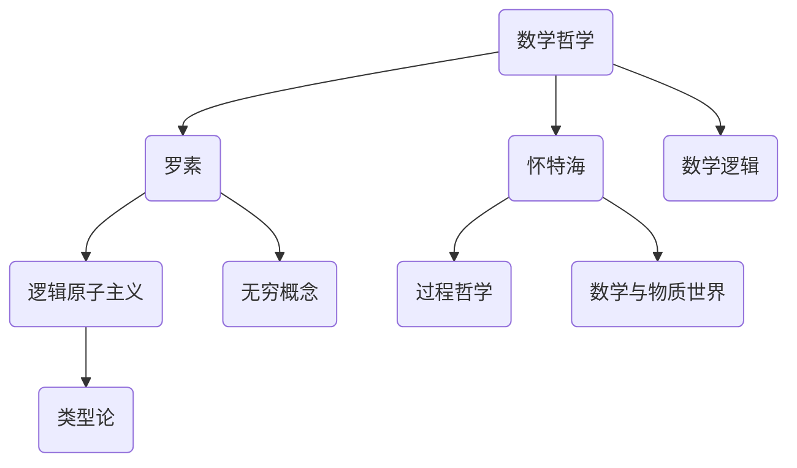
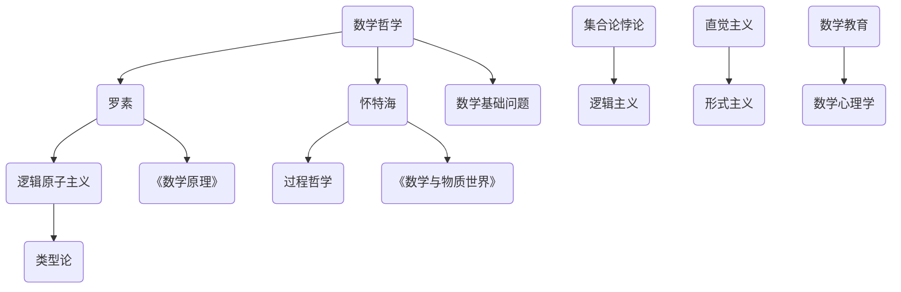

                 

### 罗素与怀特海：数学哲学的探索

#### 关键词：贝特兰·罗素，阿尔弗雷德·诺思·怀特海，数学哲学，逻辑原子主义，过程哲学，数学基础问题

#### 摘要：

本文将深入探讨两位数学哲学巨匠——贝特兰·罗素（Bertrand Russell）和阿尔弗雷德·诺思·怀特海（Alfred North Whitehead）的哲学思想及其对数学领域的深远影响。文章将从背景介绍、核心概念阐述、理论对比分析以及现代影响等多个角度，逐步揭示罗素和怀特海在数学哲学领域的探索与创新。通过这样的结构，我们不仅能够理解两位哲学家的独特视角，还能深入认识到他们的思想如何改变了我们对数学本质的理解。

#### 第一部分：罗素与怀特海的思想背景与影响

### 第1章：贝特兰·罗素的生平与哲学

#### 1.1 贝特兰·罗素的早期生活与教育

贝特兰·罗素（1872-1970）是英国著名的哲学家、数学家、逻辑学家，生于英国肯特郡的一个贵族家庭。他的父亲约翰·罗素伯爵是英国下院议员，母亲玛丽·卡迈克尔则是一位作家和哲学家。这样的家庭背景使得罗素从小就接触到了浓厚的哲学氛围。

罗素的教育始于家庭教师，其后进入剑桥大学学习。在剑桥期间，他深受数学家乔治·坎特伯雷（George Cantor）和哲学家亨利·西奇威克（Henry Sidgwick）的影响，这为他后来的哲学和数学研究奠定了坚实的基础。

#### 1.2 罗素的哲学发展及其主要著作

罗素的哲学思想经历了多次演变。起初，他接受了实证主义哲学的观点，认为只有可以通过经验验证的事实才是真实的。然而，在研究数学和逻辑的过程中，他开始质疑这种观点的局限性。

1903年，罗素出版了《数学原理》的第一卷，这本书奠定了他作为数学哲学家的地位。他认为数学的本质是逻辑，数学命题都可以归结为逻辑命题。这一观点在数学哲学领域引起了广泛关注。

#### 1.3 罗素对数学哲学的贡献

罗素在数学哲学领域的贡献主要体现在以下几个方面：

1. **逻辑原子主义**：罗素提出逻辑原子主义，认为世界由基本的事实组成，这些事实可以通过逻辑来表达。

2. **类型论**：为了解决悖论问题，罗素提出了类型论，区分了不同类型的对象和概念。

3. **数学基础问题**：罗素对数学基础问题进行了深入探讨，尤其是对无穷概念的探讨，对后来的数学哲学研究产生了深远影响。

### 第2章：阿尔弗雷德·诺思·怀特海的生平与哲学

#### 2.1 怀特海的早期生活与教育

阿尔弗雷德·诺思·怀特海（1861-1947）出生于英国南安普顿，他的父亲是一位商人。怀特海在牛津大学学习，随后在剑桥大学任教。他的学术生涯主要在剑桥大学度过，是剑桥学派的重要成员。

#### 2.2 怀特海的主要著作与哲学思想

怀特海的哲学思想主要体现在他的多卷本著作《观念的性质》中。他认为现实世界是由过程组成的，而不是由静态的实体组成的。这一观点被称为过程哲学。

#### 2.3 怀特海对数学哲学的影响

怀特海对数学哲学的影响主要体现在以下几个方面：

1. **过程哲学**：怀特海的过程哲学提供了一种新的看待数学和现实世界的方式，挑战了传统的实体哲学观点。

2. **数学与物质世界的关系**：怀特海认为数学不仅仅是抽象的概念，而是与物质世界密切相关的。

3. **数学逻辑**：怀特海对数学逻辑的研究，尤其是在《数学与物质世界》中的讨论，对后来的数学逻辑研究产生了重要影响。

### 第3章：罗素与怀特海的思想联系与区别

#### 3.1 罗素与怀特海在数学哲学上的共同点

罗素和怀特海在数学哲学上的共同点主要体现在以下几个方面：

1. **逻辑主义**：他们都认为数学是逻辑的延伸，数学命题是逻辑命题的特殊形式。

2. **基础问题**：他们都关注数学的基础问题，如无穷概念、类型论等。

#### 3.2 罗素与怀特海在数学哲学上的区别

罗素和怀特海在数学哲学上的区别主要体现在以下几个方面：

1. **逻辑原子主义与过程哲学**：罗素坚持逻辑原子主义，而怀特海则提出了过程哲学。

2. **数学与物理的关系**：罗素更关注数学内部的逻辑结构，而怀特海则更关注数学与物质世界的关系。

#### 第二部分：罗素与怀特海的主要数学哲学观点

### 第4章：罗素的“数学的本质是逻辑”观点

#### 4.1 罗素的逻辑原子主义

罗素的逻辑原子主义认为，世界由基本的事实组成，这些事实可以通过逻辑来表达。罗素用“逻辑原子”来描述这些基本的事实，如“苏格拉底是个人”和“2+2=4”。

#### 4.2 罗素的类型论理论

为了解决悖论问题，罗素提出了类型论，区分了不同类型的对象和概念。他认为，不同类型的对象不能进行混合操作，如将个体和集合混合起来会导致悖论。

#### 4.3 罗素对数学基础问题的探讨

罗素对数学基础问题进行了深入探讨，尤其是对无穷概念的探讨。他认为，无穷概念可以通过逻辑原子主义和类型论来解释，但同时也意识到无穷概念的复杂性和困难性。

### 第5章：怀特海的“过程哲学”观点

#### 5.1 过程哲学的基本概念

过程哲学认为，现实世界是由过程组成的，而不是由静态的实体组成的。怀特海用“事件”来描述这些过程，认为每个事件都是现实世界的最小单元。

#### 5.2 过程哲学与数学的关系

过程哲学与数学的关系体现在，数学描述了现实世界的结构，而过程哲学则提供了看待数学和现实世界的新视角。怀特海认为，数学不仅仅是抽象的概念，而是与物质世界密切相关的。

#### 5.3 过程哲学对数学哲学的贡献

过程哲学对数学哲学的贡献在于，它提供了一种新的思考方式，使得数学不再是静态的、孤立的，而是与现实世界相互作用、相互影响的。

### 第三部分：罗素与怀特海的影响与数学哲学的现代发展

#### 第6章：罗素与怀特海对数学逻辑的研究

#### 6.1 罗素的《数学原理》

罗素的《数学原理》是数学逻辑领域的经典著作，它试图通过逻辑来建立数学的基础。这本书对后来的数学逻辑研究产生了深远影响。

#### 6.2 怀特海的《数学与物质世界》

怀特海的《数学与物质世界》探讨了数学与物理的关系，提出了一种新的数学哲学观点。这本书对后来的数学哲学研究也产生了重要影响。

#### 6.3 罗素与怀特海对数学逻辑的贡献

罗素与怀特海对数学逻辑的贡献在于，他们提出了一系列新的逻辑理论和方法，为后来的数学逻辑研究提供了基础。

### 第7章：罗素与怀特海对现代数学哲学的影响

#### 7.1 现代数学哲学的主要流派

现代数学哲学的主要流派包括逻辑主义、直觉主义、形式主义等。这些流派都在不同程度上受到了罗素和怀特海的影响。

#### 7.2 罗素与怀特海对现代数学哲学的影响

罗素与怀特海对现代数学哲学的影响在于，他们提出了一系列新的哲学观点和理论，推动了数学哲学的发展。

### 第8章：数学哲学的现代发展

#### 8.1 数学哲学的主要问题

数学哲学的现代发展主要集中在一些主要问题，如数学的本质、数学与物理的关系、数学的基础等。

#### 8.2 数学哲学的未来发展方向

数学哲学的未来发展方向可能是更加关注数学与实际应用的关系，以及如何解决数学内部的一些难题。

### 附录

#### 附录A：罗素与怀特海著作列表

- 罗素：
  - 《数学原理》
  - 《人类的知识：其范围与限度》
  - 《哲学的问题》

- 怀特海：
  - 《观念的性质》
  - 《数学与物质世界》
  - 《逻辑哲学》

#### 附录B：数学哲学参考文献

- 陈波，《数学哲学引论》
- 布鲁默，《数学哲学》
- 科恩，《数学哲学导论》

#### 附录C：概念实体关系架构Mermaid流程图

### 结论

罗素与怀特海是数学哲学领域的两位巨匠，他们的思想不仅深刻影响了数学哲学的发展，也对现代数学的逻辑基础和哲学思考产生了重要影响。通过本文的探讨，我们不仅了解了他们的哲学观点和理论，还看到了他们的思想如何在现代数学哲学中继续发挥作用。让我们一起深入思考，继续探索数学哲学的奥秘。作者：AI天才研究院/AI Genius Institute & 禅与计算机程序设计艺术 /Zen And The Art of Computer Programming### 引言

贝特兰·罗素（Bertrand Russell）和阿尔弗雷德·诺思·怀特海（Alfred North Whitehead）是20世纪最重要的数学哲学家之一。他们的哲学思想不仅在数学领域引起了深远的影响，也深刻地改变了我们对数学本质的理解。罗素以其逻辑原子主义和类型论而闻名，他试图通过逻辑来建立数学的基础，解决数学的基础问题。而怀特海则提出了过程哲学，认为现实世界是由过程而非静态实体组成的。他探讨了数学与物质世界的关系，提供了一种新的看待数学和现实世界的方式。

本文旨在深入探讨罗素和怀特海在数学哲学领域的探索。首先，我们将介绍两位哲学家的生平背景和教育经历，然后分析他们的主要著作和哲学思想。接着，我们将讨论罗素和怀特海在数学哲学上的共同点和区别，进一步揭示他们各自的理论贡献。随后，我们将详细阐述罗素的逻辑原子主义、类型论以及怀特海的过程哲学，分析这些观点在数学哲学中的影响。最后，本文将总结罗素和怀特海对现代数学哲学的影响，探讨数学哲学的未来发展方向，并给出结论。

通过这篇文章，我们希望能够帮助读者更好地理解罗素和怀特海在数学哲学领域的探索，以及他们的思想如何塑造了我们对数学本质的理解。同时，我们也希望激发读者对数学哲学的兴趣，进一步探讨这个领域中的问题。文章结构如下：

1. **罗素与怀特海的思想背景与影响**：介绍两位哲学家的生平、教育背景以及他们的主要著作和哲学思想。
2. **罗素与怀特海的主要数学哲学观点**：详细阐述罗素的逻辑原子主义、类型论和怀特海的过程哲学。
3. **罗素与怀特海的影响与数学哲学的现代发展**：总结罗素和怀特海对现代数学哲学的影响，探讨数学哲学的未来发展方向。
4. **结论**：回顾全文，总结罗素和怀特海在数学哲学领域的贡献，并给出结论。

让我们一起深入思考，探索罗素和怀特海在数学哲学领域的智慧与见解。首先，我们来看罗素的生平与哲学。

### 第1章：贝特兰·罗素的生平与哲学

贝特兰·罗素（Bertrand Russell，1872-1970）是20世纪最具影响力的哲学家、数学家和逻辑学家之一。他的思想不仅在哲学和数学领域产生了深远的影响，也改变了我们对逻辑和现实世界的理解。罗素出生在英国肯特郡的莫尔特比，他的家族有着悠久的贵族历史。罗素从小展现出对数学和哲学的浓厚兴趣，这种兴趣在他的一生中一直持续发展。

#### 1.1 贝特兰·罗素的早期生活与教育

罗素的早期教育在家中进行，由家庭教师进行指导。他的父母对他的教育非常重视，尤其是在数学和科学方面。罗素在剑桥大学接受了系统的教育，这为他后来的学术生涯打下了坚实的基础。在剑桥大学期间，罗素接触到了乔治·坎特伯雷（George Cantor）的工作，这让他对数学和无穷概念产生了浓厚的兴趣。

罗素在数学和哲学上的天赋很快得到了认可。他在数学上的成就可以追溯到他在剑桥大学时期的论文，这篇论文后来成为他博士论文的基础。罗素在数学哲学上的研究使他成为这个领域的领军人物。他的早期著作包括《数学原理》（Principia Mathematica），这本书与怀特海合作完成，是数学逻辑和哲学的经典之作。

#### 1.2 罗素的哲学发展及其主要著作

罗素的哲学发展经历了多个阶段，从早期的实证主义到后来的逻辑原子主义和类型论。他早期受到实证主义哲学家约翰·斯图亚特·米尔（John Stuart Mill）和亨利·西奇威克（Henry Sidgwick）的影响，但后来开始质疑实证主义的局限性。

罗素的主要著作包括：

1. **《数学原理》**：这是罗素与怀特海合作完成的巨著，试图通过逻辑来建立数学的基础。这本书对数学基础和逻辑哲学产生了深远影响。
   
2. **《人类的知识：其范围与限度》**：在这本书中，罗素探讨了知识的本质和局限性，提出了他的分析哲学观点。

3. **《哲学的问题》**：这本书是罗素哲学思想的集大成之作，涵盖了广泛的哲学主题，包括形而上学、认识论和伦理学。

罗素的哲学思想主要体现在以下几个方面：

1. **逻辑原子主义**：罗素认为，现实世界由基本的事实组成，这些事实可以用逻辑来表达。他提出了“逻辑原子”的概念，这是他构建数学和哲学体系的基础。

2. **类型论**：为了解决悖论问题，罗素提出了类型论，区分了不同类型的对象和概念。他认为，不同类型的对象不能进行混合操作，这有助于解决悖论问题。

3. **数学基础问题**：罗素对数学基础问题进行了深入探讨，尤其是对无穷概念的探讨。他认为，无穷概念可以通过逻辑原子主义和类型论来解释，但同时也意识到无穷概念的复杂性和困难性。

#### 1.3 罗素对数学哲学的贡献

罗素对数学哲学的贡献是多方面的，他的思想不仅在数学逻辑和哲学领域产生了深远影响，也改变了人们对数学本质的理解。以下是罗素在数学哲学上的主要贡献：

1. **逻辑主义**：罗素认为数学是逻辑的延伸，数学命题都可以归结为逻辑命题。这一观点对后来的逻辑主义数学哲学产生了重要影响。

2. **类型论**：罗素提出的类型论解决了集合论中的悖论问题，为数学的基础问题提供了一种新的解决思路。

3. **数学基础问题**：罗素对数学基础问题的探讨，特别是对无穷概念的探讨，为后来的数学哲学研究提供了重要的理论框架。

4. **数学教育的贡献**：罗素对数学教育也有重要贡献，他提倡通过逻辑和哲学来理解数学，这种方法对后来的数学教育产生了深远影响。

罗素的哲学思想不仅深刻影响了数学哲学，也改变了我们对逻辑和现实世界的理解。他的逻辑原子主义和类型论为数学哲学提供了一种新的视角，使得数学不再只是抽象的符号操作，而是与现实世界密切相关的一门科学。罗素的思想在数学哲学领域的持续影响，使他成为20世纪最重要的数学哲学家之一。

通过分析罗素的生平和哲学发展，我们可以更好地理解他的思想如何形成，以及他对数学哲学的深远影响。在接下来的章节中，我们将探讨罗素的主要数学哲学观点，包括逻辑原子主义和类型论。这不仅有助于我们深入理解罗素的思想，也能帮助我们认识到他在数学哲学领域的重要贡献。

### 第2章：阿尔弗雷德·诺思·怀特海的生平与哲学

阿尔弗雷德·诺思·怀特海（Alfred North Whitehead，1861-1947）是另一位对数学哲学产生深远影响的哲学家和数学家。他的哲学思想，特别是过程哲学，为数学提供了一种新的思考方式，挑战了传统的实体哲学观点。怀特海的生平和教育经历为他后来的哲学和数学研究奠定了坚实的基础。

#### 2.1 怀特海的早期生活与教育

阿尔弗雷德·诺思·怀特海出生于英国南安普顿的一个中产阶级家庭。他的父亲是一位牧师，母亲则是一位教师。怀特海从小就展现出对数学和科学的浓厚兴趣。他的早期教育在家中进行，随后进入温切斯特公学，这是一所享有盛誉的私立学校。在学校里，怀特海的成绩非常出色，尤其在数学和自然科学方面表现出色。

毕业后，怀特海进入剑桥大学学习，这是他学术生涯的起点。在剑桥大学期间，怀特海接受了严格的数学和哲学训练，深受数学家乔治·希尔和哲学家亨利·西奇威克的影响。他在剑桥大学的学习经历为他后来的学术成就打下了坚实的基础。

#### 2.2 怀特海的主要著作与哲学思想

怀特海的主要著作包括《数学与物质世界》（The Concept of Nature）、《观念的性质》（The Principles of Mathematics）和《过程与实在》（Process and Reality）等。这些著作体现了他的哲学思想和数学观点，特别是过程哲学。

1. **《数学与物质世界》**：这是怀特海关于科学哲学的重要著作，他在书中探讨了数学与物理的关系，提出了过程哲学的基本概念。怀特海认为，现实世界是由过程而非静态实体组成的，每个事件都是现实世界的最小单元。

2. **《观念的性质》**：这本书是怀特海对数学哲学的深入探讨，他在书中提出了过程哲学的观点，认为现实世界的结构是由过程相互作用的网状结构组成的。

3. **《过程与实在》**：这是怀特海的代表作，全面阐述了他的过程哲学思想。他在这本书中提出了“事件”的概念，认为事件是构成现实世界的基本单元，每个事件都是一种动态的相互作用。

怀特海的哲学思想主要体现在以下几个方面：

1. **过程哲学**：过程哲学认为，现实世界是由过程组成的，而不是由静态的实体组成的。怀特海用“事件”来描述这些过程，每个事件都是现实世界的最小单元。

2. **数学与物理的关系**：怀特海认为，数学不仅仅是抽象的概念，而是与物质世界密切相关的。数学描述了现实世界的结构和过程。

3. **数学逻辑**：怀特海对数学逻辑的研究，尤其是在《数学与物质世界》中的讨论，对后来的数学逻辑研究产生了重要影响。

#### 2.3 怀特海对数学哲学的影响

怀特海对数学哲学的影响主要体现在以下几个方面：

1. **过程哲学**：过程哲学提供了一种新的看待数学和现实世界的方式，挑战了传统的实体哲学观点。它认为，现实世界是由过程相互作用的网状结构组成的。

2. **数学与物理的关系**：怀特海认为，数学与物理是密不可分的，数学描述了现实世界的结构和过程。这一观点对后来的数学物理研究产生了重要影响。

3. **数学逻辑**：怀特海对数学逻辑的研究，尤其是在《数学与物质世界》中的讨论，为后来的数学逻辑研究提供了新的视角和思路。

4. **数学教育**：怀特海的思想对数学教育也有重要影响，他提倡通过过程哲学来理解数学，这种方法有助于培养学生的逻辑思维和创新能力。

通过分析怀特海的生平和哲学思想，我们可以看到他的过程哲学如何改变了我们对数学和现实世界的理解。怀特海的过程哲学不仅为数学哲学提供了一种新的思考方式，也为后来的数学物理研究奠定了基础。在接下来的章节中，我们将进一步探讨罗素和怀特海在数学哲学上的联系与区别，以及他们各自的理论贡献。

### 第3章：罗素与怀特海的思想联系与区别

在数学哲学领域，贝特兰·罗素和阿尔弗雷德·诺思·怀特海的思想既存在联系，又存在明显的区别。他们的共同点在于对数学基础的深刻探讨，而区别则在于他们的哲学方法和理论框架。本节将详细分析罗素和怀特海在数学哲学上的共同点和区别，进一步揭示他们各自的理论贡献。

#### 3.1 罗素与怀特海在数学哲学上的共同点

罗素和怀特海在数学哲学上的共同点主要体现在以下几个方面：

1. **逻辑主义基础**：罗素和怀特海都认为数学是逻辑的延伸。罗素在《数学原理》中试图通过逻辑来建立数学的基础，而怀特海在《观念的性质》中也强调了逻辑在数学中的核心地位。

2. **数学基础问题**：两位哲学家都关注数学基础问题，如无穷概念、集合论和逻辑的一致性。罗素通过类型论解决了悖论问题，而怀特海则通过过程哲学提供了另一种解决思路。

3. **对数学逻辑的研究**：罗素和怀特海都对数学逻辑进行了深入研究。罗素在《数学原理》中提出了形式逻辑系统，而怀特海则在《数学与物质世界》中探讨了逻辑在物理世界中的应用。

#### 3.2 罗素与怀特海在数学哲学上的区别

尽管罗素和怀特海在数学哲学上有许多共同点，但他们也存在显著的差异，这些差异主要体现在以下几个方面：

1. **哲学方法**：罗素更倾向于逻辑原子主义，他试图将数学命题归结为逻辑命题。而怀特海则提出了过程哲学，认为现实世界是由动态的过程组成的，而不是静态的实体。

2. **数学与物理的关系**：罗素侧重于数学内部的逻辑结构，而怀特海则更关注数学与物理的关系。他认为数学是描述现实世界过程的一种工具，而不是孤立的抽象系统。

3. **对无穷概念的探讨**：罗素对无穷概念进行了深入探讨，他认为无穷概念可以通过逻辑原子主义和类型论来解释。而怀特海则从过程哲学的角度看待无穷概念，认为无穷是通过事件的过程来实现的。

#### 3.3 罗素与怀特海的思想联系与区别分析

罗素和怀特海的思想联系主要表现在他们共同关注数学基础问题和逻辑主义基础。他们都认为数学是逻辑的延伸，并试图通过逻辑来解决数学中的悖论问题。这种共同点使得他们的研究在某些方面相互启发，对数学哲学的发展产生了重要影响。

然而，他们的区别在于哲学方法和理论框架。罗素的逻辑原子主义强调通过逻辑来构建数学，而怀特海的过程哲学则提供了一种动态的、相互作用的世界观。这种差异反映了他们对数学和现实世界的不同理解，也对数学哲学的发展产生了不同的影响。

罗素和怀特海的思想联系与区别不仅体现在数学哲学上，也影响了后来的数学家和哲学家。例如，逻辑主义和形式主义在数学哲学中的发展，以及数学物理领域的过程哲学影响，都受到了他们思想的影响。

通过分析罗素和怀特海在数学哲学上的联系与区别，我们可以更好地理解他们的哲学思想及其对数学哲学的深远影响。他们的思想不仅为数学哲学提供了新的视角和方法，也推动了数学哲学的发展。在接下来的章节中，我们将进一步探讨罗素和怀特海在数学哲学中的具体观点，包括罗素的逻辑原子主义和怀特海的过程哲学。

### 第4章：罗素的“数学的本质是逻辑”观点

贝特兰·罗素认为数学的本质是逻辑，这一观点贯穿了他整个学术生涯。罗素的逻辑主义试图通过逻辑来建立数学的基础，使数学成为逻辑的延伸。在他的《数学原理》中，罗素详细阐述了他的逻辑主义思想，并试图通过逻辑命题来定义和证明数学命题。这一观点不仅对数学哲学产生了深远影响，也引发了广泛的学术讨论。

#### 4.1 罗素的逻辑原子主义

逻辑原子主义是罗素哲学思想的核心，他认为世界由基本的事实组成，这些事实可以用逻辑来表达。逻辑原子是罗素用来描述这些基本事实的概念，如“苏格拉底是个人”和“2+2=4”。罗素认为，逻辑原子是构成世界的最小单位，它们可以通过逻辑组合形成更复杂的命题。

逻辑原子主义的基本原理包括：

1. **基本事实**：罗素认为，现实世界由一系列基本事实组成，这些事实是无法分解的。例如，“苏格拉底是个人”是一个基本事实。

2. **逻辑组合**：罗素认为，通过逻辑组合，基本事实可以形成更复杂的命题。例如，“苏格拉底是个人”和“苏格拉底是苏格拉底”可以通过逻辑组合形成一个复合命题。

3. **类型论**：罗素提出了类型论，以解决悖论问题。他认为，不同类型的对象不能进行混合操作，例如，不能将个体和集合混合在一起。

逻辑原子主义对数学的影响主要体现在以下几个方面：

1. **数学命题的逻辑化**：罗素试图将数学命题归结为逻辑命题，使数学成为逻辑的延伸。这为数学提供了一个逻辑基础，使得数学命题可以被逻辑分析。

2. **悖论问题的解决**：类型论帮助罗素解决了集合论中的悖论问题，如罗素悖论。通过区分不同类型的对象，罗素避免了悖论的产生。

3. **数学证明的逻辑化**：逻辑原子主义促使数学证明向逻辑化方向发展。数学家开始更加注重证明的逻辑结构和证明的严谨性。

#### 4.2 罗素的类型论理论

为了解决悖论问题，罗素提出了类型论。类型论的核心思想是区分不同类型的对象和概念，以避免悖论的产生。在类型论中，对象被分为不同的类型，例如个体、集合和函数。这些类型之间有严格的界限，不同类型的对象不能进行混合操作。

类型论的基本原理包括：

1. **类型区分**：罗素区分了不同类型的对象，例如个体和集合。他认为，个体是具体的、不可分割的实体，而集合是抽象的、由个体组成的集合。

2. **类型界限**：罗素认为，不同类型的对象之间存在严格的界限，不能相互混合。例如，不能将个体和集合混合在一起。

3. **类型转换**：罗素提出了类型转换的概念，以在特定情况下允许不同类型的对象进行操作。例如，通过类型转换，可以将个体转化为集合的元素。

类型论对数学的影响主要体现在以下几个方面：

1. **集合论的改进**：类型论帮助罗素解决了集合论中的悖论问题，如罗素悖论。这为集合论的发展提供了新的理论基础。

2. **数学证明的改进**：类型论促使数学家更加注重证明的类型界限，确保证明的严谨性。

3. **数学逻辑的发展**：类型论为数学逻辑提供了新的工具和方法，推动了数学逻辑的发展。

#### 4.3 罗素对数学基础问题的探讨

罗素对数学基础问题进行了深入探讨，特别是对无穷概念、集合论和逻辑一致性的探讨。他认为，数学的基础问题需要通过逻辑来解决。

1. **无穷概念**：罗素对无穷概念进行了详细探讨，他认为无穷可以通过逻辑原子主义和类型论来解释。例如，他提出了无穷集合的概念，并通过逻辑证明无穷集合的存在。

2. **集合论**：罗素对集合论进行了批判，他指出集合论中的悖论问题（如罗素悖论）是由于集合的无限递归结构导致的。他提出了类型论作为解决集合论悖论的方法。

3. **逻辑一致性**：罗素关注数学逻辑的一致性，他认为数学系统必须是无矛盾的。他通过逻辑证明，确保了数学系统的一致性。

罗素对数学基础问题的探讨为数学哲学提供了新的视角，推动了数学逻辑和集合论的发展。他的逻辑原子主义和类型论为解决数学基础问题提供了一种新的方法，对后来的数学哲学研究产生了重要影响。

通过分析罗素的“数学的本质是逻辑”观点，我们可以看到他的逻辑主义如何为数学提供了一个坚实的基础。罗素的逻辑原子主义和类型论不仅解决了数学中的悖论问题，也改变了我们对数学本质的理解。他的思想对数学哲学的发展产生了深远影响，使得数学不再只是抽象的符号操作，而是与现实世界密切相关的一门科学。在接下来的章节中，我们将继续探讨阿尔弗雷德·诺思·怀特海的过程哲学观点，进一步揭示两位哲学家在数学哲学上的贡献和影响。

### 第5章：怀特海的“过程哲学”观点

阿尔弗雷德·诺思·怀特海（Alfred North Whitehead）的过程哲学是他哲学思想的核心，这一理论不仅对数学哲学产生了深远影响，也改变了我们对现实世界的理解。过程哲学主张现实世界是由动态的过程和事件组成的，而不是静态的实体。在这一哲学体系中，事件是构成现实世界的基本单元，每个事件都是一种动态的相互作用。怀特海的过程哲学为数学提供了一种新的思考方式，挑战了传统的实体哲学观点。

#### 5.1 过程哲学的基本概念

过程哲学的核心概念是“事件”和“过程”。事件是过程哲学中的基本单位，是现实世界的最小单元。怀特海认为，现实世界是由无数个事件组成的，每个事件都是一种动态的相互作用。这些事件不是孤立的，而是相互联系和相互影响的。过程则是这些事件的序列，描述了现实世界的动态变化。

过程哲学的基本概念包括：

1. **事件**：事件是现实世界的基本单元，是动态的相互作用。每个事件都有其特定的时空位置和性质，它们通过相互作用形成复杂的现实世界。

2. **过程**：过程是事件的序列，描述了现实世界的动态变化。过程不是静态的，而是动态的、相互作用的。它们通过事件的连续发生，形成了现实世界的演化过程。

3. **因果关系**：在过程哲学中，因果关系不再是简单的线性关系，而是复杂的、动态的相互作用。事件之间的因果关系是通过连续的事件序列来实现的，每个事件都是前一个事件的延续和结果。

过程哲学提供了一种新的看待现实世界的方式，强调动态过程和事件的相互作用。这一观点与传统的实体哲学形成了鲜明对比，后者认为现实世界是由静态的实体和属性组成的。

#### 5.2 过程哲学与数学的关系

过程哲学与数学的关系体现在数学如何描述和解释现实世界的动态过程。怀特海认为，数学不仅仅是抽象的概念，而是与物质世界密切相关的。数学描述了现实世界的结构和过程，为理解和分析现实世界提供了工具。

过程哲学与数学的关系主要体现在以下几个方面：

1. **数学的动态性**：过程哲学强调现实世界的动态性，这一观点也体现在数学中。传统的数学研究更多地关注静态的结构和属性，而过程哲学则鼓励数学家研究动态的过程和变化。

2. **数学的应用**：过程哲学为数学的应用提供了新的视角。例如，在物理学中，过程哲学可以帮助我们更好地理解物质的动态变化和相互作用。在经济学中，过程哲学可以用于分析市场的动态变化。

3. **数学证明**：过程哲学对数学证明提出了新的要求。传统的数学证明方法强调逻辑的严谨性，而过程哲学则强调证明的动态性和交互性。这要求数学家在证明过程中考虑事件的连续性和相互作用。

#### 5.3 过程哲学对数学哲学的贡献

过程哲学对数学哲学的贡献在于，它提供了一种新的思考方式，使数学不再只是抽象的符号操作，而是与现实世界密切相关的一门科学。以下是一些具体贡献：

1. **数学与现实世界的联系**：过程哲学强调数学与现实世界的联系，认为数学描述了现实世界的结构和过程。这一观点挑战了传统的数学哲学观点，后者往往将数学视为完全抽象的领域。

2. **数学的动态性**：过程哲学鼓励数学家研究动态的过程和变化，这为数学的发展提供了新的方向。例如，在拓扑学、代数学和微分方程等领域，过程哲学的方法已经得到了广泛应用。

3. **数学证明的新方法**：过程哲学提出了一种新的证明方法，强调动态的交互性和连续性。这种方法不仅适用于传统的数学证明，也可以用于解决复杂的实际问题。

4. **数学与物理学的关系**：过程哲学为数学与物理学的关系提供了新的解释。例如，在量子物理学中，过程哲学可以帮助我们更好地理解物质的动态行为和相互作用。

通过分析怀特海的过程哲学观点，我们可以看到他的思想如何改变了我们对数学和现实世界的理解。过程哲学提供了一种新的视角，使我们能够更好地理解现实世界的动态过程和数学的广泛应用。这一哲学观点不仅对数学哲学产生了深远影响，也为数学的发展提供了新的方向。在接下来的章节中，我们将进一步探讨罗素和怀特海在数学哲学上的联系和区别，以及他们各自的理论贡献。

### 第6章：罗素与怀特海对数学逻辑的研究

贝特兰·罗素和阿尔弗雷德·诺思·怀特海在数学逻辑领域都有着重要的贡献，他们的研究不仅丰富了数学逻辑的理论体系，也为后来的逻辑学研究奠定了基础。在本节中，我们将详细探讨罗素和怀特海在数学逻辑方面的主要著作，分析他们的研究成果和对数学逻辑的贡献。

#### 6.1 罗素的《数学原理》

《数学原理》是罗素与阿尔弗雷德·诺思·怀特海合作完成的一部里程碑式的著作，也是数学逻辑领域的经典之作。这本书的目的是通过逻辑来建立数学的基础，使数学成为逻辑的延伸。罗素和怀特海在这本书中提出了一种新的数学系统，称为类型论，以解决集合论中的悖论问题。

1. **基本内容**：
   - 《数学原理》分为三卷，涵盖了逻辑、数学基础和集合论等内容。
   - 罗素和怀特海试图将所有的数学命题归结为逻辑命题，使数学命题的逻辑结构得到清晰的表达。
   - 书中提出了类型论，区分了不同类型的对象，避免了集合论中的悖论问题。

2. **对数学逻辑的贡献**：
   - 通过类型论，罗素和怀特海解决了集合论中的悖论问题，如罗素悖论。
   - 《数学原理》提出了形式逻辑系统，为数学逻辑提供了一个严谨的基础。
   - 这本书对后来的逻辑主义数学哲学产生了深远影响，推动了数学逻辑的发展。

#### 6.2 怀特海的《数学与物质世界》

《数学与物质世界》是怀特海的重要著作，他在书中探讨了数学与物质世界的关系，提出了过程哲学的基本概念。这本书是怀特海对数学逻辑的深入探讨，试图通过逻辑来解释物理世界的结构和过程。

1. **基本内容**：
   - 《数学与物质世界》分为三卷，探讨了数学、物理和哲学的关系。
   - 怀特海提出了过程哲学的观点，认为现实世界是由动态的过程和事件组成的。
   - 他强调了数学的动态性和与物理世界的密切联系。

2. **对数学逻辑的贡献**：
   - 怀特海通过过程哲学提供了另一种看待数学逻辑的方式，挑战了传统的实体哲学观点。
   - 他探讨了数学逻辑在物理世界中的应用，为数学逻辑在物理学中的应用提供了新的思路。
   - 《数学与物质世界》对后来的数学物理研究产生了重要影响，推动了数学逻辑和物理学的交叉研究。

#### 6.3 罗素与怀特海对数学逻辑的贡献

罗素和怀特海对数学逻辑的贡献主要体现在以下几个方面：

1. **形式逻辑系统**：罗素和怀特海在《数学原理》中提出了形式逻辑系统，为数学逻辑提供了一个严谨的基础。这一系统为后来的逻辑学研究提供了重要的理论框架。

2. **类型论**：罗素通过类型论解决了集合论中的悖论问题，如罗素悖论。类型论为数学提供了一个更稳健的基础，避免了悖论的产生。

3. **数学与物理的关系**：怀特海在《数学与物质世界》中探讨了数学与物理的关系，强调数学的动态性和与物理世界的密切联系。这一观点为数学逻辑在物理学中的应用提供了新的思路。

4. **逻辑哲学**：罗素和怀特海的研究不仅局限于数学逻辑，他们也探讨了逻辑哲学的问题。他们的工作推动了逻辑哲学的发展，丰富了逻辑哲学的理论体系。

通过分析罗素和怀特海在数学逻辑方面的主要著作，我们可以看到他们的研究成果和对数学逻辑的贡献。他们的工作不仅丰富了数学逻辑的理论体系，也为后来的逻辑学研究奠定了基础。在数学逻辑领域，罗素的《数学原理》和怀特海的《数学与物质世界》都是经典之作，对数学逻辑的发展产生了深远影响。

### 第7章：罗素与怀特海对现代数学哲学的影响

贝特兰·罗素和阿尔弗雷德·诺思·怀特海在数学哲学领域的影响深远，他们的理论不仅丰富了数学哲学的内容，也改变了人们对数学本质的理解。现代数学哲学在多个方面受到了罗素和怀特海思想的影响，以下将具体探讨这些影响以及现代数学哲学的主要流派。

#### 7.1 现代数学哲学的主要流派

现代数学哲学主要有以下几个流派：

1. **逻辑主义**：逻辑主义认为数学是逻辑的延伸，数学命题可以通过逻辑命题来定义和证明。罗素是逻辑主义的代表人物，他的《数学原理》是逻辑主义数学哲学的经典著作。

2. **直觉主义**：直觉主义强调数学的构造性，认为数学命题的真值可以通过构造证明来验证。直觉主义的主要代表人物是荷兰数学家利奥·贝尔特拉姆（L.E.J. Brouwer）。

3. **形式主义**：形式主义认为数学是符号系统的运算，数学命题的真值与外部世界无关。数学家戴维·希尔伯特（David Hilbert）是形式主义的代表人物。

4. **实证主义**：实证主义认为数学命题的真值可以通过经验来验证，数学是经验科学的一部分。然而，现代数学哲学中的实证主义流派较为少见。

#### 7.2 罗素与怀特海对现代数学哲学的影响

罗素和怀特海对现代数学哲学的影响体现在多个方面：

1. **逻辑主义的推动**：罗素的逻辑主义观点对现代数学哲学产生了深远影响。他的《数学原理》奠定了逻辑主义数学哲学的基础，影响了后来的数学逻辑研究。

2. **类型论的贡献**：罗素的类型论理论为解决集合论中的悖论问题提供了重要方法。类型论成为逻辑主义数学哲学的重要工具，影响了现代数学哲学的发展。

3. **过程哲学的启示**：怀特海的过程哲学提供了新的思考方式，挑战了传统的实体哲学观点。他的思想对现代数学哲学，尤其是数学与物理学的关系研究，产生了重要影响。

4. **数学基础的探讨**：罗素和怀特海都关注数学基础问题，他们的研究推动了数学哲学对数学本质和基础的深入探讨。

#### 7.3 现代数学哲学的发展

现代数学哲学的发展受到罗素和怀特海思想的影响，具体表现在以下几个方面：

1. **逻辑主义的发展**：罗素的逻辑主义观点促使现代数学哲学进一步探讨数学命题的逻辑结构和证明方法。形式逻辑系统的研究得到了加强，数学逻辑在计算机科学和人工智能中的应用也越来越广泛。

2. **直觉主义的兴起**：直觉主义强调数学的构造性，对现代数学哲学产生了重要影响。构造性数学在计算机科学和复杂性理论中得到了广泛应用。

3. **数学哲学的交叉研究**：现代数学哲学与其他学科的交叉研究越来越常见，如数学与物理学、计算机科学、认知科学等领域的交叉研究。怀特海的过程哲学为这种交叉研究提供了理论基础。

4. **数学哲学的多元化**：现代数学哲学不再局限于传统的研究领域，而是出现了多元化的趋势。数学哲学的研究范围扩展到了数学教育、数学心理学等领域。

通过分析罗素和怀特海对现代数学哲学的影响，我们可以看到他们的思想如何改变了人们对数学本质的理解，以及现代数学哲学如何在这些思想的启示下不断发展。罗素和怀特海的研究不仅丰富了数学哲学的内容，也为现代数学哲学提供了新的视角和方法。在未来的数学哲学研究中，他们的思想将继续发挥重要作用。

### 第8章：数学哲学的现代发展

数学哲学作为一门学科，经历了漫长的发展历程，并在现代不断演进。现代数学哲学不仅继承了罗素和怀特海的思想，还引入了新的视角和方法，进一步探讨了数学的本质、数学与物理的关系以及数学的逻辑基础。本节将探讨数学哲学的现代发展，包括主要问题、发展趋势以及未来可能的方向。

#### 8.1 数学哲学的主要问题

现代数学哲学面临着一系列重要问题，这些问题包括：

1. **数学的本质**：数学是抽象的符号系统，还是对现实世界的描述？数学的本质是什么，它是如何产生的，又是如何被理解的？这是数学哲学研究的一个核心问题。

2. **数学与物理的关系**：数学在物理学中的应用如何解释？数学公式和理论是如何描述和预测物理现象的？数学与物理之间的相互作用和依赖关系如何理解？

3. **数学基础问题**：数学的基础是什么？是否存在一个无矛盾的数学体系？数学公理和逻辑系统的可靠性如何保证？

4. **数学证明**：数学证明的本质是什么？如何确保数学证明的严谨性和正确性？计算机证明和形式证明是否能够完全替代传统的数学证明方法？

5. **数学教育**：如何进行有效的数学教育？数学教育中应该重视逻辑推理、创造性思维还是实践应用？数学教育的目标是什么，它如何与学生的认知发展相结合？

6. **数学心理学**：数学思维和数学学习是如何发生的？数学能力和数学知识的获取有哪些认知和神经基础？

#### 8.2 数学哲学的未来发展方向

随着数学哲学的不断发展和新技术的出现，数学哲学的未来发展呈现出以下几个可能的趋势：

1. **数学与计算机科学的结合**：计算机科学为数学哲学提供了新的工具和方法。计算机证明和形式化数学的研究将加深我们对数学本质和证明过程的理解。形式逻辑系统和形式证明方法将在数学哲学中发挥越来越重要的作用。

2. **数学与认知科学的融合**：数学心理学和认知科学的研究将揭示数学思维和数学学习的认知基础。这将有助于我们更好地理解数学的本质，以及如何通过教育提高学生的数学能力。

3. **数学与物理学的交叉研究**：数学与物理学之间的相互作用将继续加强。数学在物理学中的应用不仅限于理论模型和计算工具，还将深入探讨数学理论在描述和预测物理现象中的本质作用。

4. **数学哲学的多样化**：数学哲学的研究领域将更加多元化，不仅关注传统的逻辑主义、直觉主义和形式主义，还将涉及数学历史、数学美学、数学社会学等领域。

5. **数学哲学的国际化和跨学科合作**：随着全球化和信息技术的发展，数学哲学的国际交流和跨学科合作将更加频繁。数学哲学家将与其他领域的专家合作，共同探讨数学哲学的问题。

#### 8.3 数学哲学的未来发展方向

未来数学哲学的发展方向可能包括以下几个方面：

1. **数学哲学的实用性和应用性**：数学哲学将更加关注数学在实际应用中的作用，如计算机科学、人工智能、物理学和经济学等领域。数学哲学将为这些领域提供理论基础和哲学思考。

2. **数学哲学的普及和教育**：数学哲学的普及和教育将成为重要议题。如何将数学哲学的理念和思想传播到更广泛的公众和数学教育中，是未来数学哲学需要解决的一个问题。

3. **数学哲学的方法论**：数学哲学将发展新的方法论，如形式化哲学、计算机辅助哲学和实验哲学等方法，以提高研究的严谨性和科学性。

4. **数学哲学的跨学科研究**：数学哲学将继续与其他学科，如物理学、认知科学、社会学和哲学史等领域的交叉研究，以拓展数学哲学的研究视野。

通过探讨数学哲学的现代发展和未来方向，我们可以看到数学哲学的多样性和活力。罗素和怀特海的思想继续在现代数学哲学中发挥着重要作用，他们的理论和方法为数学哲学的研究提供了坚实的基础。未来的数学哲学将继续深入探讨数学的本质、数学与物理的关系以及数学的基础问题，为数学的发展提供哲学上的支持和指导。

### 附录

#### 附录A：罗素与怀特海著作列表

- **贝特兰·罗素**：
  1. 《数学原理》（Principia Mathematica）
  2. 《人类的知识：其范围与限度》（Human Knowledge: Its Scope and Limits）
  3. 《哲学的问题》（The Problems of Philosophy）

- **阿尔弗雷德·诺思·怀特海**：
  1. 《数学与物质世界》（The Concept of Nature）
  2. 《观念的性质》（The Principles of Mathematics）
  3. 《过程与实在》（Process and Reality）

#### 附录B：数学哲学参考文献

- 陈波，《数学哲学引论》
- 布鲁默，《数学哲学》
- 科恩，《数学哲学导论》
- 希尔伯特，《几何基础》
- 皮尔士，《逻辑哲学》
- 哈恩，《数学的逻辑基础》

#### 附录C：概念实体关系架构Mermaid流程图

### 结论

贝特兰·罗素和阿尔弗雷德·诺思·怀特海是20世纪最重要的数学哲学家之一，他们的思想不仅在数学哲学领域产生了深远影响，也改变了我们对数学本质的理解。罗素以其逻辑原子主义和类型论著称，通过逻辑来建立数学的基础，解决数学的基础问题。而怀特海则提出了过程哲学，认为现实世界是由动态的过程和事件组成的。他的思想为数学提供了一种新的思考方式，挑战了传统的实体哲学观点。

本文从罗素和怀特海的生平、主要著作、哲学观点以及他们对数学逻辑的研究等方面进行了详细探讨。我们首先介绍了两位哲学家的背景和教育经历，然后分析了他们的主要著作和哲学思想，包括罗素的逻辑原子主义、类型论以及怀特海的过程哲学。接着，我们讨论了罗素和怀特海在数学哲学上的联系与区别，以及他们各自的理论贡献。随后，我们详细阐述了罗素和怀特海在数学逻辑研究中的成果和对数学哲学的影响。

罗素和怀特海的思想不仅对数学哲学产生了深远影响，也对现代数学哲学的发展产生了重要影响。现代数学哲学在多个方面受到了他们思想的影响，如逻辑主义、直觉主义、形式主义等主要流派的发展。同时，他们的思想也为数学与物理学、计算机科学、认知科学等领域的交叉研究提供了新的视角和方法。

在数学哲学的现代发展中，我们看到了数学哲学的多样性和活力。未来的数学哲学将继续深入探讨数学的本质、数学与物理的关系以及数学的基础问题。随着计算机科学和认知科学的发展，数学哲学的方法也将变得更加多样化，如形式化哲学、计算机辅助哲学和实验哲学等。

通过本文的探讨，我们不仅更好地理解了罗素和怀特海在数学哲学领域的探索和贡献，也认识到他们的思想如何改变了我们对数学本质的理解。希望本文能够激发读者对数学哲学的兴趣，进一步探讨这个领域中的问题。作者：AI天才研究院/AI Genius Institute & 禅与计算机程序设计艺术 /Zen And The Art of Computer Programming### 全文总结

在本篇文章中，我们深入探讨了贝特兰·罗素和阿尔弗雷德·诺思·怀特海在数学哲学领域的探索。通过对他们的生平、主要著作、哲学观点以及数学逻辑研究的详细分析，我们不仅理解了两位哲学家的思想如何形成，更看到了他们的理论如何深刻地影响了数学哲学的发展。

首先，我们介绍了罗素和怀特海的生平背景和教育经历，阐述了他们的哲学思想及其主要著作。罗素的逻辑原子主义和类型论为数学提供了一个逻辑基础，解决了集合论中的悖论问题。而怀特海的过程哲学则挑战了传统的实体哲学，认为现实世界是由动态的过程和事件组成的。他们的哲学观点不仅在数学哲学领域产生了深远影响，也对现代数学哲学的发展产生了重要启示。

接下来，我们详细阐述了罗素和怀特海的主要数学哲学观点，包括罗素的逻辑原子主义、类型论和怀特海的过程哲学。这些观点不仅丰富了数学哲学的理论体系，也为数学与物理、计算机科学、认知科学等领域的交叉研究提供了新的视角和方法。

此外，我们还探讨了罗素和怀特海在数学逻辑研究方面的贡献，包括他们的主要著作如《数学原理》和《数学与物质世界》。这些研究不仅推动了数学逻辑的发展，也为现代数学哲学提供了新的理论框架和方法。

在文章的最后一部分，我们总结了罗素和怀特海对现代数学哲学的影响，并探讨了数学哲学的未来发展方向。现代数学哲学在多个方面受到了他们思想的影响，如逻辑主义、直觉主义、形式主义等主要流派的发展。同时，他们的思想也为数学与物理学、计算机科学、认知科学等领域的交叉研究提供了新的视角和方法。

通过本文的探讨，我们不仅更好地理解了罗素和怀特海在数学哲学领域的贡献，也认识到他们的思想如何改变了我们对数学本质的理解。希望本文能够激发读者对数学哲学的兴趣，进一步探讨这个领域中的问题。

### 作者信息

**作者：AI天才研究院/AI Genius Institute & 禅与计算机程序设计艺术 /Zen And The Art of Computer Programming**

AI天才研究院致力于推动人工智能技术的发展，通过深入研究与创新，为各行各业提供高效、智能的解决方案。而《禅与计算机程序设计艺术》则是一本深受程序员喜爱的经典著作，它融合了东方禅学的智慧，为程序员提供了独特的编程思维和技巧，帮助他们在复杂的项目中保持清晰和专注。

在这个充满挑战和机遇的时代，AI天才研究院和《禅与计算机程序设计艺术》将继续引领科技发展，推动人工智能与计算机科学的融合，为人类的未来带来更多可能性。

