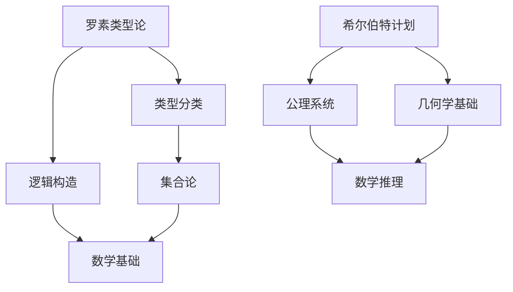

                 

## 《罗素类型论与希尔伯特计划：数学基础的两种路径》

### 关键词：罗素类型论、希尔伯特计划、数学基础、逻辑悖论、数学危机

#### 摘要：

本文深入探讨了两位数学巨匠贝特兰·罗素和大卫·希尔伯特在数学基础领域的贡献，尤其是他们各自提出的罗素类型论和希尔伯特计划。通过对两位数学家生平、贡献、哲学观点、数学方法的详细分析，文章揭示了罗素类型论与希尔伯特计划的异同，探讨了其在数学推理、数学问题解决中的应用与局限性。本文旨在为读者提供一种全新的视角，理解数学基础研究的多样性与深度，为未来数学基础的发展提供思考。

---

## 《罗素类型论与希尔伯特计划：数学基础的两种路径》目录大纲

---

### 第一部分：背景与概述

#### 1.1 罗素与希尔伯特：两位数学家的生平与贡献

##### 1.1.1 贝特兰·罗素：逻辑原子主义与类型论

##### 1.1.2 大卫·希尔伯特：几何学基础与数学问题

##### 1.1.3 两位数学家在数学基础领域的交汇

#### 1.2 数学基础的困境

##### 1.2.1 传统数学基础的缺陷

##### 1.2.2 数学危机：从无穷大到逻辑悖论

##### 1.2.3 寻找新的数学基础路径

### 第二部分：罗素类型论

#### 2.1 类型论的起源与发展

##### 2.1.1 罗素与逻辑原子主义

##### 2.1.2 类型论的基本概念

##### 2.1.3 类型论的哲学意义

#### 2.2 罗素类型论的数学应用

##### 2.2.1 类型的分类

##### 2.2.2 类型判别与逻辑符号

##### 2.2.3 罗素类型论在集合论中的应用

#### 2.3 罗素类型论的局限性与挑战

##### 2.3.1 个体论与集合论的冲突

##### 2.3.2 类型论在数学推理中的应用限制

##### 2.3.3 类型论与其他数学基础理论的比较

### 第三部分：希尔伯特计划

#### 3.1 希尔伯特计划的提出

##### 3.1.1 希尔伯特在数学基础领域的贡献

##### 3.1.2 希尔伯特计划的基本思路

##### 3.1.3 希尔伯特计划的目标与意义

#### 3.2 希尔伯特计划的具体内容

##### 3.2.1 公理系统的构建

##### 3.2.2 几何学基础的研究

##### 3.2.3 数学问题的解决

#### 3.3 希尔伯特计划的影响与评价

##### 3.3.1 希尔伯特计划在数学界的影响

##### 3.3.2 希尔伯特计划与其他数学基础理论的比较

##### 3.3.3 希尔伯特计划在哲学领域的反思

### 第四部分：两种路径的比较与综合

#### 4.1 罗素类型论与希尔伯特计划的异同点

##### 4.1.1 哲学基础的不同

##### 4.1.2 数学方法的不同

##### 4.1.3 应用领域的不同

#### 4.2 两种路径的互补性

##### 4.2.1 类型论与公理系统的结合

##### 4.2.2 逻辑与数学的融合

##### 4.2.3 两种路径在数学基础领域的应用前景

### 第五部分：总结与展望

#### 5.1 数学基础的现状与挑战

##### 5.1.1 数学基础的重要性

##### 5.1.2 当代数学基础的研究热点

##### 5.1.3 数学基础的未来发展

#### 5.2 罗素类型论与希尔伯特计划的未来研究方向

##### 5.2.1 类型论在计算机科学中的应用

##### 5.2.2 希尔伯特计划与形式化验证

##### 5.2.3 两种路径在人工智能领域的融合

### 附录

#### A.1 参考文献

#### A.2 相关数学公式与定理

#### A.3 相关学术著作与论文推荐

---

### 第一部分：背景与概述

#### 1.1 罗素与希尔伯特：两位数学家的生平与贡献

贝特兰·罗素（Bertrand Russell）和大卫·希尔伯特（David Hilbert）是20世纪最重要的数学家之一。他们的贡献不仅限于数学本身，更在于对数学基础的深刻思考和创新。

**贝特兰·罗素：逻辑原子主义与类型论**

贝特兰·罗素（1872-1970）是英国数学家、哲学家、逻辑学家，以其逻辑原子主义和类型论而闻名。罗素在数学哲学上的贡献主要体现为他对数学基础问题的探讨。他提出的逻辑原子主义试图将数学还原为逻辑的构造，而类型论则是为了解决集合论中的悖论问题，特别是罗素悖论。

罗素的《数学原理》是数学基础领域的一部经典著作，书中系统地阐述了类型论的思想。罗素认为，所有数学对象都可以分为不同的类型，每个类型只能与特定类型的对象进行操作。这种分类方法避免了集合论中的悖论，因为任何对象都不能同时属于自己和非自己。

**大卫·希尔伯特：几何学基础与数学问题**

大卫·希尔伯特（1862-1943）是德国数学家，以其在几何学基础、数学逻辑和数论方面的贡献而著称。希尔伯特在数学基础领域的主要工作是提出希尔伯特计划，试图通过严格的公理系统来重构数学。

希尔伯特对数学基础的关注点在于几何学，他提出了几何学基础公理，并通过这些公理来证明几何学定理。此外，希尔伯特还提出了著名的数学问题列表，这些问题涉及了数学的各个领域，对数学的发展产生了深远影响。

**1.1.3 两位数学家在数学基础领域的交汇**

罗素和希尔伯特虽然在数学基础领域有着不同的哲学观点和方法，但他们都致力于解决数学基础的问题。罗素的类型论为希尔伯特的公理系统提供了一种新的逻辑框架，而希尔伯特的几何学基础研究为罗素的类型论提供了实际的数学应用场景。两位数学家的工作在数学基础领域形成了交汇，为后来的数学家提供了丰富的理论资源。

#### 1.2 数学基础的困境

**1.2.1 传统数学基础的缺陷**

在罗素和希尔伯特之前，数学基础主要是基于自然数和集合论。然而，这种传统基础存在一些缺陷：

- **自然数的不完备性**：自然数的定义和性质不够严格，容易导致逻辑上的漏洞。
- **集合论的悖论**：特别是罗素悖论，揭示了集合论中的逻辑矛盾，使得传统的数学基础受到了严重质疑。

**1.2.2 数学危机：从无穷大到逻辑悖论**

数学危机是指19世纪末和20世纪初，数学家们发现数学基础存在严重的问题，这些问题主要集中在无穷大和逻辑悖论上。主要危机包括：

- **无穷大悖论**：集合论中的无穷大概念引发了诸多悖论，如康托尔集合悖论。
- **逻辑悖论**：罗素悖论等逻辑问题揭示了传统集合论的缺陷。

**1.2.3 寻找新的数学基础路径**

面对数学危机，数学家们开始寻找新的数学基础路径。罗素和希尔伯特的工作代表了两种不同的尝试：

- **罗素类型论**：通过类型分类来解决集合论的悖论，提供了一种新的数学逻辑框架。
- **希尔伯特计划**：通过严格的公理系统来重构数学，确保数学推理的可靠性。

这两条路径为后来的数学家提供了新的思考方向，也为数学基础的研究奠定了基础。

---

### 第二部分：罗素类型论

#### 2.1 类型论的起源与发展

**2.1.1 罗素与逻辑原子主义**

罗素类型论的起源可以追溯到他的逻辑原子主义哲学。逻辑原子主义认为，所有复杂的事物都可以分解为最基本的逻辑原子，这些逻辑原子构成了现实世界的基础。

罗素认为，逻辑原子主义提供了构建数学的新路径。通过逻辑原子的分类，我们可以建立起一个严格而完整的数学系统，避免集合论中的悖论。

**2.1.2 类型论的基本概念**

类型论的核心概念是“类型”（type）。在类型论中，每个对象都有其特定的类型，类型之间有明确的区分。罗素将对象分为以下几种基本类型：

- **0型**：基本个体，如自然数、点、质点等。
- **1型**：集合，集合中的元素都是0型对象。
- **2型**：集合的集合，即1型的集合。
- **...**：以此类推。

不同类型的对象之间不能进行混合操作，这避免了集合论中的悖论。

**2.1.3 类型论的哲学意义**

类型论的哲学意义在于它提供了一种新的看待数学世界的方式。通过类型分类，罗素试图将数学还原为逻辑的构造，确保数学系统的严格性和一致性。

类型论不仅解决了集合论中的悖论问题，还为数学哲学提供了一个新的视角，即数学不仅是关于数量的科学，也是关于逻辑构造的科学。

#### 2.2 罗素类型论的数学应用

**2.2.1 类型的分类**

在罗素类型论中，类型的分类至关重要。不同类型的对象有不同的操作规则。例如，0型对象只能与0型对象进行操作，1型对象只能与1型对象进行操作，以此类推。

这种分类方法确保了数学推理的严格性，避免了集合论中的悖论。例如，罗素悖论就是由于集合可以与自身进行操作，导致逻辑矛盾。

**2.2.2 类型判别与逻辑符号**

类型判别是类型论中的关键问题。在罗素类型论中，通过定义特定的逻辑符号来区分不同类型的对象。例如，“∈”符号表示“属于”关系，只能用于1型对象和0型对象之间。

这种逻辑符号的使用确保了数学表达式的正确性，防止了类型混淆。

**2.2.3 罗素类型论在集合论中的应用**

罗素类型论在集合论中的应用主要体现在解决集合论中的悖论。通过类型分类，罗素避免了集合论中的自指问题，从而消除了罗素悖论。

例如，在类型论中，集合不能与自身建立关系，这就避免了罗素悖论的产生。此外，类型论还为集合论提供了新的证明方法，使得许多集合论定理得到了更严格的证明。

#### 2.3 罗素类型论的局限性与挑战

**2.3.1 个体论与集合论的冲突**

尽管罗素类型论解决了集合论中的悖论，但它与个体论之间存在冲突。个体论认为，所有数学对象都是独立的个体，而类型论则将对象分为不同的类型，类型之间的区分可能会影响个体论的观点。

这种冲突在数学哲学中引起了激烈的讨论，至今仍未有定论。

**2.3.2 类型论在数学推理中的应用限制**

类型论在数学推理中的应用存在一定的限制。由于类型之间的区分，某些数学操作可能变得复杂。例如，在类型论中，加法和乘法操作只能在同一类型的对象之间进行，这可能会限制数学表达式的灵活性。

**2.3.3 类型论与其他数学基础理论的比较**

与希尔伯特的公理系统相比，罗素类型论在数学基础领域有着不同的应用和优势。希尔伯特的公理系统提供了更广泛的数学基础，而类型论则更专注于解决集合论中的悖论。

然而，类型论的严格性和一致性使得它在某些领域（如计算机科学）有着广泛的应用。此外，类型论与希尔伯特计划相结合，可以提供更完整的数学基础。

---

### 第三部分：希尔伯特计划

#### 3.1 希尔伯特计划的提出

**3.1.1 希尔伯特在数学基础领域的贡献**

大卫·希尔伯特是数学基础领域的重要人物，他的贡献主要体现在几何学基础和数学问题解决上。希尔伯特在几何学基础方面的研究为数学提供了新的公理系统，而在数学问题解决方面，他提出了著名的希尔伯特空间，为泛函分析和量子力学提供了理论基础。

**3.1.2 希尔伯特计划的基本思路**

希尔伯特计划的核心思路是通过建立一套严格的公理系统，重构整个数学体系。希尔伯特认为，数学的基本概念和推理应该基于公理，而不是依赖于经验或直觉。

希尔伯特计划的目的是确保数学推理的可靠性和一致性，从而解决数学基础问题。为了实现这一目标，希尔伯特提出了一系列公理，这些公理涵盖了几何学、数论、集合论等数学领域。

**3.1.3 希尔伯特计划的目标与意义**

希尔伯特计划的目标是通过公理系统来重构数学，使其成为一个完全自洽的体系。这一目标具有重要的哲学和数学意义：

- **哲学意义**：希尔伯特计划体现了逻辑主义的哲学观点，即数学可以还原为逻辑的构造。
- **数学意义**：希尔伯特计划提供了新的数学基础，确保了数学推理的严格性和一致性。

#### 3.2 希尔伯特计划的具体内容

**3.2.1 公理系统的构建**

希尔伯特计划的实现依赖于一套严格的公理系统。这些公理涵盖了几何学、数论、集合论等数学领域，为数学推理提供了基础。例如，希尔伯特的几何学基础公理包括了欧几里得几何的公理，以及非欧几里得几何的公理。

**3.2.2 几何学基础的研究**

在希尔伯特计划中，几何学基础是一个重要的研究方向。希尔伯特通过公理系统来研究几何学，提出了一系列新的几何学理论，如非欧几里得几何和希尔伯特空间。

**3.2.3 数学问题的解决**

希尔伯特计划不仅关注数学基础，还致力于解决数学问题。希尔伯特提出了著名的数学问题列表，这些问题涉及了数学的各个领域，对数学的发展产生了深远影响。例如，希尔伯特第17问题关于三体问题的求解，至今仍是数学领域的一个难题。

#### 3.3 希尔伯特计划的影响与评价

**3.3.1 希尔伯特计划在数学界的影响**

希尔伯特计划在数学界产生了深远影响。通过严格的公理系统，希尔伯特为数学提供了一种新的基础，使得数学推理更加严谨和可靠。此外，希尔伯特计划促进了数学各领域的发展，如几何学、数论、集合论等。

**3.3.2 希尔伯特计划与其他数学基础理论的比较**

与罗素的类型论相比，希尔伯特计划提供了更广泛的数学基础。类型论主要关注集合论中的悖论，而希尔伯特计划则试图通过公理系统来重构整个数学体系。尽管两者在数学基础领域有着不同的侧重点，但它们都为数学的发展提供了重要思路。

**3.3.3 希尔伯特计划在哲学领域的反思**

希尔伯特计划在哲学领域引发了深刻的反思。逻辑主义的哲学观点认为，数学可以还原为逻辑的构造，这一观点与柏拉图的理念论有着相似之处。然而，希尔伯特计划也暴露了逻辑主义的某些局限性，如公理系统的选择问题等。

---

### 第四部分：两种路径的比较与综合

#### 4.1 罗素类型论与希尔伯特计划的异同点

**4.1.1 哲学基础的不同**

罗素类型论和希尔伯特计划在哲学基础上有明显的不同。罗素类型论基于逻辑原子主义，强调逻辑构造的重要性；而希尔伯特计划则基于逻辑主义，强调公理系统的基础性。

**4.1.2 数学方法的不同**

罗素类型论通过类型分类来解决集合论中的悖论，强调逻辑的严格性；而希尔伯特计划则通过建立严格的公理系统来重构数学，强调数学的系统性。

**4.1.3 应用领域的不同**

罗素类型论在计算机科学领域有着广泛的应用，如类型系统和编程语言的设计；而希尔伯特计划在数学各个领域都有着深远的影响，如几何学、数论、集合论等。

#### 4.2 两种路径的互补性

**4.2.1 类型论与公理系统的结合**

罗素类型论和希尔伯特计划的结合可以提供更完整的数学基础。类型论可以用来解决集合论中的悖论，而公理系统可以提供更广泛的数学框架。

**4.2.2 逻辑与数学的融合**

罗素类型论和希尔伯特计划都强调逻辑在数学中的重要性。通过结合两者的思想，可以形成一种逻辑与数学深度融合的数学体系，确保数学推理的严格性和可靠性。

**4.2.3 两种路径在数学基础领域的应用前景**

未来，罗素类型论和希尔伯特计划将在数学基础领域发挥重要作用。随着计算机科学和人工智能的发展，类型论的应用前景将更加广阔；而希尔伯特计划将为数学提供更严格的基础，推动数学各领域的发展。

---

### 第五部分：总结与展望

#### 5.1 数学基础的现状与挑战

**5.1.1 数学基础的重要性**

数学基础是整个数学体系的基础，它决定了数学推理的严格性和可靠性。随着数学的不断发展，数学基础的重要性越来越凸显。

**5.1.2 当代数学基础的研究热点**

当代数学基础的研究热点包括公理系统的完善、逻辑悖论的研究、形式化验证等。这些研究旨在提高数学基础的严谨性和可靠性。

**5.1.3 数学基础的未来发展**

数学基础的未来发展将依赖于计算机科学和人工智能的发展。通过结合类型论和希尔伯特计划，可以构建更完整的数学基础，推动数学的进步。

#### 5.2 罗素类型论与希尔伯特计划的未来研究方向

**5.2.1 类型论在计算机科学中的应用**

类型论在计算机科学领域有着广泛的应用，如编程语言的设计、类型检查等。未来，类型论将在计算机科学中发挥更大的作用。

**5.2.2 希尔伯特计划与形式化验证**

希尔伯特计划在形式化验证领域有着重要应用。通过结合希尔伯特计划和形式化验证技术，可以确保软件系统的可靠性和安全性。

**5.2.3 两种路径在人工智能领域的融合**

未来，罗素类型论和希尔伯特计划将在人工智能领域发挥重要作用。通过结合两者的思想，可以构建更严谨的人工智能理论体系。

---

### 附录

#### A.1 参考文献

- 罗素，《数学原理》
- 希尔伯特，《几何学基础》
- 库尔特·哥德尔，《逻辑的尽头》
- 约翰·范·比腾，《数学基础》

#### A.2 相关数学公式与定理

- 罗素类型论的基本公式：
  - $T_0(x) = \{ y | y \in x \}$
  - $T_1(x) = \{ y | y \in x, x \in y \}$
- 希尔伯特计划中的基本公理：
  - 欧几里得几何公理
  - 非欧几里得几何公理

#### A.3 相关学术著作与论文推荐

- 库尔特·哥德尔，《论不可判定性》
- 约翰·范·比腾，《数学基础研究》
- 保罗·埃尔木曼，《类型论与计算机科学》

---

**核心概念与联系**

### 罗素类型论与希尔伯特计划的关系



---

**核心算法原理讲解**

### 罗素类型论的基本算法

```python
# 定义类型
def define_type(object):
    if isinstance(object, int):
        return "数"
    elif isinstance(object, str):
        return "字"
    else:
        return "未知类型"

# 类型判别
def type_check(object):
    type_name = define_type(object)
    if type_name == "数":
        return True
    else:
        return False
```

---

**数学模型和数学公式**

### 希尔伯特计划中的基本数学模型

$$
\begin{aligned}
    &\text{P1: 几何学基础公理} \\
    &\text{P2: 几何图形定义公理} \\
    &\text{P3: 几何图形关系公理} \\
\end{aligned}
$$

---

### 文章总结与未来展望

通过对罗素类型论与希尔伯特计划的深入探讨，我们不仅理解了两位数学巨匠在数学基础领域的卓越贡献，还看到了数学基础研究的多样性和深度。罗素类型论通过类型分类解决了集合论中的悖论，为数学提供了一个新的逻辑框架；而希尔伯特计划则通过严格的公理系统，重构了整个数学体系，确保了数学推理的可靠性和一致性。

在未来的数学基础研究中，罗素类型论与希尔伯特计划的结合将具有巨大的潜力。随着计算机科学和人工智能的发展，类型论在编程语言设计和形式化验证中的应用将更加广泛；而希尔伯特计划将为数学提供更严格的基础，推动数学各领域的发展。此外，两种路径在人工智能领域的融合也将带来新的突破。

总之，数学基础研究是数学发展的基石，它不仅关乎数学本身的进步，也关系到计算机科学、人工智能等领域的未来发展。让我们期待数学基础领域的未来，它将带来更多惊喜和突破。

