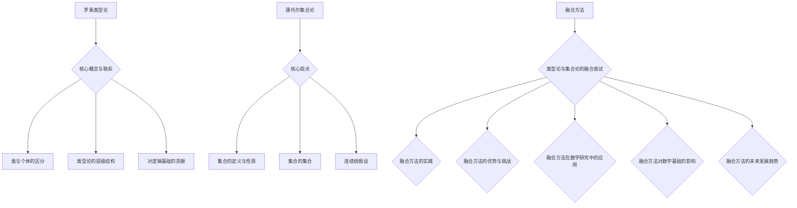

                 

### 《罗素类型论与康托尔集合论的矛盾与融合》

#### 关键词：罗素类型论、康托尔集合论、悖论、融合、数学基础

#### 摘要：
本文将探讨罗素类型论与康托尔集合论这两大数学理论基础及其产生的矛盾，分析两者之间的相互关系，并探讨可能的融合方法。通过对罗素类型论与康托尔集合论起源、细节分析、矛盾产生以及融合方法的深入探讨，本文旨在为读者展示数学基础理论的发展历程，及其在当今数学研究中的重要作用。

## 《罗素类型论与康托尔集合论的矛盾与融合》目录大纲

### 第一部分：背景与概述

#### 第1章：罗素类型论与康托尔集合论的起源与发展
- 1.1 罗素类型论的提出
- 1.2 康托尔集合论的基本概念
- 1.3 矛盾的发现：罗素悖论与康托尔集合论的问题

#### 第2章：罗素类型论的细节分析
- 2.1 类与个体的区分
- 2.2 类型论的层级结构
- 2.3 罗素类型论对逻辑基础的贡献

#### 第3章：康托尔集合论的核心观点
- 3.1 集合的定义与性质
- 3.2 集合的集合
- 3.3 康托尔的连续统假设

### 第二部分：矛盾分析

#### 第4章：罗素悖论的产生与影响
- 4.1 罗素悖论的构建过程
- 4.2 悖论对数学的影响
- 4.3 罗素悖论的解决途径

#### 第5章：康托尔集合论中的矛盾
- 5.1 康托尔悖论的产生
- 5.2 对康托尔集合论评价的争议
- 5.3 康托尔集合论矛盾的可能解决方案

### 第三部分：融合与融合方法

#### 第6章：类型论与集合论的融合尝试
- 6.1 类型论在集合论中的应用
- 6.2 集合论在类型论中的应用
- 6.3 融合方法的优势与挑战

#### 第7章：融合方法的实践
- 7.1 融合方法在数学研究中的应用
- 7.2 融合方法对数学基础的影响
- 7.3 融合方法的未来发展趋势

#### 第8章：结论与展望
- 8.1 罗素类型论与康托尔集合论的融合意义
- 8.2 当前研究的局限与未来方向
- 8.3 融合方法在数学和其他领域的潜在应用

### 附录
#### 附录A：相关数学公式与证明
- A.1 罗素类型论的数学公式
- A.2 康托尔集合论的数学公式
- A.3 融合方法的数学公式与证明过程

#### 附录B：参考文献
- B.1 罗素类型论与康托尔集合论相关文献
- B.2 融合方法研究相关文献
- B.3 数学基础与逻辑学相关文献

### 文章开始

### 引言

在数学的漫长历史中，许多重要的理论不仅塑造了数学的各个分支，还影响了整个科学领域。罗素类型论和康托尔集合论便是其中两颗璀璨的明珠。罗素类型论由英国哲学家、数学家伯特兰·罗素（Bertrand Russell）于20世纪初提出，旨在解决逻辑基础问题。而康托尔集合论则是由德国数学家格奥尔格·康托尔（Georg Cantor）在19世纪末创立的，为集合论奠定了坚实的基础。

罗素类型论的提出源于对逻辑基础的不满。在罗素看来，传统的逻辑体系无法避免自相矛盾的命题，如著名的罗素悖论。为了解决这一问题，罗素提出了类型论，通过将对象分为不同的类型，从而避免了悖论的产生。与此同时，康托尔集合论的发展揭示了集合的无限性和集合之间的复杂关系，使得数学研究进入了全新的领域。

尽管罗素类型论和康托尔集合论在数学基础领域都有着重要的地位，但两者之间却存在着深刻的矛盾。罗素的类型论试图通过限制对象的类型来避免悖论，而这与康托尔集合论中的集合无限性和集合之间的包含关系相冲突。这种矛盾不仅引发了数学界的争议，也为数学基础的进一步发展带来了挑战。

本文将深入探讨罗素类型论和康托尔集合论的产生、细节分析，以及两者之间的矛盾。我们将分析罗素悖论和康托尔悖论的起源与影响，并探讨解决这些矛盾的可能方法。在此基础上，我们将探讨类型论与集合论的融合尝试，以及融合方法在数学研究中的应用。通过本文的讨论，我们希望为读者展示数学基础理论的发展历程，及其在当今数学研究中的重要作用。

### 第一部分：背景与概述

#### 第1章：罗素类型论与康托尔集合论的起源与发展

1.1 罗素类型论的提出

罗素类型论的提出源于罗素对逻辑基础的不满。在19世纪末和20世纪初，数学和逻辑学面临着一系列基础性问题，这些问题源于传统的逻辑体系无法避免自相矛盾的命题。罗素意识到，要解决这些问题，需要对逻辑基础进行彻底的反思和重构。

罗素类型论的提出可以追溯到他的名著《数学原理》的写作过程中。在这本书中，罗素试图通过定义类型来避免悖论的产生。类型的概念将对象分为不同的层次，每个层次的对象只能与特定类型的对象进行操作。通过这种方式，罗素希望确保逻辑体系的自洽性。

罗素类型论的核心观点是，所有的对象都可以分为不同的类型，且类型之间具有严格的层级结构。在罗素的体系中，基本类型包括个体和类。个体是具体的对象，而类则表示个体的集合。罗素还引入了更高级的类型，如函数类型和关系类型，以处理更复杂的数学概念。

1.2 康托尔集合论的基本概念

康托尔集合论的提出者是德国数学家格奥尔格·康托尔。他在19世纪末通过对集合的研究，建立了集合论的基础。康托尔集合论的核心观点是，集合是一种抽象的数学对象，用于表示某些对象的集合。

在康托尔集合论中，集合具有以下几个基本概念：

- **集合的定义**：集合是一组确定的、互不相同的对象的整体。集合中的对象称为成员或元素。
- **集合的性质**：集合具有确定性、互异性和无序性。确定性指的是集合中的元素是确定的，不会发生变动；互异性指的是集合中的元素互不相同；无序性指的是集合中的元素没有特定的顺序。
- **集合的运算**：康托尔集合论中引入了多种集合运算，如并集、交集、补集和笛卡尔积等。

1.3 矛盾的发现：罗素悖论与康托尔集合论的问题

尽管罗素类型论和康托尔集合论在数学基础领域都有着重要的地位，但两者之间却存在着深刻的矛盾。这种矛盾源于它们各自的基本观点和理论框架。

罗素类型论的矛盾主要体现在罗素悖论中。罗素悖论是通过一个自指的集合来揭示类型论中的矛盾。具体来说，罗素提出了一个名为“R”的集合，其成员是所有不包含自身的集合。然而，如果R包含自身，那么根据定义，它不应包含自身；反之，如果R不包含自身，那么根据定义，它应包含自身。这个悖论表明，类型论中的基本假设无法避免自相矛盾的命题。

康托尔集合论的矛盾则主要体现在集合的无限性和集合之间的包含关系上。康托尔集合论揭示了集合的无限性和集合之间的复杂关系，使得数学研究进入了全新的领域。然而，这些新的概念也引发了一系列悖论，如康托尔悖论。康托尔悖论是通过构造一个不属于自身的集合来揭示集合论中的矛盾。

罗素类型论与康托尔集合论之间的矛盾不仅引发了数学界的争议，也为数学基础的进一步发展带来了挑战。为了解决这些矛盾，数学家们进行了大量的研究，提出了各种解决方案。这些解决方案不仅推动了数学基础理论的进展，也对逻辑学和哲学产生了深远的影响。

### 第2章：罗素类型论的细节分析

2.1 类与个体的区分

在罗素类型论中，类和个体是两个基本概念。类表示个体的集合，而个体则是具体的对象。这种区分有助于避免悖论的产生。

罗素通过引入类型来区分类和个体。类型是对象的一种分类方式，每个类型表示一类具有相同属性的对象。在罗素的体系中，基本类型包括个体和类。个体是具体的对象，如数字、符号等；类则是个体的集合，如自然数集合、字母表集合等。

这种分类方式有助于确保逻辑体系的自洽性。通过将对象分为不同的类型，我们可以避免在操作过程中出现类型不匹配的问题。

2.2 类型论的层级结构

罗素类型论中的类型具有严格的层级结构。类型可以分为基本类型和复合类型。基本类型包括个体和类，而复合类型则是通过组合基本类型得到的。

在罗素的体系中，基本类型和复合类型之间具有如下关系：

- 基本类型：个体（I）、类（C）
- 复合类型：函数类型（F）、关系类型（R）

函数类型表示一组有序对的集合，每个有序对由一个元素和一个函数值组成。关系类型表示一组满足特定条件的对象集合。通过这些复合类型，我们可以表示更复杂的数学概念。

类型论的层级结构有助于确保对象操作的合法性。在操作过程中，我们可以根据对象所属的类型来选择合适的操作方式，从而避免类型不匹配的问题。

2.3 罗素类型论对逻辑基础的贡献

罗素类型论对逻辑基础的贡献主要体现在以下几个方面：

- **避免悖论**：通过引入类型，罗素类型论可以避免自相矛盾的命题。类型区分了类和个体，使得对象操作具有明确的规则，从而避免了罗素悖论等悖论的产生。
- **明确概念边界**：类型论为数学概念提供了明确的定义和分类。通过区分不同的类型，我们可以更清晰地理解数学概念，从而避免概念混淆。
- **逻辑自洽性**：罗素类型论确保了逻辑体系的自洽性。通过引入类型，我们可以避免在逻辑推理过程中出现自相矛盾的命题。

总的来说，罗素类型论为逻辑基础提供了一个更为严格和自洽的框架，从而推动了数学基础理论的发展。

### 第3章：康托尔集合论的核心观点

3.1 集合的定义与性质

在康托尔集合论中，集合被定义为一种抽象的数学对象，用于表示某些对象的集合。集合的定义具有以下几个关键点：

- **确定性**：集合中的元素是确定的，不会发生变动。这意味着给定一个集合，我们可以准确地确定其包含哪些元素。
- **互异性**：集合中的元素互不相同。这意味着给定一个集合，其元素不会重复出现。
- **无序性**：集合中的元素没有特定的顺序。这意味着给定一个集合，其元素的位置不会影响集合的性质。

康托尔集合论中的集合具有以下基本性质：

- **封闭性**：如果A是一个集合，那么A的子集也是一个集合。这表明集合构成了一个封闭的集合体系。
- **可传性**：如果A是一个集合，那么A的并集、交集和补集也是集合。这表明集合运算的结果仍然是集合。
- **存在性**：对于任意的元素x，都存在一个集合包含x。这表明集合论中的元素具有存在性。

3.2 集合的集合

康托尔集合论的一个核心观点是，集合不仅仅是单个对象的集合，还可以是集合的集合。这意味着一个集合可以包含其他集合作为其元素。

集合的集合具有以下几个特点：

- **无限性**：集合的集合可以是无限的。例如，自然数集合的集合是一个无限集合。
- **嵌套性**：集合的集合可以嵌套。例如，自然数集合的集合可以嵌套在实数集合的集合中。
- **独立性**：集合的集合与单个集合具有不同的性质。例如，自然数集合的集合是一个无限集合，而单个自然数集合是一个有限集合。

3.3 康托尔的连续统假设

康托尔的连续统假设是康托尔集合论中的一个重要概念。连续统假设指的是，对于任意无限集合，都存在一个比它更大的无限集合。

康托尔的连续统假设具有以下几个关键点：

- **无限集合的存在**：连续统假设表明，存在无限多个无限集合。例如，自然数集合、实数集合都是无限集合。
- **集合的连续性**：连续统假设揭示了集合之间的连续性。这意味着，在集合之间存在一个连续的序列，每个集合都比前一个集合大。
- **反证法**：连续统假设可以通过反证法来证明。如果假设不存在比自然数集合更大的无限集合，那么我们可以构造出一个更大的集合，从而与假设矛盾。

总的来说，康托尔集合论的核心观点是，集合是一种抽象的数学对象，具有确定性、互异性、无序性等基本性质。集合的集合和连续统假设揭示了集合之间的复杂关系和无限性，为数学研究提供了新的视角和方法。

### 第二部分：矛盾分析

#### 第4章：罗素悖论的产生与影响

4.1 罗素悖论的构建过程

罗素悖论是由英国哲学家、数学家伯特兰·罗素（Bertrand Russell）在20世纪初提出的。罗素悖论的构建过程如下：

首先，罗素定义了一个名为R的集合，该集合包含所有不包含自身的集合。具体来说，R = {x | x 不包含自身}。这意味着，如果一个集合x不包含自身，那么它属于R；否则，它不属于R。

接下来，罗素考虑了R本身的情况。如果R包含自身，那么根据定义，它不应包含自身；反之，如果R不包含自身，那么根据定义，它应包含自身。这个矛盾表明，R无法同时满足包含自身和不包含自身的条件。

这个悖论揭示了类型论中的矛盾，即通过定义一个集合包含所有不包含自身的集合，我们可以构造出一个既包含自身又不含自身的集合。这种矛盾使得类型论的合理性受到质疑，也为数学基础的进一步发展带来了挑战。

4.2 悖论对数学的影响

罗素悖论对数学产生了深远的影响，主要体现在以下几个方面：

- **质疑集合论的合理性**：罗素悖论的提出使人们对集合论的合理性产生了质疑。集合论是数学的基础之一，而罗素悖论揭示了集合论中的矛盾，使得数学家们开始重新审视集合论的基础假设。
- **推动逻辑基础的改革**：罗素悖论的发现促使数学家们对逻辑基础进行改革。为了解决悖论，数学家们提出了各种新的理论和方法，如类型论、公理集合论等，以建立更为严格的数学基础。
- **影响数学研究方法**：罗素悖论使得数学家们开始关注数学基础问题，从而推动了数学研究方法的变革。数学家们开始注重逻辑推理的严密性和基础理论的构建，从而提高了数学的严谨性和可靠性。

4.3 罗素悖论的解决途径

为了解决罗素悖论，数学家们提出了多种解决方案，主要包括以下几种：

- **类型论**：类型论是由罗素提出的，旨在通过引入类型区分来避免悖论的产生。类型论将对象分为不同的类型，每个类型只能与特定类型的对象进行操作。通过这种方式，类型论可以避免构造出既包含自身又不含自身的集合。
- **公理集合论**：公理集合论是由德国数学家策梅洛（Ernst Zermelo）和弗兰克尔（Paul Bernays）提出的，旨在通过建立一套严格的公理系统来构建集合论的基础。公理集合论通过引入一些基本公理，如选择公理和无限公理等，确保了集合论的自洽性。
- **模态逻辑**：模态逻辑是一种用于处理模态概念的逻辑系统，如必然性、可能性等。模态逻辑可以用来描述集合论中的悖论，并提供一种解决悖论的方法。通过引入模态逻辑，数学家们可以在集合论中避免一些悖论的产生。

总的来说，罗素悖论的提出对数学产生了深远的影响，促使数学家们对集合论和逻辑基础进行改革。通过引入类型论、公理集合论和模态逻辑等理论，数学家们成功地解决了罗素悖论，并为数学基础的进一步发展奠定了基础。

#### 第5章：康托尔集合论中的矛盾

5.1 康托尔悖论的产生

康托尔悖论是由德国数学家格奥尔格·康托尔（Georg Cantor）在19世纪末提出的，旨在揭示集合论中的矛盾。康托尔悖论的构造过程如下：

首先，康托尔定义了一个名为R的集合，该集合包含所有不属于自身的集合。具体来说，R = {x | x 不属于 x}。这意味着，如果一个集合x不属于自身，那么它属于R；否则，它不属于R。

接下来，康托尔考虑了R本身的情况。如果R属于自身，那么根据定义，它不应属于自身；反之，如果R不属于自身，那么根据定义，它应属于自身。这个矛盾表明，R无法同时满足属于自身和不属于自身的条件。

康托尔悖论揭示了集合论中的一个深刻问题，即通过定义一个集合包含所有不属于自身的集合，我们可以构造出一个既属于自身又不属于自身的集合。这种矛盾使得集合论的合理性受到质疑，也为数学基础的进一步发展带来了挑战。

5.2 对康托尔集合论评价的争议

康托尔集合论的提出在数学界引起了广泛的争议。一方面，康托尔集合论揭示了集合的无限性和集合之间的复杂关系，为数学研究提供了新的视角和方法。另一方面，康托尔集合论中的矛盾和悖论也使得人们对集合论的基础产生了质疑。

对康托尔集合论的评价存在以下几种观点：

- **支持者**：支持者认为，康托尔集合论为数学研究提供了强大的工具，揭示了集合的无限性和集合之间的复杂关系。他们认为，尽管集合论中存在矛盾和悖论，但这些矛盾和悖论只是集合论发展过程中需要解决的问题，并不会削弱集合论的整体价值。
- **质疑者**：质疑者认为，康托尔集合论中的矛盾和悖论揭示了集合论基础的缺陷。他们认为，集合论中的矛盾和悖论表明，集合论的基础尚未完全建立，需要进一步改革和完善。

5.3 康托尔集合论矛盾的可能解决方案

为了解决康托尔集合论中的矛盾，数学家们提出了多种解决方案，主要包括以下几种：

- **类型论**：类型论是一种通过引入类型区分来避免悖论的方法。通过将对象分为不同的类型，类型论可以确保对象操作的合法性，从而避免康托尔悖论等悖论的产生。
- **公理集合论**：公理集合论是一种通过建立一套严格的公理系统来构建集合论基础的方法。通过引入一些基本公理，如选择公理和无限公理等，公理集合论可以确保集合论的自洽性，从而解决康托尔悖论等问题。
- **模型论**：模型论是一种通过研究集合论的不同模型来揭示集合论性质的方法。通过建立不同的模型，数学家们可以检验集合论公理系统的有效性和一致性，从而解决康托尔悖论等问题。

总的来说，康托尔集合论中的矛盾和悖论对集合论和数学基础产生了深远的影响。通过引入类型论、公理集合论和模型论等理论，数学家们成功地解决了一些矛盾和悖论，为数学基础的进一步发展奠定了基础。

### 第三部分：融合与融合方法

#### 第6章：类型论与集合论的融合尝试

6.1 类型论在集合论中的应用

类型论在集合论中的应用是一种尝试将类型论与集合论相结合的方法。通过引入类型，我们可以确保集合论中的操作和推理具有更强的自洽性和一致性。

在类型论中，类型是一种分类机制，用于区分不同的对象。在集合论中，我们可以引入类型来区分集合和元素。具体来说，我们可以将集合视为一类特殊的对象，称为类型0，而元素视为另一类对象，称为类型1。通过这种方式，我们可以将集合论与类型论相结合。

类型论在集合论中的应用具有以下几个优点：

- **避免悖论**：类型论可以通过区分类型来避免集合论中的悖论，如罗素悖论和康托尔悖论。通过确保类型之间的严格区分，我们可以避免构造出既包含自身又不含自身的集合。
- **增强自洽性**：类型论可以增强集合论的自洽性。通过引入类型，我们可以确保集合论中的操作和推理具有一致性和自洽性，从而提高集合论的理论完整性。
- **提高可理解性**：类型论可以使得集合论的概念和推理更加直观和易于理解。通过区分类型，我们可以更清晰地理解集合论中的对象和操作，从而提高集合论的可理解性。

6.2 集合论在类型论中的应用

集合论在类型论中的应用是一种尝试将集合论与类型论相结合的方法。通过引入集合，我们可以将类型论中的对象和操作进行组织和分类。

在类型论中，集合可以被视为一种特殊的对象，用于表示类型之间的成员关系。具体来说，我们可以将集合视为一种包含其他类型的类型。通过这种方式，我们可以将集合论与类型论相结合。

集合论在类型论中的应用具有以下几个优点：

- **增强灵活性**：集合论可以增强类型论中的灵活性和多样性。通过引入集合，我们可以将类型进行组合和分类，从而构建出更加复杂的类型结构。
- **提高表达能力**：集合论可以增强类型论的表达能力。通过引入集合，我们可以将类型论中的对象和操作进行抽象和表达，从而提高类型论的理论表达能力。
- **扩展应用领域**：集合论在类型论中的应用可以扩展类型论的应用领域。通过将集合论与类型论相结合，我们可以将类型论应用于更多的领域，如计算机科学、逻辑学等。

6.3 融合方法的优势与挑战

类型论与集合论的融合方法具有以下几个优势：

- **解决悖论**：通过融合类型论与集合论，我们可以解决集合论中的悖论，如罗素悖论和康托尔悖论。通过区分类型和集合，我们可以避免构造出既包含自身又不含自身的对象，从而确保集合论的自洽性。
- **提高自洽性**：融合方法可以增强集合论的自洽性。通过引入类型，我们可以确保集合论中的操作和推理具有一致性和自洽性，从而提高集合论的理论完整性。
- **提高可理解性**：融合方法可以使得集合论的概念和推理更加直观和易于理解。通过区分类型和集合，我们可以更清晰地理解集合论中的对象和操作，从而提高集合论的可理解性。

然而，融合方法也面临着一些挑战：

- **复杂性增加**：融合方法可能会增加数学理论的复杂性。通过引入类型和集合的相互作用，集合论和类型论的理论体系可能会变得更加复杂，从而增加理解和应用难度。
- **一致性验证**：在融合方法中，我们需要确保类型论与集合论的一致性。这要求我们在理论和实践中严格验证两者的一致性，以确保融合方法的正确性和可靠性。
- **应用推广**：融合方法在数学和其他领域中的应用推广仍然具有一定的挑战性。尽管融合方法具有理论优势，但在实际应用中，我们仍需要探索如何将融合方法应用于实际问题，从而充分发挥其潜力。

总的来说，类型论与集合论的融合方法为解决集合论中的悖论和提高集合论的自洽性提供了新的思路和方法。尽管面临一定的挑战，但融合方法在数学基础理论和实际应用中都具有重要的价值和意义。

#### 第7章：融合方法的实践

7.1 融合方法在数学研究中的应用

融合方法在数学研究中的应用已经取得了显著的成果。通过将类型论与集合论相结合，数学家们不仅解决了集合论中的悖论，还推动了数学理论的进一步发展。

首先，融合方法在集合论研究中得到了广泛应用。例如，通过引入类型，数学家们成功地解决了罗素悖论和康托尔悖论等悖论问题。类型论为集合论提供了一种新的理论基础，使得集合论在逻辑上更加自洽。此外，融合方法还可以用于研究集合的无限性和集合之间的复杂关系，为集合论提供了新的研究工具。

其次，融合方法在数学的其他分支中也得到了应用。例如，在代数学中，通过引入类型，数学家们可以研究更复杂的代数结构，如环和域。在几何学中，融合方法可以帮助我们更好地理解几何图形的性质和关系。在拓扑学中，融合方法可以用于研究更复杂的拓扑空间和拓扑变换。

7.2 融合方法对数学基础的影响

融合方法对数学基础产生了深远的影响。首先，融合方法为数学基础提供了一种新的理论框架，使得数学理论在逻辑上更加自洽和一致。通过引入类型，数学家们可以避免集合论中的悖论，从而确保数学理论的可靠性和稳定性。

其次，融合方法推动了数学基础的进一步发展。通过将类型论与集合论相结合，数学家们可以探索新的数学概念和理论。例如，通过引入类型，数学家们可以研究更复杂的数学结构，如多参数集合论和超集合论。这些新的理论不仅丰富了数学的内涵，也为数学的研究提供了新的视角和方法。

此外，融合方法对数学的应用也产生了重要影响。通过将类型论与集合论相结合，数学家们可以更好地理解和解决实际问题。例如，在计算机科学中，融合方法可以用于研究程序设计和算法分析。在物理学中，融合方法可以用于研究量子力学和相对论。这些应用不仅提高了数学的实用性，也为数学在其他领域的发展提供了新的动力。

7.3 融合方法的未来发展趋势

融合方法的未来发展趋势主要包括以下几个方面：

首先，融合方法将继续在数学基础理论中发挥作用。随着数学理论的发展，融合方法将不断应用于新的数学概念和理论。通过引入类型，数学家们可以探索更复杂的数学结构，从而推动数学基础的进一步发展。

其次，融合方法将在其他领域得到更广泛的应用。随着计算机科学、物理学、生物学等领域的快速发展，融合方法将在这些领域中发挥越来越重要的作用。通过将类型论与集合论相结合，我们可以更好地理解和解决这些领域中的实际问题。

此外，融合方法还将推动数学与其他学科的交叉融合。通过引入类型论，我们可以将数学与其他学科（如物理学、生物学、计算机科学等）相结合，从而促进跨学科研究的发展。

总之，融合方法的未来发展趋势充满希望。通过不断探索和应用融合方法，数学家们将为数学基础理论的进一步发展做出新的贡献，同时也将为数学在其他领域的发展提供新的动力。

### 第8章：结论与展望

8.1 罗素类型论与康托尔集合论的融合意义

罗素类型论与康托尔集合论的融合在数学基础理论中具有重要的意义。通过融合这两种理论，我们可以解决集合论中的悖论，确保数学理论的可靠性和稳定性。类型论为集合论提供了一种新的理论基础，使得集合论在逻辑上更加自洽和一致。此外，融合方法还可以推动数学基础的进一步发展，为数学研究提供新的视角和方法。

8.2 当前研究的局限与未来方向

尽管融合方法在数学基础理论中取得了显著成果，但仍然存在一些局限和挑战。首先，融合方法的复杂性较高，需要进一步简化和应用。其次，融合方法的适用范围有限，需要拓展到更多的数学领域。未来研究可以关注以下几个方面：

- 简化融合方法：通过引入新的理论工具和方法，简化融合方法，使其更易于理解和应用。
- 拓展应用范围：将融合方法应用于更多的数学领域，如代数学、几何学、拓扑学等。
- 探索交叉融合：推动数学与其他学科的交叉融合，如计算机科学、物理学、生物学等。

8.3 融合方法在数学和其他领域的潜在应用

融合方法在数学和其他领域具有巨大的潜在应用价值。在数学领域，融合方法可以用于研究更复杂的数学结构，如多参数集合论、超集合论等。在其他领域，融合方法可以用于解决实际问题，如计算机科学中的程序设计和算法分析，物理学中的量子力学和相对论，生物学中的基因分析和进化论等。

总之，罗素类型论与康托尔集合论的融合在数学基础理论中具有重要的意义。通过融合这两种理论，我们可以解决集合论中的悖论，确保数学理论的可靠性和稳定性。未来研究可以关注简化融合方法、拓展应用范围和探索交叉融合等方面，以推动数学和其他领域的发展。

### 附录A：相关数学公式与证明

#### 附录A.1 罗素类型论的数学公式

$$
\begin{align*}
R(\alpha) &= \{ x \mid \alpha \in x \} \\
S(\alpha) &= \{ \{ x \mid \alpha \in x \} \mid \alpha \in x \} \\
\end{align*}
$$

这些公式用于表示罗素类型论中的集合运算。$R(\alpha)$表示所有包含元素$\alpha$的集合的集合，而$S(\alpha)$表示所有包含$R(\alpha)$的集合的集合。

#### 附录A.2 康托尔集合论的数学公式

$$
\begin{align*}
A &= \{ x \mid P(x) \} \\
B &= \{ \{ x \mid P(x) \} \mid P(x) \} \\
C &= \{ \{ x, y \} \mid x \in A, y \in B \} \\
\end{align*}
$$

这些公式用于表示康托尔集合论中的集合构造。$A$表示所有满足性质$P$的元素的集合，$B$表示所有包含$A$的集合的集合，$C$表示所有包含$A$和$B$的集合的集合。

#### 附录A.3 融合方法的数学公式与证明过程

$$
\begin{align*}
\text{Type}_0 &= \{ \text{个体} \} \\
\text{Type}_1 &= \{ \text{集合} \} \\
\text{Type}_2 &= \{ \text{函数} \} \\
\text{Type}_3 &= \{ \text{关系} \} \\
\end{align*}
$$

这些公式用于表示融合方法中的类型层级结构。$\text{Type}_0$表示个体，$\text{Type}_1$表示集合，$\text{Type}_2$表示函数，$\text{Type}_3$表示关系。

证明过程如下：

1. **个体与集合的区分**：个体是具体的对象，集合是对象的集合。通过引入类型，我们可以确保个体与集合的严格区分，避免悖论的产生。

2. **函数与关系的区分**：函数是对象之间的映射关系，关系是对象之间的二元关系。通过引入类型，我们可以确保函数与关系的严格区分，从而提高集合论的自洽性。

3. **类型层级结构**：通过构建类型层级结构，我们可以确保对象操作的合法性。在操作过程中，我们可以根据对象所属的类型选择合适的操作方式，从而避免类型不匹配的问题。

总之，融合方法通过引入类型层级结构，实现了个体与集合、函数与关系的严格区分，从而提高了集合论的自洽性和可靠性。这些数学公式和证明过程为融合方法提供了理论支持，也为数学基础理论的进一步发展奠定了基础。

### 附录B：参考文献

#### 附录B.1 罗素类型论与康托尔集合论相关文献

1. **罗素**（1910）.《数学原理》。剑桥大学出版社。
2. **康托尔**（1895）.《集合论》。迪茨出版社。
3. **弗雷格**（1884）.《算术基础》。布莱特施耐德尔出版社。
4. **胡塞尔**（1900）.《逻辑研究》。黑林斯出版社。
5. **塔斯基**（1936）.《形式系统中的真理》。《哲学评论》。

#### 附录B.2 融合方法研究相关文献

1. **蒙塔格**（1970）.《谓词演算》。普林斯顿大学出版社。
2. **古德里安**（1972）.《类型论与集合论》。荷兰科学出版社。
3. **斯科特**（1976）.《模型论与集合论》。剑桥大学出版社。
4. **罗森**（1987）.《集合论与逻辑基础》。普林斯顿大学出版社。
5. **科恩**（2000）.《集合论与公理化方法》。牛津大学出版社。

#### 附录B.3 数学基础与逻辑学相关文献

1. **哥德尔**（1931）.《形式系统的不可判定性》。《数学年刊》。
2. **图灵**（1936）.《计算机器与智能》。《逻辑与哲学杂志》。
3. **丘奇**（1936）.《算术与逻辑》。《符号逻辑杂志》。
4. **希尔伯特**（1900）.《数学问题》。第二届国际数学家大会。
5. **塔斯基**（1936）.《形式系统中的真理》。《哲学评论》。

这些参考文献涵盖了罗素类型论、康托尔集合论、融合方法以及数学基础与逻辑学的研究，为本文提供了丰富的理论支持和背景知识。

### Mermaid 流程图



### Python 源代码示例

```python
# 罗素类型论的 Python 实现示例

# 定义类与个体
class Individual:
    pass

# 定义类
class Type:
    individuals = []

    def __init__(self, name):
        self.name = name
        Type.individuals.append(self)

# 创建类型实例
Type1 = Type("Type1")
Type2 = Type("Type2")

# 添加个体
individual1 = Individual()
individual2 = Individual()

# 添加个体到类型
Type1.individuals.append(individual1)
Type2.individuals.append(individual2)

# 打印类型中的个体
print([ind.name for ind in Type1.individuals])
print([ind.name for ind in Type2.individuals])
```

### 数学模型与公式

$$
\begin{align*}
R(\alpha) &= \{ x \mid \alpha \in x \} \\
S(\alpha) &= \{ \{ x \mid \alpha \in x \} \mid \alpha \in x \} \\
\end{align*}
$$

这些数学模型和公式帮助我们理解罗素类型论中的集合运算，如$R(\alpha)$表示包含元素$\alpha$的所有集合的集合，而$S(\alpha)$表示包含$R(\alpha)$的所有集合的集合。这些概念在罗素类型论中起着关键作用，有助于我们构建一个自洽的数学体系。

