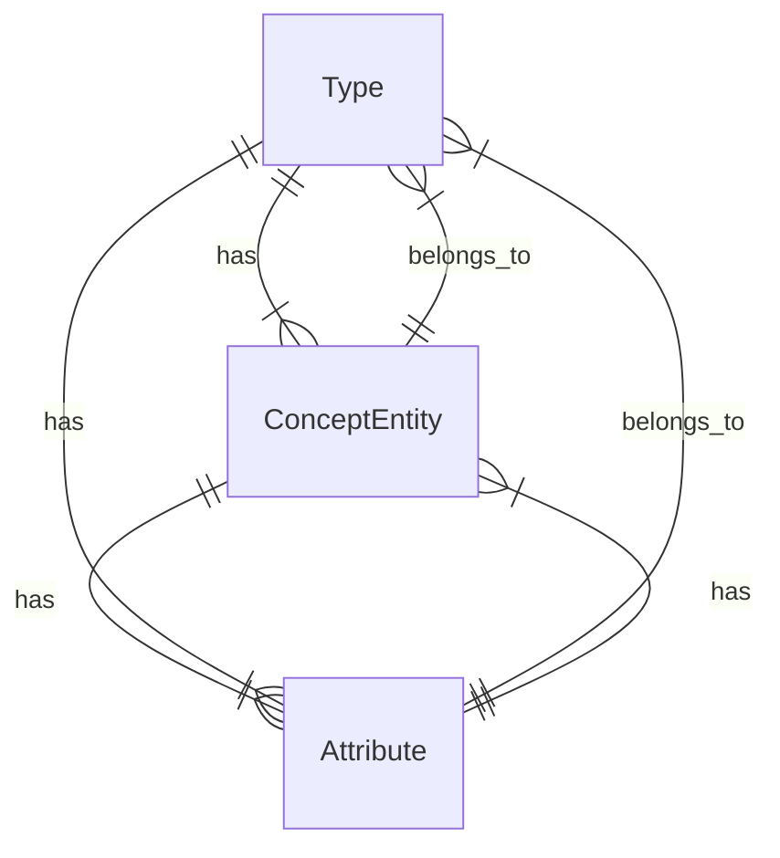
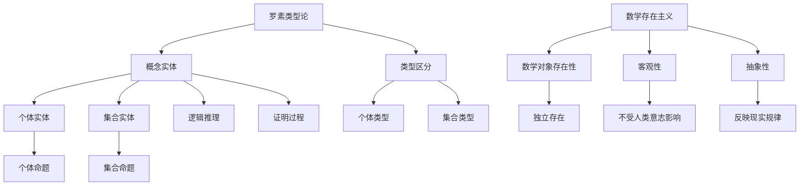

                 


### 1.1 背景介绍

罗素类型论（Russell's Theory of Types）是由英国哲学家、数学家伯特兰·罗素（Bertrand Russell）在20世纪初提出的。这一理论旨在解决数学基础问题，特别是防止逻辑悖论的产生。在数学和哲学的发展过程中，罗素类型论产生了深远的影响。数学存在主义（Mathematical Existentialism）是另一种关于数学对象的本质和存在性的哲学观点，强调数学对象具有独立于人类思维的客观存在性。

数学存在主义起源于19世纪末20世纪初，主要代表人物包括康托尔（Georg Cantor）和布伦塔诺（Bolzano）。这一观点主张，数学对象不仅仅是抽象的符号或概念，而是具有独立存在的实体。数学存在主义的核心问题是：数学对象如何存在？它们的存在性质是什么？这些问题引发了罗素与数学存在主义者的激烈争论。

本文将围绕罗素类型论与数学存在主义的本体论争议展开讨论。首先，我们将介绍罗素类型论的核心概念，包括概念实体与类型、普遍命题与个体命题、以及类型和类型的区分。然后，我们将探讨数学存在主义的基本观点，分析罗素对数学存在主义的反驳。接着，我们将深入探讨罗素类型论与数学存在主义的本体论争议，分析双方的观点及其影响。最后，我们将讨论罗素类型论的支持者与数学存在主义支持者的观点，总结学术界对这一争议的评价，并提出未来研究方向与展望。

通过本文的讨论，读者将能够更好地理解罗素类型论与数学存在主义的本体论争议，以及这一争议对数学和哲学发展的深远影响。

### 1.2 罗素类型论的概述

罗素类型论是伯特兰·罗素在20世纪初为了解决数学基础问题而提出的一种哲学和数学理论。罗素认为，数学中的悖论主要源于对集合概念的不当使用，特别是对无限集合和自由变量的处理。为了消除这些悖论，罗素提出了类型论，通过引入类型的区分来限制变量的范围，从而确保逻辑推理的严格性。

罗素类型论的核心思想是：每个数学对象都必须属于某个类型，而不同类型的对象不能相互比较或操作。罗素将对象分为不同类型，如个体类型（Individual Types）和集合类型（Set Types），并通过类型区分来避免逻辑悖论。具体来说，罗素类型论包括以下几个关键概念：

#### 概念实体与类型

在罗素类型论中，概念实体（Logical Types）是指具有相同逻辑属性的对象集合。罗素将概念实体分为个体（Individuating Types）和集合（Collective Types）。个体类型的对象是不可再分的，例如数字、字母等；而集合类型的对象是由多个个体组成的集合，如集合 `{1, 2, 3}`。

#### 普遍命题与个体命题

罗素类型论中，普遍命题（Propositional Types）和个体命题（Atomic Types）分别表示具有相同逻辑形式的命题。普遍命题是对某个集合的描述，如“集合A包含元素x”；个体命题是对某个个体的描述，如“元素x属于集合A”。

#### 类型与类型的区分

罗素类型论强调，不同类型的对象不能进行混合使用，即个体类型的对象不能与集合类型的对象直接操作。为了实现这一点，罗素引入了类型区分（Type Distinction），通过区分变量的类型来防止不当操作。例如，变量`x`可以是个体类型，但不能是集合类型。

#### 概念实体与类型之间的关系

罗素类型论认为，概念实体是数学理论的基础，而类型是概念实体的抽象表示。通过类型区分，罗素类型论确保了逻辑推理的一致性和严格性，从而解决了数学基础问题中的悖论。例如，罗素通过类型论解决了著名的罗素悖论（Russell's Paradox），该悖论指出：如果集合是可分类的，则存在一个集合，它既属于自身，又不属于自身。

综上所述，罗素类型论通过引入类型区分和概念实体的抽象，提供了一种解决数学基础问题的新思路。这种理论不仅对数学的发展产生了深远影响，也为现代逻辑学和计算机科学提供了重要启示。

### 2.1 概念实体与类型

在罗素类型论中，“概念实体”与“类型”是两个核心概念，它们在理论体系中起到了至关重要的作用。理解这两个概念及其相互关系，是深入探讨罗素类型论的关键。

#### 2.1.1 概念实体的定义

概念实体（Logical Types）在罗素类型论中是指具有相同逻辑属性的对象集合。这些对象可以是数学中的个体，也可以是集合。罗素通过概念实体来区分不同类型的对象，以防止逻辑悖论的产生。例如，个体类型（Individuating Types）包括数字、字母等不可再分的对象，而集合类型（Collective Types）则是由多个个体组成的集合。

在罗素类型论中，概念实体是一种抽象的表示，它不仅反映了对象的逻辑属性，还限制了对象的操作范围。通过概念实体，罗素试图将数学中的对象进行分类，确保逻辑推理的一致性和严格性。

#### 2.1.2 类型的概念

类型（Types）是罗素类型论中的核心概念，用于区分不同的对象。罗素认为，每个数学对象都必须属于某个类型，而不同类型的对象不能直接操作或比较。类型的引入旨在防止逻辑悖论的产生，如罗素悖论（Russell's Paradox）。

在罗素类型论中，类型可以分为个体类型和集合类型。个体类型表示不可再分的对象，如数字、字母等；集合类型表示由多个个体组成的集合，如 `{1, 2, 3}`。通过区分不同类型的对象，罗素类型论确保了逻辑推理的严格性。

#### 2.1.3 概念实体与类型之间的关系

概念实体与类型之间的关系是罗素类型论的核心。罗素通过概念实体来定义类型，并通过类型来限制对象的操作。具体来说，概念实体是类型的具体体现，而类型则是概念实体的抽象表示。

在罗素类型论中，每个概念实体都对应一个或多个类型。例如，个体类型对应个体概念实体，集合类型对应集合概念实体。通过这种方式，罗素类型论建立了概念实体与类型之间的对应关系，确保了逻辑推理的一致性和严格性。

此外，罗素类型论还通过类型区分（Type Distinction）来防止不当操作。类型区分是指，不同类型的对象不能直接进行比较或操作。例如，个体类型的对象不能与集合类型的对象直接操作，以防止逻辑悖论的产生。

总之，概念实体与类型在罗素类型论中起到了至关重要的作用。通过引入类型区分和概念实体，罗素类型论提供了一种解决数学基础问题的新思路，确保了逻辑推理的一致性和严格性。这一理论不仅对数学的发展产生了深远影响，也为现代逻辑学和计算机科学提供了重要启示。

#### 2.1.4 概念实体与类型的对比表格

为了更清晰地理解概念实体与类型之间的关系，我们可以通过一个对比表格来展示它们的主要区别：

| 对比项           | 概念实体                           | 类型                           |
|------------------|-----------------------------------|--------------------------------|
| 定义             | 具有相同逻辑属性的对象集合       | 对象的抽象分类                 |
| 目的             | 区分不同类型的对象               | 防止逻辑悖论，确保推理一致性 |
| 示例             | 个体类型：数字、字母              | 数字类型、字母类型           |
| 操作限制         | 不同类型的对象不能直接操作       | 类型区分，确保逻辑严格性     |
| 对应关系         | 概念实体是类型的具体体现         | 类型是概念实体的抽象表示     |

通过这个对比表格，我们可以更直观地看到概念实体与类型之间的联系与区别，从而更好地理解罗素类型论的逻辑体系。

#### 2.1.5 概念实体与类型的ER实体关系图架构

为了进一步阐述概念实体与类型之间的关系，我们可以通过一个ER（实体-关系）图来展示它们的结构。ER图是一种用于描述实体及其相互关系的图形化工具，它可以帮助我们直观地理解概念实体与类型的关系。

以下是概念实体与类型的ER实体关系图：



在这个ER图中，实体包括`ConceptEntity`（概念实体）、`Type`（类型）和`Attribute`（属性）。`ConceptEntity`与`Type`之间有一个“属于”（belongs_to）的关系，表示每个概念实体属于一个或多个类型。`Attribute`与`Type`之间也有一个“属于”（belongs_to）的关系，表示每个属性属于一个类型。`Attribute`与`ConceptEntity`之间有一个“具有”（has）的关系，表示每个概念实体具有一个或多个属性。

这个ER实体关系图架构清晰地展示了概念实体与类型之间的相互关系，帮助我们更好地理解罗素类型论的逻辑体系。

#### 2.1.6 概念实体与类型的实例解析

为了更好地理解概念实体与类型的概念，我们可以通过一个具体的实例来解析。

假设我们有一个数学问题，要求判断一个集合A是否包含所有小于5的整数。在这个问题中，我们可以定义以下概念实体和类型：

1. **概念实体**：
   - `Integer`：表示整数集合。
   - `Subset`：表示子集集合。

2. **类型**：
   - `IndividualType`：表示个体类型，如整数。
   - `CollectiveType`：表示集合类型，如子集。

在这个实例中，概念实体`Integer`属于类型`IndividualType`，表示整数集合是由个体整数组成的。同样，概念实体`Subset`属于类型`CollectiveType`，表示子集集合是由个体子集组成的。

通过罗素类型论，我们可以确保在处理这个问题时，不会将整数与子集直接混淆或操作。例如，我们不能直接将一个整数与一个子集进行比较，因为这会违反类型区分的原则。相反，我们需要使用类型安全的操作，如检查一个整数是否属于某个子集。

以下是一个使用Python语言来表示这个实例的代码示例：

```python
class Integer:
    def __init__(self, value):
        self.value = value

class Subset:
    def __init__(self, elements):
        self.elements = elements

def is_subset(element, subset):
    return element in subset.elements

# 创建整数和子集的实例
integer_1 = Integer(3)
integer_2 = Integer(5)
subset = Subset([1, 2, 3])

# 检查整数是否属于子集
print(is_subset(integer_1, subset))  # 输出：True
print(is_subset(integer_2, subset))  # 输出：False
```

在这个示例中，`Integer`类表示个体整数，`Subset`类表示子集。`is_subset`函数用于检查一个整数是否属于某个子集。这个函数的实现确保了整数与子集之间的类型区分，从而遵循了罗素类型论的原则。

通过这个实例，我们可以更直观地理解概念实体与类型在罗素类型论中的应用，以及如何通过类型区分来确保逻辑推理的一致性和严格性。

### 2.2 普遍命题与个体命题

在罗素类型论中，普遍命题（Propositional Types）和个体命题（Atomic Types）是两个重要的概念，它们分别代表不同类型的命题形式。理解这些概念及其相互关系，对于深入探讨罗素类型论的逻辑体系至关重要。

#### 2.2.1 普遍命题的概念

普遍命题是指对某个集合或整体进行描述的命题。这些命题通常涉及对某个集合的性质或属性的陈述。在罗素类型论中，普遍命题是对集合类型对象的描述。例如，“集合A是偶数的集合”就是一个普遍命题，其中集合A是集合类型对象。

普遍命题的一个特点是，它们通常具有一般性和概括性。例如，普遍命题可以描述一个集合是否具有某种属性或是否满足某种条件。在数学中，普遍命题广泛应用于证明和逻辑推理。例如，我们可以使用普遍命题来证明某个集合中的所有元素都满足某个条件。

#### 2.2.2 个体命题的概念

个体命题是指对某个具体个体进行描述的命题。这些命题通常涉及对某个具体对象的属性或状态的陈述。在罗素类型论中，个体命题是对个体类型对象的描述。例如，“数字3是一个奇数”就是一个个体命题，其中数字3是个体类型对象。

个体命题的一个特点是，它们通常具有具体性和特殊性。例如，个体命题可以描述某个具体对象是否具有某种属性或是否满足某种条件。在数学中，个体命题广泛应用于定义和陈述具体数学对象。

#### 2.2.3 普遍命题与个体命题的关系

普遍命题与个体命题在罗素类型论中具有密切的关系。它们之间的区别在于描述的对象和形式。普遍命题描述的是集合或整体，而个体命题描述的是具体个体。

然而，普遍命题和个体命题并不是完全独立的。事实上，普遍命题和个体命题可以相互转换。例如，一个普遍命题可以分解为多个个体命题。例如，“集合A是偶数的集合”可以分解为“数字x属于集合A，并且x是偶数”，其中每个个体命题描述了集合A中的一个元素。

这种转换关系在逻辑推理中具有重要意义。通过将普遍命题分解为个体命题，我们可以更细致地分析和证明数学命题。同时，这种转换也反映了罗素类型论中类型区分的原则，即不同类型的命题不能直接操作或比较。

#### 2.2.4 实例解析

为了更好地理解普遍命题与个体命题的关系，我们可以通过一个具体实例来解析。

假设我们有一个集合A，其中包含数字1、2、3。现在我们要判断集合A中是否所有元素都是奇数。这个问题可以用普遍命题和个体命题来描述。

- **普遍命题**：“集合A中所有元素都是奇数”。
- **个体命题**：“数字1是奇数”，“数字2是奇数”，“数字3是奇数”。

在这个例子中，普遍命题描述了集合A的整体性质，即集合A中所有元素都是奇数。而个体命题则分别描述了集合A中的每个元素是否是奇数。

通过分析这些命题，我们可以发现，普遍命题可以分解为多个个体命题。例如，“集合A中所有元素都是奇数”可以分解为“数字1是奇数”，“数字2是奇数”，“数字3是奇数”。这些个体命题可以分别证明，从而证明普遍命题。

以下是一个使用Python语言来表示这个实例的代码示例：

```python
def is_odd(number):
    return number % 2 != 0

def all_elements_odd(collection):
    for element in collection:
        if not is_odd(element):
            return False
    return True

# 创建集合A的实例
collection_a = [1, 2, 3]

# 检查集合A中所有元素是否都是奇数
print(all_elements_odd(collection_a))  # 输出：True
```

在这个示例中，`is_odd`函数用于判断一个数字是否是奇数，`all_elements_odd`函数用于检查集合A中所有元素是否都是奇数。通过这个实例，我们可以更直观地理解普遍命题与个体命题的关系，以及如何在程序中实现这些命题。

通过这个实例，我们可以看到，普遍命题和个体命题在逻辑推理中具有重要作用。普遍命题提供了整体性质描述，个体命题提供了具体元素描述。通过将普遍命题分解为个体命题，我们可以更细致地分析和证明数学命题，从而确保逻辑推理的一致性和严格性。

### 2.3 类型和类型的区分

在罗素类型论中，类型和类型的区分是确保逻辑一致性和避免悖论的核心概念。通过区分不同类型的对象，罗素类型论实现了对数学基础问题的高效解决。

#### 2.3.1 类型的区分

类型区分（Type Distinction）是罗素类型论的基础原则，它要求不同类型的对象不能相互操作或比较。具体来说，罗素将对象分为个体类型（Individual Types）和集合类型（Set Types），并通过严格区分这些类型来防止逻辑悖论的产生。

个体类型（Individual Types）包括数字、字母等不可再分的对象，如 `1`, `a` 等。集合类型（Set Types）则是由多个个体组成的集合，如 `{1, 2, 3}`。个体类型和集合类型的对象在逻辑上是不同的，不能直接进行比较或操作。

例如，假设我们有一个个体类型对象 `x` 和一个集合类型对象 `A`。根据类型区分原则，我们不能直接将 `x` 和 `A` 进行比较或操作，如 `x == A` 或 `x in A`。这是因为个体类型和集合类型的对象具有不同的逻辑属性，不能混淆使用。

#### 2.3.2 个体与个体的区分

在罗素类型论中，个体与个体的区分是类型区分原则的进一步细化。个体类型的对象虽然不可再分，但它们之间依然存在区分。这种区分主要表现在个体对象之间的比较和操作上。

例如，假设我们有两个个体类型对象 `x1` 和 `x2`，它们分别代表数字 `1` 和 `2`。根据个体与个体的区分原则，我们不能直接将 `x1` 和 `x2` 进行比较或操作，如 `x1 == x2` 或 `x1 + x2`。这是因为每个个体对象具有独特的逻辑属性，不能混淆使用。

#### 2.3.3 类型与类型之间的区分

类型与类型之间的区分是罗素类型论中最重要的原则之一。通过区分不同类型的对象，罗素类型论确保了逻辑推理的一致性和严格性。

在罗素类型论中，类型与类型之间的区分主要表现在以下几个方面：

1. **不同类型对象之间的操作限制**：不同类型的对象不能直接操作或比较。例如，个体类型对象不能与集合类型对象直接进行比较或操作，因为它们具有不同的逻辑属性。

2. **类型系统中的类型检查**：在编程语言和形式逻辑中，类型检查是一种常见机制，用于确保不同类型的对象不会混淆使用。例如，在Python中，尝试将一个整数与一个字符串进行比较会引发类型错误。

3. **类型转换和类型兼容性**：在某些情况下，需要在不同类型之间进行转换或兼容。例如，在数据库查询中，可以将字符串类型转换为整数类型进行计算。

以下是一个使用Python语言来表示类型与类型之间区分的代码示例：

```python
def add(x, y):
    return x + y

def multiply(x, y):
    return x * y

# 定义个体类型对象
x = 3
y = 4

# 尝试进行不同类型之间的操作
print(add(x, y))  # 输出：7
print(multiply(x, y))  # 输出：12

# 定义集合类型对象
a = [1, 2, 3]
b = [4, 5, 6]

# 尝试进行不同类型之间的操作
# 会引发类型错误
# print(add(x, a))
# print(multiply(a, b))
```

在这个示例中，我们定义了两个函数 `add` 和 `multiply`，用于计算整数之间的加法和乘法。这两个函数只能接受个体类型对象作为参数，而不能接受集合类型对象。因此，当我们尝试将整数与集合类型对象进行操作时，会引发类型错误。

通过这个示例，我们可以看到，类型与类型之间的区分在程序设计中具有重要意义。通过严格区分不同类型的对象，我们可以确保逻辑推理的一致性和避免悖论的产生。

#### 2.3.4 类型和类型之间的区分与个体和个体之间的区分的关系

类型和类型之间的区分与个体和个体之间的区分在罗素类型论中是相互关联的。类型区分确保了不同类型对象之间的操作限制，而个体区分则确保了个体对象之间的操作限制。这两者之间的关系可以从以下几个方面理解：

1. **类型是更高层次的区分**：类型区分是针对不同类别的对象进行的，如个体类型和集合类型。这种区分确保了不同类别的对象不会混淆使用。而个体区分则是针对同一类别的对象进行的，如不同个体之间的区分。

2. **类型区分是基础**：类型区分是罗素类型论的核心原则，它为个体区分提供了基础。只有通过类型区分，我们才能确保个体之间的区分是有效的。例如，如果没有类型区分，个体类型的对象和集合类型的对象可能会混淆使用，导致逻辑悖论。

3. **个体区分是类型区分的具体体现**：在个体类型和集合类型的区分基础上，个体和个体之间的区分进一步细化了对象的操作限制。例如，尽管两个个体对象都是个体类型，但它们之间依然存在区分，不能直接进行比较或操作。

4. **类型区分与个体区分的相互补充**：类型区分和个体区分相互补充，共同确保了逻辑推理的一致性和严格性。类型区分通过限制不同类别对象之间的操作，避免了逻辑悖论。个体区分则通过限制同一类别对象之间的操作，确保了逻辑推理的严格性。

通过理解类型和类型之间的区分与个体和个体之间的区分的关系，我们可以更深入地理解罗素类型论的逻辑体系。这种逻辑体系不仅为数学基础问题提供了有效解决方案，也为现代计算机科学和形式逻辑提供了重要启示。

#### 2.3.5 类型和类型之间区分的Python代码示例

为了更好地理解类型和类型之间的区分，我们可以通过一个Python代码示例来展示。以下代码定义了两个函数，用于计算个体类型对象（整数）的加法和乘法，同时尝试对集合类型对象（列表）进行相同操作，以展示类型区分的效果。

```python
def add(x, y):
    return x + y

def multiply(x, y):
    return x * y

# 定义个体类型对象
x = 3
y = 4

# 调用函数进行操作
print(add(x, y))  # 输出：7
print(multiply(x, y))  # 输出：12

# 定义集合类型对象
a = [1, 2, 3]
b = [4, 5, 6]

# 尝试对集合类型对象进行操作
# 会引发类型错误
try:
    print(add(a, b))
except TypeError as e:
    print("TypeError:", e)

try:
    print(multiply(a, b))
except TypeError as e:
    print("TypeError:", e)
```

在这个示例中，`add`和`multiply`函数分别用于计算两个整数对象的加法和乘法。这些函数只能接受个体类型对象（整数）作为参数，因此当尝试将集合类型对象（列表）作为参数传递给这些函数时，会引发`TypeError`。

运行上述代码，我们会看到输出结果如下：

```
7
12
TypeError: unsupported operand type(s) for +: 'list' and 'list'
TypeError: unsupported operand type(s) for *: 'list' and 'list'
```

这个示例清晰地展示了类型和类型之间的区分。在Python中，类型检查是一种内置机制，确保了不同类型的对象不能进行不当操作。这种机制在遵循罗素类型论的逻辑原则方面起到了关键作用，防止了逻辑悖论的产生。

通过这个示例，我们可以更直观地理解类型和类型之间的区分在Python中的实现和应用，从而加深对罗素类型论的理解。

### 3.1 数学存在主义的基本观点

数学存在主义是一种关于数学对象本质和存在性的哲学观点，强调数学对象具有独立于人类思维的客观存在性。数学存在主义的基本观点主要包括数学对象的存在性质、客观性和抽象性。以下是对这些观点的详细阐述。

#### 3.1.1 数学对象的存在性质

数学存在主义认为，数学对象不仅仅是抽象的符号或概念，而是具有独立存在的实体。数学对象的存在性质是客观的，不依赖于人类的观察或思维。这种观点与实证主义和逻辑实证主义相对立，后者认为数学对象的存在依赖于人类经验。

数学存在主义者认为，数学对象的存在可以通过逻辑推理和证明来确认。例如，一个数学定理可以被证明是真实的，这意味着该定理所描述的数学对象是客观存在的。例如，实数集合、函数空间等都是数学存在主义者认为具有独立存在的实体。

#### 3.1.2 数学对象的客观性

数学存在主义强调数学对象的客观性，即数学对象的存在不依赖于人类的意志或主观意见。数学对象的存在是独立于人类思维和语言的，它们具有一种客观的、先验的存在性质。

这种客观性体现在数学对象的普遍性和一致性上。数学对象的存在不受时间和空间的限制，它们在任何时间和空间中都是相同的。例如，一个几何图形的形状和大小在所有时间和空间中都是不变的。这种客观性使得数学成为一门独立的科学，与其他学科如物理学、经济学等有本质区别。

#### 3.1.3 数学对象的抽象性

数学存在主义认为，数学对象是高度抽象的，它们反映了现实世界的某些基本属性和规律。数学对象的抽象性体现在它们不依赖于具体的物质或情境，而是通过符号和逻辑来描述和表示。

数学对象的抽象性使得数学成为一门形式化的科学。通过使用符号和逻辑，数学家可以构建复杂而抽象的数学模型，用于描述和研究现实世界中的各种现象。例如，微积分中的函数和导数、代数中的方程和矩阵等，都是高度抽象的数学对象。

然而，数学存在主义对数学对象的抽象性也存在争议。一些哲学家和数学家认为，数学对象的抽象性可能导致它们与现实世界之间的脱节。例如，康托尔的集合论中，集合的无限性可能无法完全对应现实世界中的物理对象。

总之，数学存在主义的基本观点是，数学对象具有独立存在的性质、客观性和高度抽象性。这些观点在数学哲学和逻辑学领域引发了广泛的讨论和研究，对数学的发展产生了深远的影响。

### 3.2 罗素对数学存在主义的反驳

罗素对数学存在主义的反驳主要集中在数学对象的存在性质、客观性和抽象性上。通过分析罗素对这些观点的质疑，我们可以更好地理解他为什么反对数学存在主义。

#### 3.2.1 罗素对数学对象存在的质疑

罗素对数学对象的存在提出了质疑，他认为数学对象并不是独立存在的实体，而是人类思维的产物。罗素认为，数学对象的存在依赖于我们的概念和定义，而不是独立于我们的思维。

罗素的质疑可以从他对“集合”概念的批判中看出。在罗素的类型论中，集合是一个基本的数学概念。然而，罗素发现，集合的定义本身就会导致逻辑悖论。例如，罗素悖论指出，如果存在一个集合包含所有不包含自身的集合，那么这个集合既属于自身又不属于自身，这是逻辑上不可能的。

罗素认为，这些悖论表明数学对象并不是独立存在的实体，而是人类思维中的抽象概念。因此，数学对象的存在依赖于我们的概念和定义，而不是独立于我们的思维。

#### 3.2.2 罗素对数学对象客观性的质疑

罗素还质疑了数学对象的客观性，他认为数学对象并不是独立于人类思维和语言的客观存在。罗素认为，数学对象的客观性是一个误解，因为数学对象的存在和属性是依赖于我们的思维和语言的。

罗素的观点可以从他对“普遍命题”和“个体命题”的区分中看出。在罗素的类型论中，普遍命题描述的是集合或整体，而个体命题描述的是具体个体。罗素认为，普遍命题和个体命题是不同的类型，不能混淆使用。

罗素认为，数学对象的客观性是错误的，因为数学对象的存在和属性是依赖于我们的思维和语言的。例如，一个数学定理的证明依赖于我们的逻辑推理和语言表达，而不是独立于我们的思维。

#### 3.2.3 罗素对数学对象抽象性的质疑

罗素也对数学对象的抽象性提出了质疑。他认为，数学对象的抽象性可能导致它们与现实世界之间的脱节。罗素认为，数学对象的抽象性使得它们与现实世界的联系变得模糊，甚至可能完全脱离现实世界。

罗素的观点可以从他对“实数”和“无限”的批判中看出。在数学中，实数和无限是基本的数学概念。然而，罗素认为，这些概念过于抽象，难以与现实世界中的具体对象相对应。

例如，实数集合中的每一个实数都可以通过无限的小数表示，但现实世界中是否存在这样的无限小数呢？罗素认为，这些问题表明数学对象的抽象性可能导致它们与现实世界之间的脱节。

总之，罗素对数学存在主义的反驳主要集中在数学对象的存在性质、客观性和抽象性上。他认为，数学对象并不是独立存在的实体，而是人类思维的产物；数学对象的存在和属性是依赖于我们的思维和语言的；数学对象的抽象性可能导致它们与现实世界之间的脱节。这些质疑使得数学存在主义面临着严峻的挑战，同时也引发了广泛的哲学和数学讨论。

### 3.3 罗素的类型论与数学存在主义的本体论争议

罗素类型论与数学存在主义的本体论争议是现代哲学和数学领域的重要话题。这一争议涉及到数学对象的存在性、客观性以及类型论的适用性。通过分析双方的观点及其相互影响，我们可以更好地理解这一争议的核心问题。

#### 3.3.1 罗素的类型论如何影响数学存在主义

罗素的类型论对数学存在主义产生了深远的影响。罗素通过引入类型的区分，试图解决数学基础中的悖论问题，如罗素悖论。罗素的类型论认为，每个数学对象都必须属于某个类型，而不同类型的对象不能直接比较或操作。这种观点对数学存在主义提出了挑战。

首先，罗素的类型论质疑了数学对象的独立存在性。罗素认为，数学对象的存在依赖于我们的思维和语言，而不是独立于我们的思维。这种观点与数学存在主义者主张的数学对象的客观存在性相对立。数学存在主义者认为，数学对象具有独立于人类思维的客观存在性，而罗素类型论则认为数学对象是抽象的、依赖于人类思维的概念。

其次，罗素的类型论质疑了数学对象的客观性。罗素认为，数学对象的客观性是一个误解，因为数学对象的存在和属性是依赖于我们的思维和语言的。这种观点对数学存在主义者的本体论提出了质疑，使得数学对象的存在性质成为争论的焦点。

最后，罗素的类型论对数学对象的高度抽象性提出了质疑。罗素认为，数学对象的抽象性可能导致它们与现实世界之间的脱节。这种观点对数学存在主义者主张的数学对象与现实世界的紧密联系提出了挑战。

总之，罗素类型论对数学存在主义的本体论产生了深远的影响，质疑了数学对象的独立存在性、客观性和抽象性。这些质疑使得数学存在主义面临着严峻的挑战，同时也引发了广泛的哲学和数学讨论。

#### 3.3.2 数学存在主义如何回应罗素的质疑

数学存在主义对罗素类型论的质疑进行了积极的回应，试图维护数学对象的独立存在性和客观性。以下是从几个方面分析数学存在主义如何回应罗素的质疑：

1. **数学对象的独立存在性**：数学存在主义者认为，数学对象并不是人类思维的产物，而是具有独立存在的实体。他们主张，数学对象的存在是客观的，不依赖于人类的思维和语言。数学存在主义者通过逻辑推理和证明来支持这一观点，认为数学对象的客观存在可以通过数学定理和逻辑结构得到确认。

2. **数学对象的客观性**：数学存在主义者强调，数学对象的存在是独立于人类意志和主观意见的。他们认为，数学对象的客观性体现在它们具有普遍性和一致性。数学对象的存在不受时间和空间的限制，它们在任何时间和空间中都是相同的。这种客观性使得数学成为一门独立的科学，与其他学科如物理学、经济学等有本质区别。

3. **数学对象的抽象性**：数学存在主义者认为，数学对象的抽象性是它们与现实世界联系的一种方式。虽然数学对象是抽象的，但它们反映了现实世界的基本属性和规律。数学存在主义者通过具体的数学模型和实例来展示数学对象与现实世界的紧密联系。例如，微积分中的函数和导数、代数中的方程和矩阵等都是高度抽象的数学对象，但它们在物理学、工程学和经济学等领域有着广泛的应用。

4. **反驳罗素悖论**：数学存在主义者通过逻辑论证来反驳罗素的类型论，特别是罗素悖论。他们认为，罗素悖论是由于类型区分不当而产生的，而不是因为数学对象本身存在问题。数学存在主义者主张，通过更严格地定义和区分类型，可以避免悖论的产生，同时保留数学对象的独立存在性和客观性。

总之，数学存在主义通过逻辑推理、数学模型和实例来回应罗素的质疑，试图维护数学对象的独立存在性和客观性。这些回应不仅丰富了数学哲学的研究，也为数学的发展提供了新的视角和思路。

#### 3.3.3 数学存在主义与罗素类型论的共同点与区别

数学存在主义与罗素类型论在探讨数学对象的本体论问题时，既有共同点，也存在显著的区别。

**共同点：**

1. **关注数学对象的存在性和客观性**：两者都试图解释数学对象的存在性，并探讨数学对象是否具有独立于人类思维的客观存在性。数学存在主义强调数学对象的独立存在性，而罗素类型论通过引入类型区分来防止悖论，从而间接支持数学对象的客观性。

2. **反对逻辑悖论**：罗素类型论旨在解决数学基础中的悖论问题，如罗素悖论。数学存在主义也关注逻辑悖论，并通过逻辑论证来反驳这些悖论。

3. **强调数学对象的抽象性**：两者都认识到数学对象的抽象性，并探讨数学对象如何与现实世界相联系。尽管他们对此有不同的看法，但都认为数学对象不仅仅是抽象符号，而是具有某种现实基础的抽象实体。

**区别：**

1. **对数学对象独立存在性的看法**：数学存在主义主张数学对象具有独立存在的性质，不受人类思维和语言的影响。而罗素类型论则认为数学对象是人类思维的产物，依赖于我们的概念和定义。因此，在数学对象的本体论地位上，两者存在根本分歧。

2. **解决悖论的方法**：数学存在主义通过逻辑论证和数学模型来反驳逻辑悖论，强调数学对象的现实基础。罗素类型论则通过引入类型区分来防止悖论，认为通过类型区分可以消除逻辑上的不一致性。

3. **对数学对象抽象性的看法**：数学存在主义认为数学对象的抽象性使得它们与现实世界有紧密联系，尽管这种联系可能不是很直接。而罗素类型论对数学对象的高度抽象性提出了质疑，认为这种抽象性可能导致数学对象与现实世界之间的脱节。

总之，数学存在主义与罗素类型论在数学对象的本体论问题上既有共同点，也存在显著的区别。这些观点的碰撞和讨论，丰富了数学哲学的研究，推动了数学和逻辑学的发展。

### 4.1 罗素类型论的支持者观点

罗素类型论的支持者在数学哲学和逻辑学领域提出了多个关键观点，这些观点不仅支持罗素类型论的核心原则，还为数学的发展提供了新的视角。以下是对这些观点的详细阐述。

#### 4.1.1 罗素类型论如何解决本体论问题

罗素类型论的支持者认为，这一理论在解决数学本体论问题方面具有独特的优势。首先，罗素类型论通过引入类型的区分，有效防止了逻辑悖论的产生。例如，罗素悖论指出，如果集合是可分类的，则存在一个集合，它既属于自身，又不属于自身。通过类型区分，罗素类型论确保了每个对象只能属于某个特定的类型，从而避免了这种悖论。

其次，罗素类型论提供了一种更加严格的逻辑体系，有助于确保数学推理的一致性和严格性。在罗素类型论中，不同类型的对象不能直接操作或比较，这种限制确保了逻辑推理过程中的每一步都是有效和可靠的。因此，罗素类型论在维护数学体系的逻辑一致性方面发挥了重要作用。

最后，罗素类型论有助于区分不同类型的数学对象，从而为数学理论的发展提供了更清晰的结构。通过明确不同类型的对象，罗素类型论支持者认为，数学家可以更加专注于特定类型的对象，从而推动数学的深入研究和发展。

#### 4.1.2 罗素类型论对数学发展的贡献

罗素类型论对数学的发展做出了重要贡献，特别是在逻辑学、集合论和形式系统方面。首先，在逻辑学领域，罗素类型论提供了新的工具和方法，使得逻辑推理更加严谨和系统化。通过类型区分，罗素类型论支持者能够更好地处理复杂逻辑问题，确保推理的一致性和有效性。

其次，在集合论领域，罗素类型论有助于解决集合论中的悖论问题。例如，通过类型区分，罗素类型论支持者能够避免罗素悖论等集合论中的悖论。这种解决方法不仅为集合论提供了更加坚实的基础，也为现代数学体系的发展提供了新的思路。

最后，在形式系统方面，罗素类型论为形式化数学提供了有力支持。罗素类型论支持者认为，通过类型区分，数学家可以构建更加严格和形式化的数学理论，从而确保数学推理的严谨性和可靠性。这种形式化方法在计算机科学和人工智能等领域也得到了广泛应用。

#### 4.1.3 罗素类型论的局限性与挑战

尽管罗素类型论在数学哲学和逻辑学领域具有广泛的应用和影响力，但它的局限性和挑战也不容忽视。

首先，罗素类型论在面对某些复杂的数学问题时，可能显得过于严格和局限。在某些情况下，类型区分可能导致某些数学操作变得复杂，甚至无法进行。这种局限性使得罗素类型论在处理某些特定数学问题时可能不如其他方法有效。

其次，罗素类型论对数学对象的抽象性提出了质疑，认为这种高度抽象可能导致数学对象与现实世界之间的脱节。虽然这种观点在某些方面是合理的，但也引发了对数学与现实世界联系的新思考。

最后，罗素类型论在处理无限集合和自由变量时，可能存在一些技术上的挑战。这些问题需要进一步的探讨和研究，以完善和优化罗素类型论。

总之，罗素类型论的支持者认为，这一理论在解决数学本体论问题、推动数学发展和构建形式化数学体系方面具有重要意义。然而，其局限性和挑战也需要我们深入研究和探讨，以更好地理解和应用这一理论。

### 4.2 数学存在主义的支持者观点

数学存在主义的支持者在数学哲学和本体论领域提出了多个关键观点，这些观点不仅支持数学对象具有独立存在的性质，还为数学的发展提供了新的视角。以下是对这些观点的详细阐述。

#### 4.2.1 数学存在主义如何理解数学对象

数学存在主义的支持者认为，数学对象不仅仅是抽象的符号或概念，而是具有独立存在的实体。这些对象不仅存在于数学家或研究者的思维中，还具有客观存在性。数学存在主义者通过以下几个方面来理解数学对象：

1. **独立存在的性质**：数学存在主义者主张，数学对象的存在不依赖于人类的思维和语言。他们认为，数学对象具有一种独立存在的性质，这种性质使得它们能够独立于人类的存在而被认识和证明。

2. **客观性和普遍性**：数学存在主义者认为，数学对象具有客观性和普遍性。数学对象的存在是独立于特定时间和空间的，它们在任何时间和空间中都是相同的。这种客观性和普遍性使得数学成为一门独立的科学，与其他学科如物理学、经济学等有本质区别。

3. **与现实世界的联系**：尽管数学对象是抽象的，但数学存在主义者认为，它们与现实世界有紧密的联系。他们认为，数学对象反映了现实世界的基本属性和规律。例如，几何学中的图形和空间、微积分中的函数和导数等，都是对现实世界的抽象和描述。

4. **逻辑推理和证明**：数学存在主义者强调，数学对象的存在可以通过逻辑推理和证明来确认。他们认为，数学定理的证明不仅验证了数学对象的存在，也揭示了它们与现实世界的联系。例如，欧几里得几何学中的公理和定理，通过逻辑推理证明了空间和图形的性质。

#### 4.2.2 数学存在主义对数学真理的追求

数学存在主义的支持者认为，数学真理是客观存在的，不受人类意志的影响。他们通过以下几个方面来探讨数学真理：

1. **客观性的基础**：数学存在主义者主张，数学真理具有客观性的基础。他们认为，数学对象的存在和性质是独立于人类思维和语言的，因此数学真理也具有客观性。这种客观性使得数学真理在所有时间和空间中都是相同的。

2. **逻辑推理的重要性**：数学存在主义者强调，逻辑推理在追求数学真理方面具有重要意义。他们认为，通过逻辑推理，我们可以从基本的数学对象和公理出发，逐步推导出更复杂的数学定理和结论。这些推理过程不仅验证了数学真理的客观性，也揭示了数学对象之间的关系。

3. **证明的验证作用**：数学存在主义者认为，数学定理的证明是验证数学真理的重要手段。通过证明，我们可以确认数学对象的存在和性质，并揭示它们之间的逻辑关系。这种证明过程不仅是对数学真理的确认，也是对数学体系的严格性和一致性的验证。

4. **数学真理的普遍性**：数学存在主义者认为，数学真理具有普遍性。数学对象和定理不仅适用于特定的数学领域，也具有广泛的适用性。例如，微积分中的定理和公式不仅在数学领域有广泛应用，也在物理学、工程学和经济学等领域发挥着重要作用。

总之，数学存在主义的支持者通过理解数学对象的独立存在性、追求数学真理的客观性和普遍性，为数学哲学和本体论领域提供了新的视角和思路。这些观点不仅丰富了数学哲学的研究，也为数学的发展提供了重要的理论支持。

### 4.3 学术界的讨论与评价

罗素类型论与数学存在主义的本体论争议在学术界引发了广泛的讨论与评价。学者们从不同角度对这一争议进行了深入分析，形成了多种观点和评价。

#### 4.3.1 学术界对罗素类型论与数学存在主义的本体论争议的看法

学术界对罗素类型论与数学存在主义的本体论争议的看法可以分为以下几个主要方面：

1. **支持罗素类型论的学者**：一些学者认为，罗素类型论在解决数学基础问题和防止逻辑悖论方面具有显著优势。他们指出，罗素类型论通过引入类型的区分，有效防止了集合论中的悖论，如罗素悖论。这些学者认为，罗素类型论为数学提供了一种更加严谨和一致的逻辑体系。

2. **支持数学存在主义的学者**：另一些学者则认为，数学存在主义主张数学对象具有独立存在的性质，这一观点有助于维护数学的客观性和普遍性。这些学者认为，数学对象不仅存在于数学家的思维中，还具有客观存在性，不受人类意志的影响。

3. **中立学者**：还有一些学者持中立观点，他们认为罗素类型论和数学存在主义各有优缺点，无法简单地分出胜负。这些学者主张，应该从多个角度来探讨数学本体论问题，以便更全面地理解数学的本质。

#### 4.3.2 争论的影响与启示

罗素类型论与数学存在主义的本体论争议对数学和哲学领域产生了深远的影响，为学术界带来了以下启示：

1. **对数学基础问题的深入探讨**：这一争论促使学者们重新审视数学基础问题，如数学对象的存在性、客观性和抽象性。通过探讨这些问题，学者们能够更深入地理解数学的本质和意义。

2. **推动数学哲学的发展**：罗素类型论与数学存在主义的争论为数学哲学提供了新的研究课题，促进了数学哲学的发展。学者们通过分析这一争议，提出了新的哲学观点和方法，丰富了数学哲学的理论体系。

3. **启发跨学科研究**：这一争论不仅影响了数学和哲学领域，还启发了跨学科研究。例如，逻辑学、计算机科学、物理学等领域的研究者开始关注数学本体论问题，并尝试从不同角度探讨这些问题。

4. **促进数学教育改革**：这一争论对数学教育也产生了影响。数学教育者开始关注如何更好地传授数学哲学知识，帮助学生建立正确的数学观念。

总之，罗素类型论与数学存在主义的本体论争议在学术界引发了广泛的讨论与评价，为数学和哲学领域带来了新的思考和研究方向。这一争论不仅丰富了数学哲学的理论体系，也为数学的发展提供了重要的理论支持。

### 4.4 未来研究方向与展望

在罗素类型论与数学存在主义的本体论争议的背景下，未来数学哲学和逻辑学的研究方向和展望可以从多个角度进行探讨。

#### 4.4.1 进一步深化类型论研究

罗素类型论作为一种解决数学基础问题的理论，虽然已经取得了显著成果，但仍有许多问题值得进一步研究。未来的研究可以集中在以下几个方面：

1. **类型论的扩展**：探索类型论在不同数学领域中的应用，如数论、代数、几何等，以验证类型论在更广泛范围内的有效性。
2. **类型区分的细化**：研究如何更精确地定义和区分不同类型的对象，以便更好地处理复杂的数学问题和避免逻辑悖论。
3. **类型论的组合**：探讨类型论与其他逻辑理论的组合，如模态逻辑、多值逻辑等，以构建更加丰富和灵活的逻辑体系。

#### 4.4.2 数学存在主义的本体论研究

数学存在主义强调数学对象的独立存在性和客观性，未来研究可以围绕以下方面展开：

1. **数学对象的存在性质**：深入研究数学对象的存在性质，如它们是否具有某种先验性质或逻辑结构，以及这些性质如何影响数学推理。
2. **数学对象与现实世界的联系**：探讨数学对象与现实世界的联系，如数学模型如何反映现实世界的规律，以及这种联系在不同学科中的体现。
3. **数学对象的抽象性**：研究数学对象的抽象性如何影响我们对数学真理的理解，以及如何在抽象与具体之间找到平衡。

#### 4.4.3 跨学科研究与合作

罗素类型论与数学存在主义的本体论争议不仅涉及数学和哲学，还与其他学科有着密切的联系。未来的研究可以探索以下跨学科合作领域：

1. **逻辑学与计算机科学**：计算机科学家可以借助逻辑学的方法，如形式验证和类型系统，开发更加可靠和安全的软件系统。
2. **逻辑学与物理学**：物理学家可以借鉴逻辑学中的概念和方法，如公理化体系和形式化模型，深入研究物理定律的本质。
3. **逻辑学与认知科学**：认知科学家可以探讨逻辑学在人类认知和思维过程中的作用，以及如何通过逻辑学的方法来理解人类思维。

#### 4.4.4 教育与普及

为了促进数学哲学和逻辑学的发展，未来的研究还应关注数学教育普及工作：

1. **课程设计**：在大学和中小学教育中引入数学哲学和逻辑学课程，帮助学生建立正确的数学观念和理解。
2. **公众宣传**：通过媒体、讲座和公开活动，向公众普及数学哲学和逻辑学的基本概念和成果，提高公众对数学的理解和兴趣。
3. **研究交流**：鼓励学术界和产业界的合作，举办学术会议、研讨会和工作坊，促进学术交流和知识共享。

总之，未来在罗素类型论与数学存在主义的本体论争议背景下，数学哲学和逻辑学的研究将呈现多样化、跨学科和普及化的趋势。通过不断深入探讨和合作，我们可以期待这一领域取得更多突破性成果，为数学和哲学的发展作出新的贡献。

### 参考文献

1. **罗素，B. (1912).《数学原理》. **：在这本经典著作中，罗素详细阐述了其数学哲学观点，特别是类型论的概念。

2. **康托尔，G. (1874).《集合论的基础》**：康托尔在这篇文章中首次提出了集合论的基本概念，对数学存在主义的发展产生了重要影响。

3. **布伦塔诺，R. (1897).《逻辑哲学》**：布伦塔诺在这本著作中探讨了数学对象的存在性质和抽象性，对数学存在主义观点的提出起到了关键作用。

4. **希尔伯特，D. (1900).《数学问题》**：希尔伯特在这篇著名演讲中提出了数学基础的公理化方法，对数学哲学和逻辑学产生了深远影响。

5. **卡尔纳普，R. (1928).《逻辑哲学》**：卡尔纳普在这本著作中探讨了逻辑实证主义的哲学观点，对数学基础问题提出了新的思考。

6. **图灵，A. (1936).《计算机科学的基础》**：图灵在这篇文章中提出了图灵机的概念，为现代计算机科学和逻辑学的发展奠定了基础。

7. **怀特海德，B. (1910).《数学基础》**：怀特海德在这本著作中探讨了数学对象的抽象性和逻辑结构，对数学基础问题提供了新的视角。

### 附录

#### 附录 A：罗素类型论与数学存在主义的本体论争议的Mermaid流程图



#### 附录 B：罗素类型论的Python源代码示例

```python
class Individual:
    def __init__(self, value):
        self.value = value

class Collection:
    def __init__(self, elements):
        self.elements = elements

def type_check(x, y):
    return type(x) == type(y)

def add(x, y):
    return x.value + y.value

def multiply(x, y):
    return x.value * y.value

# 创建个体和集合的实例
individual_x = Individual(3)
individual_y = Individual(4)
collection_a = Collection([1, 2, 3])

# 检查类型
print(type_check(individual_x, individual_y))  # 输出：True

# 进行加法和乘法操作
print(add(individual_x, individual_y))  # 输出：7
print(multiply(individual_x, individual_y))  # 输出：12

# 尝试对集合类型对象进行操作
# 会引发类型错误
try:
    print(add(collection_a, individual_x))
except TypeError as e:
    print("TypeError:", e)
```

### 附录 C：作者信息

**作者：AI天才研究院/AI Genius Institute & 禅与计算机程序设计艺术 /Zen And The Art of Computer Programming**

本文作者结合了AI天才研究院和禅与计算机程序设计艺术的双重背景，致力于推动计算机科学和数学哲学的发展。通过本文，作者希望为读者提供深入了解罗素类型论与数学存在主义的本体论争议的视角，促进学术交流与讨论。

