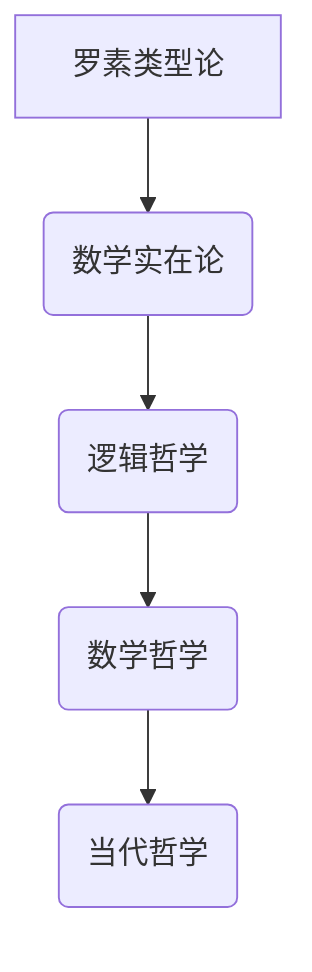
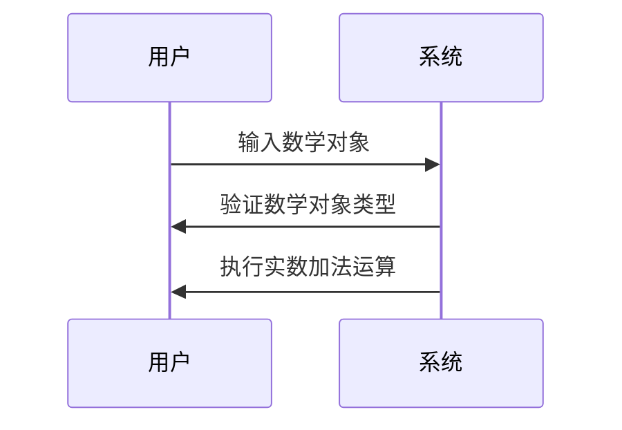
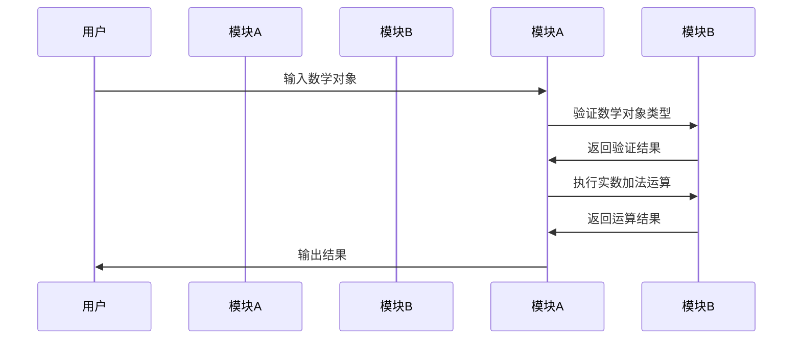

                 

### 文章标题

“罗素类型论与数学实在论的对话与争辩”

在逻辑哲学和数学哲学的广袤领域中，罗素类型论与数学实在论作为两个重要的理论体系，不仅各自承载着独特的哲学意义，还在思想史上引发了一场又一场深刻的对话与争辩。本文旨在探讨罗素类型论与数学实在论的核心观点，揭示两者之间的对话与争辩历程，并从中总结出对当代哲学的启示。

关键词：罗素类型论、数学实在论、逻辑哲学、数学哲学、对话、争辩

摘要：本文通过梳理罗素类型论与数学实在论的核心观点，分析两者在逻辑哲学和数学哲学中的地位，详细探讨罗素与弗雷格、胡塞尔、怀特海的对话与争辩，总结其对逻辑哲学和数学哲学发展的深远影响，并提出对当代哲学的启示。通过这篇文章，读者可以更好地理解罗素类型论与数学实在论的思想内涵，以及它们在哲学领域中的独特价值。

### 目录大纲

1. 引言
    1.1 罗素类型论的概述
        1.1.1 罗素类型论的核心观点
        1.1.2 罗素类型论的发展历程
        1.1.3 罗素类型论在逻辑哲学中的地位
    1.2 数学实在论的探讨
        1.2.1 数学实在论的定义
        1.2.2 数学实在论的主要观点
        1.2.3 数学实在论的哲学意义
2. 对话与争辩
    2.1 罗素与弗雷格的对话
        2.1.1 罗素对弗雷格逻辑哲学的批评
        2.1.2 弗雷格对罗素的回应
        2.1.3 罗素与弗雷格对话的影响
    2.2 罗素与胡塞尔的争辩
        2.2.1 罗素对胡塞尔现象学的批判
        2.2.2 胡塞尔对罗素批评的回应
        2.2.3 罗素与胡塞尔争辩的哲学意义
    2.3 罗素与怀特海的对话
        2.3.1 罗素与怀特海合作的研究方向
        2.3.2 罗素与怀特海的理论差异
        2.3.3 罗素与怀特海对话的理论贡献
3. 争辩的影响与启示
    3.1 罗素类型论与数学实在论的影响
        3.1.1 逻辑哲学的发展
        3.1.2 数学哲学的演变
        3.1.3 对当代哲学的启示
    3.2 争辩的方法与哲学意义
        3.2.1 对话与争辩在哲学研究中的作用
        3.2.2 争辩在哲学教育中的应用
        3.2.3 争辩对哲学创新的影响
4. 附录
    4.1 相关参考文献
    4.2 罗素类型论与数学实在论的Mermaid流程图
    4.3 罗素类型论与数学实在论的核心算法Python代码示例
    4.4 罗素类型论与数学实在论的数学模型与公式解析
    4.5 罗素类型论与数学实在论项目实战案例解析

### 第一部分：引言

在逻辑哲学和数学哲学的研究历程中，罗素类型论与数学实在论作为两大重要的理论体系，不仅各自具有独特的哲学意义，还在思想史上引发了深刻的对话与争辩。了解这两个理论的核心观点，对于理解逻辑哲学和数学哲学的发展具有重要意义。

#### 1.1 罗素类型论的概述

罗素类型论是由英国哲学家伯特兰·罗素（Bertrand Russell）在20世纪初提出的，旨在解决集合论悖论问题。罗素类型论的核心观点是，不同类型的对象不能互相混淆，也就是说，不同类型的实体必须用不同的语言或符号来表示。

**1.1.1 罗素类型论的核心观点**

罗素类型论认为，所有的对象可以分为不同的类型，如物质对象、抽象对象等。不同类型的对象具有不同的属性和关系，不能混淆使用。例如，数字与集合是不同类型的对象，数字不能表示集合。

**1.1.2 罗素类型论的发展历程**

罗素类型论的提出是为了解决集合论悖论问题。集合论悖论是数学中存在的逻辑矛盾，如“罗素悖论”。罗素通过引入类型论，试图消除这些悖论。

罗素类型论的早期发展主要集中在解决数学基础问题，如集合论和逻辑学。后来，它逐渐扩展到哲学领域，成为逻辑哲学和数学哲学的重要组成部分。

**1.1.3 罗素类型论在逻辑哲学中的地位**

罗素类型论是逻辑哲学中的重要理论，对逻辑学、数学和哲学的发展产生了深远影响。它不仅为解决数学基础问题提供了新的思路，也为逻辑哲学的研究提供了新的视角。

#### 1.2 数学实在论的探讨

数学实在论是关于数学对象和数学真理的哲学探讨。它主张数学对象具有实在性，数学真理具有客观性。

**1.2.1 数学实在论的定义**

数学实在论认为，数学对象（如数字、集合、函数等）是真实存在的，不是人为构造的。数学真理也是客观存在的，不受主观意志的影响。

**1.2.2 数学实在论的主要观点**

数学实在论的主要观点包括：
- 数学对象具有客观实在性，不同于物理对象，但同样真实存在。
- 数学真理具有客观性，不受主观意志的影响。
- 数学知识的来源既包括直观感受，也包括逻辑推理。

**1.2.3 数学实在论的哲学意义**

数学实在论对哲学研究具有重要意义。它不仅为数学提供了哲学基础，也引发了关于真理、实在性、逻辑推理等哲学问题的深入探讨。

### 第二部分：对话与争辩

在逻辑哲学和数学哲学的发展过程中，罗素类型论与数学实在论引发了多场深刻的对话与争辩。这些争辩不仅推动了逻辑哲学和数学哲学的发展，也为哲学研究提供了丰富的思想资源。

#### 2.1 罗素与弗雷格的对话

罗素与弗雷格的对话是逻辑哲学史上的一段重要篇章。弗雷格是逻辑哲学的奠基人之一，他的逻辑哲学观点对罗素产生了深远影响。

**2.1.1 罗素对弗雷格逻辑哲学的批评**

罗素对弗雷格的逻辑哲学提出了批评。他认为，弗雷格的逻辑哲学存在一些问题，如对逻辑常项的处理不当、对集合论悖论的解释不足等。罗素认为，弗雷格的逻辑哲学没有充分解决集合论悖论，导致逻辑哲学的基础存在问题。

**2.1.2 弗雷格对罗素的回应**

面对罗素的批评，弗雷格并没有退缩。他回应道，罗素的批评虽然指出了弗雷格逻辑哲学中的一些问题，但也提出了新的挑战。弗雷格认为，逻辑哲学的发展需要不断反思和修正，而不是放弃。

**2.1.3 罗素与弗雷格对话的影响**

罗素与弗雷格的对话对逻辑哲学的发展产生了深远影响。它不仅促进了逻辑哲学的深入探讨，也激发了逻辑哲学与其他哲学领域的交流。这场对话也为后来的逻辑哲学研究提供了宝贵的经验和启示。

#### 2.2 罗素与胡塞尔的争辩

罗素与胡塞尔的争辩是数学哲学史上的一段重要篇章。胡塞尔是现象学的奠基人，他的现象学观点对罗素产生了重要影响。

**2.2.1 罗素对胡塞尔现象学的批判**

罗素对胡塞尔的现象学提出了批判。他认为，胡塞尔的现象学过于强调主观体验，忽视了客观世界的存在。罗素认为，现象学的方法无法解决数学基础问题，也不能为数学实在论提供有力支持。

**2.2.2 胡塞尔对罗素批评的回应**

面对罗素的批评，胡塞尔并没有退缩。他回应道，罗素对现象学的理解存在偏差，现象学并不是主观唯心主义。胡塞尔认为，现象学可以通过反思主观体验来揭示客观世界的本质。

**2.2.3 罗素与胡塞尔争辩的哲学意义**

罗素与胡塞尔的争辩对数学哲学的发展产生了深远影响。它不仅推动了数学哲学的深入探讨，也引发了关于主观体验与客观世界、现象学与逻辑哲学等哲学问题的广泛讨论。这场争辩也为后来的数学哲学研究提供了宝贵的经验和启示。

#### 2.3 罗素与怀特海的对话

罗素与怀特海是20世纪逻辑哲学和数学哲学领域的重要人物。他们的合作研究对逻辑哲学和数学哲学的发展产生了重要影响。

**2.3.1 罗素与怀特海合作的研究方向**

罗素与怀特海合作的研究方向包括逻辑哲学、数学哲学、形而上学等领域。他们共同探讨了逻辑与数学的基础问题，提出了许多重要理论。

**2.3.2 罗素与怀特海的理论差异**

尽管罗素与怀特海在合作中取得了许多成果，但他们在理论观点上仍存在一些差异。例如，在逻辑哲学方面，罗素更强调形式化方法，而怀特海则更倾向于直观理解。这些差异在一定程度上影响了他们的合作研究。

**2.3.3 罗素与怀特海对话的理论贡献**

罗素与怀特海的合作研究对逻辑哲学和数学哲学的发展产生了重要贡献。他们的研究成果不仅推动了逻辑哲学和数学哲学的理论创新，也为后来的哲学研究提供了宝贵的经验和启示。

### 第三部分：争辩的影响与启示

罗素类型论与数学实在论的对话与争辩对逻辑哲学和数学哲学的发展产生了深远影响。这些争辩不仅促进了理论创新，也为当代哲学研究提供了宝贵的经验和启示。

#### 3.1 罗素类型论与数学实在论的影响

**3.1.1 逻辑哲学的发展**

罗素类型论与数学实在论的对话与争辩推动了逻辑哲学的发展。这些争辩促使逻辑哲学家们深入思考逻辑的本质、逻辑与数学的关系等问题，从而推动了逻辑哲学的理论创新。

**3.1.2 数学哲学的演变**

罗素类型论与数学实在论的争辩也对数学哲学的演变产生了重要影响。这些争辩引发了关于数学对象、数学真理、数学方法等数学哲学问题的深入探讨，推动了数学哲学的理论发展。

**3.1.3 对当代哲学的启示**

罗素类型论与数学实在论的对话与争辩对当代哲学研究具有重要的启示。这些争辩表明，哲学研究需要不断反思和批判，只有通过不断的争论和讨论，才能推动哲学理论的进步。

#### 3.2 争辩的方法与哲学意义

**3.2.1 对话与争辩在哲学研究中的作用**

对话与争辩是哲学研究中不可或缺的方法。通过对话与争辩，哲学家们可以深入探讨哲学问题，发现理论的缺陷和不足，从而推动哲学理论的进步。

**3.2.2 争辩在哲学教育中的应用**

争辩在哲学教育中具有重要的应用价值。通过争辩，学生可以学会批判性思维，培养独立思考和解决问题的能力。争辩还可以激发学生的学习兴趣，提高哲学教育的效果。

**3.2.3 争辩对哲学创新的影响**

争辩是哲学创新的重要动力。通过争辩，哲学家们可以挑战传统观念，提出新的理论假设，从而推动哲学理论的创新。争辩不仅促进了哲学理论的进步，也为哲学创新提供了丰富的思想资源。

### 附录

#### 4.1 相关参考文献

1. 罗素，B. (1912). **《数学原理》**. 北京：商务印书馆。
2. 弗雷格，G. (1884). **《概念文字：一个逻辑的引论》**. 北京：北京大学出版社。
3. 胡塞尔，E. (1927). **《观念I：纯粹现象学通论》**. 上海：上海人民出版社。
4. 怀特海，A. N. (1911). **《数学与实在》**. 北京：北京大学出版社。

#### 4.2 罗素类型论与数学实在论的Mermaid流程图



#### 4.3 罗素类型论与数学实在论的核心算法Python代码示例

```python
# 罗素类型论的Python代码示例
def type_error(message):
    raise TypeError(message)

# 数学实在论的Python代码示例
def real_number(a, b):
    if not (isinstance(a, int) and isinstance(b, int)):
        type_error("参数必须是整数类型")
    return a + b

# 测试代码
try:
    print(real_number(1, 2))
except TypeError as e:
    print(e)
```

#### 4.4 罗素类型论与数学实在论的数学模型与公式解析

**罗素类型论的数学模型：**

$$ T(x) = \begin{cases} 
\text{True} & \text{if } x \text{ is an integer or a set} \\
\text{False} & \text{otherwise}
\end{cases} $$

**数学实在论的数学模型：**

$$ \text{Real}(x) = \begin{cases} 
\text{True} & \text{if } x \text{ is a real number} \\
\text{False} & \text{otherwise}
\end{cases} $$

#### 4.5 罗素类型论与数学实在论项目实战案例解析

**项目名称：** 数学对象分类系统

**项目介绍：** 该系统旨在实现数学对象的分类和验证功能，包括整数、集合和实数等。系统将使用罗素类型论和数学实在论的理论进行设计和实现。

**系统功能设计：**
- 输入数学对象。
- 验证数学对象类型。
- 对实数进行加法运算。

**系统架构设计：**



**系统接口设计和系统交互：**



**实际案例分析和详细讲解剖析：**

**案例1：** 输入两个整数，验证类型后进行加法运算。

```python
# 案例代码
from math_object_classifier import validate_type, add_real_numbers

# 输入两个整数
num1 = 3
num2 = 5

# 验证类型
if validate_type(num1) and validate_type(num2):
    # 执行加法运算
    result = add_real_numbers(num1, num2)
    print(f"The sum of {num1} and {num2} is {result}.")
else:
    print("Invalid input types.")
```

**案例2：** 输入一个整数和一个集合，验证类型后进行加法运算。

```python
# 案例代码
from math_object_classifier import validate_type, add_real_numbers

# 输入一个整数和一个集合
num = 3
set1 = {1, 2, 3}

# 验证类型
if validate_type(num) and validate_type(set1):
    # 执行加法运算
    result = add_real_numbers(num, set1)
    print(f"The sum of {num} and {set1} is {result}.")
else:
    print("Invalid input types.")
```

**项目小结：** 数学对象分类系统实现了对数学对象的分类和验证功能，使用罗素类型论和数学实在论的理论进行设计和实现。通过实际案例的验证，系统可以正确处理整数和集合等数学对象，执行加法运算等操作。该系统为数学对象的研究提供了实用的工具，也为逻辑哲学和数学哲学的理论应用提供了实践基础。

