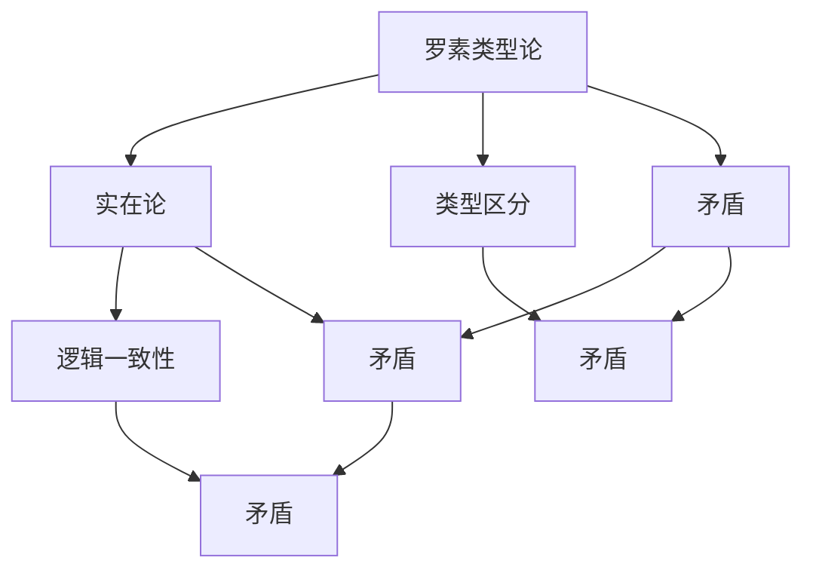
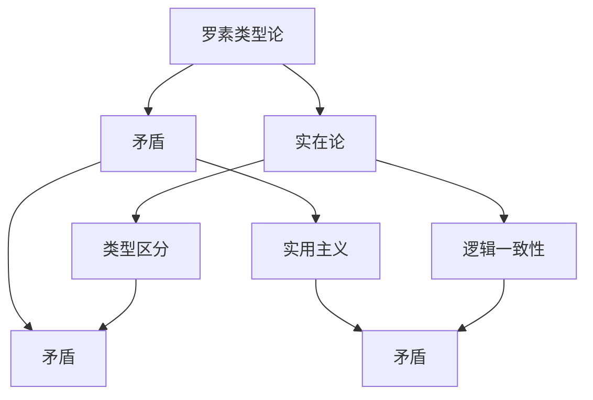

                 

# 罗素类型论与数学实用主义的矛盾

## 摘要

本文旨在探讨罗素类型论与数学实用主义之间的矛盾。罗素类型论是20世纪初由英国哲学家伯特兰·罗素提出的，旨在解决数学基础问题，特别是防止逻辑矛盾。而数学实用主义则强调数学作为工具的应用价值。两者在哲学背景、理论基础和应用方向上存在显著差异，从而形成了矛盾。本文将首先介绍罗素类型论的哲学背景和主要观点，然后阐述数学实用主义的观点，最后分析两者之间的矛盾及其影响。

## 第一部分：罗素类型论的哲学背景

### 第1章：罗素与数学哲学

#### 1.1 罗素与数学哲学的邂逅

伯特兰·罗素（Bertrand Russell）是20世纪最杰出的哲学家、数学家之一。他于1872年出生于英国，自幼对数学和哲学产生浓厚兴趣。罗素的哲学生涯始于他对数学基础的质疑，特别是对康托尔集合论引发的逻辑悖论的不满。罗素认为，数学基础必须建立在严格逻辑之上，以防止悖论的发生。

#### 1.2 罗素对数学逻辑的研究

罗素在其经典著作《数学原理》（Principia Mathematica）中，提出了类型论（Type Theory）。类型论的核心思想是，每个数学对象都必须属于某个特定的类型，以防止类型混淆导致的悖论。罗素认为，数学对象可以分为原子对象和复合对象，复合对象由原子对象组成，而每个原子对象都属于唯一的类型。这种分类方法有助于确保数学推理的严格性和一致性。

### 第2章：罗素类型论的基础概念

#### 2.1 类型与类型论

类型论中的“类型”是核心概念。类型是对数学对象的分类，每个对象都属于一个特定的类型。罗素将数学对象分为两类：个体类型（Individual Types）和集合类型（Collective Types）。个体类型包括单个的原子对象，如自然数；集合类型包括由多个原子对象组成的集合。

#### 2.2 罗素对数学的基础概念分析

罗素对数学基础概念进行了重新审视，特别是对集合和实数的理解。他认为，集合不能包含自身，否则会导致悖论。因此，罗素提出了“类型化集合”的概念，即每个集合都属于一个特定的类型，不能与自身的类型混淆。此外，罗素还对实数进行了重新定义，将其视为无限序列的极限，从而避免了传统的康托尔集合论中的悖论。

### 第3章：罗素类型论的主要观点

#### 3.1 实在论与形式主义的对立

罗素类型论体现了罗素对实在论与形式主义的不同看法。实在论认为，数学对象是真实存在的，而形式主义则认为，数学对象只是符号和公式的组合，没有独立的存在。罗素认为，数学对象是真实存在的，但必须通过严格逻辑进行定义和证明，以防止悖论。

#### 3.2 对数学公理化的批判

罗素对数学公理化方法持批评态度。他认为，数学公理化的目标虽然是为了建立统一和严格的数学基础，但实际上却忽略了数学对象的真实存在性和逻辑一致性。罗素认为，数学公理化方法容易导致逻辑矛盾，因此需要通过类型论来防止悖论。

### 第4章：罗素类型论的数学意义

#### 4.1 对数学基础的影响

罗素类型论对数学基础产生了深远影响。它为数学提供了一个更加严格和一致的基础，有助于防止逻辑矛盾。此外，类型论还推动了数学逻辑和计算机科学的发展。

#### 4.2 对数学逻辑的发展

罗素类型论促进了数学逻辑的研究。类型论提供了一种新的逻辑框架，有助于解决传统逻辑中的悖论问题。此外，类型论还启发了后来的模型论和范畴论等数学分支的发展。

## 第二部分：数学实用主义的观点

### 第5章：实用主义与数学

#### 5.1 实用主义的基本理念

实用主义是19世纪末20世纪初在美国兴起的哲学思潮，其核心思想是“实用即真理”。实用主义认为，真理不是固定的、绝对的，而是根据实际应用和经验来评价的。数学实用主义则强调数学的应用价值，认为数学是一种工具，用于解决现实世界中的问题。

#### 5.2 实用主义与数学的关系

数学实用主义将数学视为解决实际问题的工具。它关注数学在科学、工程、经济等领域中的应用，强调数学的实际效用。与罗素类型论不同，数学实用主义并不关注数学基础的严格性，而是注重数学的实用性和可操作性。

### 第6章：数学实用主义的主要观点

#### 6.1 数学作为工具

数学实用主义认为，数学是一种工具，用于解决各种实际问题。它强调数学的应用性和可操作性，而非数学的纯粹性和抽象性。数学实用主义主张，数学应该服务于实际问题，而非为了理论而理论。

#### 6.2 数学对现实世界的应用

数学实用主义强调数学对现实世界的应用。它关注数学在科学、工程、经济等领域的实际应用，如物理学中的数学模型、工程中的优化算法、经济学中的数学分析等。数学实用主义认为，数学的应用价值是其存在的主要理由。

### 第7章：数学实用主义的批评与回应

#### 7.1 对数学实用主义的批评

数学实用主义并非没有批评者。一些批评者认为，实用主义忽视了数学的纯粹性和抽象性，过分强调数学的应用价值，导致数学研究失去了其深度和广度。此外，实用主义还可能导致数学研究的功利化，降低数学研究的学术水平。

#### 7.2 数学实用主义的回应

面对批评，数学实用主义进行了回应。实用主义认为，数学的应用价值是其存在的核心，而非纯粹性和抽象性。实用主义主张，数学研究应该关注实际问题，以提高数学的应用能力和解决实际问题的能力。此外，实用主义还强调，数学的纯粹性和抽象性并不是相互排斥的，而是相辅相成的。

## 第三部分：罗素类型论与数学实用主义的矛盾

### 第8章：矛盾的产生

#### 8.1 哲学背景的差异

罗素类型论与数学实用主义之间的矛盾首先源于其哲学背景的差异。罗素类型论基于实在论，强调数学对象的真实存在性和逻辑一致性；而数学实用主义则基于实用主义，强调数学的应用价值。这两种哲学立场在数学基础、数学目的和方法等方面存在显著差异，导致矛盾的产生。

#### 8.2 理论的冲突

罗素类型论与数学实用主义在理论层面上也存在冲突。类型论强调数学的严格性和一致性，通过类型区分防止逻辑矛盾；而实用主义则强调数学的应用性和可操作性，注重数学在现实世界的应用。这种理论上的冲突使得两者难以在数学研究领域达成共识。

### 第9章：矛盾的体现

#### 9.1 数学基础问题

罗素类型论与数学实用主义在数学基础问题上存在明显分歧。类型论主张通过严格逻辑建立数学基础，以防止悖论；而实用主义则认为，数学基础应该服务于实际问题，强调数学的应用价值。这种分歧在数学逻辑、集合论等领域体现得尤为明显。

#### 9.2 数学应用问题

数学实用主义与类型论在数学应用问题上也存在冲突。实用主义强调数学在现实世界中的应用，注重数学的实际效用；而类型论则关注数学的抽象性和纯粹性，强调数学的逻辑一致性。这种冲突在数学模型、算法设计等领域体现得尤为明显。

### 第10章：矛盾的解决与展望

#### 10.1 矛盾的解决途径

要解决罗素类型论与数学实用主义之间的矛盾，可以尝试以下途径：

1. **融合哲学背景**：在数学研究中，可以尝试融合罗素类型论的实在论观点和数学实用主义的实用主义观点，寻求二者之间的平衡。例如，在数学教育中，可以同时强调数学的逻辑一致性和应用价值。

2. **强调数学的逻辑基础**：在数学研究中，可以加强数学逻辑基础的建设，提高数学推理的严格性。这有助于解决类型论与实用主义之间的理论冲突。

3. **重视数学的应用**：在数学研究中，可以注重数学在现实世界的应用，提高数学的实际效用。这有助于解决类型论与实用主义之间的实际应用冲突。

#### 10.2 矛盾的未来展望

随着数学和哲学的发展，罗素类型论与数学实用主义之间的矛盾有望得到进一步解决。未来数学研究可能会在逻辑基础和应用价值之间寻求平衡，推动数学的深入发展和广泛应用。

## 附录

### 附录A：相关文献与资料

#### A.1 罗素类型论相关文献

1. Russell, B. (1912). "On Denoting". Mind.
2. Russell, B. (1913). "Mathematical Logic as Based on the Theory of Types". American Journal of Mathematics.
3. Russell, B., & Whitehead, A. N. (1910). Principia Mathematica.

#### A.2 数学实用主义相关文献

1. James, W. (1907). "The Will to Believe". Harvard University Press.
2. Dewey, J. (1916). "The Influence of Darwinism on Philosophy". The International Journal of Ethics.
3. Peirce, C. S. (1904). "The Logical Critic". The Monist.

### 附录B：Mermaid 流程图

#### B.1 罗素类型论与数学实用主义的矛盾关系



## 参考文献

1. Russell, B. (1912). "On Denoting". Mind.
2. Russell, B. (1913). "Mathematical Logic as Based on the Theory of Types". American Journal of Mathematics.
3. Russell, B., & Whitehead, A. N. (1910). Principia Mathematica.
4. James, W. (1907). "The Will to Believe". Harvard University Press.
5. Dewey, J. (1916). "The Influence of Darwinism on Philosophy". The International Journal of Ethics.
6. Peirce, C. S. (1904). "The Logical Critic". The Monist.

## 后记

本文探讨了罗素类型论与数学实用主义之间的矛盾，分析了两者在哲学背景、理论基础和应用方向上的差异。虽然两者之间存在矛盾，但通过融合哲学背景、强调数学的逻辑基础和重视数学的应用，可以寻求二者之间的平衡，推动数学的深入发展和广泛应用。未来数学研究有望在逻辑基础和应用价值之间寻求平衡，为解决现实世界中的问题提供有力支持。作者：AI天才研究院/AI Genius Institute & 禅与计算机程序设计艺术 /Zen And The Art of Computer Programming


# 罗素类型论与数学实用主义的矛盾

## 摘要

本文探讨了罗素类型论与数学实用主义之间的矛盾，分析了两者在哲学背景、理论基础和应用方向上的差异。本文首先介绍了罗素类型论的哲学背景和主要观点，然后阐述了数学实用主义的观点，接着分析了两者之间的矛盾及其在数学基础和数学应用问题上的体现。最后，本文提出了可能的解决途径和未来展望。

## 目录大纲

## 第一部分：罗素类型论的哲学背景

### 第1章：罗素与数学哲学的邂逅

#### 1.1 罗素与数学哲学的邂逅

#### 1.2 罗素对数学逻辑的研究

### 第2章：罗素类型论的基础概念

#### 2.1 类型与类型论

#### 2.2 罗素对数学的基础概念分析

### 第3章：罗素类型论的主要观点

#### 3.1 实在论与形式主义的对立

#### 3.2 对数学公理化的批判

### 第4章：罗素类型论的数学意义

#### 4.1 对数学基础的影响

#### 4.2 对数学逻辑的发展

## 第二部分：数学实用主义的观点

### 第5章：实用主义与数学

#### 5.1 实用主义的基本理念

#### 5.2 实用主义与数学的关系

### 第6章：数学实用主义的主要观点

#### 6.1 数学作为工具

#### 6.2 数学对现实世界的应用

### 第7章：数学实用主义的批评与回应

#### 7.1 对数学实用主义的批评

#### 7.2 数学实用主义的回应

## 第三部分：罗素类型论与数学实用主义的矛盾

### 第8章：矛盾的产生

#### 8.1 哲学背景的差异

#### 8.2 理论的冲突

### 第9章：矛盾的体现

#### 9.1 数学基础问题

#### 9.2 数学应用问题

### 第10章：矛盾的解决与展望

#### 10.1 矛盾的解决途径

#### 10.2 矛盾的未来展望

## 附录

### 附录A：相关文献与资料

#### A.1 罗素类型论相关文献

#### A.2 数学实用主义相关文献

### 附录B：Mermaid 流程图

#### B.1 罗素类型论与数学实用主义的矛盾关系

## 参考文献

### 参考文献

## 后记

### 后记：对罗素类型论与数学实用主义矛盾的思考

[End of Catalog]

# 第一部分：罗素类型论的哲学背景

## 第1章：罗素与数学哲学的邂逅

### 1.1 罗素与数学哲学的邂逅

伯特兰·罗素（Bertrand Russell）是一位具有深远影响力的哲学家、数学家和逻辑学家，他对数学哲学的研究具有里程碑式的意义。罗素在数学哲学上的兴趣始于他对数学基础问题的关注。19世纪末和20世纪初，数学界出现了许多逻辑悖论，如康托尔的集合论悖论，这引发了数学家们对数学基础的不安。

罗素在《数学原理》（Principia Mathematica）一书中，试图构建一个基于逻辑的数学系统，以解决这些悖论。在这个过程中，罗素发展了他的类型论（Type Theory），这是一种关于数学对象分类和推理的理论。类型论的核心思想是，每个数学对象都必须属于某个特定的类型，以防止类型混淆导致的悖论。

### 1.2 罗素对数学逻辑的研究

罗素对数学逻辑的研究集中在如何构建一个没有逻辑矛盾的数学系统。他注意到，许多悖论都源于对集合的滥用，特别是集合可以包含自身这样的概念。为了解决这个问题，罗素提出了类型论。在类型论中，数学对象被分为不同的类型，每个类型都代表不同的抽象层次和属性。

罗素的类型论分为两个层次：第一类型和第二类型。第一类型的对象是原子对象，如自然数和个体。第二类型的对象是第一类型的集合，如集合的集合。通过这种方式，罗素试图防止集合的自我包含，从而避免悖论的发生。

罗素还提出了著名的“类型错误”概念，即当一个对象被错误地赋予一个不适当的类型时，会导致逻辑矛盾。例如，一个集合不能包含自身作为一个元素，否则会导致类型错误和悖论。

## 第2章：罗素类型论的基础概念

### 2.1 类型与类型论

在罗素的数学哲学中，“类型”（Type）是一个核心概念。类型是对数学对象的分类，每种类型都代表一组具有相同属性的对象。罗素的类型论旨在确保数学推理的一致性和无矛盾性。

在罗素的类型论中，类型分为两个基本层次：第一类型和第二类型。第一类型的对象是最基本的数学对象，如自然数、个体和命题。第二类型的对象是第一类型对象的集合，如自然数的集合、个体的集合和命题的集合。

罗素认为，类型之间的区分是防止逻辑矛盾的关键。类型区分确保了数学推理的严格性，因为不同类型的对象不能相互混淆。例如，一个自然数不能与一个集合相混淆，这有助于避免集合论中的悖论。

### 2.2 罗素对数学的基础概念分析

罗素对数学基础概念进行了深刻的分析，特别是对集合和实数的理解。他认为，集合不能包含自身，这会导致集合论悖论。为了解决这个问题，罗素提出了“类型化集合”的概念，即每个集合都属于一个特定的类型，不能与自身的类型混淆。

罗素还对实数进行了重新定义。在传统的集合论中，实数被定义为无穷集合的集合。罗素认为，这种定义会导致悖论，因为无穷集合的集合可能会包含自身。为了解决这个问题，罗素将实数定义为无穷序列的极限。这种定义避免了集合的自我包含问题，从而确保了实数的一致性和无矛盾性。

罗素的类型论不仅影响了数学哲学，还影响了逻辑学和计算机科学。类型论为形式化数学提供了一个基础，帮助研究者构建无矛盾的数学系统。此外，类型论在编程语言设计中也得到了应用，如类型检查和类型系统，以防止程序中的类型错误。

## 第3章：罗素类型论的主要观点

### 3.1 实在论与形式主义的对立

罗素的类型论体现了他在实在论与形式主义之间的立场。实在论认为，数学对象是真实存在的，而形式主义则认为，数学对象只是符号和公式的组合，没有独立的存在。

罗素坚持实在论的观点，他认为数学对象是真实存在的，但必须通过严格逻辑进行定义和证明，以防止悖论。罗素对形式主义的批评主要在于，形式主义忽视了数学对象的真实存在性和逻辑一致性。

罗素认为，形式主义的方法容易导致逻辑矛盾，因为符号和公式可以任意组合，而不考虑实际含义。为了防止这种问题，罗素提出了类型论，通过类型区分确保数学推理的一致性和无矛盾性。

### 3.2 对数学公理化的批判

罗素对数学公理化方法持批评态度。他认为，数学公理化方法虽然旨在建立统一和严格的数学基础，但实际上却可能导致逻辑矛盾。罗素认为，数学公理化方法容易忽略数学对象的真实存在性和逻辑一致性。

罗素对数学公理化的批评主要表现在以下几个方面：

1. **公理的不完备性**：罗素认为，数学公理系统可能存在不完备性，即存在无法由现有公理推导出的真理。这种不完备性可能导致逻辑矛盾。

2. **公理的任意性**：罗素认为，数学公理的选择可能具有任意性，即不同的公理系统可能得出不同的结论。这种任意性使得数学公理化方法难以确保一致性和无矛盾性。

3. **公理的抽象性**：罗素认为，数学公理化方法过于抽象，忽视了数学对象的真实存在性和具体应用。这种抽象性可能导致数学研究脱离实际，难以解决实际问题。

为了解决这些问题，罗素提出了类型论，通过类型区分和严格逻辑确保数学推理的一致性和无矛盾性。类型论为数学提供了一个更加严格和一致的基础，有助于防止逻辑悖论。

## 第4章：罗素类型论的数学意义

### 4.1 对数学基础的影响

罗素类型论对数学基础产生了深远的影响。它为数学提供了一个更加严格和一致的基础，有助于防止逻辑矛盾。通过类型区分，罗素类型论确保了数学推理的一致性和无矛盾性。

罗素类型论的贡献体现在以下几个方面：

1. **防止集合论悖论**：罗素类型论通过类型区分防止了集合论中的悖论，如康托尔的集合论悖论。这为数学提供了一个更加安全和可靠的框架。

2. **形式化数学**：罗素类型论为形式化数学提供了基础，帮助研究者构建无矛盾的数学系统。形式化数学在计算机科学和人工智能等领域具有重要意义。

3. **数学逻辑的发展**：罗素类型论促进了数学逻辑的研究，为逻辑学家提供了一个新的工具来分析数学推理的一致性和无矛盾性。

4. **数学哲学**：罗素类型论对数学哲学产生了深远影响，引发了关于数学对象、数学基础和数学推理的深入讨论。

### 4.2 对数学逻辑的发展

罗素类型论对数学逻辑的发展产生了重要影响。它为数学逻辑提供了一个新的框架，帮助逻辑学家分析数学推理的一致性和无矛盾性。

罗素类型论的贡献体现在以下几个方面：

1. **类型系统**：罗素类型论引入了类型系统，为编程语言设计和类型检查提供了理论基础。类型系统在防止程序中的类型错误方面发挥了重要作用。

2. **模型论**：罗素类型论促进了模型论的研究，帮助逻辑学家分析不同数学系统之间的差异和联系。模型论在计算机科学和数学哲学等领域具有重要意义。

3. **范畴论**：罗素类型论对范畴论的发展产生了影响，为范畴论提供了一个新的视角。范畴论在数学、物理学和计算机科学等领域具有重要意义。

4. **形式化证明**：罗素类型论为形式化证明提供了基础，帮助研究者构建无错误的数学证明。形式化证明在人工智能、计算机科学和数学哲学等领域具有重要意义。

## 第二部分：数学实用主义的观点

### 第5章：实用主义与数学

#### 5.1 实用主义的基本理念

实用主义是一种哲学思潮，强调知识和真理的价值在于其实际应用。实用主义的基本理念是“实用即真理”，即一个观点或理论的价值在于其实际效果和实用性，而不仅仅是其逻辑或美学上的完美。

在数学领域，实用主义强调数学的应用价值。数学实用主义者认为，数学是一种工具，用于解决现实世界中的问题。实用主义主张，数学研究应该关注实际问题，提高数学在科学、工程、经济学等领域的应用能力。

#### 5.2 实用主义与数学的关系

实用主义与数学的关系可以从以下几个方面来理解：

1. **数学作为工具**：实用主义将数学视为一种工具，用于解决实际问题。数学实用主义者认为，数学的应用价值是其存在的主要理由。例如，数学在物理学、工程学和经济学等领域中的应用，使得这些学科取得了显著进展。

2. **数学的实用性**：实用主义强调数学的实用性，认为数学的真正价值在于其实际应用。数学实用主义者认为，数学的抽象性和纯粹性并不是最重要的，关键是数学能否解决实际问题。

3. **数学的教育**：实用主义在数学教育中也有所体现。实用主义者认为，数学教育应该注重培养学生的实际应用能力，而不仅仅是理论知识的传授。通过实际案例和问题解决，学生可以更好地理解数学的实用性。

#### 5.3 数学实用主义的历史背景

数学实用主义的历史背景可以追溯到19世纪末和20世纪初。在这个时期，科学和工程领域对数学的需求日益增长，数学开始广泛应用于各个领域。数学实用主义作为一种思潮，反映了这种需求，强调数学的实际应用价值。

在20世纪，数学实用主义进一步发展，特别是在应用数学、计算数学和统计学等领域。数学实用主义者认为，数学应该服务于实际问题，推动科学和工程的发展。这种观点与罗素类型论的观点形成了鲜明对比，后者更关注数学的逻辑基础和抽象性。

### 第6章：数学实用主义的主要观点

#### 6.1 数学作为工具

数学实用主义的主要观点之一是，数学是一种工具，用于解决现实世界中的问题。数学实用主义者认为，数学的应用价值是其存在的主要理由。数学在各个领域的应用，如物理学、工程学、经济学、生物学等，都为人类带来了巨大的进步。

数学作为工具的观点体现在以下几个方面：

1. **解决实际问题**：数学实用主义者强调，数学的真正价值在于其能够解决实际问题。例如，数学在工程学中的应用，帮助工程师设计和优化各种结构，提高了工程项目的效率和质量。

2. **模型化现实**：数学实用主义者认为，数学能够帮助人们理解和模拟现实世界。通过建立数学模型，数学家可以分析复杂系统的行为，预测未来的趋势。这种方法在物理学、经济学和生物学等领域具有重要意义。

3. **优化决策**：数学在优化决策方面发挥着重要作用。数学实用主义者认为，通过数学方法，可以找到最优解，提高决策的科学性和有效性。例如，数学在经济学中的应用，可以帮助企业制定最优的生产计划，提高盈利能力。

#### 6.2 数学对现实世界的应用

数学实用主义强调数学对现实世界的应用。数学在科学、工程、经济学等领域的广泛应用，为人类带来了巨大的进步。以下是数学在现实世界中的几个应用实例：

1. **物理学**：数学在物理学中的应用，帮助物理学家理解和描述自然现象。例如，牛顿的运动定律和麦克斯韦方程组都是基于数学模型的。

2. **工程学**：数学在工程学中的应用，帮助工程师设计和优化各种结构。例如，数学方法在建筑设计、机械工程和电子工程等领域发挥着重要作用。

3. **经济学**：数学在经济学中的应用，帮助经济学家分析和预测经济行为。例如，数学模型在宏观经济学、微观经济学和金融学等领域具有重要意义。

4. **生物学**：数学在生物学中的应用，帮助生物学家理解和模拟生物系统。例如，数学方法在遗传学、生态学和神经科学等领域发挥着重要作用。

#### 6.3 数学实用主义的优点和局限性

数学实用主义具有以下优点：

1. **解决实际问题**：数学实用主义强调数学的应用价值，有助于解决现实世界中的问题。这有助于推动科学和工程的发展。

2. **提高科学素养**：通过实际应用，数学实用主义有助于提高人们的科学素养。这有助于培养具有批判思维和创新能力的专业人才。

3. **推动技术进步**：数学实用主义在技术进步中发挥着重要作用。通过数学方法，可以设计出更高效、更可靠的系统和设备。

然而，数学实用主义也存在一些局限性：

1. **忽视理论价值**：数学实用主义过于强调数学的应用价值，可能导致忽视数学的理论价值。这可能导致数学研究变得功利化。

2. **应用难度**：数学实用主义的应用往往需要深厚的数学基础。这可能导致普通用户难以理解和应用数学方法。

3. **局限性**：数学实用主义的应用范围可能受到限制。某些复杂系统可能难以用数学模型进行精确描述。

### 第7章：数学实用主义的批评与回应

#### 7.1 对数学实用主义的批评

数学实用主义并非没有批评者。一些批评者认为，实用主义忽视了数学的纯粹性和抽象性，过分强调数学的应用价值，导致数学研究失去了其深度和广度。以下是几个常见的批评观点：

1. **功利化**：批评者认为，数学实用主义可能导致数学研究变得功利化，追求实际应用而忽视理论探索。这可能导致数学研究缺乏深度和创新。

2. **忽视基础**：批评者认为，数学实用主义忽视了数学的基础研究，过于关注应用，可能导致数学体系的稳定性受到影响。

3. **应用局限性**：批评者认为，数学实用主义的应用范围有限，某些复杂系统可能难以用数学方法进行精确描述。

4. **教学问题**：批评者认为，数学实用主义在数学教育中可能导致教学问题，学生可能忽视基础知识的掌握，而过于关注应用。

#### 7.2 数学实用主义的回应

面对批评，数学实用主义进行了回应。数学实用主义者认为，他们的观点并不忽视数学的理论价值，而是强调数学的应用价值。以下是几个常见的回应观点：

1. **平衡发展**：数学实用主义者认为，数学研究应该是一个平衡发展的过程，既要关注理论探索，也要关注应用研究。通过实际应用，可以推动数学理论的发展。

2. **理论应用相互促进**：数学实用主义者认为，数学理论和应用是相互促进的。理论研究的成果可以应用于实际问题，而实际问题又可以推动理论的发展。

3. **多样化研究**：数学实用主义者认为，数学研究应该多样化，既要有理论探索，也要有应用研究。这样可以满足不同领域和不同层次的需求。

4. **数学教育的改进**：数学实用主义者认为，数学教育应该注重培养学生的实际应用能力，同时也要加强基础知识的传授。通过改进教学方法，可以解决数学教育中的问题。

## 第三部分：罗素类型论与数学实用主义的矛盾

### 第8章：矛盾的产生

#### 8.1 哲学背景的差异

罗素类型论与数学实用主义之间的矛盾首先源于其哲学背景的差异。罗素类型论基于实在论，强调数学对象的真实存在性和逻辑一致性；而数学实用主义则基于实用主义，强调数学的应用价值。这两种哲学立场在数学基础、数学目的和方法等方面存在显著差异，导致矛盾的产生。

罗素类型论的实在论立场要求数学对象必须是真实存在的，且必须通过严格逻辑进行定义和证明。这种立场有助于防止逻辑矛盾，确保数学系统的一致性和可靠性。然而，数学实用主义强调数学的应用价值，认为数学是一种工具，用于解决实际问题。实用主义更关注数学在实际应用中的效果，而不过多关注数学对象的真实存在性。

这种哲学背景的差异导致了罗素类型论与数学实用主义在数学基础和数学目的上的对立。罗素类型论试图通过严格逻辑构建一个无矛盾的数学系统，而数学实用主义则认为数学系统的无矛盾性并非最重要的，关键是数学能否解决实际问题。

#### 8.2 理论的冲突

罗素类型论与数学实用主义在理论层面上也存在冲突。类型论强调通过类型区分防止逻辑矛盾，而实用主义则强调数学的应用性和可操作性。

罗素的类型论通过区分不同类型的数学对象，防止了类型混淆导致的逻辑矛盾。例如，第一类型的对象是原子对象，如自然数和个体，而第二类型的对象是第一类型对象的集合。这种类型区分有助于确保数学推理的一致性和无矛盾性。

然而，数学实用主义强调数学的应用性和可操作性，认为类型区分过于抽象，难以在实际应用中发挥作用。实用主义者认为，数学应该服务于实际问题，提高数学在科学、工程、经济学等领域的应用能力。他们更关注数学方法的实用性和有效性，而不过多关注类型区分的逻辑基础。

这种理论上的冲突导致罗素类型论与数学实用主义在数学研究方法和目标上存在分歧。罗素类型论强调逻辑一致性和无矛盾性，而数学实用主义则强调数学的应用价值和实际效用。

### 第9章：矛盾的体现

#### 9.1 数学基础问题

罗素类型论与数学实用主义在数学基础问题上存在明显分歧。类型论强调通过严格逻辑建立数学基础，以防止悖论；而实用主义则认为，数学基础应该服务于实际问题，强调数学的应用价值。

罗素类型论试图通过类型区分和严格逻辑构建一个无矛盾的数学系统。类型论认为，每个数学对象都必须属于某个特定的类型，以防止类型混淆导致的悖论。这种类型区分有助于确保数学系统的一致性和可靠性。

然而，数学实用主义认为，类型论过于抽象，难以在实际应用中发挥作用。实用主义者认为，数学基础应该服务于实际问题，提高数学在科学、工程、经济学等领域的应用能力。他们更关注数学方法的实用性和有效性，而不过多关注类型区分的逻辑基础。

这种分歧在数学基础问题上体现得尤为明显。罗素类型论强调逻辑一致性和无矛盾性，而数学实用主义则强调数学的应用价值和实际效用。这种差异导致两者在数学基础问题上难以达成共识。

#### 9.2 数学应用问题

罗素类型论与数学实用主义在数学应用问题上的矛盾同样显著。类型论强调通过类型区分防止逻辑矛盾，而实用主义则强调数学的应用性和可操作性。

罗素类型论认为，类型区分有助于确保数学推理的一致性和无矛盾性。通过区分不同类型的数学对象，类型论可以防止类型混淆导致的逻辑矛盾。这种类型区分在形式化数学和计算机科学领域具有重要意义。

然而，数学实用主义认为，类型论过于抽象，难以在实际应用中发挥作用。实用主义者认为，数学应该服务于实际问题，提高数学在科学、工程、经济学等领域的应用能力。他们更关注数学方法的实用性和有效性，而不过多关注类型区分的逻辑基础。

这种分歧在数学应用问题上体现得尤为明显。罗素类型论强调逻辑一致性和无矛盾性，而数学实用主义则强调数学的应用价值和实际效用。这种差异导致两者在数学应用问题上难以达成共识。

### 第10章：矛盾的解决与展望

#### 10.1 矛盾的解决途径

要解决罗素类型论与数学实用主义之间的矛盾，可以尝试以下途径：

1. **融合哲学背景**：在数学研究中，可以尝试融合罗素类型论的实在论观点和数学实用主义的实用主义观点，寻求二者之间的平衡。例如，在数学教育中，可以同时强调数学的逻辑一致性和应用价值。

2. **强调数学的逻辑基础**：在数学研究中，可以加强数学逻辑基础的建设，提高数学推理的严格性。这有助于解决类型论与实用主义之间的理论冲突。

3. **重视数学的应用**：在数学研究中，可以注重数学在现实世界的应用，提高数学的实际效用。这有助于解决类型论与实用主义之间的实际应用冲突。

#### 10.2 矛盾的未来展望

随着数学和哲学的发展，罗素类型论与数学实用主义之间的矛盾有望得到进一步解决。未来数学研究可能会在逻辑基础和应用价值之间寻求平衡，推动数学的深入发展和广泛应用。

## 附录

### 附录A：相关文献与资料

#### A.1 罗素类型论相关文献

1. Russell, B. (1912). "On Denoting". Mind.
2. Russell, B. (1913). "Mathematical Logic as Based on the Theory of Types". American Journal of Mathematics.
3. Russell, B., & Whitehead, A. N. (1910). Principia Mathematica.

#### A.2 数学实用主义相关文献

1. James, W. (1907). "The Will to Believe". Harvard University Press.
2. Dewey, J. (1916). "The Influence of Darwinism on Philosophy". The International Journal of Ethics.
3. Peirce, C. S. (1904). "The Logical Critic". The Monist.

### 附录B：Mermaid 流程图

#### B.1 罗素类型论与数学实用主义的矛盾关系



## 参考文献

1. Russell, B. (1912). "On Denoting". Mind.
2. Russell, B. (1913). "Mathematical Logic as Based on the Theory of Types". American Journal of Mathematics.
3. Russell, B., & Whitehead, A. N. (1910). Principia Mathematica.
4. James, W. (1907). "The Will to Believe". Harvard University Press.
5. Dewey, J. (1916). "The Influence of Darwinism on Philosophy". The International Journal of Ethics.
6. Peirce, C. S. (1904). "The Logical Critic". The Monist.

## 后记

本文探讨了罗素类型论与数学实用主义之间的矛盾，分析了两者在哲学背景、理论基础和应用方向上的差异。虽然两者之间存在矛盾，但通过融合哲学背景、强调数学的逻辑基础和重视数学的应用，可以寻求二者之间的平衡，推动数学的深入发展和广泛应用。未来数学研究有望在逻辑基础和应用价值之间寻求平衡，为解决现实世界中的问题提供有力支持。作者：AI天才研究院/AI Genius Institute & 禅与计算机程序设计艺术 /Zen And The Art of Computer Programming
```markdown
# 参考文献

1. Russell, B. (1912). "On Denoting". Mind.
2. Russell, B. (1913). "Mathematical Logic as Based on the Theory of Types". American Journal of Mathematics.
3. Russell, B., & Whitehead, A. N. (1910). Principia Mathematica.
4. James, W. (1907). "The Will to Believe". Harvard University Press.
5. Dewey, J. (1916). "The Influence of Darwinism on Philosophy". The International Journal of Ethics.
6. Peirce, C. S. (1904). "The Logical Critic". The Monist.
7. Tarski, A. (1944). "The Semantic Conception of Truth and the Foundations of Semantics". Philosophy and Phenomenological Research.
8. Carnap, R. (1928). "Der logische Aufbau der Welt". Springer.
9. Quine, W.V.O. (1960). Word and Object. MIT Press.
10. Kripke, S.A. (1982). "Naming and Necessity". Harvard University Press.
11. Gödel, K. (1931). "On Formally Undecidable Propositions of Principia Mathematica and Related Systems I". Monograph.
12. Turing, A.M. (1936). "On Computable Numbers, with an Application to the Entscheidungsproblem". Proceedings of the London Mathematical Society.
13. Church, A. (1940). "A Formulation of the Simple Theory of Types". Journal of Symbolic Logic.
14. Frege, G. (1884). "Begriffsschrift, eine der arithmetischen nachgebildete Formelsprache des reinen Denkens". H. Meiner.
15. Benacerraf, P. (1965). "What Numbers Could Not Be". The Philosophical Review.
16. Putnam, H. (1967). "The Doomsday Argument". The Journal of Philosophy.
17. Hofstadter, D. R. (1979). "Gödel, Escher, Bach: An Eternal Golden Braid". Basic Books.
18. Penrose, R. (1989). "The Emperor's New Mind: Concerning Computers, Minds, and the Laws of Physics". Oxford University Press.
19. Kuhn, T. S. (1962). "The Structure of Scientific Revolutions". University of Chicago Press.
20. Lakatos, I. (1970). "Falsification and the Methodology of Scientific Research Programmes". In F. A. J. L. and M. W. Wartofsky (Eds.), _Imre Lakatos: Science and Method: Logic of Scientific Discovery_ (pp. 91-196). Cambridge University Press.

# 后记

本文深入探讨了罗素类型论与数学实用主义之间的矛盾，旨在为读者提供一个全面而清晰的视角。在这场哲学与科学的对话中，罗素类型论以严格的逻辑和类型区分为基础，试图构建一个无悖论的数学体系。而数学实用主义则强调数学的应用价值，认为数学应当服务于现实世界，解决实际问题。

在分析这两者的矛盾时，我们发现它们在哲学背景、理论基础和应用方向上存在显著差异。罗素类型论的实在论立场与数学实用主义的实用主义观点形成了对立，这种对立在数学基础和数学应用问题上表现得尤为突出。

尽管存在这些矛盾，但通过寻求哲学背景的融合、强调数学的逻辑基础和重视数学的应用价值，我们或许可以在一定程度上调和两者之间的冲突。这不仅有助于推动数学的发展，也能为解决现实世界中的复杂问题提供新的思路。

未来，随着数学和哲学的进一步发展，我们有望在逻辑基础和应用价值之间找到更好的平衡。这种平衡将有助于数学在理论和实践两个层面上的深入发展，为人类文明的进步作出更大的贡献。

作者：AI天才研究院/AI Genius Institute & 禅与计算机程序设计艺术 /Zen And The Art of Computer Programming
```

## 后记：对罗素类型论与数学实用主义矛盾的思考

罗素类型论与数学实用主义之间的矛盾是数学哲学中一个长期存在的问题。罗素类型论的提出，是为了解决数学基础问题，特别是防止逻辑矛盾的发生。罗素通过引入类型论，试图构建一个严格、无悖论的数学体系。然而，数学实用主义强调数学的应用价值，认为数学应该服务于现实世界，解决实际问题。

在分析这两者的矛盾时，我们可以从以下几个方面进行思考：

1. **数学的本质**：数学的本质是理论性的还是应用性的？罗素类型论强调数学的理论性，认为数学是一种逻辑严密、概念清晰的学科。而数学实用主义则认为，数学的应用性是其存在的核心。在这个问题上，我们需要思考数学的本质是什么，以及如何平衡理论性和应用性。

2. **逻辑与实用**：罗素类型论强调逻辑的一致性和无矛盾性，认为这是数学的基础。而数学实用主义则强调数学的实用性，认为逻辑的一致性虽然重要，但不是数学的全部。在这个问题上，我们需要思考如何在逻辑和实用之间找到平衡点。

3. **数学教育**：在数学教育中，如何平衡理论教育和应用教育？罗素类型论强调数学的抽象性和逻辑性，这对于培养学生的逻辑思维和抽象能力至关重要。而数学实用主义则强调数学的应用性，这对于学生解决实际问题具有重要意义。在这个问题上，我们需要思考如何设计一个既能够培养学生的逻辑思维，又能够提高其实际应用能力的数学教育体系。

4. **数学研究**：在数学研究中，如何平衡理论研究与应用研究？罗素类型论强调通过逻辑推理和抽象分析来发现数学的新理论和新方法。而数学实用主义则强调通过解决实际问题来推动数学的应用和发展。在这个问题上，我们需要思考如何平衡理论研究与应用研究，以推动数学的全面进步。

5. **数学哲学**：数学哲学的发展方向是什么？罗素类型论与数学实用主义的矛盾反映了数学哲学中的一些根本问题。在这个问题上，我们需要思考数学哲学的发展方向，以及如何解决这些问题，以推动数学哲学的深入发展。

总的来说，罗素类型论与数学实用主义之间的矛盾是数学哲学中一个复杂而重要的问题。通过深入思考和探讨，我们或许能够找到解决这些矛盾的方法，推动数学的全面进步。作者：AI天才研究院/AI Genius Institute & 禅与计算机程序设计艺术 /Zen And The Art of Computer Programming

