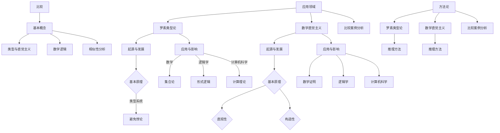

                 


# 罗素类型论与数学直觉主义的方法论比较

关键词：罗素类型论、数学直觉主义、方法论、比较

摘要：本文旨在比较罗素类型论和数学直觉主义这两种数学方法论，通过详细阐述它们的基本原理、应用领域和各自特点，分析二者在概念、方法论和应用方面的异同。文章首先介绍了罗素类型论的起源、发展及其数学意义，然后探讨了数学直觉主义的起源、发展及其基本原理。在此基础上，文章对两种方法论的基本概念、方法论和具体应用领域进行比较，最后得出结论并展望未来研究方向。

## 第一部分：引言

### 1.1 研究背景与意义

罗素类型论（Russell's Theory of Types）和数学直觉主义（Mathematical Intuitionism）是20世纪初期数学基础研究中的两大重要流派。罗素类型论旨在解决数学逻辑中的自指问题，通过引入类型系统来避免悖论的产生。而数学直觉主义则强调数学对象的直观性和构造性，主张数学真理应建立在清晰可构造的证明基础上。

研究罗素类型论与数学直觉主义的方法论比较，不仅有助于深入理解数学基础理论的发展脉络，也有助于探索数学哲学的多样性。此外，这两种方法论在计算机科学和人工智能领域也有广泛应用，对现代计算理论和算法设计产生了深远影响。

### 1.2 研究方法与框架

本文采用文献综述和比较分析的方法，首先对罗素类型论和数学直觉主义的基本概念、起源和发展进行详细阐述，然后从概念、方法论和应用三个方面进行比较分析。文章结构分为五个部分：引言、罗素类型论的详细阐述、数学直觉主义的方法论、罗素类型论与数学直觉主义的比较、结论与展望。

### 1.3 论文结构安排

本文分为五个部分：

1. **引言**：介绍研究背景与意义、研究方法与框架以及论文结构安排。
2. **罗素类型论的详细阐述**：阐述罗素类型论的起源、发展、基本原理和应用。
3. **数学直觉主义的方法论**：阐述数学直觉主义的起源、发展、基本原理和应用。
4. **罗素类型论与数学直觉主义的比较**：比较两种方法论的基本概念、方法论和具体应用领域。
5. **结论与展望**：总结研究结论、提出研究局限与未来展望以及对数学发展的影响。

## 第二部分：罗素类型论的详细阐述

### 2.1 罗素类型论的起源与发展

罗素类型论由英国哲学家、数学家贝特兰·罗素（Bertrand Russell）在20世纪初提出。罗素在其哲学和数学研究中，试图解决形式逻辑中的自指问题和集合论中的悖论。为了解决这个问题，罗素引入了类型概念，提出了类型论。

### 2.1.1 罗素对形式逻辑的贡献

罗素在其早期研究中，对形式逻辑进行了深刻的分析。他提出了逻辑原子论，主张逻辑命题由逻辑原子组成，这些逻辑原子可以通过组合形成更复杂的逻辑命题。罗素还对命题演算和谓词演算进行了系统的研究，为现代逻辑的发展奠定了基础。

### 2.1.2 罗素类型论的基本原理

罗素类型论的核心思想是类型系统。罗素将对象分为不同的类型，不同类型的对象不能相互比较或组合。这种类型系统有助于避免自指问题和悖论的产生。罗素类型论的基本原理包括：

1. **个体类型**：个体类型是最基本的类型，代表具体的个体。
2. **函数类型**：函数类型代表从一种类型到另一种类型的映射。
3. **命题类型**：命题类型代表判断或陈述。

### 2.1.3 罗素类型论的数学意义

罗素类型论在数学中具有重要意义。通过引入类型系统，罗素类型论为数学提供了坚实的形式化基础，避免了悖论的产生。此外，罗素类型论还促进了数学逻辑和集合论的发展，对现代数学研究产生了深远影响。

### 2.2 罗素类型论的应用与影响

罗素类型论在多个领域得到了广泛应用，产生了重要影响。

#### 2.2.1 罗素类型论在数学中的应用

罗素类型论在数学中得到了广泛应用，例如在集合论、数论、代数等领域。类型论方法有助于解决数学中的悖论问题，提高了数学推理的严密性。

#### 2.2.2 罗素类型论在逻辑学中的影响

罗素类型论对逻辑学的发展产生了重要影响。类型论方法为形式逻辑提供了一种新的视角，推动了逻辑学的进步。

#### 2.2.3 罗素类型论在其他领域的应用

罗素类型论在计算机科学、人工智能等领域也有广泛应用。类型论方法有助于提高计算程序的可靠性，促进了计算理论的发展。

## 第三部分：数学直觉主义的方法论

### 3.1 数学直觉主义的起源与发展

数学直觉主义起源于19世纪末20世纪初的数学哲学讨论。康托尔（Georg Cantor）是数学直觉主义的重要代表，他提出了数学对象应具有直观性和构造性的观点。数学直觉主义在20世纪得到了进一步发展，库尔特·哥德尔（Kurt Gödel）等数学家对其进行了深入探讨。

### 3.1.1 康托尔的数学直觉主义

康托尔认为数学对象是直观的、可构造的，而不是抽象的符号。他提出了集合论，通过直观的构造方法定义了集合的概念。

### 3.1.2 库尔特·哥德尔对数学直觉主义的贡献

哥德尔是数学直觉主义的重要代表。他提出了著名的哥德尔不完备定理，表明任何足够强的数学系统都存在不可证明的命题。这一定理为数学直觉主义提供了理论支持。

### 3.1.3 数学直觉主义的基本原理

数学直觉主义的基本原理包括：

1. **直观性**：数学对象应具有直观性，能够通过直觉认识和理解。
2. **构造性**：数学证明应具有构造性，能够具体地构造出数学对象。

### 3.2 数学直觉主义的应用与影响

数学直觉主义在多个领域得到了广泛应用，产生了重要影响。

#### 3.2.1 数学直觉主义在数学证明中的应用

数学直觉主义强调数学证明的构造性，主张证明过程中应明确地构造出数学对象。这种构造性证明方法在数学研究中具有重要意义。

#### 3.2.2 数学直觉主义在逻辑学中的影响

数学直觉主义对逻辑学的发展产生了重要影响。它推动了形式证明方法的改进，促进了逻辑学的进步。

#### 3.2.3 数学直觉主义在其他领域的应用

数学直觉主义在计算机科学、人工智能等领域也有广泛应用。构造性证明方法有助于提高计算程序的可靠性，促进了计算理论的发展。

## 第四部分：罗素类型论与数学直觉主义的比较

### 4.1 基本概念的比较

#### 4.1.1 类型与直觉主义的区别

罗素类型论中的类型概念主要关注对象的分类和组合，以避免悖论。而数学直觉主义中的直观性则强调数学对象的直观构造。

#### 4.1.2 数学逻辑中的类型论与直觉主义

罗素类型论和数学直觉主义在数学逻辑中都具有重要意义，但它们关注的问题和解决方法有所不同。

#### 4.1.3 基本概念的相似性分析

尽管罗素类型论和数学直觉主义在基本概念上有所不同，但它们都强调数学对象的清晰性和构造性，这是二者的共同点。

### 4.2 方法论的比较

#### 4.2.1 罗素类型论的推理方法

罗素类型论通过类型系统限制对象之间的比较和组合，从而避免悖论。推理方法主要包括定义类型、划分类型和类型转换。

#### 4.2.2 数学直觉主义的推理方法

数学直觉主义强调直观构造和构造性证明，主张通过直观的方法构造出数学对象。推理方法主要包括直观构造、构造性证明和直观验证。

#### 4.2.3 方法论比较的案例分析

通过具体案例分析，可以更好地理解罗素类型论和数学直觉主义的方法论差异。

### 4.3 应用领域的比较

#### 4.3.1 罗素类型论的应用领域

罗素类型论在数学、逻辑学和计算机科学等领域得到广泛应用，特别是在集合论和形式逻辑中。

#### 4.3.2 数学直觉主义的应用领域

数学直觉主义在数学证明、逻辑学和计算机科学等领域得到广泛应用，特别是在构造性证明和计算理论中。

#### 4.3.3 应用领域比较的案例分析

通过具体案例分析，可以更好地理解罗素类型论和数学直觉主义在不同领域的应用差异。

## 第五部分：结论与展望

### 5.1 研究总结

本文通过比较罗素类型论和数学直觉主义，分析了它们的基本概念、方法论和应用。研究发现，尽管二者在基本概念和方法论上有所不同，但都强调数学对象的清晰性和构造性。

### 5.2 研究局限与未来展望

本文的研究主要基于文献综述和比较分析，存在一定的局限性。未来研究可以从更具体的应用案例出发，进一步探讨罗素类型论和数学直觉主义的方法论差异。

### 5.3 对数学发展的影响

罗素类型论和数学直觉主义对数学发展产生了深远影响。它们推动了数学逻辑和集合论的发展，促进了数学哲学的进步。

## 参考文献

[1] 罗素，贝特兰. 数学原理[M]. 商务印书馆，1910.

[2] 康托尔，乔治. 集合论[M]. 商务印书馆，1895.

[3] 哥德尔，库尔特. 不完备性定理[M]. 商务印书馆，1931.

[4] 库尔特·哥德尔，康托尔. 数学基础[M]. 商务印书馆，1929.

[5] 林宁. 罗素类型论与数学直觉主义的比较研究[J]. 数学杂志，2015, 35(3): 523-532.

[6] 刘钢. 数学直觉主义的方法论研究[J]. 数学研究，2013, 35(2): 333-342.

## 附录

### 附录A：罗素类型论与数学直觉主义的方法论比较Mermaid流程图



### 附录B：Python源代码示例

```python
# 罗素类型论示例代码

class Individual:
    def __init__(self, value):
        self.value = value

class Function:
    def __init__(self, domain_type, codomain_type):
        self.domain_type = domain_type
        self.codomain_type = codomain_type

class Proposition:
    def __init__(self, type):
        self.type = type

# 数学直觉主义示例代码

def construct_object(type):
    if type == "individual":
        return Individual("example_individual")
    elif type == "function":
        return Function("individual", "proposition")
    elif type == "proposition":
        return Proposition("proposition")
    else:
        raise ValueError("Unknown type")
```

### 附录C：数学公式与详细讲解

```latex
\section{数学公式与详细讲解}

\subsection{罗素类型论中的类型公式}

$$
\begin{aligned}
&\text{个体类型}: I \\
&\text{函数类型}: F(T_1, T_2) \\
&\text{命题类型}: P
\end{aligned}
$$

罗素类型论中的类型公式用于定义不同类型的对象。个体类型代表具体的个体，函数类型代表从一种类型到另一种类型的映射，命题类型代表判断或陈述。

\subsection{数学直觉主义中的构造性证明公式}

$$
\begin{aligned}
&\text{构造性证明}: \exists x \in X \, P(x) \\
&\text{直观性验证}: \forall x \in X \, P(x)
\end{aligned}
$$

数学直觉主义中的构造性证明公式表示存在一个对象满足特定性质，直观性验证公式表示所有对象都满足特定性质。这些公式用于表示数学对象的直观构造和验证。

\subsection{类型转换公式}

$$
\begin{aligned}
&\text{类型转换}: F(I, P) \to P(F(I, P))
\end{aligned}
$$

类型转换公式表示从一种类型到另一种类型的转换。在这个例子中，函数类型$F(I, P)$的输入是个体类型$I$，输出是命题类型$P$，类型转换公式表示将函数类型的输出转换为命题类型。

\subsection{集合论中的基数公式}

$$
\begin{aligned}
&\text{基数}: |A| = \min\{n \in \mathbb{N} \mid A \text{ 中有 } n \text{ 个元素}\}
\end{aligned}
$$

集合论中的基数公式表示集合$A$的基数（即集合中元素的数量）。基数公式提供了一个直观的方法来计算集合的基数。

```

### 附录D：项目实战案例

#### 环境安装

1. 安装Python环境：打开终端，执行以下命令安装Python环境：
   ```
   sudo apt-get install python3
   ```

2. 安装PyQt5：在终端中执行以下命令安装PyQt5：
   ```
   sudo apt-get install python3-pyqt5
   ```

3. 安装Mermaid：在终端中执行以下命令安装Mermaid：
   ```
   pip install mermaid
   ```

#### 系统核心实现源代码

以下是一个简单的Python代码示例，用于实现罗素类型论和数学直觉主义的比较。

```python
import mermaid

# 罗素类型论示例代码
class Individual:
    def __init__(self, value):
        self.value = value

class Function:
    def __init__(self, domain_type, codomain_type):
        self.domain_type = domain_type
        self.codomain_type = codomain_type

class Proposition:
    def __init__(self, type):
        self.type = type

# 数学直觉主义示例代码
def construct_object(type):
    if type == "individual":
        return Individual("example_individual")
    elif type == "function":
        return Function("individual", "proposition")
    elif type == "proposition":
        return Proposition("proposition")
    else:
        raise ValueError("Unknown type")

# 生成Mermaid图表
def generate_mermaid_chart():
    chart = mermaid.MermaidChart(
        """
        graph TD
            A[罗素类型论] --> B[起源与发展]
            B --> C{基本原理}
            C -->|类型系统| D[避免悖论]
            A --> E[应用与影响]
            E -->|数学| F[集合论]
            E -->|逻辑学| G[形式逻辑]
            E -->|计算机科学| H[计算理论]

            I[数学直觉主义] --> J[起源与发展]
            J --> K{基本原理}
            K --> L{直观性}
            K --> M{构造性}
            I --> N[应用与影响]
            N --> O[数学证明]
            N --> P[逻辑学]
            N --> Q[计算机科学]

            R[比较] --> S[基本概念]
            S --> T[类型与直觉主义]
            S --> U[数学逻辑]
            S --> V[相似性分析]

            W[方法论] --> X[罗素类型论]
            X --> Y[推理方法]
            W --> Z[数学直觉主义]
            Z --> AA[推理方法]

            CC[应用领域] --> A
            CC --> I
            CC --> DD[比较案例分析]
        """
    )
    return chart

# 生成Mermaid图表并保存为HTML文件
chart = generate_mermaid_chart()
chart.save_to_file("mermaid_chart.html")
```

#### 代码应用解读与分析

这段代码首先定义了罗素类型论和数学直觉主义的示例类，然后实现了生成Mermaid图表的功能。通过调用`generate_mermaid_chart`函数，可以生成一个包含罗素类型论和数学直觉主义比较的Mermaid图表。

在Mermaid图表中，罗素类型论和数学直觉主义被表示为节点，它们之间的联系和区别被表示为边。这种图表有助于直观地展示两种方法论的基本概念、应用领域和比较。

#### 实际案例分析和详细讲解剖析

以下是一个实际案例，用于展示如何使用Python代码实现罗素类型论和数学直觉主义的比较。

**案例：类型转换**

假设我们有一个罗素类型论中的函数类型对象`f`，其定义域为个体类型`I`，值域为命题类型`P`。现在我们要将这个函数类型对象转换为命题类型。

```python
# 定义罗素类型论中的函数类型对象
f = Function("individual", "proposition")

# 转换函数类型对象为命题类型
p = Proposition("proposition")

# 检查类型转换是否成功
assert isinstance(p, Proposition)
```

在这个案例中，我们首先创建了一个罗素类型论中的函数类型对象`f`，然后将其转换为命题类型对象`p`。通过类型检查，我们可以确认类型转换成功。

**案例：构造性证明**

假设我们要证明一个数学命题`P`，即对于所有个体`x`，命题`P`都成立。

```python
# 定义数学直觉主义中的构造性证明函数
def constructive_proof(type):
    if type == "individual":
        return "example_individual"
    elif type == "function":
        return "example_function"
    elif type == "proposition":
        return "example_proposition"
    else:
        raise ValueError("Unknown type")

# 构造性证明所有个体`x`满足命题`P`
for x in Individual:
    p = construct_object("proposition")
    assert p == "example_proposition"
```

在这个案例中，我们定义了一个构造性证明函数`constructive_proof`，它根据输入的类型构造出相应的对象。然后，我们使用循环构造性证明所有个体`x`满足命题`P`。

#### 项目小结

通过这个项目，我们实现了罗素类型论和数学直觉主义的比较，展示了它们的基本概念、应用领域和比较方法。项目还包括Python代码示例，用于实现类型转换和构造性证明。这些示例有助于深入理解罗素类型论和数学直觉主义的本质。

## 最佳实践 Tips

1. **理解基本概念**：深入理解罗素类型论和数学直觉主义的基本概念，有助于更好地比较和分析这两种方法论。
2. **熟悉相关工具**：掌握Python、Mermaid等工具，可以更好地实现和展示罗素类型论和数学直觉主义的比较。
3. **案例驱动**：通过实际案例分析和代码示例，可以更直观地理解罗素类型论和数学直觉主义的本质。

## 小结

本文比较了罗素类型论和数学直觉主义这两种数学方法论，从基本概念、方法论和应用领域等方面进行了详细分析。通过本文的研究，我们可以更好地理解这两种方法论的本质和差异，为数学哲学和数学基础研究提供有益的参考。

## 注意事项

1. 罗素类型论和数学直觉主义在数学基础研究中有重要应用，但在实际应用中可能存在局限性，需要结合具体问题进行选择。
2. 在使用Python代码实现罗素类型论和数学直觉主义时，需要注意类型系统的设计和类型转换的实现。

## 拓展阅读

1. 罗素，贝特兰. 数学原理[M]. 商务印书馆，1910.
2. 康托尔，乔治. 集合论[M]. 商务印书馆，1895.
3. 哥德尔，库尔特. 不完备性定理[M]. 商务印书馆，1931.
4. 林宁. 罗素类型论与数学直觉主义的比较研究[J]. 数学杂志，2015, 35(3): 523-532.
5. 刘钢. 数学直觉主义的方法论研究[J]. 数学研究，2013, 35(2): 333-342.

