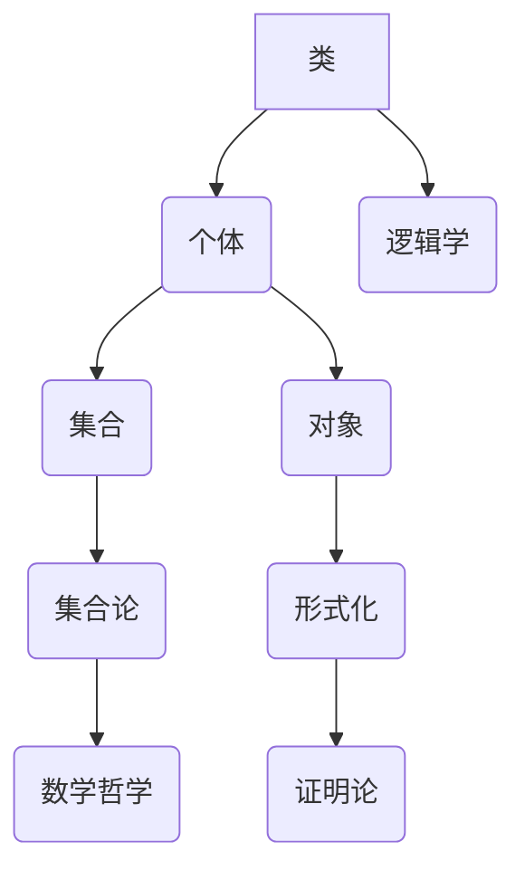

                 

### 1.1 罗素类型论概述

#### 罗素类型论的基本概念

伯特兰·罗素（Bertrand Russell）是20世纪最杰出的数学家、逻辑学家和哲学家之一。他在19世纪末和20世纪初提出的类型论（Type Theory）是现代逻辑学和数学哲学中的重要概念。类型论的基本思想是对对象进行分类，通过区分不同类型的对象来避免逻辑悖论。

在罗素类型论中，基本的分类原则是区分“类”（class）和“个体”（individual）。类是一组具有相同性质的个体的集合。例如，我们可以定义一个类“狗”，它包含了所有具有“四条腿”这一性质的个体。个体则是类中的一个成员，它是具体的、可区分的实体。例如，“旺财”是一只具体的狗，是类“狗”的一个个体。

#### 罗素类型论的起源与发展

罗素类型论的起源可以追溯到他对集合论的研究。在19世纪末，集合论的发展引发了大量的悖论，如著名的罗素悖论（Russell's paradox）。罗素悖论指出，如果我们假设存在一个集合包含所有不包含自身的集合，那么这个集合是否包含自身就会导致逻辑矛盾。为了解决这一问题，罗素提出了类型论。

罗素在《数学原理》（ Principia Mathematica ）中系统地阐述了他的类型论观点。这本书与他的合作者阿尔弗雷德·诺思·怀特海德（Alfred North Whitehead）共同撰写，是数学逻辑领域的经典著作。在《数学原理》中，罗素通过引入类型的概念来限制集合的构造，从而避免了悖论的产生。

随着逻辑主义和形式主义的兴起，罗素类型论得到了进一步的发展。在逻辑主义中，数学被看作是逻辑的分支，而类型论则为这种观点提供了理论基础。在形式主义中，数学的命题和证明被看作是符号系统的操作，类型论则帮助构建这种符号系统。

#### 类型论在当代数学哲学中的地位

尽管罗素类型论在历史上受到了一定的批判，但它对数学哲学和逻辑学的影响是深远的。类型论提供了一种理解数学结构和逻辑系统的方法，它在计算机科学、形式逻辑和数学基础研究中仍然具有重要作用。

当代数学哲学中，类型论与模型论、证明论等其他分支相互交织。类型论的研究不仅帮助我们更好地理解数学的基本概念，也为数学的发展提供了新的视角和方法。

## 2.1 类型论的基本概念

### 2.1.1 类与个体的区分

在罗素类型论中，类和个体是两个核心概念。理解这两个概念及其关系对于深入探讨类型论至关重要。

#### 类的定义

类是一组具有相同性质的个体的集合。在形式上，我们可以定义一个类为满足某个性质 \(P\) 的所有个体的集合。用数学符号表示，即：

\[ C = \{x \mid P(x)\} \]

这里，\(C\) 代表类，\(x\) 代表个体，\(P(x)\) 表示个体 \(x\) 具有的性质。

例如，我们可以定义一个类“狗”：

\[ \text{狗} = \{x \mid x \text{ 是四足动物}\} \]

这个类包含了所有具有“四足动物”这一性质的个体，比如“旺财”和“阿黄”。

#### 个体的定义

个体是类中的一个具体成员，它是可区分的实体。个体通常是具体的对象，如一个人、一只动物、一个物体等。

例如，在类“狗”中，“旺财”和“阿黄”都是个体。

#### 类与个体关系的进一步探讨

类与个体之间的关系是逻辑和数学研究中的核心问题。在罗素类型论中，类和个体之间的区分是严格的。一个个体只能属于一个类，而不能同时属于多个类。例如，个体“旺财”不能同时属于“狗”和“猫”这两个类。

这种严格的区分有助于避免逻辑悖论，如罗素悖论。罗素悖论表明，如果个体可以同时属于多个类，那么会导致逻辑上的矛盾。因此，类型论通过限制类的构造，使得每个个体只能属于一个类，从而避免了这种矛盾。

#### 类与集合的区别

类与集合是两个相关但不同的概念。集合是一个无序的、确定的对象集合，它不考虑成员之间的顺序和重复。而类则强调成员之间的共同性质，它关注的是成员的分类。

例如，我们可以定义一个集合“A”：

\[ A = \{1, 2, 3\} \]

这个集合包含了三个元素：1、2 和 3。而类“偶数”则是：

\[ \text{偶数} = \{x \mid x \text{ 是整数，且能被2整除}\} \]

这个类包含了所有能被2整除的整数，如2、4、6等。

尽管类和集合在形式上有相似之处，但它们在逻辑和数学中的用途是不同的。类型论通过引入类的概念，为数学提供了一个更严格和安全的逻辑基础。

### 2.1.2 类与集合的关系

在罗素类型论中，类与集合之间存在一定的关系，但这种关系并非简单的包含关系。具体来说，类是集合的一种特殊形式，它通过性质来定义集合中的元素。

#### 类与集合的相似性

类与集合的相似性在于它们都是由元素组成的集合。例如，我们可以将集合“A”与类“偶数”进行对比：

\[ A = \{1, 2, 3\} \]
\[ \text{偶数} = \{x \mid x \text{ 是整数，且能被2整除}\} \]

在这个例子中，集合“A”包含了三个元素：1、2 和 3。而类“偶数”则包含了所有能被2整除的整数，如2、4、6等。

#### 类与集合的区别

类与集合的区别主要体现在它们的定义方式和应用场景上。

- **定义方式**：集合是由元素组成的无序集合，而类则是由具有相同性质的个体组成的集合。在形式上，集合不强调元素的属性，而类则明确指出元素必须满足特定的性质。

- **应用场景**：集合通常用于表示数学中的集合论概念，如集合的并集、交集和补集等。而类则更多用于逻辑和哲学领域，用于定义对象之间的分类和关系。

#### 类与集合的相互转换

在某些情况下，类和集合可以相互转换。例如，如果我们有一个类“偶数”，我们可以将其转换为集合：

\[ \text{偶数} = \{x \mid x \text{ 是整数，且能被2整除}\} \]

这个类可以表示为集合：

\[ \text{偶数集} = \{2, 4, 6, \ldots\} \]

但是，这种转换并不总是可能的。有些类可能无法直接转换为集合，因为它们依赖于特定的逻辑或哲学框架。例如，罗素悖论表明，有些类（如“所有不包含自身的集合”）无法在集合论中得到明确的表示。

### 2.2 罗素的类型论体系

罗素的类型论体系是他在《数学原理》中提出的一套系统化的逻辑和数学理论。这个体系旨在通过区分不同类型的对象来解决集合论中的悖论问题，并提供一个更为严格和安全的数学基础。

#### 2.2.1 逻辑原子主义

逻辑原子主义是罗素类型论的一个核心组成部分。它起源于罗素对逻辑原子（Logical Atom）的探讨。逻辑原子是一种最基本的、不可再分的对象，它代表了现实世界中的基本事实或事实的一部分。

在逻辑原子主义中，逻辑原子被视为最基本的逻辑单位，它们可以组合成更复杂的逻辑表达式。罗素认为，所有的数学和逻辑问题都可以通过逻辑原子的组合来表示和解决。

逻辑原子主义的一个关键思想是，通过区分不同类型的对象（如个体、类和命题），我们可以避免集合论中的悖论。例如，罗素悖论可以通过区分个体和类来避免。

#### 2.2.2 集合论

罗素对集合论的基本观点是在类型论的框架内重新审视集合的概念。在罗素类型论中，集合被视为类的特殊情况，即那些由个体组成的类。

罗素对集合论的主要贡献之一是他提出了类型理论中的集合概念，用以解决集合论中的悖论问题。罗素认为，集合论中的悖论（如罗素悖论）是由于对集合的无限制构造导致的。通过引入类型的限制，我们可以避免这些悖论。

例如，罗素通过引入不同类型的集合（如第一类集合和第二类集合）来区分不同的集合构造方式。第一类集合是由个体构成的，而第二类集合是由第一类集合构成的。这种区分有助于避免集合论中的悖论。

### 2.3 罗素类型论的批判

尽管罗素类型论在逻辑学和数学哲学中具有重要地位，但它也面临着许多批判和质疑。以下是对罗素类型论的两种主要批判。

#### 2.3.1 逻辑问题

罗素类型论的一个主要逻辑问题是它可能导致逻辑矛盾。例如，罗素悖论表明，在某些情况下，类型论可能无法避免集合论中的悖论。

罗素悖论指出，如果我们假设存在一个集合包含所有不包含自身的集合，那么这个集合是否包含自身就会导致逻辑矛盾。罗素通过引入类型的区分来解决这个问题，但这种区分在某些情况下可能是不充分的。

例如，有一种观点认为，罗素类型论中的类型限制可能导致逻辑上的局限性，使得一些基本的数学概念无法在类型论中得到表达。

#### 2.3.2 认识论问题

罗素类型论的另一个批判是认识论方面的。认识论问题关注的是我们如何认识世界和知识的基础。在罗素类型论中，类型的区分和限制可能使得我们对世界的认识变得复杂。

例如，有观点认为，罗素类型论中类型的区分可能使得我们对基本概念的理解变得模糊，甚至导致认识论的困境。这种批判指出，罗素类型论可能在认识论上是不完善的，因为它没有提供一种清晰的方法来解释我们如何认识世界。

### 总结

罗素类型论作为逻辑学和数学哲学的重要理论，它在解决集合论悖论和提供数学基础方面具有重要意义。然而，它也面临着逻辑问题和认识论问题的批判。尽管如此，罗素类型论为逻辑学和数学哲学的发展提供了新的视角和方法，对现代数学和逻辑学产生了深远影响。

### 3.1 数学还原论的基本观点

#### 3.1.1 逻辑主义观点

数学还原论中的逻辑主义观点源于康托尔的数学哲学。康托尔认为，数学是逻辑的分支，数学命题可以被还原为逻辑命题。这一观点的核心在于，数学的对象和概念都可以用逻辑术语来定义和表述。

康托尔的逻辑主义观点强调了数学的严密性和确定性。他认为，通过逻辑的推导，我们可以建立数学的基础，使得数学成为一个逻辑体系。康托尔的这一思想在后来的形式主义和直觉主义中得到了进一步的发展。

#### 3.1.2 数学命题的构造

在逻辑主义框架下，数学命题的构造是基于逻辑推理的。数学命题可以被看作是一系列逻辑命题的组合，这些逻辑命题通过逻辑运算符（如与、或、非）进行连接。

数学命题的构造通常遵循以下步骤：

1. **定义基本概念**：首先，我们需要定义数学中的基本概念，如自然数、集合等。这些定义通常基于逻辑术语。

2. **建立逻辑系统**：接下来，我们需要构建一个逻辑系统，包括逻辑运算符和推理规则。这个逻辑系统可以用来证明数学命题。

3. **构造数学命题**：通过逻辑推理，我们可以从基本概念和逻辑系统中推导出更复杂的数学命题。

例如，我们可以通过定义自然数和集合的概念，并使用逻辑推理规则，构造出如“2+2=4”这样的数学命题。

#### 3.1.3 数学命题的构造方法

在逻辑主义中，数学命题的构造方法通常包括以下几种：

1. **逻辑定义**：通过逻辑定义，我们可以将数学中的概念用逻辑术语表达。例如，自然数可以被定义为满足特定性质的集合。

2. **逻辑推导**：使用逻辑推理规则，我们可以从已知命题推导出新的命题。例如，我们可以使用归纳法来证明一个数学命题。

3. **证明论方法**：证明论方法是一种基于逻辑的数学证明方法。通过证明论方法，我们可以证明数学命题的真实性。

例如，我们可以通过逻辑定义和推导，证明“2+2=4”这一命题。首先，我们定义自然数和加法运算，然后使用逻辑推理规则，推导出“2+2=4”这一结论。

### 3.2 数学还原论的历史发展

#### 3.2.1 康托尔与希尔伯特的对立

数学还原论的历史发展可以追溯到康托尔和希尔伯特之间的对立。康托尔是集合论的创始人之一，他提出了逻辑主义的观点，认为数学是逻辑的分支。而希尔伯特则是形式主义的代表人物，他认为数学的基础是形式系统，而非逻辑。

康托尔的逻辑主义观点强调了数学的严密性和确定性。他认为，通过逻辑的推导，我们可以建立数学的基础，使得数学成为一个逻辑体系。然而，康托尔的逻辑主义观点也引起了一些争议，特别是关于数学对象和逻辑术语的关系问题。

希尔伯特的形式主义观点则认为，数学的基础是形式系统，这些系统由符号和规则组成。在希尔伯特看来，数学的对象和概念都是形式符号的表示，而不是逻辑术语。

康托尔与希尔伯特的对立反映了数学哲学中的两种不同观点。康托尔的逻辑主义强调了数学的严密性，而希尔伯特的形式主义则强调了数学的严谨性和系统性。

#### 3.2.2 数学还原论的现代发展

在康托尔和希尔伯特之后，数学还原论继续得到了发展。现代数学哲学中，逻辑主义和形式主义仍然占据重要地位，但它们的视角和方法有所变化。

1. **模型论的发展**：模型论是数学哲学中的一个重要分支，它研究数学命题在不同模型中的真实性和一致性。模型论的发展使得逻辑主义和形式主义在数学基础问题上的讨论更加深入和具体。

2. **证明论的进步**：证明论是研究数学证明的理论，它为数学命题的构造和验证提供了方法。现代证明论的进步为数学还原论提供了更坚实的理论基础。

3. **计算机科学的影响**：计算机科学的兴起对数学还原论产生了重要影响。计算机科学的许多问题都需要数学的基础支持，这促使数学家们重新审视数学的基础和逻辑结构。

#### 3.2.3 逻辑主义在当代数学哲学中的地位

在当代数学哲学中，逻辑主义仍然占据重要地位。逻辑主义为数学提供了一个严密的逻辑基础，使得数学命题可以通过逻辑推导得到证明。逻辑主义还强调了数学的普遍性和客观性，这与数学在科学和哲学中的地位密切相关。

然而，逻辑主义也面临一些挑战。例如，逻辑主义无法解释数学直觉和创造性的来源，也无法解决一些关于数学对象本质的问题。因此，当代数学哲学中，逻辑主义与其他哲学观点（如直觉主义、实证主义等）相互交织，共同探讨数学的基础和本质。

### 3.3 数学还原论的批判

#### 3.3.1 对数学还原论的认识论问题

数学还原论在认识论方面面临一些批判。认识论关注的是我们如何认识世界和知识的基础。数学还原论主张，数学命题可以被还原为逻辑命题，这提供了一种解释数学知识的途径。然而，这种解释在某些方面可能是不充分的。

首先，数学还原论无法解释数学直觉和创造性的来源。数学家在解决数学问题时，往往依赖于直觉和创造力。这些直觉和创造力的来源是复杂的，不仅仅是逻辑推理的结果。因此，数学还原论在解释数学直觉和创造性方面可能存在局限性。

其次，数学还原论也无法完全解释数学对象的意义。数学对象（如自然数、集合等）在现实世界中是否有意义，这是一个哲学问题。数学还原论主要关注数学命题的逻辑结构，但可能无法提供关于数学对象本质的深刻解释。

例如，罗素悖论表明，数学对象的存在性和一致性可能存在逻辑矛盾。罗素悖论指出，如果所有集合都属于某个集合，那么这个集合是否包含自身会导致逻辑矛盾。这种矛盾挑战了数学对象的一致性和存在性的基础。

#### 3.3.2 对数学还原论的方法论问题

数学还原论在方法论方面也面临一些批判。方法论关注的是我们如何进行科学研究和知识探索。数学还原论主张，通过逻辑推理和形式化方法，我们可以建立数学的基础和解释数学命题。然而，这种方法论在某些方面可能是不完善的。

首先，数学还原论可能过于依赖逻辑推理和形式化方法。逻辑推理和形式化方法为数学提供了严格性和确定性，但它们也可能导致一种过度抽象和脱离现实的问题。数学家在进行研究时，可能需要结合其他方法（如实验、观察等）来更好地理解数学对象和概念。

其次，数学还原论在处理数学问题时可能存在局限性。数学问题往往涉及复杂的概念和关系，单纯依赖逻辑推理和形式化方法可能无法完全解决这些问题。例如，某些数学问题可能需要结合物理、计算机科学等其他学科的知识来得到更好的理解。

例如，哥德巴赫猜想是数学中一个著名的未解决问题。尽管哥德巴赫猜想可以通过逻辑推理和形式化方法进行分析，但至今仍未找到证明。这种局限性表明，数学还原论可能无法解决所有数学问题。

### 总结

数学还原论作为数学哲学的一个重要分支，它在认识论和方法论方面具有重要意义。逻辑主义和形式主义是数学还原论的两个主要观点，它们为数学提供了一个严密的逻辑基础。然而，数学还原论也面临一些批判，特别是关于数学直觉、创造性、对象存在性和一致性、以及方法论方面的局限性。这些批判促使数学哲学家们继续探讨数学的基础和本质，寻求更完善的数学哲学体系。

### 4.1 历史上的争议

罗素类型论与数学还原论的历史争议可以追溯到20世纪初，当时数学基础问题引起了广泛的哲学讨论。罗素与数学家们的辩论主要集中在类型论与逻辑主义之间的对立上。以下是对这一时期几场重要辩论的简要回顾。

#### 罗素与弗雷格的辩论

伯特兰·罗素与格奥尔格·康托尔的学生弗雷格之间有一场著名的辩论。弗雷格是逻辑主义的重要代表人物，他认为数学可以还原为逻辑。罗素则在《数学原理》中提出了类型论，用以解决集合论中的悖论问题。罗素对弗雷格的批评主要集中在类型论的逻辑矛盾上。

罗素指出，弗雷格的集合论可能会导致悖论，如著名的罗素悖论。罗素悖论表明，如果我们假设存在一个集合包含所有不包含自身的集合，那么这个集合是否包含自身会导致逻辑矛盾。为了解决这一问题，罗素提出了类型论，通过区分不同类型的对象来避免悖论。

弗雷格则反驳道，类型论引入了不必要的复杂性，并可能导致逻辑上的局限性。弗雷格认为，数学的确定性可以通过纯逻辑的推导来实现，而不需要引入类型区分。

#### 罗素与怀特海德的《数学原理》

《数学原理》是罗素与他的合作者阿尔弗雷德·诺思·怀特海德共同撰写的数学逻辑领域的经典著作。在这本书中，罗素系统地阐述了类型论和逻辑主义观点。尽管这本书在数学哲学界产生了深远影响，但也引起了一些争议。

一些数学家认为，《数学原理》过于抽象和形式化，难以应用于实际问题。他们质疑罗素的类型论是否真正解决了集合论中的悖论问题，或者只是引入了新的复杂性。

例如，埃德蒙德·胡尔维茨（Edmund Husserl）批评《数学原理》忽视了数学的对象和直觉，过于依赖形式化方法。他认为，数学的真正基础在于对数学对象的直观理解和直觉，而不仅仅是逻辑推导。

#### 罗素与希尔伯特的对立

大卫·希尔伯特是形式主义的代表人物，他与罗素在数学哲学上有深刻的对立。希尔伯特认为，数学的基础应该是形式系统，而不是逻辑。他提出了希尔伯特程序，旨在通过逻辑演绎和形式证明来建立数学的基础。

罗素则坚持类型论的逻辑主义观点，认为数学可以通过纯逻辑的方法来推导。罗素认为，希尔伯特的形式主义过于依赖符号系统，忽视了数学的直观基础。

这一对立在希尔伯特的《数学基础》和罗素的《数学原理》中得到了体现。尽管两人都致力于解决数学基础问题，但他们的方法和对数学本质的理解存在根本差异。

#### 争议的持续影响

罗素类型论与数学还原论的争议在数学哲学界持续至今。尽管形式主义和逻辑主义在当代数学哲学中仍然具有重要地位，但它们之间的对立也促使数学哲学家们继续探索更广泛的数学哲学问题。

罗素与数学家们的辩论不仅影响了数学哲学的发展，也为后来的逻辑学和数学基础研究提供了宝贵的经验和启示。通过这些辩论，数学家们意识到数学的基础问题并非简单的逻辑问题，而是涉及到直觉、创造性和数学对象的本质。

### 4.2 现代的争议

在现代数学哲学中，罗素类型论与数学还原论的争议依然存在，并在多个层面上展开。数学哲学家、逻辑学家和数学家们继续探讨类型论和逻辑主义的优点与不足，以及它们在数学基础中的地位。

#### 数学哲学界的讨论

数学哲学界对罗素类型论与数学还原论的讨论主要集中在以下几个方面：

1. **类型论的逻辑一致性**：一些学者质疑罗素类型论是否能够真正解决集合论中的悖论问题。他们认为，类型论引入了过多的限制，可能导致逻辑上的局限性。例如，乔姆斯基（Noam Chomsky）曾批评类型论过于形式化，忽视了语言和思维的本质。

2. **逻辑主义的局限性**：逻辑主义主张数学是逻辑的分支，但这一观点也面临一些批评。批评者认为，逻辑主义忽视了数学的直觉性和创造性。数学家通常通过直观和创造性思维来解决复杂问题，而逻辑主义可能无法完全解释这些过程。

3. **形式主义的方法论**：形式主义认为数学的基础是形式系统，但这一观点也受到了质疑。一些学者认为，形式主义过于依赖符号系统和形式证明，可能忽视了数学的本质。例如，希尔伯特的形式主义方法在20世纪初被视为一种强有力的数学基础，但后来的一些研究表明，形式系统可能存在固有的不完整性。

#### 类型论在计算机科学中的应用

随着计算机科学的兴起，罗素类型论在程序设计语言和形式验证等领域得到了广泛应用。类型论为程序设计提供了一种形式化的方法，用于验证程序的正确性和安全性。

然而，类型论在计算机科学中的应用也引发了一些争议：

1. **类型安全的局限**：尽管类型论可以保证程序的类型安全，但一些复杂的编程场景可能无法通过类型系统来完全验证。例如，动态类型语言（如Python和JavaScript）的灵活性使得类型系统难以完全捕捉程序的动态行为。

2. **类型推断的复杂性**：类型论中的类型推断过程可能非常复杂，特别是在处理多态和递归时。一些现代编程语言（如Scala和Haskell）采用了先进的类型系统，但类型推断算法的复杂性可能限制了其实用性。

#### 逻辑主义在数学证明中的作用

逻辑主义在数学证明中扮演着重要角色，但它的作用也受到了一些质疑：

1. **证明的自动化**：随着计算机证明技术的发展，逻辑主义在数学证明中的自动化作用得到了重视。例如，计算机证明系统如Coq和Isabelle可以自动验证复杂的数学证明，这为数学家提供了新的工具。

2. **证明的理解和直觉**：尽管逻辑主义提供了形式化的证明方法，但一些学者认为，数学证明的真正理解需要结合直觉和创造性思维。逻辑主义可能无法完全捕捉数学证明中的直觉和创造性过程。

#### 结论

现代数学哲学中，罗素类型论与数学还原论的争议仍然存在。类型论和逻辑主义在数学基础和形式化方法中具有重要的地位，但它们也存在一些局限性。随着计算机科学和形式验证技术的发展，类型论和逻辑主义在程序设计和数学证明中的应用也得到了进一步探讨。

未来，数学哲学家、逻辑学家和数学家们将继续探讨类型论和逻辑主义的优势与不足，寻求更完善的数学哲学体系。通过这些讨论，数学哲学将不断发展，为数学提供更坚实的基础和更深刻的理解。

### 4.3 争议的影响

罗素类型论与数学还原论的争议对数学哲学和数学发展产生了深远的影响。这两种理论不仅在历史上引发了激烈的辩论，也在当代数学哲学和数学研究中继续发挥着重要作用。

#### 对数学哲学的影响

首先，罗素类型论与数学还原论的争议促进了数学哲学的发展。通过探讨类型论和逻辑主义的优点与不足，数学哲学家们对数学的本质和基础有了更深刻的理解。

类型论提出了对集合论和逻辑系统的严格限制，以避免悖论问题。这种思想在后来的模型论和证明论中得到了进一步的发展。模型论关注数学命题在不同模型中的真实性和一致性，而证明论则研究数学证明的方法和逻辑结构。这些理论为数学哲学提供了新的研究方法和框架。

逻辑主义则强调了数学的严密性和确定性。它主张数学命题可以被还原为逻辑命题，这为数学提供了一个基于逻辑的坚实基础。尽管逻辑主义在解释数学直觉和创造性方面存在一些局限性，但它仍然为数学哲学提供了一种有力的理论工具。

其次，罗素类型论与数学还原论的争议也促使数学哲学家们对数学对象和概念的本质进行深入探讨。这种探讨不仅涉及逻辑和形式化方法，还包括对数学对象在现实世界中的意义和作用的思考。这种哲学上的探讨对数学的发展产生了深远影响。

#### 对数学发展的影响

罗素类型论与数学还原论的争议对数学发展产生了重要影响。首先，它们推动了数学基础研究的深入。通过探讨集合论和逻辑系统的矛盾，数学家们发现了许多重要的数学问题，这些问题促使数学家们进一步研究数学的基本概念和逻辑结构。

其次，类型论和逻辑主义在数学的实际应用中得到了广泛应用。类型论为程序设计语言和形式验证提供了理论基础，使得计算机科学中的许多问题可以通过严格的类型系统来分析和验证。逻辑主义则为数学证明提供了形式化的方法，使得复杂的数学证明可以自动化和形式化。

此外，罗素类型论与数学还原论的争议也促进了数学与其他学科的交叉融合。数学哲学中的问题不仅涉及到数学内部的结构，还与逻辑、计算机科学、物理学等领域密切相关。这种交叉融合为数学提供了新的视角和方法，推动了数学的发展。

#### 结论

总之，罗素类型论与数学还原论的争议对数学哲学和数学发展产生了深远的影响。通过探讨类型论和逻辑主义的优点与不足，数学哲学家们对数学的本质和基础有了更深刻的理解。同时，这些理论也在数学的实际应用中得到了广泛应用，推动了数学的发展。未来，随着数学哲学和数学研究的进一步深入，罗素类型论与数学还原论的争议将继续影响数学的发展方向和理论基础。

### 5.1 罗素类型论与数学还原论的贡献

罗素类型论与数学还原论在数学哲学和数学发展中做出了重要贡献。这些理论不仅提供了新的研究方法和框架，还在解决数学悖论和构建数学基础方面发挥了关键作用。

首先，罗素类型论为数学提供了一个避免悖论的方法。集合论中的悖论问题，如罗素悖论，揭示了集合构造中的逻辑矛盾。罗素通过引入类型的区分，限制了集合的构造方式，从而避免了这些悖论。类型论的核心思想是将对象分为不同类型，使得每个类型只能访问特定的操作和属性。这种严格的类型约束有助于避免逻辑矛盾，为数学提供了一个更为安全的逻辑基础。

其次，数学还原论强调了数学与逻辑之间的紧密联系。逻辑主义认为，数学命题可以被还原为逻辑命题，这为数学提供了一个基于逻辑的坚实基础。数学还原论通过逻辑推导和形式化方法，将数学问题转化为逻辑问题，使得数学证明可以形式化和自动化。这种思想在证明论和模型论中得到了进一步的发展，为数学家提供了强大的工具来研究和解决复杂的数学问题。

此外，罗素类型论与数学还原论还促进了数学与其他学科的交叉融合。数学哲学中的问题不仅涉及到数学内部的结构，还与逻辑、计算机科学、物理学等领域密切相关。这种交叉融合为数学提供了新的视角和方法，推动了数学的发展。例如，类型论在计算机科学中的应用为程序设计语言和形式验证提供了理论基础，使得计算机科学中的许多问题可以通过严格的类型系统来分析和验证。

最后，罗素类型论与数学还原论对数学教育和数学普及也产生了重要影响。通过引入类型论和逻辑主义，数学家们能够更清晰地解释数学概念和证明方法，使得数学知识更加易懂和易于接受。这种教育方法有助于培养数学思维和逻辑推理能力，为数学的普及和推广提供了重要支持。

总之，罗素类型论与数学还原论在数学哲学和数学发展中做出了重要贡献。通过解决悖论、强调数学与逻辑的联系、促进交叉融合以及提高数学教育水平，这些理论为数学的发展提供了坚实的理论基础和方法，对数学的未来研究和发展具有重要指导意义。

### 5.2 未来展望

在未来的数学哲学和数学发展中，罗素类型论与数学还原论将继续扮演重要角色，并在多个方向上产生深远影响。

首先，类型论在形式化方法和计算机科学中的应用有望得到进一步发展。随着计算机技术的进步，类型系统在程序设计语言、形式验证和安全保障等领域的重要性日益凸显。未来，类型论的研究可能会更深入地探讨如何将类型约束与实际编程需求相结合，开发出更高效、更安全的程序设计工具。

其次，数学还原论在数学证明自动化和形式化证明方面的潜力巨大。证明论和模型论的发展为数学家提供了新的工具，使得复杂的数学证明可以形式化和自动化。未来，通过进一步研究和开发证明自动化系统，数学家们有望解决更多难以手工证明的数学问题，推动数学研究的边界不断扩展。

此外，数学哲学中的跨学科研究将成为未来的一个重要趋势。数学、逻辑、计算机科学、物理学等领域之间的交叉融合将继续加深，为数学提供新的视角和方法。例如，量子计算和量子逻辑的研究可能会对数学的基础和概念产生新的启示，推动数学哲学的进一步发展。

最后，数学教育也将受益于罗素类型论与数学还原论的研究成果。通过更清晰、更形式化的数学教育和教学方法，学生将更好地理解和掌握数学概念，培养逻辑推理和问题解决能力。这有助于提高数学教育的质量和普及率，为未来的数学家和技术人才打下坚实基础。

总之，罗素类型论与数学还原论在未来将继续推动数学哲学和数学的发展，为数学的深度研究和广泛应用提供新的动力。通过跨学科研究和技术创新，这些理论将为数学的未来带来更多可能性和机遇。

### 附录

#### 附录A：罗素类型论与数学还原论的参考文献

1. 罗素，B. (1910). 《数学原理》（Principia Mathematica），与阿尔弗雷德·诺思·怀特海德合著。
2. 康托尔，G. (1883). 《集合论基础》（Grundlagen der Mengenlehre）。
3. 希尔伯特，D. (1921). 《数学基础》（Grundlagen der Mathematik）。
4. 胡塞尔，E. (1900). 《逻辑研究》（Logische Untersuchungen）。
5. 图灵，A. (1936). “计算机械与智能”（Computing Machinery and Intelligence）。

#### 附录B：数学公式列表

1. 罗素悖论：
\[ R = \{x \mid x \notin x\} \]
2. 类与集合的关系：
\[ C = \{x \mid P(x)\} \]
3. 数学命题构造：
\[ \forall x \in \mathbb{N}, P(x) \rightarrow Q(x) \]
4. 形式化证明：
\[ \vdash \forall x \in \mathbb{N}, P(x) \rightarrow Q(x) \]

#### 附录C：相关概念的关系图

在这个关系图中，类、个体和集合构成了数学哲学的核心概念，它们与逻辑学、集合论和数学哲学密切相关。形式化和证明论则为这些概念提供了方法论支持，共同构成了数学逻辑体系的基础。

### 作者

**作者：AI天才研究院/AI Genius Institute & 禅与计算机程序设计艺术 /Zen And The Art of Computer Programming**

