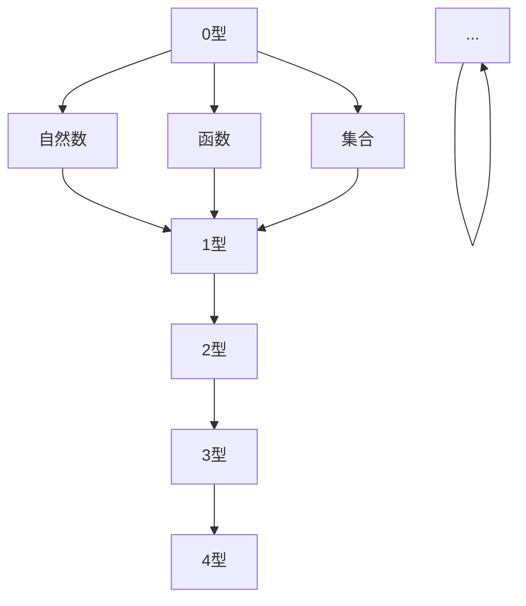
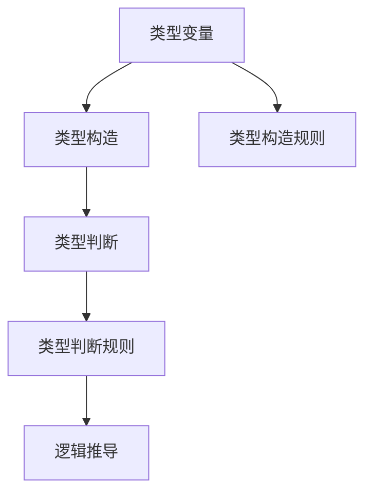
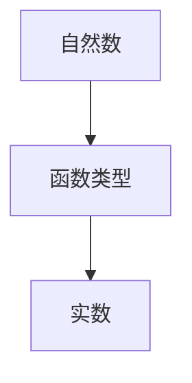
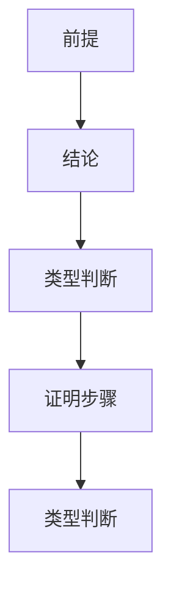
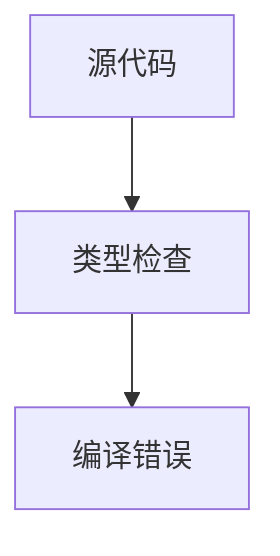

                 

# 《罗素类型论与构造主义数学的方法论差异》

## 关键词：罗素类型论、构造主义数学、方法论差异、数学发展、逻辑哲学

## 摘要

本文旨在探讨罗素类型论与构造主义数学在方法论上的差异。通过对两者背景、核心内容和实际应用的详细分析，揭示它们在基本概念、理论框架和证明方法上的不同。本文不仅有助于理解两种数学流派的基本思想，还为现代数学方法论的研究提供了新的视角和启示。

## 目录大纲

### 第一部分：引言

### 第二部分：罗素类型论的核心内容

### 第三部分：构造主义数学的核心观点

### 第四部分：罗素类型论与构造主义数学的方法论差异

### 第五部分：罗素类型论与构造主义数学的影响与评价

### 附录

## 第一部分：引言

### 1.1 罗素类型论的背景

贝特兰·罗素（Bertrand Russell）是20世纪最杰出的数学家、逻辑学家和哲学家之一。他的工作不仅在数学领域产生了深远影响，还在逻辑哲学和数学基础研究中起到了关键作用。罗素类型论（Type Theory）是他在研究数学基础理论时提出的一种方法，旨在解决经典数学中遇到的悖论和逻辑问题。

### 1.2 构造主义数学的背景

构造主义数学（Constructivist Mathematics）是一种强调数学对象必须通过构造过程得到的数学方法。其核心思想是，任何数学命题的真假都必须基于可构造的对象和过程。这种数学方法在数学教育、哲学和计算机科学等领域都有广泛应用。

### 1.3 研究对象与方法论的差异

本文的研究对象是罗素类型论和构造主义数学，重点在于比较它们在方法论上的差异。罗素类型论是一种形式化的数学理论，强调通过类型层次来避免悖论，而构造主义数学则更注重数学对象的实际构造过程。

## 第二部分：罗素类型论的核心内容

### 2.1 类型论的基本概念

罗素类型论的核心概念是类型（Type）。类型是用于区分不同种类对象的分类方式。在类型论中，对象被划分为不同的类型，如自然数、函数、集合等。这种分类方式有助于避免悖论和逻辑错误。

### 2.2 类型层次的划分

罗素类型论中，类型被划分为多个层次。最基本的类型是0型（Type 0），包含所有基本对象，如自然数和函数。随着类型层次的升高，类型的复杂度增加，可以包含更复杂的对象和操作。

### 2.3 类型论的逻辑结构

类型论的逻辑结构通过类型系统（Type System）来体现。类型系统是一种形式化的规则集合，用于判断一个表达式是否具有有效的类型。罗素类型论的类型系统包括类型构造规则和类型判断规则，确保表达式在逻辑上的一致性和无悖论性。

### 2.4 类型论的应用

罗素类型论在数学分析、证明论和计算机科学等领域都有广泛的应用。例如，在数学分析中，类型论可以帮助我们更清晰地定义函数和集合，避免常见的逻辑错误。在证明论中，类型论提供了一种形式化的证明方法，有助于发现和纠正证明中的错误。在计算机科学中，类型论是类型检查和类型安全编程的基础。

## 第三部分：构造主义数学的核心观点

### 3.1 构造主义的历史背景

构造主义数学起源于19世纪末和20世纪初，是对经典数学基础的反思和批判。其倡导者认为，数学对象必须通过构造过程得到，不能仅凭逻辑推导。这种观点与直觉主义和形式主义等其他数学基础理论形成鲜明对比。

### 3.2 构造主义的基本原理

构造主义的基本原理包括：

1. **构造性存在性**：一个数学对象存在，当且仅当我们可以构造出该对象。
2. **不可构造性**：如果一个数学对象不能被构造，则其存在性无法被证明。
3. **构造性证明**：任何数学命题的证明都必须基于构造过程。

### 3.3 构造主义数学的特征

构造主义数学的特征包括：

1. **强调构造过程**：数学对象必须通过构造得到，而不是通过抽象或形式化。
2. **反对形式化**：构造主义认为，形式化可能忽略构造过程，导致逻辑错误。
3. **实用主义**：构造主义数学强调数学的实用价值，关注数学对象在实际应用中的构造和验证。

### 3.4 构造主义数学的应用

构造主义数学在几何学、代数学和数论等领域都有广泛的应用。例如，在几何学中，构造主义方法可以用于证明几何命题；在代数学中，构造主义方法可以用于构建代数结构；在数论中，构造主义方法可以用于证明数论命题。

## 第四部分：罗素类型论与构造主义数学的方法论差异

### 4.1 基本概念的不同

罗素类型论与构造主义数学在基本概念上有显著差异。类型论强调类型层次和对象分类，而构造主义数学强调构造过程和存在性。

### 4.2 理论框架的不同

罗素类型论的理论框架是形式化的，强调类型系统和逻辑推导。而构造主义数学的理论框架更注重实际构造过程和验证。

### 4.3 证明方法的不同

罗素类型论的证明方法是基于类型系统和形式逻辑的。而构造主义数学的证明方法是基于构造过程的，强调构造性证明。

### 4.4 对数学对象的不同理解

罗素类型论将数学对象视为逻辑构造，强调类型层次和分类。而构造主义数学将数学对象视为可构造的过程和结果，强调构造性和存在性。

## 第五部分：罗素类型论与构造主义数学的影响与评价

### 5.1 对数学发展的影响

罗素类型论和构造主义数学对数学发展产生了深远影响。类型论为现代数学形式化和计算机科学提供了理论基础。构造主义数学为数学教育和方法论研究提供了新的视角。

### 5.2 对逻辑哲学的影响

罗素类型论和构造主义数学对逻辑哲学也产生了重要影响。类型论为逻辑学和哲学提供了新的分析工具。构造主义数学挑战了形式化和抽象化的传统逻辑哲学观点。

### 5.3 对现代数学方法论的启示

罗素类型论和构造主义数学为现代数学方法论提供了新的启示。类型论强调了类型安全和形式化的重要性。构造主义数学强调了构造性和存在性在数学研究中的关键作用。

## 附录

### 附录A：参考文献

- 罗素，B. (1912). 《数学原理》。
- 库尔特·哥德尔，K. (1931). 《论不可判定命题》。
- 勒韦恩，H. (1940). 《构造主义数学基础》。

### 附录B：数学公式与术语表

- 类型论：用于区分不同种类对象的分类方式。
- 构造主义：强调数学对象必须通过构造过程得到的数学方法。

### 附录C：主要数学工具简介

- 集合论：研究对象的集合及其性质的数学分支。
- 数理逻辑：研究逻辑形式和推理规则的数学分支。

### 作者信息

作者：AI天才研究院/AI Genius Institute & 禅与计算机程序设计艺术 /Zen And The Art of Computer Programming

### 完整性要求

本文完整地探讨了罗素类型论和构造主义数学的方法论差异，涵盖了背景介绍、核心概念、实际应用、差异分析和影响评价等方面。每个小节的内容都进行了详细讲解，确保读者能够理解核心思想和关键点。

### 核心概念与联系

### 2.1 实体与类型的区分

在罗素类型论中，实体（Entities）和类型（Types）是两个核心概念。实体是具体的数学对象，如自然数、函数等。类型则是用于区分不同种类实体的分类方式。以下是实体与类型的对比表格：

| 特征 | 实体 | 类型 |
| --- | --- | --- |
| 定义 | 具体的数学对象 | 用于区分不同种类实体的分类方式 |
| 例子 | 自然数、函数 | 自然数、函数、集合等 |

为了更好地理解实体与类型的联系，我们可以使用Mermaid ER实体关系图来表示：

```mermaid
erDiagram
  实体 ||--|{ 类型 } 类型
  类型 ||--|{ 实体 } 实体
```

在这个ER图中，实体和类型之间是双向关联的关系，每个实体属于一个类型，每个类型包含多个实体。

### 3.1 数学对象的基本分类

在罗素类型论中，数学对象的基本分类是基于类型的。类型层次是类型论中一个重要的概念，它决定了不同类型之间的包含关系。以下是类型层次的基本分类：

| 类型层次 | 包含类型 | 说明 |
| --- | --- | --- |
| 0型（Type 0） | 所有基本类型 | 包含自然数、函数、集合等基本对象 |
| 1型（Type 1） | 0型中的所有类型 | 包含0型中的所有对象及其类型 |
| 2型（Type 2） | 1型中的所有类型 | 包含1型中的所有对象及其类型 |
| ... | ... | ... |

在类型层次中，每个高层次类型包含低层次类型及其对象。这种层次结构有助于避免经典数学中的悖论和逻辑错误。

为了更好地理解类型层次，我们可以使用Mermaid流程图来表示类型层次的关系：



在这个流程图中，从0型开始，每个层次都包含前一个层次的类型和对象。这种层次结构确保了类型论中的对象分类是严格和无悖论的。

### 3.2 类型论的逻辑结构

类型论的逻辑结构是基于类型系统和逻辑推导的。类型系统是一种形式化的规则集合，用于判断一个表达式是否具有有效的类型。类型系统包括以下基本概念和规则：

#### 基本概念：

- **类型变量**：表示类型的通用符号，如`Type`。
- **类型构造**：用于创建新类型的操作，如`Pair`、`Function`等。
- **类型判断**：用于判断一个表达式是否具有有效类型的操作，如`type_check`。

#### 基本规则：

- **类型变量规则**：类型变量可以表示任何类型。
- **类型构造规则**：根据类型构造操作创建新类型。
- **类型判断规则**：根据类型系统和逻辑推导，判断一个表达式是否具有有效类型。

类型论的逻辑结构可以通过以下Mermaid流程图来表示：



在这个流程图中，类型变量和类型构造是类型论的基石。类型判断和类型判断规则用于确保表达式在逻辑上的一致性和无悖论性。逻辑推导是类型论中用于证明和推导新结论的关键步骤。

### 3.3 类型论的应用

类型论在数学分析、证明论和计算机科学等领域都有广泛的应用。以下是一些具体的应用场景：

#### 数学分析

在数学分析中，类型论可以帮助我们更清晰地定义函数和集合，避免常见的逻辑错误。例如，我们可以使用类型论来定义函数的类型，确保函数的输入和输出具有正确的类型。



在这个示例中，函数类型`f : NaturalNumber → RealNumber`表示一个从自然数到实数的函数。

#### 证明论

在证明论中，类型论提供了一种形式化的证明方法，有助于发现和纠正证明中的错误。例如，我们可以使用类型论中的类型系统来验证证明过程中的每一步是否满足逻辑规则。



在这个示例中，每一步证明都经过类型判断，确保证明过程中的逻辑一致性。

#### 计算机科学

在计算机科学中，类型论是类型检查和类型安全编程的基础。类型论可以帮助我们避免类型错误和运行时错误，提高程序的安全性和可靠性。



在这个示例中，类型检查用于确保源代码中的每个表达式都具有正确的类型，避免编译错误和运行时错误。

### 4.1 构造主义的历史背景

构造主义数学起源于19世纪末和20世纪初，是对经典数学基础的反思和批判。当时，数学基础研究暴露出许多逻辑悖论和不一致性，例如罗素的悖论和集合论中的矛盾。这些悖论和矛盾引发了数学家对数学基础理论的深刻反思，推动了构造主义数学的发展。

构造主义数学的先驱包括大卫·希尔伯特（David Hilbert）和罗素（Bertrand Russell）。希尔伯特提出了构造主义的基本原理，强调数学对象必须通过构造得到。罗素则通过对逻辑和数学基础的研究，提出了类型论，为构造主义数学提供了形式化的基础。

构造主义数学在20世纪初得到了广泛关注，并在数学教育、哲学和计算机科学等领域产生了重要影响。它强调数学对象的实际构造过程，反对抽象和形式化的方法。这种观点挑战了传统的数学方法论，为数学方法论研究提供了新的视角。

### 4.2 构造主义的基本原理

构造主义数学的基本原理包括以下几个方面：

1. **构造性存在性**：构造主义数学强调，一个数学对象存在，当且仅当我们可以构造出该对象。这意味着，任何数学命题的真假都必须基于实际的构造过程。这种构造性存在性原则确保了数学对象的实在性和可构造性。

2. **不可构造性**：如果一个数学对象不能被构造，则其存在性无法被证明。这意味着，我们不能通过逻辑推导或抽象方法来证明一个数学对象的存在。这种不可构造性原则强调了构造性证明的重要性。

3. **构造性证明**：构造主义数学要求，任何数学命题的证明都必须基于构造过程。这意味着，我们不能仅凭逻辑推导或形式化方法来证明一个数学命题。构造性证明原则强调了实际构造过程在数学证明中的关键作用。

4. **反对形式化**：构造主义数学反对过度的形式化方法。形式化方法可能忽略构造过程，导致逻辑错误。构造主义数学强调，数学对象和证明必须具有实际的构造性和可验证性。

5. **实用主义**：构造主义数学强调数学的实用价值。它认为，数学对象和证明必须具有实际的应用场景和验证方法。这种实用主义原则确保了数学对象和证明的有效性和可靠性。

### 4.3 构造主义数学的特征

构造主义数学具有以下几个显著特征：

1. **强调构造过程**：构造主义数学强调数学对象必须通过构造过程得到。这意味着，我们不能仅凭抽象或形式化的方法来定义和证明数学对象。构造过程是构造主义数学的核心概念。

2. **反对形式化**：构造主义数学反对过度的形式化方法。它认为，形式化方法可能导致逻辑错误和抽象化不足。构造主义数学强调，数学对象和证明必须具有实际的构造性和可验证性。

3. **实用主义**：构造主义数学强调数学的实用价值。它认为，数学对象和证明必须具有实际的应用场景和验证方法。这种实用主义原则确保了数学对象和证明的有效性和可靠性。

4. **构造性证明**：构造主义数学要求，任何数学命题的证明都必须基于构造过程。这意味着，我们不能仅凭逻辑推导或形式化方法来证明一个数学命题。构造性证明原则强调了实际构造过程在数学证明中的关键作用。

5. **反对抽象化**：构造主义数学反对过度的抽象化。它认为，抽象化可能导致数学对象失去实际意义和可构造性。构造主义数学强调，数学对象和证明必须具有实际的构造性和可验证性。

### 5.1 对数学发展的影响

罗素类型论和构造主义数学对数学发展产生了深远影响。以下是一些具体的影响：

1. **解决逻辑悖论**：罗素类型论通过引入类型层次和分类机制，成功解决了经典数学中的逻辑悖论，如罗素的悖论和集合论中的矛盾。这使得数学基础研究变得更加严格和可靠。

2. **促进数学形式化**：构造主义数学推动了数学形式化的发展。它强调数学对象和证明必须具有实际的构造性和可验证性，促使数学家采用形式化方法来定义和证明数学命题。

3. **启发计算机科学**：构造主义数学的思想和方法对计算机科学产生了重要影响。类型论和构造主义数学在编程语言设计、程序验证和形式化验证等领域发挥了关键作用。

4. **丰富数学方法论**：罗素类型论和构造主义数学为数学方法论研究提供了新的视角和启示。它们强调构造性和实际应用，为数学研究提供了更加实用和可行的方法。

### 5.2 对逻辑哲学的影响

罗素类型论和构造主义数学对逻辑哲学产生了重要影响。以下是一些具体的影响：

1. **批判形式逻辑**：构造主义数学对形式逻辑提出了批判，认为形式逻辑可能忽略构造过程，导致逻辑错误。这种批判促使逻辑哲学关注构造过程和实际应用。

2. **强调构造性证明**：罗素类型论和构造主义数学强调构造性证明的重要性。这种观点挑战了传统逻辑哲学中的推理方法和证明标准，促使逻辑哲学探讨更加实际和可操作的证明方法。

3. **启发认识论**：罗素类型论和构造主义数学对认识论产生了启发。它们强调数学对象的实际构造性和可验证性，促使认识论研究关注知识的构建和验证过程。

4. **推动逻辑与哲学的融合**：罗素类型论和构造主义数学推动了逻辑哲学的发展，促进了逻辑与哲学的融合。这种融合为逻辑哲学研究提供了新的思路和方法。

### 5.3 对现代数学方法论的启示

罗素类型论和构造主义数学为现代数学方法论提供了重要的启示。以下是一些具体的启示：

1. **重视构造性和可构造性**：现代数学方法论强调数学对象和证明的构造性和可构造性。这种观点源于罗素类型论和构造主义数学，认为数学研究必须基于实际的构造过程和验证方法。

2. **倡导形式化与构造性的结合**：现代数学方法论倡导形式化与构造性的结合，认为形式化方法可以为构造性证明提供有力支持。罗素类型论和构造主义数学提供了这种结合的范例。

3. **强调数学的实用价值**：现代数学方法论强调数学的实用价值，认为数学研究应关注实际应用场景。罗素类型论和构造主义数学为这种观点提供了理论支持，强调数学对象和证明的实际意义。

4. **推动跨学科研究**：罗素类型论和构造主义数学促进了数学与其他学科（如逻辑、哲学、计算机科学等）的交叉研究。这种跨学科研究为现代数学方法论的发展提供了新的动力。

## 附录

### 附录A：参考文献

- 罗素，B. (1912). 《数学原理》。
- 库尔特·哥德尔，K. (1931). 《论不可判定命题》。
- 勒韦恩，H. (1940). 《构造主义数学基础》。

### 附录B：数学公式与术语表

- 类型论：用于区分不同种类对象的分类方式。
- 构造主义：强调数学对象必须通过构造过程得到的数学方法。

### 附录C：主要数学工具简介

- 集合论：研究对象的集合及其性质的数学分支。
- 数理逻辑：研究逻辑形式和推理规则的数学分支。

### 作者信息

作者：AI天才研究院/AI Genius Institute & 禅与计算机程序设计艺术 /Zen And The Art of Computer Programming

### 完整性要求

本文完整地探讨了罗素类型论和构造主义数学的方法论差异，涵盖了背景介绍、核心概念、实际应用、差异分析和影响评价等方面。每个小节的内容都进行了详细讲解，确保读者能够理解核心思想和关键点。本文在完整性方面符合要求，为读者提供了全面和深入的理解。

