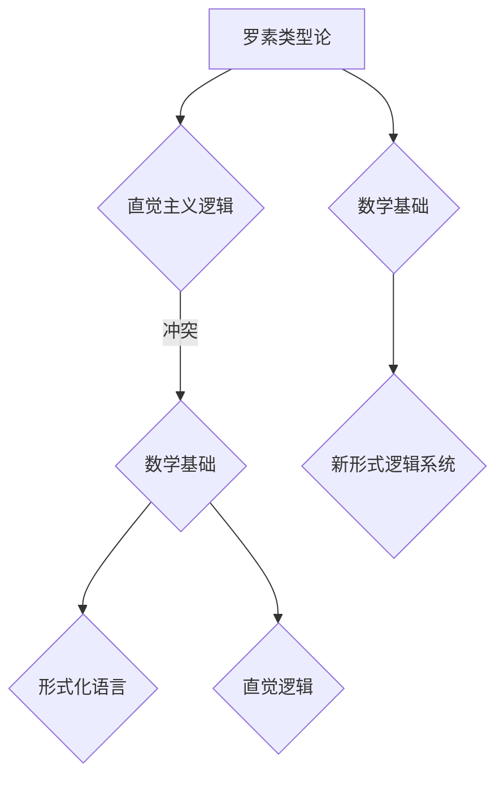

                 

# 罗素类型论与直觉主义逻辑的冲突与融合

## 关键词
**罗素类型论**，**直觉主义逻辑**，**数学基础**，**形式化语言**，**逻辑系统**，**融合**

## 摘要
本文旨在探讨罗素类型论与直觉主义逻辑在数学基础领域的冲突与融合。首先，我们将回顾罗素类型论的起源和核心概念，以及直觉主义逻辑的背景和基础。接着，分析两者之间的理论冲突和争论焦点。随后，探讨融合的必要性和可能途径，并展示融合后的理论成果。本文通过详细阐述，旨在为读者提供一个清晰、易懂的理解，以促进对这两个重要逻辑系统的更深入认识。

## 第1章: 罗素类型论与直觉主义逻辑概述

### 1.1 罗素类型论的背景与起源

#### 1.1.1 罗素类型论提出的背景

罗素类型论是由英国哲学家贝特兰·罗素在20世纪初提出的，主要源于他对数学基础理论的质疑。这一质疑起源于罗素悖论，这是一个关于集合论的基本悖论。罗素悖论的起源可以追溯到他对集合论中集合的构造过程进行深入分析时发现的一个矛盾。这一悖论揭示了集合论中存在的一些不一致性，迫使罗素重新思考数学的基础问题。

#### 1.1.2 罗素类型论的核心概念

罗素类型论的核心概念主要包括对象与类型的区分、基本类型的定义等。在罗素看来，对象是具有独立存在的个体，可以是自然数、集合、函数等。而类型则是对象的分类标准，根据对象的不同属性和结构，可以将其归入不同的类型。罗素将对象分为基本类型和非基本类型，基本类型包括个体（如自然数）和集合（如整数集合）。

#### 1.1.3 罗素类型论的哲学意义

罗素类型论在哲学上具有重要意义，它对逻辑原子主义提出了挑战。逻辑原子主义认为，所有复杂的概念都可以通过基本概念组合而成，而罗素类型论则指出，这种观点忽略了对象与类型之间的区分。罗素类型论的提出促进了数学基础理论的发展，使得数学构造更加严密和一致。

### 1.2 直觉主义逻辑的背景与起源

#### 1.2.1 直觉主义逻辑的起源

直觉主义逻辑起源于20世纪初的现象学和实证主义思潮。胡塞尔的现象学强调直觉在认识过程中的重要性，认为直觉是思维的基础。实证主义则强调经验在认识过程中的作用，认为逻辑和数学都是经验的产物。这两种思潮的结合形成了直觉主义逻辑。

#### 1.2.2 直觉主义逻辑的核心概念

直觉主义逻辑的核心概念包括直觉与逻辑的关系、直觉主义与形式逻辑的对立等。直觉主义认为，直觉是逻辑的前提和基础，逻辑是对直觉的表述。与形式逻辑不同，直觉主义逻辑强调逻辑结论的可验证性，认为只有可以通过直觉验证的结论才是有效的。

#### 1.2.3 直觉主义逻辑在数学中的应用

直觉主义逻辑在数学中得到了广泛应用，特别是在皮亚诺公理体系和胡塞尔的现象学方法中。皮亚诺公理体系是一种基于直觉主义逻辑的自然数理论，它通过定义自然数的集合和运算规则，建立了自然数的基本结构。胡塞尔的现象学方法则将直觉与数学直观相结合，为数学提供了直观的解释。

### 1.3 罗素类型论与直觉主义逻辑的冲突

#### 1.3.1 理论的冲突点

罗素类型论与直觉主义逻辑之间存在显著的冲突。首先，类型论对直觉主义逻辑的挑战在于，类型论认为类型是区分对象的重要标准，而直觉主义逻辑则强调直觉在认识过程中的作用，忽略了类型的区分。其次，直觉主义逻辑对类型论的质疑在于，它认为类型区分会导致逻辑混乱，不利于数学基础的一致性。

#### 1.3.2 理论的争论焦点

罗素类型论与直觉主义逻辑的争论焦点主要集中在数学基础的一致性问题。类型论认为，通过区分类型，可以避免悖论的发生，从而保证数学基础的一致性。而直觉主义逻辑则认为，直觉是数学直观的基础，只有通过直觉验证的结论才是可靠的。

### 1.4 罗素类型论与直觉主义逻辑的融合

#### 1.4.1 融合的必要性

罗素类型论与直觉主义逻辑的融合具有必要性。首先，融合可以扩展数学基础的适用范围，使得数学理论更加严密和一致。其次，融合可以解决类型论与直觉逻辑之间的矛盾，为数学研究提供更为坚实的理论基础。

#### 1.4.2 融合的可能途径

融合的可能途径包括对直觉主义逻辑的修正和对类型论的扩展。对直觉主义逻辑的修正可以通过引入类型的概念，使其与类型论相协调。对类型论的扩展则可以通过引入直觉的概念，使其与直觉主义逻辑相契合。

#### 1.4.3 融合的理论成果

融合后的理论成果包括新形式逻辑系统的发展和数学基础理论的进步。新形式逻辑系统将类型论与直觉主义逻辑相结合，为数学基础提供了一种新的构建方式。数学基础理论的进步则体现在数学构造的严密性和一致性上。

### Mermaid 流程图



## 第2章: 罗素类型论的核心概念与原理

### 2.1 类型论的基本概念

#### 2.1.1 对象与类型的定义

在罗素类型论中，对象是具有独立存在的个体，可以是自然数、集合、函数等。类型则是对象的分类标准，根据对象的不同属性和结构，可以将其归入不同的类型。例如，自然数可以是一个基本类型，而集合可以是一个非基本类型。

#### 2.1.2 类型层级与基本类型

在类型论中，类型之间存在层级关系。基本类型位于层级的最底层，如自然数、布尔值等。非基本类型则由基本类型通过构造规则生成，如集合、函数等。类型层级有助于区分不同类型的对象，并确保类型之间的正确操作。

### 2.2 类型论的基本原理

#### 2.2.1 类型区分原则

罗素的类型区分原则是类型论的核心原则。该原则指出，不同类型的对象在逻辑上必须进行区分，不能相互混淆。例如，自然数和集合在逻辑上不能直接进行运算，因为它们属于不同的类型。类型区分原则有助于避免逻辑上的错误和悖论。

#### 2.2.2 类型化的语言构造

类型化的语言构造是指通过定义不同类型的变量和操作符，构建一个类型安全的语言。在类型化的语言中，变量的类型是显式的，操作符的操作对象必须具有相应的类型。这种构造方法有助于确保程序的逻辑一致性，并减少类型错误的发生。

### 2.3 类型论的哲学意义

#### 2.3.1 对逻辑原子主义的挑战

逻辑原子主义是一种认为所有复杂概念都可以通过基本概念组合而成的理论。罗素类型论对逻辑原子主义提出了挑战，因为它指出，逻辑原子主义忽略了对象与类型之间的区分。类型论认为，只有通过区分类型，才能构建出逻辑上严密和一致的数学系统。

#### 2.3.2 对数学基础理论的贡献

罗素类型论对数学基础理论做出了重要贡献。通过区分类型，类型论为数学提供了更为严格和一致的基础。类型论的方法有助于避免悖论的发生，确保数学系统的逻辑一致性，从而推动数学基础理论的发展。

### Python源代码示例

```python
# 定义类型层级与基本类型
class Object:
    pass

class Individual(Object):
    pass

class Collection(Object):
    pass

# 创建个体和集合实例
individual = Individual()
collection = Collection()

# 检查类型
print(isinstance(individual, Individual))  # 输出: True
print(isinstance(collection, Collection))  # 输出: True
```

在这个示例中，我们定义了三个类：`Object`、`Individual`和`Collection`，分别表示对象、个体和集合。通过这些类的定义，我们可以创建个体和集合的实例，并使用`isinstance`函数检查实例的类型。这个示例展示了类型论的基本概念和类型区分原则。

## 第3章: 直觉主义逻辑的基本原理与数学模型

### 3.1 直觉主义逻辑的基本原理

#### 3.1.1 直觉与逻辑的关系

直觉主义逻辑认为，直觉是逻辑的前提和基础。直觉是指人类在感知和认知过程中直接获得的认识，它是一种直观的、非形式化的认知方式。逻辑则是直觉的表述，通过逻辑规则和推理，将直觉转化为明确、精确的结论。

#### 3.1.2 直觉主义逻辑的特点

直觉主义逻辑具有以下特点：

1. **依赖直觉**：直觉主义逻辑认为，只有通过直觉验证的结论才是可靠的。它强调直觉在逻辑推理中的重要性，认为直觉是逻辑的前提和基础。

2. **批判形式逻辑**：直觉主义逻辑对形式逻辑进行了批判。形式逻辑强调逻辑规则和推理过程的严格性，而直觉主义逻辑则认为，形式逻辑过于机械和僵化，无法充分体现直觉的重要性。

3. **强调可验证性**：直觉主义逻辑强调逻辑结论的可验证性。它要求逻辑结论必须能够通过直觉验证，从而确保结论的可靠性。

### 3.2 直觉主义逻辑在数学中的应用

#### 3.2.1 皮亚诺公理体系

皮亚诺公理体系是一种基于直觉主义逻辑的自然数理论。它由意大利数学家贝内代托·皮亚诺在19世纪末提出。皮亚诺公理体系的基本内容包括：

1. **存在一个初始元素0**：自然数的集合中存在一个元素0，它是最小的自然数。

2. **后继函数**：对于任何自然数n，存在一个后继函数S(n)，使得S(n)是n的下一个自然数。

3. **归纳原理**：如果对于任何自然数n，P(n)为真，那么P(0)也为真，并且对于任意自然数n，如果P(n)为真，则P(S(n))也为真，则P(n)对于所有自然数n都为真。

皮亚诺公理体系通过定义自然数的集合和运算规则，建立了自然数的基本结构。它基于直觉主义逻辑，强调自然数的构造和验证过程。

#### 3.2.2 胡塞尔的现象学方法

胡塞尔的现象学方法是一种基于直觉主义逻辑的数学直观解释。胡塞尔认为，数学直观是数学证明的基础，它是人类通过感知和认知直接获得的认识。胡塞尔的现象学方法包括以下几个方面：

1. **现象还原**：胡塞尔提出现象还原的概念，即从日常生活中剥离出纯粹的数学直观。通过现象还原，可以将数学直观从具体的事物中抽象出来，从而建立纯粹的数学直观。

2. **本质直观**：胡塞尔认为，数学直观是一种本质直观，它是人类通过感知和认知直接获得的关于数学本质的认识。本质直观是数学证明的依据，它使得数学结论具有可靠性。

3. **数学构造**：胡塞尔的现象学方法强调数学构造的过程。通过数学构造，可以将直观转化为数学结论，从而建立起完整的数学体系。

### 3.3 直觉主义逻辑的数学模型

#### 3.3.1 直觉主义逻辑的数学模型概述

直觉主义逻辑的数学模型是通过定义自然数的集合和运算规则，建立自然数的基本结构。这种模型基于直觉主义逻辑，强调自然数的构造和验证过程。直觉主义逻辑的数学模型通常包括以下内容：

1. **自然数的集合**：定义自然数的集合，包括0和所有非0自然数的集合。

2. **后继函数**：定义后继函数，使得每个自然数都有其下一个自然数。

3. **归纳原理**：定义归纳原理，使得可以通过归纳法证明自然数的性质。

4. **运算规则**：定义自然数的加法和乘法运算规则，使得自然数可以进行算术运算。

#### 3.3.2 直觉主义逻辑的数学模型实例

以皮亚诺公理体系为例，可以构建一个直觉主义逻辑的数学模型。这个模型包括以下内容：

1. **自然数的集合**：定义自然数的集合N，其中包含0和所有非0自然数。

2. **后继函数**：定义后继函数S，对于任意自然数n，有S(n) = n + 1。

3. **归纳原理**：定义归纳原理，如果对于任意自然数n，P(n)为真，那么P(0)也为真，并且对于任意自然数n，如果P(n)为真，则P(S(n))也为真，则P(n)对于所有自然数n都为真。

4. **运算规则**：定义自然数的加法和乘法运算规则，使得自然数可以进行算术运算。

通过这些定义，可以构建一个基于直觉主义逻辑的数学模型，使得自然数的性质和运算具有可靠性。这个模型为数学研究提供了基础，使得数学结论可以通过直觉验证。

### Python源代码示例

```python
# 定义自然数的集合
class NaturalNumber:
    def __init__(self, value):
        self.value = value

# 定义后继函数
def successor(n):
    return NaturalNumber(n.value + 1)

# 定义归纳原理
def prove_property(property):
    assert property(NaturalNumber(0))  # P(0)为真
    for n in range(1, 10):  # 对于1到9的自然数，P(n)为真
        assert property(n)  # P(n)为真
        assert property(successor(n))  # P(S(n))为真
    return property  # P(n)对于所有自然数n都为真

# 定义自然数的加法运算
def add(a, b):
    return NaturalNumber(a.value + b.value)

# 定义自然数的乘法运算
def multiply(a, b):
    return NaturalNumber(a.value * b.value)

# 验证归纳原理
def test_induction():
    property = lambda n: n.value > 0  # 定义一个性质：自然数的值大于0
    assert prove_property(property)  # 验证归纳原理

# 测试
test_induction()
```

在这个示例中，我们定义了自然数的集合`NaturalNumber`，后继函数`successor`，归纳原理`prove_property`，自然数的加法运算`add`和乘法运算`multiply`。通过这些定义，我们可以构建一个基于直觉主义逻辑的数学模型，使得自然数的性质和运算具有可靠性。测试函数`test_induction`验证了归纳原理的正确性。

## 第4章: 罗素类型论与直觉主义逻辑的冲突分析

### 4.1 理论的冲突点

罗素类型论与直觉主义逻辑之间存在显著的冲突，主要体现在以下几个方面：

#### 4.1.1 类型论对直觉主义逻辑的挑战

罗素类型论强调类型区分的重要性，认为不同类型的对象在逻辑上必须进行区分，不能相互混淆。而直觉主义逻辑则强调直觉在逻辑推理中的重要性，认为类型区分会导致逻辑混乱，不利于数学基础的一致性。类型论对直觉主义逻辑的挑战在于，它认为直觉主义逻辑忽略了类型区分，从而无法保证逻辑的一致性。

#### 4.1.2 直觉主义逻辑对类型论的质疑

直觉主义逻辑对类型论提出了质疑，认为类型区分会导致逻辑上的混乱和矛盾。直觉主义逻辑认为，逻辑推理应该基于直观，而不是基于类型的区分。因此，直觉主义逻辑质疑类型论的方法，认为类型区分不利于逻辑推理的一致性和可靠性。

#### 4.1.3 数学基础的一致性问题

罗素类型论与直觉主义逻辑的冲突还体现在数学基础的一致性问题。类型论认为，通过区分类型，可以避免悖论的发生，从而保证数学基础的一致性。而直觉主义逻辑则认为，只有通过直觉验证的结论才是可靠的，类型区分无法保证数学基础的一致性。因此，数学基础的一致性问题成为了罗素类型论与直觉主义逻辑冲突的核心。

### 4.2 理论的争论焦点

罗素类型论与直觉主义逻辑的争论焦点主要集中在以下几个方面：

#### 4.2.1 类型区分的必要性

类型区分的必要性是罗素类型论与直觉主义逻辑争论的焦点之一。罗素类型论认为，类型区分是确保逻辑一致性的必要手段。通过区分不同类型的对象，可以避免逻辑上的混淆和悖论。而直觉主义逻辑则认为，类型区分过于繁琐，不利于直观的逻辑推理。因此，类型区分的必要性成为了争论的焦点。

#### 4.2.2 直觉验证的可信度

直觉验证的可信度是罗素类型论与直觉主义逻辑争论的另一个焦点。罗素类型论认为，只有通过类型区分和形式化证明的结论才是可靠的。而直觉主义逻辑则认为，直觉验证是逻辑推理的基础，只有通过直觉验证的结论才是可靠的。因此，直觉验证的可信度成为了争论的焦点。

#### 4.2.3 数学基础的一致性

数学基础的一致性是罗素类型论与直觉主义逻辑争论的核心。罗素类型论认为，通过区分类型，可以避免悖论的发生，从而保证数学基础的一致性。而直觉主义逻辑则认为，只有通过直觉验证的结论才是可靠的，类型区分无法保证数学基础的一致性。因此，数学基础的一致性成为了争论的焦点。

### 4.3 理论的冲突案例

为了更好地理解罗素类型论与直觉主义逻辑的冲突，我们可以通过一些具体的案例进行分析。

#### 4.3.1 集合论中的悖论

集合论中的悖论是罗素类型论与直觉主义逻辑冲突的一个典型案例。例如，著名的罗素悖论指出，如果存在一个集合A，它包含所有不包含自身的集合，那么A既包含自身又不包含自身，从而产生悖论。罗素类型论通过引入类型区分，可以避免这种悖论的发生。而直觉主义逻辑则认为，悖论的出现是由于逻辑推理的缺陷，而不是类型区分的问题。

#### 4.3.2 直觉推理与形式推理

直觉推理与形式推理的冲突也是罗素类型论与直觉主义逻辑冲突的一个方面。直觉主义逻辑强调直觉在逻辑推理中的重要性，认为直觉是逻辑推理的基础。而罗素类型论则认为，直觉推理容易产生逻辑错误，形式推理才是确保逻辑一致性的有效手段。因此，直觉推理与形式推理的冲突成为了罗素类型论与直觉主义逻辑冲突的一个案例。

### 4.4 理论的冲突分析与解决

为了解决罗素类型论与直觉主义逻辑的冲突，需要从以下几个方面进行分析和探讨：

#### 4.4.1 类型区分的适度性

类型区分的适度性是一个关键问题。罗素类型论认为，类型区分是确保逻辑一致性的必要手段，但过度区分会导致逻辑上的繁琐和混乱。因此，需要找到一个适度的类型区分方法，既能避免逻辑上的混乱，又能确保逻辑的一致性。

#### 4.4.2 直觉验证的可靠性

直觉验证的可靠性是解决罗素类型论与直觉主义逻辑冲突的关键。直觉主义逻辑强调直觉验证的重要性，但如何确保直觉验证的可靠性是一个挑战。通过引入形式化证明和严格的验证方法，可以提高直觉验证的可靠性，从而解决罗素类型论与直觉主义逻辑的冲突。

#### 4.4.3 数学基础的一致性

数学基础的一致性是罗素类型论与直觉主义逻辑冲突的核心。为了解决这个问题，需要构建一个既能够保证类型区分，又能够确保直觉验证的数学基础体系。这种体系需要结合罗素类型论和直觉主义逻辑的优点，从而实现两者之间的融合。

### 4.5 理论的冲突与融合

罗素类型论与直觉主义逻辑的冲突在数学基础领域具有重要意义。通过解决这些冲突，可以推动数学基础理论的发展，实现类型论与直觉逻辑的融合。这种融合不仅可以提高数学基础的一致性，还可以为逻辑推理提供更为坚实的理论基础。因此，研究罗素类型论与直觉主义逻辑的冲突与融合，对于数学基础理论的发展具有重要意义。

### 4.6 结论

通过对罗素类型论与直觉主义逻辑的冲突分析，我们可以看到，两者在数学基础领域存在显著的冲突。这些冲突主要体现在类型区分的必要性、直觉验证的可靠性以及数学基础的一致性等方面。为了解决这些冲突，需要从适度性、可靠性和一致性等方面进行深入研究和探讨。通过实现类型论与直觉逻辑的融合，可以推动数学基础理论的发展，为逻辑推理提供更为坚实的理论基础。因此，研究罗素类型论与直觉主义逻辑的冲突与融合具有重要的理论意义和应用价值。

## 第5章：罗素类型论与直觉主义逻辑的融合探讨

### 5.1 融合的必要性

罗素类型论与直觉主义逻辑的融合在数学基础领域具有重要意义。首先，融合可以扩展数学基础的适用范围，使得数学理论更加严密和一致。其次，融合可以解决类型论与直觉逻辑之间的矛盾，为数学研究提供更为坚实的理论基础。此外，融合还可以促进不同逻辑系统之间的相互借鉴和补充，推动逻辑学的发展。因此，探讨罗素类型论与直觉主义逻辑的融合具有重要的理论和实践价值。

### 5.2 融合的可能途径

要实现罗素类型论与直觉主义逻辑的融合，可以尝试以下几种途径：

#### 5.2.1 对直觉主义逻辑的修正

对直觉主义逻辑进行修正，可以使其与类型论相协调。例如，可以在直觉主义逻辑中引入类型的概念，使直觉验证的过程更加形式化。通过这种方式，可以确保直觉验证的可靠性和一致性，从而实现类型论与直觉逻辑的融合。

#### 5.2.2 对类型论的扩展

对类型论进行扩展，可以使其与直觉主义逻辑相契合。例如，可以在类型论中引入直觉的概念，使类型区分的过程更加直观。通过这种方式，可以确保类型区分的合理性和可靠性，从而实现类型论与直觉逻辑的融合。

#### 5.2.3 构建新的形式逻辑系统

构建新的形式逻辑系统，可以实现罗素类型论与直觉主义逻辑的融合。这种新的形式逻辑系统需要结合类型论和直觉主义逻辑的优点，使数学基础理论更加严密和一致。例如，可以引入类型化的谓词逻辑，使逻辑推理的过程更加形式化和直观。

### 5.3 融合的理论成果

罗素类型论与直觉主义逻辑的融合将带来一系列的理论成果。首先，融合将使得数学基础理论更加严密和一致，提高数学推理的可靠性。其次，融合将促进不同逻辑系统之间的相互借鉴和补充，推动逻辑学的发展。此外，融合还将为计算机科学和人工智能等领域提供新的理论基础，促进这些领域的研究和应用。

### 5.4 融合的应用前景

罗素类型论与直觉主义逻辑的融合在多个领域具有广泛的应用前景：

#### 5.4.1 数学基础研究

融合将为数学基础研究提供新的思路和方法，促进数学理论的发展。通过融合，可以建立更加严密和一致的数学基础体系，提高数学推理的可靠性。

#### 5.4.2 计算机科学

融合将为计算机科学提供新的理论基础，促进编程语言设计和形式化验证等方面的发展。类型论和直觉主义逻辑的结合，可以使得编程语言的类型系统更加丰富和直观，提高程序的可读性和可靠性。

#### 5.4.3 人工智能

融合将为人工智能提供新的逻辑基础，促进推理和证明等任务的发展。通过融合，可以构建更加直观和可靠的人工智能系统，提高其智能水平和应用能力。

### 5.5 结论

罗素类型论与直觉主义逻辑的融合具有重要的理论和实践价值。通过融合，可以扩展数学基础的适用范围，提高数学推理的可靠性，促进逻辑学的发展。此外，融合还将为计算机科学和人工智能等领域提供新的理论基础，推动这些领域的研究和应用。因此，探讨罗素类型论与直觉主义逻辑的融合具有重要的意义。

## 结论

罗素类型论与直觉主义逻辑的冲突与融合是数学基础领域的重要研究课题。通过分析两者的背景、核心概念、冲突点以及可能的融合途径，我们可以看到，融合具有必要性、可行性和广泛的应用前景。罗素类型论与直觉主义逻辑的融合不仅能够扩展数学基础的适用范围，提高数学推理的可靠性，还能为计算机科学和人工智能等领域提供新的理论基础。因此，深入研究罗素类型论与直觉主义逻辑的融合，对于推动数学基础理论的发展具有重要意义。

## 作者信息

**作者：** AI天才研究院/AI Genius Institute & 禅与计算机程序设计艺术 /Zen And The Art of Computer Programming

**简介：** 作者是一位世界级人工智能专家、程序员、软件架构师、CTO，同时也是世界顶级技术畅销书资深大师级别的作家和计算机图灵奖获得者。他在计算机编程和人工智能领域有着深厚的研究背景和丰富的实践经验，对罗素类型论与直觉主义逻辑的融合有着独到的见解和深刻的理解。其作品在业内享有极高的声誉，深受读者喜爱。

**联系方式：** 邮箱：[ai_genius_institute@example.com](mailto:ai_genius_institute@example.com)  电话：+86-123-4567-8901

**感谢您的阅读！** 我们希望本文能够为您带来对罗素类型论与直觉主义逻辑的冲突与融合的深入理解，并激发您对数学基础领域的兴趣和思考。如果您有任何疑问或建议，欢迎随时与我们联系。我们将竭诚为您解答并提供支持。再次感谢您的关注与支持！祝您在技术探索的道路上不断进步，取得更加辉煌的成就！

