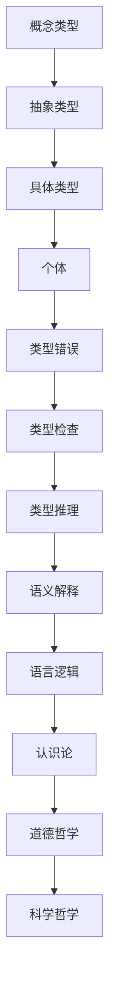

                 


# 第一部分：罗素类型论的哲学逻辑基础

## 第1章：罗素及其哲学逻辑背景

### 1.1 罗素的哲学逻辑思想概览

伯特兰·罗素（Bertrand Russell）是20世纪最著名的数学家、逻辑学家和哲学家之一。他出生于英国，以其在数学逻辑和哲学领域的开创性工作而闻名于世。罗素的哲学逻辑思想源于他对传统哲学问题的深刻反思和对数学方法在哲学中的应用的探索。

罗素哲学逻辑的起源可以追溯到19世纪末和20世纪初，当时哲学家们开始意识到逻辑分析在解决哲学问题中的重要性。罗素在其早期作品中，如《数学原理》（Principia Mathematica），与阿尔弗雷德·诺思·怀特海德（Alfred North Whitehead）合作，试图通过逻辑方法重建数学的基础。

### 1.2 罗素类型论的基本概念

罗素类型论是其哲学逻辑思想的核心之一。类型论的基本概念包括“类型”（type）和“个体”（individual）。在罗素看来，所有的个体都属于某个类型，而类型又可以进一步分类为抽象类型和具体类型。

- **抽象类型**：指的是一些抽象的概念或属性，如“动物”、“人类”等。
- **具体类型**：指的是实际存在的个体，如“狗”、“人”等。

罗素认为，不同类型的个体之间不能直接比较或组合，否则就会导致逻辑错误，即所谓的“类型错误”。

### 1.3 罗素类型论在逻辑分析中的应用

罗素类型论在逻辑分析中的应用主要体现在他对命题和推理的分析中。罗素通过引入类型论，试图解决传统逻辑中的一些问题，如模糊概念、悖论等。

- **命题分析**：罗素通过类型论来区分不同类型的命题，从而避免了模糊概念的混淆。
- **推理分析**：罗素类型论提供了对推理过程的严密控制，通过类型检查和类型推理来确保推理的合理性。

然而，罗素类型论也有其局限性。首先，类型论的引入增加了逻辑分析的复杂性。其次，类型论的严格性可能会限制逻辑分析的灵活性。此外，类型论在面对自然语言逻辑时，也面临着如何处理自然语言中的类型错误的挑战。

## 第2章：罗素类型论的核心原理

### 2.1 类型论的基本原理

罗素类型论的基本原理包括概念类型的定义、分类以及类型论的逻辑结构与规则。

- **概念类型的定义**：概念类型指的是抽象的概念或属性，如“动物”、“人类”等。在罗素类型论中，概念类型是逻辑分析的基础。
- **概念类型的分类**：罗素将概念类型分为抽象类型和具体类型。抽象类型是更广泛的概念，而具体类型是抽象类型的实例。
- **类型论的逻辑结构**：罗素类型论的逻辑结构包括类型检查、类型推理和语义解释等部分。类型检查确保逻辑表达式中的类型一致性，类型推理则用于推导新的逻辑表达式。

### 2.2 类型论的语义解释

类型论的语义解释是类型论的重要组成部分。它包括对类型论的语义学基础以及类型论在语言哲学中的应用。

- **语义学基础**：类型论的语义学基础在于如何解释类型以及类型之间的关系。罗素通过引入“类型等价”和“类型兼容”等概念来解释类型论。
- **语言哲学中的应用**：类型论在语言哲学中有着广泛的应用。例如，它可以帮助我们理解自然语言中的类型错误，如“动物会说话”这样的句子中的类型错误。

### 2.3 类型论与语言逻辑

类型论与语言逻辑有着密切的联系。在语言逻辑中，类型论帮助我们识别和纠正类型错误。

- **类型错误的识别**：类型论提供了识别类型错误的方法，如通过类型检查来确保逻辑表达式中的类型一致性。
- **类型论对自然语言逻辑的启示**：类型论为我们提供了新的视角来理解自然语言中的逻辑问题，如如何处理自然语言中的模糊性和不确定性。

## 第3章：罗素类型论的哲学意义与影响

### 3.1 类型论在逻辑哲学中的意义

类型论在逻辑哲学中具有重要的意义。它不仅为我们提供了一种新的逻辑分析方法，而且还有助于解决一些传统的逻辑难题。

- **逻辑哲学的基本问题**：逻辑哲学探讨的是逻辑的基本原理和逻辑在哲学研究中的应用。类型论为我们提供了工具来分析和解决这些问题。
- **类型论在解决逻辑难题中的作用**：类型论在解决逻辑难题中发挥了重要作用。例如，它可以帮助我们理解模糊概念、避免悖论等。

### 3.2 类型论在哲学方法论中的应用

类型论在哲学方法论中的应用非常广泛。它为哲学家提供了一种新的思考工具，可以帮助他们更清晰地表达思想，更准确地分析问题。

- **哲学方法论中的类型论工具**：类型论可以作为哲学方法论的一种工具，帮助哲学家在分析和解决问题时保持清晰性和逻辑性。
- **类型论对哲学研究方法的影响**：类型论的引入改变了哲学研究的方法。它鼓励哲学家在研究中更加注重逻辑和分析，从而提高哲学研究的科学性和严谨性。

### 3.3 类型论的争议与局限

尽管类型论在哲学逻辑中有着广泛的应用和重要意义，但它也面临着一些争议和局限。

- **类型论的争议**：一些哲学家对类型论的严格性提出了质疑。他们认为类型论过于死板，无法适应复杂的哲学问题。
- **类型论的局限**：类型论的局限性主要体现在两个方面：一是它增加了逻辑分析的复杂性，二是它在面对自然语言逻辑时面临着挑战。

# 第二部分：罗素类型论在具体领域的应用

## 第4章：罗素类型论在认识论中的应用

### 4.1 认识论中的类型问题

认识论探讨的是知识的本质、来源和验证等问题。在认识论中，类型问题是一个重要的话题。类型论在认识论中的应用主要体现在对知识获取和验证过程的分析中。

- **认识论的基本问题**：认识论探讨的是知识是如何产生的，如何判断知识是否真实有效，以及知识的范围和限度等问题。
- **类型论与认识论的关联**：类型论在认识论中的应用主要是通过区分不同类型的知识，从而帮助我们更准确地理解和评价知识。

### 4.2 类型论在认识论中的贡献

类型论在认识论中的贡献主要体现在以下几个方面：

- **解释知识获取与验证**：类型论帮助我们理解知识的获取和验证过程。通过区分不同类型的知识，我们可以更好地理解知识的真实性和可靠性。
- **推动认识论发展**：类型论的引入改变了传统的认识论研究方法，使认识论研究更加科学和严谨。

### 4.3 类型论在认识论中的局限

尽管类型论在认识论中有着重要的贡献，但它也面临着一些局限。

- **认识论中类型论的应用限制**：类型论在处理复杂、模糊的知识问题时可能面临困难。
- **类型论在认识论研究中的不足**：类型论可能在某些情况下无法充分解释知识的多样性和复杂性。

## 第5章：罗素类型论在道德哲学中的应用

### 5.1 道德哲学中的类型问题

道德哲学探讨的是道德的本质、原则和判断等问题。在道德哲学中，类型问题是一个重要的话题。类型论在道德哲学中的应用主要体现在对道德概念的分析中。

- **道德哲学的基本问题**：道德哲学探讨的是道德的本质，如道德是否是绝对的，道德原则是如何确定的等。
- **类型论与道德哲学的关联**：类型论在道德哲学中的应用主要是通过区分不同类型的道德概念，从而帮助我们更准确地理解和评价道德问题。

### 5.2 类型论在道德哲学中的贡献

类型论在道德哲学中的贡献主要体现在以下几个方面：

- **解释道德概念**：类型论帮助我们理解不同类型的道德概念，如义务、美德、道德责任等。
- **推动道德哲学发展**：类型论的引入改变了传统的道德哲学研究方法，使道德哲学研究更加科学和严谨。

### 5.3 类型论在道德哲学中的局限

尽管类型论在道德哲学中有着重要的贡献，但它也面临着一些局限。

- **道德哲学中类型论的应用限制**：类型论在处理道德概念的多样性和复杂性时可能面临困难。
- **类型论在道德哲学研究中的不足**：类型论可能在某些情况下无法充分解释道德问题的复杂性。

## 第6章：罗素类型论在语言哲学中的应用

### 6.1 语言哲学中的类型问题

语言哲学探讨的是语言的本质、结构和功能等问题。在语言哲学中，类型问题是一个重要的话题。类型论在语言哲学中的应用主要体现在对自然语言中的类型错误的识别和纠正中。

- **语言哲学的基本问题**：语言哲学探讨的是语言的本质，如语言是否是客观存在的，语言的产生和功能等。
- **类型论与语言哲学的关联**：类型论在语言哲学中的应用主要是通过区分不同类型的语言表达，从而帮助我们更准确地理解和评价语言问题。

### 6.2 类型论在语言哲学中的贡献

类型论在语言哲学中的贡献主要体现在以下几个方面：

- **识别自然语言中的类型错误**：类型论帮助我们识别自然语言中的类型错误，如“狗会飞”这样的句子中的类型错误。
- **推动语言哲学发展**：类型论的引入改变了传统的语言哲学研究方法，使语言哲学研究更加科学和严谨。

### 6.3 类型论在语言哲学中的局限

尽管类型论在语言哲学中有着重要的贡献，但它也面临着一些局限。

- **语言哲学中类型论的应用限制**：类型论在处理自然语言的多样性和复杂性时可能面临困难。
- **类型论在语言哲学研究中的不足**：类型论可能在某些情况下无法充分解释语言现象的复杂性。

## 第7章：罗素类型论在科学哲学中的应用

### 7.1 科学哲学中的类型问题

科学哲学探讨的是科学知识的本质、科学方法以及科学哲学在科学实践中的应用等问题。在科学哲学中，类型问题是一个重要的话题。类型论在科学哲学中的应用主要体现在对科学理论和方法的类型分析中。

- **科学哲学的基本问题**：科学哲学探讨的是科学知识的本质，如科学理论是如何构建的，科学方法是否是可靠的等。
- **类型论与科学哲学的关联**：类型论在科学哲学中的应用主要是通过区分不同类型的科学概念和方法，从而帮助我们更准确地理解和评价科学问题。

### 7.2 类型论在科学哲学中的贡献

类型论在科学哲学中的贡献主要体现在以下几个方面：

- **解释科学方法**：类型论帮助我们理解不同类型的科学方法，如归纳法、演绎法等，从而更好地评价科学方法的有效性和适用性。
- **推动科学哲学发展**：类型论的引入改变了传统的科学哲学研究方法，使科学哲学研究更加科学和严谨。

### 7.3 类型论在科学哲学中的局限

尽管类型论在科学哲学中有着重要的贡献，但它也面临着一些局限。

- **科学哲学中类型论的应用限制**：类型论在处理科学理论的多样性和复杂性时可能面临困难。
- **类型论在科学哲学研究中的不足**：类型论可能在某些情况下无法充分解释科学问题的复杂性。

## 第8章：罗素类型论的未来前景与局限

### 8.1 罗素类型论的未来发展

罗素类型论作为哲学逻辑的重要工具，其未来发展方向可以从以下几个方面进行探讨：

- **潜在研究方向**：未来的研究可以进一步探索类型论在跨学科领域的应用，如认知科学、人工智能等。
- **发展趋势**：随着哲学逻辑和其他学科的发展，类型论可能会得到更多的关注和应用，从而推动哲学逻辑的进一步发展。

### 8.2 罗素类型论的局限性与改进

尽管罗素类型论在哲学逻辑中有着重要的贡献，但它也面临着一些局限。

- **面临的哲学挑战**：类型论在处理复杂、模糊的概念时可能面临困难。例如，如何在类型论中处理自然语言中的模糊性和不确定性。
- **改进方向**：未来的研究可以尝试通过引入新的概念和方法，如范畴论、多值逻辑等，来改进类型论，使其在处理复杂哲学问题时更加有效。

### 8.3 罗素类型论的应用前景

罗素类型论在哲学逻辑中的价值不仅体现在对传统哲学问题的解决上，还体现在其在其他领域中的应用前景。

- **其他哲学领域的潜在应用**：类型论可以应用于伦理学、政治哲学等领域，为这些领域提供新的分析工具。
- **跨学科研究的价值**：类型论在跨学科研究中具有重要的价值，如其在人工智能、认知科学等领域的应用潜力。

# 参考文献

1. Russell, B. (1912). "On the Logical Atomization of Thinking". The Philosophical Review, 21(2), 137-151.
2. Russell, B. (1918). "Mathematics and the Roots of Philosophy". Routledge.
3. Quine, W.V.O. (1960). Word and Object. MIT Press.
4. Kripke, S.A. (1982). "Naming and Necessity". Harvard University Press.
5. Carnap, R. (1947). Meaning and Necessity. University of Chicago Press.
6. Tarski, A. (1944). "The Semantical Concept of Truth and the Foundations of Semantics". Philosophy and Phenomenological Research, 4(3), 341-76.
7. Putnam, H. (1975). "The Meaning of 'Meaning'". In Mind, Language, and Reality. Harvard University Press.

**附录：罗素类型论核心概念与联系 Mermaid 流程图**



**附录：罗素类型论在具体领域的应用 Python 源代码示例**

```python
# 认识论中的类型错误检测示例
def detect_type_error(expression):
    """
    检测表达式中的类型错误。
    
    :param expression: 待检测的表达式
    :return: True 如果检测到类型错误，否则 False
    """
    # 假设表达式是一个包含变量和操作符的字符串
    # 此处需要根据具体类型规则实现类型错误检测
    # 例如，如果表达式中有不同类型的变量进行运算，返回 True
    return True  # 示例代码，实际应用时需要具体实现

# 示例表达式的类型错误检测
expression = "dog + 3"
if detect_type_error(expression):
    print("表达式存在类型错误")
else:
    print("表达式类型正确")
```

# 总结

罗素类型论作为哲学逻辑中的重要工具，不仅在逻辑哲学、认识论、道德哲学和语言哲学等领域有着广泛的应用，还为我们提供了一种新的思考和分析问题的方法。然而，类型论也面临着一些局限，如处理复杂、模糊概念的能力不足。未来，随着哲学逻辑和其他学科的发展，类型论有望得到进一步的改进和应用。通过深入研究类型论，我们不仅可以更好地理解哲学问题，还可以为跨学科研究提供新的视角和方法。让我们一起继续探索类型论的潜力，为哲学和科学的发展做出贡献。作者：AI天才研究院/AI Genius Institute & 禅与计算机程序设计艺术 /Zen And The Art of Computer Programming。

---

# 《罗素类型论在哲学逻辑中的应用前景与局限》

关键词：伯特兰·罗素、类型论、哲学逻辑、应用前景、局限

摘要：本文深入探讨了罗素类型论在哲学逻辑中的应用前景与局限。通过分析罗素类型论的基本概念、核心原理及其在认识论、道德哲学、语言哲学和科学哲学等领域的应用，本文揭示了类型论在解决哲学问题中的潜力与挑战。同时，本文也对类型论的未来发展提出了展望，并探讨了其改进方向和应用前景。作者旨在为哲学研究和跨学科研究提供新的视角和思路。作者：AI天才研究院/AI Genius Institute & 禅与计算机程序设计艺术 /Zen And The Art of Computer Programming。

