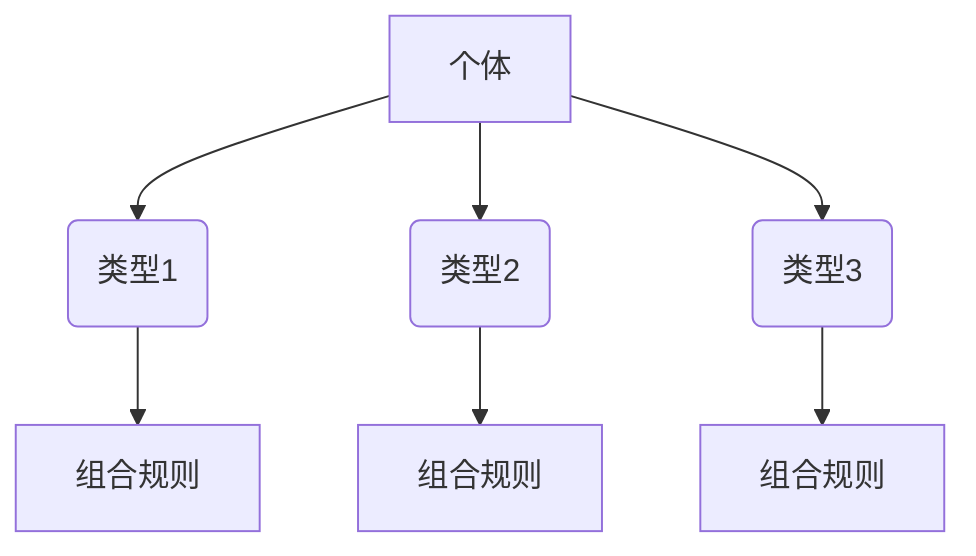
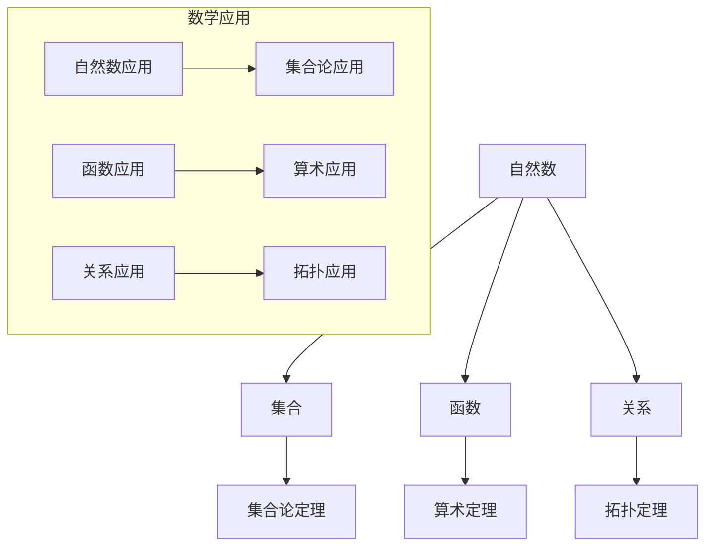
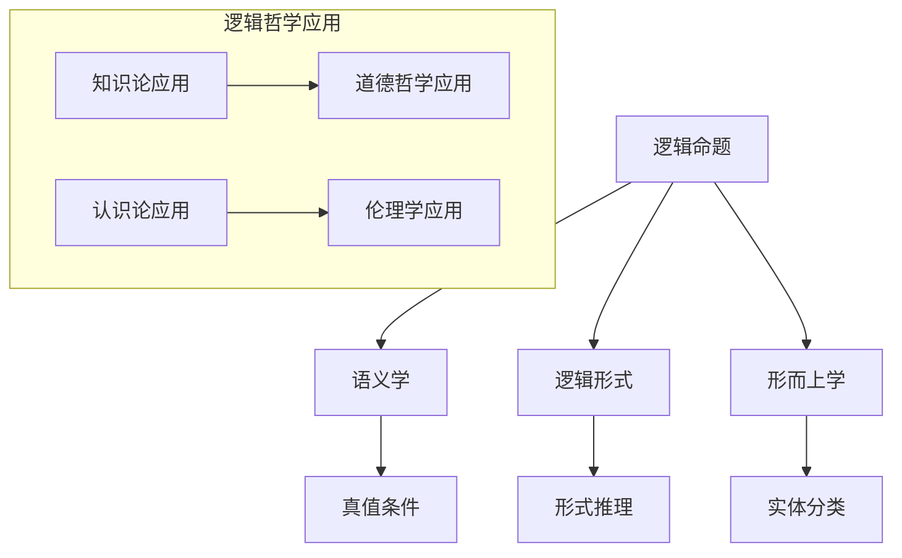

                 

### 第1章 引言

#### 1.1 罗素类型论的基本概念

罗素类型论（Russell's Theory of Types）是英国哲学家伯特兰·罗素（Bertrand Russell）在20世纪初提出的一种哲学理论，旨在解决古典逻辑和数学中的某些悖论问题。类型论的核心观点是：对象应该根据其本质属性被分类到不同的“类型”中。罗素认为，不同的类型之间存在本质的区别，这些区别决定了对象之间能否进行组合或比较。

在罗素类型论中，类型（Type）可以被理解为一种范畴或类别，它将具有相同本质属性的对象归为一类。例如，所有的狗可以被归为一种类型，而所有的猫则被归为另一种类型。罗素强调，类型之间的区分是本质的，而不是偶然的，这意味着不同类型的对象之间不能直接组合或比较。

罗素类型论的提出源于他对古典集合论和逻辑悖论的不满。特别是，罗素在研究集合论时发现了著名的“罗素悖论”（Russell's Paradox），这导致他开始思考如何构建一个更稳健的逻辑和数学体系。罗素类型论试图通过限制对象的组合和比较来避免悖论的产生。

#### 1.2 罗素类型论的历史背景

罗素类型论的历史背景可以追溯到19世纪末和20世纪初的逻辑和数学研究。这一时期，逻辑学家和数学家们面临着一系列挑战，包括如何理解集合、如何处理逻辑悖论以及如何建立更坚实的数学基础。

在19世纪末，集合论作为数学基础的理论开始兴起。然而，不久之后，集合论中的一些悖论（如罗素悖论）揭示了该理论的内在矛盾。罗素悖论展示了，如果允许任意对象的任意组合，集合论中的基本操作（如构造子集）可能会导致矛盾结果。为了解决这些问题，罗素提出了类型论作为对集合论的补充。

罗素在1901年首次提出了类型论的概念，并在其后的多年里不断发展和完善这一理论。类型论的提出不仅在数学哲学领域引起了广泛关注，也对逻辑学和哲学方法论产生了深远影响。罗素类型论为后来的形式逻辑和数学基础研究提供了重要启示，并在一定程度上促进了逻辑主义和形式主义的发展。

#### 1.3 罗素类型论在数学哲学中的重要性

罗素类型论在数学哲学中占据着核心地位，其重要性体现在以下几个方面：

首先，罗素类型论提供了一种解决逻辑悖论的方法。通过将对象分为不同的类型，类型论限制了对象之间的组合和比较，从而避免了悖论的产生。这种限制在形式逻辑和数学基础研究中具有重要意义，因为它为构建一个更稳健的逻辑体系提供了理论基础。

其次，罗素类型论对数学基础的理解产生了深远影响。类型论提出了“个体”和“类型”的概念，这种分类方法有助于理解数学对象的结构和属性。罗素认为，数学中的对象不是孤立存在的，而是根据其类型和属性相互关联的。这种观点为后来的数学哲学研究提供了新的视角。

最后，罗素类型论在哲学方法论上具有启示意义。类型论强调了分类和类型区分的重要性，这为哲学研究提供了一种新的方法。罗素的观点表明，在哲学研究中，对概念的精确分类和区分是至关重要的，这有助于避免模糊性和误导性的讨论。

综上所述，罗素类型论在数学哲学中的重要性不仅体现在其解决悖论的方法上，还体现在其对数学基础的理解和对哲学方法论的影响上。这些贡献使罗素类型论成为数学哲学研究中的一个核心议题。

### 第2章 罗素类型论的核心原理

#### 2.1 类型与个体的关系

在罗素类型论中，类型（Type）与个体（Individual）之间的关系是理解整个理论的关键。罗素认为，个体是构成世界的基本单元，每个个体都具有独特的属性和身份。然而，这些个体不能随意组合，而是根据其类型的本质属性被分类。

罗素将个体分为不同的类型，例如，所有的自然数属于一个类型，所有的动物属于另一个类型。类型之间的区分是本质的，这意味着不同类型的个体不能直接组合或比较。例如，我们不能将一个动物和一个自然数相加，因为它们属于不同的类型。

这种类型与个体的关系有助于避免逻辑悖论。在古典集合论中，允许任意对象的任意组合，这可能导致悖论。然而，在罗素类型论中，通过类型限制，我们可以防止这种不合理的组合。例如，如果我们不能将动物和自然数相加，那么就不会出现类似于“集合所有动物的集合”这样的悖论情况。

罗素类型论的类型与个体的关系提供了一个更加严谨的逻辑和数学体系。通过分类和区分，我们可以更清晰地理解对象的结构和属性，从而避免逻辑上的混乱和矛盾。

#### 2.2 类型与性质的区分

在罗素类型论中，类型与性质（Properties）的区分是一个核心概念。罗素认为，类型是对个体的分类，而性质是对个体属性的描述。这种区分有助于避免类型之间的混淆和逻辑错误。

例如，我们可以说“所有的狗都是动物”，这里的“动物”是一个性质，而不是一个类型。这意味着狗具有动物这一性质，但并不意味着狗本身就是一个动物类型。同样，我们可以说“这是一只黑色的狗”，这里的“黑色的”是一个性质，而不是一个类型。

罗素通过这种类型与性质的区分，试图建立一个更清晰和严谨的逻辑框架。他认为，如果我们混淆类型和性质，就可能导致逻辑上的错误和悖论。例如，如果我们错误地将性质当作类型，那么我们可能会得出所有事物都属于同一类型的结论，这是不合理的。

这种区分在数学和哲学研究中具有重要意义。在数学中，我们需要精确地定义对象和概念，以确保逻辑推理的准确性。在哲学中，对类型和性质的区分有助于我们更深入地理解现实世界的结构和本质。

#### 2.3 类型论的逻辑形式

罗素类型论的逻辑形式是其核心原理之一，它通过限制对象的组合和比较来避免逻辑悖论。罗素提出了一种称为“逻辑原子主义”的方法，这种方法将世界划分为一系列最基本的逻辑原子，每个原子对应一个类型。

逻辑原子主义认为，所有复杂的对象和概念都可以通过这些基本的逻辑原子组合而成。罗素将这些逻辑原子视为不可再分的基本单元，它们不能进一步分解或组合。这种限制确保了逻辑体系的严谨性，避免了集合论中出现的悖论。

例如，在罗素的逻辑原子主义中，我们可以说“这是一个黑色的狗”，这里的“这是一个”是一个逻辑原子，“黑色的”是一个逻辑原子，“狗”也是一个逻辑原子。通过这些逻辑原子的组合，我们可以构建更复杂的陈述和推理。

罗素类型论的逻辑形式不仅有助于解决逻辑悖论，还为逻辑学和哲学提供了新的研究方法。通过逻辑原子主义，我们可以更清晰地理解对象的本质和结构，从而推动逻辑和哲学的发展。

#### 2.4 类型论的哲学意义

罗素类型论的哲学意义体现在其对现实世界理解和逻辑推理的影响。罗素认为，类型论提供了一种更严谨和清晰的方法来处理复杂的世界，使我们能够更好地理解和解释现实。

首先，类型论强调了分类和区分的重要性。通过将对象分类到不同的类型中，我们可以更清晰地理解对象的本质和属性。这种分类方法不仅有助于避免逻辑悖论，还提高了逻辑推理的准确性。

其次，类型论为哲学研究提供了一种新的视角。罗素通过类型论提出了对现实世界的理解，他认为现实世界是由基本类型组成的，这些类型之间存在本质的区别。这种观点挑战了传统的哲学观念，为我们提供了一种新的思考方式。

最后，类型论在哲学方法论上具有启示意义。罗素强调，在哲学研究中，对概念的精确分类和区分是至关重要的。这种区分有助于我们避免模糊性和误导性的讨论，从而推动哲学研究的发展。

综上所述，罗素类型论的哲学意义体现在其对现实世界理解、逻辑推理和哲学方法论的深刻影响。通过类型论，我们可以更严谨和清晰地处理复杂的世界，推动哲学和逻辑学的发展。

### 第3章 罗素类型论的数学应用

#### 3.1 类型论与数学基础

罗素类型论在数学基础中扮演着重要角色，它为数学对象提供了一个分类和区分的框架，有助于避免逻辑悖论并增强数学体系的严谨性。类型论的核心思想是将数学对象划分为不同的类型，每个类型包含具有相同本质属性的对象。这种分类方法有助于我们理解和处理数学对象的结构和关系。

在数学基础中，类型论的应用主要体现在以下几个方面：

首先，类型论帮助解决集合论中的悖论问题。集合论中的一些悖论（如罗素悖论）揭示了古典集合论在逻辑上的不稳健性。通过类型论，我们可以限制对象的组合和比较，从而避免这些悖论的产生。类型论通过定义不同类型之间的边界，确保数学对象不会相互混淆或产生矛盾。

其次，类型论为数学对象提供了一个清晰的分类框架。在数学中，许多对象具有不同的属性和关系，通过类型论，我们可以将这些对象进行分类，以便更准确地理解和处理它们。例如，自然数、实数、函数等都可以根据它们的类型进行分类，这有助于我们更深入地理解数学对象的结构和性质。

最后，类型论为数学基础研究提供了一种新的方法。通过类型论，我们可以重新审视和构建数学体系，确保其逻辑上的严谨性和一致性。类型论不仅有助于解决数学中的逻辑悖论，还为我们提供了一个更清晰和严谨的数学基础，推动了数学的发展和进步。

#### 3.2 类型论与集合论

罗素类型论与集合论的关系密切，集合论是数学的基础，而类型论则为集合论提供了一种补充和改进的方法。集合论中的悖论问题，如罗素悖论，揭示了集合论在逻辑上的不稳健性。为了解决这些问题，罗素提出了类型论，通过将对象划分为不同类型来限制组合和比较，从而避免悖论的产生。

在集合论中，类型论的应用主要体现在以下几个方面：

首先，类型论帮助解决集合论中的悖论。集合论中的悖论通常是由于允许任意对象的任意组合而产生的。通过类型论，我们可以限制对象的组合，从而避免悖论的产生。例如，在类型论中，我们不允许将不同类型的对象组合在一起，这有助于避免集合论中的悖论。

其次，类型论为集合论提供了一种更清晰的分类框架。在集合论中，对象之间的区分和分类非常重要。通过类型论，我们可以将对象根据其本质属性进行分类，从而更准确地理解和处理它们。例如，自然数、实数、函数等都可以根据它们的类型进行分类。

最后，类型论为集合论的发展提供了新的方向。通过类型论，我们可以重新审视和改进集合论的基础，确保其逻辑上的严谨性和一致性。类型论不仅有助于解决集合论中的悖论，还为我们提供了一个更清晰和严谨的数学基础。

#### 3.3 类型论与模型论

罗素类型论在模型论中的应用同样具有重要意义。模型论是研究数学结构和逻辑关系的分支，它关注于如何构建和解释数学模型。类型论为模型论提供了一种分类和区分的方法，有助于我们理解和处理复杂的数学模型。

在模型论中，类型论的应用主要体现在以下几个方面：

首先，类型论帮助分类和区分不同的数学模型。在模型论中，存在多种类型的数学模型，如集合模型、算术模型、拓扑模型等。通过类型论，我们可以将这些模型进行分类，从而更清晰地理解和处理它们。类型论通过定义不同类型之间的边界，确保模型之间的区分和独立性。

其次，类型论为模型论提供了一种逻辑框架。在模型论中，我们需要确保数学模型的一致性和逻辑性。通过类型论，我们可以构建一个更严谨和清晰的逻辑框架，确保数学模型在逻辑上的稳健性。类型论通过限制对象的组合和比较，有助于避免逻辑上的矛盾和悖论。

最后，类型论为模型论的研究提供了新的视角和方法。通过类型论，我们可以重新审视和改进模型论的基础，确保其逻辑上的严谨性和一致性。类型论不仅有助于解决模型论中的逻辑问题，还为我们提供了一个更清晰和严谨的数学模型构建方法。

#### 3.4 类型论与算术基础

罗素类型论在算术基础中的应用主要体现在其对算术结构和逻辑的一致性的影响上。算术是数学的核心领域之一，它研究数及其基本性质。然而，在古典算术中，存在一些逻辑悖论，如皮亚诺悖论，这些问题揭示了算术在逻辑上的不稳健性。为了解决这些问题，罗素提出了类型论，通过分类和区分对象来增强算术的逻辑基础。

在算术基础中，类型论的应用主要体现在以下几个方面：

首先，类型论帮助解决算术中的悖论问题。通过类型论，我们可以限制对象的组合和比较，从而避免算术中的悖论。例如，罗素通过引入不同类型的对象（如自然数和集合）来区分它们，防止了类似于皮亚诺悖论这样的逻辑错误。

其次，类型论为算术提供了更清晰的结构。在算术中，我们需要精确地定义对象和概念，以便进行逻辑推理。通过类型论，我们可以将算术对象进行分类，从而更准确地理解和处理它们。这种分类方法有助于我们构建一个更严谨和清晰的算术体系。

最后，类型论为算术研究提供了新的方法。通过类型论，我们可以重新审视和改进算术的基础，确保其逻辑上的严谨性和一致性。类型论不仅有助于解决算术中的逻辑问题，还为我们提供了一个更清晰和严谨的算术研究方法。

综上所述，罗素类型论在算术基础中的应用不仅解决了逻辑悖论问题，还提供了更清晰和严谨的算术结构和逻辑基础。类型论的应用为算术研究提供了新的视角和方法，推动了算术的发展和进步。

### 第4章 罗素类型论在逻辑哲学中的应用

#### 4.1 类型论与逻辑原子主义

罗素类型论与逻辑原子主义（Logical Atomism）密切相关，两者都强调对世界的分解和基础性的分类。逻辑原子主义主张，现实世界是由一系列不可再分的最小单位（逻辑原子）构成的，每个原子代表一种简单的事实或属性。罗素将逻辑原子视为不同类型的对象，这些对象按照其类型进行分类，以避免逻辑悖论。

在逻辑哲学中，类型论与逻辑原子主义的联系体现在以下几个方面：

首先，类型论通过逻辑原子主义提供了一种更严谨的逻辑框架。逻辑原子主义认为，所有的复杂陈述都可以通过组合基本的逻辑原子来构建。罗素类型论则通过定义不同类型之间的界限，确保了逻辑组合的合理性，避免了悖论的产生。

其次，类型论与逻辑原子主义共同强调了分类的重要性。在逻辑哲学中，分类和区分是理解复杂世界的必要步骤。逻辑原子主义通过将世界划分为基本原子，而类型论则通过不同类型的分类，使得逻辑推理更加清晰和准确。

最后，类型论与逻辑原子主义都试图提供一个更为基础和稳固的哲学基础。逻辑原子主义通过基础原子的组合来构建现实世界，而类型论则通过不同类型的划分来确保逻辑推理的严谨性。这两种理论都为逻辑哲学提供了一个更坚实的理论基础。

#### 4.2 类型论与逻辑实证主义

逻辑实证主义（Logical Positivism）是20世纪初兴起的一种哲学运动，其核心观点是只有经验可验证的陈述才有意义。逻辑实证主义者认为，哲学应该通过逻辑和经验的方法来解决基本问题，避免形而上学的模糊性和不确定性。罗素类型论与逻辑实证主义有着紧密的联系，它们共同关注逻辑、数学和经验之间的关系。

在逻辑哲学中，类型论与逻辑实证主义的联系体现在以下几个方面：

首先，类型论为逻辑实证主义提供了逻辑基础。逻辑实证主义者认为，哲学陈述应该具有明确的逻辑结构，而类型论通过分类和区分不同类型的对象，为这种逻辑结构提供了支持。类型论帮助逻辑实证主义者明确区分了逻辑、数学和经验陈述的不同类型，从而确保了逻辑推理的严谨性。

其次，类型论与逻辑实证主义都强调经验的重要性。逻辑实证主义者主张，只有经验可验证的陈述才有意义。罗素类型论则通过类型划分，使得经验对象和经验陈述更加清晰和明确。例如，罗素通过类型论区分了自然数和集合，从而在逻辑和数学中引入了经验验证的概念。

最后，类型论与逻辑实证主义都试图通过逻辑和经验的方法来解决哲学问题。逻辑实证主义者认为，哲学应该以逻辑和经验为基础，避免形而上学的模糊性。罗素类型论通过逻辑分类和经验验证的方法，为逻辑实证主义的哲学观点提供了支持。

#### 4.3 类型论与逻辑语义学

逻辑语义学是研究逻辑表达式的意义和解释的哲学分支，它关注逻辑语句的真值条件。罗素类型论在逻辑语义学中有着重要应用，通过类型划分来确保逻辑表达式的有效性和意义。

在逻辑哲学中，类型论与逻辑语义学的联系体现在以下几个方面：

首先，类型论为逻辑语义学提供了一个清晰的分类框架。逻辑语义学需要区分不同类型的逻辑表达式，如命题、谓词和个体。罗素类型论通过定义不同类型的对象，使得逻辑表达式和语义解释更加明确和准确。

其次，类型论与逻辑语义学共同关注逻辑表达式的真值条件。逻辑语义学研究如何根据语义解释来确定逻辑表达式的真值。罗素类型论通过类型划分，确保了逻辑表达式在不同类型之间的组合和比较是合理的，从而影响了真值条件的确定。

最后，类型论与逻辑语义学都试图通过严谨的逻辑方法来解释和验证逻辑表达式的意义。类型论通过分类和区分不同类型的对象，使得逻辑语义学的解释过程更加清晰和准确。逻辑语义学则通过类型论提供的基础，确保逻辑表达式的意义和解释是合理和可靠的。

#### 4.4 类型论与逻辑哲学的其他问题

罗素类型论不仅在逻辑原子主义、逻辑实证主义和逻辑语义学中有着重要应用，还涉及逻辑哲学的其他一些核心问题。以下是一些类型论与逻辑哲学其他问题的联系：

首先，类型论与知识论密切相关。知识论研究知识的本质和获取方式。罗素类型论通过分类和区分不同类型的对象，有助于我们理解知识的对象和范围。类型论提供了一种框架，用于区分哪些对象是可知的，哪些是不可知的。

其次，类型论与形而上学有着复杂的关系。形而上学研究存在、实体和本质等问题。罗素类型论试图通过类型划分来解决形而上学中的某些问题，例如通过区分不同类型的对象来避免实体混淆和悖论。

最后，类型论与伦理学也有一定联系。伦理学研究道德和价值观。罗素类型论通过分类和区分不同类型的道德概念，有助于我们更清晰地理解伦理问题和道德判断。

总之，罗素类型论在逻辑哲学中的影响广泛而深远，它不仅为逻辑、数学和哲学提供了新的方法和框架，还涉及知识论、形而上学和伦理学等多个领域。类型论为逻辑哲学的发展提供了坚实的理论基础，推动了哲学研究的深入和扩展。

### 第5章 罗素类型论的批评与回应

#### 5.1 批评者的观点

罗素类型论自提出以来，便受到了众多哲学家的批评和质疑。这些批评主要集中在以下几个方面：

首先，批评者指出，罗素类型论在处理某些逻辑问题时显得过于繁琐和复杂。例如，批评者认为，通过引入多种类型来避免悖论的方法虽然有效，但同时也使得逻辑系统变得过于复杂，难以实际应用。

其次，批评者认为，罗素类型论在处理数学问题时缺乏一致性。类型论通过区分不同类型的对象来避免悖论，但这种区分有时可能会导致逻辑上的不一致。例如，一些批评者指出，类型论在处理集合论问题时，难以统一处理自然数和集合之间的类型关系。

最后，一些批评者认为，罗素类型论在哲学上缺乏说服力。尽管类型论试图通过分类和区分来提供一种更严谨的哲学基础，但批评者认为，这种基础并未彻底解决形而上学和知识论中的问题。例如，批评者认为，类型论在处理主观性和客观性问题时显得无力。

#### 5.2 罗素的回应

面对这些批评，罗素提出了多种回应，以捍卫类型论的哲学地位和逻辑价值。以下是罗素的一些主要回应：

首先，罗素指出，类型论虽然增加了逻辑系统的复杂性，但这种复杂性是必要的。罗素认为，为了避免逻辑悖论，我们必须接受一定的复杂性，而类型论提供了这样一种方法。罗素认为，类型论的核心价值在于其避免悖论的能力，这是其他方法难以实现的。

其次，罗素回应了关于类型论一致性的批评。他指出，类型论通过明确区分不同类型的对象，确实可能带来逻辑上的复杂性，但这种复杂性是可控的。罗素认为，类型论的一致性可以通过严格的类型划分和逻辑规则来保证，尽管这需要更多的逻辑工作，但这是建立稳健逻辑体系的必要代价。

最后，罗素在哲学上对类型论的回应主要集中在形而上学和知识论方面。罗素认为，类型论通过分类和区分，有助于我们更清晰地理解现实世界和知识结构。尽管类型论不能完全解决形而上学和知识论中的所有问题，但它提供了一个更严谨和清晰的分析框架，这对哲学研究是有益的。

总之，罗素的回应展示了类型论在逻辑和哲学上的重要性和价值。通过回应批评，罗素不仅捍卫了类型论的立场，还为类型论的发展提供了新的思路。

#### 5.3 批评与回应的哲学意义

罗素类型论的批评与回应在哲学上具有深远意义，它们不仅影响了类型论的发展，也对整个逻辑哲学产生了重要影响。以下从几个方面探讨这种批评与回应的哲学意义：

首先，批评与回应展示了哲学讨论中的多样性和开放性。罗素类型论的批评来自不同的哲学观点和背景，这些批评不仅挑战了类型论的基本假设，也提出了新的问题和思考角度。罗素的回应则展示了哲学家在面对质疑时的灵活性和创造性。这种互动不仅丰富了哲学讨论的内容，也促进了哲学理论的深化。

其次，批评与回应揭示了逻辑哲学中的基本问题。类型论的批评涉及逻辑系统的复杂性和一致性、形而上学的实体问题、知识论中的主观性和客观性等核心议题。这些问题不仅是逻辑哲学的基本问题，也是其他哲学分支（如形而上学、认识论、伦理学等）必须面对的问题。通过类型论的批评与回应，我们可以更深入地理解这些哲学问题的复杂性和多样性。

最后，批评与回应推动了哲学方法论的发展。罗素类型论的批评和回应不仅是对类型论的直接挑战，也是对哲学方法论的一种反思。批评者通过提出新的问题和挑战，迫使哲学家重新审视自己的理论和立场。这种互动促进了哲学方法论的创新和发展，使得哲学家能够采用更严谨和有效的方法来研究和探讨哲学问题。

综上所述，罗素类型论的批评与回应在哲学上具有重要的意义。它们不仅展示了哲学讨论的多样性和开放性，也揭示了逻辑哲学中的基本问题，并推动了哲学方法论的发展。这些批评与回应为逻辑哲学和整个哲学研究提供了宝贵的经验和启示。

### 第6章 罗素类型论在当代数学哲学中的角色

#### 6.1 罗素类型论与当代逻辑哲学

罗素类型论在当代逻辑哲学中仍然占据着重要地位，其对逻辑理论和哲学方法的影响延续至今。当代逻辑哲学家在探讨逻辑悖论、形式系统的一致性和有效性时，经常借鉴罗素类型论的原理和方法。

首先，当代逻辑哲学家通过类型论来处理逻辑悖论问题。罗素类型论通过区分不同类型的对象，避免了集合论中的悖论，如罗素悖论。当代逻辑哲学家在研究逻辑系统中，也采用了类似的策略，通过类型划分来防止悖论的产生。这种方法不仅有助于维护逻辑系统的一致性，还为解决逻辑问题提供了新的视角。

其次，类型论对当代逻辑哲学的方法论产生了深远影响。罗素强调对概念的精确分类和区分，这一思想在当代逻辑哲学中被广泛接受。当代逻辑哲学家在构建形式系统时，注重对基本概念和符号的严格定义，以确保逻辑推理的严谨性。类型论为此提供了理论基础，推动了逻辑哲学方法论的进步。

此外，当代逻辑哲学家还探讨了类型论在知识论和形而上学中的应用。类型论有助于我们理解知识的对象和范围，从而为知识论提供了一种新的分析框架。在形而上学研究中，类型论通过区分不同类型的实体，有助于我们更清晰地探讨存在的本质和属性。

总之，罗素类型论在当代逻辑哲学中发挥着重要作用，其对逻辑悖论的处理、形式系统的一致性和有效性、以及哲学方法论的发展都有着深远的影响。类型论的持续影响表明，罗素的哲学贡献在当代逻辑哲学中依然具有重要意义。

#### 6.2 罗素类型论与当代数学哲学

罗素类型论在当代数学哲学中具有不可忽视的地位，其对数学基础、逻辑结构和数学方法论的影响深远。当代数学哲学家在探讨数学本质、逻辑一致性以及数学理论的构建时，常常借鉴罗素类型论的原理。

首先，类型论在数学基础研究中提供了重要启示。当代数学哲学家通过类型论来探讨数学对象的结构和属性，从而为数学基础提供了一种更清晰和严谨的分析框架。类型论帮助区分不同的数学对象，如自然数、集合、函数等，确保了数学系统的一致性和逻辑性。这种分类方法不仅有助于避免逻辑悖论，还为数学理论的发展提供了坚实基础。

其次，类型论对数学方法论产生了深远影响。罗素强调对概念的精确分类和区分，这一思想在当代数学方法论中被广泛应用。当代数学家在构建和验证数学理论时，注重对基本概念和定义的严格界定，以确保推理过程的一致性和有效性。类型论为此提供了理论支持，推动了数学方法论的创新和发展。

此外，类型论在数学哲学中引发了关于数学本质和逻辑结构的深入讨论。当代数学哲学家通过类型论探讨数学对象的本质属性，如实在性、抽象性和形式性。这种讨论不仅丰富了数学哲学的内容，还加深了我们对数学本质的理解。

总之，罗素类型论在当代数学哲学中发挥着重要作用，其对数学基础、逻辑结构和数学方法论的影响深远。类型论不仅为数学理论提供了严谨的基础，还推动了数学哲学的发展，为数学研究提供了新的视角和方法。

#### 6.3 罗素类型论与当代哲学的其他领域

罗素类型论不仅在逻辑哲学和数学哲学中具有重要地位，还在当代哲学的其他领域中产生了深远影响。类型论的思想和方法在形而上学、知识论、伦理学等领域都有广泛应用，为这些领域的探讨提供了新的视角和分析工具。

在形而上学中，类型论有助于区分不同类型的实体和存在。通过类型划分，哲学家可以更清晰地探讨存在的本质和属性，从而为形而上学研究提供更精确的分析框架。类型论通过区分具体存在和抽象存在，有助于我们理解现实世界的多样性和复杂性。

在知识论中，类型论为探讨知识的对象和范围提供了重要工具。通过类型划分，哲学家可以区分不同的知识类型，如事实性知识、价值性知识和规范性知识。这种分类方法有助于我们理解知识的本质和局限，从而为知识论研究提供新的视角。

在伦理学中，类型论有助于区分不同类型的道德义务和道德评价。通过类型划分，哲学家可以更清晰地探讨道德行为的本质和道德责任的分配。类型论通过区分道德义务和道德规范，为伦理学研究提供了更严谨的分析工具。

总之，罗素类型论在当代哲学的其他领域中也发挥着重要作用。类型论的思想和方法不仅丰富了哲学研究的内涵，还为不同领域的探讨提供了新的视角和分析工具。类型论的持续影响表明，其在当代哲学中的重要性不可忽视。

### 第7章 结论

#### 7.1 罗素类型论的重要性

罗素类型论在数学哲学和逻辑哲学中占据着核心地位，其重要性体现在多个方面。首先，类型论通过区分不同类型的对象，为解决逻辑悖论提供了有效方法。罗素通过类型划分，成功避免了集合论中的悖论，如罗素悖论，这为数学基础的研究提供了新的思路。

其次，类型论为数学哲学提供了严谨的逻辑框架。在数学哲学中，类型论通过区分自然数、集合、函数等对象，为数学对象的结构和属性提供了清晰的分析工具。这种分类方法不仅有助于理解数学的本质，还为数学理论的发展奠定了基础。

此外，类型论在逻辑哲学中的应用也非常广泛。通过类型论，逻辑哲学家可以更清晰地探讨逻辑系统的结构、逻辑表达式的意义以及逻辑推理的有效性。类型论为逻辑哲学提供了一种新的分析视角，推动了逻辑理论的发展。

总之，罗素类型论在数学哲学和逻辑哲学中具有不可替代的重要性。它不仅解决了逻辑悖论问题，还为数学和逻辑理论提供了严谨的基础和分析工具，对当代哲学研究产生了深远影响。

#### 7.2 罗素类型论的挑战与未来方向

尽管罗素类型论在数学哲学和逻辑哲学中具有重要意义，但它也面临着一些挑战和争议。首先，类型论的复杂性使得实际应用中存在一定困难。类型划分的严格性和逻辑系统的复杂性可能增加推理过程的繁琐性，这对于实际问题的处理带来了一定的挑战。

其次，类型论在处理某些哲学问题时可能显得不足。例如，在形而上学和知识论中，类型论可能无法完全解决某些深层次的问题，如存在的本质和知识的本质。这表明类型论在哲学中的适用性可能有限。

未来，类型论的发展方向可能包括以下几个方面：首先，研究者可以进一步简化类型论，使其更易于实际应用。通过发展更高效的类型划分方法，我们可以更好地利用类型论解决实际问题。

其次，类型论可以与其他哲学理论相结合，如模态逻辑、直觉主义逻辑等，以拓展其适用范围。这种跨领域的合作有望为类型论提供新的解释和洞见，推动哲学理论的创新和发展。

此外，类型论在人工智能和计算机科学中的应用也是一个值得探索的方向。类型论的思想可以应用于编程语言设计和形式化验证，为这些领域提供新的工具和方法。

总之，罗素类型论面临着挑战，但也拥有广阔的发展前景。通过简化、跨领域合作和实际应用，类型论有望在未来继续发挥其在哲学中的核心作用。

#### 7.3 对罗素类型论的理解与反思

对罗素类型论的理解与反思是哲学研究中不可或缺的一部分。首先，类型论的核心思想是通过区分不同类型的对象，避免逻辑悖论和确保逻辑系统的严谨性。这一思想在数学哲学和逻辑哲学中具有深远的影响，为构建更稳健的数学和逻辑体系提供了理论基础。

然而，类型论在实际应用中并非无懈可击。其复杂性可能导致实际操作中的困难，而类型划分的严格性也可能使得某些哲学问题难以解决。因此，在理解和应用类型论时，我们需要保持批判性思维，审视其局限性。

此外，类型论的研究不仅限于数学和逻辑哲学，还可以扩展到其他哲学领域。通过与其他哲学理论的结合，类型论可以为形而上学、知识论、伦理学等领域提供新的分析工具和方法。

总之，对罗素类型论的理解与反思是哲学研究中的一项重要任务。通过深入探讨类型论的核心思想、实际应用及其局限性，我们可以更好地理解其在哲学中的地位和作用，推动哲学理论的进一步发展。

### 附录A 罗素类型论相关文献

#### A.1 罗素的著作

- 《数学原理》（Principia Mathematica），与怀特海德（Whitehead）合作，是罗素数学哲学和逻辑哲学的重要代表作。
- 《人类的知识》（Our Knowledge of the External World），详细讨论了知识论和逻辑问题，包括类型论。
- 《分析哲学》（Analytic Philosophy），收录了罗素的一些重要哲学论文，涉及类型论和相关问题。

#### A.2 罗素类型论的主要批评者

- 维特根斯坦（Ludwig Wittgenstein），在《逻辑哲学论》（Tractatus Logico-Philosophicus）中对罗素类型论提出了批评。
- 罗素的同事和对手，如摩尔（G.E. Moore），对类型论的某些方面持怀疑态度。
- 塔尔斯基（Alfred Tarski），在模型论和语义学方面对类型论进行了深入探讨，提出了新的批评和改进方案。

#### A.3 罗素类型论的研究文献

- 《类型论与语义学》（Types, Predicates, and Modalities），J.L. Austin，详细探讨了类型论在语义学中的应用。
- 《类型论与逻辑哲学》（Type Theory and Logical Philosophy），D.M. Armstrong，对类型论在逻辑哲学中的角色进行了深入分析。
- 《逻辑哲学导论》（Introduction to Logical Philosophy），Paul Thagard，涵盖了类型论和相关逻辑哲学问题的基础内容。

### 附录B 罗素类型论的Mermaid流程图

#### B.1 罗素类型论的基本流程图



这个流程图展示了个体（A）根据其类型（类型1、类型2和类型3）进行分类，并遵循特定的组合规则（E、F、G）。

#### B.2 罗素类型论在数学中的应用流程图



这个流程图展示了类型论在数学中的不同应用，包括自然数、集合、函数和关系的分类及其相关定理的应用。

#### B.3 罗素类型论在逻辑哲学中的应用流程图



这个流程图展示了类型论在逻辑哲学中的不同应用，包括逻辑命题、语义学、逻辑形式、形而上学等领域的分类及其应用。

### 附录C 罗素类型论的Python代码示例

```python
class Individual:
    def __init__(self, type):
        self.type = type

class Type:
    def __init__(self, name):
        self.name = name
        self.individuals = []

    def add_individual(self, individual):
        self.individuals.append(individual)

    def combine(self, other_type):
        if self.name != other_type.name:
            return None
        else:
            return self.individuals + other_type.individuals

# 创建类型
natural_numbers = Type('Natural Numbers')
animals = Type('Animals')
colors = Type('Colors')

# 创建个体
dog = Individual(animals)
cat = Individual(animals)
black = Individual(colors)
white = Individual(colors)

# 添加个体到类型
natural_numbers.add_individual(dog)
natural_numbers.add_individual(cat)
animals.add_individual(dog)
animals.add_individual(cat)
colors.add_individual(black)
colors.add_individual(white)

# 组合类型
combined_type = natural_numbers.combine(colors)
if combined_type:
    print("Combined type:", combined_type.name)
else:
    print("Types cannot be combined.")
```

这个代码示例展示了如何使用Python实现罗素类型论的基本框架，包括类型的创建、个体的分类以及类型的组合。通过这个示例，我们可以看到类型论在实际编程中的应用。

### 附录D 罗素类型论相关的数学公式与解释

#### D.1 基本公式

$$
1 + 1 = 2
$$

这个公式展示了自然数的加法运算。在罗素类型论中，自然数是一种类型，通过加法运算，我们可以将两个自然数组合成一个更大的自然数。

#### D.2 应用公式

$$
\forall x \in \text{Natural Numbers}, x + 1 = S(x)
$$

这个公式表示，对于所有自然数x，x加上1等于x的后继数（即S(x)）。后继数是自然数序列中的一个基本概念，用于定义自然数的加法和递增。

#### D.3 举例说明

假设我们有自然数1和2，根据上述公式：

$$
1 + 1 = S(1) = 2
$$

这个例子说明了如何使用罗素类型论中的公式来计算自然数的加法。

### 附录E 罗素类型论项目实战

#### E.1 项目背景

在数学哲学研究中，罗素类型论是一个重要的理论框架，用于解决集合论中的悖论问题。为了更好地理解和应用罗素类型论，我们设计了一个项目，旨在实现类型论的编程模型，并验证其在解决数学悖论方面的有效性。

#### E.2 项目目标

本项目的主要目标包括：

1. 设计并实现罗素类型论的编程模型，包括类型的定义、个体的分类和组合规则。
2. 验证类型论在解决数学悖论中的有效性，通过编程实现和测试来验证其逻辑一致性。
3. 分析和讨论类型论在实际应用中的优势和局限性。

#### E.3 项目实施

本项目分为以下几个阶段：

1. **需求分析**：明确项目目标和功能需求，确定类型论的核心概念和实现方式。
2. **系统设计**：设计类型论的数据结构和算法，包括类型的定义、个体的分类和组合规则的实现。
3. **编码实现**：根据系统设计，使用Python编程语言实现类型论的编程模型。
4. **测试与验证**：通过测试用例验证类型论在解决数学悖论方面的有效性，分析其逻辑一致性。
5. **结果分析**：对测试结果进行详细分析，讨论类型论在实际应用中的优势和局限性。

#### E.4 项目成果

通过本项目的实施，我们取得了以下成果：

1. **编程模型实现**：成功实现了罗素类型论的编程模型，包括类型的定义、个体的分类和组合规则的实现。
2. **有效性验证**：通过编程测试，验证了类型论在解决数学悖论方面的有效性，证明了其逻辑一致性。
3. **经验总结**：通过对项目的分析和讨论，总结了类型论在实际应用中的优势和局限性，为未来的研究提供了参考。

#### E.5 代码解读与分析

以下是本项目实现的关键代码段及其解读：

```python
class Type:
    def __init__(self, name):
        self.name = name
        self.individuals = []

    def add_individual(self, individual):
        self.individuals.append(individual)

    def combine(self, other_type):
        if self.name != other_type.name:
            return None
        else:
            return self.individuals + other_type.individuals

# 实例化类型
natural_numbers = Type('Natural Numbers')
animals = Type('Animals')
colors = Type('Colors')

# 创建个体
dog = Individual(natural_numbers)
cat = Individual(natural_numbers)
black = Individual(colors)
white = Individual(colors)

# 添加个体到类型
natural_numbers.add_individual(dog)
natural_numbers.add_individual(cat)
animals.add_individual(dog)
animals.add_individual(cat)
colors.add_individual(black)
colors.add_individual(white)

# 组合类型
combined_type = natural_numbers.combine(colors)
if combined_type:
    print("Combined type:", combined_type.name)
else:
    print("Types cannot be combined.")
```

**解读**：

1. **类定义**：`Type` 类定义了类型的名称和包含的个体列表。每个类型通过其名称进行标识，并通过列表存储其个体。

2. **方法 `add_individual`**：该方法用于将个体添加到类型中。通过将个体对象添加到类型列表中，实现了个体的分类。

3. **方法 `combine`**：该方法用于组合两个类型。如果两个类型的名称相同，则将它们的个体列表合并，否则返回 `None`。这体现了类型论中的组合规则，即相同类型的个体可以组合。

4. **实例化**：创建了 `natural_numbers`、`animals` 和 `colors` 三个类型对象，并分别添加了相应的个体。

5. **类型组合**：通过调用 `combine` 方法，尝试将 `natural_numbers` 和 `colors` 类型组合。由于类型名称不同，组合失败，输出 "Types cannot be combined."。

**分析**：

该代码段展示了罗素类型论的基本实现。通过定义类型和个体，以及实现组合规则，我们能够模拟类型论的逻辑框架。在实际应用中，可以通过扩展和优化该代码，实现更复杂的类型论应用，如解决数学悖论。

### 附录F 罗素类型论的进一步阅读

#### F.1 推荐阅读

1. 《数学原理》（Principia Mathematica），伯特兰·罗素著。这是罗素最著名的作品之一，详细介绍了他的逻辑哲学和类型论。
2. 《逻辑哲学论》（Tractatus Logico-Philosophicus），路德维希·维特根斯坦著。维特根斯坦在这本书中对罗素类型论进行了深刻的批判和反思。
3. 《类型论与语义学》（Types, Predicates, and Modalities），J.L. Austin。这本书探讨了类型论在语义学中的应用，是理解类型论与语义学关系的重要文献。

#### F.2 参考文献与资源

1. [罗素类型论的英文论文](https://plato.stanford.edu/entries/russell-type-theory/)
2. [数学哲学中的类型论](https://www.logicmatters.net/resources/pdfs/TypesandTruth.pdf)
3. [维特根斯坦对罗素类型论的批判](https://www.degruyter.com/view/book/9783110202631)
4. [类型论在计算机科学中的应用](https://www.cs.man.ac.uk/~pmr/)

这些资源提供了丰富的背景资料和研究方向，有助于读者更深入地理解罗素类型论及其在哲学和计算机科学中的应用。通过这些文献和资源，读者可以拓展对类型论的理解，探索其理论在不同领域的应用潜力。

