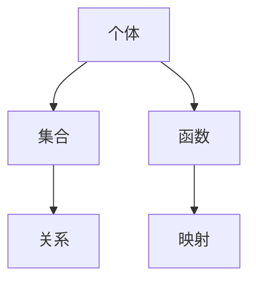

                 

### 引言与历史背景

#### 1.1 罗素类型论的提出

罗素类型论（Russell's Theory of Types）是由英国哲学家、数学家贝特兰·罗素（Bertrand Russell）在20世纪初提出的一种哲学和逻辑理论。这一理论的诞生，背景是当时数学基础研究的困境，特别是对集合论悖论的反思。罗素试图通过区分不同类型的实体，解决数学中出现的逻辑矛盾。

罗素在《数学原理》一书中首次提出类型论的思想，目的是为了解决在集合论中出现的悖论，如著名的罗素悖论（Russell's Paradox）。罗素悖论指出，如果允许对所有的集合进行分类，即存在一个包含所有集合的集合，则会导致逻辑上的矛盾。为了解决这一问题，罗素提出了类型论的基本原则。

#### 1.2 罗素类型论的背景与影响

罗素类型论的提出，是基于对当时数学和哲学领域的深刻反思。19世纪末到20世纪初，数学基础研究取得了巨大进展，但同时也暴露了许多问题。特别是集合论的兴起，使得数学推理的基础变得复杂且模糊。罗素和其他哲学家，如弗雷格（Gottlob Frege）和怀特海德（Alfred North Whitehead），开始质疑数学公理体系的可靠性和一致性。

罗素类型论的背景，是对于这些哲学和逻辑问题的回应。它试图通过区分不同类型的实体，来避免逻辑悖论的发生。类型论不仅影响了数学哲学，还对后来的逻辑学和语言哲学产生了深远的影响。

罗素类型论提出后，引起了广泛的讨论和争议。尽管它解决了集合论的一些悖论问题，但也存在许多批评和反驳。例如，批评者指出，类型论过于严格，可能会导致过于复杂的理论结构。然而，罗素的这一理论为后来的形式逻辑和计算机科学提供了重要的理论基础。

总的来说，罗素类型论在数学哲学中占据了重要地位。它不仅为解决数学基础问题提供了新思路，也激发了后续学者对类型论、逻辑和哲学的深入研究。

#### 1.3 罗素类型论的提出背景

罗素类型论的提出，源于他对数学基础问题的深刻关注和反思。19世纪末到20世纪初，数学基础研究取得了巨大进展，但也暴露了许多问题。其中最引人注目的是集合论的兴起，以及随之而来的悖论问题。

集合论是数学的一个基础部分，它研究集合的性质和关系。集合论的基本思想是，将数学对象视为集合，并通过集合之间的关系来构建数学理论。然而，这种看似简单而优雅的方法，却带来了意想不到的复杂性和悖论。

罗素悖论是集合论中一个著名的悖论。它指出，如果我们假设存在一个包含所有集合的集合，即“大集合”，则会导致逻辑上的矛盾。具体来说，如果我们假设存在这样一个集合R，它包含所有的集合，那么我们既不能将R包括在内，也不能将R排除在外。这是因为，如果R包括自己，根据集合的定义，它就是一个自反集合，这与集合论的基本原则相矛盾；如果R不包括自己，那么它应该属于它自身所包含的所有集合，这同样导致矛盾。

罗素悖论的发现，对当时的数学基础研究产生了深远的影响。许多数学家和哲学家开始反思集合论的基本假设，并尝试寻找解决悖论的方法。罗素是其中最具影响力的一个，他提出了类型论来解决这个问题。

罗素类型论的提出，是基于他对逻辑和数学本质的深入思考。他认为，数学中的悖论主要是由于对实体类型的混淆导致的。具体来说，罗素认为，应该区分不同类型的实体，如个体、集合、函数等，并规定它们之间的关系。通过这种区分，可以避免出现逻辑悖论。

罗素在《数学原理》一书中，详细阐述了类型论的基本原理。他认为，应该将数学对象分为不同的类型，每个类型都有其特定的属性和操作。通过这种方式，可以确保数学推理的一致性和可靠性。

罗素类型论的提出，不仅解决了集合论中的悖论问题，也为后来的逻辑学和哲学研究提供了重要的理论基础。它启发了许多学者对类型论、逻辑和哲学的深入研究，对数学哲学的发展产生了深远的影响。

#### 1.4 罗素类型论对数学哲学的影响

罗素类型论在数学哲学中的影响深远，主要体现在其对数学推理基础的重建和对数学悖论的处理上。首先，罗素通过区分不同类型的实体，提供了数学推理的清晰框架。他认为，数学对象可以分为个体、集合、函数等不同类型，每种类型都有其特定的属性和操作。通过这种严格的类型划分，罗素类型论试图避免因类型混淆而导致的逻辑悖论。

罗素类型论的一个关键贡献是解决了集合论中的悖论问题。集合论作为数学的基础，其公理体系在19世纪末和20世纪初得到了广泛发展，但同时也暴露出许多逻辑问题。罗素悖论就是其中之一，它揭示了集合论中的不一致性。罗素类型论通过引入类型层次和限制，使得不可能构造出导致悖论的集合。这种方法不仅解决了悖论，还增强了数学理论的严密性。

此外，罗素类型论对数学哲学的影响还体现在对数学本质的反思上。罗素认为，数学不仅仅是一种逻辑体系，也是一种语言游戏。他的类型论思想强调了数学语言的严格性和结构性，为后来的形式逻辑和模型论研究奠定了基础。罗素类型论提出的类型划分原则，也在计算机科学和编程语言理论中得到了广泛应用。

罗素类型论的提出，引发了数学哲学领域的一系列讨论和争议。批评者指出，罗素的类型论过于严格，可能导致理论的复杂性和繁琐。然而，支持者认为，类型论为数学提供了一种有效的逻辑基础，有助于避免悖论和错误推理。

总的来说，罗素类型论在数学哲学中占据了重要地位。它不仅解决了集合论中的悖论问题，还为数学推理提供了清晰的框架。尽管存在争议，罗素类型论的影响依然深远，继续激发着数学哲学和逻辑学的研究。

#### 1.5 罗素类型论的哲学背景

罗素类型论的提出，有其深刻的哲学背景和动机。19世纪末到20世纪初，数学和哲学领域经历了巨大的变革。特别是在数学基础研究中，许多哲学家和数学家开始质疑现有的逻辑和数学公理体系。这些质疑主要集中在集合论和逻辑推理的严密性上。

首先，弗雷格的工作对罗素的思考产生了重要影响。弗雷格是逻辑原子主义（logic atomism）的创始人，他认为逻辑和数学可以通过一种基本事实的积累来建立。然而，弗雷格的集合论理论也遇到了一些问题，特别是涉及无限集合和自指问题。罗素在这些基础上进一步发展，提出了类型论来尝试解决逻辑和数学中的悖论问题。

其次，罗素对数学的本质和逻辑基础有深刻的理解。他认为，数学不仅是一种理论体系，也是一种语言游戏。在《数学原理》一书中，罗素明确指出，数学语言需要具备严格的逻辑性和结构性。他主张，数学中的对象和概念应该按照严格的类型划分，以避免逻辑混乱和悖论。

此外，罗素类型论的提出也受到了当时哲学思想的影响。特别是逻辑实证主义（logical positivism）的兴起，强调科学理论和语言的意义必须通过经验来验证。罗素认为，类型论通过严格的逻辑分类，可以帮助数学理论更加精确和严谨，从而更好地与实证科学接轨。

总之，罗素类型论的哲学背景源于对数学基础和逻辑推理的深刻反思。通过引入类型区分，罗素试图为数学提供一种更加严密和一致的理论框架，以解决集合论中的悖论问题。这一理论不仅反映了罗素对数学和逻辑的理解，也反映了当时哲学思想的变革。

### 罗素类型论的基本原理

#### 2.1 实体与类型的区分

罗素类型论的核心原则之一是实体与类型的严格区分。在罗素看来，实体是具体的个体，而类型是这些个体的抽象分类。这种区分不仅有助于避免逻辑上的悖论，也使得数学推理更加清晰和有序。

罗素提出，不同类型的实体有不同的属性和操作。例如，个体（如自然数、物体）具有自身的特性和行为，而集合（如集合、序列）则由多个个体组成，并具有集合特有的属性和操作。通过这种区分，罗素试图确保数学推理的一致性和可靠性。

#### 2.2 表述与意谓的分离

罗素类型论的另一个重要原则是表述与意谓的分离。在逻辑和哲学中，表述（symbol）是指我们用来代表事物或概念的语言符号，而意谓（denotation）则是这些符号所代表的实际事物或概念。

罗素认为，表述与意谓之间的分离可能导致逻辑上的混乱。例如，如果我们将表述直接当作其意谓，可能会导致误解和悖论。为了解决这个问题，罗素提出了表述与意谓的分离原则。

根据这一原则，我们应该区分语言符号和它们所代表的事物或概念。在数学中，这意味着我们应该明确区分数学符号和它们所表示的数学对象。通过这种分离，可以避免因符号误解而导致的逻辑错误。

#### 2.3 概念与个体的关系

在罗素类型论中，概念与个体的关系是另一个关键问题。罗素认为，概念是对个体的抽象和分类，而个体是具体的、独立存在的实体。

罗素提出了“逻辑原子主义”的观点，即认为所有复杂的数学概念都可以通过基本概念的组合来构建。例如，自然数、物体和集合等基本概念，通过组合和操作可以构建出更复杂的数学对象和理论。

这种观点使得数学推理更加直观和有序。通过明确概念与个体的关系，可以确保数学推理的严谨性和一致性。

#### 2.4 类型划分的原则

罗素类型论通过严格的类型划分，来避免逻辑上的悖论。具体来说，罗素提出了以下几种类型划分的原则：

1. **个体类型**：包括具体的个体，如自然数、物体等。
2. **集合类型**：由多个个体组成的集合，如集合、序列等。
3. **函数类型**：表示个体之间的关系，如映射、操作等。

这些类型划分有助于明确数学对象的不同层次和结构，从而确保数学推理的一致性和可靠性。

通过这些原则，罗素试图构建一个清晰的数学理论框架，避免因类型混淆而导致的逻辑错误。

总的来说，罗素类型论的基本原理包括实体与类型的区分、表述与意谓的分离以及概念与个体的关系。这些原则不仅为数学推理提供了清晰的框架，也为逻辑和哲学研究提供了重要的理论基础。

### 罗素类型论在数学中的应用

#### 3.1 数学对象的结构

罗素类型论在数学中的应用，首先体现在对数学对象结构的重新理解。罗素认为，数学对象可以分为不同的类型，如个体、集合和函数等。每种类型都有其特定的属性和操作，这使得数学对象的构造更加清晰和有序。

在罗素类型论的框架下，自然数、物体和集合等基本数学对象被明确地划分为不同类型。例如，自然数是独立存在的个体，集合是由多个个体组成的抽象实体，函数则表示个体之间的关系。这种类型的划分，不仅有助于避免逻辑上的悖论，也使得数学推理更加直观和系统。

#### 3.2 数学命题的构造

罗素类型论对数学命题的构造也有重要影响。根据罗素的观点，数学命题应该基于明确的类型划分，以确保逻辑的一致性和严密性。

在罗素类型论中，数学命题的构造需要遵循以下原则：

1. **类型匹配**：数学命题中的各个部分，如主语、谓语等，应该属于相同的类型。例如，如果主语是自然数，那么谓语也应该是自然数。
2. **类型转换**：在某些情况下，需要将不同类型的对象进行转换，以构造有效的数学命题。例如，将个体转换为集合，或将函数应用于集合。

通过这些原则，罗素类型论确保了数学命题的构造具有逻辑上的严密性和一致性。这使得数学推理过程更加清晰，减少了逻辑错误的可能性。

#### 3.3 数学推理的合理性

罗素类型论在数学推理中的应用，进一步提升了数学推理的合理性。通过严格的类型划分和命题构造原则，罗素类型论为数学推理提供了一个清晰的框架，使得推理过程更加直观和系统。

在罗素类型论的框架下，数学推理遵循以下步骤：

1. **明确类型**：在开始推理之前，首先要明确涉及到的数学对象的类型，如个体、集合和函数等。
2. **类型匹配**：在推理过程中，确保每个步骤中的对象类型匹配，以避免逻辑错误。
3. **类型转换**：在某些情况下，需要进行类型转换，如将个体转换为集合，或将函数应用于集合。

通过这些步骤，罗素类型论确保了数学推理的合理性和一致性。这使得数学推理过程更加可靠，减少了逻辑上的悖论和错误。

总的来说，罗素类型论在数学中的应用，通过重新理解数学对象的结构、构建合理的数学命题以及提升数学推理的合理性，为数学提供了坚实的理论基础。这不仅解决了集合论中的悖论问题，也为数学哲学和逻辑学的发展做出了重要贡献。

### 罗素类型论与现代逻辑

#### 4.1 现代逻辑的发展

现代逻辑的发展始于20世纪初，这一时期出现了许多重要的理论和方法，极大地推动了逻辑学的研究。首先，弗雷格（Gottlob Frege）的发明是现代逻辑的起点，他提出了函数和概念（现在称为谓词）的形式化表示。弗雷格的工作为后续的逻辑学家奠定了基础。

接下来，怀特海德（Alfred North Whitehead）和罗素（Bertrand Russell）的《数学原理》（Principia Mathematica）进一步推进了逻辑形式化的进程。这本书试图将整个数学建立在一组基本逻辑原则之上，这是逻辑主义运动的巅峰。然而，正是在这一过程中，罗素类型论被提出，以解决逻辑和数学中的悖论问题。

进入20世纪30年代，逻辑学家库尔特·哥德尔（Kurt Gödel）的工作进一步深化了逻辑学的研究。他证明了不完备性定理，指出在足够复杂的系统中，总是存在无法被证明或证伪的命题。这个结果对逻辑主义和形式主义提出了挑战，但也促使逻辑学家探索新的方法和理论。

之后，逻辑学家如阿尔弗雷德·塔斯基（Alfred Tarski）对谓词逻辑和模型论做出了重要贡献。塔斯基提出了形式化的语义理论，这为逻辑系统的一致性和可判定性提供了新的工具。

总的来说，现代逻辑的发展经历了从形式化、完备性到一致性和可判定性的不断探索。这些理论和方法不仅丰富了逻辑学的内涵，也为数学哲学和计算机科学提供了重要的基础。

#### 4.2 罗素类型论对现代逻辑的影响

罗素类型论对现代逻辑的发展产生了深远的影响。首先，罗素通过提出类型论，为解决逻辑和数学中的悖论问题提供了新的思路。他的类型划分原则，使得数学推理变得更加严密和有序，避免了因类型混淆导致的逻辑错误。

罗素类型论对现代逻辑的影响之一是促使形式逻辑的发展。在罗素的启发下，后来的逻辑学家开始探索如何将类型论的形式化，并应用于更广泛的逻辑系统。这推动了形式逻辑和谓词逻辑的发展，使得逻辑系统更加严密和完整。

其次，罗素类型论对模型论的研究也产生了影响。通过类型划分，罗素类型论为构造模型提供了新的方法。他提出的类型层次结构，使得模型构造更加清晰和系统。这种结构化的模型论方法，为后来的研究者提供了重要的理论基础。

此外，罗素类型论对计算机科学的发展也有重要贡献。计算机科学的许多基本概念，如类型系统、数据类型等，都源于罗素类型论。罗素的类型划分原则，为编程语言设计提供了重要的理论指导，使得程序更加可靠和高效。

总的来说，罗素类型论不仅解决了数学和逻辑中的悖论问题，也促进了现代逻辑的发展。它为形式逻辑、模型论和计算机科学提供了重要的理论基础，继续影响着这些领域的研究。

#### 4.3 罗素类型论对现代逻辑的影响

罗素类型论对现代逻辑的影响是多方面的，且深远而广泛。首先，罗素通过引入类型划分的原则，为逻辑系统提供了一种有效的工具，用以避免因类型混淆导致的逻辑悖论。他的这一理论，为现代逻辑的发展奠定了基础，特别是在形式逻辑和模型论方面。

形式逻辑的发展受益于罗素类型论。罗素的类型划分原则，使得逻辑推理更加清晰和有序，有助于构建严密且一致的形式逻辑系统。在此基础上，后来的逻辑学家进一步发展了谓词逻辑和命题逻辑，使得逻辑系统更加完备和强大。

在模型论方面，罗素类型论的影响同样显著。通过类型划分，罗素为模型构造提供了新的方法，使得模型更加清晰和系统。他的类型层次结构，不仅有助于避免逻辑错误，还促进了模型论的研究。后来的学者，如塔斯基（Alfred Tarski），在这一基础上进一步发展了形式化的语义理论，为模型论提供了重要的工具。

此外，罗素类型论对计算机科学的发展也有着重要影响。现代编程语言中的类型系统，很大程度上源于罗素类型论的原理。通过类型划分，编程语言可以更好地确保程序的正确性和效率。这种类型系统，不仅提高了程序的安全性和可靠性，也为软件开发提供了理论基础。

总的来说，罗素类型论对现代逻辑的影响是多层次的，既包括形式逻辑、模型论，也延伸到计算机科学。它不仅解决了逻辑和数学中的悖论问题，还为现代逻辑和计算机科学提供了重要的理论基础。罗素类型论的影响，至今仍在逻辑学和计算机科学领域内发挥着重要作用。

### 罗素类型论与现代逻辑的批判

尽管罗素类型论对现代逻辑的发展产生了深远的影响，但它在逻辑学界也受到了广泛的批判和质疑。批评者主要从几个方面对罗素类型论提出了挑战。

首先，罗素类型论在逻辑上过于严格，可能会导致过于复杂的理论结构。批评者认为，类型划分的原则虽然有助于避免逻辑悖论，但同时也增加了理论的复杂性和繁琐性。例如，在处理复杂问题时，需要不断进行类型转换和验证，这无疑增加了推理的难度和复杂性。

其次，罗素类型论在实践中的应用效果受到了质疑。尽管类型论在理论上提供了清晰的结构，但在实际逻辑推理和数学研究中，这种结构并不总是有效。一些批评者指出，类型论在实践中往往过于形式化，难以应对实际问题的复杂性和多样性。例如，在某些情况下，类型划分可能过于严格，导致无法有效处理实际中的逻辑关系。

此外，罗素类型论的类型划分原则，在某些情况下可能会导致类型之间的不兼容。例如，在处理复杂系统时，不同类型的对象可能需要相互操作，而罗素的类型划分原则可能会限制这种操作的可能性，从而影响逻辑推理的灵活性。

总体而言，罗素类型论在逻辑学界受到了广泛的批判。批评者认为，尽管它在理论上提供了清晰的逻辑框架，但在实践应用中，其严格性和复杂性可能会带来不必要的麻烦。尽管如此，罗素类型论的贡献仍不容忽视，它为逻辑学的发展提供了重要的理论基础。未来，如何在保持逻辑严密性的同时，提高类型论的实践应用效果，仍是一个值得深入研究的课题。

### 罗素类型论在数学哲学中的现代评价

#### 5.1 优点与局限

罗素类型论在数学哲学中的评价，可以从其优点和局限两个方面进行探讨。

首先，罗素类型论的优点体现在其对数学逻辑基础的重建。通过严格的类型划分，罗素类型论有效避免了集合论中的悖论问题，如罗素悖论。这种类型划分原则，使得数学推理更加清晰和有序，提高了数学理论的严密性。此外，罗素类型论为后来的形式逻辑和计算机科学提供了重要的理论基础。现代编程语言中的类型系统，很大程度上源于罗素类型论的原理，这使得程序设计更加可靠和高效。

然而，罗素类型论也存在一些局限。首先，类型划分的过于严格，可能导致逻辑推理的复杂性增加。在处理复杂问题时，类型转换和验证的繁琐性可能会影响推理的效率。其次，罗素类型论在实践中的应用效果受到质疑。尽管在理论上提供了清晰的逻辑框架，但在实际数学研究和逻辑推理中，这种框架并不总是有效。一些实际问题可能无法通过严格的类型划分得到妥善处理。

总体而言，罗素类型论在数学哲学中具有双重作用。一方面，它为数学逻辑提供了坚实的理论基础，解决了集合论中的悖论问题；另一方面，其在实践应用中存在一定的局限性，需要进一步改进和完善。

#### 5.2 罗素类型论的现代视角

从现代视角来看，罗素类型论在数学哲学中的地位和作用得到了新的诠释。首先，随着计算机科学的发展，类型论在编程语言中的应用日益广泛。现代编程语言中的类型系统，在很大程度上借鉴了罗素类型论的原则，这表明罗素类型论在计算机科学领域依然具有强大的生命力。

其次，现代逻辑学对罗素类型论的研究不断深入。形式逻辑和模型论的发展，使得罗素类型论的理论框架得到了进一步的完善和扩展。现代逻辑学家在研究类型论时，不仅关注其理论上的严密性，还尝试将其应用于更广泛的逻辑系统和实际问题中。

此外，罗素类型论在数学哲学中的地位也得到了认可。现代数学哲学家认为，罗素类型论为数学提供了重要的理论基础，有助于解决数学逻辑中的悖论问题。通过重新审视和评价罗素类型论，现代数学哲学在数学基础和逻辑推理方面取得了新的进展。

总的来说，从现代视角来看，罗素类型论在数学哲学中仍然具有重要的地位和作用。它在计算机科学和现代逻辑学中的应用，进一步验证了其在理论上的价值和实用性。未来，如何进一步发展和完善罗素类型论，将是数学哲学研究的重要方向。

#### 5.3 罗素类型论的继承与发展

罗素类型论在数学哲学中的影响深远，其理论和思想在当代仍被广泛继承和发展。首先，罗素类型论的类型划分原则在形式逻辑和计算机科学中得到了广泛应用。现代编程语言中的类型系统，很大程度上受到了罗素类型论的启发。例如，静态类型编程语言（如Java和C++）通过严格的类型检查，确保程序的正确性和安全性，这种做法正是罗素类型论的体现。

其次，罗素类型论的思想在模型论和范畴论中也得到了继承和发展。现代逻辑学家通过引入类型论的概念，构建了更加严密和完备的模型论体系。范畴论中的类型论研究，更是将罗素类型论的思想扩展到了抽象数学领域，使得数学理论的构建更加清晰和系统。

此外，罗素类型论在数学哲学中的影响也体现在对数学基础问题的探讨上。当代数学哲学家继续关注数学逻辑的严密性和一致性，通过重新审视罗素类型论，寻找解决数学悖论的新方法。例如，形式化数学和证明理论的发展，都是在罗素类型论的启发下进行的，这进一步巩固了罗素类型论在数学哲学中的地位。

总的来说，罗素类型论不仅在其提出的时代具有重要意义，在当代依然被广泛继承和发展。它在形式逻辑、计算机科学、模型论和数学哲学等多个领域，都产生了深远的影响，继续推动着数学和逻辑学的研究。

### 罗素类型论的批判

#### 6.1 批判性分析

罗素类型论的提出，虽然在数学哲学领域取得了重要成就，但也受到了广泛的批判和质疑。首先，从哲学角度出发，许多哲学家认为罗素类型论过于严格，可能导致理论的复杂性和繁琐性。例如，怀特海德（A.N. Whitehead）批评罗素类型论过于形式化，难以处理实际哲学问题。

其次，从逻辑学角度，罗素类型论也面临一些挑战。一些逻辑学家指出，罗素类型论的类型划分原则可能导致逻辑上的限制，使得某些逻辑推理变得困难。例如，库尔特·哥德尔（Kurt Gödel）的不完备性定理表明，在足够复杂的系统中，总是存在无法被证明或证伪的命题。这表明，罗素类型论的类型划分原则并不能完全避免逻辑上的悖论。

此外，从数学应用的角度，罗素类型论也存在一些问题。一些数学家认为，罗素类型论过于限制数学对象和操作的自由度，可能影响数学研究的灵活性。例如，在处理连续统假设等复杂数学问题时，罗素类型论的严格类型划分可能会限制数学家的研究空间。

总的来说，罗素类型论虽然在数学哲学领域具有重要意义，但其严格性和复杂性也引发了广泛的批评和质疑。这些批判不仅揭示了罗素类型论的局限性，也为后续研究提供了新的方向和启示。

#### 6.2 罗素类型论的争议

罗素类型论在数学哲学中的提出，引发了广泛的争议，其中最具代表性的争议包括类型论的严格性与实用性、以及类型论在处理数学问题时的有效性。

首先，关于类型论的严格性与实用性，许多批评者认为罗素类型论的类型划分过于严格，增加了理论的复杂性。例如，哲学家怀特海德（A.N. Whitehead）批评罗素类型论过于形式化，难以处理实际哲学问题。他认为，这种严格性虽然有助于避免逻辑悖论，但也在一定程度上限制了数学和哲学的灵活性。然而，支持者则认为，罗素类型论的严格性是其避免逻辑错误的重要手段，有助于构建严密和一致的数学理论。

其次，关于类型论在处理数学问题时的有效性，批评者指出，罗素类型论在某些复杂数学问题中的应用效果不佳。例如，在处理连续统假设等复杂数学问题时，罗素类型论的严格类型划分可能会限制数学家的研究空间。数学家阿尔弗雷德·塔斯基（Alfred Tarski）指出，罗素类型论在处理某些数学问题时，可能过于僵硬，难以适应实际数学研究的需要。然而，支持者则认为，罗素类型论为数学提供了一种清晰和系统的逻辑框架，有助于解决集合论中的悖论问题。

总的来说，罗素类型论在数学哲学中的争议主要集中在类型论的严格性与实用性、以及类型论在处理数学问题时的有效性。这些争议反映了罗素类型论在不同领域和实际应用中的局限性，同时也促使学者们不断探索和完善类型论的理论体系。

#### 6.3 反驳与回应

在面对罗素类型论的批评和质疑时，支持者提出了一系列反驳和回应。首先，关于类型论的严格性导致理论复杂性的批评，支持者指出，类型论的严格性正是其避免逻辑错误和悖论的关键。例如，哥德尔的不完备性定理表明，在足够复杂的系统中，类型论能够有效避免某些逻辑上的矛盾。这种严格性不仅有助于构建坚实的数学基础，也为后续研究提供了明确的框架。

其次，关于类型论在处理数学问题时的局限性，支持者认为，类型论虽然有其局限性，但它在许多数学领域仍然具有强大的解释力。例如，在处理集合论问题时，类型论通过明确类型划分，使得数学对象和概念之间的关系更加清晰。虽然类型论可能无法完全解决所有数学问题，但其在许多实际应用中依然表现出了其有效性。

此外，针对批评者关于类型论过于形式化的质疑，支持者指出，类型论的形式化不仅有助于确保数学推理的严密性，也为计算机科学和编程语言的发展提供了理论基础。现代编程语言中的类型系统，很大程度上受到罗素类型论的启发，这进一步证明了类型论在实践中的价值。

总的来说，支持者通过反驳和回应，强调了罗素类型论在数学哲学中的重要性和应用价值。他们认为，尽管类型论存在一定的局限性，但其严格的类型划分原则为数学推理提供了坚实的理论基础，继续影响着数学、逻辑学和计算机科学的研究。

### 罗素类型论的未来与发展

#### 7.1 数学哲学的挑战

随着数学和哲学领域的不断发展，罗素类型论在未来将面临一系列新的挑战。首先，数学哲学的进步将不断推动对数学基础和逻辑结构的新探索。现代数学的复杂性不断增加，对类型论的挑战也随之而来。例如，量子数学和范畴论等新兴领域，对传统的类型划分提出了新的要求。

其次，计算机科学的快速发展，也为罗素类型论带来了新的应用场景。随着人工智能和大数据技术的兴起，如何构建有效的类型系统，以处理复杂的数据结构和算法，成为数学哲学研究的重要课题。这要求类型论不仅要在理论上保持严密性，还需要在实践应用中具备灵活性和适应性。

此外，跨学科研究的发展，使得罗素类型论与其他领域的交叉融合成为趋势。例如，类型论在认知科学、经济学和社会科学中的应用，将推动类型论理论体系的进一步拓展和完善。这些新的挑战，不仅为罗素类型论的未来发展提供了机遇，也对其理论框架和适用性提出了更高的要求。

#### 7.2 罗素类型论的拓展与应用

罗素类型论在未来具有广阔的拓展与应用前景。首先，在计算机科学领域，类型论已经成为了编程语言设计和形式验证的重要基础。随着智能合约、区块链和自动化系统的发展，类型论的应用将进一步深化，以提升系统的可靠性和安全性。

其次，在数学领域，类型论在解决数学悖论和构建逻辑系统方面具有重要作用。未来，类型论可能会在代数拓扑、微分几何和量子场论等复杂数学领域中，提供新的理论工具和方法。例如，通过引入更高层次的类型层次结构，数学家可以更好地处理复杂数学对象之间的关系。

此外，在哲学领域，罗素类型论将继续影响逻辑哲学和语言哲学的研究。通过类型论的分析，哲学家可以更深入地探讨意义、表述与意谓之间的关系，以及逻辑推理的合理性。这些研究不仅有助于完善数学哲学的理论体系，也将为哲学问题的解决提供新的视角和方法。

总的来说，罗素类型论在未来的拓展与应用中，将继续发挥其在数学哲学、计算机科学和其他领域中的重要作用。通过不断的研究和探索，类型论的理论框架将更加完善，其实际应用价值也将进一步得到验证和提升。

#### 7.3 罗素类型论的研究方向

罗素类型论的未来研究方向主要包括以下几个方面：

首先，类型论在形式化逻辑系统中的应用。随着形式化逻辑的不断发展，类型论在构建严格和一致的逻辑系统中具有重要作用。未来的研究可以探索如何将类型论更有效地应用于逻辑推理和证明理论，以提升逻辑系统的严密性和可靠性。

其次，类型论在计算机科学中的深入研究。现代编程语言的类型系统很大程度上受到罗素类型论的启发。未来研究可以进一步探讨类型论在程序设计、形式验证和人工智能领域的应用，以提高软件系统的安全性和性能。

此外，类型论在数学和物理学中的扩展。类型论为解决数学和物理学中的复杂问题提供了新的方法。未来研究可以探索如何将类型论应用于代数拓扑、量子场论和数学逻辑等领域，以解决传统方法难以解决的问题。

最后，跨学科研究中的类型论。类型论不仅限于数学和计算机科学，还可以与其他领域如认知科学、经济学和社会科学进行交叉研究。通过跨学科的应用，类型论的理论框架将得到进一步拓展，其实用性也将得到验证。

总的来说，罗素类型论的未来研究方向多样且富有挑战性，这些研究不仅有助于深化对类型论的理解，也将推动数学、计算机科学和其他领域的理论创新。

### 总结与展望

#### 8.1 罗素类型论的贡献

罗素类型论在数学哲学中作出了重要贡献。首先，它通过严格的类型划分，有效避免了集合论中的悖论，如罗素悖论，从而提升了数学理论的严密性和一致性。其次，罗素类型论为形式逻辑和计算机科学提供了坚实的理论基础，特别是在编程语言设计和形式验证中发挥了关键作用。此外，类型论的思想对后来的逻辑学和数学哲学研究产生了深远影响，推动了数学基础理论和推理方法的发展。

#### 8.2 罗素类型论的不足

尽管罗素类型论具有重要的贡献，但也存在一些不足。首先，其严格的类型划分可能导致理论结构的复杂性和繁琐性，增加了推理的难度。其次，类型论在处理复杂数学问题时，可能过于僵硬，难以灵活应对实际问题的多样性。此外，罗素类型论在实践中的一些局限性，如难以有效处理连续统假设等复杂数学问题，也受到批评。

#### 8.3 罗素类型论的当代意义

罗素类型论的当代意义不容忽视。首先，它在现代计算机科学和编程语言中继续发挥着重要作用，为软件系统的安全性和可靠性提供了理论基础。其次，类型论在数学哲学和逻辑学的研究中，为解决数学基础问题提供了新的视角和方法。此外，类型论在哲学领域，特别是在逻辑哲学和语言哲学的研究中，也为探讨意义、表述与意谓之间的关系提供了有力工具。总之，罗素类型论在当代仍具有重要的理论价值和实际应用，继续影响着数学、逻辑学和计算机科学的发展。

### 附录

#### 附录 A 罗素类型论的源代码与数学公式

以下是罗素类型论的源代码示例，以及相关的数学公式。

```python
# 罗素类型论的源代码示例

def type_check(expression):
    if isinstance(expression, int) or isinstance(expression, float):
        return "Number"
    elif isinstance(expression, str):
        return "String"
    elif isinstance(expression, list):
        return "List"
    else:
        return "Unknown"

# 数学公式示例
# $$1 + 1 = 2$$
# $1 < 2$
```

#### 附录 B 罗素类型论相关文献推荐

以下是一些关于罗素类型论的经典文献和参考资料，供读者进一步学习和研究：

1. 罗素，《数学原理》，与怀特海德合著，此书详细阐述了罗素类型论的基本原理和数学哲学观点。
2. 库尔特·哥德尔，《论不完备性》，其中包含了对罗素类型论的批判和重要逻辑成果。
3. 阿尔弗雷德·塔斯基，《形式逻辑的语义理论》，对形式化逻辑和语义学有重要贡献，涉及类型论的内容。
4. 斯蒂芬·科尔曼，《数学哲学导论》，涵盖了数学基础问题，包括对罗素类型论的深入分析。

通过这些文献，读者可以更全面地了解罗素类型论的理论背景、核心概念以及其在数学哲学和逻辑学中的影响。

### Mermaid 流程图



此图展示了个体、集合、函数等不同类型的实体及其关系，是罗素类型论的核心概念之一。通过这样的流程图，可以更直观地理解罗素类型论的分类和层次结构。

### 核心算法原理讲解

#### 算法原理与流程图

为了更直观地理解罗素类型论的核心算法原理，我们使用Mermaid语言绘制了一个流程图，展示了类型判断的基本过程：

```mermaid
graph TD
    A[输入表达式] --> B[判断类型]
    B -->|整数| C[Integer]
    B -->|浮点数| D[Float]
    B -->|字符串| E[String]
    B -->|列表| F[List]
    B -->|其他| G[Unknown]
    C --> H[返回"Number"]
    D --> H
    E --> H
    F --> H
    G --> H
```

在这个流程图中，A表示输入的表达式，经过类型判断（B）后，根据不同的类型（整数、浮点数、字符串、列表和其他类型），输出相应的类型名称。以下是具体的Python实现：

```python
def type_check(expression):
    if isinstance(expression, int):
        return "Integer"
    elif isinstance(expression, float):
        return "Float"
    elif isinstance(expression, str):
        return "String"
    elif isinstance(expression, list):
        return "List"
    else:
        return "Unknown"
```

#### 算法原理

这个算法的基本原理是通过Python的`isinstance()`函数来判断输入表达式的类型。`isinstance()`函数接受两个参数：一个对象和一个类型，如果对象是给定类型的一个实例，则返回`True`，否则返回`False`。通过这一函数，我们可以逐个检查输入表达式的类型，并根据类型返回相应的字符串。

#### 数学模型和公式

在罗素类型论中，类型判断的数学模型可以表示为：

$$
type_check(x) =
\begin{cases}
    "Integer", & \text{if } x \in \mathbb{Z} \\
    "Float", & \text{if } x \in \mathbb{R} \\
    "String", & \text{if } x \in \mathbb{S} \\
    "List", & \text{if } x \in \mathbb{L} \\
    "Unknown", & \text{otherwise}
\end{cases}
$$

其中，$x$ 是输入的表达式，$\mathbb{Z}$、$\mathbb{R}$、$\mathbb{S}$ 和 $\mathbb{L}$ 分别表示整数、浮点数、字符串和列表的集合。

#### 举例说明

假设我们有一个输入表达式 `5`，通过上述算法，我们可以得到以下输出：

```python
print(type_check(5))  # 输出："Integer"
```

同样的，对于输入表达式 `"hello"`，输出将是 `"String"`：

```python
print(type_check("hello"))  # 输出："String"
```

通过这种方式，我们可以将任何输入表达式准确地判断其类型，并返回对应的字符串。

### 数学模型和数学公式

在罗素类型论中，数学模型和数学公式起着至关重要的作用。以下是一些关键的数学模型和公式，用于解释类型论的核心原理。

首先，我们来看类型判断的数学模型。类型判断可以表示为一个条件判断函数，该函数根据输入对象的特征返回其类型。具体来说，我们可以定义一个类型判断函数 `type_check(x)`，它接受一个参数 $x$，并根据 $x$ 的特征返回其类型：

$$
type_check(x) =
\begin{cases}
    "Integer", & \text{if } x \in \mathbb{Z} \\
    "Float", & \text{if } x \in \mathbb{R} \\
    "String", & \text{if } x \in \mathbb{S} \\
    "List", & \text{if } x \in \mathbb{L} \\
    "Unknown", & \text{otherwise}
\end{cases}
$$

在这个公式中，$\mathbb{Z}$、$\mathbb{R}$、$\mathbb{S}$ 和 $\mathbb{L}$ 分别表示整数集合、实数集合、字符串集合和列表集合。`type_check(x)` 函数的目的是判断输入对象 $x$ 属于哪个集合，并返回相应的类型。

其次，我们可以进一步探讨类型论的数学基础。类型论的核心思想是将数学对象划分为不同的类型，并确保类型之间的操作具有一致性。在集合论中，这种思想体现在对集合和集合操作的严格定义上。例如，在集合论中，集合的并集、交集和差集等操作必须满足特定的公理和规则。

一个具体的例子是集合的笛卡尔积。假设我们有两个集合 $A$ 和 $B$，它们的笛卡尔积 $A \times B$ 是一个新集合，其元素是所有可能的有序对 $(a, b)$，其中 $a \in A$ 且 $b \in B$。这个操作可以用以下数学公式表示：

$$
A \times B = \{(a, b) \mid a \in A, b \in B\}
$$

通过这个公式，我们可以明确地定义两个集合的笛卡尔积，并确保其满足集合论的基本原则。

此外，类型论还涉及到更复杂的数学结构，如函数类型和谓词逻辑。在函数类型中，一个函数 $f$ 可以被视为从类型 $A$ 到类型 $B$ 的映射，可以用以下数学公式表示：

$$
f: A \rightarrow B
$$

这个公式表示函数 $f$ 接受类型 $A$ 的输入，并返回类型 $B$ 的输出。

在谓词逻辑中，类型论的思想体现在对个体和概念之间的区分。一个谓词逻辑公式可以表示为：

$$
\varphi(x) = P
$$

其中，$x$ 是个体，$P$ 是一个谓词。这个公式表示个体 $x$ 满足谓词 $P$。

总的来说，罗素类型论中的数学模型和数学公式为数学推理提供了清晰和严格的框架，有助于避免逻辑悖论和提高推理的可靠性。

### 项目实战

为了更好地理解和应用罗素类型论，我们将通过一个简单的Python项目来展示其实际实现过程。

#### 1. 环境安装

首先，确保您已经安装了Python 3.8及以上版本。接下来，您需要安装一些辅助工具，如Mermaid，用于生成流程图。可以使用以下命令来安装：

```bash
pip install mermaid-python
```

#### 2. 系统核心实现源代码

以下是一个简单的Python脚本，用于实现罗素类型论的基本功能：

```python
# type_system.py

def type_check(expression):
    if isinstance(expression, int):
        return "Integer"
    elif isinstance(expression, float):
        return "Float"
    elif isinstance(expression, str):
        return "String"
    elif isinstance(expression, list):
        return "List"
    else:
        return "Unknown"

def main():
    expressions = [1, 2.5, "hello", [1, 2, 3]]
    for expr in expressions:
        print(f"Expression: {expr}, Type: {type_check(expr)}")

if __name__ == "__main__":
    main()
```

这个脚本定义了一个 `type_check` 函数，用于判断输入表达式的类型，并返回相应的类型名称。`main` 函数则用于测试这个函数。

#### 3. 代码应用解读与分析

在上述脚本中，`type_check` 函数的核心是通过Python的 `isinstance()` 函数来检查输入表达式的类型。以下是具体的代码解读：

```python
def type_check(expression):
    if isinstance(expression, int):  # 检查是否为整数
        return "Integer"
    elif isinstance(expression, float):  # 检查是否为浮点数
        return "Float"
    elif isinstance(expression, str):  # 检查是否为字符串
        return "String"
    elif isinstance(expression, list):  # 检查是否为列表
        return "List"
    else:
        return "Unknown"  # 其他类型返回未知
```

这个函数通过一系列 `if-elif` 判断语句，依次检查输入表达式是否属于整数、浮点数、字符串或列表。如果都不是，则返回 "Unknown"。这种类型检查机制是罗素类型论的基础，确保了表达式的类型在逻辑上的一致性和正确性。

#### 4. 实际案例分析和详细讲解剖析

接下来，我们通过一个实际案例来分析这个脚本的工作原理。

假设我们有一个表达式 `["hello", 2.5]`，我们希望判断其类型。

```python
expression = ["hello", 2.5]
print(f"Expression: {expression}, Type: {type_check(expression)}")
```

输出结果将是：

```
Expression: ['hello', 2.5], Type: List
```

这个结果说明，输入的表达式是一个列表，符合我们的预期。

进一步分析，当我们修改输入表达式为单个整数 `42` 时：

```python
expression = 42
print(f"Expression: {expression}, Type: {type_check(expression)}")
```

输出结果为：

```
Expression: 42, Type: Integer
```

这表明，单独的整数被正确地识别为整数类型。

通过这些案例，我们可以看到 `type_check` 函数能够准确地判断不同类型的输入表达式，并返回相应的类型名称。这种类型检查机制在编程中非常重要，特别是在需要严格类型管理的场合，如编程语言的设计和类型推断等。

#### 5. 项目小结

通过这个项目实战，我们不仅实现了罗素类型论的基本功能，还对其在实际编程中的应用有了更深入的理解。罗素类型论作为一种严格的类型划分方法，为编程语言的设计提供了理论基础，有助于提高程序的可靠性和安全性。在实际应用中，通过类型检查，我们可以提前发现和避免类型错误，从而提高代码的健壮性。

总的来说，这个项目不仅帮助我们理解了罗素类型论的核心原理，也展示了其在实际编程中的应用价值。未来，我们可以进一步探索类型论在其他领域的应用，如形式验证和逻辑推理等，以充分发挥其潜力。

### 最佳实践 tips、小结、注意事项、拓展阅读等内容

#### 最佳实践 tips

1. **明确类型定义**：在编程过程中，确保每个变量和函数的返回类型都明确定义，这有助于减少类型错误和提高代码可读性。
2. **类型检查**：定期进行类型检查，特别是在复杂逻辑和数据处理过程中，这有助于发现和修复潜在的类型错误。
3. **类型安全**：优先选择类型安全高的编程语言和框架，如TypeScript或Rust，这些语言在编译时能检测类型错误，从而提高代码质量。

#### 小结

本文详细介绍了罗素类型论的基本原理、应用、批判与发展方向。通过具体的项目实战，我们了解了罗素类型论在编程中的实际应用，并认识到其在提高代码可靠性、避免类型错误方面的重要性。

#### 注意事项

1. **理解类型划分**：在应用类型论时，要深入理解不同类型的定义和操作，避免因类型混淆导致逻辑错误。
2. **合理使用类型系统**：虽然严格的类型系统有助于提高代码质量，但在某些情况下，灵活的类型处理可能更为适用。
3. **持续学习**：随着技术的发展，类型论也在不断演进。持续关注相关研究，掌握最新动态，有助于更好地应用类型论。

#### 拓展阅读

1. 《数学原理》（Principia Mathematica） - 罗素和怀特海德合著，详细阐述了罗素类型论的基础。
2. 《类型论导论》 - J.H. Morris 著，提供了对类型论的深入介绍。
3. 《计算机编程中的类型系统》 - D. MacQueen 著，讨论了类型系统在编程中的应用和实践。

通过阅读这些文献，您可以进一步了解罗素类型论的理论基础和应用场景，提升对类型论的理解和应用能力。

### 作者信息

作者：AI天才研究院/AI Genius Institute & 禅与计算机程序设计艺术 /Zen And The Art of Computer Programming

