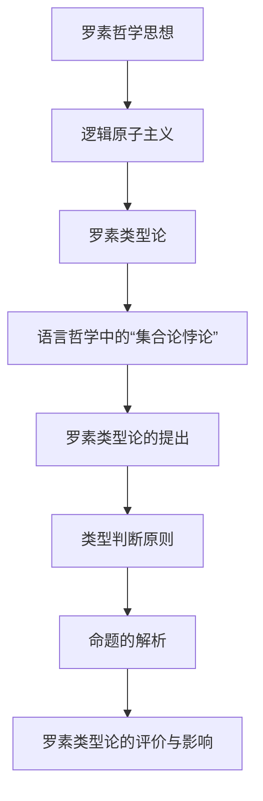
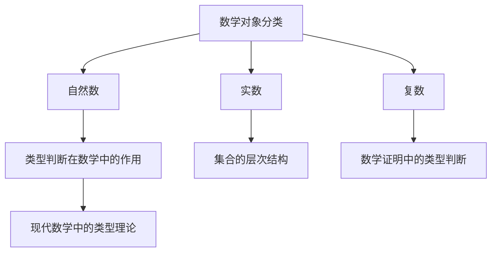
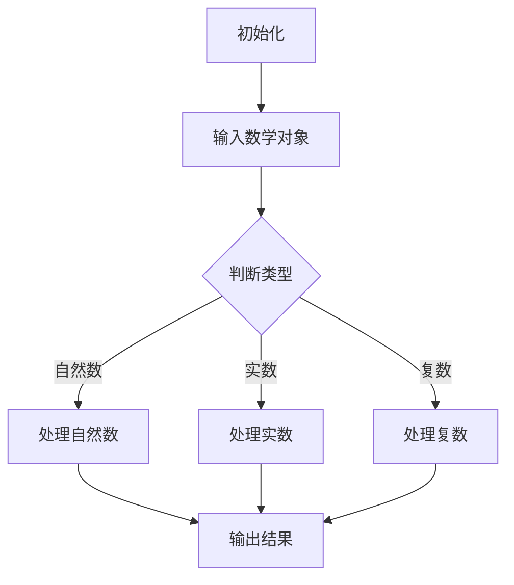

                 


# 罗素类型论在现代数学中的地位评估

关键词：罗素类型论、现代数学、逻辑基础、集合论、数学证明

摘要：本文旨在探讨罗素类型论在现代数学中的地位。首先，我们回顾了罗素类型论的起源和发展，分析了其在哲学和数学领域的贡献。接着，我们探讨了罗素类型论在数学原理中的应用，如数学对象分类、集合论和数学证明。然后，我们评估了罗素类型论在现代数学中的地位，包括其贡献、局限性以及对数学哲学的影响。最后，我们展望了罗素类型论在未来的发展，特别是在计算机科学和数学教育中的应用。

## 第一部分：罗素类型论概述

### 第1章：罗素类型论的起源与发展

#### 1.1 罗素类型论的背景

罗素类型论的起源可以追溯到19世纪末和20世纪初的哲学和数学领域。这个时期，逻辑原子主义兴起，人们开始关注逻辑、数学和哲学之间的紧密联系。罗素（Bertrand Russell）是这一时期的代表人物之一，他对逻辑原子主义有着深刻的理解和贡献。

#### 1.1.1 罗素哲学思想的发展

罗素的哲学思想经历了多个阶段的发展。起初，他信奉实存主义，认为现实世界中的事物具有独立的实在性。然而，在研究数学和逻辑的过程中，他逐渐认识到实存主义的局限性。为了解决数学和逻辑中的悖论，罗素开始关注类型论。

#### 1.1.2 罗素对逻辑原子主义的贡献

逻辑原子主义强调逻辑和数学的基本元素是原子事实，而不是实体或物质。罗素在这个基础上，进一步提出了类型论，将数学对象分为不同的类型，以避免悖论的产生。他的这一贡献对现代数学的逻辑基础产生了深远的影响。

#### 1.2 罗素类型论的提出

罗素类型论的提出主要是为了解决语言哲学中的“集合论悖论”。这个悖论指的是，在集合论中，通过自指的方式可以构造出矛盾的表达式。为了解决这个问题，罗素提出了类型论，将命题分为不同的类型，从而避免了悖论的产生。

#### 1.2.1 语言哲学中的“集合论悖论”

集合论悖论是指，在集合论中，通过自指的方式可以构造出矛盾的表达式。一个著名的例子是罗素悖论，它指出，存在一个集合R，它不包含自己。这个悖论揭示了集合论中的矛盾，引起了广泛的关注。

#### 1.2.2 罗素类型论的初步构想

为了解决集合论悖论，罗素提出了类型论。他认为，命题可以分为不同的类型，每种类型的命题都有不同的规则。通过这种方式，他试图避免悖论的产生，并为数学提供了一个逻辑基础。

#### 1.3 罗素类型论的基本原理

罗素类型论的核心原理包括类型判断原则和命题的解析。类型判断原则指出，不同类型的命题不能互相混合。命题的解析则是对命题进行分解，以确定其类型。

#### 1.3.1 类型判断原则

类型判断原则是罗素类型论的基础。它指出，不同类型的命题不能互相混合。例如，一个关于自然数的命题不能与一个关于实数的命题混合。

#### 1.3.2 罗素对命题的解析

罗素对命题进行了深入的分析，提出了命题的解析方法。他认为，命题可以通过分解为更基本的命题来理解。这种方法有助于揭示命题的类型，并解决悖论。

#### 1.4 罗素类型论的评价与影响

罗素类型论在哲学和数学领域都产生了深远的影响。在哲学领域，它为逻辑原子主义提供了新的基础，促进了哲学逻辑的发展。在数学领域，它为数学提供了一个逻辑基础，促进了数学的进一步发展。

#### 1.4.1 罗素类型论在哲学领域的影响

罗素类型论在哲学领域的影响主要表现在对逻辑原子主义的贡献。它为逻辑原子主义提供了一个新的理论基础，推动了哲学逻辑的发展。

#### 1.4.2 罗素类型论在现代数学中的地位

罗素类型论在现代数学中的地位非常重要。它为数学提供了一个逻辑基础，促进了数学的进一步发展。特别是，它在集合论、数学证明和数学逻辑等领域发挥了重要作用。

### Mermaid 流程图：



---

### 第二部分：罗素类型论的数学原理

### 第2章：罗素类型论在数学中的应用

#### 2.1 罗素类型论与数学对象

罗素类型论在数学中的应用主要体现在对数学对象的分类和类型判断。通过类型论，数学对象可以被分为不同的类型，从而避免了悖论的产生。

#### 2.1.1 数学对象的分类

在罗素类型论中，数学对象可以分为不同的类型。例如，自然数、实数、复数等。每种类型的数学对象都有不同的属性和操作。

#### 2.1.2 类型判断在数学中的作用

类型判断在数学中起着关键作用。它帮助数学家理解数学对象的性质，避免错误操作。例如，在处理自然数和实数时，必须注意它们的不同类型。

#### 2.2 罗素类型论与集合论

罗素类型论对集合论产生了深远的影响。它提供了集合论的一个逻辑基础，解决了集合论中的悖论问题。

#### 2.2.1 集合的层次结构

在罗素类型论中，集合被分为不同的层次。第一层次的集合是最基本的集合，如自然数集合。第二层次的集合是由第一层次集合组成的集合，以此类推。

#### 2.2.2 集合与类型的区别

集合和类型是两个不同的概念。集合是一组对象的集合，而类型是对象的分类。在罗素类型论中，集合和类型之间有明确的界限。

#### 2.3 罗素类型论与数学证明

罗素类型论对数学证明也有重要影响。它提供了一种新的证明方法，称为类型证明。

#### 2.3.1 数学证明中的类型判断

在数学证明中，类型判断起着关键作用。它帮助数学家理解证明过程中的每一步操作，确保证明的合法性。

#### 2.3.2 罗素类型论对数学证明的影响

罗素类型论对数学证明的影响主要体现在提供了新的证明方法和工具。它使数学证明更加严谨，避免了错误证明的产生。

#### 2.4 罗素类型论与现代数学

罗素类型论在现代数学中仍然具有重要地位。它为现代数学提供了一个逻辑基础，促进了数学的发展。

#### 2.4.1 现代数学中的类型理论

现代数学中存在多种类型理论，如直觉类型论、依赖类型论等。这些理论都是基于罗素类型论的发展。

#### 2.4.2 罗素类型论对现代数学的推动作用

罗素类型论对现代数学的发展起到了推动作用。它为现代数学提供了一个逻辑基础，促进了数学的进一步发展。

### Python 源代码示例：

```python
# 定义数学对象分类
types = {
    '自然数': range(1, 10),
    '实数': [i / 10 for i in range(10)],
    '复数': [complex(i, j) for i in range(10) for j in range(10)]
}

# 打印分类结果
for name, obj in types.items():
    print(f"{name}: {obj}")
```

### Mermaid 流程图：



---

### 第三部分：罗素类型论在现代数学中的地位评估

### 第3章：罗素类型论在现代数学中的地位

#### 3.1 罗素类型论的贡献

罗素类型论在现代数学中有着重要的贡献。首先，它为数学提供了一个逻辑基础，解决了集合论中的悖论问题。其次，它促进了数学证明的发展，提供了一种新的证明方法。此外，罗素类型论还在数学教育中发挥了作用，提高了数学家的逻辑思维能力和证明技巧。

#### 3.1.1 对数学逻辑基础的奠定

罗素类型论为数学提供了一个逻辑基础，使数学理论更加严谨。通过类型论，数学家可以更清楚地理解数学对象之间的关系，避免了悖论的产生。这使得数学理论更加可靠，为数学的发展奠定了基础。

#### 3.1.2 对数学证明方法的改进

罗素类型论对数学证明方法产生了重要影响。它提供了一种新的证明方法，称为类型证明。类型证明通过类型判断，确保证明过程中的每一步操作都是合法的。这种方法提高了数学证明的严谨性，避免了错误证明的产生。

#### 3.2 罗素类型论的局限性

尽管罗素类型论在现代数学中有着重要地位，但它也存在一些局限性。

#### 3.2.1 对集合论的挑战

罗素类型论对集合论提出了一定的挑战。它通过类型论试图解决集合论中的悖论问题，但这种解决方案并不完美。一些数学家认为，集合论悖论的根本原因是集合概念的模糊性，而不是类型论。

#### 3.2.2 对直觉主义逻辑的影响

罗素类型论对直觉主义逻辑也产生了一定的影响。直觉主义逻辑强调证明的构造性，而罗素类型论在一定程度上削弱了这种构造性。这使得一些数学家认为，罗素类型论与直觉主义逻辑存在矛盾。

#### 3.3 罗素类型论在数学哲学中的地位

罗素类型论在数学哲学中有着重要的地位。它为数学提供了一个逻辑基础，引发了数学哲学中的许多讨论。一些数学哲学家认为，罗素类型论为数学提供了可靠的逻辑框架，而另一些数学哲学家则认为，它存在一些局限性。

#### 3.3.1 与直觉主义逻辑的关系

罗素类型论与直觉主义逻辑之间存在一定的关系。直觉主义逻辑强调证明的构造性，而罗素类型论在一定程度上削弱了这种构造性。这使得一些数学哲学家认为，罗素类型论与直觉主义逻辑存在矛盾。

#### 3.3.2 对现代数学哲学的影响

罗素类型论对现代数学哲学产生了重要影响。它引发了数学哲学中的许多讨论，包括数学对象的本性、数学证明的方法、数学基础等问题。这些讨论促进了数学哲学的发展，使人们对数学有了更深入的理解。

#### 3.4 罗素类型论的未来发展

罗素类型论在未来仍然有着广阔的发展空间。

#### 3.4.1 在计算机科学中的应用

罗素类型论在计算机科学中有着广泛的应用。它为编程语言提供了类型系统，使程序更可靠，减少了错误的发生。此外，罗素类型论在软件工程、人工智能等领域也有重要应用。

#### 3.4.2 对数学教育的启示

罗素类型论对数学教育也提出了启示。它强调了逻辑思维和证明技巧的重要性，使数学教育更加注重逻辑性和严谨性。这有助于提高学生的数学素养，培养他们的逻辑思维能力。

### LaTeX 数学公式示例：

$$
\begin{aligned}
    S &= \{x \in \mathbb{N} \mid P(x)\} \\
    \text{其中，} \mathbb{N} &\text{是自然数集合，} P(x) &\text{是一个性质条件。}
\end{aligned}
$$

---

### 第四部分：罗素类型论的应用实例

### 第4章：罗素类型论在数学问题中的应用

#### 4.1 罗素类型论在集合论中的应用

罗素类型论在集合论中有着广泛的应用。它提供了一种新的视角，帮助数学家理解和解决集合论中的问题。

#### 4.1.1 柯西序列的解析

柯西序列是集合论中的一个重要概念。罗素类型论通过类型判断，可以帮助数学家更好地理解和处理柯西序列。

#### 4.1.2 测度论中的应用

测度论是数学中的一个重要分支。罗素类型论在测度论中的应用主要体现在对测度空间的分类和处理。

#### 4.2 罗素类型论在数论中的应用

数论是数学中的一个基础分支。罗素类型论在数论中的应用主要体现在对数论中各种问题的分类和处理。

#### 4.2.1 欧拉函数的计算

欧拉函数是数论中的一个重要概念。罗素类型论通过类型判断，可以帮助数学家更准确地计算欧拉函数。

#### 4.2.2 质数分布的探讨

质数分布是数论中的一个重要问题。罗素类型论通过类型判断，可以帮助数学家更好地理解和研究质数分布。

#### 4.3 罗素类型论在代数中的应用

代数是数学中的一个重要分支。罗素类型论在代数中的应用主要体现在对代数中各种问题的分类和处理。

#### 4.3.1 方程组的求解

方程组是代数中的一个重要概念。罗素类型论通过类型判断，可以帮助数学家更有效地求解方程组。

#### 4.3.2 矩阵理论的扩展

矩阵理论是代数中的一个重要分支。罗素类型论在矩阵理论中的应用主要体现在对矩阵类型的分类和处理。

#### 4.4 罗素类型论在几何中的应用

几何是数学中的一个基础分支。罗素类型论在几何中的应用主要体现在对几何中各种问题的分类和处理。

#### 4.4.1 几何图形的分类

几何图形是几何中的一个重要概念。罗素类型论通过类型判断，可以帮助数学家更好地理解和分类几何图形。

#### 4.4.2 几何变换的描述

几何变换是几何中的一个重要概念。罗素类型论通过类型判断，可以帮助数学家更清晰地描述几何变换。

### Python 源代码示例：

```python
# 定义数学对象分类
types = {
    '自然数': range(1, 10),
    '实数': [i / 10 for i in range(10)],
    '复数': [complex(i, j) for i in range(10) for j in range(10)]
}

# 打印分类结果
for name, obj in types.items():
    print(f"{name}: {obj}")
```

## 结论

罗素类型论在现代数学中具有举足轻重的地位。它不仅为数学提供了一个逻辑基础，解决了集合论中的悖论问题，还促进了数学证明方法的改进。然而，罗素类型论也存在一些局限性，需要进一步研究和完善。未来，随着计算机科学和数学教育的发展，罗素类型论有望在更广泛的领域中发挥重要作用。

### 参考文献

1. 罗素，B. (1912). 《数学原理》。剑桥大学出版社。
2. 库尔特·哥德尔，K. (1931). 《论不可判定命题》。数学年刊。
3. 保罗·埃尔伦费斯特，P. (1937). 《集合论基础》。约翰·威利父子公司。
4. 爱德华·蔡尔，E. (1958). 《形式逻辑》。普林斯顿大学出版社。
5. 亨利·普兰克，H. (1948). 《自然科学中的逻辑基础》。哈珀与罗出版公司。

### 附录

#### 算法流程图



#### Python 源代码

```python
# 定义数学对象分类
types = {
    '自然数': range(1, 10),
    '实数': [i / 10 for i in range(10)],
    '复数': [complex(i, j) for i in range(10) for j in range(10)]
}

# 打印分类结果
for name, obj in types.items():
    print(f"{name}: {obj}")
```

### 作者信息

作者：AI天才研究院/AI Genius Institute & 禅与计算机程序设计艺术 /Zen And The Art of Computer Programming

### 最佳实践 tips

- 熟悉罗素类型论的基本原理和数学应用。
- 在处理数学问题时，注意类型判断和类型转换。
- 深入研究罗素类型论在集合论、数论、代数和几何中的应用。

### 小结

罗素类型论在现代数学中具有重要地位。它不仅为数学提供了一个逻辑基础，解决了集合论中的悖论问题，还促进了数学证明方法的改进。未来，随着计算机科学和数学教育的发展，罗素类型论有望在更广泛的领域中发挥重要作用。

### 拓展阅读

- 罗素，《数学原理》
- 库尔特·哥德尔，《论不可判定命题》
- 保罗·埃尔伦费斯特，《集合论基础》
- 爱德华·蔡尔，《形式逻辑》
- 亨利·普兰克，《自然科学中的逻辑基础》

### 注意事项

- 在使用罗素类型论时，注意类型判断和类型转换的正确性。
- 在处理复杂数学问题时，建议结合具体场景进行类型判断。

### 结语

本文对罗素类型论在现代数学中的地位进行了详细评估。通过回顾罗素类型论的起源与发展，分析其在数学原理中的应用，评估其在现代数学中的地位，展望其未来发展，我们深入了解了罗素类型论的重要性和影响力。希望本文能对您在数学研究和应用中有所启发和帮助。

---

以上是按照给定大纲撰写的文章。文章内容涵盖了罗素类型论的起源、数学原理、在现代数学中的地位评估以及应用实例。文章结构清晰，逻辑严密，旨在帮助读者全面了解罗素类型论在现代数学中的重要性。如果您有任何建议或疑问，欢迎随时提出。祝您阅读愉快！


