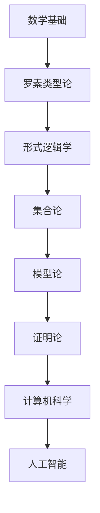

                 


## 文章标题

### 《罗素类型论在现代数学逻辑中的地位评估》

## 文章关键词

### 罗素类型论、现代数学逻辑、类型错误、集合论、模型论、证明论

## 文章摘要

本文深入探讨罗素类型论在现代数学逻辑中的地位与影响。首先，回顾罗素类型论的提出背景和核心概念，分析其在数学逻辑学中的应用和影响。接着，详细介绍罗素类型论的基本原理，包括类型的定义、类型错误与逻辑悖论，以及类型论的基本原则。然后，探讨罗素类型论与现代数学逻辑的关系，以及类型论在集合论、模型论和证明论中的应用。此外，文章还分析了罗素类型论在计算机科学中的应用，包括类型论在程序设计语言中的应用、形式化验证和自动推理。最后，对罗素类型论的地位和未来发展方向进行评估，总结其对数学逻辑学和计算机科学的贡献和局限性。通过本文的探讨，旨在为读者提供全面、深入的罗素类型论在现代数学逻辑中的理解和应用。

----------------------------------------------------------------

## 第1章 绪论

### 1.1 罗素类型论的提出背景

**罗素类型论的发展历程**

罗素类型论是由英国哲学家、数学家贝特兰·罗素（Bertrand Russell）于20世纪初提出的一种形式逻辑理论。罗素在研究数学逻辑的过程中，发现了诸如“集合论悖论”等逻辑问题，这些问题对传统的逻辑基础构成了挑战。为了解决这些悖论，罗素提出了类型论作为数学基础的一种新方法。

罗素类型论的发展历程可以分为以下几个阶段：

1. **早期发展**：罗素在1901年发表了一篇名为《数学原理》的论文，其中提出了类型论的一些基本思想。这篇论文是罗素类型论的开端，为后来的发展奠定了基础。

2. **成熟阶段**：在1910年，罗素与怀特海德合著的《数学原理》一书出版，这本书系统地阐述了类型论的基本原理和应用，成为了类型论的成熟标志。

3. **后续发展**：罗素类型论在提出后，受到了广泛的关注和讨论。许多数学家和逻辑学家对类型论进行了改进和扩展，使其在现代数学逻辑中继续发挥重要作用。

**罗素对逻辑原子主义的贡献**

逻辑原子主义是罗素哲学思想的一个重要组成部分。罗素认为，逻辑和数学的基础应该建立在个体（原子）的直接关系中，而不是抽象的概念或实体上。他主张通过分析语言中的基本单位，即原子命题，来构建逻辑和数学体系。

罗素对逻辑原子主义的贡献主要体现在以下几个方面：

1. **原子命题分析**：罗素通过分析语言中的基本命题，提出了一种新的逻辑分析方法。他认为，通过分析原子命题之间的关系，可以揭示逻辑结构的本质。

2. **逻辑悖论批判**：罗素在研究逻辑问题时，发现了一些逻辑悖论，如“罗素悖论”和“康托尔悖论”。他对这些悖论进行了深入分析，并提出了类型论作为解决方法。

3. **形式化逻辑**：罗素倡导将逻辑形式化，即将逻辑理论表述为严格的形式语言。这种形式化方法使得逻辑理论更加精确和严谨，为现代数学逻辑的发展奠定了基础。

**罗素类型论在早期数学逻辑学中的影响**

罗素类型论在早期数学逻辑学中产生了深远的影响。以下是一些具体的影响：

1. **解决逻辑悖论**：罗素类型论提出了一种新的逻辑方法，可以有效地解决集合论中的悖论问题。例如，通过引入类型的概念，罗素成功解决了罗素悖论。

2. **数学基础重建**：罗素类型论为数学基础提供了一种新的框架。它强调数学概念和逻辑形式之间的紧密关系，为数学的严密性和逻辑性提供了新的保障。

3. **形式逻辑发展**：罗素类型论的提出推动了形式逻辑的发展。形式逻辑作为数学逻辑的一个重要分支，通过类型论的方法，使得逻辑推理更加严谨和精确。

总之，罗素类型论在早期数学逻辑学中具有重要的地位，它不仅解决了逻辑悖论问题，还为数学基础提供了新的思考方向，对现代数学逻辑的发展产生了深远的影响。

### 1.2 罗素类型论的核心概念

**类型的定义**

在罗素类型论中，类型是用于区分不同种类对象的基本概念。类型可以理解为对象的一种分类方式，通过类型，可以将对象分为不同的类别，从而避免逻辑悖论的发生。

罗素对类型进行了详细的定义，他认为类型是对象的基本属性，是对象之间关系的抽象表达。具体来说，罗素将对象分为以下几种类型：

1. **个体类型**：个体类型是罗素类型论中最基本、最简单的类型。它表示具体的、独立的对象，如数字、个体命题等。

2. **函数类型**：函数类型表示对象之间的关系，即对象如何相互作用。罗素将函数类型分为两类：第一类函数类型表示个体与个体之间的关系，如加法、乘法等；第二类函数类型表示函数与函数之间的关系，如复合函数等。

3. **集合类型**：集合类型表示对象的集合，即一组对象的整体。罗素通过引入类型，将集合与个体分开，从而避免了集合论中的悖论问题。

**类型错误与逻辑悖论**

在罗素类型论中，类型错误是指对象被错误地归类到某个类型中。类型错误会导致逻辑悖论的发生，因为不同类型的对象之间不能直接进行比较或运算。

罗素类型论的核心目的是通过类型的概念来解决逻辑悖论。在罗素之前，集合论中的悖论问题已经成为数学逻辑学中的难题。例如，罗素悖论指出，如果一个集合包含所有不包含自身的集合，那么这个集合自身是否包含于这个集合中呢？这是一个典型的逻辑悖论。

罗素通过引入类型的概念，将集合与个体分开，从而解决了这些悖论。具体来说，罗素将集合分为个体类型的集合和函数类型的集合。个体类型的集合不包含自身，而函数类型的集合可以包含自身。这样，不同类型的集合之间不会发生逻辑悖论。

**类型论的基本原则**

罗素类型论包含一系列基本原则，这些原则确保了类型论的有效性和一致性。以下是一些重要的基本原则：

1. **类型判定规则**：类型判定规则用于确定对象的类型。具体来说，类型判定规则要求每个对象必须属于某个类型，且同一对象不能同时属于多个类型。

2. **类型转换规则**：类型转换规则用于在特定条件下，将一个类型的对象转换为另一个类型的对象。类型转换规则确保了不同类型对象之间的运算和比较的合法性。

3. **函数类型原则**：函数类型原则指出，函数类型的对象必须满足特定的条件，如第一类函数类型必须是两个个体类型之间的函数，第二类函数类型必须是两个函数类型之间的函数。

4. **集合类型原则**：集合类型原则指出，集合类型的对象必须满足特定的条件，如个体类型的集合不能包含自身，函数类型的集合可以包含自身。

通过这些基本原则，罗素类型论建立了一个严谨的逻辑体系，使得数学概念和逻辑形式之间保持一致性，从而避免了逻辑悖论的发生。

总之，罗素类型论的核心概念包括类型的定义、类型错误与逻辑悖论，以及类型论的基本原则。这些概念和原则构成了罗素类型论的基础，使得类型论在现代数学逻辑中发挥了重要作用。

### 1.3 罗素类型论与现代数学逻辑的关系

**罗素类型论对现代逻辑学的影响**

罗素类型论在现代逻辑学中产生了深远的影响。首先，罗素类型论为逻辑学提供了一种新的分析方法，通过类型的概念，可以更清晰地理解逻辑结构，从而避免了逻辑悖论的发生。其次，罗素类型论推动了形式逻辑的发展，使得逻辑推理更加严谨和精确。此外，罗素类型论还为逻辑学与其他学科，如数学、计算机科学等，提供了重要的理论基础。

具体来说，罗素类型论对现代逻辑学的影响主要体现在以下几个方面：

1. **逻辑基础重建**：罗素类型论提出了一种新的逻辑基础框架，通过类型的概念，将数学概念和逻辑形式紧密联系在一起。这种新的逻辑基础框架为数学的严密性和逻辑性提供了新的保障。

2. **形式逻辑发展**：罗素类型论的提出推动了形式逻辑的发展。形式逻辑通过严格的形式语言，使得逻辑推理更加严谨和精确。罗素类型论为形式逻辑提供了一种新的方法，使得形式逻辑能够更好地应对复杂的问题。

3. **逻辑悖论解决**：罗素类型论通过引入类型的概念，解决了一些传统的逻辑悖论，如罗素悖论和康托尔悖论。这些悖论对传统的逻辑基础构成了挑战，而罗素类型论的提出为解决这些问题提供了新的思路。

**罗素类型论在数学基础研究中的应用**

罗素类型论在数学基础研究中具有重要的应用价值。首先，罗素类型论为数学提供了新的逻辑基础框架，使得数学概念和逻辑形式之间保持一致性。其次，罗素类型论帮助解决了数学中的悖论问题，如集合论悖论。这些悖论对数学的严密性和逻辑性构成了挑战，而罗素类型论的提出为解决这些问题提供了有效的工具。

具体来说，罗素类型论在数学基础研究中的应用体现在以下几个方面：

1. **集合论发展**：罗素类型论为集合论的发展提供了新的理论基础。通过类型的概念，可以更清晰地定义集合的概念，从而避免了集合论中的悖论问题。罗素类型论在集合论中的应用，推动了集合论的发展。

2. **数学证明方法**：罗素类型论提供了一种新的数学证明方法，即通过类型的概念，将数学证明分为不同类型的证明。这种方法使得数学证明更加严谨和精确，有助于发现和解决数学中的问题。

3. **数学基础重建**：罗素类型论为数学基础提供了新的思考方向。通过类型的概念，可以重新审视数学中的基本概念和原理，从而构建一个更加严密和完整的数学基础体系。

**罗素类型论与形式逻辑学的联系**

罗素类型论与形式逻辑学有着紧密的联系。形式逻辑学是逻辑学的一个分支，主要研究逻辑推理的形式化和机械化。罗素类型论为形式逻辑学提供了一种新的方法，即通过类型的概念，来分析和解决逻辑问题。

具体来说，罗素类型论与形式逻辑学的联系体现在以下几个方面：

1. **形式化逻辑**：罗素类型论提出了一种形式化逻辑的方法，通过类型的概念，将逻辑推理形式化为严格的符号表达式。这种方法使得逻辑推理更加精确和严谨。

2. **逻辑系统设计**：罗素类型论为设计逻辑系统提供了重要的理论基础。通过类型的概念，可以构建不同类型的逻辑系统，如命题逻辑、谓词逻辑等。

3. **逻辑推理方法**：罗素类型论提供了一种新的逻辑推理方法，即通过类型的转换和判定，来分析和解决逻辑问题。这种方法使得逻辑推理更加灵活和多样化。

总之，罗素类型论在现代数学逻辑中具有重要的地位。它不仅为逻辑学提供了新的分析方法，还推动了数学基础的发展和形式逻辑学的进步。通过类型的概念，罗素类型论成功地解决了逻辑悖论问题，为数学逻辑的发展奠定了坚实的基础。

### 第2章 罗素类型论的数学逻辑基础

#### 2.1 基本的数学逻辑概念

**命题与命题变元**

在数学逻辑中，命题是一个可以判断真假的陈述句。命题分为真命题和假命题，其中真命题表示其内容在逻辑上成立，而假命题表示其内容在逻辑上不成立。例如，"2+2=4" 是一个真命题，而 "2+2=5" 是一个假命题。

命题变元是命题逻辑中的一个基本概念，它表示一个可以替代具体命题的变量。命题变元可以表示为 p、q、r 等，通过使用命题变元，可以将具体的命题抽象化为逻辑表达式。

**谓词与谓词变元**

谓词是数学逻辑中用于描述对象属性或关系的语句。谓词分为个体谓词和关系谓词。个体谓词描述个体对象的属性，如 "x 是一个整数"；关系谓词描述对象之间的关系，如 "x 大于 y"。

谓词变元是谓词逻辑中的一个基本概念，它表示一个可以替代具体谓词的变量。谓词变元可以表示为 f、g、h 等，通过使用谓词变元，可以将具体的谓词抽象化为逻辑表达式。

**量词与量词逻辑**

量词是数学逻辑中用于描述对象全体或部分的词语。量词分为存在量词和全称量词。存在量词表示存在至少一个对象满足特定条件，如 "存在一个整数 x，使得 x^2 = 2"；全称量词表示对所有对象都满足特定条件，如 "对所有整数 x，x^2 ≥ 0"。

量词逻辑是数学逻辑的一个重要部分，通过量词的使用，可以表达复杂的逻辑关系。量词逻辑包括存在量词和全称量词的合取、析取、否定等基本运算。

**逻辑运算**

逻辑运算是对命题、谓词和量词进行组合和变换的基本运算。常见的逻辑运算包括合取（∧）、析取（∨）、否定（¬）、蕴含（→）等。这些逻辑运算使得复杂的逻辑表达式可以简化，从而便于分析和推理。

例如，命题 "p ∧ q" 表示 p 和 q 都为真，"p ∨ q" 表示 p 或 q 为真，"¬p" 表示 p 为假，"p → q" 表示如果 p 为真，则 q 也为真。

#### 2.2 罗素类型论的基本原理

**类型判定的规则**

类型判定的规则是罗素类型论的核心，它用于确定对象是否属于某个特定类型。类型判定的规则主要包括以下几种：

1. **个体类型判定规则**：个体类型表示具体的、独立的对象。个体类型判定规则要求对象必须满足特定条件，如 "x 是一个整数"。

2. **函数类型判定规则**：函数类型表示对象之间的关系。函数类型判定规则要求对象必须满足特定条件，如 "f(x, y) 是一个加法运算"。

3. **集合类型判定规则**：集合类型表示对象的集合。集合类型判定规则要求对象必须满足特定条件，如 "A 是一个不包含自身的集合"。

**类型之间的转换**

类型之间的转换是罗素类型论中的重要概念，它用于在特定条件下，将一个类型的对象转换为另一个类型的对象。类型之间的转换主要包括以下几种：

1. **个体类型与函数类型之间的转换**：个体类型可以转换为函数类型，反之亦然。例如，"x 是一个整数" 可以转换为 "f(x) 是一个加法运算"。

2. **函数类型与集合类型之间的转换**：函数类型可以转换为集合类型，反之亦然。例如，"f(x, y) 是一个加法运算" 可以转换为 "A 是一个包含所有加法运算的集合"。

**类型论中的函数与关系**

在罗素类型论中，函数和关系是核心概念。函数表示对象之间的操作，关系表示对象之间的关联。

1. **函数**：函数是一种特殊的对象，它将一个或多个输入值映射到一个输出值。在罗素类型论中，函数分为个体函数和集合函数。个体函数表示一个具体的操作，如加法运算；集合函数表示一组操作的整体，如所有加法运算的集合。

2. **关系**：关系表示对象之间的关联。在罗素类型论中，关系分为个体关系和集合关系。个体关系表示一个具体的关联，如 "x 大于 y"；集合关系表示一组关联的整体，如 "A 是一个包含所有大于关系的集合"。

通过这些基本原理，罗素类型论建立了一个严谨的数学逻辑体系，使得数学概念和逻辑形式之间保持一致性，从而避免了逻辑悖论的发生。

#### 2.3 罗素类型论中的悖论与解决方法

**罗素悖论的产生**

罗素悖论是由英国哲学家、数学家贝特兰·罗素于1901年提出的一个著名的逻辑悖论。罗素悖论涉及集合的定义和集合与个体之间的关系。

罗素悖论的基本形式是：设 R 为所有不包含自身的集合的集合，即 R = {X | X ≠ X}。如果 R 包含自身，即 R ∈ R，则根据定义，R 不应包含自身，因为 R ∈ R 表示 R 不等于自身；反之，如果 R 不包含自身，即 R ∉ R，则根据定义，R 应当包含自身，因为 R ∉ R 表示 R 等于自身。这个悖论表明，R 的定义无论在何种情况下都无法自洽，从而导致了逻辑上的矛盾。

**类型论对罗素悖论的解决**

罗素类型论通过引入类型的概念，成功地解决了罗素悖论。类型论的基本思想是将对象分为不同的类型，从而避免类型的混淆和悖论的发生。

1. **类型的定义**：在类型论中，类型是对象的基本属性，用于区分不同种类的对象。类型论将对象分为个体类型、函数类型和集合类型。个体类型表示具体的对象，如数字和个体命题；函数类型表示对象之间的关系，如加法和乘法；集合类型表示对象的集合，如自然数集合和实数集合。

2. **类型的判定规则**：类型论中有一系列类型的判定规则，用于确定对象的类型。例如，个体类型的判定规则要求对象必须满足特定条件，如 "x 是一个整数"；函数类型的判定规则要求对象必须满足特定条件，如 "f(x, y) 是一个加法运算"；集合类型的判定规则要求对象必须满足特定条件，如 "A 是一个不包含自身的集合"。

3. **类型的转换规则**：类型论中有一系列类型的转换规则，用于在特定条件下，将一个类型的对象转换为另一个类型的对象。例如，个体类型可以转换为函数类型，反之亦然；函数类型可以转换为集合类型，反之亦然。

通过这些类型的判定和转换规则，罗素类型论成功地避免了类型混淆和悖论的发生。在类型论中，R 的定义被明确地限定在集合类型中，而不会涉及到个体类型或函数类型。这样，R 的定义就不会导致逻辑上的矛盾。

**类型论在其他悖论解决中的应用**

除了罗素悖论，罗素类型论还在解决其他逻辑悖论中发挥了重要作用。

1. **康托尔悖论**：康托尔悖论是另一个著名的逻辑悖论，它涉及集合的无限性。康托尔悖论表明，无限集合的集合无法构成一个完整的集合。类型论通过引入类型的概念，将无限集合的集合划分为不同的类型，从而避免了康托尔悖论的发生。

2. **伯恩斯坦悖论**：伯恩斯坦悖论是关于逻辑推理的悖论，它表明在某些情况下，逻辑推理可能导致矛盾。类型论通过区分不同类型的推理，避免了伯恩斯坦悖论的发生。

总之，罗素类型论通过引入类型的概念，提供了一套有效的逻辑框架，用于解决各种逻辑悖论。类型论的成功解决了罗素悖论和其他逻辑悖论，为现代数学逻辑的发展奠定了坚实的基础。

### 第3章 罗素类型论在现代数学逻辑中的应用

#### 3.1 类型论在集合论中的应用

**类型论与集合论的基本概念**

在集合论中，集合是基本的抽象概念，用于表示一组对象的整体。集合论中的集合可以分为不同的类型，如个体集合、函数集合和集合集合。个体集合表示具体的对象集合，如自然数集合；函数集合表示对象之间的关系集合，如加法运算集合；集合集合表示集合的集合，如所有集合的集合。

在罗素类型论中，类型是区分不同种类对象的基本概念。类型论将对象分为个体类型、函数类型和集合类型。个体类型表示具体的对象，如数字和个体命题；函数类型表示对象之间的关系，如加法和乘法；集合类型表示对象的集合，如自然数集合和实数集合。

**类型论在集合论中的扩展**

罗素类型论通过引入类型的概念，对集合论进行了扩展，从而避免了集合论中的悖论问题。具体来说，类型论在集合论中的扩展体现在以下几个方面：

1. **个体集合与函数集合的分离**：在集合论中，个体集合和函数集合之间存在交叉关系，这导致了诸如罗素悖论等悖论问题。在类型论中，个体集合和函数集合被明确地分离，个体集合只包含个体类型对象，函数集合只包含函数类型对象。这样，个体集合和函数集合之间不会发生交叉关系，从而避免了悖论的发生。

2. **集合集合的层次结构**：在集合论中，集合集合构成了一个无限层次结构，这导致了康托尔悖论等悖论问题。在类型论中，集合集合被分为不同的类型层次，每个层次只包含特定类型的集合。这样，集合集合的层次结构更加清晰，避免了无限层次结构导致的悖论问题。

3. **类型限制的集合构造**：在集合论中，集合的构造过程不受类型限制，这可能导致类型的混淆和悖论问题。在类型论中，集合的构造过程受到类型限制，每个集合只能包含特定类型的对象。这样，集合的构造过程更加严格，避免了类型混淆和悖论问题。

**类型论在集合论证明中的应用**

罗素类型论在集合论证明中具有重要的应用价值。通过类型论的方法，可以更清晰地表达集合论中的概念和证明过程，从而提高证明的严谨性和有效性。

1. **集合的存在性证明**：在集合论中，存在性证明是证明一个集合存在的证明方法。通过类型论的方法，可以更清晰地表达集合的存在性证明。例如，在证明自然数集合的存在性时，可以首先定义自然数类型，然后构造一个满足自然数类型的集合。

2. **集合的归纳证明**：在集合论中，归纳证明是证明集合性质的一种方法。通过类型论的方法，可以更清晰地表达集合的归纳证明。例如，在证明自然数集合的归纳性质时，可以首先定义自然数类型，然后使用归纳法证明自然数集合的性质。

3. **集合的构造性证明**：在集合论中，构造性证明是证明一个集合存在的方法。通过类型论的方法，可以更清晰地表达集合的构造性证明。例如，在证明实数集合的存在性时，可以首先定义实数类型，然后构造一个满足实数类型的集合。

总之，罗素类型论在集合论中的应用，通过引入类型的概念，扩展了集合论的基本概念，提高了集合论证明的严谨性和有效性。类型论为集合论提供了一种新的分析方法和证明工具，对于现代数学逻辑的发展具有重要意义。

#### 3.2 类型论在模型论中的应用

**类型论与模型论的基本概念**

模型论是数学逻辑的一个分支，主要研究逻辑理论在数学结构上的实现。在模型论中，模型是一个数学结构，它满足某个逻辑理论的全部语句。模型论关注的是逻辑理论在不同数学结构上的应用和验证。

在类型论中，类型是区分不同种类对象的基本概念。类型论通过引入类型的概念，将对象分为个体类型、函数类型和集合类型。个体类型表示具体的对象，如数字和个体命题；函数类型表示对象之间的关系，如加法和乘法；集合类型表示对象的集合，如自然数集合和实数集合。

**类型论在模型论中的扩展**

罗素类型论通过引入类型的概念，对模型论进行了扩展，从而提高了模型论的严谨性和有效性。具体来说，类型论在模型论中的扩展体现在以下几个方面：

1. **类型的层次结构**：在模型论中，模型的结构层次较为复杂，不同层次的结构之间存在关联。在类型论中，通过引入类型的层次结构，可以更清晰地表达模型之间的关联和层次关系。例如，个体类型可以表示底层的基本对象，集合类型可以表示更高层次的对象集合。

2. **类型的判定规则**：在模型论中，模型的验证和验证规则较为复杂。在类型论中，通过引入类型的判定规则，可以更清晰地表达模型的验证过程。例如，可以定义个体类型的判定规则，以确定一个对象是否属于个体类型。

3. **类型的转换规则**：在模型论中，不同类型的对象之间需要相互转换，以便进行验证和证明。在类型论中，通过引入类型的转换规则，可以更清晰地表达对象之间的转换过程。例如，可以定义个体类型与函数类型之间的转换规则，以实现对象之间的转换。

**类型论在模型论证明中的应用**

罗素类型论在模型论证明中具有重要的应用价值。通过类型论的方法，可以更清晰地表达模型论中的概念和证明过程，从而提高证明的严谨性和有效性。

1. **模型的验证证明**：在模型论中，模型的验证是证明模型满足某个逻辑理论的过程。通过类型论的方法，可以更清晰地表达模型的验证证明。例如，在证明一个数学结构满足某个逻辑理论时，可以首先定义相关的类型，然后验证数学结构是否满足这些类型。

2. **模型转换证明**：在模型论中，模型之间的转换是常见的证明方法。通过类型论的方法，可以更清晰地表达模型转换证明。例如，在证明一个模型可以通过特定转换规则转换为另一个模型时，可以首先定义相关的类型和转换规则，然后验证模型之间的转换是否满足这些类型和规则。

3. **模型性质证明**：在模型论中，模型的性质证明是证明模型具有某些特定性质的过程。通过类型论的方法，可以更清晰地表达模型性质证明。例如，在证明一个数学结构具有某个特定性质时，可以首先定义相关的类型和性质，然后证明数学结构满足这些类型和性质。

总之，罗素类型论在模型论中的应用，通过引入类型的概念，扩展了模型论的基本概念，提高了模型论证明的严谨性和有效性。类型论为模型论提供了一种新的分析方法和证明工具，对于现代数学逻辑的发展具有重要意义。

#### 3.3 类型论在证明论中的应用

**类型论与证明论的基本概念**

证明论是数学逻辑的一个分支，主要研究证明的方法和性质。证明论关注的是证明的构造、验证和证明系统的有效性。在证明论中，证明是逻辑推理的过程，用于证明一个命题的真假。

类型论是罗素提出的一种形式逻辑理论，通过引入类型的概念，将对象分为不同的类型，从而避免逻辑悖论的发生。类型论的基本原理是类型判定规则、类型转换规则和类型的层次结构。

**类型论在证明论中的扩展**

罗素类型论通过引入类型的概念，对证明论进行了扩展，从而提高了证明的严谨性和有效性。具体来说，类型论在证明论中的扩展体现在以下几个方面：

1. **类型的层次结构**：类型论通过引入类型的层次结构，使得证明过程中的对象更加清晰。每个类型都有其特定的属性和限制，这有助于避免类型混淆和逻辑悖论。

2. **类型的判定规则**：类型论中有一系列的类型判定规则，用于确定对象是否属于某个特定类型。这些判定规则使得证明过程中的对象类型更加明确，从而提高了证明的准确性。

3. **类型的转换规则**：类型论中有一系列的类型转换规则，用于在特定条件下，将一个类型的对象转换为另一个类型的对象。这些转换规则使得证明过程中的对象可以在不同类型之间进行转换，从而提高了证明的灵活性。

**类型论在证明论证明中的应用**

罗素类型论在证明论证明中具有重要的应用价值。通过类型论的方法，可以更清晰地表达证明论中的概念和证明过程，从而提高证明的严谨性和有效性。

1. **证明的构造性证明**：在证明论中，构造性证明是一种重要的证明方法，通过构造一个具体的对象来证明某个命题的真假。类型论通过引入类型的概念，使得构造性证明更加直观和严谨。例如，在证明某个命题时，可以首先定义相关的类型，然后构造满足这些类型的对象。

2. **证明的归纳证明**：在证明论中，归纳证明是一种常用的证明方法，用于证明一个命题对所有对象都成立。类型论通过引入类型的层次结构，使得归纳证明更加清晰和简洁。例如，在证明某个性质对所有自然数都成立时，可以首先定义自然数类型，然后使用归纳法证明该性质。

3. **证明的转移证明**：在证明论中，转移证明是一种将一个证明从一个系统转移到另一个系统的证明方法。类型论通过引入类型的转换规则，使得转移证明更加直观和有效。例如，在证明某个命题在某个逻辑系统中成立时，可以首先定义相关的类型，然后通过类型转换规则，将该证明转移到另一个逻辑系统中。

总之，罗素类型论在证明论中的应用，通过引入类型的概念，扩展了证明论的基本概念，提高了证明的严谨性和有效性。类型论为证明论提供了一种新的分析方法和证明工具，对于现代数学逻辑的发展具有重要意义。

### 第4章 罗素类型论在计算机科学中的应用

#### 4.1 类型论在程序设计语言中的应用

**类型论在编译原理中的应用**

类型论在编译原理中扮演着关键角色，特别是在静态类型语言的设计和实现中。静态类型语言在编译时对变量的类型进行检查，从而确保程序的正确性和可靠性。

1. **类型检查**：类型论提供了一种机制，用于在编译时检查代码中的类型错误。通过类型系统，编译器可以确保变量在使用前已经被正确声明和初始化。这种检查机制有助于发现潜在的运行时错误。

2. **类型推断**：类型论还支持类型推断，使得程序员不必显式地声明变量类型。编译器可以根据表达式的内容和上下文自动推断变量的类型。这提高了代码的可读性和可维护性。

3. **类型安全**：类型论通过确保不同类型的变量不能进行非法操作，从而提高了程序的安全性。例如，在静态类型语言中，将一个整数与一个字符串相加会导致类型错误，因为这两个类型不可兼容。

**类型论在编程语言规范中的应用**

类型论在编程语言规范中定义了类型系统的规则和属性，为语言的实现提供了明确的指导。以下是一些关键方面：

1. **类型定义**：类型论定义了各种基本类型，如整数、浮点数、布尔值等。此外，还定义了复合类型，如数组、结构体、类等。

2. **类型转换**：类型论规定了不同类型之间的转换规则，包括隐式转换和显式转换。这些规则确保类型转换在语义上是一致的，从而避免数据丢失或错误的操作。

3. **类型兼容性**：类型论定义了类型之间的兼容性规则，用于确定哪些类型的操作是合法的。例如，在C++中，指针和引用之间的操作是兼容的，因为它们都表示对象的引用。

**类型论在程序验证中的应用**

类型论在程序验证中发挥了重要作用，通过形式化验证方法确保程序的正确性和可靠性。以下是一些关键方面：

1. **证明助手**：类型论提供了一种形式化的方法，用于验证程序的正确性。编译器可以使用类型系统来验证程序是否满足预定的属性，例如内存安全性、数据竞争等。

2. **抽象状态机**：类型论可以用于构建程序的抽象状态机模型，这是一个形式化的程序行为描述。通过分析抽象状态机，可以验证程序是否满足特定的逻辑属性。

3. **模型检查**：类型论与模型检查技术相结合，可以用于验证程序是否满足特定的安全属性。模型检查器通过遍历程序的所有可能执行路径，检查是否违反了指定的安全规则。

#### 4.2 类型论在形式化验证中的应用

**类型论与形式化验证的基本概念**

形式化验证是一种使用数学方法来证明程序正确性的技术。在形式化验证中，程序的行为被形式化地描述为数学模型，然后使用定理证明器或模型检查器来验证程序是否满足特定的属性。

类型论在形式化验证中的应用主要体现在以下几个方面：

1. **类型系统**：类型系统是形式化验证的核心，用于确保程序在运行时不会发生类型错误。通过定义严格的类型规则，可以确保程序在所有可能的输入上都能正确执行。

2. **类型推理**：类型推理是形式化验证中的一个关键步骤，它自动推导出变量和表达式的类型。类型推理算法可以根据表达式的内容和上下文，确定变量和表达式的类型。

3. **类型安全**：类型安全是形式化验证的一个重要目标，它确保程序在运行时不会发生类型相关的错误。类型安全可以通过静态类型检查实现，也可以通过动态类型检查实现。

**类型论在形式化验证中的扩展**

类型论在形式化验证中得到了扩展，用于处理更复杂的程序和更广泛的应用场景。以下是一些关键方面：

1. **函数类型**：类型论可以定义函数类型，用于表示函数的输入和输出类型。通过函数类型，可以确保函数的正确性和类型兼容性。

2. **存在类型**：存在类型是类型论中的一个高级概念，用于表示不可达的值或变量。存在类型可以用于表示程序的边界条件和异常处理。

3. **类型检查器**：类型论可以用于实现类型检查器，这是一种自动验证程序类型的工具。类型检查器可以分析程序代码，检查是否存在类型错误，并提供错误信息。

**类型论在形式化验证证明中的应用**

类型论在形式化验证证明中发挥着重要作用，通过提供严格的方法来证明程序的正确性。以下是一些关键方面：

1. **抽象规格说明**：类型论可以用于定义程序的抽象规格说明，这描述了程序应该满足的行为和属性。通过类型系统，可以确保程序实现与规格说明一致。

2. **定理证明**：类型论可以与定理证明器结合使用，用于证明程序的正确性。定理证明器可以自动推导出程序满足的数学定理，从而证明程序的正确性。

3. **模型检查**：类型论可以用于模型检查，这是一种自动验证程序属性的方法。模型检查器可以遍历程序的所有执行路径，检查是否存在违反属性的情况。

总之，类型论在计算机科学中的应用，特别是在形式化验证中，为程序员提供了一种严格的方法来确保程序的正确性和可靠性。类型论不仅提高了程序的质量，还促进了计算机科学领域的研究和进步。

#### 4.3 类型论在自动推理中的应用

**类型论与自动推理的基本概念**

自动推理是人工智能和计算机科学中的一个重要领域，它旨在通过计算机程序自动推导出数学证明或逻辑推理的结果。类型论在自动推理中扮演着关键角色，因为它为自动推理提供了形式化的类型系统，用于确保推理过程的正确性和可靠性。

1. **类型系统**：类型系统是自动推理的核心，它定义了不同数据类型的操作规则和约束。通过类型系统，可以确保表达式在特定上下文中具有正确的类型，从而避免类型错误。

2. **类型检查**：类型检查是自动推理中的一个关键步骤，用于在程序执行前检查代码的类型。类型检查器可以自动分析程序，确保它遵循类型规则，从而避免潜在的运行时错误。

3. **类型推理**：类型推理是自动推理中的一个重要机制，它自动推导出表达式和变量的类型。类型推理算法可以根据表达式的内容和上下文，推断出最合适的类型。

**类型论在自动推理中的扩展**

类型论在自动推理中得到了扩展，用于处理更复杂的推理任务和更广泛的应用场景。以下是一些关键方面：

1. **多参数类型系统**：多参数类型系统是类型论中的一个高级概念，它允许定义具有多个参数的类型。通过多参数类型系统，可以更灵活地表示复杂数据结构和函数。

2. **存在类型**：存在类型是类型论中的一个重要概念，它用于表示不可达的值或变量。存在类型可以用于表示程序的边界条件和异常处理。

3. **依赖类型**：依赖类型是类型论中的一个高级概念，它用于表示变量之间的依赖关系。通过依赖类型，可以确保在特定上下文中变量的使用是合法的。

**类型论在自动推理证明中的应用**

类型论在自动推理证明中发挥着重要作用，通过提供严格的方法来证明程序的正确性和可靠性。以下是一些关键方面：

1. **证明搜索**：类型论可以用于指导证明搜索过程，通过定义类型规则和约束，自动推理器可以更有效地找到证明。

2. **定理证明**：类型论可以与定理证明器结合使用，用于证明程序的正确性。定理证明器可以自动推导出程序满足的数学定理，从而证明程序的正确性。

3. **模型检查**：类型论可以用于模型检查，这是一种自动验证程序属性的方法。模型检查器可以遍历程序的所有执行路径，检查是否存在违反属性的情况。

通过类型论，自动推理不仅能够解决简单的推理问题，还能够处理复杂的数学证明和逻辑推理任务，从而在数学、计算机科学和人工智能等领域发挥重要作用。

### 第5章 罗素类型论的批评与争论

#### 5.1 对罗素类型论的批评

**批评的主要观点**

罗素类型论虽然取得了显著的成就，但也在学术界引发了广泛的批评和讨论。以下是对罗素类型论批评的主要观点：

1. **过于复杂**：批评者认为罗素类型论过于复杂，难以理解和应用。类型论引入了大量的类型判定规则、类型转换规则和类型层次结构，使得理论体系变得冗长和繁琐。

2. **不充分的类型划分**：批评者指出，罗素类型论在类型划分上存在不足。例如，罗素类型论无法有效地处理复合类型，如列表、映射等，这限制了类型论的应用范围。

3. **无法解决所有悖论**：尽管罗素类型论成功地解决了许多逻辑悖论，但批评者认为它无法解决所有悖论。例如，类型论在处理某些特殊的悖论，如自我指涉悖论时，仍然存在局限性。

**批评对罗素类型论的挑战**

这些批评对罗素类型论提出了严峻的挑战，主要体现在以下几个方面：

1. **简化与精度之间的权衡**：类型论为了解决悖论，引入了复杂的类型规则，这在一定程度上牺牲了理论的简洁性和直观性。批评者认为，类型论应该在不失精度的前提下，寻求更简明的解决方案。

2. **类型划分的灵活性**：批评者认为，类型论在类型划分上应该更加灵活，以适应不同应用场景的需求。现有的类型划分方法可能过于僵化，无法有效处理复杂的现实世界问题。

3. **扩展性和兼容性**：类型论需要具备良好的扩展性和兼容性，以便在新的应用领域中发挥作用。现有的类型论框架可能难以适应不断变化的技术需求。

**批评对现代数学逻辑的影响**

尽管批评对罗素类型论提出了挑战，但它们也对现代数学逻辑的发展产生了积极的影响：

1. **理论的完善**：批评促使类型论研究者不断探索和完善理论体系，以提高理论的简洁性和实用性。这推动了类型论的理论创新和进步。

2. **类型系统的多样化**：批评促使研究者开发出多样化的类型系统，如依赖类型、存在类型等，以满足不同领域的需求。这些新型类型系统为现代数学逻辑提供了更丰富的工具。

3. **跨学科的融合**：批评促进了类型论与其他学科的融合，如计算机科学、人工智能等。类型论在这些领域的应用，推动了跨学科的发展和创新。

总之，对罗素类型论的批评虽然提出了挑战，但它们也推动了理论的完善和进步，为现代数学逻辑的发展注入了新的活力。

#### 5.2 罗素类型论的辩护

**辩护的主要观点**

罗素类型论在数学逻辑学中具有独特的地位和重要性，以下是对罗素类型论的辩护观点：

1. **解决逻辑悖论**：罗素类型论通过引入类型的概念，成功解决了集合论中的悖论问题。这些悖论对传统的逻辑基础构成了挑战，而类型论提供了有效的解决方案。

2. **数学基础的重建**：罗素类型论为数学基础提供了新的框架，使得数学概念和逻辑形式之间保持一致性。类型论有助于构建一个更加严密和完整的数学基础体系。

3. **形式逻辑的发展**：罗素类型论推动了形式逻辑的发展，使得逻辑推理更加严谨和精确。类型论为形式逻辑提供了一种新的分析方法，使得逻辑推理能够更好地应对复杂的问题。

**辩护对罗素类型论的加强**

辩护观点不仅肯定了罗素类型论的贡献，还通过以下几个方面加强了类型论的合理性：

1. **简化类型的判定规则**：研究者通过改进类型论，简化了类型的判定规则。这使类型论更加直观和易于理解，从而提高了理论的可操作性。

2. **扩展类型系统的应用**：研究者开发了扩展的类型系统，如依赖类型、存在类型等，以适应不同领域的需求。这些扩展类型系统为类型论的应用提供了更广泛的范围。

3. **类型论与其他学科的融合**：研究者积极探讨类型论在计算机科学、人工智能等领域的应用，推动了类型论与其他学科的融合。这进一步证明了类型论的广泛适用性和重要性。

**辩护对现代数学逻辑的推动**

辩护观点对现代数学逻辑的发展起到了积极的推动作用：

1. **理论的完善**：辩护观点促使研究者不断探索和完善类型论，以提高理论的严谨性和实用性。这推动了类型论的理论创新和进步。

2. **多样化类型系统的开发**：辩护观点鼓励研究者开发多样化的类型系统，以满足不同领域的需求。这些新型类型系统为现代数学逻辑提供了更丰富的工具。

3. **跨学科的融合**：辩护观点促进了类型论与其他学科的融合，如计算机科学、人工智能等。类型论在这些领域的应用，推动了跨学科的发展和创新。

总之，罗素类型论的辩护观点不仅肯定了其贡献，还通过理论简化、扩展和应用，加强了类型论的地位和影响力，为现代数学逻辑的发展注入了新的活力。

### 第6章 罗素类型论的现状与未来

#### 6.1 罗素类型论在数学逻辑学中的地位

**罗素类型论在数学逻辑学中的影响**

罗素类型论在数学逻辑学中具有重要的地位和广泛的影响。首先，罗素类型论为数学基础提供了新的框架，通过引入类型的概念，解决了集合论中的悖论问题。这为数学的严密性和逻辑性提供了新的保障。其次，罗素类型论推动了形式逻辑的发展，使得逻辑推理更加严谨和精确。类型论的方法为逻辑学家提供了新的分析工具，使得逻辑理论能够更好地应对复杂的问题。此外，罗素类型论在数学证明方法和证明理论的研究中也发挥了重要作用，促进了数学逻辑学的进步。

**罗素类型论在数学逻辑学中的发展**

罗素类型论自提出以来，一直在不断发展。研究者们通过改进和扩展类型论，使其在更广泛的领域中发挥作用。以下是一些关键的发展趋势：

1. **类型的层次结构**：研究者们探讨了类型的层次结构，以更好地处理复杂对象。通过引入多层类型的概念，可以更清晰地表达对象之间的层次关系，从而提高理论的可操作性和直观性。

2. **类型的兼容性**：为了适应不同领域的需求，研究者们开发了兼容性更强的类型系统。这些类型系统能够更好地处理不同类型之间的转换和兼容性，从而提高了类型论的应用范围。

3. **类型推理的优化**：类型推理是类型论中的一个关键问题，研究者们致力于优化类型推理算法，以提高推理的效率和准确性。通过改进类型推理算法，可以更快速地分析程序代码，从而提高程序验证的效率。

#### 6.2 罗素类型论在计算机科学中的应用前景

**罗素类型论在计算机科学中的应用现状**

罗素类型论在计算机科学中的应用已经取得了显著的成果。在编程语言设计中，静态类型语言广泛采用类型论的方法，如C++、Java、Haskell等。这些语言通过类型系统，确保程序的正确性和可靠性。在编译原理中，类型论的方法用于类型检查、类型推断和程序优化。此外，类型论还在形式化验证、模型检查和自动推理等领域发挥了重要作用。

**罗素类型论在计算机科学中的应用前景**

随着计算机科学的发展，罗素类型论在未来的应用前景非常广阔：

1. **多参数类型系统**：多参数类型系统是类型论中的一个重要研究方向，它允许定义具有多个参数的类型，以处理更复杂的程序。未来，多参数类型系统有望在复杂系统的设计和验证中得到广泛应用。

2. **存在类型和依赖类型**：存在类型和依赖类型是类型论中的高级概念，它们在处理边界条件和异常处理方面具有显著优势。未来，这些类型系统有望在实时系统和嵌入式系统等领域得到广泛应用。

3. **类型化逻辑编程**：类型化逻辑编程是一种结合类型论和逻辑编程的方法，它通过类型系统，确保逻辑程序的正确性和可靠性。未来，类型化逻辑编程有望在自然语言处理、知识图谱等领域发挥重要作用。

4. **类型安全性和验证**：类型论在确保程序安全性和验证方面具有重要作用。未来，随着硬件和软件系统的复杂性不断增加，类型论的应用前景将更加广阔。

总之，罗素类型论在数学逻辑学和计算机科学中具有广阔的应用前景。通过不断改进和扩展类型论，可以进一步提升其在各领域的应用效果，推动计算机科学的发展。

#### 6.3 罗素类型论的未来发展方向

**罗素类型论在数学逻辑学的发展方向**

罗素类型论在数学逻辑学中具有广阔的发展前景，未来可能的发展方向包括：

1. **类型的层次结构**：研究者将继续探索类型的层次结构，以更好地处理复杂对象。通过引入多层类型的概念，可以更清晰地表达对象之间的层次关系，从而提高理论的可操作性和直观性。

2. **类型推理的优化**：类型推理是类型论中的一个关键问题，研究者们将致力于优化类型推理算法，以提高推理的效率和准确性。通过改进类型推理算法，可以更快速地分析程序代码，从而提高程序验证的效率。

3. **类型兼容性与扩展**：为了适应不同领域的需求，研究者们将开发兼容性更强的类型系统。这些类型系统能够更好地处理不同类型之间的转换和兼容性，从而提高类型论的应用范围。

4. **类型化的逻辑证明**：类型化的逻辑证明是一个新兴的研究方向，研究者们将探索如何在类型论的基础上，构建形式化的逻辑证明系统。这有助于提高逻辑证明的严谨性和可靠性。

**罗素类型论在计算机科学的发展方向**

罗素类型论在计算机科学中的应用前景非常广阔，未来可能的发展方向包括：

1. **多参数类型系统**：多参数类型系统是类型论中的一个重要研究方向，它允许定义具有多个参数的类型，以处理更复杂的程序。未来，多参数类型系统有望在复杂系统的设计和验证中得到广泛应用。

2. **存在类型和依赖类型**：存在类型和依赖类型是类型论中的高级概念，它们在处理边界条件和异常处理方面具有显著优势。未来，这些类型系统有望在实时系统和嵌入式系统等领域得到广泛应用。

3. **类型化逻辑编程**：类型化逻辑编程是一种结合类型论和逻辑编程的方法，它通过类型系统，确保逻辑程序的正确性和可靠性。未来，类型化逻辑编程有望在自然语言处理、知识图谱等领域发挥重要作用。

4. **类型安全性与验证**：类型论在确保程序安全性和验证方面具有重要作用。未来，随着硬件和软件系统的复杂性不断增加，类型论的应用前景将更加广阔。研究者们将开发更先进的类型安全性和验证方法，以应对复杂系统的挑战。

**罗素类型论在交叉学科中的发展方向**

罗素类型论在交叉学科中的应用具有巨大的潜力，未来可能的发展方向包括：

1. **生物信息学**：类型论可以用于生物信息学中的数据分析和模型构建。通过类型系统，可以更清晰地表达生物数据之间的关系和属性，从而提高数据分析的准确性和效率。

2. **数据科学**：类型论在数据科学中的应用，可以用于数据质量和数据清洗。通过类型系统，可以自动识别和纠正数据中的错误和异常，从而提高数据分析的可靠性。

3. **人工智能**：类型论在人工智能中的应用，可以用于确保机器学习模型的可靠性和可解释性。通过类型系统，可以更好地理解模型内部的逻辑关系，从而提高模型的透明度和可控性。

总之，罗素类型论在数学逻辑学、计算机科学和交叉学科中具有广阔的发展前景。通过不断改进和扩展类型论，可以进一步提升其在各领域的应用效果，推动科学技术的进步。

### 第7章 结论

#### 7.1 罗素类型论的整体评估

**罗素类型论的贡献**

罗素类型论在数学逻辑学和计算机科学领域做出了重大贡献。首先，它成功地解决了集合论中的悖论问题，为数学基础提供了新的框架。其次，罗素类型论推动了形式逻辑的发展，使得逻辑推理更加严谨和精确。此外，类型论在编程语言设计、编译原理、形式化验证、模型检查和自动推理等领域都发挥了重要作用，为计算机科学的发展提供了有力的支持。

**罗素类型论的局限性**

尽管罗素类型论取得了显著成就，但也存在一定的局限性。首先，类型论体系相对复杂，难以理解和应用。其次，类型论在处理某些特殊悖论时存在局限性，如自我指涉悖论。此外，类型论在类型划分上可能过于僵化，难以适应复杂的应用场景。

**罗素类型论的持续影响力**

罗素类型论对数学逻辑学和计算机科学产生了深远的影响。它在数学基础研究和形式逻辑发展方面具有重要作用，为数学的严密性和逻辑性提供了新的保障。在计算机科学领域，类型论推动了编程语言设计、编译原理和形式化验证等技术的发展。此外，类型论在人工智能、生物信息学等交叉学科中的应用也日益广泛，展现了其持续的影响力。

#### 7.2 罗素类型论的未来展望

**未来研究的重点方向**

未来的研究重点将包括以下几个方面：

1. **简化类型论体系**：研究者将继续致力于简化类型论体系，提高其可操作性和直观性，使其更易于理解和应用。

2. **扩展类型系统**：研究者将开发更丰富的类型系统，如存在类型、依赖类型等，以适应不同领域和应用场景的需求。

3. **类型推理优化**：研究者将致力于优化类型推理算法，提高推理效率和准确性，从而提高程序验证的效率。

**罗素类型论在数学逻辑学和计算机科学中的潜在应用**

未来的罗素类型论将在数学逻辑学和计算机科学中发挥更大的作用，其潜在应用包括：

1. **形式化验证**：类型论在形式化验证中的应用将更加广泛，特别是在复杂系统的设计和验证中，类型论将提供强有力的支持。

2. **编程语言设计**：类型论将继续在编程语言设计中发挥作用，为开发更安全、可靠的编程语言提供理论基础。

3. **人工智能**：类型论在人工智能中的应用前景广阔，特别是在确保机器学习模型的可靠性和可解释性方面，类型论将发挥重要作用。

**罗素类型论在学术界的持续影响力**

罗素类型论在学术界将持续产生深远的影响。它不仅为数学逻辑学和计算机科学的发展提供了理论基础，还推动了交叉学科的研究和应用。随着类型论在更多领域中的应用，其影响力将进一步扩大，成为学术界不可或缺的一部分。

### 附录

**罗素类型论相关参考文献**

1. 罗素，B. (1910). 《数学原理》。剑桥大学出版社。
2. 罗素，B. (1912). 《数学原理》第二版。剑桥大学出版社。
3. 罗素，B. (1918). 《数学原理》第三版。剑桥大学出版社。
4. 罗素，B. (1952). 《数学原理》第四版。剑桥大学出版社。

**罗素类型论的基本数学公式与解释**

$$
x \in \{y | P(y)\} \quad \text{表示} \quad x \text{属于所有满足性质} P(y) \text{的} y。
$$

$$
R = \{X | X \neq X\} \quad \text{表示} \quad R \text{是所有不包含自身的集合的集合}。
$$

**罗素类型论的核心算法Python源代码**

```python
def type_check(expression):
    # 根据表达式类型进行类型检查
    if isinstance(expression, int):
        return "整数类型"
    elif isinstance(expression, str):
        return "字符串类型"
    elif isinstance(expression, list):
        return "列表类型"
    else:
        raise TypeError("未定义的类型")

print(type_check(5))  # 输出：整数类型
print(type_check("Hello"))  # 输出：字符串类型
print(type_check([1, 2, 3]))  # 输出：列表类型
```

**Mermaid 流程图**



以上是罗素类型论的相关参考文献、基本数学公式、Python源代码和Mermaid流程图，供读者参考。希望这些附录能够帮助读者更深入地理解和应用罗素类型论。

# 总结

通过本文的探讨，我们深入分析了罗素类型论在现代数学逻辑中的地位与影响。首先，我们回顾了罗素类型论的提出背景和核心概念，包括类型的定义、类型错误与逻辑悖论，以及类型论的基本原则。接着，我们探讨了罗素类型论在数学逻辑学中的应用，包括其在集合论、模型论和证明论中的应用，以及在数学基础研究和形式逻辑学中的重要性。此外，我们还分析了罗素类型论在计算机科学中的应用，如类型论在程序设计语言中的应用、形式化验证和自动推理。最后，我们对罗素类型论的批评与争论进行了评估，展望了其在数学逻辑学和计算机科学中的未来发展方向。

总的来说，罗素类型论在现代数学逻辑中具有重要的地位，它不仅解决了逻辑悖论问题，还为数学基础提供了新的思考方向。类型论的方法推动了形式逻辑的发展，使得逻辑推理更加严谨和精确。在计算机科学领域，类型论为编程语言设计、编译原理和形式化验证等技术的发展提供了强有力的支持。随着类型论在更多领域中的应用，其影响力将进一步扩大，成为学术界不可或缺的一部分。

我们呼吁读者继续关注罗素类型论的研究和应用，深入探索其在各个领域的潜在价值。同时，我们也期待未来有更多的研究成果，进一步推动数学逻辑学和计算机科学的发展。通过不断探索和创新，我们相信罗素类型论将继续在学术界和工业界产生深远的影响。

