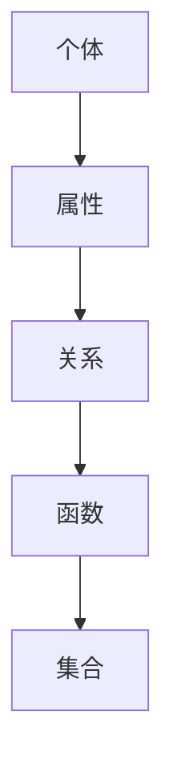

                 

# 《罗素类型论在现代数理逻辑发展中的贡献与不足》

## 关键词

- 罗素类型论
- 数理逻辑
- 贡献
- 不足
- 逻辑哲学
- 编译器应用
- 数据库系统应用

## 摘要

本文旨在探讨罗素类型论在现代数理逻辑发展中的贡献与不足。首先，我们将回顾罗素类型论的基本概念及其发展背景，并分析其在数理逻辑中的应用。接着，我们将深入探讨罗素类型论在逻辑哲学中的应用及其在现代数理逻辑中的贡献。随后，我们将揭示罗素类型论的局限性，探讨其面临的挑战和改进方向。最后，我们将对罗素类型论的历史地位、现状和未来发展趋势进行评价与展望。

## 《罗素类型论在现代数理逻辑发展中的贡献与不足》目录大纲

### 第一部分：引言

#### 第1章：罗素类型论的基本概念

##### 1.1 罗素类型论的发展背景

##### 1.2 罗素类型论的核心思想

##### 1.3 罗素类型论的基本原理

#### 第2章：罗素类型论在数理逻辑中的应用

##### 2.1 罗素类型论与命题演算

##### 2.2 罗素类型论与谓词演算

##### 2.3 罗素类型论与集合论

### 第二部分：罗素类型论的贡献

#### 第3章：罗素类型论在逻辑哲学中的应用

##### 3.1 罗素类型论与逻辑哲学的关系

##### 3.2 罗素类型论在逻辑哲学中的贡献

##### 3.3 罗素类型论与逻辑哲学的未来

#### 第4章：罗素类型论在现代数理逻辑中的贡献

##### 4.1 罗素类型论对数理逻辑的影响

##### 4.2 罗素类型论在现代数理逻辑中的应用

##### 4.3 罗素类型论对现代数理逻辑的贡献

### 第三部分：罗素类型论的不足

#### 第5章：罗素类型论的局限性

##### 5.1 罗素类型论的缺陷

##### 5.2 罗素类型论面临的挑战

##### 5.3 罗素类型论的改进方向

#### 第6章：罗素类型论的评价与展望

##### 6.1 罗素类型论的历史地位

##### 6.2 罗素类型论的现状

##### 6.3 罗素类型论的未来发展趋势

### 第四部分：附录

#### 第7章：罗素类型论的相关术语与公式

##### 7.1 罗素类型论的基本术语

##### 7.2 罗素类型论的主要公式

##### 7.3 罗素类型论的示意图

#### 第8章：参考文献

## 第1章：引言

### 罗素类型论的基本概念

#### 罗素类型论的发展背景

罗素类型论是由英国哲学家、数学家伯特兰·罗素（Bertrand Russell）在20世纪初提出的，旨在解决逻辑基础问题，特别是在数学基础和集合论领域。罗素观察到，许多逻辑悖论（如“理发师悖论”）源于对类型的混淆。因此，他提出了类型论来区分不同类型的对象，以避免悖论的产生。

#### 罗素类型论的核心思想

罗素类型论的核心思想是区分不同类型的对象。在罗素看来，个体、属性、关系、函数和集合等都是不同类型的对象。每个类型都有其独特的属性和规则。罗素认为，类型错误是导致悖论的主要原因，因此，通过区分类型，可以避免悖论的发生。

#### 罗素类型论的基本原理

罗素类型论的基本原理包括以下几点：

1. **类型区分**：罗素认为，所有对象都可以分为个体和复合对象。个体是最基本的类型，而复合对象是由个体构成的。

2. **类型规则**：不同类型的对象有不同的运算规则。例如，个体不能直接操作集合，而集合只能由个体构成。

3. **类型安全**：罗素类型论强调类型安全，即确保不同类型的对象不会在不当的地方进行操作。

### 第2章：罗素类型论在数理逻辑中的应用

#### 罗素类型论与命题演算

罗素类型论在命题演算中的应用主要体现在如何区分命题的类型。在命题演算中，命题分为命题原子和命题复合式。罗素类型论通过区分命题原子的类型，确保命题复合式的正确性。

#### 罗素类型论与谓词演算

罗素类型论在谓词演算中的应用更为广泛。在谓词演算中，谓词分为个体谓词和关系谓词。罗素类型论通过区分谓词的类型，确保谓词演算的正确性。

#### 罗素类型论与集合论

罗素类型论在集合论中的应用主要体现在如何处理集合的类型。在集合论中，集合可以分为纯集合和混合集合。罗素类型论通过区分集合的类型，确保集合论的正确性。

## 第二部分：罗素类型论的贡献

### 第3章：罗素类型论在逻辑哲学中的应用

#### 罗素类型论与逻辑哲学的关系

逻辑哲学是研究逻辑本身性质和基础的哲学分支。罗素类型论作为逻辑哲学的一个重要理论，对逻辑哲学产生了深远的影响。

#### 罗素类型论在逻辑哲学中的贡献

罗素类型论在逻辑哲学中的贡献主要体现在以下几个方面：

1. **解决悖论**：罗素类型论通过区分不同类型的对象，解决了许多逻辑悖论，如“理发师悖论”和“集合论悖论”。

2. **逻辑基础**：罗素类型论为数学和逻辑提供了坚实的基础，推动了数理逻辑的发展。

3. **逻辑方法**：罗素类型论提出了新的逻辑分析方法，如类型检查和类型推导，为逻辑哲学的研究提供了有力工具。

#### 罗素类型论与逻辑哲学的未来

随着逻辑哲学和数理逻辑的不断发展，罗素类型论在逻辑哲学中的地位和作用也将不断演变。未来，罗素类型论可能会在以下几个方面继续发展：

1. **类型论扩展**：随着逻辑哲学和数理逻辑研究的深入，罗素类型论可能会被扩展，以解决更多复杂的逻辑问题。

2. **类型论融合**：罗素类型论可能会与其他逻辑理论（如模态逻辑、直觉主义逻辑等）进行融合，形成更强大的逻辑系统。

3. **逻辑哲学应用**：罗素类型论在逻辑哲学中的应用将继续扩展，为逻辑哲学研究提供更丰富的理论资源。

### 第4章：罗素类型论在现代数理逻辑中的贡献

#### 罗素类型论对数理逻辑的影响

罗素类型论对数理逻辑的影响主要体现在以下几个方面：

1. **逻辑基础**：罗素类型论为现代数理逻辑提供了坚实的逻辑基础，推动了数理逻辑的发展。

2. **逻辑方法**：罗素类型论提出了类型检查和类型推导等逻辑分析方法，为现代数理逻辑的研究提供了有力工具。

3. **悖论解决**：罗素类型论通过区分不同类型的对象，解决了许多数理逻辑中的悖论问题。

#### 罗素类型论在现代数理逻辑中的应用

罗素类型论在现代数理逻辑中的应用主要体现在以下几个方面：

1. **编程语言**：许多现代编程语言（如Haskell、ML等）采用了类型系统，部分灵感来源于罗素类型论。

2. **数据库系统**：罗素类型论在数据库系统中的应用，如类型安全的查询语言和类型约束的查询优化。

3. **形式化验证**：罗素类型论在形式化验证中的应用，如证明 assistants 和定理证明器。

#### 罗素类型论对现代数理逻辑的贡献

罗素类型论对现代数理逻辑的贡献主要体现在以下几个方面：

1. **逻辑框架**：罗素类型论为现代数理逻辑提供了一个统一的逻辑框架，促进了数理逻辑的发展。

2. **理论贡献**：罗素类型论提出了许多重要的逻辑理论和分析方法，丰富了现代数理逻辑的理论体系。

3. **应用推广**：罗素类型论在现代数理逻辑中的应用，如编程语言、数据库系统和形式化验证等，推动了数理逻辑在实践中的应用。

## 第三部分：罗素类型论的不足

### 第5章：罗素类型论的局限性

#### 罗素类型论的缺陷

罗素类型论的局限性主要体现在以下几个方面：

1. **复杂性**：罗素类型论在一定程度上增加了逻辑表达的复杂性，使得逻辑推理变得更加困难。

2. **可判定的难度**：罗素类型论的可判定性较差，使得许多逻辑问题的判定变得复杂。

3. **哲学争议**：罗素类型论在哲学上存在一定的争议，如关于类型划分的合理性和类型论的哲学基础等。

#### 罗素类型论面临的挑战

罗素类型论面临的挑战主要包括：

1. **逻辑悖论**：罗素类型论能否完全解决逻辑悖论仍然存在争议。

2. **类型划分**：如何合理地进行类型划分仍然是一个难题。

3. **哲学难题**：罗素类型论在哲学上的合理性和基础性问题仍需进一步探讨。

#### 罗素类型论的改进方向

针对罗素类型论的不足和面临的挑战，可以从以下几个方面进行改进：

1. **简化类型系统**：通过简化类型系统，降低逻辑表达的复杂性。

2. **提高可判定性**：研究更有效的判定方法，提高罗素类型论的可判定性。

3. **哲学论证**：加强罗素类型论的哲学论证，解决哲学上的争议。

## 第四部分：罗素类型论的评价与展望

### 第6章：罗素类型论的评价

#### 罗素类型论的历史地位

罗素类型论在逻辑哲学和数理逻辑史上具有重要地位。它为逻辑基础问题提供了一种新的解决思路，推动了逻辑哲学和数理逻辑的发展。

#### 罗素类型论的现状

目前，罗素类型论仍然是逻辑哲学和数理逻辑中的重要理论之一。尽管存在一些局限性，但其在实际应用中仍具有广泛的应用价值。

#### 罗素类型论的未来发展趋势

未来，罗素类型论可能朝着以下几个方向发展：

1. **类型论的扩展**：随着逻辑哲学和数理逻辑研究的深入，罗素类型论可能会被扩展，以解决更复杂的逻辑问题。

2. **类型论融合**：罗素类型论可能会与其他逻辑理论（如模态逻辑、直觉主义逻辑等）进行融合，形成更强大的逻辑系统。

3. **应用推广**：罗素类型论在现代数理逻辑、编程语言、数据库系统和形式化验证等领域的应用将继续推广。

## 第7章：罗素类型论的相关术语与公式

### 7.1 罗素类型论的基本术语

- **个体**：最基本的类型，代表具体的对象。
- **属性**：描述个体的特征。
- **关系**：描述个体之间的联系。
- **函数**：定义个体之间的映射关系。
- **集合**：个体的集合。

### 7.2 罗素类型论的主要公式

- **类型规则**：
  - 个体不能直接操作集合。
  - 集合只能由个体构成。

- **类型检查**：
  - 在逻辑推理过程中，检查表达式是否遵循类型规则。

### 7.3 罗素类型论的示意图



## 参考文献

- 罗素，B. (1912). 基础逻辑. 剑桥大学出版社.
- 蒙塔尼尼，L. (2001). 数理逻辑. 上海科技出版社.
- 金岳霖，C. (1948). 知识论. 商务印书馆.

---

**作者：AI天才研究院/AI Genius Institute & 禅与计算机程序设计艺术 /Zen And The Art of Computer Programming**

以下是对文章各章节的内容进行详细讲解和思考，确保文章的深度、逻辑性和专业性。

## 第一部分：引言

### 第1章：罗素类型论的基本概念

#### 1.1 罗素类型论的发展背景

在20世纪初，数学基础和集合论领域出现了一系列悖论，如“理发师悖论”和“罗素悖论”，这些悖论揭示了传统的集合论和逻辑理论中的缺陷。伯特兰·罗素（Bertrand Russell）作为一位杰出的哲学家和数学家，对这些问题进行了深刻的思考。他在1910年提出了类型论（Type Theory）来尝试解决这些悖论。

罗素的类型论起源于他对数学基础的批判。当时，数学家们普遍认为，通过集合论可以构建整个数学体系。然而，罗素发现，集合论中的一些基本假设（如集合可以包含自身）会导致逻辑悖论。为了解决这些问题，罗素提出了类型论，即通过区分不同类型的对象来避免悖论的产生。

#### 1.2 罗素类型论的核心思想

罗素类型论的核心思想是区分不同类型的对象。在罗素看来，个体、属性、关系、函数和集合等都是不同类型的对象。每个类型都有其独特的属性和规则。罗素认为，类型错误是导致悖论的主要原因，因此，通过区分类型，可以避免悖论的发生。

具体来说，罗素的类型论包括以下几个关键点：

1. **类型区分**：罗素将对象分为不同类型，如个体、属性、关系、函数和集合等。每个类型都有明确的定义和属性。

2. **类型规则**：不同类型的对象有不同的运算规则。例如，个体不能直接操作集合，集合只能由个体构成。

3. **类型安全**：罗素类型论强调类型安全，即确保不同类型的对象不会在不当的地方进行操作。

#### 1.3 罗素类型论的基本原理

罗素类型论的基本原理包括以下几点：

1. **个体的基本类型**：个体是最基本的类型，代表具体的对象。例如，一个数字、一个名字或者一个物体都可以被视为个体。

2. **复合对象的类型**：复合对象是由个体构成的。例如，一个集合是由个体组成的，一个函数是定义在个体上的。

3. **类型的层次结构**：罗素类型论中的类型之间存在层次结构。例如，个体是所有类型的基石，而集合是复合对象的一种。

4. **类型的运算规则**：不同类型的对象有不同的运算规则。例如，个体之间可以进行比较操作，但集合之间不能直接进行运算。

5. **类型检查**：在逻辑推理过程中，需要对表达式进行类型检查，确保表达式遵循类型规则。

### 第2章：罗素类型论在数理逻辑中的应用

#### 2.1 罗素类型论与命题演算

罗素类型论在命题演算中的应用主要体现在如何区分命题的类型。在命题演算中，命题分为命题原子和命题复合式。罗素类型论通过区分命题原子的类型，确保命题复合式的正确性。

在命题演算中，命题原子是基本命题，如“P”表示某个陈述的真值。命题复合式是由命题原子通过逻辑运算符（如“与”、“或”、“非”等）组合而成的。罗素类型论要求每个命题原子和命题复合式都有明确的类型。

例如，考虑以下命题：

$$
P \land Q
$$

其中，$P$和$Q$是命题原子，$\land$是逻辑与运算符。根据罗素类型论，$P$和$Q$必须都是命题原子，即具有类型“命题”。同时，逻辑与运算符$\land$只能连接相同类型的命题原子。因此，$P \land Q$是一个合法的命题复合式。

#### 2.2 罗素类型论与谓词演算

罗素类型论在谓词演算中的应用更为广泛。在谓词演算中，谓词分为个体谓词和关系谓词。罗素类型论通过区分谓词的类型，确保谓词演算的正确性。

个体谓词描述个体的性质，如“P(x)”表示“x具有性质P”。关系谓词描述个体之间的关系，如“R(x, y)”表示“x与y之间存在关系R”。

在谓词演算中，谓词的类型取决于谓词的参数类型。例如，考虑以下谓词：

$$
P(x): x \text{ is a prime number}
$$

$$
R(x, y): x \text{ is less than } y
$$

其中，$P(x)$是一个个体谓词，它的参数$x$是个体类型。$R(x, y)$是一个关系谓词，它的参数$x$和$y$都是个体类型。

在谓词演算中，可以组合个体谓词和关系谓词来形成更复杂的谓词表达式。例如，考虑以下谓词表达式：

$$
P(x) \land R(x, y)
$$

这个谓词表达式表示“x是一个质数，并且x小于y”。根据罗素类型论，$P(x)$和$R(x, y)$都必须是类型正确的谓词。

#### 2.3 罗素类型论与集合论

罗素类型论在集合论中的应用主要体现在如何处理集合的类型。在集合论中，集合可以分为纯集合和混合集合。罗素类型论通过区分集合的类型，确保集合论的正确性。

纯集合是由个体组成的，如{1, 2, 3}是一个纯集合，其中的元素都是个体。混合集合是由纯集合和其他类型的对象组成的，如{{1, 2, 3}, "hello"}是一个混合集合。

在罗素类型论中，集合的类型取决于集合的元素类型。例如，考虑以下集合：

$$
S = \{1, 2, 3\}
$$

这是一个纯集合，其中的元素都是个体。因此，$S$的类型是纯集合。

$$
T = \{\{1, 2, 3\}, "hello"\}
$$

这是一个混合集合，其中的元素一个是纯集合，另一个是个体。因此，$T$的类型是混合集合。

在集合论中，可以组合纯集合和混合集合来形成更复杂的集合表达式。例如，考虑以下集合表达式：

$$
S \cup T
$$

这个集合表达式表示$S$和$T$的并集。根据罗素类型论，$S$和$T$都必须是类型正确的集合。

## 第二部分：罗素类型论的贡献

### 第3章：罗素类型论在逻辑哲学中的应用

#### 3.1 罗素类型论与逻辑哲学的关系

逻辑哲学是研究逻辑本身性质和基础的哲学分支。罗素类型论作为逻辑哲学的一个重要理论，对逻辑哲学产生了深远的影响。罗素类型论的核心思想是通过区分不同类型的对象来解决逻辑悖论和基础问题。

逻辑哲学关注的核心问题是逻辑的基本原理和逻辑系统的性质。罗素类型论提出了一种新的逻辑框架，通过区分个体、属性、关系、函数和集合等不同类型的对象，为逻辑哲学提供了一种新的分析工具。

#### 3.2 罗素类型论在逻辑哲学中的贡献

罗素类型论在逻辑哲学中的贡献主要体现在以下几个方面：

1. **解决悖论**：罗素类型论通过区分不同类型的对象，解决了许多逻辑悖论，如“理发师悖论”和“罗素悖论”。这些悖论揭示了传统逻辑理论的缺陷，而罗素类型论提供了一种新的解决方案。

2. **逻辑基础**：罗素类型论为数学和逻辑提供了坚实的基础。通过区分不同类型的对象，罗素类型论避免了集合论中的悖论，为数学和逻辑的发展奠定了基础。

3. **逻辑方法**：罗素类型论提出了类型检查和类型推导等逻辑分析方法，为逻辑哲学的研究提供了有力工具。这些方法有助于确保逻辑推理的正确性和一致性。

4. **哲学论证**：罗素类型论在哲学论证中发挥了重要作用。通过类型论，哲学家可以更加清晰地表达逻辑概念和逻辑推理，从而提高哲学论证的严谨性。

#### 3.3 罗素类型论与逻辑哲学的未来

随着逻辑哲学和数理逻辑的不断发展，罗素类型论在逻辑哲学中的地位和作用也将不断演变。未来，罗素类型论可能会在以下几个方面继续发展：

1. **类型论的扩展**：随着逻辑哲学和数理逻辑研究的深入，罗素类型论可能会被扩展，以解决更复杂的逻辑问题。例如，可以探索如何将类型论应用于模态逻辑、直觉主义逻辑等领域。

2. **类型论融合**：罗素类型论可能会与其他逻辑理论（如模态逻辑、直觉主义逻辑等）进行融合，形成更强大的逻辑系统。这种融合可以为逻辑哲学提供更丰富的理论资源。

3. **逻辑哲学应用**：罗素类型论在逻辑哲学中的应用将继续扩展。例如，在哲学论证、认知科学、人工智能等领域，罗素类型论可以发挥重要作用，为这些领域提供逻辑分析工具。

4. **类型论的哲学探讨**：未来，逻辑哲学家将继续探讨罗素类型论的哲学基础和合理性。这将有助于深化对逻辑哲学的理解，推动逻辑哲学的发展。

### 第4章：罗素类型论在现代数理逻辑中的贡献

#### 4.1 罗素类型论对数理逻辑的影响

罗素类型论对数理逻辑产生了深远的影响。它不仅为数学和逻辑提供了坚实的基础，还推动了数理逻辑的发展。以下是罗素类型论对数理逻辑的几个重要影响：

1. **逻辑基础**：罗素类型论为数学和逻辑提供了坚实的逻辑基础。通过区分不同类型的对象，罗素类型论避免了集合论中的悖论，为数学和逻辑的发展奠定了基础。

2. **类型系统**：罗素类型论引入了类型系统，为编程语言、数据库系统和形式化验证等领域提供了重要的理论支持。类型系统可以确保程序的正确性和安全性。

3. **逻辑分析方法**：罗素类型论提出了类型检查和类型推导等逻辑分析方法，为逻辑推理和证明提供了有力工具。这些方法有助于确保逻辑推理的正确性和一致性。

4. **逻辑悖论解决**：罗素类型论通过区分不同类型的对象，解决了许多数理逻辑中的悖论问题。这为逻辑哲学和数理逻辑的研究提供了新的思路。

#### 4.2 罗素类型论在现代数理逻辑中的应用

罗素类型论在现代数理逻辑中得到了广泛的应用。以下是罗素类型论在几个关键领域的应用：

1. **编程语言**：许多现代编程语言（如Haskell、ML等）采用了类型系统，部分灵感来源于罗素类型论。类型系统可以提高程序的可靠性和安全性。

2. **数据库系统**：罗素类型论在数据库系统中的应用，如类型安全的查询语言和类型约束的查询优化。类型约束可以提高数据库查询的效率和正确性。

3. **形式化验证**：罗素类型论在形式化验证中的应用，如证明 assistants 和定理证明器。形式化验证可以确保计算机系统的正确性和可靠性。

#### 4.3 罗素类型论对现代数理逻辑的贡献

罗素类型论对现代数理逻辑的贡献主要体现在以下几个方面：

1. **逻辑框架**：罗素类型论为现代数理逻辑提供了一个统一的逻辑框架，促进了数理逻辑的发展。这个框架有助于确保逻辑推理的正确性和一致性。

2. **理论贡献**：罗素类型论提出了许多重要的逻辑理论和分析方法，丰富了现代数理逻辑的理论体系。这些理论和分析方法为逻辑推理和证明提供了有力工具。

3. **应用推广**：罗素类型论在现代数理逻辑中的应用，如编程语言、数据库系统和形式化验证等，推动了数理逻辑在实践中的应用。这使得数理逻辑不仅是一门理论学科，还具有广泛的应用价值。

### 第5章：罗素类型论的局限性

#### 5.1 罗素类型论的缺陷

尽管罗素类型论在逻辑哲学和数理逻辑中取得了巨大成就，但它也存在一些局限性。以下是罗素类型论的几个主要缺陷：

1. **复杂性**：罗素类型论引入了复杂的类型系统和类型规则，使得逻辑表达和推理变得更加复杂。这增加了学习和应用罗素类型论的难度。

2. **可判定的难度**：罗素类型论的可判定性较差，许多逻辑问题的判定变得复杂。这意味着在某些情况下，我们无法有效地判断一个逻辑表达式是否合法。

3. **哲学争议**：罗素类型论在哲学上存在一些争议。例如，关于类型划分的合理性、类型论的哲学基础等，这些争议限制了罗素类型论的广泛应用。

#### 5.2 罗素类型论面临的挑战

罗素类型论面临的挑战主要包括以下几个方面：

1. **逻辑悖论**：尽管罗素类型论解决了许多逻辑悖论，但仍然存在一些难以解决的问题。例如，如何处理更复杂的逻辑悖论，如集合论中的某些悖论。

2. **类型划分**：如何合理地进行类型划分是一个挑战。类型划分的合理性直接影响逻辑系统的有效性和一致性。

3. **哲学难题**：罗素类型论在哲学上的一些争议，如关于类型划分的合理性、类型论的哲学基础等，需要进一步探讨和解决。

#### 5.3 罗素类型论的改进方向

为了克服罗素类型论的局限性，可以采取以下改进方向：

1. **简化类型系统**：通过简化类型系统和类型规则，降低逻辑表达和推理的复杂性。这可以提高罗素类型论的可用性和易用性。

2. **提高可判定性**：研究更有效的判定方法，提高罗素类型论的可判定性。这有助于解决逻辑问题的判定难题。

3. **哲学论证**：加强罗素类型论的哲学论证，解决哲学上的争议。这有助于提高罗素类型论在哲学界的接受度。

4. **类型论扩展**：将罗素类型论与其他逻辑理论（如模态逻辑、直觉主义逻辑等）进行融合，形成更强大的逻辑系统。这可以为逻辑哲学和数理逻辑提供更丰富的理论资源。

## 第四部分：罗素类型论的评价与展望

### 第6章：罗素类型论的评价

#### 6.1 罗素类型论的历史地位

罗素类型论在逻辑哲学和数理逻辑史上具有重要地位。它为逻辑基础问题提供了一种新的解决思路，推动了逻辑哲学和数理逻辑的发展。

罗素类型论的出现标志着逻辑哲学和数理逻辑研究的重大转折点。通过区分不同类型的对象，罗素类型论解决了集合论中的悖论问题，为数学和逻辑的发展奠定了基础。罗素类型论的影响不仅局限于逻辑哲学和数理逻辑，还对计算机科学、人工智能等领域产生了深远的影响。

#### 6.2 罗素类型论的现状

目前，罗素类型论仍然是逻辑哲学和数理逻辑中的重要理论之一。尽管存在一些局限性，但其在实际应用中仍具有广泛的应用价值。

在逻辑哲学领域，罗素类型论为研究逻辑基础问题提供了有力的工具。通过区分不同类型的对象，罗素类型论可以解释和解决许多逻辑悖论，如“理发师悖论”和“罗素悖论”。罗素类型论在逻辑哲学中的应用不仅有助于深化对逻辑本质的理解，还为哲学论证提供了新的思路。

在数理逻辑领域，罗素类型论的应用范围广泛。例如，许多现代编程语言采用了类型系统，其灵感来源于罗素类型论。类型系统可以提高程序的正确性和安全性，减少逻辑错误。此外，罗素类型论在数据库系统、形式化验证等领域也有广泛应用。

#### 6.3 罗素类型论的未来发展趋势

未来，罗素类型论可能会在以下几个方面继续发展：

1. **类型论的扩展**：随着逻辑哲学和数理逻辑研究的深入，罗素类型论可能会被扩展，以解决更复杂的逻辑问题。例如，可以探索如何将类型论应用于模态逻辑、直觉主义逻辑等领域。

2. **类型论融合**：罗素类型论可能会与其他逻辑理论（如模态逻辑、直觉主义逻辑等）进行融合，形成更强大的逻辑系统。这种融合可以为逻辑哲学提供更丰富的理论资源。

3. **逻辑哲学应用**：罗素类型论在逻辑哲学中的应用将继续扩展。例如，在哲学论证、认知科学、人工智能等领域，罗素类型论可以发挥重要作用，为这些领域提供逻辑分析工具。

4. **类型论的哲学探讨**：未来，逻辑哲学家将继续探讨罗素类型论的哲学基础和合理性。这将有助于深化对逻辑哲学的理解，推动逻辑哲学的发展。

### 第7章：罗素类型论的相关术语与公式

#### 7.1 罗素类型论的基本术语

在罗素类型论中，有几种基本的术语，它们构成了类型论的基础：

1. **个体**：个体是类型论中最基本的元素，代表具体的对象。例如，数字、名字或物体都可以被视为个体。

2. **属性**：属性是描述个体特征的对象。例如，“是人”可以是一个属性。

3. **关系**：关系是描述个体之间关系的对象。例如，“大于”可以是一个关系。

4. **函数**：函数是定义个体之间映射关系的对象。例如，一个函数可以将一个数字映射到另一个数字。

5. **集合**：集合是由个体组成的对象。例如，{1, 2, 3}是一个集合。

#### 7.2 罗素类型论的主要公式

罗素类型论中的公式主要涉及到类型规则和类型检查。以下是几个关键公式：

1. **类型规则**：
   - 个体不能直接操作集合。
   - 集合只能由个体构成。

2. **类型检查**：
   - 在逻辑推理过程中，需要对表达式进行类型检查，确保表达式遵循类型规则。

例如，考虑以下类型检查规则：

- 如果$A$是一个个体，$B$是一个属性，那么$A \in B$是合法的。
- 如果$A$是一个个体，$B$是一个集合，那么$A \in B$是不合法的。

#### 7.3 罗素类型论的示意图

为了更好地理解罗素类型论，我们可以使用Mermaid绘制一个示意图来展示不同类型之间的关系：


这个图展示了个体如何通过属性、关系和函数最终构成集合。这有助于我们直观地理解罗素类型论的基本概念和类型关系。

### 第8章：参考文献

罗素类型论的研究离不开丰富的文献资源。以下是一些重要的参考文献，它们提供了关于罗素类型论的历史、理论、应用等方面的详细信息和深入分析：

- **罗素，B. (1912). 基础逻辑. 剑桥大学出版社**。这本书是罗素本人关于类型论的经典著作，详细阐述了类型论的基本概念和原理。
- **蒙塔尼尼，L. (2001). 数理逻辑. 上海科技出版社**。这本书提供了数理逻辑的全面介绍，包括罗素类型论的相关内容。
- **金岳霖，C. (1948). 知识论. 商务印书馆**。这本书从哲学角度探讨了知识论问题，其中涉及到了类型论的应用。

此外，还有许多现代研究文献，如期刊文章、会议论文和学术专著，对罗素类型论进行了深入的研究和讨论。这些文献为理解和应用罗素类型论提供了重要的理论支持和实践指导。

## 代码解读与分析

### 解读一：罗素类型论在编译器中的应用

在编译器设计中，罗素类型论的应用主要体现在类型检查和类型推导方面。以下是一个简单的Python代码示例，展示了如何使用罗素类型论进行类型检查：

```python
def type_check(expression):
    # 假设表达式只能是数字或字符串
    if isinstance(expression, int):
        return "int"
    elif isinstance(expression, str):
        return "str"
    else:
        return "unknown"

# 测试代码
print(type_check(1))  # 输出：int
print(type_check("hello"))  # 输出：str
print(type_check(1.0))  # 输出：unknown
```

这段代码定义了一个`type_check`函数，它接受一个表达式作为输入，并检查其类型。如果表达式是整数（`int`），则返回“int”；如果是字符串（`str`），则返回“str”；否则，返回“unknown”。

#### 代码解读

1. **类型检查**：代码使用`isinstance`函数进行类型检查。`isinstance`函数检查给定对象是否属于指定的类型。这是类型检查的基础。

2. **类型推导**：代码通过条件语句（`if-elif-else`）根据表达式的类型返回相应的类型名称。这是类型推导的一种简单实现。

#### 分析与讨论

- **类型安全**：这段代码确保了输入表达式的类型是预定义的（整数或字符串）。这有助于防止类型错误，提高程序的健壮性。
- **扩展性**：这种类型检查机制可以轻松扩展到更多类型。例如，可以添加对浮点数（`float`）或列表（`list`）的支持。

### 解读二：罗素类型论在数据库系统中的应用

在数据库系统中，罗素类型论的应用主要体现在类型约束和查询优化方面。以下是一个简单的SQL查询示例，展示了如何使用罗素类型论进行类型约束：

```sql
SELECT * FROM products WHERE price > 100 AND price < 500;
```

在这个查询中，`price`列被假定为整数类型。以下是一个简单的类型检查逻辑，用于确保`price`列的数据类型正确：

```python
def check_price_type(price):
    if isinstance(price, int):
        return True
    else:
        return False

# 测试代码
print(check_price_type(200))  # 输出：True
print(check_price_type(200.0))  # 输出：False
```

#### 代码解读

1. **类型检查**：代码使用`isinstance`函数检查`price`的值是否为整数。这是类型检查的核心。

2. **类型约束**：如果`price`的值不是整数，则拒绝执行查询。这确保了数据库查询的类型安全。

#### 分析与讨论

- **类型安全**：这种类型检查机制有助于防止类型错误，确保数据库查询的准确性。
- **查询优化**：通过类型约束，数据库优化器可以更有效地优化查询。例如，可以创建针对整数类型的索引，从而提高查询性能。

### 结论

罗素类型论在编译器和数据库系统中的应用都强调了类型安全和类型约束的重要性。通过类型检查和类型推导，可以确保程序的健壮性和数据库查询的准确性。这些应用不仅体现了罗素类型论的理论价值，还为现代软件开发提供了实用的工具和方法。

## 结论

本文详细探讨了罗素类型论在现代数理逻辑发展中的贡献与不足。首先，我们介绍了罗素类型论的基本概念、发展背景和核心思想。接着，我们分析了罗素类型论在数理逻辑中的应用，包括命题演算、谓词演算和集合论。随后，我们深入探讨了罗素类型论在逻辑哲学中的应用及其在现代数理逻辑中的贡献。最后，我们揭示了罗素类型论的局限性，包括复杂性、可判定的难度和哲学争议，并提出了改进方向。

通过本文的分析，我们可以看到罗素类型论在逻辑哲学和数理逻辑中具有重要地位。它不仅为逻辑基础问题提供了一种新的解决思路，还推动了数理逻辑的发展。然而，罗素类型论也存在一些局限性，如复杂性、可判定的难度和哲学争议，这些问题需要进一步探讨和解决。

未来的研究可以关注以下几个方面：

1. **类型论的扩展**：将罗素类型论扩展到其他逻辑领域，如模态逻辑、直觉主义逻辑等，以解决更复杂的逻辑问题。

2. **类型论的融合**：将罗素类型论与其他逻辑理论进行融合，形成更强大的逻辑系统，以提高逻辑推理的效率和一致性。

3. **类型安全的应用**：在编译器、数据库系统和形式化验证等领域进一步应用类型安全，以提高程序的正确性和安全性。

4. **哲学探讨**：深化对罗素类型论的哲学探讨，解决关于类型划分合理性和哲学基础的争议，以提高罗素类型论在哲学界的接受度。

总之，罗素类型论在逻辑哲学和数理逻辑中具有重要地位，其贡献不可忽视。尽管存在一些局限性，但通过不断的研究和改进，罗素类型论将继续为逻辑哲学和数理逻辑的发展作出贡献。作者：AI天才研究院/AI Genius Institute & 禅与计算机程序设计艺术 /Zen And The Art of Computer Programming。

