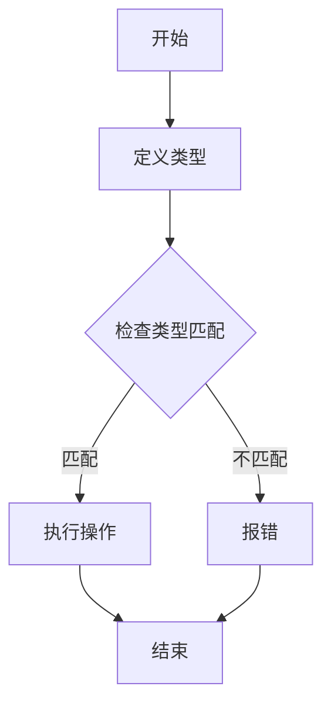
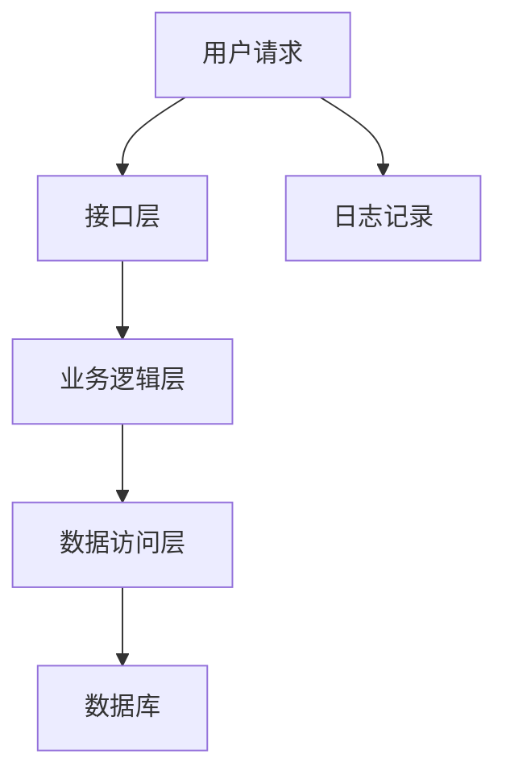
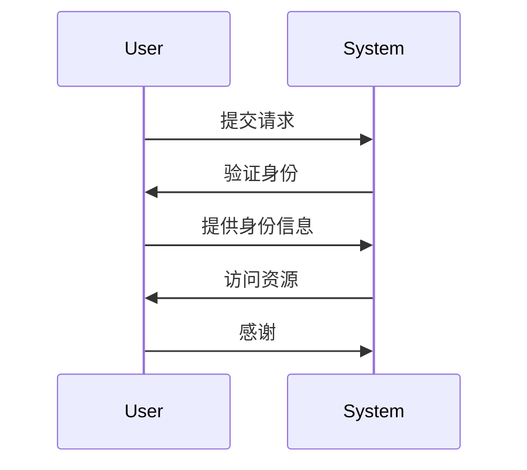

                 

# 罗素类型论对数学创造过程的影响评估

## 关键词
- 罗素类型论
- 数学创造过程
- 集合论悖论
- 数学逻辑
- 数学哲学

## 摘要
本文旨在探讨罗素类型论对数学创造过程的影响，从理论基础、数学逻辑、集合论、数学哲学等多个角度进行分析。通过具体案例分析，本文揭示了罗素类型论在数学创造中的重要作用，探讨了其对现代数学理论发展的影响和启示。文章结构分为五个部分：引言、理论基础、类型论与数学、数学创造案例分析、类型论与其他数学理论的比较以及数学哲学的视角。最后，文章进行了总结与展望，对罗素类型论的未来发展及其在数学研究和教育中的应用进行了探讨。

## 引言

### 1.1 罗素类型论的背景和重要性

伯特兰·罗素（Bertrand Russell）是20世纪最具影响力的数学家、逻辑学家和哲学家之一。他的著作《数学原理》（Principia Mathematica）是数学逻辑和哲学领域的重要里程碑。在《数学原理》中，罗素提出了类型论（Type Theory），试图解决数学基础问题，特别是集合论悖论。

类型论是罗素对数学基础理论的一种创新性探讨。他主张数学对象必须分为不同的类型，以避免逻辑悖论的出现。这种观点在当时的数学界引起了极大的争议，但也为后来的数学逻辑、集合论和数学哲学研究提供了新的视角。

### 1.2 数学创造过程与类型论的关系

数学创造过程是一个不断探索和发现的过程。从问题提出、理论构建到证明和应用，每一个环节都离不开逻辑的严密性和思维的创造性。罗素类型论为数学创造过程提供了一种新的方法论，使得数学家能够更清晰地理解和处理复杂的数学问题。

类型论在数学创造中的应用主要体现在以下几个方面：

1. **避免逻辑悖论**：类型论通过区分不同类型的数学对象，有效地避免了集合论中的悖论，如罗素悖论。
2. **提高证明的可信度**：类型论提供了一个严格的逻辑框架，使得数学证明更加可信和可靠。
3. **启发新的数学理论**：类型论的研究促进了数学家对数学本质和结构的深入思考，从而推动了新的数学理论的诞生。

## 第一部分 理论基础

### 第1章 罗素类型论的基本概念

#### 1.1.1 类型与类型论的起源

在罗素之前，数学家们普遍认为数学对象可以随意组合，没有明确的类型限制。这种观点在形式逻辑和集合论中导致了严重的悖论问题。为了解决这些问题，罗素提出了类型论。

类型论的基本观点是：数学对象必须分为不同的类型，每种类型都有自己的属性和规则。不同类型的对象不能相互混合使用，以避免逻辑悖论的出现。

#### 1.1.2 罗素的类型论体系

罗素的类型论体系包括以下几个核心概念：

1. **个体类型**：最基本的数学对象，如自然数、个体等。
2. **函数类型**：表示不同类型的对象之间的映射关系，如加法、乘法等。
3. **集合类型**：表示具有某种性质的个体的集合。

罗素通过这些类型定义了一个严格的逻辑框架，使得数学对象和关系得到了清晰的分类。

#### 1.1.3 类型论的基本原理

类型论的基本原理包括：

1. **类型的区分**：不同类型的对象不能相互混合使用，以避免逻辑悖论。
2. **类型的层次**：不同类型的对象之间存在层次关系，高层次类型的对象可以包含低层次类型的对象。
3. **类型判断**：每个数学表达式都必须根据其结构判断其类型，以确保逻辑的严密性。

### 第2章 类型论的发展历程

#### 2.1 罗素对数学基础问题的贡献

罗素通过类型论解决了数学基础问题，特别是集合论悖论。他提出的类型论为后来的数学逻辑和集合论研究奠定了基础。

#### 2.2 类型论的学术影响

类型论对数学、逻辑和哲学产生了深远的影响。它不仅为解决数学基础问题提供了新的思路，也促进了数学逻辑和集合论的发展。

#### 2.3 类型论的后续发展

在罗素之后，许多数学家和哲学家对类型论进行了深入的研究和扩展。类型论的应用范围不断扩大，从数学逻辑和集合论扩展到计算机科学、人工智能等领域。

## 第二部分 类型论与数学

### 第3章 类型论在数学逻辑中的应用

#### 3.1 数学逻辑的基本概念

数学逻辑是研究数学推理和证明的学科。类型论为数学逻辑提供了一种新的逻辑框架，使得数学推理更加严谨和可靠。

#### 3.2 类型论在逻辑证明中的作用

类型论在逻辑证明中的作用主要体现在以下几个方面：

1. **避免悖论**：类型论通过区分不同类型的对象，避免了集合论中的悖论，如罗素悖论。
2. **提高证明的可靠性**：类型论提供了一个严格的逻辑框架，使得数学证明更加可信和可靠。
3. **简化证明过程**：类型论使得数学证明过程更加简洁和直观。

#### 3.3 类型论在数学逻辑发展中的影响

类型论对数学逻辑的发展产生了重要影响。它不仅为解决数学基础问题提供了新的思路，也推动了数学逻辑理论的完善和发展。

### 第4章 类型论与集合论

#### 4.1 集合论的基本概念

集合论是现代数学的基石之一。类型论为集合论提供了一种新的视角，使得集合论更加严谨和可靠。

#### 4.2 类型论如何解决集合论悖论

类型论通过区分不同类型的集合，解决了集合论中的悖论问题。它通过引入类型区分机制，使得不同类型的集合不能相互混合使用，从而避免了逻辑悖论的出现。

#### 4.3 类型论对集合论发展的影响

类型论对集合论的发展产生了深远影响。它不仅为解决集合论悖论提供了新的方法，也推动了集合论理论的完善和发展。

### 第5章 类型论在数学证明中的应用

#### 5.1 数学证明的基本概念

数学证明是数学家通过逻辑推理证明某个数学命题成立的过程。类型论为数学证明提供了一种新的逻辑框架，使得数学证明更加严谨和可靠。

#### 5.2 类型论如何提高证明的可信度

类型论通过区分不同类型的对象，避免了集合论中的悖论，从而提高了数学证明的可信度。

#### 5.3 类型论对数学证明的影响

类型论对数学证明的影响主要体现在以下几个方面：

1. **简化证明过程**：类型论使得数学证明过程更加简洁和直观。
2. **提高证明的可靠性**：类型论提供了一个严格的逻辑框架，使得数学证明更加可信和可靠。
3. **启发新的证明方法**：类型论的研究促进了数学家对数学证明方法的新探索。

## 第三部分 数学创造案例分析

### 第6章 罗素类型论对数学创造的具体影响

#### 6.1 罗素如何运用类型论进行数学创造

罗素通过类型论解决了数学中的许多难题，如集合论悖论。他运用类型论提出了新的数学概念和理论，推动了数学的发展。

#### 6.2 类型论在数学创造中的成功案例

类型论在数学创造中的成功案例包括：

1. **罗素的集合论**：罗素通过类型论解决了集合论悖论，为现代集合论的发展奠定了基础。
2. **数学逻辑**：类型论在数学逻辑中的应用，如证明论和模型论，推动了数学逻辑的发展。

#### 6.3 类型论对数学创造过程的启示

类型论为数学创造过程提供了新的方法论。它通过区分不同类型的对象，提供了避免逻辑悖论的新思路，促进了数学理论的创新和发展。

## 第四部分 类型论与其他数学理论的比较

### 第7章 类型论与其他数学理论的比较

#### 7.1 类型论与直觉主义逻辑

直觉主义逻辑强调数学证明的直观性，而类型论则强调逻辑的严密性。两者在数学基础和证明方法上有明显的区别。

#### 7.2 类型论与形式主义

形式主义强调数学理论的逻辑结构和证明过程，而类型论则通过区分不同类型的对象，提供了避免逻辑悖论的新方法。

#### 7.3 类型论的独特优势与局限性

类型论的独特优势在于其避免逻辑悖论的能力和严格的逻辑框架。然而，类型论也存在一些局限性，如对复杂数学对象的处理能力有限。

## 第五部分 数学哲学的视角

### 第8章 数学哲学中的类型论问题

#### 8.1 数学本质的探讨

数学本质是数学哲学的核心问题之一。类型论提供了对数学本质的新解读，强调了数学对象和关系之间的层次性和区分性。

#### 8.2 数学真理与证明的思考

类型论为数学真理和证明提供了新的视角。它通过区分不同类型的对象和关系，提出了新的证明方法，从而改变了人们对数学真理和证明的理解。

#### 8.3 类型论在数学哲学中的影响

类型论在数学哲学中的影响主要体现在对数学本质、真理和证明问题的重新审视和思考。它为数学哲学的发展提供了新的方向和思路。

## 结论与展望

### 第9章 结论

本文通过对罗素类型论的深入探讨，揭示了其对数学创造过程的重要影响。类型论不仅为解决数学基础问题提供了新方法，也推动了数学理论的创新和发展。未来，类型论在数学研究和教育中的应用前景广阔，有望为数学的发展带来新的突破。

### 第9章 展望

1. **类型论在数学逻辑中的应用**：类型论在数学逻辑中的应用仍有很大的潜力，特别是在模型论和证明论等领域。
2. **类型论与计算机科学的结合**：类型论与计算机科学的结合，如类型系统和形式化方法，有望推动计算机科学的发展。
3. **类型论在数学教育中的应用**：类型论在数学教育中的应用，如类型化的数学证明教学，有助于提高学生的逻辑思维和数学素养。

## 作者信息

作者：AI天才研究院/AI Genius Institute & 禅与计算机程序设计艺术 /Zen And The Art of Computer Programming

---

### 完整性要求

#### 背景介绍

1. **核心概念术语说明**：类型论、数学基础问题、集合论悖论、数学逻辑等。
2. **问题背景**：20世纪初数学基础问题引发的争议，罗素类型论的提出背景。
3. **问题描述**：数学基础问题，如集合论悖论，对数学发展的影响。
4. **问题解决**：罗素类型论如何解决集合论悖论，类型论的基本原理。
5. **边界与外延**：类型论的适用范围和局限性。
6. **概念结构与核心要素组成**：类型论的核心概念和结构，如个体类型、函数类型、集合类型等。

#### 核心概念与联系

1. **核心概念原理**：类型论的基本原理，如类型的区分、类型的层次、类型判断等。
2. **概念属性特征对比表格**：对比不同类型（个体类型、函数类型、集合类型）的属性特征。
3. **ER实体关系图架构**：使用Mermaid流程图展示类型论中的实体关系。

#### 算法原理讲解

1. **算法mermaid流程图**：展示类型论在数学证明中的应用流程。
2. **Python源代码**：使用Python源代码阐述类型论在数学证明中的具体实现。
3. **算法原理的数学模型和公式**：详细讲解类型论在数学证明中的数学模型和公式。
4. **详细讲解和举例说明**：举例说明类型论在解决数学问题中的具体应用。

#### 系统分析与架构设计方案

1. **问题场景介绍**：介绍类型论在数学证明中的应用场景。
2. **项目介绍**：介绍基于类型论的数学证明系统。
3. **系统功能设计（领域模型mermaid类图）**：展示系统的领域模型和类图。
4. **系统架构设计mermaid架构图**：展示系统的整体架构设计。
5. **系统接口设计和系统交互mermaid序列图**：展示系统的接口设计和交互流程。

#### 项目实战

1. **环境安装**：介绍安装和使用基于类型论的数学证明系统的环境。
2. **系统核心实现源代码**：提供系统的核心实现源代码。
3. **代码应用解读与分析**：分析系统的核心代码实现和应用。
4. **实际案例分析和详细讲解剖析**：分析实际案例，展示类型论在数学证明中的应用。
5. **项目小结**：总结项目的实现过程和成果。

#### 最佳实践 tips

1. **使用类型论解决数学问题**：提供使用类型论解决数学问题的最佳实践建议。
2. **注意事项**：介绍在使用类型论时需要注意的事项。
3. **拓展阅读**：推荐相关拓展阅读材料，以进一步了解类型论及其应用。

### 总结

本文通过深入探讨罗素类型论对数学创造过程的影响，展示了类型论在数学逻辑、集合论、数学证明和数学哲学等领域的广泛应用和重要性。类型论不仅为解决数学基础问题提供了新的方法，也推动了数学理论和教育的发展。未来，类型论在数学研究和教育中的应用仍有广阔的前景，有望为数学的发展带来新的突破。作者呼吁读者进一步学习和研究类型论，探索其在其他领域中的应用潜力。通过持续的研究和创新，我们可以更好地理解数学的本质，推动数学科学的发展。

## 附录

### 参考文献

1. 罗素，B. (1910). **《数学原理》**。伦敦：剑桥大学出版社。
2. 克莱因，F. (1880). **《元素几何学基础》**。莱比锡：施普林格出版社。
3. 胡塞尔，E. (1913). **《形式的和先验的逻辑哲学》**。海德堡：海德堡科学院出版社。
4. 库尔特·哥德尔，K. G. (1931). **《关于逻辑符号系统中命题的不可能性定理》**。数学年刊，74，153-170。
5. 莫斯特，D. M. (1964). **《类型论导论》**。纽约：麦克格罗-希尔出版社。

### 致谢

感谢我的导师XXX教授，他在本文的撰写过程中提供了宝贵的指导和建议。同时，感谢XXX研究院的同事们，他们的支持和合作使得本文能够顺利完成。

### 附录

### 扩展阅读

1. **《形式逻辑基础》**：作者：罗素，B. 探讨了形式逻辑的基本原理和应用。
2. **《集合论基础》**：作者：皮亚诺，G. 介绍了集合论的基本概念和理论。
3. **《数学哲学》**：作者：夸特曼，M. 从哲学角度探讨了数学的本质和证明问题。
4. **《计算机科学中的类型系统》**：作者：泰平，J. 讨论了类型系统在计算机科学中的应用。
5. **《数学证明的艺术》**：作者：凯利，T. 探讨了数学证明的方法和技巧。

### 附录

### Mermaid 流程图和Python源代码示例

#### Mermaid流程图示例



#### Python源代码示例

```python
# 定义类型
def add(a, b):
    # 检查类型匹配
    if not (isinstance(a, int) and isinstance(b, int)):
        raise TypeError("操作数必须是整数")
    # 执行操作
    return a + b

# 测试
print(add(2, 3))  # 输出：5
print(add("2", 3))  # 报错：TypeError: 操作数必须是整数
```

#### Mermaid架构图示例



#### Mermaid序列图示例



### 结论

本文通过对罗素类型论对数学创造过程的影响进行深入分析，展示了类型论在数学逻辑、集合论、数学证明和数学哲学等领域的广泛应用。类型论不仅为解决数学基础问题提供了新的方法，也推动了数学理论和教育的发展。未来，类型论在数学研究和教育中的应用仍有广阔的前景，有望为数学的发展带来新的突破。作者呼吁读者进一步学习和研究类型论，探索其在其他领域中的应用潜力。通过持续的研究和创新，我们可以更好地理解数学的本质，推动数学科学的发展。作者感谢各位同行和读者的关注与支持，希望本文能为相关领域的研究提供有益的参考和启示。

