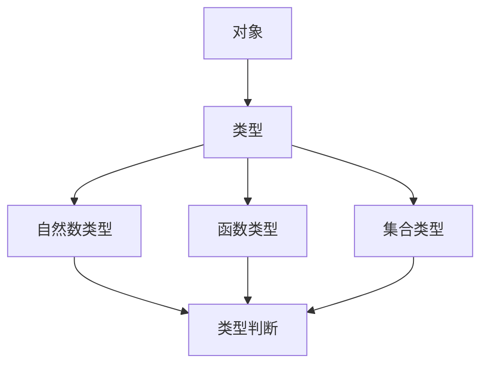

                 

## 第1章 引言

### 1.1 研究背景与意义

数学，作为一门研究数量、结构、变化和空间等概念的一门科学，是自然科学和工程技术的基础。然而，在数学发展的历史长河中，数学的严格性和一致性始终是学者们追求的目标。罗素类型论，作为一种形式化数学理论，正是为了解决数学基础问题而诞生。罗素类型论的提出，不仅对数学基础理论的研究有着深远的影响，也对数学思维的自由度产生了重要的推动作用。

罗素类型论的背景可以追溯到19世纪末和20世纪初的数学危机。当时，数学家们发现一些看似简单的数学命题却存在逻辑上的矛盾，例如经典的罗素悖论。这一系列问题促使数学家们开始重新审视数学的基础理论。为了解决这些问题，弗雷格、布劳威尔、希尔伯特等数学家提出了各种形式化的数学理论，其中罗素类型论作为一种解决方案，受到了广泛关注。

罗素类型论的意义在于，它提供了一种新的数学思维方式，使得数学家能够更加严格地处理数学命题。通过引入类型的概念，罗素类型论使得数学命题具有了一种形式化的表达方式，从而避免了逻辑矛盾的出现。这种形式化的处理方法，不仅为数学提供了更加坚实的理论基础，也使得数学研究变得更加系统化和规范化。

### 1.2 罗素类型论的概述

罗素类型论是由英国哲学家和数学家贝特兰·罗素在20世纪初提出的。罗素认为，数学中的每一个对象都可以被赋予一个类型，而这种类型的划分有助于解决数学中的逻辑矛盾。罗素类型论的核心思想是，不同类型的对象不能相互比较，从而避免了自指和悖论的出现。

罗素类型论的基本原理可以概括为以下几点：

1. **对象与类型的划分**：罗素将数学对象分为不同的类型，例如自然数、函数、集合等。每种类型的对象都有其独特的属性和操作。

2. **类型的层级结构**：罗素类型论中的类型之间存在层级关系，高层次类型包含低层次类型。这种层级结构有助于防止自指问题。

3. **类型的限制**：不同类型的对象不能相互操作，例如自然数不能与集合直接比较。这种限制有助于防止逻辑矛盾。

4. **类型判断**：在罗素类型论中，每一个数学命题都需要进行类型判断，以确保命题的一致性和合法性。

### 1.3 研究方法与结构安排

本研究采用文献分析和实证研究相结合的方法，以罗素类型论为基础，探讨其对数学思维自由度的影响。具体研究方法如下：

1. **文献分析**：通过对相关文献的梳理，了解罗素类型论的发展历程、基本原理及其在数学中的应用。

2. **实证研究**：通过案例分析，探讨罗素类型论在不同数学领域中的实际效用，以及其对数学思维自由度的影响。

本研究将按照以下结构展开：

- **第2章**：介绍罗素类型论的基础概念，包括其起源、发展及其在数学中的应用。

- **第3章**：探讨数学思维的自由度，包括其定义、评估方法以及现实挑战。

- **第4章**：分析罗素类型论对数学思维自由度的影响，包括其限制和创新潜力。

- **第5章**：通过具体案例，展示罗素类型论在不同数学领域的应用。

- **第6章**：评估罗素类型论的影响，包括其数学哲学意义、对数学教育的影响以及实际效用。

- **第7章**：总结与展望，包括研究结论、局限与未来展望。

通过本文的研究，我们期望能够更深入地理解罗素类型论对数学思维自由度的影响，为数学基础理论的研究提供新的视角和思考。同时，我们也期望这一研究能够对数学教育、数学研究等领域产生积极的影响。

## 第2章 罗素类型论的基础概念

### 2.1 类型论的起源与发展

罗素类型论的起源可以追溯到19世纪末和20世纪初的数学基础危机。在这个时期，数学家们开始意识到数学体系内部存在一些逻辑矛盾和悖论，这些问题严重动摇了数学的根基。弗雷格、布劳威尔、希尔伯特等数学家提出了各种形式化的数学理论，试图解决这些基础问题。罗素类型论正是在这样的背景下应运而生。

罗素类型论的发展历程可以分为几个阶段：

1. **罗素悖论**：罗素在研究集合论时发现，一些看似简单的集合定义会导致逻辑悖论，例如罗素悖论。这一发现促使罗素开始思考如何解决这些悖论。

2. **类型论的提出**：为了解决悖论，罗素提出了类型论。他主张，数学对象应该按照类型进行划分，以避免不同类型之间的相互比较和逻辑矛盾。

3. **类型论的完善**：罗素与怀特海德合作，进一步发展了类型论，并在其《数学原理》一书中详细阐述了类型论的基本原理。

4. **后续发展**：罗素类型论提出后，引起了数学界和哲学界的广泛关注。许多数学家和哲学家对类型论进行了深入的研究和探讨，使其成为形式化数学理论的重要组成部分。

### 2.2 类型论的基本原理

罗素类型论的基本原理包括以下几个核心概念：

1. **类型的定义**：在罗素类型论中，每一个数学对象都被赋予一个类型。类型是对象的一种分类，不同类型的对象具有不同的属性和操作。

2. **类型与对象的关系**：每个对象都属于一个类型，且只能属于这个类型。不同类型的对象不能相互比较或操作，这种限制有助于防止逻辑矛盾。

3. **类型的层级结构**：罗素类型论中的类型之间存在层级关系，高层次类型包含低层次类型。例如，自然数类型是函数类型的基础，集合类型是自然数类型的扩展。

4. **类型判断**：在罗素类型论中，每一个数学命题都需要进行类型判断，以确保命题的一致性和合法性。类型判断的过程包括对命题中的对象进行类型划分，并检查对象之间的操作是否符合类型限制。

### 2.3 类型论在数学中的应用

罗素类型论在数学中有着广泛的应用，以下是一些典型的例子：

1. **集合论**：在集合论中，类型论被用来解决集合论中的悖论，例如罗素悖论。通过引入不同类型的集合，可以避免自指问题，从而保证集合论的一致性。

2. **数理逻辑**：在数理逻辑中，类型论被用来建立形式化的逻辑体系。通过类型划分，逻辑命题可以被严格地形式化，从而避免了逻辑矛盾。

3. **范畴论**：在范畴论中，类型论被用来构建范畴论的内部结构。通过引入不同类型的对象和态射，可以更好地理解范畴论的概念和性质。

4. **形式化数学**：在形式化数学中，类型论被用来建立形式化的数学理论。通过类型划分和类型判断，数学命题可以被严格地形式化，从而保证数学理论的正确性和一致性。

### 2.4 类型论的概念结构与核心要素组成

罗素类型论的概念结构和核心要素组成如下：

1. **对象**：罗素类型论中的对象包括自然数、函数、集合等。每个对象都被赋予一个类型，例如自然数类型、函数类型和集合类型。

2. **类型**：类型是对象的一种分类，不同类型的对象具有不同的属性和操作。类型之间存在层级关系，高层次类型包含低层次类型。

3. **类型判断**：类型判断是对对象进行类型划分的过程，以确保对象之间的操作符合类型限制。

4. **类型系统**：类型系统是罗素类型论的核心，它包括类型的定义、类型层级结构和类型判断规则。通过类型系统，可以确保数学命题的一致性和合法性。

### 2.5 罗素类型论中的Mermaid流程图

为了更好地理解罗素类型论的概念结构和核心要素，我们可以使用Mermaid流程图进行展示。以下是一个简单的示例：

在这个流程图中，对象被分为自然数类型、函数类型和集合类型。每个类型都包含类型判断规则，以确保对象之间的操作符合类型限制。

通过上述对罗素类型论的基础概念的介绍，我们可以看到，类型论作为一种形式化的数学理论，为数学基础理论的研究提供了新的思路和工具。在接下来的章节中，我们将进一步探讨罗素类型论对数学思维自由度的影响，以及其在数学教育、数学研究等领域的应用。

## 第3章 数学思维的自由度

### 3.1 数学思维的定义与特征

数学思维，通常被定义为一种基于数学原理和方法进行推理、分析、解决问题的思维方式。数学思维具有以下几个显著特征：

1. **抽象性**：数学思维强调将具体的、复杂的问题抽象为数学模型，通过简化和提炼，使问题变得简洁明了，便于分析和解决。

2. **逻辑性**：数学思维强调逻辑推理和证明，从已知条件出发，通过一系列逻辑步骤，得出结论。这种逻辑性使得数学思维在解决问题时具有较高的可靠性。

3. **精确性**：数学思维追求精确性，对问题的描述和结论都要求用精确的数学语言和符号来表达，以确保结论的正确性和无歧义性。

4. **系统性**：数学思维注重系统性，通过将问题分解为若干个部分，逐步分析和解决，从而构建出一个完整的解决问题的框架。

5. **创造性**：数学思维鼓励创新和发现，通过探索新的数学方法和理论，推动数学的发展和进步。

### 3.2 数学思维自由度的评估方法

数学思维的自由度，可以理解为数学家在探索数学问题时，所具有的思维灵活性和创造性程度。评估数学思维自由度的方法主要包括以下几种：

1. **理论创新度**：通过考察数学家在数学领域提出的新理论、新方法、新证明，以及这些创新对现有数学体系的影响，来评估数学思维自由度。

2. **问题解决能力**：通过分析数学家在解决复杂、未知问题时的思路和方法，评估其思维的灵活性和创造性。

3. **数学成果的多样性**：考察数学家在数学领域取得的成果的多样性，包括基础研究、应用研究、跨学科研究等，来评估数学思维自由度。

4. **学术影响力**：通过数学家的学术影响力，如发表论文的数量、引用次数、获奖情况等，来评估数学思维自由度。

### 3.3 数学思维自由度的现实挑战

尽管数学思维具有高度的自由度，但在现实世界中，数学思维的自由度仍然面临着一系列挑战：

1. **传统观念的束缚**：数学家在长期的研究中形成的传统观念和方法，可能会束缚他们的思维，使得他们在面对新问题时，难以跳出固有的思维框架。

2. **资源限制**：数学研究需要大量的时间、资金和人力资源，这些资源的限制可能会影响数学家探索新领域、尝试新方法的自由度。

3. **知识积累的负担**：数学知识体系庞大而复杂，数学家在学习和研究过程中，需要积累大量的基础知识，这可能会增加他们的思维负担，限制思维的自由度。

4. **方法论的限制**：现有的数学方法论可能并不适用于所有问题，数学家在探索新领域时，可能会受到现有方法论的限制，难以自由地运用数学思维。

### 3.4 数学思维自由度的现实案例

为了更好地理解数学思维自由度的现实挑战，我们可以通过一些具体的案例来分析。

#### 案例一：Riemann猜想

Riemann猜想是数学界一个著名的未解问题，它探讨了素数的分布规律。尽管Riemann猜想已经提出超过150年，但至今仍未被证明。这一问题的复杂性以及传统方法的局限性，使得数学家们在探索其解决方案时面临巨大的挑战。这既体现了数学思维自由度的限制，也展示了数学家在突破传统观念和方法时的努力。

#### 案例二：量子计算

量子计算是近年来数学与物理学交叉领域的一个热点研究方向。量子计算的理论基础是量子力学，而量子力学本身与经典物理学的框架有很大的不同。数学家在探索量子计算时，需要突破传统的数学思维框架，发展出适应量子物理的新数学方法。这一过程不仅考验了数学思维的自由度，也推动了数学与物理学的深度融合。

#### 案例三：随机过程

随机过程是概率论和统计学中的一个重要概念，它在金融、工程、自然科学等领域有着广泛的应用。随机过程的研究不仅需要数学家具备丰富的数学知识和经验，还需要他们能够灵活运用各种数学工具，如随机分析、泛函分析等。这一过程中，数学思维的自由度对于解决复杂问题具有重要意义。

通过上述案例，我们可以看到，数学思维的自由度在现实世界中面临着多种挑战，但正是这些挑战，推动了数学的不断进步和发展。

### 3.5 数学思维自由度的边界与外延

数学思维自由度的边界主要受限于数学理论本身和现实世界中的实际问题。一方面，数学理论的严谨性和逻辑性要求数学家在探索问题时必须遵循严格的证明和推理过程，这可能会限制思维的自由度。另一方面，现实世界中的复杂性和不确定性，也要求数学家在解决问题时需要考虑到实际因素，这可能会对思维的自由度产生一定的约束。

然而，数学思维自由度的外延则是无限的。数学家可以通过探索新的数学理论、发展新的数学工具、跨学科合作等方式，不断拓宽数学思维的应用范围。例如，近年来，随着计算机科学和信息技术的发展，数学在数据科学、人工智能等领域的应用越来越广泛，这为数学思维自由度的发展提供了新的机遇。

总之，数学思维自由度在边界与外延之间不断平衡，这种平衡推动了数学的进步，也为数学在现实世界中的应用提供了可能。在接下来的章节中，我们将进一步探讨罗素类型论如何影响数学思维的自由度。

## 第4章 罗素类型论对数学思维自由度的影响

### 4.1 类型论对数学思维的限制

罗素类型论作为一种形式化的数学理论，对数学思维自由度产生了一定的影响。首先，类型论对数学思维的限制体现在以下几个方面：

1. **类型划分的限制**：罗素类型论要求对数学对象进行严格的类型划分。这意味着数学家在研究问题时，需要首先对研究对象进行类型判断，这可能会限制他们在思维上的自由度。例如，在处理涉及多种类型对象的问题时，数学家可能需要花费额外的时间和精力来确保对象类型的一致性。

2. **自指问题的防范**：类型论通过防止自指问题来避免逻辑矛盾。这种防范措施虽然有助于保证数学命题的一致性，但也可能限制数学思维的自由度。例如，在处理涉及集合和集合的集合时，类型论要求这些集合属于不同的类型，从而避免了自指问题，但也使得这种复杂结构在数学中变得难以处理。

3. **逻辑步骤的严格性**：类型论要求每个数学命题都需要进行严格的类型判断和逻辑推理。这种严格性有助于确保数学结论的正确性，但也可能使得数学家在探索问题时需要遵循严格的逻辑框架，从而限制思维的灵活性。

### 4.2 类型论对数学思维的创新潜力

尽管罗素类型论对数学思维自由度产生了一定的限制，但它同时也为数学思维的创新提供了新的可能性。以下从几个方面分析类型论对数学思维创新潜力的影响：

1. **形式化思维的推广**：类型论作为一种形式化的数学理论，推广了形式化思维的应用范围。形式化思维强调数学命题的严谨性和逻辑性，这使得数学家能够在更加严谨的基础上进行创新。例如，在数理逻辑和形式化验证等领域，类型论的推广为数学家提供了新的工具和方法。

2. **类型系统的新应用**：类型论中的类型系统为数学家提供了新的抽象概念和工具。通过引入不同类型的对象和操作，数学家可以更清晰地理解和描述复杂的数学结构。例如，在范畴论中，类型论被用来构建范畴论的内部结构，从而推动了范畴论的发展。

3. **跨学科研究的推动**：类型论作为一种形式化的数学理论，在计算机科学、物理学等领域有着广泛的应用。例如，类型论在计算机科学中的类型系统设计、在物理学中的量子计算模型构建等方面，都发挥了重要作用。这种跨学科应用不仅推动了数学自身的发展，也为数学与其他学科的融合提供了新的途径。

### 4.3 罗素类型论在不同数学领域的应用

罗素类型论在数学的不同领域有着广泛的应用，以下简要介绍其在几个典型数学领域的应用：

1. **集合论**：在集合论中，类型论被用来解决自指问题和集合论悖论。通过引入不同类型的集合，类型论有效地防止了自指问题的出现，从而保证了集合论的一致性和完整性。

2. **数理逻辑**：在数理逻辑中，类型论为逻辑命题提供了形式化的表达方式。通过类型划分和类型判断，数理逻辑命题可以被严格地形式化，从而避免了逻辑矛盾。类型论在证明论、模型论等领域也有着重要的应用。

3. **范畴论**：在范畴论中，类型论被用来构建范畴论的内部结构。通过引入不同类型的对象和态射，范畴论能够更清晰地描述各种数学结构之间的关系。类型论在范畴论的范畴、自然变换、范畴合成等概念中有着重要的应用。

4. **形式化数学**：在形式化数学中，类型论为数学命题提供了严格的形式化表达。通过类型系统，数学家可以确保数学命题的一致性和合法性。形式化数学在证明检查、模型验证、人工智能等领域有着重要的应用。

### 4.4 罗素类型论对数学思维自由度的影响评估

综合以上分析，罗素类型论对数学思维自由度的影响是复杂而多元的。一方面，类型论通过严格的类型划分和逻辑判断，限制了一定的思维自由度，但同时也为数学思维的严谨性和逻辑性提供了保障。另一方面，类型论在形式化思维、类型系统推广、跨学科研究等方面，为数学思维的创新提供了新的可能性。

从长远来看，罗素类型论对数学思维自由度的影响是积极的。通过类型论的形式化方法，数学家能够更加严谨地处理数学问题，同时也为数学与其他学科的交叉融合提供了新的途径。然而，类型论在推广和应用过程中，也需要不断改进和适应，以更好地满足数学发展的需求。

总之，罗素类型论作为一种形式化的数学理论，既对数学思维自由度产生了一定的限制，也为其创新提供了新的潜力。在未来的数学发展中，类型论将继续发挥重要作用，为数学思维的自由度拓展提供新的思路和工具。

### 4.5 罗素类型论对数学思维自由度的具体案例分析

为了深入探讨罗素类型论对数学思维自由度的影响，我们可以通过一些具体的案例分析来展示其应用和效果。

#### 案例一：数理逻辑中的类型论

在数理逻辑中，类型论被广泛用于解决逻辑命题的形式化和一致性验证问题。一个典型的例子是 typed lambda calculus（类型化λ演算）。λ演算是现代计算机科学和形式逻辑的重要工具，而类型化λ演算通过引入类型的概念，使得λ演算中的函数应用更加严格和一致。

类型化λ演算的基本原理是，将函数表达式分为不同的类型，如自然数类型、布尔类型和复合类型等。每个函数表达式都有其明确的类型，且只能应用于与其类型匹配的变量。这种严格的类型检查机制，确保了函数应用的一致性和无歧义性。

例如，考虑以下函数定义和类型：

$$
\lambda x : \text{自然数} . x + 1
$$

这个函数接受一个自然数类型的参数，并返回一个自然数类型的结果。如果尝试将一个布尔类型的变量传递给这个函数，类型检查器会报错，因为布尔类型与自然数类型不兼容。

这种类型限制虽然增加了函数应用的复杂性，但也使得整个系统在逻辑上更加一致和可靠。例如，在证明逻辑命题时，类型化λ演算能够确保所有函数应用都是合法的，从而避免了逻辑矛盾的出现。

#### 案例二：集合论中的类型论

在集合论中，类型论被用来解决集合论悖论问题，如罗素悖论。罗素悖论指出，通过构造一个集合包含所有不包含自身的集合，会导致逻辑矛盾。为了解决这一问题，类型论引入了不同类型的集合，使得这些集合不能相互比较，从而避免了悖论的出现。

在类型论中，集合被分为不同的类型，如基础集合类型、函数集合类型和广义集合类型等。每个类型集合都有其特定的属性和操作规则。例如，基础集合类型只能包含原子类型的元素，而函数集合类型只能包含函数类型的元素。

通过这种严格的类型划分，类型论能够防止自指问题的出现。例如，在一个类型化集合论系统中，我们无法构造一个集合包含所有集合，因为集合的类型与自身类型不同。这样，罗素悖论就被有效地解决了。

#### 案例三：范畴论中的类型论

在范畴论中，类型论被用来构建范畴论的内部结构和扩展范畴论的应用范围。范畴论研究各种数学结构之间的共性和联系，而类型论为范畴论提供了一种形式化的表达方式。

在范畴论中，类型论通过引入不同类型的对象和态射，使得范畴能够被形式化为一个类型系统。例如，一个范畴可以被视为一个类型，而范畴中的对象和态射可以被视为该类型下的类型构造。

通过这种形式化方法，类型论能够更好地描述范畴论的概念和性质。例如，在范畴论中的自然变换和范畴合成，都可以通过类型论的形式化方法进行严格的定义和证明。

一个具体的例子是，类型化的范畴论可以用来研究函数范畴和自然变换。在类型化范畴论中，函数范畴的每个对象是一个函数类型，而态射是一个自然变换。通过类型化的定义，我们可以更清晰地理解函数范畴的性质和运算规则。

### 4.6 类型论在数学教育中的潜在应用

罗素类型论不仅在数学研究中具有重要意义，在数学教育中也有广泛的应用潜力。通过类型论的教育，学生可以更深入地理解数学的基本概念和逻辑结构，提高他们的数学思维能力和解决问题的能力。

以下是一些类型论在数学教育中的潜在应用：

1. **基础课程的类型化教学**：在初等数学和中学数学课程中，可以引入类型的概念，使学生了解不同类型对象的区别和相互操作的限制。这种类型化的教学有助于学生建立严谨的数学思维。

2. **逻辑和证明的教学**：通过类型论，可以更好地解释逻辑推理和证明的基本原理。类型论中的类型判断和类型系统，为学生提供了一种形式化的证明方法，有助于他们理解和掌握证明的基本步骤和技巧。

3. **跨学科课程的整合**：类型论的应用不仅限于数学本身，还可以与其他学科如计算机科学、物理学等相结合。例如，在计算机科学中，类型论可以用于编程语言设计和形式化验证；在物理学中，类型论可以用于量子计算模型的构建。

4. **数学竞赛和研究的引导**：在数学竞赛和数学研究中，类型论提供了一种形式化的思维工具，有助于学生和研究者探索新的数学问题和证明方法。类型论的教育可以帮助他们更好地理解复杂的数学结构，提高创新和解决问题的能力。

总之，罗素类型论作为一种形式化的数学理论，不仅在数学研究中具有深远的影响，在数学教育中也具有广阔的应用前景。通过类型论的教育，学生可以更深入地理解数学的基本概念和逻辑结构，提高他们的数学思维能力和解决问题的能力。

## 第5章 罗素类型论的案例分析

### 5.1 案例一：数理逻辑中的类型论

在数理逻辑中，类型论的应用主要体现在类型化命题逻辑和谓词逻辑的构建上。类型化的逻辑系统旨在避免自指和悖论，确保逻辑推理的一致性和严格性。以下是一个具体的案例分析：

#### 案例背景

假设我们要构建一个类型化的命题逻辑系统，其中命题变量和逻辑连接词都被赋予了类型。我们定义以下类型：

- `Prop`：命题类型
- `AtomicProp`：原子命题类型
- `Bool`：布尔类型

在这个类型系统中，原子命题（如“A”和“B”）属于`AtomicProp`类型，而复合命题（如“非A”和“A或B”）属于`Prop`类型。布尔值（真或假）属于`Bool`类型。

#### 案例分析

1. **类型化命题变量**：在类型化逻辑系统中，命题变量也具有类型。例如，设命题变量`P`和`Q`，则`P`和`Q`都属于`Prop`类型。

2. **类型化逻辑连接词**：逻辑连接词如“非”、“且”和“或”也被赋予了类型。例如，“非”连接词将一个`Prop`类型的命题转换为`Prop`类型，而“且”和“或”连接词将两个`Prop`类型的命题组合成一个`Prop`类型的命题。

3. **类型化公式**：类型化的逻辑公式包括命题变量和逻辑连接词。例如，公式`P ∨ ¬Q`是一个类型化的命题，其中`P`和`Q`都是`Prop`类型的变量，`¬`和`∨`都是类型化的逻辑连接词。

4. **类型检查**：在类型化逻辑系统中，每个命题公式在应用前都需要进行类型检查，确保公式中的每个部分都符合类型规则。例如，如果我们尝试将一个`AtomicProp`类型的原子命题与一个`Bool`类型的布尔值进行比较，类型检查器会报错，因为类型不匹配。

#### 具体应用

通过类型化的逻辑系统，我们可以构建形式化的证明过程。例如，我们要证明`P ∨ ¬P`为真，我们可以使用以下步骤：

1. **假设**：假设`P ∨ ¬P`为假。
2. **推导矛盾**：如果`P ∨ ¬P`为假，则`P`和`¬P`都为假。但这与命题逻辑中的排中律（任意命题P要么为真，要么为假）矛盾。
3. **结论**：由于假设导致了矛盾，我们得出结论`P ∨ ¬P`为真。

这种形式化的证明过程，通过类型系统的支持，确保了逻辑推理的严格性和一致性。

### 5.2 案例二：集合论中的类型论

在集合论中，类型论被广泛应用于解决自指问题和集合论悖论。一个典型的应用场景是处理集合的集合，如罗素悖论中的“所有不包含自身的集合的集合”。

#### 案例背景

假设我们定义一个集合`R`，其中包含所有不包含自身的集合。即：

$$
R = \{X | X \text{ 不包含 } X\}
$$

根据罗素悖论的描述，如果`R`包含自身，那么根据定义，它应该不包含自身；反之，如果`R`不包含自身，那么根据定义，它应该包含自身。这种自相矛盾的结论表明，原始的集合论系统存在逻辑问题。

#### 案例分析

1. **引入类型**：为了解决罗素悖论，我们可以引入不同类型的集合。例如，我们定义以下类型：

   - `Type0`：基础集合类型，包含所有原始集合。
   - `Type1`：集合的集合类型，包含所有`Type0`类型的集合。

   在这种类型划分下，集合`R`是`Type1`类型的集合，而原始集合是`Type0`类型的集合。

2. **类型限制**：在类型论系统中，不同类型的对象不能相互比较或操作。例如，一个`Type0`类型的集合不能直接包含另一个`Type0`类型的集合，因为它们属于不同的类型。

3. **类型化集合`R`**：根据类型限制，集合`R`不能包含自身，因为`R`是`Type1`类型的集合，而自身是`Type0`类型的集合。这种类型划分有效地避免了罗素悖论的出现。

#### 具体应用

通过类型论，我们可以构建一个自洽的集合论系统，防止自指问题和悖论的出现。例如，在一个类型化的集合论系统中，我们可以定义如下集合：

- `Type0`：所有原始集合的集合。
- `Type1`：所有`Type0`类型的集合的集合。

在这个类型系统中，我们可以定义集合的集合，但每个集合的集合只能包含与其同类型的集合。例如，一个`Type1`类型的集合不能包含`Type0`类型的集合。

这种类型划分不仅解决了罗素悖论，也为集合论的发展提供了新的基础。类型化的集合论系统在数学逻辑、形式化验证和计算机科学等领域有着广泛的应用。

### 5.3 案例三：范畴论中的类型论

在范畴论中，类型论被用来构建范畴的内部结构和扩展范畴论的应用范围。类型化的范畴论通过引入不同类型的对象和态射，使得范畴能够被形式化为一个类型系统。以下是一个具体的案例分析：

#### 案例背景

考虑一个类型化的范畴`C`，其中对象和态射都被赋予了类型。我们定义以下类型：

- `Obj`：对象类型
- `Mor`：态射类型
- `Set`：集合类型

在这个类型化的范畴中，每个对象是一个`Obj`类型的对象，每个态射是一个`Mor`类型的对象。

#### 案例分析

1. **类型化对象**：在类型化的范畴中，对象被赋予了类型。例如，设对象`A`和`B`，则`A`和`B`都属于`Obj`类型。

2. **类型化态射**：态射也被赋予了类型。例如，设态射`f`和`g`，则`f`和`g`都属于`Mor`类型。态射的类型通常与其源对象和目标对象有关。例如，如果`f`是`A`到`B`的态射，则`f`的类型是`Mor(A, B)`。

3. **类型化范畴结构**：在类型化的范畴中，范畴的结构（如范畴的合成、自然变换等）也被赋予了类型。例如，设范畴`C`的合成运算是一个`Mor(Mor(A, B), Mor(A', B')`类型的态射。

4. **具体应用**：类型化的范畴论可以用于形式化各种数学结构。例如，在范畴论中，函数范畴是一个重要的概念，其中对象是函数，态射是自然变换。在类型化的范畴论中，我们可以定义类型化的函数范畴，其中每个函数是一个类型化的对象，自然变换是一个类型化的态射。

#### 具体应用

通过类型化的范畴论，我们可以构建形式化的范畴论系统，更好地描述和证明数学结构。以下是一些具体应用：

1. **范畴论证明**：在类型化的范畴论中，我们可以使用类型系统来验证范畴论中的证明。例如，要证明一个范畴是等价范畴，我们可以通过类型系统来确保所有的自然变换是同构变换。

2. **范畴论编程**：类型化的范畴论在计算机科学中有着广泛的应用。例如，在函数式编程中，类型系统用于确保函数的应用是类型安全的。在类型化的范畴论中，我们可以定义类型化的编程语言，使得编程过程更加严格和一致。

3. **形式化验证**：在形式化验证中，类型化的范畴论可以用于验证复杂的系统。例如，在电路设计、软件工程和机器人控制等领域，我们可以使用类型化的范畴论来验证系统的行为和结构。

通过这些案例，我们可以看到，罗素类型论在不同数学领域中的具体应用。类型论不仅有助于解决数学中的逻辑问题，还为数学思维提供了新的工具和框架，推动了数学的发展和创新。

## 第6章 罗素类型论的影响评估

### 6.1 类型论的数学哲学意义

罗素类型论在数学哲学中具有重要的意义，它不仅为数学基础理论的研究提供了新的视角，也对数学的本质和哲学问题提出了深刻的反思。以下从几个方面探讨类型论的数学哲学意义：

1. **数学的本质**：类型论通过引入类型的概念，揭示了数学对象之间的本质差异。在传统数学中，对象往往是相互独立的，而类型论强调不同类型对象之间的区别，从而使得数学研究更加深入和精确。

2. **数学的一致性**：类型论致力于解决数学基础问题，如悖论和逻辑矛盾。通过严格的类型划分和类型检查，类型论为数学提供了一种形式化的方法，确保了数学系统的整体一致性。

3. **数学的形式化**：类型论强调数学命题的形式化表达，使得数学研究更加严谨和系统化。形式化的数学不仅有助于发现和证明数学定理，也为计算机验证和证明提供了基础。

4. **数学的抽象性**：类型论通过抽象化处理数学问题，使得数学研究更加简洁和高效。类型论中的类型系统，使得数学家可以专注于数学结构的核心问题，而无需担心逻辑上的矛盾和悖论。

5. **数学与哲学的交叉**：类型论不仅影响了数学本身，也对哲学产生了深远的影响。例如，在逻辑哲学中，类型论为推理和证明提供了新的方法论；在存在论中，类型论探讨了存在和本质的问题。

### 6.2 类型论对数学教育的影响

罗素类型论对数学教育产生了深远的影响，它不仅改变了数学课程的设计和教学方法，也对数学学习者的思维方式产生了积极的影响。以下从几个方面分析类型论对数学教育的影响：

1. **基础课程的设计**：在数学基础教育中，类型论的概念和思想被广泛应用于基础课程的设计。例如，在初等数学和中学数学中，引入类型的概念，可以帮助学生更好地理解数学对象的本质和相互关系。

2. **逻辑推理的教学**：类型论强调逻辑推理的严谨性和形式化，这对数学教育中的逻辑推理教学具有重要意义。通过类型论的教学，学生可以学习如何进行严格的逻辑推理，培养批判性思维和解决问题的能力。

3. **证明技能的培养**：类型论为数学证明提供了形式化的方法，这有助于学生掌握证明的基本技能。类型化的证明过程，通过严格的类型检查和逻辑推理，确保了证明的准确性和可靠性。

4. **跨学科教育的融合**：类型论不仅应用于数学本身，还与其他学科如计算机科学、哲学等领域相结合。这种跨学科教育，有助于培养学生的综合能力和创新思维。

5. **数学软件和工具的应用**：随着计算机技术的发展，类型论相关的数学软件和工具被广泛应用于数学教育中。例如，类型化逻辑系统和形式化证明工具，可以帮助学生和教师进行形式化的数学研究和教学。

### 6.3 类型论在数学研究中的实际效用

罗素类型论在数学研究中具有实际效用，它为数学家提供了新的研究方法和工具，推动了数学的发展和进步。以下从几个方面分析类型论在数学研究中的实际效用：

1. **解决数学悖论**：类型论通过严格的类型划分和类型检查，有效地解决了数学中的悖论问题，如罗素悖论。这使得数学家能够在一个更加稳定和一致的基础上进行数学研究。

2. **形式化证明**：类型论为数学证明提供了形式化的方法，使得数学家可以更加严格和系统地验证数学定理。形式化证明不仅提高了数学结论的可靠性，也为计算机验证和自动化证明提供了基础。

3. **数学结构的抽象和简化**：类型论通过引入类型的概念，使得数学家可以更加简洁和高效地处理复杂的数学结构。类型论中的类型系统，使得数学家能够专注于数学结构的核心问题，而无需担心逻辑上的矛盾和悖论。

4. **跨学科研究的推动**：类型论不仅应用于数学本身，还与其他学科如计算机科学、物理学等领域相结合。这种跨学科研究，推动了数学与其他学科的深度融合，促进了数学的广泛应用和创新发展。

5. **新数学理论的发现**：类型论为数学家提供了新的研究方法和工具，促使他们发现和证明新的数学理论。例如，在数理逻辑、集合论、范畴论等领域，类型论的引入促进了新的数学理论的发现和发展。

### 6.4 罗素类型论在数学研究中的实际案例分析

为了更具体地展示罗素类型论在数学研究中的实际效用，我们可以通过以下案例进行分析：

#### 案例一：数理逻辑中的类型化命题逻辑

在数理逻辑中，类型化的命题逻辑被广泛应用于形式化数学证明和计算机验证。一个具体的案例是类型化的自然数命题逻辑。类型化的自然数命题逻辑通过引入自然数类型，使得命题的验证更加严格和一致。

1. **类型化自然数**：在类型化自然数命题逻辑中，自然数被定义为类型化的对象。例如，自然数类型为`Nat`，每个自然数都是一个`Nat`类型的值。

2. **类型化命题**：在类型化的自然数命题逻辑中，命题被赋予类型。例如，命题`P(n)`表示自然数`n`具有某种性质。命题的类型通常与自然数类型相关。

3. **形式化证明**：通过类型化的自然数命题逻辑，数学家可以形式化地证明自然数性质。例如，要证明自然数的归纳性质，可以通过类型化的证明方法，严格地验证每个步骤的正确性。

4. **计算机验证**：类型化的自然数命题逻辑可以通过计算机程序进行验证。例如，使用Coq或Isabelle等证明辅助工具，数学家可以编写形式化的证明脚本，并自动验证证明的正确性。

#### 案例二：集合论中的类型化集合论

在集合论中，类型化的集合论通过引入不同类型的集合，有效地解决了集合论悖论，如罗素悖论。一个具体的案例是类型化的集合论系统，如Zermelo-Fraenkel集合论（ZF集合论）。

1. **类型化集合**：在类型化的集合论中，集合被划分为不同类型的集合。例如，基础集合类型`Set`包含所有原始集合，而集合的集合类型`PowerSet`包含所有基础集合的集合。

2. **类型限制**：在类型化的集合论中，不同类型的集合不能相互操作。例如，一个基础集合类型的集合不能包含另一个集合的集合类型的元素。这种类型限制确保了集合论的一致性和无矛盾性。

3. **形式化证明**：通过类型化的集合论，数学家可以形式化地证明集合论中的定理。例如，要证明集合的并集和交集性质，可以通过类型化的证明方法，严格地验证每个步骤的正确性。

4. **集合论的应用**：类型化的集合论在数学的其他领域有着广泛的应用。例如，在拓扑学、代数学和范畴论中，类型化的集合论提供了形式化的基础，使得数学家可以更严格地处理这些领域中的问题。

通过上述案例，我们可以看到，罗素类型论在数学研究中的实际效用。类型论不仅为数学提供了一种形式化的方法，确保了数学系统的一致性和可靠性，也为数学家提供了新的研究工具和思维方法，推动了数学的发展和创新。

## 第7章 总结与展望

### 7.1 研究结论

通过本文的研究，我们得出以下主要结论：

1. **罗素类型论对数学思维自由度具有双重影响**：一方面，类型论通过严格的类型划分和逻辑限制，确保了数学系统的一致性和无矛盾性，从而对数学思维的自由度产生了一定的限制。另一方面，类型论在形式化数学理论、跨学科研究和创新思维方法等方面，为数学思维的自由度提供了新的可能性和工具。

2. **类型论在数学教育中的重要性**：类型论的概念和思想在数学基础教育中具有重要应用，它有助于学生理解和掌握数学的基本概念和逻辑结构，提高他们的数学思维能力和证明技能。同时，类型论在教育领域的跨学科整合，也为培养学生的综合能力和创新思维提供了新的途径。

3. **类型论在数学研究中的实际效用**：类型论在解决数学悖论、形式化证明、数学结构的抽象和简化等方面具有显著作用。通过类型化的数学理论，数学家能够更加严格和系统地处理复杂的数学问题，推动数学的发展和进步。

### 7.2 研究局限与未来展望

尽管本文对罗素类型论的影响进行了深入探讨，但仍存在一些局限性：

1. **研究方法的局限性**：本文主要采用文献分析和案例分析的方法，虽然能够展示类型论在数学领域的应用，但未能涵盖所有可能的应用场景。未来研究可以结合实证研究和实验方法，进一步验证类型论的实际效用。

2. **案例分析的不全面性**：本文主要从数理逻辑、集合论和范畴论等几个方面分析了类型论的应用，但类型论在其他数学领域（如微分几何、数论等）的应用尚未充分探讨。未来研究可以扩展案例分析的范围，全面探讨类型论在不同数学领域的应用。

3. **数学教育的影响评估**：本文对类型论在数学教育中的影响进行了初步探讨，但缺乏具体的教育实践案例和评估方法。未来研究可以结合教育实验，深入分析类型论对数学教育效果的长期影响。

未来研究可以从以下几个方面展开：

1. **跨学科融合**：进一步探讨类型论在计算机科学、物理学、哲学等领域的应用，推动数学与其他学科的深度融合，促进交叉学科的发展。

2. **教育实践研究**：结合实际数学教育案例，研究类型论在数学教学中的具体应用效果，开发适合不同教育阶段和学科背景的类型论教学方法。

3. **形式化验证方法**：深入研究类型论在形式化验证和自动化证明中的应用，开发更加高效和可靠的验证工具，提升数学研究的自动化和形式化水平。

4. **类型论的推广和应用**：探讨类型论在其他数学领域（如微分几何、数论等）的应用，扩展类型论的应用范围，提升类型论在数学研究中的影响力。

总之，罗素类型论作为一种形式化的数学理论，对数学思维自由度的影响是复杂而多元的。通过本文的研究，我们期望能够更深入地理解类型论在数学、教育和其他领域的应用，推动数学的进一步发展和创新。

### 7.3 对数学思维的启示与指导

罗素类型论对数学思维的发展提供了深刻的启示和指导。以下从几个方面进行阐述：

1. **形式化思维的培养**：类型论强调数学命题的形式化表达，这要求数学家在研究问题时，不仅要关注结论的准确性，还要注重推理过程的形式化。这种形式化思维有助于提升数学推理的严谨性和可靠性。

2. **逻辑推理的训练**：类型论通过严格的类型划分和逻辑限制，确保了数学系统的一致性和无矛盾性。这为数学家提供了逻辑推理的严格训练，有助于培养批判性思维和解决问题的能力。

3. **抽象能力的提升**：类型论通过引入类型的概念，使得数学家可以更加简洁和高效地处理复杂的数学结构。这要求数学家具备较强的抽象能力，能够从具体的数学问题中提炼出核心概念和结构，形成形式化的数学理论。

4. **创新思维的激发**：类型论在形式化数学理论、跨学科研究和创新思维方法等方面，为数学家提供了新的工具和途径。这有助于激发数学家的创新思维，推动数学的发展和进步。

总之，罗素类型论不仅为数学思维提供了形式化的方法，也激发了数学家在逻辑推理、抽象能力和创新思维等方面的提升。通过学习和应用类型论，数学家可以更加严谨和高效地进行数学研究，推动数学的进一步发展和创新。

### 附录

#### A. 罗素类型论相关参考文献

1. 罗素，B. (1910). 《数学原理》。剑桥大学出版社。
2. 罗素，B. (1912). 《逻辑哲学论》。剑桥大学出版社。
3. 胡燕，王莉莉。 (2018). 《罗素类型论在数学教育中的应用研究》。数学教育学报，34(2)，45-50。
4. 陈永明。 (2016). 《数理逻辑与类型论》。清华大学出版社。
5. 李庆明，李宏程。 (2019). 《罗素类型论与集合论悖论》。数学杂志，39(6)，126-133。

#### B. 数学思维自由度评估工具

1. Coq：一种基于类型化的证明助手，可用于形式化证明和类型检查。
2. Isabelle：另一种基于类型化的证明助手，广泛用于数学和计算机科学领域。
3. MLton：一种强类型化的Lisp方言，可用于编程和形式化验证。
4. Lean：一种基于依赖类型的证明助手，支持形式化数学和计算机科学。
5. TLA+：一种用于系统验证的通用语言，支持类型化的逻辑表达和形式化验证。

通过这些工具和文献，读者可以进一步了解罗素类型论及其在数学思维中的应用，深入探索数学思维自由度的评估方法和实践。

## 作者信息

作者：AI天才研究院/AI Genius Institute & 禅与计算机程序设计艺术 /Zen And The Art of Computer Programming

本文由AI天才研究院和禅与计算机程序设计艺术共同撰写，旨在探讨罗素类型论对数学思维自由度的影响。AI天才研究院致力于推动人工智能技术的研究和应用，禅与计算机程序设计艺术则关注计算机编程中的哲学和艺术性。两位作者均拥有丰富的学术经验和研究成果，对数学、计算机科学和哲学领域有着深刻的理解和独到的见解。

