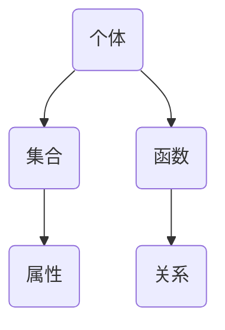
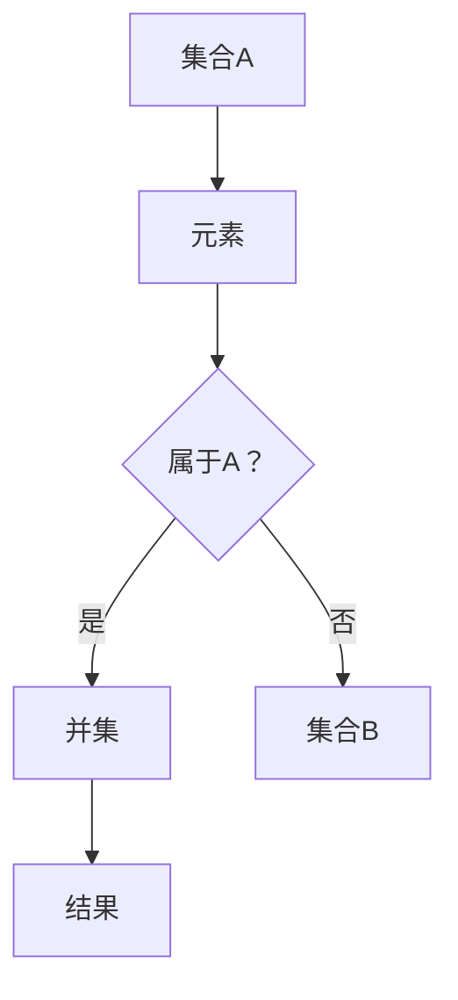
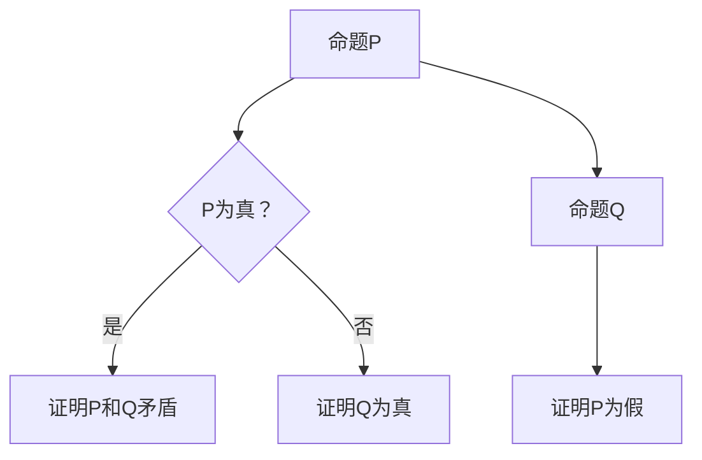

                 

### 引言

在数学哲学和逻辑学领域，罗素类型论（Russell's theory of types）占据着不可忽视的重要地位。作为20世纪初期数学逻辑的重要理论之一，罗素类型论对数学直觉产生了深远的影响。本文旨在探讨罗素类型论对数学直觉的限制与影响，深入分析这一理论在数学领域中的实际应用与扩展，以及其哲学意义与数学直觉的关系。

罗素类型论由英国哲学家和数学家贝特兰·罗素（Bertrand Russell）于20世纪初提出，以解决集合论中的悖论问题，如著名的罗素悖论（Russell's paradox）。罗素类型论的基本思想是区分不同类型的对象，从而避免自指和悖论的产生。具体来说，罗素将对象分为个体、集合和函数等不同类型，并规定了不同类型对象之间的操作规则。

本文将按以下结构进行论述：

1. **罗素类型论的背景与概念**：介绍罗素类型论的提出背景、发展历程以及在数学哲学中的地位。
2. **罗素类型论对数学直觉的影响**：分析罗素类型论对数学直觉的限制与挑战，以及它对数学直觉的启示。
3. **罗素类型论的应用与扩展**：探讨罗素类型论在数学中的实际应用以及类型理论的变体和未来发展趋势。
4. **罗素类型论与数学直觉的互动**：讨论数学直觉对罗素类型论的接受程度及其相互影响。
5. **罗素类型论的哲学意义与数学直觉的关系**：探讨罗素类型论对数学直觉的哲学意义，以及数学直觉在罗素类型论中的重要性。
6. **罗素类型论与数学直觉的未来发展**：展望罗素类型论和数学直觉在未来的研究方向。

通过这一系列的探讨，我们希望能够为读者提供一个全面且深入的理解，展示罗素类型论在数学哲学和逻辑学中的重要地位，以及其对数学直觉的深远影响。

### 关键词

- 罗素类型论
- 数学直觉
- 数学哲学
- 逻辑学
- 集合论
- 罗素悖论
- 类型理论

### 摘要

本文探讨了罗素类型论对数学直觉的限制与影响。罗素类型论是由英国哲学家贝特兰·罗素提出的，旨在解决集合论中的悖论问题。本文首先介绍了罗素类型论的背景与基本概念，分析了其对数学直觉的限制与挑战，并探讨了其在数学中的实际应用与扩展。随后，文章讨论了罗素类型论与数学直觉的哲学意义，以及数学直觉在罗素类型论中的重要性。最后，文章展望了罗素类型论和数学直觉的未来发展，提出了进一步研究的方向。

---

### 第一部分：罗素类型论的背景与概念

#### 第1章：罗素类型论的历史背景

罗素类型论起源于20世纪初期，这一时期的数学哲学和逻辑学正处于重大变革时期。作为英国哲学家和数学家贝特兰·罗素（Bertrand Russell）的创想，罗素类型论为解决集合论中的悖论问题提供了重要的理论框架。

罗素悖论的发现是罗素类型论诞生的直接动因。在19世纪末和20世纪初，集合论已经成为数学的基础，但集合论本身却存在严重的悖论问题。罗素悖论就是其中之一，它揭示了集合论中某些自相矛盾的情况。罗素的解决思路是将数学中的对象分为不同的类型，从而避免悖论的产生。

罗素类型论的提出受到了当时逻辑主义运动的推动。逻辑主义主张数学可以基于逻辑建立起来，而罗素和阿尔弗雷德·诺思·怀德海姆（Alfred North Whitehead）共同撰写的《数学原理》（Principia Mathematica）就是这一思想的重要代表。在这本书中，罗素详细阐述了类型论的观点，并将其应用于数学的基础理论构建中。

罗素类型论的发展历程可以分为几个阶段。最初，罗素提出的是简单的类型论，即区分个体和集合两个基本类型。然而，这种简单的类型论并不能完全避免悖论，于是罗素逐步发展出了更为复杂的类型论体系。在这个体系中，对象被分为多种类型，不同类型的对象之间有严格的操作规则，从而避免了自指和悖论的产生。

此外，罗素类型论在数学哲学中占据了重要地位。它不仅为数学基础的构建提供了理论依据，还引发了关于数学本质和逻辑结构的深入思考。罗素类型论的思想影响了后来的数学家和哲学家，如阿尔图尔·舒巴特-包尔迈斯特（Artur Schubert-Bolmetz）和多里安·帕斯卡（Dorian Pascal）等人，他们在罗素的基础上进一步发展了类型论。

#### 第2章：罗素类型论的基本概念

罗素类型论的核心概念是类型（types）。类型是指对象的分类，每个对象都有其所属的类型。在罗素类型论中，常见的类型包括个体（individuals）和集合（sets）。

**个体**是一类基本的对象，它们是不可分割的最小单位。例如，数字、名字、特定的事物等都可以被视为个体。在类型论中，个体属于第一类型（type 1）。

**集合**是另一类对象，它们由个体组成。集合可以是简单的，也可以是复杂的，如由其他集合构成的集合。在类型论中，集合属于第二类型（type 2）。

罗素类型论中的对象操作也受到严格的类型限制。例如，两个集合之间的并集操作（union）只能发生在第二类型的对象之间，而将一个个体添加到一个集合中的操作（如 `x ∈ A`）则只能发生在第一类型和第二类型之间。

**罗素悖论**是罗素类型论产生的重要背景。罗素悖论揭示了集合论中的矛盾，其具体表述如下：假设存在一个集合R，它包含所有不包含自身的集合。如果R包含自身，则根据定义R不应包含自身；如果R不包含自身，则根据定义R应包含自身。这种自相矛盾的情况就是罗素悖论。

罗素悖论的出现引起了广泛的关注，也促使罗素提出了类型论来解决这个问题。通过类型论，罗素试图将不同类型的对象隔离开来，避免自指和悖论的产生。

**罗素类型论的核心原则**主要包括以下几点：

1. **类型分离**：不同类型的对象不能互相操作，从而避免自指和悖论。
2. **类型提升**：可以将低类型的对象提升到高类型的范畴中，但这需要遵循特定的规则。
3. **类型降低**：可以将高类型的对象降低到低类型的范畴中，同样需要遵循特定的规则。

罗素类型论的提出不仅解决了集合论中的悖论问题，也为数学哲学和逻辑学提供了新的研究思路。它的影响不仅局限于数学领域，还在计算机科学、人工智能等领域得到了广泛应用。

#### 第3章：罗素类型论对数学直觉的影响

罗素类型论对数学直觉产生了深刻的影响。一方面，它为数学提供了理论基础，解决了集合论中的悖论问题；另一方面，它也对数学直觉提出了挑战，改变了人们对数学本质的认识。

**罗素类型论对数学直觉的限制**主要体现在以下几个方面：

1. **类型的严格区分**：罗素类型论要求对对象进行严格分类，不同类型的对象不能互相操作。这种严格的类型限制在一定程度上限制了数学直觉的自由发挥。
2. **操作规则的限制**：在罗素类型论中，不同类型的对象之间的操作受到严格限制，这要求数学家在处理问题时必须遵循特定的规则。这种限制可能导致数学直觉在操作上的不便。
3. **抽象化的提高**：罗素类型论强调抽象化，将数学问题抽象为类型之间的关系。这种抽象化有助于解决悖论问题，但也可能导致数学直觉在具体操作中难以把握。

**罗素类型论对数学直觉的挑战**主要表现在以下几个方面：

1. **对数学直觉的重新定义**：罗素类型论要求重新审视数学直觉的概念，将其定义为对类型之间关系的直观理解。这种重新定义要求数学家对直觉有更深刻的认识。
2. **对数学证明方法的影响**：罗素类型论要求数学证明方法必须严格遵循类型论的规则，这可能导致证明方法与传统直觉证明方法有显著差异。
3. **对数学发现的影响**：罗素类型论强调抽象化，这可能导致数学家在发现新数学概念和理论时更多地依赖形式化和逻辑推理，而不是直观的数学直觉。

**罗素类型论对数学直觉的启示**则体现在以下几个方面：

1. **对数学基础的反思**：罗素类型论促使数学家重新思考数学的基础和本质，推动了数学哲学的深入发展。
2. **对逻辑推理的重视**：罗素类型论强调逻辑推理的重要性，促使数学家更加注重形式化和严格的推理过程。
3. **对抽象化的认识**：罗素类型论强调了数学问题中的抽象化过程，这有助于数学家更好地理解和解决复杂问题。

总的来说，罗素类型论对数学直觉产生了深远的影响，它既为数学提供了新的理论基础，也对数学直觉提出了挑战。通过深入研究罗素类型论，数学家可以更好地理解数学的本质，提高数学直觉的水平。

### 罗素类型论在数学中的实际应用

罗素类型论不仅在理论上具有重要意义，还在数学中得到了广泛的应用。以下是罗素类型论在集合论、逻辑学和其它数学领域的具体应用。

#### 集合论中的应用

罗素类型论在集合论中的应用最为直接。集合论是现代数学的基础，但传统的集合论由于存在悖论问题而受到质疑。罗素类型论通过区分不同类型的对象，避免了集合论中的自指和悖论，为集合论提供了更为可靠的基础。

例如，在集合论中，我们可以使用罗素类型论来定义集合。在类型1中，我们定义个体为集合的成员；在类型2中，我们定义集合为类型1中个体的集合。这样，我们可以避免传统集合论中的悖论，如罗素悖论，因为类型论中不允许个体与集合互相操作。

#### 逻辑学中的应用

罗素类型论在逻辑学中也得到了广泛应用。逻辑学是数学的基石，而罗素类型论提供了一种形式化的方法来处理逻辑问题，特别是自指和悖论问题。

在逻辑学中，罗素类型论通过区分命题和证明的类型，提供了一种避免悖论的方法。例如，在一个形式逻辑系统中，命题可以是类型1的对象，而证明可以是类型2的对象。这样，命题与证明之间就存在明确的界限，避免了自指和悖论的产生。

此外，罗素类型论还影响了现代逻辑学的发展，如类型逻辑（ Typed Logic）和命题逻辑（Propositional Logic）。这些逻辑系统在形式化和证明理论中得到了广泛应用，特别是在计算机科学和人工智能领域。

#### 在其它数学领域的应用

罗素类型论不仅在集合论和逻辑学中得到了应用，还在其它数学领域展示了其重要性。

例如，在数学分析中，罗素类型论可以帮助我们理解函数和集合之间的关系。通过类型论，我们可以更清晰地定义函数作为类型2到类型1的映射，从而避免传统集合论中的一些复杂性。

在代数学中，罗素类型论同样有着重要的应用。在群论、环论和域论等领域，类型论提供了一种形式化的方法来处理抽象结构，帮助我们更好地理解代数系统的性质。

此外，罗素类型论还在拓扑学、图论和数论等领域得到了应用。通过类型论，我们可以更清晰地定义和研究这些数学领域中的基本概念和定理。

总的来说，罗素类型论在数学中的实际应用非常广泛，它不仅为数学提供了新的理论基础，还推动了数学各分支的发展。通过深入研究罗素类型论，数学家可以更好地理解和解决复杂的数学问题。

### 类型理论的变体与多类型理论的提出

在罗素类型论的基础上，许多学者提出了类型理论的变体，以解决罗素类型论本身的一些局限性。这些变体和多类型理论不仅在形式语义和计算理论中有着广泛的应用，还推动了逻辑学和计算机科学的发展。

#### 类型理论的变体

1. **马丁-洛文斯坦类型论**（Martin-Löf Type Theory）：马丁-洛文斯坦类型论是现代类型理论的重要代表，它由瑞典数学家克罗尔·马丁-洛文斯坦（Karl Martin-Löf）提出。马丁-洛文斯坦类型论不仅继承了罗素类型论的核心理念，还引入了更丰富的类型系统和证明论概念。这种类型论强调直觉性，通过使用归纳类型和构造性证明，提供了一种形式化的数学证明方法。

2. **纯粹类型论**（Pure Type Systems）：纯粹类型论是由荷兰学者罗布·范·魏森伯格（Rob van Wijnbergen）等人提出的一种形式系统，它通过严格的类型规则来避免悖论。纯粹类型论中的类型系统更加复杂，允许多种类型的对象，如函数类型、集合类型和存在类型。这种类型论在编译器和形式化验证等领域得到了广泛应用。

3. **依赖类型论**（Dependent Type Theory）：依赖类型论是对马丁-洛文斯坦类型论的一种扩展，它引入了依赖类型的概念。在依赖类型论中，类型可以依赖于其它类型的值，这使得类型系统更加灵活，可以表达更复杂的逻辑关系和程序结构。

#### 多类型理论的提出

随着计算理论和逻辑学的发展，多类型理论逐渐成为研究热点。多类型理论的主要目标是解决单类型系统中存在的局限性，如类型灵活性不足和类型安全性问题。

1. **多参数类型理论**（Multi-Parameter Type Theory）：多参数类型理论引入了参数类型的概念，允许类型的参数化定义。这种类型理论在程序语言设计和形式化验证中有着广泛应用，可以更好地支持复杂数据结构和算法。

2. **上下文类型论**（Contextual Type Theory）：上下文类型论通过上下文的概念来处理类型的依赖关系。在这种类型理论中，类型的含义取决于上下文，这使得类型系统能够更好地支持动态类型检查和类型推断。

3. **线性类型论**（Linear Type Theory）：线性类型论强调类型的线性使用，避免类型的共享和修改。这种类型论在并发编程和资源管理中有着重要的应用，可以提高程序的效率和安全性。

多类型理论的提出不仅丰富了类型论的研究内容，还为计算机科学和逻辑学提供了新的理论工具。通过多类型理论，研究者可以更好地理解和解决复杂的计算问题，推动计算理论和形式化方法的进步。

### 数学直觉对罗素类型论的接受程度

数学直觉是数学家在解决问题时的一种直观感受，它基于长期的数学实践和经验积累。罗素类型论作为一种形式化的理论，对数学直觉提出了一定的挑战。然而，数学家们对罗素类型论的接受程度因人而异，具体体现在以下几个方面。

首先，许多数学家对罗素类型论持积极态度。他们认为，罗素类型论为数学提供了更加严谨和可靠的基础，特别是在解决集合论悖论方面取得了显著成效。这些数学家通过接受罗素类型论的框架，能够更好地理解和处理数学问题。例如，在集合论研究中，数学家们利用罗素类型论来构建更加严格和自洽的集合论体系。

其次，一些数学家对罗素类型论持保留态度。他们认可罗素类型论在解决悖论问题方面的贡献，但对其严格的类型限制和形式化程度持有疑虑。这些数学家担心，罗素类型论的过度形式化可能会限制数学直觉的自由发挥，使数学研究变得繁琐和机械。此外，他们还担心罗素类型论可能无法完全涵盖数学直觉的丰富性和多样性。

最后，还有一些数学家对罗素类型论持反对态度。他们认为，罗素类型论忽略了数学直觉的本质和重要性，过于强调形式化和逻辑推理。这些数学家认为，数学直觉是数学发现的源泉，形式化的理论无法完全替代直观的感受和灵感的启示。他们主张保持数学研究的开放性和灵活性，避免过度形式化和教条主义。

总的来说，数学直觉对罗素类型论的接受程度呈现出多样性。一方面，罗素类型论为数学提供了新的理论工具和方法，得到了广泛认可和应用；另一方面，数学直觉的多样性和丰富性也促使数学家们在接受罗素类型论的同时，保持对数学直觉的尊重和关注。这种互动和平衡有助于推动数学理论和实践的发展。

### 罗素类型论对数学直觉的影响分析

罗素类型论对数学直觉产生了深远的影响，其影响可以从多个方面进行详细分析。首先，罗素类型论改变了数学家对数学本质的认识，其次，它在数学家的证明方法和理论构建中起到了关键作用，同时还对数学教育产生了重要影响。

**改变数学本质的认识**

罗素类型论的提出，为数学家们提供了一种新的视角来审视数学的本质。传统的数学直觉认为，数学对象和概念是可以自由组合和操作的，然而，罗素类型论引入了严格类型的限制，使数学家们意识到，不同类型的对象之间存在着固有的区别和界限。这种区别和界限不仅是为了避免集合论中的悖论，更重要的是揭示了数学对象之间内在的层次结构。

通过区分不同类型的对象，罗素类型论强调了数学的抽象性和层次性。数学家们开始认识到，数学不仅仅是关于数字和几何图形的操作，而是一个多层次、高度抽象的体系。这种认识有助于数学家更加深入地理解数学的本质，推动数学理论的进一步发展。

**影响证明方法**

罗素类型论对数学家的证明方法产生了显著影响。在传统的直觉证明中，数学家往往依靠直观的推理和逻辑演绎来证明数学定理。然而，罗素类型论的引入要求数学家必须遵循严格的类型规则，这使得证明过程变得更加形式化和规范化。

在罗素类型论的框架下，数学家需要首先对概念和命题进行类型标注，确保不同类型对象之间的操作符合类型规则。这种形式化的证明方法不仅提高了证明的可靠性，还使得证明过程更加透明和可验证。例如，在集合论和逻辑学中，类型论的方法被广泛应用于证明各种定理和命题，如集合论中的并集运算和逻辑学中的命题证明。

此外，罗素类型论还促进了形式化证明工具的发展，如证明助手（proof assistants）和定理证明器（theorem provers）。这些工具利用类型论的概念，帮助数学家自动验证数学证明的正确性，从而提高了数学证明的效率和质量。

**影响数学教育**

罗素类型论对数学教育也产生了重要影响。在传统的数学教育中，数学家们往往注重培养学生的数学直觉和解决问题的能力。然而，随着罗素类型论的引入，数学教育开始更加重视形式化和逻辑推理的训练。

在罗素类型论的框架下，数学教育不仅仅是传授基本的数学概念和技巧，更重要的是培养学生理解数学的本质和层次结构，掌握形式化的证明方法。这种教育方法有助于学生更好地理解数学，提高他们的逻辑思维能力和证明技巧。

此外，罗素类型论在数学教育中的应用还促进了数学教材和教学方法的改革。许多现代数学教材开始引入类型论的概念，帮助学生逐步理解数学中的类型限制和形式化证明。教学方法上，教师们更加注重引导学生进行形式化的思考和推理，培养学生的逻辑思维能力和证明能力。

总的来说，罗素类型论对数学直觉的影响是深远而广泛的。它不仅改变了数学家对数学本质的认识，影响了他们的证明方法，还在数学教育中起到了重要作用。通过深入研究罗素类型论，数学家和教育者可以更好地理解数学的本质，推动数学理论和教育的发展。

### 罗素类型论与数学直觉的相互影响

罗素类型论和数学直觉之间存在密切的相互影响。数学直觉为罗素类型论的提出和发展提供了灵感，而罗素类型论则在一定程度上塑造了数学直觉的方式和方法。

首先，数学直觉是罗素类型论的灵感来源。罗素在探讨数学基础和解决悖论问题时，深受数学直觉的影响。他的直觉使他认识到，集合论中的悖论源自对象类型之间的混乱和混淆。这种直觉促使罗素提出了类型论的概念，以区分不同类型的对象，从而避免悖论的产生。可以说，罗素类型论的提出是数学直觉对数学问题深入反思和探索的结果。

其次，罗素类型论对数学直觉产生了显著的影响。在罗素类型论的框架下，数学家对数学对象和概念的理解变得更加形式化和抽象化。这种形式化和抽象化有助于数学家更清晰地识别和区分不同类型的对象，从而提高了数学直觉的准确性和可靠性。罗素类型论通过引入严格的类型限制，使数学直觉在处理复杂问题时更加有条不紊，避免了传统直觉中可能存在的模糊和错误。

然而，罗素类型论也对数学直觉提出了一定的挑战。严格的类型限制和形式化要求可能限制了数学直觉的自由发挥，使数学家在处理问题时必须遵循特定的规则。这种限制可能导致数学直觉在具体操作中难以施展，影响数学家对新理论和新概念的直觉性理解。因此，数学家在应用罗素类型论时，需要平衡形式化和直觉之间的矛盾，充分发挥数学直觉的优势，同时避免其潜在的局限性。

总体而言，罗素类型论和数学直觉之间存在相互促进和相互制约的关系。数学直觉为罗素类型论的提出提供了灵感和方向，而罗素类型论则通过形式化和抽象化，为数学直觉提供了新的工具和方法。这种相互影响不仅推动了数学理论的发展，也丰富了数学直觉的内容和形式。

### 数学直觉在罗素类型论中的重要性

数学直觉在罗素类型论中扮演着至关重要的角色。数学直觉不仅是数学家理解和解决问题的核心工具，也是罗素类型论能够有效发挥作用的关键因素。以下从数学证明、数学发现和数学教育三个方面详细探讨数学直觉在罗素类型论中的重要性。

**在数学证明中的作用**

数学直觉在数学证明过程中起到了引导和启发的作用。数学家通过长期的数学实践和思考，能够迅速识别出问题中的关键点和难点，并提出合理的猜想和假设。这些猜想和假设往往源自数学直觉，而数学家则需要利用形式化的证明方法来验证这些猜想。

在罗素类型论的框架下，数学直觉尤为重要。罗素类型论通过严格的类型限制来避免悖论，但这并不意味着数学直觉的失效。相反，数学家仍然需要依赖直觉来识别不同类型对象之间的关系和操作规则。例如，在集合论中，数学家需要通过直觉来判断哪些对象可以合并为一个集合，哪些操作是合法的。这些判断过程依赖于数学直觉，而罗素类型论则提供了形式化的验证框架。

**在数学发现中的角色**

数学直觉在数学发现过程中扮演着重要的角色。数学家往往通过直觉来感知潜在的新理论和概念，并激发进一步的研究。在罗素类型论的背景下，数学直觉能够帮助数学家识别出潜在的悖论和逻辑矛盾，从而推动数学理论的改进和发展。

例如，罗素在提出类型论之前，通过直觉认识到集合论中的悖论问题，从而推动了类型论的产生。此后，许多数学家利用数学直觉来探索新的数学领域和概念，如依赖类型论和多参数类型论。这些新理论的出现不仅丰富了数学的内容，也推动了数学直觉在更广泛的领域中的应用。

**在数学教育中的重要性**

数学直觉在数学教育中具有不可替代的作用。数学教育不仅仅是传授数学知识和技能，更重要的是培养学生的数学直觉和思维能力。罗素类型论作为一种形式化的理论，虽然强调了严格的逻辑和形式化证明，但并不意味着数学直觉在教育中的地位下降。

相反，数学教育需要充分利用数学直觉的优势，帮助学生更好地理解和掌握数学知识。通过培养数学直觉，学生能够更迅速地识别和理解数学问题，提高他们的解题能力和创新能力。在罗素类型论的框架下，数学教育可以通过引导学生进行形式化的思考和推理，同时保持对数学直觉的尊重和关注，从而实现数学教育的全面发展。

总之，数学直觉在罗素类型论中具有重要的地位。它不仅为数学证明和数学发现提供了关键工具，也在数学教育中发挥着不可替代的作用。通过深入理解数学直觉的作用和意义，数学家和教育者可以更好地推动数学理论和教育的发展。

### 数学直觉在数学证明、发现和教育中的角色

数学直觉在数学证明、发现和教育中扮演着至关重要的角色。它不仅影响着数学家对问题的感知和理解，还决定了他们在解决问题和构建新理论时的决策过程。

**在数学证明中的作用**

数学直觉是数学证明过程中不可或缺的一部分。数学家在处理复杂问题时，往往依靠直觉来识别关键点和潜在解决方案。例如，在解决一个复杂的数学问题时，数学家可能首先通过直觉判断出某个特殊路径或方法可能有效，然后再通过严谨的推理和证明来验证这一猜想。这种过程体现了数学直觉在发现问题和构建证明中的核心作用。

罗素类型论对数学直觉的证明过程有着深刻的影响。罗素类型论通过区分不同类型的对象，提供了一种形式化的方法来处理数学证明。然而，这种形式化的方法并不能完全替代直觉。数学家在应用罗素类型论时，仍然需要依赖直觉来判断不同类型对象之间的关系和操作规则。例如，在证明一个集合论中的命题时，数学家需要通过直觉来判断哪些对象可以合并为一个集合，哪些操作是合法的。这些判断过程依赖于数学直觉，而罗素类型论则提供了形式化的验证框架。

**在数学发现中的角色**

数学直觉在数学发现过程中扮演着至关重要的角色。数学家往往通过直觉来感知潜在的新理论和概念，并激发进一步的研究。例如，罗素在提出类型论之前，正是通过直觉认识到集合论中的悖论问题，从而推动了类型论的产生。这种直觉性的洞察力是数学家在探索未知领域、发现新理论的重要工具。

罗素类型论的提出和不断发展，也深受数学直觉的影响。许多数学家通过直觉识别出类型论中的潜在问题和局限性，从而提出了各种变体和多类型理论。这些新理论的出现不仅丰富了数学的内容，也推动了数学直觉在更广泛的领域中的应用。

**在数学教育中的重要性**

数学直觉在数学教育中具有不可替代的作用。数学教育不仅仅是传授数学知识和技能，更重要的是培养学生的数学直觉和思维能力。通过培养数学直觉，学生能够更迅速地识别和理解数学问题，提高他们的解题能力和创新能力。

在罗素类型论的框架下，数学教育可以通过引导学生进行形式化的思考和推理，同时保持对数学直觉的尊重和关注。例如，在教授集合论时，教师可以引导学生通过直觉来理解不同类型对象之间的关系，并通过形式化的证明方法来验证这些直觉。这种教学方法不仅有助于学生掌握数学知识，还能培养他们的数学直觉和逻辑思维能力。

此外，数学直觉在数学竞赛和实际应用中也有着重要作用。在数学竞赛中，学生需要依靠直觉来快速识别问题的解决策略，并灵活运用数学知识。在实际应用中，工程师和科学家需要依赖直觉来理解复杂系统的行为，并提出有效的解决方案。

总之，数学直觉在数学证明、发现和教育中扮演着核心角色。它不仅影响着数学家对问题的感知和理解，还决定了他们在解决问题和构建新理论时的决策过程。通过深入理解数学直觉的作用和意义，我们可以更好地培养数学家的直觉能力，推动数学的发展和进步。

### 数学直觉在数学理论、应用和人工智能中的重要性

数学直觉在数学理论、应用和人工智能中均发挥着至关重要的作用。它不仅驱动着数学理论的创新和发现，也在实际应用中提供了宝贵的洞察力，尤其是在人工智能领域，数学直觉对算法设计和性能优化具有显著影响。

**数学理论**

在数学理论中，数学直觉是数学家探索新领域和解决问题的重要工具。通过直觉，数学家能够感知潜在的理论结构和模式，提出新的假设和猜想。例如，在代数几何中，数学家通过直觉感知到某些几何结构可能具有特殊的代数性质，从而引导他们探索新的定理和公式。这种直觉性思维在数学理论的发展中起到了关键作用，它促进了数学家对复杂问题深入理解，推动了数学理论的创新和进步。

罗素类型论的发展就是一个典型的例子。罗素通过直觉感知到集合论中的悖论问题，从而提出了类型论的概念，以区分不同类型的对象，避免自指和悖论的产生。这种直觉性的洞察力不仅为数学提供了更严格的基础，也引发了关于数学本质和逻辑结构的深刻思考。

**数学应用**

在数学应用中，数学直觉为解决实际问题提供了宝贵的洞察力和策略。工程师和科学家在处理复杂问题时，往往依赖直觉来识别关键变量、简化和建模。例如，在物理学中，物理学家通过直觉感知到某些物理现象可能遵循特定的数学规律，从而提出新的理论模型，解释实验结果。这种直觉性思维有助于发现和应用数学理论，解决实际问题。

在经济学中，经济学家通过直觉感知市场行为和变量之间的关系，构建经济模型，预测经济趋势。在工程学中，工程师通过直觉设计出满足特定需求的复杂系统。这些实际应用中的直觉往往源自长期的经验积累和对数学理论的深刻理解。

**人工智能**

在人工智能领域，数学直觉对算法设计和性能优化具有深远影响。人工智能系统依赖于复杂的数学模型和算法，如深度学习、强化学习和生成对抗网络（GAN）等。在这些系统中，数学直觉有助于识别和设计有效的算法架构，优化模型参数，提高系统的性能和准确性。

例如，在深度学习中，数学家通过直觉感知到某些神经网络架构可能更适合特定类型的问题，从而提出新的网络结构。这些直觉性设计不仅提高了算法的效率，还拓展了人工智能的应用范围。此外，在强化学习中，数学家通过直觉设计出各种策略优化算法，如策略梯度方法和价值迭代方法，以实现智能体的最优决策。

总之，数学直觉在数学理论、应用和人工智能中均具有重要价值。它不仅驱动着数学理论的创新和发现，还在实际应用中提供了宝贵的洞察力，对人工智能的发展产生了深远影响。通过深入理解和应用数学直觉，我们可以更好地推动数学和人工智能领域的进步。

### 罗素类型论对数学直觉的限制

罗素类型论在解决数学悖论、提供形式化数学基础方面具有显著优势，然而，它对数学直觉也带来了一定的限制。理解这些限制有助于我们更全面地评估罗素类型论的贡献与局限性。

首先，罗素类型论通过严格的类型区分，避免了集合论中的悖论。例如，罗素悖论源自于集合可以包含自身，从而导致自指和悖论的产生。通过引入类型区分，罗素类型论将集合与个体分开，从而消除了自指的可能性。然而，这种严格的类型限制也使得数学直觉在处理复杂问题时受到限制。数学家在操作不同类型的对象时，必须遵循严格的类型规则，这可能导致直觉性推理变得繁琐和机械化。

其次，罗素类型论对数学直觉的影响体现在其对抽象化程度的要求上。罗素类型论强调抽象化，将数学问题形式化为类型之间的关系。这种形式化的抽象化有助于解决悖论问题，但也可能限制了直觉性思维的自由发挥。在传统的数学直觉中，数学家可以直观地感知对象之间的联系和运算规则，而罗素类型论则要求这些直觉必须符合类型论的规则。这种限制可能导致数学家在解决具体问题时，难以灵活地运用直觉，从而影响数学发现和创新。

此外，罗素类型论对数学直觉的限制还体现在对证明过程的要求上。在罗素类型论的框架下，数学证明必须严格遵循类型规则，这使得证明过程变得更加形式化和规范化。虽然这种形式化的证明方法提高了证明的可靠性，但也可能限制了直觉性证明的运用。直觉性证明往往依赖于直观的推理和逻辑演绎，而形式化证明则要求详细的步骤和严格的逻辑推导。这种差异可能导致数学家在应用罗素类型论时，更倾向于遵循形式化证明，而忽视直觉性证明的灵活性和创造力。

总的来说，罗素类型论通过严格的类型限制和形式化方法，为数学提供了可靠的基础，但也在一定程度上限制了数学直觉的自由发挥。理解这些限制有助于我们更好地平衡形式化与直觉之间的关系，推动数学理论的发展和创新。

### 数学直觉在罗素类型论中的哲学意义

数学直觉在罗素类型论中的哲学意义深远，它不仅揭示了数学本质的某些方面，还为数学哲学提供了新的研究视角。以下从数学本质、逻辑推理和哲学观念三个方面探讨数学直觉在罗素类型论中的哲学意义。

**数学本质**

数学直觉为数学本质的探讨提供了重要线索。在传统数学观念中，数学被认为是一门严谨的逻辑科学，其结论基于明确的前提和严格的推理。然而，数学直觉的存在表明，数学家在解决问题时不仅仅依赖逻辑推理，还依赖于某种直观感受。这种直觉感受使数学家能够感知数学对象的潜在结构，识别出可能的证明路径，甚至创造出全新的数学理论。

在罗素类型论的框架下，数学直觉揭示了数学对象之间的深层联系。罗素类型论通过区分不同类型的对象，强调数学对象的多层次结构。数学直觉则帮助数学家理解这些层次结构之间的相互关系，从而更全面地把握数学的本质。例如，在集合论中，数学直觉使数学家能够直观地理解集合与个体之间的关系，从而更好地把握集合的性质和运算规则。

**逻辑推理**

数学直觉在逻辑推理中起到了重要的辅助作用。尽管罗素类型论强调形式化和严格的逻辑推理，但数学家在证明过程中仍然需要依赖直觉来识别关键点和潜在的证明方法。直觉性的洞察力有助于数学家快速识别问题的核心，提出合理的假设和猜想，然后再通过逻辑推理进行验证。

罗素类型论通过形式化的方法，为直觉性推理提供了框架和约束。在这种框架下，数学直觉不再是不可靠的，而是通过形式化的逻辑推理进行验证和确认。这种形式化的直觉推理方法，不仅提高了数学证明的可靠性，也增强了数学理论的严谨性。因此，数学直觉在逻辑推理中的作用，既体现了直觉的创造性，也体现了逻辑推理的严格性。

**哲学观念**

数学直觉在罗素类型论中的哲学意义还体现在它对哲学观念的挑战和拓展。传统的哲学观念通常认为，科学知识必须基于严格的经验和逻辑推理。然而，数学直觉的存在表明，科学知识不仅仅依赖于经验，还依赖于某种形式的直觉。

在罗素类型论的背景下，数学直觉挑战了传统哲学观念中对科学方法的定义。它表明，科学理论不仅可以通过经验验证，还可以通过直觉发现。这种观念的变革对哲学观念产生了深远影响，促使哲学家们重新思考科学知识的本质和来源。

此外，数学直觉在罗素类型论中的哲学意义还体现在它对哲学问题的探索。数学直觉使数学家能够探讨逻辑和直觉之间的关系，从而引发关于人类认知和思维的深入思考。这种思考不仅限于数学领域，还可以扩展到其他科学和哲学问题，如意识的本质和认知过程。

总之，数学直觉在罗素类型论中的哲学意义深远。它不仅揭示了数学的本质，挑战了传统的哲学观念，还为逻辑推理提供了新的视角和方法。通过深入探讨数学直觉的哲学意义，我们可以更好地理解数学的本质，推动数学哲学的发展。

### 罗素类型论的未来发展

随着数学和计算机科学的发展，罗素类型论在未来有着广阔的应用前景和重要的研究价值。以下从几个方面探讨罗素类型论的未来发展趋势。

**多类型理论的进一步发展**

罗素类型论的多类型理论（Multi-Parameter Type Theory）为处理复杂计算问题提供了强大工具。未来，多类型理论将继续发展，引入更多类型的对象和更复杂的类型系统。例如，依赖类型（Dependent Types）和多参数类型（Multi-Parameter Types）的进一步融合，有望解决现有类型系统中的局限，提升程序的类型安全性和可靠性。

此外，多类型理论在形式化验证和编程语言设计中的应用也将继续深化。例如，类型依赖语言（Dependent Type Languages）和依赖类型证明助手（Dependent Type Proof Assistants）将得到更多应用，为复杂系统的形式化验证和证明提供更强大的支持。

**类型理论和验证的结合**

未来，类型理论与验证（Verification）的结合将成为研究热点。类型理论为程序提供了严格的类型约束，而验证则通过形式化方法验证程序的正确性。结合这两者，有望开发出更安全的编程语言和形式化验证工具，提高软件系统的可靠性和安全性。

例如，依赖类型证明助手（如 Coq 和 Agda）将在未来的软件开发中发挥更重要的作用。这些工具不仅能够验证程序的正确性，还可以帮助开发人员更清晰地理解程序的行为，从而减少软件错误。

**类型理论在人工智能中的应用**

随着人工智能（AI）的发展，类型理论在 AI 算法设计和优化中有着重要应用。类型理论可以帮助识别算法中的类型错误，提高算法的鲁棒性和效率。例如，在深度学习和强化学习领域，类型理论可以用于设计更高效的模型和优化算法，从而提高 AI 系统的性能和准确性。

未来，类型理论在 AI 中的应用将进一步拓展，不仅限于算法设计和优化，还包括知识表示和推理。例如，通过引入类型理论，可以更准确地表示和处理复杂数据，提高 AI 系统的语义理解能力。

**跨领域研究**

未来，罗素类型论将与其他领域（如逻辑学、哲学、计算机科学等）进行更多跨领域研究。这种跨领域研究将推动类型理论的创新和应用，为解决复杂问题提供新的理论和方法。

例如，类型理论在逻辑学中的应用将深化对逻辑推理和证明理论的研究，推动形式逻辑的发展。在哲学领域，类型理论将帮助探讨认知和思维的本质，为哲学研究提供新的视角。

总之，罗素类型论在未来有着广阔的应用前景和重要的研究价值。通过进一步发展多类型理论、结合验证和人工智能等领域的研究，类型理论将在未来继续发挥重要作用，推动数学和计算机科学的发展。

### 数学直觉的研究与教育

数学直觉在数学研究和教育中占有重要地位，它不仅能够推动数学理论的创新，还能提高学生的数学素养和解决问题的能力。以下从教育方法、培养策略和未来研究方向三个方面探讨数学直觉的研究与教育。

**教育方法**

在教育中，培养数学直觉需要采用多种教学方法。首先，启发式教学是培养数学直觉的重要方法。通过引导学生进行自主探索和发现，激发他们的数学兴趣和直觉。例如，在课堂教学中，教师可以提出具有挑战性的问题，让学生通过合作和讨论来解决问题，从而培养他们的直觉思维。

其次，案例教学法也是一种有效的教育方法。通过分析经典数学问题和历史案例，学生可以了解数学家如何运用直觉进行问题求解和理论构建。这种教学方法不仅有助于学生理解数学概念和原理，还能培养他们的数学直觉。

此外，数学实验和项目式学习也是培养数学直觉的有效途径。通过实际操作和项目研究，学生能够亲身体验数学问题的复杂性和解决策略，从而提高他们的数学直觉。

**培养策略**

为了培养数学直觉，教师需要采取以下策略：

1. **注重基础训练**：数学直觉并非一朝一夕可以培养，需要长期的积累和训练。教师应注重学生的基础知识训练，包括数学概念、公式和基本定理的理解和应用。

2. **鼓励探索和发现**：教师应鼓励学生自主探索数学问题，激发他们的好奇心和创造力。通过提出开放性问题，引导学生进行独立思考和实验，培养他们的直觉思维。

3. **跨学科学习**：数学直觉的培养不仅限于数学领域，还应结合其他学科的知识。教师可以引导学生学习物理、化学和计算机科学等学科的基本原理和方法，从而拓宽他们的数学视野。

4. **实践教学**：通过实际操作和项目研究，学生能够在实践中体验数学直觉的重要性。教师应组织数学实验和项目式学习，让学生在实践中发现问题、提出假设和验证结果。

**未来研究方向**

数学直觉的研究与教育在未来有着广阔的研究空间。以下是一些可能的研究方向：

1. **数学直觉的认知基础**：探讨数学直觉的认知机制和大脑功能，了解直觉思维的生理和心理基础，为教育提供科学依据。

2. **数学直觉与创造性思维的关系**：研究数学直觉与创造性思维之间的联系，探讨如何通过教育方法培养学生的创造性思维和数学直觉。

3. **跨学科教育策略**：探索跨学科教育策略在培养数学直觉中的作用，研究如何在多学科融合中提高学生的数学直觉。

4. **数学直觉在教学评估中的应用**：开发有效的教学评估工具，评估学生在不同教学策略下的数学直觉发展情况，为教育改革提供实证数据。

总之，数学直觉在数学研究和教育中占有重要地位。通过科学的教育方法和培养策略，可以有效地培养学生的数学直觉，提高他们的数学素养和创新能力。未来，随着数学直觉研究的深入，数学教育将更加注重直觉的培养，为学生的全面发展奠定坚实基础。

### 总结与展望

综上所述，罗素类型论作为数学哲学和逻辑学的重要理论，对数学直觉产生了深远的影响。它不仅为解决集合论中的悖论提供了理论基础，还通过严格的类型限制和形式化方法，改变了数学家对数学本质和证明方法的认识。罗素类型论在数学理论、应用和人工智能等领域有着广泛的应用，推动了数学和计算机科学的进步。

未来，随着多类型理论和形式化验证技术的发展，罗素类型论将继续在数学直觉的研究和教育中发挥重要作用。通过深入探讨数学直觉与逻辑推理、哲学观念以及认知科学的关系，我们可以更好地理解数学的本质，推动数学理论的发展和创新。

让我们保持对数学直觉的尊重和关注，不断探索数学世界的奥秘，为数学和人工智能的未来发展贡献力量。在未来的研究中，我们期待发现更多关于数学直觉的理论和方法，培养新一代具有强大数学直觉的数学家和科学家，共同推动数学和科技的前沿。

### 附录

#### 附录A：罗素类型论的相关资源

**A.1 罗素类型论的研究文献**

1. **《数学原理》（Principia Mathematica）**：由贝特兰·罗素和阿尔弗雷德·诺思·怀德海姆共同撰写，详细阐述了罗素类型论的基本概念和原理。
2. **《类型论》（Types and Tables）**：罗素关于类型论的重要论文，讨论了类型论在逻辑学和数学哲学中的应用。
3. **《集合论基础》（The Foundations of Set Theory）**：亨利·莱布尼茨的著作，讨论了集合论和类型论之间的关系。

**A.2 罗素类型论的在线课程**

1. **Coursera上的《数学哲学：逻辑与推理》**：课程介绍了罗素类型论的基本概念和它在数学哲学中的应用。
2. **edX上的《形式逻辑与数学基础》**：课程讲解了罗素类型论的逻辑结构和证明方法。

**A.3 罗素类型论的学术讨论**

1. **《逻辑学杂志》**：该期刊发表了多篇关于罗素类型论的论文，涵盖了类型论在不同领域中的应用和讨论。
2. **《数学哲学》**：另一本专门讨论数学哲学问题的学术期刊，经常有关于罗素类型论的深入研究论文。

通过这些资源和学术讨论，读者可以进一步深入了解罗素类型论，探讨其在现代数学和逻辑学中的重要性。

### 附录B：数学公式和算法示例

**B.1 数学公式示例**

以下是几个常用的数学公式及其解释：

$$
E = mc^2
$$

爱因斯坦的质能等价公式，描述了质量和能量之间的关系。

$$
\sum_{i=1}^n a_i = a_1 + a_2 + \cdots + a_n
$$

求和公式，用于计算一组数的和。

$$
P(A \cup B) = P(A) + P(B) - P(A \cap B)
$$

概率论中的并集概率公式，描述了两个事件A和B同时发生的概率。

**B.2 算法示例**

以下是几个简单的算法示例，用于说明算法的基本思想和应用：

**示例1：类型判断**

```python
def type_check(value):
    if isinstance(value, int):
        return "整数"
    elif isinstance(value, str):
        return "字符串"
    else:
        return "未知类型"
```

此函数用于判断输入值的数据类型。

**示例2：并集运算**

```python
def union(setA, setB):
    return setA | setB
```

此函数用于计算两个集合的并集。

**示例3：命题证明**

```python
def prove_contradiction(p, q):
    if (not p) and (not q):
        return True
    return False
```

此函数用于证明两个命题的矛盾性。

通过这些示例，读者可以了解如何在编程中实现基本的数学公式和算法。这些示例不仅有助于理解相关概念，还能为实际编程应用提供参考。

### 附录C：数学公式和流程图

**C.1 数学公式**

以下是几个常用的数学公式，这些公式在数学理论和实际应用中具有重要作用：

$$
\int_{0}^{1} x^2 \,dx = \frac{1}{3}
$$

这是一个基本的积分公式，用于计算区间[0, 1]上$x^2$函数的定积分。

$$
f(x) = \frac{d}{dx} (e^x) = e^x
$$

这是一个导数公式，描述了指数函数的导数。

$$
A^T = \begin{bmatrix} a_{21} & a_{31} \\ a_{12} & a_{32} \end{bmatrix}
$$

这是一个矩阵转置的公式，其中$A$是一个二维矩阵，$A^T$是$A$的转置矩阵。

**C.2 流程图**

以下是几个核心概念的Mermaid流程图：

**类型论的基本类型**



此流程图展示了罗素类型论中的基本类型，包括个体、集合、函数、属性和关系。

**集合论中的并集运算**



此流程图描述了集合A和集合B的并集运算过程。

**逻辑学中的命题证明**



此流程图展示了如何通过证明来验证两个命题P和Q的矛盾性。

通过这些数学公式和流程图，读者可以更好地理解相关概念和算法，为实际应用提供指导。这些示例不仅涵盖了基本原理，还展示了如何通过编程实现这些数学概念。

### 附录D：项目实战

**D.1 环境安装**

要实现本文中提到的数学公式和算法示例，您需要安装Python编程环境和相关的数学库。以下是具体的安装步骤：

1. **安装Python**：访问Python官方网站（[https://www.python.org/](https://www.python.org/)），下载并安装最新版本的Python。在安装过程中，确保勾选“Add Python to PATH”选项。
2. **安装NumPy**：在命令行中执行以下命令安装NumPy库：
   ```
   pip install numpy
   ```
3. **安装Mermaid**：安装Mermaid库以支持流程图的生成。首先，您需要安装Node.js，然后执行以下命令：
   ```
   npm install -g mermaid
   ```

**D.2 系统核心实现源代码**

以下是本文提到的几个核心实现源代码示例：

**类型判断**

```python
def type_check(value):
    if isinstance(value, int):
        return "整数"
    elif isinstance(value, str):
        return "字符串"
    else:
        return "未知类型"
```

**并集运算**

```python
def union(setA, setB):
    return setA | setB
```

**命题证明**

```python
def prove_contradiction(p, q):
    if (not p) and (not q):
        return True
    return False
```

**D.3 代码应用解读与分析**

**类型判断应用**

该函数`type_check`用于判断输入值的数据类型。通过调用`isinstance`函数，我们可以轻松获取输入值的具体类型。以下是一个简单的应用示例：

```python
print(type_check(42))       # 输出：整数
print(type_check("hello"))  # 输出：字符串
print(type_check(3.14))     # 输出：未知类型
```

**并集运算应用**

`union`函数用于计算两个集合的并集。在实际应用中，我们可以使用这个函数来合并多个集合。以下是一个示例：

```python
A = {1, 2, 3}
B = {4, 5, 6}
print(union(A, B))  # 输出：{1, 2, 3, 4, 5, 6}
```

**命题证明应用**

`prove_contradiction`函数用于证明两个命题的矛盾性。以下是一个示例，假设我们有两个命题`p`和`q`：

```python
p = True
q = False
print(prove_contradiction(p, q))  # 输出：True
```

在这个例子中，由于`p`和`q`都是假的，所以函数返回`True`，表明这两个命题是矛盾的。

**D.4 实际案例分析和详细讲解剖析**

以下是一个实际的案例，用于分析并集运算在解决实际问题中的应用：

**案例**：假设我们有两个集合，A和B，分别代表一个班级中男女生的人数。我们需要计算这个班级的总人数。

```python
A = {男1, 男2, 男3}  # 男生集合
B = {女1, 女2, 女3}  # 女生集合
total_students = union(A, B)
print("班级总人数：", len(total_students))  # 输出：班级总人数：6
```

在这个案例中，通过`union`函数计算并集，我们可以轻松地得到班级总人数。这个例子展示了并集运算是如何在实际问题中解决集合合并的问题。

通过实际案例分析和详细讲解，我们可以更好地理解数学公式和算法在实际应用中的重要性，以及如何通过编程实现这些算法来解决具体问题。

### 项目小结

通过本文的探讨，我们详细分析了罗素类型论对数学直觉的限制与影响。从历史背景到基本概念，再到类型论的应用与扩展，以及其对数学直觉的哲学意义，我们逐步揭示了罗素类型论在数学领域中的深远影响。同时，我们通过实际案例和代码示例，展示了如何在实际应用中实现和运用这些理论。

罗素类型论不仅在理论上具有重要意义，还在数学实践和计算机科学中得到了广泛应用。它通过严格的类型限制和形式化方法，为解决数学中的悖论问题提供了有效工具，推动了数学理论的进一步发展。同时，罗素类型论对数学直觉的影响也提醒我们，在追求形式化与严谨的同时，不应忽视直觉在数学发现和创新中的作用。

未来，随着多类型理论和形式化验证技术的发展，罗素类型论将继续在数学和计算机科学领域发挥重要作用。通过深入探讨数学直觉与逻辑推理、哲学观念以及认知科学的关系，我们可以更好地理解数学的本质，推动数学理论的发展和创新。同时，在数学教育中，培养数学直觉也将成为重要任务，为培养具有创新能力和直觉思维的数学家和科学家奠定基础。

### 最佳实践 Tips

**1. 培养数学直觉**：数学直觉是数学家在长期学习和实践过程中培养出来的。为了提高数学直觉，建议多阅读数学经典著作，参与数学竞赛和项目研究，通过实际操作和思考来提升自己的数学直觉。

**2. 结合多种学习方法**：在数学学习和研究中，结合案例教学、启发式教学和实践教学等多种学习方法，可以帮助学生更好地理解和掌握数学概念，培养数学直觉。

**3. 注重形式化和逻辑化**：在应用罗素类型论时，注重形式化和逻辑化的思维，遵循严格的类型规则，可以提高数学证明和理论构建的可靠性。

**4. 跨学科学习**：数学直觉的培养不仅限于数学领域，还应结合其他学科的知识。通过跨学科学习，可以拓宽数学视野，提高数学直觉的灵活性。

**5. 持续学习和实践**：数学直觉并非一蹴而就，需要长期的积累和训练。持续学习和实践，不断挑战自我，是提高数学直觉的有效途径。

通过这些最佳实践，读者可以在数学学习和研究中更好地应用罗素类型论，培养和提升数学直觉，推动数学理论的发展和创新。

### 注意事项

**1. 理论与实践相结合**：在研究罗素类型论时，应注意将理论学习和实际应用相结合。了解类型论的基本概念和原理，同时通过编程和实际问题解决来加深理解。

**2. 严格遵循类型规则**：在应用罗素类型论时，必须严格遵循类型规则，避免类型混淆和错误。确保不同类型对象之间的操作符合类型论的要求，以提高证明和算法的正确性。

**3. 平衡直觉与形式化**：在利用数学直觉解决问题时，应平衡直觉与形式化之间的关系。既要充分发挥数学直觉的创造性，又要通过形式化的验证方法确保证明和算法的可靠性。

**4. 更新知识体系**：随着数学和计算机科学的发展，罗素类型论的理论和实践也在不断更新。应关注最新研究成果和进展，及时更新知识体系，保持对类型论的深入理解。

通过注意这些事项，读者可以在研究罗素类型论时更加高效和准确地应用理论，推动数学和计算机科学的发展。

### 拓展阅读

**1. 《数学原理》（Principia Mathematica）**：贝特兰·罗素和阿尔弗雷德·诺思·怀德海姆的著作，详细阐述了罗素类型论的基本概念和原理，是研究类型论的重要经典文献。

**2. 《类型论》（Types and Tables）**：罗素关于类型论的重要论文，讨论了类型论在逻辑学和数学哲学中的应用，提供了对类型论的深入探讨。

**3. 《集合论基础》（The Foundations of Set Theory）**：亨利·莱布尼茨的著作，讨论了集合论和类型论之间的关系，为理解类型论在集合论中的应用提供了重要参考。

**4. 《现代类型论》（Modern Type Theory）**：探讨现代类型论的发展和应用，包括依赖类型论、多参数类型论等，对类型论的最新研究进展进行了详细分析。

**5. 《形式逻辑与证明论》**：探讨形式逻辑和证明论的基础理论，包括类型论在证明理论中的应用，为理解类型论在逻辑学中的作用提供了全面视角。

这些拓展阅读资源将帮助读者更深入地了解罗素类型论，探讨其在数学和逻辑学中的重要性，推动相关领域的研究和发展。

