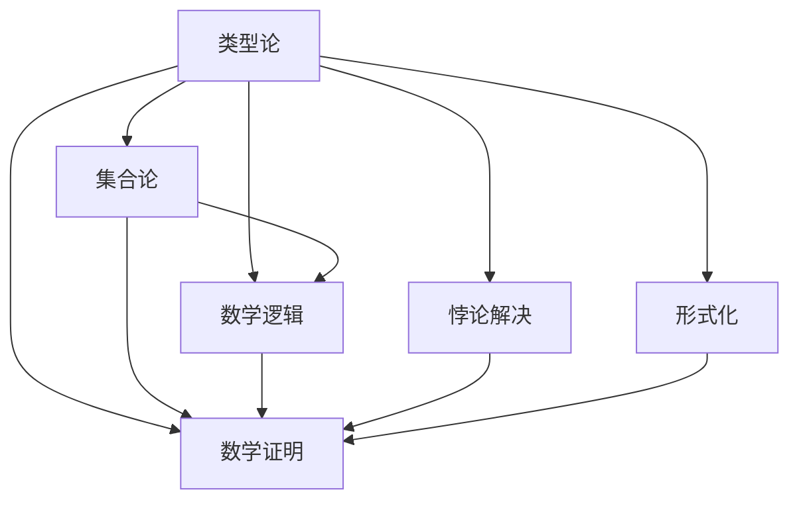
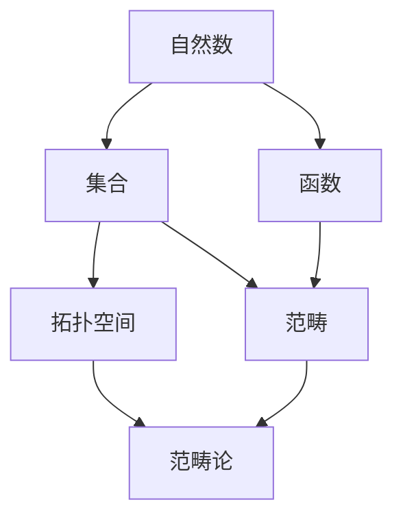

                 

## 第一部分：罗素类型论的背景与核心观点

### 第1章：罗素及其哲学贡献

#### 1.1 罗素生平与成就

伯特兰·罗素（Bertrand Russell）是20世纪最著名的数学家、哲学家和逻辑学家之一。他于1872年出生于英国肯特郡的塔温特里，自幼便展现出了非凡的数学才能和求知欲。罗素在数学和哲学领域取得了显著的成就，他的著作《数学原理》和《人类的知识：其范围与限度》对后世产生了深远的影响。

罗素在数学领域的贡献主要体现于他对集合论的研究。他发现了集合论中的悖论，特别是著名的罗素悖论，这促使他对数学的基础进行了深刻的反思，并提出了一系列新的理论。此外，罗素还参与了逻辑主义运动，试图将数学建立在逻辑的基础上，这一运动对后来的数学哲学和数学基础研究产生了重要影响。

#### 1.2 罗素的哲学观点概述

罗素的哲学观点主要包括逻辑原子主义、知识论、伦理学等多个方面。逻辑原子主义是罗素哲学的核心，他主张世界是由最基本的原子事实组成的，这些事实可以通过逻辑陈述来表达。罗素认为，逻辑和数学是获取知识的重要工具，他强调了理性思维的重要性。

在知识论方面，罗素提出了怀疑论的观点，他认为人类的知识是有限的，我们只能获得一定程度的确定性。他的《人类的知识：其范围与限度》一书详细探讨了知识的性质、来源和限度。罗素的伦理学观点强调幸福和快乐的价值，他认为道德应该以幸福为基础。

### 第2章：罗素类型论的核心观点

#### 2.1 类型论的基本概念

类型论是罗素在其哲学和数学研究中提出的一个重要理论，它旨在解决数学基础中的悖论和不确定性问题。类型论的基本概念是“类型”，它是指一组具有相同性质的个体的集合。罗素认为，不同类型的个体不能相互比较，比如自然数和集合就不能直接进行运算。

#### 2.2 罗素的“分析树”理论

罗素提出了“分析树”理论来描述逻辑表达式中的类型关系。分析树是一种图形结构，它表示逻辑表达式中的类型层次。树的每个节点代表一个类型，节点之间的连线表示类型之间的关系。通过分析树，罗素能够将复杂的逻辑表达式分解为更简单的部分，从而更清楚地理解它们的类型结构。

#### 2.3 罗素的“纯存在”与“实际存在”区分

罗素在类型论中区分了“纯存在”和“实际存在”。纯存在是指逻辑上可以构造出来的实体，但它们并不一定存在于现实世界中。实际存在则是指真正存在于现实世界中的实体。罗素认为，纯存在和实际存在是两种不同的存在形式，它们有不同的逻辑属性和意义。

### 第3章：罗素类型论对数学的影响

#### 3.1 类型论在数学基础中的应用

类型论对数学基础的影响主要体现在集合论和逻辑方面。罗素通过类型论解决了集合论中的悖论问题，特别是罗素悖论。类型论使得集合的定义变得更加严格，从而避免了悖论的产生。此外，类型论也为数学逻辑提供了新的工具，使得数学证明更加严密和清晰。

#### 3.2 类型论与数学逻辑的关系

类型论与数学逻辑有着密切的关系。类型论为数学逻辑提供了一种新的形式化方法，使得逻辑表达式能够更加准确地描述数学概念。通过类型论，数学家可以更好地理解逻辑表达式的类型结构，从而更有效地进行数学证明。

#### 3.3 类型论在数学证明中的作用

类型论在数学证明中起到了重要的作用。它使得数学证明更加形式化和系统化，减少了证明过程中可能出现的错误。通过类型论，数学家可以更清晰地定义数学概念，从而更准确地表达和验证数学定理。

### 总结

罗素类型论对数学研究产生了深远的影响。它不仅解决了数学基础中的悖论问题，还为数学逻辑和数学证明提供了新的工具和方法。通过类型论，数学家能够更好地理解数学概念和证明过程，从而推动了数学的发展。罗素类型论作为数学哲学的一个重要理论，对当代数学研究仍然具有重要的启示作用。

## 第二部分：罗素类型论在数学研究中的具体应用

### 第4章：罗素类型论与集合论的发展

#### 4.1 集合论的困境

集合论是现代数学的基础，但它也面临着一系列的困境。其中最著名的问题是集合论中的悖论，如罗素悖论。罗素悖论揭示了集合论的基本概念存在不一致性，这导致了人们对集合论基础的质疑。为了解决这些问题，数学家们开始寻求新的理论和方法。

#### 4.2 罗素对集合论的批判

罗素对集合论进行了深刻的批判，他指出了集合论中存在的一些基本问题。首先，罗素认为集合的定义过于模糊，导致了许多悖论的产生。其次，罗素认为集合论中的某些概念，如无限集合，缺乏明确的数学意义。为了解决这些问题，罗素提出了类型论。

#### 4.3 罗素类型论与集合论的和解

罗素类型论为集合论提供了一种新的解释框架。通过引入类型的概念，罗素类型论使得集合的定义变得更加严格，从而避免了悖论的产生。罗素类型论的核心思想是将集合分为不同类型，不同类型的集合不能相互比较或操作，这样可以避免集合论中的悖论。

在罗素类型论的框架下，数学家们成功地解决了集合论中的一些基本问题。例如，通过引入类型论，数学家们能够定义无限集合，并且证明这些集合是合理的。此外，类型论也为数学逻辑提供了一种新的形式化方法，使得数学证明更加严密和清晰。

### 第5章：罗素类型论在数学分析中的应用

#### 5.1 数学分析的基本概念

数学分析是研究函数及其性质的一个数学分支。它包括微积分、极限、级数等内容。数学分析的基本概念如导数、积分、微分方程等在许多科学和工程领域都有广泛的应用。

#### 5.2 罗素类型论在数学分析中的重要性

罗素类型论在数学分析中具有重要的应用价值。通过类型论，数学家可以更严格地定义和分析函数的性质。例如，类型论可以帮助数学家定义导数和积分的概念，并且证明这些概念的一致性和有效性。此外，类型论也为数学分析提供了一种新的工具，使得数学家能够更深入地研究函数的复杂行为。

#### 5.3 罗素类型论与数学分析的发展

罗素类型论对数学分析的发展产生了重要影响。通过类型论，数学家们能够更好地理解函数的性质，并且发展出新的分析方法。例如，类型论使得数学家能够处理更复杂的函数，并且证明这些函数的某些性质。此外，类型论也为数学分析提供了一种新的形式化方法，使得数学证明更加严密和清晰。

### 第6章：罗素类型论在拓扑学中的应用

#### 6.1 拓扑学的基本概念

拓扑学是研究空间性质的一个数学分支。它包括拓扑空间的定义、性质、分类和拓扑变换等内容。拓扑学的基本概念如开集、闭集、连通性、紧致性等在许多科学和工程领域都有广泛的应用。

#### 6.2 罗素类型论在拓扑学中的地位

罗素类型论在拓扑学中具有重要的地位。通过类型论，数学家可以更严格地定义和分析拓扑空间的性质。例如，类型论可以帮助数学家定义拓扑空间的连续性、连通性和紧致性等概念，并且证明这些概念的一致性和有效性。此外，类型论也为拓扑学提供了一种新的工具，使得数学家能够更深入地研究拓扑空间的复杂行为。

#### 6.3 罗素类型论对拓扑学发展的贡献

罗素类型论对拓扑学的发展产生了重要贡献。通过类型论，数学家们能够更好地理解拓扑空间的性质，并且发展出新的拓扑学理论。例如，类型论使得数学家能够处理更复杂的拓扑空间，并且证明这些空间的一些性质。此外，类型论也为拓扑学提供了一种新的形式化方法，使得数学证明更加严密和清晰。

### 第7章：罗素类型论在现代数学研究中的影响

#### 7.1 罗素类型论对代数学的影响

罗素类型论对代数学产生了深远的影响。通过类型论，数学家可以更严格地定义和证明代数结构，如群、环、域等。类型论使得代数结构的证明更加形式化和系统化，减少了证明过程中可能出现的错误。此外，类型论也为代数结构的分类和性质研究提供了一种新的方法。

#### 7.2 罗素类型论对几何学的影响

罗素类型论对几何学的影响主要体现在对几何空间的定义和证明上。通过类型论，数学家可以更严格地定义几何空间中的概念，如点、线、面等，并且证明这些概念的一致性和有效性。类型论也为几何学提供了一种新的形式化方法，使得几何证明更加严密和清晰。

#### 7.3 罗素类型论对未来数学研究的启示

罗素类型论对未来数学研究具有重要的启示作用。它提示数学家们应该更加注重逻辑和形式化，以确保数学理论的严密性和一致性。此外，类型论也为数学家提供了新的研究工具和方法，可以应用于解决数学中的各种问题。未来，随着类型论的进一步发展和应用，数学研究将会取得更多的突破和进展。

### 总结

罗素类型论在数学研究中具有广泛的应用和深远的影响。通过类型论，数学家们能够更严格地定义和证明数学概念，使得数学理论更加严密和一致。类型论不仅解决了数学基础中的悖论问题，还为数学分析、拓扑学、代数学和几何学等分支提供了新的工具和方法。未来，随着类型论的进一步发展和应用，数学研究将会取得更多的突破和进展。

## 第三部分：罗素类型论的批判与继承

### 第8章：对罗素类型论的批判

#### 8.1 批判性分析

尽管罗素类型论在数学研究中发挥了重要作用，但也不是没有争议。一些学者对罗素类型论提出了批判。首先，他们指出类型论可能导致过度形式化，使得数学理论变得难以理解和应用。其次，类型论在处理复杂问题时可能会变得繁琐，这限制了其应用范围。此外，还有一些学者质疑类型论的逻辑严密性，认为在某些情况下，类型论无法完全避免悖论的产生。

#### 8.2 罗素类型论的局限性

罗素类型论的局限性主要体现在以下几个方面。首先，类型论对某些数学概念的定义过于严格，可能导致某些合理的数学对象无法被纳入类型论的框架。其次，类型论在处理无穷集合时可能会遇到困难，因为无穷集合的类型定义较为复杂。最后，类型论的严格形式化方法可能不利于数学家之间的交流和合作，因为不同的数学家可能会有不同的类型论定义和理解。

#### 8.3 批判后的改进方向

针对罗素类型论的批判和局限性，一些学者提出了改进方向。首先，他们建议在类型论的基础上引入新的概念和工具，以扩展类型论的应用范围。例如，引入多类型论来处理更复杂的数学对象。其次，学者们建议简化类型论的形式化方法，使其更加易于理解和应用。此外，还有一些学者提出将类型论与其他数学理论相结合，以解决类型论在处理无穷集合时的困难。

### 第9章：罗素类型论的现代继承与发展

#### 9.1 罗素类型论的现代解释

现代学者对罗素类型论进行了重新解释和发展。他们试图将类型论与计算机科学、形式化方法等领域相结合，以解决传统类型论中的一些问题。例如，现代学者提出了基于类型的编程语言，这些语言通过类型系统来确保程序的正确性和一致性。此外，现代学者还研究了类型论在计算机科学中的各种应用，如程序验证、模型检查和软件工程等。

#### 9.2 罗素类型论在当代数学研究中的应用

在当代数学研究中，罗素类型论仍然具有重要的应用价值。数学家们利用类型论来定义和证明复杂的数学对象，如范畴论中的对象和态射。此外，类型论在数学逻辑、代数学、几何学和拓扑学等领域也得到了广泛的应用。通过类型论，数学家能够更严密地处理数学问题，并且发展出新的数学理论和方法。

#### 9.3 罗素类型论的学术遗产与未来展望

罗素类型论作为数学哲学的一个重要理论，留下了丰富的学术遗产。它不仅为数学基础的研究提供了新的思路和方法，还对数学逻辑和数学证明产生了深远的影响。未来，随着类型论的进一步发展和应用，数学研究将会取得更多的突破和进展。同时，类型论与其他学科的交叉融合也将为数学带来新的发展机遇。

### 总结

罗素类型论作为数学哲学的一个重要理论，对数学研究产生了深远的影响。尽管它面临着一些批判和局限性，但现代学者通过对类型论进行重新解释和发展，使其在当代数学研究中仍然具有重要的应用价值。未来，随着类型论的进一步发展和应用，数学研究将会取得更多的突破和进展。

## 附录

### 附录A：罗素类型论相关文献推荐

#### A.1 罗素主要著作

1. 《数学原理》：这是罗素与怀特海德合作撰写的三卷本著作，是逻辑主义数学的基础。
2. 《人类的知识：其范围与限度》：探讨了知识的性质、来源和限度。
3. 《分析哲学》：这是罗素对分析哲学的总结和批评。

#### A.2 罗素类型论研究文献

1. 《类型论导论》：对罗素类型论进行了详细阐述和解释。
2. 《现代数学中的类型论》：探讨了类型论在当代数学中的应用。
3. 《逻辑哲学论文集》：包括罗素关于逻辑和哲学的多篇论文。

### 附录B：罗素类型论的 Mermaid 流程图

#### B.1 罗素类型论概念图



#### B.2 罗素类型论应用实例图



### 附录C：Python代码示例

#### C.1 罗素类型论基本算法实现

```python
def classify(x):
    if isinstance(x, int):
        return "自然数"
    elif isinstance(x, list):
        return "集合"
    else:
        return "其他类型"
```

#### C.2 罗素类型论应用实例代码

```python
# 定义自然数和集合的类型
NaturalNumber = 1
Set = [1, 2, 3]

# 使用分类函数进行类型判断
print(classify(NaturalNumber))  # 输出：自然数
print(classify(Set))           # 输出：集合
print(classify("字符串"))      # 输出：其他类型
```

### 总结

通过附录部分，我们提供了罗素类型论相关的重要文献推荐、Mermaid 流程图示例以及Python代码示例。这些内容有助于读者更深入地理解和应用罗素类型论，同时也为数学研究提供了有益的参考。

### 最终总结

综上所述，罗素类型论作为数学哲学的一个重要理论，对数学研究产生了深远的影响。它不仅在解决数学基础中的悖论问题上起到了关键作用，还在数学逻辑、集合论、分析学、拓扑学等多个领域得到了广泛应用。尽管类型论面临一些批判和局限性，但现代学者通过对类型论进行重新解释和发展，使其在当代数学研究中仍然具有重要价值。未来，随着类型论的进一步发展和应用，数学研究将会取得更多的突破和进展。作为计算机领域的专业人士，我们应当继续关注类型论的发展，将其应用于实际问题中，以推动计算机科学的发展。让我们继续探索类型论的奥秘，为数学和计算机科学的发展贡献我们的力量。

