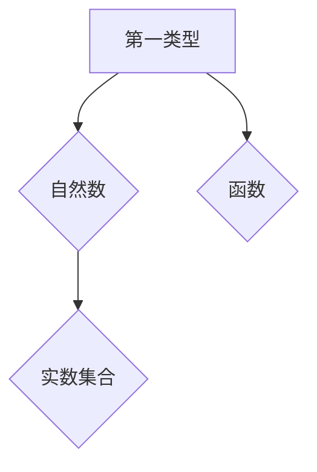

                 

# 罗素类型论对数学研究范式的影响与批评

## 引言

### 罗素类型论的背景与意义

- **背景**：罗素类型论是20世纪初由伯特兰·罗素提出的哲学理论，旨在解决数学基础中的悖论问题。在19世纪末和20世纪初，数学基础问题逐渐引起了哲学家的关注，特别是在集合论领域，罗素悖论等问题的出现揭示了传统数学理论的内在矛盾。罗素通过引入类型论试图解决这些问题，从而为数学提供了一个更加稳固的基础。

- **意义**：罗素类型论的提出不仅对数学哲学有着深远的影响，也对数学研究范式产生了重要变革。它促进了数学从直观主义向形式主义的转变，使得数学证明变得更加严谨和系统化。此外，罗素类型论还为计算机科学中的类型系统提供了理论基础，对现代编程语言的设计产生了重要影响。

### 数学研究范式的变革

- **数学研究范式的变革**：罗素类型论的引入促使数学研究从直观主义转向形式主义，从对公理体系的依赖转向对形式证明的重视。直观主义认为数学知识源于直观经验，而形式主义则强调数学证明的严谨性和逻辑性。罗素类型论通过区分不同的类型，使得数学证明更加严格和精确，从而推动了数学研究范式的变革。

- **数学家对数学对象的理解方式**：罗素类型论的提出使得数学家对数学对象的理解方式发生了变化。在罗素之前，数学对象往往被视为具体的实体，而罗素则提出了类型区分的概念，认为数学对象是抽象的符号系统。这种理解方式使得数学家更加注重符号逻辑和形式证明，从而推动了数学理论的抽象化和形式化。

## 第1章 核心概念与联系

### 1.1 数学悖论与罗素类型论的提出

- **数学悖论**：数学悖论是指数学内部存在的矛盾或不一致之处。其中最著名的悖论之一是罗素悖论，它揭示了集合论中的自我参照问题。罗素悖论指出，如果一个集合包含所有不包含自身的集合，那么这个集合本身是否包含自身就会导致矛盾。

- **罗素类型论的解决方案**：罗素类型论通过引入类型的区分来解决数学悖论。罗素提出了不同的类型来区分不同的数学对象，例如第一类型代表个体，第二类型代表集合，第三类型代表函数等。通过这种类型区分，罗素类型论避免了自我参照问题，从而消除了数学悖论。

### 1.2 罗素类型论的基本原理

- **类型区分**：罗素类型论认为，所有的数学对象都可以分为不同的类型。第一类型代表个体，例如自然数；第二类型代表集合，例如实数集合；第三类型代表函数，例如加法函数。不同类型的对象之间不能直接相互作用，从而避免了悖论的发生。

- **类型原则**：罗素类型论还提出了类型原则，即不同类型的对象不能直接相互作用。这意味着一个第一类型的对象不能直接操作第二类型的对象，反之亦然。通过类型原则，罗素类型论确保了数学系统的自洽性和一致性。

## 第2章 罗素类型论对数学研究范式的影响

### 2.1 形式主义的发展

- **形式主义**：形式主义是20世纪初在数学哲学中兴起的一种思潮，它强调数学证明的形式化和逻辑化。形式主义者认为，数学的真理是通过逻辑推理而非直观经验来获得的，因此数学证明应该尽可能形式化和严格化。

- **罗素的影响**：罗素类型论对形式主义的发展产生了重要影响。罗素通过引入类型论，提出了一个更加严谨的数学证明框架，使得数学证明变得更加系统化和形式化。他的工作推动了形式主义在数学中的地位，使得数学家开始重视形式证明方法。

### 2.2 数学对象的本质探讨

- **数学对象**：数学对象是数学研究的基本要素，它们是抽象的概念和符号。在罗素类型论之前，数学对象通常被视为具体的实体，如自然数、集合等。然而，罗素类型论提出了不同的类型来区分数学对象，使得数学对象变得更加抽象和符号化。

- **罗素的观点**：罗素认为，数学对象是抽象的符号系统，它们无法通过直观经验来理解。他主张通过形式化的语言和逻辑推理来描述和证明数学对象。罗素类型论的思想促使数学家重新思考数学对象的本质，推动了数学理论的抽象化和形式化。

### 2.3 数学证明的变革

- **形式证明**：罗素类型论倡导使用形式证明来证明数学命题。形式证明是一种基于符号逻辑和形式化公理体系的证明方法，它强调证明的严格性和逻辑性。通过形式证明，数学家可以确保证明的每一个步骤都是逻辑上无懈可击的。

- **罗素对证明的批评**：罗素对传统的直觉主义证明方法提出了批评。他认为直觉主义证明过于依赖直观经验，容易导致逻辑上的漏洞和错误。罗素主张，数学证明应该通过形式化的方法来确保其严谨性和可靠性。他的批评促使数学家对证明方法进行重新审视和改进。

## 第3章 罗素类型论的批评与反思

### 3.1 批评观点概述

- **批评者的观点**：批评者对罗素类型论提出了不同的批评观点。一些人认为罗素类型论过于苛刻，限制了数学的发展。他们认为类型论的复杂性导致了数学表达的困难，并且对实际数学应用的限制较大。

- **批评的焦点**：批评的焦点主要包括以下几个方面：
  - **类型的过多区分**：批评者认为罗素的类型论引入了过多的类型区分，使得数学表达变得复杂和冗长。这种复杂性可能导致表达的效率降低，增加了学习和理解数学的难度。
  - **对直觉主义的挑战**：罗素类型论对直觉主义数学提出了挑战。直觉主义认为数学知识源于直观经验，而罗素类型论则通过形式化的方法来构建数学理论，这引发了对直觉主义数学的质疑和反思。

### 3.2 罗素类型论的局限

- **类型的过多区分**：罗素类型论引入了多种类型来区分不同的数学对象，这种过多的类型区分可能导致表达的复杂性增加。不同类型的对象之间不能直接相互作用，这使得数学表达变得繁琐和冗长。

- **对直觉主义的挑战**：罗素类型论通过形式化的方法来构建数学理论，这对直觉主义数学提出了挑战。直觉主义认为数学知识源于直观经验，而罗素类型论则强调形式化和逻辑化的证明方法。这种挑战引发了数学哲学上的争论，使得数学家对数学的本质和基础进行重新思考。

### 3.3 罗素类型论的现代影响

- **数学哲学的发展**：罗素类型论对数学哲学产生了深远的影响。它促使数学家重新思考数学的本质和基础，推动了数学哲学的发展。现代数学哲学中的一些重要议题，如形式主义、直觉主义和类型论等，都与罗素类型论有关。

- **形式化趋势**：在计算机科学和形式逻辑领域，罗素类型论的思想仍然具有重要价值。形式化方法在计算机科学中的应用越来越广泛，如形式验证、形式化编程和形式化证明等。罗素类型论的思想为这些领域提供了理论基础，促进了形式化方法的发展。

## 第4章 罗素类型论的应用与实践

### 4.1 罗素类型论在数学中的应用

- **数学证明**：罗素类型论在数学中有着广泛的应用。通过形式化的方法，数学家可以使用罗素类型论来解决一些复杂的数学问题。例如，在集合论和数学逻辑中，罗素类型论提供了一种更加严谨和精确的证明方法，使得数学证明更加可靠。

- **数学教育**：罗素类型论的思想在数学教育中也有所体现。通过引入类型论，数学教育可以更加注重逻辑思维和形式化表达的培养。学生通过学习罗素类型论，可以更好地理解和掌握数学证明的方法和技巧，提高数学思维能力。

### 4.2 罗素类型论在计算机科学中的应用

- **形式验证**：罗素类型论在计算机科学中的形式验证领域具有重要应用。形式验证是一种通过数学方法来证明程序的正确性的方法。罗素类型论提供了一种形式化的证明框架，使得计算机科学家可以使用形式化的方法来验证程序的正确性。

- **类型系统**：现代编程语言中的类型系统受到了罗素类型论的影响。类型系统是一种用于检查程序中变量和表达式类型的机制。罗素类型论中的类型区分概念被应用于编程语言的类型系统中，使得编程语言可以更好地检查程序的类型错误，提高程序的可信度和安全性。

## 第5章 数学研究范式的未来趋势

### 5.1 数学基础理论的演变

- **形式主义与直觉主义的融合**：未来的数学研究可能趋向于融合形式主义与直觉主义的优点。形式主义强调数学证明的严谨性和逻辑性，而直觉主义则强调数学知识的直观基础。通过融合这两种观点，数学家可以构建更加完整和坚实的数学理论。

- **数学哲学的新思考**：数学哲学将继续探讨数学的本质和基础。未来的数学哲学可能会更加注重数学的形式化和形式化的方法，同时也可能关注数学与物理、计算机科学等领域的交叉研究。数学哲学的新思考将推动数学研究的发展，为数学提供更加深刻的理解。

### 5.2 数学与计算机科学的互动

- **计算机科学对数学的影响**：计算机科学的发展对数学产生了重要影响。计算机科学的工具和方法为数学研究提供了新的途径和思路。例如，计算数学、算法分析和计算几何等领域的发展都得益于计算机科学的支持。

- **数学对计算机科学的贡献**：数学在计算机科学中的应用将不断深入。数学为计算机科学提供了理论基础和工具，如数学模型、算法设计和形式验证等。未来，数学与计算机科学的互动将更加紧密，相互促进，推动两门学科的共同发展。

## 第6章 总结与展望

### 6.1 罗素类型论的地位与影响

- **罗素类型论的地位**：罗素类型论在数学哲学和数学基础理论中占有重要地位。它不仅为数学提供了一种形式化的证明方法，也为数学哲学的研究提供了新的视角。

- **罗素类型论的影响**：罗素类型论的影响深远而广泛。它推动了数学从直观主义向形式主义的转变，促进了数学证明的严谨化和系统化。此外，罗素类型论还对计算机科学中的类型系统产生了重要影响，为现代编程语言的设计提供了理论基础。

### 6.2 数学研究范式的未来方向

- **数学研究的趋势**：未来的数学研究将朝着更加形式化和抽象的方向发展。数学家将继续探索数学的形式化方法，提高数学证明的严谨性和可靠性。同时，数学与物理、计算机科学等领域的交叉研究也将成为数学研究的重要趋势。

- **数学哲学的新挑战**：数学哲学将继续面对新的挑战。未来的数学哲学将更加注重数学的形式化和形式化的方法，同时也将关注数学与物理、计算机科学等领域的交叉研究。数学哲学的新思考将推动数学研究的发展，为数学提供更加深刻的理解。

## 附录

### A. 罗素类型论的相关文献

- **主要参考文献**：
  - 罗素，伯特兰（1910）。《数学原理》。剑桥大学出版。
  - 库尔特·哥德尔（1931）。《关于逻辑符号演算的一个命题及其在数学和逻辑中的应用》。《数学年刊》。
  - 罗素，伯特兰（1940）。《数及其概念》。剑桥大学出版。
- **资源链接**：
  - [伯特兰·罗素的《数学原理》](https://en.wikipedia.org/wiki/The_Principles_of_Mathematics)
  - [库尔特·哥德尔的相关论文](https://en.wikipedia.org/wiki/Kurt_G%C3%B6del)

### B. 罗素类型论的 Mermaid 流程图

### 作者

- 作者：AI天才研究院/AI Genius Institute & 禅与计算机程序设计艺术 /Zen And The Art of Computer Programming

