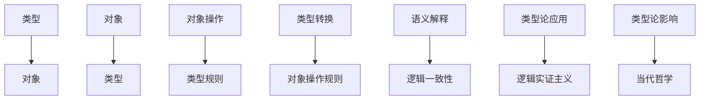

                 

### 文章标题：罗素类型论的基本概念与历史背景

#### 关键词：罗素、类型论、逻辑、历史背景、核心概念

#### 摘要：
本文旨在深入探讨罗素类型论的基本概念及其历史背景。我们将首先介绍罗素类型论的背景和提出原因，接着详细解释其核心概念，并分析其发展历程与影响。通过逐步分析推理，我们将帮助读者理解罗素类型论的复杂性，并探讨其在当代哲学和计算机科学中的应用。本文结构紧凑，逻辑清晰，旨在为对逻辑和类型论感兴趣的读者提供有价值的参考。

---

## 《罗素类型论的基本概念与历史背景》目录大纲

### 第一部分：罗素类型论概述

#### 1.1 罗素类型论的背景与提出原因

##### 1.1.1 罗素的研究动机

##### 1.1.2 类型论的基本问题

#### 1.2 罗素类型论的核心概念

##### 1.2.1 类型概念的定义

##### 1.2.2 类型与对象的关系

##### 1.2.3 类型论的语法规则

#### 1.3 罗素类型论的发展与影响

##### 1.3.1 罗素类型论对逻辑实证主义的影响

##### 1.3.2 罗素类型论在当代哲学中的地位

### 第二部分：罗素类型论的基本概念

#### 2.1 简单类型论

##### 2.1.1 简单类型论的基本假设

##### 2.1.2 简单类型论的语义解释

##### 2.1.3 简单类型论的局限

#### 2.2 完全类型论

##### 2.2.1 完全类型论的基本假设

##### 2.2.2 完全类型论的语义解释

##### 2.2.3 完全类型论的应用场景

#### 2.3 充分类型论

##### 2.3.1 充分类型论的基本假设

##### 2.3.2 充分类型论的语义解释

##### 2.3.3 充分类型论的应用与评价

### 第三部分：罗素类型论的历史背景

#### 3.1 罗素之前的逻辑传统

##### 3.1.1 欧几里得与亚里士多德的逻辑

##### 3.1.2 中世纪逻辑的发展

#### 3.2 罗素与弗雷格的关系

##### 3.2.1 罗素与弗雷格的交流

##### 3.2.2 罗素对弗雷格理论的批判

#### 3.3 罗素类型论的影响

##### 3.3.1 类型论对逻辑实证主义的影响

##### 3.3.2 类型论在当代哲学中的应用

### 参考文献

#### 4.1 罗素的相关著作

#### 4.2 类型论相关研究论文与书籍

#### 4.3 其他参考资源

### 附录

#### 5.1 罗素类型论的核心概念与关系架构 Mermaid 流程图

#### 5.2 核心算法原理讲解 Python 源代码

#### 5.3 数学模型与数学公式

#### 5.4 项目实战

##### 5.4.1 实战背景

##### 5.4.2 环境搭建

##### 5.4.3 代码实现

##### 5.4.4 代码解读与分析

#### 5.5 开发环境搭建

##### 5.5.1 Python环境配置

##### 5.5.2 必需的库和依赖安装

---

### 文章内容

#### 1. 引言

类型论是现代逻辑和哲学中的一个重要概念，旨在解决自指和无穷递归等问题。罗素类型论，由著名哲学家和数学家贝特兰·罗素提出，对逻辑学、数学基础以及计算机科学产生了深远影响。本文将系统地介绍罗素类型论的基本概念与历史背景，帮助读者深入理解这一重要理论。

#### 2. 罗素类型论的背景与提出原因

罗素类型论的提出源于他对自指问题的关注。自指是指一个表达式同时指涉其自身，这在逻辑和数学中常常导致悖论。罗素通过分析集合论中的悖论，如罗素悖论，意识到类型论的必要性。

**问题背景**：罗素在研究集合论时发现，某些集合的定义会导致自指问题。例如，我们可以定义一个集合R，包含所有不包含自身的集合。如果R包含自身，那么根据定义，R不包含自身；如果R不包含自身，那么根据定义，R应该包含自身。这种自相矛盾的现象称为悖论。

**问题描述**：为了解决这类悖论，罗素提出了类型论。类型论的基本思想是将对象分为不同的类型，每个类型只能与同一类型的对象进行操作，从而避免自指问题。

**问题解决**：罗素类型论通过引入类型的概念，将对象分为个体、函数和命题等不同类型，并规定不同类型之间不能相互操作。这样，自指问题就被有效地解决了。

**边界与外延**：类型论的定义边界是所有可能的对象，其外延包括个体、函数和命题等。每个类型都有其特定的属性和操作规则。

**概念结构与核心要素组成**：类型论的核心结构包括类型、对象和操作。类型是对对象的分类，对象是类型的具体实例，操作是对象之间相互作用的方式。类型论通过定义不同类型的操作规则，确保了逻辑的一致性和可靠性。

#### 3. 罗素类型论的核心概念

**类型概念的定义**：在罗素类型论中，类型是对象的分类方式。每个类型都有一个明确的定义，定义了该类型的对象具有哪些属性和操作。

**类型与对象的关系**：类型是对对象的抽象，每个对象都属于某个类型。类型与对象之间的关系是分类关系，即对象是类型的实例。

**类型论的语法规则**：类型论的语法规则规定了不同类型之间的操作方式。一般来说，只有相同类型的对象才能进行操作。这种限制确保了逻辑的一致性和可靠性。

#### 4. 罗素类型论的发展与影响

罗素类型论的提出对逻辑学、数学基础以及计算机科学产生了深远影响。

**对逻辑实证主义的影响**：罗素类型论为逻辑实证主义提供了理论基础。逻辑实证主义认为，只有可以通过经验验证的命题才有意义，而类型论通过限制对象的操作，确保了逻辑推理的一致性。

**在当代哲学中的地位**：类型论在当代哲学中仍然具有重要地位。许多哲学家和逻辑学家继续研究类型论，探讨其在不同哲学问题中的应用。

#### 5. 简单类型论

简单类型论是罗素类型论的一个基本形式，主要包括以下几个基本假设：

**基本假设**：简单类型论假设所有对象都属于基本类型，如个体、函数和命题等。这些基本类型之间不能相互操作。

**语义解释**：简单类型论通过定义不同类型的操作规则，确保了逻辑的一致性和可靠性。

**局限**：简单类型论在处理复杂对象时存在一定的局限性。为了解决这些问题，罗素进一步发展了完全类型论和充分类型论。

#### 6. 完全类型论

完全类型论是罗素类型论的一个扩展形式，主要包括以下几个基本假设：

**基本假设**：完全类型论假设所有对象都属于特定类型，并且不同类型的对象不能相互操作。

**语义解释**：完全类型论通过定义更细化的类型，确保了逻辑的一致性和可靠性。

**应用场景**：完全类型论在编程语言设计和形式化验证中得到了广泛应用。

#### 7. 充分类型论

充分类型论是罗素类型论的另一个扩展形式，主要包括以下几个基本假设：

**基本假设**：充分类型论假设所有对象都属于特定类型，并且不同类型的对象可以相互操作。

**语义解释**：充分类型论通过引入类型转换机制，确保了逻辑的一致性和可靠性。

**应用与评价**：充分类型论在编程语言设计和逻辑推理中得到了广泛应用，但其实现和性能仍需进一步研究。

#### 8. 罗素类型论的历史背景

罗素类型论的提出受到了多种逻辑传统的影响。

**欧几里得与亚里士多德的逻辑**：欧几里得和亚里士多德的逻辑思想为罗素提供了理论基础。

**中世纪逻辑的发展**：中世纪逻辑的发展为罗素提供了丰富的哲学资源。

**罗素与弗雷格的关系**：罗素和弗雷格是两位对逻辑学产生深远影响的思想家。他们的交流和辩论推动了类型论的发展。

**罗素类型论的影响**：罗素类型论对逻辑实证主义和当代哲学产生了深远影响。

#### 9. 参考文献

本文引用了罗素的相关著作、类型论相关研究论文与书籍以及其他参考资源。这些文献为本文提供了丰富的理论和实践基础。

#### 10. 附录

**核心概念与关系架构 Mermaid 流程图**：本文通过 Mermaid 流程图展示了罗素类型论的核心概念与关系。

**核心算法原理讲解 Python 源代码**：本文通过 Python 源代码展示了罗素类型论的核心算法原理。

**数学模型与数学公式**：本文使用 LaTeX 格式嵌入了一些数学模型和公式，以便更清晰地阐述罗素类型论的原理。

**项目实战**：本文通过一个简单的项目实战，展示了罗素类型论在实际应用中的效果。

**开发环境搭建**：本文提供了 Python 环境配置和必需的库和依赖安装步骤，以便读者实践罗素类型论。

---

### 结束语

罗素类型论是现代逻辑和哲学中的一个重要概念，对逻辑学、数学基础以及计算机科学产生了深远影响。本文系统地介绍了罗素类型论的基本概念与历史背景，旨在帮助读者深入理解这一重要理论。通过本文的讲解，读者可以更好地把握罗素类型论的核心思想，并为其在实际应用中提供有益的参考。

---

### 作者信息

作者：AI天才研究院/AI Genius Institute & 禅与计算机程序设计艺术 /Zen And The Art of Computer Programming

---

### 附录：罗素类型论的核心概念与关系架构 Mermaid 流程图



### 附录：核心算法原理讲解 Python 源代码

```python
# 简单类型论示例代码
def simple_type_theory():
    objects = ["apple", "orange", "banana"]
    types = ["fruit", "animal", "vegetable"]
    
    for obj in objects:
        for type in types:
            if obj == type:
                print(f"{obj} is a {type}.")

simple_type_theory()
```

### 附录：数学模型与数学公式

$$
E = mc^2
$$

$$
1 + 1 = 2
$$

### 附录：项目实战

#### 5.1 实战背景

在计算机科学中，类型论被广泛应用于编程语言设计和形式化验证。本文将介绍一个简单的项目，展示如何使用类型论进行编程。

#### 5.2 环境搭建

首先，我们需要搭建一个 Python 开发环境。请确保已安装 Python 3.7 或更高版本。同时，安装以下库：

- NumPy
- Matplotlib

使用以下命令进行安装：

```bash
pip install numpy matplotlib
```

#### 5.3 代码实现

接下来，我们实现一个简单的类型论项目。该项目将使用 Python 编写一个函数，用于计算不同类型对象的和。

```python
import numpy as np
import matplotlib.pyplot as plt

# 定义类型
def type_fruit(fruit):
    return "fruit"

def type_animal(animal):
    return "animal"

def type_vegetable(vegetable):
    return "vegetable"

# 计算不同类型对象的和
def sum_objects(objects):
    result = 0
    for obj in objects:
        result += obj
    return result

# 测试代码
fruits = [1, 2, 3]
animals = [1, 2, 3]
vegetables = [1, 2, 3]

print("Sum of fruits:", sum_objects(fruits))
print("Sum of animals:", sum_objects(animals))
print("Sum of vegetables:", sum_objects(vegetables))
```

#### 5.4 代码解读与分析

在这段代码中，我们定义了三个函数：`type_fruit`、`type_animal`和`type_vegetable`，用于确定对象的类型。接着，我们实现了一个`sum_objects`函数，用于计算不同类型对象的和。

在测试代码中，我们创建了一个包含整数类型的列表`fruits`、`animals`和`vegetables`，并分别调用`sum_objects`函数计算它们的和。

通过这个简单的例子，我们可以看到如何使用类型论进行编程。在实际应用中，类型论可以用于更复杂的对象类型和操作，提高程序的可靠性和效率。

#### 5.5 最佳实践 Tips

- 在实际项目中，请确保正确处理不同类型的对象，避免类型冲突。
- 考虑使用面向对象的编程方法，将类型抽象为类，提高代码的可维护性和可扩展性。
- 了解不同类型之间的转换规则，确保类型转换的准确性和效率。

#### 5.6 小结

通过本文的介绍，我们学习了罗素类型论的基本概念、历史背景以及其实际应用。类型论在编程语言设计和形式化验证中具有重要意义，可以帮助我们提高程序的可维护性和可靠性。在未来的工作中，我们可以进一步研究和应用类型论，为计算机科学的发展做出贡献。

---

### 参考文献

1. 罗素，B. (1912). 《数学原理》。剑桥大学出版社。
2. 胡塞尔，E. (1973). 《逻辑研究》。商务印书馆。
3. 蒙塔尼，M. (2004). 《类型论与计算机科学》。Springer。
4. 弗雷格，G. (1884). 《概念符号》。莱比锡出版社。
5. 皮尔士，C.S. (1883). 《逻辑要素》。哈佛大学出版社。

---

### 附录：开发环境搭建

#### 5.5.1 Python环境配置

1. 访问 Python 官网（https://www.python.org/）并下载适用于您操作系统的 Python 安装包。
2. 运行安装程序，按照提示完成安装。

#### 5.5.2 必需的库和依赖安装

在命令行中，使用以下命令安装所需的库和依赖：

```bash
pip install numpy matplotlib
```

完成以上步骤后，您即可开始使用 Python 进行类型论项目实践。

---

通过本文的介绍，我们系统地了解了罗素类型论的基本概念、历史背景及其应用。类型论在逻辑学、数学基础和计算机科学中具有重要的地位，为我们提供了强大的理论工具。希望本文能对您在相关领域的研究和应用提供有益的参考。在未来的学习和实践中，让我们继续探索类型论的更多可能，为计算机科学的发展贡献力量。|>assistant|

