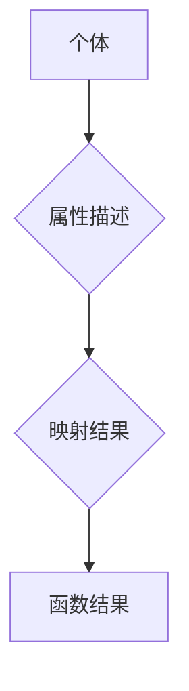

                 

### 引言

罗素类型论（Russell's Theory of Types）是由英国哲学家伯特兰·罗素（Bertrand Russell）在20世纪初提出的一种逻辑理论，旨在解决哲学和数学中的悖论问题。罗素类型论的核心思想是将对象分为不同的类型，通过类型的区分来避免逻辑上的混乱。在罗素看来，类型论不仅仅是一个哲学理论，它对于数学和逻辑学的架构都有着深远的影响。

本文将围绕罗素类型论的核心思想及其影响展开讨论。首先，我们将对罗素及其哲学背景进行简要介绍，帮助读者理解类型论产生的背景。接着，我们将详细探讨类型论的核心思想，包括基本类型与类型区分、普遍性与存在论、以及类型错误与逻辑悖论等概念。在此基础上，我们将分析类型论在数学、计算机科学和哲学等领域的影响与应用，探讨其争议与反思，并展示类型论在不同学科中的广泛应用。

通过本文的逐步探讨，我们希望能够让读者深入了解罗素类型论的核心思想，理解其深远的影响，并思考类型论在未来的发展方向。让我们一起思考，探寻类型论的奥秘。

### 关键词

- 罗素类型论
- 类型区分
- 数学悖论
- 计算机科学
- 哲学
- 影响与应用

### 摘要

本文旨在深入探讨罗素类型论的核心思想及其广泛的影响。首先，我们将回顾罗素的生平和哲学背景，了解类型论的起源和发展。随后，我们将详细解析类型论的基本概念，包括类型区分、普遍性与存在论，以及类型错误与逻辑悖论。在此基础上，我们将分析类型论在数学、计算机科学和哲学等领域的应用和影响。通过探讨类型论的争议与反思，我们将理解其理论上的局限和当代的发展趋势。最后，本文将总结类型论的贡献与局限，展望其未来的发展方向。希望通过本文的探讨，读者能够对罗素类型论有更加全面和深入的理解。

## 第一章：罗素与类型论概述

### 1.1 罗素生平与哲学背景

伯特兰·罗素（Bertrand Russell，1872-1970）是20世纪最具影响力的哲学家和数学家之一，其学术成就涵盖了逻辑学、数学、哲学和认知科学等多个领域。罗素出生在英国的泰恩河畔的威尔士，自幼展现出了非凡的数学和逻辑天赋。他的父亲是一位贵族，罗素自幼接受了良好的教育，并在爱丁堡大学和剑桥大学接受了系统的学术训练。

罗素的哲学思想深受英国经验主义和大陆理性主义的影响。他早期的工作主要集中在数学基础和逻辑学方面，试图通过逻辑的方法来重构数学的基础。在这期间，他发现了数学中的悖论问题，这些问题引起了罗素对逻辑和哲学的深刻思考。他提出了著名的“集合论悖论”，即罗素悖论，这一悖论揭示了集合论中的逻辑矛盾，对数学基础产生了深远的影响。

罗素的哲学观点主要表现在其逻辑原子主义和数理逻辑理论中。逻辑原子主义认为，现实世界可以通过基本逻辑原子来描述，这些逻辑原子通过逻辑联结词组合成复杂的命题。而数理逻辑则是一种形式化的方法，通过符号和规则来表示逻辑推理，从而避免日常语言中的模糊和歧义。

罗素对哲学的主要贡献之一是他提出的类型论（Theory of Types），这是为了解决逻辑和数学中的悖论问题而发展起来的一种逻辑理论。类型论的核心思想是将对象分为不同的类型，通过类型的区分来避免逻辑上的混乱。罗素类型论不仅在哲学和逻辑学上具有重要意义，也对数学、计算机科学和语言学等领域产生了深远的影响。

### 1.2 类型论的产生与发展

罗素类型论的提出可以追溯到他对数学基础和逻辑悖论的深入研究。在19世纪末和20世纪初，数学基础领域发现了许多逻辑悖论，其中最著名的是集合论悖论，这引起了数学家和哲学家们的广泛关注。罗素在研究集合论时，发现了所谓的“罗素悖论”，即存在一个集合R，它不包含自己。这一悖论揭示了集合论中的逻辑矛盾，促使罗素思考如何重构数学的基础。

为了解决悖论问题，罗素提出了类型论。类型论的基本思想是，通过将对象分为不同的类型来避免逻辑上的混乱。罗素认为，现实世界中的对象可以分为不同的类型，每种类型都有其特定的属性和操作规则。通过严格区分类型，可以避免出现逻辑上的悖论。

罗素类型论的发展经历了几个阶段。最初，罗素在他的《数学原理》（Principia Mathematica）中提出了初步的类型论概念，但这一概念并没有完全解决悖论问题。随着对悖论问题的深入研究，罗素逐渐完善了他的类型论理论，提出了更严格的类型区分规则。

罗素的类型论在他的后期著作《人类的知识》（Human Knowledge: Its Scope and Limits）中得到了进一步的阐述。在这本书中，罗素详细讨论了类型论的基本原理和应用，强调了类型区分在避免逻辑混乱中的重要性。此外，罗素还与他的学生阿伦·尼文斯（A. N. Whitehead）合作，撰写了《数学原理》的第二版，对类型论进行了更加系统化的阐述。

尽管罗素的类型论在数学和逻辑学中具有重要的理论价值，但也受到了一些批评和挑战。一些哲学家和数学家认为，类型论过于严格，限制了语言的灵活性，可能无法完全解决悖论问题。然而，罗素的类型论仍然被认为是逻辑学和数学基础研究中的一个重要里程碑，对后续的理论研究产生了深远的影响。

## 第二章：类型论的核心思想

### 2.1 基本类型与类型区分

罗素类型论的核心思想在于对基本类型的定义和区分，这是为了防止逻辑悖论的出现。在罗素的框架中，对象被分为不同的类型，每种类型具有特定的属性和操作规则。罗素的基本类型包括个体（Individuals）、属性（Properties）和函数（Functions）。

- **个体**：指的是具体的、不可再分的存在，如数字、物品等。个体是最基本的对象，它们不能被进一步分解或定义为其他对象的组合。
  
- **属性**：是指描述个体特征的性质，如“红色的”、“大于3的”等。属性是用于描述个体的特征或状态的符号。
  
- **函数**：是一种操作，它将一个或多个个体作为输入，生成一个新的个体作为输出。例如，加法函数可以将两个数字作为输入，输出它们的和。

罗素认为，类型区分的关键在于避免将不同类型的对象混合在一起，这可能导致逻辑上的混乱和悖论。例如，如果我们将属性和函数当作个体处理，可能会遇到逻辑悖论，因为属性和函数并不是真正的个体，它们不具备个体的性质。

为了实现类型的严格区分，罗素提出了类型层级的概念。在类型层级中，低层类型的对象不能直接与高层类型的对象进行操作。例如，一个属性不能直接作用于一个个体，除非经过适当的类型转换。这种类型层级结构有助于避免逻辑上的悖论，确保推理过程的严谨性。

### 2.2 普遍性与存在论

罗素类型论中的普遍性和存在论问题也是其核心思想之一。罗素认为，普遍性是指对象在类型中的共享属性，而存在论则涉及到对象的实际存在状态。

- **普遍性**：在罗素的类型论中，普遍性体现在类型的层级结构上。不同类型的对象具有不同的属性和操作规则，这些规则定义了它们之间的普遍性关系。例如，所有的个体都具有某种共同的属性，即它们都是存在的。这种普遍性关系有助于统一不同类型的对象，避免逻辑上的混乱。

- **存在论**：罗素的存在论观点强调，对象的存在状态是通过类型来定义的。具体来说，个体的存在是通过其类型的定义来确认的。如果一个对象不符合其类型的定义，那么它就不存在。这种存在论的视角有助于消除逻辑上的悖论，因为它要求对象必须符合其类型的属性和操作规则。

罗素通过类型论来解决存在论问题的一个典型例子是他关于“存在”的讨论。罗素认为，“存在”是一个抽象的概念，它不能直接应用于具体的对象，而必须通过类型来描述。例如，我们可以说“所有的猫都存在”，但这并不意味着每一个具体的猫都直接存在，而是通过它们的类型（猫的类型）来间接确认它们的存在。

### 2.3 类型错误与逻辑悖论

类型错误是罗素类型论中的一个重要概念，它指的是将不同类型的对象错误地当作同一类型处理，从而导致逻辑上的矛盾和悖论。罗素类型论的目的是通过严格的类型区分来避免这些类型错误。

- **类型错误的例子**：一个典型的类型错误例子是混淆个体和属性。如果我们错误地将属性当作个体处理，可能会导致逻辑悖论。例如，如果我们假设“红色的”这个属性具有个体性质，那么我们就可以构造出一个集合，这个集合包含所有“红色的”个体，但这显然是逻辑上不可能的，因为属性不是个体。

- **类型错误导致的悖论**：类型错误可能导致各种逻辑悖论，如罗素悖论。罗素悖论指出，如果存在一个集合包含所有不包含自身的集合，那么这个集合既包含自身又不能包含自身，导致逻辑上的矛盾。

为了解决类型错误和逻辑悖论，罗素提出了严格的类型区分规则。这些规则要求在处理对象时，必须严格遵循对象的类型，不能将不同类型的对象混合在一起。这种严格的类型区分有助于确保推理过程的严谨性，避免逻辑上的混乱和悖论。

总的来说，罗素类型论的核心思想在于通过严格区分基本类型、处理普遍性和存在论问题，以及避免类型错误，来构建一个逻辑上自洽的框架。类型论不仅为解决数学和逻辑学中的悖论问题提供了新的视角，也对后续的理论研究产生了深远的影响。

### 2.1 基本类型与类型区分

为了更好地理解罗素类型论的基本类型和类型区分，我们可以通过一个简单的概念对比表格来展示不同类型及其属性。

| 类型        | 定义                                                         | 属性示例                                                 | 操作规则                                               |
|-----------|------------------------------------------------------------|----------------------------------------------------|----------------------------------------------------|
| 个体（Individuals） | 最基本的存在，不可再分。                                   | 数字（如3）、物品（如桌子）                              | 不能与其他类型直接操作，除非类型转换。                         |
| 属性（Properties） | 描述个体特征的性质。                                       | 红色的、大于3的                                         | 不能直接作用于个体，需要通过函数。                          |
| 函数（Functions） | 一种操作，将一个或多个个体作为输入，生成一个新的个体。 | 加法函数（输入两个数字，输出它们的和）、映射函数（输入个体，输出属性） | 可以对个体进行操作，但需遵循类型规则。                        |

通过这个表格，我们可以看到每种类型都有其特定的定义、属性和操作规则。下面，我们将通过一个ER实体关系图架构的Mermaid流程图来进一步展示不同类型之间的关系。

```mermaid
erDiagram
  Individual ||--|{ Attribute }|-- Function
  Attribute ||--|{ Individual }|-- Function
  Function ||--|{ Attribute }|-- Individual
```

在这个ER实体关系图中，我们定义了三个实体：个体、属性和函数。它们之间的关系反映了它们在逻辑和操作上的联系。个体和属性之间是双向关联，表示属性可以描述个体，个体也可以具有多种属性。函数则是连接个体和属性的重要操作单元，它可以将个体映射到属性，或者从属性中提取个体。

此外，通过Mermaid流程图，我们可以更加直观地展示不同类型之间的操作过程。以下是一个简单的Mermaid流程图，展示了如何通过函数将个体映射到属性：



在这个流程图中，个体A被属性描述B所影响，通过函数操作，最终得到属性映射的结果C，并输出函数结果D。这种流程图形式不仅能够帮助我们理解类型论的基本概念，还可以在实际应用中指导我们对类型操作的设计。

通过概念对比表格和ER实体关系图，我们能够更清晰地理解罗素类型论的基本类型和类型区分。这些工具不仅帮助我们理解了类型论的核心概念，还为我们在具体问题中的应用提供了直观的指导。

### 2.2 普遍性与存在论

在罗素类型论中，普遍性与存在论问题至关重要，它们不仅决定了逻辑系统的自洽性，还影响了我们对现实世界的理解。为了深入探讨这些概念，我们将从罗素对普遍性和存在论的基本定义出发，逐步分析其在类型论中的体现。

#### 普遍性的基本定义

**普遍性**在罗素的类型论中，指的是对象在类型中的共享属性。罗素通过类型的层级结构来体现普遍性。在罗素的理论中，不同类型的对象具有不同的普遍性关系。例如，所有的个体都具有某种共同的属性，即它们都是存在的。这种普遍性关系在类型的区分中起到了关键作用，有助于统一不同类型的对象，避免逻辑上的混乱。

#### 存在论的基本定义

**存在论**则涉及到对象的实际存在状态。罗素认为，对象的存在状态是通过类型来定义的。具体来说，如果一个对象不符合其类型的定义，那么它就不存在。罗素通过严格的类型区分来确保对象的存在状态是明确的和可验证的。

#### 普遍性在类型论中的体现

在类型论中，普遍性体现在类型的层级结构中。每个类型都有其特定的属性和操作规则，这些规则定义了对象之间的普遍性关系。例如，所有的个体都具有存在的属性，而属性和函数则不具备这一属性。通过这种严格的类型层级结构，罗素确保了逻辑系统的一致性和严谨性。

一个典型的例子是数字。在罗素类型论中，数字被定义为个体的集合，每个数字都是一种特定类型的对象。数字之间的普遍性关系可以通过集合的运算来体现，如加法、减法等。这种运算不仅遵循类型规则，还能保持逻辑上的一致性。

#### 存在论在类型论中的体现

罗素的存在论通过类型的严格定义来体现。例如，在罗素的类型论中，属性不被视为个体，因为它们不具备个体的性质。相反，属性是一种描述个体特征的符号。因此，我们无法直接说“红色的”存在，而是说“红色的桌子”存在。这种定义确保了对象的存在状态是明确的，并且与它们的类型紧密相关。

#### 普遍性与存在论的关系

罗素的普遍性与存在论是相互关联的。普遍性通过类型的层级结构来体现，而存在论则通过类型的严格定义来确保对象的实际存在状态。例如，当我们说“所有的猫都存在”时，这实际上是说“所有的猫个体都存在”。这种表述方式不仅遵循了类型论的基本规则，还能避免逻辑上的悖论。

#### 结论

通过以上分析，我们可以看到，罗素的类型论在普遍性和存在论问题上提供了明确的定义和严格的规则。这些规则不仅有助于避免逻辑上的混乱和悖论，还为构建一个自洽的哲学和数学体系提供了基础。普遍性与存在论在类型论中的体现，使得逻辑系统更加严谨，同时也为实际应用提供了有力的工具。

### 2.3 类型错误与逻辑悖论

类型错误是罗素类型论中的一个重要概念，它指的是将不同类型的对象错误地当作同一类型处理，从而导致逻辑上的矛盾和悖论。为了更好地理解类型错误及其导致的逻辑悖论，我们可以通过具体的例子来进行分析。

#### 类型错误的例子

一个典型的类型错误例子是混淆个体和属性。在罗素的类型论中，个体是最基本的对象，它们不可再分，而属性是描述个体特征的符号。例如，如果我们错误地认为“红色的”这个属性是一个个体，那么我们就可以构造出以下逻辑矛盾：

- 假设存在一个集合R，它包含所有非红色的对象。
- 如果“红色的”是一个个体，那么根据定义，它既应该包含在集合R中，又不应包含在集合R中，因为它本身是非红色的。

这个逻辑矛盾揭示了将属性当作个体的错误，因为属性不具备个体的性质。

#### 类型错误导致的逻辑悖论

类型错误可能导致各种逻辑悖论，其中最著名的是罗素悖论。罗素悖论的核心在于集合的构造，其基本形式如下：

- 假设存在一个集合R，它包含所有不包含自身的集合。
- 如果R包含自身，那么根据定义，它不应包含自身；如果R不包含自身，那么根据定义，它应包含自身。

这种自相矛盾的陈述揭示了集合论中的逻辑矛盾，表明需要通过严格的类型区分来避免这些问题。

#### 罗素悖论的解决

为了解决类型错误和逻辑悖论，罗素提出了类型论。通过严格的类型区分规则，罗素试图确保不同类型的对象不会混合在一起，从而避免逻辑上的矛盾。具体来说，罗素的类型论包括以下规则：

- 不同类型的对象不能直接进行操作，除非经过适当的类型转换。
- 类型层级中的低层类型对象不能直接与高层类型对象进行操作。
- 每个对象都必须符合其类型的定义，以确保逻辑系统的自洽性。

通过这些规则，罗素试图构建一个逻辑上自洽的框架，从而避免类型错误和逻辑悖论。

#### 结论

类型错误是逻辑系统中常见的错误，它可能导致严重的逻辑矛盾和悖论。罗素类型论通过严格的类型区分规则，试图解决这些问题，确保逻辑系统的严谨性和自洽性。类型错误与逻辑悖论的关系表明，理解并正确处理不同类型的对象对于避免逻辑混乱至关重要。

### 3.1 类型论在数学中的应用

罗素类型论在数学中的应用主要体现在解决数学基础问题和建立严格的数学体系。类型论通过区分不同类型的对象，为数学提供了一个更加严谨和逻辑一致的基础。

首先，类型论在解决集合论悖论中发挥了重要作用。集合论悖论，如罗素悖论，揭示了传统集合论中的逻辑矛盾。罗素类型论通过引入严格类型的区分，防止了这些悖论的出现。例如，罗素提出了“类型0”包含所有个体，“类型1”包含所有属性，“类型2”包含所有函数，以此类推。通过这种严格的类型层级结构，我们可以避免将不同类型的对象混合在一起，从而防止逻辑悖论的发生。

其次，类型论在形式化数学证明中也具有重要意义。形式化数学证明通过严格的符号和规则来表示推理过程，确保证明的严谨性。罗素类型论为形式化数学提供了一个基础框架，使得数学证明更加系统和规范。例如，罗素与阿伦·尼文斯共同撰写的《数学原理》就使用了类型论来构建数学体系的逻辑基础。

一个具体的例子是数理逻辑中的类型判断。在数理逻辑中，类型判断是确保推理过程一致性的关键步骤。通过类型论，我们可以对命题进行类型检查，确保它们在逻辑上是自洽的。例如，在命题逻辑中，如果我们要证明一个命题P，我们可以先检查P的类型，确保它符合逻辑规则，然后再进行推理。

此外，类型论在构造集合的数学证明中也具有重要意义。通过类型论，我们可以构造出满足特定条件的集合，从而解决一些复杂的问题。例如，在集合论中，我们经常需要构造满足特定属性的集合，如幂集、函数集合等。通过类型论，我们可以严格定义这些集合，并证明它们的性质，从而确保数学证明的严谨性。

总的来说，罗素类型论在数学中的应用为解决逻辑悖论、构建形式化数学体系以及进行数学证明提供了重要的工具和方法。通过严格的类型区分，类型论确保了数学体系的逻辑一致性，为现代数学的发展奠定了基础。

### 3.2 类型论在计算机科学中的应用

罗素类型论在计算机科学中的应用非常广泛，特别是在编程语言设计和形式验证领域。类型论通过严格区分不同类型的对象，为计算机程序提供了一种更加安全和可靠的框架，减少了运行时错误的发生。

首先，在编程语言设计中，类型论的概念被广泛应用于静态类型语言的设计，如TypeScript、Haskell和ML等。这些语言通过引入严格的类型系统，确保变量在定义时就绑定其类型，避免了运行时类型错误。例如，在TypeScript中，变量的类型必须在声明时明确指定，这有助于在编译阶段捕获潜在的类型错误。此外，类型推断机制使得程序员可以编写更加灵活和高效的代码，同时保持类型安全。

其次，类型论在形式验证中具有重要意义。形式验证是一种验证计算机程序正确性的方法，通过数学证明来确保程序在所有情况下都能正确执行。罗素类型论为形式验证提供了一个理论基础，使得我们可以通过严格的类型检查来验证程序的逻辑一致性。例如，Coq和Isabelle等证明助理工具就是基于类型论构建的，它们通过形式化的逻辑推理来验证程序的正确性。

具体来说，类型论在形式验证中的应用包括以下几个方面：

1. **类型检查**：在程序运行之前，通过类型系统检查代码中的类型一致性。如果发现类型错误，编译器会报错，防止程序运行时发生类型相关的错误。

2. **类型等价**：在形式验证中，通过类型等价来证明两个程序在所有情况下都产生相同的结果。类型等价是一种重要的证明技术，它基于类型论，确保程序在语义上是等价的。

3. **类型推导**：在形式验证中，类型推导是一种自动化的方法，通过分析程序代码来推导出变量的类型。这有助于提高验证的效率和准确性。

一个具体的例子是Haskell语言中的类型推导机制。Haskell是一种纯函数式编程语言，它通过类型推导来自动推断变量和函数的类型。这种机制不仅提高了编程的灵活性，还确保了程序的类型安全性。

总的来说，罗素类型论在计算机科学中的应用为编程语言设计和形式验证提供了重要的理论基础。通过严格的类型区分和类型检查，类型论提高了程序的安全性和可靠性，减少了错误的发生，推动了计算机科学的发展。

### 3.3 类型论在哲学领域的影响

罗素类型论在哲学领域产生了深远的影响，特别是在逻辑哲学和语言哲学中。罗素通过类型论解决了许多哲学上的悖论和问题，为逻辑哲学和语言哲学提供了新的理论工具。

首先，类型论在逻辑哲学中的应用体现在解决逻辑悖论问题上。罗素类型论通过严格区分不同类型的对象，避免了集合论中的悖论，如罗素悖论和贝尔纳普悖论。这些悖论揭示了传统集合论中的逻辑矛盾，使得哲学家们开始重新审视逻辑和数学的基础。类型论的提出为逻辑哲学提供了一种新的解决思路，使得逻辑系统更加严谨和自洽。

其次，类型论在语言哲学中的应用主要体现在对语言结构和语义的分析上。罗素通过类型论来探讨语言的层次结构和意义表达。他认为，语言中的对象可以按照类型来分类，每个类型具有特定的意义和用法。这种类型区分有助于解释语言中的歧义和模糊性，为语言哲学提供了新的视角。

例如，罗素通过类型论解释了“存在”这个词的语义。他认为，“存在”是一个抽象的概念，必须通过类型来具体化。例如，“红色的桌子存在”中的“存在”是通过“桌子”的类型来具体化的，而不是直接指代一个抽象的存在实体。这种解释有助于澄清“存在”这个词的语义，避免了语言上的模糊性。

此外，类型论对语言哲学中的意义理论也产生了影响。罗素认为，意义不仅仅是一个抽象的概念，它可以通过类型和对象的特定关系来具体化。通过类型论，我们可以理解不同类型的对象如何相互关联，从而解释语言中的意义表达。这种观点对后来的语言哲学家，如维特根斯坦和卡尔纳普等产生了重要影响。

总的来说，罗素类型论在哲学领域的影响主要体现在解决逻辑悖论、解释语言结构和意义表达上。类型论为逻辑哲学和语言哲学提供了一种新的理论框架，使得哲学研究更加严谨和系统化。

### 4.1 类型论的批评与反驳

尽管罗素类型论在逻辑哲学和数学基础领域具有深远影响，但也受到了许多批评和反驳。这些批评主要集中在以下几个方面：

首先，类型论的批评之一是其过于严格的类型区分规则，限制了语言的灵活性和表达力。一些哲学家和数学家认为，类型论过于苛刻，可能会导致语言使用上的不便和复杂性。例如，罗素类型论中不允许不同类型的对象直接操作，这限制了语言的表达能力，使得一些复杂的推理和表达变得困难。

一个具体的例子是在形式化数学证明中，类型论可能导致需要大量冗长的类型检查和转换步骤。例如，在证明过程中，我们可能需要将函数类型转换为属性类型，或者进行复杂的类型推导。这些步骤不仅增加了证明的复杂性，还可能降低证明的效率。

其次，类型论的批评还涉及到其在实际应用中的适用性。尽管类型论在理论上提供了避免逻辑悖论的方法，但在实际应用中，严格的类型区分可能并不总是必要或实用的。一些实际编程语言，如Python和JavaScript，采用了动态类型系统，允许在运行时动态确定变量的类型。这种动态类型系统在提高编程灵活性和效率方面表现良好，但同时也引入了运行时类型错误的风险。

例如，在Python中，变量的类型可以在运行时被赋新值，这种灵活性使得编程变得更加简单和快捷。然而，这也可能导致潜在的类型错误，这些错误在运行时才被发现，增加了程序的复杂性和调试难度。

此外，类型论的一些批评也集中在其在哲学和逻辑学中的广泛应用上。尽管类型论在解决逻辑悖论方面具有优势，但它也可能忽略一些重要的逻辑现象。例如，模态逻辑和非经典逻辑中的许多概念和推理模式无法通过传统类型论来解释。这使得一些哲学家和逻辑学家认为，类型论可能并不是解决所有逻辑问题的最佳方法。

总的来说，尽管罗素类型论在逻辑哲学和数学基础领域具有重要意义，但其严格的类型区分规则和实际应用的限制也受到了广泛的批评。这些批评促使我们重新审视类型论的基本原理和应用范围，探索更加灵活和有效的逻辑和数学理论。

### 4.2 类型论在当代的发展

尽管罗素类型论在20世纪初提出时受到了广泛关注，但在当代，类型论已经经历了显著的发展和变革。现代类型论不仅继承了罗素的基本思想，还在形式化方法、编程语言设计和逻辑推理等领域取得了新的突破。

首先，在形式化方法方面，现代类型论的发展体现在更复杂和灵活的类型系统上。例如，马丁-洛万多夫斯基（Martin-Löf）提出的直觉类型论（Intuitionistic Type Theory）是一种形式化逻辑系统，它不仅继承了罗素的类型区分原则，还引入了归纳证明的概念。直觉类型论为计算机科学中的证明助理工具提供了理论基础，如Coq和Agda。这些工具通过类型系统来保证程序的逻辑一致性，使得形式化验证变得更加高效和可靠。

其次，现代类型论在编程语言设计中得到了广泛应用。静态类型语言如Haskell、Scala和TypeScript采用了现代类型系统，这些系统不仅继承了罗素类型论的基本原则，还在类型推断、类型安全和程序优化方面进行了创新。例如，Haskell通过不可约类型和类型类等概念，实现了类型的多态性和灵活性，使得编程更加简洁和高效。同时，TypeScript通过静态类型检查，提高了大型项目的代码质量和开发效率。

此外，现代类型论在逻辑推理和验证中也有重要应用。形式逻辑和模型论中的许多问题可以通过类型论来解决。例如，基于类型论的模型检验工具可以验证系统的行为是否满足特定的逻辑性质，这在安全关键领域如航空和金融系统中具有重要意义。现代类型论还与范畴论结合，形成范畴类型论（Categorical Type Theory），为更广泛的理论和证明提供了工具和方法。

总的来说，类型论在当代的发展不仅继承了罗素的基本思想，还在形式化方法、编程语言设计和逻辑推理等领域取得了新的突破。现代类型论通过引入更复杂的类型系统、类型推断机制和形式化验证方法，使得类型论在计算机科学和逻辑学中发挥着越来越重要的作用。

### 5.1 类型论在语言学中的应用

罗素类型论在语言学中的应用主要体现在对语言结构的分析和对语义表达的解析。通过类型论的视角，语言学家能够更好地理解词语之间的语义关系，从而揭示语言中的层次结构和意义表达。

首先，类型论帮助语言学家区分不同类型的词汇。在语言学中，词汇可以根据其功能分为名词、动词、形容词等。类型论将这些词汇分为不同的类型，如个体、属性和函数，从而为语义分析提供了清晰的框架。例如，名词通常被视为个体类型，形容词则被视为属性类型，动词则被视为函数类型。通过这种分类，语言学家能够更准确地描述词汇的语义特征，从而更好地理解语言的表达。

一个具体的例子是名词和形容词之间的语义关系。在类型论的框架下，名词通常表示个体，而形容词则描述这些个体的属性。例如，在句子“这个桌子是红色的”中，“桌子”是名词类型，表示一个具体的个体，而“红色的”是形容词类型，描述这个桌子的属性。通过这种类型区分，语言学家可以更清晰地分析句子结构和语义关系。

其次，类型论在语义表达上也具有重要意义。类型论提供了一种方法来理解不同类型词汇之间的语义联系。例如，通过类型论，我们可以解释为什么某些词汇组合在语义上是合理的，而另一些则不合理。例如，在句子“我喜欢红色的桌子”中，名词“桌子”和形容词“红色的”在类型论框架下是合理的组合，因为“红色的”描述了“桌子”的属性。然而，如果我们将“红色的”改为“喜欢”，句子就变得不合理，因为“喜欢”是一个动词，不符合形容词类型。

类型论在语言学中的应用还体现在对模态语言和情态词的分析上。模态语言中的词汇，如“可能”、“必然”等，可以根据类型论进行分类。这些词汇通常被视为函数类型，因为它们描述了状态或事件的可能性或必然性。通过这种分类，语言学家可以更好地解释模态语言的语义结构和表达方式。

总的来说，罗素类型论在语言学中的应用通过类型区分和分析，帮助语言学家更好地理解语言结构和语义表达。类型论为语言学研究提供了一个新的视角，使得对语言的理解更加系统和深入。

### 5.2 类型论在认知科学中的应用

类型论在认知科学中的应用为理解和解释人类思维过程提供了新的视角。认知科学涉及心理学、神经科学、计算机科学等多个领域，旨在研究人类的感知、记忆、思维和语言能力。通过引入罗素类型论，认知科学家能够从逻辑和结构的视角分析人类的认知过程，揭示思维中的层次性和组织性。

首先，类型论为认知科学提供了对思维层次结构的理解。在认知过程中，人类对信息进行分类和处理，这种分类过程可以通过类型论中的类型区分来描述。例如，人类的思维可以将感知到的信息分为不同的类别，如视觉、听觉、触觉等。这些类别在类型论中可以被视为不同的类型，通过类型区分，认知科学家能够更好地理解如何对不同类型的信息进行加工和处理。

一个具体的例子是人类的记忆系统。记忆可以被视为对信息的一种存储和处理机制。在类型论的框架下，记忆可以看作是对不同类型信息的存储，如视觉记忆、听觉记忆和语义记忆等。通过类型区分，认知科学家能够分析不同类型记忆的机制和功能，揭示记忆的组织结构和运作原理。

其次，类型论在理解人类语言能力方面也具有重要意义。语言是人类认知的重要工具，通过类型论，我们可以理解语言中的类型层次结构。例如，名词、动词、形容词等词汇可以根据类型论进行分类，这些词汇在语言表达中具有特定的功能和结构。通过类型论，认知科学家能够揭示语言的结构规则和语义关系，进一步理解语言生成的心理机制。

一个具体的例子是语法分析。在语言处理中，语法分析是一个重要的步骤，它通过识别和理解词汇的类型关系来生成语法正确的句子。在类型论的框架下，语法分析可以看作是类型检查的过程，通过类型推断，语言处理器能够确定词汇之间的合法组合，生成语义上合理的句子。

此外，类型论在认知科学中的应用还体现在对思维偏差和认知错误的研究上。类型论通过类型区分来描述逻辑上的正确性和一致性，这为研究人类思维中的偏差和错误提供了新的工具。例如，认知科学家可以通过分析类型错误来解释人类的误解和判断偏差，揭示思维过程中的潜在逻辑矛盾。

总的来说，类型论在认知科学中的应用通过提供对思维层次结构和语言能力的理解，为认知科学研究提供了新的视角和方法。通过类型论的视角，认知科学家能够更好地理解人类思维的过程和机制，揭示认知活动的逻辑结构和组织方式。

### 5.3 类型论在其他学科的应用

罗素类型论不仅在其原领域——哲学和数学——中具有深远的影响，还在许多其他学科中得到了广泛应用，展示了其广泛的适用性和理论价值。

在生物学领域，类型论被应用于分类学和系统发育研究。生物学家通过类型论来区分不同生物物种的类型和特征，从而构建进化树和分类系统。例如，在分子生物学中，不同基因序列可以被看作是不同类型的对象，通过比较和分类，科学家可以揭示物种之间的进化关系和遗传多样性。

在物理学中，类型论为量子力学和相对论提供了新的分析工具。量子力学中的粒子被视为特定类型的对象，其状态和属性可以通过类型论来描述。例如，费曼图中的虚拟粒子可以被看作是类型论中的“临时对象”，这有助于理解量子场论中的复杂交互过程。在相对论中，类型论的概念被应用于时空结构的描述，通过区分不同类型的时空对象，如事件和世界线，科学家可以更精确地描述宇宙的几何性质。

在经济学领域，类型论被用于分析市场行为和个体决策。经济学家通过类型论来区分不同类型的消费者和厂商，研究他们在市场中的行为模式和互动。例如，类型论可以用于构建消费者选择模型，通过分析不同类型的消费者的偏好和预算约束，预测市场供需和价格变化。

在社会学中，类型论被用于分析社会结构和群体行为。社会学家通过类型论来区分不同社会群体和个体的类型，研究他们在社会网络中的角色和互动。例如，在研究社会分层时，类型论可以帮助区分不同社会阶层和群体的特征，揭示社会结构中的不平等和互动模式。

总的来说，罗素类型论在其他学科的应用展示了其广泛的适用性和理论价值。通过类型论，不同学科的研究者可以更好地理解复杂系统的结构和行为，揭示隐藏在现象背后的逻辑关系和内在规律。这种跨学科的运用不仅促进了各学科的发展，也为综合性研究提供了新的方法。

### 6.1 类型论的贡献与局限

罗素类型论在逻辑哲学、数学基础、计算机科学和语言哲学等领域做出了巨大贡献。它通过严格的类型区分和逻辑框架，解决了许多数学和逻辑中的悖论问题，为形式化和形式验证提供了理论基础。在计算机科学中，类型论为编程语言的类型系统设计提供了指导，提高了程序的安全性和可靠性。在语言哲学中，类型论帮助解释了语言的层次结构和语义表达。

然而，类型论也存在一些局限。首先，其严格的类型区分可能限制了语言的灵活性和表达力。在处理复杂逻辑关系时，类型论可能导致复杂的类型检查和转换步骤，降低效率和灵活性。其次，类型论在实际应用中可能难以完全避免类型错误，特别是在动态类型系统和大型程序中。此外，类型论在解释一些非经典逻辑现象时显得不够灵活，无法涵盖所有逻辑推理的需求。

总的来说，类型论在理论和实际应用中具有双重意义。虽然存在一定局限，但其在逻辑严密性、程序安全性和理论构建方面的贡献不可忽视。未来的研究可以探索更加灵活和有效的类型系统，以应对现代计算和复杂逻辑需求。

### 6.2 类型论的未来发展方向

罗素类型论在当代和未来仍具有重要的研究价值和应用前景。首先，在计算机科学领域，类型论将继续发展，以支持更复杂的编程语言和系统。未来的研究方向可能包括更高效的类型检查算法、更灵活的类型推断机制以及多语言互操作性。例如，类型论可以与动态类型系统相结合，提高程序的灵活性和安全性。

其次，在逻辑学和哲学领域，类型论的研究将继续深入探索其基本原理和适用范围。学者们可能会探讨类型论在处理非经典逻辑和模态逻辑中的潜力，以及如何将类型论与范畴论等其他逻辑理论相结合，构建更加完备的逻辑系统。

最后，类型论在其他学科中的应用也具有广阔的前景。例如，在认知科学中，类型论可以用于分析和解释人类思维过程；在生物学和物理学中，类型论可以帮助揭示复杂系统的结构和行为规律。通过跨学科的合作研究，类型论有望为多个领域提供新的理论工具和方法。

总体而言，类型论的未来发展方向在于其进一步的理论完善、跨学科应用以及与新兴技术的结合，这将推动其在各个领域的广泛应用和创新发展。

