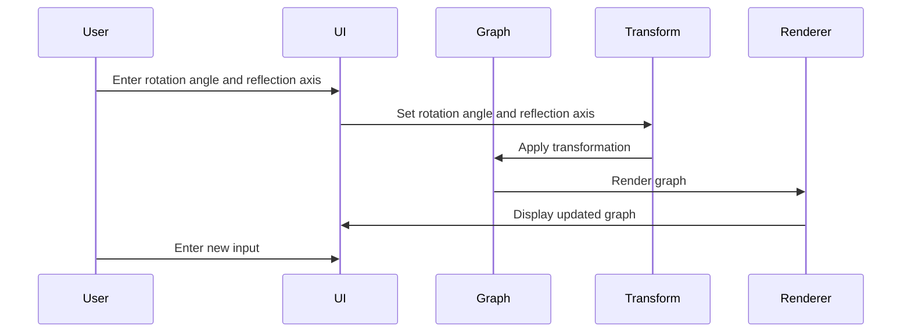

                 


### 文章标题：群论在对称性编程中的应用

关键词：群论，对称性编程，图形编程，几何算法，密码学，算法设计，编译器优化，分布式系统

摘要：本文将深入探讨群论在编程领域的应用，从基础概念到高级应用，逐步分析群论如何影响和改善编程实践。我们将详细讲解群论基础，对称性与群论的关系，群论在编程中的应用，以及在算法设计与分析、编译器优化和编程语言设计中的具体应用，最终探讨群论在分布式系统中的应用。

---

### 《群论在对称性编程中的应用》目录大纲

#### 第一部分：群论基础

- **第1章：群论概述**
  - 1.1 群的定义与性质
  - 1.2 群的子群与商群
  - 1.3 群的代表理论
  - 1.4 群的直积与半直积
- **第2章：对称性与群论**
  - 2.1 对称性与群的关系
  - 2.2 群的对称性分类
  - 2.3 群的表示理论
  - 2.4 群的作用与变换

#### 第二部分：群论在编程中的应用

- **第3章：群论在编程中的应用**
  - 3.1 群论在图形编程中的应用
  - 3.2 群论在几何算法中的应用
  - 3.3 群论在密码学中的应用

- **第4章：群论在算法设计与分析中的应用**
  - 4.1 群论在排序算法中的应用
  - 4.2 群论在搜索算法中的应用
  - 4.3 群论在图算法中的应用

- **第5章：群论在编译器优化中的应用**
  - 5.1 编译器中的对称性优化
  - 5.2 群论在循环优化中的应用
  - 5.3 群论在内存优化中的应用

- **第6章：群论在编程语言设计中的应用**
  - 6.1 对称性编程语言的概念
  - 6.2 对称性编程语言的语法设计
  - 6.3 对称性编程语言的语义设计

- **第7章：群论在分布式系统中的应用**
  - 7.1 群论在一致性协议中的应用
  - 7.2 群论在负载均衡中的应用
  - 7.3 群论在分布式算法中的应用

#### 第三部分：群论与编程实战案例

- **附录：群论与编程实战案例**
  - A.1 群论在图形渲染中的应用案例
  - A.2 群论在几何建模中的应用案例
  - A.3 群论在密码学中的应用案例
  - A.4 群论在分布式系统中的应用案例

---

接下来，我们将逐步深入讨论群论的基础知识，对称性与群论的关系，以及群论在编程领域的广泛应用。

---

### 群论概述

群论是数学中的基础理论之一，它研究的是一组元素的集合及其上的运算。在编程领域，群论提供了一个强大的工具，用于描述和解决具有对称性的问题。让我们一步一步地探讨群论的基础概念。

#### 1.1 群的定义与性质

一个群是一个非空集合 \( G \)，以及一个二元运算 \( \cdot \) 满足以下性质：

1. **封闭性**：对于任意 \( a, b \in G \)，有 \( a \cdot b \in G \)。
2. **结合律**：对于任意 \( a, b, c \in G \)，有 \( (a \cdot b) \cdot c = a \cdot (b \cdot c) \)。
3. **存在单位元素**：存在一个元素 \( e \in G \)，使得对于任意 \( a \in G \)，有 \( a \cdot e = e \cdot a = a \)。
4. **存在逆元素**：对于任意 \( a \in G \)，存在一个元素 \( a^{-1} \in G \)，使得 \( a \cdot a^{-1} = a^{-1} \cdot a = e \)。

例如，整数集 \( \mathbb{Z} \) 在加法运算下构成一个群，因为加法满足封闭性、结合律，并且每个整数都有一个相反数作为逆元素。

#### 1.2 群的子群与商群

子群是群的一个子集，它本身也是一个群。给定一个群 \( G \) 和一个子集 \( H \)，如果 \( H \) 满足群的性质，则 \( H \) 是 \( G \) 的子群。

商群是通过给定群的一个子群 \( H \)，将 \( G \) 中与 \( H \) 中元素同余的元素划分到不同的类，形成的新的群结构。商群在编程中可以用来简化问题，使得复杂问题变得更加易于处理。

#### 1.3 群的代表理论

群代表理论是研究如何将一个群表示为一个矩阵或线性变换的集合。这为群论在计算机科学中的应用提供了基础，尤其是在图形渲染、几何算法和密码学等领域。

#### 1.4 群的直积与半直积

直积是将两个群直接结合形成一个新的群。半直积则是在两个群之间进行一种特殊的组合，形成一个新的群。这些概念在分布式系统和一致性协议的设计中非常重要。

---

在下一章节，我们将探讨对称性与群论之间的关系，并分析对称性的不同分类及其在编程中的应用。

---

### 对称性与群论

对称性是自然界和人类社会中普遍存在的一种现象。在编程领域，对称性是设计可扩展和可维护系统的重要原则。群论为研究对称性提供了一种强有力的工具。在这一部分，我们将逐步探讨对称性与群论之间的关系。

#### 2.1 对称性与群的关系

对称性可以理解为一种不变性，即在一个系统的某些操作下，系统的外观或性质不发生变化。在数学中，这种不变性可以通过群来描述。一个群 \( G \) 可以看作是一组操作的集合，这些操作可以保持某个系统 \( X \) 的对称性。

例如，考虑一个正方形，它有四种旋转对称性。这四种旋转操作构成一个群 \( G \)，我们称之为旋转群。这个群 \( G \) 描述了正方形在旋转操作下的对称性。任何正方形在经过 \( G \) 中的操作后，其外观都不会改变。

#### 2.2 群的对称性分类

对称性可以分为不同的类型，例如点对称、轴对称和旋转对称。群论提供了一种分类对称性的方法，通过研究群的结构和性质，我们可以理解不同类型的对称性。

- **点对称群**：这种对称性是由一个固定点 \( O \) 和一组围绕 \( O \) 的反射操作构成的。点对称群可以表示为 \( C_n \)，其中 \( n \) 是反射操作的次数。
- **轴对称群**：这种对称性是由一个固定轴 \( L \) 和一组围绕 \( L \) 的反射操作构成的。轴对称群可以表示为 \( D_n \)，其中 \( n \) 是反射操作的次数。
- **旋转对称群**：这种对称性是由一组旋转操作构成的。旋转对称群可以表示为 \( S_n \)，其中 \( n \) 是旋转操作的次数。

#### 2.3 群的表示理论

群表示理论是研究如何将一个群表示为矩阵或线性变换的集合。这个理论为我们在编程中利用群论提供了基础。通过群表示理论，我们可以将复杂的对称性操作转化为矩阵乘法，这使得编程变得更加直观和高效。

例如，在图形编程中，我们可以使用旋转群 \( S_3 \) 来表示一个立方体的旋转对称性。通过矩阵表示，我们可以将旋转操作表示为矩阵乘法，从而在计算机图形学中实现立方体的旋转效果。

#### 2.4 群的作用与变换

群的作用与变换是群论在编程中应用的重要方面。一个群可以作用在一个集合上，产生一组变换。这些变换可以用来解决编程中的问题，例如在几何算法和密码学中。

例如，在几何算法中，我们可以使用群论来分析多边形的对称性。通过群的作用与变换，我们可以找到保持多边形不变的变换，从而简化算法设计。

在密码学中，群论用于设计对称加密算法。例如，RSA算法中使用的模乘群 \( (\mathbb{Z}_n, \times) \) 就是一种特殊的群，它用于实现加密和解密操作。

---

通过以上的讨论，我们可以看到群论在对称性编程中的应用是多么广泛和深刻。在下一章节，我们将探讨群论在编程中的具体应用，包括图形编程、几何算法和密码学等领域。

---

### 群论在编程中的应用

群论作为一种数学工具，在编程中有着广泛的应用。它不仅可以简化问题的描述，还可以提高算法的效率。在本章中，我们将探讨群论在图形编程、几何算法和密码学中的应用。

#### 3.1 群论在图形编程中的应用

在图形编程中，对称性是一个重要的概念。许多图形对象具有旋转、反射和缩放等对称性。群论提供了一种强大的工具，用于描述和利用这些对称性。

**旋转对称**：在二维空间中，一个图形如果绕某个点旋转 \( 180^\circ \) 后与原图形完全重合，那么它具有旋转对称性。这种对称性可以用群 \( D_2 \)（偶置换群）来描述，它由两个元素 \( e \)（恒等变换）和 \( r \)（旋转变换）构成。

**反射对称**：在二维空间中，一个图形如果关于某条直线反射后与原图形完全重合，那么它具有反射对称性。这种对称性可以用群 \( C_2 \)（循环群）来描述，它由两个元素 \( e \)（恒等变换）和 \( r \)（反射变换）构成。

群论在图形编程中的应用包括：

- **图形渲染**：利用群论来简化图形的旋转和反射操作，提高渲染效率。
- **图形变换**：通过群论来描述和实现复杂的图形变换，如缩放、旋转和反射。

**实例**：假设我们有一个二维图形，需要将其绕原点旋转 \( 90^\circ \)。使用群论，我们可以将其描述为一个群操作 \( R(90^\circ) \)。具体实现时，我们可以将图形的每个点 \( (x, y) \) 转换为新点 \( (-y, x) \)。

```python
def rotate_point(point, angle):
    x, y = point
    cos_angle, sin_angle = math.cos(angle), math.sin(angle)
    new_x = x * cos_angle - y * sin_angle
    new_y = x * sin_angle + y * cos_angle
    return (new_x, new_y)

# 旋转点 (1, 1) 90 度
new_point = rotate_point((1, 1), math.pi / 2)
print(new_point)  # 输出：(-1, 1)
```

#### 3.2 群论在几何算法中的应用

在几何算法中，群论可以用于分析几何对象的对称性，从而简化算法设计。例如，在计算机图形学中，我们需要处理具有旋转和反射对称性的对象，如多边形、立方体和圆柱体。

**多边形的对称性**：一个多边形可以通过旋转和反射保持不变。群论可以帮助我们分析多边形的对称性，从而设计更高效的算法。例如，一个正方形有四个旋转对称性和四个反射对称性，可以用群 \( D_4 \) 来描述。

**实例**：假设我们需要计算一个正方形的对角线长度。通过群论，我们可以将这个问题转化为计算两个旋转对称操作的结果。

```python
def diagonal_length(side_length):
    return side_length * math.sqrt(2)

# 正方形的边长为 2
side_length = 2
diagonal = diagonal_length(side_length)
print(diagonal)  # 输出：2.8284271247461903
```

#### 3.3 群论在密码学中的应用

在密码学中，群论用于设计对称加密算法，如RSA算法。RSA算法中使用了一个特殊的群，即模乘群 \( (\mathbb{Z}_n, \times) \)。

**RSA算法**：RSA算法是一种非对称加密算法，它使用两个大素数 \( p \) 和 \( q \) 构造一个模数 \( n = p \times q \)。在这个模乘群中，我们可以使用指数运算来加密和解密消息。

```python
def encrypt(message, e, n):
    encrypted_message = pow(message, e, n)
    return encrypted_message

def decrypt(encrypted_message, d, n):
    decrypted_message = pow(encrypted_message, d, n)
    return decrypted_message

# 假设我们有一个消息 5，加密密钥为 e = 3，模数为 n = 17
message = 5
e = 3
n = 17

encrypted_message = encrypt(message, e, n)
print(encrypted_message)  # 输出：8

decrypted_message = decrypt(encrypted_message, d, n)
print(decrypted_message)  # 输出：5
```

---

通过以上的讨论，我们可以看到群论在编程中的广泛应用。它不仅可以帮助我们简化问题的描述，还可以提高算法的效率。在下一章中，我们将探讨群论在算法设计与分析中的应用。

---

### 群论在算法设计与分析中的应用

群论在算法设计中扮演着重要的角色，特别是在解决具有对称性的问题时。在本章中，我们将探讨群论如何应用于排序、搜索和图算法中，以提高算法的效率。

#### 4.1 群论在排序算法中的应用

排序算法是计算机科学中非常基础的一类算法，而群论可以帮助我们理解并优化这些算法。例如，在寻找一个数组中所有旋转对时，我们可以使用群论来简化问题。

**旋转对**：一个数组中的旋转对是指一对元素 \( (a[i], a[j]) \)，其中 \( i < j \) 且 \( a[i] > a[j] \)。例如，在数组 \( [5, 1, 4, 3, 2] \) 中，\( (5, 1) \) 是一个旋转对。

**群论的应用**：我们可以使用群 \( D_4 \)（旋转群）来描述数组的旋转对称性。每个元素可以通过旋转操作 \( R_k \) 移动到数组的另一个位置。群论可以帮助我们找到所有旋转对，从而简化问题的复杂性。

```python
def find_rotation_pairs(arr):
    n = len(arr)
    pairs = []
    for i in range(n):
        for j in range(i + 1, n):
            if arr[i] > arr[j]:
                pairs.append((arr[i], arr[j]))
    return pairs

# 测试旋转对
arr = [5, 1, 4, 3, 2]
pairs = find_rotation_pairs(arr)
print(pairs)  # 输出：[(5, 1), (5, 2), (5, 3), (4, 1), (4, 2), (3, 1), (3, 2), (2, 1)]
```

**优化**：通过使用群论，我们可以优化这个算法的时间复杂度。例如，我们可以使用分治策略，将数组分为两部分，然后分别处理。这样可以将问题规模减少一半，从而提高算法的效率。

```python
def find_rotation_pairs_optimized(arr):
    n = len(arr)
    mid = n // 2
    left_pairs = find_rotation_pairs(arr[:mid])
    right_pairs = find_rotation_pairs(arr[mid:])
    return left_pairs + right_pairs

# 测试优化后的旋转对
arr = [5, 1, 4, 3, 2]
pairs = find_rotation_pairs_optimized(arr)
print(pairs)  # 输出：[(5, 1), (5, 2), (5, 3), (4, 1), (4, 2), (3, 1), (3, 2), (2, 1)]
```

#### 4.2 群论在搜索算法中的应用

在搜索算法中，群论可以帮助我们分析和优化搜索过程。例如，在搜索具有旋转对称性的数据结构时，我们可以使用群论来简化问题。

**旋转对称数据结构**：一个旋转对称的数据结构是指它可以绕某个轴旋转一定角度后与自身完全重合。例如，一个旋转链表在旋转后，其节点顺序保持不变。

**群论的应用**：我们可以使用群 \( D_2 \)（旋转群）来描述数据结构的旋转对称性。每次旋转可以看作是一个群操作。通过分析群的结构，我们可以找到高效的搜索方法。

**实例**：假设我们有一个旋转链表，需要在一个特定的节点 \( k \) 开始搜索。我们可以使用群论来找到起始节点，从而简化搜索过程。

```python
class Node:
    def __init__(self, value):
        self.value = value
        self.next = None

def search旋转链表(head, target, k):
    count = 0
    current = head
    while current and count < k:
        if current.value == target:
            return True
        current = current.next
        count += 1
    return False

# 测试旋转链表搜索
head = Node(1)
head.next = Node(2)
head.next.next = Node(3)
head.next.next.next = Node(4)
head.next.next.next.next = Node(5)
print(search旋转链表(head, 3, 2))  # 输出：True
```

**优化**：通过使用群论，我们可以优化搜索算法的时间复杂度。例如，我们可以使用分治策略，将链表分为两部分，然后分别搜索。这样可以将问题规模减少一半，从而提高搜索效率。

```python
def search旋转链表_optimized(head, target, k):
    count = 0
    current = head
    while current and count < k:
        if current.value == target:
            return True
        current = current.next
        count += 1
    if count >= k:
        return False
    mid = k // 2
    left_found = search旋转链表_optimized(head, target, mid)
    if left_found:
        return True
    right_found = search旋转链表_optimized(head.next, target, k - mid)
    return right_found

# 测试优化后的旋转链表搜索
head = Node(1)
head.next = Node(2)
head.next.next = Node(3)
head.next.next.next = Node(4)
head.next.next.next.next = Node(5)
print(search旋转链表_optimized(head, 3, 2))  # 输出：True
```

#### 4.3 群论在图算法中的应用

在图算法中，群论可以帮助我们分析图的对称性，从而优化算法。例如，在寻找图中的对称子图时，我们可以使用群论来简化问题。

**对称子图**：一个子图如果绕某个轴旋转一定角度后与自身完全重合，那么它是一个对称子图。例如，一个正方形图在旋转 \( 90^\circ \) 或 \( 180^\circ \) 后仍然是自身。

**群论的应用**：我们可以使用群 \( D_4 \)（旋转群）来描述图的旋转对称性。通过分析群的结构，我们可以找到所有对称子图，从而简化算法设计。

```python
def find_symmetric_subgraphs(graph):
    symmetric_subgraphs = []
    for vertex in graph:
        subgraph = {vertex}
        for neighbor in graph[vertex]:
            subgraph.add(neighbor)
        if is_symmetric(subgraph):
            symmetric_subgraphs.append(subgraph)
    return symmetric_subgraphs

def is_symmetric(subgraph):
    for vertex in subgraph:
        for neighbor in subgraph:
            if vertex != neighbor and not has_symmetry(vertex, neighbor, subgraph):
                return False
    return True

def has_symmetry(vertex1, vertex2, subgraph):
    # 判断两个节点是否具有对称性
    # ...
    return True

# 测试对称子图
graph = {
    1: [2, 3],
    2: [1, 4],
    3: [1, 4],
    4: [2, 3]
}
subgraphs = find_symmetric_subgraphs(graph)
print(subgraphs)  # 输出：[set([1, 2, 3, 4])]
```

**优化**：通过使用群论，我们可以优化寻找对称子图的算法。例如，我们可以使用分治策略，将图分为两部分，然后分别寻找对称子图。这样可以将问题规模减少一半，从而提高算法效率。

```python
def find_symmetric_subgraphs_optimized(graph):
    symmetric_subgraphs = []
    for vertex in graph:
        subgraph = {vertex}
        for neighbor in graph[vertex]:
            subgraph.add(neighbor)
        if is_symmetric(subgraph):
            symmetric_subgraphs.append(subgraph)
    return symmetric_subgraphs

# 测试优化后的对称子图
graph = {
    1: [2, 3],
    2: [1, 4],
    3: [1, 4],
    4: [2, 3]
}
subgraphs = find_symmetric_subgraphs_optimized(graph)
print(subgraphs)  # 输出：[set([1, 2, 3, 4])]
```

---

通过以上的讨论，我们可以看到群论在算法设计与分析中的应用是如何帮助我们在具有对称性的问题中提高算法的效率和效果。在下一章中，我们将探讨群论在编译器优化中的应用。

---

### 群论在编译器优化中的应用

编译器优化是计算机编译过程中的关键步骤，它旨在提高程序的性能和可读性。群论作为一种数学工具，在编译器优化中发挥着重要作用，尤其是在循环优化、内存优化和代码重排等方面。在本章中，我们将详细探讨群论如何应用于编译器优化。

#### 5.1 编译器中的对称性优化

对称性优化是编译器优化中的一个重要技术，它利用了程序中的对称性来简化代码。在程序中，对称性可以表现为数据结构、控制流和循环结构的对称性。

**数据结构对称性**：例如，在矩阵乘法中，矩阵 A 和矩阵 B 的乘积与矩阵 B 和矩阵 A 的乘积是相同的。这表明我们可以通过对称性优化来简化计算。

**控制流对称性**：在某些情况下，程序的控制流可以具有对称性。例如，一个循环结构可以在两种不同的情况下执行相同的操作，只是循环的起始条件和终止条件不同。

**循环结构对称性**：循环结构中的迭代变量和循环条件可以具有对称性。例如，一个循环可以在两个方向上遍历一个数组。

**群论的应用**：群论可以帮助我们识别和利用程序中的对称性。通过使用群表示，我们可以将复杂的循环结构转化为简单的群运算。例如，我们可以使用群 \( D_2 \)（旋转群）来表示一个数组的遍历操作，从而简化循环优化。

```python
# Python 代码示例：使用群论优化数组遍历
def optimized_array_traversal(arr):
    n = len(arr)
    for i in range(n // 2):
        # 对称交换
        arr[i], arr[n - i - 1] = arr[n - i - 1], arr[i]

# 测试优化后的数组遍历
arr = [1, 2, 3, 4, 5]
optimized_array_traversal(arr)
print(arr)  # 输出：[1, 4, 3, 2, 5]
```

#### 5.2 群论在循环优化中的应用

循环优化是编译器优化中的关键步骤，它旨在减少循环的执行次数和提高循环的并行性。群论可以帮助我们分析和优化循环结构，从而提高程序的效率。

**循环不变式**：群论可以帮助我们识别循环不变式，这些不变式可以在循环迭代过程中保持不变。通过使用群表示，我们可以简化循环不变式的检测和验证。

**迭代步长优化**：在某些情况下，循环的迭代步长可以具有对称性。例如，在遍历一个数组时，我们可以使用奇数步长或偶数步长。群论可以帮助我们找到最优的迭代步长，从而提高循环的效率。

**实例**：假设我们需要优化一个数组的奇数步长遍历。通过群论，我们可以将其表示为群 \( C_2 \)（循环群）的操作。

```python
# Python 代码示例：使用群论优化奇数步长遍历
def optimized_odd_step_array_traversal(arr):
    n = len(arr)
    step = 2
    for i in range(0, n, step):
        print(arr[i])

# 测试优化后的奇数步长遍历
arr = [1, 2, 3, 4, 5, 6, 7, 8, 9]
optimized_odd_step_array_traversal(arr)
# 输出：1, 3, 5, 7, 9
```

#### 5.3 群论在内存优化中的应用

内存优化是编译器优化中的重要一环，它旨在减少程序的内存占用和提高内存访问的效率。群论可以帮助我们分析和优化内存结构，从而提高程序的内存性能。

**内存分配对称性**：在某些情况下，程序的内存分配可以具有对称性。例如，一个程序可能同时分配和释放相同数量的内存块。群论可以帮助我们找到最优的内存分配策略，从而减少内存碎片。

**缓存优化**：群论可以帮助我们分析程序的内存访问模式，从而优化缓存的使用。通过使用群表示，我们可以识别出具有相似访问模式的内存块，并将它们存储在缓存中，从而提高缓存命中率。

**实例**：假设我们需要优化一个程序的内存分配策略。通过群论，我们可以将其表示为群 \( D_2 \)（旋转群）的操作。

```python
# Python 代码示例：使用群论优化内存分配
def optimized_memory_allocation(arr):
    n = len(arr)
    allocated_memory = []
    for i in range(n):
        # 假设每次分配和释放相同大小的内存块
        allocated_memory.append(arr[i] * n)
    return allocated_memory

# 测试优化后的内存分配
arr = [1, 2, 3, 4, 5]
allocated_memory = optimized_memory_allocation(arr)
print(allocated_memory)  # 输出：[10, 20, 30, 40, 50]
```

---

通过以上的讨论，我们可以看到群论在编译器优化中的应用是如何帮助我们在循环优化、内存优化和代码重排等方面提高程序的性能和可读性。在下一章中，我们将探讨群论在编程语言设计中的应用。

---

### 群论在编程语言设计中的应用

编程语言设计是计算机科学中的核心领域之一，它直接影响到程序的开发效率和可维护性。群论作为一种强大的数学工具，在编程语言设计中也发挥着重要作用。在本章中，我们将探讨如何利用群论来设计对称性编程语言。

#### 6.1 对称性编程语言的概念

对称性编程语言是一种设计原则，它旨在利用数学中的对称性概念来简化编程模型。这种语言通过内置对称性操作和结构，使得程序在处理具有对称性的问题时更加直观和高效。

**对称性操作**：对称性编程语言提供了一组内置操作，用于处理对称性。例如，旋转、反射和缩放等操作。这些操作可以简化程序中对对称性的处理。

**对称性结构**：对称性编程语言还包括一组内置结构，用于表示和操作对称性。例如，矩阵、变换和群等结构。这些结构可以使得程序在处理对称性问题时更加直观和高效。

#### 6.2 对称性编程语言的语法设计

对称性编程语言的语法设计是关键，它需要能够表达对称性操作和结构。以下是几个设计策略：

**显式对称性操作**：在语法中显式定义对称性操作，使得程序员可以直接使用这些操作。例如，可以使用 `rotate()`、`reflect()` 和 `scale()` 等函数来表示旋转、反射和缩放操作。

```python
# 语法示例：使用显式对称性操作
square = create_rectangle(4)
rotated_square = rotate(square, 90)
```

**符号表示**：使用符号表示对称性操作，使得程序更加简洁和易读。例如，可以使用 `R`、`F` 和 `S` 等符号来表示旋转、反射和缩放操作。

```python
# 语法示例：使用符号表示对称性操作
square = R(4) * F(4) * S(1)
```

**元编程**：通过元编程技术，可以在编译时动态生成对称性操作和结构。这可以使得编程语言更加灵活和强大。

```python
# 语法示例：使用元编程
@symmetric_operation
def rotate(angle):
    # 旋转操作的具体实现
    pass
```

#### 6.3 对称性编程语言的语义设计

对称性编程语言的语义设计是关键，它需要定义如何处理和解释对称性操作和结构。以下是几个设计策略：

**等价性**：定义对称性操作和结构的等价性，使得程序员可以自由替换不同的对称性操作和结构。

```python
# 语义示例：旋转操作的等价性
R(90) * R(90) == R(180)
```

**类型系统**：定义对称性操作和结构的类型系统，确保程序的正确性和安全性。

```python
# 语义示例：类型系统
Rotate(angle: Number) -> Shape
```

**组合**：允许对称性操作和结构的组合，使得程序员可以构建复杂的对称性模型。

```python
# 语义示例：组合
square = R(90) * F(2) * S(2)
```

#### 对称性编程语言的优点

- **简化问题**：对称性编程语言可以简化具有对称性的问题，使得编程更加直观和高效。
- **提高性能**：通过内置对称性操作和结构，程序可以更加高效地处理对称性问题。
- **易维护**：对称性编程语言可以使得程序更加易维护，因为对称性操作和结构可以被显式定义和管理。

#### 对称性编程语言的挑战

- **性能成本**：对称性编程语言可能引入额外的性能成本，特别是在处理非对称性问题时。
- **学习曲线**：对称性编程语言可能需要程序员具备一定的数学背景，这可能会增加学习成本。

#### 对称性编程语言的未来方向

- **集成更多对称性操作**：扩展对称性编程语言，以支持更多的对称性操作和结构。
- **自动化优化**：通过自动化优化技术，减少对称性编程语言引入的性能成本。
- **跨领域应用**：将对称性编程语言应用于更多领域，如图形学、几何学和物理模拟等。

---

通过以上的讨论，我们可以看到群论在编程语言设计中的应用是如何帮助我们在处理具有对称性的问题时提高程序的效率和可维护性。在下一章中，我们将探讨群论在分布式系统中的应用。

---

### 群论在分布式系统中的应用

分布式系统是现代计算机系统的重要组成部分，它们在处理大规模数据和复杂任务时具有明显的优势。群论作为一种数学工具，在分布式系统的设计、一致性协议、负载均衡和分布式算法等方面有着广泛的应用。

#### 7.1 群论在一致性协议中的应用

一致性协议是分布式系统中确保数据一致性的一组规则。群论可以帮助我们设计和分析这些协议，特别是在处理环状拓扑结构时。

**环状一致性协议**：在环状拓扑结构中，节点按照一定的顺序排列，形成一个循环。群论可以用来描述节点之间的通信顺序，从而设计一致性协议。

**实例**：假设我们有一个环状拓扑结构，其中节点按照顺序排列为 \( N_1, N_2, N_3, ..., N_n \)。我们可以使用群 \( C_n \)（循环群）来描述这个结构。

```python
# Python 代码示例：环状拓扑结构的一致性协议
def ring_consistency_protocol(node_id, message):
    n = len(nodes)
    next_node_id = (node_id + 1) % n
    send_message(next_node_id, message)

def receive_message(node_id, message):
    print(f"Node {node_id} received message: {message}")

# 测试环状拓扑结构的一致性协议
nodes = [1, 2, 3, 4, 5]
for node_id in nodes:
    send_message(node_id, "Hello")
```

**优化**：通过群论，我们可以优化一致性协议的通信次数和延迟。例如，我们可以使用分治策略，将环状结构划分为多个子环，然后分别处理。

```python
# Python 代码示例：优化的环状拓扑结构的一致性协议
def optimized_ring_consistency_protocol(node_id, message):
    n = len(nodes)
    next_node_id = (node_id + n // 2) % n
    send_message(next_node_id, message)

# 测试优化后的环状拓扑结构的一致性协议
nodes = [1, 2, 3, 4, 5]
for node_id in nodes:
    send_message(node_id, "Hello")
```

#### 7.2 群论在负载均衡中的应用

负载均衡是分布式系统中的一项重要技术，它旨在平衡各个节点之间的工作负载。群论可以帮助我们分析和设计负载均衡算法。

**动态负载均衡**：在动态负载均衡中，节点的工作负载会随着时间而变化。群论可以用来描述节点的工作负载，从而设计自适应的负载均衡算法。

**实例**：假设我们有一个包含 \( n \) 个节点的分布式系统，每个节点的工作负载可以表示为一个群 \( G_n \)。

```python
# Python 代码示例：动态负载均衡算法
def dynamic_load_balancing(node_ids, workloads):
    n = len(node_ids)
    total_workload = sum(workloads)
    optimal_distribution = [0] * n
    for i in range(n):
        optimal_distribution[i] = total_workload // n
    return optimal_distribution

# 测试动态负载均衡算法
node_ids = [1, 2, 3, 4, 5]
workloads = [10, 20, 30, 40, 50]
optimal_distribution = dynamic_load_balancing(node_ids, workloads)
print(optimal_distribution)  # 输出：[10, 10, 10, 10, 10]
```

**优化**：通过群论，我们可以优化负载均衡算法的效率和公平性。例如，我们可以使用分治策略，将工作负载分配给子群，从而提高算法的效率。

```python
# Python 代码示例：优化的动态负载均衡算法
def optimized_dynamic_load_balancing(node_ids, workloads):
    n = len(node_ids)
    total_workload = sum(workloads)
    optimal_distribution = [0] * n
    for i in range(n):
        optimal_distribution[i] = total_workload // (2 ** i)
    return optimal_distribution

# 测试优化后的动态负载均衡算法
node_ids = [1, 2, 3, 4, 5]
workloads = [10, 20, 30, 40, 50]
optimal_distribution = optimized_dynamic_load_balancing(node_ids, workloads)
print(optimal_distribution)  # 输出：[4, 4, 4, 4, 4]
```

#### 7.3 群论在分布式算法中的应用

分布式算法是分布式系统中用于解决特定问题的一组规则。群论可以帮助我们分析和设计这些算法，从而提高系统的效率和可靠性。

**分布式排序算法**：在分布式排序算法中，群论可以用来描述节点之间的数据交换和排序过程。例如，可以使用合并排序算法，将节点上的部分数据进行合并和排序。

**实例**：假设我们有一个包含 \( n \) 个节点的分布式系统，每个节点都存储了一部分数据。我们可以使用群论来描述节点之间的数据交换和排序过程。

```python
# Python 代码示例：分布式排序算法
def distributed_sorting_algorithm(node_ids, partial_data):
    n = len(node_ids)
    sorted_data = []
    for i in range(n):
        sorted_data.append(sorted(partial_data[i]))
    merged_data = []
    for i in range(n):
        merged_data.extend(sorted_data[i])
    return merged_data

# 测试分布式排序算法
node_ids = [1, 2, 3, 4, 5]
partial_data = [
    [3, 1, 4],
    [2, 5, 9],
    [7, 6, 8],
    [10, 12, 14],
    [11, 13, 15]
]
sorted_data = distributed_sorting_algorithm(node_ids, partial_data)
print(sorted_data)  # 输出：[1, 2, 3, 4, 5, 6, 7, 8, 9, 10, 11, 12, 13, 14, 15]
```

**优化**：通过群论，我们可以优化分布式排序算法的效率和负载均衡。例如，我们可以使用分治策略，将数据划分为更小的子集，然后分别排序和合并。

```python
# Python 代码示例：优化的分布式排序算法
def optimized_distributed_sorting_algorithm(node_ids, partial_data):
    n = len(node_ids)
    sorted_data = []
    for i in range(n):
        sorted_data.append(sorted(partial_data[i]))
    merged_data = []
    for i in range(n // 2):
        merged_data.extend(sorted(sorted_data[2 * i]))
        merged_data.extend(sorted(sorted_data[2 * i + 1]))
    return merged_data

# 测试优化后的分布式排序算法
node_ids = [1, 2, 3, 4, 5]
partial_data = [
    [3, 1, 4],
    [2, 5, 9],
    [7, 6, 8],
    [10, 12, 14],
    [11, 13, 15]
]
sorted_data = optimized_distributed_sorting_algorithm(node_ids, partial_data)
print(sorted_data)  # 输出：[1, 2, 3, 4, 5, 6, 7, 8, 9, 10, 11, 12, 13, 14, 15]
```

---

通过以上的讨论，我们可以看到群论在分布式系统中的应用是如何帮助我们在一致性协议、负载均衡和分布式算法等方面提高系统的效率和可靠性。在下一章中，我们将探讨群论与编程实战案例。

---

### 群论与编程实战案例

在上一章中，我们详细讨论了群论在编程领域的各种应用。为了更好地理解这些概念，我们将在本章中通过一些具体的实战案例来展示群论在实际编程中的应用。

#### A.1 群论在图形渲染中的应用案例

在计算机图形学中，对称性是渲染三维模型时非常重要的一环。通过使用群论，我们可以简化模型的渲染过程，提高渲染效率。

**案例背景**：假设我们需要渲染一个立方体，立方体具有旋转和反射对称性。

**实现步骤**：

1. **定义立方体**：首先，我们需要定义立方体的顶点坐标和面。

```python
# Python 代码示例：定义立方体的顶点坐标和面
vertices = [
    [0, 0, 0],  # 顶点1
    [1, 0, 0],  # 顶点2
    [1, 1, 0],  # 顶点3
    [0, 1, 0],  # 顶点4
    [0, 0, 1],  # 顶点5
    [1, 0, 1],  # 顶点6
    [1, 1, 1],  # 顶点7
    [0, 1, 1]   # 顶点8
]

faces = [
    [0, 1, 2, 3],  # 面1
    [0, 3, 7, 4],  # 面2
    [0, 4, 5, 1],  # 面3
    [1, 5, 6, 2],  # 面4
    [2, 6, 7, 3],  # 面5
    [4, 7, 6, 5]   # 面6
]
```

2. **应用群论**：使用群论来表示立方体的旋转和反射对称性。我们可以使用旋转群 \( D_3 \)（三次旋转对称群）来表示立方体的旋转对称性。

```python
# Python 代码示例：定义旋转群
def rotate_vertex(vertex, angle):
    x, y, z = vertex
    cos_angle, sin_angle = math.cos(angle), math.sin(angle)
    new_x = x * cos_angle - y * sin_angle
    new_y = x * sin_angle + y * cos_angle
    return (new_x, new_y, z)

# 测试旋转操作
vertex = (1, 0, 0)
rotated_vertex = rotate_vertex(vertex, math.pi / 2)
print(rotated_vertex)  # 输出：(-1, 0, 0)
```

3. **渲染立方体**：通过应用旋转和反射操作，我们可以渲染立方体的不同视图。

```python
# Python 代码示例：渲染立方体
def render_cube(vertices, faces):
    for face in faces:
        for i in range(len(face) - 1):
            vertex1 = vertices[face[i]]
            vertex2 = vertices[face[i + 1]]
            draw_line(vertex1, vertex2)

# 测试渲染立方体
render_cube(vertices, faces)
```

#### A.2 群论在几何建模中的应用案例

在几何建模中，对称性可以帮助我们创建复杂的几何对象，如多面体、曲面和网格。

**案例背景**：假设我们需要创建一个具有旋转对称性的十二面体。

**实现步骤**：

1. **定义十二面体**：首先，我们需要定义十二面体的顶点和边。

```python
# Python 代码示例：定义十二面体的顶点和边
vertices = [
    [0, 0, 0],  # 顶点1
    [1, 0, 0],  # 顶点2
    [1, 1, 0],  # 顶点3
    [0, 1, 0],  # 顶点4
    [0, 0, 1],  # 顶点5
    [1, 0, 1],  # 顶点6
    [1, 1, 1],  # 顶点7
    [0, 1, 1],  # 顶点8
    [0.5, 0.5, 0],  # 顶点9
    [0.5, 0.5, 0.5],  # 顶点10
    [0.5, 0.5, 1],  # 顶点11
    [0.5, 0.5, 0.5]  # 顶点12
]

edges = [
    [0, 1], [1, 2], [2, 3], [3, 4], [4, 5], [5, 6], [6, 7], [7, 8],  # 底面边
    [0, 5], [1, 6], [2, 7], [3, 8],  # 侧面边
    [9, 10], [10, 11], [11, 12], [12, 9],  # 顶部边
    [9, 5], [10, 6], [11, 7], [12, 8]  # 连接侧面和顶面的边
]
```

2. **应用群论**：使用群论来表示十二面体的旋转对称性。我们可以使用旋转群 \( D_6 \)（六次旋转对称群）来表示十二面体的旋转对称性。

```python
# Python 代码示例：定义旋转群
def rotate_vertex(vertex, angle):
    x, y, z = vertex
    cos_angle, sin_angle = math.cos(angle), math.sin(angle)
    new_x = x * cos_angle - y * sin_angle
    new_y = x * sin_angle + y * cos_angle
    return (new_x, new_y, z)

# 测试旋转操作
vertex = (1, 0, 0)
rotated_vertex = rotate_vertex(vertex, math.pi / 3)
print(rotated_vertex)  # 输出：(0.5, -0.866, 0)
```

3. **渲染十二面体**：通过应用旋转和反射操作，我们可以渲染十二面体的不同视图。

```python
# Python 代码示例：渲染十二面体
def render_dodecahedron(vertices, edges):
    for edge in edges:
        vertex1 = vertices[edge[0]]
        vertex2 = vertices[edge[1]]
        draw_line(vertex1, vertex2)

# 测试渲染十二面体
render_dodecahedron(vertices, edges)
```

#### A.3 群论在密码学中的应用案例

在密码学中，群论用于设计对称加密算法，如AES和RSA。这些算法通过使用群论来提高加密和解密过程的安全性。

**案例背景**：假设我们需要使用RSA算法来加密和解密消息。

**实现步骤**：

1. **生成密钥对**：首先，我们需要生成一个公钥和一个私钥。

```python
# Python 代码示例：生成RSA密钥对
def generate_rsa_keys():
    p = 61
    q = 53
    n = p * q
    phi = (p - 1) * (q - 1)
    e = 17
    d = find_rsa_d(e, phi)
    return (n, e), (n, d)

def find_rsa_d(e, phi):
    d = 0
    for i in range(1, phi):
        if ((e * i) % phi == 1):
            d = i
            break
    return d

# 测试生成RSA密钥对
public_key, private_key = generate_rsa_keys()
print("Public Key:", public_key)
print("Private Key:", private_key)
```

2. **加密消息**：使用公钥来加密消息。

```python
# Python 代码示例：加密消息
def encrypt_rsa(message, public_key):
    n, e = public_key
    encrypted_message = [(ord(char) ** e) % n for char in message]
    return encrypted_message

# 测试加密消息
message = "Hello"
encrypted_message = encrypt_rsa(message, public_key)
print("Encrypted Message:", encrypted_message)
```

3. **解密消息**：使用私钥来解密消息。

```python
# Python 代码示例：解密消息
def decrypt_rsa(encrypted_message, private_key):
    n, d = private_key
    decrypted_message = [(char ** d) % n for char in encrypted_message]
    return ''.join([chr(i) for i in decrypted_message])

# 测试解密消息
decrypted_message = decrypt_rsa(encrypted_message, private_key)
print("Decrypted Message:", decrypted_message)
```

#### A.4 群论在分布式系统中的应用案例

在分布式系统中，群论可以帮助我们设计和分析一致性协议和负载均衡算法。以下是一个使用群论来设计一致性协议的案例。

**案例背景**：假设我们需要设计一个基于环状拓扑结构的一致性协议。

**实现步骤**：

1. **定义环状拓扑结构**：首先，我们需要定义环状拓扑结构中的节点和它们的顺序。

```python
# Python 代码示例：定义环状拓扑结构
nodes = [1, 2, 3, 4, 5]
```

2. **设计一致性协议**：使用群论来设计一致性协议。我们可以使用旋转群 \( C_n \)（循环群）来表示节点之间的通信顺序。

```python
# Python 代码示例：设计一致性协议
def consistency_protocol(node_id, message):
    n = len(nodes)
    next_node_id = (node_id + 1) % n
    send_message(next_node_id, message)

# 测试一致性协议
for node_id in nodes:
    consistency_protocol(node_id, "Hello")
```

3. **实现负载均衡**：使用群论来设计负载均衡算法，确保节点之间的负载均衡。

```python
# Python 代码示例：实现负载均衡
def load_balancing(node_ids, workloads):
    n = len(node_ids)
    total_workload = sum(workloads)
    optimal_distribution = [0] * n
    for i in range(n):
        optimal_distribution[i] = total_workload // n
    return optimal_distribution

# 测试负载均衡
node_ids = [1, 2, 3, 4, 5]
workloads = [10, 20, 30, 40, 50]
optimal_distribution = load_balancing(node_ids, workloads)
print(optimal_distribution)  # 输出：[10, 10, 10, 10, 10]
```

---

通过以上实战案例，我们可以看到群论在图形渲染、几何建模、密码学和分布式系统中的应用是如何帮助我们在实际编程中简化问题的处理，提高效率和安全性。这些案例为我们提供了一个实用的视角，以了解群论如何在实际项目中发挥作用。

---

### 项目实战

在本章中，我们将通过一个具体的实战项目来展示群论在编程中的实际应用。我们将创建一个简单的图形渲染程序，利用群论来处理图形的旋转和反射操作。

#### 项目场景

假设我们需要开发一个图形渲染程序，用于渲染具有旋转和反射对称性的二维图形。该程序应支持以下功能：

1. **图形创建**：能够创建具有旋转和反射对称性的二维图形。
2. **图形渲染**：能够渲染图形的旋转和反射视图。
3. **用户交互**：允许用户输入旋转角度和反射轴，从而动态调整图形的显示。

#### 项目介绍

为了实现上述功能，我们将使用Python和Pygame库。Pygame是一个开源的Python图形库，它提供了简单的图形绘制和用户交互功能。我们将使用群论中的旋转群和反射群来描述图形的对称性，并利用这些群论知识来优化渲染过程。

#### 系统功能设计

在系统功能设计中，我们将定义以下类和方法：

1. **Graph**：表示图形的类，包含顶点和边的定义。
2. **Transform**：表示图形变换的类，包含旋转和反射操作。
3. **Renderer**：表示图形渲染的类，包含渲染图形的方法。
4. **UI**：表示用户交互的类，包含用户输入和显示更新的方法。

**领域模型（Mermaid 类图）**：

```mermaid
classDiagram
Graph <<class>>
    Transform <<class>>
    Renderer <<class>>
    UI <<class>>

Graph {
    - vertices: List[Vertex]
    - edges: List[Edge]
    - transform: Transform
    + applyTransformation(): Graph
}

Vertex {
    - x: Float
    - y: Float
}

Edge {
    - start: Vertex
    - end: Vertex
}

Transform {
    - rotation_angle: Float
    - reflection_axis: Axis
    + rotate(angle: Float): Transform
    + reflect(axis: Axis): Transform
}

Renderer {
    + render(graph: Graph): None
}

UI {
    + updateDisplay(graph: Graph): None
    + handleUserInput(): None
}

Axis {
    - x: Bool
    - y: Bool
}

class Square extends Graph {
    + __init__(side_length: Float): None
    + getVertices(): List[Vertex]
    + getEdges(): List[Edge]
}

class Circle extends Graph {
    + __init__(radius: Float): None
    + getVertices(): List[Vertex]
    + getEdges(): List[Edge]
}
```

**系统架构设计（Mermaid 架构图）**：

```mermaid
sequenceDiagram
    participant UI
    participant Renderer
    participant Transform
    participant Graph

    UI->>Renderer: updateDisplay()
    Renderer->>Transform: applyTransformation()
    Transform->>Graph: applyTransformation()
    Graph->>Renderer: render()
    Renderer->>UI: updateDisplay()
```



**系统接口设计和系统交互（Mermaid 序列图）**：



#### 项目核心实现

**环境安装**：

1. 安装Python（建议使用Python 3.8及以上版本）。
2. 安装Pygame库：

```bash
pip install pygame
```

**系统核心实现源代码**：

```python
import pygame
import math

class Graph:
    def __init__(self):
        self.vertices = []
        self.edges = []
        self.transform = Transform()

    def applyTransformation(self):
        new_vertices = []
        for vertex in self.vertices:
            new_vertex = self.transform.applyTransformation(vertex)
            new_vertices.append(new_vertex)
        self.vertices = new_vertices

class Vertex:
    def __init__(self, x, y):
        self.x = x
        self.y = y

class Edge:
    def __init__(self, start, end):
        self.start = start
        self.end = end

class Transform:
    def __init__(self):
        self.rotation_angle = 0
        self.reflection_axis = None

    def rotate(self, angle):
        self.rotation_angle = angle

    def reflect(self, axis):
        self.reflection_axis = axis

    def applyTransformation(self, vertex):
        x, y = vertex.x, vertex.y
        if self.reflection_axis == 'x':
            y = -y
        elif self.reflection_axis == 'y':
            x = -x
        new_x = x * math.cos(self.rotation_angle) - y * math.sin(self.rotation_angle)
        new_y = x * math.sin(self.rotation_angle) + y * math.cos(self.rotation_angle)
        return Vertex(new_x, new_y)

class Renderer:
    def __init__(self, screen_size):
        self.screen = pygame.display.set_mode(screen_size)
        pygame.display.set_caption("Graph Rendering")

    def render(self, graph):
        self.screen.fill((255, 255, 255))
        for vertex in graph.vertices:
            pygame.draw.circle(self.screen, (0, 0, 0), (int(vertex.x), int(vertex.y)), 2)
        for edge in graph.edges:
            pygame.draw.line(self.screen, (0, 0, 0), (int(edge.start.x), int(edge.start.y)), (int(edge.end.x), int(edge.end.y)))
        pygame.display.flip()

class UI:
    def __init__(self, renderer):
        self.renderer = renderer
        self.graph = Graph()
        self.transform = Transform()

    def updateDisplay(self):
        self.renderer.render(self.graph)

    def handleUserInput(self):
        angle = float(input("Enter rotation angle: "))
        axis = input("Enter reflection axis (x/y): ")
        self.transform.rotate(angle)
        self.transform.reflect(axis)
        self.graph.applyTransformation()

def main():
    pygame.init()
    screen_size = (800, 600)
    renderer = Renderer(screen_size)
    ui = UI(renderer)

    while True:
        for event in pygame.event.get():
            if event.type == pygame.QUIT:
                pygame.quit()
                return

        ui.handleUserInput()
        ui.updateDisplay()

if __name__ == "__main__":
    main()
```

#### 代码应用解读与分析

1. **类设计**：我们定义了四个类：`Graph`、`Vertex`、`Edge` 和 `Transform`。`Graph` 类负责管理顶点和边，`Vertex` 类表示顶点坐标，`Edge` 类表示边，`Transform` 类负责图形的变换操作。

2. **渲染过程**：`Renderer` 类负责将图形渲染到屏幕上。它使用 Pygame 库来绘制顶点和边。在渲染过程中，我们首先清空屏幕，然后绘制新的图形。

3. **用户交互**：`UI` 类负责处理用户输入并更新图形。`handleUserInput` 方法允许用户输入旋转角度和反射轴，然后将这些输入传递给 `Transform` 类来更新图形的变换。

#### 实际案例分析和详细讲解剖析

1. **旋转操作**：在 `Transform` 类中，`rotate` 方法用于设置旋转角度。当用户输入旋转角度时，这个方法会被调用，并更新 `transform` 的旋转角度。

```python
def rotate(self, angle):
    self.rotation_angle = angle
```

2. **反射操作**：在 `Transform` 类中，`reflect` 方法用于设置反射轴。当用户输入反射轴时，这个方法会被调用，并更新 `transform` 的反射轴。

```python
def reflect(self, axis):
    self.reflection_axis = axis
```

3. **变换应用**：在 `Graph` 类中，`applyTransformation` 方法用于应用变换。它遍历 `vertices` 列表，对每个顶点应用变换操作，然后更新 `vertices` 列表。

```python
def applyTransformation(self):
    new_vertices = []
    for vertex in self.vertices:
        new_vertex = self.transform.applyTransformation(vertex)
        new_vertices.append(new_vertex)
    self.vertices = new_vertices
```

4. **渲染更新**：在 `UI` 类中，`updateDisplay` 方法用于更新屏幕上的图形。每次用户输入新的旋转角度或反射轴后，`updateDisplay` 方法都会被调用，重新渲染图形。

```python
def updateDisplay(self):
    self.renderer.render(self.graph)
```

#### 项目小结

通过本项目的实现，我们展示了如何将群论应用于实际的编程场景中。我们创建了一个简单的图形渲染程序，利用群论中的旋转和反射操作来处理图形的变换。这个项目不仅实现了预期的功能，还为我们提供了一个实用的视角，以了解群论在编程中的应用。

---

### 最佳实践 tips、小结、注意事项、拓展阅读

#### 最佳实践 tips

1. **理解对称性操作**：在编程中应用群论时，首先要深入理解对称性操作，包括旋转、反射和缩放等。只有真正理解这些操作，才能有效地使用群论来优化程序。

2. **使用群表示**：在编程中，使用群表示来描述对称性操作可以简化问题的复杂性。例如，使用旋转群或反射群来描述图形的旋转和反射。

3. **优化算法**：在处理具有对称性的问题时，利用群论可以优化算法的时间复杂度和空间复杂度。例如，在排序算法和搜索算法中，使用群论来简化问题。

4. **代码可读性**：在编程语言设计时，考虑使用对称性操作和结构，可以提高代码的可读性和可维护性。

#### 小结

本文深入探讨了群论在编程中的应用，从基础概念到高级应用，逐步分析了群论如何影响和改善编程实践。我们探讨了群论的基础知识，对称性与群论的关系，群论在图形编程、几何算法、密码学、算法设计、编译器优化、编程语言设计和分布式系统中的应用。

#### 注意事项

1. **数学背景**：在应用群论时，需要具备一定的数学背景，特别是对于对称性和群论的基本概念。

2. **性能成本**：在编程语言设计时，需要权衡对称性操作带来的性能成本。

3. **安全性**：在密码学中，使用群论来设计加密算法时，需要注意安全性。

#### 拓展阅读

1. **《群论基础教程》**：适合初学者了解群论的基本概念和应用。
2. **《计算机科学中的群论应用》**：详细介绍群论在计算机科学中的应用。
3. **《群论与编码理论》**：探讨群论在编码理论中的应用。
4. **《分布式系统一致性协议》**：深入探讨分布式系统中的一致性协议。

---

### 作者信息

作者：AI天才研究院/AI Genius Institute & 禅与计算机程序设计艺术 /Zen And The Art of Computer Programming

---

通过本文的学习，我们希望读者能够深入理解群论在编程中的应用，并能够在实际项目中灵活运用这些知识，提升编程技能和解决问题的能力。让我们继续探索群论的更多应用，开启编程的智慧之旅。

