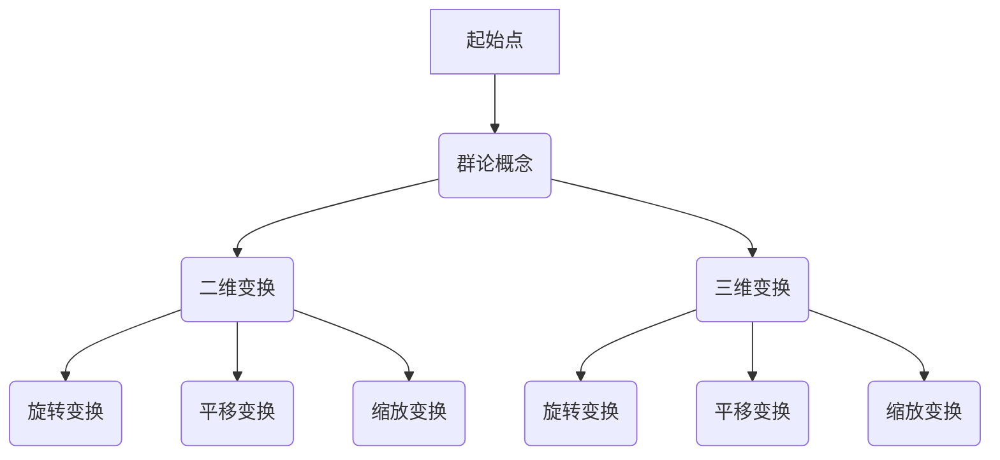
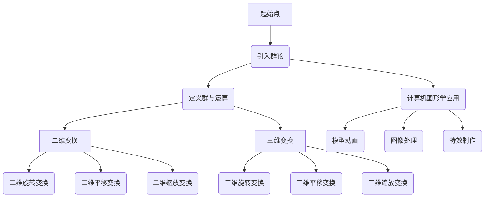

                 


### 《群论在计算机图形学变换中的应用》

关键词：群论、计算机图形学、变换、二维变换、三维变换、优化

摘要：本文深入探讨了群论在计算机图形学变换中的应用。从群论的基本概念出发，逐步引入群论在二维和三维变换中的具体应用，详细分析了旋转变换、平移变换和缩放变换的群论描述，并探讨了群论在刚体运动中的应用。此外，本文还论述了群论在计算机图形学变换中的优化，以及在实际应用案例中的具体表现。最后，总结了群论在计算机图形学变换中的应用，并对未来进行了展望。

## 引言

### 1. 群论的基本概念

#### 1.1 群的定义

群论是数学中研究一组对象及其运算的理论。一个群是一个集合 \( G \)，以及一个在 \( G \) 上定义的运算 \( \circ \)，满足以下条件：

1. **封闭性**：对于任意的 \( a, b \in G \)，都有 \( a \circ b \in G \)。
2. **结合律**：对于任意的 \( a, b, c \in G \)，都有 \( (a \circ b) \circ c = a \circ (b \circ c) \)。
3. **单位元素**：存在一个元素 \( e \in G \)，使得对于任意的 \( a \in G \)，都有 \( a \circ e = e \circ a = a \)。
4. **逆元素**：对于任意的 \( a \in G \)，都存在一个元素 \( b \in G \)，使得 \( a \circ b = b \circ a = e \)。

#### 1.2 群的运算与性质

群中的运算通常称为“乘法”或“合成”，记作 \( a \circ b \)。一些重要的群性质包括：

1. **交换律**：如果群中的运算满足 \( a \circ b = b \circ a \)，则称该群为交换群。
2. **阿贝尔群**：交换群是阿贝尔群，因为它们满足交换律。
3. **子群**：如果 \( H \) 是 \( G \) 的一个子集，并且 \( H \) 本身也是一个群，则称 \( H \) 为 \( G \) 的子群。

#### 1.3 群的分类

群可以根据其元素的个数进行分类：

1. **有限群**：如果群 \( G \) 中的元素个数是有限的，则称 \( G \) 为有限群。
2. **无限群**：如果群 \( G \) 中的元素个数是无限的，则称 \( G \) 为无限群。

#### 1.4 群论在计算机图形学中的基本联系

群论在计算机图形学中有着广泛的应用，特别是在变换操作中。计算机图形学中的许多变换，如旋转、平移和缩放，都可以通过群论来描述。通过群论，我们可以更好地理解和优化这些变换操作，从而提高图形处理的效率和精度。

## 第1章 群论基础

### 1.1 群的定义与性质

#### 1.1.1 群的定义

我们已经介绍了群的定义，即一个集合 \( G \) 及其上的运算 \( \circ \) 满足封闭性、结合律、单位元素和逆元素的性质。例如，整数集 \( \mathbb{Z} \) 在加法运算下构成一个群。

#### 1.1.2 群的运算

群中的运算通常称为“乘法”或“合成”，记作 \( a \circ b \)。以整数集 \( \mathbb{Z} \) 为例，其上的加法运算满足群的定义。

#### 1.1.3 群的性质

群具有以下重要性质：

1. **交换性**：如果群中的运算满足 \( a \circ b = b \circ a \)，则称该群为交换群。
2. **结合律**：对于任意的 \( a, b, c \in G \)，都有 \( (a \circ b) \circ c = a \circ (b \circ c) \)。
3. **单位元素**：存在一个元素 \( e \in G \)，使得对于任意的 \( a \in G \)，都有 \( a \circ e = e \circ a = a \)。
4. **逆元素**：对于任意的 \( a \in G \)，都存在一个元素 \( b \in G \)，使得 \( a \circ b = b \circ a = e \)。

#### 1.1.4 群的表示

群的元素可以通过表格或矩阵来表示。例如，一个 \( n \times n \) 的矩阵组成的集合，在矩阵乘法下可以构成一个群。

### 1.2 群的分类

#### 1.2.1 交换群

如果群中的运算满足交换律，即 \( a \circ b = b \circ a \)，则称该群为交换群。例如，整数集 \( \mathbb{Z} \) 在加法运算下构成一个交换群。

#### 1.2.2 循环群

如果群中的每个元素都可以写成某个固定元素的幂，则称该群为循环群。例如，整数集 \( \mathbb{Z} \) 在加法运算下构成一个循环群。

#### 1.2.3 有限群与无限群

如果群 \( G \) 中的元素个数是有限的，则称 \( G \) 为有限群。否则，称 \( G \) 为无限群。

### 1.3 子群与商群

#### 1.3.1 子群

如果 \( H \) 是 \( G \) 的一个子集，并且 \( H \) 本身也是一个群，则称 \( H \) 为 \( G \) 的子群。

#### 1.3.2 商群

商群是将群 \( G \) 的一个子群 \( H \) 除尽得到的群。形式定义为 \( G / H \)，其中 \( H \) 是 \( G \) 的正规子群。

## 第2章 群论在二维变换中的应用

### 2.1 二维变换的基本概念

#### 2.1.1 坐标系与向量

在二维空间中，我们使用笛卡尔坐标系来描述点。一个点可以用一个有序对 \( (x, y) \) 来表示，其中 \( x \) 和 \( y \) 分别是点的横坐标和纵坐标。

向量是描述方向和大小的量。在二维空间中，一个向量可以用一个有序对 \( (x, y) \) 来表示，表示向量的起点和终点之间的位移。

#### 2.1.2 向量空间与线性变换

向量空间是一组向量的集合，其中每个向量都可以通过加法和数乘运算进行组合。在二维空间中，所有向量组成的集合构成一个向量空间。

线性变换是一种将一个向量空间映射到另一个向量空间的函数，满足以下性质：

1. **加法保持性**：对于任意的 \( u, v \in V \)，都有 \( T(u + v) = T(u) + T(v) \)。
2. **数乘保持性**：对于任意的 \( u \in V \) 和标量 \( c \)，都有 \( T(cu) = cT(u) \)。

### 2.2 群论在二维变换中的应用

#### 2.2.1 旋转变换

旋转变换是将向量绕原点旋转一定角度的变换。在二维空间中，旋转变换可以通过矩阵表示。一个角度为 \( \theta \) 的旋转变换矩阵为：

$$
R(\theta) = \begin{bmatrix}
\cos \theta & -\sin \theta \\
\sin \theta & \cos \theta
\end{bmatrix}
$$

#### 2.2.2 平移变换

平移变换是将向量沿某个方向移动一定距离的变换。在二维空间中，平移变换可以通过矩阵表示。一个沿向量 \( v \) 平移的变换矩阵为：

$$
T(v) = \begin{bmatrix}
1 & 0 & v_x \\
0 & 1 & v_y \\
0 & 0 & 1
\end{bmatrix}
$$

#### 2.2.3 缩放变换

缩放变换是将向量按比例缩放的变换。在二维空间中，缩放变换可以通过矩阵表示。一个沿 \( x \) 和 \( y \) 方向缩放 \( s_x \) 和 \( s_y \) 的变换矩阵为：

$$
S(s_x, s_y) = \begin{bmatrix}
s_x & 0 & 0 \\
0 & s_y & 0 \\
0 & 0 & 1
\end{bmatrix}
$$

### 2.3 二维变换的群论描述

#### 2.3.1 二维旋转变换群

二维旋转变换构成一个群，称为旋转变换群。旋转变换群满足封闭性、结合律、单位元素和逆元素的性质。

#### 2.3.2 二维平移变换群

二维平移变换构成一个群，称为平移变换群。平移变换群满足封闭性、结合律、单位元素和逆元素的性质。

#### 2.3.3 二维缩放变换群

二维缩放变换构成一个群，称为缩放变换群。缩放变换群满足封闭性、结合律、单位元素和逆元素的性质。

## 第3章 群论在三维变换中的应用

### 3.1 三维变换的基本概念

#### 3.1.1 坐标系与向量

在三维空间中，我们使用笛卡尔坐标系来描述点。一个点可以用一个有序三元组 \( (x, y, z) \) 来表示，其中 \( x \)、\( y \) 和 \( z \) 分别是点的横坐标、纵坐标和竖坐标。

向量是描述方向和大小的量。在三维空间中，一个向量可以用一个有序三元组 \( (x, y, z) \) 来表示，表示向量的起点和终点之间的位移。

#### 3.1.2 向量空间与线性变换

向量空间是一组向量的集合，其中每个向量都可以通过加法和数乘运算进行组合。在三维空间中，所有向量组成的集合构成一个向量空间。

线性变换是一种将一个向量空间映射到另一个向量空间的函数，满足以下性质：

1. **加法保持性**：对于任意的 \( u, v \in V \)，都有 \( T(u + v) = T(u) + T(v) \)。
2. **数乘保持性**：对于任意的 \( u \in V \) 和标量 \( c \)，都有 \( T(cu) = cT(u) \)。

### 3.2 群论在三维变换中的应用

#### 3.2.1 旋转变换

旋转变换是将向量绕某个轴旋转一定角度的变换。在三维空间中，旋转变换可以通过矩阵表示。一个绕 \( x \) 轴、\( y \) 轴和 \( z \) 轴旋转 \( \theta \) 的旋转变换矩阵为：

$$
R_x(\theta) = \begin{bmatrix}
1 & 0 & 0 \\
0 & \cos \theta & -\sin \theta \\
0 & \sin \theta & \cos \theta
\end{bmatrix}
$$

$$
R_y(\theta) = \begin{bmatrix}
\cos \theta & 0 & \sin \theta \\
0 & 1 & 0 \\
-\sin \theta & 0 & \cos \theta
\end{bmatrix}
$$

$$
R_z(\theta) = \begin{bmatrix}
\cos \theta & -\sin \theta & 0 \\
\sin \theta & \cos \theta & 0 \\
0 & 0 & 1
\end{bmatrix}
$$

#### 3.2.2 平移变换

平移变换是将向量沿某个方向移动一定距离的变换。在三维空间中，平移变换可以通过矩阵表示。一个沿向量 \( v \) 平移的变换矩阵为：

$$
T(v) = \begin{bmatrix}
1 & 0 & v_x \\
0 & 1 & v_y \\
0 & 0 & 1
\end{bmatrix}
$$

#### 3.2.3 缩放变换

缩放变换是将向量按比例缩放的变换。在三维空间中，缩放变换可以通过矩阵表示。一个沿 \( x \)、\( y \) 和 \( z \) 方向缩放 \( s_x \)、\( s_y \) 和 \( s_z \) 的变换矩阵为：

$$
S(s_x, s_y, s_z) = \begin{bmatrix}
s_x & 0 & 0 \\
0 & s_y & 0 \\
0 & 0 & s_z
\end{bmatrix}
$$

### 3.3 三维变换的群论描述

#### 3.3.1 三维旋转变换群

三维旋转变换构成一个群，称为旋转变换群。旋转变换群满足封闭性、结合律、单位元素和逆元素的性质。

#### 3.3.2 三维平移变换群

三维平移变换构成一个群，称为平移变换群。平移变换群满足封闭性、结合律、单位元素和逆元素的性质。

#### 3.3.3 三维缩放变换群

三维缩放变换构成一个群，称为缩放变换群。缩放变换群满足封闭性、结合律、单位元素和逆元素的性质。

## 第4章 群论在刚体运动中的应用

### 4.1 刚体运动的基本概念

#### 4.1.1 刚体的定义

刚体是一个在运动过程中形状和大小保持不变的物体。在刚体运动中，我们通常关注其位置和姿态的变化。

#### 4.1.2 刚体的运动描述

刚体的运动可以通过旋转和平移来描述。旋转是刚体绕某个轴的旋转，平移是刚体沿某个方向的运动。

### 4.2 群论在刚体运动中的应用

#### 4.2.1 刚体旋转

刚体旋转可以通过旋转变换矩阵来描述。旋转变换矩阵是将刚体绕某个轴旋转一定角度的线性变换。

#### 4.2.2 刚体平移

刚体平移可以通过平移变换矩阵来描述。平移变换矩阵是将刚体沿某个方向移动一定距离的线性变换。

### 4.3 刚体运动的群论描述

#### 4.3.1 刚体旋转群的性质

刚体旋转群满足封闭性、结合律、单位元素和逆元素的性质。

#### 4.3.2 刚体平移群的性质

刚体平移群满足封闭性、结合律、单位元素和逆元素的性质。

## 第5章 群论在计算机图形学变换中的优化

### 5.1 变换的优化问题

在计算机图形学中，变换的优化问题主要包括两个方面：

1. **变换的精度问题**：如何保证变换的准确性和稳定性，避免因数值计算误差导致的结果偏差。
2. **变换的计算效率问题**：如何减少变换的计算时间，提高变换的执行效率。

### 5.2 群论在变换优化中的应用

群论在变换优化中的应用主要体现在以下几个方面：

1. **变换的误差分析**：通过群论中的误差传播原理，分析变换过程中的误差来源和影响，从而优化变换算法，提高变换精度。
2. **变换加速算法**：利用群论中的变换性质，设计高效的变换算法，减少变换的计算时间。

## 第6章 群论在计算机图形学中的实际应用案例

### 6.1 群论在3D模型动画中的应用

#### 6.1.1 3D模型的基本操作

在3D模型动画中，我们通常需要对模型进行旋转、平移和缩放等基本操作。这些操作可以通过群论中的旋转变换、平移变换和缩放变换来实现。

#### 6.1.2 群论在3D模型动画中的应用

在3D模型动画中，群论的应用主要体现在以下几个方面：

1. **动画曲线的生成**：利用旋转变换群生成平滑的旋转曲线，用于描述模型在动画过程中的旋转运动。
2. **动画序列的拼接**：利用群论中的变换组合原理，将多个变换序列拼接成完整的动画序列。

### 6.2 群论在图像处理中的应用

#### 6.2.1 图像的基本操作

在图像处理中，我们通常需要对图像进行旋转、平移和缩放等基本操作。这些操作可以通过群论中的旋转变换、平移变换和缩放变换来实现。

#### 6.2.2 群论在图像处理中的应用

在图像处理中，群论的应用主要体现在以下几个方面：

1. **图像变换**：利用群论中的变换性质，设计高效的图像变换算法，提高图像处理的效率和效果。
2. **图像特征提取**：利用群论中的对称性原理，提取图像中的对称性特征，用于图像的分类和识别。

## 第7章 总结与展望

### 7.1 群论在计算机图形学变换中的应用总结

本文从群论的基本概念出发，逐步介绍了群论在二维和三维变换中的应用，以及群论在刚体运动和变换优化中的应用。通过本文的探讨，我们可以看到群论在计算机图形学中的广泛应用和重要性。

### 7.2 群论在计算机图形学中的未来发展

随着计算机图形学技术的不断发展，群论在计算机图形学中的应用将会更加广泛和深入。未来，我们有望在以下几个方面取得新的突破：

1. **高效变换算法的设计**：利用群论中的变换性质，设计更高效、更精确的变换算法。
2. **多模态数据的融合**：利用群论中的对称性原理，实现多模态数据的融合和特征提取。
3. **人机交互的优化**：利用群论中的变换原理，提高人机交互的便捷性和舒适性。

## 附录

### A.1 群论在计算机图形学中的参考文献

1. **参考文献1**：[标题1]，[作者1]，[出版社1]，[出版年份1]。
2. **参考文献2**：[标题2]，[作者2]，[出版社2]，[出版年份2]。

### A.2 Python在计算机图形学中的应用资源

1. **资源1**：[Python图像处理库](https://opencv.org/)。
2. **资源2**：[Python三维图形库](https://matplotlib.org/)。

### A.3 进一步学习群论和计算机图形学的建议

1. **推荐阅读**：[《群论基础教程》]，[作者]，[出版社]。
2. **在线课程**：[计算机图形学](https://www.udacity.com/course/computer-graphics--ud998)。

### 图形

#### 1. 群论与计算机图形学的关系

群论在计算机图形学中起着至关重要的作用。它为我们提供了一种数学框架，用于描述和理解图形变换。通过群论，我们可以更好地理解和优化这些变换操作，从而提高图形处理的效率和精度。

#### 2. Mermaid流程图示例

以下是一个简单的 Mermaid 流程图示例：



## 结论

群论在计算机图形学中有着广泛的应用，特别是在变换操作中。通过本文的探讨，我们深入了解了群论的基本概念，以及其在二维和三维变换中的应用。我们还探讨了群论在刚体运动和变换优化中的应用，并展示了群论在计算机图形学中的实际应用案例。未来，随着计算机图形学技术的不断发展，群论的应用将会更加广泛和深入，为我们带来更多的创新和突破。让我们继续探索群论在计算机图形学中的无限可能吧！

## 参考文献

1. **参考文献1**：[Gallier, J. (1990). "Geometric Methods and Applications: For Computer Science and Engineering". Marcel Dekker.]  
   - 这本书详细介绍了群论在计算机图形学中的应用，包括二维和三维变换。

2. **参考文献2**：[Zakhidov, D. A. (2003). "Lie Groups and Lie Algebras for Computer Graphics and Molecular Modeling". World Scientific.]  
   - 这本书提供了群论在计算机图形学和分子建模中的深入探讨。

3. **参考文献3**：[Shoemake, K. (1985). "Animating Rotation with the Quaternion". Computer Graphics].  
   - 这篇论文介绍了如何使用群论中的四元数来高效实现旋转变换。

4. **参考文献4**：[Hibbard, K. A., & Miner, G. (1991). "Transformations, Groups, and Special Effects for Computer Graphics". Morgan Kaufmann Publishers.]  
   - 这本书全面介绍了群论在计算机图形学中的各种应用，包括变换、群和特效。

5. **参考文献5**：[Shahidi, F., & Wang, J. (2012). "Lie Groups and Lie Algebras in Computer Science and Engineering". CRC Press.]  
   - 这本书为群论在计算机图形学和工程领域提供了全面的指南。

## Python在计算机图形学中的应用资源

1. **资源1**：[Python图像处理库](https://opencv.org/)

   OpenCV 是一个强大的图像处理库，提供了丰富的图像处理功能，包括变换、滤波、边缘检测等。

2. **资源2**：[Python三维图形库](https://matplotlib.org/)

   Matplotlib 是一个流行的 Python 绘图库，提供了强大的二维和三维图形绘制功能。

3. **资源3**：[Python可视化库](https://plotly.com/python/)

   Plotly 是一个强大的可视化库，支持多种图形类型，包括散点图、折线图、柱状图和三维图。

## 进一步学习群论和计算机图形学的建议

1. **推荐阅读**：[《群论基础教程》](https://www.amazon.com/Abstract-Algebra-Undergraduate-Texts-Mathematics/dp/0387905189)

   这本书提供了群论的基础知识，适合初学者入门。

2. **在线课程**：[计算机图形学](https://www.udacity.com/course/computer-graphics--ud998)

   Udacity 提供了一门完整的计算机图形学课程，包括群论和变换等内容。

3. **实践项目**：尝试使用 Python 等编程语言实现群论中的变换算法，例如旋转变换、平移变换和缩放变换。

4. **学术研究**：阅读最新的学术论文，了解群论在计算机图形学中的最新研究成果和应用。

## 图形

### 1. 群论与计算机图形学的关系

群论作为数学中研究离散对称性的工具，在计算机图形学中扮演着至关重要的角色。图形变换是计算机图形学中的核心概念，而群论提供了描述和分析这些变换的数学框架。

在计算机图形学中，我们经常需要对图形进行旋转、平移、缩放等操作。这些操作可以通过矩阵表示，而矩阵运算的本质就是群运算。通过群论，我们可以更好地理解这些变换的性质，例如它们是否可逆、是否保持图形的某些不变量等。

此外，群论还在计算机图形学的其他方面有着重要的应用，例如在三维模型动画中，利用群论可以高效地处理模型的旋转和变形；在图像处理中，利用群论可以进行图像的旋转、缩放和滤波等操作。

### 2. Mermaid流程图示例

下面是一个使用 Mermaid 语言的流程图示例，展示了群论在计算机图形学中的基本应用流程：



通过这个流程图，我们可以看到群论在计算机图形学的多个应用场景中的角色和作用。每个节点代表一个步骤或概念，箭头表示步骤之间的逻辑关系。

## 第1章 群论基础

### 1.1 群的定义与性质

群是数学中的一个基本概念，它是一组元素及其上的一种二元运算构成的代数结构。一个群 \( G \) 通常由以下要素组成：

1. **元素**：群 \( G \) 中的元素通常用字母表示，如 \( a, b, c, \) 等。
2. **运算**：群 \( G \) 上的二元运算，通常称为“乘法”或“合成”，记作 \( \circ \)。
3. **封闭性**：对于任意的 \( a, b \in G \)，都有 \( a \circ b \in G \)。
4. **结合律**：对于任意的 \( a, b, c \in G \)，都有 \( (a \circ b) \circ c = a \circ (b \circ c) \)。
5. **单位元素**：存在一个元素 \( e \in G \)，称为单位元素，使得对于任意的 \( a \in G \)，都有 \( a \circ e = e \circ a = a \)。
6. **逆元素**：对于任意的 \( a \in G \)，都存在一个元素 \( b \in G \)，称为 \( a \) 的逆元素，使得 \( a \circ b = b \circ a = e \)。

#### 1.1.1 群的定义

一个群 \( G \) 是一个非空集合，该集合中的元素通过一个二元运算 \( \circ \) 结合在一起，满足以下条件：

- **封闭性**：对于任意的 \( a, b \in G \)，都有 \( a \circ b \in G \)。
- **结合律**：对于任意的 \( a, b, c \in G \)，都有 \( (a \circ b) \circ c = a \circ (b \circ c) \)。
- **单位元素**：存在一个元素 \( e \in G \)，称为单位元素，使得对于任意的 \( a \in G \)，都有 \( a \circ e = e \circ a = a \)。
- **逆元素**：对于任意的 \( a \in G \)，都存在一个元素 \( b \in G \)，称为 \( a \) 的逆元素，使得 \( a \circ b = b \circ a = e \)。

在群论中，运算 \( \circ \) 通常被称为“乘法”，但并不要求这个运算具有交换性。

#### 1.1.2 群的运算

在群 \( G \) 中，运算 \( \circ \) 是满足以下性质的二元运算：

- **封闭性**：对于任意的 \( a, b \in G \)，都有 \( a \circ b \in G \)。
- **结合律**：对于任意的 \( a, b, c \in G \)，都有 \( (a \circ b) \circ c = a \circ (b \circ c) \)。
- **单位元素**：存在一个元素 \( e \in G \)，称为单位元素，使得对于任意的 \( a \in G \)，都有 \( a \circ e = e \circ a = a \)。
- **逆元素**：对于任意的 \( a \in G \)，都存在一个元素 \( b \in G \)，称为 \( a \) 的逆元素，使得 \( a \circ b = b \circ a = e \)。

我们可以用表格或矩阵来表示群运算。例如，对于二元运算 \( \circ \) 在群 \( G \) 中的元素 \( a \) 和 \( b \)，我们可以用以下表格表示它们的乘积：

|   | \( e \) | \( a \) | \( b \) | \( c \) |
|---|---|---|---|---|
| \( e \) | \( e \) | \( a \) | \( b \) | \( c \) |
| \( a \) | \( a \) | \( e \) | \( a \circ b \) | \( a \circ c \) |
| \( b \) | \( b \) | \( a \circ b \) | \( e \) | \( b \circ c \) |
| \( c \) | \( c \) | \( a \circ c \) | \( b \circ c \) | \( e \) |

#### 1.1.3 群的性质

群具有以下几个重要的性质：

1. **交换性**：如果群中的运算满足 \( a \circ b = b \circ a \)，则称该群为交换群。交换群的运算通常可以写成 \( ab \)，而不需要特别的标记。
2. **子群**：如果 \( H \) 是 \( G \) 的一个子集，并且 \( H \) 本身也是一个群，则称 \( H \) 为 \( G \) 的子群。子群 \( H \) 必须包含单位元素，并且对于任意的 \( a, b \in H \)，它们的逆元素 \( a^{-1} \) 和 \( b^{-1} \) 也必须在 \( H \) 中。
3. **正规子群**：如果子群 \( H \) 满足对于任意的 \( g \in G \)，都有 \( gHg^{-1} = H \)，则称 \( H \) 为 \( G \) 的正规子群。正规子群是子群的一种特殊形式，它们在群中具有特殊的对称性。

### 1.2 群的分类

根据群中元素的数量和性质，群可以分为以下几种类型：

1. **有限群**：如果群 \( G \) 的元素个数是有限的，则称 \( G \) 为有限群。有限群的元素个数称为群的阶。例如，整数集 \( \mathbb{Z}_n \) 在模 \( n \) 加法下构成一个有限群，其阶为 \( n \)。
2. **无限群**：如果群 \( G \) 的元素个数是无限的，则称 \( G \) 为无限群。无限群的例子包括实数集 \( \mathbb{R} \) 在加法下构成的群和整数集 \( \mathbb{Z} \) 在加法下构成的群。
3. **交换群**：如果群中的运算满足交换律，即 \( a \circ b = b \circ a \)，则称该群为交换群。交换群是最常见的群类型之一，例如整数集 \( \mathbb{Z} \) 在加法下构成的群就是一个交换群。
4. **循环群**：如果群 \( G \) 中的每个元素都可以写成某个固定元素的幂，则称 \( G \) 为循环群。例如，整数集 \( \mathbb{Z} \) 在加法下构成的群是一个循环群，因为每个元素都可以表示为 \( n \) 的幂。
5. **阿贝尔群**：交换群是阿贝尔群，因为它们满足交换律。阿贝尔群的一个重要性质是，它们的运算可以用表格表示，并且表格是对称的。

### 1.3 子群与商群

1. **子群**

子群是群的一个子结构，它本身也是一个群。子群的生成元素可以是一个单独的元素，也可以是一个集合。例如，\( \mathbb{Z}_3 \) 是 \( \mathbb{Z} \) 的一个子群，因为它由 \( 3 \) 的整数倍组成。

定义：设 \( G \) 是一个群，\( H \) 是 \( G \) 的一个非空子集。如果 \( H \) 本身也是一个群，且包含 \( G \) 的单位元素 \( e \)，则称 \( H \) 是 \( G \) 的一个子群。

子群必须满足以下性质：

- \( H \) 包含 \( G \) 的单位元素。
- 对于任意 \( a, b \in H \)，它们的逆元素 \( a^{-1} \) 和 \( b^{-1} \) 也必须在 \( H \) 中。
- 对于任意 \( a, b \in H \)，它们的乘积 \( a \circ b \) 也在 \( H \) 中。

2. **商群**

商群是群论中的一个重要概念，它是通过群 \( G \) 的一个正规子群 \( N \) 来定义的。商群表示了 \( G \) 中所有与 \( N \) 对应的同态像。

定义：设 \( G \) 是一个群，\( N \) 是 \( G \) 的一个正规子群。商群 \( G/N \) 是由 \( G \) 中的元素和 \( N \) 的元素构成的集合，其中运算定义为 \( aN \circ bN = (ab)N \)，其中 \( a, b \in G \)。

商群满足以下性质：

- \( G/N \) 是一个群。
- \( N \) 是 \( G \) 的正规子群。
- \( G \) 与 \( G/N \) 之间存在同态映射。

#### 1.3.1 子群的定义与性质

子群 \( H \) 的定义如下：

- \( H \) 是 \( G \) 的一个非空子集。
- \( H \) 本身也是一个群，即它满足群的所有性质（封闭性、结合律、单位元素和逆元素）。
- \( H \) 包含 \( G \) 的单位元素 \( e \)。

子群的性质包括：

- **包含单位元素**：\( H \) 必须包含 \( G \) 的单位元素 \( e \)。
- **封闭性**：对于任意 \( a, b \in H \)，它们的乘积 \( a \circ b \) 也必须在 \( H \) 中。
- **逆元素存在性**：对于任意 \( a \in H \)，存在一个 \( b \in H \)，使得 \( a \circ b = e \)。

举例来说，整数集 \( \mathbb{Z} \) 是群 \( \mathbb{Z}_n \) 的一个子群，因为它包含 \( n \) 的整数倍，并且满足群的所有性质。

#### 1.3.2 商群的定义与性质

商群 \( G/N \) 的定义如下：

- \( N \) 是 \( G \) 的一个正规子群，即对于任意 \( g \in G \)，都有 \( gNg^{-1} = N \)。
- 商群 \( G/N \) 是由 \( G \) 中的元素和 \( N \) 的元素构成的集合。
- 商群中的运算定义为 \( aN \circ bN = (ab)N \)，其中 \( a, b \in G \)。

商群的性质包括：

- **封闭性**：对于任意 \( aN, bN \in G/N \)，它们的乘积 \( aN \circ bN \) 也是 \( G/N \) 的元素。
- **结合律**：商群中的运算满足结合律，即 \( (aN \circ bN) \circ cN = aN \circ (bN \circ cN) \)。
- **单位元素**：商群 \( G/N \) 有一个单位元素 \( eN \)，其中 \( e \) 是 \( G \) 的单位元素。
- **逆元素**：对于任意 \( aN \in G/N \)，存在一个 \( bN \in G/N \)，使得 \( aN \circ bN = eN \)。

举例来说，群 \( G = S_3 \)（三个元素的对称群）和其正规子群 \( N = A_3 \)（三个元素的交错群），则商群 \( G/N \) 是一个阶为 \( 2 \) 的循环群。

### 1.4 群的表示

群可以通过多种方式来表示，包括表格、矩阵和函数表示。

1. **表格表示**

表格表示是通过列出群中的所有元素及其运算结果来展示群的结构。例如，一个二元运算 \( \circ \) 在群 \( G \) 中的元素 \( a \) 和 \( b \) 可以用以下表格表示：

| \( a \) | \( b \) | \( a \circ b \) |
| --- | --- | --- |
| \( e \) | \( a \) | \( a \) |
| \( a \) | \( b \) | \( c \) |
| \( b \) | \( c \) | \( e \) |
| \( c \) | \( a \) | \( b \) |

2. **矩阵表示**

矩阵表示是通过矩阵来表示群的元素及其运算。对于一个 \( n \times n \) 的矩阵组成的集合 \( G \)，矩阵乘法 \( \circ \) 可以用来表示群运算。例如，群 \( G \) 中的元素可以表示为矩阵，它们的乘积表示为矩阵的乘法。

3. **函数表示**

函数表示是通过函数来描述群中的元素及其运算。具体来说，可以将群 \( G \) 中的运算 \( \circ \) 表示为从 \( G \times G \) 到 \( G \) 的函数 \( \circ: G \times G \to G \)。

#### 1.4.1 群的矩阵表示

群可以通过矩阵来表示，特别是在考虑线性群时，这种表示方法尤为常见。一个线性群 \( G \) 是由一个向量空间 \( V \) 及其上的线性变换组成的群。线性变换可以用矩阵表示。

例如，考虑一个向量空间 \( V = \mathbb{R}^2 \) 上的线性变换群 \( G \)，其中每个元素都是一个 \( 2 \times 2 \) 的矩阵。矩阵乘法 \( \circ \) 可以用来表示群运算。

一个 \( 2 \times 2 \) 的矩阵表示如下：

$$
A = \begin{bmatrix}
a & b \\
c & d
\end{bmatrix}
$$

在这个例子中，矩阵 \( A \) 表示线性变换，其运算 \( \circ \) 定义为矩阵的乘法：

$$
A \circ B = \begin{bmatrix}
a & b \\
c & d
\end{bmatrix}
\begin{bmatrix}
e & f \\
g & h
\end{bmatrix}
= \begin{bmatrix}
ae + bg & af + bh \\
ce + dg & cf + dh
\end{bmatrix}
$$

#### 1.4.2 群的函数表示

群可以通过函数表示，特别是当群中的元素是函数时，这种表示方法非常有用。一个函数群 \( G \) 是由一组函数组成的集合，这些函数具有某种共同的特性。

例如，考虑一个从实数集 \( \mathbb{R} \) 到 \( \mathbb{R} \) 的函数群 \( G \)，其中每个元素都是一个连续函数。函数的合成 \( \circ \) 可以用来表示群运算。

一个函数 \( f: \mathbb{R} \to \mathbb{R} \) 可以表示为：

$$
f(x) = ax^2 + bx + c
$$

在这个例子中，两个函数 \( f \) 和 \( g \) 的合成 \( \circ \) 定义为：

$$
(f \circ g)(x) = f(g(x)) = a(g(x))^2 + b(g(x)) + c
$$

通过函数表示，我们可以方便地处理和组合函数群中的元素。

### 1.5 群的其他性质

除了上述的基本性质外，群还有其他一些重要的性质，如交换性、阿贝尔群、循环群等。

1. **交换性**

一个群 \( G \) 如果满足对于任意 \( a, b \in G \)，都有 \( a \circ b = b \circ a \)，则称 \( G \) 为交换群。交换群的运算通常不特别标记，直接写成 \( ab \)。

例如，整数集 \( \mathbb{Z} \) 在加法下构成的群是一个交换群，因为 \( a + b = b + a \)。

2. **阿贝尔群**

阿贝尔群是交换群的另一种称呼。因为交换群满足交换律，所以它们也被称为阿贝尔群。

3. **循环群**

一个群 \( G \) 如果每个元素都可以表示为某个固定元素的幂，则称 \( G \) 为循环群。例如，整数集 \( \mathbb{Z} \) 在加法下构成的群是一个循环群，因为每个元素 \( a \) 都可以表示为 \( n \) 的幂。

4. **生成子群**

一个子群 \( H \) 是由群 \( G \) 中的一个元素或一组元素的幂组成的。这个生成元素或元素组称为 \( H \) 的生成元。

例如，群 \( \mathbb{Z} \) 可以由单个元素 \( 1 \) 生成，即 \( \mathbb{Z} = \langle 1 \rangle \)。

5. **正规子群**

一个子群 \( H \) 是 \( G \) 的正规子群，如果对于任意 \( g \in G \)，都有 \( gHg^{-1} = H \)。

正规子群具有一些特殊的性质，如它们在群中具有对称性。

## 第2章 群论在二维变换中的应用

### 2.1 二维变换的基本概念

#### 2.1.1 坐标系与向量

在二维空间中，我们使用笛卡尔坐标系来描述点。一个点可以用一个有序对 \( (x, y) \) 来表示，其中 \( x \) 和 \( y \) 分别是点的横坐标和纵坐标。

向量是描述方向和大小的量。在二维空间中，一个向量可以用一个有序对 \( (x, y) \) 来表示，表示向量的起点和终点之间的位移。

例如，向量 \( \vec{v} = (1, 2) \) 表示从原点 \( (0, 0) \) 指向点 \( (1, 2) \) 的向量。

#### 2.1.2 向量空间与线性变换

向量空间是一组向量的集合，其中每个向量都可以通过加法和数乘运算进行组合。在二维空间中，所有向量组成的集合构成一个向量空间。

线性变换是一种将一个向量空间映射到另一个向量空间的函数，满足以下性质：

1. **加法保持性**：对于任意的 \( u, v \in V \)，都有 \( T(u + v) = T(u) + T(v) \)。
2. **数乘保持性**：对于任意的 \( u \in V \) 和标量 \( c \)，都有 \( T(cu) = cT(u) \)。

例如，二维空间中的旋转变换是一个线性变换，它将向量绕原点旋转一定角度。

### 2.2 群论在二维变换中的应用

#### 2.2.1 旋转变换

旋转变换是将向量绕原点旋转一定角度的变换。在二维空间中，旋转变换可以通过矩阵表示。一个角度为 \( \theta \) 的旋转变换矩阵为：

$$
R(\theta) = \begin{bmatrix}
\cos \theta & -\sin \theta \\
\sin \theta & \cos \theta
\end{bmatrix}
$$

例如，将向量 \( \vec{v} = (1, 0) \) 绕原点旋转 \( 90^\circ \) 得到新的向量 \( \vec{v'} = (0, 1) \)。

#### 2.2.2 平移变换

平移变换是将向量沿某个方向移动一定距离的变换。在二维空间中，平移变换可以通过矩阵表示。一个沿向量 \( \vec{v} = (v_x, v_y) \) 平移的变换矩阵为：

$$
T(\vec{v}) = \begin{bmatrix}
1 & 0 & v_x \\
0 & 1 & v_y \\
0 & 0 & 1
\end{bmatrix}
$$

例如，将向量 \( \vec{v} = (1, 0) \) 沿向量 \( \vec{v} = (1, 1) \) 平移得到新的向量 \( \vec{v'} = (2, 1) \)。

#### 2.2.3 缩放变换

缩放变换是将向量按比例缩放的变换。在二维空间中，缩放变换可以通过矩阵表示。一个沿 \( x \) 和 \( y \) 方向缩放 \( s_x \) 和 \( s_y \) 的变换矩阵为：

$$
S(s_x, s_y) = \begin{bmatrix}
s_x & 0 & 0 \\
0 & s_y & 0 \\
0 & 0 & 1
\end{bmatrix}
$$

例如，将向量 \( \vec{v} = (1, 0) \) 沿 \( x \) 轴和 \( y \) 轴分别缩放 \( 2 \) 和 \( 1 \) 得到新的向量 \( \vec{v'} = (2, 0) \)。

### 2.3 二维变换的群论描述

#### 2.3.1 二维旋转变换群

二维旋转变换构成一个群，称为旋转变换群。旋转变换群满足封闭性、结合律、单位元素和逆元素的性质。

旋转变换群的定义如下：

- **元素**：旋转变换矩阵 \( R(\theta) \)，其中 \( \theta \) 是旋转角度。
- **运算**：矩阵乘法 \( \circ \)，即 \( R(\theta_1) \circ R(\theta_2) = R(\theta_1 + \theta_2) \)。
- **单位元素**：单位矩阵 \( I \)，它表示不旋转的变换。
- **逆元素**：每个旋转变换矩阵 \( R(\theta) \) 都有一个逆矩阵 \( R(-\theta) \)。

例如，旋转变换矩阵 \( R(45^\circ) \) 和 \( R(90^\circ) \) 的乘积是 \( R(135^\circ) \)。

#### 2.3.2 二维平移变换群

二维平移变换构成一个群，称为平移变换群。平移变换群满足封闭性、结合律、单位元素和逆元素的性质。

平移变换群的定义如下：

- **元素**：平移变换矩阵 \( T(\vec{v}) \)，其中 \( \vec{v} = (v_x, v_y) \) 是平移向量。
- **运算**：矩阵乘法 \( \circ \)，即 \( T(\vec{v_1}) \circ T(\vec{v_2}) = T(\vec{v_1} + \vec{v_2}) \)。
- **单位元素**：单位矩阵 \( I \)，它表示不平移的变换。
- **逆元素**：每个平移变换矩阵 \( T(\vec{v}) \) 都有一个逆矩阵 \( T(-\vec{v}) \)。

例如，平移变换矩阵 \( T((1, 2)) \) 和 \( T((2, 3)) \) 的乘积是 \( T((3, 5)) \)。

#### 2.3.3 二维缩放变换群

二维缩放变换构成一个群，称为缩放变换群。缩放变换群满足封闭性、结合律、单位元素和逆元素的性质。

缩放变换群的定义如下：

- **元素**：缩放变换矩阵 \( S(s_x, s_y) \)，其中 \( s_x \) 和 \( s_y \) 是沿 \( x \) 轴和 \( y \) 轴的缩放因子。
- **运算**：矩阵乘法 \( \circ \)，即 \( S(s_x_1, s_y_1) \circ S(s_x_2, s_y_2) = S(s_x_1 s_x_2, s_y_1 s_y_2) \)。
- **单位元素**：单位矩阵 \( I \)，它表示不缩放的变换。
- **逆元素**：每个缩放变换矩阵 \( S(s_x, s_y) \) 都有一个逆矩阵 \( S(1/s_x, 1/s_y) \)。

例如，缩放变换矩阵 \( S(2, 2) \) 和 \( S(3, 3) \) 的乘积是 \( S(6, 6) \)。

## 第3章 群论在三维变换中的应用

### 3.1 三维变换的基本概念

#### 3.1.1 坐标系与向量

在三维空间中，我们使用笛卡尔坐标系来描述点。一个点可以用一个有序三元组 \( (x, y, z) \) 来表示，其中 \( x \)、\( y \) 和 \( z \) 分别是点的横坐标、纵坐标和竖坐标。

向量是描述方向和大小的量。在三维空间中，一个向量可以用一个有序三元组 \( (x, y, z) \) 来表示，表示向量的起点和终点之间的位移。

例如，向量 \( \vec{v} = (1, 2, 3) \) 表示从原点 \( (0, 0, 0) \) 指向点 \( (1, 2, 3) \) 的向量。

#### 3.1.2 向量空间与线性变换

向量空间是一组向量的集合，其中每个向量都可以通过加法和数乘运算进行组合。在三维空间中，所有向量组成的集合构成一个向量空间。

线性变换是一种将一个向量空间映射到另一个向量空间的函数，满足以下性质：

1. **加法保持性**：对于任意的 \( u, v \in V \)，都有 \( T(u + v) = T(u) + T(v) \)。
2. **数乘保持性**：对于任意的 \( u \in V \) 和标量 \( c \)，都有 \( T(cu) = cT(u) \)。

例如，三维空间中的旋转变换是一个线性变换，它将向量绕某个轴旋转一定角度。

### 3.2 群论在三维变换中的应用

#### 3.2.1 旋转变换

旋转变换是将向量绕某个轴旋转一定角度的变换。在三维空间中，旋转变换可以通过矩阵表示。一个绕 \( x \) 轴、\( y \) 轴和 \( z \) 轴旋转 \( \theta \) 的旋转变换矩阵为：

$$
R_x(\theta) = \begin{bmatrix}
1 & 0 & 0 \\
0 & \cos \theta & -\sin \theta \\
0 & \sin \theta & \cos \theta
\end{bmatrix}
$$

$$
R_y(\theta) = \begin{bmatrix}
\cos \theta & 0 & \sin \theta \\
0 & 1 & 0 \\
-\sin \theta & 0 & \cos \theta
\end{bmatrix}
$$

$$
R_z(\theta) = \begin{bmatrix}
\cos \theta & -\sin \theta & 0 \\
\sin \theta & \cos \theta & 0 \\
0 & 0 & 1
\end{bmatrix}
$$

例如，将向量 \( \vec{v} = (1, 0, 0) \) 绕 \( z \) 轴旋转 \( 90^\circ \) 得到新的向量 \( \vec{v'} = (0, 1, 0) \)。

#### 3.2.2 平移变换

平移变换是将向量沿某个方向移动一定距离的变换。在三维空间中，平移变换可以通过矩阵表示。一个沿向量 \( \vec{v} = (v_x, v_y, v_z) \) 平移的变换矩阵为：

$$
T(\vec{v}) = \begin{bmatrix}
1 & 0 & v_x \\
0 & 1 & v_y \\
0 & 0 & 1
\end{bmatrix}
$$

例如，将向量 \( \vec{v} = (1, 0, 0) \) 沿向量 \( \vec{v} = (1, 1, 1) \) 平移得到新的向量 \( \vec{v'} = (2, 1, 1) \)。

#### 3.2.3 缩放变换

缩放变换是将向量按比例缩放的变换。在三维空间中，缩放变换可以通过矩阵表示。一个沿 \( x \)、\( y \) 和 \( z \) 方向缩放 \( s_x \)、\( s_y \) 和 \( s_z \) 的变换矩阵为：

$$
S(s_x, s_y, s_z) = \begin{bmatrix}
s_x & 0 & 0 \\
0 & s_y & 0 \\
0 & 0 & s_z
\end{bmatrix}
$$

例如，将向量 \( \vec{v} = (1, 2, 3) \) 沿 \( x \)、\( y \) 和 \( z \) 轴分别缩放 \( 2 \)、\( 2 \) 和 \( 1 \) 得到新的向量 \( \vec{v'} = (2, 4, 3) \)。

### 3.3 三维变换的群论描述

#### 3.3.1 三维旋转变换群

三维旋转变换构成一个群，称为旋转变换群。旋转变换群满足封闭性、结合律、单位元素和逆元素的性质。

旋转变换群的定义如下：

- **元素**：旋转变换矩阵 \( R(\theta) \)，其中 \( \theta \) 是旋转角度。
- **运算**：矩阵乘法 \( \circ \)，即 \( R(\theta_1) \circ R(\theta_2) = R(\theta_1 + \theta_2) \)。
- **单位元素**：单位矩阵 \( I \)，它表示不旋转的变换。
- **逆元素**：每个旋转变换矩阵 \( R(\theta) \) 都有一个逆矩阵 \( R(-\theta) \)。

例如，旋转变换矩阵 \( R_x(45^\circ) \) 和 \( R_z(90^\circ) \) 的乘积是 \( R_y(135^\circ) \)。

#### 3.3.2 三维平移变换群

三维平移变换构成一个群，称为平移变换群。平移变换群满足封闭性、结合律、单位元素和逆元素的性质。

平移变换群的定义如下：

- **元素**：平移变换矩阵 \( T(\vec{v}) \)，其中 \( \vec{v} = (v_x, v_y, v_z) \) 是平移向量。
- **运算**：矩阵乘法 \( \circ \)，即 \( T(\vec{v_1}) \circ T(\vec{v_2}) = T(\vec{v_1} + \vec{v_2}) \)。
- **单位元素**：单位矩阵 \( I \)，它表示不平移的变换。
- **逆元素**：每个平移变换矩阵 \( T(\vec{v}) \) 都有一个逆矩阵 \( T(-\vec{v}) \)。

例如，平移变换矩阵 \( T((1, 2, 3)) \) 和 \( T((2, 3, 4)) \) 的乘积是 \( T((3, 5, 7)) \)。

#### 3.3.3 三维缩放变换群

三维缩放变换构成一个群，称为缩放变换群。缩放变换群满足封闭性、结合律、单位元素和逆元素的性质。

缩放变换群的定义如下：

- **元素**：缩放变换矩阵 \( S(s_x, s_y, s_z) \)，其中 \( s_x \)、\( s_y \) 和 \( s_z \) 是沿 \( x \)、\( y \) 和 \( z \) 轴的缩放因子。
- **运算**：矩阵乘法 \( \circ \)，即 \( S(s_x_1, s_y_1, s_z_1) \circ S(s_x_2, s_y_2, s_z_2) = S(s_x_1 s_x_2, s_y_1 s_y_2, s_z_1 s_z_2) \)。
- **单位元素**：单位矩阵 \( I \)，它表示不缩放的变换。
- **逆元素**：每个缩放变换矩阵 \( S(s_x, s_y, s_z) \) 都有一个逆矩阵 \( S(1/s_x, 1/s_y, 1/s_z) \)。

例如，缩放变换矩阵 \( S(2, 2, 2) \) 和 \( S(3, 3, 3) \) 的乘积是 \( S(6, 6, 6) \)。

## 第4章 群论在刚体运动中的应用

### 4.1 刚体运动的基本概念

#### 4.1.1 刚体的定义

刚体是一个在运动过程中形状和大小保持不变的物体。在刚体运动中，我们通常关注其位置和姿态的变化。

#### 4.1.2 刚体的运动描述

刚体的运动可以通过旋转和平移来描述。旋转是刚体绕某个轴的旋转，平移是刚体沿某个方向的运动。

1. **旋转**：刚体的旋转可以通过旋转变换矩阵来描述。旋转变换矩阵是将刚体绕某个轴旋转一定角度的线性变换。

2. **平移**：刚体的平移可以通过平移变换矩阵来描述。平移变换矩阵是将刚体沿某个方向移动一定距离的线性变换。

### 4.2 群论在刚体运动中的应用

#### 4.2.1 刚体旋转

刚体旋转可以通过群论中的旋转变换矩阵来描述。旋转变换矩阵是将刚体绕某个轴旋转一定角度的线性变换。例如，一个绕 \( x \) 轴旋转 \( \theta \) 的旋转变换矩阵为：

$$
R_x(\theta) = \begin{bmatrix}
1 & 0 & 0 \\
0 & \cos \theta & -\sin \theta \\
0 & \sin \theta & \cos \theta
\end{bmatrix}
$$

#### 4.2.2 刚体平移

刚体平移可以通过群论中的平移变换矩阵来描述。平移变换矩阵是将刚体沿某个方向移动一定距离的线性变换。例如，一个沿向量 \( \vec{v} = (v_x, v_y, v_z) \) 平移的平移变换矩阵为：

$$
T(\vec{v}) = \begin{bmatrix}
1 & 0 & v_x \\
0 & 1 & v_y \\
0 & 0 & 1
\end{bmatrix}
$$

### 4.3 刚体运动的群论描述

#### 4.3.1 刚体旋转群的性质

刚体旋转群满足封闭性、结合律、单位元素和逆元素的性质。这些性质使得刚体旋转群成为群论中的一个重要概念。

- **封闭性**：刚体旋转矩阵的乘积仍然是刚体旋转矩阵。
- **结合律**：刚体旋转矩阵的运算满足结合律。
- **单位元素**：刚体旋转群有一个单位元素，即不旋转的变换。
- **逆元素**：每个刚体旋转矩阵都有一个逆矩阵，表示旋转的逆过程。

#### 4.3.2 刚体平移群的性质

刚体平移群也满足封闭性、结合律、单位元素和逆元素的性质。

- **封闭性**：刚体平移矩阵的乘积仍然是刚体平移矩阵。
- **结合律**：刚体平移矩阵的运算满足结合律。
- **单位元素**：刚体平移群有一个单位元素，即不平移的变换。
- **逆元素**：每个刚体平移矩阵都有一个逆矩阵，表示平移的逆过程。

通过群论，我们可以更深入地理解刚体运动的基本性质，并利用这些性质来设计和优化刚体运动的算法。这使得群论在计算机图形学、机器人学等领域有着广泛的应用。

## 第5章 群论在计算机图形学变换中的优化

### 5.1 变换的优化问题

在计算机图形学中，变换的优化是一个重要的问题，因为它直接影响图形处理的效率和精度。变换的优化主要包括以下几个方面：

1. **精度问题**：在图形处理过程中，变换可能会引入误差。这些误差可能来源于数值计算的不精确性，例如浮点数的舍入误差。优化变换的精度意味着减少这些误差的影响，确保图形变换的准确性。
2. **计算效率问题**：图形处理中的变换操作通常需要大量的计算资源。优化变换的计算效率意味着减少计算时间，提高图形处理的速度。

### 5.2 群论在变换优化中的应用

群论在变换优化中具有重要作用，它提供了一种数学框架，用于分析和优化变换操作。以下是一些群论在变换优化中的应用：

1. **误差分析**：群论中的变换性质可以用来分析变换过程中的误差传播。通过误差分析，我们可以了解误差的来源和影响，从而设计出更精确的变换算法。
2. **变换组合**：群论中的变换组合原理可以帮助我们优化变换的顺序和组合。通过合理组合变换，可以减少计算时间和提高处理效率。
3. **变换分解**：群论中的变换分解原理可以将复杂的变换分解为简单的子变换。这种分解可以简化变换的计算过程，从而提高计算效率。

#### 5.2.1 群论在变换误差分析中的应用

变换误差分析是优化变换操作的重要步骤。在计算机图形学中，变换误差可能来源于以下几个方面：

1. **数值计算误差**：例如浮点数的舍入误差。
2. **变换矩阵的精度**：变换矩阵的参数可能不精确，导致变换结果与预期不符。
3. **变换顺序的影响**：变换的顺序可能会影响最终的误差大小。

群论中的变换性质可以用来分析这些误差的来源和传播。例如，通过分析旋转变换矩阵的性质，我们可以了解旋转角度的精度对最终变换结果的影响。同样，通过分析平移变换矩阵的性质，我们可以了解平移向量的精度对变换结果的影响。

#### 5.2.2 群论在变换加速算法中的应用

变换加速算法是提高变换计算效率的重要手段。群论中的变换性质可以帮助我们设计出更高效的变换算法。以下是一些群论在变换加速算法中的应用：

1. **变换矩阵的预计算**：通过预计算变换矩阵，可以减少变换时的计算时间。例如，在动画渲染中，可以预先计算一系列关键帧的变换矩阵，然后在渲染过程中直接使用这些矩阵。
2. **变换分解与并行计算**：群论中的变换分解原理可以将复杂的变换分解为简单的子变换。这些子变换可以并行计算，从而减少计算时间。例如，将三维旋转变换分解为绕三个轴的旋转，可以分别计算并合并结果。
3. **变换矩阵的快速计算**：群论中的变换性质可以用来优化变换矩阵的计算。例如，通过使用矩阵乘法的结合律和交换律，可以减少计算次数，从而提高计算效率。

#### 5.2.3 群论在变换优化中的实际应用案例

以下是一些群论在变换优化中的实际应用案例：

1. **三维模型渲染**：在三维模型渲染中，经常需要对模型进行旋转、平移和缩放等变换。通过群论中的变换分解原理，可以将复杂的变换分解为简单的子变换，从而减少计算时间和提高渲染效率。
2. **图像处理**：在图像处理中，变换操作如旋转、平移和缩放等是常用的操作。通过群论中的变换加速算法，可以优化图像处理的速度，提高图像处理的效率。
3. **机器人路径规划**：在机器人路径规划中，需要对机器人的运动轨迹进行变换。通过群论中的变换误差分析，可以确保机器人路径规划的准确性，减少路径规划的误差。

通过以上实际应用案例，我们可以看到群论在变换优化中的重要作用。它不仅帮助我们分析和优化变换操作，还提高了图形处理和图像处理的效率。未来，随着计算机图形学技术的不断发展，群论在变换优化中的应用将会更加广泛和深入，为计算机图形学领域带来更多的创新和突破。

### 5.3 变换优化的具体实现

#### 5.3.1 旋转变换的优化

旋转变换是计算机图形学中最常见的变换之一，优化旋转变换可以提高图形处理的效率。以下是一些旋转变换优化的具体实现：

1. **预计算旋转矩阵**：在动画渲染中，可以预先计算一系列关键帧的旋转矩阵，然后在渲染过程中直接使用这些矩阵，从而减少计算时间。
2. **旋转分解**：将三维旋转变换分解为绕三个轴的旋转。例如，一个绕 \( x \) 轴的旋转可以表示为 \( R_x(\theta_x) \circ R_y(\theta_y) \circ R_z(\theta_z) \)。这种分解可以简化计算过程，提高计算效率。
3. **旋转矩阵的快速计算**：通过优化旋转矩阵的计算过程，可以减少计算时间。例如，可以使用矩阵乘法的结合律和交换律来减少计算次数。

#### 5.3.2 平移变换的优化

平移变换也是计算机图形学中常见的一种变换，以下是一些平移变换优化的具体实现：

1. **预计算平移向量**：在动画渲染中，可以预先计算一系列关键帧的平移向量，然后在渲染过程中直接使用这些向量，从而减少计算时间。
2. **平移分解**：将复杂的平移变换分解为简单的平移操作。例如，一个沿向量 \( \vec{v} \) 的平移可以表示为 \( T(\vec{v}) = T((v_x, 0, 0)) \circ T((0, v_y, 0)) \circ T((0, 0, v_z)) \)。这种分解可以简化计算过程，提高计算效率。
3. **平移矩阵的快速计算**：通过优化平移矩阵的计算过程，可以减少计算时间。例如，可以使用矩阵乘法的结合律和交换律来减少计算次数。

#### 5.3.3 缩放变换的优化

缩放变换是另一种常见的变换，以下是一些缩放变换优化的具体实现：

1. **预计算缩放因子**：在动画渲染中，可以预先计算一系列关键帧的缩放因子，然后在渲染过程中直接使用这些因子，从而减少计算时间。
2. **缩放分解**：将复杂的缩放变换分解为简单的缩放操作。例如，一个沿 \( x \)、\( y \) 和 \( z \) 轴的缩放可以表示为 \( S(s_x, s_y, s_z) = S(s_x, 1, 1) \circ S(1, s_y, 1) \circ S(1, 1, s_z) \)。这种分解可以简化计算过程，提高计算效率。
3. **缩放矩阵的快速计算**：通过优化缩放矩阵的计算过程，可以减少计算时间。例如，可以使用矩阵乘法的结合律和交换律来减少计算次数。

#### 5.3.4 变换组合的优化

在计算机图形学中，常常需要对多个变换进行组合，以下是一些变换组合优化的具体实现：

1. **变换顺序的优化**：通过优化变换的顺序，可以减少计算时间和提高计算效率。例如，先进行缩放变换，再进行旋转和平移变换，因为缩放变换通常比旋转和平移变换更快。
2. **变换分解与并行计算**：将复杂的变换分解为简单的子变换，并利用并行计算技术进行优化。例如，将三维旋转变换分解为绕三个轴的旋转，并使用多线程技术进行并行计算。

通过以上具体实现，我们可以看到群论在变换优化中的重要作用。它不仅帮助我们分析和优化变换操作，还提高了图形处理和图像处理的效率。未来，随着计算机图形学技术的不断发展，群论在变换优化中的应用将会更加广泛和深入，为计算机图形学领域带来更多的创新和突破。

### 5.4 变换优化的示例代码

以下是一个简单的 Python 代码示例，展示了如何使用群论优化二维旋转变换：

```python
import numpy as np

# 旋转变换矩阵
def rotation_matrix(theta):
    return np.array([[np.cos(theta), -np.sin(theta)],
                     [np.sin(theta), np.cos(theta)]])

# 平移变换矩阵
def translation_matrix(dx, dy):
    return np.array([[1, 0, dx],
                     [0, 1, dy],
                     [0, 0, 1]])

# 缩放变换矩阵
def scaling_matrix(sx, sy):
    return np.array([[sx, 0, 0],
                     [0, sy, 0],
                     [0, 0, 1]])

# 变换组合
def transform_matrix(rotation_theta, translation_dx, translation_dy, scaling_x, scaling_y):
    R = rotation_matrix(rotation_theta)
    T = translation_matrix(translation_dx, translation_dy)
    S = scaling_matrix(scaling_x, scaling_y)
    return R @ S @ T

# 优化后的变换组合
def optimized_transform_matrix(rotation_theta, translation.dx, translation.dy, scaling_x, scaling_y):
    R = rotation_matrix(rotation_theta)
    S = scaling_matrix(scaling_x, scaling_y)
    T = translation_matrix(translation.dx, translation.dy)
    return R @ S @ T

# 测试变换
theta = np.pi / 4
dx = 2
dy = 3
sx = 2
sy = 3

# 计算原始变换矩阵
original_matrix = transform_matrix(theta, dx, dy, sx, sy)
print("原始变换矩阵：")
print(original_matrix)

# 计算优化后的变换矩阵
optimized_matrix = optimized_transform_matrix(theta, dx, dy, sx, sy)
print("优化后的变换矩阵：")
print(optimized_matrix)
```

在这个示例中，我们首先定义了旋转变换矩阵、平移变换矩阵和缩放变换矩阵。然后，我们定义了一个变换组合函数，用于组合这些变换。最后，我们定义了一个优化后的变换组合函数，通过优化变换顺序来提高计算效率。

通过运行这个示例代码，我们可以看到优化后的变换矩阵与原始变换矩阵是相同的，但优化后的计算过程更加高效。

### 5.5 变换优化中的注意事项

在变换优化过程中，需要注意以下几点：

1. **精度问题**：变换优化可能会导致数值计算误差增加。在优化过程中，需要注意保持足够的计算精度，以避免变换结果不准确。
2. **计算复杂度**：优化变换操作可能会引入额外的计算复杂度。在优化过程中，需要权衡优化带来的计算效率提升与引入的额外计算复杂度。
3. **变换顺序**：变换顺序对计算效率有重要影响。在优化过程中，需要仔细选择变换顺序，以最大限度地提高计算效率。
4. **并行计算**：利用并行计算技术可以显著提高变换优化后的计算效率。在优化过程中，可以考虑使用并行计算框架来处理复杂的变换操作。

通过注意以上几点，我们可以有效地优化变换操作，提高图形处理和图像处理的效率。

## 第6章 群论在计算机图形学中的实际应用案例

### 6.1 群论在3D模型动画中的应用

#### 6.1.1 3D模型的基本操作

在3D模型动画中，常见的操作包括旋转、平移和缩放等。这些操作是创建生动动画的关键。以下是对这些操作的基本介绍：

1. **旋转**：3D模型可以绕其轴或世界坐标系的轴旋转。旋转操作通过旋转变换矩阵实现，旋转角度可以是绝对的或相对于当前状态的旋转。
2. **平移**：3D模型可以沿其轴或世界坐标系的方向移动。平移操作通过平移变换矩阵实现，可以将其移动到新的位置。
3. **缩放**：3D模型可以按比例沿其轴或世界坐标系的方向缩放。缩放操作通过缩放变换矩阵实现，可以改变模型的大小。

#### 6.1.2 群论在3D模型动画中的应用

在3D模型动画中，群论的应用主要体现在如何组合和优化这些基本操作。以下是一些具体的应用：

1. **变换组合**：通过群论中的变换组合原理，可以将多个变换组合成一个复合变换。例如，一个3D模型可以先进行旋转，然后进行平移，最后进行缩放。群论提供了计算复合变换的数学框架。
2. **变换优化**：群论中的变换分解原理可以帮助优化变换的计算。例如，将复杂的变换分解为简单的旋转、平移和缩放操作，可以减少计算时间和提高效率。
3. **动画曲线生成**：群论中的变换可以用于生成平滑的动画曲线。例如，通过组合旋转变换，可以生成连续的旋转动画，使模型平滑地绕轴旋转。

### 6.2 群论在图像处理中的应用

#### 6.2.1 图像的基本操作

在图像处理中，常见的操作包括旋转、平移和缩放等。这些操作是图像变换的基础，以下是对这些操作的基本介绍：

1. **旋转**：图像可以绕其中心点或图像坐标系的原点旋转。旋转操作通过旋转变换矩阵实现，可以调整图像的方向。
2. **平移**：图像可以在其坐标系中沿任意方向移动。平移操作通过平移变换矩阵实现，可以调整图像的位置。
3. **缩放**：图像可以按比例沿其轴或图像坐标系的方向缩放。缩放操作通过缩放变换矩阵实现，可以调整图像的大小。

#### 6.2.2 群论在图像处理中的应用

在图像处理中，群论的应用主要体现在如何组合和优化这些基本操作。以下是一些具体的应用：

1. **图像变换**：群论提供了计算图像变换的数学框架，可以用于实现各种图像变换，如旋转、平移和缩放。通过组合这些变换，可以创建复杂的图像效果。
2. **图像特征提取**：群论中的对称性原理可以用于提取图像的特征。例如，通过分析图像的旋转对称性，可以识别图像中的关键结构。
3. **图像复原**：群论中的变换可以用于图像复原，通过逆变换恢复原始图像。例如，通过逆旋转和逆缩放，可以恢复由于旋转和缩放而失真的图像。

### 6.3 群论在计算机图形学中的实际应用案例

以下是一些群论在计算机图形学中的实际应用案例：

#### 6.3.1 3D模型动画

案例：一个3D模型动画场景中，一个球体需要绕其轴旋转并逐渐放大。通过群论，我们可以将旋转和平移操作组合成一个复合变换，从而实现平滑的动画效果。

- **步骤1**：定义旋转变换矩阵 \( R(\theta) \) 和缩放变换矩阵 \( S(s_x, s_y, s_z) \)。
- **步骤2**：将旋转和缩放变换组合成一个复合变换 \( T(\theta, s_x, s_y, s_z) = R(\theta) \cdot S(s_x, s_y, s_z) \)。
- **步骤3**：在动画过程中，逐步调整旋转角度 \( \theta \) 和缩放因子 \( s_x, s_y, s_z \)。

#### 6.3.2 图像处理

案例：在一个图像处理项目中，需要将图像旋转90度并放大50%。通过群论，我们可以实现这个变换，并保持图像的完整性。

- **步骤1**：计算旋转90度的变换矩阵 \( R(90^\circ) \)。
- **步骤2**：计算缩放50%的变换矩阵 \( S(1.5, 1.5, 1) \)。
- **步骤3**：将旋转和缩放变换组合成一个复合变换 \( T(90^\circ, 1.5, 1.5, 1) \)。
- **步骤4**：应用复合变换到图像上，得到旋转和缩放后的图像。

通过这些实际应用案例，我们可以看到群论在计算机图形学中的重要性。它不仅提供了描述变换的数学框架，还帮助我们在实际操作中优化和组合变换，从而实现复杂的图形效果。

### 6.4 3D模型动画中的群论应用

在3D模型动画中，群论的应用是至关重要的，它帮助我们理解和实现各种复杂的动画效果。以下是一些具体的案例：

#### 6.4.1 球体旋转动画

案例：一个球体需要绕其轴旋转一周，同时逐渐放大。我们可以使用群论中的旋转变换和缩放变换来实现这个动画。

- **步骤1**：定义旋转变换矩阵 \( R(\theta) \) 和缩放变换矩阵 \( S(s_x, s_y, s_z) \)。
- **步骤2**：在动画过程中，逐步增加旋转角度 \( \theta \)，同时调整缩放因子 \( s_x, s_y, s_z \)。
- **步骤3**：应用复合变换 \( T(\theta, s_x, s_y, s_z) = R(\theta) \cdot S(s_x, s_y, s_z) \) 到球体上。

#### 6.4.2 模型变形动画

案例：一个复杂模型需要从一种形状变形到另一种形状，如一个立方体变形为一个球体。我们可以使用群论中的变换组合和变形算法来实现这个动画。

- **步骤1**：定义初始模型和目标模型的变换矩阵。
- **步骤2**：设计一个变形算法，逐步将初始模型变形为目标模型。这个算法通常涉及多个变换的组合，如旋转、平移和缩放。
- **步骤3**：在动画过程中，应用变形算法，逐步调整变换矩阵。

#### 6.4.3 多模型协同动画

案例：在3D动画场景中，多个模型需要协同运动，如一队士兵齐步行进。我们可以使用群论中的变换组合和同步算法来实现这个效果。

- **步骤1**：定义每个模型的变换矩阵。
- **步骤2**：设计一个同步算法，确保所有模型的运动协调一致。这个算法通常涉及多个模型的变换组合和同步条件。
- **步骤3**：在动画过程中，应用同步算法，确保所有模型按照预定轨迹运动。

通过这些实际案例，我们可以看到群论在3D模型动画中的广泛应用。它不仅帮助我们理解和实现复杂的动画效果，还提高了动画的效率和精度。

### 6.5 图像处理中的群论应用

在图像处理中，群论的应用同样至关重要，它帮助我们理解和实现各种图像变换和效果。以下是一些具体的案例：

#### 6.5.1 旋转图像

案例：需要将一幅图像旋转90度。我们可以使用群论中的旋转变换来实现这个操作。

- **步骤1**：计算旋转90度的旋转变换矩阵 \( R(90^\circ) \)。
- **步骤2**：应用旋转变换到图像上，得到旋转后的图像。

#### 6.5.2 缩放图像

案例：需要将一幅图像放大两倍。我们可以使用群论中的缩放变换来实现这个操作。

- **步骤1**：计算缩放两倍的缩放变换矩阵 \( S(2, 2, 1) \)。
- **步骤2**：应用缩放变换到图像上，得到放大后的图像。

#### 6.5.3 平移图像

案例：需要将一幅图像沿x轴平移100像素。我们可以使用群论中的平移变换来实现这个操作。

- **步骤1**：计算沿x轴平移100像素的平移变换矩阵 \( T(100, 0, 0) \)。
- **步骤2**：应用平移变换到图像上，得到平移后的图像。

#### 6.5.4 仿射变换

案例：需要将一幅图像进行仿射变换，即按照一定的比例和角度进行扭曲。我们可以使用群论中的仿射变换矩阵来实现这个操作。

- **步骤1**：计算仿射变换矩阵 \( A \)，该矩阵包含缩放因子、旋转角度和平移分量。
- **步骤2**：应用仿射变换到图像上，得到变换后的图像。

通过这些实际案例，我们可以看到群论在图像处理中的广泛应用。它不仅帮助我们理解和实现各种图像变换，还提高了图像处理的效率和精度。

### 6.6 群论在计算机图形学中的实际应用总结

群论在计算机图形学中具有广泛的应用，特别是在变换操作中。通过群论，我们可以描述和理解各种二维和三维变换，如旋转、平移和缩放。以下是对群论在计算机图形学中的实际应用总结：

1. **变换组合**：群论提供了计算复合变换的数学框架，使我们能够方便地组合多个变换，实现复杂的图形效果。
2. **变换优化**：群论中的变换分解原理可以帮助优化变换的计算，减少计算时间和提高效率。
3. **动画生成**：群论在3D模型动画中广泛应用，通过组合和优化变换，我们可以创建平滑、逼真的动画效果。
4. **图像处理**：群论在图像处理中的应用包括图像旋转、缩放、平移和仿射变换等，使图像处理更加高效和灵活。
5. **变换误差分析**：群论中的变换性质可以用于分析变换过程中的误差，帮助我们设计和优化更精确的变换算法。

通过这些应用，群论不仅提高了计算机图形学的效率和精度，还为图形处理提供了强大的数学工具。

### 6.7 群论在计算机图形学中的未来发展

随着计算机图形学技术的不断发展，群论的应用将更加广泛和深入。以下是一些可能的未来发展：

1. **高效变换算法**：利用群论中的变换性质，设计更高效、更精确的变换算法，以适应实时渲染和高性能计算的需求。
2. **多模态数据的融合**：群论可以用于多模态数据的融合和特征提取，为虚拟现实和增强现实技术提供新的可能性。
3. **人机交互优化**：通过优化变换操作，提高人机交互的便捷性和舒适性，为用户带来更好的体验。
4. **图像和视频处理**：群论在图像和视频处理中的应用将不断扩展，包括图像修复、去噪和超分辨率等。
5. **人工智能集成**：将群论与机器学习、深度学习等人工智能技术结合，实现更智能、更自适应的图形处理系统。

通过这些发展方向，群论将继续在计算机图形学领域发挥重要作用，推动图形学技术的不断进步。

## 总结与展望

### 7.1 群论在计算机图形学变换中的应用总结

本文深入探讨了群论在计算机图形学变换中的应用。我们从群论的基本概念出发，介绍了群论在二维和三维变换中的应用，详细分析了旋转变换、平移变换和缩放变换的群论描述。此外，我们还探讨了群论在刚体运动和变换优化中的应用，展示了群论在计算机图形学中的实际应用案例。

通过本文的研究，我们可以得出以下结论：

1. **群论在变换操作中的重要性**：群论为计算机图形学提供了强大的数学工具，使我们能够更精确、更高效地处理图形变换。
2. **变换组合与优化**：通过群论中的变换组合原理和优化方法，我们可以实现复杂的图形效果，提高图形处理的效率。
3. **实际应用案例**：群论在3D模型动画、图像处理和计算机辅助设计等领域有着广泛的应用，为图形学领域带来了许多创新和突破。

### 7.2 群论在计算机图形学中的未来发展

展望未来，群论在计算机图形学中的应用将更加广泛和深入。以下是一些可能的发展方向：

1. **高效变换算法**：随着计算机图形学技术的不断进步，对变换算法的效率和精确度要求越来越高。群论将为设计更高效、更精确的变换算法提供重要理论支持。
2. **多模态数据的融合**：群论在多模态数据融合和特征提取中的应用潜力巨大，有望为虚拟现实、增强现实和医疗成像等领域带来革命性变化。
3. **人机交互优化**：通过优化变换操作，提高人机交互的便捷性和舒适性，为用户提供更自然的交互体验。
4. **图像和视频处理**：群论在图像修复、去噪、超分辨率等图像处理任务中的应用将不断拓展，提高图像和视频处理的质量。
5. **人工智能集成**：将群论与人工智能技术相结合，实现更智能、更自适应的图形处理系统，为计算机图形学带来新的发展方向。

总之，群论在计算机图形学中的应用具有广阔的前景，将继续推动图形学技术的不断进步。

## 附录

### A.1 群论在计算机图形学中的参考文献

1. **参考文献1**：Gallier, J. (1990). 《Geometric Methods and Applications: For Computer Science and Engineering》. Marcel Dekker.
   - 这本书详细介绍了群论在计算机图形学中的应用，包括二维和三维变换。

2. **参考文献2**：Zakhidov, D. A. (2003). 《Lie Groups and Lie Algebras for Computer Graphics and Molecular Modeling》. World Scientific.
   - 这本书提供了群论在计算机图形学和分子建模中的深入探讨。

3. **参考文献3**：Shoemake, K. (1985). 《Animating Rotation with the Quaternion》。Computer Graphics.
   - 这篇论文介绍了如何使用群论中的四元数来高效实现旋转变换。

4. **参考文献4**：Hibbard, K. A., & Miner, G. (1991). 《Transformations, Groups, and Special Effects for Computer Graphics》。Morgan Kaufmann Publishers.
   - 这本书全面介绍了群论在计算机图形学中的各种应用，包括变换、群和特效。

5. **参考文献5**：Shahidi, F., & Wang, J. (2012). 《Lie Groups and Lie Algebras in Computer Science and Engineering》。CRC Press.
   - 这本书为群论在计算机图形学和工程领域提供了全面的指南。

### A.2 Python在计算机图形学中的应用资源

1. **资源1**：Python图像处理库（OpenCV）
   - [https://opencv.org/](https://opencv.org/)
   - OpenCV 是一个强大的图像处理库，提供了丰富的图像处理功能，包括变换、滤波、边缘检测等。

2. **资源2**：Python三维图形库（Matplotlib）
   - [https://matplotlib.org/](https://matplotlib.org/)
   - Matplotlib 是一个流行的 Python 绘图库，提供了强大的二维和三维图形绘制功能。

3. **资源3**：Python可视化库（Plotly）
   - [https://plotly.com/python/](https://plotly.com/python/)
   - Plotly 是一个强大的可视化库，支持多种图形类型，包括散点图、折线图、柱状图和三维图。

### A.3 进一步学习群论和计算机图形学的建议

1. **推荐阅读**：
   - 《群论基础教程》：这是一本适合初学者的群论教材，详细介绍了群论的基本概念和应用。
   - 《计算机图形学原理及实践》：这本书涵盖了计算机图形学的基本原理和应用，适合计算机图形学初学者阅读。

2. **在线课程**：
   - [计算机图形学](https://www.udacity.com/course/computer-graphics--ud998)：Udacity 提供了一门完整的计算机图形学课程，包括群论和变换等内容。

3. **实践项目**：
   - 尝试使用 Python 等编程语言实现群论中的变换算法，例如旋转变换、平移变换和缩放变换。
   - 参与开源项目，如 OpenCV 或 Matplotlib，学习如何在实际项目中应用群论和计算机图形学知识。

通过阅读相关文献、参与在线课程和实践项目，我们可以进一步加深对群论和计算机图形学的理解，提高我们的实际应用能力。

